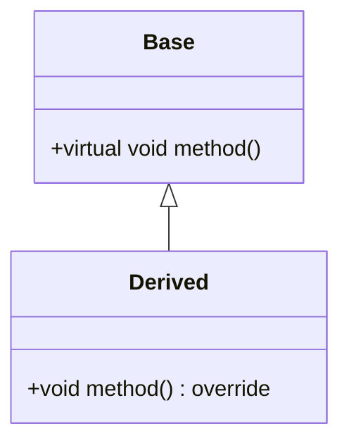

# C++ Primer Plus 第六版学习笔记创建计划

## 项目概述

基于 C++ Primer Plus 第六版（Stephen Prata 著）创建一套完整的学习笔记，帮助初学者快速掌握 C++ 核心知识并辅助深入学习。

## 目录结构

在 `d:\code\github\my-knowledge-base\笔记` 下创建：

```
C++ Primer Plus 第六版学习笔记/
├── book.md                    # 主索引文件：章节跳转、拓展学习、延伸阅读
├── assets/                    # 全局资源文件夹：存放图片资源
├── Chapter_01_预备知识.md       # 第1章笔记 (2500-3000行)
├── Chapter_02_开始学习C++.md    # 第2章笔记 (2500-3000行)
├── Chapter_03_处理数据.md       # 第3章笔记 (2500-3000行)
├── Chapter_04_复合类型.md       # 第4章笔记 (3000-3500行)
├── Chapter_05_循环和关系表达式.md # 第5章笔记 (2500-3000行)
├── Chapter_06_分支语句和逻辑运算符.md # 第6章笔记 (2500-3000行)
├── Chapter_07_函数_C++的编程模块.md # 第7章笔记 (3000-3500行)
├── Chapter_08_函数探幽.md       # 第8章笔记 (3000-3500行)
├── Chapter_09_内存模型和名称空间.md # 第9章笔记 (3000-4000行)
├── Chapter_10_对象和类.md       # 第10章笔记 (3500-4000行)
├── Chapter_11_使用类.md         # 第11章笔记 (3500-4000行)
├── Chapter_12_类和动态内存分配.md # 第12章笔记 (3500-4000行)
├── Chapter_13_类继承.md         # 第13章笔记 (3500-4000行)
├── Chapter_14_C++中的代码重用.md # 第14章笔记 (3500-4000行)
├── Chapter_15_友元异常和其他.md # 第15章笔记 (3000-3500行)
├── Chapter_16_string类和标准模板库.md # 第16章笔记 (3500-4000行)
├── Chapter_17_输入输出和文件.md # 第17章笔记 (3000-3500行)
└── Chapter_18_探讨C++新标准.md  # 第18章笔记 (3000-3500行)
```

## 内容规范

### 1. 章节字数要求
- **短章节**（内容较少）：2500-3000 行
- **中等章节**：3000-3500 行
- **长章节**（内容丰富）：3500-4000+ 行
- **一次性完成**，不进行二次追加

### 2. 核心知识点结构（三点式）
每个核心知识点必须包含：

#### 是什么（What）
- 精炼的概念介绍
- 定义和关键特征
- 简洁明了，避免冗长

#### 为什么（Why）
- 概念存在的原因
- 解决了什么问题
- 应用场景和必要性
- 与其他概念的对比

#### 怎么做（How）
- 具体实现方法
- 代码示例（带详细注释）
- 最佳实践
- 常见错误和陷阱

### 3. 格式规范

#### LaTeX 数学公式
- 行内公式：`$latex$`
- 独立行公式：`$$latex$$`
- 用于内存布局、指针运算、类层次等需要数学表达的内容

#### Mermaid 图表
当无法从 PDF 提取图片时，使用 Mermaid 绘制：
- **流程图**：程序执行流程、函数调用链
- **类图**：类的继承关系、组合关系
- **时序图**：对象交互过程
- **状态图**：对象状态转换
- **架构图**：系统整体架构

示例：


### 4. 代码示例规范
- 所有代码必须有详细注释
- 使用现代 C++ 特性（C++11/14/17）
- 展示常见错误和正确写法对比
- 包含完整的可运行示例

### 5. 不包含的内容
- ❌ 延伸阅读
- ❌ 下一章预习
- ✅ 只聚焦核心内容

## 执行步骤

### 阶段一：环境准备（已完成）
- [x] 安装 cpp-expert skill
- [x] 安装 pdf-ocr-extraction skill
- [x] 确认 PDF 文件位置：`d:\code\github\my-knowledge-base\书\code\cpp_primer_plus_6th.pdf`

### 阶段二：PDF 内容提取
1. 使用 pdf-ocr-extraction skill 尝试提取 PDF 文本内容
2. 如果提取失败或效果不佳，基于已知的 C++ Primer Plus 第六版大纲编写
3. 重点关注每章的核心知识点和代码示例

### 阶段三：创建目录结构
1. 创建主目录：`笔记/C++ Primer Plus 第六版学习笔记/`
2. 创建 assets 子目录：`笔记/C++ Primer Plus 第六版学习笔记/assets/`
3. 验证目录创建成功

### 阶段四：创建主索引文件 book.md
内容包含：
- 书籍基本信息（作者、出版社、版本）
- 学习目标和学习路径
- 18 个章节的快速导航链接
- C++ 知识体系全景图（Mermaid）
- 学习建议和方法论
- 常用资源链接

### 阶段五：逐章创建学习笔记

按照以下顺序创建 18 个章节文件：

#### 基础篇（第1-9章）
1. **Chapter_01_预备知识.md**
   - C++ 历史和发展
   - C++ 与 C 的关系
   - 编译流程详解
   - 第一个 C++ 程序

2. **Chapter_02_开始学习C++.md**
   - main() 函数
   - 注释、预处理指令
   - 命名空间
   - 输入输出（cout/cin）

3. **Chapter_03_处理数据.md**
   - 基本数据类型（int, float, double, char, bool）
   - const 限定符
   - 算术运算符
   - 类型转换

4. **Chapter_04_复合类型.md**
   - 数组
   - 字符串（C-style 和 string 类）
   - 结构体
   - 联合体
   - 枚举
   - 指针和自由存储
   - 指针算术

5. **Chapter_05_循环和关系表达式.md**
   - for 循环
   - while 循环
   - do-while 循环
   - 范围-based for 循环（C++11）
   - 嵌套循环

6. **Chapter_06_分支语句和逻辑运算符.md**
   - if 语句
   - 逻辑表达式
   - cctype 字符函数库
   - 条件运算符 ?:
   - switch 语句
   - break 和 continue

7. **Chapter_07_函数_C++的编程模块.md**
   - 函数定义和声明
   - 参数传递（值传递）
   - 函数和数组
   - 函数和结构体
   - 递归
   - 函数指针

8. **Chapter_08_函数探幽.md**
   - 内联函数
   - 引用变量
   - 默认参数
   - 函数重载
   - 函数模板

9. **Chapter_09_内存模型和名称空间.md**
   - 单独编译
   - 存储持续性（自动、静态、线程、动态）
   - 链接性（内部、外部）
   - 名称空间
   - using 声明和编译指令

#### 面向对象篇（第10-15章）
10. **Chapter_10_对象和类.md**
    - 类的定义
    - 构造函数和析构函数
    - this 指针
    - const 成员函数
    - 对象数组

11. **Chapter_11_使用类.md**
    - 运算符重载
    - 友元函数
    - 类型转换
    - 智能指针简介

12. **Chapter_12_类和动态内存分配.md**
    - 动态内存分配（new/delete）
    - 复制构造函数
    - 赋值运算符
    - 深拷贝 vs 浅拷贝
    - 移动语义（C++11）

13. **Chapter_13_类继承.md**
    - 继承基础
    - 派生类构造函数
    - 多态
    - 虚函数
    - 纯虚函数和抽象类

14. **Chapter_14_C++中的代码重用.md**
    - 包含对象成员的类
    - 私有继承
    - 保护继承
    - 多重继承
    - 类模板

15. **Chapter_15_友元异常和其他.md**
    - 友元深入
    - 嵌套类
    - 异常处理（try-catch-throw）
    - RTTI（运行时类型识别）
    - 类型转换运算符

#### 高级主题篇（第16-18章）
16. **Chapter_16_string类和标准模板库.md**
    - string 类详解
    - STL 容器（vector, list, deque, set, map）
    - STL 迭代器
    - STL 算法
    - 函数对象

17. **Chapter_17_输入输出和文件.md**
    - iostream 类层次
    - 格式化输出
    - 文件 I/O
    - 二进制文件
    - 随机访问

18. **Chapter_18_探讨C++新标准.md**
    - C++11 新特性
    - lambda 表达式
    - 右值引用和移动语义
    - 智能指针（unique_ptr, shared_ptr, weak_ptr）
    - constexpr
    - auto 和 decltype
    - 范围-based for 循环

### 阶段六：质量验证
对每个创建的章节文件：
1. 验证行数是否达到目标（2500-4000+ 行）
2. 检查是否包含"是什么、为什么、怎么做"三点式结构
3. 验证代码示例的完整性和正确性
4. 检查 Mermaid 图表是否正确渲染
5. 检查 LaTeX 公式语法是否正确

### 阶段七：最终检查
1. 验证所有 18 个章节文件都已创建
2. 验证 book.md 中的所有链接都有效
3. 检查 assets 目录是否有需要的资源文件
4. 整体审阅笔记的连贯性和完整性

## 技术要点

### 使用的 Skills
- **cpp-expert**: 提供 C++ 专业知识和最佳实践指导
- **pdf-ocr-extraction**: 尝试从 PDF 提取内容（备用方案）

### 工具使用
- **create_file**: 创建新文件
- **search_replace**: 编辑文件内容（当内容超过 1000 行时）
- **read_file**: 验证文件内容
- **run_in_terminal**: 验证文件行数

### 行数验证命令
```powershell
(Get-Content "file_path" | Measure-Object -Line).Lines
```

## 注意事项

1. **内容深度**：以初学者视角编写，但内容要足够深入，帮助读者真正理解
2. **代码质量**：所有代码示例必须是可运行的、符合现代 C++ 标准的
3. **图表使用**：优先使用 Mermaid 绘制清晰的图表，避免依赖 PDF 图片提取
4. **公式规范**：涉及内存地址计算、指针偏移等使用 LaTeX 公式
5. **一致性**：保持所有章节的格式、风格、术语使用一致
6. **实用性**：强调实际应用和常见问题的解决方案

## 预期成果

- 18 个高质量的 Markdown 学习笔记文件
- 1 个主索引文件（book.md）
- 总计约 55,000-65,000 行的详细学习笔记
- 涵盖 C++ Primer Plus 第六版的所有核心知识点
- 适合初学者快速入门和深入学习的完整参考资料
