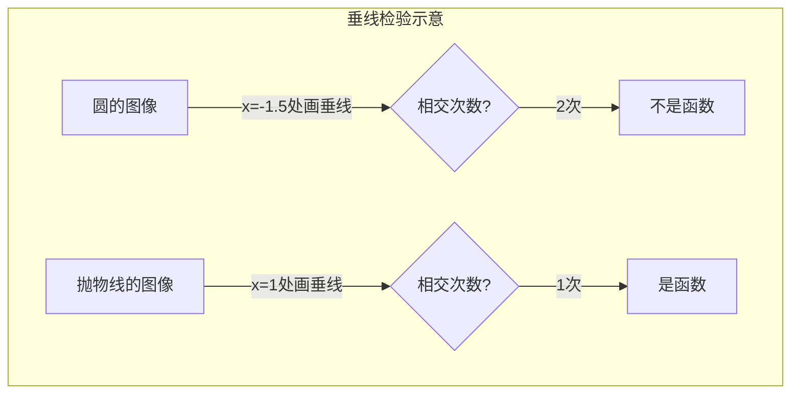
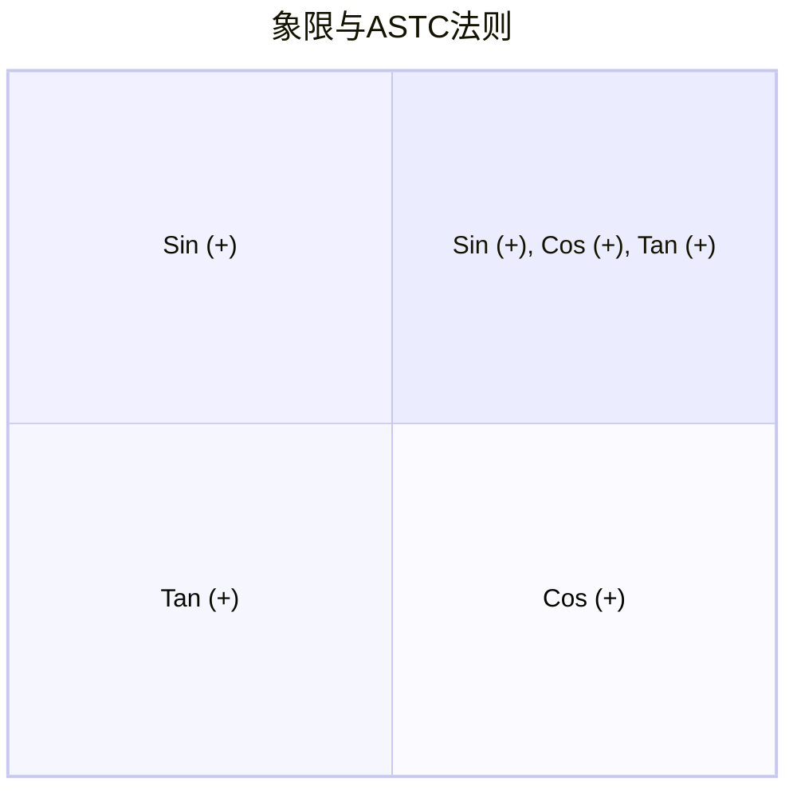
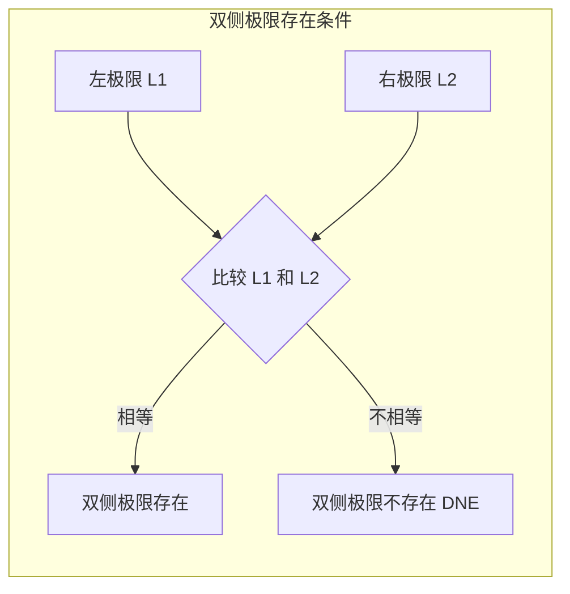
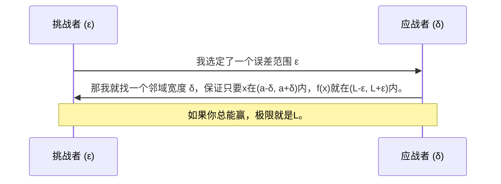
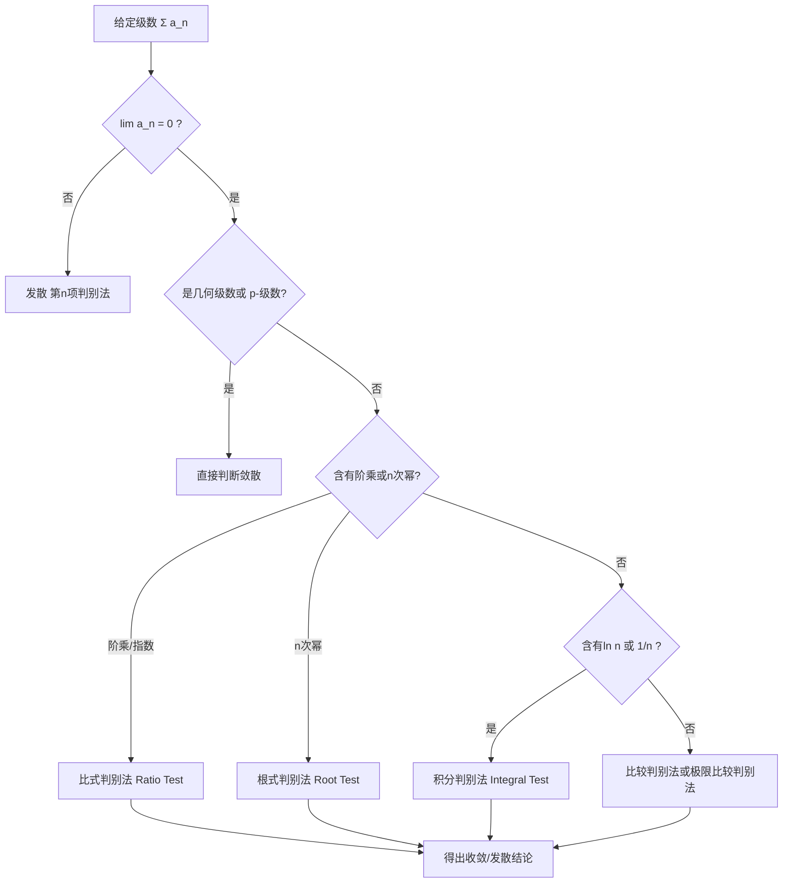

## 📚 目录导航 (Table of Contents)

- [第一部分：登山前的装备——微积分预备知识](#第一部分登山前的装备微积分预备知识)
    - [1.1 函数：微积分的唯一语言](#11-函数微积分的唯一语言)
    - [1.2 三角学：你必须唤醒的记忆](#12-三角学你必须唤醒的记忆)
    - [1.3 指数与对数：自然增长的密码](#13-指数与对数自然增长的密码)
- [第二部分：穿越迷雾——极限导论](#第二部分穿越迷雾极限导论)
    - [2.1 极限的直观：你在逼近什么？](#21-极限的直观你在逼近什么)
    - [2.2 极限的精确定义：ε-δ游戏](#22-极限的精确定义ε-δ游戏)
    - [2.3 求解极限的技巧](#23-求解极限的技巧)
    - [2.4 连续性与可导性](#24-连续性与可导性)
- [第三部分：微积分的核心——微分](#第三部分微积分的核心微分)
    - [3.1 导数的定义：瞬时变化率](#31-导数的定义瞬时变化率)
    - [3.2 求导法则：你的工具箱](#32-求导法则你的工具箱)
    - [3.3 三角函数的导数](#33-三角函数的导数)
    - [3.4 隐函数与相关变化率](#34-隐函数与相关变化率)
    - [3.5 指数与对数求导 & 双曲函数](#35-指数与对数求导--双曲函数)
- [第四部分：导数的威力——图像与应用](#第四部分导数的威力图像与应用)
    - [4.1 绘制函数图像的全攻略](#41-绘制函数图像的全攻略)
    - [4.2 最优化问题：寻找最佳方案](#42-最优化问题寻找最佳方案)
    - [4.3 线性化与牛顿法](#43-线性化与牛顿法)
    - [4.4 洛必达法则：极限的救星](#44-洛必达法则极限的救星)
- [第五部分：另一半旅程——积分](#第五部分另一半旅程积分)
    - [5.1 定积分的定义：从黎曼和开始](#51-定积分的定义从黎曼和开始)
    - [5.2 微积分基本定理：微分与积分的桥梁](#52-微积分基本定理微分与积分的桥梁)
    - [5.3 不定积分与换元法](#53-不定积分与换元法)
- [第六部分：积分的内功心法——技巧大全](#第六部分积分的内功心法技巧大全)
    - [6.1 分部积分法 (Integration by Parts)](#61-分部积分法-integration-by-parts)
    - [6.2 三角积分的技巧](#62-三角积分的技巧)
    - [6.3 三角换元法：根号的克星](#63-三角换元法根号的克星)
    - [6.4 部分分式法：有理函数的解剖](#64-部分分式法有理函数的解剖)
- [第七部分：积分的延伸——反常积分与应用](#第七部分积分的延伸反常积分与应用)
    - [7.1 反常积分：当区间或函数无界时](#71-反常积分当区间或函数无界时)
    - [7.2 体积、弧长与表面积](#72-体积弧长与表面积)
- [第八部分：无限之和——数列与级数](#第八部分无限之和数列与级数)
    - [8.1 数列与级数的收敛性](#81-数列与级数的收敛性)
    - [8.2 泰勒级数与幂级数：函数的无限逼近](#82-泰勒级数与幂级数函数的无限逼近)
- [第九部分：变化的方程——微分方程入门](#第九部分变化的方程微分方程入门)
- [附录：常用积分表与证明思路](#附录常用积分表与证明思路)

---

## 第一部分：登山前的装备——微积分预备知识

*教授注：如果你连函数的定义都含糊，或者忘记了正弦的图像，那么微积分对你来说将是一场灾难。请在继续之前，确保你对本章内容了如指掌。*

### 1.1 函数：微积分的唯一语言

函数是将一个输入转化为唯一输出的规则。这是微积分研究的**对象**。

- **定义域 (Domain)**：所有有效输入的集合。
- **值域 (Range)**：所有可能输出的集合。
- **垂线检验 (Vertical Line Test)**：判断一个图像是否是函数。如果画一条垂线，与图像相交超过一次，则不是函数。



*此处应有一张对比圆（非函数）和抛物线（函数）的垂线检验示意图。*

**常见函数类型一览表：**

| 类型 | 示例 | 特征 | 微积分中的注意事项 |
| :--- | :--- | :--- | :--- |
| **多项式** | $f(x)=x^3-2x+1$ | 平滑，连续 | 求导后次数降低，极易处理 |
| **有理函数** | $f(x)=\frac{x+1}{x-2}$ | 可能有垂直渐近线 | 注意分母为零的点，那是**奇点** |
| **指数函数** | $f(x)=e^x$ | 增长极快 | 导数等于自身，是微积分的“明星” |
| **对数函数** | $f(x)=\ln(x)$ | 增长极慢 | 定义域 $x>0$，是 $\frac{1}{x}$ 积分的答案 |
| **带绝对值的函数** | $f(x)=\|x-3\|$ | 有尖角 | 在尖角处**不可导** |

**反函数 (Inverse Functions)**：
若函数 $f$ 满足**水平线检验**（每条水平线与图像至多交于一点），则存在反函数 $f^{-1}$。求反函数的关键步骤：写出 $y=f(x)$，交换 $x$ 和 $y$，解出 $y$。图像上，$f$ 与 $f^{-1}$ 关于直线 $y=x$ 对称。

### 1.2 三角学：你必须唤醒的记忆

*教授注：忘记弧度制、记不住特殊角的值，是大多数学生在微积分中翻车的第一块绊脚石。*

- **弧度制 (Radians)**：$180^\circ = \pi \text{ rad}$。这是微积分的**唯一**角度单位，因为 $\lim_{x\to 0} \frac{\sin x}{x} = 1$ 仅在弧度制下成立。
- **ASTC法则**：记忆各象限三角函数的正负号。
    - **A**ll (I): 全正
    - **S**ine (II): 正弦为正
    - **T**angent (III): 正切为正
    - **C**osine (IV): 余弦为正



**必须刻在脑海里的特殊角三角函数值表：**

| $\theta$ (rad) | $0$ | $\frac{\pi}{6}$ | $\frac{\pi}{4}$ | $\frac{\pi}{3}$ | $\frac{\pi}{2}$ |
| :--- | :--- | :--- | :--- | :--- | :--- |
| $\sin\theta$ | $0$ | $\frac{1}{2}$ | $\frac{\sqrt{2}}{2}$ | $\frac{\sqrt{3}}{2}$ | $1$ |
| $\cos\theta$ | $1$ | $\frac{\sqrt{3}}{2}$ | $\frac{\sqrt{2}}{2}$ | $\frac{1}{2}$ | $0$ |
| $\tan\theta$ | $0$ | $\frac{\sqrt{3}}{3}$ | $1$ | $\sqrt{3}$ | 无定义 |

**核心恒等式 (毕达哥拉斯定理)**：
$$\sin^2 x + \cos^2 x = 1$$
$$1 + \tan^2 x = \sec^2 x$$
$$1 + \cot^2 x = \csc^2 x$$

### 1.3 指数与对数：自然增长的密码

- **指数法则**：$b^x b^y = b^{x+y}$，$(b^x)^y = b^{xy}$。
- **自然底数 $e$**：定义为 $\lim_{n\to\infty} \left(1 + \frac{1}{n}\right)^n \approx 2.71828$。它之所以“自然”，是因为 $\frac{d}{dx}e^x = e^x$。
- **对数法则**：$\log_b(xy) = \log_b x + \log_b y$。特别地，$\ln(xy) = \ln x + \ln y$。
- **指数与对数互为反函数**：$e^{\ln x} = x$（$x>0$），$\ln(e^x) = x$。

---

## 第二部分：穿越迷雾——极限导论

*教授注：极限是微积分大厦的地基。如果你不理解“逼近”的含义，导数与积分将永远是空中楼阁。*

### 2.1 极限的直观：你在逼近什么？

**极限 (Limit)** 描述的是：当 $x$ 无限接近（但不等于）某个值 $a$ 时，函数 $f(x)$ 趋近于什么值。

$$\lim_{x \to a} f(x) = L$$

**⚠️ 教授警示**：
1. 极限关心的是 $x$ **附近**的行为，与 $f(a)$ 本身的值**毫无关系**。
2. **左极限与右极限**：只有当左极限 ($x \to a^-$) 和右极限 ($x \to a^+$) **存在且相等**时，双侧极限才存在。



**三明治定理 (夹逼定理)**：
若 $g(x) \le f(x) \le h(x)$ 且 $\lim g(x) = \lim h(x) = L$，则 $\lim f(x) = L$。这是处理 $\frac{\sin x}{x}$ 和振荡函数极限的利器。

### 2.2 极限的精确定义：ε-δ游戏

*教授注：如果你不打算成为专业数学家，理解这个游戏的思路即可，不必深陷证明。*

**$\lim_{x \to a} f(x) = L$ 的 $\epsilon-\delta$ 定义**：
对于任意给定的 $\epsilon > 0$（无论多小），总存在一个 $\delta > 0$，使得当 $0 < |x - a| < \delta$ 时，必有 $|f(x) - L| < \epsilon$。



### 2.3 求解极限的技巧

1. **直接代入法**：如果函数在 $a$ 处连续，直接代入 $x=a$。
2. **因式分解与有理化**：处理 $\frac{0}{0}$ 型不定式。例如：$\lim_{x \to 2} \frac{x^2-4}{x-2} = \lim_{x \to 2} (x+2) = 4$。
3. **当 $x \to \infty$ 时的有理函数**：**最高次项决定一切**。
    - 分子次数高：极限为 $\pm \infty$。
    - 分母次数高：极限为 $0$。
    - 次数相等：极限为最高次项系数之比。
4. **三角函数的特殊极限**：
    - $\lim_{x \to 0} \frac{\sin x}{x} = 1$（**必须滚瓜烂熟！**）
    - $\lim_{x \to 0} \frac{1 - \cos x}{x} = 0$

### 2.4 连续性与可导性

- **连续性 (Continuity)**：$\lim_{x \to a} f(x) = f(a)$。直观上，图像在 $x=a$ 处**不断开**。
- **介值定理 (IVT)**：若 $f$ 在 $[a,b]$ 连续且 $f(a) < 0 < f(b)$，则在 $(a,b)$ 内必有一点 $c$ 使 $f(c)=0$。这是**寻找方程根的保证**。
- **可导性 (Differentiability)**：导数 $f'(a) = \lim_{h \to 0} \frac{f(a+h)-f(a)}{h}$ 存在。直观上，图像在 $x=a$ 处**光滑无尖角**。
- **核心结论**：**可导必连续，连续未必可导**（例如 $y=|x|$ 在 $x=0$ 处连续但不可导）。

---

## 第三部分：微积分的核心——微分

*教授注：这是你手中最锋利的刀。掌握它，你就能剖析任何函数的变化细节。*

### 3.1 导数的定义：瞬时变化率

**定义**：
$$f'(x) = \lim_{h \to 0} \frac{f(x+h) - f(x)}{h} = \lim_{\Delta x \to 0} \frac{\Delta y}{\Delta x}$$

**几何意义**：曲线 $y=f(x)$ 在点 $(x, f(x))$ 处**切线的斜率**。
**物理意义**：若 $s(t)$ 为位移，则 $v(t) = s'(t)$ 为**瞬时速度**；$a(t) = v'(t) = s''(t)$ 为**加速度**。

### 3.2 求导法则：你的工具箱

*教授注：没人会用定义去求 $x^{100}$ 的导数。法则让你事半功倍。*

| 法则 | 公式 | 口诀 |
| :--- | :--- | :--- |
| **常数倍** | $\frac{d}{dx}[c \cdot f(x)] = c \cdot f'(x)$ | 常数提出去 |
| **和差法则** | $\frac{d}{dx}[f(x) \pm g(x)] = f'(x) \pm g'(x)$ | 分别求导再加减 |
| **幂法则** | $\frac{d}{dx}[x^n] = n x^{n-1}$ | 指数下拉，次数减一 |
| **乘积法则** | $\frac{d}{dx}[u v] = u'v + uv'$ | 前导后不导 + 前不导后导 |
| **商法则** | $\frac{d}{dx}\left[\frac{u}{v}\right] = \frac{u'v - uv'}{v^2}$ | (上导下不导 - 上不导下导) / 下平方 |
| **链式法则** | $\frac{d}{dx}[f(g(x))] = f'(g(x)) \cdot g'(x)$ | 由外向内，层层求导 |

**链式法则的直观理解**：
$$\frac{dy}{dx} = \frac{dy}{du} \cdot \frac{du}{dx}$$
*同学们请注意，这里的 $du$ 并不是真的可以像分数一样约掉，但在计算中这样想是个极好的记忆窍门。*

### 3.3 三角函数的导数

*教授注：又是需要死记硬背的一组公式，注意**负号**！*

$$\frac{d}{dx} \sin x = \cos x$$
$$\frac{d}{dx} \cos x = -\sin x \quad \text{← 注意负号！}$$
$$\frac{d}{dx} \tan x = \sec^2 x$$
$$\frac{d}{dx} \sec x = \sec x \tan x$$
$$\frac{d}{dx} \csc x = -\csc x \cot x \quad \text{← 注意负号！}$$
$$\frac{d}{dx} \cot x = -\csc^2 x \quad \text{← 注意负号！}$$

*教授技巧：所有带“Co”的三角函数（Cosine, Cotangent, Cosecant），求导后都要**加个负号**。*

### 3.4 隐函数与相关变化率

**隐函数求导 (Implicit Differentiation)**：
当 $y$ 无法显式表达为 $x$ 的函数时（如 $x^2 + y^2 = 1$），方程两边直接对 $x$ 求导，遇到 $y$ 就乘以 $y'$（链式法则）。
$$2x + 2y \cdot y' = 0 \implies y' = -\frac{x}{y}$$

**相关变化率 (Related Rates)**：
现实世界中，变量随时间 $t$ 变化。将关联方程对 $t$ 求导（所有变量都看作 $t$ 的函数）。
例如，圆的面积 $A = \pi r^2$，两边对 $t$ 求导：$\frac{dA}{dt} = 2\pi r \frac{dr}{dt}$。这揭示了面积变化率与半径变化率的关系。

### 3.5 指数与对数求导 & 双曲函数

- **指数函数**：$\frac{d}{dx} e^x = e^x$（惊艳！）
    - $\frac{d}{dx} a^x = a^x \ln a$
- **对数函数**：$\frac{d}{dx} \ln x = \frac{1}{x}$
    - $\frac{d}{dx} \log_a x = \frac{1}{x \ln a}$
- **对数求导法 (Logarithmic Differentiation)**：处理形如 $y = x^x$ 的“底指双变量”函数。两边取对数：$\ln y = x \ln x$，然后隐函数求导。
- **双曲函数**：模仿三角函数的一类指数函数组合。
    - $\sinh x = \frac{e^x - e^{-x}}{2}$，$\cosh x = \frac{e^x + e^{-x}}{2}$
    - 导数规律与三角函数类似，但**没有负号**：$\frac{d}{dx}\sinh x = \cosh x$。

---

## 第四部分：导数的威力——图像与应用

*教授注：现在，让我们看看这把刀能切开怎样的难题。*

### 4.1 绘制函数图像的全攻略

利用 $f'$ 和 $f''$ 绘制精准图像是导数的核心应用之一。

```mermaid
graph TD
    A[原函数 f(x)] --> B[一阶导数 f'(x)];
    A --> C[二阶导数 f''(x)];
    B -->|f'(x) > 0| D[增函数];
    B -->|f'(x) < 0| E[减函数];
    B -->|f'(x) = 0 或不存在| F[临界点];
    C -->|f''(x) > 0| G[凹向上 (Concave Up)];
    C -->|f''(x) < 0| H[凹向下 (Concave Down)];
    C -->|f''(x) = 0| I[可能的拐点];
    F --> J{一阶导符号变化?};
    J -->|由正变负| K[局部极大值];
    J -->|由负变正| L[局部极小值];
    J -->|不变号| M[水平拐点];
```

**绘制步骤清单：**
1. **定义域与对称性**：奇偶性。
2. **截距**：$x$ 轴、$y$ 轴交点。
3. **渐近线**：垂直（分母零点）、水平/斜（$x \to \pm\infty$ 极限）。
4. **一阶导分析**：求临界点，画符号表，确定增减区间与极值。
5. **二阶导分析**：求可能拐点，画符号表，确定凹性。
6. **描点连线**。

### 4.2 最优化问题：寻找最佳方案

**步骤**：
1. 识别变量，画图。
2. 写出**目标方程**（你要最大/最小化的量，如面积 $A$）和**约束方程**（限制条件，如周长固定）。
3. 利用约束方程消元，将目标量表示为**单变量函数** $A(x)$。
4. 求 $A'(x)$，找临界点，验证是最大值还是最小值（通常用二阶导测试：$A'' < 0$ 为极大，$A'' > 0$ 为极小）。

### 4.3 线性化与牛顿法

**线性近似 (Linearization)**：在 $x=a$ 附近，用切线 $L(x) = f(a) + f'(a)(x-a)$ 代替曲线 $f(x)$。这是**以直代曲**的智慧。
**牛顿法 (Newton's Method)**：解方程 $f(x)=0$ 的迭代利器。
$$x_{n+1} = x_n - \frac{f(x_n)}{f'(x_n)}$$
*教授警示：如果初始猜测 $x_0$ 离根太远，或者 $f'(x_n)$ 接近 0，牛顿法可能会失效甚至发散。*

### 4.4 洛必达法则：极限的救星

当遇到 $\frac{0}{0}$ 或 $\frac{\infty}{\infty}$ 不定式时：
$$\lim_{x \to a} \frac{f(x)}{g(x)} \overset{\text{L'H}}{=} \lim_{x \to a} \frac{f'(x)}{g'(x)}$$
**⚠️ 常见误区警示**：
- **必须先验证是不定式！** 绝对不要对 $\frac{1}{0}$ 使用洛必达。
- 只对分子分母**分别求导**，**不是**对分式使用商法则。
- 对于 $0 \cdot \infty$，$\infty - \infty$，$1^\infty$ 等类型，需先变形为 $\frac{0}{0}$ 或 $\frac{\infty}{\infty}$。

---

## 第五部分：另一半旅程——积分

*教授注：如果说微分是“分”，积分就是“合”。它们是互逆的运算，如同加法与减法。*

### 5.1 定积分的定义：从黎曼和开始

**定积分 (Definite Integral)** 计算的是曲线下的**有向面积**。
$$\int_a^b f(x) dx = \lim_{\text{mesh} \to 0} \sum_{j=1}^n f(c_j) (x_j - x_{j-1})$$
这个极限就是**黎曼和**。将区间切成无数个细条，求面积和。

```mermaid
graph LR
    subgraph 黎曼和思想
    A[分割区间为 n 个小矩形] --> B{矩形条宽度趋近于 0};
    B --> C[近似面积 = 和_ i=1^n f(c_i) Δx_i];
    C --> D[极限即为精确积分值];
    end
```

*此处应有一张曲线下矩形逼近的示意图，当 $n \to \infty$ 时逼近精确面积。*

**定积分性质**：
- $\int_a^b c f(x) dx = c \int_a^b f(x) dx$
- $\int_a^b [f(x) \pm g(x)] dx = \int_a^b f(x) dx \pm \int_a^b g(x) dx$
- $\int_a^b f(x) dx = \int_a^c f(x) dx + \int_c^b f(x) dx$

### 5.2 微积分基本定理：微分与积分的桥梁

这是人类智慧的结晶，它揭示了微分与积分的内在联系。

**第一基本定理 (FTC 1)**：
若 $F(x) = \int_a^x f(t) dt$，则 $F'(x) = f(x)$。
*教授解读：**积分的导数就是原来的函数**。换句话说，积分运算抵消了微分运算。*

**第二基本定理 (FTC 2)**：
若 $F$ 是 $f$ 的任意一个原函数（即 $F' = f$），则
$$\int_a^b f(x) dx = F(b) - F(a) = \left[ F(x) \right]_a^b$$
*教授解读：**计算定积分，只需要找到一个原函数，然后代入上下限相减**。正是这条定理，把你从繁琐的黎曼和地狱中解救了出来！*

### 5.3 不定积分与换元法

**不定积分 (Indefinite Integral)**：所有原函数的集合。
$$\int f(x) dx = F(x) + C$$
*教授警示：**千万不要忘记 $+C$**！忘记常数项是考试扣分的头号杀手。*

**换元法 (Substitution)**：对应链式法则的积分技巧。
$$\int f(g(x)) g'(x) dx = \int f(u) du \quad (\text{令 } u = g(x))$$
*教授技巧：找谁作 $u$？**谁被关在复杂的函数里面（比如根号、分母、指数），谁就是 $u$**。然后看看它的导数 $du$ 是不是就在旁边。*

---

## 第六部分：积分的内功心法——技巧大全

*教授注：上一章的换元法只是第一式。接下来的心法若你能融会贯通，积分将再无难事。*

### 6.1 分部积分法 (Integration by Parts)

对应乘积法则的积分技巧。
$$\int u dv = uv - \int v du$$
**选 $u$ 的口诀 (LIATE)**：
**L**ogarithmic (对数)
**I**nverse trig (反三角)
**A**lgebraic (代数多项式)
**T**rigonometric (三角)
**E**xponential (指数)
*排在前面的优先选作 $u$。* 例如 $\int x e^x dx$，$x$ 是代数(A)，$e^x$ 是指数(E)，A在E前，故选 $u=x, dv=e^x dx$。

### 6.2 三角积分的技巧

处理 $\int \sin^m x \cos^n x dx$：
- **如果 $m$ 或 $n$ 是奇数**：拆出一个一次项，利用 $\sin^2 x + \cos^2 x = 1$ 将剩余部分转化为另一种函数，然后用换元法。
- **如果 $m$ 和 $n$ 都是偶数**：使用**半角公式**降次。
    - $\sin^2 x = \frac{1 - \cos 2x}{2}$
    - $\cos^2 x = \frac{1 + \cos 2x}{2}$

### 6.3 三角换元法：根号的克星

当被积函数含有以下根式时，用三角换元将其转化为三角积分：

| 根式形式 | 换元 | 理由 | 三角形示意 (Mermaid已尽力, 请脑补) |
| :--- | :--- | :--- | :--- |
| $\sqrt{a^2 - x^2}$ | $x = a \sin \theta$ | $a^2 - a^2\sin^2\theta = a^2\cos^2\theta$ | 斜边 $a$，对边 $x$，邻边 $\sqrt{a^2-x^2}$ |
| $\sqrt{a^2 + x^2}$ | $x = a \tan \theta$ | $a^2 + a^2\tan^2\theta = a^2\sec^2\theta$ | 邻边 $a$，对边 $x$，斜边 $\sqrt{a^2+x^2}$ |
| $\sqrt{x^2 - a^2}$ | $x = a \sec \theta$ | $a^2\sec^2\theta - a^2 = a^2\tan^2\theta$ | 邻边 $a$，斜边 $x$，对边 $\sqrt{x^2-a^2}$ |

### 6.4 部分分式法：有理函数的解剖

对于有理函数 $\frac{P(x)}{Q(x)}$：
1. **真分式化**：若分子次数 $\ge$ 分母次数，先做**多项式长除法**。
2. **分母因式分解**。
3. **写出部分分式形式**：
    - 线性因子 $(ax+b)$：对应 $\frac{A}{ax+b}$。
    - 重复线性因子 $(ax+b)^k$：对应 $\frac{A_1}{ax+b} + \frac{A_2}{(ax+b)^2} + \dots + \frac{A_k}{(ax+b)^k}$。
    - 二次因子 $(ax^2+bx+c)$：对应 $\frac{Ax+B}{ax^2+bx+c}$。
4. **通分求解系数**。

---

## 第七部分：积分的延伸——反常积分与应用

### 7.1 反常积分：当区间或函数无界时

**类型 1 (无穷区间)**：
$$\int_a^\infty f(x) dx = \lim_{N \to \infty} \int_a^N f(x) dx$$
若极限存在，则**收敛**；否则**发散**。

**类型 2 (无界函数/垂直渐近线)**：
若 $\lim_{x \to a^+} f(x) = \pm \infty$，则
$$\int_a^b f(x) dx = \lim_{\epsilon \to 0^+} \int_{a+\epsilon}^b f(x) dx$$

**收敛性判别法**：
- **比较判别法**：若 $0 \le f(x) \le g(x)$，$g$ 收敛则 $f$ 收敛；$f$ 发散则 $g$ 发散。
- **$p$-判别法**：
    - $\int_1^\infty \frac{1}{x^p} dx$ 当 $p>1$ 收敛，$p \le 1$ 发散。
    - $\int_0^1 \frac{1}{x^p} dx$ 当 $p<1$ 收敛，$p \ge 1$ 发散。

### 7.2 体积、弧长与表面积

**体积**：
- **圆盘法 (Disc Method)**：绕 $x$ 轴旋转，$V = \int_a^b \pi y^2 dx$。
- **壳法 (Shell Method)**：绕 $y$ 轴旋转，$V = \int_a^b 2\pi x y dx$。

**弧长 (Arc Length)**：
$$L = \int_a^b \sqrt{1 + \left( \frac{dy}{dx} \right)^2} dx$$
或参数形式 $L = \int_{t_1}^{t_2} \sqrt{\left( \frac{dx}{dt} \right)^2 + \left( \frac{dy}{dt} \right)^2} dt$。

---

## 第八部分：无限之和——数列与级数

*教授注：将无限个数加在一起，得到一个有限的结果。这是级数的魔力，也是微积分最深邃的应用。*

### 8.1 数列与级数的收敛性

**数列极限**：$\lim_{n \to \infty} a_n = L$。
**无穷级数**：$\sum_{n=1}^\infty a_n = \lim_{N \to \infty} \sum_{n=1}^N a_n$。

**几何级数**：$\sum_{n=0}^\infty ar^n = \frac{a}{1-r}$，当 $|r| < 1$ 时收敛。

**判别法流程图**：



**交错级数判别法 (Alternating Series Test)**：
若 $a_n$ 递减且 $\lim a_n = 0$，则 $\sum (-1)^n a_n$ **收敛**。这是**条件收敛**的典型来源。

### 8.2 泰勒级数与幂级数：函数的无限逼近

**泰勒级数 (Taylor Series)**：用多项式逼近光滑函数。
$$f(x) = \sum_{n=0}^\infty \frac{f^{(n)}(a)}{n!} (x-a)^n$$
当 $a=0$ 时，称为**麦克劳林级数 (Maclaurin Series)**。

**必须背诵的麦克劳林级数**：
1. $e^x = \sum_{n=0}^\infty \frac{x^n}{n!} = 1 + x + \frac{x^2}{2!} + \frac{x^3}{3!} + \dots$
2. $\sin x = \sum_{n=0}^\infty \frac{(-1)^n x^{2n+1}}{(2n+1)!} = x - \frac{x^3}{3!} + \frac{x^5}{5!} - \dots$
3. $\cos x = \sum_{n=0}^\infty \frac{(-1)^n x^{2n}}{(2n)!} = 1 - \frac{x^2}{2!} + \frac{x^4}{4!} - \dots$
4. $\frac{1}{1-x} = \sum_{n=0}^\infty x^n = 1 + x + x^2 + x^3 + \dots \quad (|x| < 1)$

**泰勒定理 (误差估算)**：
$$R_n(x) = \frac{f^{(n+1)}(c)}{(n+1)!} (x-a)^{n+1}$$
*教授注：这告诉我们，用 $n$ 阶泰勒多项式近似的误差有多大。c 是介于 a 和 x 之间的某个数。*

---

## 第九部分：变化的方程——微分方程入门

**微分方程 (Differential Equation)**：含有导数的方程。

**1. 可分离变量的一阶方程**：
$$\frac{dy}{dx} = f(x)g(y) \implies \int \frac{1}{g(y)} dy = \int f(x) dx$$

**2. 一阶线性方程**：$\frac{dy}{dx} + P(x)y = Q(x)$
**积分因子**：$I(x) = e^{\int P(x) dx}$。两边乘以 $I(x)$ 后，左边变为 $(I(x)y)'$，直接积分即可。

**3. 常系数齐次线性方程**：$ay'' + by' + cy = 0$
- 写出特征方程：$ar^2 + br + c = 0$。
- 根据根 $r_1, r_2$ 的情况写出通解：
    - 两不等实根：$y = C_1 e^{r_1 x} + C_2 e^{r_2 x}$
    - 重根 $r$：$y = (C_1 + C_2 x) e^{rx}$
    - 共轭复根 $\alpha \pm i\beta$：$y = e^{\alpha x}(C_1 \cos \beta x + C_2 \sin \beta x)$

---

## 附录：常用积分表与证明思路

*教授注：这里列出的是你行走微积分江湖必须随身携带的“兵器谱”。*

**常用积分公式 (节选)**：
1. $\int x^n dx = \frac{x^{n+1}}{n+1} + C \quad (n \neq -1)$
2. $\int \frac{1}{x} dx = \ln |x| + C$
3. $\int e^x dx = e^x + C$
4. $\int \sin x dx = -\cos x + C$
5. $\int \cos x dx = \sin x + C$
6. $\int \sec^2 x dx = \tan x + C$
7. $\int \frac{1}{1+x^2} dx = \arctan x + C$
8. $\int \frac{1}{\sqrt{1-x^2}} dx = \arcsin x + C$

**核心定理证明思路简表**：

| 定理 | 证明核心思想 |
| :--- | :--- |
| **罗尔定理** | 连续函数在闭区间必有最大值和最小值，极值点处导数为零。 |
| **中值定理** | 构造辅助函数 $h(x) = f(x) - \frac{f(b)-f(a)}{b-a}(x-a)$，应用罗尔定理。 |
| **微积分基本定理 (FTC 1)** | 利用积分中值定理：$\frac{1}{h} \int_x^{x+h} f(t) dt = f(c)$，令 $h \to 0$。 |
| **洛必达法则** | 利用柯西中值定理：$\frac{f(x)}{g(x)} = \frac{f'(\xi)}{g'(\xi)}$。 |
| **泰勒定理** | 反复应用柯西中值定理或积分余项形式。 |
