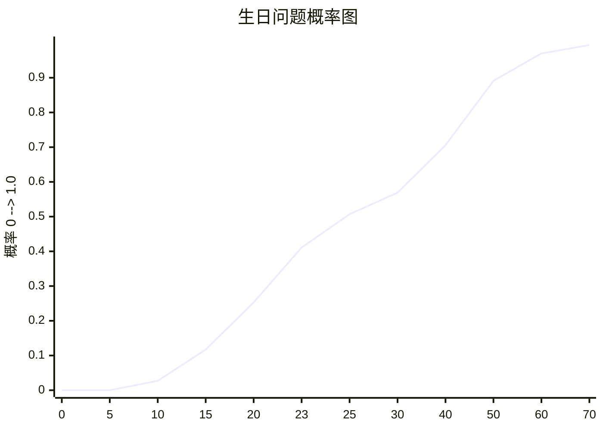
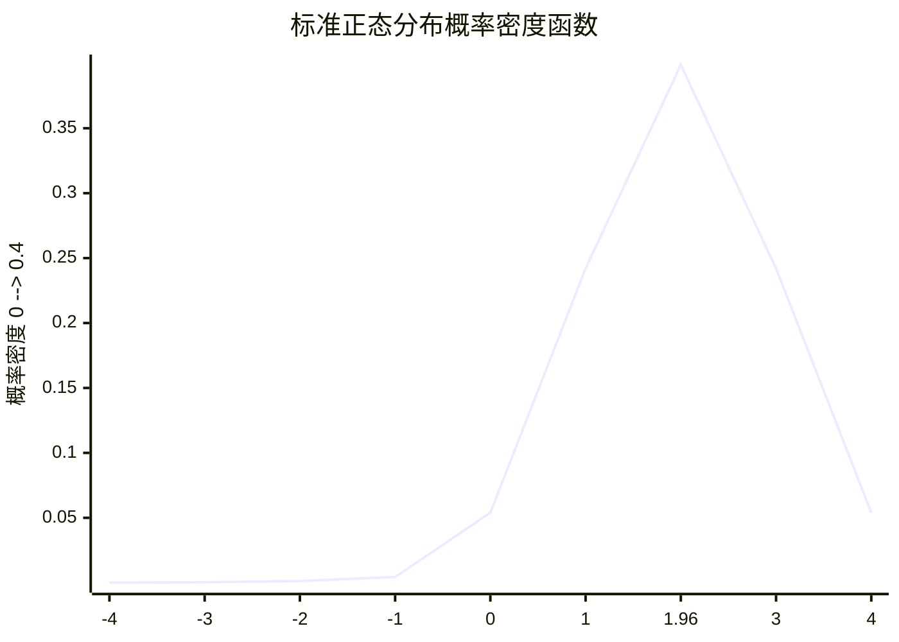
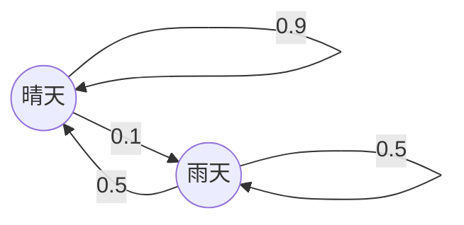

**目录**

1.  [第一部分：一般性理论——概率的基石](#第一部分一般性理论概率的基石)
    - 1.1. [引论：从有趣的谜题开始](#11-引论从有趣的谜题开始)
    - 1.2. [基本概率定律：建立严谨的语言](#12-基本概率定律建立严谨的语言)
    - 1.3. [计数法则I：排列与组合的艺术](#13-计数法则i排列与组合的艺术)
    - 1.4. [条件概率、独立性与贝叶斯定理：信息的价值](#14-条件概率独立性与贝叶斯定理信息的价值)
    - 1.5. [计数法则II & III：容斥原理与高等组合学](#15-计数法则ii--iii容斥原理与高等组合学)
2.  [第二部分：随机变量——不确定性世界的量化](#第二部分随机变量不确定性世界的量化)
    - 2.1. [随机变量：定义与类型](#21-随机变量定义与类型)
    - 2.2. [期望：随机变量的“中心”](#22-期望随机变量的中心)
    - 2.3. [方差与矩：衡量波动与形状](#23-方差与矩衡量波动与形状)
    - 2.4. [联合分布与独立性（进阶）](#24-联合分布与独立性进阶)
    - 2.5. [工具：卷积与变量替换](#25-工具卷积与变量替换)
    - 2.6. [工具：微分恒等式——强大的矩生成术](#26-工具微分恒等式强大的矩生成术)
3.  [第三部分：特殊分布——概率模型的主角们](#第三部分特殊分布概率模型的主角们)
    - 3.1. [离散分布族](#31-离散分布族)
    - 3.2. [连续分布族：均匀与指数](#32-连续分布族均匀与指数)
    - 3.3. [连续分布族：至高无上的正态分布](#33-连续分布族至高无上的正态分布)
    - 3.4. [伽马函数与相关分布](#34-伽马函数与相关分布)
    - 3.5. [卡方分布](#35-卡方分布)
4.  [第四部分：极限定理——从量变到质变](#第四部分极限定理从量变到质变)
    - 4.1. [不等式：不确定性的边界](#41-不等式不确定性的边界)
    - 4.2. [大数定律：频率的稳定性](#42-大数定律频率的稳定性)
    - 4.3. [中心极限定理：通向正态的王者之路](#43-中心极限定理通向正态的王者之路)
    - 4.4. [生成函数与特征函数：强大的分析工具](#44-生成函数与特征函数强大的分析工具)
5.  [第五部分：其他主题——概率论的延伸](#第五部分其他主题概率论的延伸)
    - 5.1. [假设检验：数据驱动的决策](#51-假设检验数据驱动的决策)
    - 5.2. [马尔可夫链：无记忆的随机过程](#52-马尔可夫链无记忆的随机过程)
    - 5.3. [最小二乘法：寻找最佳拟合](#53-最小二乘法寻找最佳拟合)
6.  [附录：证明技巧与数学基础](#附录证明技巧与数学基础)

---

### **第一部分：一般性理论——概率的基石**

#### **1.1. 引论：从有趣的谜题开始**

*同学们，我们不从枯燥的定义开始。我们先来玩几个游戏，感受一下概率论的魅力。*

**1.1.1 生日问题**

*问题：* 一间屋子里至少要有多少人，才能使得其中两个人的生日在同一天的概率大于 `50%`？

*教授引导：你们猜猜看？很多人会想，一年365天，大概得180多人吧。错！答案是只需要 **23** 个人！*

*   **核心思想**：直接计算“至少两人生日相同”很复杂，因为有2人相同、3人相同……等等无数种情况。*请注意，这里有一个非常容易混淆的陷阱*。聪明的做法是计算其对立事件——**所有人生日都不相同**的概率。
*   **计算过程**：
    1.  假设人逐个进入房间。
    2.  第1个人：生日任意，概率为 `365/365 = 1`。
    3.  第2个人：必须和第1个人不同，概率为 `364/365`。
    4.  第3个人：必须和前2人都不同，概率为 `363/365`。
    5.  ...
    6.  第 $n$ 个人：必须和前 $n-1$ 人都不同，概率为 $(365 - n + 1) / 365$。
*   **结果**：
    $$P(\text{所有人生日不同}) = \frac{365}{365} \times \frac{364}{365} \times \dots \times \frac{365 - n + 1}{365}$$
    当 $n=23$ 时，这个概率首次小于 `50%` (约 `49.3%`)，所以“至少两人生日相同”的概率就大于 `50%` 了。

*   **效率的推广**：*我们不妨换个几何视角来理解这个公式。* 如果我们想保证概率为 `50%`，大约需要多少人？利用微积分近似（泰勒展开 $\log(1-x) \approx -x$），可以得到一个简洁的公式：$n \approx \sqrt{D \cdot 2 \log 2}$，其中 $D$ 是一年的总天数。对于地球，$D=365$，$n \approx 22.49$，非常精确！

*此处需插入生日问题概率变化示意图：*

*描述：曲线显示了随着人数n的增加，至少两人生日相同的概率迅速上升。在n=23时曲线越过0.5的临界线。*

**1.1.2 从投篮到几何级数**

*问题：* 拉里·伯德（命中率 $p$）和魔术师约翰逊（命中率 $q$）轮流投篮，伯德先投，先命中者胜。伯德获胜的概率是多少？

*   **方法一：几何级数法**
    伯德在第 $n$ 次投篮时首次命中的概率是：前 $n-1$ 次两人都未命中，第 $n$ 次伯德命中。这是一个典型的几何分布。
    $$P(\text{伯德胜}) = p + (1-p)(1-q)p + ((1-p)(1-q))^2 p + \dots$$
    令 $r = (1-p)(1-q)$，则：
    $$P(\text{伯德胜}) = p(1 + r + r^2 + \dots) = \frac{p}{1-r} = \frac{p}{1-(1-p)(1-q)}$$

*   **方法二：无记忆性与代回法**
    *同学们，请注意，这里有另一个更深刻的方法。* 设伯德获胜的总概率为 $x$。他第一次投篮，有概率 $p$ 直接获胜。如果失败（概率 $1-p$），则轮到约翰逊。如果约翰逊也失败（概率 $1-q$），那么一切都回到了起点，伯德获胜的概率依然是 $x$。所以我们有方程：
    $$x = p + (1-p)(1-q)x$$
    $$x - (1-p)(1-q)x = p \implies x = \frac{p}{1-(1-p)(1-q)}$$
    这个方法巧妙地利用了过程的**无记忆性**，避开了无穷级数求和。这在概率论中是一种非常重要的思想。

#### **1.2. 基本概率定律：建立严谨的语言**

*要精确地描述不确定性，我们不能只靠直觉，必须建立一套严谨的数学语言。*

**1.2.1 集合论基础**
*   **样本空间 ($\Omega$)**：一个随机试验所有可能结果的集合。例如，抛一枚硬币，$\Omega = \{\text{正面, 反面}\}$。
*   **事件 ($A$)**：样本空间的一个子集，即我们关心的某个结果集合。例如，抛一枚骰子，事件 $A =$ “点数为偶数” $= \{2,4,6\}$。
*   **概率函数 ($P$)**：给每个事件分配一个 $[0,1]$ 之间的数，满足：
    1.  $P(\Omega) = 1$
    2.  对于任意互不相交的事件序列 $A_1, A_2, \dots$，有 $P(\cup A_i) = \sum P(A_i)$。

**1.2.2 核心公式**
*   **互补事件**：$P(A^c) = 1 - P(A)$。这是解决“至少”问题的利器，生日问题就是例子。
*   **加法法则（并的概率）**：$P(A \cup B) = P(A) + P(B) - P(A \cap B)$。
    *此处需插入两个集合的文氏图：*
    ```mermaid
    graph TD
        subgraph 文氏图
            A((A))
            B((B))
            AB((A ∩ B))
        end
        A --> AB
        B --> AB
    ```
    *描述：集合A和B的并集，其概率等于各自概率之和减去交集的概率，因为交集被重复计算了一次。*

#### **1.3. 计数法则I：排列与组合的艺术**

*概率的计算往往归结为计数：有多少种结果满足条件，总共有多少种结果。*

*   **乘法原理**：如果一件事分 $k$ 步，第 $i$ 步有 $n_i$ 种方法，则总方法数为 $n_1 \times n_2 \times \dots \times n_k$。
*   **阶乘 ($!$)**：$n! = n \times (n-1) \times \dots \times 2 \times 1$。表示 $n$ 个不同物体的全排列数。规定 $0! = 1$。
*   **排列 ($P(n,k)$ 或 $A_n^k$)**：从 $n$ 个不同物体中有序地选出 $k$ 个的方法数。
    $$P(n,k) = n \times (n-1) \times \dots \times (n-k+1) = \frac{n!}{(n-k)!}$$
*   **组合 ($\binom{n}{k}$ 或 $C_n^k$)**：从 $n$ 个不同物体中无序地选出 $k$ 个的方法数。这是概率论中最核心的计数工具。
    $$\binom{n}{k} = \frac{P(n,k)}{k!} = \frac{n!}{k!(n-k)!}$$

*例子：扑克牌*
一副标准扑克牌52张。拿到特定牌型的概率是多少？比如，拿到“四条”（四张同点数，另一张不同）的概率。
*   选点数：13种。
*   选花色：4张全选，$\binom{4}{4}=1$ 种。
*   选第五张牌：剩下48张中任选，$\binom{48}{1}=48$ 种。
*   总方法数：$13 \times 1 \times 48 = 624$。
*   总取牌方法数：$\binom{52}{5} = 2,598,960$。
*   概率：$624 / 2,598,960 \approx 0.024\%$。

*扑克牌型大小关系图：*

*描述：牌型等级越高，其组合数越少，出现的概率越低。*

#### **1.4. 条件概率、独立性与贝叶斯定理：信息的价值**

*当我们获得新信息时，概率会发生变化。*

**1.4.1 条件概率**
*   **定义**：事件 $B$ 发生的条件下，事件 $A$ 发生的概率。
    $$P(A|B) = \frac{P(A \cap B)}{P(B)}, \quad P(B) > 0$$
*   **全概率公式**：如果 $B_1, B_2, \dots, B_n$ 是样本空间的一个划分（互斥且完备），则：
    $$P(A) = \sum_{i=1}^n P(A|B_i)P(B_i)$$

**1.4.2 独立性**
*   如果 $P(A|B) = P(A)$，即 $B$ 的发生不影响 $A$ 的概率，则称 $A$ 和 $B$ 独立。
*   **等价定义**：$P(A \cap B) = P(A)P(B)$。
*   *教授提醒：互斥（$A \cap B = \emptyset$）和独立是完全不同的概念，切勿混淆！互斥的事件是强相关的，一个发生，另一个绝不可能发生。*

**1.4.3 贝叶斯定理 (Bayes' Theorem)**
*这是整个概率论中最具颠覆性的定理之一，它告诉我们如何根据新的证据来更新我们的信念。*
$$P(A_i|B) = \frac{P(B|A_i)P(A_i)}{\sum_{j=1}^n P(B|A_j)P(A_j)}$$
*   $P(A_i)$：**先验概率 (Prior)**，在观察证据 $B$ 之前对事件 $A_i$ 的信念。
*   $P(B|A_i)$：**似然 (Likelihood)**，在 $A_i$ 为真的条件下，观察到证据 $B$ 的概率。
*   $P(A_i|B)$：**后验概率 (Posterior)**，观察到证据 $B$ 之后，对事件 $A_i$ 的更新信念。

*例子：蒙提霍尔问题 (Monty Hall Problem)*
有三扇门，一扇后面有汽车，两扇后面是山羊。你选了1号门。主持人（知道车在哪）打开了3号门，后面是山羊。你是否应该换选2号门？
*   **先验概率**：车在1,2,3号门后的概率均为 $1/3$。设事件 $C_i$ 为“车在 $i$ 号门后”。
*   **证据**：事件 $H_3$ 为“主持人打开3号门”。
*   **似然**：
    - 如果车在1号门后 ($C_1$)，主持人可以随机打开2或3，$P(H_3|C_1) = 1/2$。
    - 如果车在2号门后 ($C_2$)，主持人只能打开3号门，$P(H_3|C_2) = 1$。
    - 如果车在3号门后 ($C_3$)，主持人不会打开3号门，$P(H_3|C_3) = 0$。
*   **计算后验概率**：
    $$P(C_2|H_3) = \frac{P(H_3|C_2)P(C_2)}{P(H_3|C_1)P(C_1) + P(H_3|C_2)P(C_2) + P(H_3|C_3)P(C_3)}$$
    $$= \frac{1 \times (1/3)}{(1/2) \times (1/3) + 1 \times (1/3) + 0 \times (1/3)} = \frac{2}{3}$$
    所以，**换门后获胜的概率是 `2/3`，不换则是 `1/3`。** 你应该换！

#### **1.5. 计数法则II & III：容斥原理与高等组合学**

*当情况变得复杂，简单的排列组合就不够用了。*

**1.5.1 容斥原理 (Principle of Inclusion-Exclusion, PIE)**
*   **两个集合**：$|A \cup B| = |A| + |B| - |A \cap B|$
*   **三个集合**：$|A \cup B \cup C| = |A| + |B| + |C| - |A \cap B| - |A \cap C| - |B \cap C| + |A \cap B \cap C|$
*   **一般形式**：计算并集的大小，通过加减各级交集的大小来实现。它完美地解决了重复计数的问题。

*例子：错排问题 (Derangements)*
$n$ 个人把帽子放在一起，随机拿回，所有人都没拿到自己帽子的概率是多少？
*   **事件 $A_i$**：第 $i$ 个人拿到了自己的帽子。我们想求 $1 - P(\cup_{i=1}^n A_i)$。
*   $|A_i| = (n-1)!$，共有 $\binom{n}{1}$ 个。
*   $|A_i \cap A_j| = (n-2)!$，共有 $\binom{n}{2}$ 个。
*   ...
*   应用容斥原理，错排数 $D_n$ 为：
    $$D_n = n! - \binom{n}{1}(n-1)! + \binom{n}{2}(n-2)! - \dots + (-1)^n \binom{n}{n}0! = n! \sum_{k=0}^n \frac{(-1)^k}{k!}$$
*   概率 $P = D_n / n! = \sum_{k=0}^n \frac{(-1)^k}{k!}$。当 $n \to \infty$ 时，这个概率趋向于 $e^{-1} \approx 36.79\%$。非常神奇！

**1.5.2 饼干问题（划分问题）**
*问题*：把 $C$ 块相同的饼干分给 $P$ 个不同的人，有多少种分法？
*解决方案*：**星星与隔板法 (Stars and Bars)**。我们把 $C$ 块饼干（星星）和 $P-1$ 个隔板排成一排，共有 $C + P - 1$ 个位置。选择 $P-1$ 个位置放隔板（或 $C$ 个位置放饼干），则：
$$\text{分法总数} = \binom{C + P - 1}{P - 1} = \binom{C + P - 1}{C}$$
*应用*：这是解决“方程 $x_1 + x_2 + \dots + x_n = k$ 的非负整数解个数”这类问题的标准方法。在统计物理、抽样问题中有广泛应用。

---

### **第二部分：随机变量——不确定性世界的量化**

#### **2.1. 随机变量：定义与类型**

*   **定义**：随机变量 (Random Variable, RV) 是一个从样本空间 $\Omega$ 到实数集 $\mathbb{R}$ 的函数。它将随机试验的结果映射成我们便于处理的数字。
*   **离散型随机变量 (Discrete RV)**：取值是有限个或可列无限个。由**概率质量函数 (PMF, Probability Mass Function)** $p_X(x) = P(X = x)$ 描述。
*   **连续型随机变量 (Continuous RV)**：取值充满一个区间。由**概率密度函数 (PDF, Probability Density Function)** $f_X(x)$ 描述。其性质是 $P(a \le X \le b) = \int_a^b f_X(x) dx$。*注意：对于连续型RV，单点概率 $P(X=x)=0$。*
*   **累积分布函数 (CDF, Cumulative Distribution Function)**：$F_X(x) = P(X \le x)$。适用于任何类型的随机变量。对于连续型RV，$f_X(x) = F'_X(x)$。

#### **2.2. 期望：随机变量的“中心”**

*   **定义**：随机变量的加权平均值，是其长期平均结果。
    - 离散型：$E[X] = \sum_x x \cdot p_X(x)$
    - 连续型：$E[X] = \int_{-\infty}^{\infty} x \cdot f_X(x) dx$
*   **期望的线性性质**：$E[aX + bY] = aE[X] + bE[Y]$，其中 $a,b$ 为常数，$X,Y$ 为任意随机变量（**不需要独立**！）。这是概率论中最强大的性质之一。

#### **2.3. 方差与矩：衡量波动与形状**

*   **方差 (Variance)**：衡量随机变量围绕其期望的分散程度。
    $$\text{Var}(X) = E[(X - E[X])^2] = E[X^2] - (E[X])^2$$
*   **标准差 (Standard Deviation)**：$\text{SD}(X) = \sqrt{\text{Var}(X)}$。它的单位和 $X$ 一致，因此更具物理意义。
*   **矩 (Moments)**：$k$ 阶原点矩为 $E[X^k]$，$k$ 阶中心矩为 $E[(X - E[X])^k]$。期望是一阶原点矩，方差是二阶中心矩。更高阶的矩描述了分布的形状（如偏度、峰度）。

*例子：期望与方差计算*
抛一枚均匀的六面骰子，$X$ 表示点数。
*   $E[X] = 1 \times \frac{1}{6} + 2 \times \frac{1}{6} + \dots + 6 \times \frac{1}{6} = 3.5$
*   $E[X^2] = 1^2 \times \frac{1}{6} + 2^2 \times \frac{1}{6} + \dots + 6^2 \times \frac{1}{6} = \frac{91}{6}$
*   $\text{Var}(X) = E[X^2] - (E[X])^2 = \frac{91}{6} - 3.5^2 = \frac{35}{12} \approx 2.92$

#### **2.4. 联合分布与独立性（进阶）**

*   **联合分布**：描述两个或多个随机变量共同行为的分布。
*   **独立性**：随机变量 $X$ 和 $Y$ 独立，当且仅当对于所有 $x,y$，有 $P(X \le x, Y \le y) = P(X \le x)P(Y \le y)$。
*   **协方差 (Covariance)**：$\text{Cov}(X,Y) = E[(X-E[X])(Y-E[Y])]$。衡量两个变量线性相关的程度。独立 $\implies \text{Cov}(X,Y) = 0$，但反之不成立。
*   **方差的性质**：如果 $X,Y$ 独立，则 $\text{Var}(X+Y) = \text{Var}(X) + \text{Var}(Y)$。如果不独立，$\text{Var}(X+Y) = \text{Var}(X) + \text{Var}(Y) + 2\text{Cov}(X,Y)$。

#### **2.5. 工具：卷积与变量替换**

*   **卷积 (Convolution)**：计算**独立**随机变量之和的分布的工具。
    - 离散型：$p_{X+Y}(z) = \sum_x p_X(x) p_Y(z-x)$
    - 连续型：$f_{X+Y}(z) = \int_{-\infty}^{\infty} f_X(x) f_Y(z-x) dx$
*   **变量替换**：已知 $X$ 的分布，求 $Y = g(X)$ 的分布。
    - 如果 $g$ 是单调函数，则 $f_Y(y) = f_X(g^{-1}(y)) \left| \frac{d}{dy} g^{-1}(y) \right|$。
    - 更通用的方法是**CDF法**：先求 $F_Y(y) = P(Y \le y) = P(g(X) \le y)$，然后对 $y$ 求导得到 $f_Y(y)$。

#### **2.6. 工具：微分恒等式——强大的矩生成术**

*同学们，记住一个技巧：如果求和或积分里有个讨厌的 $x$，就把它变成导数！*

*   **核心思想**：我们常遇到形如 $\sum x p(x; \theta)$ 的式子来计算期望。如果存在一个恒等式 $\sum p(x; \theta) = 1$，我们可以对参数 $\theta$ 求导，从而“创造”出我们需要的 $x$。
*   **例子：二项分布的期望**
    已知 $\sum_{k=0}^n \binom{n}{k} p^k (1-p)^{n-k} = 1$。对 $p$ 求导：
    $$\frac{\partial}{\partial p} \sum_{k=0}^n \binom{n}{k} p^k (1-p)^{n-k} = 0$$
    $$\sum_{k=0}^n \binom{n}{k} \left[ k p^{k-1} (1-p)^{n-k} - (n-k) p^k (1-p)^{n-k-1} \right] = 0$$
    两边同乘 $p(1-p)$，整理可得 $E[X] = np$。这比直接计算 $\sum k \binom{n}{k} p^k (1-p)^{n-k}$ 要巧妙得多。

---

### **第三部分：特殊分布——概率模型的主角们**

*有了工具，我们来认识概率世界里的主角们。它们是经过长期实践检验，能完美模拟各种现实情况的数学模型。*

#### **3.1. 离散分布族**

| 分布 | 参数 | PMF $P(X=k)$ | 期望 | 方差 | 应用场景 |
| :--- | :--- | :--- | :--- | :--- | :--- |
| **伯努利** | $p$ | $p^k (1-p)^{1-k}, k \in \{0,1\}$ | $p$ | $p(1-p)$ | 单次成败试验 |
| **二项** | $n, p$ | $\binom{n}{k} p^k (1-p)^{n-k}$ | $np$ | $np(1-p)$ | $n$次独立伯努利试验的成功次数 |
| **几何** | $p$ | $(1-p)^{k-1} p$ | $1/p$ | $(1-p)/p^2$ | 首次成功所需的试验次数 |
| **负二项** | $r, p$ | $\binom{k+r-1}{k} p^r (1-p)^k$ | $r(1-p)/p$ | $r(1-p)/p^2$ | 第$r$次成功前失败的次数 |
| **泊松** | $\lambda$ | $\frac{\lambda^k e^{-\lambda}}{k!}$ | $\lambda$ | $\lambda$ | 单位时间/空间内随机事件发生的次数 |
| **离散均匀** | $n$ | $1/n, k \in \{1,\dots,n\}$ | $(n+1)/2$ | $(n^2-1)/12$ | 等可能的有限个结果 |

#### **3.2. 连续分布族：均匀与指数**

| 分布 | 参数 | PDF $f(x)$ | 期望 | 方差 | 应用场景 |
| :--- | :--- | :--- | :--- | :--- | :--- |
| **均匀** | $a, b$ | $\frac{1}{b-a}, x \in [a,b]$ | $(a+b)/2$ | $(b-a)^2/12$ | 在区间内等可能取值，生成随机数 |
| **指数** | $\lambda$ | $\lambda e^{-\lambda x}, x \ge 0$ | $1/\lambda$ | $1/\lambda^2$ | 等待时间，具有无记忆性 |

#### **3.3. 连续分布族：至高无上的正态分布**

*同学们，如果只记住一个分布，那就是它了。*

*   **PDF**: $f(x) = \frac{1}{\sqrt{2\pi\sigma^2}} e^{-\frac{(x-\mu)^2}{2\sigma^2}}$
*   **参数**：期望 $\mu$，方差 $\sigma^2$。记作 $X \sim N(\mu, \sigma^2)$。
*   **标准化**：任何正态分布 $X \sim N(\mu, \sigma^2)$ 都可以通过 $Z = \frac{X - \mu}{\sigma}$ 转化为**标准正态分布** $Z \sim N(0,1)$。这使得我们可以只用一个表（或一个函数）来计算所有正态分布的概率。
*   **重要性**：中心极限定理保证了正态分布的普适性。

*此处需插入标准正态分布PDF图：*

*描述：经典的钟形曲线，关于均值0对称。阴影部分表示取值在[-1.96, 1.96]之间，概率为95%。*

#### **3.4. 伽马函数与相关分布**

*   **伽马函数 ($\Gamma(s)$)**：是阶乘函数在实数和复数域上的推广。对于正整数 $n$，$\Gamma(n) = (n-1)!$。
    $$\Gamma(s) = \int_0^\infty x^{s-1} e^{-x} dx, \quad \text{Re}(s) > 0$$
*   **伽马分布**：指数分布的推广，用于描述第 $k$ 次事件发生的等待时间。PDF: $f(x; k, \theta) = \frac{1}{\Gamma(k)\theta^k} x^{k-1} e^{-x/\theta}$。
*   **贝塔分布**：定义在 $[0,1]$ 区间上，非常适合对概率或比例建模。PDF: $f(x; \alpha, \beta) = \frac{\Gamma(\alpha+\beta)}{\Gamma(\alpha)\Gamma(\beta)} x^{\alpha-1} (1-x)^{\beta-1}$。

#### **3.5. 卡方分布 ($\chi^2$)**

*   如果 $Z_1, Z_2, \dots, Z_k$ 是独立同分布的标准正态随机变量，那么 $X = \sum_{i=1}^k Z_i^2$ 服从**自由度为 $k$ 的卡方分布**，记作 $X \sim \chi^2(k)$。
*   **应用**：在统计学中具有核心地位，用于**拟合优度检验**（检验观测数据是否符合某个特定分布）和**独立性检验**（检验两个分类变量是否独立）。

---

### **第四部分：极限定理——从量变到质变**

#### **4.1. 不等式：不确定性的边界**

*当我们不知道确切分布时，不等式能给出概率的保守但可靠的估计。*

*   **马尔可夫不等式**：若 $X \ge 0$，则 $P(X \ge a) \le \frac{E[X]}{a}$。
*   **切比雪夫不等式**：$P(|X - E[X]| \ge k\sigma) \le \frac{1}{k^2}$，其中 $\sigma$ 为标准差。它告诉我们，无论什么分布，数据落在均值附近 $k$ 个标准差之外的概率很小。

#### **4.2. 大数定律：频率的稳定性**

*   **弱大数定律 (WLLN)**：设 $X_1, X_2, \dots, X_n$ 是独立同分布的随机变量，期望为 $\mu$。则样本均值 $\bar{X}_n = \frac{1}{n}\sum_{i=1}^n X_i$ **依概率收敛**于 $\mu$。即对于任意 $\epsilon > 0$：
    $$\lim_{n \to \infty} P(|\bar{X}_n - \mu| > \epsilon) = 0$$
*   **意义**：这是“频率学派”概率论的基石。它保证了当试验次数足够多时，样本均值会无限接近真实期望。这就是为什么赌场永远是赢家。

#### **4.3. 中心极限定理：通向正态的王者之路**

*这是概率论皇冠上最璀璨的明珠。*

*   **定理 (CLT)**：设 $X_1, X_2, \dots, X_n$ 是独立同分布的随机变量，期望为 $\mu$，方差为 $\sigma^2$。则当 $n \to \infty$ 时，**无论 $X_i$ 本身服从什么分布**，其标准化和 $\frac{\sum_{i=1}^n X_i - n\mu}{\sigma\sqrt{n}}$ 的分布会**依分布收敛**于标准正态分布 $N(0,1)$。
*   **教授引导**：*请注意，这是多么惊人的结论！* 无论原始数据是抛硬币的0-1分布，还是掷骰子的离散均匀分布，或是等待时间的指数分布，只要它们独立同分布且方差有限，那么大量数据的平均值总会趋向于同一个神圣的钟形曲线——正态分布。

#### **4.4. 生成函数与特征函数：强大的分析工具**

*这些是证明CLT等高级定理的强有力武器。*
*   **矩母函数 (MGF, Moment Generating Function)**：$M_X(t) = E[e^{tX}]$。在 $t=0$ 处的 $k$ 阶导数就是 $X$ 的 $k$ 阶原点矩。其最大优点是：**独立随机变量之和的MGF等于各自MGF的乘积**。
*   **概率生成函数 (PGF)**：用于离散型随机变量，$G_X(s) = E[s^X]$。
*   **特征函数 (CF, Characteristic Function)**：$\varphi_X(t) = E[e^{itX}]$。它**总是存在**，比MGF更强大。CF和概率分布是一一对应的，是研究极限定理的终极工具。

---

### **第五部分：其他主题——概率论的延伸**

#### **5.1. 假设检验：数据驱动的决策**

*   **核心思想**：先提出一个**原假设 ($H_0$)**（通常是“无效果”或“无差异”），然后根据观测数据计算在原假设成立的前提下，观察到如此极端结果的概率（**p值**）。如果p值很小（例如小于0.05），我们就拒绝原假设，认为**备择假设 ($H_1$)** 成立。
*   **两类错误**：
    - **I型错误**：原假设为真，但被我们拒绝了（假阳性）。
    - **II型错误**：原假设为假，但我们没有拒绝（假阴性）。
*   **常见的检验**：z检验（已知方差）、t检验（未知方差，样本量小）、卡方检验（分类数据）。

#### **5.2. 马尔可夫链：无记忆的随机过程**

*   **定义**：一个随机过程，其未来的状态只依赖于当前的状态，而与过去的历史无关。这叫**“马尔可夫性”**或“无记忆性”。
*   **转移矩阵 $P$**：矩阵元素 $p_{ij}$ 表示从状态 $i$ 一步转移到状态 $j$ 的概率。
*   **应用**：谷歌的PageRank算法、天气预测、股市模型、排队论、生物种群模型等。

*此处需插入一个简单马尔可夫链的状态转移图：*

*描述：一个描述天气变化的简单两状态马尔可夫链。无论之前的天气如何，明天的天气只取决于今天的状态。*

#### **5.3. 最小二乘法：寻找最佳拟合**

*   **问题**：给定一组数据点 $(x_1, y_1), \dots, (x_n, y_n)$，找到一条直线 $y = ax + b$，使得所有数据点到直线的竖直距离的平方和最小。
*   **解决方案**：通过微积分求极值，可以得到 $a$ 和 $b$ 的解析解：
    $$a = \frac{n\sum x_i y_i - (\sum x_i)(\sum y_i)}{n\sum x_i^2 - (\sum x_i)^2}$$
    $$b = \frac{\sum y_i - a\sum x_i}{n}$$
*   **概率论视角**：最小二乘解等价于在假设误差服从独立同分布的正态分布下的**极大似然估计 (Maximum Likelihood Estimation, MLE)**。这完美地将代数、微积分和概率统计结合在了一起。

---

### **附录：证明技巧与数学基础**

*最后，我强烈建议各位同学花时间研究一下附录A和B。*

*   **附录A：证明技巧**：归纳法、反证法、穷举法……这些是数学思维的骨架。学会了它们，你不仅能看懂证明，还能自己构造证明。记住，**“故事证明法” (Proof by Story)** 是概率论中最具启发性的方法，它把代数恒等式变成一个有意义的组合问题。
*   **附录B：分析学结果**：微积分是概率论的语言。介值定理、中值定理、泰勒级数、大O符号……这些工具让你能处理连续世界里的极限和近似问题。特别是**大O符号**，它是我们精确描述误差和逼近速度的关键。

---