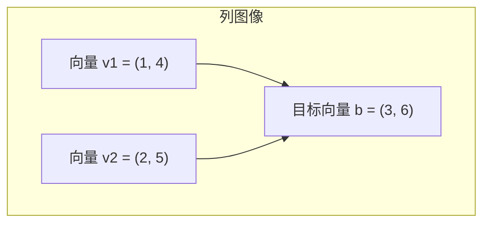
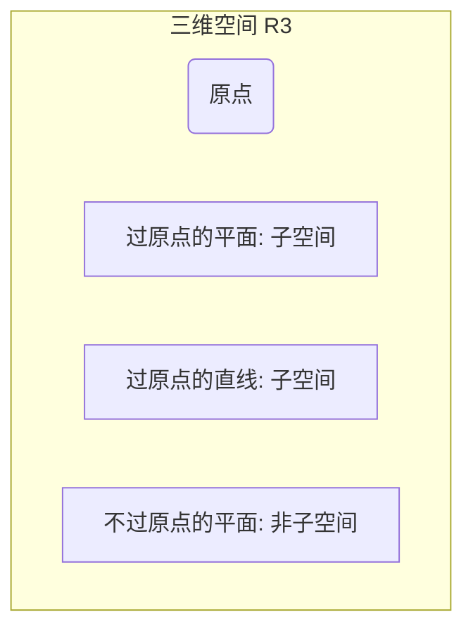
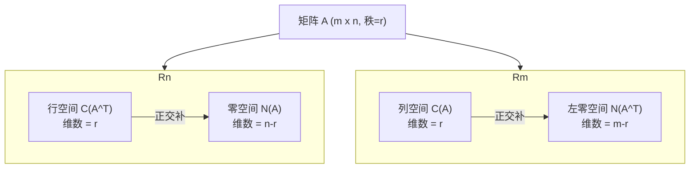
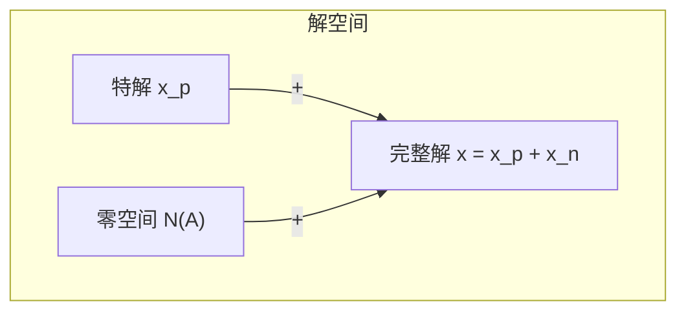
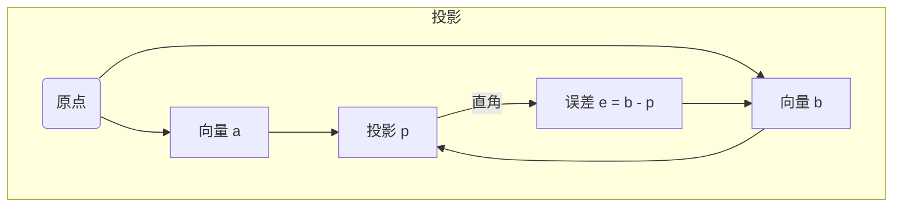
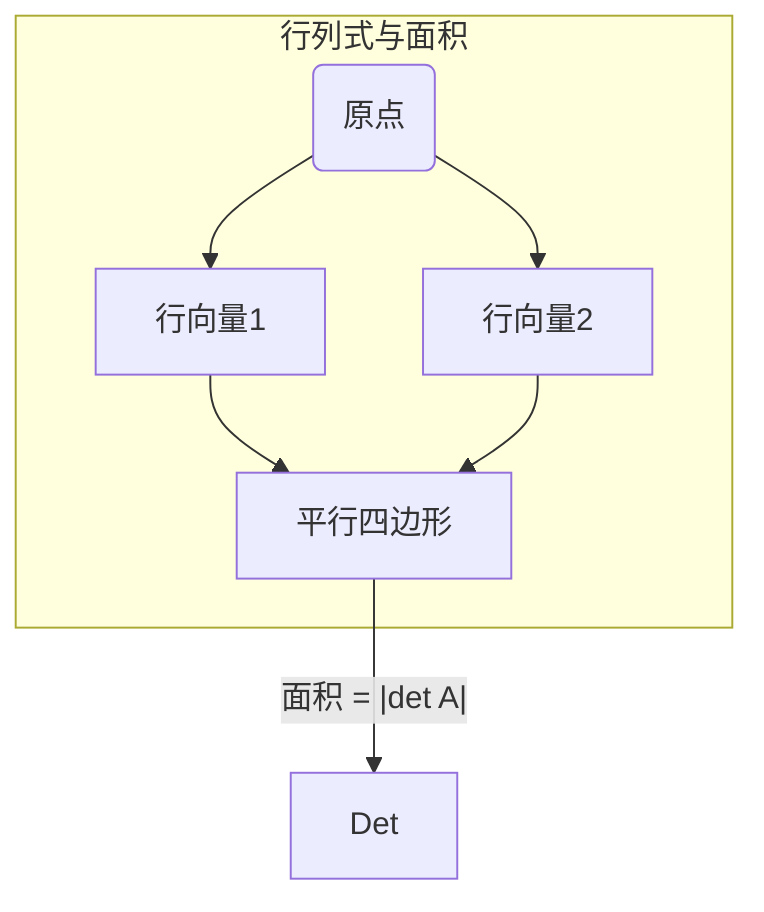
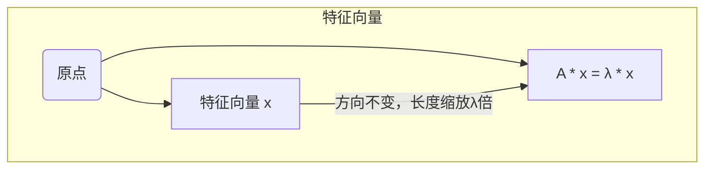
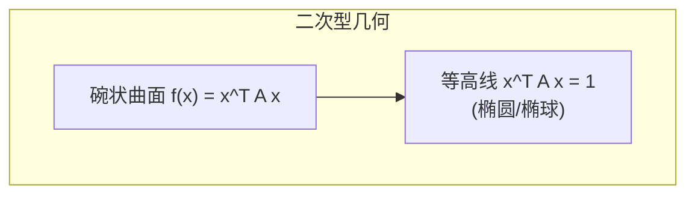
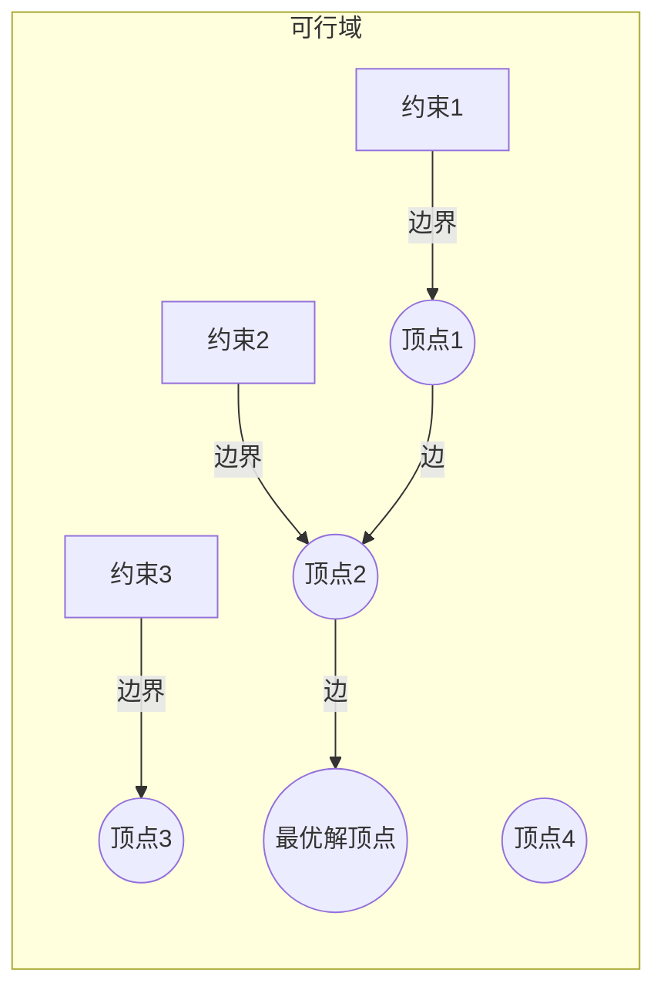
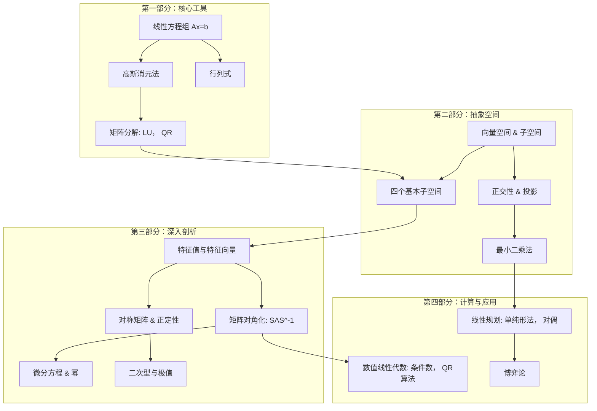

**目录**

1.  [第一章：矩阵与高斯消元法——解方程的艺术](#第一章矩阵与高斯消元法解方程的艺术)
2.  [第二章：向量空间——重新定义“世界”](#第二章向量空间重新定义世界)
3.  [第三章：正交性——垂直带来的优雅](#第三章正交性垂直带来的优雅)
4.  [第四章：行列式——一个神奇的数字](#第四章行列式一个神奇的数字)
5.  [第五章：特征值与特征向量——矩阵的“灵魂”](#第五章特征值与特征向量矩阵的灵魂)
6.  [第六章：正定矩阵——极值与能量](#第六章正定矩阵极值与能量)
7.  [第七章：矩阵的计算——理论与实践的桥梁](#第七章矩阵的计算理论与实践的桥梁)
8.  [第八章：线性规划与博弈论——决策中的数学](#第八章线性规划与博弈论决策中的数学)
9.  [附录：核心知识图谱与复习](#附录核心知识图谱与复习)

---

### 第一章：矩阵与高斯消元法——解方程的艺术

线性代数的起点，是一个看似简单的问题：**如何求解线性方程组？**

我们从一个经典的例子开始：
$$
\begin{cases}
x + 2y = 3 \\
4x + 5y = 6
\end{cases}
$$
这个问题，我们在初中就学过，可以用代入法、加减消元法。但在线性代数里，我们用一种系统性的方法——**高斯消元法**，并从中提炼出矩阵的语言。

#### 1.1 两种视角：行图像与列图像

**视角一：行图像 (Row Picture)**

我们把每个方程看作平面上的一条直线。
- 方程1: $x + 2y = 3$
- 方程2: $4x + 5y = 6$

方程组的解，就是这两条直线的交点。对于三维空间，每个方程代表一个平面，解就是平面的交点。这就是**行图像**——它聚焦于**行**，即每个单独的方程。

**视角二：列图像 (Column Picture)**

*这个视角至关重要，它将贯穿整个线性代数的学习！*

我们把方程组改写为向量的形式：
$$
x \begin{bmatrix} 1 \\ 4 \end{bmatrix} + y \begin{bmatrix} 2 \\ 5 \end{bmatrix} = \begin{bmatrix} 3 \\ 6 \end{bmatrix}
$$
现在，问题变成了：**如何将等号右边的列向量 $\begin{bmatrix} 3 \\ 6 \end{bmatrix}$，表示为左边两个列向量 $\begin{bmatrix} 1 \\ 4 \end{bmatrix}$ 和 $\begin{bmatrix} 2 \\ 5 \end{bmatrix}$ 的线性组合？**

系数 $x$ 和 $y$ 就是我们组合这两个向量的“配方”。解为 $x = -1, y = 2$，意味着我们需要 $-1$ 份的第一个向量和 $2$ 份的第二个向量，来拼出目标向量。这就是**列图像**——它聚焦于**列**，以及它们如何组合来“张成”结果。

*描述：通过将 v2 延长 2 倍，并将 v1 反向延长 1 倍，根据平行四边形法则，其对角线恰好到达目标点 (3, 6)。*

**核心思想**：求解 $Ax = b$，就是寻找一个系数向量 $x$，使得矩阵 $A$ 的列向量的线性组合恰好等于 $b$。如果 $b$ 可以被 $A$ 的列向量组合出来，方程就有解；反之则无解。

#### 1.2 矩阵语言与消元法

为了处理更大的系统，我们引入矩阵。
$$
A = \begin{bmatrix} 1 & 2 \\ 4 & 5 \end{bmatrix}, \quad x = \begin{bmatrix} x \\ y \end{bmatrix}, \quad b = \begin{bmatrix} 3 \\ 6 \end{bmatrix}
$$
方程组被优雅地写为 $Ax = b$。

高斯消元法的核心思想是：通过一系列“行变换”，将矩阵 $A$ 转化为一个上三角矩阵 $U$ (Upper Triangular Matrix)，这个过程不改变方程组的解。

**消元步骤**：
1.  用第2行减去第1行的4倍，消去 $x$。
    - 新的第2行：$(4 - 4 \times 1)x + (5 - 4 \times 2)y = 6 - 4 \times 3 \implies -3y = -6 \implies y = 2$。
2.  此时我们得到一个三角形方程组：
    $$
    \begin{cases}
    x + 2y = 3 \\
    -3y = -6
    \end{cases}
    $$
3.  **回代 (Back Substitution)**：从最后一个方程解出 $y=2$，代入第一个方程解出 $x=-1$。

用矩阵形式表示，我们将 $A$ 消元成 $U$：
$$
A = \begin{bmatrix} 1 & 2 \\ 4 & 5 \end{bmatrix} \xrightarrow{\text{消元}} U = \begin{bmatrix} \boxed{1} & 2 \\ 0 & \boxed{-3} \end{bmatrix}
$$
主对角线上框出的数字 `1` 和 `-3` 称为**主元 (Pivot)**。只要主元非零，消元就能进行下去。

#### 1.3 矩阵分解：$A = LU$

这个消元操作，可以被记录在一个神奇的矩阵里。我们用行变换矩阵（初等矩阵）来表示。从第二行减去第一行的4倍，等价于左乘一个矩阵 $E_{21}$：
$$
E_{21} = \begin{bmatrix} 1 & 0 \\ -4 & 1 \end{bmatrix}, \quad E_{21}A = \begin{bmatrix} 1 & 0 \\ -4 & 1 \end{bmatrix} \begin{bmatrix} 1 & 2 \\ 4 & 5 \end{bmatrix} = \begin{bmatrix} 1 & 2 \\ 0 & -3 \end{bmatrix} = U
$$
将等式两边左乘 $E_{21}^{-1}$，得到 $A = E_{21}^{-1}U$。而逆操作——把4倍的加回去——对应的矩阵我们记为 $L$ (Lower Triangular Matrix)：
$$
L = E_{21}^{-1} = \begin{bmatrix} 1 & 0 \\ 4 & 1 \end{bmatrix}
$$
于是，我们得到了线性代数中最核心的分解之一：
$$
A = LU
$$
$$
\underbrace{\begin{bmatrix} 1 & 2 \\ 4 & 5 \end{bmatrix}}_{A} = \underbrace{\begin{bmatrix} 1 & 0 \\ 4 & 1 \end{bmatrix}}_{L} \underbrace{\begin{bmatrix} 1 & 2 \\ 0 & -3 \end{bmatrix}}_{U}
$$
*教授点评：这个分解精妙绝伦！$L$ 是一个下三角矩阵，它的非对角线元素恰好记录了消元的乘数；$U$ 是消元后的上三角矩阵。把 $A$ 分解为 $L$ 和 $U$，就像把一个大问题分解为两个小问题。求解 $Ax = b$ 等价于先解 $Lc = b$，再解 $Ux = c$，这两个三角形系统都非常容易求解。*

---

### 第二章：向量空间——重新定义“世界”

*同学们，第一章我们学会了怎么“算”，第二章我们就要开始学习怎么“想”。什么是向量空间？这是线性代数真正的“世界观”。*

#### 2.1 空间与子空间

一个**向量空间**，就是一个**对加法和数乘封闭的集合**。最常见的空间是 $\mathbb{R}^n$，即所有 $n$ 维实向量的集合。比如我们生活的三维空间就是 $\mathbb{R}^3$。

一个**子空间**，是向量空间内部的一个满足封闭性的子集，它必须穿过原点。比如，$\mathbb{R}^3$ 中任何穿过原点的平面或直线，都是 $\mathbb{R}^3$ 的子空间。

*只有穿过原点的平面和直线才是 $\mathbb{R}^3$ 的子空间。*

#### 2.2 矩阵的四个基本子空间

对于一个给定的矩阵 $A$ ($m \times n$)，有四个至关重要的子空间，它们构成了线性代数基本定理的核心。

1.  **列空间 (Column Space), $C(A)$**：由 $A$ 的所有列向量线性组合而成的空间。它是 $\mathbb{R}^m$ 的子空间。$Ax = b$ 有解，当且仅当 $b$ 在 $C(A)$ 中。
2.  **零空间 (Nullspace), $N(A)$**：满足 $Ax = 0$ 的所有解 $x$ 的集合。它是 $\mathbb{R}^n$ 的子空间。
3.  **行空间 (Row Space), $C(A^T)$**：由 $A$ 的所有行向量线性组合而成的空间。它是 $\mathbb{R}^n$ 的子空间。
4.  **左零空间 (Left Nullspace), $N(A^T)$**：满足 $A^T y = 0$ (或等价地 $y^T A = 0$) 的所有解 $y$ 的集合。它是 $\mathbb{R}^m$ 的子空间。

*描述：在 $\mathbb{R}^n$ 中，行空间和零空间互为正交补；在 $\mathbb{R}^m$ 中，列空间和左零空间互为正交补。*

**线性代数基本定理（第一部分）** 揭示了它们维数之间的关系：
- $\dim C(A) = \dim C(A^T) = r$ （秩）
- $\dim N(A) = n - r$
- $\dim N(A^T) = m - r$

#### 2.3 线性无关、基与维数

- **线性无关 (Linear Independence)**：一组向量 $v_1, ..., v_k$，如果 $c_1v_1 + ... + c_kv_k = 0$ 的唯一解是所有 $c_i=0$，则它们线性无关。直观上，这些向量中没有一个是“多余”的，任何一个都不能由其他向量组合出来。
- **基 (Basis)**：一个子空间的一组基，是满足两个条件的向量组：(1) 它们线性无关；(2) 它们张成整个子空间。基就是子空间的“坐标系”。
- **维数 (Dimension)**：一个子空间的维数，就是它的任意一组基中包含的向量个数。

*教授引导：为什么行秩一定等于列秩？这是线性代数最深刻的定理之一。你可以这样理解：消元后，非零行的数量（行秩）等于主元的数量，而主元所在列的数量（列秩）也等于主元的数量。*

#### 2.4 $Ax = b$ 的完整解结构

当 $Ax = b$ 有解时，它的完整解可以表示为一个**特解 (Particular Solution)** $x_p$ 与**零空间 (Nullspace)** 中所有解 $x_n$ 之和：
$$
x_{\text{complete}} = x_p + x_n
$$
几何上，这意味着所有的解构成了一个“平行”于零空间的平面或直线。

*此处需插入解结构示意图：*

*描述：解集是零空间平移特解向量 $x_p$ 的结果。*

#### 2.5 图与网络——一个完美的应用

关联矩阵是这四个子空间的绝佳体现。在一个有向图中，关联矩阵 $A$ 的列空间、零空间、行空间和左零空间分别对应着网络中的**基尔霍夫电压定律(KVL)**、**结点电势**、**生成树**和**基尔霍夫电流定律(KCL)**。这是数学联系物理的典范。

---

### 第三章：正交性——垂直带来的优雅

垂直，或曰**正交 (Orthogonality)**，是我们引入的第二个几何概念。如果说线性相关/无关是“量”的度量，那么正交就是“角度”的度量。

#### 3.1 正交向量与子空间

两个向量 $x$ 和 $y$ 正交，当且仅当它们的内积为零：$x^T y = 0$。
两个子空间 $V$ 和 $W$ 正交，意味着 $V$ 中的**每一个**向量都与 $W$ 中的**每一个**向量正交。比如，房间的墙和地板（延伸至整个平面）就是正交的子空间。

**线性代数基本定理（第二部分）** 指出，四个基本子空间是成对正交的：
- 行空间 $C(A^T)$ 与零空间 $N(A)$ **正交**，且互为正交补。
- 列空间 $C(A)$ 与左零空间 $N(A^T)$ **正交**，且互为正交补。

这意味着 $\mathbb{R}^n$ 中的任何向量 $x$，都可以**唯一地**分解为行空间分量 $x_r$ 和零空间分量 $x_n$。当我们做矩阵乘法 $Ax$ 时，$A$ 消灭了 $x_n$，只将 $x_r$ 映射到列空间。*这个视角解释了矩阵乘法的真正本质！*

#### 3.2 投影与最小二乘法

*此处需插入投影示意图：*

*描述：向量 $b$ 在向量 $a$ 上的投影 $p$。误差向量 $e = b - p$ 与 $a$ 垂直。*

当我们遇到一个无解的方程组 $Ax = b$（$b$ 不在 $C(A)$ 中）时，我们退而求其次，寻找一个 $\hat{x}$，使得 $A\hat{x}$ 是 $C(A)$ 中距离 $b$ 最近的点。这个点就是 $b$ 在 $C(A)$ 上的**投影** $p$。由于误差 $e = b - A\hat{x}$ 必须垂直于整个列空间，即垂直于 $A$ 的每一列，所以我们有 $A^T(b - A\hat{x}) = 0$。

这导出了**正规方程 (Normal Equations)**：
$$
A^T A \hat{x} = A^T b
$$
解出 $\hat{x}$，就是**最小二乘解 (Least Squares Solution)**。这是处理超定方程（方程数多于未知数）的核心方法，广泛应用于统计学和数据拟合。

#### 3.3 正交基与格拉姆-施密特正交化

如果一组基中的向量不仅线性无关，而且两两正交，那将是极其方便的。因为在正交基下，任何一个向量的坐标可以简单地通过内积求出：$x_i = \frac{v_i^T b}{v_i^T v_i}$。

那么如何从一组普通的基 $a, b, c...$ 构造出一组正交基 $q_1, q_2, q_3...$ 呢？答案是**格拉姆-施密特正交化**。

1.  $q_1 = a / \|a\|$
2.  $B = b - (q_1^T b)q_1$，则 $B$ 与 $q_1$ 正交。标准化得 $q_2 = B / \|B\|$。
3.  $C = c - (q_1^T c)q_1 - (q_2^T c)q_2$，标准化得 $q_3 = C / \|C\|$。
以此类推。

这个过程可以总结为矩阵分解：**$A = QR$**。其中 $Q$ 的列是标准正交的，$R$ 是一个上三角矩阵。$QR$ 分解是数值计算中的基石。

---

### 第四章：行列式——一个神奇的数字

行列式是方阵的一个核心属性。斯特朗教授强调，不要死记硬背行列式的公式，要理解它的**性质**。行列式的所有性质，都可以从最基本的三个性质推导出来：
1.  $\det I = 1$
2.  交换两行，行列式变号。
3.  行列式对第一行是线性的。

*同学们请注意，正是这三个性质，唯一地确定了行列式的所有计算法则！*

#### 4.1 主要性质与计算

由这三条性质，我们可以推导出：
- 如果两行相同，$\det = 0$。
- 消元操作（将一行的倍数加到另一行）不改变行列式的值。
- 三角矩阵的行列式等于主对角元之积。
- $A$ 可逆 $\iff \det A \neq 0$。
- $\det AB = \det A \cdot \det B$。
- $\det A^T = \det A$。

**计算行列式**最有效的方法就是**消元法**：将 $A$ 通过行变换（记下行交换次数）化为上三角矩阵 $U$，则 $\det A = \pm (\text{主元之积})$。

#### 4.2 代数余子式与克拉默法则

行列式也可以按一行或一列展开，其系数就是**代数余子式 (Cofactor)** $C_{ij}$。
$$
\det A = a_{i1}C_{i1} + a_{i2}C_{i2} + \dots + a_{in}C_{in}
$$
利用代数余子式，我们可以写出逆矩阵的公式：
$$
A^{-1} = \frac{C^T}{\det A}
$$
并得到**克拉默法则 (Cramer's Rule)** 来求解 $Ax = b$：
$$
x_j = \frac{\det B_j}{\det A}
$$
其中 $B_j$ 是将 $A$ 的第 $j$ 列替换为 $b$ 的矩阵。

*教授提醒：克拉默法则在理论上很优美，但对于 $n \ge 4$ 的系统，计算量巨大，是“美丽的废物”，实际计算中请永远使用消元法。*

#### 4.3 几何意义：体积

行列式的绝对值 $|\det A|$ 等于矩阵 $A$ 的行（或列）向量所张成的平行多面体的体积。在 $2 \times 2$ 矩阵中，它就是平行四边形的面积。

*此处需插入行列式几何意义图：*

*描述：矩阵的行向量构成了一个平行四边形，其面积等于矩阵行列式的绝对值。*

---

### 第五章：特征值与特征向量——矩阵的“灵魂”

*如果说前四章在解剖矩阵的“身体”，那么从第五章开始，我们要探寻矩阵的“灵魂”。*

#### 5.1 定义与核心思想

对于方阵 $A$，如果存在一个非零向量 $x$ 和一个标量 $\lambda$，满足：
$$
Ax = \lambda x
$$
那么 $\lambda$ 就是 $A$ 的一个**特征值 (Eigenvalue)**，$x$ 是对应的**特征向量 (Eigenvector)**。

它的几何意义是：向量 $x$ 被矩阵 $A$ 作用后，其方向没有发生改变，只是长度被拉伸或压缩了 $\lambda$ 倍。

*此处需插入特征向量的几何意义图：*

*描述：特征向量在矩阵乘法下保持方向不变。*

求解特征值，我们需要解特征方程：
$$
\det(A - \lambda I) = 0
$$

#### 5.2 矩阵对角化

如果一个 $n \times n$ 矩阵 $A$ 有 $n$ 个线性无关的特征向量，那么我们可以将它们作为列向量构成矩阵 $S$。此时，矩阵 $A$ 可以被对角化：
$$
S^{-1}AS = \Lambda = \begin{bmatrix} \lambda_1 & & \\ & \ddots & \\ & & \lambda_n \end{bmatrix}
$$
这个分解 $A = S \Lambda S^{-1}$ 极其强大。因为：
$$
A^k = S \Lambda^k S^{-1}
$$
这使得计算矩阵的幂变得轻而易举。斐波那契数列的通项公式、马尔可夫链的稳态分布，都是矩阵对角化的经典应用。

*注：此处涉及线性代数中的正交基概念（详见笔记第3章）。如果 $A$ 是对称矩阵，那么我们可以选择一组标准正交的特征向量，此时 $S$ 就是正交矩阵 $Q$，对角化变成了 $A = Q \Lambda Q^T$。*

#### 5.3 微分方程与 $e^{At}$

特征值与特征向量是求解线性微分方程组 $\frac{du}{dt} = Au$ 的关键。假设解的形式为 $u(t) = e^{\lambda t} x$，代入原方程立刻得到 $Ax = \lambda x$。

如果 $A$ 可对角化，则通解为：
$$
u(t) = c_1 e^{\lambda_1 t} x_1 + c_2 e^{\lambda_2 t} x_2 + \dots + c_n e^{\lambda_n t} x_n
$$
矩阵指数函数 $e^{At}$ 被定义为 $e^{At} = S e^{\Lambda t} S^{-1}$，它是描述系统动态演化的核心算子。系统的稳定性完全取决于特征值的实部。

---

### 第六章：正定矩阵——极值与能量

对称矩阵是一类特殊的矩阵，它们拥有实特征值和正交的特征向量。如果所有特征值都大于零，它就是**正定矩阵 (Positive Definite Matrix)**。

#### 6.1 正定性判别法

判断一个对称矩阵是否正定，有以下五种等价方法：
1.  **能量定义**：对于所有非零向量 $x$，都有 $x^T A x > 0$。
2.  **特征值**：所有特征值 $\lambda_i > 0$。
3.  **行列式**：所有左上角主子式的行列式 $> 0$。
4.  **主元**：所有主元 $> 0$。
5.  **分解**：$A = R^T R$，其中 $R$ 的列是线性无关的。

*教授引导：我们不妨换个几何视角来理解这个二次型 $f(x) = x^T A x$。当 $A$ 正定时，$f(x)$ 的图像是一个开口向上的“碗”，其等高线 $x^T A x = 1$ 是一个高维椭球。*

*此处需插入正定矩阵的几何意义图：*

*描述：正定二次型的图像是一个向上的碗，其等高线是椭圆。特征向量给出了椭圆的主轴方向，特征值决定了轴的长度。*

#### 6.2 最小值原理

求一个二次函数 $P(x) = \frac{1}{2}x^T A x - x^T b$ （其中 $A$ 正定）的最小值，等价于求解线性方程组 $Ax = b$。这是联系优化问题与线性方程组的桥梁。

而瑞利商 $R(x) = \frac{x^T A x}{x^T x}$ 则连接了特征值问题与优化。它的最小值是 $\lambda_{\min}$，最大值是 $\lambda_{\max}$。这是变分法和有限元法的理论基础。

---

### 第七章：矩阵的计算——理论与实践的桥梁

理论完美了，但现实是残酷的。计算机的精度有限，直接套用公式往往会带来灾难。本章讨论如何**稳定**且**高效**地进行计算。

#### 7.1 条件数 (Condition Number)

矩阵的**条件数** $c = \|A\| \|A^{-1}\|$ 衡量了线性系统 $Ax = b$ 对输入误差（如 $b$ 或 $A$ 的微小扰动）的敏感程度。条件数越大，矩阵越“病态 (ill-conditioned)”，解就越不可靠。

*同学们请注意，这里有一个非常容易混淆的陷阱：行列式小不一定是病态矩阵，单位矩阵的千分之一 $\frac{1}{1000}I$ 的行列式极小，但它是完全良态的。条件数才是衡量病态的正确指标。*

#### 7.2 特征值的计算：QR 算法

计算特征值不能直接用 $\det(A - \lambda I) = 0$ 求根。现代数值线性代数的基石是 **QR 算法**。

1.  将 $A_0 = A$ 分解为 $A_0 = Q_0 R_0$。
2.  令 $A_1 = R_0 Q_0$。
3.  不断重复 $A_k = Q_k R_k, A_{k+1} = R_k Q_k$。

可以证明 $A_k$ 会收敛到一个上三角矩阵（或分块上三角矩阵），其对角线上的元素就是特征值。为了加速收敛，会使用带位移的 QR 算法。对于大型稀疏矩阵，迭代法（如幂法、反幂法、共轭梯度法）是首选。

---

### 第八章：线性规划与博弈论——决策中的数学

本章将线性代数从“等式”世界带入了“不等式”世界。

#### 8.1 线性规划

线性规划要解决的问题是：在一组线性不等式约束（$Ax \le b, x \ge 0$）下，最大化或最小化一个线性目标函数（$c^T x$）。

其核心思想是：
1.  **可行域**：约束条件在空间中定义了一个凸多面体（可行域）。
2.  **最优解在顶点**：如果最优解存在，它一定可以在可行域的某个顶点（角点）处取得。
3.  **单纯形法**：从一个顶点出发，沿着可行域的边，迭代地移动到目标函数值更优的相邻顶点，直到找到最优解。

*此处需插入线性规划可行域示意图：*

*描述：可行域是一个凸多边形，最优解在某个顶点取得。单纯形法沿着边从一个顶点移动到另一个更好的顶点。*

#### 8.2 对偶问题

每个线性规划问题（原始问题）都有一个对应的对偶问题。例如，一个最小化成本的问题，其对偶问题是最大化收益。冯·诺依曼的**最小最大定理**指出，在最优解处，两者的目标函数值相等。这个理论为经济学中的“影子价格”提供了数学基础。

#### 8.3 博弈论

矩阵博弈是线性规划的对偶理论的一个直接应用。在二人零和博弈中，玩家 $X$ 和玩家 $Y$ 都在寻找最优的混合策略。玩家 $X$ 试图最大化其最坏情况下的收益，而玩家 $Y$ 试图最小化其最坏情况下的损失。最小最大定理保证了博弈值（鞍点）的存在。

---

### 附录：核心知识图谱与复习

*这是一张全书的概览图。从解方程这个基本问题出发，我们逐步引入了向量空间（世界观）、正交性（几何关系）、特征值（灵魂），最后将理论应用于计算、优化和博弈。*
