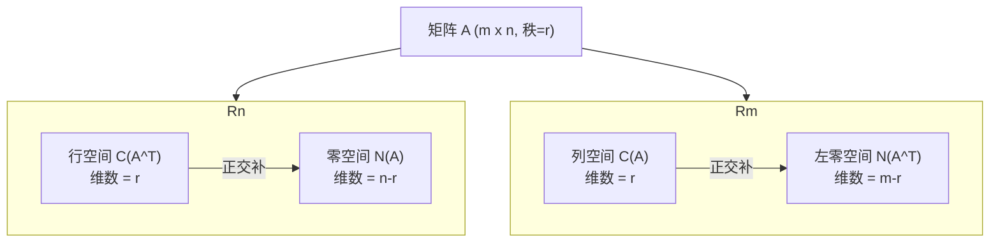

《斯特朗线性代数》学习笔记

# 第1章 矩阵与高斯消元法

## 1.2 线性方程组的几何意义
**视角一：行图像 (Row Picture)**
我们把每个方程看作平面上的一条直线。
- 方程1: $x + 2y = 3$
- 方程2: $4x + 5y = 6$

方程组的解，就是这两条直线的交点。对于三维空间，每个方程代表一个平面，解就是平面的交点。这就是**行图像**——它聚焦于**行**，即每个单独的方程。

**视角二：列图像 (Column Picture)**
*这个视角至关重要，它将贯穿整个线性代数的学习！*
我们把方程组改写为向量的形式：
$$
x \begin{bmatrix} 1 \\ 4 \end{bmatrix} + y \begin{bmatrix} 2 \\ 5 \end{bmatrix} = \begin{bmatrix} 3 \\ 6 \end{bmatrix}
$$
现在，问题变成了：**如何将等号右边的列向量 $\begin{bmatrix} 3 \\ 6 \end{bmatrix}$，表示为左边两个列向量 $\begin{bmatrix} 1 \\ 4 \end{bmatrix}$ 和 $\begin{bmatrix} 2 \\ 5 \end{bmatrix}$ 的线性组合？**

系数 $x$ 和 $y$ 就是我们组合这两个向量的“配方”。解为 $x = -1, y = 2$，意味着我们需要 $-1$ 份的第一个向量和 $2$ 份的第二个向量，来拼出目标向量。这就是**列图像**——它聚焦于**列**，以及它们如何组合来“张成”结果。
### 1.2.1 列向量和线性组合

$$u \left[ \begin{matrix} {\phantom{-} 2} \\ {4} \\ {-2} \\ \end{matrix} \right]+v \left[ \begin{matrix} {\phantom{-} 1} \\ {-6} \\ {7} \\ \end{matrix} \right]+w \left[ \begin{matrix} {1} \\ {0} \\ {2} \\ \end{matrix} \right]=\left[ \begin{matrix} {\phantom{-} 5} \\ {-2} \\ {\phantom{-} 9} \\ \end{matrix} \right]=\boldsymbol{b} .$$
这些是三维列向量.向量b用坐标为(5，-2,9)的点来表示。三维空间中的每个点都对应一个向量
当分量水平排列时（即向量为行向量时），我们使用圆括号和逗号；当写成列向量时，我们使用方括号（不带逗号）

**向量加法**
$$\small{\left[ \begin{matrix} {5} \\ {0} \\ {0} \\ \end{matrix} \right]+\left[ \begin{matrix} {\phantom{-} 0} \\ {-2} \\ {\phantom{-} 0} \\ \end{matrix} \right]+\left[ \begin{matrix} {0} \\ {0} \\ {9} \\ \end{matrix} \right]=\left[ \begin{matrix} {\phantom{-} 5} \\ {-2} \\ {\phantom{-} 9} \\ \end{matrix} \right]} .$$
**向量数乘**
$$2 \left[ \begin{matrix} {1} \\ {0} \\ {2} \\ \end{matrix} \right]=\left[ \begin{matrix} {2} \\ {0} \\ {4} \\ \end{matrix} \right] \! , \qquad-2 \left[ \begin{matrix} {1} \\ {0} \\ {2} \\ \end{matrix} \right]=\left[ \begin{matrix} {-2} \\ {0} \\ {-4} \\ \end{matrix} \right] \! .$$
**线性组合**
$$1 \left[ \begin{aligned} {2} \\ {4} \\ {-2} \\ \end{aligned} \right]+1 \left[ \begin{aligned} {1} \\ {-6} \\ {7} \\ \end{aligned} \right]+2 \left[ \begin{aligned} {1} \\ {0} \\ {2} \\ \end{aligned} \right]=\left[ \begin{aligned} {5} \\ {-2} \\ {9} \\ \end{aligned} \right] \! .$$

### 1.2.2 奇异情形
对于一个矩阵 $A$ 来说，“奇异”就相当于“非满秩”，通俗地讲，就是矩阵的某些行或列是“多余”的，可以用其他行或列的线性组合来表示。
这会导致一个直接后果：当我们尝试求解 $Ax = b$ 时，这个系统**要么无解，要么有无穷多解**，总之**不可能有唯一解**。
**行图——平面的交点**
1. **无解的情形：平面永远碰不到一起**
	1. **两个平面平行/三个平面平行**
		方程 `2u + v + w = 5` 和 `4u + 2v + 2w = 11`。这两个方程描述的平面，它们的法向量是同向的，意味着它们是完全平行的。就像两张平行的纸，无论怎么延伸，它们永远不会相交。
	2. **形成“三角形隧道”**
		`u + v + w = 2`  、`2u + 3w = 5` 、`3u + v + 4w = 6` 把前两个方程加起来，左边是 `3u + v + 4w`，恰好等于第三个方程的左边。但右边呢？ `2 + 5 = 7`，不等于第三个方程的右边6。这导致一个矛盾 `0 = 1`。
		从几何上看，这三个平面两两相交于一条直线，但这三条交线是**彼此平行的**。它们永远不会交于一个共同点，而是围成了一个无限延伸的“三角形隧道”。这也是无解。
2. **有无穷多解的情形：所有平面交于一条线**
	1. **交于一条线**
		`3u + v + 4w = 6` 改为 `3u + v + 4w = 7`。则第三个方程实际上就是前两个方程的和，是“多余”的信息。
		在几何上，前两个平面已经确定了一条交线 $L$，而第三个平面恰好也穿过这条交线 $L$。所以，这条交线 $L$ 上的**所有点**都同时满足三个方程。这就是有无穷多解的情形。

**列图——向量的组合**
*核心。我们把方程组 $Ax = b$ 看作是：寻找一组系数 $(u, v, w)$，将矩阵 $A$ 的三个列向量 $\mathbf{c}_1, \mathbf{c}_2, \mathbf{c}_3$ 进行线性组合，最终拼出目标向量 $\mathbf{b}$。*
1. **列向量的共面性**  
	对于奇异情形，矩阵 $A$ 的三个列向量有一个共同特点：它们**都位于三维空间中的一个二维平面内**。
2. **目标向量 $\mathbf{b}$ 的位置决定了解的情况**
	1. **无解：$\mathbf{b}$ 不在平面内**
		我们的工具只有三个列向量，它们的任何线性组合（加法、数乘）都只能生成它们所在的那个平面内的向量。如果目标向量 $\mathbf{b}$ 不在这个平面内，那无论我们怎么组合 $\mathbf{c}_1, \mathbf{c}_2, \mathbf{c}_3$，都永远无法“够到” $\mathbf{b}$
	2. **有无穷多解：$\mathbf{b}$ 在平面内**
		当 $\mathbf{b}$ 碰巧也在这个平面内时，我们就可以用这三个列向量拼出它。但是，因为这三个列向量本身是“线性相关”的（也就是说，其中一个是“多余”的，比如 $\mathbf{c}_1$ 可以由 $\mathbf{c}_2$ 和 $\mathbf{c}_3$ 组合出来），所以拼出 $\mathbf{b}$ 的配方（系数 $u, v, w$）就不是唯一的了。你可以加一点“多余”向量，再减去等量的其他向量，从而得到无数种不同的组合方式，每种都对应一个解。这就是无穷多解的来源。
    

> 矩阵的列向量没有“张满”整个目标空间，导致只有当目标向量 $\mathbf{b}$ 碰巧落在它们张成的低维子空间内时，方程才有解；而由于列向量的“冗余”，这个解一旦存在，就必然有无穷多个。

## 1.3 高斯消元法的一个例子
$$

\begin{aligned}
2u + v + w &= 5 \\
4u - 6v &= -2 \\
-2u + 7v + 2w &= 9
\end{aligned}
\;\xrightarrow[\substack{R_2-2R_1\\R_3+R_1}]\;
\begin{aligned}
2u + v + w &= 5 \\
-8v - 2w &= -12 \\
8v + 3w &= 14
\end{aligned}
\;\xrightarrow{R_3+R_2}\;
\begin{aligned}
2u + v + w &= 5 \\
-8v - 2w &= -12 \\
w &= 2
\end{aligned}
$$
**高斯消元法**的过程，从原始方程组通过行变换得到上三角形式。可以通过回代法从下到上进行反向求解

### 1.3.1 失效的消元法
若得到完整的 $n$ 个主元，则系统只有一个解．此时系统是非奇异的，可以利用正向消元和回代法求解，但如果在主元位置出现了零，就必须停止消元一一可能是暂时停止，也可能是永久停止，系统可能是奇异的，也可能不是，需进一步判断.
### 1.3.2 消元运算的成本
对于由含有 $n$ 个 未知量的 $n$ 个方程构成的方程组 ， 整个消元过程需要多少次独立的 算术运算呢？
对于有 $n$ 个未知数和 $n$ 个方程的稠密矩阵（大部分元素非零）：

| 步骤           | 主导项（近似运算次数）                                                                                       |
| ------------ | ------------------------------------------------------------------------------------------------- |
| 对矩阵 $A$ 的消元  | $C = \frac{n(n+1)(2n-1)}{6}-\frac{n(n-1)(n+2)}{2}=\frac{n(n+1)(2n-1-3)}{6}=\frac{n(n-1)(n+1)}{3}$ |
| 对右端项 $b$ 的处理 | $\begin{array}{r}{\sum_{k=1}^{n-1}k=\frac{n(n-1)}{2}\approx\frac{1}{2}n^{2}}\end{array}$          |
| 回代求解 $x$     | $1 + 2 + \dots + n = \frac{n(n+1)}{2} \approx \frac{1}{2}n^2$                                     |
| **总计**       | **$\frac{1}{3}n^3 + n^2$**                                                                        |

## 1.4 矩阵定义与矩阵乘法
**定义:**
对于含有 $n$ 个未知量（$u, v, w, \dots$）和 $n$ 个方程的方程组：
$$\begin{cases}2u+v+w=5\\4u-6v=-2\\-2u+7v+2w=9\end{cases}$$
我们将未知量写成列向量 $\mathbf{x}$，等号右边的常数写成列向量 $\mathbf{b}$，而所有系数就构成了一个 $3 \times 3$ 的**系数矩阵** $A$：
$$x = \begin{bmatrix} u \\ v \\ w \end{bmatrix}, \quad b = \begin{bmatrix} 5 \\ -2 \\ 9 \end{bmatrix}, \quad A = \begin{bmatrix} 2 & 1 & 1 \\ 4 & -6 & 0 \\ -2 & 7 & 2 \end{bmatrix}$$
- **方阵**：如果行数等于列数（$m = n$），就称为方阵。上面的 $A$ 就是一个 $3 \times 3$ 的方阵。
- **一般矩阵**：更一般地，一个矩阵可以有 $m$ 行和 $n$ 列，记作 $m \times n$ 矩阵。其第 $i$ 行第 $j$ 列的元素通常记作 $a_{ij}$。

**运算**：
- **矩阵加法**:
	矩阵加法非常简单直观，**只有形状相同的矩阵才能相加**。$$
	\begin{gathered}
	A = \begin{bmatrix} 1 & 3 \\ 2 & 5 \end{bmatrix}, \quad 
	B = \begin{bmatrix} 2 & -1 \\ 0 & 4 \end{bmatrix} \\
	
	A + B = \begin{bmatrix} 1 + 2 & 3 + (-1) \\ 2 + 0 & 5 + 4 \end{bmatrix} = \begin{bmatrix} 3 & 2 \\ 2 & 9 \end{bmatrix}
	\end{gathered}
	$$==向量的加法其实就是矩阵加法的一个特例，因为向量可以看作是只有一列的矩阵。==
- **矩阵与向量的乘法**：
	这正是线性方程组 $A\mathbf{x} = \mathbf{b}$ 的核心。
	对于一个 $3 \times 3$ 矩阵 $A$ 和一个 $3 \times 1$ 列向量 $\mathbf{x}$，其乘积 $A\mathbf{x}$ 是一个 $3 \times 1$ 列向量。它有两种完全等价但视角不同的理解方式。
	**视角一：行内积法（逐行点乘）**  
	我们将矩阵 $A$ 的每一行与向量 $\mathbf{x}$ 做**内积**（对应元素相乘再求和），结果作为新向量的一个分量。$$A \mathbf { x } = { \left[ \begin{array} { l l l } { - } & { { \mathrm { r o w } } _ { 1 } } & { - } \\ { - } & { { \mathrm { r o w } } _ { 2 } } & { - } \\ { - } & { { \mathrm { r o w } } _ { 3 } } & { - } \end{array} \right] } { \left[ \begin{array} { l } { u } \\ { v } \\ { w } \end{array} \right] } = { \left[ \begin{array} { l } { ( { \mathrm { r o w } } _ { 1 } ) \cdot \mathbf { x } } \\ { ( { \mathrm { r o w } } _ { 2 } ) \cdot \mathbf { x } } \\ { ( { \mathrm { r o w } } _ { 3 } ) \cdot \mathbf { x } } \end{array} \right] }$$对于我们的例子：$$Ax = \begin{bmatrix} 2 & 1 & 1 \\ 4 & -6 & 0 \\ -2 & 7 & 2 \end{bmatrix} \begin{bmatrix} u \\ v \\ w \end{bmatrix} = \begin{bmatrix} 2u + v + w \\ 4u - 6v + 0w \\ -2u + 7v + 2w \end{bmatrix}$$这正是我们原来的方程组！
	**视角二：列线性组合法（斯特朗教授极为推崇的视角）**  
	_同学们请注意，这个视角极其重要，它将贯穿整个线性代数。_  
	我们将乘积 $A\mathbf{x}$ 看作是矩阵 $A$ 的**各个列向量**分别乘以系数 $u, v, w$ 后的**线性组合**。$$Ax = u \begin{bmatrix} 2 \\ 4 \\ -2 \end{bmatrix} + v \begin{bmatrix} 1 \\ -6 \\ 7 \end{bmatrix} + w \begin{bmatrix} 1 \\ 0 \\ 2 \end{bmatrix}$$这清晰地揭示了：求解 $A\mathbf{x} = \mathbf{b}$，本质上就是寻找一组系数 $(u, v, w)$，使得 $A$ 的列向量能够组合出目标向量 $\mathbf{b}$。这就是前面我们讨论过的“列图”思想。
- **矩阵乘法**:
	**前提条件**：矩阵 $A$ 乘以矩阵 $B$（记作 $AB$），**必须要求 $A$ 的列数等于 $B$ 的行数**。如果 $A$ 是 $m \times n$，$B$ 是 $n \times p$，那么乘积 $AB$ 就是 $m \times p$ 矩阵。  
	==可以理解为 行数为输入端，列数为输出端，**要求 $A$ 的列数等于 $B$ 的行数即 $A$ 的输出能被 $B$ 接收==**
	**法则**：乘积 $AB$ 的第 $i$ 行第 $j$ 列元素，就是 **$A$ 的第 $i$ 行** 与 **$B$ 的第 $j$ 列** 的内积。
	比如：$$
	\begin{gathered}
	A = \begin{bmatrix} 2 & 3 \\ 4 & 0 \end{bmatrix}, \quad 
	B = \begin{bmatrix} 1 & 5 \\ 2 & -1 \end{bmatrix} \\
	
	C = AB = \begin{bmatrix} 2*1+3*2 & 2*5 + 3*(-1) \\ 4*1 + 0*2 & 4*5 + 0* (-1)\end{bmatrix} = \begin{bmatrix} 8 & 7 \\ 4 & 20 \end{bmatrix}
	\end{gathered}
	$$

> **矩阵乘法不满足交换律！** 在矩阵世界里，这是一条铁律：**$AB \neq BA$**。 
> **原因一：形状不匹配** 
> **原因二：即使能乘，结果也不同。**

### 1.4.1 矩阵与向量的乘法
把包含三个方程和三个未知量 $u,v,w$ 的系统简化成矩阵形式 $Ax = b$。完整地写出，即为矩阵乘以向量等于向量：
$$\begin{bmatrix} 2 & 1 & 1 \\ 4 & -6 & 0 \\ -2 & 7 & 2 \end{bmatrix} \begin{bmatrix} u \\ v \\ w \end{bmatrix} = \begin{bmatrix} 5 \\ -2 \\ 9 \end{bmatrix}$$
**行向量乘以列向量**是所有矩阵乘法的基础． 由 两个向量生成一个数， 这个数称为这两个向量的内 积．
**矩阵 A 和 向量 x 相乘有两种理解方式．**
- **行规则**：
	每次对一行做内积，矩阵 $A$ 的每一行和向量 $x$ 的内积给出 $Ax$ 的一个分量
- **列规则**：
	每次对一列做数乘运算。乘积 $Ax$ 作为矩阵 $A$ 的 三个列向量的线性组合被整体求出
### 1.4.2 消元步骤的矩阵形式
**初等矩阵**（或消元矩阵），记作 $E$，作用是：**当你用初等矩阵 $E$ 左乘一个向量或矩阵时，就相当于对它进行了一次特定的行变换。**
**构造法则**：要从第 $i$ 行减去第 $j$ 行的 $l$ 倍，我们就在**单位矩阵 $I$** 的第 $(i, j)$ 位置上放上 $-l$。
**单位矩阵 $I$**。它主对角线全是1，其余全是0。它的核心性质是 $I\mathbf{b} = \mathbf{b}$。

**消元过程的矩阵化：$E(Ax) = Eb$**：
**必须同时对等式两边做相同的操作**，才能保证得到的**新系统等价于旧系统**。
- **操作左边**：用初等矩阵 $E$ 左乘 $Ax$，得到 $E(Ax)$。
- **操作右边**：用初等矩阵 $E$ 左乘 $b$，得到 $Eb$。

### 1.4.3 矩阵乘法
**前提条件**：$A$ 的列数必须等于 $B$ 的行数。如果 $A$ 是 $m \times n$，$B$ 是 $n \times p$，则 $AB$ 是 $m \times p$。 
**元素计算（行乘以列）**：乘积 $AB$ 的第 $i$ 行第 $j$ 列元素，就是 $A$ 的第 $i$ 行与 $B$ 的第 $j$ 列的**内积**（对应元素相乘再求和）。
看待乘法的方式：
- **视角一（元素级）**：每个元素是一次内积，即**行 × 列**。$(AB)_{ij} = (\text{A 的第 } i \text{ 行}) \text{ 乘以 } (B \text{ 的第 } j \text{ 列}).$
- **视角二（列级）**：$AB$ 的每一列是 $A$ 的列向量的线性组合，组合系数来自 $B$ 的对应列。即 **$A \times$ (列)**。$\text{AB 的第 }  j  \text{  列} = \text{A 乘以 (B  的第 j 列)}.$
- **视角三（行级）**：$AB$ 的每一行是 $B$ 的行向量的线性组合，组合系数来自 $A$ 的对应行。即 **(行) $\times B$**。 $\text{AB 的第 }  i  \text{  行} = \text{(A 的第 i 行) 乘以 B}.$
**核心性质**：
- **成立的性质**：
    - **结合律**：$(AB)C = A(BC)$。这保证了多个线性变换的复合顺序是良定义的，我们可以放心地写 $ABC$ 而不加括号。
    - **分配律**：$A(B+C) = AB + AC$ 以及 $(B+C)D = BD + CD$。
- **不成立的性质（关键！）**：
    - **交换律通常不成立**：**$AB \neq BA$**。

## 1.5 三角因子和行交换
- **正向消元：用矩阵乘法表示消元过程**
	从一个方程组 $Ax = b$ 开始。通过一系列消元步骤，我们最终得到一个上三角矩阵 $U$。这个过程可以用一连串的初等矩阵左乘来表示。假设消元需要三步，对应的初等矩阵分别为 $E, F, G$，那么：  $G(F(EA))=U$。根据矩阵结合律，将前面部分$GFE = M$，$M$ 就是**一次性完成所有消元步骤的矩阵**，是一个**下三角矩阵**（主对角线以上的元素全是0）。
- **逆向撤销：初等矩阵的逆**
	**逆矩阵**的概念。
	- **操作**：消元时我们“减去”了某行的 $l$ 倍，那么撤销时就应该“加回”该行的 $l$ 倍。
	- **矩阵形式**：如果消元矩阵 $E$ 在 $(i, j)$ 位置是 $-l$，那么它的逆矩阵 $E^{-1}$ 在同样的位置就是 $+l$。它们相乘的结果是单位矩阵 $I$：$E^{-1}E = I$。
	撤销的顺序必须是反过来的。撤销整个消元过程的矩阵是 $E^{-1} F^{-1} G^{-1}$。
### 1.5.1 A = LU: n x n 的情形

### 1.5.2 一个线性系统＝两个三角形系统
得到了 $A = LU$ 有什么用？它把求解 $A\mathbf{x} = \mathbf{b}$ 这个难题，拆分成了两个极其简单的**三角形系统**：
1. **前向代入**：先解 $L\mathbf{c} = \mathbf{b}$。因为 $L$ 是下三角矩阵，从上往下一行行代入即可求出 $\mathbf{c}$。
2. **回代**：再解 $U\mathbf{x} = \mathbf{c}$。因为 $U$ 是上三角矩阵，从下往上一行行回代即可求出最终解 $\mathbf{x}$。
**计算效率**：对 $A$ 进行 $LU$ 分解的成本是 $O(n^3)$，但一旦分解完成，对于每个新的右端项 $\mathbf{b}$，求解两个三角形系统的成本仅仅是 $O(n^2)$。这在大规模科学计算中意义重大。
### 1.5.3 行交换与置换矩阵
当主元位置出现 $0$ 时，消元法就卡住了。怎么办？
- **行交换**：如果这一列下方有非零元素，我们可以交换两行，把这个非零元素换上来当主元。
- **置换矩阵 $P$**：这种行交换操作，用矩阵语言表示，就是左乘一个**置换矩阵 $P$**。置换矩阵是单位矩阵通过行交换得到的，它每一行、每一列都只有一个 $1$。
原文特别强调了一个极易混淆的点：**当消元过程中需要进行行交换时，我们通常不能直接得到 $A = LU$，而是得到 $PA = LU$。**
- **为什么顺序重要？**：如果先做消元再换行，得到的 $L$ 里的乘数记录就会错乱（如例7所示）。正确的做法是，**先通过行交换把所有可能的“零主元”问题解决掉，得到一个“安全”的矩阵 $PA$，然后再对 $PA$ 进行标准的 $LU$ 分解。**
### 1.5.4 而易消元法：PA = LU
> **在非奇异情形下，存在一个置换矩阵 $P$，它可以对矩阵 $A$ 的行进行重新排序以避免主元位置为零。通过先对行进行重新排序，$PA$ 可以分解为 $LU$。**

这就是现代数值线性代数中求解 $A\mathbf{x} = \mathbf{b}$ 的基石。一个好的算法，其核心就是计算出三个矩阵：**$P, L, U$**。有了它们，无论右端项 $\mathbf{b}$ 怎么变，我们都能高效、稳定地求解。

## 1.6 矩阵的逆和转置
一个矩阵 $A$ 的逆为 $A^{-1}$，它满足：  $A−1$ 且 $A^{-1}A=I$ 且 $AA^{-1}=I$，其中 $I$ 是单位矩阵。
- **为什么我们需要它？**：如果我们有 $A\mathbf{x} = \mathbf{b}$，两边同时左乘 $A^{-1}$，解就立刻出来了：$\mathbf{x} = A^{-1}A\mathbf{x} = A^{-1}\mathbf{b}$。它提供了一种形式上的“除法”。
- **关键性质**：
    1. **唯一性**：一个矩阵如果可逆，它的逆是唯一的。如果左逆和右逆都存在，它们必然相等。
    2. **存在性条件**：一个矩阵 $A$ 可逆，**当且仅当消元法能得到 $n$ 个非零主元**（允许行交换）。这就是“可逆”与“非奇异”的等价性。
    3. **乘积的逆**：$(AB)^{-1} = B^{-1}A^{-1}$。
    4. （重要）若存在一个非零向量 $x$ 使得 $Ax=0$ 成立，则矩阵 $A$ 不可逆。重复一遍：不存在将零向量变回 $x$ 的矩阵。
    5. $2 \times 2$ 矩阵 $A = \begin{bmatrix} a & b \\ c & d \end{bmatrix}$ 可逆的充分必要条件为 $ad - bc \neq 0$，其中$ad - bc$ 为 $A$ 的 行列式，如果一个矩阵的行列式不为零，那么它是可逆矩阵
### 1.6.1 A⁻¹ 的计算方法：高斯－若尔当法
- **核心思想**：求解 $A A^{-1} = I$。我们把 $A$ 和 $I$ 并排放在一起，形成一个大的增广矩阵 $[A \quad I]$。
- **操作过程**：
    1. 对这个增广矩阵进行行变换，目标是把左边的 $A$ 变成单位矩阵 $I$。
    2. 在这个过程中，对左边 $A$ 做的所有行变换，都同时作用在了右边的 $I$ 上。
    3. 当左边的 $A$ 变成 $I$ 时，右边的 $I$ 就**自动**变成了我们想要的逆矩阵 $A^{-1}$。
- **最终形式**：$[A \quad I] \xrightarrow{\text{行变换}} [I \quad A^{-1}]$。
- **教授点评（重要！）**：斯特朗教授在原文中**明确地不推荐**用这种方法来求解 $A\mathbf{x} = \mathbf{b}$。为什么？因为计算 $A^{-1}$ 的成本太高了（约 $n^3$ 次运算），而如果只是求解 $A\mathbf{x} = \mathbf{b}$，用 $A=LU$ 分解成两个三角形系统来解，成本要低得多。**永远不要为了解一个方程组去计算逆矩阵**，这是数值线性代数的一条重要格言。

示例：
$$
\begin{gathered}
\begin{bmatrix} A & e_1 & e_2 & e_3 \end{bmatrix} = \begin{bmatrix} 2 & 1 & 1 & 1 & 0 & 0 \\ 4 & -6 & 0 & 0 & 1 & 0 \\ -2 & 7 & 2 & 0 & 0 & 1 \end{bmatrix},  \\

\text{主元} = 2 \to \begin{bmatrix} 2 & 1 & 1 & 1 & 0 & 0 \\ 0 & -8 & -2 & -2 & 1 & 0 \\ 0 & 8 & 3 & 1 & 0 & 1 \end{bmatrix} , \\

\text{主元} = -8 \to \begin{bmatrix} 2 & 1 & 1 & 1 & 0 & 0 \\ 0 & -8 & -2 & -2 & 1 & 0 \\ 0 & 0 & 1 & -1 & 1 & 1 \end{bmatrix} = [ U \ L^{-1} ] . \text{（完成了前半部分一正向消元）}\\

\\

\text{后半部分 } [U \quad L^{-1}] \to \begin{bmatrix} 2 & 1 & 0 & 2 & -1 & -1 \\ 0 & -8 & 0 & -4 & 3 & 2 \\ 0 & 0 & 1 & -1 & 1 & 1 \end{bmatrix},\\

\text{主元上方的零 } \to \begin{bmatrix} 2 & 0 & 0 & \frac{12}{8} & -\frac{5}{8} & -\frac{6}{8} \\ 0 & -8 & 0 & -4 & 3 & 2 \\ 0 & 0 & 1 & -1 & 1 & 1 \end{bmatrix}\\

\text{除以主元} \rightarrow \begin{bmatrix} 1 & 0 & 0 & \frac{12}{16} & -\frac{5}{16} & -\frac{6}{16} \\ 0 & 1 & 0 & \frac{4}{8} & -\frac{3}{8} & -\frac{2}{8} \\ 0 & 0 & 1 & -1 & 1 & \frac{1}{1} \end{bmatrix} = [I \quad A^{-1}]

\end{gathered}
$$

### 1.6.2 可逆＝非奇异（n个主元）
一个 $n \times n$ 矩阵可逆的 充要条件是它有 n 个主元
### 1.6.3 转置矩阵
相比于逆矩阵，转置矩阵 $A^T$ 要简单得多。它就是把矩阵沿着主对角线“翻”过来。
- **定义**：$(A^T)_{ij} = A_{ji}$。$A$ 的第 $i$ 行变成了 $A^T$ 的第 $i$ 列。
- **关键性质**：
    1. **和的转置**：$(A+B)^T = A^T + B^T$
    2. **乘积的转置**：$(AB)^T = B^T A^T$。**请注意，这里相乘的顺序也反过来了！**
    3. **逆的转置**：$(A^{-1})^T = (A^T)^{-1}$。逆和转置这两个操作可以交换顺序。$(A^{-1})^T A^T= I$
### 1.6.4 对称矩阵
- **定义**：一个矩阵 $A$ 如果等于它自身的转置，即 $A^T = A$，那么它就是对称矩阵。
- **性质**：对称矩阵的逆也是对称的。这是因为 $(A^{-1})^T = (A^T)^{-1} = A^{-1}$。
- **核心构造**：$R^T R$ **总是对称的**！因为 $(R^T R)^T = R^T (R^T)^T = R^T R$。这个结论非常重要，很多科学和工程问题最终都会归结为求解 $R^T R$ 相关的系统。
### 1.6.5 对称矩阵 RᵀR、RRᵀ 和 LDLᵀ
将对称性和 $LU$ 分解结合起来时
- **推论**：如果一个对称矩阵 $A$ **不需要行交换**就可以分解为 $A = LDU$，那么上三角矩阵 $U$ **恰好是**下三角矩阵 $L$ 的转置。即 $U = L^T$。
- **最终形式**：对称矩阵可以被优雅地分解为： $A=LDL^T$
- **计算优势**：这个分解告诉我们，对于对称矩阵，我们**只需要计算和存储一半的信息**！因为 $U$ 就是 $L^T$，我们不需要重复计算。这能将消元法的计算量从 $n^3/3$ 减少到 $n^3/6$，效率提升了一倍。

## 1.7 特殊矩阵及其应用
1. **问题的来源：从连续到离散**
	首先，我们面对的是一个连续世界里的物理问题——一个二阶线性微分方程：$$ -\frac{d^2u}{dx^2} = f(x), \quad u(0)=0, u(1)=0 $$
	这可以理解为求解一根两端固定、有热源分布的杆子上的稳态温度分布 $u(x)$。
	计算机无法直接处理连续的函数，它只擅长处理离散的数字。因此，我们必须将这个问题**离散化**。
	*   **离散化的方法**：我们用**有限差分**来近似导数。$$ \frac{d^2u}{dx^2} \approx \frac{u(x+h) - 2u(x) + u(x-h)}{h^2} $$
	*   **得到线性方程组**：把这个近似代入原方程，并在等距的 $n$ 个点上进行采样，最终就得到了一个包含 $n$ 个方程和 $n$ 个未知数的大型线性方程组 $A\mathbf{u} = \mathbf{b}$。
2. **特殊矩阵的性质：三对角、对称、正定**
	这个矩阵 $A$ 不是随机的，它具有非常特殊且优美的结构。原文以 $n=5, h=1/6$ 为例给出了它的样子：$$ A = \begin{bmatrix} 2 & -1 & 0 & 0 & 0 \\ -1 & 2 & -1 & 0 & 0 \\ 0 & -1 & 2 & -1 & 0 \\ 0 & 0 & -1 & 2 & -1 \\ 0 & 0 & 0 & -1 & 2 \end{bmatrix} $$三个核心性质：
	1.  **三对角矩阵**：非零元素只出现在主对角线及其上下相邻的两条对角线上。其他所有位置都是 $0$。
	    *   **计算优势**：这极大地加速了消元法！消元法只需要在很窄的带宽内操作，运算成本从普通的 $O(n^3)$ 直接降到了 $O(n)$。这意味着，即使 $n$ 非常大（比如百万级），计算机也能在瞬间求解。
	2.  **对称矩阵**：$A = A^T$。矩阵元素关于主对角线对称。
	    *   **数学意义**：这反映了原微分方程中二阶导数算符的对称性。
	    *   **计算优势**：对称性保证了在 $LU$ 分解中，上三角矩阵 $U$ 恰好是下三角矩阵 $L$ 的转置，即 $U = L^T$。我们只需要计算和存储一半的信息，还能得到更紧凑的 $A = LDL^T$ 分解。
	3.  **正定矩阵**：它的所有主元都是正的（比如原文例子中的主元序列 `2, 3/2, 4/3, ...`）。
	    *   **计算优势**：这保证了**不需要进行行交换**，消元过程是数值稳定的。这在求解大规模问题时至关重要。
3. **数值稳定性：舍入误差与部分主元法**
	理论很完美，但现实世界中的计算机有精度限制，会引入**舍入误差**。
	*   **病态矩阵**：有些矩阵（如文中的 $A$）天生对微小扰动极其敏感。这是问题本身的性质，再好的算法也无法根治，只能小心处理。
	*   **不稳定的算法**：更常见的问题是，一个原本良态的问题（如文中的矩阵 $B$）可能被糟糕的算法毁掉。原文的例子中，如果死板地选择 $0.0001$ 作为主元，就会导致乘数过大，最终舍入误差将真实解完全淹没。
	*   **解决方案：部分主元法**：为了避免这种情况，我们在每一步消元时，都要在当前列中**寻找绝对值最大的元素**，通过行交换将它换到主元位置。这个策略简单而高效，是现代数值线性代数中求解 $A\mathbf{x}=\mathbf{b}$ 的**标准算法基石**。
4. **总结**：
	1. 许多科学和工程问题最终都可归结为求解 $A\mathbf{x}=\mathbf{b}$。
	2.  这些实际问题产生的矩阵 $A$ 往往不是随机的，而是具有特殊结构的（如对称、稀疏、带状）。
	3.  **利用矩阵的结构是设计高效算法的关键**。正如对三对角矩阵使用 $O(n)$ 的消元法，对对称矩阵使用 $LDL^T$ 分解。
	4.  在数值计算中，我们必须考虑算法的**稳定性**。**部分主元法**是保障高斯消元法稳定性的核心技术。

# 第2章 向量空间
## 2.1 向量空间和子空间
**向量空间**就是对向量加法和数乘运算**封闭**的集合。这意味着在该集合里，向量的任意线性组合都跑不出去。
**子空间**是其满足向量空间的条件的非空子集：子空间中向量的线性组合仍属于该子空间。**子空间的核心在于“封闭性”和“过原点”**。它是大空间的一个子集，本身也是一个完整的向量空间。
1. 包含零向量（原点）。
2. 如果将子空间中的任意向量 $x$ 和 $y$ 相加，则 $x + y$ 属于该子空间。
3. 如果将子空间中的任意向量 $x$ 乘以任意标量 $c$，则 $cx$ 属于该子空间。
### 2.1.1 矩阵A的列空间
> **回答“$b$ 在哪里？系统何时有解？**
- **定义**：矩阵 $A$ 的所有列向量通过线性组合能“张”成的空间。它是 $\mathbb{R}^m$ 的子空间。
- **与方程组的联系**：$A\mathbf{x} = \mathbf{b}$ **有解，当且仅当向量 $\mathbf{b}$ 可以表示为矩阵 $A$ 的列向量的线性组合，此时 $\mathbf{b}$ 属于 $A$ 的列空间 $C(A)$**。
- **几何直观**：$A\mathbf{x}$ 就是把 $A$ 的列向量进行组合。如果这些列向量只能张成一个平面，那么只有当目标向量 $\mathbf{b}$ 恰好也落在这个平面上时，方程才有解。否则，无论你怎么组合，都“够不着” $\mathbf{b}$。

### 2.1.2 矩阵A的零空间
> **回答“有多少个解？何时解唯一？”**
- **定义**：齐次方程组 $A\mathbf{x} = \mathbf{0}$ 的所有解的集合。它是 $\mathbb{R}^n$ 的子空间。
- **与方程组的联系**：
    - 如果 $N(A)$ 只包含零向量（$\mathbf{x}=\mathbf{0}$），那么当解存在时，该解是唯一的。
    - 如果 $N(A)$ 包含非零向量（比如一条直线或一个平面），那么一旦有一个特解存在，就会立刻拥有无穷多个解（特解 $+$ 零空间里的任意向量）。
## 2.2 方程组 Ax=0 和 Ax=b 的解
>  **当 $A$ 不是可逆方阵时，怎么找所有解？  

 - 我们面对的是一个 $m \times n$ 的一般矩阵 $A$。目标有两个：
	1. 弄清楚方程组 $A\mathbf{x}=\mathbf{0}$ 的所有解（零空间）。
	2. 弄清楚方程组 $A\mathbf{x}=\mathbf{b}$ 何时有解，以及解的结构。
### 第一步：行最简矩阵R
我们需要的不再是消元到一半的阶梯矩阵 $U$，而是将其彻底化简到最简单的形式——**行最简形矩阵 $R$ (Reduced Row Echelon Form)**。
- **$R$ 的三大特征**：
    1. 所有主元都化为 `1`。
    2. 每个主元都是它所在列的**唯一**非零元素（即主元的上方也全是0）。
    3. 零行排在最后。
- **怎么得到 $R$**：在得到 $U$ 之后，继续向上消元。先用每行除以该行的主元使主元变为1，然后从下往上，把每个主元**上方**的元素也全部消成0。
> $R$ 是消元法能得到的最简形式。对于可逆方阵 $A$，$R$ 就是单位矩阵 $I$。对于一般矩阵，$R$ 清晰地展示了矩阵的所有线性关系。
### 第二步：主变量与自由变量 求解 $A\mathbf{x}=\mathbf{0}$
矩阵 $R$ 的结构，直接告诉我们未知量该如何分类。
- **主变量**：对应 **包含主元的列** 的变量。
- **自由变量**：对应 **没有主元的列** 的变量。
**求解规则**：
1. 让自由变量取遍所有可能的值（这就是它们“自由”的原因）。
2. 为了找出一组基础解系（基），我们轮流让**一个自由变量为1，其他自由变量为0**。
3. 将这些自由变量的值代入方程 $R\mathbf{x}=\mathbf{0}$，就能解出对应的主变量的值。
4. 这样得到的每一个解，都是一个 **“特解”**。所有特解的线性组合，就构成了整个**零空间 $N(A)$**。
> - **“小技巧”**：从 $R$ 中可以直接读出这些特解。把 $R$ 中属于“自由列”的列块，取个负号，然后塞进一个单位矩阵里。这个矩阵 $N$ 的每一列就是一个特解。这在原文中被称作**零空间矩阵**。
> - 定理：如果方程的个数少于未知数的个数 ($m < n$)，那么自由变量一定存在（至少 $n-m$ 个）。这意味着 $A\mathbf{x}=\mathbf{0}$ **一定有非零解**，且零空间的维数大于0，解不唯一。

### 第三步：求解 Ax=b, Ux=c, Rx=d --特解 + 零空间
当右端项 $\mathbf{b} \neq \mathbf{0}$ 时，解的结构遵循一个核心公式：
$\mathbf{x}_{\text{完全解}} = \mathbf{x}_{\text{特解}} + \mathbf{x}_{\text{零空间}}$
1. **找 $\mathbf{x}_{\text{特解}}$ 的方法**：
    - 最方便的方法是，令所有**自由变量都等于0**。
    - 然后将方程化为 $R\mathbf{x}=\mathbf{d}$（$\mathbf{d}$ 是对 $\mathbf{b}$ 做相同行变换后得到的新右端项）。
    - 此时，主变量的值会直接显式地出现在 $\mathbf{d}$ 的对应分量中。直接从 $R\mathbf{x}=\mathbf{d}$ 中“读”出特解。
2. **解的几何意义**：
    - 如果 $A\mathbf{x}=\mathbf{b}$ 有解，那么它的所有解不再构成一个子空间（因为它不过原点）。
    - 它的解集是 **零空间 $N(A)$** 沿着一个特解向量 $\mathbf{x}_{\text{特解}}$ **平移** 的结果。几何上是一条不过原点的直线或平面。
### 秩
- **定义**：矩阵 $A$ 的 **秩** $r$，就是消元后**主元的个数**。
- **秩的重要性**：
    - $r =$ 主变量的个数。
    - $n - r =$ 自由变量的个数 $=$ 零空间 $N(A)$ 的维数。
    - $m - r =$ 行的个数 $-$ 秩 $=U$ 和 $R$ 中全零行的个数 $= b$ 要满足的约束条件的个数。
**秩 $r$ 完美地连接了存在性和唯一性**：
- **存在性**：当 $A\mathbf{x}=\mathbf{b}$ 有解时，右边 $\mathbf{b}$ 必须满足 $m-r$ 个条件。
- **唯一性**：如果 $\mathbf{b}$ 满足条件，那么解是否唯一，取决于**零空间的维数** $n-r$。只有当 $n-r = 0$（即列满秩，没有自由变量）时，解才是唯一的。
## 2.3 线性无关、基和维数
假设 $c_1 v_1 + c_2 v_2 + \cdots + c_k v_k = 0$：
-  **线性无关**：当且仅当 $c_1 = c_2 = \cdots = c_k = 0$,时上式成立。**向量 $v_1, \cdots, v_k$ 中没有一个是“多余”的，任何一个都不能由其他向量组合出来。**
	性质：
	- 主对角线上没有零 
	- 求解 $Ac= 0$ 时 $A$ 的零空间只包含零向量 $C1 = C2 = C3 = 0$. 
		当 $N(A） ＝｛零向量｝$ 时 ， A 的列向量线性无关
	- 阶梯矩阵 U 和行最简阵 R 的 r 个非零行是线性无关的. 包含主元的 $r$ 个列也线性无关
	-  当向量组构成**方阵**（$n \times n$）时：向量组线性无关 ⇨ 矩阵的秩 $r=n$（满秩，也叫列满秩/行满秩） ⇨ 行列式 $det⁡(U)≠0$。
	- 当向量组构成**方阵**（$n \times n$）时,向量组线性无关 ⇨ 矩阵的秩 $r=n$（满秩，也叫列满秩/行满秩） ⇨ 行列式 $det⁡(U)≠0$。；非方阵时，线性无关只能等价于“列满秩”（秩等于向量个数），不能用行列式判断
-  **线性相关**：如果存在非零的 $c_i$ 使得上式成立。 **向量 $v_1, \cdots, v_k$ 中存在向量 $v_i$ 是其他向量的线性组合。**
	性质：
	- 如果 n > m（向量个数  > 空间维数 ），则 ℝᵐ 中的 n 个向量必线性相关，即每个 $m \times n$ 系统 $Ax = 0$ 都有非零解.
	- 任何包含零向量的向量组都是线性相关的

### 2.3.1 张成子空间
如果向量空间 $V$ 由 $w₁, …, w_{\ell}$ 的所有线性组合组成，则称这些向量张成了这个空间。 $V$ 中的每个向量 $v$ 都是 $w₁, …, w_{\ell}$ 的某个线性组合：
每个 $v$ 都是 $w_{i}$ 的组合  对于某些系数 $c_{i}$有 $v = c_{1}w_{1} + … + c_{\ell}w_{\ell}$
 $w_{i}$ 的不同线性组合可能生成相同的向量 $v$ 。系数 $c_{i}$ 不必是唯一的，因为张成集可能很大，它包含零向量，甚至可能包含所有向量。
矩阵 $A$ 的列空间是由列向量张成的, $A$ 的列空间是由它的列向量张成的空间，$A$ 乘以任意 $x$ 会得到其列向量的线性组合，$Ax$ 是列空间中的一个向量。

### 2.3.2 向量空间的基
$V$ 的基是同时具有下述两种性质的一组向量：
1. 这些向量是线性无关的（没有多余的向量）；
2. 这些向量张成空间 $V$（不缺失向量）。
这意味着空间中的每个向量都是基向量的线性组合，因为基可以张成整个空间。这也意味着每个向量对应的线性组合表示是唯一的：若 $v = a_1v_1 + \cdots + a_kv_k$，且 $v = b_1v_1 + \cdots + b_kv_k$，则两式相减可得 $0 = \sum(a_i - b_i)v_i$，因为基向量线性无关，所以每个系数 $a_i - b_i = 0$，即 $a_i = b_i$。$v$ 在基向量下的线性组合有且只有一种形式。
一个向量空间有无穷多个不同的基。
一般选择包含主元的列，作为列空间的一组基，这些列向量是线性无关的

### 2.3.3 向量空间的维数
向量空间 $V$ 的任意两组基所包含的向量的个数相同. 这个数就称为向量空间 $V$ 的维数, 它是所有基共有的, 用来表示空间的“自由度”。**空间的维数是每组基中向量的个数**
若 $v_1,⋯,v_m$ 和 $w_1,⋯,w_n$ 是同一个向量空间的两组不同的基，则 m = n，即基中向量的个数是一样的
在 $k$ 维空间中，多于 $k$ 个的一组向量不可能是线性无关的，少于 $k$ 个的一组向量无法张成整个空间。

## 2.4 四种基本子空间
子空间有两种描述方式。
- 第一种，给出一组张成该空间的向量。比如：列向量张成列空间
	可能包括多余的向量（线性相关的列向量）
- 第二种，给出空间中的向量必须满足的条件。比如：零空间由所有满足 $Ax=0$ 的向量组成
	描述可能包括重复的条件（线性相关的行向量）

求空间的基流程：当使用消元法将 $A$ 化为 阶梯形 $U$ 或行最简形 $R$ 时， 我们将为 与 $A$ 相关的每个子空间找到一组基。我们需要考虑满秩的极端情形
	**当矩阵的秩达到最大值时，即 $r = n$、$r = m$ 或 $r = m = n$，矩阵分别具有左逆 $B$、右逆 $C$ 或双边逆 $A^{-1}$。**

**四个子空间**:
1. $A$ 的**列空间**用 $C(A)$ 表示，它的维数是秩 $r$
	值域。列空间 $C(A)$ 的维数等于秩 $r$，也等于行空间的维数：线性无关的列向量的个数等于线性无关的行向量的个数。$C(A)$ 的一组基由 $A$ 中的 $r$ 列组成，这些列对应于 $U$ 中包含主元的列。
2. $A$ 的**零空间**用 $N(A)$ 表示，它的维数是 $n-r$
	零空间 $N(A)$ 的维数为 $n−r$，由某个自由变量取值为 1，其他自由变量取值为 0，然后通过回代法由 $Ax=0$、$Ux=0$ 或 $Rx=0$ 得到主变量，从而得到所有“特解”，它们构成一组基。
3. $A$ 的**行空间**就是 $A^T$ 的列空间 $C(A^T)$，它由 $A$ 的行向量张成，它的维数也是 $r$
	$A$  的行空间 与 $U$ 的行空间具有相同的维数 $r$ , 并且它们有相同的基，因为 $A$  和 $U$(以及 $R$ ) 的行空间是相同的．
4. $A$ 的**左零空间**就是 $A^T$ 的零空间，它包含所有满足方程 $A^Ty=0$ 的向量 $y$，记为 $N(A^T)$，它的维数是 $m - r$

### 2.4.1 逆的存在性
**秩决定逆的存在性**: 
- 对于 $m×n$ 矩阵 $A$，秩 $r$ 满足 $r≤m$ 且 $r≤n$。
- **行满秩** $r=m$（此时 $m≤n$） ⇒ 存在 **右逆** $C$ 使 $AC=I_{m}$​，方程 $Ax=b$ **一定有解**（存在性）。
- **列满秩** $r=n$（此时 $m≥n$） ⇒ 存在 **左逆** $B$ 使 $BA=I_{n}$​，方程 $Ax=b$ 若解存在则**唯一**（唯一性）。
- 只有 **方阵** 且 **满秩**（$r=m=n$）时，才能同时拥有左逆和右逆，此时得到双边逆矩阵 $A−1$，解既存在又唯一。
**解的个数规律**：
- 行满秩（右逆存在）：解个数为 **1 或 $∞$**。
- 列满秩（左逆存在）：解个数为 **0 或 1**。
- 方阵满秩（双边逆存在）：解个数始终为 **1**。

 **单边逆的实用公式**:
 当矩阵秩达到最大时，以下公式给出一个具体的左逆或右逆（也是伪逆）：
- **左逆**（$r=n$）：$B=(A^TA)^−1A^T$ （$A^TA$ 可逆）
- **右逆**（$r=m$）：$C=A^T(AA^T)^−1$ （$AA^T$ 可逆）

### 方阵可逆的 8 个等价条件
方阵 $A$ 满秩（$r=m=n$）等价于：
1. 列向量张成 $\mathbb{R}^n$（$Ax=b$ 总有解）
2. 列向量线性无关（$Ax=0$ 仅有零解）
3. 行向量张成 $\mathbb{R}^n$
4. 行向量线性无关
5. 消元得到全部 $n$ 个主元（$PA=LDU$）
6. 行列式不为零
7. 0 不是 $A$ 的特征值
8. $A^TA$ 为正定矩阵

> 行满秩保证解的存在性（右逆），列满秩保证解的唯一性（左逆），只有满秩方阵才能同时保证存在唯一，拥有真正的逆矩阵。

### 2.4.2 秩为1的矩阵
每个秩为1的矩阵都可以写成简单的形式A=$uv^T$=列向量×行向量

例题：
![[Pasted image 20260424171011.png|691]]

1. **矩阵 A 的四个基本子空间$$A = \begin{bmatrix} 1 & 2 & 0 & 1 \\ 0 & 1 & 1 & 0 \\ 1 & 2 & 0 & 1 \end{bmatrix}$$
	首先进行行变换：$$A \xrightarrow{R_3-R_1} \begin{bmatrix} 1 & 2 & 0 & 1 \\ 0 & 1 & 1 & 0 \\ 0 & 0 & 0 & 0 \end{bmatrix} \xrightarrow{R_1-2R_2} \begin{bmatrix} 1 & 0 & -2 & 1 \\ 0 & 1 & 1 & 0 \\ 0 & 0 & 0 & 0 \end{bmatrix} = R$$
	**秩(A) = 2**
	1. **列空间 C(A)**
		- **维数**：2
		- **基**：取 A 中对应主元列（第1、2列）$$\begin{bmatrix} 1 \\ 0 \\ 1 \end{bmatrix}, \begin{bmatrix} 2 \\ 1 \\ 2 \end{bmatrix}$$
	2. **行空间 C(Aᵀ)**
		- **维数**：2
		- **基**：R 的非零行$$\begin{bmatrix} 1 & 0 & -2 & 1 \end{bmatrix}, \begin{bmatrix} 0 & 1 & 1 & 0 \end{bmatrix}$$
	3. **零空间 N(A)**
		- **维数**：4 - 2 = 2
		- **基**：解 Ax = 0，由 R 得：
		  - $x_1 - 2x_3 + x_4 = 0 \Rightarrow x_1 = 2x_3 - x_4$
		  - $x_2 + x_3 = 0 \Rightarrow x_2 = -x_3$
		  - 自由变量：$x_3, x_4$$$\begin{bmatrix} 2 \\ -1 \\ 1 \\ 0 \end{bmatrix}, \begin{bmatrix} -1 \\ 0 \\ 0 \\ 1 \end{bmatrix}$$
	4. **左零空间 N(Aᵀ)**
		- **维数**：3 - 2 = 1
		- **基**：因 $R_3 = R_1$，故 $R_3 - R_1 = 0$$$\begin{bmatrix} -1 \\ 0 \\ 1 \end{bmatrix}$$

2. **矩阵 U 的四个基本子空间**
$$U = \begin{bmatrix} 1 & 2 & 0 & 1 \\ 0 & 1 & 1 & 0 \\ 0 & 0 & 0 & 0 \end{bmatrix}$$
	**秩(U) = 2**（已是行阶梯形）
		 1. **列空间 C(U)**
			- **维数**：2
			- **基**：第1、2列$$\begin{bmatrix} 1 \\ 0 \\ 0 \end{bmatrix}, \begin{bmatrix} 2 \\ 1 \\ 0 \end{bmatrix}$$
		  2. **行空间 C(Uᵀ)**
			- **维数**：2
			- **基**：非零行$$\begin{bmatrix} 1 & 2 & 0 & 1 \end{bmatrix}, \begin{bmatrix} 0 & 1 & 1 & 0 \end{bmatrix}$$
		  3. **零空间 N(U)**
			- **维数**：4 - 2 = 2
			- **基**：解 Ux = 0：
			  - $x_1 + 2x_2 + x_4 = 0 \Rightarrow x_1 = -2x_2 - x_4$
			  - $x_2 + x_3 = 0 \Rightarrow x_3 = -x_2$$$\begin{bmatrix} -2 \\ 1 \\ -1 \\ 0 \end{bmatrix}, \begin{bmatrix} -1 \\ 0 \\ 0 \\ 1 \end{bmatrix}$$
		  4. **左零空间 N(Uᵀ)**
			- **维数**：3 - 2 = 1
			- **基**：第3行已为0$$\begin{bmatrix} 0 \\ 0 \\ 1 \end{bmatrix}$$

## 2.6 线性变换
- **定义**：变换 $T$ 若满足 **线性规则**  
  $T(cx + dy) = c\,T(x) + d\,T(y)$（对所有向量 $x,y$ 及标量 $c,d$），则称为线性变换。
- 矩阵乘法 $A x$ 天然满足此规则，因此**每个矩阵都定义了一个线性变换**且**每个线性变换都对应一个矩阵**
- **关键限制**：线性变换必须  
  1. 保持原点不动（$A0=0$）；  
  2. 保持标量乘法（$A(cx)=c(Ax)$）；  
 3. 保持加法（$A(x+y)=Ax+Ay$）。
- **非线性的反例**：多项式平方、向量加常数、取绝对值等。
> 对于所有数值c和d以及所有向量x和y,矩阵乘法满足线性规则$$A(cx+dy)=c(Ax)+d(Ay).$$每一个满足这个规则的变换T(x)都是线性变换

### 2.6.1 变换的矩阵表示
- **核心思想**：只要知道变换在**一组基向量**上的作用，就能通过线性组合唯一确定它在所有向量上的作用。
- **构造矩阵的方法**（定理 2U）：  
  - 给定 $V$ 的基 $x_1,\dots,x_n$ 和 $W$ 的基 $y_1,\dots,y_m$；  
  - 对每个基向量 $x_j$，将 $T(x_j)$ 表示为 $W$ 中基的线性组合；  
  - 这些组合的系数构成矩阵 $A$ 的**第 j 列**。  
  由此，任何线性变换 $T: V \to W$ 都能表示为一个 $m \times n$ 矩阵 $A$。
### 2.6.2 旋转Q、投影P、反射H
典型几何变换（$\mathbb{R}^2$ 示例）

| 变换  | 矩阵                                                                                | 关键性质                                      |
| --- | --------------------------------------------------------------------------------- | ----------------------------------------- |
| 拉伸  | $cI$                                                                              | 均匀缩放，$c<0$ 时穿过原点                          |
| 旋转  | $\begin{bmatrix}\cos\theta & -\sin\theta \\ \sin\theta & \cos\theta\end{bmatrix}$ | 保持长度；$Q_\theta^{-1}=Q_{-\theta}$；复合对应角度相加 |
| 反射  | $\begin{bmatrix} 2c^2-1 & 2cs \\ 2cs & 2s^2-1 \end{bmatrix}$                      | $H^2=I$（自身为逆）；可用 $H=2P-I$ 联系投影            |
| 投影  | $\begin{bmatrix} c^2 & cs \\ cs & s^2 \end{bmatrix}$                              | 不可逆；$P^2=P$；将空间降维                         |

### 2.6.3 线性变换在其他向量空间的应用
- 线性变换不仅限于 $\mathbb{R}^n$，也作用于**多项式、函数空间**等。
- **示例**（空间 $P_n$）：
  - **微分** $d/dt$：线性；零空间为常数；将 $P_n$ 映射到 $P_{n-1}$。
  - **积分**（定积分从0到t）：线性；将 $P_n$ 映射到 $P_{n+1}$；图像不含常数项。
  - **乘以固定多项式**：线性；提高次数。
- 选定多项式基（$1, t, t^2, \dots$）后，这些运算同样可以通过矩阵表示。

> [!例题]
> 根据线性代数基本定理，线性方程组 $Ax = b$ 的解的情况完全由矩阵 $A$ 的列空间 $C(A)$ 和零空间 $N(A)$ 决定：
> 
> - **有解**当且仅当 $b \in C(A)$；
> - **解唯一**当且仅当 $N(A) = \{0\}$（即 $A$ 列满秩）；否则有无穷多解。
> 下面分别对四种情况给出关于列空间 C(A)C(A) 的结论：
> **(a) 无解或有一个解，取决于 $b$**  
> - “无解”意味着存在某些 $b$ 不属于 $C(A)$，即 $C(A)$ 不是整个 $\mathbb{R}^m$；  
> - “有一个解”意味着当 $b \in C(A)$ 时解唯一，故 $N(A) = \{0\}$，列满秩。  
> **结论**：$C(A)$ 是 $\mathbb{R}^m$ 的**真子空间**（且 $A$ 列满秩）。
> 
> **(b) 有无穷多个解，与 $b$ 无关**  
> - “与 $b$ 无关”即对任意 $b$ 都有解，说明 $C(A) = \mathbb{R}^m$；  
> - 有无穷多解说明 $N(A)$ 非平凡，即列数大于行数，行满秩但列不满秩。  
> **结论**：$C(A) = \mathbb{R}^m$（即 $A$ 的行向量张成整个空间，但存在非零零空间）。
> 
> **(c) 无解或有无穷多个解，取决于 $b$**  
> - 无解说明 $C(A)$ 不是整个 $\mathbb{R}^m$；  
> - 有解时有无穷多解说明 $N(A)$ 非平凡，即 $A$ 列不满秩。  
> **结论**：$C(A)$ 是 $\mathbb{R}^m$ 的**真子空间**（且 $A$ 既非行满秩也非列满秩，即 $\text{rank}(A) < m$ 且 $\text{rank}(A) < n$）。
> **(d) 有一个解，与 $b$ 无关**  
> - 对任意 $b$ 有唯一解，意味着 $A$ 是可逆矩阵（方阵且满秩），此时必有 $m = n$。  
> **结论**：$C(A) = \mathbb{R}^m$（且 $N(A) = \{0\}$，即 $A$ 为可逆矩阵）。

# 第3章 正交性
## 3.1 正交向量与子空间
1. **向量长度的定义（范数）**
	- **几何来源**：二维中源于勾股定理（毕达哥拉斯公式），三维空间中是长方体的对角线，长度可通过两次应用勾股定理求得。
	- **代数定义（$\mathbb{R}^n$ 空间）**：向量 $\mathbf{x}=(x_1,\dots,x_n)$ 的长度（模/范数）记为 $\|\mathbf{x}\|$。$$
	  \|\mathbf{x}\|^2 = x_1^2 + x_2^2 + \cdots + x_n^2 = \mathbf{x}^T \mathbf{x}
	  $$**核心本质**：长度的平方等于向量与自身的内积。
2. **正交向量的判定**
	- **几何含义**：两个向量垂直（夹角为 $90^\circ$）。
	- **代数检验（核心公式）**：基于直角三角形的勾股定理 $\|\mathbf{x}\|^2 + \|\mathbf{y}\|^2 = \|\mathbf{x} - \mathbf{y}\|^2$，可推导出正交条件：$$
	  \mathbf{x}^T \mathbf{y} = 0
	  $$**结论**：两向量正交的充要条件是它们的**内积为零**。
3. 基的优选：标准正交基
	- **正交基**：由相互正交的向量构成的基。引入正交基是为了简化计算，就像在空间中建立相互垂直的坐标轴。
	- **标准正交基**：不仅是正交基，而且基中每个向量的长度都为 $1$（单位向量）。这是计算中最理想的基。

4. 子空间的正交）
	- 向量之间可以垂直，**子空间之间也可以垂直**。
	- **几何直观**：一个平面（子空间）与它的法线（另一个子空间）相互垂直。
	- **预告核心定理**：在矩阵的四个基本子空间中，存在两两正交的完美关系（部分在 $\mathbb{R}^m$ 中，部分在 $\mathbb{R}^n$ 中），这被称为“线性代数基本定理”的完善。

### 3.1.1 正交向量
1. 正交性的代数判定（核心推导）
	- **几何判定**：由勾股定理 $\|x\|^2 + \|y\|^2 = \|x-y\|^2$ 出发。
	- **代数展开**：将向量长度平方用分量和展开，等式右边会出现交叉项 $-2\sum x_i y_i$。
	- **正交条件**：要使勾股定理成立（构成直角三角形），交叉项必须为零。$$
	  \boxed{x^T y = x_1y_1 + \cdots + x_n y_n = 0}
	  $$**结论**：两向量正交的充要条件是它们的**内积为零**。
2. 内积的定义与性质
	- **定义**：$x^T y = \sum x_i y_i$，也称为**点积**或**数量积**。
	- **与长度的关系**：向量长度的平方是它与自身的内积：$\|x\|^2 = x^T x$。
	- **几何意义**（重要结论）：
	  - $x^T y = 0 \iff x \perp y$（夹角 $=90^\circ$）
	  - $x^T y > 0 \iff$ 夹角 $< 90^\circ$（锐角）
	  - $x^T y < 0 \iff$ 夹角 $> 90^\circ$（钝角）

3. 正交性与线性无关性（关键定理）
	- **定理**：如果一组**非零向量** $\mathbf{v}_1,\dots,\mathbf{v}_k$ **两两正交**，则它们必定**线性无关**。
	- **证明思路**：假设线性组合为零，用某个 $\mathbf{v}_i$ 做内积，正交性会使其他项消失，只留下系数乘以自身内积的项，从而推出系数必为零。
	- **意义**：正交是比线性无关更强的条件。

4. 标准正交基与示例
	- **标准正交基**：由相互正交的**单位向量**（长度为1）构成的基。
	- **最常见例子**：坐标向量 $\mathbf{e}_1,\dots,\mathbf{e}_n$（单位矩阵的列）。
	- **$\mathbb{R}^2$ 中的一般形式**：$$
	  \mathbf{v}_1 = (\cos\theta, \sin\theta), \quad \mathbf{v}_2 = (-\sin\theta, \cos\theta)
	  $$它们正交且长度均为1（由 $\cos^2\theta+\sin^2\theta=1$ 保证）。

> [!NOTE] Title
> | 概念          | 核心公式/定义                                            | 要点            |
| ----------- | -------------------------------------------------- | ------------- |
| **正交判定**    | $x^T y = 0$                                        | 代数本质是内积为零     |
| **内积**      | $x^T y = \sum x_i y_i$                             | 结果的正负反映夹角锐钝   |
| **长度**      | $\|x\|^2 = x^T x$                                  | 内积的特殊情况       |
| **正交⇒线性无关** | $c_i=0$                                            | 非零正交向量组自动线性无关 |
| **标准正交基**   | $\|\mathbf{v}_i\|=1, \mathbf{v}_i^T\mathbf{v}_j=0$ | 最理想的基         |

| 概念          | 核心公式/定义                                            | 要点            |     |
| ----------- | -------------------------------------------------- | ------------- | --- |
| **正交判定**    | $x^T y = 0$                                        | 代数本质是内积为零     |     |
| **内积**      | $x^T y = \sum x_i y_i$                             | 结果的正负反映夹角锐钝   |     |
| **长度**      | $\|x\|^2 = x^T x$                                  | 内积的特殊情况       |     |
| **正交⇒线性无关** | $c_i=0$                                            | 非零正交向量组自动线性无关 |     |
| **标准正交基**   | $\|\mathbf{v}_i\|=1, \mathbf{v}_i^T\mathbf{v}_j=0$ | 最理想的基         |     |

### 3.1.2 正交子空间
一个子空间中的**每一个向量**都与另一个子空间中的**每一个向量**正交。
### 3.1.3 矩阵和子空间
## 3.2 夹角余弦和直线上的投影
### 3.2.1 内积和夹角余弦
### 3.2.2 直线上的投影
### 3.2.3 秩为1的投影矩阵
### 3.2.4 内积的转置
## 3.3 投影与最小二乘法
### 3.3.1 多变量的最小二乘问题
### 3.3.2 向量积矩阵 AᵀA
### 3.3.3 投影矩阵
### 3.3.4 数据的最小二乘拟合
### 3.3.5 加权最小二乘法
## 3.4 正交基与格拉姆－施密特正交化
### 3.4.1 正交矩阵
### 3.4.2 具有标准正交列的矩形矩阵
### 3.4.3 格拉姆－施密特正交化过程
### 3.4.4 QR分解
### 3.4.5 函数空间和傅里叶级数
## 3.5 快速傅里叶变换
### 3.5.1 复数单位根
### 3.5.2 傅里叶矩阵及其逆矩阵
### 3.5.3 快速傅里叶变换概述
### 3.5.4 快速傅里叶变换的完整过程和蝶形运算

# 第4章 行列式
## 4.1 引言
## 4.2 行列式的性质
## 4.3 行列式的公式
## 4.4 行列式的应用
一个 $n×n$ 方阵的列向量线性相关，当且仅当该矩阵的行列式等于 0。

# 第5章 特征值与特征向量
## 5.1 引言
### 5.1.1 Ax=λx 的解
### 5.1.2 小结和例题
### 5.1.3 MATLAB中的eigshow命令
## 5.2 矩阵的对角化
### 5.2.1 对角化的例题
### 5.2.2 幂和乘积：Aᵏ 和 AB
## 5.3 差分方程与矩阵的幂 Aᵏ
### 5.3.1 斐波那契数
### 5.3.2 马尔可夫矩阵
### 5.3.3 uₖ₊₁ = Auₖ 的稳定性
### 5.3.4 正矩阵及其在经济学中的应用
## 5.4 微分方程和 eᴬᵗ
### 5.4.1 微分方程的稳定性
### 5.4.2 二阶方程
## 5.5 复矩阵
### 5.5.1 复数及其共轭
### 5.5.2 复向量的长度和转置
### 5.5.3 埃尔米特矩阵
### 5.5.4 酉矩阵
## 5.6 相似变换
### 5.6.1 基变换＝相似变换
### 5.6.2 利用酉矩阵生成的三角形式
### 5.6.3 对称矩阵和埃尔米特矩阵的对角化
### 5.6.4 若尔当标准形
### 特征值和特征向量的性质

# 第6章 正定矩阵
## 6.1 极小值、极大值和鞍点
### 6.1.1 正定矩阵与不定矩阵：碗形与鞍形
### 6.1.2 高维的情形：线性代数
## 6.2 正定性的判别法
### 6.2.1 正定矩阵与最小二乘法
### 6.2.2 半定矩阵
### 6.2.3 n维空间中的椭球面
### 6.2.4 惯性定律
### 6.2.5 广义特征值问题
## 6.3 奇异值分解
## 6.4 最小值原理
### 6.4.1 条件最小值
### 6.4.2 再说最小二乘法
### 6.4.3 瑞利商
### 6.4.4 特征值的缠结
## 6.5 有限元法
### 6.5.1 试验函数
### 6.5.2 线性有限元
### 6.5.3 特征值问题

# 第7章 矩阵的计算
## 7.1 引言
## 7.2 矩阵的范数和条件数
### 7.2.1 非对称矩阵
### 7.2.2 范数公式
## 7.3 特征值的计算
### 7.3.1 三对角矩阵和海森伯格形式
### 7.3.2 计算特征值的QR算法
## 7.4 解 Ax=b 的迭代法

# 第8章 线性规划与博弈论
## 8.1 线性不等式
### 8.1.1 可行集与成本函数
### 8.1.2 松弛变量
### 8.1.3 餐食问题及其对偶问题
### 8.1.4 典型应用
## 8.2 单纯形法
### 8.2.1 几何方法：沿边移动
### 8.2.2 单纯形算法
### 8.2.3 单纯形表
### 8.2.4 组织单纯形法的步骤
### 8.2.5 卡马卡方法
## 8.3 对偶问题
### 8.3.1 对偶性的证明
### 8.3.2 影子价格
### 8.3.3 内点法
### 8.3.4 不等式理论
## 8.4 网络模型
### 8.4.1 婚配问题
### 8.4.2 生成树和贪婪算法
### 8.4.3 再论网络模型
## 8.5 博弈论
### 8.5.1 矩阵博弈
### 8.5.2 最小最大定理
### 8.5.3 实际的博弈

