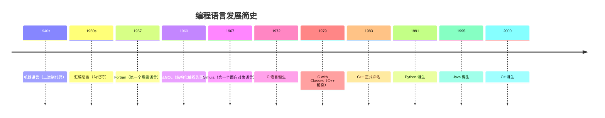
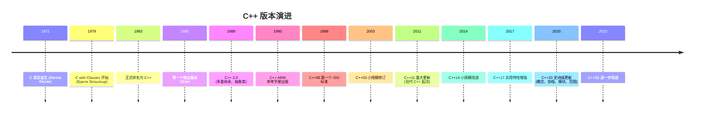
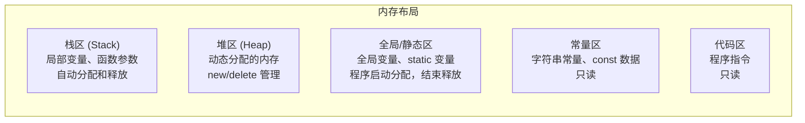
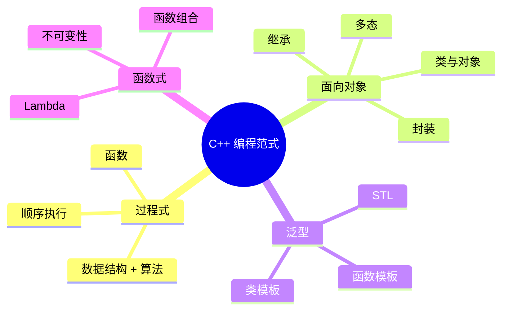
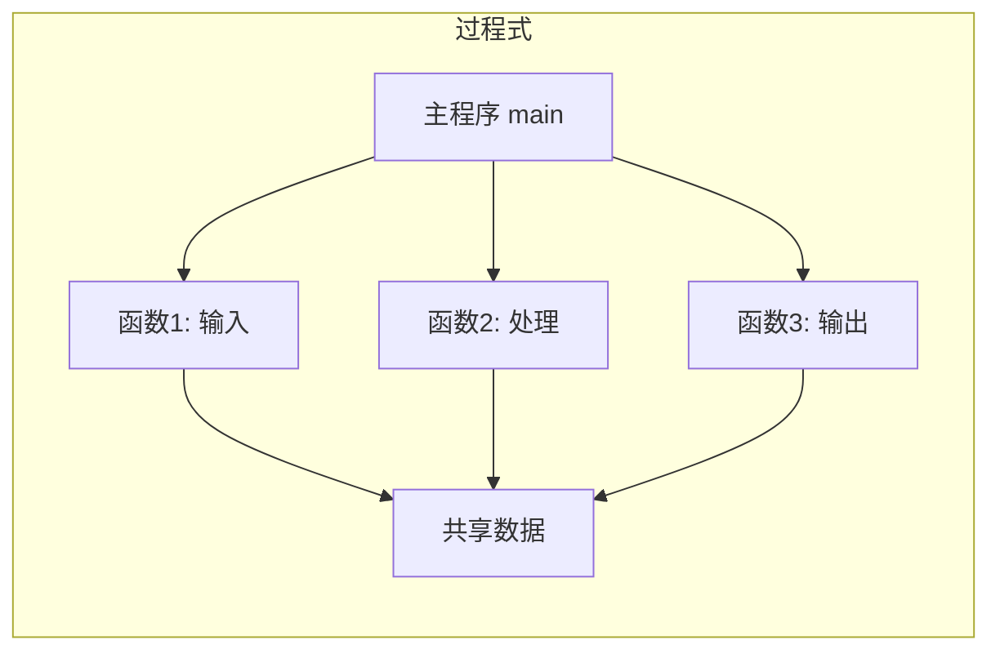
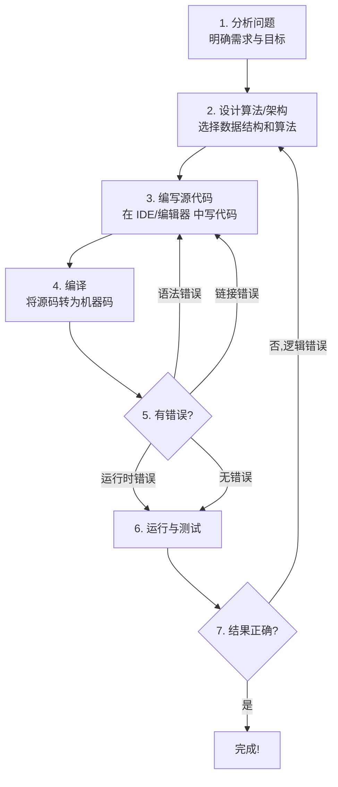
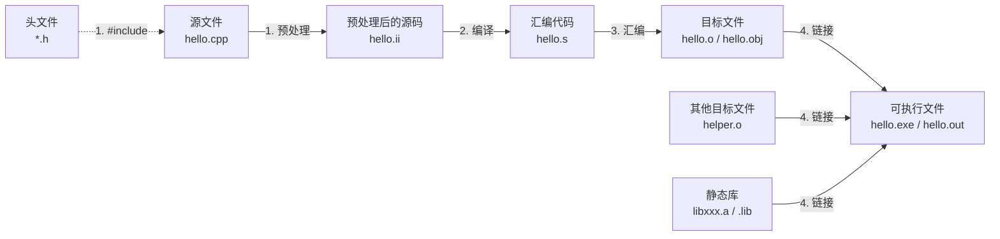
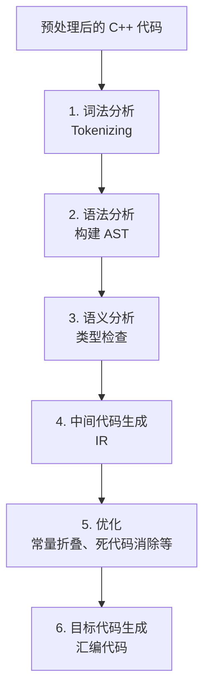
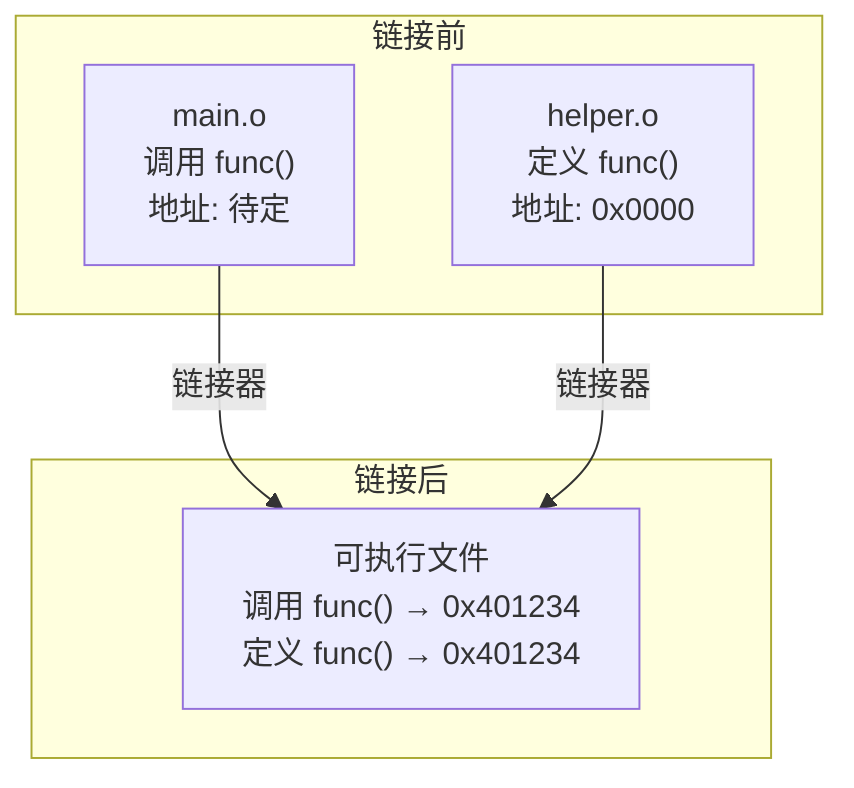

# 第 1 章：预备知识

> **本章目标**: 了解 C++ 的背景、编程语言的发展历程、计算机基础概念、C++ 的编程范式，以及如何搭建开发环境编写第一个程序。

本章面向 **零基础初学者**，不要求有任何编程经验。我们将从计算机最基础的知识讲起，逐步过渡到 C++ 语言的背景、特性，最终让你能够搭建开发环境并运行第一个 C++ 程序。

---

## 1.1 C++ 背景与历史

### 1.1.1 编程语言的起源——从机器语言到高级语言

在了解 C++ 之前，我们先看看计算机编程语言的发展脉络。



**早期编程**：
- **机器语言**：程序员直接写二进制指令（如 `10110000 01100001`），极度繁琐、易出错
- **汇编语言**：用助记符代替二进制（如 `MOV AL, 61h`），仍与硬件强耦合
- **高级语言**：用接近自然语言的语法编写（如 `a = b + 1`），编译器自动转换为机器码

### 1.1.2 C 语言——C++ 的前身

C 语言由 **Dennis Ritchie**（丹尼斯·里奇）于 1972 年在 **贝尔实验室** 设计，用于重写 UNIX 操作系统。要理解 C 语言为何如此重要，我们需要回顾一下当时的背景。

在 C 语言出现之前，操作系统主要用 **汇编语言** 编写，这意味着每次移植到新的硬件平台都需要从头重写。1970 年左右，Ken Thompson 用汇编语言写出了 UNIX 的第一个版本，但他意识到这种方式不可持续。Ritchie 设计了 C 语言，用 C 重写了 UNIX，使得 UNIX 成为 **第一个用高级语言编写的可移植操作系统**。

C 语言的核心特点：

| 特性 | 说明 | 意义 |
|------|------|------|
| **过程式编程** | 以函数为组织单元，按顺序执行 | 程序逻辑清晰，易于理解 |
| **高效** | 生成代码接近汇编语言的执行效率 | 适合系统级编程 |
| **简洁** | 核心语法紧凑，仅约 30 个关键字 | 学习成本低，编译器实现简单 |
| **可移植** | 在不同硬件平台之间移植相对容易 | 一次编写，多处编译 |
| **强大** | 支持指针直接操作内存 | 灵活但危险，需谨慎使用 |

C 语言至今仍是 **TIOBE 编程语言排行榜** 的前几名，在嵌入式系统、操作系统内核、硬件驱动等领域占据统治地位。

### 1.1.3 C++ 的诞生——Bjarne Stroustrup 的愿景

**Bjarne Stroustrup**（比雅尼·斯特劳斯特鲁普）于 1979 年在贝尔实验室开始开发 **"C with Classes"**。他当时面临一个实际问题：他在写博士论文和分布式系统相关的软件，需要用 Simula 的面向对象特性来组织大型程序，但 Simula 太慢了；C 语言很快但缺少组织大型程序所需的抽象机制。

于是 Stroustrup 决定 **在 C 语言的基础上添加面向对象编程的支持**。他借鉴了 Simula 的类机制，保留了 C 语言的高效性。1983 年，这门语言正式命名为 **C++**，其中的 "++" 是 C 语言的自增运算符，寓意 "C 的进阶版"。

**C++ 的核心设计目标**：

1. **保留 C 语言的高效性、简洁性和可移植性** —— "不为你不需要的东西付出代价"（zero-overhead principle）
2. **添加面向对象编程（OOP）支持** —— 类、继承、多态、封装
3. **保持与 C 语言的向后兼容性** —— 几乎所有的 C 代码都可以在 C++ 中编译运行
4. **不牺牲运行效率来换取语言特性** —— 相比 C，C++ 没有额外的运行时开销
5. **支持多种编程范式** —— 过程式、面向对象、泛型、函数式

> **历史趣闻**：Stroustrup 最初想将这门新语言命名为 "C with Classes"，但同事们觉得这个名字不够有冲击力。最终命名为 C++，源自 C 语言的自增运算符 `++`，暗示 "C 语言的自增版本"。Rick Mascitti 在 1983 年首次提出了这个名字。

### 1.1.4 C++ 的版本演进



#### C++98/03 —— 经典 C++

C++98 是 C++ 的第一个国际标准（ISO/IEC 14882:1998），由 ANSI 和 ISO 联合标准化。C++03 是一个小规模修订，主要是修正缺陷，没有引入新特性。

**关键特性**：
- 标准模板库（STL）：`vector`、`list`、`map`、`string`、`algorithm`
- 模板（Template）：函数模板、类模板、模板特化
- 异常处理：`try`/`catch`/`throw`
- RTTI（运行时类型识别）：`dynamic_cast`、`typeid`
- 命名空间（namespace）
- bool 类型
- `new`/`delete` 运算符

#### C++11 —— 现代 C++ 的起点

C++11（原名 C++0x，因为原本预期在 200x 年发布，但推迟到了 2011 年）是一次 **里程碑式的重大更新**，它彻底改变了人们编写 C++ 的方式。

**关键特性**：

| 特性 | 说明 | 代码示例 |
|------|------|---------|
| `auto` 类型推导 | 编译器自动推断类型 | `auto x = 42; // int` |
| `decltype` | 获取表达式的类型 | `decltype(x) y = x;` |
| 范围 for 循环 | 简化容器遍历 | `for (auto& x : vec)` |
| Lambda 表达式 | 匿名函数 | `[](int x){ return x*2; }` |
| 智能指针 | 自动内存管理 | `std::unique_ptr`、`shared_ptr` |
| `nullptr` | 类型安全的空指针 | 替代 `NULL` 宏 |
| 移动语义 | 资源转移而非拷贝 | `std::move()`、移动构造函数 |
| `std::array` | 固定大小数组容器 | `std::array<int, 5> arr;` |
| 线程库 | 跨平台多线程 | `std::thread`、`std::mutex` |
| 右值引用 | 支持完美转发 | `T&&` |

#### C++14 —— 小规模改进

C++14 是 C++11 的补充和改进，没有引入颠覆性的新特性。

**关键特性**：
- 泛型 Lambda：`auto` 参数类型的 Lambda
- Lambda 捕获初始化器
- 返回值类型推导（`auto` 返回类型）
- `constexpr` 函数放宽限制
- `std::make_unique` 工具函数

```cpp
// C++14: 泛型 Lambda
auto add = [](auto a, auto b) { return a + b; };
std::cout << add(1, 2) << std::endl;     // 3
std::cout << add(1.5, 2.3) << std::endl; // 3.8
```

#### C++17 —— 实用特性

C++17 引入了一系列实用的语法糖和库改进。

**关键特性**：
- 结构化绑定（Structured Bindings）
- `if constexpr`（编译期条件分支）
- 折叠表达式（Fold Expressions）
- 内联变量（Inline Variables）
- `std::optional`、`std::variant`、`std::any`
- 文件系统库（`std::filesystem`）
- 并行算法

```cpp
// C++17: 结构化绑定
std::map<std::string, int> scores;
auto [iter, inserted] = scores.insert({"Alice", 95});
if (inserted) {
    std::cout << "插入成功" << std::endl;
}
```

#### C++20 —— 史诗级更新

C++20 的更新幅度堪比 C++11，被很多开发者称为 "C++2.0"。

**关键特性**：
- **概念（Concepts）**：对模板参数的约束和检查
- **协程（Coroutines）**：异步编程的原生支持
- **模块（Modules）**：替代头文件的新编译模型
- **范围库（Ranges）**：声明式数据管道
- **三路比较运算符**：`<=>`（太空飞船运算符）
- `constexpr` 大幅扩展：`constexpr` 虚函数、`constexpr` `try-catch`
- `std::format`：类似 Python 的字符串格式化

```cpp
// C++20: Concepts
template<typename T>
concept Addable = requires(T a, T b) {
    { a + b } -> std::convertible_to<T>;
};

template<Addable T>
T add(T a, T b) {
    return a + b;
}
```

#### C++23 —— 继续演进

C++23 是一次相对较小的更新，主要完善了 C++20 引入的特性。

**关键特性**：
- 显式 `this` 参数（Deducing This）
- `std::print` / `std::println`：更简洁的输出
- `std::expected`：错误处理新方式
- `if consteval`：编译期检查
- 多维数组下标运算符 `operator[]`

> **学习建议**：本书覆盖到 C++11/14 的主要特性。虽然现在最新的标准是 C++23，但从 C++98/11 入门最合适。大多数工业级代码仍使用 C++11/14/17，底层原理在不同版本间是相通的。

---

## 1.2 计算机基础

在学习 C++ 之前，了解一些计算机底层基础知识会非常有帮助。这些概念虽然抽象，但却是理解很多 C++ 特性的基础。

### 1.2.1 二进制（Binary）

计算机内部所有数据都以 **二进制** 形式存储和运算。二进制只使用两个数字：**0 和 1**，每个 0 或 1 称为一个 **位（bit，比特）**。

**为什么用二进制？**
- 电子电路容易实现两种状态：开（1）/关（0）、高电压（1）/低电压（0）
- 可靠性高，抗干扰能力强
- 布尔代数可以直接映射到电路逻辑

**二进制与十进制的转换**：

从十进制转二进制：**除 2 取余，倒序排列**

例如，将十进制数 13 转换为二进制：
```
13 ÷ 2 = 6 余 1  ↑
 6 ÷ 2 = 3 余 0  │
 3 ÷ 2 = 1 余 1  │
 1 ÷ 2 = 0 余 1  │ (从下往上读)
```
结果：$13_{10} = 1101_2$

从二进制转十进制：**按权重求和**

$$
1101_2 = 1 \times 2^3 + 1 \times 2^2 + 0 \times 2^1 + 1 \times 2^0 = 8 + 4 + 0 + 1 = 13_{10}
$$

**常用二进制术语**：

| 单位 | 大小 | 示例 |
|------|------|------|
| 1 bit（位） | 0 或 1 | 一个开关状态 |
| 1 byte（字节） | 8 bits | 一个英文字母，如 'A' |
| 1 KB（千字节） | 1024 bytes | 一段短文本 |
| 1 MB（兆字节） | 1024 KB | 一张照片 |
| 1 GB（吉字节） | 1024 MB | 一部电影 |

### 1.2.2 十六进制（Hexadecimal）

十六进制用 0-9 和 A-F 共 **16 个符号** 表示数字。它是对二进制的"缩写"：**每 4 位二进制对应 1 位十六进制**。

**对照表**：

| 二进制 | 十六进制 | 十进制 |
|--------|----------|--------|
| 0000 | 0 | 0 |
| 0001 | 1 | 1 |
| 0010 | 2 | 2 |
| 0011 | 3 | 3 |
| 0100 | 4 | 4 |
| 0101 | 5 | 5 |
| 0110 | 6 | 6 |
| 0111 | 7 | 7 |
| 1000 | 8 | 8 |
| 1001 | 9 | 9 |
| 1010 | A | 10 |
| 1011 | B | 11 |
| 1100 | C | 12 |
| 1101 | D | 13 |
| 1110 | E | 14 |
| 1111 | F | 15 |

**转换示例**：

将二进制 `1011 1100 1110 0001` 转十六进制：
```
1011 = B
1100 = C
1110 = E
0001 = 1
结果：0xBCE1  （C++ 中十六进制前缀为 0x）
```

**在 C++ 中表示进制**：
```cpp
int decimal = 42;      // 十进制
int binary  = 0b101010; // 二进制（C++14 起支持）
int octal   = 052;      // 八进制（以 0 开头）
int hex     = 0x2A;     // 十六进制（以 0x 开头）

// 输出不同进制
std::cout << std::dec << 42 << std::endl;   // 十进制：42
std::cout << std::hex << 42 << std::endl;   // 十六进制：2a
std::cout << std::oct << 42 << std::endl;   // 八进制：52
std::cout << std::bitset<8>(42) << std::endl; // 二进制：00101010
```

### 1.2.3 补码与负数的表示

计算机如何表示负数？这涉及到 **补码（Two's Complement）** 的概念。

#### 原码、反码、补码

**原码**：最高位为符号位（0 正 1 负），其余位表示数值。

```
+5 的原码（8位）：0000 0101
-5 的原码（8位）：1000 0101
```

但原码有两个问题：
1. 存在两个零：`0000 0000` 和 `1000 0000`（+0 和 -0）
2. 加法运算复杂，需要单独处理符号位

**反码**：正数的反码与原码相同；负数的反码是原码除符号位外按位取反。

```
+5 的反码：0000 0101
-5 的反码：1111 1010
```

**补码**（现代计算机实际使用的方案）：正数的补码与原码相同；负数的补码是反码加 1。

```
+5 的补码：0000 0101
-5 的补码：1111 1011

计算过程：
1. +5 的原码：0000 0101
2. 按位取反：1111 1010（反码）
3. 加 1：     1111 1011（补码）
```

**补码的数学原理**：

对于 $n$ 位有符号整数，补码表示的范围是 $-2^{n-1}$ 到 $2^{n-1} - 1$。

补码的核心思想是：**负数 $x$ 的补码表示为 $2^n - |x|$**。

$$
-5 \text{ 的 8 位补码} = 2^8 - 5 = 256 - 5 = 251 = 11111011_2
$$

**补码的优势**：
1. 只有一种零的表示
2. 加法和减法可以统一使用加法电路实现（减法 = 加补码）
3. 符号位可以参与运算，无需特殊处理

**验证**：$5 + (-5) = 0$

```
  0000 0101  (+5)
+ 1111 1011  (-5 的补码)
-----------
 10000 0000  → 最高位溢出丢弃，得到 0000 0000 = 0 ✓
```

### 1.2.4 ASCII 与 Unicode

计算机只能存储数字，那如何表示文本呢？答案是 **字符编码**。
ASCII（American Standard Code for Information Interchange，美国信息交换标准代码）是最早也是最基础的字符编码方案，使用 7 位二进制（或 8 位中的低 7 位）表示 128 个字符。

**ASCII 表（常用部分）**：

| 范围 | 类别 | 示例 |
|------|------|------|
| `0x00` - `0x1F` (0-31) | 控制字符 | `\n` (10)、`\t` (9) |
| `0x20` (32) | 空格 | `' '` |
| `0x30` - `0x39` (48-57) | 数字 | `'0'` = 48, `'1'` = 49 |
| `0x41` - `0x5A` (65-90) | 大写字母 | `'A'` = 65, `'B'` = 66 |
| `0x61` - `0x7A` (97-122) | 小写字母 | `'a'` = 97, `'b'` = 98 |

> **记忆技巧**：
> - `'0'` = 48，`'A'` = 65，`'a'` = 97
> - 大写字母与小写字母相差 32：`'a'` - `'A'` = 32

**Unicode** 是更通用的编码方案，旨在包含世界上所有文字系统。常见的 Unicode 编码方式有：

- **UTF-8**：变长编码（1-4 字节），兼容 ASCII，互联网上最流行
- **UTF-16**：变长编码（2 或 4 字节），Windows 和 Java 内部使用
- **UTF-32**：定长编码（4 字节），处理简单但空间浪费

**在 C++ 中处理字符**：
```cpp
#include <iostream>

int main() {
    char ch = 'A';
    std::cout << "字符: " << ch << std::endl;           // A
    std::cout << "ASCII 值: " << (int)ch << std::endl;   // 65
    std::cout << "进制: " << std::hex << (int)ch << std::endl; // 41

    // 字符运算
    char lower = ch + 32;  // 'a'
    std::cout << "小写: " << lower << std::endl;         // a

    // 数字字符转数字
    char digit = '7';
    int num = digit - '0';  // 7
    std::cout << "数字: " << num << std::endl;           // 7

    return 0;
}
```

### 1.2.5 内存模型基础

理解内存模型对学习 C++（尤其是指针部分）至关重要。



**内存地址**：每个字节都有一个唯一的地址，用十六进制表示：

```cpp
int x = 42;
int* ptr = &x;  // 取 x 的地址，如 0x61FE0C

std::cout << "x 的值: " << x << std::endl;          // 42
std::cout << "x 的地址: " << &x << std::endl;       // 0x61FE0C
std::cout << "指针的值: " << ptr << std::endl;      // 0x61FE0C
std::cout << "解引用: " << *ptr << std::endl;       // 42
```

---

## 1.3 编程范式

C++ 被设计为 **多范式编程语言**，支持四种主要的编程风格。理解这些范式对于写出高质量 C++ 代码至关重要。



### 1.3.1 过程式编程（Procedural Programming）

**核心思想**：程序 = 数据结构 + 算法。以 **函数** 为基本组织单元，数据在函数之间传递和处理。

**特点**：
- 自上而下的结构化设计
- 函数之间通过参数传递数据
- 全局变量可在所有函数间共享



**完整示例**：学生成绩管理系统（过程式风格）

```cpp
#include <iostream>
#include <string>
#include <vector>

// 全局常量
const int MAX_STUDENTS = 100;

// 数据结构
struct Student {
    std::string name;
    int score;
};

// 函数声明
void inputScores(std::vector<Student>& students, int count);
double calcAverage(const std::vector<Student>& students);
void printReport(const std::vector<Student>& students, double avg);

// 主函数
int main() {
    int count;
    std::vector<Student> students;

    std::cout << "请输入学生人数: ";
    std::cin >> count;

    inputScores(students, count);
    double avg = calcAverage(students);
    printReport(students, avg);

    return 0;
}

// 函数定义
void inputScores(std::vector<Student>& students, int count) {
    students.resize(count);
    for (int i = 0; i < count; ++i) {
        std::cout << "请输入第 " << (i + 1) << " 位学生的姓名和成绩: ";
        std::cin >> students[i].name >> students[i].score;
    }
}

double calcAverage(const std::vector<Student>& students) {
    double sum = 0;
    for (const auto& s : students) {
        sum += s.score;
    }
    return sum / students.size();
}

void printReport(const std::vector<Student>& students, double avg) {
    std::cout << "\n===== 成绩报告 =====\n";
    for (const auto& s : students) {
        std::cout << s.name << ": " << s.score
                  << (s.score >= avg ? " (达标)" : " (需努力)") << std::endl;
    }
    std::cout << "班级平均分: " << avg << std::endl;
}
```

**适用场景**：
- 简单的、线性处理逻辑
- 不需要复杂的数据关系
- 对性能要求极高的场景
- 嵌入式系统、内核模块

### 1.3.2 面向对象编程（Object-Oriented Programming, OOP）

**核心思想**：将数据 **和** 操作数据的方法 **绑定在一起**，形成 **对象**。通过对象之间的交互来完成任务。

**OOP 三大特性**：

| 特性 | 说明 | C++ 机制 | 现实比喻 |
|------|------|----------|----------|
| **封装** | 将数据和操作绑定，对外隐藏实现细节 | `class`、访问修饰符 `private`/`protected`/`public` | 自动挡汽车：你只管踩油门，引擎内部原理被封装 |
| **继承** | 从已有类派生出新类，复用和扩展代码 | `class Derived : public Base` | 儿子继承父亲的基因，又有自己的新特点 |
| **多态** | 同一接口在不同上下文中表现出不同行为 | `virtual` 函数、函数重载、模板 | 同样的"播放"操作，对 MP3 和视频的行为不同 |

**完整示例**：学生成绩管理系统（OOP 风格）

```cpp
#include <iostream>
#include <string>
#include <vector>
#include <memory>

// 封装：抽象基类
class Person {
protected:
    std::string name_;
    int age_;

public:
    Person(const std::string& name, int age)
        : name_(name), age_(age) {}

    virtual void introduce() const {
        std::cout << "我叫 " << name_ << "，今年 " << age_ << " 岁。" << std::endl;
    }

    virtual ~Person() = default; // 虚析构函数，确保派生类正确析构
};

// 继承：Student 继承自 Person
class Student : public Person {
private:
    int score_;

public:
    Student(const std::string& name, int age, int score)
        : Person(name, age), score_(score) {}

    // 多态：重写基类的 introduce 方法
    void introduce() const override {
        std::cout << "我叫 " << name_ << "，今年 " << age_ << " 岁，"
                  << "成绩 " << score_ << " 分。" << std::endl;
    }

    int getScore() const { return score_; }
    void setScore(int score) { score_ = score; }
};

// 多态：另一个派生类
class Teacher : public Person {
private:
    std::string subject_;

public:
    Teacher(const std::string& name, int age, const std::string& subject)
        : Person(name, age), subject_(subject) {}

    void introduce() const override {
        std::cout << "我是 " << subject_ << " 老师，"
                  << "我叫 " << name_ << "。" << std::endl;
    }
};

int main() {
    // 多态的威力：用基类指针管理派生类对象
    std::vector<std::unique_ptr<Person>> people;

    people.push_back(std::make_unique<Student>("小明", 18, 95));
    people.push_back(std::make_unique<Teacher>("张老师", 35, "C++"));
    people.push_back(std::make_unique<Student>("小红", 17, 88));

    // 同一接口，不同行为
    for (const auto& p : people) {
        p->introduce();  // 调用各自的实际类型的方法
    }

    return 0;
}
```

**封装的好处**：
- 降低复杂度：调用者不需要了解内部实现
- 保护数据：防止外部随意修改内部状态
- 易于维护：修改内部实现不影响外部代码

**继承的好处**：
- 代码复用：共享基类的公共代码
- 层次结构：建立类之间的层级关系
- 扩展性：在不修改现有代码的基础上增加新功能

**多态的好处**：
- 统一接口：用相同的代码处理不同类型的对象
- 可扩展：新增类型不需要修改现有代码（开闭原则）

### 1.3.3 泛型编程（Generic Programming）

**核心思想**：编写 **与类型无关** 的代码。让算法和数据结构不依赖于具体的数据类型。

**实现方式**：**模板（Template）**。

**优势**：
- 代码复用最大化：一份代码适用于多种类型
- 类型安全：编译时进行类型检查
- 零开销抽象：模板在编译时展开，没有运行时性能损失

**完整示例**：

```cpp
#include <iostream>
#include <string>
#include <vector>

// ===== 函数模板 =====
// 找出数组中的最大值（适用于任意可比较的类型）
template <typename T>
T findMax(const std::vector<T>& arr) {
    if (arr.empty()) {
        throw std::runtime_error("空数组无法求最大值");
    }
    T max_val = arr[0];
    for (size_t i = 1; i < arr.size(); ++i) {
        if (arr[i] > max_val) {
            max_val = arr[i];
        }
    }
    return max_val;
}

// ===== 类模板 =====
// 简单的栈（Stack）容器
template <typename T, size_t Capacity = 100>
class Stack {
private:
    T data_[Capacity];
    size_t top_;

public:
    Stack() : top_(0) {}

    void push(const T& value) {
        if (top_ >= Capacity) {
            throw std::overflow_error("栈已满");
        }
        data_[top_++] = value;
    }

    T pop() {
        if (top_ == 0) {
            throw std::underflow_error("栈已空");
        }
        return data_[--top_];
    }

    bool isEmpty() const { return top_ == 0; }
    size_t size() const { return top_; }
};

int main() {
    // 函数模板的使用：编译器自动推导类型
    std::vector<int>    int_vec    = {3, 7, 1, 9, 4};
    std::vector<double> double_vec = {2.5, 1.8, 3.14, 0.9};

    std::cout << "整数最大值: " << findMax(int_vec) << std::endl;      // 9
    std::cout << "浮点数最大值: " << findMax(double_vec) << std::endl; // 3.14

    // 类模板的使用：指定类型
    Stack<int, 10> int_stack;
    int_stack.push(1);
    int_stack.push(2);
    int_stack.push(3);
    std::cout << "出栈: " << int_stack.pop() << std::endl;  // 3

    Stack<std::string> string_stack;
    string_stack.push("Hello");
    string_stack.push("World");
    std::cout << "出栈: " << string_stack.pop() << std::endl;  // World

    return 0;
}
```

**STL（Standard Template Library，标准模板库）** 是泛型编程的巅峰之作，包含三大组件：

| 组件 | 说明 | 示例 |
|------|------|------|
| **容器（Containers）** | 存储数据的数据结构 | `vector`、`list`、`map`、`set` |
| **迭代器（Iterators）** | 遍历容器的统一接口 | `begin()`、`end()` |
| **算法（Algorithms）** | 操作数据的通用算法 | `sort`、`find`、`transform` |

```cpp
// STL 综合示例
#include <iostream>
#include <vector>
#include <algorithm>
#include <numeric>

int main() {
    std::vector<int> nums = {5, 2, 8, 1, 9, 3};

    // 算法：排序
    std::sort(nums.begin(), nums.end());

    // 算法：查找
    auto it = std::find(nums.begin(), nums.end(), 8);
    if (it != nums.end()) {
        std::cout << "找到 8 在位置: " << (it - nums.begin()) << std::endl;
    }

    // 算法：变换（每个元素乘以 2）
    std::transform(nums.begin(), nums.end(), nums.begin(),
                   [](int n) { return n * 2; });

    // 算法：求和
    int sum = std::accumulate(nums.begin(), nums.end(), 0);

    for (int n : nums) {
        std::cout << n << " ";
    }
    std::cout << "\n总和: " << sum << std::endl;

    return 0;
}
```

### 1.3.4 函数式编程（Functional Programming）

**核心思想**：将计算视为 **数学函数的求值**，避免状态变化和可变数据。强调 **不可变性（immutability）** 和 **纯函数（pure function）**。

**C++ 对函数式编程的支持**（C++11 及以后）：
- **Lambda 表达式**：匿名函数
- **`std::function`**：通用函数包装器
- **算法中的谓词（Predicate）**：`std::all_of`、`std::any_of`、`std::find_if`
- **`std::bind`**：函数绑定

**纯函数的定义**：
1. 相同的输入总是产生相同的输出
2. 没有副作用（不修改外部状态）

```cpp
// 纯函数 vs 非纯函数
int global = 0;

// 非纯函数：依赖和修改外部状态
int impure(int x) {
    global++;        // 副作用：修改了外部变量
    return x + global;
}

// 纯函数：不依赖外部状态，无副作用
int pure(int x, int y) {
    return x + y;    // 输出完全由输入决定
}
```

**Lambda 表达式详解**：

```cpp
// Lambda 语法：[捕获列表](参数列表) -> 返回类型 { 函数体 }

// 1. 最简单的 Lambda
auto f1 = [] { return 42; };
std::cout << f1() << std::endl;  // 42

// 2. 带参数的 Lambda
auto add = [](int a, int b) -> int { return a + b; };
std::cout << add(3, 4) << std::endl;  // 7

// 3. 捕获外部变量
int multiplier = 3;
auto times = [multiplier](int x) { return x * multiplier; };
std::cout << times(5) << std::endl;  // 15

// 4. 引用捕获（可修改外部变量）
int counter = 0;
auto increment = [&counter]() { counter++; };
increment();
std::cout << counter << std::endl;  // 1

// 5. 捕获所有外部变量
int a = 1, b = 2;
auto f2 = [=] { return a + b; };  // [=] 按值捕获所有变量
auto f3 = [&] { return a + b; };  // [&] 按引用捕获所有变量
```

**函数式风格综合示例**：

```cpp
#include <iostream>
#include <vector>
#include <algorithm>
#include <numeric>

int main() {
    std::vector<int> nums = {1, 2, 3, 4, 5, 6, 7, 8, 9, 10};

    // 声明式编程：描述"做什么"而非"怎么做"

    // 过滤出偶数
    std::vector<int> evens;
    std::copy_if(nums.begin(), nums.end(),
                 std::back_inserter(evens),
                 [](int n) { return n % 2 == 0; });
    // evens = {2, 4, 6, 8, 10}

    // 映射：每个偶数乘以 3
    std::vector<int> mapped;
    std::transform(evens.begin(), evens.end(),
                   std::back_inserter(mapped),
                   [](int n) { return n * 3; });
    // mapped = {6, 12, 18, 24, 30}

    // 归约：求和
    int sum = std::accumulate(mapped.begin(), mapped.end(), 0);
    // sum = 90

    std::cout << "结果: " << sum << std::endl;  // 90

    // 链式风格（C++20 ranges 更简洁）
    // auto result = nums | std::views::filter([](int n) { return n % 2 == 0; })
    //                   | std::views::transform([](int n) { return n * 3; })
    //                   | std::ranges::fold_left(0, std::plus{});

    return 0;
}
```

### 1.3.5 范式对比与选择

| 维度 | 过程式 | 面向对象 | 泛型 | 函数式 |
|------|--------|----------|------|--------|
| **组织单元** | 函数 | 类/对象 | 模板 | 函数 |
| **数据与行为** | 分离 | 绑定 | 由模板参数决定 | 分离 |
| **代码复用方式** | 函数调用 | 继承/组合 | 模板实例化 | 函数组合 |
| **状态管理** | 全局/局部变量 | 对象成员 | 由设计决定 | 避免可变状态 |
| **运行时开销** | 几乎为零 | 虚函数有微小开销 | 编译时展开，无开销 | Lambda 可内联 |
| **适用规模** | 小型程序 | 中大型项目 | 通用库/算法 | 数据处理 |
| **学习曲线** | 平缓 | 中等 | 较陡 | 中等 |

**实际项目中的范式混合**：

现实中的 C++ 项目通常 **混合使用** 多种范式：

```cpp
// 混合范式示例
#include <iostream>
#include <vector>
#include <algorithm>
#include <memory>

// 泛型：模板函数
template <typename T>
T square(T x) { return x * x; }

// OOP：类封装
class DataProcessor {
private:
    std::vector<int> data_;

public:
    void addData(int x) { data_.push_back(x); }  // 过程式：顺序执行

    void process() {
        // 函数式：Lambda + 算法
        std::transform(data_.begin(), data_.end(), data_.begin(),
                       [](int x) { return square(x); });
    }

    void print() const {
        for (int x : data_) {
            std::cout << x << " ";
        }
        std::cout << std::endl;
    }
};

int main() {
    DataProcessor dp;
    dp.addData(1);
    dp.addData(2);
    dp.addData(3);
    dp.process();   // 过程式：调用方法
    dp.print();     // 输出: 1 4 9
    return 0;
}
```

---

## 1.4 C++ 程序的开发流程

### 1.4.1 程序开发七步曲



### 1.4.2 编译与链接全过程详解

C++ 源文件到可执行文件需要经过 **四个阶段**：



#### 第一阶段：预处理（Preprocessing）

预处理器处理所有以 `#` 开头的指令，生成纯 C++ 代码。

```cpp
// hello.cpp
#include <iostream>      // 将 iostream 文件的内容插入到此处
#define PI 3.14159       // 将代码中所有 PI 替换为 3.14159
#ifdef DEBUG             // 条件编译
#define LOG(x) std::cout << x
#else
#define LOG(x)
#endif

int main() {
    double r = 5.0;
    double area = PI * r * r;  // PI 被替换为 3.14159
    LOG("area = " << area);    // 非 DEBUG 模式下，此行被删除
    return 0;
}
```

**查看预处理结果**：
```bash
g++ -E hello.cpp -o hello.ii   # 生成预处理后的文件（可查看）
```

预处理后的 `hello.ii` 文件可能长达数万行（因为 `<iostream>` 包含了很多内容）。

**预处理完成的工作**：
- `#include`：头文件内容替换
- `#define`：宏定义替换
- `#ifdef` / `#ifndef` / `#endif`：条件编译
- `#pragma`：编译器指令
- 删除注释

#### 第二阶段：编译（Compilation）

编译器将预处理后的 C++ 代码翻译为 **汇编语言**。这是最核心的阶段，包含多个子步骤：



**查看编译结果（汇编代码）**：
```bash
g++ -S hello.cpp -o hello.s   # 生成汇编代码文件
```

`hello.s` 的部分内容示例：
```asm
main:
    pushq   %rbp
    movq    %rsp, %rbp
    movl    $5, -4(%rbp)
    movsd   LC0(%rip), %xmm0
    cvtsi2sdl   -4(%rbp), %xmm1
    mulsd   %xmm1, %xmm0
    mulsd   -4(%rbp), %xmm0
    cvttsd2si   %xmm0, %eax
    ...
```

#### 第三阶段：汇编（Assembly）

汇编器将汇编代码翻译为 **机器码**（目标文件），这是二进制格式的文件。

**查看目标文件**：
```bash
g++ -c hello.cpp -o hello.o    # 生成目标文件
objdump -d hello.o              # 反汇编查看机器码
nm hello.o                      # 查看符号表
```

目标文件（`.o` 或 `.obj`）包含：
- 机器指令（`.text` 段）
- 已初始化的全局数据（`.data` 段）
- 未初始化的全局数据（`.bss` 段）
- 符号表（Symbol Table）：记录函数和变量的名称和位置
- 重定位信息（Relocation）：标记需要修正的地址

#### 第四阶段：链接（Linking）

链接器将多个目标文件和库文件 **组合** 成最终的可执行文件。这是很多人容易忽略的关键步骤。

**链接器的主要工作**：

1. **符号解析**：将每个目标文件中未定义的符号（如函数调用、外部变量）与其他目标文件中定义的符号进行匹配
2. **重定位**：将符号引用转换为实际的内存地址
3. **段合并**：将各目标文件的相同段合并（如所有 `.text` 段合并）



**常见的链接错误**：

```text
undefined reference to `func'   // 找不到函数定义
multiple definition of `func'   // 函数被重复定义了
cannot find -lxxx              // 找不到指定的库
```

**查看可执行文件信息**：
```bash
g++ -o program hello.cpp helper.cpp
file program    # 查看文件类型
ldd program     # 查看依赖的动态库（Linux）
objdump -d program  # 反汇编
```

### 1.4.3 多文件编译

实际项目不会把代码都写在一个文件中，而是 **分模块组织**。

```cpp
// ===== math_utils.h =====
#ifndef MATH_UTILS_H    // 头文件保护（防止重复包含）
#define MATH_UTILS_H

int add(int a, int b);
int multiply(int a, int b);

#endif

// ===== math_utils.cpp =====
#include "math_utils.h"

int add(int a, int b) {
    return a + b;
}

int multiply(int a, int b) {
    return a * b;
}

// ===== main.cpp =====
#include <iostream>
#include "math_utils.h"

int main() {
    std::cout << "3 + 4 = " << add(3, 4) << std::endl;
    std::cout << "3 * 4 = " << multiply(3, 4) << std::endl;
    return 0;
}
```

**编译多文件项目**：
```bash
# 方式一：一步到位（编译器自动处理中间文件）
g++ -o program main.cpp math_utils.cpp

# 方式二：分步编译（推荐，大型项目必需）
g++ -c main.cpp -o main.o          # 编译第一个源文件
g++ -c math_utils.cpp -o math_utils.o  # 编译第二个源文件
g++ -o program main.o math_utils.o     # 链接所有目标文件

# 方式三：包含路径指定
g++ -I../include -o program main.cpp math_utils.cpp  # -I 指定头文件搜索路径
```

**分步编译的优势**：
- 修改一个文件只需重新编译该文件，节省时间
- 便于使用 Makefile 等构建工具自动化管理
- 可以发现编译和链接阶段的分离问题

### 1.4.4 静态链接 vs 动态链接

| 特性 | 静态链接（.lib / .a） | 动态链接（.dll / .so） |
|------|----------------------|----------------------|
| **链接时机** | 编译时 | 运行时 |
| **文件大小** | 可执行文件更大 | 可执行文件更小 |
| **内存占用** | 每个进程一份拷贝 | 内存中共享一份 |
| **更新维护** | 需重新链接 | 替换 DLL 即可 |
| **依赖问题** | 无运行时依赖 | 缺少 DLL 会报错 |
| **示例** | `libc++.a` | `libc++.so` / `libc++.dll` |

```bash
# 静态链接示例
g++ -static -o program main.cpp    # 生成静态链接的可执行文件

# 动态链接示例（默认）
g++ -o program main.cpp             # 默认使用动态链接
```

### 1.4.5 Makefile 基础

手动编译多文件项目太麻烦，**Makefile** 可以自动化这个过程。

```makefile
# Makefile 示例
CXX = g++
CXXFLAGS = -std=c++11 -Wall -Wextra -g
TARGET = program
OBJS = main.o math_utils.o helper.o

# 默认目标
all: $(TARGET)

# 链接规则
$(TARGET): $(OBJS)
	$(CXX) -o $(TARGET) $(OBJS)

# 编译规则（模式匹配）
%.o: %.cpp
	$(CXX) $(CXXFLAGS) -c $< -o $@

# 清理
clean:
	rm -f $(OBJS) $(TARGET)

# 运行
run: $(TARGET)
	./$(TARGET)

.PHONY: all clean run
```

**使用 Makefile**：
```bash
make        # 构建项目
make clean  # 清理构建产物
make run    # 构建并运行
```

### 1.4.6 CMake 基础

CMake 是更现代化的构建系统，跨平台、功能强大。

```cmake
# CMakeLists.txt 示例
cmake_minimum_required(VERSION 3.10)
project(MyProject VERSION 1.0.0)

# 设置 C++ 标准
set(CMAKE_CXX_STANDARD 11)
set(CMAKE_CXX_STANDARD_REQUIRED ON)

# 启用所有警告
if(MSVC)
    add_compile_options(/W4)
else()
    add_compile_options(-Wall -Wextra)
endif()

# 收集源文件
set(SOURCES
    main.cpp
    math_utils.cpp
    helper.cpp
)

# 添加头文件搜索路径
include_directories(${CMAKE_CURRENT_SOURCE_DIR}/include)

# 生成可执行文件
add_executable(${PROJECT_NAME} ${SOURCES})

# 安装规则（可选）
install(TARGETS ${PROJECT_NAME} DESTINATION bin)
```

**使用 CMake**：
```bash
mkdir build && cd build    # 创建独立的构建目录
cmake ..                   # 配置项目（生成 Makefile 或 VS 工程）
cmake --build .            # 编译项目（等价于 make）
./MyProject                # 运行

# 或者一步到位
cmake -B build             # 创建并配置 build 目录
cmake --build build        # 编译
```

> **学习建议**：初学者可以先从单文件编译开始，理解每个编译选项的含义。当项目规模增长后，再学习 Makefile 和 CMake。千万不要一开始就在构建工具上耗费过多精力。

---

## 1.5 C++ 编译器与开发环境

### 1.5.1 主流编译器详解

| 编译器 | 平台 | 特点 | 基本命令 |
|--------|------|------|----------|
| **GCC (G++)** | Linux/macOS/Windows (MinGW) | 开源免费，标准支持好 | `g++ source.cpp -o prog` |
| **Clang (clang++)** | macOS/Linux/Windows | 错误信息友好，编译快 | `clang++ source.cpp -o prog` |
| **MSVC (cl.exe)** | Windows (Visual Studio) | Windows 最佳集成 | `cl source.cpp` |
| **MinGW-w64** | Windows | GCC 的 Windows 移植版 | `g++ source.cpp -o prog.exe` |
| **Intel C++ (icx)** | 跨平台 | Intel CPU 极致优化 | `icx source.cpp -o prog` |

#### GCC/G++（GNU Compiler Collection）

GCC 是 Linux 上最主流的编译器，也是大多数教程默认使用的编译器。

**Windows 上安装 GCC（MinGW-w64）**：

**方法一：MSYS2（推荐）**
```bash
1. 下载 MSYS2: https://www.msys2.org/
2. 安装到默认路径（如 C:\msys64）
3. 打开 MSYS2 UCRT64 终端
4. 更新包管理器：
   pacman -Syu
5. 安装 MinGW-w64 GCC：
   pacman -S mingw-w64-ucrt-x86_64-gcc
6. 安装其他工具：
   pacman -S mingw-w64-ucrt-x86_64-gdb  # 调试器
   pacman -S mingw-w64-ucrt-x86_64-make  # Make
   pacman -S mingw-w64-ucrt-x86_64-cmake # CMake
7. 将 C:\msys64\ucrt64\bin 添加到系统 PATH
```

**方法二：直接下载 MinGW-w64**
```bash
1. 访问 https://winlibs.com/
2. 下载最新的 UCRT 运行时版本的 MinGW-w64 压缩包
3. 解压到指定目录（如 C:\mingw64）
4. 将 C:\mingw64\bin 添加到系统 PATH
```

**验证安装**：
```bash
g++ --version
gcc --version
gdb --version
```

#### Clang

Clang 是 LLVM 项目的前端编译器，以 **友好的错误信息** 著称。

**Windows 安装 Clang**：
- 方法一：通过 MSYS2 安装：`pacman -S mingw-w64-ucrt-x86_64-clang`
- 方法二：下载 LLVM 官方安装包：https://releases.llvm.org/

```bash
clang++ --version
clang++ -o program main.cpp   # 用法与 g++ 基本一致
```

#### MSVC（Visual Studio）

MSVC 是 Windows 上功能最全的 C++ 编译器，集成在 Visual Studio 中。

**安装步骤**：
```bash
1. 下载 Visual Studio Community（免费）:
   https://visualstudio.microsoft.com/vs/community/
2. 运行安装程序
3. 选择工作负载："使用 C++ 的桌面开发"
4. 在可选组件中勾选：
   - MSVC v143 - VS 2022 C++ x64/x86 生成工具
   - Windows 10/11 SDK
   - C++ CMake tools for Windows
5. 点击"安装"（约 5-10GB，需要一定时间）
```

MSVC 通常通过 **Developer Command Prompt** 使用：
```bash
cl /EHsc hello.cpp   # /EHsc 启用 C++ 异常处理
```

### 1.5.2 VS Code + MinGW 完整配置指南

VS Code 是当前最流行的轻量级编辑器，配合 MinGW 可以搭建完美的 C++ 开发环境。

#### 第一步：安装 VS Code
```bash
1. 下载: https://code.visualstudio.com/
2. 安装时勾选"添加到 PATH"、"通过 code 打开"等选项
3. 安装完成后重启
```

#### 第二步：安装 MinGW-w64
按照 1.5.1 节中的方法安装 MinGW-w64，并确保 `g++` 在 PATH 中。

#### 第三步：安装 VS Code 扩展
打开 VS Code，点击左侧扩展图标（或按 `Ctrl+Shift+X`），搜索并安装以下扩展：

| 扩展名 | 作者 | 作用 |
|--------|------|------|
| **C/C++** | Microsoft | C++ 语法高亮、IntelliSense、调试 |
| **C/C++ Extension Pack** | Microsoft | 额外工具包 |
| **Code Runner** | Jun Han | 一键编译运行 |
| **C++ Themes** | Microsoft | C++ 预设主题（可选） |
| **Bracket Pair Colorizer** | 可选 | 彩色括号匹配 |

#### 第四步：配置 tasks.json（编译任务）

按 `Ctrl+Shift+P`，搜索并选择 "C/C++: Edit Configurations (JSON)"，然后创建 `launch.json` 和 `tasks.json`。

```json
// .vscode/tasks.json（编译任务配置）
{
    "version": "2.0.0",
    "tasks": [
        {
            "label": "C++ 编译",
            "type": "cppbuild",
            "command": "g++",
            "args": [
                "-std=c++11",
                "-Wall",
                "-Wextra",
                "-g",
                "${file}",
                "-o",
                "${fileDirname}\\${fileBasenameNoExtension}.exe"
            ],
            "group": {
                "kind": "build",
                "isDefault": true
            },
            "problemMatcher": ["$gcc"],
            "detail": "编译当前 C++ 文件"
        },
        {
            "label": "C++ 编译运行",
            "type": "shell",
            "command": "g++",
            "args": [
                "-std=c++11",
                "-Wall",
                "-g",
                "${file}",
                "-o",
                "${fileDirname}\\${fileBasenameNoExtension}.exe"
            ],
            "group": "build",
            "problemMatcher": ["$gcc"],
            "dependsOn": [],
            "detail": "编译当前文件",
            "presentation": {
                "panel": "dedicated"
            }
        }
    ]
}
```

```json
// .vscode/launch.json（调试配置）
{
    "version": "0.2.0",
    "configurations": [
        {
            "name": "C++ 调试（GDB）",
            "type": "cppdbg",
            "request": "launch",
            "program": "${fileDirname}\\${fileBasenameNoExtension}.exe",
            "args": [],
            "stopAtEntry": false,
            "cwd": "${fileDirname}",
            "environment": [],
            "externalConsole": false,
            "MIMode": "gdb",
            "miDebuggerPath": "gdb.exe",
            "preLaunchTask": "C++ 编译",
            "setupCommands": [
                {
                    "description": "启用 GDB 美化打印",
                    "text": "-enable-pretty-printing",
                    "ignoreFailures": true
                }
            ]
        }
    ]
}
```

#### 第五步：配置 Code Runner（可选）

```json
// settings.json（Code Runner 配置）
{
    "code-runner.runInTerminal": true,
    "code-runner.executorMap": {
        "cpp": "cd $dir && g++ -std=c++11 -Wall -Wextra -g $fileName -o $fileNameWithoutExt.exe && ./$fileNameWithoutExt.exe"
    }
}
```

按 `Ctrl+Alt+N` 即可一键编译运行当前 C++ 文件。

### 1.5.3 常用编译命令详解

```bash
# ===== 基础编译 =====

# 基本用法：输入文件 + 输出文件名
g++ -o program program.cpp

# 不指定输出文件名（默认 a.exe 或 a.out）
g++ program.cpp
./a.exe    # 或 ./a.out

# ===== 标准版本控制 =====

g++ -std=c++98 -o program program.cpp   # C++98 标准
g++ -std=c++11 -o program program.cpp   # C++11 标准（本书推荐）
g++ -std=c++14 -o program program.cpp   # C++14 标准
g++ -std=c++17 -o program program.cpp   # C++17 标准
g++ -std=c++20 -o program program.cpp   # C++20 标准

# ===== 警告控制 =====

g++ -Wall -o program program.cpp        # 启用常用警告
g++ -Wall -Wextra -o program program.cpp # 启用更详细的警告
g++ -Wall -Wextra -Werror -o program program.cpp  # 将警告视为错误
g++ -w -o program program.cpp            # 禁用所有警告（不推荐）

# ===== 调试与优化 =====

g++ -g -o program program.cpp           # 包含调试信息（GDB 调试必需）
g++ -O0 -o program program.cpp          # 不优化（默认，调试用）
g++ -O1 -o program program.cpp          # 轻度优化
g++ -O2 -o program program.cpp          # 中度优化（发布版本常用）
g++ -O3 -o program program.cpp          # 最大优化（可能增加编译时间）
g++ -Os -o program program.cpp          # 优化代码大小
g++ -Ofast -o program program.cpp       # 激进优化（可能不符合标准）

# ===== 链接相关 =====

g++ -o program program.cpp -lm          # 链接数学库
g++ -o program program.cpp -lpthread    # 链接 POSIX 线程库
g++ -o program program.cpp -lssl -lcrypto # 链接 OpenSSL 库
g++ -static -o program program.cpp      # 静态链接

# ===== 路径指定 =====

g++ -I./include -o program program.cpp  # -I: 添加头文件搜索路径
g++ -L./lib -o program program.cpp -lmy # -L: 添加库搜索路径

# ===== 预处理与汇编 =====

g++ -E program.cpp -o program.ii        # 仅预处理（展开宏和头文件）
g++ -S program.cpp -o program.s         # 编译到汇编代码
g++ -c program.cpp -o program.o         # 仅编译（生成目标文件）
```

### 1.5.4 常见编译错误与解决方法

#### 第一类：语法错误（Syntax Error）

```cpp
// 错误示例
int main() {
    cout << "Hello" << endl  // 错误：缺少分号
    return 0
}
```

**编译器输出**：
```
error: expected ';' before 'return'
error: expected ';' before '}' token
```

**解决**：检查每一行末尾的分号，大括号是否匹配。

#### 第二类：链接错误（Linker Error）

```cpp
// file1.cpp
int add(int a, int b);  // 声明但没有定义

// main.cpp
int main() {
    add(1, 2);  // 编译通过，但链接失败
}
```

**编译器输出**：
```
undefined reference to `add(int, int)'
```

**解决**：确保所有函数都有对应的定义，且所有目标文件都已正确链接。

#### 第三类：类型错误（Type Error）

```cpp
int main() {
    std::string s = "Hello";
    int x = s;  // 错误：无法将 std::string 转换为 int
}
```

**编译器输出**：
```
error: cannot convert 'std::string' to 'int' in initialization
```

**解决**：检查变量类型是否匹配，必要时使用类型转换。

#### 第四类：未定义行为（Undefined Behavior）

```cpp
int main() {
    int arr[5];
    arr[10] = 42;  // 编译通过，但运行时可能崩溃（数组越界）
}
```

这类错误通常 **没有错误信息**（编译器假设程序员知道自己在做什么），是最危险的错误。需要通过分析工具（如 AddressSanitizer）检测。

#### 第五类：头文件相关错误

```cpp
#include <iostream.h>  // 错误：C++ 标准库头文件没有 .h 后缀
```

**编译器输出**：
```
fatal error: iostream.h: No such file or directory
```

**解决**：C++ 标准库头文件没有扩展名（如 `<iostream>`、`<vector>`），C 标准库头文件写作 `<cname>`（如 `<cmath>`、`<cstdlib>`）。

### 1.5.5 调试器基础

调试器（Debugger）是定位运行时错误的利器。GDB（GNU Debugger）是 G++ 配套的调试器。

**调试前的准备**：编译时添加 `-g` 选项
```bash
g++ -g -o program program.cpp
```

**GDB 常用命令**：

| 命令 | 缩写 | 作用 |
|------|------|------|
| `run` | `r` | 运行程序 |
| `break` | `b` | 设置断点：`b main`、`b 10` |
| `next` | `n` | 单步执行（跳过函数） |
| `step` | `s` | 单步进入函数 |
| `continue` | `c` | 继续执行到下一断点 |
| `print` | `p` | 打印变量值：`p x`、`p arr[0]` |
| `backtrace` | `bt` | 查看函数调用栈 |
| `list` | `l` | 查看源代码 |
| `quit` | `q` | 退出 GDB |

**调试示例**：
```bash
g++ -g -o debug_test debug_test.cpp
gdb ./debug_test
```

```gdb
(gdb) b main          # 在 main 函数设置断点
(gdb) r               # 运行程序（停在 main 入口）
(gdb) n               # 执行下一行
(gdb) p i             # 打印变量 i 的值
(gdb) b 25 if x > 10  # 条件断点：在第 25 行停止，条件为 x > 10
(gdb) c               # 继续执行
(gdb) bt              # 查看调用栈（程序崩溃时非常有用）
```

---

## 1.6 C++ 源文件的基本结构

### 1.6.1 最小程序框架

每个 C++ 程序都从 `main` 函数开始执行。

```cpp
// 最简单的 C++ 程序
int main() {
    return 0;  // 0 表示程序正常结束
}
```

### 1.6.2 标准程序框架

```cpp
// ============================
// 文件名: example.cpp
// 描述: C++ 程序标准结构示例
// 作者: ...
// 日期: 2024-01-01
// ============================

// 1. 预处理指令
#include <iostream>     // 标准输入输出流
#include <string>       // 字符串类
#include <vector>       // 动态数组容器
#include <cmath>        // 数学函数（sqrt, sin, cos 等）
#include "my_header.h"  // 用户自定义头文件（用引号）

// 2. 宏定义与常量
#define VERSION "1.0.0"
const int MAX_USERS = 1000;

// 3. 类型别名
using Byte = unsigned char;
typedef int* IntPtr;  // C 风格（不推荐新代码使用）

// 4. 全局声明
extern int global_count;  // 声明外部变量
void helperFunction();     // 函数原型声明

// 5. 主函数（唯一入口）
int main(int argc, char* argv[]) {  // 命令行参数
    // 程序主体
    std::cout << "Hello, C++!" << std::endl;
    
    // argc: 命令行参数个数
    // argv: 命令行参数数组
    for (int i = 0; i < argc; ++i) {
        std::cout << "argv[" << i << "] = " << argv[i] << std::endl;
    }
    
    return 0;  // 返回 0 表示成功
}

// 6. 函数定义
void helperFunction() {
    std::cout << "This is a helper function." << std::endl;
}
```

### 1.6.3 头文件组织方式

头文件（`.h` 或 `.hpp`）用于 **声明** 接口，源文件（`.cpp`）用于 **实现** 细节。

#### 头文件保护（Include Guard）

防止同一个头文件被多次包含（会导致重复定义错误）。

```cpp
// 方式一：#ifndef 保护（传统方式，兼容所有编译器）
#ifndef MATH_UTILS_H
#define MATH_UTILS_H

int add(int a, int b);
double divide(double a, double b);

#endif  // MATH_UTILS_H


// 方式二：#pragma once（现代方式，更简洁）
#pragma once

int add(int a, int b);
double divide(double a, double b);
```

> **建议**：新项目中优先使用 `#pragma once`，简洁且不易出错。在需要最大兼容性时使用传统的 `#ifndef` 方式。

#### 头文件应该放什么？

```cpp
// my_class.h
#pragma once

#include <string>   // 需要包含用到的类型的头文件

// 可以放在头文件的内容：
class MyClass {     // 类定义
public:
    MyClass(int id);
    void setName(const std::string& name);
    std::string getName() const;
    
private:
    int id_;
    std::string name_;
};

// 内联函数（可以在头文件中定义）
inline int square(int x) {
    return x * x;
}

// 常量
constexpr int MAX_SIZE = 100;

// 模板（必须在头文件中，因为编译时需实例化）
template <typename T>
T max(T a, T b) {
    return a > b ? a : b;
}
```

#### 头文件不应该放什么？

```cpp
// 不要在头文件中：
int global_var = 42;       // 全局变量定义（会在多个翻译单元中重复定义）
void doSomething() {       // 非内联函数定义（链接时会报多重定义）
    // ...
}
```

### 1.6.4 多文件项目结构

合理组织多文件项目是 **工程化 C++ 编程** 的基础。

```text
project/
├── include/              # 头文件目录
│   ├── utils/
│   │   ├── math_utils.h
│   │   └── string_utils.h
│   └── core/
│       ├── student.h
│       └── teacher.h
├── src/                  # 源文件目录
│   ├── main.cpp
│   ├── utils/
│   │   ├── math_utils.cpp
│   │   └── string_utils.cpp
│   └── core/
│       ├── student.cpp
│       └── teacher.cpp
├── tests/                # 测试文件
│   ├── test_math.cpp
│   └── test_string.cpp
├── build/                # 构建输出
├── CMakeLists.txt        # CMake 配置
└── README.md
```

**各文件内容示例**：

```cpp
// include/utils/math_utils.h
#pragma once

namespace math_utils {
    int add(int a, int b);
    int multiply(int a, int b);
    double power(double base, int exp);
}

// src/utils/math_utils.cpp
#include "utils/math_utils.h"

namespace math_utils {
    int add(int a, int b) {
        return a + b;
    }
    
    int multiply(int a, int b) {
        return a * b;
    }
    
    double power(double base, int exp) {
        double result = 1.0;
        for (int i = 0; i < exp; ++i) {
            result *= base;
        }
        return result;
    }
}

// src/main.cpp
#include <iostream>
#include "utils/math_utils.h"

int main() {
    using namespace math_utils;
    
    std::cout << "3 + 4 = " << add(3, 4) << std::endl;
    std::cout << "2^10 = " << power(2, 10) << std::endl;
    
    return 0;
}
```

**编译多文件项目**：
```bash
# 需要编译所有 .cpp 文件并链接
g++ -I include -o program src/main.cpp src/utils/math_utils.cpp src/utils/string_utils.cpp

# 或用 CMake 管理
cd build
cmake ..
cmake --build .
```

---

## 1.7 编程风格与命名规范

良好的编程风格如同写得一手好字——不仅自己看着舒服，别人阅读时也赏心悦目。在团队协作中，统一的代码风格比个人技巧更重要。

### 1.7.1 命名规范详解

#### 常见命名风格

```cpp
// PascalCase（大驼峰）：每个单词首字母大写
class BankAccount;          // 类名
void GetTotalAmount();      // 函数（Java 风格）

// camelCase（小驼峰）：首单词小写，后续单词首字母大写
int totalCount;             // 变量（Java 风格）
void getTotalAmount();      // 函数

// snake_case（下划线风格）：全小写，单词间用下划线分隔
int total_count;            // 变量（C/C++ 标准库风格）
void get_total_amount();    // 函数

// SCREAMING_SNAKE_CASE（大写下划线）：全大写
const double PI = 3.14159;  // 常量
const int MAX_BUFFER_SIZE = 4096;
#define VERSION "1.0.0"     // 宏定义

// kebab-case（连字符风格）：C++ 中不能用（连字符是减号运算符）
```

#### C++ 推荐命名约定

| 元素 | 风格 | 示例 | 说明 |
|------|------|------|------|
| **类/结构体** | PascalCase | `class BankAccount` | 名词或名词短语 |
| **函数** | PascalCase 或 snake_case | `GetBalance()` / `get_balance()` | 动词或动词短语 |
| **变量** | snake_case 或 camelCase | `student_name` / `studentName` | 名词，表达含义 |
| **成员变量** | snake_case + 后缀 `_` | `name_`、`age_` | 下划线后缀区分成员变量 |
| **常量** | SCREAMING_SNAKE_CASE | `MAX_SIZE` | 全大写 |
| **宏** | SCREAMING_SNAKE_CASE | `#define BUFFER_SIZE 1024` | 全大写，避免与常量冲突 |
| **命名空间** | snake_case（小写） | `namespace math_utils` | 简短，全小写 |
| **枚举** | 类型名 PascalCase + 值 SCREAMING | `enum Color { RED, GREEN, BLUE }` | 类型 PascalCase，值全大写 |

#### 命名原则

1. **名如其意（Self-documenting）**：名字应表达其含义
   ```cpp
   // 差的命名
   int d;               // 什么意思？天数？数据？距离？
   int a;               // 年龄？金额？答案？
   
   // 好的命名
   int days_until_deadline;
   double account_balance;
   ```

2. **避免缩写（除非是通用缩写）**：
   ```cpp
   // 避免
   int idx;     // index? idx 不是标准缩写
   int stk_sz;  // 什么意思？
   
   // 推荐
   int index;
   int stack_size;
   
   // 可接受的通用缩写
   int num_students;  // num = number
   std::string msg;   // msg = message
   const int MAX = 100;  // MAX = maximum
   ```

3. **根据作用域决定长度**：
   ```cpp
   // 作用域小（如循环变量），可短
   for (int i = 0; i < 10; ++i) { ... }
   
   // 作用域大（如全局变量），应长
   const int MAXIMUM_NUMBER_OF_CONCURRENT_CONNECTIONS = 1000;
   ```

### 1.7.2 代码格式与布局

#### 大括号风格

```cpp
// Allman 风格（推荐）：大括号独占一行
int main()
{
    if (condition)
    {
        // ...
    }
    else
    {
        // ...
    }
}

// K&R 风格：大括号在行尾
int main() {
    if (condition) {
        // ...
    } else {
        // ...
    }
}

// 1TBS 风格：K&R 的变体，else 在 } 后面
int main() {
    if (condition) {
        // ...
    } else {
        // ...
    }
}
```

#### 空白与间距

```cpp
// 好的间距
int x = a + b * c;              // 运算符两端加空格
int result = my_function(3, 4); // 逗号后面加空格
if (x > 0 && y < 10) {          // 关键字后面加空格
    // ...
}
for (int i = 0; i < n; ++i) {   // 分号后面加空格
    // ...
}

// 差的间距
int x=a+b*c;                     // 拥挤，难以阅读
int result=my_function(3,4);     // 逗号后无空格
if(x>0&&y<10){                   // 一团糟
    // ...
}
```

#### 使用空行分组

```cpp
class Student {
private:
    std::string name_;     // 同类成员放在一起
    int age_;
    int score_;
                           // 空行分隔不同类别
    static int total_count_;
    static const int MAX_SCORE = 100;

public:
    // 构造函数
    Student(const std::string& name, int age, int score);
                           // 空行分隔不同功能组
    // 访问器（getter/setter）
    std::string getName() const;
    void setName(const std::string& name);
    
    // 核心功能
    void printInfo() const;
    bool isPassing() const;
};
```

### 1.7.3 注释的最佳实践

```cpp
// ============================
// 不好的注释
// ============================

int a = 10;  // 将 10 赋值给 a（废话！明显的事情不要注释）

// 计算
int result = a + b;  // 计算 a + b 的结果（更是废话！）


// ============================
// 好的注释
// ============================

// 使用二分查找以 O(log n) 时间复杂度定位插入位置
// 因为数据已经排序，线性查找效率太低
int pos = binary_search(data, target);

// 使用匈牙利算法解决指派问题，使总成本最小化
// 输入: cost_matrix[n][n] - 每个工人完成每个任务的成本
// 输出: assignment[n] - 每个工人被指派的任务编号
void hungarian_algorithm(const std::vector<std::vector<double>>& cost_matrix,
                         std::vector<int>& assignment);


// ============================
// TODO 注释（标记待办事项）
// ============================

// TODO: 这里需要处理边界情况：n 为 0 时怎么办？
// FIXME: 该算法在大数据量下性能不足，需要优化
// HACK: 以下实现绕过了编译器的一个 bug，后续版本需清理
```

### 1.7.4 文件头注释

大型项目中的每个文件都应该包含文件头注释：

```cpp
// ============================================================================
// 文件名   : math_utils.cpp
// 作者     : Zhang San
// 创建日期 : 2024-01-15
// 最后修改 : 2024-03-20
// 描述     : 数学工具函数实现
// 版本     : 1.2.0
//
// 修改历史 :
// 1.0.0 (2024-01-15) - 初始版本
// 1.1.0 (2024-02-10) - 添加 power 函数
// 1.2.0 (2024-03-20) - 优化 sqrt 算法，性能提升 30%
// ============================================================================
```

---

## 1.8 C++ 的应用领域

C++ 的学习曲线虽然陡峭，但它在很多领域都是 **不可替代** 的核心语言。了解 C++ 的实际应用场景有助于激发学习动力。

### 1.8.1 游戏开发

C++ 是 **游戏引擎** 的王者语言，几乎所有主流游戏引擎都使用 C++：

| 引擎 | 用途 | 代表作品 |
|------|------|----------|
| **Unreal Engine** | AAA 大作 | 堡垒之夜、黑神话：悟空 |
| **Unity**（核心引擎 C++） | 跨平台手游/端游 | 原神、王者荣耀 |
| **CryEngine** | 高端 3D 游戏 | 孤岛危机系列 |
| **Godot** | 开源引擎 | 多种独立游戏 |
| **自研引擎** | 大厂定制 | 暴雪、育碧、腾讯 |

### 1.8.2 操作系统与系统编程

操作系统内核需要极致的性能和底层硬件控制能力，C++ 是首选：

- **Windows**：大量核心组件使用 C++
- **Linux 内核**：虽然是 C 语言为主，但驱动和模块可用 C++
- **macOS/iOS**：内核 XNU 混合使用 C 和 C++
- **嵌入式 RTOS**：FreeRTOS、Zephyr 等
- **编译器和工具链**：GCC、Clang、LLVM 都是 C++ 编写

### 1.8.3 金融与高频交易

在金融领域，**速度就是金钱**。高频交易系统需要在微秒级别做出决策。

- **交易引擎**：订单匹配、风险控制
- **量化分析**：回测系统、策略执行
- **市场数据处理**：实时行情解析
- **代表性公司**：Jane Street、Citadel、Two Sigma
- **代表性框架**：QuantLib（金融衍生品定价库）

```cpp
// 高频交易中的低延迟设计示例
struct alignas(64) Order {  // 缓存行对齐，避免伪共享
    int64_t order_id;
    int64_t price;          // 价格，用整数避免浮点误差
    int32_t quantity;
    char    symbol[8];
    uint8_t side;           // 0=买, 1=卖
    uint8_t type;           // 0=限价, 1=市价
};
static_assert(sizeof(Order) == 64, "Order must be cache-line aligned");
```

### 1.8.4 数据库与存储系统

数据库需要高效的存储引擎和查询处理器：

- **MySQL/MariaDB**：存储引擎（InnoDB）
- **MongoDB**：核心引擎
- **LevelDB/RocksDB**：高性能键值存储（Facebook）
- **Redis**：虽然核心是 C，但模块可用 C++
- **ClickHouse**：列式数据分析数据库

### 1.8.5 AI/机器学习框架

深度学习框架的性能关键部分依赖 C++：

| 框架 | C++ 的作用 | 前端语言 |
|------|-----------|----------|
| **TensorFlow** | 核心引擎、算子实现 | Python |
| **PyTorch** | 张量库、自动求导引擎 | Python |
| **ONNX Runtime** | 推理引擎 | 多种语言 |
| **llama.cpp** | 本地 LLM 推理 | C++ |
| **XGBoost** | 梯度提升树核心 | Python/R |

> 虽然你用 Python 写 AI 代码，但底层实际干活的是 C++。学好了 C++，你就理解了"上层调用下层"的全栈视角。

### 1.8.6 浏览器与 Web 引擎

现代浏览器是 C++ 工程的巅峰之作：

- **Chrome (Blink/V8)**：V8 JavaScript 引擎和 Blink 渲染引擎都是 C++
- **Firefox (Gecko/SpiderMonkey)**：C++ 编写
- **Safari (WebKit/JavaScriptCore)**：C++ 编写
- **Edge**：原 EdgeHTML 是 C++，现改用 Chromium

### 1.8.7 嵌入式与物联网

C++ 在资源受限的嵌入式设备上提供"零成本抽象"：

- **Arduino**：基于 C/C++
- **树莓派 Pico**：C++ SDK
- **ROS2**（机器人操作系统）：核心 C++
- **自动驾驶**：百度 Apollo、NVIDIA DriveWorks
- **无人机**：PX4、ArduPilot 固件

### 1.8.8 图形学与多媒体

- **计算机图形学**：OpenGL、Vulkan、DirectX 的 SDK 和示例程序
- **图像处理**：OpenCV（计算机视觉库）
- **音视频编解码**：FFmpeg、x264
- **3D 建模与动画**：Blender、Maya、3ds Max 的核心逻辑
- **CAD 软件**：AutoCAD、SolidWorks

---

## 1.9 如何学习 C++

### 1.9.1 C++ 学习路线图

```mermaid
flowchart TD
    subgraph 第一阶段【入门】
        A["1. 基本语法<br/>变量、类型、运算符"] --> B["2. 流程控制<br/>if、switch、for、while"]
        B --> C["3. 函数<br/>参数、返回值、重载"]
        C --> D["4. 数组与字符串"]
        D --> E["5. 指针入门"]
    end
    
    subgraph 第二阶段【进阶】
        E --> F["6. 类与对象<br/>封装、构造/析构"]
        F --> G["7. 继承与多态<br/>virtual 函数、抽象类"]
        G --> H["8. 运算符重载<br/>友元函数"]
        H --> I["9. 文件 I/O<br/>fstream"]
    end
    
    subgraph 第三阶段【高级】
        I --> J["10. 模板编程<br/>函数模板、类模板"]
        J --> K["11. STL 容器与算法<br/>vector、map、sort"]
        K --> L["12. 异常处理"]
        L --> M["13. 智能指针与内存管理"]
    end
    
    subgraph 第四阶段【专业化】
        M --> N["14. C++11/14/17 新特性"]
        N --> O["15. 设计模式<br/>单例、工厂、观察者等"]
        O --> P["16. 多线程编程<br/>thread、mutex、async"]
        P --> Q["17. 网络编程<br/>socket、boost.asio"]
        Q --> R["18. 大型项目实践"]
    end
```

### 1.9.2 推荐学习资源

**书籍推荐（按学习顺序）**：

| 阶段 | 书名 | 作者 | 理由 |
|------|------|------|------|
| **入门** | 《C++ Primer Plus（第6版）》 | Stephen Prata | 本书！从零开始，循序渐进 |
| **入门** | 《C++ Primer（第5版）》 | Lippman 等 | 更系统、更权威的入门经典 |
| **进阶** | 《Effective C++》 | Scott Meyers | 55 条最佳实践，必读 |
| **进阶** | 《More Effective C++》 | Scott Meyers | 深入更多细节 |
| **进阶** | 《Effective Modern C++》 | Scott Meyers | C++11/14 特性最佳实践 |
| **高级** | 《C++ Templates: The Complete Guide》 | Vandevoorde | 模板完全指南 |
| **高级** | 《The C++ Standard Library》 | Josuttis | STL 大全 |
| **实践** | 《Accelerated C++》 | Koenig & Moo | 快速上手实践 |

**在线资源**：

| 资源 | 类型 | 特点 |
|------|------|------|
| [cppreference.com](https://cppreference.com) | 在线文档 | 最权威的 C++ 参考手册 |
| [learncpp.com](https://learncpp.com) | 教程 | 免费、系统、适合初学者 |
| [isocpp.org](https://isocpp.org) | 官方社区 | 标准动态、FAQ |
| [Stack Overflow](https://stackoverflow.com) | Q&A | 遇到问题先搜索 |
| [Compiler Explorer (godbolt.org)](https://godbolt.org) | 工具 | 在线查看编译后的汇编代码 |

### 1.9.3 学习方法论

1. **动手实践 > 看书/看视频**：编程是实践技能，就像学游泳，你不可能只看视频就学会。每学一个概念，都要亲自写代码验证。

2. **循序渐进，不要跳步**：C++ 的概念环环相扣。连变量都没搞懂就去看多线程，只会事倍功半。

3. **先理解错误信息**：不要一看到英文错误就发懵。花时间理解编译器在说什么，这是最重要的学习技能。

4. **善用调试器**：当程序行为和你预期不符时，不要加一堆 `cout` 来调试，学会用调试器单步执行。

5. **从模仿到创造**：先抄书上的例子跑起来，然后修修改改，最后独立实现。

6. **坚持写代码日记**：记录每日的学习内容、遇到的坑和解决方法。

### 1.9.4 常见学习陷阱

| 陷阱 | 说明 | 建议 |
|------|------|------|
| **过早优化** | 刚学会就担心性能 | 先写出正确的代码，再考虑优化 |
| **过分追求"现代"** | 觉得 C++98 过时了不想学 | 基础概念不因版本变化，打好根基最重要 |
| **依赖 IDE** | 不会使用命令行编译 | 偶尔用命令行编译，理解底层发生了什么 |
| **复制粘贴** | 从网上抄代码但不理解 | 逐行手打，理解每一行的含义 |
| **跳过基础** | 觉得数组简单直接学 STL | 没有数组基础很难理解 vector 的设计 |
| **只学不用** | 学完所有概念才动手 | 学以致用，边学边做小项目 |

---

## 1.10 本章小结

| 知识点 | 掌握程度 | 说明 |
|--------|----------|------|
| C++ 的历史和设计目标 | 了解 | 知道 C++ 的起源、设计者、各版本主要特性 |
| 计算机基础 | 理解 | 二进制、十六进制、补码、ASCII/Unicode |
| C++ 的四/多种编程范式 | 理解 | 能区分过程式/OOP/泛型/函数式的特点和适用场景 |
| 程序的编译-链接过程 | 理解流程 | 知道预处理-编译-汇编-链接四阶段 |
| 主流编译器的使用 | 能基本使用 | 会用 g++/clang++ 编译单个和多个文件 |
| 构建工具基础 | 了解 | 知道 Makefile 和 CMake 的作用和基本用法 |
| 源文件的基本结构 | 熟练书写 | 能写出包含头文件、主函数、函数定义的完整程序 |
| 注释和命名规范 | 养成习惯 | 能写出命名合理、注释得体的代码 |
| C++ 的应用领域 | 了解 | 知道 C++ 在游戏、金融、AI 等领域的重要地位 |
| 学习路线 | 理解 | 知道自己的学习阶段和下一阶段目标 |

---

## 1.11 常见初学者问题 FAQ

### Q1: C++ 难学吗？

**A**: C++ 确实比 Python、JavaScript 等语言复杂，因为它在提供高性能的同时还支持多种编程范式。但"难"不等于"学不会"。《C++ Primer Plus》从零开始，每章都围绕一个核心主题展开。据统计，只要坚持每天写代码练习，**3-6 个月可以入门，1-2 年可以胜任日常工作**。

C++ 的难点主要在于：
- 手动内存管理（指针、new/delete）
- 复杂的模板语法
- 大量的语法细节

但只要勤动手、多练习，这些都不是问题。

### Q2: 我该选哪个编译器/IDE？

**A**: 对初学者，推荐优先级如下：

1. **Windows 用户**：Visual Studio Community（免费、一键安装、调试器强大）> VS Code + MinGW > Code::Blocks
2. **macOS 用户**：Xcode（自带 Clang）> VS Code + Clang > CLion
3. **Linux 用户**：VS Code + GCC > CLion > Vim/Emacs + GCC

本书示例基于标准 C++，在任何编译器中都可运行。

### Q3: C++ 和 C 语言有什么区别？

**A**: C++ 是 C 的超集——几乎所有合法的 C 代码都可以在 C++ 中编译通过（少数例外）。主要区别：

| 维度 | C | C++ |
|------|---|-----|
| **编程范式** | 过程式 | 多范式（过程式 + OOP + 泛型 + 函数式） |
| **抽象机制** | 结构体 + 函数 | 类 + 继承 + 多态 + 模板 |
| **内存管理** | `malloc`/`free` | `new`/`delete` + 智能指针 |
| **标准库** | 小而精 | STL 强大且丰富（容器、算法、字符串） |
| **错误处理** | 错误码 | 异常处理 `try`/`catch` |
| **输入输出** | `printf`/`scanf` | `std::cin`/`std::cout`（类型安全） |

### Q4: 学 C++ 之前需要先学 C 吗？

**A**: **不需要**。本书从零开始，不要求先学 C。虽然 C++ 从语法上看确实包含了 C，但直接从 C++ 入门可以避免一些 C 的不良习惯（如原始指针滥用、缺少类型安全的 I/O 等）。

不过，如果你已经会 C 语言，那么学习 C++ 会有一些优势，因为你可以把精力集中在新特性上。

### Q5: 听说 C++ 有指针，很难，我害怕怎么办？

**A**: 这是几乎所有初学者都有的恐惧。指针其实没那么可怕——可以把内存想象成一个巨大的酒店，每个房间有门牌号（地址）。指针就是这个 **门牌号**，它告诉你数据住在哪个房间。

在本书中，我们会用第 4 章、第 6 章和第 7 章循序渐进地带你理解指针，配合大量的图示和练习。请相信：**如果你觉得指针很难理解，不是你的问题，而是教你的方式有问题**。我们这本书会换一种方式让你真正理解指针。

### Q6: C++ 21/23 都出了，学老版本是不是过时了？

**A**: 完全不。C++98/11 是现代 C++ 的基石：
- 大量工业级代码仍基于 C++98/11/14
- 新标准是对旧标准的扩展，而不是替代
- 理解旧语法才能理解新语法设计的初衷

打个比方：学会了加减乘除，再学微积分就容易了。

### Q7: 用 `using namespace std;` 有什么问题？

**A**: 这是一个有争议的话题。简单来说：

```cpp
#include <iostream>
using namespace std;  // 初学者常用，方便但不推荐

// 问题：当你的项目变大时可能会发生名字冲突
// 比如你自己定义了一个叫 count 的函数，和 std::count 冲突

// 更好的做法：
// 1. 使用作用域限定符（推荐）
std::cout << "Hello" << std::endl;

// 2. 只引入需要的名字
using std::cout;
using std::endl;

// 3. 在局部作用域使用
int main() {
    using namespace std;  // 只在这个函数内有效
    cout << "Hello" << endl;
}
```

**建议**：初学者阶段可以暂时使用 `using namespace std;`，但要明白它的问题。进入第 3 章后尽量改用 `std::`。

### Q8: 遇到看不懂的编译错误怎么办？

**A**: 这是每个程序员都会遇到的问题。以下是处理步骤：

1. **看第一个错误**：通常真正的错误在最前面（后面的可能是连锁反应）
2. **从最后一行往前看**：很多时候最有用的信息在末尾
3. **识别错误类型**：语法错误、类型错误、链接错误还是运行时错误
4. **复制错误信息到搜索引擎**：大概率 Stack Overflow 上有答案
5. **简化问题**：写一个最小的可复现示例来隔离问题

### Q9: 指针和引用有什么区别？

**A**: 这是 C++ 里非常重要且易混淆的概念。

| 特性 | 指针（Pointer） | 引用（Reference） |
|------|----------------|-------------------|
| 语法 | `int* p = &x;` | `int& r = x;` |
| 是否可为空 | 可以（`nullptr`） | 不可以，必须初始化 |
| 能否重新绑定 | 可以指向不同对象 | 不能，一旦绑定不可变 |
| 是否需要解引用 | 需要 `*p` | 直接使用 `r` |
| 是否有自己的地址 | 有（指针本身也是变量） | 没有（引用的别名概念） |

```cpp
int x = 10, y = 20;

// 指针
int* p = &x;    // p 指向 x
p = &y;         // p 改为指向 y（可以重新绑定）
*p = 30;        // y 变成了 30

// 引用
int& r = x;     // r 是 x 的别名
r = 40;         // x 变成了 40，r 仍然绑定 x
// r = y;       // 这不是重新绑定！等价于 x = y
```

引用是 C++ 中更安全的选择，推荐优先使用。当你需要重新绑定时才用指针。

### Q10: 学完这本书后我能做什么？

**A**: 学完《C++ Primer Plus（第6版）》后，你将具备以下能力：
- 用 C++ 编写具有实际功能的命令行程序
- 理解和使用 STL 容器和算法
- 编写面向对象的代码（类、继承、多态）
- 文件读写操作
- 基本的模板编程

在这个基础上，你可以选择深入方向：
- **游戏开发**：学习 Unreal Engine + 图形学
- **系统编程**：学习操作系统 + 网络编程
- **AI/ML**：学习 Python + PyTorch（用 C++ 理解底层）
- **金融/量化**：学习设计模式 + 低延迟编程

### Q11: 如何调试"程序能编译但结果不对"的问题？

**A**: 这是最常见的"逻辑错误"，编译器不会提示你。调试策略：

1. **打印调试**：在关键位置打印变量的值
   ```cpp
   std::cout << "DEBUG: x = " << x << ", y = " << y << std::endl;
   ```

2. **使用调试器**：断点+单步执行，观察变量变化

3. **二分注释法**：注释掉一半代码，看问题是否仍然存在，缩小排查范围

4. **检查边界条件**：数组越界、除以零、空指针等

5. **给"橡皮鸭"讲解**：向一个橡皮鸭逐行解释代码，经常讲着讲着就发现问题了

### Q12: 变量一定要初始化吗？

**A**: **是的，一定要初始化！** 这是新手最容易犯的错误。

```cpp
int x;          // 未初始化！x 的值是不确定的（可能是任何值）
std::cout << x; // 未定义行为！程序的运行结果不可预测

// 正确的做法
int x = 0;      // 明确初始化为 0
int y{};        // C++11 起，值初始化为 0
int z{42};      // C++11 起，列表初始化

// 指针也一样
int* ptr = nullptr;  // 初始化为空指针，而不是放任不管
```

> **规则**：任何变量在声明的同时都要初始化，这是一个能为你节省无数调试时间的好习惯。

### Q13: `=` 是赋值还是判断相等？

**A**: 在 C++ 中：
- `=` 是 **赋值运算符**：`x = 5;`（把 5 赋值给 x）
- `==` 是 **相等比较运算符**：`if (x == 5)`（x 等于 5 吗？）

新手最经典的错误：

```cpp
// 错误
if (x = 5) {   // 这不是判断 x 是否等于 5！
    // 而是把 5 赋值给 x，然后判断 x 是否为真（非零）
    // 这里 x 变成了 5，条件永远为真！
}

// 正确
if (x == 5) {  // 判断 x 是否等于 5
    // ...
}
```

**编程技巧**：有些程序员喜欢写 `if (5 == x)` 把常量写在左边，这样如果不小心写成 `if (5 = x)` 编译器会报错（不能给常量赋值），能从源头避免这个错误。

### Q14: 一个 C++ 程序从编写到运行经历了什么？

**A**: 这是一个很好的面试题。完整的流程如下：

```
1. 编辑阶段     ：用编辑器写源代码（.cpp 和 .h 文件）
2. 预处理阶段   ：预处理器展开 #include、#define 等指令
3. 编译阶段     ：编译器把 C++ 代码翻译成汇编代码
4. 汇编阶段     ：汇编器把汇编代码翻译成机器码（目标文件 .o / .obj）
5. 链接阶段     ：链接器把多个目标文件和库链接成可执行文件
6. 加载阶段     ：操作系统把可执行文件加载到内存
7. 运行阶段     ：CPU 逐条执行指令
```

更详细的介绍参见 1.4.2 节。

### Q15: `int main()` 和 `int main(int argc, char* argv[])` 有什么区别？

**A**:

- `int main()`：不接受命令行参数。大多数入门示例使用这种形式。
- `int main(int argc, char* argv[])`：接受命令行参数。
  - `argc`（argument count）：命令行参数的个数（包括程序名本身）
  - `argv`（argument vector）：字符串数组，存放每个参数

```cpp
// 编译: g++ -o demo test.cpp
// 运行: ./demo hello world 123

int main(int argc, char* argv[]) {
    std::cout << "参数个数: " << argc << std::endl;  // 4
    
    for (int i = 0; i < argc; ++i) {
        std::cout << "argv[" << i << "] = " << argv[i] << std::endl;
    }
    // 输出:
    // argv[0] = demo      （程序名）
    // argv[1] = hello
    // argv[2] = world
    // argv[3] = 123
}
```

### Q16: 头文件用 `< >` 和 `" "` 有什么区别？

**A**:

- `#include <iostream>`：用尖括号，编译器在 **系统头文件目录** 搜索（如 `/usr/include`、编译器安装目录）
- `#include "my_header.h"`：用双引号，编译器 **先在当前源文件所在目录** 搜索，找不到再去系统目录

```cpp
#include <iostream>     // 标准库头文件用 <>
#include "my_header.h"   // 用户自定义头文件用 ""
#include "utils/helper.h" // 子目录下的头文件
```

---

## 1.12 动手练习

下面是一些巩固本章知识的练习题。建议先独立思考，动手写代码，再参考答案提示。

### 练习 1：二进制转换

**题目**：将十进制数 42、100、255 分别转换为二进制和十六进制。

**提示**：
- 除 2 取余法：不断除以 2，记录余数，从下往上读
- 十六进制：每 4 位二进制对应 1 位十六进制
- 验证：用 C++ 程序输出 `std::bitset<8>(42)` 和 `std::hex << 42`

**答案提示**：
```
42 = 0b00101010 = 0x2A
100 = 0b01100100 = 0x64
255 = 0b11111111 = 0xFF
```

### 练习 2：补码计算

**题目**：写出 -7 和 -128 的 8 位二进制补码表示。

**提示**：
- 正数 7 的原码：0000 0111
- 取反：1111 1000
- 加 1：1111 1001
- 验证：`7 + (-7)` 的二进制加法应得到 0

**答案提示**：
```
-7   = 1111 1001
-128 = 1000 0000  （注意：128 = 1000 0000，取反 0111 1111，加 1 = 1000 0000）
```

### 练习 3：编写你的第一个 C++ 程序

**题目**：编写一个程序，输出以下内容：
```
姓名: [你的名字]
年龄: [你的年龄]
爱好: [你的爱好]
```

**答案提示**：
```cpp
#include <iostream>
#include <string>

int main() {
    std::string name = "张三";
    int age = 20;
    std::string hobby = "编程";
    
    std::cout << "姓名: " << name << std::endl;
    std::cout << "年龄: " << age << std::endl;
    std::cout << "爱好: " << hobby << std::endl;
    
    return 0;
}
```

### 练习 4：多文件编译

**题目**：创建三个文件 `add.h`、`add.cpp`、`main.cpp`：
- `add.h` 声明 `int add(int a, int b);`
- `add.cpp` 实现该函数
- `main.cpp` 调用 `add(10, 20)` 并输出结果

然后用命令行编译运行。

**答案提示**：

```cpp
// add.h
#pragma once
int add(int a, int b);

// add.cpp
#include "add.h"
int add(int a, int b) {
    return a + b;
}

// main.cpp
#include <iostream>
#include "add.h"
int main() {
    std::cout << "10 + 20 = " << add(10, 20) << std::endl;
    return 0;
}
```

```bash
# 编译命令
g++ -o program main.cpp add.cpp
./program
```

### 练习 5：编程范式识别

**题目**：阅读以下代码片段，判断它使用了哪种编程范式（过程式、面向对象、泛型、函数式），并说明理由。

```cpp
// 片段 A
int result = 0;
for (int i = 1; i <= 10; ++i) {
    result += i;
}

// 片段 B
template <typename T>
T max(T a, T b) {
    return a > b ? a : b;
}

// 片段 C
class Animal {
public:
    virtual void speak() = 0;
};
class Dog : public Animal {
public:
    void speak() override { std::cout << "Woof!"; }
};

// 片段 D
std::vector<int> nums = {1, 2, 3, 4, 5};
std::for_each(nums.begin(), nums.end(),
              [](int n) { std::cout << n * 2; });
```

**答案提示**：
- 片段 A：过程式（顺序执行、循环累加）
- 片段 B：泛型（模板，与类型无关）
- 片段 C：面向对象（继承 + 多态）
- 片段 D：函数式（Lambda + 算法）

### 练习 6：ASCII 码转换

**题目**：编写程序，输入一个小写字母，输出它的大写形式。要求使用 ASCII 码进行计算（不使用标准库函数）。

**提示**：大写字母和小写字母的 ASCII 码相差 32。

**答案提示**：
```cpp
#include <iostream>

int main() {
    char lower;
    std::cout << "请输入一个小写字母: ";
    std::cin >> lower;
    
    if (lower >= 'a' && lower <= 'z') {
        char upper = lower - 32;  // ASCII 差值为 32
        std::cout << "大写形式: " << upper << std::endl;
        std::cout << "ASCII 值: " << (int)upper << std::endl;
    } else {
        std::cout << "输入不是小写字母！" << std::endl;
    }
    
    return 0;
}
```

### 练习 7：内存地址探索

**题目**：编写程序，输出一个整数变量、一个 double 变量和一个字符变量的地址，并观察它们在内存中的地址关系。

**答案提示**：
```cpp
#include <iostream>

int main() {
    int a = 42;
    double b = 3.14;
    char c = 'X';
    
    std::cout << "int a 的地址:    " << &a << std::endl;
    std::cout << "double b 的地址: " << &b << std::endl;
    std::cout << "char c 的地址:   " << (void*)&c << std::endl;
    
    // 观察地址大小关系（栈空间向下生长）
    return 0;
}
```

### 练习 8：C++ 版本特性匹配

**题目**：将以下特性和对应的 C++ 版本匹配起来：

| 特性 | 版本 |
|------|------|
| Lambda 表达式 | ? |
| 结构化绑定 | ? |
| 概念（Concepts） | ? |
| 智能指针（shared_ptr） | ? |
| 三路比较运算符 <=> | ? |
| if constexpr | ? |
| 协程（Coroutines） | ? |
| auto 类型推导 | ? |

**答案提示**：
```
Lambda 表达式        → C++11
结构化绑定          → C++17
概念（Concepts）    → C++20
智能指针（shared_ptr） → C++11
三路比较运算符 <=>   → C++20
if constexpr        → C++17
协程（Coroutines）  → C++20
auto 类型推导       → C++11
```

---

> **学习建议**：本章的知识点较多且偏理论，很多概念你可能现在还无法完全理解，这是完全正常的。建议快速通读本章，对 C++ 的全貌有一个大概的印象，然后立即进入第 2 章开始编写实际的代码。随着学习的深入，经常回看本章的内容，你会发现很多当初不理解的概念会逐渐变得清晰起来。
