# 第 2 章：开始学习 C++

> **本章目标**: 从零开始编写第一个 C++ 程序，理解 C++ 程序的基本结构、输入输出、变量、函数等最核心的基础概念。学完本章后，你将能够编写简单的交互式 C++ 程序。

---

## 2.1 第一个 C++ 程序

学习任何编程语言，都从 Hello World 开始。这不是仪式，而是让你看到"最小的可运行程序"长什么样，理解每一行代码的作用。

### 2.1.1 经典 Hello World

```cpp
// myfirst.cpp -- 第一个 C++ 程序
#include <iostream>                          // 预处理指令
int main()                                   // 函数头
{                                            // 函数体开始
    using namespace std;                     // using 指令
    cout << "Come up and C++ me some time."; // 输出语句
    cout << endl;                            // 换行
    cout << "You won't regret it!" << endl;  // 链式输出
    return 0;                                // 返回语句
}                                            // 函数体结束
```

**程序输出**：

```
Come up and C++ me some time.
You won't regret it!
```

### 2.1.2 Hello World 的更多变体

同一个程序可以用不同的方式编写，每种方式都在教你一个知识点。

**变体 1：省略 using 指令**

```cpp
#include <iostream>

int main() {
    std::cout << "Hello World!" << std::endl;
    return 0;
}
```

每次都要写 `std::`，虽然麻烦，但能清楚地表明 `cout` 来自 `std` 命名空间。

**变体 2：使用函数宏（不推荐，仅作演示）**

```cpp
#include <iostream>
#define GREETING "Hello World!"

int main() {
    std::cout << GREETING << std::endl;
    return 0;
}
```

**变体 3：接受命令行参数**

```cpp
#include <iostream>

int main(int argc, char* argv[]) {
    std::cout << "程序名: " << argv[0] << std::endl;
    if (argc > 1) {
        std::cout << "你好, " << argv[1] << "!" << std::endl;
    } else {
        std::cout << "Hello World!" << std::endl;
    }
    return 0;
}
```

**变体 4：最简形式**

```cpp
#include <iostream>
int main() { std::cout << "Hello World!\n"; }
```

所有内容挤在一行，虽然合法但不推荐——可读性极差。这个例子只是为了说明 C++ 对换行和空格不敏感。

### 2.1.3 逐行详解

**第 1 行：`#include <iostream>`**

| 要素 | 说明 |
|------|------|
| `#` | 预处理标志，告诉编译器先做预处理 |
| `include` | 预处理器指令，表示"包含"一个文件 |
| `<iostream>` | 标准输入输出流头文件（Input-Output Stream） |

> `#include` 的本质：将 `iostream` 头文件的**全部内容**复制粘贴到当前位置。你可以想象成把一整本书的内容插到了这一行所在的位置。

**第 2 行：`int main()`**

```cpp
int  main  ()
^     ^     ^
|     |     |
|     |     +-- 参数列表（括号，可以为空）
|     +-- 函数名（main 是主函数名）
+-- 返回类型（int 表示返回整数）
```

- **`main()` 是程序的入口点**：操作系统启动程序后，首先执行 `main()` 中的代码
- **返回值 `int`**：返回 `0` 表示程序执行成功，非零值表示错误
- **标准签名**：`int main()` 或 `int main(int argc, char* argv[])`
- **不可省略**：C++ 程序必须有且仅有一个 `main()` 函数

**第 3-9 行：函数体**

花括号 `{}` 之间的所有内容都是函数体。函数体包含一系列语句，按顺序执行。

**第 4 行：`using namespace std;`**

- **名称空间**：C++ 的一种特性，用于避免名字冲突
- `std` 是 C++ 标准库的命名空间
- 这条指令告诉编译器："如果找不到名字，就去 `std` 中查找"
- 不加这行，就需要写成 `std::cout`、`std::endl`

**第 5-7 行：输出语句**

```cpp
cout << "Come up and C++ me some time.";
^     ^
|     |
|     +-- 插入运算符（将右侧内容发送给 cout）
+-- cout 是标准输出对象（通常对应屏幕）
```

- `cout` 的读音：console output（"/siː aʊt/"）
- `<<` 运算符将右侧的值发送到左侧的流对象中
- 可以链式使用：`cout << "A" << "B" << 123;`
- `endl` 表示 end line，插入换行符并**刷新输出缓冲区**
- 字符串必须用双引号括起

**第 8 行：`return 0;`**

- 结束 `main()` 函数，返回 `0` 给操作系统
- 返回值 `0` 表示成功，非 `0` 表示存在问题
- 在 C++ 中，`main()` 可以省略 `return 0;`（编译器会自动添加），但建议显式写出

### 2.1.4 每个符号的详细解释

对于初学者来说，Hello World 程序中每一个符号都值得认真理解。

| 符号 | 名称 | 作用 |
|------|------|------|
| `#` | 井号 / 预处理符号 | 告诉编译器这一行是预处理指令，在编译之前处理 |
| `<` `>` | 尖括号 | 包围头文件名，告诉编译器在**系统头文件目录**中搜索 |
| `"` `"` | 双引号 | 包围字符串字面量，也用于包围用户自定义头文件路径 |
| `( )` | 括号 / 参数列表 | 包围函数参数列表，也用于改变表达式优先级 |
| `{ }` | 花括号 / 代码块 | 包围多条语句，形成一个语句块（复合语句） |
| `;` | 分号 | **语句结束符**。C++ 中每条语句必须以分号结束 |
| `//` | 双斜杠 | 单行注释，注释内容被编译器忽略 |
| `/* */` | 注释对 | 多行注释，可以跨行 |

**分号 `;` 的重要性**：

```cpp
// ❌ 缺少分号——编译错误
cout << "Hello"

// ✅ 正确的写法
cout << "Hello";
```

C++ 与 Python 不同，Python 用换行表示语句结束，而 C++ 用分号。这意味着你可以把一条语句写在多行上：

```cpp
// ✅ 跨行的语句（合法）
cout << "Hello, "
     << "World!"
     << endl;
```

**花括号 `{}` 的作用**：

花括号将多条语句组合成一个**语句块**（block）。在 C++ 中，任何需要单条语句的地方都可以用语句块替代。

```cpp
// 花括号中的内容视为一个整体
{
    cout << "第一行" << endl;
    cout << "第二行" << endl;
}
```

### 2.1.5 从源代码到可执行程序：编译全过程

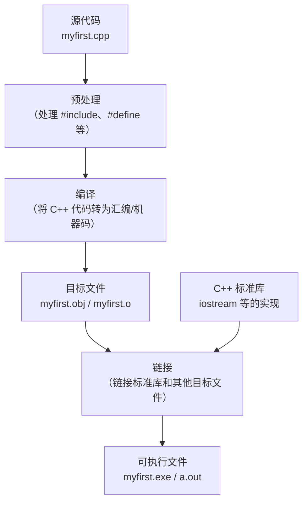

**各阶段简要说明**：

1. **预处理**：处理所有以 `#` 开头的指令。`#include <iostream>` 会被替换为头文件的实际内容。此时生成的是纯 C++ 代码（没有 `#` 指令）。
2. **编译**：将预处理后的 C++ 代码编译成汇编代码，再汇编成机器码，生成**目标文件**（.obj 或 .o）。
3. **链接**：将目标文件与 C++ 标准库（如 `cout`、`cin` 的实现）链接在一起，生成最终的**可执行文件**。

> **💡 常见误解**：`#include <iostream>` 不会让程序变大太多。编译器只链接程序实际用到的部分，而不是整个标准库。

### 2.1.6 编译和运行命令

**Visual Studio（Windows）**：

```
cl myfirst.cpp
```

**g++（Linux/Mac/WSL）**：

```bash
g++ myfirst.cpp -o myfirst
./myfirst
```

**clang++**：

```bash
clang++ myfirst.cpp -o myfirst
./myfirst
```

---

## 2.2 C++ 语句

程序本质上是一系列**语句**的集合。C++ 中最常见的语句包括：声明语句、赋值语句、输入输出语句和控制语句。

### 2.2.1 声明语句与变量

变量是程序中存储数据的基本单元。使用变量前必须先**声明**（告诉编译器变量的名字和类型）。

```cpp
#include <iostream>
using namespace std;

int main() {
    int carrots;            // 声明语句——告诉编译器需要存储空间
    carrots = 25;           // 赋值语句——将值存入变量
    cout << carrots;        // 输出变量的值（显示 25）
    return 0;
}
```

**最基本的声明形式**：

```cpp
int carrots;          // 声明一个 int 类型的变量
double price;         // 声明一个 double 类型的变量
char letter;          // 声明一个 char 类型的变量
bool isReady;         // 声明一个 bool 类型的变量
```

**声明多个变量**：

```cpp
int a;                // 每条语句声明一个变量
int b;
int c;

int a, b, c;          // 一条语句声明多个变量（用逗号分隔）
                      // 所有变量都是 int 类型
```

> **⚠️ 注意**：声明多个变量时，每个变量都要有独立的类型声明。下面的写法是错误的：
> ```cpp
> // ❌ 错误
> int a, double b;    // 编译错误！
>
> // ✅ 正确
> int a;
> double b;
> ```

### 2.2.2 四种初始化方式对比

C++ 提供了多种初始化变量的方式，了解它们的差异很重要。

```cpp
// 1. C 风格初始化（等号赋值）
int carrots = 25;

// 2. C++ 构造函数风格初始化（括号）
int carrots(25);

// 3. C++11 列表初始化（花括号 + 等号）
int carrots = {25};

// 4. C++11 列表初始化（花括号，省略等号）
int carrots{25};
```

**这四种方式有什么区别？**

| 方式 | 示例 | 特点 |
|------|------|------|
| 等号赋值 | `int x = 25;` | 传统 C 风格，易于理解 |
| 构造函数风格 | `int x(25);` | C++ 特有，与类对象初始化一致 |
| 列表初始化（=） | `int x = {25};` | C++11 引入，可防止窄化转换 |
| 列表初始化 | `int x{25};` | C++11 引入，更简洁 |

**列表初始化的优势——防止窄化转换**：

```cpp
// ✅ 合法
int x = 3.14;     // x 变成 3，小数部分被截断（编译器可能警告）

// ❌ 编译错误（列表初始化禁止窄化）
int x{3.14};      // 错误：浮点数不能窄化为整数

// ✅ 合法
int x{3};         // 没有精度损失，编译通过
```

> **💡 建议**：在现代 C++（C++11 及以后）中，优先使用列表初始化 `int x{25};`，因为它能捕获更多潜在的精度损失错误。

### 2.2.3 声明的风格与位置：C vs C++

**C 风格**（C89/C90 标准要求变量声明在代码块开头）：

```cpp
void someFunction() {
    int a;          // 所有变量声明集中在函数开头
    int b;
    double c;
    
    // ... 执行代码
    a = 10;
    b = 20;
    c = a + b;
}
```

**C++ 风格**（变量可以在使用前才声明）：

```cpp
void someFunction() {
    cout << "开始计算..." << endl;
    
    int a = 10;     // 在使用前才声明
    int b = 20;
    
    double c = a + b;  // 需要时才声明
    
    cout << "结果是: " << c << endl;
}
```

**C++ 风格的优势**：

1. **更清晰的代码**：变量在使用处声明，读者不需要上下翻找声明位置。
2. **更容易初始化**：声明时就能赋予合理的初始值，避免"声明后忘了初始化"的错误。
3. **更小的作用域**：变量只在需要的作用域内存在，减少名称冲突和滥用。

```cpp
// ❌ C 风格——变量作用域过大
int i;
for (i = 0; i < 10; i++) { ... }   // i 在循环结束后仍然存在

// ✅ C++ 风格——变量作用域最小化
for (int i = 0; i < 10; i++) { ... }  // i 只在循环中有效
```

### 2.2.4 声明 vs 定义：有区别吗？

对于初学者，这两个术语经常混用。但它们在技术上有微妙的差别：

| 概念 | 说明 | 示例 |
|------|------|------|
| **声明**（Declaration） | 告诉编译器类型和名字 | `extern int x;` |
| **定义**（Definition） | 分配存储空间 | `int x;` 或 `int x = 5;` |

```cpp
// 纯声明——告诉编译器：x 在某处定义了，别报错
extern int x;

// 定义——分配存储空间
int x;

// 也是定义——分配存储空间并初始化
int x = 5;
```

在 C++ 中，大多数声明同时也是定义。带 `extern` 关键字且不初始化的才是纯声明。

### 2.2.5 赋值语句

```cpp
carrots = 25;              // 将整数 25 存入 carrots 变量
carrots = carrots - 1;     // 读取 carrots 的值，减 1，再写回
```

**赋值的工作方式**：

1. 计算等号（`=`）**右侧**表达式的值
2. 将结果存入**左侧**变量对应的内存位置
3. 赋值是**从右向左**的（右值赋给左值）

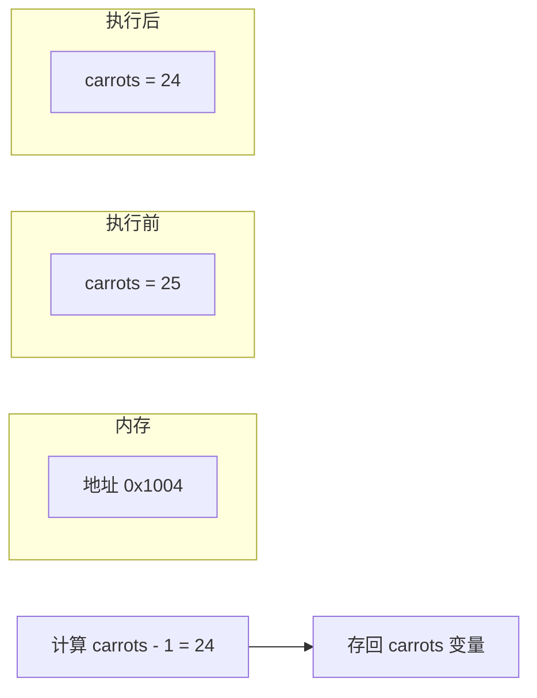

**两条赋值语句的执行过程**：

| 步骤 | 语句 | carrots 的值 |
|------|------|:---:|
| 初始 | （未初始化） | 垃圾值 |
| 1 | `carrots = 25;` | 25 |
| 2 | `carrots = carrots - 1;` | 24 |

### 2.2.6 cout 的输出能力

`cout` 的智能之处在于它能自动识别数据类型并选择合适的输出格式。

```cpp
cout << 42;              // 输出整数：42
cout << 3.14159;         // 输出浮点数：3.14159
cout << 'A';             // 输出字符：A
cout << "Hello";         // 输出字符串：Hello
cout << true;            // 输出布尔值：1（不是 true）
cout << false;           // 输出布尔值：0（不是 false）
```

**多个值的连续输出**：

```cpp
int age = 25;
double height = 1.75;
cout << "年龄: " << age << "，身高: " << height << " 米" << endl;
// 输出：年龄: 25，身高: 1.75 米
```

**cout 处理字符和字符串的区别**：

```cpp
cout << 'A';             // 字符——单引号，输出 A
cout << "A";             // 字符串——双引号，也输出 A（但类型不同）
cout << 'AB';            // ❌ 危险！多字符字面量，结果是整数值
```

> **⚠️ 注意**：`'A'`（字符）和 `"A"`（字符串）在 C++ 中是完全不同的类型。字符是单个字符（在内存中占 1 字节），字符串是以 `\0` 结尾的字符数组。

---

## 2.3 使用 cin 进行输入

到目前为止，数据都是直接在代码里写死的。`cin` 让程序能够在运行时从用户那里获取数据。

### 2.3.1 基本输入

```cpp
#include <iostream>
using namespace std;

int main() {
    int apples;
    cout << "How many apples do you have? ";
    cin >> apples;                // 从键盘读取输入，存入 apples
    cout << "You have " << apples << " apples." << endl;
    return 0;
}
```

**运行示例**：

```
How many apples do you have? 5↵
You have 5 apples.
```

- `cin`：标准输入流对象（默认关联键盘）
- `>>`：提取运算符（extraction operator），从输入流中提取数据存入变量
- `cin` 会**自动**根据变量的类型解析输入的文本

**程序执行流程**：

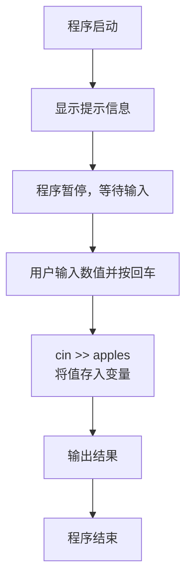

### 2.3.2 链式输入

```cpp
#include <iostream>
using namespace std;

int main() {
    int num1, num2;
    
    cout << "请输入两个整数（用空格或回车分隔）: ";
    cin >> num1 >> num2;          // 链式输入
    
    int sum = num1 + num2;
    cout << num1 << " + " << num2 << " = " << sum << endl;
    
    return 0;
}
```

**运行示例**：

```
请输入两个整数（用空格或回车分隔）: 15 27↵
15 + 27 = 42
```

或者：

```
请输入两个整数（用空格或回车分隔）: 15↵
27↵
15 + 27 = 42
```

> `cin >> a >> b` 等价于 `cin >> a; cin >> b;`。当输入缓冲区中有足够数据时，`cin` 会直接提取而不会等待新输入。

**输入多种类型的数据**：

```cpp
int age;
double salary;
char initial;

cout << "请输入年龄、薪水和姓名首字母: ";
cin >> age >> salary >> initial;

cout << "年龄: " << age << endl;
cout << "薪水: " << salary << endl;
cout << "首字母: " << initial << endl;
```

### 2.3.3 cin 与 cout 对比

| 特性 | `cin` | `cout` |
|------|-------|--------|
| 全称 | Console Input | Console Output |
| 方向 | 输入到程序 | 从程序输出 |
| 运算符 | `>>`（提取） | `<<`（插入） |
| 关联设备 | 键盘（默认） | 屏幕（默认） |
| 数据流向 | 键盘 → cin → 变量 | 变量/字符串 → cout → 屏幕 |

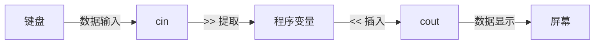

### 2.3.4 输入错误处理

如果用户输入的数据类型与变量不匹配，程序不会立即崩溃，但会进入**错误状态**。

```cpp
#include <iostream>
using namespace std;

int main() {
    int number;
    
    cout << "请输入一个整数: ";
    cin >> number;
    
    if (cin.fail()) {
        cout << "输入错误！你输入的不是有效的整数。" << endl;
        cin.clear();                // 清除错误状态
        cin.ignore(1000, '\n');     // 丢弃输入缓冲区中的错误内容
    } else {
        cout << "你输入的是: " << number << endl;
    }
    
    return 0;
}
```

**运行示例**：

```
请输入一个整数: abc↵
输入错误！你输入的不是有效的整数。
```

**处理错误的流程**：

1. 用户输入 `abc`，期望读取整数
2. `cin >> number` 尝试提取整数失败
3. `cin` 进入**错误状态**（failbit 置位），后续所有输入操作都会失败
4. `cin.fail()` 返回 `true`
5. `cin.clear()` 清除错误状态，恢复 `cin` 的正常工作
6. `cin.ignore(1000, '\n')` 丢弃缓冲区中所有字符直到换行符

**更健壮的输入循环**：

```cpp
#include <iostream>
using namespace std;

int main() {
    int number;
    
    cout << "请输入一个整数: ";
    
    // 当输入失败时，循环要求用户重新输入
    while (!(cin >> number)) {
        cin.clear();                // 清除错误状态
        cin.ignore(10000, '\n');    // 丢弃错误输入
        cout << "输入无效，请重新输入一个整数: ";
    }
    
    cout << "你输入的是: " << number << endl;
    return 0;
}
```

### 2.3.5 输入缓冲区与 >> 混用 getline 的问题

这是一个非常经典的 C++ 初学者陷阱。

**问题复现**：

```cpp
#include <iostream>
using namespace std;

int main() {
    int age;
    string name;
    
    cout << "请输入年龄: ";
    cin >> age;                     // 读取年龄
    
    cout << "请输入姓名: ";
    getline(cin, name);            // 读取一行姓名
    
    cout << "年龄: " << age << endl;
    cout << "姓名: " << name << endl;
    
    return 0;
}
```

**运行结果**：

```
请输入年龄: 25↵
请输入姓名: 年龄: 25
姓名:                ← 名字被跳过了！
```

**这是为什么？**

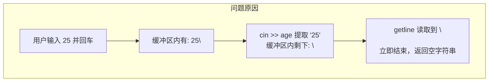

**解决方案**：在 `cin >>` 之后、`getline` 之前，丢弃缓冲区中的换行符。

```cpp
// 方法 1：使用 cin.ignore 丢弃换行符
cin >> age;
cin.ignore();                    // 丢弃一个字符（即换行符）
getline(cin, name);

// 方法 2：使用 cin.get() 读取并丢弃换行符
cin >> age;
cin.get();                       // 读取并丢弃一个字符
getline(cin, name);

// 方法 3：统一使用 getline 再转换
string ageStr;
getline(cin, ageStr);
age = stoi(ageStr);              // 将字符串转换为整数（C++11）
getline(cin, name);
```

### 2.3.6 cin 的状态标志

`cin` 内部维护了 4 个状态位，用于跟踪输入流的状态：

| 状态标志 | 含义 | 说明 |
|----------|------|------|
| `goodbit` | 正常状态 | 值为 0，一切正常 |
| `eofbit` | 到达文件尾 | 输入流已无更多数据 |
| `failbit` | 提取操作失败 | 类型不匹配、格式错误 |
| `badbit` | 流已损坏 | 不可恢复的错误 |

**检查状态的方法**：

```cpp
cin.good()          // 返回 true 如果一切正常
cin.fail()          // 返回 true 如果 failbit 或 badbit 被置位
cin.bad()           // 返回 true 如果 badbit 被置位
cin.eof()           // 返回 true 如果 eofbit 被置位
cin.clear()         // 清除所有状态位，恢复流
cin.rdstate()       // 返回当前状态位
```

---

## 2.4 函数

函数是 C++ 程序的基本组成单元。每个 C++ 程序本质上就是一组函数的集合。

### 2.4.1 函数的基本概念

**函数**（Function）是一组被命名的语句序列，可以被多次调用执行。

**为什么要用函数？**

| 理由 | 说明 |
|------|------|
| **代码复用** | 一段逻辑写一次，到处调用 |
| **模块化** | 将复杂问题分解为小任务，各个击破 |
| **可读性** | 用有意义的函数名代替一堆难以理解的逻辑 |
| **可维护性** | 修改函数内部实现，所有调用者自动受益 |
| **可测试性** | 可以单独测试每个函数 |

**函数三要素**：

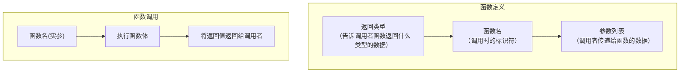

1. **函数原型**（Prototype/Declaration）：告诉编译器函数的接口信息
2. **函数定义**（Definition）：实现函数的具体功能
3. **函数调用**（Call）：实际使用函数

### 2.4.2 函数定义结构

```cpp
//              ┌── 返回类型
//              │     ┌── 函数名
//              │     │      ┌── 参数列表（可以为空）
返回类型 函数名(参数列表) {
    语句序列          ← 函数体
    return 返回值;    ← 返回语句
}
```

**具体示例：求平方函数**

```cpp
int square(int x) {
    int result = x * x;
    return result;                // 返回计算结果
}

int main() {
    int n = 5;
    int sq = square(n);          // 函数调用
    cout << n << " 的平方是: " << sq << endl;
    return 0;
}
```

### 2.4.3 函数原型——为什么需要它？

**为什么需要函数原型？**

C++ 编译器按**顺序**编译代码。当编译器遇到函数调用时，它需要知道：

- 函数的返回类型是什么？
- 函数需要多少个参数？
- 每个参数的类型是什么？

如果没有原型，编译器遇到调用时无法验证调用是否正确。

```cpp
// 情况 1：函数定义在调用之前——不需要原型
int square(int x) {
    return x * x;
}

int main() {
    cout << square(5);    // 编译器已经知道 square 的定义
    return 0;
}
```

```cpp
// 情况 2：函数定义在调用之后——需要原型
int square(int x);        // 函数原型声明

int main() {
    cout << square(5);    // 没问题，编译器看到过原型
    return 0;
}

int square(int x) {       // 函数定义
    return x * x;
}
```

```cpp
// 情况 3：没有原型，函数在后面定义——编译错误！
int main() {
    cout << square(5);    // ❌ 编译错误：square 未声明
    return 0;
}

int square(int x) {
    return x * x;
}
```

**函数原型的格式**：

```cpp
// 完整原型（包含参数名——参数名在原型中可省略，但写上有助于理解）
int square(int x);

// 简化原型（省略参数名）
int square(int);

// 无参数函数的原型
int getValue();

// void 函数的原型
void showMessage();
```

> **⚠️ 关键区别**：原型以**分号**结尾，没有函数体。定义包括完整的函数体（花括号 `{}`）。

### 2.4.4 带多个参数的函数

```cpp
#include <iostream>
using namespace std;

// 函数原型
void printSum(int a, int b);

int main() {
    int x = 10, y = 20;
    printSum(x, y);               // 实参：x 和 y
    return 0;
}

// 函数定义
void printSum(int a, int b) {     // 形参：a 和 b
    cout << a << " + " << b << " = " << a + b << endl;
}
```

**形参 vs 实参**：

| 概念 | 说明 | 示例 |
|------|------|------|
| **形参**（Parameter） | 函数定义中的变量，是"占位符" | `int a, int b` |
| **实参**（Argument） | 函数调用时传入的具体值 | `x, y`、`10, 20` |

**参数传递的本质——值传递**：

```cpp
#include <iostream>
using namespace std;

void doubleValue(int x) {
    x = x * 2;                    // 修改的是形参 x 的副本
    cout << "函数内部: " << x << endl;
}

int main() {
    int num = 5;
    cout << "调用前: " << num << endl;   // 5
    doubleValue(num);                     
    cout << "调用后: " << num << endl;   // 仍然是 5！（不是 10）
    return 0;
}
```

**为什么 `num` 没有改变？**

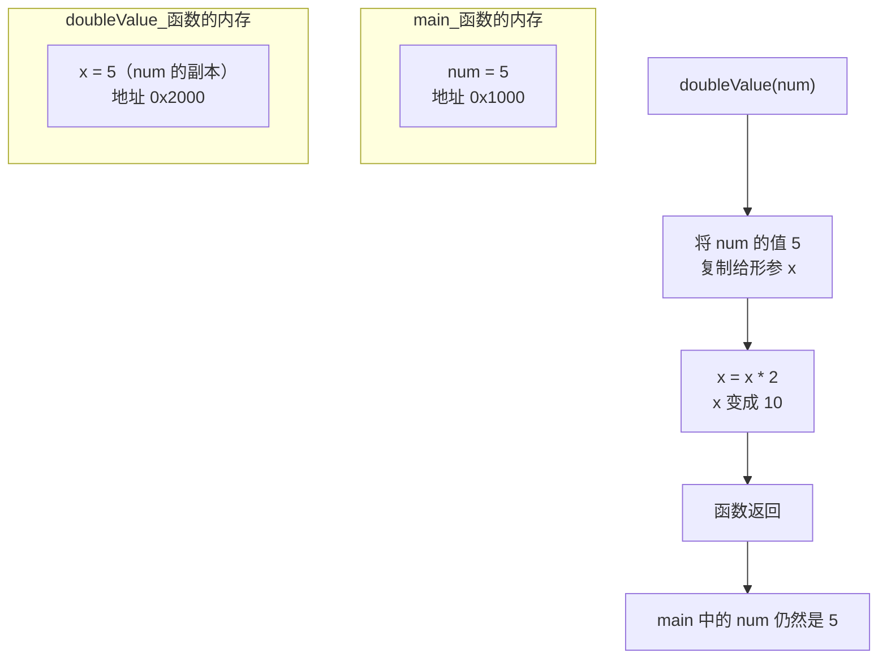

### 2.4.5 无参数函数与 void 类型

```cpp
// 不返回任何值的函数——返回类型为 void
void showMessage() {
    cout << "欢迎学习 C++！" << endl;
    // void 函数可以没有 return 语句
}

// 不接受任何参数的函数
int getAnswer() {
    return 42;                    // 必须返回 int 类型的值
}

int main() {
    showMessage();                // 调用 void 函数
    int answer = getAnswer();     // 调用有返回值的函数
    
    cout << "答案是: " << answer << endl;
    return 0;
}
```

**`void` 的含义**：

| 使用场景 | 含义 |
|----------|------|
| `void` 作为返回类型 | 函数**不返回任何值** |
| `void` 作为参数 | `int f(void)` 表示函数**不接受参数**（C++ 中空的 `()` 已表示无参数） |

**void 函数中的 return 语句**：

```cpp
void greet(int hour) {
    if (hour < 12) {
        cout << "早上好！" << endl;
        return;                   // 提前结束函数
    }
    if (hour < 18) {
        cout << "下午好！" << endl;
        return;
    }
    cout << "晚上好！" << endl;
    // 函数末尾的 return 可以省略
}
```

### 2.4.6 返回类型和返回值

一个函数可以返回各种类型的数据：

```cpp
// 返回整数
int add(int a, int b) {
    return a + b;
}

// 返回浮点数
double getAverage(double a, double b) {
    return (a + b) / 2.0;
}

// 返回字符
char getGrade(int score) {
    if (score >= 90) return 'A';
    if (score >= 80) return 'B';
    if (score >= 70) return 'C';
    if (score >= 60) return 'D';
    return 'F';
}

// 返回布尔值
bool isEven(int number) {
    return number % 2 == 0;
}
```

**返回类型的匹配**：返回值的类型必须与函数声明的返回类型匹配（或可以隐式转换）。

```cpp
// 返回类型是 int，但返回了 double——会发生隐式转换
int getValue() {
    return 3.14;                  // 返回 3（小数部分被截断）
}
```

### 2.4.7 函数调用机制——调用栈（预告）

当函数被调用时，系统会在**调用栈**（Call Stack）上分配一段内存来存储函数的局部变量和参数。

```cpp
#include <iostream>
using namespace std;

void funcC() {
    cout << "在 funcC 中" << endl;
}

void funcB() {
    cout << "调用 funcC 前" << endl;
    funcC();
    cout << "调用 funcC 后" << endl;
}

void funcA() {
    cout << "调用 funcB 前" << endl;
    funcB();
    cout << "调用 funcB 后" << endl;
}

int main() {
    funcA();
    return 0;
}
```

**调用栈的变化过程**：

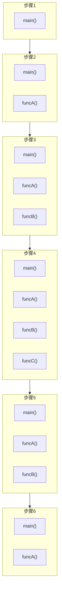

**程序输出**：

```
调用 funcB 前
调用 funcC 前
在 funcC 中
调用 funcC 后
调用 funcB 后
```

**关键概念**：函数的调用和返回遵循**后进先出**（LIFO）原则——最后被调用的函数最先返回。

### 2.4.8 函数重载的概念预告

C++ 允许定义多个**同名**但**参数列表不同**的函数。这叫做**函数重载**。

```cpp
#include <iostream>
using namespace std;

// 三个同名函数，参数类型不同
int add(int a, int b) {
    return a + b;
}

double add(double a, double b) {
    return a + b;
}

int add(int a, int b, int c) {
    return a + b + c;
}

int main() {
    cout << add(3, 4) << endl;          // 调用 int add(int, int) → 7
    cout << add(2.5, 3.7) << endl;      // 调用 double add(double, double) → 6.2
    cout << add(1, 2, 3) << endl;       // 调用 int add(int, int, int) → 6
    return 0;
}
```

**编译器如何区分**：编译器根据函数调用中**实参的数量和类型**来判断调用哪个版本。

> **📌 预告**：在第 8 章中我们将深入学习函数重载的细节和注意事项。

### 2.4.9 默认参数

C++ 允许为函数的参数指定**默认值**。当调用者省略该参数时，使用默认值。

```cpp
#include <iostream>
using namespace std;

// 为参数指定默认值
void showInfo(string name, int age = 18, string country = "中国") {
    cout << "姓名: " << name << endl;
    cout << "年龄: " << age << endl;
    cout << "国家: " << country << endl;
}

int main() {
    showInfo("张三");                    // 使用所有默认参数
    cout << "---" << endl;
    showInfo("李四", 25);                // 指定年龄
    cout << "---" << endl;
    showInfo("王五", 30, "美国");        // 指定所有参数
    return 0;
}
```

**运行结果**：

```
姓名: 张三
年龄: 18
国家: 中国
---
姓名: 李四
年龄: 25
国家: 中国
---
姓名: 王五
年龄: 30
国家: 美国
```

**默认参数的规则**：

1. 默认参数必须从**右向左**提供——你不能跳过左边的参数去指定右边的参数。
2. 默认参数通常在**函数原型**中指定（而不是函数定义）。

```cpp
// ✅ 正确：默认参数从右向左
void f(int a, int b = 1, int c = 2);

// ❌ 错误：不能跳过 b 指定 c
f(10, , 5);          // 编译错误

// ✅ 正确的方式：省略 b
f(10);               // a=10, b=1, c=2
f(10, 3);            // a=10, b=3, c=2
```

> **📌 预告**：默认参数和函数重载一起使用时需要小心，编译器可能无法区分某些调用。第 8 章会详细讨论。

### 2.4.10 更多函数示例

**示例 1：将分钟转换为小时和分钟**

```cpp
#include <iostream>
using namespace std;

// 函数原型
void convert(int minutes);

int main() {
    int input;
    cout << "请输入分钟数: ";
    cin >> input;
    convert(input);
    return 0;
}

void convert(int minutes) {
    int hours = minutes / 60;
    int mins = minutes % 60;
    cout << minutes << " 分钟 = " << hours << " 小时 " << mins << " 分钟" << endl;
}
```

**运行示例**：

```
请输入分钟数: 135
135 分钟 = 2 小时 15 分钟
```

**示例 2：温度转换**

```cpp
#include <iostream>
using namespace std;

double celsiusToFahrenheit(double celsius) {
    return celsius * 9.0 / 5.0 + 32.0;
}

double fahrenheitToCelsius(double fahrenheit) {
    return (fahrenheit - 32.0) * 5.0 / 9.0;
}

int main() {
    double temp;
    
    cout << "请输入摄氏温度: ";
    cin >> temp;
    cout << temp << "°C = " << celsiusToFahrenheit(temp) << "°F" << endl;
    
    cout << "请输入华氏温度: ";
    cin >> temp;
    cout << temp << "°F = " << fahrenheitToCelsius(temp) << "°C" << endl;
    
    return 0;
}
```

**示例 3：计算圆的面积**

```cpp
#include <iostream>
using namespace std;

const double PI = 3.14159;

double circleArea(double radius) {
    return PI * radius * radius;
}

int main() {
    double r;
    cout << "请输入圆的半径: ";
    cin >> r;
    cout << "半径为 " << r << " 的圆面积 = " << circleArea(r) << endl;
    return 0;
}
```

---

## 2.5 cout 格式化输出

控制输出格式是程序与用户交互的重要方面。C++ 提供了多种输出格式控制方法。

### 2.5.1 换行方法

```cpp
cout << "第一行" << endl;    // endl 换行——会刷新缓冲区
cout << "第二行\n";           // \n 转义字符换行
cout << "第三行" << "\n";    // 字符串中的 \n
```

| 方式 | 特点 |
|------|------|
| `endl` | 插入换行符 + **刷新输出缓冲区**（立即写入到输出设备） |
| `\n` | 仅插入换行符，效率稍高 |

> **💡 何时用 `endl`？** 在需要立即刷新缓冲区时（如调试信息、日志文件），否则建议用 `\n` 以获得更好性能。

```cpp
// endl vs \n 的实际区别演示
#include <iostream>
using namespace std;

int main() {
    cout << "使用 endl 开始..." << endl;    // 立即显示
    // 模拟耗时操作
    for (int i = 0; i < 100000000; i++);
    cout << "使用 \\n 开始...\n";           // 可能不会立即显示
    // 模拟耗时操作
    for (int i = 0; i < 100000000; i++);
    cout << "完成！\n";
    return 0;
}
```

### 2.5.2 常用转义字符

| 转义序列 | ASCII 值（十六进制） | 含义 |
|----------|---------------------|------|
| `\n` | 0x0A | 换行（LF，Line Feed） |
| `\t` | 0x09 | 水平制表符（Tab） |
| `\\` | 0x5C | 反斜杠字符 |
| `\"` | 0x22 | 双引号 |
| `\'` | 0x27 | 单引号 |
| `\r` | 0x0D | 回车（CR，Carriage Return） |
| `\0` | 0x00 | 空字符（字符串结束标志） |
| `\a` | 0x07 | 响铃（发出哔声） |
| `\b` | 0x08 | 退格（Backspace） |

**转义字符使用示例**：

```cpp
// 制表符对齐
cout << "姓名\t年龄\t城市" << endl;
cout << "张三\t25\t北京" << endl;
cout << "李四\t30\t上海" << endl;

// 输出包含引号的字符串
cout << "他说：\"你好！\"" << endl;

// 输出反斜杠路径
cout << "路径：C:\\Users\\Admin\\Documents" << endl;

// 响铃
cout << "警告！\a" << endl;    // 会发出哔的一声
```

**输出效果**：

```
姓名    年龄    城市
张三    25      北京
李四    30      上海
他说："你好！"
路径：C:\Users\Admin\Documents
警告！（发出哔声）
```

### 2.5.3 字符串字面量拼接

C++ 会自动拼接相邻的字符串字面量：

```cpp
cout << "Hello, " "World!";            // 等价于 "Hello, World!"
cout << "Hello, World!";               // 同上

// 跨行字符串拼接
cout << "这是一个非常长的字符串，"
        "它被写在了多行上，"
        "但编译后会拼接成一个字符串。\n";

// 等价于：
cout << "这是一个非常长的字符串，它被写在了多行上，但编译后会拼接成一个字符串。\n";
```

### 2.5.4 使用 `<iomanip>` 进行格式化输出

`<iomanip>` 提供了操纵符（manipulator）来控制输出的格式。

```cpp
#include <iostream>
#include <iomanip>       // 包含操纵符
using namespace std;

int main() {
    double pi = 3.14159265358979;
    
    cout << "默认输出: " << pi << endl;
    cout << "设置精度 3: " << setprecision(3) << pi << endl;
    cout << "设置精度 5: " << setprecision(5) << pi << endl;
    cout << "固定精度 2: " << fixed << setprecision(2) << pi << endl;
    cout << "科学计数法: " << scientific << setprecision(4) << pi << endl;
    
    return 0;
}
```

**输出效果**：

```
默认输出: 3.14159
设置精度 3: 3.14
设置精度 5: 3.1416
固定精度 2: 3.14
科学计数法: 3.1416e+00
```

### 2.5.5 输出宽度与填充

```cpp
#include <iostream>
#include <iomanip>
using namespace std;

int main() {
    int numbers[] = {1, 12, 123, 1234, 12345};
    
    cout << "默认输出:" << endl;
    for (int n : numbers) {          // C++11 范围 for 循环
        cout << n << endl;
    }
    
    cout << "\n设置宽度 8:" << endl;
    for (int n : numbers) {
        cout << setw(8) << n << endl;      // 设置最小宽度为 8
    }
    
    cout << "\n宽度 8，填充 '*':" << endl;
    for (int n : numbers) {
        cout << setw(8) << setfill('*') << n << endl;
    }
    
    cout << "\n宽度 8，左对齐:" << endl;
    for (int n : numbers) {
        cout << left << setw(8) << setfill(' ') << n << endl;
    }
    
    return 0;
}
```

**输出效果**：

```
默认输出:
1
12
123
1234
12345

设置宽度 8:
       1
      12
     123
    1234
   12345

宽度 8，填充 '*':
*******1
******12
*****123
****1234
***12345

宽度 8，左对齐:
1
12
123
1234
12345
```

### 2.5.6 浮点数精度控制详解

```cpp
#include <iostream>
#include <iomanip>
using namespace std;

int main() {
    double a = 123.456789;
    double b = 0.00001234;
    
    cout << "=== 默认精度（6位有效数字）===" << endl;
    cout << "a = " << a << endl;    // 123.457
    cout << "b = " << b << endl;    // 1.234e-05
    
    cout << "\n=== fixed（小数点后固定位数）===" << endl;
    cout << fixed;
    cout << setprecision(2) << "a = " << a << endl;    // 123.46
    cout << setprecision(4) << "a = " << a << endl;    // 123.4568
    cout << setprecision(2) << "b = " << b << endl;    // 0.00（信息丢失！）
    cout << setprecision(6) << "b = " << b << endl;    // 0.000012
    
    cout << "\n=== scientific（科学计数法）===" << endl;
    cout << scientific;
    cout << setprecision(2) << "a = " << a << endl;    // 1.23e+02
    cout << setprecision(2) << "b = " << b << endl;    // 1.23e-05
    
    return 0;
}
```

**精度模式对比**：

| 模式 | 精度含义 | 示例（setprecision(3)） |
|------|----------|----------------------|
| `default` | 有效数字位数 | `123.4567` → `123` |
| `fixed` | 小数点后位数 | `123.4567` → `123.457` |
| `scientific` | 小数点后位数 | `123.4567` → `1.235e+02` |

### 2.5.7 输出布尔值

```cpp
#include <iostream>
using namespace std;

int main() {
    bool a = true;
    bool b = false;
    
    cout << "默认输出:" << endl;
    cout << "a = " << a << endl;    // 1
    cout << "b = " << b << endl;    // 0
    
    cout << boolalpha;               // 设置输出 true/false
    cout << "使用 boolalpha:" << endl;
    cout << "a = " << a << endl;    // true
    cout << "b = " << b << endl;    // false
    
    cout << noboolalpha;             // 恢复数字输出
    cout << "恢复后:" << endl;
    cout << "a = " << a << endl;    // 1
    
    return 0;
}
```

### 2.5.8 格式化输出的综合示例

```cpp
#include <iostream>
#include <iomanip>
#include <string>
using namespace std;

int main() {
    // 打印一个格式化的表格
    cout << left << setw(15) << "姓名"
         << right << setw(10) << "年龄"
         << right << setw(10) << "身高(cm)"
         << right << setw(10) << "体重(kg)" << endl;
    
    cout << setfill('-') << setw(45) << "" << setfill(' ') << endl;
    
    cout << left << setw(15) << "张三"
         << right << setw(10) << 25
         << right << setw(10) << 175.5
         << right << setw(10) << 70.2 << endl;
    
    cout << left << setw(15) << "李四"
         << right << setw(10) << 30
         << right << setw(10) << 180.0
         << right << setw(10) << 75.8 << endl;
    
    cout << left << setw(15) << "王五"
         << right << setw(10) << 22
         << right << setw(10) << 168.2
         << right << setw(10) << 62.5 << endl;
    
    return 0;
}
```

**输出效果**：

```
姓名                年龄   身高(cm)   体重(kg)
---------------------------------------------
张三                  25      175.5      70.2
李四                  30        180      75.8
王五                  22      168.2      62.5
```

---

## 2.6 预处理指令详解

预处理指令是 C++ 编译过程中的第一步。所有以 `#` 开头的行都属于预处理指令，它们在编译器开始正式编译之前被处理。

### 2.6.1 #include 指令

`#include` 的作用是将指定文件的内容"粘贴"到当前文件中。

**两种形式**：

```cpp
#include <iostream>      // 尖括号——在系统头文件目录中搜索
#include "myheader.h"    // 双引号——先在当前目录搜索，再搜索系统目录
```

**搜索路径**：

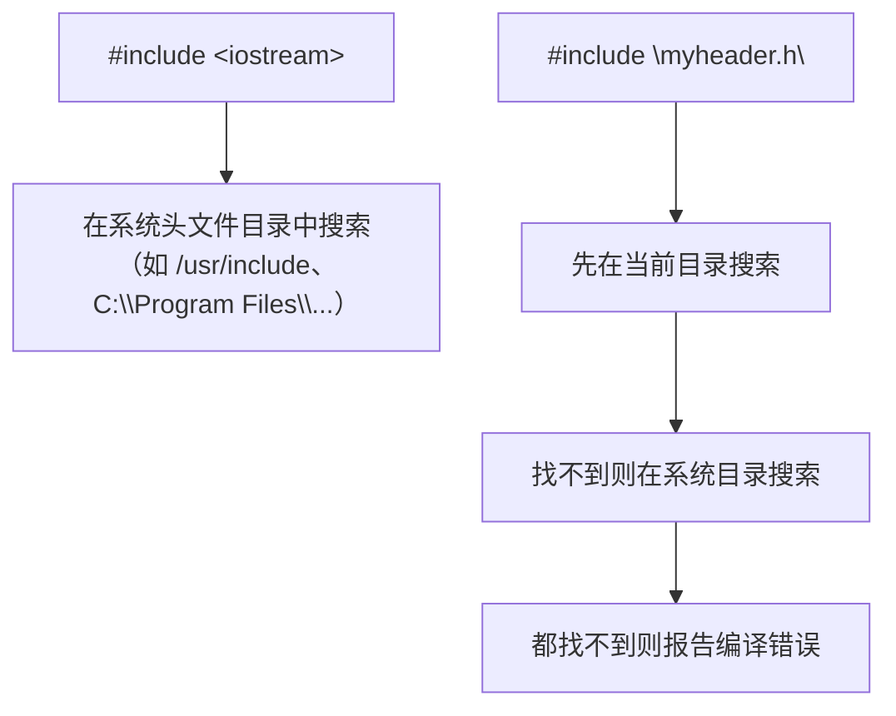

| 形式 | 搜索顺序 |
|------|----------|
| `<header>` | 编译器配置的系统头文件路径 |
| `"header"` | 当前源文件目录 → 系统头文件路径 |

**常见的实现机制**：

不同的编译器使用不同的机制和名称来包含标准库头文件。有些甚至是**无头文件**（headerless）的，编译器内部内置了头文件的内容。

### 2.6.2 #define 指令与宏

`#define` 用于定义**宏**（macro）。宏在预处理阶段被文本替换。

**定义常量（对象式宏）**：

```cpp
#define PI 3.14159
#define MAX_SIZE 100
#define GREETING "Hello!"

int main() {
    double area = PI * radius * radius;    // 预处理后变成：3.14159 * radius * radius
    int arr[MAX_SIZE];                     // 预处理后变成：int arr[100];
    cout << GREETING;                      // 预处理后变成：cout << "Hello!";
    return 0;
}
```

**定义宏函数（函数式宏）**：

```cpp
#define SQUARE(x) ((x) * (x))
#define MAX(a, b) ((a) > (b) ? (a) : (b))
#define MIN(a, b) ((a) < (b) ? (a) : (b))

int main() {
    int n = 5;
    cout << SQUARE(n + 1);    // 预处理后：cout << ((n + 1) * (n + 1));
    cout << MAX(3, 7);        // 预处理后：cout << ((3) > (7) ? (3) : (7));
    return 0;
}
```

**宏的陷阱**：

```cpp
// ❌ 错误：缺少括号导致运算符优先级问题
#define SQUARE_BAD(x) x * x

int y = SQUARE_BAD(2 + 3);    // 2 + 3 * 2 + 3 = 11（不是 25！）

// ✅ 正确：使用额外的括号
#define SQUARE_GOOD(x) ((x) * (x))

int z = SQUARE_GOOD(2 + 3);   // ((2 + 3) * (2 + 3)) = 25
```

> **⚠️ 在现代 C++ 中**，`#define` 定义常量已被 `const` 和 `constexpr` 替代，宏函数已被 `inline` 函数和模板替代。但在一些遗留代码和老项目中仍大量使用。

### 2.6.3 条件编译

条件编译让编译器根据条件决定哪些代码参与编译。

```cpp
#include <iostream>
using namespace std;

#define DEBUG                      // 定义 DEBUG 宏

int main() {
    int x = 10, y = 20;
    int sum = x + y;
    
#ifdef DEBUG
    cout << "调试信息：x = " << x << ", y = " << y << endl;
    cout << "调试信息：sum = " << sum << endl;
#endif
    
    cout << "结果: " << sum << endl;
    return 0;
}
```

**条件编译指令**：

| 指令 | 含义 |
|------|------|
| `#ifdef MACRO` | 如果 `MACRO` 已定义 |
| `#ifndef MACRO` | 如果 `MACRO` 未定义 |
| `#if 条件` | 如果常量表达式为真 |
| `#else` | 否则 |
| `#elif 条件` | 否则如果 |
| `#endif` | 结束条件编译 |
| `#if defined(MACRO)` | 等价于 `#ifdef` |

```cpp
#include <iostream>
using namespace std;

#define VERSION 2

int main() {
#if VERSION == 1
    cout << "版本 1 的功能" << endl;
#elif VERSION == 2
    cout << "版本 2 的新功能" << endl;
#else
    cout << "未知版本" << endl;
#endif
    return 0;
}
```

**实际应用场景**：

```cpp
// 跨平台代码
#ifdef _WIN32
    #include <windows.h>
    #define CLEAR_SCREEN system("cls")
#else
    #include <unistd.h>
    #define CLEAR_SCREEN system("clear")
#endif

// 调试开关
#ifndef NDEBUG
    // 调试版本的代码
    cout << "调试输出..." << endl;
#endif
```

### 2.6.4 #pragma once 与 #ifndef 头文件保护

在大型项目中，一个头文件可能会被多个源文件包含。如果没有保护机制，同一个头文件可能会被编译多次，导致重复定义错误。

**方法 1：传统方式（#ifndef）**

```cpp
// myheader.h
#ifndef MYHEADER_H        // 如果 MYHEADER_H 未定义
#define MYHEADER_H        // 定义 MYHEADER_H

// 头文件内容
int add(int a, int b);

#endif                    // 结束条件编译
```

**方法 2：现代方式（#pragma once）**

```cpp
// myheader.h
#pragma once              // 编译器确保此文件只被包含一次

// 头文件内容
int add(int a, int b);
```

**两种方式的对比**：

| 特性 | `#ifndef` | `#pragma once` |
|------|-----------|----------------|
| 可移植性 | 所有 C/C++ 编译器都支持 | 大多数主流编译器支持（非标准） |
| 容易出错 | 宏名需要唯一，可能冲突 | 由编译器自动处理 |
| 性能 | 需要打开文件读取宏定义 | 编译器可以优化，通常更快 |
| 灵活性 | 可以精确控制 | 只能防止重复包含 |

> **💡 建议**：新项目中优先使用 `#pragma once`，它更简洁、更可靠。

### 2.6.5 其他预处理指令

```cpp
#error "发生错误！"        // 编译时输出错误信息并停止编译

#line 100 "newfile.cpp"  // 重置行号和文件名（用于代码生成工具）

#pragma warning(disable: 4996)  // 禁用特定编译警告（MSVC）

// 取消宏定义
#define TEMP 100
#undef TEMP                 // 取消 TEMP 的定义
// 之后 TEMP 不再有定义
```

---

## 2.7 命名空间详解

命名空间（namespace）是 C++ 解决名称冲突的机制。当多个库包含同名的函数或变量时，命名空间可以区分它们。

### 2.7.1 std 命名空间的含义

`std` 是 C++ 标准库的命名空间（standard 的缩写）。所有标准库中的名称（`cout`、`cin`、`vector`、`string` 等）都在 `std` 命名空间中。

```cpp
// 下面是等价的三种写法

// 写法 1：每次都写 std::
#include <iostream>
int main() {
    std::cout << "Hello" << std::endl;
    return 0;
}

// 写法 2：使用 using 指令（本书常用）
#include <iostream>
using namespace std;
int main() {
    cout << "Hello" << endl;
    return 0;
}

// 写法 3：使用 using 声明（推荐——只引入需要的名称）
#include <iostream>
using std::cout;
using std::endl;
int main() {
    cout << "Hello" << endl;
    return 0;
}
```

### 2.7.2 using 声明 vs using 指令

| 形式 | 语法 | 效果 |
|------|------|------|
| **using 指令** | `using namespace std;` | 将**整个**命名空间中的所有名称引入当前作用域 |
| **using 声明** | `using std::cout;` | 只将**特定**名称引入当前作用域 |

**using 指令的风险**：

```cpp
// 文件：library1.h
namespace Lib1 {
    int value = 10;
    void print() { cout << "Lib1" << endl; }
}

// 文件：library2.h
namespace Lib2 {
    int value = 20;
    void print() { cout << "Lib2" << endl; }
}

// 用户代码
#include "library1.h"
#include "library2.h"
using namespace Lib1;       // 引入 Lib1 的所有名称
using namespace Lib2;       // 引入 Lib2 的所有名称——冲突！

// 现在 value 和 print 有歧义
int x = value;              // ❌ 编译错误：value 不明确
Lib1::print();              // ✅ 显式指定命名空间
```

**using 声明的安全性**：

```cpp
#include "library1.h"
#include "library2.h"

using Lib1::print;          // 明确引入 Lib1 的 print
// using Lib2::print;       // 如果也引入，会导致冲突——但至少你知道冲突在哪里

print();                    // 调用 Lib1::print
Lib2::print();              // 仍然可以显式调用 Lib2 的版本
```

> **💡 建议**：在小型程序或学习环境中，`using namespace std;` 是可以接受的。在大型项目或生产代码中，优先使用 `using std::cout;` 或直接写 `std::cout`。

### 2.7.3 自定义命名空间

```cpp
#include <iostream>
using namespace std;

// 自定义命名空间
namespace Math {
    int add(int a, int b) {
        return a + b;
    }
    
    int subtract(int a, int b) {
        return a - b;
    }
    
    const double PI = 3.14159265;
}

namespace Text {
    void greet(string name) {
        cout << "你好, " << name << "!" << endl;
    }
    
    void greet(string name, string lang) {
        if (lang == "en")
            cout << "Hello, " << name << "!" << endl;
        else
            cout << "你好, " << name << "!" << endl;
    }
}

int main() {
    cout << Math::add(10, 20) << endl;          // 30
    cout << Math::PI << endl;                    // 3.14159
    Text::greet("张三");                         // 你好, 张三!
    Text::greet("Alice", "en");                 // Hello, Alice!
    return 0;
}
```

### 2.7.4 命名空间的嵌套与别名

```cpp
#include <iostream>
using namespace std;

// 嵌套命名空间
namespace Company {
    namespace Department {
        namespace Team {
            int memberCount = 5;
        }
    }
}

// C++17 简化语法
namespace Company::Department::Team {
    // 可以在这里添加内容
}

// 命名空间别名
namespace CDTeam = Company::Department::Team;

int main() {
    cout << Company::Department::Team::memberCount << endl;  // 5
    cout << CDTeam::memberCount << endl;                     // 5（使用别名更简洁）
    return 0;
}
```

### 2.7.5 无名命名空间

无名命名空间（unnamed namespace）中的名称只在当前编译单元内可见，类似于 `static` 关键字的作用。

```cpp
// 文件：helper.cpp
namespace {
    int internalCounter = 0;      // 只在这个文件内可见
    
    void helperFunction() {
        internalCounter++;
    }
}

void publicFunction() {
    helperFunction();             // 可以在同一文件中调用
    cout << internalCounter << endl;
}

// 其他文件无法访问 internalCounter 和 helperFunction
```

---

## 2.8 字符串字面量详解

### 2.8.1 C 风格字符串与字符串字面量

字符串字面量是用双引号括起来的字符序列：`"Hello"`。

**底层存储**：

```cpp
"Hello"    // 在内存中存储为：'H' 'e' 'l' 'l' 'o' '\0'
           // 注意末尾的 \0（空字符）——字符串结束标志
```

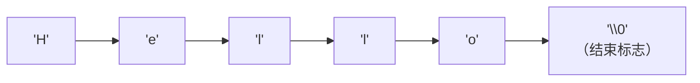

**字符串长度 vs 数组大小**：

| 字符串 | 字符数 | 实际占用内存 |
|--------|:------:|:----------:|
| `""` | 0 | 1 字节（只有 `\0`） |
| `"A"` | 1 | 2 字节（`'A'` + `'\0'`） |
| `"Hello"` | 5 | 6 字节（5 个字符 + `'\0'`） |
| `"C++"` | 3 | 4 字节 |

**字符串字面量中不能修改**：

```cpp
char* str = "Hello";          // 警告：字符串字面量是 const 的
str[0] = 'h';                 // ❌ 未定义行为！可能崩溃

// 正确的做法
char str[] = "Hello";         // 创建可修改的副本
str[0] = 'h';                 // ✅ 可以修改
```

### 2.8.2 字符串字面量的自动拼接

相邻的字符串字面量会被编译器自动拼接成一个字符串：

```cpp
// 基本拼接
cout << "Hello, " "World!";           // 输出：Hello, World!

// 跨行拼接
cout << "这是一个非常长的字符串，"
        "它被分割在多行上，"
        "但编译后会合并为一个整体。\n";

// 复杂场景
string message = "数 " "组 " "拼 " "接";
// 等价于 "数组拼接"
```

**实际应用——格式化 SQL 查询**：

```cpp
string query = "SELECT id, name, email "
               "FROM users "
               "WHERE age > 18 "
               "ORDER BY name";
```

### 2.8.3 原始字符串字面量（C++11）

当字符串中包含大量需要转义的字符时（如路径、正则表达式），代码会变得难以阅读。

**传统方式的问题**：

```cpp
// 路径中的反斜杠需要转义
string path = "C:\\Users\\Admin\\Documents\\file.txt";

// 正则表达式中的反斜杠需要双重转义
string regex = "\\d{3}-\\d{4}";    // 匹配 "123-4567"
```

**原始字符串字面量**（C++11 引入）使用 `R"(...)"` 语法，其中的所有字符都按原样处理：

```cpp
// Windows 路径——不再需要转义反斜杠
string path = R"(C:\Users\Admin\Documents\file.txt)";

// 多行文本——不需要 \n
string text = R"(第一行
第二行
第三行)";                // 保留了换行符

// 正则表达式——不再需要双重转义
string regex = R"(\d{3}-\d{4})";    // 匹配 "123-4567"

// 包含引号的字符串——不需要转义
string html = R"(<a href="http://example.com">链接</a>)";
```

**自定义分隔符**：如果字符串本身包含 `)"`，可以使用自定义分隔符。

```cpp
// 语法：R"delimiter(...)delimiter"

string code = R"cpp(
    if (x > 0) {
        cout << "Positive" << endl;
    }
)cpp";                      // 以 )cpp" 结束
```

### 2.8.4 宽字符与 Unicode（概念预告）

```cpp
// 宽字符字面量
wchar_t wideChar = L'A';           // 宽字符
wcout << L"宽字符串" << endl;      // 宽字符串输出

// C++11 的 Unicode 支持
char16_t c16 = u'好';             // UTF-16 字符
char32_t c32 = U'😊';             // UTF-32 字符（emoji）
string utf8 = u8"UTF-8字符串";    // UTF-8 字符串
```

> **📌 注意**：宽字符和 Unicode 是更高级的主题，在后续章节会详细讨论。这里只需要知道 C++ 提供了这些能力即可。

---

## 2.9 程序错误全面解析

学习编程，有一半的时间在和各种错误打交道。理解错误的类型和原因，是成为合格程序员的关键一步。

### 2.9.1 错误分类总览

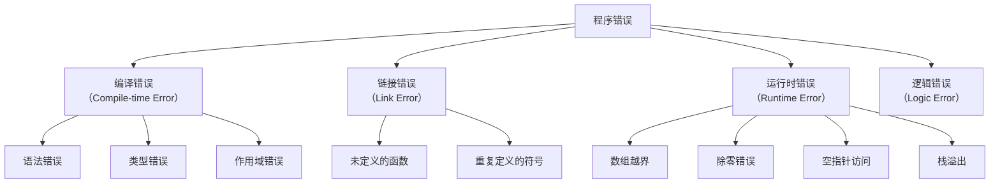

### 2.9.2 编译错误——语法错误

编译错误是编译器发现代码不符合 C++ 语法规则时产生的错误。这类错误**最容易修复**，因为编译器会告诉你出错的位置和原因。

**错误 1：缺少头文件**

```cpp
// ❌ 编译错误
int main() {
    cout << "Hello" << endl;    // 错误：cout 未声明
    return 0;
}

// 错误信息：'cout' was not declared in this scope

// ✅ 正确
#include <iostream>
using namespace std;
int main() {
    cout << "Hello" << endl;
    return 0;
}
```

**错误 2：main 函数签名错误**

```cpp
// ❌ 编译错误
void main() {                    // 错误：main 必须返回 int
    cout << "Hello" << endl;
}

// ✅ 正确
int main() {
    cout << "Hello" << endl;
    return 0;
}
```

**错误 3：字符串未闭合**

```cpp
// ❌ 编译错误
cout << "Hello;                 // 错误：字符串缺少右引号

// 错误信息：missing terminating " character
```

**错误 4：语句缺少分号**

```cpp
// ❌ 编译错误
int x = 5
int y = 10;                     // 错误：上一行缺少分号

// 错误信息：expected ';' before 'int'（错误出现在下一行）
// 注意：编译器有时会报告错误在错误行之后
```

**错误 5：使用了非法标识符**

```cpp
// ❌ 编译错误
int 2ndNumber = 5;              // 错误：以数字开头
int my-var = 10;                // 错误：包含连字符
int double = 20;                // 错误：double 是关键字
```

**错误 6：花括号不匹配**

```cpp
// ❌ 编译错误
int main() {
    cout << "Hello" << endl;
    // 缺少右花括号

// 错误信息：expected '}' at end of input

// ✅ 正确
int main() {
    cout << "Hello" << endl;
    return 0;
}                               // 别忘了花括号
```

**错误 7：变量名拼写不一致**

```cpp
// ❌ 编译错误
int myVariable = 10;
cout << myVaraible << endl;     // 错误：拼写错误（myVaraible vs myVariable）

// 错误信息：'myVaraible' was not declared in this scope
```

### 2.9.3 编译错误——类型错误

**错误 8：类型不匹配**

```cpp
// ❌ 编译错误
int add(int a, int b) {
    return a + b;
}

int main() {
    string result = add(3, 4);  // 错误：不能将 int 转换为 string
    return 0;
}
```

**错误 9：函数调用参数不匹配**

```cpp
// ❌ 编译错误
void printSquare(int x) {
    cout << x * x << endl;
}

int main() {
    printSquare();              // 错误：缺少参数
    printSquare(3, 4);          // 错误：参数太多
    return 0;
}
```

**错误 10：数组声明错误**

```cpp
// ❌ 编译错误
int arr[];                      // 错误：未指定大小
int arr[10.5];                  // 错误：数组大小必须是整数常量
int arr[-5];                    // 错误：数组大小不能为负
int n = 10;
int arr[n];                     // 在某些编译器上错误：大小必须是编译时常量
```

### 2.9.4 链接错误

链接错误发生在编译成功之后、链接阶段。原因是编译器找不到某个函数或变量的**定义**。

**错误 11：有声明无定义**

```cpp
// ❌ 链接错误
int calculate(int x);           // 只有声明（原型）
                                // 没有定义！

int main() {
    int result = calculate(5);  // 编译通过，但链接失败
    return 0;
}
// 缺少 calculate 函数的定义

// 错误信息：undefined reference to 'calculate(int)'
```

**错误 12：错误的函数签名导致找不到定义**

```cpp
// 文件：main.cpp
void print(int x);              // 原型：接受 int

int main() {
    print(5);
    return 0;
}

// 文件：functions.cpp
void print(double x) {          // 定义：接受 double（签名不同！）
    cout << x << endl;
}

// 链接错误：undefined reference to 'print(int)'
// print(double) 和 print(int) 是不同的函数（C++ 通过参数类型区分函数）
```

**错误 13：main 函数缺失**

```cpp
// 文件：test.cpp
#include <iostream>
using namespace std;

int add(int a, int b) {
    return a + b;
}
// 没有 main 函数！

// 链接错误：undefined reference to 'main'
// 编译器可以编译，但链接器找不到程序的入口点
```

### 2.9.5 运行时错误

程序编译和链接都通过了，但在运行时出现问题。

**错误 14：除零错误**

```cpp
#include <iostream>
using namespace std;

int main() {
    int a = 10, b = 0;
    int result = a / b;          // 运行时错误：整数除零
    cout << result << endl;
    return 0;
}

// 程序会崩溃，可能显示 "Floating point exception" 或直接崩溃退出
```

**错误 15：数组越界**

```cpp
#include <iostream>
using namespace std;

int main() {
    int arr[5] = {1, 2, 3, 4, 5};
    
    for (int i = 0; i <= 5; i++) {     // <= 导致越界！
        cout << arr[i] << " ";          // 当 i=5 时访问 arr[5]——越界
    }
    
    return 0;
}

// 可能的行为：
// - 输出垃圾值
// - 程序崩溃
// - 正常执行（表面正常，但内存已被破坏）
// 这是未定义行为（Undefined Behavior）
```

**错误 16：栈溢出**

```cpp
// ❌ 运行时错误：无限递归导致栈溢出
void infiniteRecursion() {
    infiniteRecursion();        // 不断调用自己，从不返回
}

int main() {
    infiniteRecursion();
    return 0;
}

// 结果：程序崩溃，通常显示 "Stack overflow" 或段错误
```

**错误 17：空指针访问**

```cpp
#include <iostream>
using namespace std;

int main() {
    int* ptr = nullptr;         // C++11 的空指针
    
    cout << *ptr << endl;       // 运行时错误：解引用空指针
    
    return 0;
}

// 结果：程序崩溃（Segmentation fault / Access violation）
```

### 2.9.6 逻辑错误

逻辑错误最危险——程序运行正常，但结果不对！这类错误不会产生任何错误信息。

**错误 18：混淆 = 和 ==**

```cpp
#include <iostream>
using namespace std;

int main() {
    int x = 5;
    
    // ❌ 逻辑错误：使用了赋值 = 而不是比较 ==
    if (x = 10) {               // 将 10 赋值给 x，表达式值为 10（真），总是执行！
        cout << "x 等于 10" << endl;
    }
    
    cout << "x 的值是: " << x << endl;    // 输出 10（不是 5！）
    return 0;
}
```

**错误 19：使用未初始化的变量**

```cpp
#include <iostream>
using namespace std;

int main() {
    int count;                  // 未初始化
    int sum = count + 10;       // 使用垃圾值
    
    cout << "sum = " << sum << endl;    // 结果不确定！
    return 0;
}

// 结果：每次运行可能得到不同的值——这是未定义行为
```

**错误 20：整数除法**

```cpp
#include <iostream>
using namespace std;

int main() {
    int a = 5, b = 2;
    
    // ❌ 逻辑错误：整数除法会截断小数
    double result = a / b;      // a/b 是整数除法，结果为 2
                                // 然后 2 被转换为 double，变成 2.0
    
    cout << "5 / 2 = " << result << endl;    // 输出 2（不是 2.5！）
    
    // ✅ 正确：让其中一个操作数为 double
    double correct = a / 2.0;                // 2.0 是 double，触发浮点除法
    cout << "5 / 2 = " << correct << endl;   // 输出 2.5
    return 0;
}
```

**错误 21：off-by-one 错误**

```cpp
#include <iostream>
using namespace std;

int main() {
    int arr[5] = {10, 20, 30, 40, 50};
    
    // ❌ 逻辑错误：应该是 i < 5，不是 i <= 5
    for (int i = 1; i <= 5; i++) {          // 从 1 开始而不是 0
        cout << arr[i] << " ";              // arr[5] 越界
    }
    cout << endl;
    
    // ✅ 正确
    for (int i = 0; i < 5; i++) {
        cout << arr[i] << " ";
    }
    cout << endl;
    return 0;
}
```

**错误 22：忘记调用函数（只写函数名不带括号）**

```cpp
#include <iostream>
using namespace std;

void greet() {
    cout << "Hello!" << endl;
}

int main() {
    greet;                      // ❌ 逻辑错误：函数名不带括号，什么都不做
                                // 这行代码是合法的但无意义（函数地址被计算但未使用）
    
    greet();                    // ✅ 正确调用函数
    return 0;
}
```

### 2.9.7 错误案例汇总表

| 编号 | 错误类型 | 错误类别 | 典型错误信息 |
|:----:|----------|:--------:|--------------|
| 1 | 缺少头文件 | 编译错误 | `'cout' was not declared` |
| 2 | main 返回非 int | 编译错误 | `'main' must return 'int'` |
| 3 | 字符串未闭合 | 编译错误 | `missing terminating "` |
| 4 | 缺少分号 | 编译错误 | `expected ';'` |
| 5 | 非法标识符 | 编译错误 | `expected unqualified-id` |
| 6 | 花括号不匹配 | 编译错误 | `expected '}'` |
| 7 | 变量名拼写错误 | 编译错误 | `not declared in this scope` |
| 8 | 类型不匹配 | 编译错误 | `cannot convert` |
| 9 | 参数数量不匹配 | 编译错误 | `no matching function` |
| 10 | 数组声明错误 | 编译错误 | `array bound is not an integer` |
| 11 | 有声明无定义 | 链接错误 | `undefined reference` |
| 12 | 函数签名不匹配 | 链接错误 | `undefined reference` |
| 13 | 缺少 main | 链接错误 | `undefined reference to 'main'` |
| 14 | 除零 | 运行时错误 | `Floating point exception` |
| 15 | 数组越界 | 运行时错误 | 崩溃或异常 |
| 16 | 栈溢出 | 运行时错误 | `Stack overflow` |
| 17 | 空指针解引用 | 运行时错误 | `Segmentation fault` |
| 18 | `=` 与 `==` 混淆 | 逻辑错误 | 无错误信息，结果错误 |
| 19 | 未初始化变量 | 逻辑错误 | 无错误信息，结果随机 |
| 20 | 整数除法截断 | 逻辑错误 | 无错误信息，精度丢失 |
| 21 | off-by-one 错误 | 逻辑错误 | 无错误信息，结果错误 |
| 22 | 调用函数忘加括号 | 逻辑错误 | 无错误信息，函数未执行 |

---

## 2.10 代码可读性

代码被阅读的次数远多于被编写的次数。写好代码不仅是为了让计算机理解，更是为了让**人**理解。

### 2.10.1 注释的艺术

好的注释解释"为什么"，而不是"是什么"。

```cpp
// ❌ 坏的注释：解释了显而易见的东西
int x = 5;      // 把 5 赋给 x
x = x + 1;      // x 加 1

// ✅ 好的注释：解释了为什么
int speed = 5;  // 初始速度设为 5，因为这是最小值
speed++;        // 加速 1 单位，弥补摩擦损耗
```

**注释的类型**：

```cpp
// 单行注释——用于简短说明

/*
 * 多行注释
 * 用于较长的说明
 * 或者临时禁用代码
 */

// 代码块注释——解释一段代码的目的
// 计算员工的年终奖
// 规则：月薪 × 绩效系数 × 工作年限系数
double bonus = salary * performanceFactor * yearsFactor;

// TODO 注释——标记需要完成的工作
// TODO: 添加输入验证

// FIXME 注释——标记已知问题
// FIXME: 大数值时可能溢出
```

**什么时候应该写注释？**

| 应该写注释的情况 | 不需要注释的情况 |
|-----------------|-----------------|
| 复杂的业务逻辑 | 显而易见的代码 |
| 不寻常的解决方案 | 自解释的函数名 |
| API 接口说明 | 简单的赋值语句 |
| 修复 bug 的原因 | 循环遍历数组 |
| 数值常量的含义 | 基本的数学运算 |

### 2.10.2 空行与代码布局

空行是代码的"标点符号"——将逻辑相关的代码分组。

```cpp
// ❌ 没有空行——所有内容挤在一起，难以阅读
#include <iostream>
using namespace std;
int main() {
    int a = 10;
    int b = 20;
    int sum = a + b;
    cout << "和: " << sum << endl;
    int diff = a - b;
    cout << "差: " << diff << endl;
    return 0;
}

// ✅ 使用空行分组——逻辑清晰
#include <iostream>
using namespace std;

int main() {
    // 声明和初始化
    int a = 10;
    int b = 20;
    
    // 计算并输出
    int sum = a + b;
    cout << "和: " << sum << endl;
    
    int diff = a - b;
    cout << "差: " << diff << endl;
    
    return 0;
}
```

### 2.10.3 代码布局风格

C++ 中花括号的位置主要有两种风格：

```cpp
// 风格 1：K&R 风格（也称"Java 风格"）——花括号在语句行末尾
int main() {
    cout << "Hello" << endl;
    if (x > 0) {
        cout << "Positive" << endl;
    }
}

// 风格 2：Allman 风格——花括号独占一行
int main()
{
    cout << "Hello" << endl;
    if (x > 0)
    {
        cout << "Positive" << endl;
    }
}
```

> **不论选择哪种风格，关键是保持一致性**。不要在一个项目中混用多种风格。

### 2.10.4 命名的艺术

好的变量名是代码的"自文档"——看到名字就知道用途。

```cpp
// ❌ 糟糕的命名
int a;                  // 这个 a 是什么？
int b;                  // 那个 b 又是什么？
int c;                  // 谁来告诉我 c 代表什么？
double d;
double e;
double f = d + e;

// ✅ 好的命名
int appleCount;         // 苹果的数量
int orangeCount;        // 橙子的数量
int totalFruit;         // 水果总数
double unitPrice;       // 单价
double totalPrice;      // 总价
double total = unitPrice * totalFruit;

// ❌ 过于简短的命名
int n;
int v;
int t;

// ✅ 合适长度的命名（没有歧义的情况下简短也可）
int numStudents;        // 学生人数
double averageScore;    // 平均分
int maxValue;           // 最大值
```

**常见命名约定**：

| 风格 | 示例 | 使用场景 |
|------|------|----------|
| camelCase | `studentName` | 变量名、函数名 |
| PascalCase | `StudentInfo` | 类名、类型名 |
| snake_case | `student_name` | C 风格命名、某些 C++ 项目 |
| UPPER_CASE | `MAX_SIZE` | 宏常量、枚举值 |
| kebab-case | `student-name` | **不能用于 C++**（不允许连字符） |

> **💡 统一性**：在 C++ 中，最主流的风格是变量使用 camelCase，类名使用 PascalCase。本书采用这种风格。

---

## 2.11 调试技巧进阶

调试是编程的核心技能。以下是一些从第一天就应掌握的调试方法。

### 2.11.1 使用 cout 进行"printf 调试"

```cpp
#include <iostream>
using namespace std;

int calculate(int x, int y) {
    cout << "DEBUG: calculate(" << x << ", " << y << ") 被调用" << endl;
    
    int result = x * y + x - y;
    cout << "DEBUG: result = " << result << endl;
    
    return result;
}

int main() {
    int a = 5, b = 3;
    int answer = calculate(a, b);
    cout << "答案: " << answer << endl;
    return 0;
}
```

**调试输出**：

```
DEBUG: calculate(5, 3) 被调用
DEBUG: result = 17
答案: 17
```

### 2.11.2 使用条件调试输出

```cpp
#include <iostream>
using namespace std;

// 定义一个调试开关
const bool DEBUG = true;        // 设为 false 可关闭调试输出

int main() {
    for (int i = 0; i < 10; i++) {
        int square = i * i;
        
        if (DEBUG) {
            cout << "DEBUG: i = " << i << ", square = " << square << endl;
        }
        
        cout << square << " ";
    }
    cout << endl;
    return 0;
}
```

### 2.11.3 断言——在调试时检查假设

`<cassert>` 头文件提供了 `assert` 宏，在调试时验证程序假设。

```cpp
#include <iostream>
#include <cassert>       // assert 宏
using namespace std;

int divide(int a, int b) {
    // 断言：b 不能为 0
    assert(b != 0);      // 如果 b == 0，程序终止并报告错误
    
    return a / b;
}

int main() {
    cout << divide(10, 2) << endl;    // 正常：5
    cout << divide(5, 0) << endl;     // 断言失败！程序崩溃并显示错误信息
    return 0;
}
```

**assert 的特点**：

- 仅在调试模式下生效（定义了 `NDEBUG` 宏时失效）
- 断言失败时输出：文件名、行号和条件
- 使用断言检查"不可能发生"的情况
- **不要**在断言中写有副作用的表达式

```cpp
// ❌ 错误：断言有副作用
assert(++x > 0);        // 在 Release 模式下，++x 不会执行

// ✅ 正确：先执行，再断言
++x;
assert(x > 0);
```

### 2.11.4 常见 bug 排查清单

当程序行为不符合预期时，按以下顺序检查：

| 步骤 | 检查项 |
|:----:|--------|
| 1 | **变量是否初始化？** 未初始化的变量包含垃圾值 |
| 2 | **数组是否越界？** 索引从 0 开始，最大为 size-1 |
| 3 | **分号是否遗漏？** 特别是 if/for/while 语句后面 |
| 4 | **`=` 还是 `==`？** 条件中是否误用了赋值运算符 |
| 5 | **函数参数顺序？** 实参的顺序是否与形参一致 |
| 6 | **整数除法？** 是否忽略了整数除法会截断小数 |
| 7 | **花括号匹配？** 嵌套结构的花括号是否配对 |
| 8 | **作用域是否正确？** 变量是否在正确的范围声明 |
| 9 | **缓冲区残留？** `cin >>` 后是否残留了换行符 |
| 10 | **错误状态？** 输入失败后是否清除了 `cin` 的错误状态 |

### 2.11.5 编写最小可复现示例

当你需要向他人求助时，**最小可复现示例**（Minimal Reproducible Example, MRE）是最有效的方式。

```cpp
// ❌ 冗长的代码——求助时太让人困惑
#include <iostream>
#include <string>
#include <vector>
#include <algorithm>
using namespace std;

struct Employee { string name; int id; double salary; };
// ... 300 行代码 ...

// ✅ 最小可复现示例——只保留相关部分
#include <iostream>
using namespace std;

int main() {
    int x;
    cout << "请输入一个整数: ";
    cin >> x;
    
    // 我期望输入 5 时输出 25，但实际输出的是垃圾值
    int square = x * x;
    cout << "平方: " << square << endl;
    
    return 0;
}
```

---

## 2.12 完整程序示例

### 2.12.1 综合例子：简单的计算器

```cpp
#include <iostream>
#include <iomanip>
using namespace std;

// 函数原型
double add(double a, double b);
double subtract(double a, double b);
double multiply(double a, double b);
double divide(double a, double b);

int main() {
    double num1, num2;
    char op;
    
    cout << "=== 简单计算器 ===" << endl;
    cout << "请输入表达式（如: 3.5 + 2.1）: ";
    cin >> num1 >> op >> num2;
    
    cout << fixed << setprecision(2);
    
    switch (op) {
        case '+':
            cout << num1 << " + " << num2 << " = " << add(num1, num2) << endl;
            break;
        case '-':
            cout << num1 << " - " << num2 << " = " << subtract(num1, num2) << endl;
            break;
        case '*':
            cout << num1 << " × " << num2 << " = " << multiply(num1, num2) << endl;
            break;
        case '/':
            if (num2 != 0) {
                cout << num1 << " ÷ " << num2 << " = " << divide(num1, num2) << endl;
            } else {
                cout << "错误：除数不能为 0！" << endl;
            }
            break;
        default:
            cout << "错误：不支持的运算符 '" << op << "'" << endl;
    }
    
    return 0;
}

double add(double a, double b) {
    return a + b;
}

double subtract(double a, double b) {
    return a - b;
}

double multiply(double a, double b) {
    return a * b;
}

double divide(double a, double b) {
    return a / b;
}
```

**运行示例**：

```
=== 简单计算器 ===
请输入表达式（如: 3.5 + 2.1）: 10 * 3.5
10.00 × 3.50 = 35.00
```

### 2.12.2 综合例子：成绩计算器

```cpp
#include <iostream>
#include <iomanip>
using namespace std;

// 函数原型
double getAverage(double s1, double s2, double s3);
char getGrade(double average);
void printReport(double s1, double s2, double s3);

int main() {
    double score1, score2, score3;
    
    cout << "请输入三门课的成绩: ";
    cin >> score1 >> score2 >> score3;
    
    printReport(score1, score2, score3);
    
    return 0;
}

double getAverage(double s1, double s2, double s3) {
    return (s1 + s2 + s3) / 3.0;
}

char getGrade(double average) {
    if (average >= 90) return 'A';
    if (average >= 80) return 'B';
    if (average >= 70) return 'C';
    if (average >= 60) return 'D';
    return 'F';
}

void printReport(double s1, double s2, double s3) {
    cout << fixed << setprecision(1);
    cout << "\n=== 成绩报告 ===" << endl;
    cout << "科目 1: " << s1 << endl;
    cout << "科目 2: " << s2 << endl;
    cout << "科目 3: " << s3 << endl;
    
    double avg = getAverage(s1, s2, s3);
    char grade = getGrade(avg);
    
    cout << "平均分: " << avg << endl;
    cout << "等级: " << grade << endl;
}
```

### 2.12.3 用户输入驱动循环（预告）

```cpp
#include <iostream>
using namespace std;

int main() {
    int count;
    
    cout << "请输入要打印的行数: ";
    cin >> count;
    
    for (int i = 0; i < count; i++) {
        cout << "第 " << i + 1 << " 行: Hello C++!" << endl;
    }
    
    return 0;
}
```

---

## 2.13 关键字与标识符

### 2.13.1 C++ 关键字

关键字是 C++ 语言保留的、有特殊含义的单词，不能用作变量名或函数名。

**C++98/C++03 关键字**：

| 类别 | 关键字 |
|------|--------|
| 基本类型 | `int` `char` `bool` `float` `double` `void` `wchar_t` `short` `long` `signed` `unsigned` |
| 类型修饰 | `const` `volatile` `mutable` |
| 存储类 | `auto` `static` `extern` `register` |
| 控制流 | `if` `else` `switch` `case` `default` `break` `continue` `return` `goto` |
| 循环 | `for` `while` `do` |
| 面向对象 | `class` `struct` `union` `enum` `public` `protected` `private` `virtual` `this` `friend` |
| 继承 | `virtual` `override`（C++11） |
| 异常 | `try` `catch` `throw` |
| 内存 | `new` `delete` `sizeof` |
| 其他 | `typedef` `namespace` `using` `template` `typename` `operator` `explicit` `asm` |

**C++11 新增关键字**：

| 关键字 | 作用 |
|--------|------|
| `nullptr` | 空指针字面量（替代 NULL） |
| `constexpr` | 编译时常量表达式 |
| `decltype` | 推断表达式的类型 |
| `noexcept` | 指定函数不抛出异常 |
| `override` | 显式覆盖虚函数 |
| `final` | 禁止重写或继承 |
| `static_assert` | 编译时断言 |

**C++14/17/20 新增关键字**：

| 关键字 | 版本 | 作用 |
|--------|:----:|------|
| `if constexpr` | C++17 | 编译时条件分支 |
| `concept` | C++20 | 概念（约束模板参数） |
| `requires` | C++20 | 约束表达式 |
| `co_await` | C++20 | 协程 |
| `co_yield` | C++20 | 协程 |
| `co_return` | C++20 | 协程 |
| `export` | C++20 | 模块导出 |
| `import` | C++20 | 模块导入 |
| `module` | C++20 | 模块定义 |

### 2.13.2 标识符命名规则

1. **组成字符**：只能包含字母（a-z, A-Z）、数字（0-9）、下划线（_）
2. **首字符**：不能以数字开头
3. **区分大小写**：`myVar`、`MyVar` 和 `myvar` 是三个不同的标识符
4. **不能是关键字**：不能使用 C++ 关键字
5. **长度**：C++ 标准没有限制，但编译器实现可能有上限

```cpp
// ✅ 合法标识符
int myVariable;
int _count;              // 可以以下划线开头，但通常不推荐
int total_sum;
int number2;
int _1stPlace;           // 下划线开头后跟数字是可以的
int MyVariable;          // 和 myVariable 不同

// ❌ 非法标识符
int 2ndPlace;            // 错误：以数字开头
int my-var;              // 错误：包含连字符（减号）
int double;              // 错误：double 是关键字
int int;                 // 错误：int 是关键字
int my var;              // 错误：包含空格

// ⚠️ 合法但应避免
int _Foo;                // 双下划线开头或下划线+大写字母开头——保留给编译器
int __count;             // 双下划线——保留给编译器
int _;                   // 合法，但太不直观
```

> **⚠️ 保留规则**：
> - 以双下划线开头的标识符（如 `__reserved`）保留给编译器
> - 以单下划线加大写字母开头的标识符（如 `_Reserved`）保留给编译器
> - 以单下划线开头的标识符在全局作用域中保留给编译器

### 2.13.3 常见命名约定

```cpp
// 变量——camelCase（小驼峰）
int studentCount;
double averageScore;
string firstName;

// 常量——全大写加下划线
const int MAX_STUDENTS = 100;
const double PI = 3.14159;

// 函数——camelCase（小驼峰）
int getTotal();
void printReport();

// 类/结构体——PascalCase（大驼峰）
class StudentInfo { };
struct Point2D { };

// 宏——全大写加下划线（但现代 C++ 中尽量少用宏）
#define MAX_SIZE 1024
```

---

## 2.14 编程风格：从第一天就养成好习惯

```cpp
#include <iostream>      // 头文件单独一行
using namespace std;     // using 指令单独一行

int main() {             // 函数体花括号对齐
    int apples = 10;     // 变量声明在函数开头附近
    int oranges = 20;
    
    int fruit = apples + oranges;
    
    cout << "水果总数: " << fruit << endl;   // 语句清晰
    cout << "苹果: " << apples << endl;      // 对齐相似语句
    cout << "橙子: " << oranges << endl;
    
    return 0;            // return 单独一行
}
```

**好的编程习惯清单**：

| 习惯 | 说明 |
|------|------|
| 使用有意义的变量名 | `studentCount` 比 `sc` 好 |
| 每行只写一条语句 | 提高可读性，方便调试 |
| 适当使用空行 | 分隔逻辑块 |
| 保持缩进一致 | 建议 4 个空格，不要混用 Tab 和空格 |
| 声明变量时就初始化 | 避免未定义行为 |
| 函数返回类型写在前面 | 保持 C++ 的统一风格 |
| 花括号风格一致 | 选择一种风格并坚持 |
| 写必要的注释 | 解释"为什么"而不是"是什么" |
| 避免魔法数字 | 使用命名常量代替直接写数值 |
| 及时关闭临时打开的代码块 | 花括号成对写出 |

**魔法数字示例**：

```cpp
// ❌ 魔法数字——难以理解
double total = price * 0.08 + price;

// ✅ 使用命名常量
const double TAX_RATE = 0.08;
double tax = price * TAX_RATE;
double total = tax + price;
```

**成对写出花括号**：

```cpp
// 养成先写出完整结构，再填充内容的习惯

// 先写：
if (condition) {

}

// 再填充：
if (condition) {
    cout << "条件成立" << endl;
}
```

---

## 2.15 本章总结

### 2.15.1 知识体系总图

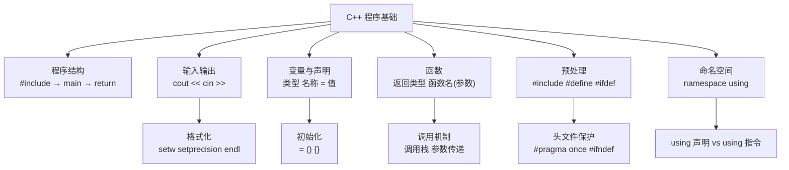

### 2.15.2 核心概念速查表

| 知识点 | 说明 | 示例 |
|--------|------|------|
| `#include <header>` | 包含标准头文件 | `#include <iostream>` |
| `int main()` | 主函数入口 | --- |
| `cout << value` | 输出到屏幕 | `cout << "Hello";` |
| `cin >> variable` | 从键盘输入 | `cin >> age;` |
| `int x = 5;` | 声明并初始化变量 | `int count = 0;` |
| `int x{5};` | C++11 列表初始化 | `int count{0};` |
| `函数原型` | 先声明后使用 | `int add(int, int);` |
| `return value;` | 函数返回值 | `return 0;` |
| `using namespace std;` | 使用 std 命名空间 | --- |
| `endl` | 换行 + 刷新缓冲区 | `cout << endl;` |
| `setw(n)` | 设置输出宽度 | `cout << setw(8) << x;` |
| `setprecision(n)` | 设置浮点数精度 | `cout << setprecision(3) << pi;` |
| `fixed` | 固定小数位数模式 | `cout << fixed;` |

### 2.15.3 掌握程度评估

| 知识点 | 掌握要求 | 自评 |
|--------|----------|:----:|
| Hello World 程序的结构 | 会编写和解释每行代码 | [ ] |
| `cout` 与 `<<` 输出 | 熟练使用 | [ ] |
| `cin` 与 `>>` 输入 | 熟练使用 | [ ] |
| 变量声明与初始化 | 掌握多种初始化方式 | [ ] |
| 函数定义、原型、调用 | 理解并能编写 | [ ] |
| 函数参数传递（值传递） | 理解副本机制 | [ ] |
| 格式化输出 | 了解 `setw`、`setprecision` | [ ] |
| 输入错误处理 | 理解 `cin.fail()` | [ ] |
| 预处理指令 | 理解 `#include`、`#define` | [ ] |
| 命名空间 | 理解 `std` 和 `using` | [ ] |
| 程序错误类型 | 能区分编译/链接/运行/逻辑错误 | [ ] |
| 好代码习惯 | 命名、注释、风格 | [ ] |

---

## 2.16 动手练习

以下练习由易到难排列。请务必动手编写代码并编译运行。

### 练习 1：个人信息输出

编写一个程序，输出你的名字、年龄和喜欢的编程语言。

**要求**：
- 使用至少三个 `cout` 语句
- 使用 `endl` 或 `\n` 换行

**示例输出**：
```
姓名: 张三
年龄: 25
喜欢的语言: C++
```

<details>
<summary>参考答案</summary>

```cpp
#include <iostream>
using namespace std;

int main() {
    cout << "姓名: 张三" << endl;
    cout << "年龄: 25" << endl;
    cout << "喜欢的语言: C++" << endl;
    return 0;
}
```

</details>

---

### 练习 2：整数平方计算器

编写一个程序，提示用户输入一个整数，然后输出它的平方。

**要求**：
- 使用 `cin` 读取输入
- 使用一个变量存储平方结果
- 输出格式为：`5 的平方是 25`

<details>
<summary>参考答案</summary>

```cpp
#include <iostream>
using namespace std;

int main() {
    int num;
    
    cout << "请输入一个整数: ";
    cin >> num;
    
    int square = num * num;
    cout << num << " 的平方是 " << square << endl;
    
    return 0;
}
```

</details>

---

### 练习 3：温度转换

编写一个程序，将华氏温度转换为摄氏温度。

**公式**：$$C = (F - 32) \times \frac{5}{9}$$

**要求**：
- 提示用户输入华氏温度
- 输出摄氏温度（保留 2 位小数）
- 使用 `setprecision` 控制精度

**示例输出**：
```
请输入华氏温度: 100
100.00°F = 37.78°C
```

<details>
<summary>参考答案</summary>

```cpp
#include <iostream>
#include <iomanip>
using namespace std;

int main() {
    double fahrenheit;
    
    cout << "请输入华氏温度: ";
    cin >> fahrenheit;
    
    double celsius = (fahrenheit - 32) * 5.0 / 9.0;
    
    cout << fixed << setprecision(2);
    cout << fahrenheit << "°F = " << celsius << "°C" << endl;
    
    return 0;
}
```

</details>

---

### 练习 4：分钟转换

编写一个函数 `void convertMinutes(int minutes)`，将分钟数转换为小时和分钟。

**要求**：
- 在 `main` 中调用该函数
- 使用函数原型
- 输出格式：`135 分钟 = 2 小时 15 分钟`

<details>
<summary>参考答案</summary>

```cpp
#include <iostream>
using namespace std;

// 函数原型
void convertMinutes(int minutes);

int main() {
    int input;
    
    cout << "请输入分钟数: ";
    cin >> input;
    
    convertMinutes(input);
    
    return 0;
}

// 函数定义
void convertMinutes(int minutes) {
    int hours = minutes / 60;
    int mins = minutes % 60;
    cout << minutes << " 分钟 = " << hours << " 小时 " << mins << " 分钟" << endl;
}
```

</details>

---

### 练习 5：计算器——和、差、积、商

编写一个程序，输入两个浮点数，输出它们的和、差、积、商。

**要求**：
- 使用四个独立的函数
- 处理除零情况
- 保留 2 位小数

**示例输出**：
```
请输入两个数: 10 3
10.00 + 3.00 = 13.00
10.00 - 3.00 = 7.00
10.00 × 3.00 = 30.00
10.00 ÷ 3.00 = 3.33
```

<details>
<summary>参考答案</summary>

```cpp
#include <iostream>
#include <iomanip>
using namespace std;

double add(double a, double b);
double subtract(double a, double b);
double multiply(double a, double b);
double divide(double a, double b);

int main() {
    double x, y;
    
    cout << "请输入两个数: ";
    cin >> x >> y;
    
    cout << fixed << setprecision(2);
    
    cout << x << " + " << y << " = " << add(x, y) << endl;
    cout << x << " - " << y << " = " << subtract(x, y) << endl;
    cout << x << " * " << y << " = " << multiply(x, y) << endl;
    
    if (y != 0) {
        cout << x << " / " << y << " = " << divide(x, y) << endl;
    } else {
        cout << "错误：除数不能为 0" << endl;
    }
    
    return 0;
}

double add(double a, double b) { return a + b; }
double subtract(double a, double b) { return a - b; }
double multiply(double a, double b) { return a * b; }
double divide(double a, double b) { return a / b; }
```

</details>

---

### 练习 6：成绩等级判定

编写一个程序，输入学生的百分制成绩（0-100），输出对应的等级。

**等级规则**：
- 90-100：A（优秀）
- 80-89：B（良好）
- 70-79：C（中等）
- 60-69：D（及格）
- 0-59：F（不及格）

**要求**：
- 使用函数 `char getGrade(int score)` 返回等级
- 如果输入超出 0-100 范围，提示"无效成绩"
- 使用 `if` 语句实现

<details>
<summary>参考答案</summary>

```cpp
#include <iostream>
using namespace std;

char getGrade(int score);

int main() {
    int score;
    
    cout << "请输入成绩（0-100）: ";
    cin >> score;
    
    if (score < 0 || score > 100) {
        cout << "无效成绩！请输入 0-100 之间的数值。" << endl;
    } else {
        char grade = getGrade(score);
        cout << "成绩: " << score << "，等级: " << grade << endl;
    }
    
    return 0;
}

char getGrade(int score) {
    if (score >= 90) return 'A';
    if (score >= 80) return 'B';
    if (score >= 70) return 'C';
    if (score >= 60) return 'D';
    return 'F';
}
```

</details>

---

### 练习 7：圆柱体体积计算器

编写一个程序，输入圆柱体的半径和高，计算体积。

**公式**：$$V = \pi r^2 h$$

**要求**：
- 定义 `const double PI = 3.1415926535;`
- 使用函数 `double cylinderVolume(double radius, double height)`
- 保留 3 位小数

**示例输出**：
```
请输入半径和高: 5 10
半径为 5.00、高为 10.00 的圆柱体体积 = 785.398
```

<details>
<summary>参考答案</summary>

```cpp
#include <iostream>
#include <iomanip>
using namespace std;

const double PI = 3.1415926535;

double cylinderVolume(double radius, double height) {
    return PI * radius * radius * height;
}

int main() {
    double r, h;
    
    cout << "请输入半径和高: ";
    cin >> r >> h;
    
    cout << fixed << setprecision(2);
    cout << "半径为 " << r << "、高为 " << h << " 的圆柱体";
    cout << fixed << setprecision(3);
    cout << "体积 = " << cylinderVolume(r, h) << endl;
    
    return 0;
}
```

</details>

---

### 练习 8：输入验证——健壮的整数输入

编写一个程序，不断要求用户输入一个正整数，直到输入正确为止。

**要求**：
- 检测非数字输入
- 检测负数输入
- 只接受正整数

**示例运行**：
```
请输入一个正整数: abc
输入无效，请重新输入！
请输入一个正整数: -5
输入无效，请重新输入！
请输入一个正整数: 42
你输入的正整数是: 42
```

<details>
<summary>参考答案</summary>

```cpp
#include <iostream>
#include <limits>
using namespace std;

int main() {
    int number;
    
    cout << "请输入一个正整数: ";
    
    while (true) {
        cin >> number;
        
        if (cin.fail()) {
            // 输入非数字
            cin.clear();
            cin.ignore(numeric_limits<streamsize>::max(), '\n');
            cout << "输入无效，请重新输入！" << endl;
            cout << "请输入一个正整数: ";
        } else if (number <= 0) {
            // 输入了非正整数
            cout << "输入无效，请重新输入！" << endl;
            cout << "请输入一个正整数: ";
        } else {
            // 输入有效
            break;
        }
    }
    
    cout << "你输入的正整数是: " << number << endl;
    return 0;
}
```

</details>

---

### 练习 9：格式化乘法表

编写一个程序，输出 1-9 的乘法表（"小九九"）。

**要求**：
- 使用 `setw` 对齐列
- 输出格式整齐

**示例输出**（为节省篇幅只显示前几行，你应该输出完整的 1-9 乘法表）：
```
  1  2  3  4  5  6  7  8  9
  1  2  3  4  5  6  7  8  9
  2  4  6  8 10 12 14 16 18
  3  6  9 12 15 18 21 24 27
  ...
```

<details>
<summary>参考答案</summary>

```cpp
#include <iostream>
#include <iomanip>
using namespace std;

int main() {
    // 输出表头
    cout << setw(4) << "";
    for (int i = 1; i <= 9; i++) {
        cout << setw(4) << i;
    }
    cout << endl;
    
    // 输出分隔线
    cout << setw(4) << "";
    for (int i = 1; i <= 9; i++) {
        cout << setw(4) << "---";
    }
    cout << endl;
    
    // 输出乘法表
    for (int i = 1; i <= 9; i++) {
        cout << setw(2) << i << " |";
        for (int j = 1; j <= 9; j++) {
            cout << setw(4) << i * j;
        }
        cout << endl;
    }
    
    return 0;
}
```

</details>

---

### 练习 10：综合挑战——利息计算器

编写一个程序，计算银行定期存款的本息和。

**复利公式**：$$A = P \times (1 + r)^n$$

其中：
- $A$ = 本息和
- $P$ = 本金
- $r$ = 年利率（小数形式，如 0.05 表示 5%）
- $n$ = 存款年数

**要求**：
- 使用函数 `double calculate(double principal, double rate, int years)`
- 提示用户输入本金、年利率（如 5 表示 5%）和存款年数
- 将利率从百分比转换为小数（除以 100）
- 保留 2 位小数
- 使用 `pow` 函数（参考：`#include <cmath>`，`pow(base, exponent)`）

**示例输出**：
```
请输入本金: 10000
请输入年利率（%）: 5
请输入存款年数: 3

本金: 10000.00 元
年利率: 5.00%
存款年数: 3 年
本息和: 11576.25 元
```

<details>
<summary>参考答案</summary>

```cpp
#include <iostream>
#include <iomanip>
#include <cmath>       // pow 函数
using namespace std;

double calculate(double principal, double rate, int years) {
    return principal * pow(1 + rate, years);
}

int main() {
    double principal;
    double ratePercent;
    int years;
    
    cout << "请输入本金: ";
    cin >> principal;
    
    cout << "请输入年利率（%）: ";
    cin >> ratePercent;
    
    cout << "请输入存款年数: ";
    cin >> years;
    
    double rateDecimal = ratePercent / 100.0;
    double total = calculate(principal, rateDecimal, years);
    
    cout << fixed << setprecision(2);
    cout << "\n本金: " << principal << " 元" << endl;
    cout << "年利率: " << ratePercent << "%" << endl;
    cout << "存款年数: " << years << " 年" << endl;
    cout << "本息和: " << total << " 元" << endl;
    
    return 0;
}
```

</details>

---

## 2.17 复习题要点自查

完成本章学习后，你应该能够回答以下问题：

1. `#include <iostream>` 的作用是什么？
2. 为什么 C++ 程序需要 `main()` 函数？
3. `cout`、`cin`、`endl` 分别代表什么？
4. `<<` 和 `>>` 运算符在输入输出中的方向？
5. 为什么函数需要在调用前有原型声明？
6. 声明和定义的区别是什么？
7. 四种初始化方式的不同点是什么？
8. 什么是命名空间？`using namespace std;` 的作用是什么？
9. 编译错误、链接错误、运行时错误和逻辑错误的区别？
10. 什么是未定义行为（Undefined Behavior）？

---
