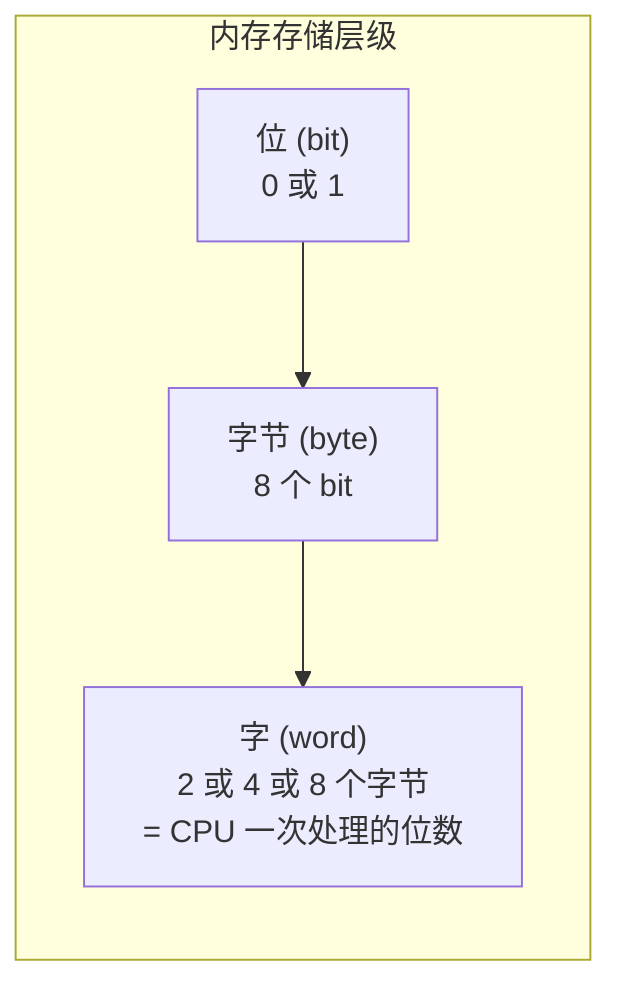
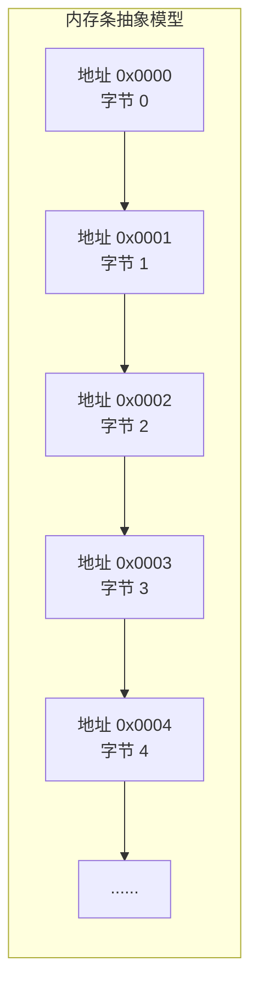
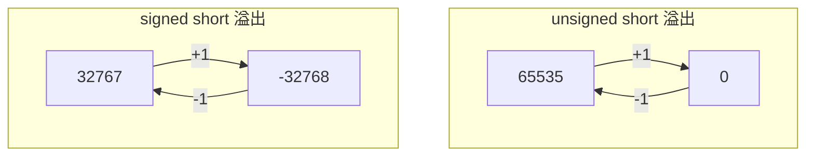
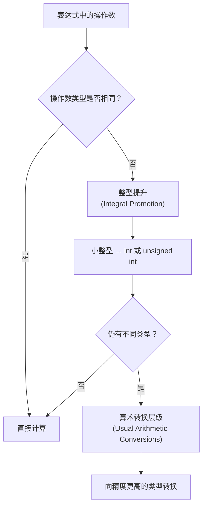
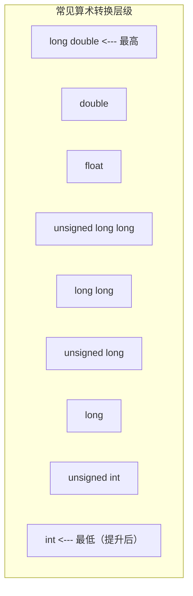
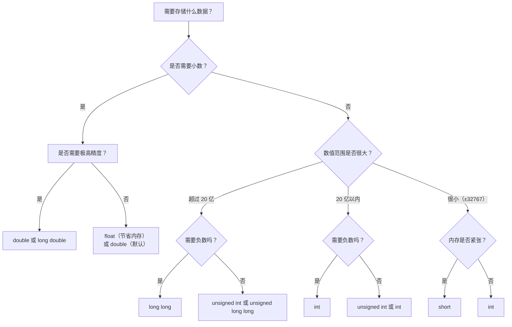

# 第 3 章：处理数据

> **本章目标**: 掌握 C++ 的基本数据类型（整型、浮点型），理解变量的声明与初始化、类型转换和 `const` 限定符的使用。从计算机内存底层出发，深入理解每种数据类型的存储方式、取值范围和精度特性。

---

## 3.1 变量与基本类型

### 3.1.1 计算机内存基础

#### 位（Bit）、字节（Byte）、字（Word）

计算机以**二进制**（binary）存储所有数据，即只有 0 和 1 两种状态。理解内存的基本单位是掌握数据类型的前提。



| 单位 | 英文 | 大小 | 说明 |
|------|------|------|------|
| 位 | bit | 1 bit | 最小的存储单位，值为 0 或 1 |
| 字节 | byte | 8 bits | 内存编址的基本单位，每个字节有唯一地址 |
| 字 | word | 2/4/8 字节 | CPU 一次能并行处理的数据宽度（与体系结构相关） |
| 千字节 | KB | $1024$ 字节 | $2^{10}$ 字节 |
| 兆字节 | MB | $1024$ KB | $2^{20}$ 字节 |
| 吉字节 | GB | $1024$ MB | $2^{30}$ 字节 |
| 太字节 | TB | $1024$ GB | $2^{40}$ 字节 |

> **历史注记**: "字"的大小取决于 CPU 架构。8 位 CPU 的字是 1 字节，16 位 CPU 的字是 2 字节，32 位 CPU 的字是 4 字节，64 位 CPU 的字是 8 字节。现代 x86-64 架构的字长为 8 字节（64 位）。

#### 内存地址模型



#### 二进制、十进制、十六进制

**进制的本质**：用有限的数字符号表示所有数值的方法。

| 进制 | 基数 | 数字符号 | 前缀 | 示例 |
|------|------|----------|------|------|
| 二进制（Binary） | 2 | 0, 1 | `0b` / `0B`（C++14） | `0b1010` |
| 八进制（Octal） | 8 | 0-7 | `0` | `012` |
| 十进制（Decimal） | 10 | 0-9 | 无前缀 | `10` |
| 十六进制（Hex） | 16 | 0-9, A-F | `0x` / `0X` | `0xA` |

#### 进制转换详解

**1. 二进制 → 十进制**（按权展开法）：

每一位的值乘以 2 的幂次，再求和。

$$1011_2 = 1 \times 2^3 + 0 \times 2^2 + 1 \times 2^1 + 1 \times 2^0 = 8 + 0 + 2 + 1 = 11_{10}$$

示例：将 `0b110101` 转为十进制：

$$110101_2 = 1 \times 2^5 + 1 \times 2^4 + 0 \times 2^3 + 1 \times 2^2 + 0 \times 2^1 + 1 \times 2^0 = 32 + 16 + 0 + 4 + 0 + 1 = 53_{10}$$

**2. 十进制 → 二进制**（除 2 取余法）：

将十进制数不断除以 2，取余数逆序排列。

示例：将 $53_{10}$ 转为二进制：

```
53 ÷ 2 = 26 余 1  ↑
26 ÷ 2 = 13 余 0  |
13 ÷ 2 = 6  余 1  |
6  ÷ 2 = 3  余 0  |
3  ÷ 2 = 1  余 1  |
1  ÷ 2 = 0  余 1  |
逆序读取 → 110101₂
```

**3. 二进制 ↔ 十六进制**（四位一组法）：

因为 $2^4 = 16$，每 4 位二进制数可以对应 1 位十六进制数。

```
二进制:  1101 0101
十六进制:  D    5
结果: 0xD5
```

反过来：`0x3F` → `0011 1111` → `0b111111`

**4. 二进制 ↔ 八进制**（三位一组法）：

因为 $2^3 = 8$，每 3 位二进制数可以对应 1 位八进制数。

```
二进制:  110 101
八进制:   6   5
结果: 065
```

**5. 常用转换对照表**

| 十进制 | 二进制 | 八进制 | 十六进制 |
|--------|--------|--------|----------|
| 0 | 0000 | 0 | 0 |
| 1 | 0001 | 1 | 1 |
| 2 | 0010 | 2 | 2 |
| 3 | 0011 | 3 | 3 |
| 4 | 0100 | 4 | 4 |
| 5 | 0101 | 5 | 5 |
| 6 | 0110 | 6 | 6 |
| 7 | 0111 | 7 | 7 |
| 8 | 1000 | 10 | 8 |
| 9 | 1001 | 11 | 9 |
| 10 | 1010 | 12 | A |
| 11 | 1011 | 13 | B |
| 12 | 1100 | 14 | C |
| 13 | 1101 | 15 | D |
| 14 | 1110 | 16 | E |
| 15 | 1111 | 17 | F |

#### 原码、反码、补码

计算机内部使用**补码（Two's Complement）** 表示有符号整数。理解原码、反码、补码对掌握整型取值范围至关重要。

| 编码方式 | 定义 | 特点 |
|----------|------|------|
| **原码** | 最高位为符号位（0 正 1 负），其余位为数值位 | 直观，但存在 $+0$ 和 $-0$ 两个零 |
| **反码** | 正数的反码同原码；负数的反码 = 符号位不变，数值位按位取反 | 解决了加法问题，但仍有两个零 |
| **补码** | 正数的补码同原码；负数的补码 = 反码 + 1 | **只有一个零**，是现代计算机的通用方案 |

**示例（以 8 位有符号整数为例）**：

| 十进制 | 原码 | 反码 | 补码 |
|--------|------|------|------|
| +5 | 0000 0101 | 0000 0101 | 0000 0101 |
| -5 | 1000 0101 | 1111 1010 | 1111 1011 |
| +0 | 0000 0000 | 0000 0000 | 0000 0000 |
| -0 | 1000 0000 | 1111 1111 | 0000 0000（补码只有 +0） |
| -128 | 无法表示 | 无法表示 | 1000 0000 |

**为什么用补码？**

补码的最大优势是：**加法器无需区分有符号和无符号，同一套电路即可工作**。

例如计算 $5 + (-3)$：

```
   0000 0101  (+5 的补码)
 + 1111 1101  (-3 的补码)
 -----------
 1 0000 0010  → 丢弃最高位进位 → 0000 0010 = +2 ✅
```

**补码取值范围推导（以 8 位为例）**：

- 最大正数：$0111\;1111 = 2^7 - 1 = 127$
- 最小正数：$0000\;0001 = 1$
- 零：$0000\;0000$
- 最小负数：$1000\;0000 = -2^7 = -128$
- 最大负数：$1111\;1111 = -1$

$$n \text{ 位有符号整型范围：} -2^{n-1} \sim 2^{n-1} - 1$$

$$n \text{ 位无符号整型范围：} 0 \sim 2^n - 1$$

#### 变量 = 名称 + 类型 + 值 + 地址

```cpp
int age = 25;
// 变量名: age
// 类型: int（有符号 32 位整数）
// 值: 25
// 存储的二进制补码: 00000000 00000000 00000000 00011001
// 地址: 假设为 0x00A3FB40（编译器分配）
```

```cpp
#include <iostream>
using namespace std;

int main() {
    int age = 25;
    
    cout << "变量名: age" << endl;
    cout << "值: " << age << endl;
    cout << "大小: " << sizeof(age) << " 字节" << endl;

    // 示例：观察十六进制存储
    unsigned char* p = reinterpret_cast<unsigned char*>(&age);
    cout << "内存字节（小端序）: ";
    for (size_t i = 0; i < sizeof(age); ++i) {
        cout << hex << (int)p[i] << " ";
    }
    cout << dec << endl;
    
    return 0;
}
```

### 3.1.2 C++ 的基本数据类型分类

C++ 的基本类型分为三组：

```
基本数据类型
├── 整型（整数类型）
│   ├── short          —— 短整型
│   ├── int            —— 整型
│   ├── long           —— 长整型
│   ├── long long      —— 长长整型（C++11）
│   ├── unsigned 版本   —— 无符号整型
│   └── char           —— 字符类型（本质上也是整型）
├── 浮点型（实数类型）
│   ├── float          —— 单精度浮点数
│   ├── double         —— 双精度浮点数
│   └── long double    —— 扩展精度浮点数
└── 其他
    ├── bool           —— 布尔类型
    └── void           —— 空类型（用于函数返回值等特殊用途）
```

---

## 3.2 整型（Integer Types）

### 3.2.1 各整型的取值范围推导

整型的取值范围由**字节数**和**有无符号**共同决定。

#### 取值范围通用公式

对于 $n$ 位（$n$ 个 bit）的整型：

| 类型 | 最小值 | 最大值 |
|------|--------|--------|
| 有符号 | $-2^{n-1}$ | $2^{n-1} - 1$ |
| 无符号 | $0$ | $2^n - 1$ |

#### 各类型取值范围详细推导

**short（2 字节 = 16 位）**：

- 有符号 short：$-2^{15} \sim 2^{15} - 1 = -32768 \sim 32767$
- 无符号 short：$0 \sim 2^{16} - 1 = 0 \sim 65535$

**int（4 字节 = 32 位，典型情况）**：

- 有符号 int：$-2^{31} \sim 2^{31} - 1 = -2,147,483,648 \sim 2,147,483,647$
- 无符号 int：$0 \sim 2^{32} - 1 = 0 \sim 4,294,967,295$

**long long（8 字节 = 64 位）**：

- 有符号 long long：$-2^{63} \sim 2^{63} - 1 \approx -9.22 \times 10^{18} \sim 9.22 \times 10^{18}$
- 无符号 long long：$0 \sim 2^{64} - 1 \approx 1.84 \times 10^{19}$

#### 标准表格

| 类型 | 典型字节数 | 最小值 | 最大值 |
|------|-----------|--------|--------|
| `short` | 2 | $-32,768$ | $32,767$ |
| `unsigned short` | 2 | $0$ | $65,535$ |
| `int` | 4 | $-2,147,483,648$ | $2,147,483,647$ |
| `unsigned int` | 4 | $0$ | $4,294,967,295$ |
| `long` | 4（Win）/ 8（Linux） | 取决于平台 | 取决于平台 |
| `unsigned long` | 4 / 8 | $0$ | 取决于平台 |
| `long long` | 8 | $-2^{63}$ | $2^{63}-1$ |
| `unsigned long long` | 8 | $0$ | $2^{64}-1$ |

> **⚠️ 平台相关性**：`int` 通常是 4 字节，`long` 在 Windows 上为 4 字节，在 Linux/macOS 上为 8 字节。`long long` 保证至少 8 字节。

#### C++ 标准对整型大小的保证

C++ 标准只规定了各整型的**最小大小**，实际实现可能更大：

```
标准保证的最小大小：
char      ≥ 1 字节（= 1 字节，这是唯一固定大小的）
short     ≥ 2 字节
int       ≥ 2 字节（但几乎所有现代平台都是 4 字节）
long      ≥ 4 字节
long long ≥ 8 字节（C++11）
```

**大小排序保证**：

$$1 = \text{sizeof(char)} \leq \text{sizeof(short)} \leq \text{sizeof(int)} \leq \text{sizeof(long)} \leq \text{sizeof(long long)}$$

#### climits 常量完整列表

`<climits>`（或 `<limits.h>`）定义了各整型范围宏常量：

| 宏常量 | 含义 | 典型值 |
|--------|------|--------|
| `CHAR_BIT` | char 的位数 | 8 |
| `SCHAR_MIN` | signed char 最小值 | -128 |
| `SCHAR_MAX` | signed char 最大值 | 127 |
| `UCHAR_MAX` | unsigned char 最大值 | 255 |
| `CHAR_MIN` | char 最小值 | -128 或 0（取决于实现） |
| `CHAR_MAX` | char 最大值 | 127 或 255 |
| `SHRT_MIN` | short 最小值 | -32768 |
| `SHRT_MAX` | short 最大值 | 32767 |
| `USHRT_MAX` | unsigned short 最大值 | 65535 |
| `INT_MIN` | int 最小值 | -2147483648 |
| `INT_MAX` | int 最大值 | 2147483647 |
| `UINT_MAX` | unsigned int 最大值 | 4294967295 |
| `LONG_MIN` | long 最小值 | -2147483648 或 -9.22e18 |
| `LONG_MAX` | long 最大值 | 2147483647 或 9.22e18 |
| `ULONG_MAX` | unsigned long 最大值 | 4294967295 或 1.84e19 |
| `LLONG_MIN` | long long 最小值 | -9223372036854775808 |
| `LLONG_MAX` | long long 最大值 | 9223372036854775807 |
| `ULLONG_MAX` | unsigned long long 最大值 | 18446744073709551615 |

```cpp
#include <iostream>
#include <climits>
using namespace std;

int main() {
    cout << "=== 各整型取值范围 ===" << endl;
    cout << "char 位数: " << CHAR_BIT << endl;
    cout << "signed char: [" << SCHAR_MIN << ", " << SCHAR_MAX << "]" << endl;
    cout << "unsigned char: [0, " << UCHAR_MAX << "]" << endl;
    cout << "short: [" << SHRT_MIN << ", " << SHRT_MAX << "]" << endl;
    cout << "int: [" << INT_MIN << ", " << INT_MAX << "]" << endl;
    cout << "long: [" << LONG_MIN << ", " << LONG_MAX << "]" << endl;
    cout << "long long: [" << LLONG_MIN << ", " << LLONG_MAX << "]" << endl;

    cout << "\n=== 验证关系 ===" << endl;
    cout << "sizeof(char) ≤ sizeof(short): " 
         << (sizeof(char) <= sizeof(short) ? "true" : "false") << endl;
    cout << "sizeof(short) ≤ sizeof(int): "
         << (sizeof(short) <= sizeof(int) ? "true" : "false") << endl;
    cout << "sizeof(int) ≤ sizeof(long): "
         << (sizeof(int) <= sizeof(long) ? "true" : "false") << endl;
    
    return 0;
}
```

### 3.2.2 无符号类型（unsigned）

无符号类型只能表示**非负整数**，用于明确不需要负数的场景（如计数、数组索引、位运算等）。

```cpp
#include <iostream>
using namespace std;

int main() {
    unsigned int count = 100;       // 合理的用途：计数
    unsigned int population = 0;    // 人口不能为负数
    
    // signed 和 unsigned 混用的陷阱
    unsigned int a = 10;
    int b = -20;
    
    // 表达式中有 signed 和 unsigned 时，signed 会转为 unsigned！
    // -20 转为 unsigned 会变成很大的正数
    if (a + b > 0) {
        cout << "a + b > 0 （注意：b 被转为 unsigned 了）" << endl;
    }
    
    // 永远不要用 unsigned 保存"不可能为负"但可能参与减法运算的值
    unsigned int x = 5;
    unsigned int y = 10;
    // x - y 结果会是 4294967291（回绕），不是 -5
    cout << "5 - 10 (unsigned) = " << x - y << endl;
    
    return 0;
}
```

> **⚠️ unsigned 的陷阱**：无符号类型永远非负，但这也意味着**不会产生负数结果**。当无符号整数减到 0 以下时，会发生回绕（wrap around），变成一个很大的正数。这个特性常导致隐蔽的 bug，尤其是循环中使用递减操作时。

```cpp
// 经典 bug：无限循环！
for (unsigned int i = 10; i >= 0; --i) {  // i 永远 >= 0
    cout << i << endl;  // 10, 9, ..., 0, 4294967295, ...
}
```

### 3.2.3 整型字面量

```cpp
// 十进制（最常用）
int d = 42;            // 十进制字面量

// 八进制（以 0 开头）
int o = 052;           // 八进制 = 8*5 + 2 = 42

// 十六进制（以 0x 或 0X 开头）
int h = 0x2A;          // 十六进制 = 2*16 + 10 = 42

// 二进制（C++14 起）
int b = 0b101010;      // 二进制 = 42
```

**输出不同进制**：

```cpp
#include <iostream>
using namespace std;

int main() {
    int n = 42;
    
    cout << "十进制: " << n << endl;               // 输出: 42
    cout << oct << "八进制: " << n << endl;          // 输出: 52
    cout << hex << "十六进制: " << n << endl;        // 输出: 2a
    cout << dec << "恢复十进制: " << n << endl;      // 输出: 42
    
    // 显示进制前缀
    cout << showbase;
    cout << oct << "八进制(带前缀): " << n << endl;    // 输出: 052
    cout << hex << "十六进制(带前缀): " << n << endl;  // 输出: 0x2a
    cout << noshowbase << dec;
    
    return 0;
}
```

**C++14 数字分隔符**：

```cpp
// C++14 起可以用单引号 ' 分隔数字，提高可读性
int million = 1'000'000;           // 等价于 1000000
int hex_with_sep = 0xFF'FF'FF'FF;  // 十六进制分隔
int bin_with_sep = 0b1010'1011'1100'1101; // 二进制分隔
```

### 3.2.4 整型字面量后缀

| 后缀 | 含义 | 示例 |
|------|------|------|
| `u` / `U` | unsigned | `42u` |
| `l` / `L` | long | `42L` |
| `ll` / `LL` | long long | `42LL` |
| `ul` / `UL` | unsigned long | `42UL` |
| `ull` / `ULL` | unsigned long long | `42ULL` |
| `z` / `Z` | size_t（C++23） | `42z` |

```cpp
long n = 100L;                  // long 类型
unsigned int m = 100U;          // unsigned int 类型
long long big = 100LL;          // long long 类型
unsigned long long huge = 100ULL; // unsigned long long

// 不指定后缀时，编译器会根据值的大小自动选择合适的类型
auto v1 = 42;       // int
auto v2 = 4200000000;  // unsigned int 或 long long（取决于值是否超过 INT_MAX）
auto v3 = 42LL;     // long long
```

### 3.2.5 sizeof 运算符

`sizeof` 用于获取类型或变量所占的字节数，返回 `size_t` 类型（无符号整型）：

```cpp
#include <iostream>
using namespace std;

int main() {
    cout << "=== 各类型的大小（字节）===" << endl;
    cout << "sizeof(bool):       " << sizeof(bool) << endl;
    cout << "sizeof(char):       " << sizeof(char) << endl;
    cout << "sizeof(short):      " << sizeof(short) << endl;
    cout << "sizeof(int):        " << sizeof(int) << endl;
    cout << "sizeof(long):       " << sizeof(long) << endl;
    cout << "sizeof(long long):  " << sizeof(long long) << endl;
    cout << "sizeof(float):      " << sizeof(float) << endl;
    cout << "sizeof(double):     " << sizeof(double) << endl;
    cout << "sizeof(long double): " << sizeof(long double) << endl;
    
    int x = 0;
    cout << "\n变量 x 的大小: " << sizeof x << endl;    // 可省略括号
    cout << "表达式 x + 1 的大小: " << sizeof(x + 1) << endl;
    
    // sizeof 对数组
    int arr[100];
    cout << "\nint arr[100] 的大小: " << sizeof(arr) << endl;  // 400 字节
    cout << "数组元素个数: " << sizeof(arr) / sizeof(arr[0]) << endl;  // 100
    
    return 0;
}
```

> **💡** `sizeof` 是**运算符**，不是函数。对类型使用时需要括号（如 `sizeof(int)`），对变量使用时可以省略括号（如 `sizeof x`）。`sizeof` 不会计算操作数，只关注类型。

### 3.2.6 整型溢出

```cpp
#include <iostream>
using namespace std;

int main() {
    // === 无符号溢出（行为有明确定义）===
    unsigned short small = 65535;   // unsigned short 最大值
    
    cout << "=== 无符号整型溢出 ===" << endl;
    cout << "初始值: " << small << endl;      // 65535
    small = small + 1;
    cout << "加 1 后: " << small << endl;      // 0（回绕到最小值）
    
    small = small - 1;
    cout << "减 1 后: " << small << endl;      // 65535（回绕到最大值）
    
    // === 有符号溢出（未定义行为）===
    signed short s = 32767;
    cout << "\n=== 有符号整型溢出（危险！）===" << endl;
    cout << "初始值: " << s << endl;           // 32767
    s = s + 1;
    cout << "加 1 后: " << s << endl;          // ❌ 未定义行为，不保证结果
    
    return 0;
}
```



**🎯 溢出规则**：
- **无符号类型**：溢出后回绕（wrap around），**行为有明确定义**，模 $2^n$ 运算
- **有符号类型**：溢出是**未定义行为（Undefined Behavior, UB）**，编译器可能做任何优化，不保证回绕

> **💡** 编译器可能会利用有符号溢出是 UB 这一事实进行激进优化。例如，如果编译器看到 `for (int i = 0; i <= n; i++)`，并且它推断出 `n >= 0` 且循环体内 `i` 被用作数组索引，编译器可能会完全删除循环退出条件检查，因为它"知道"有符号整数不会溢出。这种优化有时会导致意外行为。

### 3.2.7 选择合适的整型

```cpp
#include <iostream>
#include <cstdint>   // 定宽整型
using namespace std;

int main() {
    // 固定宽度整型（推荐用于需要确定大小的场景）
    int8_t      i8;     // 8 位有符号整数
    uint8_t     u8;     // 8 位无符号整数
    int16_t     i16;    // 16 位有符号整数
    uint16_t    u16;    // 16 位无符号整数
    int32_t     i32;    // 32 位有符号整数
    uint32_t    u32;    // 32 位无符号整数
    int64_t     i64;    // 64 位有符号整数
    uint64_t    u64;    // 64 位无符号整数

    cout << "固定宽度整型大小:" << endl;
    cout << "sizeof(int8_t):   " << sizeof(int8_t) << endl;
    cout << "sizeof(int16_t):  " << sizeof(int16_t) << endl;
    cout << "sizeof(int32_t):  " << sizeof(int32_t) << endl;
    cout << "sizeof(int64_t):  " << sizeof(int64_t) << endl;
    
    // int_fast_N_t：最快的 N 位整型（可能比 N 大）
    int_fast32_t fast;     // "最快的 32 位有符号整型"
    
    // int_least_N_t：至少 N 位的最小整型
    int_least32_t least;   // "至少 32 位的最小整型"
    
    cout << "\nint_fast32_t 的大小: " << sizeof(int_fast32_t) << endl;
    cout << "int_least32_t 的大小: " << sizeof(int_least32_t) << endl;
    
    return 0;
}
```

---

## 3.3 char 类型：字符与整数

### 3.3.1 char 的本质

`char` 本质上是最小的整型，用于存储字符的 ASCII 编码值。它占用 **1 字节**（8 位）。

```cpp
#include <iostream>
using namespace std;

int main() {
    char ch = 'A';                    // 字符字面量用单引号
    
    cout << "ch = " << ch << endl;                   // 输出: ch = A
    cout << "ch 的 ASCII 值: " << (int)ch << endl;   // 输出: 65
    
    char ch2 = 65;                    // 直接使用 ASCII 值
    cout << "ch2 = " << ch2 << endl;                 // 输出: ch2 = A
    
    ch = ch + 1;                      // 字符本质上就是整数，可以运算
    cout << "ch + 1 = " << ch << endl;               // 输出: B
    
    // 字符大小写转换
    char lower = 'a';
    char upper = lower - 32;          // 'a' - 32 = 'A'
    cout << lower << " 的大写是: " << upper << endl;
    
    // 数字字符转数字
    char digit = '5';
    int value = digit - '0';          // '5' - '0' = 5
    cout << "字符 '" << digit << "' 的数字值 = " << value << endl;
    
    return 0;
}
```

**关键理解**：字符和整数的转换关系

- `'A' - 'a' = 65 - 97 = -32`
- `'5' - '0' = 53 - 48 = 5`（字符转数字，非常常用！）
- 大写字母 + 32 = 对应小写字母
- 小写字母 - 32 = 对应大写字母

### 3.3.2 完整的 ASCII 表（128 个字符）

ASCII（American Standard Code for Information Interchange）使用 7 位编码，共 128 个字符。

**控制字符（0-31）**：

| 十进制 | 十六进制 | 二进制 | 转义 | 缩写 | 含义 |
|--------|----------|--------|------|------|------|
| 0 | 00 | 0000000 | `\0` | NUL | 空字符（字符串结束标志） |
| 1 | 01 | 0000001 | | SOH | 标题开始 |
| 2 | 02 | 0000010 | | STX | 正文开始 |
| 3 | 03 | 0000011 | | ETX | 正文结束 |
| 4 | 04 | 0000100 | | EOT | 传输结束 |
| 5 | 05 | 0000101 | | ENQ | 询问 |
| 6 | 06 | 0000110 | | ACK | 确认 |
| 7 | 07 | 0000111 | `\a` | BEL | 响铃 |
| 8 | 08 | 0001000 | `\b` | BS | 退格 |
| 9 | 09 | 0001001 | `\t` | HT | 水平制表符 |
| 10 | 0A | 0001010 | `\n` | LF | 换行 |
| 11 | 0B | 0001011 | `\v` | VT | 垂直制表符 |
| 12 | 0C | 0001100 | `\f` | FF | 换页 |
| 13 | 0D | 0001101 | `\r` | CR | 回车 |
| 14 | 0E | 0001110 | | SO | 移出 |
| 15 | 0F | 0001111 | | SI | 移入 |
| 16-31 | 10-1F | 001xxxx | | DLE/DC1-3/NAK/SYN/ETB/CAN/EM/SUB/ESC/FS/GS/RS/US | 通信控制 |

**可打印字符（32-126）**：

| 十进制 | 十六进制 | 二进制 | 字符 |
|--------|----------|--------|------|
| 32 | 20 | 0100000 | 空格 |
| 33 | 21 | 0100001 | `!` |
| 34 | 22 | 0100010 | `"` |
| 35 | 23 | 0100011 | `#` |
| 36 | 24 | 0100100 | `$` |
| 37 | 25 | 0100101 | `%` |
| 38 | 26 | 0100110 | `&` |
| 39 | 27 | 0100111 | `'` |
| 40 | 28 | 0101000 | `(` |
| 41 | 29 | 0101001 | `)` |
| 42 | 2A | 0101010 | `*` |
| 43 | 2B | 0101011 | `+` |
| 44 | 2C | 0101100 | `,` |
| 45 | 2D | 0101101 | `-` |
| 46 | 2E | 0101110 | `.` |
| 47 | 2F | 0101111 | `/` |
| 48-57 | 30-39 | 0110000-0111001 | `0`-`9` |
| 58 | 3A | 0111010 | `:` |
| 59 | 3B | 0111011 | `;` |
| 60 | 3C | 0111100 | `<` |
| 61 | 3D | 0111101 | `=` |
| 62 | 3E | 0111110 | `>` |
| 63 | 3F | 0111111 | `?` |
| 64 | 40 | 1000000 | `@` |
| 65-90 | 41-5A | 1000001-1011010 | `A`-`Z` |
| 91 | 5B | 1011011 | `[` |
| 92 | 5C | 1011100 | `\` |
| 93 | 5D | 1011101 | `]` |
| 94 | 5E | 1011110 | `^` |
| 95 | 5F | 1011111 | `_` |
| 96 | 60 | 1100000 | `` ` `` |
| 97-122 | 61-7A | 1100001-1111010 | `a`-`z` |
| 123 | 7B | 1111011 | `{` |
| 124 | 7C | 1111100 | `\|` |
| 125 | 7D | 1111101 | `}` |
| 126 | 7E | 1111110 | `~` |
| 127 | 7F | 1111111 | DEL（删除） |

### 3.3.3 转义字符详解

转义序列用于表示无法直接输入的字符：

| 转义序列 | ASCII 值 | 含义 | 常见用途 |
|----------|----------|------|----------|
| `\a` | 7 | 响铃（alert） | 终端提示音 |
| `\b` | 8 | 退格（backspace） | 光标左移一位 |
| `\t` | 9 | 水平制表符（tab） | 对齐文本 |
| `\n` | 10 | 换行（newline） | 新起一行 |
| `\v` | 11 | 垂直制表符（vertical tab） | 垂直方向对齐 |
| `\f` | 12 | 换页（form feed） | 打印机换页 |
| `\r` | 13 | 回车（carriage return） | 光标回到行首 |
| `\"` | 34 | 双引号 | 在字符串中包含 `"` |
| `\'` | 39 | 单引号 | 在字符中包含 `'` |
| `\\` | 92 | 反斜杠 | 表示反斜杠本身 |
| `\0` | 0 | 空字符（null） | C 风格字符串结束标志 |
| `\?` | 63 | 问号 | 防止 trigraph 被解释 |
| `\xhh` | 十六进制 | 任意字符 | `\x41` = 'A' |
| `\ooo` | 八进制 | 任意字符 | `\101` = 'A' |

```cpp
#include <iostream>
using namespace std;

int main() {
    cout << "制表符演示:\tA\tB\tC" << endl;
    cout << "换行符演示\n第二行\n第三行" << endl;
    cout << "响铃:\a" << endl;
    cout << "双引号: \"Hello\"" << endl;
    cout << "反斜杠: C:\\Users\\Admin" << endl;
    cout << "十六进制转义: \x48\x65\x6c\x6c\x6f" << endl;  // 输出 Hello
    cout << "八进制转义: \110\145\154\154\157" << endl;      // 输出 Hello
    
    return 0;
}
```

### 3.3.4 有符号 char 与无符号 char

默认情况下，`char` 可以是有符号的也可以是无符号的，由**编译器决定**。

```cpp
#include <iostream>
using namespace std;

int main() {
    // 显式声明 signed/unsigned char
    signed char sc = -128;      // 范围: -128 到 127
    unsigned char uc = 255;     // 范围: 0 到 255
    
    cout << "signed char: " << (int)sc << endl;
    cout << "unsigned char: " << (int)uc << endl;
    
    // 判断 char 的默认符号
    char c = -1;
    if (c == -1) {
        cout << "当前平台的 char 是 signed" << endl;
    } else {
        cout << "当前平台的 char 是 unsigned" << endl;
    }
    
    // 重要：如果只存储 ASCII 字符（0-127），有无符号不影响
    char letter = 'Z';
    
    // 但如果用 char 存超过 127 的值需要小心
    char val = 200;  // 如果 char 是 signed，实际存储的是 -56
    cout << "char 存 200 实际输出: " << (int)val << endl;
    
    return 0;
}
```

> **⚠️** 如果只存储 ASCII 字符，有无符号不影响；但如果将 `char` 当作小整数使用，需要注意范围差异。

### 3.3.5 宽字符类型（wchar_t、char16_t、char32_t）

C++ 提供了多种字符类型以支持不同语言和编码：

```cpp
#include <iostream>
using namespace std;

int main() {
    // wchar_t：宽字符（大小由实现定义，Windows 2 字节，Linux 4 字节）
    wchar_t wch = L'A';              // L 前缀
    wcout << L"宽字符: " << wch << endl;
    
    // char16_t：UTF-16 编码（C++11）
    char16_t ch16 = u'A';            // u 前缀
    // 注意：char16_t 不能直接用 cout 输出
    
    // char32_t：UTF-32 编码（C++11）
    char32_t ch32 = U'A';            // U 前缀
    // 注意：char32_t 不能直接用 cout 输出
    
    // char8_t：UTF-8 字符（C++20）
    // char8_t ch8 = u8'A';          // u8 前缀
    
    cout << "sizeof(wchar_t):   " << sizeof(wchar_t) << endl;
    cout << "sizeof(char16_t):  " << sizeof(char16_t) << endl;
    cout << "sizeof(char32_t):  " << sizeof(char32_t) << endl;
    
    return 0;
}
```

### 3.3.6 Unicode 和 UTF-8 简介

**Unicode** 是一个全球统一的字符编码标准，旨在包含所有书写系统的所有字符。

**常见编码方案**：

| 编码 | 说明 | 特点 |
|------|------|------|
| UTF-8 | 变长编码（1-4 字节），兼容 ASCII | 互联网上最常用，ASCII 文本也是合法的 UTF-8 |
| UTF-16 | 变长编码（2 或 4 字节） | Windows 内部使用，Java/C# 字符串默认编码 |
| UTF-32 | 定长编码（4 字节） | 固定长度，空间浪费大 |

**UTF-8 编码规则**：

| Unicode 范围 | UTF-8 编码格式 |
|-------------|---------------|
| U+0000 - U+007F | `0xxxxxxx`（1 字节，兼容 ASCII） |
| U+0080 - U+07FF | `110xxxxx 10xxxxxx`（2 字节） |
| U+0800 - U+FFFF | `1110xxxx 10xxxxxx 10xxxxxx`（3 字节） |
| U+10000 - U+10FFFF | `11110xxx 10xxxxxx 10xxxxxx 10xxxxxx`（4 字节） |

```cpp
#include <iostream>
#include <string>
using namespace std;

int main() {
    // C++ 中使用 UTF-8 字符串（C++11）
    string utf8_str = u8"你好，世界！";          // UTF-8 编码
    cout << "UTF-8 字符串: " << utf8_str << endl;
    cout << "字节数: " << utf8_str.size() << endl;
    
    // 注意：控制台可能无法正确显示非 ASCII 字符
    // 这取决于终端的编码设置
    
    // UTF-8 字符串中每个字符可能占用多个字节
    string s = u8"€";
    cout << "欧元符号 € 在 UTF-8 中占 " << s.size() << " 字节" << endl;
    
    return 0;
}
```

---

## 3.4 const 限定符

### 3.4.1 定义常量

`const`（constant 的缩写）用于定义**值不能被修改**的变量：

```cpp
const int MONTHS = 12;       // 整型常量
const double PI = 3.14159;   // 浮点型常量
const char NEWLINE = '\n';   // 字符常量
const string GREETING = "Hello"; // 字符串常量
```

**`const` 的特性**：
- 必须在声明时**初始化**
- 初始化后**不能修改**
- 类型安全（相比 `#define`）
- 受作用域规则控制（不像 `#define` 全局污染）

```cpp
#include <iostream>
using namespace std;

int main() {
    const int MONTHS = 12;
    
    // MONTHS = 13;  // ❌ 编译错误：不能修改 const 变量
    
    const int DAYS;    // ❌ 编译错误：const 变量必须初始化
    
    // const 变量可用于需要编译时常量的场景
    const int SIZE = 100;
    int array[SIZE];   // ✅ 在 C++ 中，const int 可以作为数组大小
    
    // 但 constexpr 更适用于编译时常量（见下文）
    
    return 0;
}
```

### 3.4.2 const vs #define

```cpp
#define PI 3.14              // C 风格宏定义（预处理器处理）
const double PI = 3.14;      // C++ 风格常量（编译器处理）
```

| 特性 | `#define` | `const` |
|------|-----------|---------|
| 处理时机 | 预处理阶段（文本替换） | 编译阶段 |
| 类型检查 | 无 | 有（类型安全） |
| 作用域控制 | 全局（除非 `#undef`） | 受作用域规则控制 |
| 调试 | 宏名在符号表中不可见 | 常量名在符号表中可见 |
| 内存占用 | 每次使用都替换为字面量 | 视情况分配内存 |
| 是否可取地址 | 否（不是变量） | 是（有内存地址） |

> **📌 C++ 中优先使用 `const`**，而不是 `#define` 来定义常量。

### 3.4.3 constexpr（C++11）

C++11 引入了 `constexpr`，用于声明真正的**编译时常量**或**编译期函数**：

```cpp
#include <iostream>
using namespace std;

// constexpr 函数：编译期求值
constexpr int square(int x) {
    return x * x;
}

int main() {
    // constexpr 变量：编译期常量
    constexpr int MAX_SIZE = 1000;
    constexpr int ARRAY_SIZE = square(5);  // 编译期计算为 25
    
    int arr[ARRAY_SIZE];  // 数组大小必须是编译时常量
    
    // const vs constexpr 的区别：
    const int a = 10;          // 运行时常量（也可能被编译器优化为编译期）
    constexpr int b = 20;      // 强制编译期常量
    
    // 用 constexpr 函数在编译期计算
    constexpr int result = square(10);  // 编译期计算 100
    cout << "square(10) = " << result << endl;
    
    // 运行时调用 constexpr 函数也是可以的
    int x = 7;
    int y = square(x);  // 可以在运行时求值
    
    return 0;
}
```

| 特性 | `const` | `constexpr` |
|------|---------|-------------|
| 引入版本 | C++ 诞生起 | C++11 |
| 编译期常量 | 不一定（取决于编译器优化） | 强制 |
| 可用于数组大小 | 部分支持 | 完全支持 |
| 可用于函数 | 否（const 成员函数除外） | 是（constexpr 函数） |
| 初始化时机 | 运行期或编译期 | 编译期 |
| 灵活性 | 可在运行时决定值 | 必须能在编译期求值 |

### 3.4.4 const 与指针的复杂用法

指针和 `const` 的组合可以有四种不同含义：

```cpp
#include <iostream>
using namespace std;

int main() {
    int value = 42;
    int another = 100;
    
    // 1. 指向常量的指针（pointer to const）：不能通过指针修改值
    const int* p1 = &value;
    // *p1 = 50;           // ❌ 不能通过 p1 修改
    p1 = &another;         // ✅ 指针本身可以改指向
    
    // 2. 常量指针（const pointer）：指针的指向不能变
    int* const p2 = &value;
    *p2 = 50;              // ✅ 可以通过 p2 修改值
    // p2 = &another;      // ❌ 不能改变指向
    
    // 3. 指向常量的常量指针：都不能改
    const int* const p3 = &value;
    // *p3 = 50;           // ❌ 不能修改值
    // p3 = &another;      // ❌ 不能改变指向
    
    // 4. 指向常量的指针（同第 1 种，写法不同）
    int const* p4 = &value;  // 等价于 const int*
    // *p4 = 50;            // ❌ 不能通过 p4 修改
    p4 = &another;           // ✅ 可以改变指向
    
    return 0;
}
```

**记忆法则**：从右往左读

- `const int* p`：`*p` 是 `const int`，即指针指向的值是常量
- `int* const p`：`p` 是 `const` 指针，即指针本身是常量
- `const int* const p`：两者都是常量

### 3.4.5 const 的正确性（const Correctness）

**const 正确性**是指在不需要修改对象的函数参数和成员函数上使用 const，让编译器帮助你捕获错误：

```cpp
#include <iostream>
#include <string>
using namespace std;

// 参数使用 const 引用：不修改传入的对象
void printName(const string& name) {
    // name += "!";  // ❌ 编译错误：不能修改 const 引用
    cout << name << endl;
}

class Rectangle {
private:
    double width_, height_;
    
public:
    Rectangle(double w, double h) : width_(w), height_(h) {}
    
    // const 成员函数：不修改对象状态
    double area() const {
        // width_ = 0;  // ❌ 编译错误：const 成员函数不能修改成员变量
        return width_ * height_;
    }
    
    // 非 const 成员函数：可以修改对象
    void scale(double factor) {
        width_ *= factor;
        height_ *= factor;
    }
};

int main() {
    const Rectangle rect(3, 4);  // const 对象只能调用 const 成员函数
    cout << "面积: " << rect.area() << endl;
    // rect.scale(2);  // ❌ 编译错误：const 对象不能调用非 const 成员函数
    
    Rectangle mutableRect(5, 6);  // 非 const 对象可以调用任何函数
    mutableRect.scale(2);
    cout << "缩放后面积: " << mutableRect.area() << endl;
    
    return 0;
}
```

> **📌 最佳实践**：
> - 不需要修改参数的函数，参数使用 `const T&`
> - 不修改对象的成员函数，标记为 `const`
> - 不修改的变量，声明为 `const`
> - 编译时常量，使用 `constexpr`

---

## 3.5 浮点型（Floating-Point Types）

### 3.5.1 IEEE 754 标准详解

计算机中的浮点数遵循 **IEEE 754** 标准（国际电工与电子工程师协会制定），它定义了浮点数的二进制存储格式。

#### 基本表示法

$$value = (-1)^{sign} \times mantissa \times 2^{exponent}$$

其中：
- $sign$：符号位（0 正 1 负）
- $mantissa$：尾数（有效数字），规格化时隐含前导 1
- $exponent$：指数（偏移存储）

#### IEEE 754 32 位单精度（float）

```
 31 30      23 22                     0
+---+----------+-----------------------+
| S | Exponent |     Mantissa          |
+---+----------+-----------------------+
  1    8 bits          23 bits
```

**逐位分析**：

- **符号位（S, 1 bit）**：0 表示正数，1 表示负数
- **指数（E, 8 bits）**：偏移量为 127。实际指数 = 存储值 - 127
  - 存储范围：1 到 254（0 和 255 有特殊含义）
  - 实际指数范围：-126 到 127
- **尾数（M, 23 bits）**：规格化数隐含前导 1，实际有效位数为 24 位

**示例：将 3.14 转为 IEEE 754 单精度格式**

步骤 1：将 3.14 转为二进制

整数部分 3 = $11_2$

小数部分 0.14：
```
0.14 × 2 = 0.28 → 0
0.28 × 2 = 0.56 → 0
0.56 × 2 = 1.12 → 1
0.12 × 2 = 0.24 → 0
0.24 × 2 = 0.48 → 0
0.48 × 2 = 0.96 → 0
0.96 × 2 = 1.92 → 1
0.92 × 2 = 1.84 → 1
...（无限循环）
```

所以 3.14 ≈ $11.001000111..._2$

步骤 2：规格化

$11.001000111..._2 = 1.1001000111..._2 \times 2^1$

步骤 3：计算各字段

- 符号位：0（正数）
- 指数：1 + 127 = 128 = $10000000_2$
- 尾数（取前 23 位）：$10010001111010111000011_2$

结果：`0 10000000 10010001111010111000011` = `0x4048F5C3`

```cpp
#include <iostream>
#include <bitset>
using namespace std;

int main() {
    float f = 3.14f;
    
    // 用联合体查看 float 的二进制表示
    union {
        float f;
        uint32_t u;
    } converter;
    
    converter.f = f;
    
    cout << "float " << f << " 的 IEEE 754 表示:" << endl;
    cout << "十六进制: 0x" << hex << converter.u << dec << endl;
    
    bitset<32> bits(converter.u);
    cout << "二进制: " << bits << endl;
    cout << "符号位: " << bits[31] << endl;
    cout << "指数部分: ";
    for (int i = 30; i >= 23; --i) cout << bits[i];
    cout << " (实际指数 = " << ((converter.u >> 23) & 0xFF) - 127 << ")" << endl;
    cout << "尾数部分: ";
    for (int i = 22; i >= 0; --i) cout << bits[i];
    cout << endl;
    
    return 0;
}
```

#### IEEE 754 64 位双精度（double）

```
 63 62                 52 51                                           0
+---+--------------------+-----------------------------------------------+
| S |     Exponent       |                 Mantissa                      |
+---+--------------------+-----------------------------------------------+
  1       11 bits                    52 bits
```

- **指数偏移量**：1023
- **实际指数范围**：-1022 到 1023
- **尾数精度**：53 位（含隐含前导 1）

#### 特殊值

| 指数 | 尾数 | 含义 |
|------|------|------|
| 全 0 | 全 0 | $\pm 0$ |
| 全 0 | 非 0 | 非规格化数（接近 0 的很小的数） |
| 全 1 | 全 0 | $\pm \infty$（正负无穷） |
| 全 1 | 非 0 | NaN（Not a Number，非数值） |

```cpp
#include <iostream>
#include <cmath>
#include <limits>
using namespace std;

int main() {
    // 无穷大
    double inf = 1.0 / 0.0;
    cout << "1.0 / 0.0 = " << inf << endl;       // inf
    cout << "is inf? " << isinf(inf) << endl;     // 1
    
    // NaN
    double nan_val = 0.0 / 0.0;
    cout << "0.0 / 0.0 = " << nan_val << endl;    // nan
    cout << "is nan? " << isnan(nan_val) << endl;  // 1
    
    // NaN 的特性：任何比较都不相等
    cout << "NaN == NaN? " << (nan_val == nan_val) << endl;  // 0（false！）
    
    // 正负零
    double pos_zero = +0.0;
    double neg_zero = -0.0;
    cout << "正零: " << pos_zero << ", 负零: " << neg_zero << endl;
    cout << "正零 == 负零? " << (pos_zero == neg_zero) << endl;  // 1（true）
    cout << "1/正零 = " << 1.0 / pos_zero << endl;                // inf
    cout << "1/负零 = " << 1.0 / neg_zero << endl;                // -inf
    
    return 0;
}
```

### 3.5.2 浮点类型对比

| 类型 | 字节数 | 有效位数（十进制） | 指数位 | 尾数位 | 大约范围 |
|------|--------|-------------------|--------|--------|----------|
| `float` | 4 | 6-7 位 | 8 | 23 | $\pm 3.4 \times 10^{38}$ |
| `double` | 8 | 15-16 位 | 11 | 52 | $\pm 1.8 \times 10^{308}$ |
| `long double` | 8/10/12/16 | 18 位以上 | 取决于实现 | 取决于实现 | 取决于实现 |

**🎯 使用建议**：
- 默认使用 `double`（C++ 默认浮点字面量是 `double` 类型）
- 需要在内存中存储大量浮点数时用 `float`
- 需要极高精度时用 `long double`

### 3.5.3 浮点数字面量

```cpp
// 标准小数表示法
float f1 = 3.14f;              // f 后缀表示 float
double d1 = 3.14;              // 无后缀默认 double
long double ld1 = 3.14L;       // L 后缀表示 long double

// 科学计数法
double d2 = 3.14e5;            // 3.14 × 10⁵ = 314000
double d3 = 3.14E-5;           // 3.14 × 10⁻⁵ = 0.0000314
double d4 = 1e6;               // 1000000.0
float f2 = 1.23e-3f;           // 0.00123f

// C++17 十六进制浮点数字面量
double hex_float = 0x1.2p3;    // 1.2₁₆ × 2³ = 1.125 × 8 = 9.0
// 0x1.2p3 解读：
// 16 进制小数 0x1.2 = 1 + 2/16 = 1.125
// p3 表示乘以 2³ = 8
// 结果 = 1.125 × 8 = 9.0
```

### 3.5.4 浮点数的精度问题

```cpp
#include <iostream>
#include <iomanip>
#include <cmath>
using namespace std;

int main() {
    // === 精度对比 ===
    float f = 1.0f / 3.0f;
    double d = 1.0 / 3.0;
    
    cout << setprecision(20);
    
    cout << "float  精度: " << f << endl;     // 0.3333333432674407959
    cout << "double 精度: " << d << endl;     // 0.33333333333333331483
    
    // === 经典精度问题：0.1 + 0.2 !== 0.3 ===
    double a = 0.1 + 0.2;
    cout << "\n0.1 + 0.2 = " << setprecision(17) << a << endl;  // 0.30000000000000004
    
    // ❌ 错误：直接用 == 比较
    if (a == 0.3) {
        cout << "相等" << endl;
    } else {
        cout << "不相等（这就是精度问题！）" << endl;
    }
    
    // === 舍入误差累积 ===
    double sum = 0.0;
    for (int i = 0; i < 1000; ++i) {
        sum += 0.001;  // 理论上 sum = 1.0
    }
    cout << "\n1000 次加 0.001 的结果: " << setprecision(17) << sum << endl;
    cout << "与 1.0 的差: " << sum - 1.0 << endl;
    
    // === 大数吃小数 ===
    double large = 1.0e15;
    double small = 1.0;
    double result = large + small;
    cout << "\n大数吃小数问题:" << endl;
    cout << large << " + " << small << " = " << result << endl;
    cout << "(large + small) - large = " << result - large << endl;  // 0！
    
    return 0;
}
```

### 3.5.5 浮点数比较的多种方法

由于浮点数存在舍入误差，直接使用 `==` 比较往往不可靠。以下是几种常用的比较方法：

**方法 1：绝对误差（适用于数量级相近的数）**

```cpp
bool almostEqual(double a, double b, double epsilon = 1e-10) {
    return std::abs(a - b) < epsilon;
}
```

**方法 2：相对误差（适用于数量级差异大的数）**

```cpp
bool almostEqualRelative(double a, double b, double maxRelDiff = 1e-8) {
    double diff = std::abs(a - b);
    double largest = std::max(std::abs(a), std::abs(b));
    return diff <= largest * maxRelDiff;
}
```

**方法 3：结合绝对和相对误差（推荐）**

```cpp
bool almostEqualCombined(double a, double b, double absEpsilon = 1e-12, 
                         double relEpsilon = 1e-8) {
    double diff = std::abs(a - b);
    if (diff <= absEpsilon) return true;
    return diff <= std::max(std::abs(a), std::abs(b)) * relEpsilon;
}
```

**方法 4：整数比较法（将浮点数按位解释为整数比较）**

```cpp
// 利用 IEEE 754 的单调性，将浮点数按位解释为有符号整数进行比较
// 适用于性能敏感的场合
bool almostEqualByBits(float a, float b, int maxUlps = 4) {
    static_assert(sizeof(float) == sizeof(int), "float must be 32-bit");
    int ia = *reinterpret_cast<int*>(&a);
    int ib = *reinterpret_cast<int*>(&b);
    if (ia < 0) ia = 0x80000000 - ia;
    if (ib < 0) ib = 0x80000000 - ib;
    return std::abs(ia - ib) <= maxUlps;
}
```

**完整比较示例**：

```cpp
#include <iostream>
#include <cmath>
#include <algorithm>
#include <cfloat>
using namespace std;

// 推荐的综合比较方法
bool isApproximatelyEqual(double a, double b, double relEpsilon = 1e-8, 
                          double absEpsilon = 1e-12) {
    double diff = abs(a - b);
    // 处理接近 0 的情况
    if (diff <= absEpsilon) return true;
    // 相对误差比较
    return diff <= max(abs(a), abs(b)) * relEpsilon;
}

int main() {
    double d1 = 0.1 + 0.2;
    double d2 = 0.3;
    
    cout << "精确比较: " << (d1 == d2) << endl;                          // 0
    cout << "绝对误差比较: " << isApproximatelyEqual(d1, d2) << endl;   // 1
    
    // 极小值比较
    double very_small = 1e-15;
    double very_small2 = 2e-15;
    cout << "\n极小值比较:" << endl;
    cout << "绝对误差: " << isApproximatelyEqual(very_small, very_small2) << endl;
    
    // 极大值比较
    double very_large = 1e15;
    double very_large2 = 1e15 + 1;
    cout << "\n极大值比较:" << endl;
    cout << "绝对误差: " << isApproximatelyEqual(very_large, very_large2) << endl;
    
    return 0;
}
```

> **⚠️ 浮点数精度陷阱总结**：
> 1. 不要直接用 `==` 比较浮点数
> 2. 使用误差范围（epsilon）比较
> 3. 浮点数运算不满足结合律：$(a + b) + c$ 不一定等于 $a + (b + c)$
> 4. 大数和小数相加时，小数可能被"吃掉"
> 5. 累加大量小数值时，误差会累积

### 3.5.6 浮点数的不满足结合律

```cpp
#include <iostream>
#include <iomanip>
using namespace std;

int main() {
    cout << setprecision(20);
    
    double a = 1.0e20;
    double b = -1.0e20;
    double c = 1.0;
    
    // (a + b) + c
    double result1 = (a + b) + c;
    cout << "(a + b) + c = " << result1 << endl;  // 1.0（精确）
    
    // a + (b + c)
    double result2 = a + (b + c);
    cout << "a + (b + c) = " << result2 << endl;  // 0.0（丢了！）
    
    // 解释：b + c = -1e20 + 1 = -1e20（1 被"吃掉"了）
    // 然后 a + (b + c) = 1e20 + (-1e20) = 0
    
    return 0;
}
```

---

## 3.6 bool 类型

### 3.6.1 布尔类型的基本使用

`bool` 类型只有两个值：`true` 和 `false`，在 C++ 中分别对应整数 1 和 0。

```cpp
#include <iostream>
using namespace std;

int main() {
    bool is_ready = true;        // true 和 false 是布尔字面量
    bool is_finished = false;
    
    cout << "is_ready = " << is_ready << endl;             // 输出: 1
    cout << "is_finished = " << is_finished << endl;       // 输出: 0
    
    // bool 值可以参与整数运算（但不推荐）
    bool b1 = 100;     // 非零值转为 true
    bool b2 = 0;       // 零转为 false
    
    cout << "b1 = " << b1 << endl;   // 输出: 1
    cout << "b2 = " << b2 << endl;   // 输出: 0
    
    // bool 在整数运算中的行为
    int result = true + false + true + true;  // 1 + 0 + 1 + 1 = 3
    cout << "true + false + true + true = " << result << endl;
    
    return 0;
}
```

**🎯 转换规则**：
- 整型 → bool：`0` 为 `false`，非 `0` 为 `true`
- bool → 整型：`true` 为 `1`，`false` 为 `0`
- 指针 → bool：`nullptr` 为 `false`，非空指针为 `true`

### 3.6.2 bool 字面量与输出

```cpp
// C++11 起可以使用 std::boolalpha 输出 true/false 字符串
cout << boolalpha;       // 设置 bool 输出为文字格式
cout << true << endl;    // 输出: true
cout << false << endl;   // 输出: false

cout << noboolalpha;     // 恢复为数值格式（默认）
cout << true << endl;    // 输出: 1
```

### 3.6.3 更多布尔表达式示例

```cpp
#include <iostream>
using namespace std;

int main() {
    int age = 20;
    double score = 85.5;
    bool has_permission = true;
    
    // 关系运算符产生 bool 值
    bool is_adult = age >= 18;
    bool is_excellent = score >= 90;
    bool can_graduate = is_adult && is_excellent;
    
    cout << boolalpha;
    cout << "成年: " << is_adult << endl;           // true
    cout << "优秀: " << is_excellent << endl;       // false
    cout << "可毕业: " << can_graduate << endl;     // false
    
    // 逻辑运算符
    bool passed = (score >= 60) || has_permission;
    cout << "通过: " << passed << endl;              // true
    
    // 三目运算符
    string result = (age >= 18) ? "成年人" : "未成年人";
    cout << "身份: " << result << endl;
    
    // 短路求值
    int divisor = 0;
    // if (divisor != 0 && 100 / divisor > 5) {  // 安全：先检查 divisor 是否为 0
    //     cout << "条件满足" << endl;
    // }
    
    return 0;
}
```

### 3.6.4 布尔代数基础

布尔代数是计算机科学的基础，以下是基本运算规则：

| 运算 | 符号 | 说明 |
|------|------|------|
| 与（AND） | `&&` | 两个都为 true 才为 true |
| 或（OR） | `\|\|` | 至少一个为 true 即为 true |
| 非（NOT） | `!` | 取反 |

**真值表**：

| A | B | A && B | A \|\| B | !A |
|---|---|--------|----------|----|
| false | false | false | false | true |
| false | true | false | true | true |
| true | false | false | true | false |
| true | true | true | true | false |

**德摩根定律**：

$$!(A \&\& B) = !A \|\| !B$$
$$!(A \|\| B) = !A \&\& !B$$

```cpp
#include <iostream>
using namespace std;

int main() {
    bool a = true, b = false;
    
    // 验证德摩根定律
    bool left1 = !(a && b);
    bool right1 = !a || !b;
    cout << "!(a && b) == !a || !b : " 
         << (left1 == right1) << endl;  // true
    
    bool left2 = !(a || b);
    bool right2 = !a && !b;
    cout << "!(a || b) == !a && !b : "
         << (left2 == right2) << endl;  // true
    
    return 0;
}
```

### 3.6.5 布尔类型的注意事项

```cpp
#include <iostream>
using namespace std;

int main() {
    // ❌ 避免在条件中直接使用 bool 值比较
    bool flag = true;
    if (flag == true) { ... }   // 冗余！直接用 if (flag)
    if (flag) { ... }           // ✅ 简洁且正确
    
    // ❌ 避免用整数值初始化 bool
    bool b = 42;                // 可以编译但含义不明确
    bool c = (x != 0);          // ✅ 意图更清晰
    
    // 注意 bool 的大小
    cout << "sizeof(bool) = " << sizeof(bool) << endl;  // 通常为 1
    
    return 0;
}
```

---

## 3.7 类型转换

### 3.7.1 初始化时的类型转换

```cpp
int x = 3.14;           // double → int: x = 3（截断小数，丢失精度）
double y = 42;          // int → double: y = 42.0（安全转换）
bool b = 100;           // int → bool: b = true（非零转 true）
int z = true;           // bool → int: z = 1
char c = 65;            // int → char: c = 'A'
short s = 100000;       // int → short: 可能溢出
```

### 3.7.2 隐式转换的完整规则

C++ 的隐式类型转换按以下顺序进行：



**转换方向与安全性**：

```mermaid
flowchart LR
    subgraph 安全转换（精度无损）
        A[bool] --> B[char]
        B --> C[short]
        C --> D[int]
        D --> E[long]
        E --> F[long long]
        F --> G[float]
        G --> H[double]
    end
    subgraph 可能损失精度
        I[double] --> J[float]
        J --> K[long long]
        K --> L[long]
        L --> M[int]
        M --> N[short]
        N --> O[char]
    end
```

#### 整型提升的详细机制（Integral Promotion）

整型提升发生在表达式中使用**小于 int** 的整型时（如 `bool`、`char`、`short` 等）：

```cpp
#include <iostream>
#include <typeinfo>
using namespace std;

int main() {
    // char 提升为 int
    char c1 = 'A', c2 = 'B';
    auto result1 = c1 + c2;          // c1 和 c2 都提升为 int
    cout << "char + char 的类型: " << typeid(result1).name() 
         << ", 值: " << result1 << endl;  // int, 131
    
    // short 提升为 int
    short s1 = 100, s2 = 200;
    auto result2 = s1 * s2;
    cout << "short * short 的类型: " << typeid(result2).name()
         << ", 值: " << result2 << endl;  // int, 20000
    
    // bool 提升为 int
    bool b1 = true, b2 = false;
    auto result3 = b1 + b2;
    cout << "bool + bool 的类型: " << typeid(result3).name()
         << ", 值: " << result3 << endl;  // int, 1
    
    // unsigned char 提升为 int
    unsigned char uc = 200;
    auto result4 = uc * 2;
    cout << "unsigned char * int 的类型: " << typeid(result4).name()
         << ", 值: " << result4 << endl;  // int, 400
    
    // 整型提升的重要规则：
    // 如果 int 能表示原始类型的所有值，则提升为 int
    // 否则提升为 unsigned int
    
    return 0;
}
```

**整型提升规则总结**：

1. 如果 `int` 能表示原始类型的所有值 → 提升为 `int`
2. 否则 → 提升为 `unsigned int`
3. `bool → int`（true=1, false=0）

#### 算术转换的层级图

当表达式中有不同类型的操作数时，编译器按以下层级进行转换（向更高级别转换）：



转换规则：
- 从低到高转换：`int → unsigned int → long → unsigned long → long long → unsigned long long → float → double → long double`
- 转换方向是**向最宽类型靠拢**（preserve value）

```cpp
#include <iostream>
#include <typeinfo>
using namespace std;

int main() {
    // === 自动转换示例 ===
    double result1 = 5 + 3.2;          // int(5) → double(5.0)
    cout << "5 + 3.2 的类型: " << typeid(5 + 3.2).name() << endl;  // double
    
    int x = 10;
    double y = 3.5;
    auto result2 = x * y;              // int(10) → double(10.0)
    cout << "int * double 的类型: " << typeid(result2).name() << endl;  // double
    
    // === 整数除法陷阱 ===
    int a = 7, b = 2;
    double c = a / b;                  // 整数除法！c = 3.0
    double d = a / 2.0;                // a → double, d = 3.5
    cout << "7 / 2 = " << c << endl;     // 3
    cout << "7 / 2.0 = " << d << endl;   // 3.5
    
    // === unsigned 混用的陷阱 ===
    unsigned u = 10;
    int i = -20;
    cout << "\nu + i 的值: " << u + i << endl;  // 4294967286！i 被转为 unsigned
    cout << "类型: " << typeid(u + i).name() << endl;  // unsigned int
    
    // === 条件表达式的转换 ===
    double val = true ? 10 : 3.14;     // int(10) → double(10.0)
    cout << "\n条件表达式结果: " << val << endl;  // 10
    
    return 0;
}
```

> **⚠️ 整数除法的陷阱**：两个整数相除结果还是整数（向零取整）。要让结果为浮点数，至少一个操作数为浮点数。

### 3.7.3 强制类型转换

**C 风格强制转换**：

```cpp
int x = 10;
int y = 3;
double z = (double)x / y;    // C 风格：z ≈ 3.333...
double w = double(x) / y;    // C++ 风格的函数形式
```

**C++ 命名强制转换（后几章会详细讲解）**：

```cpp
// static_cast —— 最常用，编译时检查
double z = static_cast<double>(x) / y;

// const_cast —— 移除 const 属性（慎用！）
const int* p = &x;
int* q = const_cast<int*>(p);

// reinterpret_cast —— 底层重新解释（危险！）
uintptr_t addr = 0xB8000;
int* p = reinterpret_cast<int*>(addr);

// dynamic_cast —— 运行时类型检查（用于多态，详见第 13 章）
```

> **📌 C++ 中优先使用 `static_cast<>()`** 而不是 C 风格的强制转换，因为：
> 1. 明确表达转换意图
> 2. 编译器能做更多检查
> 3. 更容易在代码中搜索
> 4. 不同类型的转换用不同的关键词，减少误用

### 3.7.4 用 `{}` 初始化防止窄化转换（C++11）

C++11 的列表初始化（uniform initialization）可以防止窄化转换（narrowing conversion）：

```cpp
#include <iostream>
using namespace std;

int main() {
    // ✅ 传统初始化：允许窄化转换（可能有精度损失）
    int x = 3.14;          // 编译通过，x = 3
    
    // ❌ 列表初始化：禁止窄化转换
    // int y{3.14};         // 编译错误！double → int 是窄化转换
    // int z{3.0};          // 一些编译器也认为窄化
    
    int a{42};             // ✅ 安全的
    unsigned int b{42};    // ✅ 安全的
    
    // char c{300};         // ❌ 编译错误：300 超出 char 范围
    
    double d{42};          // ✅ int → double 是安全的
    
    return 0;
}
```

---

## 3.8 auto 关键字（C++11）

### 3.8.1 基本用法

`auto` 让编译器自动推断变量类型：

```cpp
auto n = 42;                // n 是 int
auto pi = 3.14159;          // pi 是 double
auto ch = 'A';              // ch 是 char
auto f = 3.14f;             // f 是 float
auto l = 42L;               // l 是 long
auto ll = 42LL;             // ll 是 long long
auto u = 42u;               // u 是 unsigned int
auto d = 3.14;              // d 是 double (默认)
```

### 3.8.2 auto 与复杂类型

```cpp
#include <iostream>
#include <vector>
#include <map>
#include <string>
using namespace std;

int main() {
    // 复杂类型名称时 auto 特别有用
    vector<string> names = {"Alice", "Bob", "Charlie"};
    
    // 不用 auto：
    vector<string>::iterator it1 = names.begin();
    
    // 用 auto（更简洁）：
    auto it2 = names.begin();
    
    // 嵌套模板
    map<string, vector<int>> scores;
    scores["Alice"] = {95, 87, 91};
    
    // 不用 auto：
    map<string, vector<int>>::iterator it3 = scores.begin();
    
    // 用 auto：
    auto it4 = scores.begin();
    
    // lambda 表达式（只有 auto 能优雅地推导 lambda 类型）
    auto lambda = [](int x) { return x * x; };
    cout << "lambda(5) = " << lambda(5) << endl;  // 25
    
    // auto 与范围 for 循环
    for (const auto& name : names) {
        cout << name << " ";
    }
    cout << endl;
    
    return 0;
}
```

### 3.8.3 auto 的引用与 cv 限定符

```cpp
#include <iostream>
#include <type_traits>
using namespace std;

int main() {
    int x = 42;
    const int cx = 100;
    
    // auto 会忽略引用和顶层 const
    auto a1 = x;            // int（忽略顶层 const）
    auto a2 = cx;           // int（忽略顶层 const）
    
    const auto a3 = cx;     // const int（显式加 const）
    
    int& ref = x;
    auto a4 = ref;          // int（忽略引用）
    
    auto& a5 = x;           // int&（显式加引用）
    const auto& a6 = cx;    // const int&（保留 const）
    
    // decltype(auto)（C++14）：保留所有修饰符
    decltype(auto) a7 = ref;  // int&（保留引用）
    
    // 完美转发中的 auto&&
    auto&& a8 = x;          // int&（左值引用）
    auto&& a9 = 42;         // int&&（右值引用）
    
    return 0;
}
```

### 3.8.4 auto 的注意事项

```cpp
// ❌ auto 不能用于函数参数
// void func(auto x) { }  // 需要模板或 C++20 的 abbreviated function template

// ❌ auto 不能用于非静态成员变量
// struct S { auto x = 42; };  // 错误！

// ✅ C++17 起，auto 可用于非类型模板参数
template<auto N>
struct Constant {
    static constexpr auto value = N;
};
Constant<42> c;  // N = 42

// ⚠️ auto 可能推导出意外的类型
auto arr = {1, 2, 3};  // C++11: std::initializer_list<int>
// auto arr2 = {1, 2, 3.0};  // 错误：initializer_list 中的元素类型必须一致

// ⚠️ 整数类型推导
auto v1 = 42;       // int（不是 short，也不是 long）
auto v2 = 42'000'000'000;  // long long（因为值太大）

// ⚠️ 字符串字面量
auto s1 = "hello";  // const char*（不是 std::string！）
auto s2 = "hello"s; // std::string（C++14 字面量后缀 s）
```

> **💡** 使用 `auto` 可以减少冗长的类型声明，尤其当类型名称很长时。但不要滥用——当类型对代码可读性很重要时，显式声明类型更好。例如 `double result = compute();` 比 `auto result = compute();` 更清晰。

---

## 3.9 字面量详解（新增章节）

### 3.9.1 整数型字面量

```cpp
// 十进制
42          // int
42u         // unsigned int
42L         // long
42LL        // long long
42UL        // unsigned long
42ULL       // unsigned long long

// 八进制（0 开头）
052         // 八进制，等于十进制 42

// 十六进制（0x 或 0X 开头）
0x2A        // 十六进制，等于十进制 42

// 二进制（C++14，0b 或 0B 开头）
0b101010    // 二进制，等于十进制 42
0B101010    // 同上

// 数字分隔符（C++14）
1'000'000           // 1 million
0xFF'FF'FF'FF       // 4 字节全 1
0b1010'1011'1100'1101'1110'1111
```

### 3.9.2 浮点型字面量

```cpp
// 小数形式
3.14        // double
3.14f       // float
3.14L       // long double
.5          // 0.5（double）
42.         // 42.0（double）

// 科学计数法
1.23e4      // 1.23 × 10^4 = 12300.0（double）
1.23e-4     // 1.23 × 10^-4 = 0.000123（double）
1.23E4      // 同 1.23e4
1e10        // 10000000000.0（double）
1e10f       // float 版本

// 十六进制浮点数字面量（C++17）
0x1.0p0     // 1.0 × 2^0 = 1.0
0x1.0p3     // 1.0 × 2^3 = 8.0
0xA.0p0     // 10.0 × 2^0 = 10.0
0x1.8p1     // 1.5 × 2^1 = 3.0
```

### 3.9.3 字符字面量

```cpp
'A'         // char 类型
'?'         // char 类型
'\n'        // 转义字符
'\x41'      // 十六进制转义 = 'A'
'\101'      // 八进制转义 = 'A'
L'A'        // wchar_t
u'A'        // char16_t (C++11)
U'A'        // char32_t (C++11)
u8'A'       // char8_t (C++20)
```

### 3.9.4 字符串字面量

```cpp
"hello"             // const char[6]（包含结尾 '\0'）
L"hello"            // const wchar_t[6]
u"hello"            // const char16_t[6] (C++11)
U"hello"            // const char32_t[6] (C++11)
u8"hello"           // const char8_t[6] (C++20)
R"(raw\nstring)"   // 原始字符串字面量 (C++11)，\n 不会被转义

// 原始字符串字面量
cout << R"(C:\Users\Name\file.txt)" << endl;  // 输出: C:\Users\Name\file.txt
// 带分隔符的原始字符串
cout << R"delim("Hello" (say "hi"))delim" << endl;
```

### 3.9.5 布尔字面量

```cpp
true        // bool 类型，值为 1
false       // bool 类型，值为 0
```

### 3.9.6 指针字面量

```cpp
nullptr     // 空指针字面量 (C++11)
// NULL     // C 风格空指针宏，不推荐在 C++ 中使用
// 0        // 也用于表示空指针，但不安全
```

### 3.9.7 用户自定义字面量（C++11）

```cpp
#include <iostream>
#include <string>
#include <chrono>
using namespace std;
using namespace std::chrono_literals;

// 自定义字面量运算符
long double operator""_cm(long double x) { return x / 100.0; }
long double operator""_m(long double x) { return x; }
long double operator""_km(long double x) { return x * 1000.0; }

int main() {
    // 标准库字面量
    auto str = "hello"s;       // std::string
    auto duration = 5s;        // std::chrono::seconds (C++14)
    auto minutes = 3min;       // std::chrono::minutes (C++14)
    
    // 自定义字面量
    auto length = 1.5_m + 20.0_cm;  // 1.5 + 0.2 = 1.7 米
    cout << "长度: " << length << " 米" << endl;
    
    return 0;
}
```

---

## 3.10 数据类型的选用策略（新增章节）

### 3.10.1 选择决策树



### 3.10.2 各场景的推荐类型

| 场景 | 推荐类型 | 原因 |
|------|----------|------|
| 循环计数器 | `int` 或 `size_t` | 标准大小，性能好 |
| 数组/容器索引 | `size_t` | 无符号，保证能表示所有索引 |
| 文件大小 | `int64_t` 或 `uint64_t` | 可能很大 |
| 货币金额 | `int64_t`（分为单位）或 `long double` | 避免浮点精度问题 |
| 科学计算 | `double` | 精度和范围的平衡 |
| 图形处理（坐标） | `float` | 精度够用，内存和计算快 |
| 网络协议字段 | `uint8_t`/`uint16_t`/`uint32_t` | 固定大小，跨平台 |
| 字符处理 | `char` / `unsigned char` | 最小内存 |
| 布尔标志 | `bool` | 语义清晰 |
| 位掩码 | `unsigned int` 或 `uint32_t` | 位运算效率高 |
| 中间计算 | `double` 或 `long long` | 防止溢出和精度损失 |

### 3.10.3 常见错误示例

```cpp
// ❌ 用 float 存货币
float money = 0.01f;
money += 0.01f;  // 可能不是精确的 0.02
// ✅ 用整数存分
int64_t cents = 1;
cents += 1;      // 精确的 2 分

// ❌ 用 int 存文件大小
int fileSize = 5 * 1024 * 1024 * 1024;  // 溢出！
// ✅ 用 long long
long long fileSize = 5LL * 1024 * 1024 * 1024;

// ❌ 用 short 存循环变量
for (short i = 0; i < 50000; ++i) {  // 溢出！
// ✅ 用 int
for (int i = 0; i < 50000; ++i) {
```

---

## 3.11 位运算简介（为后续篇章铺垫）

### 3.11.1 位运算符

C++ 提供了 6 种位运算符，用于在二进制位级别操作数据：

| 运算符 | 名称 | 示例 | 说明 |
|--------|------|------|------|
| `&` | 按位与 | `a & b` | 两个位都为 1 时结果为 1 |
| `\|` | 按位或 | `a \| b` | 至少一个位为 1 时结果为 1 |
| `~` | 按位取反 | `~a` | 0 变 1，1 变 0 |
| `^` | 按位异或 | `a ^ b` | 两个位不同时结果为 1 |
| `<<` | 左移 | `a << n` | 左移 n 位，右侧补 0 |
| `>>` | 右移 | `a >> n` | 右移 n 位（符号位处理取决于类型） |

### 3.11.2 真值表

| A | B | A & B | A \| B | A ^ B | ~A |
|---|---|-------|--------|-------|-----|
| 0 | 0 | 0 | 0 | 0 | 1 |
| 0 | 1 | 0 | 1 | 1 | 1 |
| 1 | 0 | 0 | 1 | 1 | 0 |
| 1 | 1 | 1 | 1 | 0 | 0 |

### 3.11.3 位运算示例

```cpp
#include <iostream>
#include <bitset>
using namespace std;

int main() {
    unsigned int a = 0b1100;   // 12
    unsigned int b = 0b1010;   // 10
    
    cout << "a = " << bitset<4>(a) << " (" << a << ")" << endl;
    cout << "b = " << bitset<4>(b) << " (" << b << ")" << endl;
    
    // 按位与
    cout << "a & b = " << bitset<4>(a & b) << " (" << (a & b) << ")" << endl;   // 1000 (8)
    
    // 按位或
    cout << "a | b = " << bitset<4>(a | b) << " (" << (a | b) << ")" << endl;  // 1110 (14)
    
    // 按位异或
    cout << "a ^ b = " << bitset<4>(a ^ b) << " (" << (a ^ b) << ")" << endl;  // 0110 (6)
    
    // 按位取反
    cout << "~a = " << bitset<4>(~a) << " (" << (~a) << ")" << endl;           // ...0011
    
    // 左移（等价于乘以 2^n）
    cout << "\na << 1 = " << bitset<4>(a << 1) << " (" << (a << 1) << ")" << endl;  // 1000 (24)
    cout << "a << 2 = " << bitset<4>(a << 2) << " (" << (a << 2) << ")" << endl;    // 0000 (48, 溢出)
    
    // 右移（等价于除以 2^n）
    cout << "\na >> 1 = " << bitset<4>(a >> 1) << " (" << (a >> 1) << ")" << endl;  // 0110 (6)
    cout << "a >> 2 = " << bitset<4>(a >> 2) << " (" << (a >> 2) << ")" << endl;    // 0011 (3)
    
    return 0;
}
```

### 3.11.4 位运算的用途

```cpp
#include <iostream>
using namespace std;

// 位掩码定义权限
enum Permissions : unsigned int {
    READ    = 1 << 0,  // 0001 = 1
    WRITE   = 1 << 1,  // 0010 = 2
    EXECUTE = 1 << 2,  // 0100 = 4
    DELETE  = 1 << 3,  // 1000 = 8
};

int main() {
    // 组合权限
    unsigned int userPerms = READ | WRITE;  // 0011
    
    // 检查权限
    if (userPerms & READ)   cout << "有读取权限" << endl;
    if (userPerms & WRITE)  cout << "有写入权限" << endl;
    if (userPerms & EXECUTE) cout << "有执行权限" << endl;
    
    // 添加权限
    userPerms |= EXECUTE;   // userPerms = 0111
    cout << "\n添加执行权限后:" << endl;
    if (userPerms & EXECUTE) cout << "有执行权限" << endl;
    
    // 移除权限
    userPerms &= ~WRITE;    // userPerms = 0101
    cout << "\n移除写入权限后:" << endl;
    if (!(userPerms & WRITE)) cout << "无写入权限" << endl;
    
    // 切换权限（异或）
    userPerms ^= READ;      // 切换读取权限
    cout << "\n切换读取权限后:" << endl;
    cout << "READ: " << (userPerms & READ ? "有" : "无") << endl;
    
    return 0;
}
```

> **💡** 位运算是系统级编程的重要工具，在后续章节中会频繁使用。这里只做简单介绍，为读者建立基本概念。

---

## 3.12 常见陷阱与最佳实践

### 3.12.1 陷阱 1：未初始化变量

```cpp
int x;
cout << x;  // ❌ 未定义行为！x 的值不确定
```

**最佳实践**：总是初始化变量。

```cpp
int x = 0;          // ✅
int y{};            // ✅ C++11 零初始化
int* p = nullptr;   // ✅
```

### 3.12.2 陷阱 2：整数溢出

```cpp
short s = 32767;
s = s + 1;          // ❌ 有符号整数溢出，未定义行为
```

**最佳实践**：选择足够大的类型；在可能溢出的运算前做检查。

```cpp
int a = INT_MAX;
if (a > INT_MAX - 100) {
    // 溢出风险
}
```

### 3.12.3 陷阱 3：整数除法

```cpp
double result = 1 / 3;  // ❌ result = 0.0，因为 1/3 是整数除法
```

**最佳实践**：确保至少一个操作数是浮点数。

```cpp
double result = 1.0 / 3;  // ✅ result ≈ 0.333...
double result2 = 1 / 3.0; // ✅
double result3 = static_cast<double>(1) / 3; // ✅
```

### 3.12.4 陷阱 4：浮点数相等比较

```cpp
double a = 0.1 + 0.2;
if (a == 0.3) { ... }  // ❌ 可能永远不成立
```

**最佳实践**：使用误差范围比较。

```cpp
const double EPSILON = 1e-10;
if (abs(a - 0.3) < EPSILON) { ... }  // ✅
```

### 3.12.5 陷阱 5：signed 和 unsigned 混用

```cpp
unsigned int u = 10;
int i = -20;
if (u + i > 0) { ... }     // ❌ i 被转为 unsigned，结果很大
```

**最佳实践**：避免混用 signed 和 unsigned；或者显式转换。

```cpp
if (static_cast<int>(u) + i > 0) { ... }  // ✅ 显式转换
```

### 3.12.6 陷阱 6：用 == 比较浮点数和字面量

```cpp
float f = 0.1f;
if (f == 0.1) { ... }  // ❌ 0.1 是 double，f 被提升为 double 后比较
```

**最佳实践**：保持类型一致。

```cpp
if (f == 0.1f) { ... }   // ✅ 两者都是 float
if (abs(f - 0.1f) < 1e-6f) { ... }  // ✅ 更好的方式
```

### 3.12.7 陷阱 7：对 unsigned 使用递减循环

```cpp
for (unsigned int i = 10; i >= 0; --i) {  // ❌ 死循环！
    cout << i << endl;
}
```

**最佳实践**：使用有符号整数作为循环变量，或改变循环条件。

```cpp
for (int i = 10; i >= 0; --i) { ... }              // ✅
for (unsigned int i = 10; i != UINT_MAX; --i) { ... }  // ✅
```

### 3.12.8 陷阱 8：char 类型当作整型时溢出

```cpp
char c = 200;  // 如果 char 是 signed，实际值为 -56
int i = c;     // i = -56（符号扩展）
```

**最佳实践**：明确使用 `signed char` 或 `unsigned char`。

```cpp
unsigned char c = 200;  // ✅
int i = c;              // i = 200
```

### 3.12.9 陷阱 9：用 #define 代替 const

```cpp
#define MAX 100
// ... 多年后
int MAX = 50;  // ❌ 这不是语法错误（但可能是逻辑错误）
```

**最佳实践**：使用 `const` 或 `constexpr`。

```cpp
constexpr int MAX = 100;  // ✅ 类型安全，有作用域
```

### 3.12.10 陷阱 10：整型字面量的类型推测错误

```cpp
long long big = 1000000000 * 1000000000;  // ❌ 两个 int 相乘，溢出后才赋给 long long
```

**最佳实践**：使用字面量后缀明确类型。

```cpp
long long big = 1000000000LL * 1000000000;  // ✅
```

### 3.12.11 陷阱 11：混淆字符字面量和字符串字面量

```cpp
char c = "A";  // ❌ "A" 是 const char[2]，不能赋给 char
```

```cpp
char c = 'A';  // ✅
```

### 3.12.12 陷阱 12：不同进制的混淆

```cpp
int arr[10];
arr[012] = 5;  // ❌ 012 是八进制 = 10，访问 arr[10] 越界！
```

**最佳实践**：避免使用前导零的八进制语法；保持进制清晰。

---

## 3.13 动手练习（含答案提示）

### 练习 1：类型大小打印程序

编写程序输出当前平台上所有基本数据类型的大小（字节），并以表格形式打印。

<details>
<summary>💡 答案提示</summary>

```cpp
#include <iostream>
#include <iomanip>
using namespace std;

int main() {
    cout << left << setw(20) << "类型" << "大小(字节)" << endl;
    cout << string(30, '-') << endl;
    cout << left << setw(20) << "bool" << sizeof(bool) << endl;
    cout << left << setw(20) << "char" << sizeof(char) << endl;
    cout << left << setw(20) << "short" << sizeof(short) << endl;
    cout << left << setw(20) << "int" << sizeof(int) << endl;
    cout << left << setw(20) << "long" << sizeof(long) << endl;
    cout << left << setw(20) << "long long" << sizeof(long long) << endl;
    cout << left << setw(20) << "float" << sizeof(float) << endl;
    cout << left << setw(20) << "double" << sizeof(double) << endl;
    cout << left << setw(20) << "long double" << sizeof(long double) << endl;
    return 0;
}
```

</details>

### 练习 2：进制转换计算器

用户输入一个十进制整数，程序输出其二进制、八进制和十六进制表示。

<details>
<summary>💡 答案提示</summary>

```cpp
#include <iostream>
#include <bitset>
using namespace std;

int main() {
    int n;
    cout << "请输入一个十进制整数: ";
    cin >> n;
    
    cout << "二进制:  " << bitset<32>(n) << endl;
    cout << "八进制:  " << oct << n << dec << endl;
    cout << "十六进制: " << hex << n << dec << endl;
    cout << "十进制:  " << n << endl;
    
    return 0;
}
```

</details>

### 练习 3：整型溢出观察

编写程序演示 unsigned short 和有符号 short 的溢出行为差异。

<details>
<summary>💡 答案提示</summary>

```cpp
#include <iostream>
using namespace std;

int main() {
    unsigned short u = 65535;
    signed short s = 32767;
    
    cout << "无符号 short:" << endl;
    cout << "  " << u << " + 1 = " << (u + 1) << endl;
    
    cout << "有符号 short:" << endl;
    cout << "  " << s << " + 1 = " << (s + 1) << endl;  // 可能回绕，但这是 UB
    
    return 0;
}
```

</details>

### 练习 4：浮点数精度实验

分别用 float、double 和 long double 计算 $1/3$，输出到小数点后 20 位，观察精度差异。

<details>
<summary>💡 答案提示</summary>

```cpp
#include <iostream>
#include <iomanip>
using namespace std;

int main() {
    cout << setprecision(20);
    
    float f = 1.0f / 3.0f;
    double d = 1.0 / 3.0;
    long double ld = 1.0L / 3.0L;
    
    cout << "float:       " << f << endl;
    cout << "double:      " << d << endl;
    cout << "long double: " << ld << endl;
    
    return 0;
}
```

</details>

### 练习 5：整数除法 vs 浮点除法

用户输入两个整数，程序输出它们的整数商和浮点商。

<details>
<summary>💡 答案提示</summary>

```cpp
#include <iostream>
using namespace std;

int main() {
    int a, b;
    cout << "请输入两个整数: ";
    cin >> a >> b;
    
    if (b == 0) {
        cout << "除数不能为 0" << endl;
        return 1;
    }
    
    cout << "整数除法: " << a << " / " << b << " = " << (a / b) << endl;
    cout << "浮点除法: " << a << " / " << b << " = " << static_cast<double>(a) / b << endl;
    
    return 0;
}
```

</details>

### 练习 6：温度转换器

编写程序将摄氏温度转换为华氏温度和开尔文温度。公式：

$$F = C \times \frac{9}{5} + 32$$
$$K = C + 273.15$$

<details>
<summary>💡 答案提示</summary>

```cpp
#include <iostream>
using namespace std;

int main() {
    const double C_TO_F_FACTOR = 9.0 / 5.0;
    const double C_TO_F_OFFSET = 32.0;
    const double C_TO_K_OFFSET = 273.15;
    
    double celsius;
    cout << "请输入摄氏温度: ";
    cin >> celsius;
    
    double fahrenheit = celsius * C_TO_F_FACTOR + C_TO_F_OFFSET;
    double kelvin = celsius + C_TO_K_OFFSET;
    
    cout << celsius << "°C = " << fahrenheit << "°F" << endl;
    cout << celsius << "°C = " << kelvin << "K" << endl;
    
    return 0;
}
```

</details>

### 练习 7：字符分类器

用户输入一个字符，程序判断它是大写字母、小写字母、数字还是其他字符。

<details>
<summary>💡 答案提示</summary>

```cpp
#include <iostream>
using namespace std;

int main() {
    char ch;
    cout << "请输入一个字符: ";
    cin >> ch;
    
    cout << "字符: '" << ch << "', ASCII: " << (int)ch << endl;
    
    if (ch >= 'A' && ch <= 'Z')
        cout << "这是大写字母" << endl;
    else if (ch >= 'a' && ch <= 'z')
        cout << "这是小写字母" << endl;
    else if (ch >= '0' && ch <= '9')
        cout << "这是数字" << endl;
    else
        cout << "这是其他字符" << endl;
    
    // 小写转大写
    if (ch >= 'a' && ch <= 'z') {
        char upper = ch - 32;
        cout << ch << " 的大写是: " << upper << endl;
    }
    
    return 0;
}
```

</details>

### 练习 8：位运算练习

编写函数，使用位运算判断一个整数是否是 2 的幂。

<details>
<summary>💡 答案提示</summary>

```cpp
#include <iostream>
using namespace std;

// 2 的幂的二进制形式只有一个 1
// 如: 1 (0001), 2 (0010), 4 (0100), 8 (1000)
// 技巧: n & (n-1) 如果为 0，则 n 是 2 的幂
bool isPowerOfTwo(unsigned int n) {
    return n > 0 && (n & (n - 1)) == 0;
}

int main() {
    unsigned int nums[] = {0, 1, 2, 3, 4, 5, 8, 16, 31, 32, 64, 100};
    
    for (auto n : nums) {
        cout << n << " 是 2 的幂? " << (isPowerOfTwo(n) ? "是" : "否") << endl;
    }
    
    return 0;
}
```

</details>

### 练习 9：BMI 计算器

用户输入体重（公斤）和身高（米），输出 BMI 值和健康分类。

$$BMI = \frac{weight}{height^2}$$

<details>
<summary>💡 答案提示</summary>

```cpp
#include <iostream>
#include <cmath>
using namespace std;

int main() {
    double weight, height;
    
    cout << "请输入体重（公斤）: ";
    cin >> weight;
    cout << "请输入身高（米）: ";
    cin >> height;
    
    double bmi = weight / (height * height);
    
    cout << "BMI = " << bmi << endl;
    
    if (bmi < 18.5)
        cout << "分类: 偏瘦" << endl;
    else if (bmi < 24.9)
        cout << "分类: 正常" << endl;
    else if (bmi < 29.9)
        cout << "分类: 超重" << endl;
    else
        cout << "分类: 肥胖" << endl;
    
    return 0;
}
```

</details>

### 练习 10：数据类型范围检测器

用户输入一个数值和一个类型名称，程序判断该数值是否在当前平台的该类型范围内。

<details>
<summary>💡 答案提示</summary>

```cpp
#include <iostream>
#include <climits>
#include <string>
using namespace std;

int main() {
    long long value;
    string type;
    
    cout << "请输入一个整数: ";
    cin >> value;
    cout << "请输入类型名称 (short/int/long/longlong): ";
    cin >> type;
    
    bool in_range = false;
    
    if (type == "short")
        in_range = (value >= SHRT_MIN && value <= SHRT_MAX);
    else if (type == "int")
        in_range = (value >= INT_MIN && value <= INT_MAX);
    else if (type == "long")
        in_range = (value >= LONG_MIN && value <= LONG_MAX);
    else if (type == "longlong")
        in_range = (value >= LLONG_MIN && value <= LLONG_MAX);
    else {
        cout << "未知类型" << endl;
        return 1;
    }
    
    cout << value << " 在 " << type << " 范围内? " 
         << (in_range ? "是" : "否") << endl;
    
    return 0;
}
```

</details>

---

## 3.14 综合案例

### 3.14.1 数据类型打印工具

以下程序展示当前平台所有基本类型的详细信息：

```cpp
#include <iostream>
#include <iomanip>
#include <climits>
#include <cfloat>
#include <cstdint>
#include <string>
using namespace std;

template<typename T>
void printTypeInfo(const string& name) {
    cout << left << setw(20) << name 
         << setw(8) << sizeof(T)
         << setw(12) << (numeric_limits<T>::is_signed ? "有符号" : "无符号")
         << setw(12) << numeric_limits<T>::digits10
         << setw(25) << numeric_limits<T>::min()
         << setw(25) << numeric_limits<T>::max() << endl;
}

int main() {
    cout << "\n=== 整型信息 ===" << endl;
    cout << left << setw(20) << "类型"
         << setw(8) << "大小"
         << setw(12) << "符号"
         << setw(12) << "十进制精度"
         << setw(25) << "最小值"
         << setw(25) << "最大值" << endl;
    cout << string(102, '-') << endl;
    
    printTypeInfo<bool>("bool");
    printTypeInfo<char>("char");
    printTypeInfo<signed char>("signed char");
    printTypeInfo<unsigned char>("unsigned char");
    printTypeInfo<short>("short");
    printTypeInfo<unsigned short>("unsigned short");
    printTypeInfo<int>("int");
    printTypeInfo<unsigned int>("unsigned int");
    printTypeInfo<long>("long");
    printTypeInfo<unsigned long>("unsigned long");
    printTypeInfo<long long>("long long");
    printTypeInfo<unsigned long long>("unsigned long long");
    
    cout << "\n=== 浮点型信息 ===" << endl;
    cout << left << setw(20) << "类型"
         << setw(8) << "大小"
         << setw(12) << "指数位"
         << setw(12) << "十进制精度"
         << setw(25) << "最小值"
         << setw(25) << "最大值" << endl;
    cout << string(102, '-') << endl;
    
    cout << left << setw(20) << "float"
         << setw(8) << sizeof(float)
         << setw(12) << FLT_MANT_DIG
         << setw(12) << FLT_DIG
         << setw(25) << FLT_MIN
         << setw(25) << FLT_MAX << endl;
    
    cout << left << setw(20) << "double"
         << setw(8) << sizeof(double)
         << setw(12) << DBL_MANT_DIG
         << setw(12) << DBL_DIG
         << setw(25) << DBL_MIN
         << setw(25) << DBL_MAX << endl;
    
    return 0;
}
```

### 3.14.2 单位转换综合程序

一个完整的单位转换程序，展示了多种数据类型的综合使用：

```cpp
#include <iostream>
#include <iomanip>
#include <string>
using namespace std;

int main() {
    const double INCH_TO_CM = 2.54;
    const double FOOT_TO_CM = 30.48;
    const double MILE_TO_KM = 1.60934;
    const double POUND_TO_KG = 0.453592;
    
    int choice;
    double input_value;
    
    cout << "=== 单位转换工具 ===" << endl;
    cout << "1. 英寸 → 厘米" << endl;
    cout << "2. 英尺 → 厘米" << endl;
    cout << "3. 英里 → 公里" << endl;
    cout << "4. 磅   → 公斤" << endl;
    cout << "5. 英寸 → 米" << endl;
    cout << "请选择 (1-5): ";
    cin >> choice;
    
    cout << "请输入数值: ";
    cin >> input_value;
    
    cout << fixed << setprecision(4);
    
    switch (choice) {
        case 1: {
            double cm = input_value * INCH_TO_CM;
            cout << input_value << " 英寸 = " << cm << " 厘米" << endl;
            break;
        }
        case 2: {
            double cm = input_value * FOOT_TO_CM;
            cout << input_value << " 英尺 = " << cm << " 厘米" << endl;
            break;
        }
        case 3: {
            double km = input_value * MILE_TO_KM;
            cout << input_value << " 英里 = " << km << " 公里" << endl;
            break;
        }
        case 4: {
            double kg = input_value * POUND_TO_KG;
            cout << input_value << " 磅 = " << kg << " 公斤" << endl;
            break;
        }
        case 5: {
            double m = (input_value * INCH_TO_CM) / 100.0;
            cout << input_value << " 英寸 = " << m << " 米" << endl;
            break;
        }
        default:
            cout << "无效选择" << endl;
            return 1;
    }
    
    return 0;
}
```

### 3.14.3 数据类型溢出演示工具

```cpp
#include <iostream>
#include <climits>
#include <cmath>
using namespace std;

int main() {
    cout << "=== 数据类型溢出演示 ===\n" << endl;
    
    // char 溢出演示
    unsigned char uc = 255;
    cout << "unsigned char 溢出:" << endl;
    cout << "  " << (int)uc << " + 1 = " << (int)(uc + 1) << endl;
    cout << "  " << (int)uc << " + 2 = " << (int)(uc + 2) << endl;
    
    signed char sc = 127;
    cout << "\nsigned char 溢出 (UB!):" << endl;
    cout << "  " << (int)sc << " + 1 = " << (int)(sc + 1) << " (未定义行为)" << endl;
    
    // 演示大数乘法溢出
    int a = 100000;
    int b = 100000;
    long long c = static_cast<long long>(a) * b;
    int d = a * b;
    
    cout << "\n整数乘法溢出:" << endl;
    cout << "  100000 × 100000 = " << d << " (int 溢出)" << endl;
    cout << "  100000 × 100000 = " << c << " (long long 正确)" << endl;
    
    // 浮点数精度累积
    cout << "\n浮点数误差累积:" << endl;
    float sum_f = 0.0f;
    double sum_d = 0.0;
    float increment = 1e-6f;
    
    for (int i = 0; i < 1000000; ++i) {
        sum_f += increment;
        sum_d += increment;
    }
    
    cout << "  float 累加 100 万次 1e-6: " << sum_f << " (期望: 1.0)" << endl;
    cout << "  double 累加 100 万次 1e-6: " << sum_d << " (期望: 1.0)" << endl;
    
    return 0;
}
```

---

## 3.15 本章总结

### 3.15.1 知识点总览

| 知识点 | 说明 | 掌握要求 |
|--------|------|----------|
| 计算机内存基础 | bit, byte, word, 地址 | 理解 |
| 进制转换 | 二、八、十、十六进制互转 | 熟练掌握 |
| 原码/反码/补码 | 有符号整数的存储方式 | 理解原理 |
| 整型（short/int/long/long long） | 不同大小的整数 | 理解范围，会选择合适类型 |
| 无符号类型（unsigned） | 非负整数 | 理解用途和溢出行为 |
| char 类型 | 字符的存储与 ASCII | 熟练掌握字符和整数转换 |
| IEEE 754 标准 | 浮点数的二进制表示 | 理解原理 |
| 浮点型（float/double） | 实数表示 | 理解精度限制和陷阱 |
| bool 类型 | 布尔逻辑 | 会使用 |
| const / constexpr | 定义常量 | 掌握（优先于 #define） |
| 类型转换 | 自动与强制转换 | 理解规则，注意陷阱 |
| auto 关键字 | 自动类型推断 | 理解用途和局限 |
| sizeof 运算符 | 获取类型大小 | 会使用 |
| 位运算 | & \| ~ ^ << >> | 了解基本用法 |
| 字面量 | 各种类型的字面量写法 | 熟练使用 |

### 3.15.2 核心心法

```
选择数据类型的核心原则：
1. 够用就好 —— 不要用 long long 存年龄
2. 考虑范围 —— 提前想好数据可能的取值范围
3. 默认 double —— 浮点数优先用 double
4. 类型一致 —— 避免隐式类型转换
5. const 优先 —— 常量用 const/constexpr 而非 #define
6. 初始化 —— 永远初始化变量
7. 小心 unsigned —— 避免 signed/unsigned 混用
8. 不直接比浮点 —— 用 epsilon 比较
```

---

