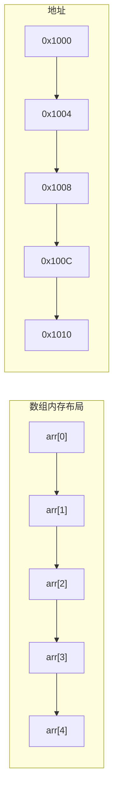
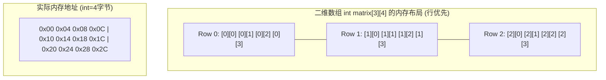
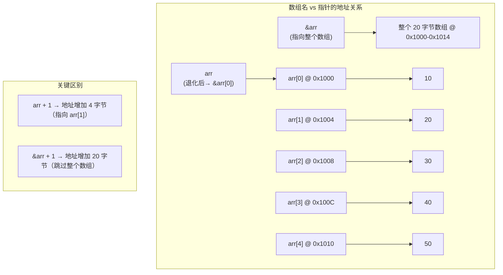
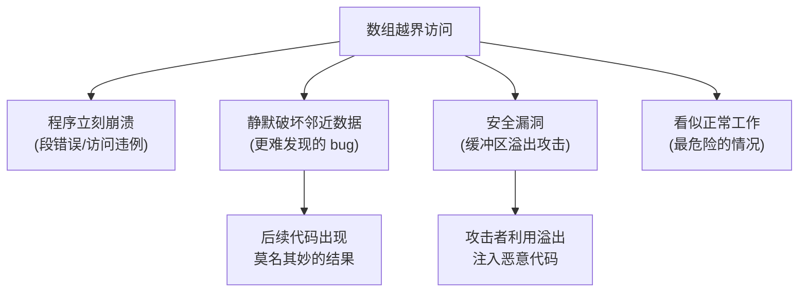
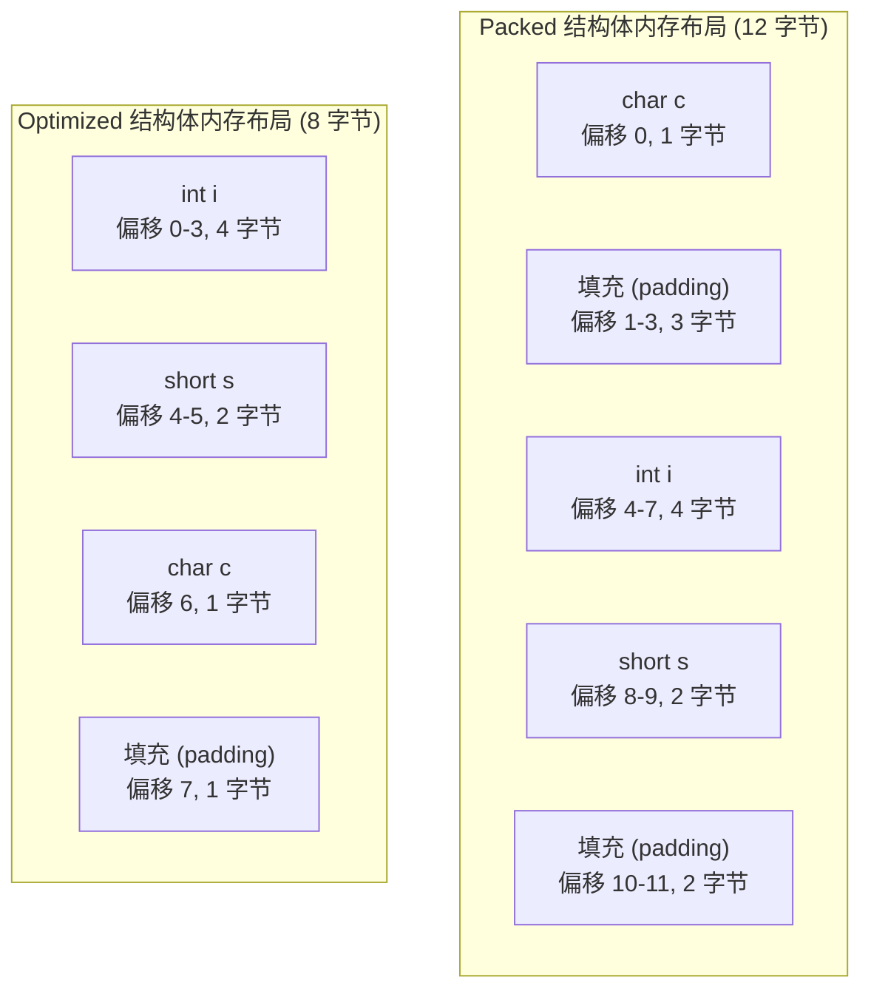
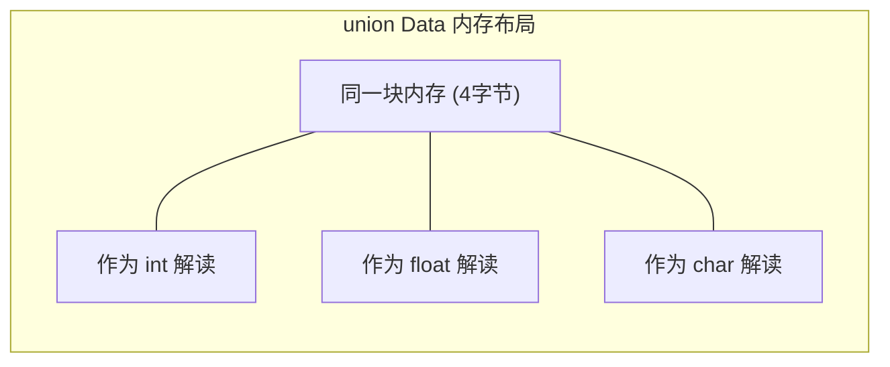
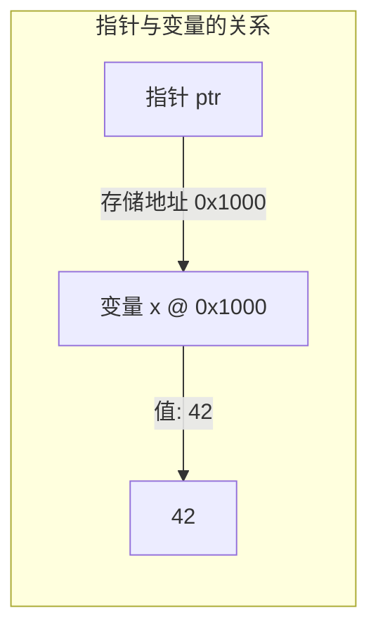
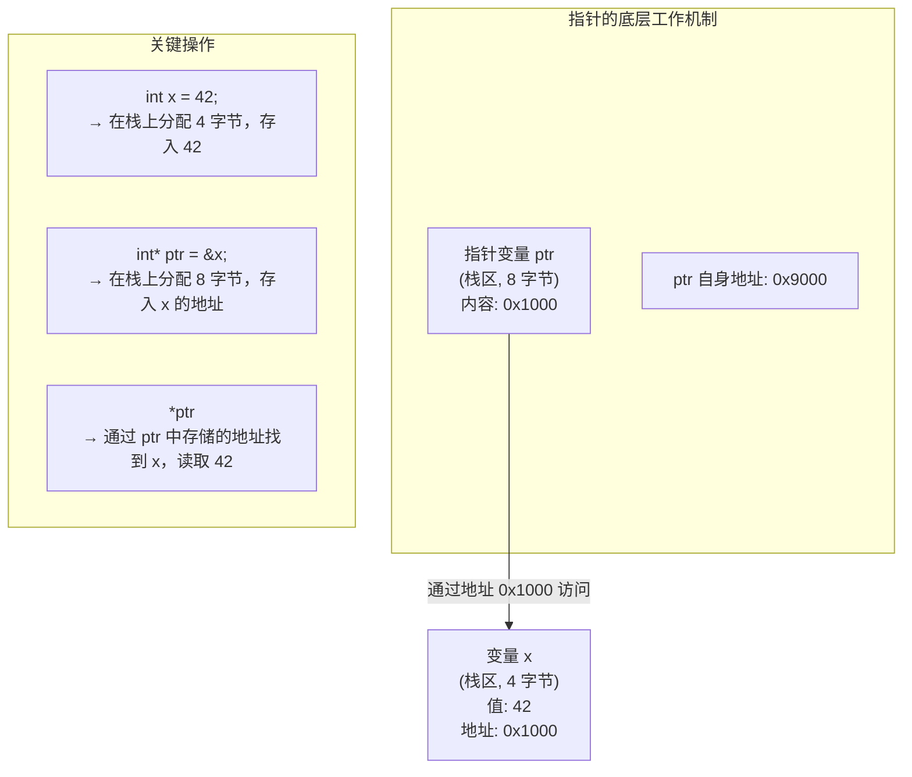
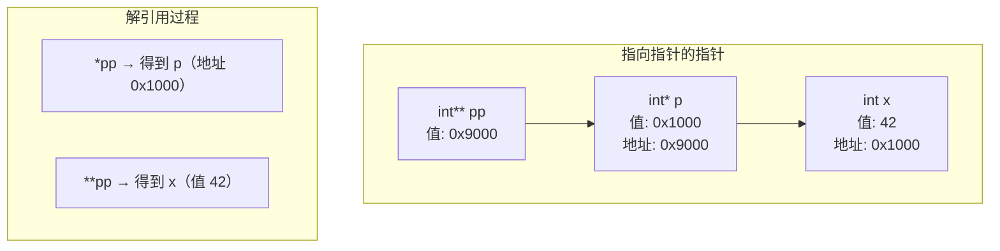
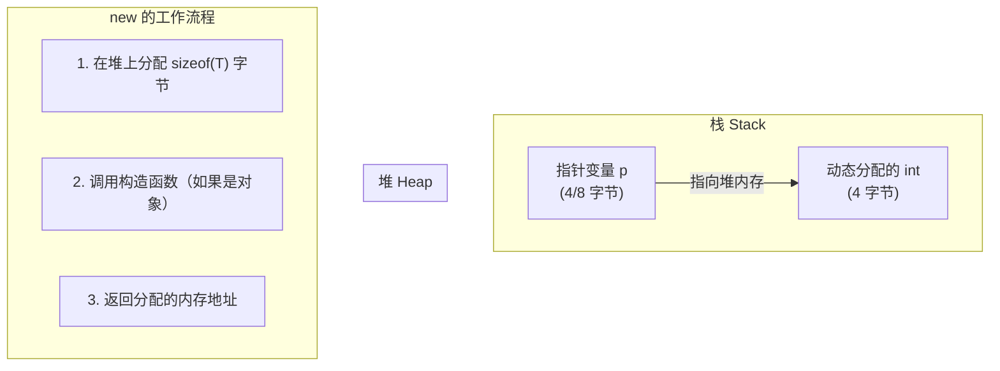

# 第 4 章：复合类型

> **本章目标**: 掌握 C++ 中的复合类型——数组、字符串（C 风格和 C++ string）、结构体、共用体、指针和引用。这些是构建复杂数据结构的基础。

---

## 4.1 数组（Array）

### 4.1.1 数组的基本概念

**数组**是存储在连续内存中的相同类型元素的集合。



**数组声明**：
```cpp
类型 数组名[元素个数];
```

数组在内存中是连续存储的，每个元素依次排列。对于 `int` 类型的数组，每个元素占用 4 字节（在大多数平台上），所以相邻元素的地址相差 4 字节。

### 4.1.2 数组的声明与初始化

```cpp
// 声明数组
int scores[5];              // 声明包含 5 个 int 的数组（未初始化，内容不确定）

// 声明并初始化
int scores[5] = {95, 87, 92, 78, 88};   // 聚合初始化
int scores[5] = {95, 87};               // 部分初始化 → 前两个为指定值，其余为 0
int scores[] = {95, 87, 92, 78, 88};    // 编译器自动推断大小为 5

// C++11 列表初始化（可省略 =）
int scores[5] {95, 87, 92, 78, 88};
int scores[5] {};                       // 所有元素初始化为 0
int scores[5] {95, 87};                 // 前两个为 95,87，其余为 0

// C++11 还禁止了窄化转换
int arr1[3] {1.5, 2.7, 3.9};           // ❌ 编译错误：double 到 int 的窄化转换
int arr2[3] = {1.5, 2.7, 3.9};         // ❌ 编译错误（C++11 起）
```

> **注意**: 在 C++11 及以后，列表初始化不允许窄化转换（narrowing conversion），这避免了数据丢失。而在旧标准中，浮点数赋值给整数只会产生一个警告。

**更多初始化方式**：

```cpp
// 字符数组
char vowels[] = {'a', 'e', 'i', 'o', 'u'};    // 5 个字符，不含 \0
char greeting[] = "Hello";                      // 6 个字符（含 \0）

// constexpr 数组（C++11）
constexpr int size = 10;
int arr[size];                                  // 编译期常量作为大小

// 动态大小的数组（C++ 中不允许）
// int n = 10;
// int arr[n];          // ❌ 不是标准 C++，VLA 是 C99 特性
// std::vector<int> arr(n);  // ✅ 应使用 vector
```

### 4.1.3 访问数组元素

```cpp
#include <iostream>
using namespace std;

int main() {
    int scores[5] = {95, 87, 92, 78, 88};
    
    // 通过索引访问（从 0 开始）
    cout << "第一个元素: " << scores[0] << endl;     // 95
    cout << "第三个元素: " << scores[2] << endl;     // 92
    
    // 修改元素
    scores[4] = 90;  // 将最后一个元素改为 90
    
    // 遍历数组
    for (int i = 0; i < 5; i++) {
        cout << "scores[" << i << "] = " << scores[i] << endl;
    }
    
    // 💡 C++11 范围 for 循环
    for (int score : scores) {
        cout << score << " ";
    }
    cout << endl;
    
    return 0;
}
```

### 4.1.4 数组的存储布局

一维数组在内存中是线性排列的，但多维数组在内存中如何排列呢？C++ 使用**行优先（Row-major）**顺序：



```cpp
// 验证行优先存储
#include <iostream>
using namespace std;

int main() {
    int matrix[2][3] = {{1, 2, 3}, {4, 5, 6}};
    
    // 用指针顺序访问，验证行优先
    int* p = &matrix[0][0];
    for (int i = 0; i < 6; i++) {
        cout << p[i] << " ";  // 输出: 1 2 3 4 5 6
    }
    cout << endl;
    
    return 0;
}
```

**三维数组的内存布局**：

```cpp
// 三维数组：2 个面 × 3 行 × 4 列
int cube[2][3][4] = {
    {  // 第 0 个面（6 层楼，每层 4 间房）
        {1, 2, 3, 4},
        {5, 6, 7, 8},
        {9, 10, 11, 12}
    },
    {  // 第 1 个面
        {13, 14, 15, 16},
        {17, 18, 19, 20},
        {21, 22, 23, 24}
    }
};

// 访问三维数组
cout << cube[0][1][2] << endl;  // 第 0 面、第 1 行、第 2 列 → 7
cout << cube[1][2][3] << endl;  // 第 1 面、第 2 行、第 3 列 → 24

// 嵌套范围 for 遍历三维数组
for (const auto& face : cube) {
    for (const auto& row : face) {
        for (int val : row) {
            cout << val << " ";
        }
        cout << endl;
    }
    cout << "---" << endl;
}
```

### 4.1.5 数组名与指针的关系

数组名在很多场合会**退化（decay）为指针**，但数组名本身并不是指针。理解它们的微妙区别非常重要：

```cpp
int arr[5] = {10, 20, 30, 40, 50};

// 情况 1：数组名退化为指向首元素的指针
int* p = arr;              // arr 退化为 &arr[0]，等价于 int* p = &arr[0];
cout << *p << endl;        // 10

// 情况 2：&arr 取整个数组的地址
int (*parr)[5] = &arr;     // &arr 的类型是 int(*)[5]，指向整个数组
cout << parr << endl;      // 打印地址，与 arr 相同
cout << (parr + 1) << endl; // 地址增加 sizeof(int[5]) = 20 字节！

// 情况 3：sizeof(arr) 获取整个数组的大小
cout << sizeof(arr) << endl;  // 20（5 * 4 字节），此时 arr 没有退化

// 情况 4：对数组名取地址得到的是整个数组的地址
cout << arr << endl;       // 首元素地址
cout << &arr << endl;      // 整个数组的地址（数值与 arr 相同）
cout << &arr[0] << endl;   // 首元素地址（数值与 arr 相同）
```



**退化发生的时机**：
- **退化为指针**：作为函数参数、赋值给指针、用于算术运算
- **不退化为指针**：`sizeof(arr)`、`&arr`、用于引用绑定

```cpp
// 函数参数中的数组总是退化为指针
void func1(int arr[]) {     // 等价于 int* arr
    cout << sizeof(arr);    // 输出 8（指针大小）或 4（32 位系统）
}

void func2(int arr[10]) {   // 等价于 int* arr，这里的 10 被忽略！
    cout << sizeof(arr);    // 仍然是 8（指针大小）
}

void func3(int (*arr)[5]) {  // 传入的是指向数组的指针
    cout << sizeof(*arr);    // 20（整个数组的大小）
}
```

### 4.1.6 多维数组详解

**二维数组的本质**：二维数组在概念上是"数组的数组"。

```cpp
// 声明方式
int matrix[3][4];  // 包含 3 个元素，每个元素是包含 4 个 int 的数组

// 理解类型
matrix        // 类型：int (*)[4]，指向包含 4 个 int 的数组的指针
matrix[0]     // 类型：int*，指向第 0 行的首元素
&matrix[0]    // 类型：int (*)[4]，指向第 0 行（整个行数组）

// 用指针遍历二维数组
for (int (*row)[4] = matrix; row < matrix + 3; row++) {
    for (int* col = *row; col < *row + 4; col++) {
        cout << *col << " ";
    }
    cout << endl;
}
```

**C++11 范围 for 遍历二维数组**：

```cpp
int matrix[3][4] = {
    {1, 2, 3, 4},
    {5, 6, 7, 8},
    {9, 10, 11, 12}
};

// 必须使用引用，否则 row 退化为指针
for (const auto& row : matrix) {
    for (int val : row) {
        cout << val << " ";
    }
    cout << endl;
}
```

> **为什么必须用引用？** 如果没有引用，`auto row = matrix[0]` 会退化为 `int*`，此时内部的范围 for 无法确定边界。

### 4.1.7 数组的大小和长度

```cpp
int arr[] = {10, 20, 30, 40, 50};

// 计算数组元素个数（传统方式）
int size = sizeof(arr) / sizeof(arr[0]);    // 20 / 4 = 5

// 💡 C++17 提供了 std::size()
#include <iterator>
int size = std::size(arr);  // 更安全的方式，返回 5

// 但请注意：数组作为函数参数时会退化为指针
void process(int arr[]) {   // 等价于 int* arr
    int size = sizeof(arr) / sizeof(arr[0]);  // ❌ 错误！sizeof(arr) = 8（指针大小）
}

// 正确做法：额外传入 size 参数
void process_correct(int arr[], int size) {
    for (int i = 0; i < size; i++) {
        // ...
    }
}

// 或者使用模板推导数组大小
template <size_t N>
void process_template(int (&arr)[N]) {  // 引用捕获数组，N 推导为元素个数
    for (int i = 0; i < N; i++) {
        cout << arr[i] << " ";
    }
}
```

### 4.1.8 数组边界问题详解

C++ 不检查数组下标是否越界，这是 C++ 追求性能的设计选择。越界访问会导致**未定义行为（Undefined Behavior, UB）**。

```cpp
#include <iostream>
using namespace std;

int main() {
    int arr[5] = {10, 20, 30, 40, 50};
    
    // ❌ 越界访问（编译不会报错，但运行时有风险）
    cout << arr[5] << endl;   // 访问第 6 个元素（不存在！）
    cout << arr[-1] << endl;  // 访问 arr 之前的内存（危险！）
    arr[10] = 999;            // 写入越界位置（可能破坏其他变量）
    
    // 典型的 off-by-one 错误
    for (int i = 0; i <= 5; i++) {  // ❌ 应该是 i < 5，多了一次循环
        arr[i] = i * 10;            // 最后一次 arr[5] = 50，越界写入！
    }
    
    return 0;
}
```

**越界的后果**：



**如何避免越界**：

```cpp
// 方法 1：使用范围 for 循环（安全）
for (int x : arr) {
    cout << x << " ";
}

// 方法 2：使用 std::array（C++11）
#include <array>
std::array<int, 5> safe_arr = {10, 20, 30, 40, 50};
cout << safe_arr.at(5) << endl;  // ✅ 抛出 std::out_of_range 异常

// 方法 3：使用 std::vector
#include <vector>
std::vector<int> vec = {10, 20, 30, 40, 50};
cout << vec.at(5) << endl;       // ✅ 抛出异常

// 方法 4：手动检查边界
int index = 5;
if (index >= 0 && index < 5) {   // 安全检查
    cout << arr[index] << endl;
} else {
    cerr << "索引越界！" << endl;
}
```

> **🎯 最佳实践**：
> - 优先使用 `std::array`（固定大小）或 `std::vector`（可变大小）替代原始数组
> - 使用 `at()` 成员函数获得边界检查
> - 使用范围 for 循环避免手动索引
> - 如果必须使用原始数组，仔细检查边界条件

---

## 4.2 字符串

### 4.2.1 C 风格字符串

C 风格字符串是以 **空字符 `\0`** 结尾的 `char` 数组。

```cpp
// 方式 1：字符数组
char str1[6] = {'H', 'e', 'l', 'l', 'o', '\0'};

// 方式 2：字符串字面量（编译器自动添加 \0）
char str2[] = "Hello";               // 实际占 6 字节（包含 \0）
char str3[6] = "Hello";             // 必须留出 \0 的位置

// 方式 3：字符串字面量指针
const char* str4 = "Hello";         // 指向字符串字面量（不可修改）

// 使用 cin 输入 C 风格字符串
char name[20];
cin >> name;                        // 输入: Alice → name 保存 "Alice\0"
```

> **⚠️** 使用 `cin >>` 读取 C 风格字符串时，如果输入超过数组长度会导致缓冲区溢出。因此：
> - 使用 `cin.getline(name, 20)` 限制读取长度
> - 或使用 `cin.width(20)`

**字符串字面量的存储**：

```cpp
// 字符串字面量存储在只读数据段
const char* s1 = "Hello";   // s1 指向只读内存
char s2[] = "Hello";        // s2 在栈上创建副本，可修改

// s1[0] = 'h';            // ❌ 未定义行为（尝试修改只读内存）
s2[0] = 'h';               // ✅ 修改栈上的副本

// 相同的字符串字面量可能共享同一份存储
const char* p1 = "Hello";
const char* p2 = "Hello";
cout << (p1 == p2);        // 结果取决于编译器，可能为 1（共享存储）
```

**读取 C 风格字符串的不同方式**：

```cpp
#include <iostream>
using namespace std;

int main() {
    char line[100];
    
    cout << "输入一行（含空格）: ";
    cin.getline(line, 100);         // 读取整行，丢弃换行符
    cout << "你输入了: " << line << endl;
    
    char word[50];
    cout << "输入一个单词: ";
    cin >> word;                    // 遇到空白字符（空格、tab、换行）停止
    cout << "你输入了: " << word << endl;
    
    // cin.get() 的两种形式
    char ch;
    cin.get(ch);                     // 读取一个字符
    ch = cin.get();                  // 另一种形式，返回 int
    
    // 混合使用 getline 和 >> 时需要注意清除换行符
    int age;
    char name[50];
    cin >> age;                     // 读取年龄后，换行符留在输入缓冲区
    cin.get();                      // 消耗换行符
    cin.getline(name, 50);          // 现在可以正常读取姓名
    
    return 0;
}
```

### 4.2.2 C 风格字符串函数详解

所有 C 风格字符串函数都需要包含 `<cstring>` 或 `<string.h>` 头文件。

**常用函数分类说明**：

```cpp
#include <iostream>
#include <cstring>
using namespace std;

int main() {
    // ===== 1. strlen() - 获取字符串长度 =====
    char str1[] = "Hello";
    cout << "strlen(str1) = " << strlen(str1) << endl;      // 5（不含 \0）
    cout << "sizeof(str1) = " << sizeof(str1) << endl;      // 6（含 \0）
    
    // 陷阱：strlen 要求字符串以 \0 结尾
    char no_null[5] = {'H', 'e', 'l', 'l', 'o'};           // 没有 \0！
    // cout << strlen(no_null);                             // ❌ 未定义行为
    
    // ===== 2. strcpy() / strncpy() - 复制字符串 =====
    char dest[20];
    strcpy(dest, "C++ Programming");       // 复制
    cout << "strcpy: " << dest << endl;
    
    // strncpy 更安全，限制复制长度
    char dest2[10];
    strncpy(dest2, "Hello World", 9);      // 最多复制 9 个字符
    dest2[9] = '\0';                        // 确保以 \0 结尾
    cout << "strncpy: " << dest2 << endl;  // "Hello Wor"
    
    // ===== 3. strcat() / strncat() - 拼接字符串 =====
    char full[30] = "Hello";
    strcat(full, " ");
    strcat(full, "World");
    cout << "strcat: " << full << endl;    // "Hello World"
    
    char full2[10] = "Hello";
    strncat(full2, "World!!!", 3);         // 最多追加 3 个字符
    cout << "strncat: " << full2 << endl;  // "HelloWor"
    
    // ===== 4. strcmp() / strncmp() - 比较字符串 =====
    cout << "strcmp(\"apple\", \"banana\"): " << strcmp("apple", "banana") << endl;  // 负数
    cout << "strcmp(\"banana\", \"apple\"): " << strcmp("banana", "apple") << endl;  // 正数
    cout << "strcmp(\"apple\", \"apple\"): " << strcmp("apple", "apple") << endl;    // 0
    
    // strncmp 只比较前 n 个字符
    cout << "strncmp(\"apple\", \"appetite\", 3): " << strncmp("apple", "appetite", 3) << endl;  // 0
    
    // ===== 5. strchr() / strrchr() - 查找字符 =====
    const char* text = "Hello World";
    char* pos = strchr(text, 'o');         // 查找第一个 'o'
    if (pos) {
        cout << "找到 'o' 在位置: " << (pos - text) << endl;  // 4
    }
    
    pos = strrchr(text, 'o');              // 查找最后一个 'o'
    if (pos) {
        cout << "最后一个 'o' 在位置: " << (pos - text) << endl;  // 7
    }
    
    // ===== 6. strstr() - 查找子串 =====
    const char* sentence = "The quick brown fox";
    char* found = strstr(sentence, "quick");
    if (found) {
        cout << "找到 'quick' 在位置: " << (found - sentence) << endl;  // 4
    }
    
    // ===== 7. strtok() - 分割字符串（非线程安全） =====
    char input[] = "apple,banana,orange,grape";
    char* token = strtok(input, ",");
    while (token != nullptr) {
        cout << "token: " << token << endl;
        token = strtok(nullptr, ",");      // 传入 nullptr 继续分割
    }
    // 注意：strtok 会修改原字符串，用 ',' 替换为 '\0'
    
    // ===== 8. sprintf() - 格式化输出到字符串 =====
    char buffer[100];
    int year = 2024;
    double pi = 3.14159;
    sprintf(buffer, "Pi = %.2f, year = %d", pi, year);
    cout << "sprintf: " << buffer << endl; // "Pi = 3.14, year = 2024"
    
    // ===== 9. memcpy() / memmove() - 内存复制 =====
    char src[] = "Memory copy example";
    char dst[50];
    memcpy(dst, src, strlen(src) + 1);     // 复制包括 \0
    cout << "memcpy: " << dst << endl;
    
    // memmove 处理重叠内存
    char overlap[] = "123456789";
    memmove(overlap + 2, overlap, 5);      // 安全处理重叠区域
    cout << "memmove: " << overlap << endl; // "121234589"
    // 如果使用 memcpy 处理重叠区域，行为未定义
    
    // ===== 10. memset() - 设置内存 =====
    char block[10];
    memset(block, 'A', 9);                 // 将前 9 个字节设为 'A'
    block[9] = '\0';
    cout << "memset: " << block << endl;   // "AAAAAAAAA"
    
    // memset 也常用于将整数数组置零
    int arr[10];
    memset(arr, 0, sizeof(arr));           // 所有字节设为 0
    
    return 0;
}
```

**C 风格字符串函数总表**：

| 函数 | 说明 | 返回值 | 安全版本 |
|------|------|--------|----------|
| `strlen(s)` | 返回字符串长度（不含 `\0`） | `size_t` | — |
| `strcpy(dest, src)` | 复制字符串 | `char*` (dest) | `strncpy(dest, src, n)` |
| `strcat(dest, src)` | 拼接字符串到末尾 | `char*` (dest) | `strncat(dest, src, n)` |
| `strcmp(s1, s2)` | 字典序比较字符串 | `<0` `=0` `>0` | `strncmp(s1, s2, n)` |
| `strchr(s, c)` | 在字符串中正向查找字符 | `char*` 或 `nullptr` | — |
| `strrchr(s, c)` | 在字符串中反向查找字符 | `char*` 或 `nullptr` | — |
| `strstr(s1, s2)` | 在 s1 中查找 s2 子串 | `char*` 或 `nullptr` | — |
| `strtok(s, delim)` | 分割字符串（破坏原串） | `char*` 或 `nullptr` | `strtok_s`（C11） |
| `sprintf(buf, fmt, ...)` | 格式化输出到字符串 | 写入的字符数 | `snprintf(buf, n, fmt, ...)` |
| `memcpy(dest, src, n)` | 内存复制（不重叠） | `void*` (dest) | — |
| `memmove(dest, src, n)` | 内存复制（支持重叠） | `void*` (dest) | — |
| `memset(s, c, n)` | 设置内存块 | `void*` (s) | — |

### 4.2.3 C++ string 类

C++ `string` 类是更安全、更方便的字符串处理方式（需要 `<string>` 头文件）：

```cpp
#include <iostream>
#include <string>       // string 类
using namespace std;

int main() {
    // 声明和初始化
    string s1;                // 空字符串
    string s2 = "Hello";      // 使用字符串字面量初始化
    string s3("World");       // 构造函数初始化
    string s4 = s2;           // 复制初始化
    string s5(5, 'A');        // s5 = "AAAAA"
    string s6 = s2 + " " + s3;  // 拼接
    
    // 赋值和拼接
    s1 = s2;                  // 赋值（不需要 strcpy）
    s1 += " C++";             // 追加（不需要 strcat）
    
    // 获取长度
    cout << "s1 长度: " << s1.size() << endl;    // 成员函数
    cout << "s1 长度: " << s1.length() << endl;  // 等价于 size()
    cout << "s1 容量: " << s1.capacity() << endl; // 当前分配的存储容量
    cout << "s1 是否为空: " << s1.empty() << endl; // 检查是否为空
    
    // 访问字符
    cout << "第一个字符: " << s1[0] << endl;
    cout << "第二个字符: " << s1.at(1) << endl;  // at() 会进行边界检查
    cout << "第一个字符: " << s1.front() << endl; // C++11
    cout << "最后一个字符: " << s1.back() << endl; // C++11
    
    // 比较（直接使用 ==, !=, <, >）
    if (s2 == "Hello") {
        cout << "相等" << endl;
    }
    if (s2 < s3) {
        cout << "s2 < s3" << endl;
    }
    
    // string 支持三路比较（C++20）
    // auto cmp = s2 <=> s3;
    
    // 查找
    size_t pos = s6.find("World");   // 返回位置（从 0 开始）
    if (pos != string::npos) {
        cout << "找到 World 在位置: " << pos << endl;
    }
    
    // 子串
    string sub = s6.substr(6, 5);    // 从位置 6 开始取 5 个字符
    cout << "子串: " << sub << endl;
    
    // 转换为 C 风格字符串（用于需要 const char* 的场合）
    const char* c_str = s6.c_str();
    const char* data = s6.data();    // C++11 起 data() 保证以 \0 结尾
    
    // 输入
    string name;
    cout << "请输入姓名: ";
    // cin >> name;          // 遇到空格停止
    getline(cin, name);      // 读取整行（含空格）
    
    // 指定分隔符的 getline
    string csv_line;
    getline(cin, csv_line, ',');  // 以逗号为分隔符
    
    return 0;
}
```

### 4.2.4 string 类的更多操作

```cpp
#include <iostream>
#include <string>
using namespace std;

int main() {
    string s = "Hello C++ World";
    
    // ===== 查找操作 =====
    cout << "=== 查找操作 ===" << endl;
    
    // find: 从位置 0 开始查找子串（或字符）
    size_t pos = s.find("C++");              // 查找子串
    cout << "'C++' 位置: " << pos << endl;   // 6
    
    pos = s.find('o');                       // 查找字符
    cout << "第一个 'o' 位置: " << pos << endl; // 4
    
    pos = s.find("Java");                    // 未找到
    cout << "'Java' 位置: " << (pos == string::npos ? "未找到" : to_string(pos)) << endl;
    
    // rfind: 从末尾开始查找
    pos = s.rfind('o');                      // 最后一个 'o'
    cout << "最后一个 'o' 位置: " << pos << endl; // 9
    
    // find_first_of: 查找字符集合中的任意字符
    pos = s.find_first_of("aeiou");          // 第一个元音字母
    cout << "第一个元音字母位置: " << pos << endl; // 1 ('e')
    
    // find_last_of: 最后一次出现字符集合中的任意字符
    pos = s.find_last_of("aeiou");
    cout << "最后一个元音字母位置: " << pos << endl;
    
    // find_first_not_of: 查找第一个不在集合中的字符
    pos = s.find_first_not_of("Hello ");     // 第一个不是 "Hello " 中的字符
    cout << "第一个不在集合中的字符位置: " << pos << endl;
    
    // ===== 插入和删除 =====
    cout << "\n=== 插入和删除 ===" << endl;
    
    string s2 = "Hello World";
    
    // insert: 在指定位置插入
    s2.insert(5, " C++");                    // "Hello C++ World"
    cout << "insert: " << s2 << endl;
    
    // insert 的更多形式
    s2.insert(5, 3, '!');                    // 插入 3 个 '!'
    cout << "insert 3 !: " << s2 << endl;
    
    // erase: 删除部分内容
    s2.erase(5, 3);                          // 从位置 5 开始删除 3 个字符
    cout << "erase: " << s2 << endl;
    
    s2.erase(5);                             // 从位置 5 删除到末尾
    cout << "erase to end: " << s2 << endl;
    
    s2.erase(s2.begin() + 3);                // 删除单个字符（迭代器版本）
    cout << "erase single: " << s2 << endl;
    
    // ===== 替换 =====
    cout << "\n=== 替换 ===" << endl;
    
    string s3 = "I like C";
    s3.replace(2, 4, "love");                // 从位置 2 替换 4 个字符为 "love"
    cout << "replace: " << s3 << endl;
    
    s3.replace(s3.begin(), s3.begin() + 4, "They ");  // 迭代器版本
    cout << "replace with iterators: " << s3 << endl;
    
    // ===== 追加和附加 =====
    cout << "\n=== 追加 ===" << endl;
    
    string s4 = "Hello";
    s4.push_back('!');                       // 追加一个字符
    cout << "push_back: " << s4 << endl;     // "Hello!"
    
    s4.pop_back();                           // 删除最后一个字符
    cout << "pop_back: " << s4 << endl;      // "Hello"
    
    s4.append(" World");                     // 追加字符串
    cout << "append: " << s4 << endl;        // "Hello World"
    
    s4.append("!!", 1);                      // 追加 "!!" 的前 1 个字符
    cout << "append with count: " << s4 << endl; // "Hello World!"
    
    // ===== compare 比较 =====
    cout << "\n=== compare ===" << endl;
    
    string a = "apple";
    string b = "banana";
    
    int cmp = a.compare(b);
    cout << "a.compare(b): " << cmp << endl;  // 负数
    
    cmp = a.compare(0, 3, b, 0, 3);          // 比较 a[0:3] 和 b[0:3]
    cout << "partial compare: " << cmp << endl;
    
    // ===== 大小写转换（需要 <algorithm>） =====
    cout << "\n=== 大小写转换 ===" << endl;
    
    string s5 = "Hello World";
    // 转大写
    for (char& c : s5) {
        c = toupper(c);
    }
    cout << "toupper: " << s5 << endl;       // "HELLO WORLD"
    
    // ===== 数字与字符串的转换 =====
    cout << "\n=== 数字与字符串转换 ===" << endl;
    
    // 字符串 → 数字 (C++11)
    string num_str = "123.45";
    int i = stoi("42");                      // 字符串 → int
    long l = stol("123456789");              // → long
    double d = stod(num_str);                // → double
    float f = stof("3.14f");                 // → float
    
    cout << "stoi(\"42\"): " << i << endl;
    cout << "stod(\"123.45\"): " << d << endl;
    
    // 数字 → 字符串 (C++11)
    string ns1 = to_string(42);              // int → string
    string ns2 = to_string(3.14159);         // double → string
    cout << "to_string: " << ns1 << ", " << ns2 << endl;
    
    return 0;
}
```

### 4.2.5 C 风格 vs C++ string 详细对比

| 操作 | C 风格字符串 | C++ string |
|------|-------------|------------|
| **头文件** | `<cstring>` | `<string>` |
| **声明** | `char str[20];` | `string str;` |
| **初始化** | `char str[] = "Hello";` | `string str = "Hello";` |
| **赋值** | `strcpy(str, "Hello");` | `str = "Hello";` |
| **拼接** | `strcat(str, "World");` | `str += "World";` |
| **比较** | `strcmp(str1, str2) == 0` | `str1 == str2` |
| **长度** | `strlen(str)` | `str.size()` |
| **子串** | 手动（需 strncpy） | `str.substr(pos, n)` |
| **查找** | `strstr(s1, s2)` | `s1.find(s2)` |
| **插入** | 手动（memmove） | `str.insert(pos, s)` |
| **删除** | 手动 | `str.erase(pos, n)` |
| **替换** | 手动 | `str.replace(pos, n, s)` |
| **安全性** | 需手动管理缓冲区（易溢出） | 自动管理内存 |
| **\0 处理** | 必须手动确保 | 自动处理 |
| **动态大小** | 固定大小 | 自动扩容 |
| **性能** | 通常较快（直接内存操作） | 稍慢（动态分配，但可优化） |

**跨函数参数传递**：

```cpp
// C 风格字符串函数需要 const char*
void legacy_func(const char* str);

// string 可以方便地转换为 const char*
string s = "Hello";
legacy_func(s.c_str());        // 转换为 C 风格
legacy_func(s.data());         // C++11 起 data() 也是以 \0 结尾

// 反过来：C 风格字符串可以隐式构造为 string
void modern_func(const string& str);
modern_func("Hello");          // 隐式构造 string 临时对象
modern_func("Hello"sv);        // C++17 string_view 可避免复制
```

**string 的内部容量增长策略**：

```cpp
#include <iostream>
#include <string>
using namespace std;

int main() {
    string s;
    cout << "初始 capacity: " << s.capacity() << endl;
    
    for (int i = 0; i < 100; i++) {
        s.push_back('A' + (i % 26));
        if (s.capacity() != s.size()) {  // 容量发生变化
            cout << "size=" << s.size() << " → capacity=" << s.capacity() << endl;
        }
    }
    
    // 预留空间优化
    s.reserve(200);                      // 预留 200 字节
    cout << "reserve后 capacity: " << s.capacity() << endl;
    
    // 收缩到合适大小
    s.shrink_to_fit();                   // C++11，请求减少容量
    cout << "shrink后 capacity: " << s.capacity() << endl;
    
    return 0;
}
```

### 4.2.6 原始字符串字面量（Raw String Literal）

C++11 引入了原始字符串字面量，其中的转义序列不会被处理，非常适合包含正则表达式、文件路径等多行文本。

```cpp
#include <iostream>
#include <string>
using namespace std;

int main() {
    // 普通字符串中转义序列被处理
    string s1 = "Hello\nWorld\t!";
    
    // 原始字符串：R"(...)" 中的内容保持原样
    string raw1 = R"(Hello\nWorld\t!)";
    cout << "原始字符串: " << raw1 << endl;
    // 输出: Hello\nWorld\t! （转义序列不被处理）
    
    // 多行原始字符串
    string raw2 = R"({
    "name": "Alice",
    "age": 30,
    "city": "New York"
})";
    cout << raw2 << endl;
    
    // 文件路径（避免双反斜杠）
    string path1 = "C:\\Users\\Alice\\Documents";  // 普通字符串需要双反斜杠
    string path2 = R"(C:\Users\Alice\Documents)";  // 原始字符串更清晰
    cout << "路径: " << path2 << endl;
    
    // 正则表达式（避免大量反斜杠）
    string regex1 = "\\d+\\.\\d+";                // 匹配浮点数的正则
    string regex2 = R"(\d+\.\d+)";                 // 原始字符串更清晰
    cout << "正则: " << regex2 << endl;
    
    // 自定义定界符：R"delimiter(...)delimiter"
    // 当字符串中包含 )" 时需要使用自定义定界符
    string raw3 = R"delim(The syntax is R"(...)")delim";
    cout << raw3 << endl;
    // 输出: The syntax is R"(...)"
    
    return 0;
}
```

| 特性 | 普通字符串 | 原始字符串 |
|------|-----------|-----------|
| 语法 | `"..."` | `R"(...)"` |
| 转义序列 | `\n` → 换行 | `\n` → 原样 `\n` |
| 多行 | 需显式 `\n` | 支持直接换行 |
| 文件路径 | 需要 `\\` | 使用单 `\` |
| 正则表达式 | 需要 `\\d` | 使用 `\d` |
| 自定义定界符 | 不支持 | `R"delim(...)delim"` |

> **📌 C++ 中优先使用 `string`**，而不是 C 风格字符串。仅在需要与 C 库交互或极端性能场景下使用 C 风格字符串。

---

## 4.3 结构体（Structure）

### 4.3.1 结构体的定义与使用

结构体将不同类型的变量组合成一个逻辑单元：

```cpp
#include <iostream>
#include <string>
using namespace std;

// 定义结构体类型
struct Student {
    string name;       // 成员变量
    int age;
    double score;
};                     // 注意分号！

int main() {
    // 声明结构体变量
    Student s1;                         // C++ 中可以省略 struct 关键字
    
    // 访问成员
    s1.name = "Alice";
    s1.age = 20;
    s1.score = 92.5;
    
    // 初始化
    Student s2 = {"Bob", 22, 88.0};     // 聚合初始化
    
    // C++11 列表初始化
    Student s3{"Charlie", 19, 95.5};
    Student s4{};                       // 所有成员设为默认值
    
    // 指定初始化器 (C++20)
    // Student s5 = {.name = "David", .age = 21, .score = 90.0};
    
    // 输出
    cout << s2.name << " " << s2.age << "岁 成绩:" << s2.score << endl;
    
    // 结构体赋值
    s1 = s2;  // 结构体可以整体赋值
    
    // 结构体指针
    Student* p = &s1;
    cout << p->name << endl;            // 指针访问成员用 ->
    cout << (*p).name << endl;          // 等价形式
    
    return 0;
}
```

### 4.3.2 结构体对齐和填充

结构体成员在内存中的布局不是简单地将所有成员依次排列。为了提高 CPU 访问效率，编译器会进行**内存对齐（Alignment）**。

**为什么需要对齐？** 大多数 CPU 在访问对齐的数据时效率最高。例如，4 字节的 `int` 最好存储在 4 的倍数的地址上。

```cpp
#include <iostream>
using namespace std;

// 默认对齐示例
struct Packed {
    char c;     // 1 字节，偏移 0
    int i;      // 4 字节，偏移 4（不是 1！中间填充了 3 字节）
    short s;    // 2 字节，偏移 8
};              // 总大小：10 + 2 字节填充 = 12 字节

// 如果按成员大小简单相加，应该是 1+4+2=7，但实际是 12

// 调整成员顺序可减少填充
struct Optimized {
    int i;      // 4 字节，偏移 0
    short s;    // 2 字节，偏移 4
    char c;     // 1 字节，偏移 6
};              // 总大小：7 + 1 字节填充 = 8 字节

int main() {
    cout << "Packed 结构体大小: " << sizeof(Packed) << endl;        // 12
    cout << "Optimized 结构体大小: " << sizeof(Optimized) << endl;  // 8
    
    // 查看成员偏移量
    cout << "Packed.c 偏移: " << offsetof(Packed, c) << endl;  // 0
    cout << "Packed.i 偏移: " << offsetof(Packed, i) << endl;  // 4
    cout << "Packed.s 偏移: " << offsetof(Packed, s) << endl;  // 8
    
    cout << "Optimized.i 偏移: " << offsetof(Optimized, i) << endl;  // 0
    cout << "Optimized.s 偏移: " << offsetof(Optimized, s) << endl;  // 4
    cout << "Optimized.c 偏移: " << offsetof(Optimized, c) << endl;  // 6
    
    return 0;
}
```



**对齐控制**：

```cpp
#include <iostream>
#include <cstddef>
using namespace std;

// 使用 #pragma pack 强制 1 字节对齐（取消对齐优化）
#pragma pack(push, 1)
struct Packed1 {
    char c;     // 偏移 0
    int i;      // 偏移 1（不对齐了）
    short s;    // 偏移 5
};              // 总大小：7 字节
#pragma pack(pop)

// 使用 alignas 指定对齐要求（C++11）
struct alignas(16) Aligned16 {
    int a;
    double b;
    char c;
};  // 总大小：32 字节（按 16 字节对齐）

int main() {
    cout << "Packed1 大小: " << sizeof(Packed1) << endl;       // 7
    cout << "Aligned16 大小: " << sizeof(Aligned16) << endl;   // 32
    
    // alignof 获取对齐要求（C++11）
    cout << "Packed1 对齐要求: " << alignof(Packed1) << endl;
    cout << "Aligned16 对齐要求: " << alignof(Aligned16) << endl;  // 16
    
    return 0;
}
```

**常见的对齐规则**：
1. 每个成员的偏移量必须是其大小的整数倍（如 `int` 偏移为 4 的倍数）
2. 结构体总大小必须是最大成员对齐要求的整数倍
3. 编译器可能会在成员之间和末尾插入填充字节

**对齐优化的建议**：
- 将大的成员放在前面（`double`, `long long`, `int`）
- 将小的成员放在后面（`char`, `bool`, `short`）
- 使用 `offsetof` 宏来验证布局
- 在嵌入式或网络协议场景下可使用 `#pragma pack(1)` 强制紧凑布局

### 4.3.3 位域（Bit Field）

位域允许以比特位为单位指定结构体成员的大小，常用于硬件编程、协议解析和标志位管理：

```cpp
#include <iostream>
using namespace std;

// 标志位示例
struct Flags {
    unsigned int flag1 : 1;   // 1 位
    unsigned int flag2 : 1;   // 1 位
    unsigned int type  : 4;   // 4 位（0-15）
    unsigned int count : 6;   // 6 位（0-63）
};  // 总大小：4 字节（一个 unsigned int）

// 硬件寄存器映射示例
struct DeviceRegister {
    unsigned int enable    : 1;  // bit 0
    unsigned int mode      : 2;  // bits 1-2
    unsigned int status    : 3;  // bits 3-5
    unsigned int error     : 1;  // bit 6
    unsigned int reserved  : 5;  // bits 7-11（保留位）
    unsigned int data      : 20; // bits 12-31
};  // 总大小：4 字节

int main() {
    Flags f = {};
    f.flag1 = 1;        // 设置 flag1
    f.flag2 = 0;        // 清除 flag2
    f.type  = 7;        // type = 7
    f.count = 42;       // count = 42
    
    cout << "Flags 大小: " << sizeof(Flags) << " 字节" << endl;
    cout << "flag1: " << f.flag1 << endl;
    cout << "type: " << f.type << endl;
    cout << "count: " << f.count << endl;
    
    // 位域不能取地址
    // int* p = &f.flag1;  // ❌ 编译错误
    
    // 位域超出范围
    f.type = 20;        // 4 位最大 15，20 溢出，实际存储 4（20 & 0xF）
    cout << "溢出的 type: " << f.type << endl;  // 4
    
    return 0;
}
```

> **🎯 位域使用场景**：
> - 硬件寄存器定义（嵌入式系统）
> - 网络协议头部解析
> - 节省内存（大量布尔标志）
> - 文件格式解析

### 4.3.4 结构体数组

```cpp
#include <iostream>
#include <string>
using namespace std;

struct Student {
    string name;
    int age;
    double score;
};

int main() {
    // 结构体数组的定义和初始化
    Student students[3] = {
        {"Alice", 20, 92.5},
        {"Bob", 22, 88.0},
        {"Charlie", 19, 95.5}
    };
    
    // 传统 for 循环
    for (int i = 0; i < 3; i++) {
        cout << students[i].name << " 成绩: " << students[i].score << endl;
    }
    
    // 范围 for 循环（值拷贝——注意如果修改应使用引用）
    for (const Student& s : students) {
        cout << s.name << " " << s.age << "岁" << endl;
    }
    
    // 结构体指针数组
    Student* ptr_arr[3];            // 存储指针的数组
    ptr_arr[0] = &students[0];
    ptr_arr[1] = &students[1];
    ptr_arr[2] = &students[2];
    
    for (int i = 0; i < 3; i++) {
        cout << ptr_arr[i]->name << endl;
    }
    
    // 动态分配结构体数组
    Student* dynamic_students = new Student[3]{
        {"David", 21, 90.0},
        {"Eve", 23, 85.5},
        {"Frank", 20, 88.5}
    };
    
    for (int i = 0; i < 3; i++) {
        cout << dynamic_students[i].name << endl;
    }
    
    delete[] dynamic_students;
    
    return 0;
}
```

### 4.3.5 结构体嵌套

结构体内部可以包含其他结构体作为成员：

```cpp
#include <iostream>
#include <string>
using namespace std;

// 地址结构体
struct Address {
    string street;
    string city;
    string zip_code;
};

// 个人信息结构体（嵌套 Address）
struct Person {
    string name;
    int age;
    Address addr;       // 嵌套结构体
    string phone;
};

int main() {
    // 嵌套初始化
    Person p1 = {
        "Alice",
        30,
        {"123 Main St", "New York", "10001"},
        "555-1234"
    };
    
    // 访问嵌套成员
    cout << p1.name << " 住在 " << p1.addr.city << endl;
    cout << "详细地址: " << p1.addr.street << ", " << p1.addr.zip_code << endl;
    
    // 修改嵌套成员
    p1.addr.city = "Boston";
    
    // Person 中包含嵌套的 Address，嵌套中还包含 string
    Person p2 = p1;     // 嵌套结构体也会被完整复制
    
    // 嵌套结构体数组
    struct Department {
        string name;
        Person members[5];
        int count;
    };
    
    Department dept;
    dept.name = "Engineering";
    dept.members[0] = p1;
    dept.count = 1;
    
    cout << "部门: " << dept.name << endl;
    cout << "第一个成员: " << dept.members[0].name << endl;
    
    return 0;
}
```

### 4.3.6 结构体与函数的交互

结构体可以通过值、指针或引用传递给函数：

```cpp
#include <iostream>
#include <string>
using namespace std;

struct Point {
    int x;
    int y;
};

// 1. 按值传递（拷贝整个结构体，开销大）
double distance_from_origin(Point p) {
    return sqrt(p.x * p.x + p.y * p.y);
}

// 2. 按指针传递（效率高，可修改原结构体，但语法稍繁琐）
void scale_by_ptr(Point* p, int factor) {
    p->x *= factor;
    p->y *= factor;
}

// 3. 按 const 指针传递（效率高，只读）
void print_by_ptr(const Point* p) {
    cout << "(" << p->x << ", " << p->y << ")" << endl;
}

// 4. 按引用传递（推荐：效率高，语法清晰）
void scale_by_ref(Point& p, int factor) {
    p.x *= factor;
    p.y *= factor;
}

// 5. 按 const 引用传递（效率高，只读，最推荐）
void print_by_ref(const Point& p) {
    cout << "(" << p.x << ", " << p.y << ")" << endl;
}

// 6. 返回结构体
Point create_point(int x, int y) {
    return {x, y};      // C++11 列表初始化返回值
}

// 7. 返回结构体引用（用于链式调用）
Point& set_point(Point& p, int x, int y) {
    p.x = x;
    p.y = y;
    return p;           // 返回引用，允许链式调用
}

int main() {
    Point p1 = {3, 4};
    
    // 按值传递
    cout << "到原点的距离: " << distance_from_origin(p1) << endl;
    
    // 按指针传递
    scale_by_ptr(&p1, 2);
    print_by_ptr(&p1);           // (6, 8)
    
    // 按引用传递
    scale_by_ref(p1, 2);
    print_by_ref(p1);            // (12, 16)
    
    // 返回结构体
    Point p2 = create_point(10, 20);
    print_by_ref(p2);            // (10, 20)
    
    // 链式调用
    set_point(p1, 1, 2);
    set_point(p1, 3, 4);
    print_by_ref(p1);            // (3, 4)
    
    return 0;
}
```

**传递方式的性能比较**：

| 传递方式 | 语法 | 是否拷贝 | 能否修改原数据 | 性能 |
|---------|------|---------|---------------|------|
| 按值传递 | `func(Point p)` | 是 | 否 | 大结构体开销大 |
| 按指针传递 | `func(Point* p)` | 否（4/8 字节） | 能 | 高效 |
| 按 const 指针 | `func(const Point* p)` | 否（4/8 字节） | 否 | 高效 |
| 按引用传递 | `func(Point& p)` | 否 | 能 | **最推荐** |
| 按 const 引用 | `func(const Point& p)` | 否 | 否 | **最推荐（只读）** |

> **🎯 最佳实践**: 对于大于几个字节的结构体，优先使用 `const` 引用传递。仅在需要修改时使用非 const 引用。

---

## 4.4 共用体（Union）

### 4.4.1 共用体的基本概念

共用体与结构体类似，但所有成员**共享同一块内存**：

```cpp
#include <iostream>
using namespace std;

union Data {
    int i;
    float f;
    char c;
};  // 大小 = 最大成员的大小（4 字节）

int main() {
    Data d;
    d.i = 42;           // 存储整数
    cout << d.i;         // 输出: 42
    d.f = 3.14;         // 覆盖为浮点数（原来的整型数据丢失）
    cout << d.f;         // 输出: 3.14
    // cout << d.i;      // ❌ 未定义行为，因为上次写入的是 f
    
    cout << "Data 的大小: " << sizeof(Data) << endl;  // 4
    
    return 0;
}
```



**共用体的关键特性**：
- 所有成员共享同一块起始地址
- 大小等于最大成员的大小
- 同一时间只能正确使用一个成员
- 写入一个成员会覆盖其他成员的数据

### 4.4.2 共用体的典型用途

**用途 1：类型双关（Type Punning）——以不同方式解析同一段内存**：

```cpp
#include <iostream>
using namespace std;

union FloatBytes {
    float f;
    unsigned char bytes[4];  // 将 float 的字节逐个查看
};

int main() {
    FloatBytes fb;
    fb.f = 3.14159f;
    
    cout << "float 值: " << fb.f << endl;
    cout << "十六进制字节: ";
    for (int i = 0; i < 4; i++) {
        printf("%02X ", fb.bytes[i]);
    }
    cout << endl;
    
    return 0;
}
```

**用途 2：节省内存的可变类型存储（标签联合）**：

```cpp
#include <iostream>
#include <cstring>
using namespace std;

// 标签联合：使用一个枚举标记当前存储的类型
struct VariantValue {
    enum Type { INT, DOUBLE, STRING } type;
    
    union {
        int i;
        double d;
        char str[32];
    };
    
    // 设置整数值
    void setInt(int val) {
        type = INT;
        i = val;
    }
    
    // 设置浮点值
    void setDouble(double val) {
        type = DOUBLE;
        d = val;
    }
    
    // 设置字符串值
    void setString(const char* val) {
        type = STRING;
        strncpy(str, val, 31);
        str[31] = '\0';
    }
    
    // 打印值
    void print() const {
        switch (type) {
            case INT:    cout << "int: " << i << endl; break;
            case DOUBLE: cout << "double: " << d << endl; break;
            case STRING: cout << "string: " << str << endl; break;
        }
    }
};

int main() {
    VariantValue v;
    
    v.setInt(42);
    v.print();           // int: 42
    
    v.setDouble(3.14);
    v.print();           // double: 3.14
    
    v.setString("Hello");
    v.print();           // string: Hello
    
    cout << "VariantValue 大小: " << sizeof(VariantValue) << endl;  // 40 字节（比 struct 小）
    
    return 0;
}
```

**用途 3：解析协议数据包**：

```cpp
#include <iostream>
using namespace std;

// 网络包头部
struct PacketHeader {
    uint8_t version;
    uint8_t type;
    uint16_t length;
};

// 共用体用于快速解析原始字节
union PacketParser {
    unsigned char raw[64];       // 原始字节
    struct {
        PacketHeader header;
        unsigned char payload[60];
    } packet;
};

int main() {
    PacketParser parser;
    
    // 模拟接收到的数据
    parser.raw[0] = 1;           // version
    parser.raw[1] = 2;           // type
    parser.raw[2] = 0x10;       // length (little-endian)
    parser.raw[3] = 0x00;       // length
    
    cout << "版本: " << (int)parser.packet.header.version << endl;
    cout << "类型: " << (int)parser.packet.header.type << endl;
    cout << "长度: " << parser.packet.header.length << endl;
    
    return 0;
}
```

### 4.4.3 匿名共用体（C++11）

```cpp
#include <iostream>
#include <string>
using namespace std;

struct Widget {
    bool is_int;
    union {                // 匿名共用体（没有名字）
        int i;
        float f;
    };
    // 注意：匿名共用体的成员可以直接访问
};

int main() {
    Widget w;
    w.is_int = true;
    w.i = 42;                 // 直接访问成员，不需要 w.u.i
    cout << "值: " << w.i << endl;
    
    w.is_int = false;
    w.f = 3.14f;
    cout << "值: " << w.f << endl;
    
    cout << "Widget 大小: " << sizeof(Widget) << endl;
    
    return 0;
}
```

> **C++17 的 `std::variant`**：作为类型安全的替代方案，`std::variant` 提供了标签联合的现代实现，无需手动管理标签。

---

## 4.5 指针（Pointer）

### 4.5.1 指针的基本概念

**指针**是一个变量，其值为另一个变量的**内存地址**。



```cpp
int x = 42;       // 普通变量
int* ptr = &x;    // 指针变量，存储 x 的地址

cout << "x 的值: " << x << endl;          // 42
cout << "x 的地址: " << &x << endl;       // 0x7fff...
cout << "ptr 的值: " << ptr << endl;      // 0x7fff...（和 &x 相同）
cout << "ptr 指向的值: " << *ptr << endl; // 42（解引用）
```

**指针相关的两个运算符**：

| 运算符 | 名称 | 作用 |
|--------|------|------|
| `&` | 取地址符 | 获取变量的内存地址 |
| `*` | 解引用符 | 访问指针所指向的变量 |

### 4.5.2 指针的声明

```cpp
int* ptr;       // C 风格：int* 表示"指向 int 的指针"
int *ptr;       // C++ 风格：*ptr 表示"解引用后是 int"
int* p1, p2;    // ⚠️ p1 是指针，p2 是 int（不是指针！）
```

**🎯 最佳实践**：每行只声明一个指针
```cpp
int* p1;   // 清晰
int* p2;   // 清晰
```

### 4.5.3 指针的初始化

```cpp
int x = 10;
int* p1 = &x;           // 初始化为 x 的地址

int* p2 = nullptr;      // C++11：空指针（推荐）
int* p3 = NULL;         // C 风格空指针宏（需要 <cstddef>）
int* p4 = 0;            // 0 也会被转为空指针

// ⚠️ 使用未初始化的指针极其危险
int* p5;                // 未初始化，指向不确定的内存
// *p5 = 42;            // ❌ 可能崩溃！未定义行为

// 指针也可以指向另一个指针
int* p6 = p1;           // p6 和 p1 指向同一地址
```

### 4.5.4 指针的工作机制图解



```cpp
#include <iostream>
using namespace std;

int main() {
    int x = 42;
    int* ptr = &x;
    
    cout << "=== 指针的工作机制 ===" << endl;
    cout << "变量 x 的值:      " << x << endl;
    cout << "变量 x 的地址:    " << &x << endl;
    cout << "指针 ptr 的值:    " << ptr << " （和 x 的地址相同）" << endl;
    cout << "指针 ptr 的地址:  " << &ptr << " （指针自身也有地址）" << endl;
    cout << "解引用 *ptr:      " << *ptr << " （通过指针找到 x 的值）" << endl;
    cout << "sizeof(ptr):      " << sizeof(ptr) << " 字节" << endl;
    
    // 通过指针修改变量的值
    *ptr = 100;
    cout << "修改后 x 的值:    " << x << endl;  // 100
    
    // 栈和堆的地址范围通常不同
    int* heap_ptr = new int(999);
    cout << "堆上分配的地址:   " << heap_ptr << " （通常与栈地址相差很大）" << endl;
    delete heap_ptr;
    
    return 0;
}
```

### 4.5.5 指针运算详解

指针支持有限的算术运算，这些运算以**所指类型的大小**为单位：

```cpp
#include <iostream>
using namespace std;

int main() {
    int arr[5] = {10, 20, 30, 40, 50};
    int* p = arr;
    
    cout << "sizeof(int) = " << sizeof(int) << " 字节" << endl;
    
    // 1. 指针加法（加 n 个元素）
    cout << "p = " << p << " (arr[0])" << endl;
    cout << "p + 1 = " << (p + 1) << " (增加 " << sizeof(int) << " 字节)" << endl;
    cout << "p + 2 = " << (p + 2) << " (增加 " << 2 * sizeof(int) << " 字节)" << endl;
    
    cout << "*p = " << *p << endl;         // 10
    cout << "*(p + 1) = " << *(p + 1) << endl; // 20
    cout << "*(p + 4) = " << *(p + 4) << endl; // 50
    
    // 2. 指针减法（减 n 个元素）
    p = &arr[4];
    cout << "\np 指向 arr[4]: " << *p << endl;
    cout << "p - 1: " << *(p - 1) << endl;  // 40
    cout << "p - 3: " << *(p - 3) << endl;  // 20
    
    // 3. 指针相减（得到元素个数差）
    int* p1 = &arr[0];
    int* p2 = &arr[4];
    ptrdiff_t diff = p2 - p1;
    cout << "\np2 - p1 = " << diff << "（相差 " << diff << " 个元素）" << endl;
    
    // 4. 指针自增/自减
    p = arr;
    cout << "\n指针自增演示:" << endl;
    cout << "*p++ = " << *p++ << endl;      // 先取 *p，再 p++：输出 10，p 指向 arr[1]
    cout << "*p = " << *p << endl;          // 20
    cout << "*++p = " << *++p << endl;      // 先 p++，再取 *p：p 指向 arr[2]，输出 30
    
    // 5. 指针比较
    p = arr;
    int* end = arr + 5;
    cout << "\n指针比较遍历:" << endl;
    while (p < end) {                       // 比较地址大小
        cout << *p << " ";
        p++;
    }
    cout << endl;
    
    return 0;
}
```

**指针运算总结**：

| 表达式 | 含义 | 地址变化 |
|--------|------|---------|
| `p + n` | 指针向高地址移动 n 个元素 | `+ n * sizeof(T)` |
| `p - n` | 指针向低地址移动 n 个元素 | `- n * sizeof(T)` |
| `p++` | 指针自增（后置） | `+ sizeof(T)` |
| `++p` | 指针自增（前置） | `+ sizeof(T)` |
| `p - q` | 两个指针的元素距离 | 返回 `ptrdiff_t` |
| `p < q` | 比较地址高低 | 返回 `bool` |

### 4.5.6 指针与数组

**数组名退化为指针**：

```cpp
int arr[5] = {10, 20, 30, 40, 50};

// arr 的值等价于 &arr[0]
cout << "arr: " << arr << endl;        // 数组首地址
cout << "&arr[0]: " << &arr[0] << endl; // 和 arr 相同

// 指针算术
int* p = arr;          // p 指向 arr[0]
cout << *p << endl;    // 10
cout << *(p + 1) << endl;  // 20（指针偏移 1 个 int，即 4 字节）
cout << *(p + 2) << endl;  // 30

// 指针和数组的等价性
cout << arr[0] << endl;       // 10
cout << *(arr + 0) << endl;   // 10
cout << p[0] << endl;         // 10（指针也可以用下标）
```

**数组指针 vs 指针数组**：

```cpp
// 指针数组（array of pointers）：数组的每个元素都是指针
int a = 1, b = 2, c = 3;
int* ptr_arr[3] = {&a, &b, &c};     // 包含 3 个 int* 的数组
for (int i = 0; i < 3; i++) {
    cout << *ptr_arr[i] << " ";       // 1 2 3
}

// 数组指针（pointer to array）：指向整个数组的指针
int arr[5] = {10, 20, 30, 40, 50};
int (*arr_ptr)[5] = &arr;           // 指向包含 5 个 int 的数组
for (int i = 0; i < 5; i++) {
    cout << (*arr_ptr)[i] << " ";     // 10 20 30 40 50
}
```

### 4.5.7 指针与 const（4 种组合）

const 和指针的组合一共有四种形式，理解它们的区别至关重要：

```cpp
#include <iostream>
using namespace std;

int main() {
    int x = 10;
    int y = 20;
    
    // ===== 形式 1：指向常量的指针（pointer to const） =====
    // 语法：const int* ptr  或  int const* ptr
    // 含义：指针指向的值是常量，不可通过指针修改
    //      指针本身不是常量，可以改变指向
    const int* p1 = &x;
    // *p1 = 30;             // ❌ 不能通过 p1 修改指向的值
    p1 = &y;                 // ✅ 可以改变指向
    cout << "*p1 = " << *p1 << endl;
    
    // ===== 形式 2：常量指针（const pointer） =====
    // 语法：int* const ptr
    // 含义：指针本身是常量，不能改变指向
    //      但可以通过指针修改指向的值
    int* const p2 = &x;
    *p2 = 30;                // ✅ 可以修改指向的值
    // p2 = &y;              // ❌ 不能改变指向
    cout << "*p2 = " << *p2 << ", x = " << x << endl;
    
    // ===== 形式 3：指向常量的常量指针（const pointer to const） =====
    // 语法：const int* const ptr
    // 含义：指针本身和指向的值都不可修改
    const int* const p3 = &x;
    // *p3 = 30;             // ❌ 不能修改指向的值
    // p3 = &y;              // ❌ 不能改变指向
    cout << "*p3 = " << *p3 << endl;
    
    // ===== 形式 4：指向 const 的 const 指针（与形式 3 相同） =====
    // 语法：int const* const ptr
    // 这是形式 3 的另一种写法，含义完全相同
    
    // ===== 实用场景：函数参数中的 const 指针 =====
    void print(const int* data, int size);  // 保证不修改数据
    void store(int* data, int size);         // 可能修改数据
    
    return 0;
}
```

**记忆技巧**：从右向左读声明

| 声明 | 从右向左读 | 含义 |
|------|-----------|------|
| `const int* p` | `p` is a pointer to `const int` | 指向常量的指针 |
| `int const* p` | `p` is a pointer to `const int` | 同上（等价） |
| `int* const p` | `p` is a const pointer to `int` | 常量指针 |
| `const int* const p` | `p` is a const pointer to `const int` | 指向常量的常量指针 |

### 4.5.8 空指针和悬空指针

**空指针（nullptr）**：不指向任何有效对象的指针。

```cpp
#include <iostream>
using namespace std;

int main() {
    // C++11 推荐使用 nullptr
    int* p1 = nullptr;
    int* p2 = NULL;        // 来自 C 的宏（本质是 0）
    int* p3 = 0;           // 0 被隐式转换为空指针
    
    // 空指针检查
    if (p1 == nullptr) {
        cout << "p1 是空指针" << endl;
    }
    
    // 解引用空指针是未定义行为
    // *p1 = 42;           // ❌ 大概率崩溃
    
    // nullptr 的优势：可以避免类型混淆
    // NULL 在某些上下文中会被当作整数 0
    void func(int);
    void func(char*);
    // func(NULL);         // ❌ 二义性：是 int 还是 char*？
    func(nullptr);          // ✅ 明确调用 char* 重载
    
    // delete 空指针是安全的
    delete p1;              // ✅ 安全，无操作
    
    return 0;
}
```

**悬空指针（dangling pointer）**：指向已经释放或无效内存的指针。

```cpp
#include <iostream>
using namespace std;

int* dangling1() {
    int x = 42;
    return &x;  // ❌ 返回局部变量的地址，函数返回后 x 销毁
}

int* dangling2() {
    int* p = new int(42);
    delete p;
    return p;   // ❌ 返回已释放内存的地址（悬空指针）
}

int main() {
    // 场景 1：返回局部变量地址
    int* p1 = dangling1();
    // cout << *p1 << endl;  // ❌ 未定义行为，x 已销毁
    
    // 场景 2：使用已释放的内存
    int* p2 = new int(42);
    delete p2;
    // *p2 = 100;           // ❌ 未定义行为，内存已释放
    
    // 场景 3：指针指向已销毁的对象
    int* p3;
    {
        int temp = 100;
        p3 = &temp;
    }  // temp 在此销毁
    // cout << *p3 << endl; // ❌ 未定义行为
    
    // 如何避免悬空指针：
    // 1. delete 后立即将指针赋值为 nullptr
    delete p2;
    p2 = nullptr;
    
    // 2. 不要返回局部变量的地址
    
    // 3. 使用智能指针自动管理生命周期
    // unique_ptr<int> up(new int(42));  // 自动 delete
    
    return 0;
}
```

### 4.5.9 指向指针的指针

指针可以指向另一个指针，形成多级间接访问：



```cpp
#include <iostream>
using namespace std;

int main() {
    int x = 42;
    int* p = &x;       // 一级指针
    int** pp = &p;     // 二级指针（指向指针的指针）
    int*** ppp = &pp;  // 三级指针
    
    cout << "x = " << x << endl;
    cout << "p = " << p << " (&x)" << endl;
    cout << "pp = " << pp << " (&p)" << endl;
    
    // 解引用
    cout << "*p = " << *p << endl;         // 42
    cout << "*pp = " << *pp << endl;       // p 的值（x 的地址）
    cout << "**pp = " << **pp << endl;     // 42
    
    // 三级指针
    cout << "***ppp = " << ***ppp << endl; // 42
    
    // ===== 二级指针的典型用途 =====
    
    // 用途 1：在函数中修改指针本身
    void allocateInt(int** pp, int value) {
        *pp = new int(value);  // 修改传入指针的指向
    }
    
    int* ptr = nullptr;
    allocateInt(&ptr, 100);
    cout << "\n通过二级指针分配: " << *ptr << endl;
    delete ptr;
    
    // 用途 2：指针数组（等价于二维数组）
    int a = 1, b = 2, c = 3;
    int* arr[3] = {&a, &b, &c};    // 指针数组
    int** pp_arr = arr;             // 二级指针指向第一个元素
    
    for (int i = 0; i < 3; i++) {
        cout << *pp_arr[i] << " ";  // 1 2 3
    }
    cout << endl;
    
    return 0;
}
```

### 4.5.10 void 指针

`void*` 是一种特殊的指针类型，可以指向任意类型的数据，但不能直接解引用：

```cpp
#include <iostream>
using namespace std;

int main() {
    int x = 42;
    double y = 3.14;
    char c = 'A';
    
    // void* 可以指向任何类型
    void* vp;
    vp = &x;          // ✅ 指向 int
    vp = &y;          // ✅ 指向 double
    vp = &c;          // ✅ 指向 char
    
    // 但不能直接解引用
    // cout << *vp;   // ❌ 编译错误：不能解引用 void*
    
    // 必须转换为具体类型后再解引用
    vp = &x;
    cout << "void* 转为 int*: " << *(static_cast<int*>(vp)) << endl;
    
    vp = &y;
    cout << "void* 转为 double*: " << *(static_cast<double*>(vp)) << endl;
    
    // ===== void* 的典型用途 =====
    
    // 用途 1：通用函数参数（如 C 的 qsort）
    // void qsort(void* base, size_t num, size_t size,
    //            int (*compar)(const void*, const void*));
    
    // 用途 2：memcpy 等底层内存操作
    // void* memcpy(void* dest, const void* src, size_t n);
    
    // ===== void* 的注意事项 =====
    // 1. 不能进行指针算术（void 的大小未知）
    // vp++;           // ❌ 编译错误
    
    // 2. 必须显式转换才能使用
    // 3. 失去了类型信息，容易出错
    
    // C++ 中更好替代：模板
    template <typename T>
    void print(const T* value) {
        cout << *value << endl;  // 类型安全
    }
    
    return 0;
}
```

### 4.5.11 函数指针

函数指针指向的是代码区的函数入口地址，可以用来实现回调、策略模式等：

```cpp
#include <iostream>
using namespace std;

// 几个简单的数学函数
int add(int a, int b) { return a + b; }
int sub(int a, int b) { return a - b; }
int mul(int a, int b) { return a * b; }
int divide(int a, int b) { return b != 0 ? a / b : 0; }

// ===== 函数指针的声明和使用 =====

int main() {
    // 声明函数指针：返回值 (*指针名)(参数列表)
    int (*func_ptr)(int, int);   // 指向"两个 int 参数、返回 int"的函数
    
    // 指向具体的函数
    func_ptr = add;
    cout << "add(10, 5) = " << func_ptr(10, 5) << endl;     // 15
    
    func_ptr = sub;
    cout << "sub(10, 5) = " << func_ptr(10, 5) << endl;     // 5
    
    func_ptr = mul;
    cout << "mul(10, 5) = " << func_ptr(10, 5) << endl;     // 50
    
    // ===== 使用 typedef 简化声明 =====
    typedef int (*Operation)(int, int);
    // 或 using (C++11):
    // using Operation = int (*)(int, int);
    
    Operation op = add;
    cout << "op(10, 5) = " << op(10, 5) << endl;
    
    // ===== 函数指针数组 =====
    Operation operations[4] = {add, sub, mul, divide};
    const char* names[4] = {"加法", "减法", "乘法", "除法"};
    
    cout << "\n=== 函数指针数组 ===" << endl;
    for (int i = 0; i < 4; i++) {
        cout << names[i] << ": " << operations[i](20, 6) << endl;
    }
    
    // ===== 函数指针作为回调参数 =====
    int calculate(int a, int b, Operation op) {
        return op(a, b);
    }
    
    cout << "\ncalculate(10, 5, add) = " << calculate(10, 5, add) << endl;
    cout << "calculate(10, 5, mul) = " << calculate(10, 5, mul) << endl;
    
    // ===== 使用 auto 简化 =====
    auto f = add;         // auto 自动推导为 int(*)(int, int)
    cout << "auto f = add; f(3, 4) = " << f(3, 4) << endl;
    
    // ===== 函数指针作为成员变量 =====
    struct Calculator {
        Operation current_op;
        
        Calculator(Operation op) : current_op(op) {}
        
        int compute(int a, int b) {
            return current_op(a, b);
        }
    };
    
    Calculator calc(mul);
    cout << "calc.compute(6, 7) = " << calc.compute(6, 7) << endl;
    
    return 0;
}
```

---

## 4.6 动态内存管理（new 和 delete）

### 4.6.1 new 和 delete 的基本使用

```cpp
#include <iostream>
using namespace std;

int main() {
    // 为单个变量分配内存
    int* p = new int;       // 在堆上分配一个 int，返回地址
    *p = 42;                // 使用它
    delete p;               // 释放内存
    p = nullptr;            // 避免悬空指针
    
    // 初始化分配的内存
    int* p1 = new int(42);            // 初始化为 42
    int* p2 = new int{};              // 初始化为 0（C++11）
    int* p3 = new int();              // 初始化为 0
    
    cout << *p1 << ", " << *p2 << endl;
    
    delete p1;
    delete p2;
    delete p3;
    
    // 分配并初始化对象
    string* sp = new string("Hello");
    cout << *sp << endl;
    delete sp;
    
    return 0;
}
```



### 4.6.2 new 和 delete 数组

```cpp
#include <iostream>
using namespace std;

int main() {
    // 分配数组
    int* arr = new int[10];      // 分配 10 个 int 的数组
    arr[0] = 1;
    arr[1] = 2;
    
    // 释放数组
    delete[] arr;                // 注意 []，匹配 new 的 []
    arr = nullptr;
    
    // C++11 初始化动态数组
    int* arr2 = new int[5]{1, 2, 3, 4, 5};  // 列表初始化
    for (int i = 0; i < 5; i++) {
        cout << arr2[i] << " ";
    }
    cout << endl;
    delete[] arr2;
    
    // 动态二维数组
    int rows = 3, cols = 4;
    
    // 方法 1：使用数组指针（列数必须编译期可知）
    int (*matrix)[4] = new int[rows][4];  // 只有第一维可以动态
    delete[] matrix;
    
    // 方法 2：使用指针数组（每一行独立分配）
    int** matrix2 = new int*[rows];
    for (int i = 0; i < rows; i++) {
        matrix2[i] = new int[cols];
    }
    
    // 使用
    matrix2[1][2] = 42;
    
    // 释放（注意顺序：先释放行，再释放行指针数组）
    for (int i = 0; i < rows; i++) {
        delete[] matrix2[i];
    }
    delete[] matrix2;
    
    // 方法 3：使用 vectors（推荐）
    // vector<vector<int>> vec(rows, vector<int>(cols));
    
    return 0;
}
```

> **⚠️ new/delete 配对规则**：
> - `new` → `delete`
> - `new[]` → `delete[]`
> - 混用会导致**未定义行为**

### 4.6.3 placement new

Placement new 在**已分配的内存**上构造对象，不分配新内存：

```cpp
#include <iostream>
#include <new>          // placement new 需要此头文件
using namespace std;

struct Point {
    int x, y;
    Point(int a, int b) : x(a), y(b) {
        cout << "构造 Point(" << x << "," << y << ")" << endl;
    }
    ~Point() {
        cout << "析构 Point(" << x << "," << y << ")" << endl;
    }
};

int main() {
    // 1. 在栈上预留缓冲区
    alignas(Point) char buffer[sizeof(Point)];
    
    // 2. 在缓冲区上构造对象
    Point* p = new (buffer) Point(3, 4);
    cout << "Point: (" << p->x << ", " << p->y << ")" << endl;
    
    // 3. 手动调用析构函数（placement new 不能用 delete 释放）
    p->~Point();
    
    // ===== 更实用的例子：对象池 =====
    cout << "\n=== 对象池示例 ===" << endl;
    
    const int POOL_SIZE = 3;
    alignas(Point) char pool[POOL_SIZE * sizeof(Point)];
    Point* pool_ptr = reinterpret_cast<Point*>(pool);
    
    // 在池中构造对象
    for (int i = 0; i < POOL_SIZE; i++) {
        new (&pool_ptr[i]) Point(i, i * 10);
    }
    
    // 使用对象
    for (int i = 0; i < POOL_SIZE; i++) {
        cout << "pool[" << i << "]: (" << pool_ptr[i].x << ", " << pool_ptr[i].y << ")" << endl;
    }
    
    // 析构对象
    for (int i = POOL_SIZE - 1; i >= 0; i--) {
        pool_ptr[i].~Point();
    }
    
    return 0;
}
```

**placement new 的应用场景**：
- 对象池/内存池（避免频繁分配/释放）
- 共享内存中的对象构造
- 嵌入式系统中固定内存区域的对象管理
- 性能敏感场景（游戏引擎、实时系统）

### 4.6.4 内存泄漏的详细分析

**什么是内存泄漏？** 程序在堆上分配内存后，不再需要时没有释放，导致这些内存无法被重新使用。

```cpp
#include <iostream>
using namespace std;

// 场景 1：忘记 delete
void leak_scenario1() {
    int* p = new int(42);
    // 函数结束时没有 delete p
    // 每次调用泄漏 4 字节
}

// 场景 2：在 delete 之前函数提前返回
void leak_scenario2(bool error) {
    int* p = new int[100];
    if (error) {
        return;     // ❌ 提前返回，忘记 delete[] p
    }
    delete[] p;
}

// 场景 3：指针被重新赋值
void leak_scenario3() {
    int* p = new int(10);
    p = new int(20);    // ❌ 第一个 int 的地址丢失，无法释放
    delete p;
}

// 场景 4：异常导致泄漏
void leak_scenario4() {
    int* p = new int[100];
    // 如果此处抛出异常，delete[] 不会执行
    // 应使用 RAII 或 try-catch
    // throw std::runtime_error("oops");
    delete[] p;
}

// 正确做法：使用 RAII 或智能指针
void correct_approach() {
    // 方式 1：手动管理（容易出错）
    int* p = new int(42);
    // ... 使用 p ...
    delete p;
    p = nullptr;
    
    // 方式 2：使用 unique_ptr（自动管理）
    // unique_ptr<int> up(new int(42));
    // ... 使用 up ...
    // 离开作用域时自动 delete
}

int main() {
    // 内存泄漏的累积效应
    cout << "内存泄漏演示（理论）" << endl;
    cout << "每次调用泄漏 4 字节，循环 10000 次泄漏 40KB" << endl;
    
    // 检测内存泄漏的工具：
    // Windows: _CrtDumpMemoryLeaks()
    // Linux: Valgrind
    // macOS: Leaks
    
    // Valgrind 使用示例：
    // $ valgrind --leak-check=full ./program
    
    return 0;
}
```

**内存泄漏的常见形式**：

| 场景 | 原因 | 影响 |
|------|------|------|
| 忘记 delete | 分配后未释放 | 持续泄漏 |
| 提前返回 | 错误路径未释放 | 条件泄漏 |
| 指针覆盖 | 原始地址丢失 | 无法回收 |
| 异常安全 | 异常导致跳过释放 | 偶发性泄漏 |
| 容器中的指针 | 容器销毁但其中指针指向的内存未释放 | 容器泄漏 |

**预防措施**：
1. **RAII (Resource Acquisition Is Initialization)**：资源在构造函数中获取，在析构函数中释放
2. **智能指针**：`unique_ptr`、`shared_ptr`、`weak_ptr`
3. **使用容器**：`vector`、`string` 等自动管理内存
4. **new/delete 配对检查**：每次 `new` 都立即写对应的 `delete`
5. **使用内存检测工具**：Valgrind、AddressSanitizer

```cpp
// RAII 模式示例
class IntArray {
private:
    int* data;
    size_t size;
public:
    IntArray(size_t n) : size(n), data(new int[n]) {}
    ~IntArray() { delete[] data; }
    
    // 禁止拷贝（或正确实现拷贝语义）
    IntArray(const IntArray&) = delete;
    IntArray& operator=(const IntArray&) = delete;
    
    int& operator[](size_t i) { return data[i]; }
};
```

### 4.6.5 智能指针的概念预告

C++11 引入了智能指针，用于自动管理动态内存，基本消除了手动 new/delete 的需要：

```cpp
#include <iostream>
#include <memory>       // 智能指针头文件
using namespace std;

struct Resource {
    int id;
    Resource(int n) : id(n) { cout << "Resource #" << id << " 创建" << endl; }
    ~Resource() { cout << "Resource #" << id << " 销毁" << endl; }
};

int main() {
    cout << "=== unique_ptr（独占所有权） ===" << endl;
    {
        unique_ptr<Resource> up(new Resource(1));
        unique_ptr<Resource> up2 = make_unique<Resource>(2);  // C++14
        
        // unique_ptr 不能被复制
        // unique_ptr<Resource> up3 = up;  // ❌ 编译错误
        
        // 但可以移动所有权
        unique_ptr<Resource> up3 = move(up);
        if (!up) {
            cout << "up 已转移所有权" << endl;
        }
        // up3 离开作用域时自动 delete
    }
    cout << "unique_ptr 离开作用域自动释放" << endl;
    
    cout << "\n=== shared_ptr（共享所有权） ===" << endl;
    {
        shared_ptr<Resource> sp1 = make_shared<Resource>(3);
        {
            shared_ptr<Resource> sp2 = sp1;  // 引用计数 +1
            cout << "引用计数: " << sp1.use_count() << endl;  // 2
        }
        // sp2 销毁，引用计数 -1
        cout << "引用计数: " << sp1.use_count() << endl;  // 1
    }
    // sp1 销毁，引用计数为 0，资源释放
    
    cout << "\n=== weak_ptr（弱引用，打破循环引用） ===" << endl;
    {
        shared_ptr<Resource> sp = make_shared<Resource>(4);
        weak_ptr<Resource> wp = sp;     // 不增加引用计数
        
        cout << "引用计数: " << sp.use_count() << endl;  // 1（不是 2）
        
        // 使用 weak_ptr 前需要 lock()
        if (auto locked = wp.lock()) {
            cout << "通过 weak_ptr 访问, id=" << locked->id << endl;
        }
    }
    
    // 智能指针 vs 原始指针总结
    // unique_ptr: 独占所有权，轻量，无额外开销
    // shared_ptr: 共享所有权，引用计数（有额外开销）
    // weak_ptr:  观察者，不增加引用计数，防止循环引用
    
    return 0;
}
```

> **🎯 最佳实践**：
> - 优先使用 `unique_ptr`，避免不必要的堆分配
> - 只在需要共享所有权时使用 `shared_ptr`
> - 避免使用原始指针进行动态内存管理
> - 使用 `make_unique` 和 `make_shared` 而不是直接 `new`

---

## 4.7 引用详解（Reference）

### 4.7.1 引用的基本概念

**引用**是变量的别名（alias），一旦绑定就不能改变。

```cpp
int x = 42;
int& ref = x;       // ref 是 x 的引用（别名）

ref = 100;          // 修改 ref 等同于修改 x
cout << x;          // 输出: 100
cout << ref;        // 输出: 100

// 引用 vs 指针
int* ptr = &x;      // 指针可以改变指向
int& ref = x;       // 引用一旦绑定就不能改变

// 指针可以不初始化（危险）
int* ptr;           // ⚠️ 未初始化指针
// int& ref;        // ❌ 引用必须初始化
```

### 4.7.2 左值引用

左值引用（Lvalue Reference）是传统的引用类型，使用 `&` 声明，可以绑定到左值：

```cpp
#include <iostream>
using namespace std;

int main() {
    // 左值引用绑定到左值
    int x = 42;
    int& ref = x;          // ✅ ref 绑定到 x（左值）
    
    // int& ref2 = 42;     // ❌ 不能绑定到右值（字面量）
    
    // const 左值引用可以绑定到右值
    const int& cref = 42;  // ✅ const 引用可以绑定到临时对象
    // 等价于：int temp = 42; const int& cref = temp;
    
    // ===== 常见的引用用途 =====
    
    // 1. 函数参数（避免拷贝）
    void processLargeObject(const vector<int>& data);  // 传入引用，不拷贝
    
    // 2. 函数返回值（避免拷贝，允许链式调用）
    int& getElement(vector<int>& vec, size_t index) {
        return vec[index];
    }
    
    // 3. 范围 for 循环中避免拷贝
    vector<string> words = {"hello", "world"};
    for (const auto& word : words) {  // 避免拷贝每个 string
        cout << word << endl;
    }
    
    // 4. 别名简化复杂类型
    using StringVector = vector<string>;
    StringVector& ref = words;          // 引用代替指针
    
    return 0;
}
```

### 4.7.3 右值引用（C++11）

右值引用（Rvalue Reference）使用 `&&` 声明，可以绑定到右值（临时对象），实现了移动语义和完美转发：

```cpp
#include <iostream>
#include <string>
#include <vector>
using namespace std;

// ===== 右值引用的基本概念 =====
int main() {
    // 左值：有名称、可取地址
    int x = 42;
    // 右值：临时值、字面量、表达式结果
    // 42 是右值，x 是左值
    
    // 左值引用
    int& lref = x;          // ✅ 左值引用绑定到左值
    // int& lref2 = 42;     // ❌ 左值引用不能绑定到右值
    
    // 右值引用
    int&& rref = 42;         // ✅ 右值引用绑定到右值
    // int&& rref2 = x;     // ❌ 右值引用不能绑定到左值
    
    // std::move：将左值转换为右值引用
    int&& rref3 = move(x);   // ✅ move 将左值转为右值引用
    
    // ===== 移动语义 =====
    string s1 = "这是一个很长的字符串...";
    string s2 = move(s1);    // 移动构造：s1 的资源转移到 s2
    
    cout << "s2: " << s2 << endl;
    cout << "s1: '" << s1 << "' (移动后为空)" << endl;
    
    // ===== 自定义移动构造函数示例 =====
    
    return 0;
}

// 带移动语义的类
class Buffer {
private:
    int* data;
    size_t size;
    
public:
    // 构造函数
    Buffer(size_t n) : size(n), data(new int[n]) {
        cout << "构造 Buffer(" << n << ")" << endl;
    }
    
    // 析构函数
    ~Buffer() {
        delete[] data;
        cout << "析构 Buffer" << endl;
    }
    
    // 拷贝构造函数（深拷贝）
    Buffer(const Buffer& other) : size(other.size), data(new int[other.size]) {
        copy(other.data, other.data + size, data);
        cout << "拷贝构造 Buffer" << endl;
    }
    
    // 移动构造函数（窃取资源）
    Buffer(Buffer&& other) noexcept 
        : size(other.size), data(other.data) {
        other.size = 0;
        other.data = nullptr;
        cout << "移动构造 Buffer" << endl;
    }
    
    // 移动赋值运算符
    Buffer& operator=(Buffer&& other) noexcept {
        if (this != &other) {
            delete[] data;
            data = other.data;
            size = other.size;
            other.data = nullptr;
            other.size = 0;
        }
        cout << "移动赋值 Buffer" << endl;
        return *this;
    }
};

int main() {
    vector<Buffer> bufs;
    bufs.reserve(2);
    
    // 使用移动语义避免拷贝
    bufs.push_back(Buffer(100));  // 临时对象，触发移动而不是拷贝
    
    cout << "---" << endl;
    
    Buffer buf(200);
    bufs.push_back(move(buf));    // 显式移动
    
    return 0;
}
```

### 4.7.4 引用的底层实现

虽然引用在语义上是别名，但底层通常由编译器实现为指针：

```cpp
#include <iostream>
using namespace std;

int main() {
    int x = 42;
    int& ref = x;     // 语义：ref 是 x 的别名
    int* ptr = &x;    // 语义：ptr 存储 x 的地址
    
    // 实际上，编译器可能将 ref 实现为 int* const
    // 但使用时自动解引用
    
    ref = 100;         // 编译器生成: *(指向 x 的指针) = 100
    *ptr = 100;        // 手工解引用
    
    // 关键区别在语义层面：
    // 1. 引用必须初始化
    // 2. 引用不能重新绑定
    // 3. 引用没有空值
    // 4. 使用引用语法更自然
    
    // 查看汇编代码，引用和指针的操作往往相同
    
    return 0;
}
```

**引用的汇编视角**（概念性）：

```asm
; 假设以下 C++ 代码：
; int x = 42;
; int& ref = x;
; ref = 100;

; 可能的汇编代码（x86-64）：
mov DWORD PTR [rbp-4], 42    ; x = 42
lea rax, [rbp-4]             ; rax = &x
mov QWORD PTR [rbp-16], rax  ; ref 存储 x 的地址
mov rax, QWORD PTR [rbp-16]  ; 读取 ref 中存储的地址
mov DWORD PTR [rax], 100     ; *ref = 100
```

> 这表明引用在底层的实现确实类似于常量指针（`int* const`），但编译器可能在一些简单场景中完全优化掉引用，直接使用原变量。

### 4.7.5 引用 vs 指针

| 特性 | 指针（Pointer） | 引用（Reference） |
|------|----------------|-------------------|
| 语法 | `int* p = &x;` | `int& r = x;` |
| 初始化 | 可以不初始化（但危险） | **必须初始化** |
| 重新绑定 | 可以改变指向 | **一旦绑定不能改变** |
| 空值 | 可以为 `nullptr` | **不能为空** |
| 解引用 | 需要 `*p` | 直接使用（隐式解引用） |
| 运算 | 支持指针算术 | 不支持引用算术 |
| 内存占用 | 通常占用 4/8 字节 | 编译器优化，可能不占空间 |
| 数组支持 | 可以指向数组元素 | 不能创建引用数组 |
| 二级语义 | 支持指针的指针 `**p` | 不支持引用的引用 |
| 适用场景 | 指针算术、动态分配、可选参数 | 函数参数、重载运算符、范围 for |

---

## 4.8 类型别名（Type Alias）

### 4.8.1 typedef

`typedef` 是 C 和早期 C++ 中定义类型别名的方式：

```cpp
#include <iostream>
#include <vector>
using namespace std;

// 基本类型别名
typedef unsigned long ulong;
typedef int* IntPtr;          // 指向 int 的指针

// 复杂类型简化
typedef vector<int> IntVector;
typedef vector<vector<double>> Matrix;

// 函数指针类型
typedef int (*CompareFunc)(const void*, const void*);

// 结构体
typedef struct {
    string name;
    int age;
} Person;   // 现在可以直接用 Person 定义变量

int main() {
    ulong big = 1234567890;
    cout << "unsigned long: " << big << endl;
    
    IntVector vec = {1, 2, 3, 4, 5};
    for (int v : vec) cout << v << " ";
    cout << endl;
    
    // 函数指针使用
    CompareFunc func = nullptr;  // 类型名简洁多了
    
    Person p = {"Alice", 30};
    cout << p.name << ", " << p.age << endl;
    
    return 0;
}
```

### 4.8.2 using（C++11 类型别名）

C++11 引入了 `using` 关键字来定义类型别名，它比 `typedef` 更强大、更清晰：

```cpp
#include <iostream>
#include <vector>
#include <map>
using namespace std;

// 基本类型别名（和 typedef 等效）
using ulong = unsigned long;
using IntPtr = int*;

// 复杂类型简化
using IntVector = vector<int>;
using StringMap = map<string, int>;

// 函数指针（using 更清晰）
using CompareFunc = int (*)(const void*, const void*);

// ===== using 相对 typedef 的优势 =====

// 优势 1：语法更自然（从左到右阅读）
typedef int (*FuncPtr)(double);           // typedef: 阅读困难
using FuncPtr = int (*)(double);          // using: 清晰直观

// 优势 2：模板别名（typedef 无法做到）
template <typename T>
using Vector = vector<T>;                 // ✅ 模板别名

Vector<int> v1 = {1, 2, 3};              // 等价于 vector<int>
Vector<string> v2 = {"a", "b"};

// 如果用 typedef 做不到模板别名
// template <typename T>
// typedef vector<T> Vector;              // ❌ 编译错误

// 优势 3：处理依赖类型更清晰
template <typename T>
class Container {
public:
    using value_type = T;                 // using 定义内部类型别名
    
    // typedef T value_type;              // 等价，但 using 更一致
};

int main() {
    Vector<double> v = {1.1, 2.2, 3.3};
    for (double d : v) cout << d << " ";
    cout << endl;
    
    StringMap sm = {{"apple", 5}, {"banana", 3}};
    for (const auto& [key, value] : sm) {
        cout << key << ": " << value << endl;
    }
    
    Container<int>::value_type x = 42;   // x 是 int
    cout << x << endl;
    
    return 0;
}
```

### 4.8.3 typedef vs using 对比

| 特性 | `typedef` | `using`（C++11） |
|------|-----------|-----------------|
| 基本类型别名 | `typedef unsigned long ulong;` | `using ulong = unsigned long;` |
| 函数指针 | `typedef int (*FP)(int);` | `using FP = int (*)(int);` |
| 模板别名 | ❌ 不支持 | ✅ `template<T> using Vec = vector<T>;` |
| 可读性 | 从右到左阅读，不直观 | 从左到右阅读，直观清晰 |
| 一致性 | 语法与声明一致 | 统一的 `=` 语法 |
| 适用范围 | 所有 C++ 版本 | C++11 及以上 |

> **🎯 建议**：在 C++11 及以后的项目中优先使用 `using`，它不仅更清晰，还支持模板别名。

```cpp
// 实际开发中的使用示例

// 1. 简化标准库类型
using StringList = vector<string>;
using EmployeeMap = map<int, pair<string, double>>;

// 2. 函数指针和回调
using Callback = void (*)(int, const string&);
using EventHandler = function<void(const string&)>;

// 3. 模板别名（最常见优势）
template <typename T>
using Vec2D = vector<vector<T>>;

Vec2D<int> grid(10, vector<int>(10));

// 4. 在类内部定义类型
class Database {
public:
    using Record = map<string, string>;
    using RecordSet = vector<Record>;
    // ...
};
```

---

## 4.9 指针、数组与函数的综合示例

```cpp
#include <iostream>
#include <iomanip>
using namespace std;

// 函数：计算数组平均值（使用指针参数）
double average(const double* arr, int size) {
    double sum = 0.0;
    for (int i = 0; i < size; i++) {
        sum += arr[i];      // 等价于 *(arr + i)
    }
    return sum / size;
}

// 函数：反转数组（使用指针）
void reverse(int* begin, int* end) {
    end--;  // 指向最后一个元素
    while (begin < end) {
        int temp = *begin;
        *begin = *end;
        *end = temp;
        begin++;
        end--;
    }
}

// 函数：使用指针实现排序（选择排序）
void selection_sort(int* arr, int size) {
    for (int* p = arr; p < arr + size - 1; p++) {
        int* min = p;  // 假设当前是最小值
        for (int* q = p + 1; q < arr + size; q++) {
            if (*q < *min) min = q;
        }
        if (min != p) {
            int temp = *p;
            *p = *min;
            *min = temp;
        }
    }
}

// 函数：使用 const 指针保护数据
void print_array(const int* arr, int size) {
    cout << "[";
    for (int i = 0; i < size; i++) {
        cout << arr[i];
        if (i < size - 1) cout << ", ";
    }
    cout << "]" << endl;
}

// 函数：动态创建并初始化数组
int* create_array(int size, int init_value) {
    int* arr = new int[size];
    for (int i = 0; i < size; i++) {
        arr[i] = init_value + i;
    }
    return arr;
}

int main() {
    // 示例 1：反转数组
    cout << "=== 示例 1：反转数组 ===" << endl;
    int arr[] = {1, 2, 3, 4, 5};
    int size = sizeof(arr) / sizeof(arr[0]);
    
    cout << "原数组: ";
    print_array(arr, size);
    
    reverse(arr, arr + size);
    cout << "反转后: ";
    print_array(arr, size);
    
    // 示例 2：排序
    cout << "\n=== 示例 2：选择排序 ===" << endl;
    int unsorted[] = {64, 34, 25, 12, 22, 11, 90};
    int n = sizeof(unsorted) / sizeof(unsorted[0]);
    
    cout << "排序前: ";
    print_array(unsorted, n);
    
    selection_sort(unsorted, n);
    cout << "排序后: ";
    print_array(unsorted, n);
    
    // 示例 3：动态创建数组
    cout << "\n=== 示例 3：动态创建数组 ===" << endl;
    int* dynamic_arr = create_array(8, 10);
    cout << "动态数组: ";
    print_array(dynamic_arr, 8);
    delete[] dynamic_arr;
    
    // 示例 4：函数指针作为参数
    cout << "\n=== 示例 4：函数指针 ===" << endl;
    double scores[] = {85.5, 90.0, 78.5, 92.0};
    cout << "平均分: " << fixed << setprecision(2) << average(scores, 4) << endl;
    
    // 示例 5：指针数组处理字符串
    cout << "\n=== 示例 5：指针数组处理字符串 ===" << endl;
    const char* names[] = {"C++", "Python", "Java", "JavaScript"};
    for (int i = 0; i < 4; i++) {
        cout << names[i] << " has " << strlen(names[i]) << " chars" << endl;
    }
    
    return 0;
}
```

---

## 4.10 综合示例：学生成绩管理系统（进阶版）

```cpp
#include <iostream>
#include <string>
#include <cstring>
#include <iomanip>
using namespace std;

struct Student {
    string name;
    int id;
    double scores[3];  // 三门成绩
    double average;
};

// 计算平均值
void calcAverage(Student& s) {
    double sum = 0;
    for (int i = 0; i < 3; i++) {
        sum += s.scores[i];
    }
    s.average = sum / 3;
}

// 打印单个学生信息
void printStudent(const Student& s) {
    cout << left << setw(10) << s.id 
         << setw(15) << s.name;
    for (int i = 0; i < 3; i++) {
        cout << setw(8) << fixed << setprecision(1) << s.scores[i];
    }
    cout << setw(8) << s.average << endl;
}

// 按平均分排序（选择排序）
void sortByAverage(Student* students, int n) {
    for (int i = 0; i < n - 1; i++) {
        int max_idx = i;
        for (int j = i + 1; j < n; j++) {
            if (students[j].average > students[max_idx].average) {
                max_idx = j;
            }
        }
        if (max_idx != i) {
            Student temp = students[i];
            students[i] = students[max_idx];
            students[max_idx] = temp;
        }
    }
}

// 查找最高分学生
const Student* findTopStudent(const Student* students, int n) {
    const Student* top = &students[0];
    for (int i = 1; i < n; i++) {
        if (students[i].average > top->average) {
            top = &students[i];
        }
    }
    return top;
}

// 按姓名查找（返回指针，nullptr 表示未找到）
const Student* findByName(const Student* students, int n, const string& name) {
    for (int i = 0; i < n; i++) {
        if (students[i].name == name) {
            return &students[i];
        }
    }
    return nullptr;
}

int main() {
    const int NUM = 3;
    Student students[NUM];
    
    // 输入学生信息
    for (int i = 0; i < NUM; i++) {
        cout << "请输入第 " << i + 1 << " 个学生的信息:" << endl;
        cout << "姓名: ";
        getline(cin, students[i].name);
        cout << "学号: ";
        cin >> students[i].id;
        cout << "三门成绩（用空格隔开）: ";
        cin >> students[i].scores[0] >> students[i].scores[1] >> students[i].scores[2];
        cin.ignore();  // 忽略换行符
        calcAverage(students[i]);
    }
    
    // 排序
    sortByAverage(students, NUM);
    
    // 输出成绩表
    cout << "\n=== 学生成绩表（按平均分降序） ===" << endl;
    cout << left << setw(10) << "学号" << setw(15) << "姓名"
         << setw(8) << "成绩1" << setw(8) << "成绩2" << setw(8) << "成绩3"
         << setw(8) << "平均分" << endl;
    cout << string(57, '-') << endl;
    
    for (int i = 0; i < NUM; i++) {
        printStudent(students[i]);
    }
    
    // 查找最高分
    const Student* top = findTopStudent(students, NUM);
    cout << "\n🥇 最高分: " << top->name << " (" << top->average << "分)" << endl;
    
    // 按姓名查找
    string search_name;
    cout << "\n输入要查找的学生姓名: ";
    getline(cin, search_name);
    
    const Student* found = findByName(students, NUM, search_name);
    if (found) {
        cout << "找到学生: ";
        printStudent(*found);
    } else {
        cout << "未找到学生: " << search_name << endl;
    }
    
    return 0;
}
```

---

## 4.11 练习题

### 练习 1：数组反转
编写一个函数 `reverseArray`，接受一个 `int` 数组和大小，在原地反转数组元素，并使用指针方式实现。

### 练习 2：字符串统计
使用 C 风格字符串函数编写程序，统计用户输入字符串中英文字母、数字、空格和其他字符的个数。要求分别使用 `<cstring>` 函数和 `<string>` 类两种方式实现。

### 练习 3：结构体与排序
定义学生结构体 `Student`（姓名、学号、3 门课成绩），创建 5 个学生，按总成绩从高到低排序并输出。

### 练习 4：动态二维数组
编写程序动态创建一个 `int` 类型的二维数组（行列由用户输入），填充 1 到 `rows*cols` 的数字，然后打印并释放内存。

### 练习 5：字符串处理函数实现
不调用 `<cstring>` 库函数，自己实现以下函数：
- `size_t my_strlen(const char* s)`
- `char* my_strcpy(char* dest, const char* src)`
- `int my_strcmp(const char* s1, const char* s2)`

### 练习 6：共用体类型解析
定义一个共用体 `Number`，包含 `int`、`float`、`double` 成员。编写程序演示不同类型间的数据覆盖，并解释为什么会出现这样的结果。

### 练习 7：指针与 const
分析以下代码中哪些操作是合法的，哪些是非法的，并说明原因：
```cpp
int x = 10, y = 20;
const int* p1 = &x;
int const* p2 = &x;
int* const p3 = &x;
const int* const p4 = &x;

// 判断以下操作：
// p1 = &y;
// *p1 = 30;
// p3 = &y;
// *p3 = 30;
// p4 = &y;
// *p4 = 30;
```

### 练习 8：引用对比实验
编写程序比较"按值传递"、"按指针传递"和"按引用传递"三种方式对大结构体（包含一个 `int[1000]` 数组）的性能差异。分别传递并修改结构体，观察执行时间。

### 练习 9：内存泄漏检测
以下函数存在内存泄漏问题，请找出并修复：
```cpp
int* createArray(int n) {
    int* arr = new int[n];
    for (int i = 0; i < n; i++) arr[i] = i * 2;
    return arr;
}

void process() {
    int* data = createArray(100);
    if (data[50] > 0) {
        int* more = new int[50];
        // ... 使用 more ...
        return;  // 这里会怎样？
    }
    // 这里又怎样？
}
```

### 练习 10：右值引用与移动语义
设计一个 `StringBuffer` 类，包含一个 `char*` 指针和长度，实现：
- 默认构造函数
- 参数化构造函数（从 `const char*` 创建）
- 拷贝构造函数
- 移动构造函数
- 移动赋值运算符
- 析构函数
在 `main` 中演示移动语义带来的性能提升。

### 练习 11：函数指针计算器
使用函数指针数组实现一个简单的计算器，支持加减乘除四种运算。用户输入两个数和操作符，程序调用对应的函数计算结果。

### 练习 12：结构体内存对齐
定义一个包含 `char`、`int`、`double`、`short` 的结构体，通过重新排列成员顺序来最小化结构体大小。使用 `offsetof` 和 `sizeof` 验证每种排列的内存布局。

---

## 4.12 本章总结

| 知识点 | 说明 | 掌握要求 |
|--------|------|----------|
| **数组** | 同类型元素的连续存储，支持多维 | 熟练声明、访问、遍历 |
| **C 风格字符串** | `char[]` + 字符串函数 | 了解，但优先用 string |
| **string 类** | 安全方便的字符串，丰富操作 | **熟练掌握** |
| **原始字符串字面量** | 避免转义的字符串语法 | 了解和使用 |
| **结构体** | 不同类型数据的组合 | 熟练定义和使用 |
| **结构体对齐** | 内存布局中的填充策略 | 理解原理，会优化 |
| **位域** | 按比特位定义成员 | 了解（嵌入式/协议场景） |
| **共用体** | 共享内存的联合体 | 理解概念和典型用途 |
| **指针** | 存储地址的变量 | **熟练掌握**（重中之重） |
| **const 与指针** | 四种 const 组合 | **熟练掌握** |
| **函数指针** | 指向函数的指针 | 理解和使用回调 |
| **new/delete** | 动态内存管理 | 掌握配对规则 |
| **placement new** | 在指定内存构造对象 | 了解（高级特性） |
| **内存泄漏** | 未释放导致的内存浪费 | 理解原因和预防 |
| **智能指针** | 自动内存管理（预告） | 了解概念 |
| **引用** | 变量的别名 | **熟练掌握**，特别是函数参数 |
| **左值引用** | 传统引用，绑定到左值 | 熟练使用 |
| **右值引用** | 绑定到右值，移动语义 | 理解概念（C++11 核心） |
| **指针算术** | 指针加减运算 | 理解并会使用 |
| **类型别名** | typedef 和 using | 使用 using（C++11 起） |

**学习优先级建议**：
1. **必须精通**：数组、指针、引用、string 类、const 与指针的组合
2. **必须掌握**：结构体、new/delete、指针算术、类型别名
3. **重点理解**：右值引用、内存泄漏预防、函数指针
4. **了解即可**：共用体、位域、placement new、智能指针细节

**📌 本章是全书的基石之一**。指针和引用是 C++ 最核心的特性，深刻理解它们对于学习面向对象编程、模板和标准库至关重要。建议花足够的时间做练习，特别是动手写代码验证自己理解。
