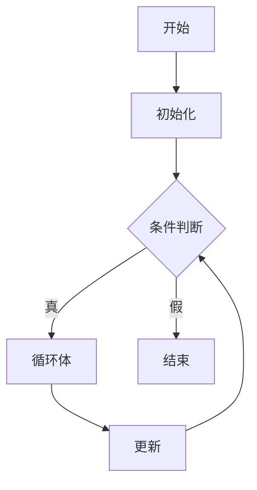
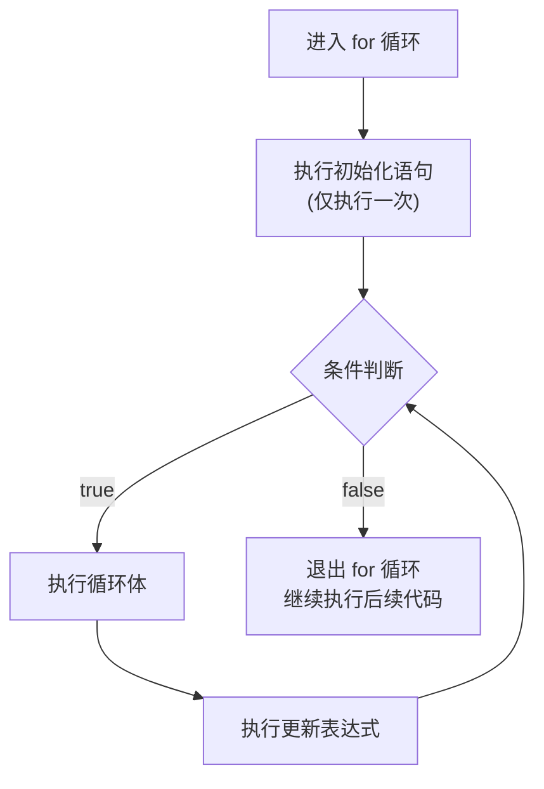
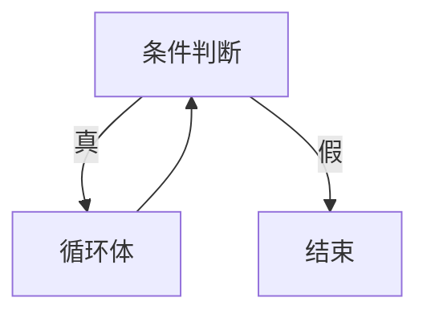
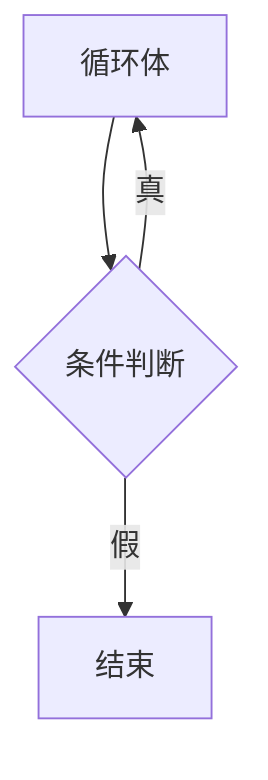
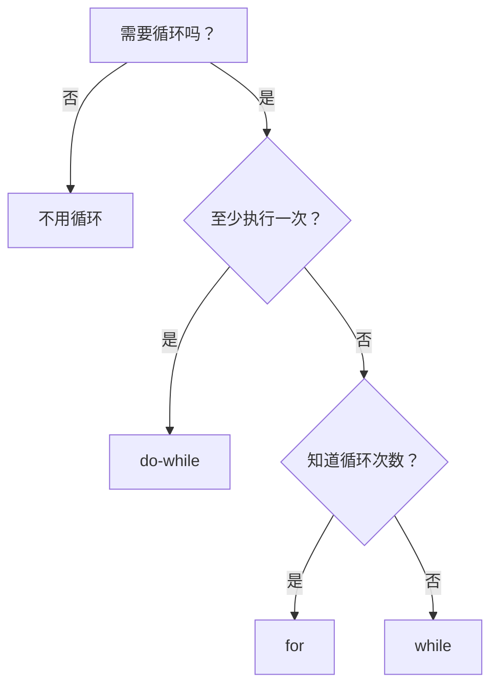
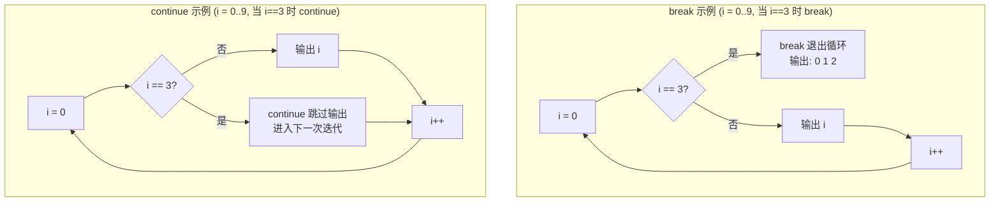

# 第 5 章：循环和关系表达式

> **本章目标**: 掌握 C++ 中的三种循环结构（`for`、`while`、`do while`）以及关系表达式，学会用循环控制程序流程。深入理解循环的底层机制、性能优化和常见陷阱。

---

## 5.1 循环概述

**循环**是编程中最基本的控制结构之一，用于重复执行一段代码。循环由四个基本部分组成：

1. **初始化** — 设置循环的起始状态
2. **条件判断** — 决定是否继续循环
3. **循环体** — 被重复执行的代码
4. **更新** — 改变循环变量，向结束条件靠近



**C++ 的三种循环**：
| 循环类型 | 适用场景 | 特点 | 执行次数 |
|----------|----------|------|---------|
| `for` 循环 | 已知循环次数 | 初始化、条件、更新统一管理 | 0 ~ N 次 |
| `while` 循环 | 条件驱动 | 先判断后执行，可能一次都不执行 | 0 ~ N 次 |
| `do while` 循环 | 至少执行一次 | 先执行后判断，至少执行一次 | 1 ~ N 次 |

---

## 5.2 关系表达式

### 5.2.1 关系运算符

关系运算符用于比较两个值，结果为 `bool` 类型（`true` 或 `false`）。

| 运算符 | 含义 | 示例 | 结果 |
|--------|------|------|------|
| `<` | 小于 | `3 < 5` | `true` |
| `<=` | 小于等于 | `5 <= 5` | `true` |
| `>` | 大于 | `5 > 3` | `true` |
| `>=` | 大于等于 | `3 >= 5` | `false` |
| `==` | 等于 | `3 == 5` | `false` |
| `!=` | 不等于 | `3 != 5` | `true` |

```cpp
#include <iostream>
using namespace std;

int main() {
    int x = 5, y = 10;

    cout << boolalpha;  // 显示 true/false

    cout << "x < y:  " << (x < y) << endl;    // true
    cout << "x > y:  " << (x > y) << endl;    // false
    cout << "x == y: " << (x == y) << endl;   // false
    cout << "x != y: " << (x != y) << endl;   // true

    // 比较的结果可以直接赋值
    bool result = (x < y);     // result = true

    // 关系运算符的连续使用问题
    // ❌ 数学写法：3 < x < 5
    // 在 C++ 中实际被解析为 (3 < x) < 5
    // 如果 x = 4: 3 < 4 为 true(1), 1 < 5 为 true
    // 如果 x = 1: 3 < 1 为 false(0), 0 < 5 为 true
    // 所以这个表达式始终为 true！
    // ✅ 正确写法：x > 3 && x < 5

    return 0;
}
```

### 5.2.2 关系运算符的优先级

```cpp
// 关系运算符的优先级低于算术运算符
int x = 5, y = 10, z = 3;

bool r1 = x + y < z;        // 等价于 (x + y) < z，即 15 < 3 → false
bool r2 = x < y + z;        // 等价于 x < (y + z)，即 5 < 13 → true

// 优先级顺序（从高到低）:
// 1. 算术运算符 (+, -, *, /, %)
// 2. 关系运算符 (<, <=, >, >=)
// 3. 相等性运算符 (==, !=)
// 4. 赋值运算符 (=)

bool r3 = x < y == y < z;   // 等价于 (x < y) == (y < z)
                            // (5 < 10) == (10 < 3)
                            // true == false → false
```

| 优先级 | 运算符类别 | 运算符 | 结合性 |
|--------|-----------|--------|--------|
| 高 | 算术 | `* / %` | 左到右 |
| | 算术 | `+ -` | 左到右 |
| | 关系 | `< <= > >=` | 左到右 |
| | 相等 | `== !=` | 左到右 |
| 低 | 赋值 | `=` | 右到左 |

### 5.2.3 常见陷阱：`=` 与 `==`

```cpp
// ❌ 极其常见的错误
if (x = 5) {         // 赋值！不是比较！
    // 条件永远为真，因为 x = 5 的值是 5，非零即真
}

// ✅ 正确写法
if (x == 5) {        // 比较
    // 当 x == 5 时执行
}

// 💡 防御性写法（将常量放左边）
if (5 == x) {        // 如果写成 5 = x，编译器会报错
}

// 在循环条件中同样容易出错
// ❌ 死循环！
int i = 0;
while (i = 5) {      // 赋值，非零，永远为真
    // ...
}

// ✅ 正确
while (i == 5) {
    // ...
}
```

### 5.2.4 C 风格字符串的比较

```cpp
#include <iostream>
#include <cstring>
using namespace std;

int main() {
    char str1[] = "Hello";
    char str2[] = "Hello";

    // ❌ 错误：比较地址，不是内容！
    if (str1 == str2) {
        cout << "不会执行" << endl;
    }

    // ✅ 正确：使用 strcmp()
    // strcmp(s1, s2) 返回值：
    //   < 0 : s1 < s2
    //   = 0 : s1 == s2
    //   > 0 : s1 > s2
    if (strcmp(str1, str2) == 0) {
        cout << "两个字符串相等" << endl;
    }

    // strcmp 按字典序比较
    char s1[] = "Apple";
    char s2[] = "Banana";

    if (strcmp(s1, s2) < 0) {
        cout << "Apple 排在 Banana 前面" << endl;
    }

    // strncmp — 只比较前 n 个字符
    char prefix[] = "Hello";
    char full[] = "HelloWorld";

    if (strncmp(prefix, full, 5) == 0) {
        cout << "full 以 Hello 开头" << endl;
    }

    return 0;
}
```

### 5.2.5 string 类型字符串的比较

```cpp
#include <iostream>
#include <string>
using namespace std;

int main() {
    string s1 = "Hello";
    string s2 = "Hello";
    string s3 = "World";

    // string 类重载了关系运算符，可以直接比较
    if (s1 == s2) {
        cout << "s1 等于 s2" << endl;
    }

    if (s1 != s3) {
        cout << "s1 不等于 s3" << endl;
    }

    // 按字典序比较
    string a = "Apple";
    string b = "Banana";

    if (a < b) {
        cout << "Apple 排在 Banana 前面" << endl;
    }

    // 混合比较：string 与 C 风格字符串
    const char* cstr = "Hello";
    if (s1 == cstr) {
        cout << "string 和 C 字符串可以直接比较" << endl;
    }

    // string 的 compare() 方法（更灵活）
    string text = "Hello World";
    string sub = "World";

    if (text.compare(6, 5, sub) == 0) {
        cout << "text 从位置 6 开始的 5 个字符等于 sub" << endl;
    }

    // 大小写敏感问题
    string upper = "HELLO";
    if (s1 != upper) {
        cout << "string 比较是大小写敏感的" << endl;
    }

    // 忽略大小写比较（需要自定义或使用第三方库）
    auto iequal = [](const string& a, const string& b) -> bool {
        if (a.size() != b.size()) return false;
        for (size_t i = 0; i < a.size(); i++) {
            if (tolower(a[i]) != tolower(b[i])) return false;
        }
        return true;
    };

    if (iequal(s1, upper)) {
        cout << "忽略大小写后相等" << endl;
    }

    return 0;
}
```

---

## 5.3 for 循环

### 5.3.1 for 循环的语法

```cpp
for (初始化; 条件; 更新) {
    // 循环体
}
```

### 5.3.2 for 循环的完整执行流程



**详细步骤分解**（以 `for (int i = 0; i < 3; i++)` 为例）：

| 步骤 | 执行内容 | i 的值 | 说明 |
|------|---------|--------|------|
| 1 | `int i = 0` | 0 | 初始化，仅执行一次 |
| 2 | `i < 3` ? | 0 | 0 < 3 → true，进入循环 |
| 3 | `cout << i` | 0 | 输出 0 |
| 4 | `i++` | 1 | 执行更新 |
| 5 | `i < 3` ? | 1 | 1 < 3 → true |
| 6 | `cout << i` | 1 | 输出 1 |
| 7 | `i++` | 2 | 执行更新 |
| 8 | `i < 3` ? | 2 | 2 < 3 → true |
| 9 | `cout << i` | 2 | 输出 2 |
| 10 | `i++` | 3 | 执行更新 |
| 11 | `i < 3` ? | 3 | 3 < 3 → false，退出循环 |

### 5.3.3 基本示例

```cpp
#include <iostream>
using namespace std;

int main() {
    // 循环 5 次：i 从 0 到 4
    for (int i = 0; i < 5; i++) {
        cout << "第 " << i + 1 << " 次循环" << endl;
    }

    // 逆向循环：从 5 到 1
    for (int i = 5; i > 0; i--) {
        cout << i << "... ";
    }
    cout << "发射！" << endl;

    // 步长不为 1
    for (int i = 0; i <= 10; i += 2) {
        cout << i << " ";  // 0 2 4 6 8 10
    }
    cout << endl;

    // 使用浮点数作为循环变量
    for (double d = 0.0; d <= 1.0; d += 0.2) {
        cout << d << " ";  // 0.0 0.2 0.4 0.6 0.8 1.0
    }
    cout << endl;

    // 注意：浮点数精度可能导致意外行为
    for (double d = 0.0; d != 1.0; d += 0.2) {
        cout << d << " ";  // 可能永远不会等于 1.0！
    }

    return 0;
}
```

### 5.3.4 for 循环的各个部分详解

**初始化部分**：
```cpp
// 在循环内部声明变量（C++ 风格，推荐）
for (int i = 0; i < 10; i++) { }  // i 的作用域仅限于循环内部

// 在外部声明变量（C 风格）
int i;
for (i = 0; i < 10; i++) { }     // 循环结束后 i 仍可访问

// 声明多个变量（同类型）
for (int i = 0, j = 10; i < 10; i++, j--) { }

// 注意：不能声明不同类型的变量
// ❌ 错误：int i = 0, double j = 10;  // 语法错误
```

**条件部分**：
```cpp
// 条件可以是任意关系表达式或逻辑表达式
for (int i = 0; i < 10 && i != 5; i++) { }

// 条件可以是任意数值表达式（非零即真）
for (int i = 10; i; i--) { }        // i 递减到 0 时结束

// 条件可以省略（无限循环）
for (int i = 0; ; i++) {
    if (i >= 10) break;  // 需要在循环内部退出
}

// 条件可以使用函数调用
for (int i = 0; i < strlen(str); i++) { }  // 注意：每次循环都调用 strlen！
```

**更新部分**：
```cpp
// 更新可以是任意表达式
for (int i = 0; i < 10; i++) { }            // 自增
for (int i = 0; i < 10; i += 2) { }         // 自增指定步长
for (int i = 1; i < 100; i *= 2) { }        // 指数增长：1, 2, 4, 8, 16, 32, 64
for (int i = 10; i > 0; i--) { }            // 自减
for (int i = 10; i > 0; i -= 3) { }         // 递减步长
for (int i = 100; i > 0; i /= 2) { }        // 指数衰减：100, 50, 25, 12, 6, 3, 1

// 更新中使用函数调用
for (int i = 0; i < 10; i = nextValue(i)) { }
```

### 5.3.5 省略 for 循环的部分

```cpp
// 省略初始化（已在外部初始化）
int i = 0;
for (; i < 10; i++) { }     // 分号不能省略

// 省略条件（无限循环）
for (int i = 0; ; i++) {
    if (i >= 10) break;
}

// 省略更新（在循环体内更新）
for (int i = 0; i < 10; ) {
    // ...
    i++;  // 在循环体末尾更新
}

// 全部省略（无限循环）
for (;;) {
    // 等价于 while(true)
    // 等价于 while(1)
}

// 省略循环体（空循环）
for (int i = 0; i < 1000000; i++);  // 延迟/计时用
```

### 5.3.6 逗号运算符

逗号运算符允许在 `for` 循环中执行多个操作：

```cpp
#include <iostream>
using namespace std;

int main() {
    // 逗号表达式：初始化两个变量，更新两个变量
    for (int i = 0, j = 10; i < j; i++, j--) {
        cout << "i = " << i << ", j = " << j << endl;
    }

    // 逗号表达式的值：最后一个表达式的值
    int x = (1, 2, 3);   // x = 3
    int y;
    y = (x += 2, x + 1); // x = 5, y = 6

    // 逗号运算符在循环体中的使用
    int a = 1, b = 10;
    while (a < b) {
        cout << "a = " << a << ", b = " << b << endl;
        a++, b--;  // 逗号表达式作为语句
    }

    // 逗号运算符的优先级最低
    int z;
    z = 1, 2, 3;        // 等价于 (z = 1), 2, 3 → z = 1
    z = (1, 2, 3);      // z = 3

    // 在 for 循环中使用逗号做更多操作
    for (int i = 0, j = 0, k = 0; i < 10; i++, j += 2, k += 3) {
        cout << "i:" << i << " j:" << j << " k:" << k << endl;
    }

    return 0;
}
```

> **注意**：`for` 循环头部中的逗号不是逗号运算符，而是语法分隔符，用于分隔初始化列表中的多个声明。但在更新部分，逗号是逗号运算符。

### 5.3.7 for 循环的多种变体

**变体 1：使用指针遍历数组**
```cpp
#include <iostream>
using namespace std;

int main() {
    int arr[] = {10, 20, 30, 40, 50};
    int* parr = arr;  // 指向数组首元素的指针

    for (int i = 0; i < 5; i++) {
        cout << *(parr + i) << " ";  // 10 20 30 40 50
    }
    cout << endl;

    // 或者直接用指针做循环变量
    for (int* p = arr; p < arr + 5; p++) {
        cout << *p << " ";
    }
    cout << endl;

    return 0;
}
```

**变体 2：递减索引访问**
```cpp
#include <iostream>
using namespace std;

int main() {
    int arr[] = {1, 2, 3, 4, 5};
    size_t size = sizeof(arr) / sizeof(arr[0]);

    // 反向遍历
    for (int i = size - 1; i >= 0; i--) {
        cout << arr[i] << " ";  // 5 4 3 2 1
    }
    cout << endl;

    // 注意：size_t 是无符号类型！
    // ❌ 危险写法：
    // for (size_t i = size - 1; i >= 0; i--)  // 死循环！
    //    因为 i >= 0 对无符号整数永远为真

    // ✅ 安全写法：
    for (size_t i = size; i > 0; i--) {
        cout << arr[i - 1] << " ";
    }
    cout << endl;

    return 0;
}
```

**变体 3：多重条件组合**
```cpp
#include <iostream>
using namespace std;

int main() {
    // 使用逻辑运算符组合条件
    for (int i = 0; i < 10 && i != 5; i++) {
        cout << i << " ";  // 0 1 2 3 4
    }
    cout << endl;

    // 使用短路求值特性
    for (int i = 0; i < 10; i++) {
        if (i % 2 == 0 && i % 3 == 0) {
            cout << i << " ";  // 0 6
        }
    }
    cout << endl;

    return 0;
}
```

### 5.3.8 循环中的字符串操作

```cpp
#include <iostream>
#include <string>
#include <cctype>
using namespace std;

int main() {
    string text = "Hello";

    // 遍历 string 中的每个字符
    for (int i = 0; i < text.size(); i++) {
        cout << text[i] << " ";
    }
    cout << endl;

    // C++11 范围 for 循环（更简洁）
    for (char c : text) {
        cout << c << " ";
    }
    cout << endl;

    // 修改字符串
    for (char& c : text) {   // 使用引用！
        c = toupper(c);      // 转为大写
    }
    cout << text << endl;    // HELLO

    // 逆序遍历字符串
    for (int i = text.size() - 1; i >= 0; i--) {
        cout << text[i];     // OLLEH
    }
    cout << endl;

    // 字符串与循环：回文判断
    string s = "racecar";
    bool is_palindrome = true;
    for (int i = 0; i < s.size() / 2; i++) {
        if (s[i] != s[s.size() - 1 - i]) {
            is_palindrome = false;
            break;
        }
    }
    cout << s << (is_palindrome ? " 是" : " 不是") << "回文" << endl;

    return 0;
}
```

### 5.3.9 ++ 和 -- 运算符

```cpp
#include <iostream>
using namespace std;

int main() {
    int x = 5;
    int y;

    // 前置递增：先加 1，再使用
    y = ++x;    // x = 6, y = 6

    // 后置递增：先使用，再加 1
    x = 5;
    y = x++;    // y = 5, x = 6

    // 前置递减
    y = --x;    // x = 4, y = 4

    // 后置递减
    y = x--;    // y = 4, x = 3

    // 在表达式中的行为
    int a = 1, b = 1;
    int r1 = a++ + a++;    // 未定义行为！不要这样写
    int r2 = ++b + ++b;    // 未定义行为！不要这样写

    // 在同一语句中多次修改同一变量是未定义行为
    a = 1;
    // r = a++ + ++a;      // 未定义行为！

    return 0;
}
```

### 5.3.10 前缀与后缀的底层实现

**从编译器角度看两者的区别**：

```cpp
// 对于基本类型（int、char 等）
// 前缀 ++：
// ++i 的实现（概念）
int& operator++(int& i) {
    i = i + 1;
    return i;       // 返回引用
}

// 后置 ++：
// i++ 的实现（概念）
int operator++(int& i, int) {  // 第二个 int 参数是哑元
    int old = i;    // 保存旧值
    i = i + 1;
    return old;     // 返回旧值（临时对象）
}
```

**对于迭代器（如 vector::iterator）**：

```cpp
#include <iostream>
#include <vector>
using namespace std;

int main() {
    vector<int> v = {1, 2, 3, 4, 5};

    // ✅ 推荐：前置 ++，效率更高
    for (auto it = v.begin(); it != v.end(); ++it) {
        cout << *it << " ";
    }
    cout << endl;

    // ❌ 不推荐：后置 ++，需要创建临时对象
    for (auto it = v.begin(); it != v.end(); it++) {
        cout << *it << " ";
    }
    cout << endl;

    return 0;
}
```

**性能差异分析**：

| 类型 | 前置 ++ | 后置 ++ | 差异 |
|------|---------|---------|------|
| 基本类型（int, char, 指针） | 直接加 1 返回引用 | 保存副本，加 1，返回副本 | **无差异**（编译器优化） |
| 迭代器 | 直接前进并返回引用 | 保存副本，前进，返回副本 | **有差异**（涉及对象复制） |
| 自定义类型 | 返回引用 | 返回临时对象 | **差异显著** |

**最佳实践**：
```cpp
// 对于基本类型：两者皆可，但推荐一致风格
for (int i = 0; i < 100; ++i) { }  // 一致使用前置

// 对于迭代器：必须使用前置
for (auto it = v.begin(); it != v.end(); ++it) { }

// 在不需要原值的情况下，优先使用前置
int arr[] = {1, 2, 3, 4, 5};
int* p = arr;
while (*p != 0) {
    cout << *++p << " ";  // 先移动指针再取值
}
```

### 5.3.11 组合赋值运算符

| 运算符 | 含义 | 示例 | 等价于 |
|--------|------|------|--------|
| `+=` | 加等于 | `x += 3` | `x = x + 3` |
| `-=` | 减等于 | `x -= 3` | `x = x - 3` |
| `*=` | 乘等于 | `x *= 3` | `x = x * 3` |
| `/=` | 除等于 | `x /= 3` | `x = x / 3` |
| `%=` | 模等于 | `x %= 3` | `x = x % 3` |
| `<<=` | 左移等于 | `x <<= 1` | `x = x << 1` |
| `>>=` | 右移等于 | `x >>= 1` | `x = x >> 1` |
| `&=` | 位与等于 | `x &= 3` | `x = x & 3` |
| `\|=` | 位或等于 | `x \|= 3` | `x = x \| 3` |
| `^=` | 位异或等于 | `x ^= 3` | `x = x ^ 3` |

```cpp
#include <iostream>
using namespace std;

int main() {
    int x = 10;

    x += 5;     // x = 15
    cout << "x += 5: " << x << endl;

    x -= 3;     // x = 12
    cout << "x -= 3: " << x << endl;

    x *= 2;     // x = 24
    cout << "x *= 2: " << x << endl;

    x /= 4;     // x = 6
    cout << "x /= 4: " << x << endl;

    x %= 3;     // x = 0
    cout << "x %= 3: " << x << endl;

    // 位运算组合赋值
    int flags = 0b0011;
    flags |= 0b0100;    // flags = 0b0111
    flags &= 0b0111;    // flags = 0b0111
    flags ^= 0b0101;    // flags = 0b0010

    return 0;
}
```

### 5.3.12 嵌套 for 循环深入案例

```cpp
#include <iostream>
#include <iomanip>
using namespace std;

int main() {
    // 案例 1：二维数组遍历
    int matrix[3][4] = {
        {1, 2, 3, 4},
        {5, 6, 7, 8},
        {9, 10, 11, 12}
    };

    for (int i = 0; i < 3; i++) {
        for (int j = 0; j < 4; j++) {
            cout << setw(3) << matrix[i][j];
        }
        cout << endl;
    }

    cout << endl;

    // 案例 2：转置矩阵
    int transpose[4][3];
    for (int i = 0; i < 3; i++) {
        for (int j = 0; j < 4; j++) {
            transpose[j][i] = matrix[i][j];
        }
    }

    for (int i = 0; i < 4; i++) {
        for (int j = 0; j < 3; j++) {
            cout << setw(3) << transpose[i][j];
        }
        cout << endl;
    }

    cout << endl;

    // 案例 3：矩阵乘法
    int A[2][3] = {{1, 2, 3}, {4, 5, 6}};
    int B[3][2] = {{7, 8}, {9, 10}, {11, 12}};
    int C[2][2] = {{0, 0}, {0, 0}};

    for (int i = 0; i < 2; i++) {
        for (int j = 0; j < 2; j++) {
            for (int k = 0; k < 3; k++) {
                C[i][j] += A[i][k] * B[k][j];
            }
        }
    }

    for (int i = 0; i < 2; i++) {
        for (int j = 0; j < 2; j++) {
            cout << setw(4) << C[i][j];
        }
        cout << endl;
    }

    return 0;
}
```

---

## 5.4 while 循环

### 5.4.1 while 的基本语法

```cpp
while (条件) {
    // 循环体
}
```

**执行流程**：



### 5.4.2 基本示例

```cpp
#include <iostream>
using namespace std;

int main() {
    int i = 0;
    while (i < 5) {
        cout << "i = " << i << endl;
        i++;                // 更新条件变量
    }

    // 等待用户输入特定值
    char ch;
    cout << "请输入字符（输入 q 退出）: ";
    cin >> ch;
    while (ch != 'q') {
        cout << "你输入了: " << ch << endl;
        cout << "请输入字符（输入 q 退出）: ";
        cin >> ch;
    }

    // while 循环遍历数组
    int arr[] = {10, 20, 30, 40, 50};
    int* p = arr;
    while (p < arr + 5) {
        cout << *p << " ";
        p++;
    }
    cout << endl;

    return 0;
}
```

### 5.4.3 while 与 for 的对比和转换

```cpp
// for 循环
for (int i = 0; i < 10; i++) {
    cout << i << endl;
}

// 等价的 while 循环
int i = 0;
while (i < 10) {
    cout << i << endl;
    i++;
}
```

**通用转换规则**：

```cpp
// for 循环格式
for (init; condition; update) {
    body;
}

// 等价 while 循环
init;
while (condition) {
    body;
    update;
}
```

**选择原则**：
- 知道确切循环次数 → `for`
- 不确定次数，由条件驱动 → `while`
- 循环变量只在循环内部使用 → `for`（作用域受限）
- 需要在循环外部访问循环变量 → `while`（或外部声明）

**何时 while 比 for 更自然**：
```cpp
// while 更适合表达"当...时持续做"的语义
// 读取文件直到末尾
while (file >> data) {
    process(data);
}

// 等待条件成立
while (!queue.empty()) {
    process(queue.pop());
}

// 用户输入验证
while (cin >> value && value < 0) {
    cout << "请输入正数: ";
}
```

### 5.4.4 while 处理文件输入

```cpp
#include <iostream>
#include <fstream>    // 文件流
#include <string>
using namespace std;

int main() {
    ifstream fin("data.txt");
    int count = 0;
    double value, sum = 0;

    // 方法 1：使用 >> 读取（跳过空白）
    while (fin >> value) {
        sum += value;
        count++;
    }

    if (count > 0) {
        cout << "平均值: " << sum / count << endl;
    }

    // 重置文件流
    fin.clear();
    fin.seekg(0);

    // 方法 2：使用 getline 读取整行
    string line;
    while (getline(fin, line)) {
        cout << "行: " << line << endl;
    }

    fin.close();

    // 统计文件字符数
    ifstream fin2("data.txt");
    char ch;
    int char_count = 0;
    while (fin2.get(ch)) {
        char_count++;
    }
    cout << "总字符数: " << char_count << endl;
    fin2.close();

    return 0;
}
```

### 5.4.5 延迟循环

```cpp
#include <iostream>
#include <ctime>      // clock() 函数
using namespace std;

int main() {
    cout << "开始计时..." << endl;

    float seconds;
    cout << "请输入延迟秒数: ";
    cin >> seconds;

    clock_t delay = seconds * CLOCKS_PER_SEC;  // 需要等待的时钟周期数
    clock_t start = clock();

    while (clock() - start < delay) {
        // 空循环，等待时间过去
    }

    cout << "时间到！" << endl;

    // 倒计时示例
    cout << "\n倒计时开始：" << endl;
    for (int i = 5; i > 0; i--) {
        cout << i << "...";
        clock_t wait = clock() + CLOCKS_PER_SEC;
        while (clock() < wait) { }  // 等待 1 秒
    }
    cout << "新年快乐！" << endl;

    return 0;
}
```

> **`clock()` 函数**：返回程序启动后经过的时钟周期数。`CLOCKS_PER_SEC` 是每秒的时钟周期数（通常为 1000）。`clock_t` 是 `clock()` 返回值的类型。

### 5.4.6 空语句循环

```cpp
#include <iostream>
using namespace std;

int main() {
    // 空语句循环：循环体只有分号
    // 用途 1：延迟
    int delay = 1000000;
    while (delay--);  // 空循环体

    // 用途 2：跳过输入直到结束
    cout << "请输入一些数字（Ctrl+Z 结束）: ";
    int value;
    while (cin >> value);  // 读取并丢弃所有输入
    cout << "输入结束" << endl;

    // 用途 3：查找字符串末尾
    const char* str = "Hello";
    const char* end = str;
    while (*end++);  // end 指向字符串末尾
    cout << "字符串长度: " << (end - str - 1) << endl;

    // ⚠️ 注意：空语句循环容易出错
    // ❌ 错误示例
    int i = 0;
    while (i < 10);  // 死循环！分号结束了循环
    {
        cout << i << endl;
        i++;         // 永远不会执行
    }

    return 0;
}
```

### 5.4.7 while 循环的多种应用

```cpp
#include <iostream>
#include <cmath>
using namespace std;

int main() {
    // 应用 1：数字反转
    int n = 12345;
    int reversed = 0;
    int temp = n;

    while (temp > 0) {
        reversed = reversed * 10 + temp % 10;
        temp /= 10;
    }
    cout << n << " 反转后: " << reversed << endl;

    // 应用 2：十进制转二进制
    n = 42;
    cout << n << " 的二进制: ";
    string binary;
    while (n > 0) {
        binary = char('0' + n % 2) + binary;
        n /= 2;
    }
    cout << binary << endl;

    // 应用 3：最大公约数（欧几里得算法）
    int a = 48, b = 18;
    int x = a, y = b;
    while (y != 0) {
        int temp = y;
        y = x % y;
        x = temp;
    }
    cout << "GCD(" << a << ", " << b << ") = " << x << endl;

    // 应用 4：Collatz 猜想
    n = 27;
    int steps = 0;
    cout << "Collatz 序列: ";
    while (n != 1) {
        cout << n << " ";
        if (n % 2 == 0) {
            n /= 2;
        } else {
            n = 3 * n + 1;
        }
        steps++;
    }
    cout << "1 (步数: " << steps << ")" << endl;

    return 0;
}
```

---

## 5.5 do while 循环

### 5.5.1 do while 的基本语法

```cpp
do {
    // 循环体
} while (条件);      // 注意分号！
```

**执行流程**：



### 5.5.2 基本示例

```cpp
#include <iostream>
using namespace std;

int main() {
    // 示例 1：基本计数
    int i = 0;
    do {
        cout << "i = " << i << endl;
        i++;
    } while (i < 5);

    // 示例 2：至少执行一次
    int j = 100;
    do {
        cout << "j = " << j << endl;   // 会输出一次：100
        j++;
    } while (j < 5);                    // 条件不满足，结束

    // 示例 3：与 for 循环对比
    // 以下 for 循环不会执行（条件一开始就不满足）
    for (int k = 100; k < 5; k++) {
        cout << "不会输出" << endl;
    }

    // 以下 do-while 至少执行一次
    k = 100;
    do {
        cout << "k = " << k << endl;   // 输出：100
        k++;
    } while (k < 5);

    return 0;
}
```

### 5.5.3 do-while 的典型应用

**应用 1：菜单驱动程序**

```cpp
#include <iostream>
using namespace std;

int main() {
    int number;

    // 菜单选择：至少显示一次
    do {
        cout << "\n=== 菜单 ===" << endl;
        cout << "1. 新建文件" << endl;
        cout << "2. 打开文件" << endl;
        cout << "3. 保存文件" << endl;
        cout << "0. 退出" << endl;
        cout << "请选择: ";
        cin >> number;

        switch (number) {
            case 1: cout << "新建文件..."; break;
            case 2: cout << "打开文件..."; break;
            case 3: cout << "保存文件..."; break;
            case 0: cout << "再见！"; break;
            default: cout << "无效选择！";
        }
    } while (number != 0);

    return 0;
}
```

**应用 2：输入验证**

```cpp
#include <iostream>
using namespace std;

int main() {
    int score;

    do {
        cout << "请输入成绩（0-100）: ";
        cin >> score;
        if (score < 0 || score > 100) {
            cout << "成绩必须在 0-100 之间！" << endl;
        }
    } while (score < 0 || score > 100);

    cout << "成绩: " << score << endl;
    // 输出等级
    char grade;
    if (score >= 90) grade = 'A';
    else if (score >= 80) grade = 'B';
    else if (score >= 70) grade = 'C';
    else if (score >= 60) grade = 'D';
    else grade = 'F';
    cout << "等级: " << grade << endl;

    return 0;
}
```

**应用 3：猜数字游戏（do-while 版本）**

```cpp
#include <iostream>
#include <cstdlib>
#include <ctime>
using namespace std;

int main() {
    srand(time(0));
    int secret = rand() % 100 + 1;
    int guess;
    int attempts = 0;

    cout << "猜数字游戏（1-100）" << endl;

    do {
        cout << "请输入你的猜测: ";
        cin >> guess;
        attempts++;

        if (guess > secret) {
            cout << "太大了！" << endl;
        } else if (guess < secret) {
            cout << "太小了！" << endl;
        } else {
            cout << "恭喜猜中！你用了 " << attempts << " 次。" << endl;
        }
    } while (guess != secret);

    return 0;
}
```

### 5.5.4 do-while 的适用场景分析

**什么时候应该使用 do-while 而不是 for 或 while**：

1. **交互式菜单**：菜单至少需要显示一次给用户
2. **输入验证**：至少让用户输入一次
3. **游戏主循环（至少玩一局）**
4. **需要先执行再判断的场景**

**一个复杂的 do-while 示例 — 计算器**：

```cpp
#include <iostream>
using namespace std;

int main() {
    double a, b, result;
    char op;
    char again;

    do {
        cout << "请输入表达式 (如 3 + 5): ";
        cin >> a >> op >> b;

        switch (op) {
            case '+': result = a + b; break;
            case '-': result = a - b; break;
            case '*': result = a * b; break;
            case '/':
                if (b != 0) result = a / b;
                else {
                    cout << "除数不能为 0！" << endl;
                    continue;  // 跳过输出结果
                }
                break;
            default:
                cout << "无效运算符！" << endl;
                continue;
        }
        cout << a << " " << op << " " << b << " = " << result << endl;

        cout << "继续计算？(y/n): ";
        cin >> again;
    } while (again == 'y' || again == 'Y');

    cout << "感谢使用计算器！" << endl;

    return 0;
}
```

### 5.5.5 三种循环对比

| 特性 | `for` | `while` | `do while` |
|------|-------|---------|------------|
| 先判断后执行 | 是 | 是 | 否（先执行一次） |
| 至少执行一次 | 否 | 否 | **是** |
| 适合已知次数 | **最适合** | 不太适合 | 不太适合 |
| 适合条件驱动 | 不太适合 | **最适合** | 适合（需至少执行一次） |
| 循环变量管理 | 集中（初始化+更新） | 分散 | 分散 |
| 使用频率 | **最高** | 较高 | 较低 |
| 适用场景 | 遍历、计数 | 输入处理、条件等待 | 菜单、输入验证 |

**选择流程图**：



---

## 5.6 循环嵌套

循环嵌套是指在一个循环体内包含另一个完整的循环结构。内层循环在外层循环的每次迭代中都会完整执行一遍。

### 5.6.1 九九乘法表

```cpp
#include <iostream>
#include <iomanip>     // setw()
using namespace std;

int main() {
    // 标准格式：下三角
    for (int i = 1; i <= 9; i++) {
        for (int j = 1; j <= i; j++) {
            cout << j << "x" << i << "=" << setw(2) << i * j << " ";
        }
        cout << endl;
    }

    cout << endl;

    // 完整格式：所有组合
    for (int i = 1; i <= 9; i++) {
        for (int j = 1; j <= 9; j++) {
            cout << j << "x" << i << "=" << setw(2) << i * j << " ";
        }
        cout << endl;
    }

    return 0;
}
```

### 5.6.2 打印直角三角形

```cpp
#include <iostream>
using namespace std;

int main() {
    int rows;
    cout << "请输入行数: ";
    cin >> rows;

    // 三角形 1：左下直角三角形
    // *
    // * *
    // * * *
    // * * * *
    cout << "左下直角三角形:" << endl;
    for (int i = 1; i <= rows; i++) {
        for (int j = 1; j <= i; j++) {
            cout << "* ";
        }
        cout << endl;
    }

    cout << endl;

    // 三角形 2：左上直角三角形
    // * * * *
    // * * *
    // * *
    // *
    cout << "左上直角三角形:" << endl;
    for (int i = rows; i >= 1; i--) {
        for (int j = 1; j <= i; j++) {
            cout << "* ";
        }
        cout << endl;
    }

    cout << endl;

    // 三角形 3：右下直角三角形
    //       *
    //     * *
    //   * * *
    // * * * *
    cout << "右下直角三角形:" << endl;
    for (int i = 1; i <= rows; i++) {
        for (int j = 1; j <= rows - i; j++) {
            cout << "  ";  // 打印空格
        }
        for (int j = 1; j <= i; j++) {
            cout << "* ";
        }
        cout << endl;
    }

    cout << endl;

    // 三角形 4：右上直角三角形
    // * * * *
    //   * * *
    //     * *
    //       *
    cout << "右上直角三角形:" << endl;
    for (int i = rows; i >= 1; i--) {
        for (int j = 1; j <= rows - i; j++) {
            cout << "  ";
        }
        for (int j = 1; j <= i; j++) {
            cout << "* ";
        }
        cout << endl;
    }

    return 0;
}
```

### 5.6.3 打印等腰三角形

```cpp
#include <iostream>
using namespace std;

int main() {
    int rows;
    cout << "请输入行数: ";
    cin >> rows;

    // 等腰三角形
    //     *
    //    * * *
    //   * * * * *
    //  * * * * * * *
    cout << "等腰三角形:" << endl;
    for (int i = 1; i <= rows; i++) {
        // 打印空格
        for (int j = 1; j <= rows - i; j++) {
            cout << "  ";
        }
        // 打印星号
        for (int j = 1; j <= 2 * i - 1; j++) {
            cout << "* ";
        }
        cout << endl;
    }

    cout << endl;

    // 倒等腰三角形
    //  * * * * * * *
    //   * * * * * *
    //    * * * * *
    //     * * * *
    cout << "倒等腰三角形:" << endl;
    for (int i = rows; i >= 1; i--) {
        // 打印空格
        for (int j = 1; j <= rows - i; j++) {
            cout << "  ";
        }
        // 打印星号
        for (int j = 1; j <= 2 * i - 1; j++) {
            cout << "* ";
        }
        cout << endl;
    }

    return 0;
}
```

### 5.6.4 打印菱形

```cpp
#include <iostream>
using namespace std;

int main() {
    int rows;
    cout << "请输入行数（奇数）: ";
    cin >> rows;

    if (rows % 2 == 0) {
        cout << "请输入奇数！" << endl;
        return 1;
    }

    int half = rows / 2;

    // 菱形
    //     *
    //    * * *
    //   * * * * *
    //  * * * * * * *
    //   * * * * *
    //    * * *
    //     *
    cout << "菱形:" << endl;

    // 上半部分（包含中间行）
    for (int i = 0; i <= half; i++) {
        for (int j = 0; j < half - i; j++) {
            cout << "  ";
        }
        for (int j = 0; j < 2 * i + 1; j++) {
            cout << "* ";
        }
        cout << endl;
    }

    // 下半部分
    for (int i = half - 1; i >= 0; i--) {
        for (int j = 0; j < half - i; j++) {
            cout << "  ";
        }
        for (int j = 0; j < 2 * i + 1; j++) {
            cout << "* ";
        }
        cout << endl;
    }

    cout << endl;

    // 空心菱形
    //     *
    //    *   *
    //   *     *
    //  *       *
    //   *     *
    //    *   *
    //     *
    cout << "空心菱形:" << endl;

    // 上半部分
    for (int i = 0; i <= half; i++) {
        for (int j = 0; j < half - i; j++) {
            cout << "  ";
        }
        for (int j = 0; j < 2 * i + 1; j++) {
            if (j == 0 || j == 2 * i) {
                cout << "* ";
            } else {
                cout << "  ";
            }
        }
        cout << endl;
    }

    // 下半部分
    for (int i = half - 1; i >= 0; i--) {
        for (int j = 0; j < half - i; j++) {
            cout << "  ";
        }
        for (int j = 0; j < 2 * i + 1; j++) {
            if (j == 0 || j == 2 * i) {
                cout << "* ";
            } else {
                cout << "  ";
            }
        }
        cout << endl;
    }

    return 0;
}
```

### 5.6.5 打印数字图案

```cpp
#include <iostream>
#include <iomanip>
using namespace std;

int main() {
    int rows = 5;

    // 数字三角 1：
    // 1
    // 2 2
    // 3 3 3
    // 4 4 4 4
    // 5 5 5 5 5
    for (int i = 1; i <= rows; i++) {
        for (int j = 1; j <= i; j++) {
            cout << i << " ";
        }
        cout << endl;
    }

    cout << endl;

    // 数字三角 2：
    // 1
    // 1 2
    // 1 2 3
    // 1 2 3 4
    // 1 2 3 4 5
    for (int i = 1; i <= rows; i++) {
        for (int j = 1; j <= i; j++) {
            cout << j << " ";
        }
        cout << endl;
    }

    cout << endl;

    // 数字三角 3（帕斯卡三角 - 组合数）：
    //       1
    //      1 1
    //     1 2 1
    //    1 3 3 1
    //   1 4 6 4 1
    int pascal[rows][rows] = {0};
    for (int i = 0; i < rows; i++) {
        pascal[i][0] = pascal[i][i] = 1;
        for (int j = 1; j < i; j++) {
            pascal[i][j] = pascal[i-1][j-1] + pascal[i-1][j];
        }
    }

    for (int i = 0; i < rows; i++) {
        // 打印前导空格
        for (int j = 0; j < rows - i - 1; j++) {
            cout << "  ";
        }
        for (int j = 0; j <= i; j++) {
            cout << setw(3) << pascal[i][j] << " ";
        }
        cout << endl;
    }

    cout << endl;

    // 数字三角 4：斐波那契三角
    // 1
    // 1 2
    // 3 5 8
    // 13 21 34 55
    int a = 1, b = 1;
    for (int i = 1; i <= 4; i++) {
        for (int j = 1; j <= i; j++) {
            cout << a << " ";
            int next = a + b;
            a = b;
            b = next;
        }
        cout << endl;
    }

    return 0;
}
```

### 5.6.6 打印对称图形

```cpp
#include <iostream>
using namespace std;

int main() {
    int rows = 5;

    // 沙漏图案
    // * * * * * * * * *
    //   * * * * * * *
    //     * * * * *
    //       * * *
    //         *
    //       * * *
    //     * * * * *
    //   * * * * * * *
    // * * * * * * * * *
    cout << "沙漏图案:" << endl;
    // 上半部分
    for (int i = rows; i >= 1; i--) {
        for (int j = 1; j <= rows - i; j++) cout << "  ";
        for (int j = 1; j <= 2 * i - 1; j++) cout << "* ";
        cout << endl;
    }
    // 下半部分
    for (int i = 2; i <= rows; i++) {
        for (int j = 1; j <= rows - i; j++) cout << "  ";
        for (int j = 1; j <= 2 * i - 1; j++) cout << "* ";
        cout << endl;
    }

    cout << endl;

    // X 图案
    // *       *
    //   *   *
    //     *
    //   *   *
    // *       *
    cout << "X 图案:" << endl;
    for (int i = 1; i <= rows; i++) {
        for (int j = 1; j <= rows; j++) {
            if (i == j || i + j == rows + 1) {
                cout << "* ";
            } else {
                cout << "  ";
            }
        }
        cout << endl;
    }

    cout << endl;

    // 空心正方形
    // * * * * *
    // *       *
    // *       *
    // *       *
    // * * * * *
    int size = 5;
    cout << "空心正方形:" << endl;
    for (int i = 1; i <= size; i++) {
        for (int j = 1; j <= size; j++) {
            if (i == 1 || i == size || j == 1 || j == size) {
                cout << "* ";
            } else {
                cout << "  ";
            }
        }
        cout << endl;
    }

    cout << endl;

    // 心形图案（近似）
    cout << "心形图案:" << endl;
    for (int i = 0; i < 6; i++) {
        for (int j = 0; j < 7; j++) {
            // 简单心形近似公式
            bool cond1 = (i == 0 && (j % 3 != 0));
            bool cond2 = (i == 1 && (j % 3 == 0));
            bool cond3 = (i - j == 2) || (i + j == 8);
            bool cond4 = (i == 3 && j > 0 && j < 6);

            if (cond1 || cond2 || cond3 || cond4) {
                cout << "* ";
            } else {
                cout << "  ";
            }
        }
        cout << endl;
    }

    return 0;
}
```

### 5.6.7 嵌套循环的复杂度分析

```cpp
#include <iostream>
#include <ctime>
using namespace std;

int main() {
    int n = 100;

    // O(n) — 线性
    int count1 = 0;
    for (int i = 0; i < n; i++) { count1++; }

    // O(n^2) — 平方
    int count2 = 0;
    for (int i = 0; i < n; i++) {
        for (int j = 0; j < n; j++) {
            count2++;
        }
    }

    // O(n^2/2) = O(n^2) — 下三角
    int count3 = 0;
    for (int i = 0; i < n; i++) {
        for (int j = 0; j <= i; j++) {
            count3++;
        }
    }

    // O(n^3) — 立方
    int count4 = 0;
    for (int i = 0; i < n; i++) {
        for (int j = 0; j < n; j++) {
            for (int k = 0; k < n; k++) {
                count4++;
            }
        }
    }

    cout << "n = " << n << endl;
    cout << "O(n) count = " << count1 << endl;
    cout << "O(n^2) count = " << count2 << endl;
    cout << "O(n^2/2) count = " << count3 << endl;
    cout << "O(n^3) count = " << count4 << endl;

    return 0;
}
```

**嵌套循环的复杂度总结**：

| 嵌套层数 | 时间复杂度 | 示例 |
|---------|-----------|------|
| 1 层循环 | O(n) | 数组遍历 |
| 2 层循环 | O(n^2) | 矩阵遍历 |
| 3 层循环 | O(n^3) | 矩阵乘法 |
| k 层循环 | O(n^k) | 多维数据处理 |

---

## 5.7 循环控制：break 和 continue

### 5.7.1 break 语句

`break` 立即退出当前循环（或 `switch`）：

```cpp
#include <iostream>
using namespace std;

int main() {
    // 在 for 循环中使用 break
    for (int i = 0; i < 10; i++) {
        if (i == 5) {
            break;          // i == 5 时退出循环
        }
        cout << i << " ";   // 输出: 0 1 2 3 4
    }
    cout << "\n循环结束" << endl;

    // 查找数组中的元素
    int arr[] = {10, 20, 30, 40, 50};
    int target = 30;
    bool found = false;

    for (int i = 0; i < 5; i++) {
        if (arr[i] == target) {
            found = true;
            cout << "找到 " << target << " 在位置 " << i << endl;
            break;          // 找到后立即退出
        }
    }

    // 素数判断中的 break
    int n = 97;
    bool is_prime = true;
    for (int i = 2; i * i <= n; i++) {
        if (n % i == 0) {
            is_prime = false;
            break;          // 找到因子，不是素数
        }
    }
    cout << n << (is_prime ? " 是素数" : " 不是素数") << endl;

    return 0;
}
```

### 5.7.2 continue 语句

`continue` 跳过当前迭代的剩余部分，进入下一次迭代：

```cpp
#include <iostream>
using namespace std;

int main() {
    // 输出 1-10 中的所有奇数
    for (int i = 1; i <= 10; i++) {
        if (i % 2 == 0) {
            continue;       // 如果是偶数，跳过输出
        }
        cout << i << " ";   // 输出: 1 3 5 7 9
    }
    cout << endl;

    // 读取有效输入
    int value;
    int sum = 0;

    cout << "请输入 5 个正数:" << endl;
    for (int i = 0; i < 5; ) {
        cin >> value;
        if (value <= 0) {
            cout << "请输入正数！" << endl;
            continue;       // 跳过当前迭代，重新输入
        }
        sum += value;
        i++;                // 只在有效输入时递增
    }
    cout << "总和: " << sum << endl;

    // 文件处理中跳过注释行
    // while (getline(file, line)) {
    //     if (line[0] == '#') continue;  // 跳过注释
    //     process(line);
    // }

    return 0;
}
```

### 5.7.3 break vs continue



| 对比维度 | `break` | `continue` |
|---------|---------|------------|
| 作用 | 立即终止整个循环 | 跳过本次迭代的剩余部分 |
| 后续执行 | 从循环后面的代码继续执行 | 继续执行下一次迭代 |
| for 中的影响 | 直接退出，更新部分不执行 | 先执行更新，再判断条件 |
| while 中的影响 | 直接退出 | 直接重新判断条件 |

### 5.7.4 嵌套循环中 break 的作用范围

```cpp
#include <iostream>
using namespace std;

int main() {
    // break 只退出最内层循环
    cout << "break 只退出内层循环:" << endl;
    for (int i = 1; i <= 3; i++) {
        cout << "外层 i = " << i << ": ";
        for (int j = 1; j <= 5; j++) {
            if (j == 3) break;  // 只退出内层循环
            cout << j << " ";
        }
        cout << endl;  // 外层循环继续
    }

    cout << endl;

    // 如何使用 break 完全退出所有嵌套循环
    // 方法 1：使用标志变量
    bool exit_all = false;
    for (int i = 1; i <= 3 && !exit_all; i++) {
        for (int j = 1; j <= 5; j++) {
            if (i == 2 && j == 3) {
                exit_all = true;
                break;
            }
            cout << "(" << i << "," << j << ") ";
        }
    }
    cout << endl;

    // 方法 2：使用 goto（虽然不推荐，但有时很清晰）
    for (int i = 1; i <= 3; i++) {
        for (int j = 1; j <= 5; j++) {
            if (i == 2 && j == 3) {
                goto exit_loops;
            }
            cout << "(" << i << "," << j << ") ";
        }
    }
    exit_loops:
    cout << "\n跳出了所有循环" << endl;

    // 方法 3：将嵌套循环封装成函数，用 return 退出
    auto search = [](int target) -> bool {
        int matrix[3][3] = {{1,2,3},{4,5,6},{7,8,9}};
        for (int i = 0; i < 3; i++) {
            for (int j = 0; j < 3; j++) {
                if (matrix[i][j] == target) return true;
            }
        }
        return false;
    };
    cout << "找到了吗？" << (search(5) ? "是" : "否") << endl;

    return 0;
}
```

### 5.7.5 goto 语句

`goto` 可以在函数内部跳转到任意标签位置。虽然不推荐使用，但在某些特殊场景（如从深层嵌套中跳出）中有其价值。

```cpp
#include <iostream>
using namespace std;

int main() {
    // goto 的基本语法
    cout << "开始" << endl;
    goto skip;
    cout << "这行不会执行" << endl;
    skip:
    cout << "跳到这里" << endl;

    // 使用 goto 退出深层嵌套
    for (int i = 0; i < 10; i++) {
        for (int j = 0; j < 10; j++) {
            for (int k = 0; k < 10; k++) {
                if (i + j + k == 15) {
                    cout << "找到: " << i << " " << j << " " << k << endl;
                    goto found;
                }
            }
        }
    }
    found:
    cout << "搜索结束" << endl;

    // ⚠️ 不要这样使用 goto（跳到循环内部）
    // goto loop_body;  // 危险！跳过初始化
    // for (int i = 0; i < 10; i++) {
    //     loop_body:
    //     cout << i << endl;
    // }

    return 0;
}
```

---

## 5.8 范围 for 循环（C++11）

### 5.8.1 基本语法

范围 for 循环（range-based for loop）是 C++11 引入的简洁遍历语法：

```cpp
for (元素类型 元素变量 : 容器) {
    // 循环体
}
```

### 5.8.2 基本示例

```cpp
#include <iostream>
#include <vector>
#include <string>
#include <map>
using namespace std;

int main() {
    int arr[] = {1, 2, 3, 4, 5};

    // 基本语法
    for (int x : arr) {
        cout << x << " ";
    }
    cout << endl;

    // 使用 auto（自动推断类型）
    for (auto x : arr) {
        cout << x << " ";
    }
    cout << endl;

    // 遍历字符串
    string str = "Hello";
    for (char c : str) {
        cout << c << " ";
    }
    cout << endl;

    // 遍历 vector
    vector<double> vec = {1.1, 2.2, 3.3};
    for (auto v : vec) {
        cout << v << " ";
    }
    cout << endl;

    // 遍历 map
    map<string, int> scores = {{"Alice", 90}, {"Bob", 85}};
    for (const auto& pair : scores) {
        cout << pair.first << ": " << pair.second << endl;
    }

    return 0;
}
```

### 5.8.3 使用引用修改元素

```cpp
#include <iostream>
#include <vector>
using namespace std;

int main() {
    vector<int> vec = {1, 2, 3, 4, 5};

    // 使用引用修改数组
    for (auto& x : vec) {
        x *= 2;     // 每个元素翻倍
    }

    // 输出验证
    for (const auto& x : vec) {
        cout << x << " ";  // 2 4 6 8 10
    }
    cout << endl;

    // 将字符串转换为大写
    string text = "hello";
    for (auto& c : text) {
        c = toupper(c);
    }
    cout << text << endl;  // HELLO

    // 使用 const 引用（只读访问，避免复制开销）
    vector<string> words = {"apple", "banana", "cherry"};
    for (const auto& word : words) {
        cout << word << " ";  // 不复制，只读访问
    }
    cout << endl;

    return 0;
}
```

### 5.8.4 多维数组

```cpp
#include <iostream>
using namespace std;

int main() {
    // 二维数组
    int matrix[3][4] = {
        {1, 2, 3, 4},
        {5, 6, 7, 8},
        {9, 10, 11, 12}
    };

    // 错误：不能直接用范围 for 遍历二维数组
    // for (auto row : matrix) { }  // row 退化为指针

    // 正确方式 1：使用传统嵌套 for
    // 正确方式 2：使用引用
    for (auto& row : matrix) {
        for (auto col : row) {
            cout << col << " ";
        }
        cout << endl;
    }

    cout << endl;

    // 修改二维数组
    for (auto& row : matrix) {
        for (auto& col : row) {
            col *= 2;
        }
    }

    // 输出修改后的数组
    for (const auto& row : matrix) {
        for (const auto& col : row) {
            cout << col << " ";
        }
        cout << endl;
    }

    return 0;
}
```

### 5.8.5 与标准库容器的高级用法

```cpp
#include <iostream>
#include <vector>
#include <set>
#include <map>
#include <algorithm>
using namespace std;

int main() {
    // vector 的遍历和修改
    vector<int> v = {5, 2, 8, 1, 9};

    // 排序后遍历
    sort(v.begin(), v.end());
    for (auto x : v) {
        cout << x << " ";  // 1 2 5 8 9
    }
    cout << endl;

    // set 自动去重排序
    set<int> s = {3, 1, 4, 1, 5, 9, 2, 6};
    for (const auto& val : s) {
        cout << val << " ";  // 1 2 3 4 5 6 9
    }
    cout << endl;

    // map 遍历
    map<int, string> students = {
        {1001, "Alice"},
        {1002, "Bob"},
        {1003, "Charlie"}
    };

    for (const auto& [id, name] : students) {
        cout << id << ": " << name << endl;
    }

    // 使用结构化绑定（C++17）遍历 map
    for (const auto& [id, name] : students) {
        cout << id << " -> " << name << endl;
    }

    // 嵌套容器的遍历
    vector<vector<int>> grid = {
        {1, 2, 3},
        {4, 5, 6},
        {7, 8, 9}
    };

    int sum = 0;
    for (const auto& row : grid) {
        for (const auto& val : row) {
            sum += val;
        }
    }
    cout << "总和: " << sum << endl;

    return 0;
}
```

### 5.8.6 范围 for 的选择指南

```cpp
for (auto x : container);           // 按值（复制元素，适合基本类型）
for (const auto& x : container);    // 只读引用（避免复制，适合大对象）
for (auto& x : container);          // 读写引用（需要修改元素时）
```

| 写法 | 含义 | 适用场景 |
|------|------|---------|
| `auto x` | 复制元素 | 基本类型（int, char, double） |
| `const auto& x` | 只读引用，不复制 | 大型对象（string, vector） |
| `auto& x` | 读写引用 | 需要修改元素时 |
| `auto&& x` | 转发引用 | 通用代码模板 |

```cpp
// 性能对比示例
#include <iostream>
#include <vector>
#include <string>
#include <chrono>
using namespace std;

int main() {
    vector<string> words(10000, "a_very_long_string_for_testing_purposes");

    // 按值复制（慢）
    size_t total1 = 0;
    for (auto word : words) {
        total1 += word.size();
    }
    cout << "按值: " << total1 << endl;

    // 按引用（快）
    size_t total2 = 0;
    for (const auto& word : words) {
        total2 += word.size();
    }
    cout << "按引用: " << total2 << endl;

    return 0;
}
```

---

## 5.9 循环的性能优化

### 5.9.1 减少循环内部的计算

```cpp
#include <iostream>
#include <vector>
#include <string>
#include <cmath>
using namespace std;

int main() {
    // ❌ 低效：每次循环都计算 size()
    for (int i = 0; i < vec.size(); i++) { /* ... */ }

    // ✅ 高效：将 size() 的计算移到循环外部
    for (int i = 0, size = vec.size(); i < size; i++) { /* ... */ }

    // 更具体的例子
    vector<int> vec(1000000, 42);

    // 低效版本
    long long sum1 = 0;
    for (int i = 0; i < vec.size(); i++) {
        sum1 += vec[i];
    }

    // 高效版本
    long long sum2 = 0;
    for (int i = 0, sz = vec.size(); i < sz; i++) {
        sum2 += vec[i];
    }

    // 对于范围 for 循环，这已经自动优化
    long long sum3 = 0;
    for (auto x : vec) {
        sum3 += x;
    }

    cout << "结果: " << sum1 << " " << sum2 << " " << sum3 << endl;

    return 0;
}
```

### 5.9.2 循环展开

```cpp
#include <iostream>
using namespace std;

int main() {
    const int SIZE = 1000;
    int arr[SIZE];
    for (int i = 0; i < SIZE; i++) arr[i] = i;

    int sum = 0;

    // 普通版本
    for (int i = 0; i < SIZE; i++) {
        sum += arr[i];
    }

    // 展开版本（减少循环开销）
    sum = 0;
    for (int i = 0; i < SIZE; i += 4) {
        sum += arr[i];
        sum += arr[i + 1];
        sum += arr[i + 2];
        sum += arr[i + 3];
    }

    // 更安全的展开（处理剩余元素）
    sum = 0;
    int i;
    for (i = 0; i + 4 <= SIZE; i += 4) {
        sum += arr[i] + arr[i+1] + arr[i+2] + arr[i+3];
    }
    for (; i < SIZE; i++) {  // 处理剩余元素
        sum += arr[i];
    }

    cout << "sum = " << sum << endl;

    return 0;
}
```

### 5.9.3 缓存友好

```cpp
#include <iostream>
#include <chrono>
using namespace std;

int main() {
    const int N = 1000;
    int matrix[N][N];

    // 初始化矩阵
    for (int i = 0; i < N; i++)
        for (int j = 0; j < N; j++)
            matrix[i][j] = i + j;

    // ❌ 缓存不友好：按列访问（步长大）
    // C++ 二维数组按行存储
    // 内层循环遍历列 j 时，跳跃 N 个元素访问
    long long sum1 = 0;
    for (int i = 0; i < N; i++) {
        for (int j = 0; j < N; j++) {
            sum1 += matrix[j][i];  // 列优先访问
        }
    }

    // ✅ 缓存友好：按行访问（连续内存）
    long long sum2 = 0;
    for (int i = 0; i < N; i++) {
        for (int j = 0; j < N; j++) {
            sum2 += matrix[i][j];  // 行优先访问
        }
    }

    cout << sum1 << " " << sum2 << endl;
    cout << "行优先访问通常比列优先快 5-10 倍" << endl;

    return 0;
}
```

### 5.9.4 减少函数调用

```cpp
#include <iostream>
#include <cmath>
using namespace std;

// ❌ 低效：循环中使用函数调用
void process_slow() {
    for (int i = 0; i < 1000; i++) {
        cout << sqrt(static_cast<double>(i)) << " ";
    }
}

// ✅ 高效：提前计算结果
void process_fast() {
    double results[1000];
    for (int i = 0; i < 1000; i++) {
        results[i] = sqrt(static_cast<double>(i));
    }
    for (int i = 0; i < 1000; i++) {
        cout << results[i] << " ";
    }
}

int main() {
    // 避免在循环条件中调用函数
    // ❌ 低效
    string str = "a very long string...";
    for (int i = 0; i < str.length(); i++) { /* ... */ }

    // ✅ 高效
    for (int i = 0, len = str.length(); i < len; i++) { /* ... */ }

    // 避免在循环体中创建临时对象
    // ❌ 每次循环都创建和销毁 string
    for (int i = 0; i < 1000; i++) {
        string temp = "value: " + to_string(i);
        // 使用 temp
    }

    // ✅ 在循环外创建，循环内重用
    string temp;
    for (int i = 0; i < 1000; i++) {
        temp = "value: " + to_string(i);
        // 使用 temp
    }

    return 0;
}
```

### 5.9.5 使用前置 ++

```cpp
#include <iostream>
#include <vector>
using namespace std;

int main() {
    vector<int> v(10000);

    // ✅ 使用前置 ++（对于迭代器更高效）
    for (auto it = v.begin(); it != v.end(); ++it) {
        *it = 42;
    }

    // ❌ 后置 ++ 会创建临时对象
    for (auto it = v.begin(); it != v.end(); it++) {
        *it = 42;
    }

    // 对于基本类型，两者等价
    for (int i = 0; i < 10000; ++i) { }  // 风格统一
    for (int i = 0; i < 10000; i++) { }  // 同样高效

    return 0;
}
```

### 5.9.6 性能优化总结

| 优化技巧 | 说明 | 收益 |
|---------|------|------|
| 减少函数调用 | 将循环不变的计算移到循环外 | 中等到高 |
| 循环展开 | 减少循环控制开销 | 中等 |
| 缓存友好 | 按连续内存顺序访问 | 高（尤其大数据集） |
| 前置 ++ | 对迭代器使用前置递增 | 低到中等 |
| 避免创建临时对象 | 重用循环外创建的对象 | 中等到高 |
| 使用引用避免复制 | 范围 for 中使用 const auto& | 高（大对象时） |

---

## 5.10 循环常见错误

### 5.10.1 差一错误（Off-by-One Error）

差一错误是最常见的循环错误之一。

```cpp
#include <iostream>
using namespace std;

int main() {
    int arr[5] = {10, 20, 30, 40, 50};
    int size = 5;

    // ❌ 错误：越界访问
    // for (int i = 0; i <= size; i++) {  // i 从 0 到 5，越界！
    //     cout << arr[i] << " ";         // arr[5] 越界
    // }

    // ✅ 正确：使用 < 而不是 <=
    for (int i = 0; i < size; i++) {
        cout << arr[i] << " ";
    }
    cout << endl;

    // ❌ 另一个常见错误：初始值错误
    // for (int i = 1; i <= size; i++) {  // arr[1] 到 arr[5] 越界
    //     cout << arr[i] << " ";
    // }

    // ✅ 正确
    for (int i = 0; i < size; i++) {
        cout << arr[i] << " ";
    }

    // 差一错误的记忆口诀：
    // - 从 0 开始计数，使用 < 或 !=
    // - 从 1 开始计数，使用 <=
    // - 数组索引从 0 开始，永远用 <

    // 反向遍历的差一错误
    // ❌ 错误
    // for (int i = size - 1; i >= 0; i--) { }  // 正确

    // ❌ 错误：无符号整数
    // size_t us = size;
    // for (size_t i = us - 1; i >= 0; i--) { }  // 死循环！

    // ✅ 正确
    for (size_t i = size; i > 0; i--) {
        cout << arr[i - 1] << " ";
    }
    cout << endl;

    return 0;
}
```

### 5.10.2 无限循环

```cpp
#include <iostream>
using namespace std;

int main() {
    // 错误 1：忘记更新循环变量
    // int i = 0;
    // while (i < 10) {
    //     cout << i << " ";
    //     // 忘记了 i++！
    // }

    // 错误 2：条件永远为真
    // for (int i = 0; 1; i++) {  // 条件为 1，永远为真
    //     cout << i << " ";
    // }

    // 错误 3：分号结束 for
    // for (int i = 0; i < 10; i++);  // 分号结束了循环！
    // {
    //     cout << "这不是循环体" << endl;
    // }

    // 错误 4：== 写成 =
    // int i = 0;
    // while (i = 5) {  // 赋值，不是比较！
    //     cout << "无限循环" << endl;
    // }

    // 错误 5：浮点数精确比较
    // for (double d = 0.0; d != 1.0; d += 0.1) {
    //     // 浮点数精度问题，d 可能永远不等于 1.0
    // }

    // ✅ 浮点数循环的正确写法
    for (double d = 0.0; d <= 1.0; d += 0.1) {
        cout << d << " ";
    }
    cout << endl;

    // 错误 6：无符号整数的递减循环
    // for (unsigned int i = 10; i >= 0; i--) {  // 死循环！
    //     cout << i << " ";
    // }

    // ✅ 正确写法
    for (unsigned int i = 11; i > 0; i--) {
        cout << i - 1 << " ";
    }
    cout << endl;

    return 0;
}
```

### 5.10.3 空语句问题

```cpp
#include <iostream>
using namespace std;

int main() {
    // 错误：不小心在 while 后面加了分号
    int i = 0;
    while (i < 5);  // 分号！死循环！
    {
        cout << i << endl;
        i++;
    }

    // 正确：for 循环分号位置
    for (int i = 0; i < 5; i++) {  // 这里没有分号
        cout << i << endl;
    }

    // 故意的空语句循环
    int count = 0;
    while (count < 1000000)
        count++;  // 没有大括号，只有一条语句

    // 小心：if 后面的空语句
    int x = 0;
    if (x == 0);  // 分号！空语句！
    {
        cout << "这行总是会执行" << endl;  // 这不是 if 的体
    }

    return 0;
}
```

### 5.10.4 副作用问题

```cpp
#include <iostream>
using namespace std;

int main() {
    // 副作用：在条件表达式中修改循环变量
    int arr[] = {1, 2, 3, 4, 5};
    int i = 0;

    // ❌ 令人困惑的写法
    while (i < 5) {
        cout << arr[i++] << " ";  // 在索引和递增之间很难看清
    }
    cout << endl;

    // ✅ 清晰的写法
    i = 0;
    while (i < 5) {
        cout << arr[i] << " ";
        i++;
    }
    cout << endl;

    // ❌ 危险：在同一个表达式中多次修改同一变量
    int x = 1;
    // int y = x++ + ++x;  // 未定义行为！

    // ❌ 危险：函数参数中的副作用
    // int nums[] = {1, 2, 3};
    // int* p = nums;
    // process(*p++, *p++);  // 未定义行为！

    return 0;
}
```

### 5.10.5 循环变量类型错误

```cpp
#include <iostream>
#include <vector>
using namespace std;

int main() {
    // 错误 1：有符号和无符号比较
    vector<int> v = {1, 2, 3, 4, 5};

    // ❌ 警告：有符号/无符号不匹配
    // for (int i = 0; i < v.size(); i++) {  // int 和 size_t 比较
    //     cout << v[i] << " ";
    // }

    // ✅ 正确
    for (size_t i = 0; i < v.size(); i++) {
        cout << v[i] << " ";
    }
    cout << endl;

    // 错误 2：循环变量溢出
    // for (unsigned char i = 0; i < 256; i++) {  // 死循环！
    //     // unsigned char 范围 0-255，i < 256 永远为真
    // }

    // ✅ 正确
    for (int i = 0; i < 256; i++) {
        // 使用 int
    }

    // 错误 3：浮点数作为循环变量
    // ❌ 浮点数精度问题
    // for (float f = 0.0f; f != 1.0f; f += 0.1f) {
    //     // 可能无限循环
    // }

    // ✅ 使用整数循环变量，需要时转换为浮点数
    for (int i = 0; i <= 10; i++) {
        float f = i / 10.0f;
        cout << f << " ";
    }
    cout << endl;

    return 0;
}
```

### 5.10.6 作用域与生命周期问题

```cpp
#include <iostream>
using namespace std;

int main() {
    // 错误：在循环外使用循环变量
    for (int i = 0; i < 10; i++) {
        // i 的作用域仅限于 for 循环
    }
    // cout << i;  // 错误！i 在这里未定义

    // 正确：在外部声明
    int j;
    for (j = 0; j < 10; j++) { }
    cout << "j = " << j << endl;  // 正确

    // 错误：lambda 捕获循环变量的问题（C++11 之前）
    // auto f = [&]() { return i; };  // 悬空引用

    // 错误：循环内创建的对象生命周期
    // vector<int*> ptrs;
    // for (int i = 0; i < 5; i++) {
    //     int temp = i;
    //     ptrs.push_back(&temp);  // 存储的是局部变量的地址！
    // }
    // // ptrs 中的指针全部悬空！

    return 0;
}
```

---

## 5.11 循环的应用模式

### 5.11.1 遍历模式

```cpp
#include <iostream>
#include <vector>
using namespace std;

int main() {
    vector<int> data = {10, 20, 30, 40, 50};

    // 模式 1：正向遍历
    cout << "正向遍历: ";
    for (int i = 0; i < data.size(); i++) {
        cout << data[i] << " ";
    }
    cout << endl;

    // 模式 2：反向遍历
    cout << "反向遍历: ";
    for (int i = data.size() - 1; i >= 0; i--) {
        cout << data[i] << " ";
    }
    cout << endl;

    // 模式 3：隔一个遍历
    cout << "隔一取一: ";
    for (int i = 0; i < data.size(); i += 2) {
        cout << data[i] << " ";
    }
    cout << endl;

    // 模式 4：范围遍历
    cout << "范围遍历: ";
    for (auto x : data) {
        cout << x << " ";
    }
    cout << endl;

    // 模式 5：迭代器遍历
    cout << "迭代器遍历: ";
    for (auto it = data.begin(); it != data.end(); ++it) {
        cout << *it << " ";
    }
    cout << endl;

    return 0;
}
```

### 5.11.2 查找模式

```cpp
#include <iostream>
#include <vector>
#include <algorithm>
using namespace std;

int main() {
    vector<int> data = {3, 7, 1, 9, 4, 6, 8, 2, 5};

    // 模式 1：线性查找（找到第一个）
    int target = 6;
    int index = -1;
    for (int i = 0; i < data.size(); i++) {
        if (data[i] == target) {
            index = i;
            break;
        }
    }
    if (index != -1) {
        cout << target << " 在位置 " << index << endl;
    }

    // 模式 2：查找所有匹配
    target = 3;
    cout << "所有值为 " << target << " 的位置: ";
    for (int i = 0; i < data.size(); i++) {
        if (data[i] == target) {
            cout << i << " ";
        }
    }
    cout << endl;

    // 模式 3：查找最大值/最小值
    int max_val = data[0];
    int min_val = data[0];
    int max_pos = 0, min_pos = 0;
    for (int i = 1; i < data.size(); i++) {
        if (data[i] > max_val) {
            max_val = data[i];
            max_pos = i;
        }
        if (data[i] < min_val) {
            min_val = data[i];
            min_pos = i;
        }
    }
    cout << "最大值: " << max_val << " 在 " << max_pos << endl;
    cout << "最小值: " << min_val << " 在 " << min_pos << endl;

    // 模式 4：查找满足条件的元素
    cout << "第一个大于 5 的数: ";
    for (auto x : data) {
        if (x > 5) {
            cout << x << endl;
            break;
        }
    }

    return 0;
}
```

### 5.11.3 统计模式

```cpp
#include <iostream>
#include <vector>
#include <map>
using namespace std;

int main() {
    vector<int> data = {1, 2, 3, 2, 4, 3, 3, 5, 1, 2, 3, 4, 5, 5, 5};

    // 模式 1：计数
    int count_greater_than_3 = 0;
    for (auto x : data) {
        if (x > 3) count_greater_than_3++;
    }
    cout << "大于 3 的元素个数: " << count_greater_than_3 << endl;

    // 模式 2：频率统计
    map<int, int> freq;
    for (auto x : data) {
        freq[x]++;  // 如果键不存在，会创建并初始化为 0
    }
    cout << "频率统计: " << endl;
    for (const auto& [value, count] : freq) {
        cout << value << " 出现 " << count << " 次" << endl;
    }

    // 模式 3：范围统计
    int ranges[5] = {0};  // 0-1, 2-3, 4-5, 6-7, 8-9
    for (auto x : data) {
        if (x >= 0 && x <= 1) ranges[0]++;
        else if (x >= 2 && x <= 3) ranges[1]++;
        else if (x >= 4 && x <= 5) ranges[2]++;
        else if (x >= 6 && x <= 7) ranges[3]++;
        else if (x >= 8 && x <= 9) ranges[4]++;
    }
    cout << "范围统计: ";
    for (int i = 0; i < 5; i++) {
        cout << "[" << 2*i << "-" << 2*i+1 << "]: " << ranges[i] << " ";
    }
    cout << endl;

    return 0;
}
```

### 5.11.4 累积模式

```cpp
#include <iostream>
#include <vector>
#include <numeric>  // for accumulate
using namespace std;

int main() {
    vector<int> data = {1, 2, 3, 4, 5, 6, 7, 8, 9, 10};

    // 模式 1：求和
    int sum = 0;
    for (auto x : data) {
        sum += x;
    }
    cout << "和: " << sum << endl;

    // 模式 2：求积
    long long product = 1;
    for (auto x : data) {
        product *= x;
    }
    cout << "积: " << product << endl;

    // 模式 3：求平均值
    double avg = static_cast<double>(sum) / data.size();
    cout << "平均值: " << avg << endl;

    // 模式 4：前缀和
    vector<int> prefix_sum(data.size());
    prefix_sum[0] = data[0];
    for (int i = 1; i < data.size(); i++) {
        prefix_sum[i] = prefix_sum[i-1] + data[i];
    }
    cout << "前缀和: ";
    for (auto x : prefix_sum) cout << x << " ";
    cout << endl;

    // 模式 5：累积条件值
    int sum_even = 0;
    int sum_odd = 0;
    for (auto x : data) {
        if (x % 2 == 0) sum_even += x;
        else sum_odd += x;
    }
    cout << "偶数和: " << sum_even << ", 奇数和: " << sum_odd << endl;

    // 模式 6：数学序列求和
    // 1^2 + 2^2 + 3^2 + ... + n^2
    int n = 10;
    int sum_squares = 0;
    for (int i = 1; i <= n; i++) {
        sum_squares += i * i;
    }
    cout << "1^2 + 2^2 + ... + " << n << "^2 = " << sum_squares << endl;

    return 0;
}
```

### 5.11.5 过滤模式

```cpp
#include <iostream>
#include <vector>
using namespace std;

int main() {
    vector<int> data = {1, 2, 3, 4, 5, 6, 7, 8, 9, 10};

    // 模式 1：筛选偶数
    cout << "偶数: ";
    for (auto x : data) {
        if (x % 2 == 0) cout << x << " ";
    }
    cout << endl;

    // 模式 2：筛选质数
    auto is_prime = [](int n) -> bool {
        if (n < 2) return false;
        for (int i = 2; i * i <= n; i++) {
            if (n % i == 0) return false;
        }
        return true;
    };

    cout << "质数: ";
    for (auto x : data) {
        if (is_prime(x)) cout << x << " ";
    }
    cout << endl;

    // 模式 3：筛选出范围内的数
    int low = 3, high = 7;
    cout << "在 [" << low << ", " << high << "] 范围内的数: ";
    for (auto x : data) {
        if (x >= low && x <= high) cout << x << " ";
    }
    cout << endl;

    // 模式 4：去重（已排序的情况）
    vector<int> sorted = {1, 1, 2, 2, 2, 3, 4, 4, 5};
    vector<int> unique;
    for (size_t i = 0; i < sorted.size(); i++) {
        if (i == 0 || sorted[i] != sorted[i-1]) {
            unique.push_back(sorted[i]);
        }
    }
    cout << "去重后: ";
    for (auto x : unique) cout << x << " ";
    cout << endl;

    return 0;
}
```

### 5.11.6 映射模式

```cpp
#include <iostream>
#include <vector>
#include <cmath>
using namespace std;

int main() {
    vector<int> data = {1, 2, 3, 4, 5};

    // 模式 1：平方映射
    vector<int> squares;
    for (auto x : data) {
        squares.push_back(x * x);
    }
    cout << "平方: ";
    for (auto x : squares) cout << x << " ";
    cout << endl;

    // 模式 2：类型转换
    vector<double> doubles;
    for (auto x : data) {
        doubles.push_back(static_cast<double>(x) / 2.0);
    }
    cout << "减半: ";
    for (auto x : doubles) cout << x << " ";
    cout << endl;

    // 模式 3：条件映射
    vector<string> labels;
    for (auto x : data) {
        if (x % 2 == 0) labels.push_back("偶数");
        else labels.push_back("奇数");
    }
    for (size_t i = 0; i < data.size(); i++) {
        cout << data[i] << " -> " << labels[i] << endl;
    }

    // 模式 4：截断映射（限制范围）
    for (auto& x : data) {
        if (x < 2) x = 2;
        if (x > 4) x = 4;
    }
    cout << "截断后: ";
    for (auto x : data) cout << x << " ";
    cout << endl;

    return 0;
}
```

---

## 5.12 综合案例

### 5.12.1 猜数字游戏（增强版）

```cpp
#include <iostream>
#include <cstdlib>
#include <ctime>
#include <limits>
using namespace std;

int main() {
    srand(time(0));

    char play_again;
    int total_games = 0;
    int total_attempts = 0;
    int best_score = numeric_limits<int>::max();

    do {
        int secret = rand() % 100 + 1;
        int guess;
        int attempts = 0;
        int low = 1, high = 100;

        cout << "\n=== 猜数字游戏 ===" << endl;
        cout << "我心里想了一个 1 到 100 之间的数字。" << endl;

        do {
            cout << "范围: [" << low << ", " << high << "], 请猜: ";
            cin >> guess;
            attempts++;

            if (guess < low || guess > high) {
                cout << "请输入 " << low << " 到 " << high << " 之间的数！" << endl;
                continue;
            }

            if (guess > secret) {
                cout << "太大了！";
                if (guess < high) high = guess - 1;
                cout << " 范围缩小为 [" << low << ", " << high << "]" << endl;
            } else if (guess < secret) {
                cout << "太小了！";
                if (guess > low) low = guess + 1;
                cout << " 范围缩小为 [" << low << ", " << high << "]" << endl;
            } else {
                cout << "恭喜猜中！你用了 " << attempts << " 次。" << endl;
            }
        } while (guess != secret);

        total_games++;
        total_attempts += attempts;
        if (attempts < best_score) best_score = attempts;

        cout << "\n当前统计: " << total_games << " 局, "
             << "平均 " << static_cast<double>(total_attempts) / total_games
             << " 次/局, 最佳: " << best_score << " 次" << endl;

        cout << "再玩一局？(y/n): ";
        cin >> play_again;
    } while (play_again == 'y' || play_again == 'Y');

    cout << "感谢游玩！" << endl;
    return 0;
}
```

### 5.12.2 数据统计分析

```cpp
#include <iostream>
#include <vector>
#include <cmath>
#include <iomanip>
using namespace std;

int main() {
    vector<double> data;
    double value;

    cout << "请输入数据（输入任意非数字结束）:" << endl;
    while (cin >> value) {
        data.push_back(value);
    }

    if (data.empty()) {
        cout << "没有输入数据。" << endl;
        return 0;
    }

    // 基本统计量
    double sum = 0;
    double max_val = data[0];
    double min_val = data[0];

    for (auto x : data) {
        sum += x;
        if (x > max_val) max_val = x;
        if (x < min_val) min_val = x;
    }

    double mean = sum / data.size();

    // 方差和标准差
    double variance_sum = 0;
    for (auto x : data) {
        variance_sum += (x - mean) * (x - mean);
    }
    double variance = variance_sum / data.size();
    double stddev = sqrt(variance);

    // 中位数
    vector<double> sorted = data;
    sort(sorted.begin(), sorted.end());
    double median;
    if (sorted.size() % 2 == 0) {
        median = (sorted[sorted.size()/2 - 1] + sorted[sorted.size()/2]) / 2.0;
    } else {
        median = sorted[sorted.size()/2];
    }

    // 输出结果
    cout << fixed << setprecision(2);
    cout << "\n=== 统计分析结果 ===" << endl;
    cout << "数据个数: " << data.size() << endl;
    cout << "总和: " << sum << endl;
    cout << "平均值: " << mean << endl;
    cout << "中位数: " << median << endl;
    cout << "最大值: " << max_val << endl;
    cout << "最小值: " << min_val << endl;
    cout << "方差: " << variance << endl;
    cout << "标准差: " << stddev << endl;

    // 频率分布直方图
    const int bins = 10;
    double bin_width = (max_val - min_val) / bins;
    cout << "\n频率分布直方图:" << endl;

    for (int i = 0; i < bins; i++) {
        double lower = min_val + i * bin_width;
        double upper = lower + bin_width;
        int count = 0;

        for (auto x : data) {
            if (x >= lower && (i == bins - 1 ? x <= upper : x < upper)) {
                count++;
            }
        }

        cout << setw(8) << lower << " - " << setw(8) << upper << " | ";
        for (int j = 0; j < count; j++) cout << "*";
        cout << " (" << count << ")" << endl;
    }

    return 0;
}
```

### 5.12.3 密码验证器

```cpp
#include <iostream>
#include <string>
#include <cctype>
using namespace std;

int main() {
    string password;
    bool valid;

    do {
        valid = true;
        cout << "请输入密码（8-16 位，包含大写字母、小写字母、数字和特殊字符）: ";
        cin >> password;

        // 长度检查
        if (password.length() < 8 || password.length() > 16) {
            cout << "密码长度必须在 8-16 位之间！" << endl;
            valid = false;
            continue;
        }

        // 字符类型统计
        bool has_upper = false;
        bool has_lower = false;
        bool has_digit = false;
        bool has_special = false;
        string special_chars = "!@#$%^&*()-_=+[]{}|;:',.<>/?`~";

        for (char c : password) {
            if (isupper(c)) has_upper = true;
            else if (islower(c)) has_lower = true;
            else if (isdigit(c)) has_digit = true;
            else if (special_chars.find(c) != string::npos) has_special = true;
        }

        if (!has_upper) {
            cout << "密码必须包含至少一个大写字母！" << endl;
            valid = false;
        }
        if (!has_lower) {
            cout << "密码必须包含至少一个小写字母！" << endl;
            valid = false;
        }
        if (!has_digit) {
            cout << "密码必须包含至少一个数字！" << endl;
            valid = false;
        }
        if (!has_special) {
            cout << "密码必须包含至少一个特殊字符！" << endl;
            valid = false;
        }

        if (!valid) {
            cout << "请重新输入。" << endl;
        }
    } while (!valid);

    cout << "密码设置成功！" << endl;
    return 0;
}
```

### 5.12.4 字符图形设计器

```cpp
#include <iostream>
using namespace std;

int main() {
    int choice, size;
    char ch = '*';

    do {
        cout << "\n=== 字符图形设计器 ===" << endl;
        cout << "1. 直角三角形" << endl;
        cout << "2. 等腰三角形" << endl;
        cout << "3. 菱形" << endl;
        cout << "4. 空心正方形" << endl;
        cout << "5. 沙漏" << endl;
        cout << "6. X 形" << endl;
        cout << "0. 退出" << endl;
        cout << "请选择: ";
        cin >> choice;

        if (choice == 0) break;

        cout << "请输入大小: ";
        cin >> size;
        cout << "请输入字符: ";
        cin >> ch;

        switch (choice) {
            case 1: // 直角三角形
                for (int i = 1; i <= size; i++) {
                    for (int j = 1; j <= i; j++) cout << ch << " ";
                    cout << endl;
                }
                break;

            case 2: // 等腰三角形
                for (int i = 1; i <= size; i++) {
                    for (int j = 1; j <= size - i; j++) cout << "  ";
                    for (int j = 1; j <= 2 * i - 1; j++) cout << ch << " ";
                    cout << endl;
                }
                break;

            case 3: // 菱形
                for (int i = 0; i <= size; i++) {
                    for (int j = 0; j < size - i; j++) cout << "  ";
                    for (int j = 0; j < 2 * i + 1; j++) cout << ch << " ";
                    cout << endl;
                }
                for (int i = size - 1; i >= 0; i--) {
                    for (int j = 0; j < size - i; j++) cout << "  ";
                    for (int j = 0; j < 2 * i + 1; j++) cout << ch << " ";
                    cout << endl;
                }
                break;

            case 4: // 空心正方形
                for (int i = 1; i <= size; i++) {
                    for (int j = 1; j <= size; j++) {
                        if (i == 1 || i == size || j == 1 || j == size)
                            cout << ch << " ";
                        else
                            cout << "  ";
                    }
                    cout << endl;
                }
                break;

            case 5: // 沙漏
                for (int i = size; i >= 1; i--) {
                    for (int j = 1; j <= size - i; j++) cout << "  ";
                    for (int j = 1; j <= 2 * i - 1; j++) cout << ch << " ";
                    cout << endl;
                }
                for (int i = 2; i <= size; i++) {
                    for (int j = 1; j <= size - i; j++) cout << "  ";
                    for (int j = 1; j <= 2 * i - 1; j++) cout << ch << " ";
                    cout << endl;
                }
                break;

            case 6: // X 形
                for (int i = 1; i <= size; i++) {
                    for (int j = 1; j <= size; j++) {
                        if (i == j || i + j == size + 1)
                            cout << ch << " ";
                        else
                            cout << "  ";
                    }
                    cout << endl;
                }
                break;
        }
    } while (choice != 0);

    cout << "再见！" << endl;
    return 0;
}
```

---

## 5.13 动手练习

### 练习 1：求和

编写程序，计算 1 到 n 之间所有奇数的和。

<details>
<summary>答案提示</summary>

```cpp
int n;
cin >> n;
int sum = 0;
for (int i = 1; i <= n; i += 2) {
    sum += i;
}
cout << "奇数和: " << sum << endl;
```

</details>

### 练习 2：阶乘计算

编写程序，输入一个正整数 n，输出它的阶乘（n!）。注意处理 n = 0 的情况（0! = 1）。

<details>
<summary>答案提示</summary>

```cpp
int n;
cin >> n;
long long fact = 1;
for (int i = 2; i <= n; i++) {
    fact *= i;
}
cout << n << "! = " << fact << endl;
```

</details>

### 练习 3：素数判断

输入一个正整数，判断它是否为素数。

<details>
<summary>答案提示</summary>

```cpp
int n;
cin >> n;
bool is_prime = true;
if (n <= 1) is_prime = false;
else {
    for (int i = 2; i * i <= n; i++) {
        if (n % i == 0) { is_prime = false; break; }
    }
}
cout << n << (is_prime ? " 是素数" : " 不是素数") << endl;
```

</details>

### 练习 4：斐波那契数列

输出斐波那契数列的前 n 项（n 由用户输入）。斐波那契数列：1, 1, 2, 3, 5, 8, 13, 21, ...

<details>
<summary>答案提示</summary>

```cpp
int n;
cin >> n;
int a = 1, b = 1;
for (int i = 0; i < n; i++) {
    cout << a << " ";
    int next = a + b;
    a = b;
    b = next;
}
cout << endl;
```

</details>

### 练习 5：数字反转

输入一个整数，输出它的反转数。例如：12345 -> 54321，-6789 -> -9876。

<details>
<summary>答案提示</summary>

```cpp
int n, reversed = 0;
cin >> n;
int temp = abs(n);
while (temp > 0) {
    reversed = reversed * 10 + temp % 10;
    temp /= 10;
}
if (n < 0) reversed = -reversed;
cout << "反转后: " << reversed << endl;
```

</details>

### 练习 6：最大公约数和最小公倍数

输入两个正整数，输出它们的最大公约数（GCD）和最小公倍数（LCM）。

<details>
<summary>答案提示</summary>

```cpp
int a, b;
cin >> a >> b;
int x = a, y = b;
while (y != 0) {
    int temp = y;
    y = x % y;
    x = temp;
}
int gcd = x;
int lcm = a / gcd * b;  // 先除后乘，避免溢出
cout << "GCD: " << gcd << ", LCM: " << lcm << endl;
```

</details>

### 练习 7：打印乘法表

编写程序，打印 n x n 的乘法表（n 由用户输入）。

<details>
<summary>答案提示</summary>

```cpp
int n;
cin >> n;
for (int i = 1; i <= n; i++) {
    for (int j = 1; j <= i; j++) {
        cout << j << "x" << i << "=" << i*j << "\t";
    }
    cout << endl;
}
```

</details>

### 练习 8：完数判断

如果一个数恰好等于它的真因子之和，则称该数为"完数"。找出 1-1000 之间的所有完数。例如：6 = 1 + 2 + 3。

<details>
<summary>答案提示</summary>

```cpp
for (int i = 2; i <= 1000; i++) {
    int sum = 0;
    for (int j = 1; j <= i/2; j++) {
        if (i % j == 0) sum += j;
    }
    if (sum == i) {
        cout << i << " = 1";
        for (int j = 2; j <= i/2; j++) {
            if (i % j == 0) cout << " + " << j;
        }
        cout << endl;
    }
}
```

</details>

### 练习 9：进制转换

输入一个十进制整数，输出它的二进制表示。

<details>
<summary>答案提示</summary>

```cpp
int n;
cin >> n;
if (n == 0) {
    cout << "0" << endl;
    return 0;
}
string binary;
while (n > 0) {
    binary = to_string(n % 2) + binary;
    n /= 2;
}
cout << "二进制: " << binary << endl;
```

</details>

### 练习 10：水仙花数

水仙花数是指一个三位数，其各位数字的立方和等于该数本身。找出所有的水仙花数。

<details>
<summary>答案提示</summary>

```cpp
for (int i = 100; i <= 999; i++) {
    int a = i / 100;        // 百位
    int b = (i / 10) % 10;  // 十位
    int c = i % 10;         // 个位
    if (a*a*a + b*b*b + c*c*c == i) {
        cout << i << " = " << a << "^3 + " << b << "^3 + " << c << "^3" << endl;
    }
}
```

</details>

### 练习 11：杨辉三角

打印杨辉三角（帕斯卡三角）的前 n 行。

<details>
<summary>答案提示</summary>

```cpp
int n;
cin >> n;
int tri[100][100] = {0};
for (int i = 0; i < n; i++) {
    tri[i][0] = tri[i][i] = 1;
    for (int j = 1; j < i; j++) {
        tri[i][j] = tri[i-1][j-1] + tri[i-1][j];
    }
}
for (int i = 0; i < n; i++) {
    for (int j = 0; j < n - i - 1; j++) cout << "  ";
    for (int j = 0; j <= i; j++) cout << setw(3) << tri[i][j] << " ";
    cout << endl;
}
```

</details>

### 练习 12：数字金字塔

输入行数 n，打印如下形式的数字金字塔：

```
    1
   121
  12321
 1234321
123454321
```

<details>
<summary>答案提示</summary>

```cpp
int n;
cin >> n;
for (int i = 1; i <= n; i++) {
    // 打印空格
    for (int j = 1; j <= n - i; j++) cout << " ";
    // 递增打印 1..i
    for (int j = 1; j <= i; j++) cout << j;
    // 递减打印 i-1..1
    for (int j = i - 1; j >= 1; j--) cout << j;
    cout << endl;
}
```

</details>

### 练习 13：冒泡排序

使用冒泡排序算法对输入的数组进行排序。

<details>
<summary>答案提示</summary>

```cpp
int arr[] = {64, 34, 25, 12, 22, 11, 90};
int n = sizeof(arr) / sizeof(arr[0]);

for (int i = 0; i < n - 1; i++) {
    bool swapped = false;
    for (int j = 0; j < n - i - 1; j++) {
        if (arr[j] > arr[j + 1]) {
            swap(arr[j], arr[j + 1]);
            swapped = true;
        }
    }
    if (!swapped) break;  // 优化：已排序则提前退出
}

for (int i = 0; i < n; i++) cout << arr[i] << " ";
cout << endl;
```

</details>

### 练习 14：二分查找

在一个已排序的数组中，使用二分查找算法查找目标值。

<details>
<summary>答案提示</summary>

```cpp
int arr[] = {2, 5, 8, 12, 16, 23, 38, 42, 55, 67};
int n = sizeof(arr) / sizeof(arr[0]);
int target = 23;

int left = 0, right = n - 1;
int index = -1;

while (left <= right) {
    int mid = left + (right - left) / 2;  // 避免溢出
    if (arr[mid] == target) {
        index = mid;
        break;
    } else if (arr[mid] < target) {
        left = mid + 1;
    } else {
        right = mid - 1;
    }
}

if (index != -1)
    cout << target << " 在位置 " << index << endl;
else
    cout << target << " 不存在" << endl;
```

</details>

---

## 5.14 本章总结

| 知识点 | 说明 | 掌握要求 |
|--------|------|----------|
| 关系运算符 | 比较两个值的大小/相等 | 熟练掌握 |
| `for` 循环 | 固定次数的循环 | **熟练掌握** |
| `while` 循环 | 条件驱动的循环 | **熟练掌握** |
| `do while` 循环 | 至少执行一次的循环 | 会使用 |
| 循环嵌套 | 循环内套循环 | 掌握模式 |
| `break` | 立即退出循环 | 熟练使用 |
| `continue` | 跳过本次迭代 | 熟练使用 |
| 范围 for | C++11 简洁遍历 | **熟练掌握** |
| ++/-- 运算符 | 自增自减 | 理解前置/后置差异 |
| 组合赋值 | +=、-= 等 | 熟练使用 |
| 循环优化 | 减少计算、缓存友好 | 理解 |
| 循环错误 | 差一、无限循环、空语句 | 能识别 |
| 循环模式 | 遍历、查找、统计、累积 | 灵活应用 |
| 应用案例 | 猜数字、统计分析 | 能独立实现 |

**最佳实践总结**：

1. **选择正确的循环**：
   - 已知次数 → `for`
   - 条件驱动 → `while`
   - 至少执行一次 → `do while`

2. **避免常见错误**：
   - 使用 `<` 而不是 `<=`（从 0 开始索引时）
   - 不要在条件中使用 `=` 代替 `==`
   - 注意分号的位置
   - 小心无符号整数的递减循环

3. **提高代码质量**：
   - 使用 `++i` 而不是 `i++`（迭代器）
   - 将循环不变的计算移到外部
   - 使用范围 for 简化代码
   - 保持循环体简洁

4. **性能考量**：
   - 缓存友好的内存访问模式
   - 减少循环内部的函数调用
   - 合理使用循环展开
