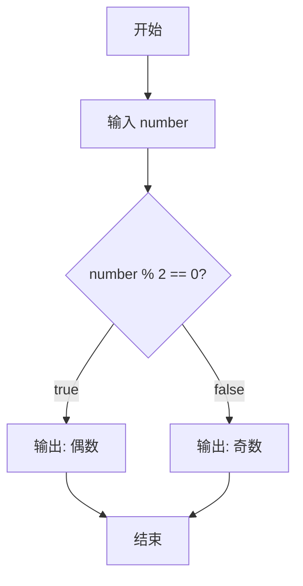
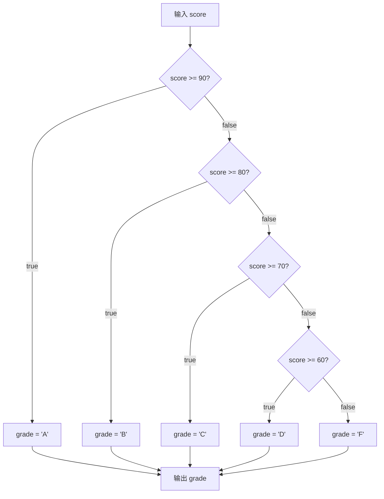
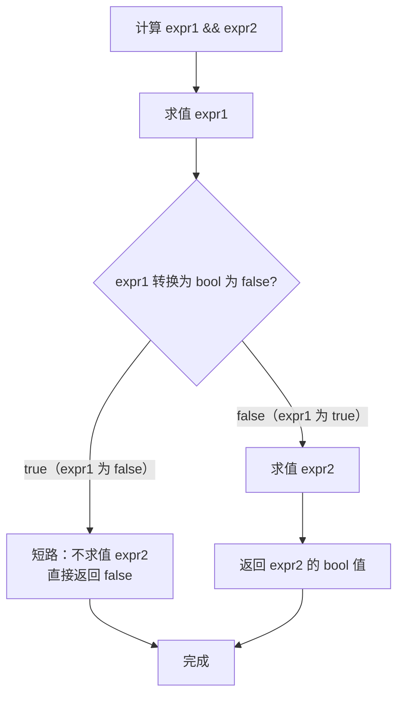
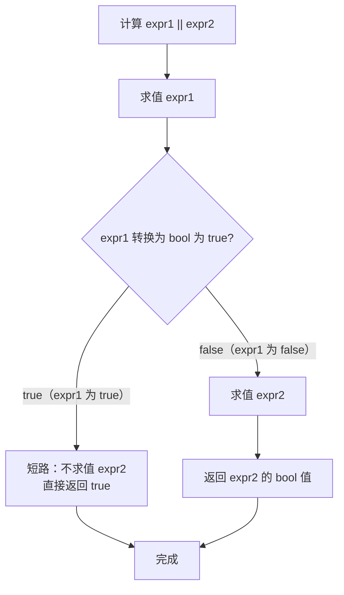
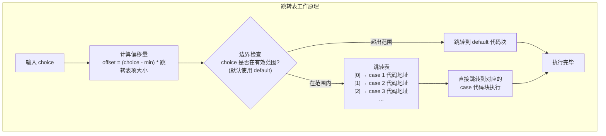
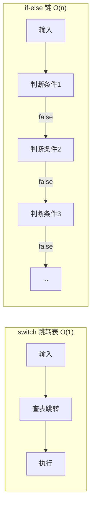
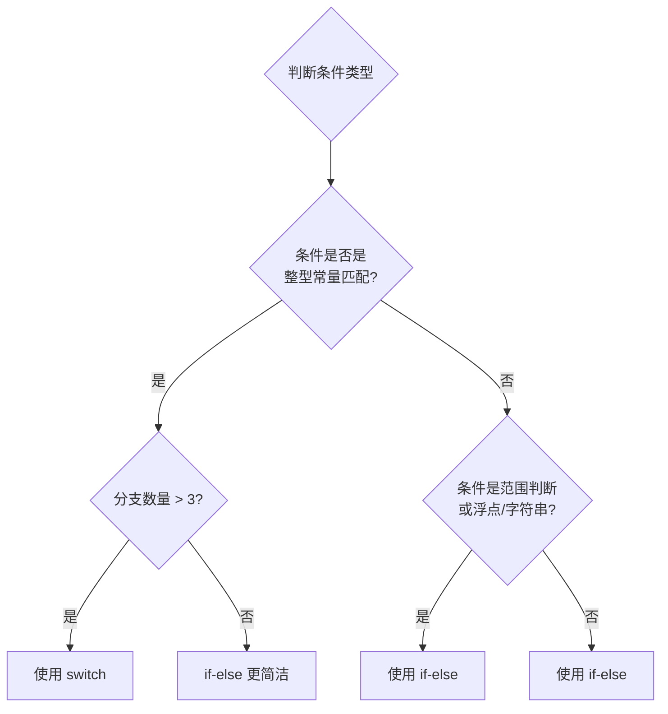
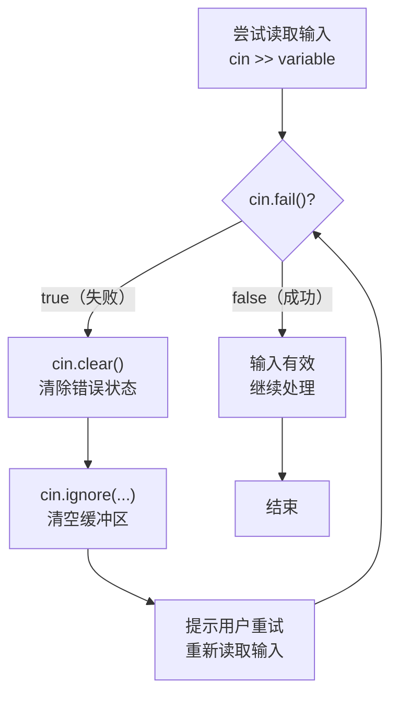

# 第 6 章：分支语句和逻辑运算符

> **本章目标**: 掌握 C++ 中的条件判断语句（`if`、`switch`）、逻辑运算符，以及如何进行字符处理、条件运算符、枚举类型和文件 I/O 的基础操作。通过大量综合案例和动手练习巩固所学知识。

---

## 6.1 if 语句

### 6.1.1 基本 if 语句

`if` 语句是 C++ 中最基础的条件控制结构。其语法如下：

```cpp
if (条件) {
    // 条件为真时执行的语句
}
```

- 条件可以是任何可以转换为 `bool` 类型的表达式
- 非零值被视为 `true`，零值被视为 `false`
- 如果条件为真，执行花括号内的语句块；否则跳过

```cpp
#include <iostream>
using namespace std;

int main() {
    int score;
    cout << "请输入分数: ";
    cin >> score;
    
    if (score >= 60) {
        cout << "及格！" << endl;
    }
    
    // 省略花括号（仅适用于单条语句）
    if (score >= 90)
        cout << "优秀！" << endl;  // 只有这一句受 if 控制
    
    return 0;
}
```

> **即使只有一条语句，也建议使用花括号**，避免未来添加语句时出错。

**条件表达式的隐式转换规则**：

```cpp
int x = 5;
if (x) {          // x 非零 → true
    // 执行
}

double d = 0.0;
if (d) {          // d 为零 → false
    // 不执行
}

int* ptr = nullptr;
if (ptr) {        // nullptr → false
    // 不执行，等同于 if (ptr != nullptr)
}
```

### 6.1.2 if-else 语句

```cpp
if (条件) {
    // 条件为真时执行
} else {
    // 条件为假时执行
}
```

```cpp
#include <iostream>
using namespace std;

int main() {
    int number;
    cout << "请输入一个整数: ";
    cin >> number;
    
    if (number % 2 == 0) {
        cout << number << " 是偶数" << endl;
    } else {
        cout << number << " 是奇数" << endl;
    }
    
    return 0;
}
```

**if-else 的执行流程**：



### 6.1.3 if-else if-else 链

```cpp
if (条件1) {
    // 条件1为真
} else if (条件2) {
    // 条件1为假且条件2为真
} else if (条件3) {
    // 条件1、2为假且条件3为真
} else {
    // 以上条件均为假
}
```

```cpp
#include <iostream>
using namespace std;

int main() {
    int score;
    cout << "请输入成绩: ";
    cin >> score;
    
    char grade;
    if (score >= 90) {
        grade = 'A';
    } else if (score >= 80) {
        grade = 'B';
    } else if (score >= 70) {
        grade = 'C';
    } else if (score >= 60) {
        grade = 'D';
    } else {
        grade = 'F';
    }
    
    cout << "等级: " << grade << endl;
    
    return 0;
}
```

**if-else if 链的执行流程**：



**注意事项**：
- 条件按顺序求值，一旦匹配就跳过后续所有条件
- 范围的顺序很重要——应从最严格的条件开始（如 `>= 90` 先于 `>= 80`）
- 如果两个范围重叠且顺序不当，后面的条件永远不会执行

```cpp
// 错误示例：顺序不当
if (score >= 60) {      // 先检查通过
    grade = 'D';         // 90 分也会到这里！
} else if (score >= 90) {
    grade = 'A';         // 永远不会执行
}
```

**条件顺序对比**：

| 顺序策略 | 示例 | 说明 |
|----------|------|------|
| 从高到低 | `>=90` → `>=80` → ... | 按数值递减，适合范围分段 |
| 从低到高 | `<18` → `<60` → ... | 按数值递增，适合年龄分段 |
| 精确匹配 | `==1` → `==2` → ... | 按特定值匹配 |

### 6.1.4 嵌套 if 语句与悬挂 else 问题

**嵌套 if 语句**：在一个 `if` 或 `else` 语句块中包含另一个 `if` 语句。

```cpp
#include <iostream>
using namespace std;

int main() {
    int age;
    bool hasID;
    
    cout << "请输入年龄: ";
    cin >> age;
    cout << "是否有身份证 (1-是, 0-否): ";
    cin >> hasID;
    
    if (age >= 18) {
        if (hasID) {
            cout << "允许进入" << endl;
        } else {
            cout << "请出示身份证" << endl;
        }
    } else {
        cout << "未成年人禁止进入" << endl;
    }
    
    return 0;
}
```

**悬挂 else 问题（Dangling Else）**：

C++ 规定：`else` 与最近的尚未匹配的 `if` 结合。这是语言语法规则。

```cpp
// 悬挂 else 示例
if (x > 0)
    if (y > 0)
        cout << "x>0 且 y>0";
else                    // 这个 else 匹配哪个 if？
    cout << "x<=0";     // 看起来是匹配外层的 if，但实际匹配内层的 if！

// 编译器实际理解：
if (x > 0) {
    if (y > 0) {
        cout << "x>0 且 y>0";
    } else {
        cout << "x<=0";     // 注意：这其实是在内层 if 的 else 中！
    }
}

// 使用花括号来明确意图：
if (x > 0) {
    if (y > 0) {
        cout << "x>0 且 y>0";
    }
} else {
    cout << "x<=0";         // 现在明确匹配外层 if
}
```

> **规则**：在 C++ 中，`else` 总是与前面最近的尚未匹配的 `if` 结合（不考虑缩进）。使用花括号可以改变这种结合关系。

### 6.1.5 if 语句中的常见错误

**错误 1：在条件后误加分号**

```cpp
// 错误
if (x > 0); {       // 分号结束了 if 语句
    cout << "正数";  // 这行总会执行，不再是 if 的一部分
}

// 正确
if (x > 0) {
    cout << "正数";
}
```

**错误 2：使用 = 代替 ==**

```cpp
// 错误：赋值而不是比较
if (x = 5) {        // 将 5 赋值给 x，表达式值为 5（非零 → 永远为 true）
    // 总会执行
}

// 正确
if (x == 5) {
    // ...
}

// 防御性写法（将常量写在左边）
if (5 == x) {       // 如果误写为 5 = x，编译器报错
    // ...
}
```

**错误 3：浮点数相等比较**

```cpp
double a = 0.1 + 0.2;  // 实际可能是 0.30000000000000004

// 错误：直接比较浮点数
if (a == 0.3) {         // 可能为 false！
    // ...
}

// 正确：使用容差比较
const double EPS = 1e-9;
if (fabs(a - 0.3) < EPS) {
    // ...
}
```

**错误 4：条件中的副作用**

```cpp
int i = 0;
int arr[] = {1, 2, 3};

// 危险：条件表达式中的副作用
if (i < 3 && arr[i++] > 0) {  // i 被修改了！
    cout << i;  // 输出 1，不是 0
}

// 安全做法：将副作用分离
if (i < 3 && arr[i] > 0) {
    i++;  // 明确的位置
}
```

---

## 6.2 条件运算符（三元运算符）

### 6.2.1 基本语法

`条件 ? 表达式1 : 表达式2`

- 条件为真 → 返回表达式1的值
- 条件为假 → 返回表达式2的值

```cpp
// 基本使用
int a = 10, b = 20;
int max = (a > b) ? a : b;           // 取 a 和 b 中的较大值
string result = (score >= 60) ? "及格" : "不及格";

// 等价于：
string result;
if (score >= 60) {
    result = "及格";
} else {
    result = "不及格";
}
```

### 6.2.2 嵌套条件运算符

条件运算符是**右结合**的（从右向左结合），这使得嵌套使用时遵循特定规则：

```cpp
// 嵌套三层：找出三个数中的最大值
int a = 10, b = 20, c = 15;
int max3 = (a > b) ? ((a > c) ? a : c) : ((b > c) ? b : c);

// 上述等价于：
int max3;
if (a > b) {
    if (a > c) {
        max3 = a;
    } else {
        max3 = c;
    }
} else {
    if (b > c) {
        max3 = b;
    } else {
        max3 = c;
    }
}

// 多层条件赋值（按顺序判断）
char grade = (score >= 90) ? 'A' :
             (score >= 80) ? 'B' :
             (score >= 70) ? 'C' :
             (score >= 60) ? 'D' : 'F';
```

> **建议**：嵌套超过两层的条件运算符会严重影响可读性，应考虑使用 `if-else if-else` 链替代。

### 6.2.3 条件运算符的结合方向

条件运算符 `?:` 的**结合方向是从右到左**。这意味着：

```cpp
// 表达式
a ? b : c ? d : e

// 等价于（从右结合）
a ? b : (c ? d : e)

// 而不是
(a ? b : c) ? d : e
```

**完整示例**：

```cpp
#include <iostream>
using namespace std;

int main() {
    int x = 1, y = 2, z = 3;
    
    // 右结合性
    int result = x > 0 ? x : y > 0 ? y : z;
    // 编译器理解为：x > 0 ? x : (y > 0 ? y : z)
    // x > 0 为 true，所以结果为 x = 1
    
    cout << "result = " << result << endl;
    
    // 如果 x <= 0，则检查 y > 0
    x = -1;
    result = x > 0 ? x : y > 0 ? y : z;
    // 等价于：x > 0 ? x : (y > 0 ? y : z)
    // x > 0 为 false，检查 y > 0 为 true，结果为 y = 2
    cout << "result = " << result << endl;
    
    return 0;
}
```

### 6.2.4 与 if-else 的互相转换

**条件运算符适合的场景**：
- 简单的二选一赋值
- 条件表达式本身作为函数参数
- 在初始化列表中使用

```cpp
// 在初始化中使用条件运算符
int maxVal = (a > b) ? a : b;

// 在函数调用中使用
printf("成绩: %s\n", (score >= 60) ? "及格" : "不及格");

// 在 const 初始化中使用
const int maxDimension = (width > height) ? width : height;
```

**if-else 适合的场景**：
- 每个分支有多条语句
- 分支中有复杂的副作用
- 嵌套层次过深的条件选择

```cpp
// 复杂逻辑应该用 if-else
if (user.isAdmin()) {
    grantFullAccess();
    logAccess(user.getId());
    showAdminPanel();
} else {
    grantLimitedAccess(user.getRole());
    logAccess(user.getId());
}
```

### 6.2.5 条件运算符返回值类型规则

条件运算符的两个表达式类型可以不同，但编译器会尝试找到共同类型：

```cpp
int x = 10;
double y = 3.14;
auto result = (x > 5) ? x : y;    // result 类型为 double（int 提升为 double）

// 字符串字面量类型不同
auto s = (true) ? "hello" : "world";  // 两个 const char*，没问题
// auto s = (true) ? "hello" : string("world");  // 混合类型，编译错误
```

---

## 6.3 逻辑运算符

### 6.3.1 逻辑运算符速览

| 运算符 | 含义 | 示例 | 说明 |
|--------|------|------|------|
| `&&` | 逻辑与（AND） | `a > 0 && a < 100` | 两个条件都为真，结果为真 |
| `||` | 逻辑或（OR） | `a < 0 \|\| a > 100` | 至少一个条件为真，结果为真 |
| `!` | 逻辑非（NOT） | `!found` | 取反 |

### 6.3.2 逻辑与 `&&`

```cpp
#include <iostream>
using namespace std;

int main() {
    int score;
    cout << "请输入分数（0-100）: ";
    cin >> score;
    
    // 判断分数是否在有效范围内
    if (score >= 0 && score <= 100) {
        cout << "有效分数" << endl;
    } else {
        cout << "无效分数" << endl;
    }
    
    // 短路求值：如果左侧为 false，右侧不会求值
    int x = 0;
    if (x != 0 && 10 / x > 2) {  // 安全：x=0 时右侧不求值，不会除零
        cout << "条件为真" << endl;
    }
    
    return 0;
}
```

**逻辑与的短路求值流程**：



### 6.3.3 逻辑或 `||`

```cpp
#include <iostream>
using namespace std;

int main() {
    char ch;
    cout << "请输入一个字符: ";
    cin >> ch;
    
    // 判断是否为元音字母
    if (ch == 'a' || ch == 'e' || ch == 'i' || ch == 'o' || ch == 'u' ||
        ch == 'A' || ch == 'E' || ch == 'I' || ch == 'O' || ch == 'U') {
        cout << ch << " 是元音字母" << endl;
    } else {
        cout << ch << " 是辅音字母" << endl;
    }
    
    // 短路求值：如果左侧为 true，右侧不会求值
    bool found = true;
    if (found || expensiveCheck()) {  // expensiveCheck() 不会被调用
        cout << "已找到" << endl;
    }
    
    return 0;
}
```

**逻辑或的短路求值流程**：



### 6.3.4 逻辑非 `!`

```cpp
#include <iostream>
using namespace std;

int main() {
    bool is_empty = true;
    
    if (!is_empty) {
        cout << "非空" << endl;
    } else {
        cout << "空" << endl;
    }
    
    // 双重否定 == 肯定
    bool flag = true;
    cout << !!flag << endl;  // 输出: 1
    
    // 常见用法
    if (!(score >= 0)) {
        cout << "分数不能为负" << endl;
    }
    
    // 用于空指针检查
    int* ptr = nullptr;
    if (!ptr) {  // 等同于 if (ptr == nullptr)
        cout << "空指针" << endl;
    }
    
    return 0;
}
```

### 6.3.5 逻辑运算符优先级

从高到低：`!` > `&&` > `||`

```cpp
// 实际运算顺序
bool result = !a && b || c;
// 等价于：((!a) && b) || c

// 建议使用括号明确优先级，避免歧义
if ((!a) && (b || c)) {
    // 明确意图
}

// 复杂示例
bool r = !x && y > 0 || z == 0;
// 求值顺序：
// 1. !x
// 2. y > 0
// 3. (!x) && (y > 0)
// 4. z == 0
// 5. ((!x) && (y > 0)) || (z == 0)
```

### 6.3.6 短路求值的实际应用

**应用 1：安全检查**

```cpp
// 安全访问：先检查指针非空，再访问其成员
if (ptr != nullptr && ptr->isValid()) {
    // 安全：ptr 不为空时才解引用
}

// 数组边界检查
int index = getIndex();
if (index >= 0 && index < size && array[index] > 0) {
    // 安全：越界时不会访问数组
}
```

**应用 2：防止除零**

```cpp
if (divisor != 0 && dividend / divisor > 10) {
    // 安全：除数不为 0 时才除法
}
```

**应用 3：性能优化**

```cpp
// 先检查简单条件，再检查复杂条件
if (quickCheck() && expensiveCheck()) {
    // 如果 quickCheck 失败，expensiveCheck 不会被调用
    // 利用此特性将轻量级检查放在左侧
}

// 逻辑或同理：将容易满足的条件放在左侧
if (isCached() || loadFromDatabase()) {
    // 如果已缓存，不会访问数据库
}
```

**应用 4：输入验证**

```cpp
#include <iostream>
#include <cctype>
using namespace std;

int main() {
    char ch;
    cout << "请输入一个字符: ";
    cin >> ch;
    
    // 结合逻辑运算符进行多条件验证
    if (isalpha(ch) && (ch == 'a' || ch == 'e' || ch == 'i' || ch == 'o' || ch == 'u')) {
        cout << "小写元音字母" << endl;
    } else if (isalpha(ch) && (ch == 'A' || ch == 'E' || ch == 'I' || ch == 'O' || ch == 'U')) {
        cout << "大写元音字母" << endl;
    } else if (isalpha(ch)) {
        cout << "辅音字母" << endl;
    } else if (isdigit(ch)) {
        cout << "数字" << endl;
    } else {
        cout << "其他字符" << endl;
    }
    
    return 0;
}
```

### 6.3.7 逻辑运算符的重载陷阱

C++ 规定：`&&`、`||` 和 `,` 运算符不能被重载。这是语言设计决策，原因如下：

**为什么不能重载 `&&` 和 `||`？**

1. **短路求值无法保留**：如果重载这些运算符，它们变成普通函数调用，两个操作数都会在函数调用前被求值，短路特性丢失。

```cpp
// 如果 && 可以重载（实际上不能）：
class MyBool {
    // 假设可以重载 &&，实际上编译错误
    MyBool operator&&(const MyBool& other) {
        // 两个参数都已被求值！短路没了！
    }
};

// 使用重载后的 &&：
MyBool a = getA();  // 可能很耗时
MyBool b = getB();  // 即使 a 为 false，b 也被求值了 → 没有短路！

// 但原生的 && 有短路：
if (ptr != nullptr && ptr->isValid())  // 安全：短路保护
```

2. **语义混乱**：重载会改变这些运算符的常规语义，导致代码难以理解。

3. **函数调用顺序未定义**：普通函数调用中，参数的求值顺序是未指定的，这与短路求值的确定顺序冲突。

```cpp
// 关于为什么不能重载的预告说明：
// C++ 允许重载大多数运算符，但 &&、||、, 和 ?: 不能重载
// 根本原因：这些运算符的核心语义（短路求值、顺序点）无法通过函数调用机制保留
```

### 6.3.8 逻辑运算符优先级完整表格

| 优先级 | 运算符 | 描述 | 结合性 |
|--------|--------|------|--------|
| 1 | `::` | 作用域解析 | 左→右 |
| 2 | `()` `[]` `->` `.` `++` `--`(后缀) | 后缀表达式 | 左→右 |
| 3 | `!` `++` `--`(前缀) `+` `-`(一元) `*`(解引用) `&`(取址) | 前缀/一元 | 右→左 |
| 4 | `.*` `->*` | 成员指针访问 | 左→右 |
| 5 | `*` `/` `%` | 乘法类 | 左→右 |
| 6 | `+` `-` | 加法类 | 左→右 |
| 7 | `<<` `>>` | 移位 | 左→右 |
| 8 | `<` `<=` `>` `>=` | 关系比较 | 左→右 |
| 9 | `==` `!=` | 相等性比较 | 左→右 |
| 10 | `&` | 位与 AND | 左→右 |
| 11 | `^` | 位异或 XOR | 左→右 |
| 12 | `|` | 位或 OR | 左→右 |
| 13 | `&&` | 逻辑与 | 左→右 |
| 14 | `||` | 逻辑或 | 左→右 |
| 15 | `?:` | 条件运算符 | 右→左 |
| 16 | `=` `+=` `-=` 等 | 赋值 | 右→左 |
| 17 | `,` | 逗号 | 左→右 |

---

## 6.4 switch 语句

### 6.4.1 switch 的基本语法

```cpp
switch (整型表达式) {
    case 值1:
        // 匹配值1时执行
        break;
    case 值2:
        // 匹配值2时执行
        break;
    case 值3:
    case 值4:
        // 匹配值3或值4时执行（共享代码块）
        break;
    default:
        // 所有 case 都不匹配时执行
        break;
}
```

**语法要点**：
- `switch` 表达式必须是整型（`int`、`char`、`enum`、`bool` 等），**不能是浮点数或字符串**
- `case` 标签后的值必须是**编译时常量**
- 每个 `case` 值在同一个 `switch` 中必须唯一
- `default` 分支可选，位置可以任意（但通常放在最后）

### 6.4.2 switch 的底层实现：跳转表

`switch` 语句在底层通常被编译器优化为**跳转表（jump table）**，这是一种高效的多路分支机制。



**跳转表 vs if-else 链的性能对比**：



- `switch` 在分支较多且值连续时性能最优（O(1)）
- 编译器可能根据值的分布选择不同的实现策略：
  - **值密集且连续**：跳转表
  - **值稀疏**：二分查找或 if-else 链
  - **值很少（< 3 个）**：可能退化为 if-else

### 6.4.3 基本示例

```cpp
#include <iostream>
using namespace std;

int main() {
    int choice;
    cout << "1. 新建  2. 打开  3. 保存  0. 退出" << endl;
    cout << "请选择: ";
    cin >> choice;
    
    switch (choice) {
        case 1:
            cout << "新建文件..." << endl;
            break;
        case 2:
            cout << "打开文件..." << endl;
            break;
        case 3:
            cout << "保存文件..." << endl;
            break;
        case 0:
            cout << "退出程序" << endl;
            break;
        default:
            cout << "无效选择！" << endl;
            break;
    }
    
    return 0;
}
```

### 6.4.4 字符 switch

```cpp
#include <iostream>
using namespace std;

int main() {
    char grade;
    cout << "请输入等级 (A/B/C/D/F): ";
    cin >> grade;
    
    switch (grade) {
        case 'A':
            cout << "优秀 (90-100)" << endl;
            break;
        case 'B':
            cout << "良好 (80-89)" << endl;
            break;
        case 'C':
            cout << "中等 (70-79)" << endl;
            break;
        case 'D':
            cout << "及格 (60-69)" << endl;
            break;
        case 'F':
            cout << "不及格 (0-59)" << endl;
            break;
        default:
            cout << "无效等级" << endl;
            break;
    }
    
    return 0;
}
```

### 6.4.5 case 穿透（Fall-through）

当 `case` 块中没有 `break` 时，程序会继续执行下一个 `case` 的代码，这称为**穿透**。

```cpp
#include <iostream>
using namespace std;

int main() {
    int number;
    cout << "请输入 1-3: ";
    cin >> number;
    
    switch (number) {
        case 1:
            cout << "执行 case 1" << endl;
            // 没有 break，会穿透到下一个 case
        case 2:
            cout << "执行 case 2" << endl;
            // 同样没有 break
        case 3:
            cout << "执行 case 3" << endl;
            break;
        default:
            cout << "执行 default" << endl;
            break;
    }
    
    return 0;
}
```

输入 `1` 时输出：
```
执行 case 1
执行 case 2
执行 case 3
```

**故意使用穿透的常见技巧**：

```cpp
// 技巧 1：多个 case 共享代码
switch (grade) {
    case 'a':
    case 'A':
        cout << "优秀";
        break;
    case 'b':
    case 'B':
        cout << "良好";
        break;
    case 'c':
    case 'C':
        cout << "中等";
        break;
    case 'd':
    case 'D':
        cout << "及格";
        break;
    case 'f':
    case 'F':
        cout << "不及格";
        break;
    default:
        cout << "无效等级";
        break;
}

// 技巧 2：累积计算
int daysInMonth(int month, int year) {
    int days;
    switch (month) {
        case 1: case 3: case 5: case 7: case 8: case 10: case 12:
            days = 31;
            break;
        case 4: case 6: case 9: case 11:
            days = 30;
            break;
        case 2:
            // 判断闰年
            if ((year % 4 == 0 && year % 100 != 0) || (year % 400 == 0))
                days = 29;
            else
                days = 28;
            break;
        default:
            days = 0;  // 无效月份
    }
    return days;
}
```

> **注意**：大多数情况下 `case` 都要加 `break`。故意穿透时建议加注释说明 `// fall through`。

**C++17 的 `[[fallthrough]]` 属性**：

```cpp
// C++17 允许使用属性明确标记有意为之的穿透
switch (x) {
    case 1:
        doSomething();
        [[fallthrough]];  // 明确告诉编译器：这是故意的
    case 2:
        doSomethingElse();
        break;
}
```

### 6.4.6 switch 的局限

**局限 1：不能用于字符串**

```cpp
// 错误：switch 不支持字符串
string cmd = "save";
switch (cmd) {              // 编译错误！
    case "new":             // 编译错误！
        // ...
        break;
    case "save":
        // ...
        break;
}

// 替代方案：使用 if-else 链
string cmd = "save";
if (cmd == "new") {
    // ...
} else if (cmd == "save") {
    // ...
} else if (cmd == "open") {
    // ...
} else {
    // ...
}

// 或者：将字符串映射到枚举
#include <unordered_map>
enum Command { CMD_NEW, CMD_SAVE, CMD_OPEN, CMD_EXIT };

unordered_map<string, Command> cmdMap = {
    {"new", CMD_NEW},
    {"save", CMD_SAVE},
    {"open", CMD_OPEN},
    {"exit", CMD_EXIT}
};

string input = "save";
switch (cmdMap[input]) {     // 现在可以用 switch 了
    case CMD_NEW: /* ... */ break;
    case CMD_SAVE: /* ... */ break;
    case CMD_OPEN: /* ... */ break;
    case CMD_EXIT: /* ... */ break;
}
```

**局限 2：不能用于浮点数**

```cpp
// 错误：switch 不支持浮点数
double d = 3.14;
switch (d) {                // 编译错误！
    case 3.14:              // 编译错误！
        // ...
}
```

**局限 3：不能用于范围匹配**

```cpp
// 错误：case 必须是常量表达式，不能是范围
int score = 85;
switch (score) {
    case >= 90:  // 编译错误！
        grade = 'A';
        break;
}
```

**局限 4：case 值必须是编译时常量**

```cpp
int x = 10;
const int y = 20;

switch (n) {
    case x:    // 错误！x 不是 const，不是编译时常量
        break;
    case y:    // 正确！y 是 const，是编译时常量
        break;
    case 30:   // 正确！字面量是编译时常量
        break;
}
```

**局限 5：变量声明问题**

```cpp
// 错误：在 case 中直接声明变量
switch (x) {
    case 1:
        int y = 10;     // 编译错误：跳过初始化（如果 case 2 被执行，y 未初始化）
        break;
    case 2:
        // y 在作用域内但未初始化
        break;
}

// 正确：用花括号包裹 case 作用域
switch (x) {
    case 1: {
        int y = 10;     // 花括号限定作用域
        break;
    }
    case 2: {
        // y 不在作用域内
        break;
    }
}
```

### 6.4.7 if-else vs switch 详细对比

| 维度 | `if-else` 链 | `switch` 语句 |
|------|-------------|---------------|
| 条件类型 | 任意布尔表达式 | 整型表达式（int, char, enum） |
| 范围匹配 | 支持（`>=`、`<` 等） | 不支持 |
| 浮点数 | 支持 | 不支持 |
| 字符串 | 支持 | 不支持 |
| 分支数较多时性能 | O(n) | O(1)（跳转表优化时） |
| 可读性（< 3 分支） | 好 | 一般 |
| 可读性（> 5 分支） | 较差 | 好 |
| 代码维护性 | 条件修改容易出错 | 添加/删除 case 方便 |
| 变量声明 | 没有限制 | 需要花括号包裹 |

**选择指南**：



### 6.4.8 case 的合并技巧

```cpp
// 技巧 1：按范围分组
int getMonthDays(int month, int year) {
    switch (month) {
        case 1:  case 3:  case 5:  case 7:
        case 8:  case 10: case 12:
            return 31;
        case 4:  case 6:  case 9:  case 11:
            return 30;
        case 2:
            return isLeapYear(year) ? 29 : 28;
        default:
            return 0;
    }
}

// 技巧 2：级联处理
int getStage(int age) {
    switch (age) {
        case 0:
        case 1:
        case 2:  return "婴儿";
        case 3:
        case 4:
        case 5:  return "幼儿";  // 3-5 岁
        case 6:
        case 7:
        case 8:
        case 9:
        case 10:
        case 11:
        case 12: return "儿童";  // 6-12 岁
        default: return "青少年及以上";
    }
}
// 注意：switch 无法直接表达范围，这种方式适用于值较少的情况
// 范围较大时应使用 if-else
```

---

## 6.5 字符处理函数库 cctype

### 6.5.1 cctype 库速览

`<cctype>`（C++ 版本，对应 C 的 `<ctype.h>`）提供了字符分类和转换函数。

**字符分类函数**（参数为 `int`，通常传入 `char`，返回 `int` 作为布尔值）：

| 函数 | 说明 | 返回 true 的示例 |
|------|------|-------------------|
| `isalpha(ch)` | 是否为字母 | `'a'`, `'Z'` |
| `isdigit(ch)` | 是否为十进制数字 | `'0'`-`'9'` |
| `isalnum(ch)` | 是否为字母或数字 | `'a'`, `'5'` |
| `islower(ch)` | 是否为小写字母 | `'a'`-`'z'` |
| `isupper(ch)` | 是否为大写字母 | `'A'`-`'Z'` |
| `isspace(ch)` | 是否为空白字符 | `' '`, `'\t'`, `'\n'`, `'\r'`, `'\v'`, `'\f'` |
| `ispunct(ch)` | 是否为标点符号（非字母/数字/空格/控制字符） | `','`, `'.'`, `'!'` |
| `isprint(ch)` | 是否为可打印字符（包括空格） | `'A'`, `' '`, `'!'` |
| `isgraph(ch)` | 是否为可打印字符（不包括空格） | `'A'`, `'!'`（空格返回 false） |
| `iscntrl(ch)` | 是否为控制字符 | `'\n'`, `'\t'`, `'\0'` |
| `isxdigit(ch)` | 是否为十六进制数字 | `'0'`-`'9'`, `'a'`-`'f'`, `'A'`-`'F'` |
| `isblank(ch)` | 是否为空白字符（C++11，空格或水平制表符） | `' '`, `'\t'` |

**字符转换函数**：

| 函数 | 说明 | 示例 |
|------|------|------|
| `toupper(ch)` | 转为大写（如已是大小写不变） | `toupper('a')` → `'A'` |
| `tolower(ch)` | 转为小写（如已是小写不变） | `tolower('A')` → `'a'` |

### 6.5.2 各函数的详细演示

```cpp
#include <iostream>
#include <cctype>
using namespace std;

int main() {
    // 逐个演示 cctype 函数
    char chars[] = {'A', 'a', '5', ',', ' ', '\n', '\t', '\0', 0};
    
    for (char ch : chars) {
        cout << "字符: " << (isprint(ch) ? string(1, ch) : "不可打印") << " (ASCII: " << (int)ch << ")" << endl;
        cout << "  isalpha: " << (isalpha(ch) ? "是" : "否") << endl;
        cout << "  isdigit: " << (isdigit(ch) ? "是" : "否") << endl;
        cout << "  isalnum: " << (isalnum(ch) ? "是" : "否") << endl;
        cout << "  islower: " << (islower(ch) ? "是" : "否") << endl;
        cout << "  isupper: " << (isupper(ch) ? "是" : "否") << endl;
        cout << "  isspace: " << (isspace(ch) ? "是" : "否") << endl;
        cout << "  ispunct: " << (ispunct(ch) ? "是" : "否") << endl;
        cout << "  isprint: " << (isprint(ch) ? "是" : "否") << endl;
        cout << "  isgraph: " << (isgraph(ch) ? "是" : "否") << endl;
        cout << "  iscntrl: " << (iscntrl(ch) ? "是" : "否") << endl;
        cout << "  isxdigit: " << (isxdigit(ch) ? "是" : "否") << endl;
        cout << "  isblank: " << (isblank(ch) ? "是" : "否") << endl;
        cout << "---" << endl;
    }
    
    return 0;
}
```

### 6.5.3 字符分类的实际应用

**应用 1：统计文本中的各类字符**

```cpp
#include <iostream>
#include <cctype>
#include <string>
using namespace std;

int main() {
    string text = "Hello, World! 123\n\tC++ Programming!";
    int letters = 0, digits = 0, spaces = 0, puncts = 0, controls = 0;
    
    for (char ch : text) {
        if (isalpha(ch))        letters++;
        else if (isdigit(ch))   digits++;
        else if (isspace(ch))   spaces++;
        else if (ispunct(ch))   puncts++;
        else if (iscntrl(ch))   controls++;
    }
    
    cout << "文本: \"" << text << "\"" << endl;
    cout << "字母: " << letters << endl;
    cout << "数字: " << digits << endl;
    cout << "空格: " << spaces << endl;
    cout << "标点: " << puncts << endl;
    cout << "控制字符: " << controls << endl;
    
    return 0;
}
```

**应用 2：密码强度验证**

```cpp
#include <iostream>
#include <cctype>
#include <string>
using namespace std;

int checkPasswordStrength(const string& pwd) {
    bool hasUpper = false, hasLower = false;
    bool hasDigit = false, hasPunct = false;
    
    if (pwd.length() < 8) return 1;  // 太短
    
    for (char ch : pwd) {
        if (isupper(ch)) hasUpper = true;
        else if (islower(ch)) hasLower = true;
        else if (isdigit(ch)) hasDigit = true;
        else if (ispunct(ch)) hasPunct = true;
    }
    
    int score = 0;
    if (hasUpper) score++;
    if (hasLower) score++;
    if (hasDigit) score++;
    if (hasPunct) score++;
    if (pwd.length() >= 12) score++;
    
    return score;
}

int main() {
    string password;
    cout << "请输入密码: ";
    // 注意：生产环境不应这样获取密码
    cin >> password;
    
    int strength = checkPasswordStrength(password);
    cout << "密码强度: ";
    if (strength <= 2) cout << "弱";
    else if (strength <= 3) cout << "中";
    else if (strength <= 4) cout << "强";
    else cout << "非常强";
    cout << " (" << strength << "/5)" << endl;
    
    return 0;
}
```

**应用 3：简单词法分析器**

```cpp
#include <iostream>
#include <cctype>
#include <string>
using namespace std;

void analyzeToken(const string& token) {
    if (token.empty()) return;
    
    bool allAlpha = true, allDigit = true;
    for (char ch : token) {
        if (!isalpha(ch)) allAlpha = false;
        if (!isdigit(ch)) allDigit = false;
    }
    
    if (allAlpha) {
        cout << "  标识符/单词: " << token << endl;
    } else if (allDigit) {
        cout << "  数字: " << token << endl;
    } else if (token.length() == 1 && ispunct(token[0])) {
        cout << "  标点符号: " << token << endl;
    } else {
        cout << "  混合/其他: " << token << endl;
    }
}

int main() {
    string text = "int x = 42; // 注释";
    string current;
    
    cout << "简单词法分析结果:" << endl;
    for (char ch : text) {
        if (isspace(ch)) {
            if (!current.empty()) {
                analyzeToken(current);
                current.clear();
            }
        } else if (ispunct(ch)) {
            if (!current.empty()) {
                analyzeToken(current);
                current.clear();
            }
            analyzeToken(string(1, ch));
        } else {
            current += ch;
        }
    }
    if (!current.empty()) {
        analyzeToken(current);
    }
    
    return 0;
}
```

**应用 4：大写/小写/数字转换**

```cpp
#include <iostream>
#include <cctype>
#include <string>
using namespace std;

int main() {
    string text = "C++ Primer Plus 6th Edition";
    
    // 全大写
    string upper = text;
    for (char& ch : upper) ch = toupper(ch);
    cout << "大写: " << upper << endl;
    
    // 全小写
    string lower = text;
    for (char& ch : lower) ch = tolower(ch);
    cout << "小写: " << lower << endl;
    
    // 首字母大写（每个单词）
    string title = text;
    bool newWord = true;
    for (char& ch : title) {
        if (isspace(ch)) {
            newWord = true;
        } else if (newWord) {
            ch = toupper(ch);
            newWord = false;
        } else {
            ch = tolower(ch);
        }
    }
    cout << "标题格式: " << title << endl;
    
    // 移除数字
    string noDigits;
    for (char ch : text) {
        if (!isdigit(ch)) noDigits += ch;
    }
    cout << "移除数字: " << noDigits << endl;
    
    return 0;
}
```

### 6.5.4 cctype 函数 vs 手动比较

```cpp
// 使用 cctype
if (isalpha(ch)) { /* ... */ }

// 手动实现（不推荐）
if ((ch >= 'A' && ch <= 'Z') || (ch >= 'a' && ch <= 'z')) { /* ... */ }

// 使用 cctype 的优势：
// 1. 更简洁、可读性更好
// 2. 跨平台兼容（不依赖 ASCII 编码）
// 3. 性能优化（通常通过查表实现）
// 4. 避免手写范围错误
```

---

## 6.6 枚举类型

### 6.6.1 传统枚举（enum）

枚举类型允许将一组具名常量定义为一种类型：

```cpp
enum Color {
    RED,    // 0
    GREEN,  // 1
    BLUE    // 2
};

// 使用枚举
Color myColor = RED;
if (myColor == GREEN) {
    // ...
}

// 枚举值默认从 0 开始递增
// 也可以手动指定值
enum Status {
    OK = 0,
    WARNING = 100,
    ERROR = 200,
    FATAL = 500
};

// 未指定值的枚举常量为前一个值 + 1
enum Day {
    MON = 1,
    TUE,     // 2
    WED,     // 3
    THU,     // 4
    FRI,     // 5
    SAT,     // 6
    SUN      // 7
};
```

### 6.6.2 枚举的基本使用

```cpp
#include <iostream>
using namespace std;

enum Weekday {
    MONDAY = 1, TUESDAY, WEDNESDAY, THURSDAY, FRIDAY, SATURDAY, SUNDAY
};

int main() {
    Weekday today = WEDNESDAY;
    
    // 枚举值可以转换为整数（隐式转换）
    cout << "WEDNESDAY 的值: " << WEDNESDAY << endl;  // 输出: 3
    
    // 整数不能隐式转换为枚举
    // Weekday day = 3;  // 编译错误！
    Weekday day = static_cast<Weekday>(3);  // 正确：显式转换
    
    // 枚举在 switch 中非常适用
    switch (today) {
        case MONDAY:
            cout << "周一：开始工作！" << endl;
            break;
        case TUESDAY:
        case WEDNESDAY:
        case THURSDAY:
            cout << "工作日，加油！" << endl;
            break;
        case FRIDAY:
            cout << "周五：即将周末！" << endl;
            break;
        case SATURDAY:
        case SUNDAY:
            cout << "周末：休息！" << endl;
            break;
    }
    
    // 枚举值可以用于数组索引
    const char* dayNames[] = {"", "周一", "周二", "周三", "周四", "周五", "周六", "周日"};
    cout << "今天: " << dayNames[today] << endl;
    
    return 0;
}
```

### 6.6.3 传统枚举的问题

**问题 1：作用域污染**

```cpp
enum Color { RED, GREEN, BLUE };
enum TrafficLight { RED, YELLOW, GREEN };  // 编译错误！RED 和 GREEN 重复定义

// 传统枚举的常量名称会泄漏到外部作用域
// 使用时要加 enum 关键字或直接用常量名
```

**问题 2：隐式整数转换**

```cpp
enum Color { RED, GREEN, BLUE };

int x = RED;       // 允许：隐式转换为 int
Color c = 5;       // 错误：不能反向隐式转换
Color c = static_cast<Color>(5);  // OK

// 可以和其他整数类型比较
if (RED == 0) {    // 可以，但类型不安全
    // ...
}
```

**问题 3：底层类型不可控**

```cpp
enum Color { RED, GREEN, BLUE };
// 底层类型由编译器决定（通常是 int）
// sizeof(Color) 可能是 4
```

### 6.6.4 C++11 强类型枚举（enum class）

C++11 引入了 `enum class`（也称为**强类型枚举**或**作用域枚举**）来解决传统枚举的问题：

```cpp
enum class Color {
    RED,    // 作用域限定在 Color 内
    GREEN,
    BLUE
};

enum class TrafficLight {
    RED,    // 不会和 Color::RED 冲突
    YELLOW,
    GREEN
};

int main() {
    // 必须通过作用域访问
    Color c = Color::RED;
    
    // 不会隐式转换为整数
    // int x = Color::RED;   // 编译错误！
    int x = static_cast<int>(Color::RED);  // 必须显式转换
    
    // 不能和其他类型直接比较
    // if (c == 0) { }        // 编译错误！
    if (c == Color::RED) { }  // 正确
    
    return 0;
}
```

### 6.6.5 指定枚举的底层类型

```cpp
// 指定底层类型为 char（节省内存）
enum class CharEnum : char {
    A = 'A',
    B = 'B',
    C = 'C'
};

// 指定底层类型为 unsigned int
enum class Flag : unsigned int {
    NONE = 0,
    READ = 1 << 0,    // 1
    WRITE = 1 << 1,   // 2
    EXEC = 1 << 2     // 4
};

// 传统枚举也可以指定底层类型
enum Color : short {
    RED, GREEN, BLUE
};

// sizeof 的区别
cout << sizeof(Color::RED) << endl;  // 可能为 1（char 类型）
```

### 6.6.6 枚举作为位标志

```cpp
#include <iostream>
using namespace std;

enum class Permission : unsigned int {
    NONE    = 0,
    READ    = 1 << 0,  // 1
    WRITE   = 1 << 1,  // 2
    EXECUTE = 1 << 2,  // 4
    DELETE  = 1 << 3   // 8
};

// 重载位运算符来支持 enum class 的位操作
inline Permission operator|(Permission a, Permission b) {
    return static_cast<Permission>(
        static_cast<unsigned int>(a) | static_cast<unsigned int>(b)
    );
}

inline Permission operator&(Permission a, Permission b) {
    return static_cast<Permission>(
        static_cast<unsigned int>(a) & static_cast<unsigned int>(b)
    );
}

inline bool hasPermission(Permission perms, Permission target) {
    return (static_cast<unsigned int>(perms) & static_cast<unsigned int>(target)) != 0;
}

int main() {
    // 组合权限
    Permission myPerms = Permission::READ | Permission::WRITE;
    
    // 检查权限
    cout << "可以读: " << hasPermission(myPerms, Permission::READ) << endl;     // 1
    cout << "可以写: " << hasPermission(myPerms, Permission::WRITE) << endl;    // 1
    cout << "可以执行: " << hasPermission(myPerms, Permission::EXECUTE) << endl; // 0
    
    return 0;
}
```

---

## 6.7 文件 I/O

### 6.7.1 文件流基础

C++ 使用 `<fstream>` 头文件中的类进行文件操作：

| 类 | 用途 | 基类 |
|----|------|------|
| `ofstream` | 输出文件流（写入文件） | `ostream` |
| `ifstream` | 输入文件流（读取文件） | `istream` |
| `fstream` | 文件流（读写） | `iostream` |

### 6.7.2 文件打开模式详解

文件模式在 `std::ios` 中定义（`std::ios_base` 基类）：

| 模式标志 | 含义 | 说明 |
|----------|------|------|
| `ios::in` | 读取模式 | 打开文件进行读取（`ifstream` 默认） |
| `ios::out` | 写入模式 | 打开文件进行写入（`ofstream` 默认），会清空已有内容 |
| `ios::app` | 追加模式 | 每次写入在文件末尾追加，不清空已有内容 |
| `ios::ate` | 末尾定位 | 打开后定位到文件末尾，但可以在任意位置写入 |
| `ios::trunc` | 截断模式 | 打开文件时清空其内容 |
| `ios::binary` | 二进制模式 | 以二进制模式打开（不进行换行符转换） |

**模式组合示例**：

```cpp
#include <iostream>
#include <fstream>
using namespace std;

int main() {
    // 写入文件（默认 out|trunc，会清空已有内容）
    ofstream fout("test.txt");
    
    // 追加模式（保留已有内容）
    ofstream fapp("test.txt", ios::app);
    
    // 读写模式
    fstream frw("test.txt", ios::in | ios::out);
    
    // 二进制写入
    ofstream fbin("test.bin", ios::out | ios::binary);
    
    // 打开并定位到末尾（ate）
    ofstream fate("test.txt", ios::out | ios::ate);
    
    return 0;
}
```

### 6.7.3 打开文件失败处理

**方法 1：使用 is_open()**

```cpp
#include <iostream>
#include <fstream>
using namespace std;

int main() {
    ifstream inFile;
    inFile.open("possible_not_exist.txt");
    
    if (!inFile.is_open()) {
        cerr << "错误：无法打开文件！" << endl;
        cerr << "可能原因：" << endl;
        cerr << "  1. 文件不存在" << endl;
        cerr << "  2. 没有读取权限" << endl;
        cerr << "  3. 文件路径错误" << endl;
        return 1;
    }
    
    // 读取文件...
    inFile.close();
    return 0;
}
```

**方法 2：使用 operator!**

```cpp
ifstream inFile("data.txt");
if (!inFile) {  // 等价于调用 inFile.operator!()
    cerr << "无法打开文件" << endl;
    return 1;
}
```

**方法 3：使用 operator bool**

```cpp
ifstream inFile("data.txt");
if (inFile) {  // 文件成功打开
    // 读取
} else {
    cerr << "打开失败" << endl;
}
```

### 6.7.4 文件状态检测

```cpp
#include <iostream>
#include <fstream>
using namespace std;

int main() {
    ifstream fin("numbers.txt");
    
    if (!fin) {
        cerr << "无法打开文件" << endl;
        return 1;
    }
    
    double value;
    int count = 0;
    double sum = 0;
    
    while (fin >> value) {   // 读取直到失败（文件末尾或格式错误）
        sum += value;
        count++;
    }
    
    // 检测读取停止的原因
    if (fin.eof()) {
        cout << "正常：读取到文件末尾" << endl;
    } else if (fin.fail()) {
        cout << "错误：格式错误（遇到了非数字内容）" << endl;
    } else if (fin.bad()) {
        cout << "严重错误：硬件或系统错误" << endl;
    }
    
    if (count > 0) {
        cout << "读取了 " << count << " 个数" << endl;
        cout << "总和: " << sum << endl;
        cout << "平均值: " << sum / count << endl;
    } else {
        cout << "没有读取到任何有效数字" << endl;
    }
    
    fin.close();
    
    return 0;
}
```

### 6.7.5 文件状态函数

| 成员函数 | 说明 | 典型返回 true 的条件 |
|----------|------|---------------------|
| `is_open()` | 文件是否已成功打开 | 文件存在且可访问 |
| `eof()` | 是否到达文件末尾 | 读取位置在文件尾 |
| `fail()` | 操作是否失败 | 格式错误、文件不存在 |
| `bad()` | 是否发生严重错误 | 硬件故障、磁盘损坏 |
| `good()` | 操作是否正常 | 无任何错误状态 |

**文件读取状态机**：

```mermaid
flowchart TD
    Start["打开文件"] --> Check{"is_open()?"}
    Check -->|"false"| Error1["错误处理：\n文件不存在或无权限\n返回错误"]
    Check -->|"true"| Reading["循环读取数据"]
    Reading --> ReadOp["执行读取操作\n(fin >> value / getline 等)"]
    ReadOp --> StreamState{"检查流状态"}
    StreamState -->|"good() == true"| Process["处理数据"]
    Process --> Reading
    StreamState -->|"eof() == true"| NormalEnd["正常结束：\n文件读取完毕"]
    StreamState -->|"fail() == true"| FormatError["格式错误：\n数据类型不匹配"]
    StreamState -->|"bad() == true"| FatalError["严重错误：\n硬件故障等"]
    NormalEnd --> Close["关闭文件"]
    FormatError --> Close
    FatalError --> Close
    Error1 --> Exit["退出程序"]
```



### 6.7.6 文本文件写入完整示例

```cpp
#include <iostream>
#include <fstream>
#include <string>
#include <ctime>
#include <cstdlib>
using namespace std;

int main() {
    ofstream fout;
    
    // 1. 创建/覆盖写入
    fout.open("report.txt");
    if (!fout.is_open()) {
        cerr << "无法创建报告文件" << endl;
        return 1;
    }
    
    // 写入表头
    fout << "=== 成绩报告 ===" << endl;
    fout << "生成时间: " << __DATE__ << " " << __TIME__ << endl;
    fout << "--------------------------------" << endl;
    fout << "姓名\t\t语文\t数学\t英语\t总分" << endl;
    fout << "--------------------------------" << endl;
    
    // 写入数据
    string names[] = {"张三", "李四", "王五", "赵六"};
    int scores[][3] = {
        {85, 92, 78},
        {90, 88, 95},
        {76, 81, 73},
        {88, 95, 89}
    };
    
    for (int i = 0; i < 4; i++) {
        int sum = scores[i][0] + scores[i][1] + scores[i][2];
        fout << names[i] << "\t\t"
             << scores[i][0] << "\t"
             << scores[i][1] << "\t"
             << scores[i][2] << "\t"
             << sum << endl;
    }
    
    fout << "--------------------------------" << endl;
    fout.close();
    
    cout << "报告已生成: report.txt" << endl;
    
    // 2. 追加模式写入
    fout.open("report.txt", ios::app);
    if (!fout.is_open()) {
        cerr << "无法追加文件" << endl;
        return 1;
    }
    fout << "备注：此报告由程序自动生成" << endl;
    fout.close();
    
    return 0;
}
```

### 6.7.7 文本文件读取完整示例

```cpp
#include <iostream>
#include <fstream>
#include <string>
#include <sstream>
#include <vector>
using namespace std;

struct Student {
    string name;
    int chinese;
    int math;
    int english;
    int total;
};

int main() {
    ifstream fin("report.txt");
    if (!fin) {
        cerr << "无法打开报告文件" << endl;
        return 1;
    }
    
    vector<Student> students;
    string line;
    
    // 跳过表头行
    while (getline(fin, line)) {
        if (line.find("----") != string::npos) break;
    }
    
    // 读取数据行
    while (getline(fin, line)) {
        if (line.find("----") != string::npos) break;
        if (line.find("备注") != string::npos) break;
        if (line.empty()) continue;
        
        istringstream iss(line);
        Student s;
        // 注意：tab 分隔的格式需要特殊处理
        // 简单处理方法：先替换 tab 为空格
        for (char& ch : line) if (ch == '\t') ch = ' ';
        istringstream iss2(line);
        if (iss2 >> s.name >> s.chinese >> s.math >> s.english >> s.total) {
            students.push_back(s);
        }
    }
    
    fin.close();
    
    // 显示读取结果
    cout << "读取了 " << students.size() << " 条记录：" << endl;
    for (const auto& s : students) {
        cout << s.name << " 总分: " << s.total << endl;
    }
    
    return 0;
}
```

### 6.7.8 二进制文件读写

```cpp
#include <iostream>
#include <fstream>
using namespace std;

struct Record {
    int id;
    double value;
    char name[32];
};

int main() {
    // 写入二进制文件
    ofstream fout("data.bin", ios::out | ios::binary);
    if (!fout) {
        cerr << "无法创建二进制文件" << endl;
        return 1;
    }
    
    Record records[] = {
        {1, 3.14, "Alpha"},
        {2, 2.71, "Beta"},
        {3, 1.41, "Gamma"}
    };
    
    // 写入整个数组
    fout.write(reinterpret_cast<char*>(records), sizeof(records));
    fout.close();
    
    // 读取二进制文件
    ifstream fin("data.bin", ios::in | ios::binary);
    if (!fin) {
        cerr << "无法打开二进制文件" << endl;
        return 1;
    }
    
    Record readRecords[3];
    fin.read(reinterpret_cast<char*>(readRecords), sizeof(readRecords));
    
    size_t count = fin.gcount() / sizeof(Record);
    cout << "读取了 " << count << " 条记录：" << endl;
    for (size_t i = 0; i < count; i++) {
        cout << "ID: " << readRecords[i].id
             << ", Value: " << readRecords[i].value
             << ", Name: " << readRecords[i].name << endl;
    }
    
    fin.close();
    return 0;
}
```

---

## 6.8 简单函数和选择结构结合：菜单驱动程序

### 6.8.1 基本菜单框架

将函数与选择结构结合可以构建菜单驱动的交互程序。这是实际应用中非常常见的模式。

```cpp
#include <iostream>
#include <string>
#include <cctype>
using namespace std;

// 函数声明（菜单功能）
void showMenu();
void newGame();
void loadGame();
void showSettings();
void showAbout();
void exitGame();

int main() {
    int choice;
    
    do {
        showMenu();
        cout << "请输入选择: ";
        cin >> choice;
        
        switch (choice) {
            case 1:
                newGame();
                break;
            case 2:
                loadGame();
                break;
            case 3:
                showSettings();
                break;
            case 4:
                showAbout();
                break;
            case 0:
                exitGame();
                break;
            default:
                cout << "无效选择，请重试。" << endl;
                break;
        }
        cout << endl;
    } while (choice != 0);
    
    return 0;
}

void showMenu() {
    cout << "===== 游戏菜单 =====" << endl;
    cout << "1. 开始新游戏" << endl;
    cout << "2. 读取存档" << endl;
    cout << "3. 游戏设置" << endl;
    cout << "4. 关于" << endl;
    cout << "0. 退出" << endl;
    cout << "===================" << endl;
}

void newGame() {
    cout << "正在开始新游戏..." << endl;
    // 这里放置新游戏初始化代码
}

void loadGame() {
    cout << "正在读取存档..." << endl;
    // 这里放置读取存档代码
}

void showSettings() {
    cout << "=== 设置 ===" << endl;
    cout << "音量: 80%" << endl;
    cout << "难度: 普通" << endl;
    // 这里放置设置相关代码
}

void showAbout() {
    cout << "=== 关于 ===" << endl;
    cout << "游戏 v1.0" << endl;
    cout << "使用 C++ 开发" << endl;
}

void exitGame() {
    cout << "感谢游玩，再见！" << endl;
}
```

### 6.8.2 使用字符驱动的菜单

```cpp
#include <iostream>
#include <cctype>
using namespace std;

void displayMenu() {
    cout << "\n===== 学生管理系统 =====" << endl;
    cout << "[A] 添加学生" << endl;
    cout << "[S] 显示所有学生" << endl;
    cout << "[F] 查找学生" << endl;
    cout << "[D] 删除学生" << endl;
    cout << "[Q] 退出系统" << endl;
    cout << "========================" << endl;
}

void addStudent() {
    cout << "添加学生功能" << endl;
}

void showAllStudents() {
    cout << "显示所有学生" << endl;
}

void findStudent() {
    cout << "查找学生功能" << endl;
}

void deleteStudent() {
    cout << "删除学生功能" << endl;
}

int main() {
    char choice;
    
    do {
        displayMenu();
        cout << "请输入选择: ";
        cin >> choice;
        choice = toupper(choice);  // 统一转为大写
        
        switch (choice) {
            case 'A':
                addStudent();
                break;
            case 'S':
                showAllStudents();
                break;
            case 'F':
                findStudent();
                break;
            case 'D':
                deleteStudent();
                break;
            case 'Q':
                cout << "系统已退出。" << endl;
                break;
            default:
                cout << "无效选择，请重试。" << endl;
                break;
        }
    } while (choice != 'Q');
    
    return 0;
}
```

### 6.8.3 菜单驱动计算器（完整案例）

```cpp
#include <iostream>
#include <cstdlib>
using namespace std;

// 函数声明
void displayCalculatorMenu();
double add(double a, double b);
double subtract(double a, double b);
double multiply(double a, double b);
double divide(double a, double b);

int main() {
    int choice;
    double num1, num2;
    
    do {
        displayCalculatorMenu();
        cout << "请选择操作 (1-5): ";
        cin >> choice;
        
        if (choice >= 1 && choice <= 4) {
            cout << "请输入两个数字: ";
            cin >> num1 >> num2;
        }
        
        switch (choice) {
            case 1:
                cout << num1 << " + " << num2 << " = " << add(num1, num2) << endl;
                break;
            case 2:
                cout << num1 << " - " << num2 << " = " << subtract(num1, num2) << endl;
                break;
            case 3:
                cout << num1 << " * " << num2 << " = " << multiply(num1, num2) << endl;
                break;
            case 4:
                if (num2 != 0) {
                    cout << num1 << " / " << num2 << " = " << divide(num1, num2) << endl;
                } else {
                    cout << "错误：除数不能为零！" << endl;
                }
                break;
            case 5:
                cout << "谢谢使用，再见！" << endl;
                break;
            default:
                cout << "无效选择，请输入 1-5。" << endl;
                break;
        }
        cout << endl;
    } while (choice != 5);
    
    return 0;
}

void displayCalculatorMenu() {
    cout << "===== 简单计算器 =====" << endl;
    cout << "1. 加法 (+)" << endl;
    cout << "2. 减法 (-)" << endl;
    cout << "3. 乘法 (*)" << endl;
    cout << "4. 除法 (/)" << endl;
    cout << "5. 退出" << endl;
    cout << "=====================" << endl;
}

double add(double a, double b) { return a + b; }
double subtract(double a, double b) { return a - b; }
double multiply(double a, double b) { return a * b; }
double divide(double a, double b) { return a / b; }
```

---

## 6.9 错误输入处理

### 6.9.1 cin 的错误状态

`cin` 在遇到错误输入时会进入错误状态，后续的输入操作都会失败，直到错误状态被清除。

**cin 的错误状态位**：

| 状态位 | 含义 | 说明 |
|--------|------|------|
| `goodbit` | 正常状态（值为 0） | 一切正常 |
| `eofbit` | 到达文件末尾 | 输入流结束 |
| `failbit` | 操作失败 | 格式错误（如输入字母到 int 变量） |
| `badbit` | 严重错误 | 硬件或系统错误 |

**流状态的成员函数**：

| 函数 | 功能 |
|------|------|
| `cin.good()` | 检查流是否正常（无任何错误位） |
| `cin.fail()` | 检查 failbit 或 badbit 是否设置 |
| `cin.bad()` | 检查 badbit 是否设置 |
| `cin.eof()` | 检查 eofbit 是否设置 |
| `cin.clear()` | 清除所有错误位，恢复流状态 |
| `cin.rdstate()` | 返回当前状态位 |
| `cin.setstate(bit)` | 手动设置错误位 |

### 6.9.2 输入错误处理的基本框架

```cpp
#include <iostream>
#include <limits>
using namespace std;

int main() {
    int number;
    
    cout << "请输入一个整数: ";
    cin >> number;
    
    // 检查输入是否失败
    while (cin.fail()) {
        cout << "输入无效！请输入一个整数: ";
        
        // 1. 清除错误状态
        cin.clear();
        
        // 2. 清空输入缓冲区（忽略当前行的剩余内容）
        cin.ignore(numeric_limits<streamsize>::max(), '\n');
        
        // 3. 重新尝试读取
        cin >> number;
    }
    
    // 清除缓冲区中的换行符（为后续输入做准备）
    cin.ignore(numeric_limits<streamsize>::max(), '\n');
    
    cout << "您输入的数字是: " << number << endl;
    
    return 0;
}
```

### 6.9.3 输入验证的完整框架

```cpp
#include <iostream>
#include <limits>
#include <string>
#include <cctype>
using namespace std;

// 清除输入缓冲区
void clearInput() {
    cin.clear();
    cin.ignore(numeric_limits<streamsize>::max(), '\n');
}

// 获取整数输入（带范围验证）
int getIntInput(const string& prompt, int minVal, int maxVal) {
    int value;
    
    while (true) {
        cout << prompt;
        cin >> value;
        
        if (cin.fail()) {
            cout << "输入无效，请输入一个整数。" << endl;
            clearInput();
        } else if (value < minVal || value > maxVal) {
            cout << "输入超出范围，请输入 " << minVal << " 到 " << maxVal << " 之间的数。" << endl;
            clearInput();
        } else {
            clearInput();
            return value;
        }
    }
}

// 获取浮点数输入（带范围验证）
double getDoubleInput(const string& prompt, double minVal, double maxVal) {
    double value;
    
    while (true) {
        cout << prompt;
        cin >> value;
        
        if (cin.fail()) {
            cout << "输入无效，请输入一个数字。" << endl;
            clearInput();
        } else if (value < minVal || value > maxVal) {
            cout << "输入超出范围，请输入 " << minVal << " 到 " << maxVal << " 之间的数。" << endl;
            clearInput();
        } else {
            clearInput();
            return value;
        }
    }
}

// 获取单个字符输入
char getCharInput(const string& prompt, const string& validChars, bool caseSensitive = true) {
    string input;
    
    while (true) {
        cout << prompt;
        getline(cin, input);
        
        if (input.length() != 1) {
            cout << "请输入单个字符。" << endl;
            continue;
        }
        
        char ch = input[0];
        bool valid = false;
        
        for (char validChar : validChars) {
            if (caseSensitive) {
                if (ch == validChar) { valid = true; break; }
            } else {
                if (toupper(ch) == toupper(validChar)) { valid = true; break; }
            }
        }
        
        if (valid) {
            return caseSensitive ? ch : toupper(ch);
        } else {
            cout << "请输入有效的字符（可选: " << validChars << "）" << endl;
        }
    }
}

// 获取字符串输入（非空验证）
string getStringInput(const string& prompt) {
    string value;
    
    while (true) {
        cout << prompt;
        getline(cin, value);
        
        if (value.empty()) {
            cout << "输入不能为空，请重新输入。" << endl;
        } else {
            return value;
        }
    }
}

int main() {
    cout << "=== 输入验证演示 ===" << endl;
    
    // 使用输入验证函数
    int age = getIntInput("请输入年龄 (0-150): ", 0, 150);
    cout << "年龄: " << age << endl;
    
    double salary = getDoubleInput("请输入工资 (0-1000000): ", 0, 1000000);
    cout << "工资: " << salary << endl;
    
    char gender = getCharInput("请输入性别 (M/F): ", "MF", false);
    cout << "性别: " << gender << endl;
    
    string name = getStringInput("请输入姓名: ");
    cout << "姓名: " << name << endl;
    
    cout << "\n=== 输入结束 ===" << endl;
    
    return 0;
}
```

### 6.9.4 混合输入问题

当混合使用 `cin >>` 和 `getline()` 时，需要注意缓冲区中的换行符残留：

```cpp
// 混合输入问题
int age;
string name;

cout << "请输入年龄: ";
cin >> age;              // 读取整数，换行符留在缓冲区

cout << "请输入姓名: ";
getline(cin, name);      // 直接读取到换行符！name 为空字符串！

// 解决方法 1：在 cin >> 后忽略换行符
cin.ignore(numeric_limits<streamsize>::max(), '\n');
getline(cin, name);      // 现在正常工作

// 解决方法 2：全部使用 getline 再转换
string ageStr;
cout << "请输入年龄: ";
getline(cin, ageStr);
age = stoi(ageStr);      // 字符串转整数

cout << "请输入姓名: ";
getline(cin, name);
```

### 6.9.5 输入错误的流程图



---

## 6.10 综合案例

### 6.10.1 完整计算器（菜单驱动 + 错误处理）

```cpp
#include <iostream>
#include <limits>
#include <cctype>
using namespace std;

// 函数声明
void showCalculatorMenu();
double getNumber(const string& prompt);
char getOperator();
double calculate(double a, double b, char op);
void clearInput();

int main() {
    int choice;
    
    do {
        showCalculatorMenu();
        cout << "请选择: ";
        cin >> choice;
        clearInput();
        
        switch (choice) {
            case 1: {
                double a = getNumber("请输入第一个数字: ");
                double b = getNumber("请输入第二个数字: ");
                char op = getOperator();
                double result = calculate(a, b, op);
                cout << "结果: " << a << " " << op << " " << b << " = " << result << endl;
                break;
            }
            case 2: {
                // 连续计算模式
                double result = getNumber("请输入起始数字: ");
                char more;
                do {
                    char op = getOperator();
                    double b = getNumber("请输入下一个数字: ");
                    result = calculate(result, b, op);
                    cout << "当前结果: " << result << endl;
                    cout << "继续计算? (y/n): ";
                    cin >> more;
                    clearInput();
                } while (tolower(more) == 'y');
                break;
            }
            case 3: {
                cout << "使用说明：" << endl;
                cout << "支持运算符: + - * /" << endl;
                cout << "除数不能为 0" << endl;
                cout << "按任意键继续..." << endl;
                cin.get();
                break;
            }
            case 0:
                cout << "谢谢使用！" << endl;
                break;
            default:
                cout << "无效选择！" << endl;
                break;
        }
        cout << endl;
    } while (choice != 0);
    
    return 0;
}

void showCalculatorMenu() {
    cout << "╔══════════════════╗" << endl;
    cout << "║   高级计算器     ║" << endl;
    cout << "╠══════════════════╣" << endl;
    cout << "║ 1. 基本计算     ║" << endl;
    cout << "║ 2. 连续计算     ║" << endl;
    cout << "║ 3. 帮助         ║" << endl;
    cout << "║ 0. 退出         ║" << endl;
    cout << "╚══════════════════╝" << endl;
}

void clearInput() {
    cin.clear();
    cin.ignore(numeric_limits<streamsize>::max(), '\n');
}

double getNumber(const string& prompt) {
    double num;
    while (true) {
        cout << prompt;
        cin >> num;
        if (cin.fail()) {
            cout << "无效输入，请输入数字。" << endl;
            clearInput();
        } else {
            clearInput();
            return num;
        }
    }
}

char getOperator() {
    char op;
    while (true) {
        cout << "请输入运算符 (+, -, *, /): ";
        cin >> op;
        clearInput();
        if (op == '+' || op == '-' || op == '*' || op == '/') {
            return op;
        }
        cout << "无效运算符，请重新输入。" << endl;
    }
}

double calculate(double a, double b, char op) {
    switch (op) {
        case '+': return a + b;
        case '-': return a - b;
        case '*': return a * b;
        case '/':
            if (b != 0) return a / b;
            else {
                cout << "错误：除数不能为 0！返回 0。" << endl;
                return 0;
            }
        default:
            cout << "未知运算符！" << endl;
            return 0;
    }
}
```

### 6.10.2 成绩评级系统

```cpp
#include <iostream>
#include <vector>
#include <string>
#include <iomanip>
#include <limits>
#include <cctype>
#include <fstream>
using namespace std;

struct Student {
    string name;
    int id;
    double score;
    char grade;
};

// 函数声明
char getGrade(double score);
string getGradeDescription(char grade);
void inputStudents(vector<Student>& students);
void displayStudents(const vector<Student>& students);
void showStatistics(const vector<Student>& students);
void saveToFile(const vector<Student>& students, const string& filename);
void loadFromFile(vector<Student>& students, const string& filename);
int getMenuChoice();

int main() {
    vector<Student> students;
    int choice;
    
    do {
        cout << "\n===== 成绩管理系统 =====" << endl;
        cout << "1. 输入学生成绩" << endl;
        cout << "2. 显示所有学生" << endl;
        cout << "3. 统计信息" << endl;
        cout << "4. 保存到文件" << endl;
        cout << "5. 从文件加载" << endl;
        cout << "0. 退出" << endl;
        cout << "========================" << endl;
        
        choice = getMenuChoice();
        
        switch (choice) {
            case 1:
                inputStudents(students);
                break;
            case 2:
                displayStudents(students);
                break;
            case 3:
                showStatistics(students);
                break;
            case 4:
                saveToFile(students, "grades.txt");
                break;
            case 5:
                loadFromFile(students, "grades.txt");
                break;
            case 0:
                cout << "谢谢使用！" << endl;
                break;
            default:
                cout << "无效选择！" << endl;
        }
    } while (choice != 0);
    
    return 0;
}

char getGrade(double score) {
    if (score >= 90) return 'A';
    else if (score >= 80) return 'B';
    else if (score >= 70) return 'C';
    else if (score >= 60) return 'D';
    else return 'F';
}

string getGradeDescription(char grade) {
    switch (grade) {
        case 'A': return "优秀";
        case 'B': return "良好";
        case 'C': return "中等";
        case 'D': return "及格";
        case 'F': return "不及格";
        default:  return "未知";
    }
}

int getMenuChoice() {
    int choice;
    cout << "请选择: ";
    cin >> choice;
    
    while (cin.fail()) {
        cin.clear();
        cin.ignore(numeric_limits<streamsize>::max(), '\n');
        cout << "请输入有效数字: ";
        cin >> choice;
    }
    cin.ignore(numeric_limits<streamsize>::max(), '\n');
    
    return choice;
}

void inputStudents(vector<Student>& students) {
    int n;
    cout << "请输入学生数量: ";
    cin >> n;
    cin.ignore(numeric_limits<streamsize>::max(), '\n');
    
    for (int i = 0; i < n; i++) {
        Student s;
        cout << "\n学生 " << (i + 1) << ":" << endl;
        
        cout << "姓名: ";
        getline(cin, s.name);
        
        cout << "学号: ";
        cin >> s.id;
        
        cout << "成绩: ";
        cin >> s.score;
        cin.ignore(numeric_limits<streamsize>::max(), '\n');
        
        s.grade = getGrade(s.score);
        students.push_back(s);
    }
    
    cout << "已添加 " << n << " 名学生。" << endl;
}

void displayStudents(const vector<Student>& students) {
    if (students.empty()) {
        cout << "暂无学生数据。" << endl;
        return;
    }
    
    cout << "\n======================================" << endl;
    cout << left << setw(12) << "姓名"
         << setw(8) << "学号"
         << setw(8) << "成绩"
         << setw(6) << "等级"
         << "  说明" << endl;
    cout << "======================================" << endl;
    
    for (const auto& s : students) {
        cout << left << setw(12) << s.name
             << setw(8) << s.id
             << setw(8) << s.score
             << setw(6) << s.grade
             << "  " << getGradeDescription(s.grade)
             << endl;
    }
}

void showStatistics(const vector<Student>& students) {
    if (students.empty()) {
        cout << "暂无学生数据。" << endl;
        return;
    }
    
    double sum = 0, maxScore = 0, minScore = 100;
    int passed = 0;
    int gradeCount[5] = {0};  // A, B, C, D, F
    
    for (const auto& s : students) {
        sum += s.score;
        maxScore = max(maxScore, s.score);
        minScore = min(minScore, s.score);
        if (s.score >= 60) passed++;
        
        switch (s.grade) {
            case 'A': gradeCount[0]++; break;
            case 'B': gradeCount[1]++; break;
            case 'C': gradeCount[2]++; break;
            case 'D': gradeCount[3]++; break;
            case 'F': gradeCount[4]++; break;
        }
    }
    
    double avg = sum / students.size();
    
    cout << "\n=== 统计信息 ===" << endl;
    cout << "总人数: " << students.size() << endl;
    cout << "平均分: " << fixed << setprecision(2) << avg << endl;
    cout << "最高分: " << maxScore << endl;
    cout << "最低分: " << minScore << endl;
    cout << "及格人数: " << passed << " (" << (double)passed / students.size() * 100 << "%)" << endl;
    cout << "\n等级分布:" << endl;
    cout << "  A (90-100): " << gradeCount[0] << " 人" << endl;
    cout << "  B (80-89):  " << gradeCount[1] << " 人" << endl;
    cout << "  C (70-79):  " << gradeCount[2] << " 人" << endl;
    cout << "  D (60-69):  " << gradeCount[3] << " 人" << endl;
    cout << "  F (0-59):   " << gradeCount[4] << " 人" << endl;
    cout << "==================" << endl;
}

void saveToFile(const vector<Student>& students, const string& filename) {
    if (students.empty()) {
        cout << "没有数据可以保存。" << endl;
        return;
    }
    
    ofstream fout(filename);
    if (!fout) {
        cerr << "无法创建文件: " << filename << endl;
        return;
    }
    
    for (const auto& s : students) {
        fout << s.name << ","
             << s.id << ","
             << s.score << ","
             << s.grade << endl;
    }
    
    fout.close();
    cout << "已保存 " << students.size() << " 条记录到 " << filename << endl;
}

void loadFromFile(vector<Student>& students, const string& filename) {
    ifstream fin(filename);
    if (!fin) {
        cerr << "无法打开文件: " << filename << endl;
        return;
    }
    
    students.clear();
    string line;
    
    while (getline(fin, line)) {
        if (line.empty()) continue;
        
        // 解析 CSV 格式：name,id,score,grade
        size_t pos1 = line.find(',');
        size_t pos2 = line.find(',', pos1 + 1);
        size_t pos3 = line.find(',', pos2 + 1);
        
        if (pos1 == string::npos || pos2 == string::npos || pos3 == string::npos) {
            continue;  // 格式错误，跳过
        }
        
        Student s;
        s.name = line.substr(0, pos1);
        s.id = stoi(line.substr(pos1 + 1, pos2 - pos1 - 1));
        s.score = stod(line.substr(pos2 + 1, pos3 - pos2 - 1));
        s.grade = line.substr(pos3 + 1)[0];
        
        students.push_back(s);
    }
    
    fin.close();
    cout << "已加载 " << students.size() << " 条记录。" << endl;
}
```

### 6.10.3 字符统计程序（增强版）

```cpp
#include <iostream>
#include <fstream>
#include <cctype>
#include <string>
#include <iomanip>
using namespace std;

void analyzeText(const string& text);
void analyzeFile(const string& filename);

int main() {
    int choice;
    string text;
    
    cout << "=== 字符统计程序 ===" << endl;
    cout << "1. 分析键盘输入" << endl;
    cout << "2. 分析文本文件" << endl;
    cout << "请选择: ";
    cin >> choice;
    cin.ignore();
    
    switch (choice) {
        case 1:
            cout << "请输入文本（输入空行结束）:" << endl;
            {
                string line;
                while (getline(cin, line) && !line.empty()) {
                    text += line + "\n";
                }
                analyzeText(text);
            }
            break;
        case 2: {
            string filename;
            cout << "请输入文件名: ";
            getline(cin, filename);
            analyzeFile(filename);
            break;
        }
        default:
            cout << "无效选择。" << endl;
    }
    
    return 0;
}

void analyzeText(const string& text) {
    if (text.empty()) {
        cout << "文本为空。" << endl;
        return;
    }
    
    int totalChars = 0;
    int letters = 0, digits = 0, spaces = 0;
    int puncts = 0, controls = 0, others = 0;
    int upper = 0, lower = 0;
    int words = 0, lines = 0;
    bool inWord = false;
    
    for (char ch : text) {
        totalChars++;
        
        if (ch == '\n') lines++;
        
        if (isalpha(ch)) {
            letters++;
            if (isupper(ch)) upper++;
            else lower++;
            
            if (!inWord) {
                inWord = true;
                words++;
            }
        } else {
            inWord = false;
            if (isdigit(ch)) digits++;
            else if (isspace(ch)) spaces++;
            else if (ispunct(ch)) puncts++;
            else if (iscntrl(ch)) controls++;
            else others++;
        }
    }
    
    // 修正行数（最后一行如果没有换行符也要算）
    if (text.back() != '\n') lines++;
    
    cout << "\n========== 分析结果 ==========" << endl;
    cout << left << setw(20) << "总字符数:" << totalChars << endl;
    cout << left << setw(20) << "行数:" << lines << endl;
    cout << left << setw(20) << "单词数:" << words << endl;
    cout << "-----------------------------" << endl;
    cout << left << setw(20) << "字母:" << letters;
    cout << " (大写: " << upper << ", 小写: " << lower << ")" << endl;
    cout << left << setw(20) << "数字:" << digits << endl;
    cout << left << setw(20) << "空白字符:" << spaces << endl;
    cout << left << setw(20) << "标点符号:" << puncts << endl;
    cout << left << setw(20) << "控制字符:" << controls << endl;
    cout << left << setw(20) << "其他字符:" << others << endl;
    
    if (totalChars > 0) {
        cout << "-----------------------------" << endl;
        cout << fixed << setprecision(2);
        cout << left << setw(20) << "字母占比:" << (double)letters / totalChars * 100 << "%" << endl;
        cout << left << setw(20) << "数字占比:" << (double)digits / totalChars * 100 << "%" << endl;
        cout << left << setw(20) << "空白占比:" << (double)spaces / totalChars * 100 << "%" << endl;
    }
    cout << "===============================" << endl;
}

void analyzeFile(const string& filename) {
    ifstream fin(filename);
    if (!fin) {
        cerr << "无法打开文件: " << filename << endl;
        return;
    }
    
    string content((istreambuf_iterator<char>(fin)), istreambuf_iterator<char>());
    fin.close();
    
    analyzeText(content);
}
```

---

## 6.11 常见错误与调试

### 6.11.1 if 语句常见错误

**错误 1：在条件后误加分号**

```cpp
// 错误
if (x > 0); {       // 分号结束了 if 语句，花括号只是独立的语句块
    cout << "正数";  // 这行总会执行，不再是 if 的一部分
}

// 正确
if (x > 0) {
    cout << "正数";
}
```

**错误 2：使用 = 代替 ==**

```cpp
// 错误：赋值而不是比较
if (x = 5) {        // 将 5 赋值给 x，表达式值为 5（非零 → 永远为 true）
    // 总会执行
}

// 正确
if (x == 5) {
    // ...
}

// 防御性写法（将常量写在左边，误写为 = 时会编译错误）
if (5 == x) {       // 如果误写为 5 = x，编译器报错
    // ...
}
```

**错误 3：浮点数相等比较**

```cpp
double a = 0.1 + 0.2;  // 实际可能是 0.30000000000000004

// 错误：直接比较浮点数
if (a == 0.3) {         // 可能为 false！
    // ...
}

// 正确：使用容差比较
const double EPS = 1e-9;
if (fabs(a - 0.3) < EPS) {
    // ...
}
```

**错误 4：条件中的副作用**

```cpp
int i = 0;
int arr[] = {1, 2, 3};

// 危险：条件表达式中的副作用
if (i < 3 && arr[i++] > 0) {  // i 被修改了！
    cout << i;  // 输出 1，不是 0
}

// 安全做法：将副作用分离
if (i < 3 && arr[i] > 0) {
    i++;  // 明确的位置
}
```

**错误 5：忽略 else 分支**

```cpp
int score = 45;
if (score >= 60) {
    cout << "及格";
}
// 没有 else 分支，不及格时什么都不输出
// 有时需要显示"不及格"信息
```

### 6.11.2 switch 常见错误

**错误 1：忘记 break**

```cpp
// 无意中的穿透
switch (x) {
    case 1:
        cout << "一";
    case 2:         // 如果 x=1，也会执行到这里
        cout << "二";
        break;
}

// 正确
switch (x) {
    case 1:
        cout << "一";
        break;
    case 2:
        cout << "二";
        break;
}
```

**错误 2：case 值重复**

```cpp
int x = 1;
switch (x) {
    case 1:
        cout << "一";
        break;
    case 1:     // 编译错误！case 值重复
        cout << "壹";
        break;
}
```

**错误 3：在 case 中声明变量未加花括号**

```cpp
switch (x) {
    case 1:
        int y = 10;     // 编译错误：可能跳过初始化
        break;
    case 2:
        // y 在作用域内但未初始化
        break;
}

// 正确：用花括号包裹 case 作用域
switch (x) {
    case 1: {
        int y = 10;
        break;
    }
    case 2: {
        // y 不在作用域内
        break;
    }
}
```

**错误 4：switch 表达式中使用了非整型**

```cpp
double d = 3.14;
switch (d) {     // 编译错误：double 不是整型
    // ...
}

string s = "hello";
switch (s) {     // 编译错误：string 不是整型
    // ...
}
```

### 6.11.3 逻辑运算符常见错误

**错误 1：范围判断的错误写法**

```cpp
int x = 50;

// 错误：数学式写法在 C++ 中语义不同
if (0 <= x <= 100) {    // 等价于 (0 <= x) <= 100
    // (0 <= x) 的结果是 true(1)，然后 1 <= 100 永远为 true
    // 所以这个条件永远为真！
}

// 正确：使用逻辑与连接
if (x >= 0 && x <= 100) {
    // ...
}
```

**错误 2：逻辑运算符的优先级错误**

```cpp
// 错误：误以为 == 优先级低于 &&
if (x & 1 == 0) {   // 实际上是 x & (1 == 0) → x & 0 → 0
    // 永远不执行
}

// 正确：加括号
if ((x & 1) == 0) {
    // x 是偶数
}
```

**错误 3：混淆位运算符和逻辑运算符**

```cpp
bool a = true, b = false;

// 逻辑运算符
if (a && b) { ... }  // 逻辑与：结果为 false
if (a || b) { ... }  // 逻辑或：结果为 true

// 位运算符（通常不用于布尔值）
if (a & b) { ... }   // 位与：也是 false，但没有短路
if (a | b) { ... }   // 位或：也是 true，但没有短路
```

### 6.11.4 文件 I/O 常见错误

**错误 1：未检查文件是否打开成功**

```cpp
ofstream fout("nonexistent_dir/file.txt");
fout << "data";  // 如果文件打开失败，写入静默失败
```

**错误 2：忘记关闭文件**

```cpp
// 虽然程序结束时文件会自动关闭，但及时关闭是良好习惯
// 特别是在后续要重新打开同一文件时
ofstream fout("data.txt");
fout << "hello";
// 忘记 close()，下面无法正常打开读取
fout.close();  // 应该这样做
```

**错误 3：混合使用 >> 和 getline 不处理换行符**

```cpp
int age;
string name;
cin >> age;               // 读取整数，遗留换行符
getline(cin, name);       // 直接读取到遗留的换行符！
// 需要先 cin.ignore() 再 getline
```

---

## 6.12 动手练习

### 练习题 1：奇偶数判断

编写程序，输入一个整数，使用 `if-else` 判断它是奇数还是偶数。

```cpp
// 预期输出：
// 请输入整数: 7
// 7 是奇数
```

### 练习题 2：最大最小值

编写程序，输入三个整数，使用条件运算符找出其中的最大值和最小值。

```cpp
// 预期输出：
// 请输入三个整数: 3 7 5
// 最大值: 7
// 最小值: 3
```

### 练习题 3：成绩等级转换

使用 `switch` 语句，将百分制成绩转换为等级制（A: 90-100, B: 80-89, C: 70-79, D: 60-69, F: <60）。提示：可以将成绩除以 10 取整。

```cpp
// 预期输出：
// 请输入成绩: 85
// 等级: B
```

### 练习题 4：字符分类统计

编写程序，从键盘输入一行文本，统计其中的字母、数字、空格和其他字符的数量。使用 `cctype` 函数。

```cpp
// 预期输出：
// 请输入一行文本: Hello 123 World!
// 字母: 10
// 数字: 3
// 空格: 2
// 其他: 1
```

### 练习题 5：简单计算器

使用 `switch` 语句实现一个四则运算计算器。用户输入 `数字 运算符 数字` 的格式，程序输出结果。处理除零错误。

```cpp
// 预期输出：
// 请输入 (a op b): 10 / 3
// 10 / 3 = 3.33333
```

### 练习题 6：闰年判断

编写程序，输入一个年份，判断是否为闰年。闰年条件：能被 4 整除但不能被 100 整除，或者能被 400 整除。

```cpp
// 预期输出：
// 请输入年份: 2024
// 2024 是闰年
```

### 练习题 7：英文单词评分

输入一个字母等级（A/B/C/D/F），输出对应的中文描述和分数范围。要求大小写不敏感。

```cpp
// 预期输出：
// 请输入等级: b
// B - 良好 (80-89)
```

### 练习题 8：文件复制

编写程序，从一个文本文件读取内容，写入到另一个文件。要求检查文件打开是否成功，并在结束时报告复制了多少字符。

```cpp
// 预期输出：
// 已复制 1024 个字符
```

### 练习题 9：菜单驱动的数组操作

编写一个菜单驱动程序，支持以下操作：
1. 输入数组（指定大小并填充）
2. 显示数组
3. 计算数组元素之和
4. 查找最大值
5. 退出

```cpp
// 预期输出：
// === 数组操作菜单 ===
// 1. 输入数组
// 2. 显示数组
// 3. 计算总和
// 4. 查找最大值
// 5. 退出
// 请选择: 1
```

### 练习题 10：密码验证器

编写程序，输入一个字符串作为密码，验证其强度：
- 至少 8 个字符
- 包含大写字母、小写字母、数字、特殊字符中的至少三类

使用 `cctype` 函数进行分类统计。

```cpp
// 预期输出：
// 请输入密码: Abc123!@
// 密码强度: 强 (包含大写、小写、数字、特殊字符)
```

### 练习题 11：文本分析器（文件版）

编写程序，读取一个文本文件，统计其中的：
- 总字符数、行数、单词数
- 大写字母、小写字母的数量
- 数字的数量
- 标点符号的数量

```cpp
// 预期输出：
// 文件名: article.txt
// 总字符数: 1520
// 行数: 24
// 单词数: 189
// 大写字母: 45  小写字母: 1020
// 数字: 32
// 标点符号: 67
```

### 练习题 12：日期有效性验证

编写程序，输入年、月、日，验证日期是否有效。考虑闰年、各月天数不同等因素。使用 `if-else if-else` 链和 `switch` 语句。

```cpp
// 预期输出：
// 请输入日期 (年 月 日): 2024 2 29
// 2024-02-29 是有效日期

// 请输入日期 (年 月 日): 2023 2 29
// 2023-02-29 是无效日期
```

---

## 6.13 本章总结

### 6.13.1 知识点总览

| 知识点 | 说明 | 掌握要求 |
|--------|------|----------|
| `if` 语句 | 基本条件判断 | **熟练掌握** |
| `if-else if-else` 链 | 多条件分支 | **熟练掌握** |
| 嵌套 `if` 与悬挂 else | 花括号控制匹配关系 | **理解并注意** |
| 条件运算符 `?:` | 简洁的二选一赋值，右结合 | 掌握使用 |
| 逻辑运算符 `&&` `||` `!` | 组合条件 | **熟练掌握** |
| 短路求值 | 逻辑运算符的特性与应用 | **理解并善用** |
| `switch` 语句 | 离散值匹配（跳转表） | 熟练掌握 |
| `break` 与 `[[fallthrough]]` | 控制穿透行为 | 注意使用 |
| `cctype` 字符函数 | 字符分类/转换 | 会使用 |
| 传统 `enum` | 具名常量，隐式整数转换 | 了解 |
| `enum class`（C++11） | 强类型枚举，无隐式转换 | 推荐使用 |
| `fstream` 文件操作 | 文件读写模式与状态检测 | 掌握基础 |
| 错误输入处理 | cin 状态清除与缓冲区清空 | 掌握 |
| 菜单驱动程序设计 | 函数与选择结构的结合 | 掌握 |

### 6.13.2 常见陷阱速查

| 陷阱 | 说明 | 解决方案 |
|------|------|----------|
| `if` 后加分号 | `if (x > 0);` 提前结束条件 | 注意检查，不要加分号 |
| `=` 误写为 `==` | `if (x = 5)` 永远为真 | 使用 `5 == x` 防御性写法 |
| 悬挂 else | else 匹配最近的 if | 使用花括号明确嵌套关系 |
| `&&` `||` 优先级 | `!` > `&&` > `||` | 复杂条件用括号 |
| 忘记 `break` | switch 意外穿透 | 每个 case 加 break，有意穿透加注释 |
| case 中声明变量 | 跳过初始化 | 用花括号包裹 case 代码块 |
| 浮点数比较 | 直接 `==` 比较不可靠 | 使用容差 `fabs(a-b) < EPS` |
| 文件未打开就操作 | 数据丢失或静默失败 | 使用 `is_open()` 检查 |
| cin 混合 getline | 缓冲区换行符残留 | 使用 `cin.ignore()` |

### 6.13.3 关键代码模式

```cpp
// 模式 1：安全的数字输入
int getInt() {
    int n;
    while (!(cin >> n)) {
        cin.clear();
        cin.ignore(numeric_limits<streamsize>::max(), '\n');
        cout << "请重新输入: ";
    }
    cin.ignore(numeric_limits<streamsize>::max(), '\n');
    return n;
}

// 模式 2：菜单驱动循环
int choice;
do {
    showMenu();
    cin >> choice;
    // 处理选择
} while (choice != 0);

// 模式 3：文件读写模式
ifstream fin(filename);
if (!fin) { /* 错误处理 */ }
while (getline(fin, line)) { /* 处理每一行 */ }
fin.close();

// 模式 4：短路求值安全访问
if (ptr != nullptr && ptr->isValid()) { /* 安全操作 */ }
