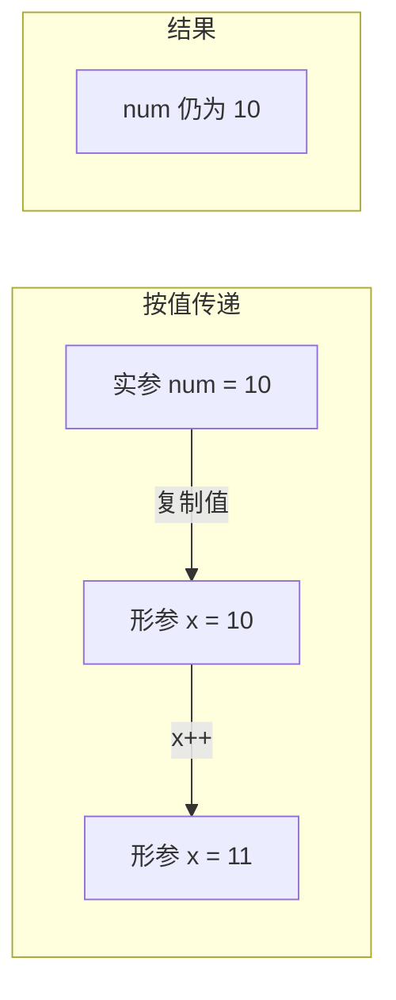
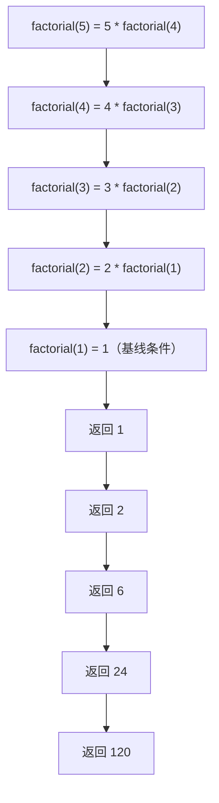

# 第 7 章：函数——C++ 的编程模块

> **本章目标**: 深入理解 C++ 函数的定义、调用、参数传递机制，掌握函数指针和递归函数的使用，系统学习函数的各个方面，并建立良好的函数设计习惯。

---

## 7.1 函数基础

### 7.1.1 函数的构成

函数是 C++ 程序的基本构建块。一个完整的函数由以下部分组成：

```cpp
返回类型 函数名(参数列表)  // 函数头
{                          // 函数体开始
    语句序列;              // 函数体
    return 返回值;         // 返回值语句
}                          // 函数体结束
```

**各部分详解**：

1. **返回类型（Return Type）**：指定函数返回值的类型。可以是：
   - 基本类型：`int`、`double`、`char` 等
   - 复合类型：`string`、`vector`、结构体、类等
   - `void`：表示不返回任何值
   - 指针或引用类型：`int*`、`int&` 等
   - `auto`（C++14）：让编译器自动推断返回类型

2. **函数名（Function Name）**：遵循标识符命名规则，应准确描述函数的功能

3. **参数列表（Parameter List）**：可以为空，包含多个参数时用逗号分隔。每个参数必须指定类型和名称

4. **函数体（Function Body）**：包含具体逻辑的代码块，用花括号括起来

5. **return 语句**：
   - 有返回值的函数必须有 `return` 语句
   - `void` 函数可以没有 `return`，或使用 `return;` 提前退出

```cpp
// 各种返回类型的函数示例
#include <iostream>
#include <string>
#include <vector>
using namespace std;

// void 函数：不返回值
void printSeparator() {
    cout << "====================" << endl;
}

// void 函数提前返回
void checkPositive(int x) {
    if (x <= 0) {
        cout << "不是正数，提前退出" << endl;
        return;  // 提前退出
    }
    cout << "正数: " << x << endl;
}

// 返回基本类型
int max(int a, int b) {
    return (a > b) ? a : b;
}

// 返回复合类型
string createGreeting(const string& name) {
    return "Hello, " + name + "!";
}

int main() {
    printSeparator();
    checkPositive(5);
    checkPositive(-3);
    cout << max(10, 20) << endl;
    cout << createGreeting("Alice") << endl;
    return 0;
}
```

### 7.1.2 函数三要素：声明、定义、调用

**函数生命周期三阶段**：
1. **声明（原型）**：告诉编译器函数的存在和接口
2. **定义（实现）**：提供函数的具体逻辑
3. **调用（使用）**：执行函数

```cpp
#include <iostream>
using namespace std;

// 函数原型（声明）——告诉编译器函数的存在
double circleArea(double radius);

int main() {
    // 函数调用——使用函数
    double area = circleArea(5.0);
    cout << "半径为 5 的圆面积: " << area << endl;
    return 0;
}

// 函数定义（实现）——提供函数的具体逻辑
double circleArea(double radius) {
    const double PI = 3.14159;
    return PI * radius * radius;
}
```

**为什么需要函数声明？**
- C++ 编译器按顺序编译代码，调用函数时编译器需要知道函数的接口
- 如果没有提前看到函数定义，编译器不知道参数类型和返回类型
- 函数声明让编译器可以进行**类型检查**，确保调用正确

**函数声明的省略**：如果函数定义在首次调用之前，可以省略声明：

```cpp
// 定义在调用之前，不需要单独声明
double circleArea(double radius) {
    const double PI = 3.14159;
    return PI * radius * radius;
}

int main() {
    cout << circleArea(5.0) << endl;  // OK：编译器已经看到定义
    return 0;
}
```

### 7.1.3 函数的类型分类

| 分类 | 说明 | 示例 |
|------|------|------|
| 有返回值 | 执行后返回一个值 | `int max(int a, int b)` |
| 无返回值（void） | 仅执行操作，不返回值 | `void printHello()` |
| 有参数 | 接受输入 | `int add(int a, int b)` |
| 无参数 | 不接受输入 | `int getRandom()` |
| 重载函数 | 同名不同参数 | `void print(int)` / `void print(double)` |
| 内联函数 | 建议编译器内联展开 | `inline int cube(int x)` |
| 递归函数 | 调用自身 | `int factorial(int n)` |
| 模板函数 | 泛型编程 | `template<T> T max(T a, T b)` |
| Lambda 表达式 | 匿名函数 | `auto f = [](int x){ return x*x; };` |

### 7.1.4 初学者常见问题

**问题 1：忘记函数声明导致编译错误**

```cpp
#include <iostream>
using namespace std;

int main() {
    cout << doubleValue(5) << endl;  // ❌ 编译错误：doubleValue 未声明
    return 0;
}

int doubleValue(int x) {
    return x * 2;
}
```

**解决方案**：确保在调用前有声明或定义。

**问题 2：函数声明和定义不匹配**

```cpp
// 声明
double calculate(int x);

// 定义——类型不匹配！
int calculate(int x) {  // ❌ 返回类型不同
    return x * 2;
}
```

**解决方案**：声明和定义必须完全一致。

**问题 3：遗漏 return 语句**

```cpp
int getValue() {
    int x = 42;
    // ❌ 没有 return 语句！未定义行为
}

// 编译器可能警告，但仍然能编译通过
// 实际运行时返回的是栈上的随机值！
```

**问题 4：函数参数顺序错误**

```cpp
void divide(int a, int b) {
    cout << a / b << endl;
}

int main() {
    divide(2, 10);  // ❌ 逻辑错误：2/10 = 0，不是 10/2 = 5
    return 0;
}
```

### 7.1.5 函数的默认参数

```cpp
#include <iostream>
using namespace std;

// 默认参数：从右向左设置
void display(const string& name, int age = 18, double height = 170.0);

int main() {
    display("Alice");                    // 使用全部默认
    display("Bob", 25);                  // 指定 age，height 使用默认
    display("Charlie", 30, 180.5);       // 全部指定
    // display("David", , 165.0);        // ❌ 不能跳过参数
    return 0;
}

void display(const string& name, int age, double height) {
    cout << name << ", " << age << "岁, " << height << "cm" << endl;
}
```

**默认参数规则**：
- 默认参数必须从最右边的参数开始依次设置
- 声明中提供默认值，定义中不要重复（否则导致编译错误）
- 默认参数可以是常量、全局变量或函数调用（每次调用时求值）

### 7.1.6 函数重载入门

**函数重载**：同一作用域内多个函数同名，但参数列表不同（参数个数、类型或顺序不同）。

```cpp
#include <iostream>
using namespace std;

// 三个重载的 print 函数
void print(int x) {
    cout << "整数: " << x << endl;
}

void print(double x) {
    cout << "浮点数: " << x << endl;
}

void print(const string& s) {
    cout << "字符串: " << s << endl;
}

int main() {
    print(42);           // 调用 print(int)
    print(3.14);         // 调用 print(double)
    print("Hello");      // 调用 print(const string&)
    return 0;
}
```

---

## 7.2 函数参数传递

### 7.2.1 按值传递（Pass by Value）

**按值传递**是 C++ 默认的参数传递方式。调用时，实参的值被复制到形参，函数内部对形参的修改不影响实参。

```cpp
#include <iostream>
using namespace std;

void increment(int x) {   // x 是形参，接收实参的副本
    x++;                  // 修改副本
    cout << "函数内: x = " << x << endl;  // x = 11
}

int main() {
    int num = 10;
    increment(num);       // 传递 num 的副本
    cout << "函数外: num = " << num << endl;  // num = 10（没变）
    return 0;
}
```



#### 按值传递的更多示例

**示例 1：交换函数（失败版）**

```cpp
#include <iostream>
using namespace std;

// ❌ 这个交换不会生效！
void swapFailed(int a, int b) {
    int temp = a;
    a = b;
    b = temp;
    cout << "函数内: a = " << a << ", b = " << b << endl;
}

int main() {
    int x = 1, y = 2;
    cout << "交换前: x = " << x << ", y = " << y << endl;
    swapFailed(x, y);
    cout << "交换后: x = " << x << ", y = " << y << endl;  // 没变！
    return 0;
}
```

**示例 2：按值传递大型对象——性能问题**

```cpp
#include <iostream>
#include <string>
#include <vector>
using namespace std;

// ❌ 低效：按值传递整个 vector（复制所有元素）
double averageValue(vector<int> v) {  // 复制整个 vector！
    double sum = 0;
    for (int x : v) sum += x;
    return sum / v.size();
}

int main() {
    vector<int> data(1000000, 42);  // 100 万个元素
    // ❌ 调用时复制了 100 万个 int！巨大性能开销
    cout << averageValue(data) << endl;
    return 0;
}
```

**示例 3：按值传递对基本类型是高效的**

```cpp
#include <iostream>
using namespace std;

// 基本类型按值传递效率高（复制一个 int 很快）
bool isEven(int n) {
    return n % 2 == 0;
}

// 多个基本类型参数
double calculateBMI(double weight, double height) {
    return weight / (height * height);
}

int main() {
    cout << isEven(10) << endl;                // 1 (true)
    cout << calculateBMI(70.0, 1.75) << endl;  // 22.86
    return 0;
}
```

**示例 4：按值传递截断问题**

```cpp
#include <iostream>
using namespace std;

void setValue(int x) {
    cout << "接收到: " << x << endl;
}

int main() {
    double d = 3.14159;
    setValue(d);          // double 被截断为 int：输出 3
    // 编译器可能会给出警告：精度丢失
    return 0;
}
```

### 7.2.2 按指针传递（Pass by Pointer）

传递变量的地址，函数通过指针访问和修改原数据：

```cpp
#include <iostream>
using namespace std;

void increment(int* p) {  // 接收地址
    (*p)++;                // 通过解引用修改原值
    cout << "函数内: *p = " << *p << endl;
}

int main() {
    int num = 10;
    increment(&num);       // 传递地址
    cout << "函数外: num = " << num << endl;  // num = 11
    return 0;
}
```

**示例 1：成功的交换函数（指针版）**

```cpp
#include <iostream>
using namespace std;

void swapPtr(int* a, int* b) {
    int temp = *a;
    *a = *b;
    *b = temp;
}

int main() {
    int x = 1, y = 2;
    cout << "交换前: x = " << x << ", y = " << y << endl;
    swapPtr(&x, &y);  // 传递地址
    cout << "交换后: x = " << x << ", y = " << y << endl;  // 成功交换
    return 0;
}
```

**示例 2：通过指针输出多个结果**

```cpp
#include <iostream>
using namespace std;

// 计算一个数的平方和立方，通过指针"返回"两个结果
void computeSquareAndCube(int n, int* square, int* cube) {
    *square = n * n;
    *cube = n * n * n;
}

int main() {
    int sq, cb;
    computeSquareAndCube(5, &sq, &cb);
    cout << "5 的平方 = " << sq << ", 立方 = " << cb << endl;
    return 0;
}
```

**示例 3：指针参数可为空（nullptr）**

```cpp
#include <iostream>
using namespace std;

// 指针参数可以是 nullptr，表示"无数据"
void safePrint(const int* p) {
    if (p == nullptr) {
        cout << "指针为空，无法打印" << endl;
        return;
    }
    cout << "值: " << *p << endl;
}

int main() {
    int x = 42;
    safePrint(&x);       // 值: 42
    safePrint(nullptr);  // 指针为空，无法打印
    return 0;
}
```

**示例 4：指针和数组**

```cpp
#include <iostream>
using namespace std;

void fillArray(int* arr, int size, int value) {
    for (int i = 0; i < size; i++) {
        arr[i] = value;  // 等价于 *(arr + i) = value
    }
}

// 函数中修改字符串内容
void toUpper(char* str) {
    while (*str != '\0') {
        if (*str >= 'a' && *str <= 'z') {
            *str = *str - 'a' + 'A';
        }
        str++;  // 移动到下一个字符
    }
}

int main() {
    int numbers[5];
    fillArray(numbers, 5, 99);
    for (int n : numbers) cout << n << " ";  // 99 99 99 99 99
    cout << endl;

    char msg[] = "hello";
    toUpper(msg);
    cout << msg << endl;  // HELLO
    return 0;
}
```

### 7.2.3 按引用传递（Pass by Reference）

引用是 C++ 特有的一种传递方式，形参是实参的别名：

```cpp
#include <iostream>
using namespace std;

void increment(int& x) {  // x 是实参的引用（别名）
    x++;                   // 直接修改原值
    cout << "函数内: x = " << x << endl;
}

int main() {
    int num = 10;
    increment(num);        // 直接传变量（不需要取地址）
    cout << "函数外: num = " << num << endl;  // num = 11
    return 0;
}
```

**示例 1：成功的交换函数（引用版——最简洁）**

```cpp
#include <iostream>
using namespace std;

void swapRef(int& a, int& b) {  // a 和 b 是实参的引用
    int temp = a;
    a = b;
    b = temp;
}

int main() {
    int x = 1, y = 2;
    cout << "交换前: x = " << x << ", y = " << y << endl;
    swapRef(x, y);  // 直接传变量
    cout << "交换后: x = " << x << ", y = " << y << endl;  // 成功交换
    return 0;
}
```

**示例 2：引用可以避免复制大对象**

```cpp
#include <iostream>
#include <string>
#include <vector>
using namespace std;

// ✅ 高效：引用传递避免复制
double averageRef(const vector<int>& v) {  // const 引用，不复制
    double sum = 0;
    for (int x : v) sum += x;
    return sum / v.size();
}

int main() {
    vector<int> data(1000000, 42);
    // ✅ 不会复制，高效！
    cout << averageRef(data) << endl;
    return 0;
}
```

**示例 3：引用返回多个"返回值"**

```cpp
#include <iostream>
using namespace std;

// 用引用参数实现多返回值
void splitTime(int totalSeconds, int& hours, int& minutes, int& seconds) {
    hours = totalSeconds / 3600;
    totalSeconds %= 3600;
    minutes = totalSeconds / 60;
    seconds = totalSeconds % 60;
}

int main() {
    int h, m, s;
    splitTime(3661, h, m, s);
    cout << "3661 秒 = " << h << "小时 " << m << "分钟 " << s << "秒" << endl;
    // 输出：3661 秒 = 1小时 1分钟 1秒
    return 0;
}
```

**示例 4：引用必须绑定到合法对象**

```cpp
#include <iostream>
using namespace std;

void process(int& x) {
    x *= 2;
}

int main() {
    // process(10);     // ❌ 编译错误：不能将引用绑定到字面量
    // process(nullptr); // ❌ 编译错误：引用不能为空
    
    int value = 10;
    process(value);      // ✅ 正确：绑定到变量
    cout << value << endl;  // 20
    return 0;
}
```

### 7.2.4 三种传递方式对比

```mermaid
flowchart TD
    subgraph 按值传递
        A1["实参 num=10"] -->|复制| B1["形参 x=10(独立副本)"]
        B1 -->|x++| C1["形参 x=11"]
        C1 -.->|不影响| D1["实参 num=10"]
    end
    
    subgraph 按指针传递
        A2["实参 num=10"] -->|传递地址&num| B2["形参 p 指向 num"]
        B2 -->|(*p)++| C2["解引用修改原值"]
        C2 -->|影响| D2["实参 num=11"]
    end
    
    subgraph 按引用传递
        A3["实参 num=10"] -->|绑定别名| B3["形参 x 是 num 的别名"]
        B3 -->|x++| C3["直接修改原值"]
        C3 -->|影响| D3["实参 num=11"]
    end
```

**完整对比表格**：

| 特性 | 按值传递 | 按指针传递 | 按引用传递 |
|------|---------|-----------|-----------|
| 语法声明 | `void f(int x)` | `void f(int* p)` | `void f(int& x)` |
| 调用方式 | `f(num)` | `f(&num)` | `f(num)` |
| 传递内容 | 值的副本 | 地址值 | 别名绑定 |
| 修改原值 | 不能 | 能（需解引用） | 能（直接） |
| 空值支持 | — | 支持（nullptr） | 不支持 |
| 重新绑定 | — | 支持（p = &other） | 不支持（绑定后不可改） |
| 复制开销 | 大对象时高 | 低（仅地址） | 低（编译器实现） |
| 语法简洁性 | 简洁 | 较繁琐（* 和 &） | 简洁 |
| 安全性 | 最安全 | 较危险（空指针、野指针） | 安全（必有对象） |
| 适用场景 | 基本类型、小对象 | 需要空值、C 兼容 | 大对象、修改原值 |

> **C++ 官方建议**：优先使用引用传递，除非需要处理空值或需要重新绑定。
> 对于基本类型（int、char、double、bool 等），按值传递通常效率最高。

### 7.2.5 const 引用参数

**为什么要用 const 引用？**
- 避免复制大对象的开销
- 同时保证函数不会修改数据
- 可以接受字面量和临时对象

```cpp
#include <iostream>
#include <string>
#include <vector>
using namespace std;

struct Student {
    string name;
    int age;
    double score;
};

// ❌ 低效：复制整个结构体
void printStudentByValue(Student s) {
    cout << s.name << ", " << s.age << endl;
}

// ✅ 高效且安全：const 引用
void printStudent(const Student& s) {
    cout << s.name << ", " << s.age << ", " << s.score << endl;
    // s.name = "xxx";   // ❌ 编译错误：const 禁止修改
}

int main() {
    Student alice = {"Alice", 20, 95.5};
    printStudent(alice);     // 正常使用
    printStudent({"Bob", 22, 88.0});  // ✅ const 引用可以绑定临时对象
    return 0;
}
```

#### const 引用可以延长临时对象的生命周期

```cpp
#include <iostream>
#include <string>
using namespace std;

string createMessage() {
    return "Hello, World!";
}

void display(const string& msg) {
    cout << msg << endl;
}

int main() {
    // const 引用延长了临时 string 的生命周期
    // 临时对象本应在表达式结束时销毁，但因为绑定了 const 引用，生命周期延长到引用消失
    const string& ref = createMessage();
    cout << ref << endl;  // ✅ 正确：临时对象还在
    
    // ❌ 非 const 引用不能绑定临时对象
    // string& bad = createMessage();  // 编译错误！
    
    // 函数参数中的 const 引用也能接受临时对象
    display(createMessage());  // ✅ OK
    display("直接传字面量");    // ✅ OK：创建临时 string 对象
    return 0;
}
```

#### const 引用的详细规则

```cpp
#include <iostream>
#include <string>
using namespace std;

void demo() {
    int a = 10;
    const int& r1 = a;     // ✅ 绑定到普通变量（可以，但不能通过 r1 修改）
    // r1 = 20;            // ❌ 编译错误
    a = 20;                // ✅ 可以通过原变量修改
    cout << r1 << endl;    // 20
    
    const int& r2 = 30;    // ✅ 绑定到字面量（创建临时对象）
    // int& r3 = 30;       // ❌ 普通引用不能绑定到字面量
    
    double d = 3.14;
    const int& r4 = d;     // ✅ 类型转换时创建临时对象
    // r4 绑定到临时 int 对象（值为 3），不绑定到 d
    d = 6.28;
    cout << r4 << endl;    // 3（不变！因为 r4 不绑定到 d）
}

int main() {
    demo();
    return 0;
}
```

**选择指南**：

```cpp
// 基本类型（int, char, double, bool 等）→ 按值传递
void func(int x);
void func(double d);

// 大对象（string, vector, 结构体, 类等）→ const 引用
void func(const string& s);
void func(const vector<int>& v);

// 需要修改原值 → 非 const 引用
void swap(int& a, int& b);
void sort(vector<int>& v);

// 需要空值选项 → 指针
void func(const int* p = nullptr);

// 移动语义（C++11）→ 右值引用
void func(vector<int>&& v);
```

### 7.2.6 std::ref 和 std::cref

C++11 引入了 `std::ref` 和 `std::cref`，用于在需要按值传递的场景中强制使用引用语义。

```cpp
#include <iostream>
#include <functional>  // std::ref, std::cref
#include <thread>
using namespace std;

void increment(int& x) {
    x++;
}

int main() {
    int num = 10;
    
    // 场景：std::thread 的参数默认按值传递
    // thread t(increment, num);      // ❌ 按值传递，num 不会改变
    
    // 使用 std::ref 强制按引用传递
    thread t(increment, ref(num));    // ✅ 按引用传递
    t.join();
    cout << num << endl;              // 11
    
    // std::cref 用于 const 引用
    // thread t2(someFunc, cref(data));
    
    return 0;
}
```

**std::bind 中的使用**：

```cpp
#include <iostream>
#include <functional>
using namespace std;

void setValue(int& x, int val) {
    x = val;
}

int main() {
    int x = 0;
    
    // std::bind 默认按值传递
    // auto f = bind(setValue, x, 42);  // ❌ x 不会改变
    
    // 使用 std::ref
    auto f = bind(setValue, ref(x), 42);
    f();
    cout << x << endl;  // 42
    return 0;
}
```

### 7.2.7 右值引用参数（C++11）

```cpp
#include <iostream>
#include <string>
#include <vector>
using namespace std;

// 右值引用参数：接受"将亡值"，实现移动语义
void process(vector<int>&& data) {
    cout << "处理 " << data.size() << " 个元素" << endl;
    // 可以"窃取" data 的资源
}

int main() {
    // 接受临时对象（右值）
    process({1, 2, 3, 4, 5});  // ✅ 临时对象
    
    vector<int> v = {1, 2, 3};
    // process(v);              // ❌ 左值不能绑定到右值引用
    process(move(v));           // ✅ 用 move 转换为右值
    return 0;
}
```

---

## 7.3 函数与数组

### 7.3.1 数组参数的本质——指针退化

在 C++ 中，数组作为函数参数时会退化为指针。这是从 C 语言继承而来的特性。

```cpp
// 这三种声明完全等价——数组参数退化为指针！
int sum(int arr[], int size);       // arr 被当作指针
int sum(int* arr, int size);        // 指针形式（编译器实际理解的形式）
int sum(int arr[10], int size);     // 10 被完全忽略！

// 所以必须显式传递数组大小
int sum(int arr[], int size) {
    int total = 0;
    for (int i = 0; i < size; i++) {
        total += arr[i];   // 等价于 *(arr + i)
    }
    return total;
}
```

**验证指针退化**：

```cpp
#include <iostream>
using namespace std;

void checkArray(int arr[]) {
    cout << "函数内 sizeof(arr) = " << sizeof(arr) << " 字节" << endl;
    // 在 64 位系统上输出 8（指针大小）
}

int main() {
    int arr[10] = {0};
    cout << "函数外 sizeof(arr) = " << sizeof(arr) << " 字节" << endl;
    // 输出 40（10 * 4 字节）
    
    checkArray(arr);  // 输出 8（指针大小，不是数组大小）
    return 0;
}
```

> **警告**：在函数内使用 `sizeof(arr)` 计算数组大小是常见陷阱！`arr` 已退化为指针，`sizeof` 返回指针大小（8 字节），不是数组大小。

### 7.3.2 关于 sizeof 的陷阱案例

**陷阱 1：误用 sizeof 计算数组大小**

```cpp
#include <iostream>
using namespace std;

// ❌ 错误：试图在函数内计算数组大小
void clearArray(int arr[]) {
    // int size = sizeof(arr) / sizeof(arr[0]);  // 错误！sizeof(arr) = 8
    // 正确做法：显式传递大小参数
}

void clearArrayCorrect(int arr[], int size) {
    for (int i = 0; i < size; i++) {
        arr[i] = 0;
    }
}
```

**陷阱 2：以为指定大小会限制参数**

```cpp
void process(int arr[10]) {  // 10 被忽略！实际上接受任意大小的数组
    // arr 仍然是指针
}

int main() {
    int small[3] = {1, 2, 3};
    int large[100] = {0};
    process(small);  // ✅ 编译通过！没有边界检查
    process(large);  // ✅ 编译通过！
    return 0;
}
```

**陷阱 3：二维数组的 sizeof**

```cpp
#include <iostream>
using namespace std;

void process2D(int matrix[][4], int rows) {
    // sizeof(matrix) = 8（指针大小）
    // sizeof(matrix[0]) = 16（一行 4 个 int）
    cout << "行大小: " << sizeof(matrix[0]) << " 字节" << endl;  // 16
}

int main() {
    int arr[3][4] = {{0}};
    cout << "总大小: " << sizeof(arr) << " 字节" << endl;  // 48
    cout << "行数: " << sizeof(arr) / sizeof(arr[0]) << endl;  // 3
    process2D(arr, 3);
    return 0;
}
```

### 7.3.3 数组参数的 const 用法

```cpp
#include <iostream>
using namespace std;

// 只读访问（不修改数组）——const 保护
int sum(const int arr[], int size) {
    int total = 0;
    for (int i = 0; i < size; i++) {
        total += arr[i];
        // arr[i] = 0;  // ❌ 编译错误：const 保护
    }
    return total;
}

// 读写访问（修改数组）
void fill(int arr[], int size, int value) {
    for (int i = 0; i < size; i++) {
        arr[i] = value;
    }
}

int main() {
    int arr[] = {1, 2, 3, 4, 5};
    int s = sum(arr, 5);    // const int*：承诺不修改
    fill(arr, 5, 0);        // int*：可以修改
    return 0;
}
```

### 7.3.4 多维数组参数

#### 二维数组作为参数

```cpp
#include <iostream>
using namespace std;

// 二维数组参数：除了第一维，其他维度必须指定
void fill(int matrix[][4], int rows);        // 列数必须为 4
void fill(int (*matrix)[4], int rows);       // 指针数组形式（等价）

void fill(int matrix[][4], int rows) {
    for (int r = 0; r < rows; r++) {
        for (int c = 0; c < 4; c++) {
            matrix[r][c] = r * 4 + c;        // 设置值
        }
    }
}

// 打印二维数组
void print(int matrix[][4], int rows) {
    for (int r = 0; r < rows; r++) {
        for (int c = 0; c < 4; c++) {
            cout << matrix[r][c] << "\t";
        }
        cout << endl;
    }
}

int main() {
    int data[3][4] = {{0}};
    fill(data, 3);
    print(data, 3);
    // 输出：
    // 0   1   2   3
    // 4   5   6   7
    // 8   9   10  11
    return 0;
}
```

#### 三维数组作为参数

```cpp
#include <iostream>
using namespace std;

// 三维数组：除第一维外，其他维度必须指定
void init3D(int arr[][4][5], int depth) {
    for (int i = 0; i < depth; i++) {
        for (int j = 0; j < 4; j++) {
            for (int k = 0; k < 5; k++) {
                arr[i][j][k] = i * 20 + j * 5 + k;
            }
        }
    }
}

void print3D(int arr[][4][5], int depth) {
    for (int i = 0; i < depth; i++) {
        cout << "第 " << i << " 层:" << endl;
        for (int j = 0; j < 4; j++) {
            for (int k = 0; k < 5; k++) {
                cout << arr[i][j][k] << "\t";
            }
            cout << endl;
        }
        cout << endl;
    }
}

int main() {
    int cube[3][4][5] = {{{0}}};
    init3D(cube, 3);
    print3D(cube, 3);
    return 0;
}
```

#### 处理不规则二维数组（指针数组方式）

```cpp
#include <iostream>
using namespace std;

// 传递指针数组：每行长度可以不同
void printJagged(int* arr[], int sizes[], int rows) {
    for (int r = 0; r < rows; r++) {
        for (int c = 0; c < sizes[r]; c++) {
            cout << arr[r][c] << " ";
        }
        cout << endl;
    }
}

int main() {
    // 不规则数组：每行长度不同
    int row0[] = {1, 2};
    int row1[] = {3, 4, 5};
    int row2[] = {6, 7, 8, 9};
    
    int* jagged[] = {row0, row1, row2};
    int sizes[] = {2, 3, 4};
    
    printJagged(jagged, sizes, 3);
    // 输出：
    // 1 2
    // 3 4 5
    // 6 7 8 9
    return 0;
}
```

### 7.3.5 数组指针 vs 指针数组

**数组指针（Pointer to Array）**：指向整个数组的指针
**指针数组（Array of Pointers）**：元素为指针的数组

```cpp
#include <iostream>
using namespace std;

int main() {
    int arr[5] = {1, 2, 3, 4, 5};
    
    // 数组指针：指向含 5 个 int 的数组
    int (*parr)[5] = &arr;      // 括号必须！
    cout << "数组指针: " << (*parr)[0] << endl;  // 1
    
    // 指针数组：含 5 个 int* 元素的数组
    int* parr2[5];               // 无括号
    for (int i = 0; i < 5; i++) {
        parr2[i] = &arr[i];     // 每个元素指向 arr 的不同元素
    }
    cout << "指针数组: " << *parr2[0] << endl;  // 1
    
    // 函数参数中的区别
    // void func(int (*p)[5]);   // 参数是数组指针——指向含 5 个 int 的数组
    // void func(int* p[5]);     // 参数是指针数组——5 个 int 指针
    
    return 0;
}
```

### 7.3.6 使用 std::array 和 std::vector 作为参数（现代 C++ 方式）

```cpp
#include <iostream>
#include <array>
#include <vector>
using namespace std;

// std::array：固定大小，不退化！
void processArray(const array<int, 5>& arr) {
    for (int x : arr) {
        cout << x << " ";
    }
    cout << endl;
    cout << "大小: " << arr.size() << endl;  // 5，不会退化！
}

// std::vector：动态大小，推荐使用
double average(const vector<double>& v) {
    if (v.empty()) return 0.0;
    double sum = 0;
    for (double x : v) sum += x;
    return sum / v.size();
}

int main() {
    array<int, 5> arr = {10, 20, 30, 40, 50};
    processArray(arr);
    
    vector<double> data = {1.5, 2.5, 3.5, 4.5};
    cout << "平均值: " << average(data) << endl;  // 3.0
    return 0;
}
```

### 7.3.7 使用指针区间

**指针区间**是 C++ 中一种优雅的数组遍历方式，使用起始指针和结束指针定义区间。

STL 风格的**半开区间** `[begin, end)`：
- `begin` 指向第一个元素
- `end` 指向最后一个元素的**下一个位置**

```cpp
#include <iostream>
using namespace std;

// 使用起始指针和结束指针定义区间
int sum(const int* begin, const int* end) {
    int total = 0;
    while (begin != end) {
        total += *begin;  // 累加当前元素
        ++begin;          // 移到下一个
    }
    return total;
}

int main() {
    int arr[] = {1, 2, 3, 4, 5};
    int total = sum(arr, arr + 5);  // 区间 [arr, arr+5)
    cout << "总和: " << total << endl;  // 15
    return 0;
}
```

**更丰富的指针区间示例**：

```cpp
#include <iostream>
using namespace std;

// 打印区间内容
void print(const int* begin, const int* end) {
    cout << "[";
    while (begin != end) {
        cout << *begin;
        ++begin;
        if (begin != end) cout << ", ";
    }
    cout << "]" << endl;
}

// 在区间中查找值
const int* find(const int* begin, const int* end, int target) {
    while (begin != end) {
        if (*begin == target) return begin;
        ++begin;
    }
    return end;  // 未找到，返回 end
}

// 对区间元素求和（可用指针算术）
int sumRange(const int* begin, const int* end) {
    int total = 0;
    for (const int* p = begin; p != end; p++) {
        total += *p;
    }
    return total;
}

// 计算区间中正数的个数
int countPositive(const int* begin, const int* end) {
    int count = 0;
    while (begin != end) {
        if (*begin > 0) count++;
        begin++;
    }
    return count;
}

// 复制区间
void copyRange(const int* srcBegin, const int* srcEnd, int* destBegin) {
    while (srcBegin != srcEnd) {
        *destBegin = *srcBegin;
        destBegin++;
        srcBegin++;
    }
}

int main() {
    int arr[] = {-3, 1, 4, -1, 5, 9, -2, 6};
    int size = sizeof(arr) / sizeof(arr[0]);
    
    // 打印整个数组
    cout << "数组: ";
    print(arr, arr + size);
    
    // 打印子区间
    cout << "前 3 个元素: ";
    print(arr, arr + 3);
    
    // 打印中间的元素
    cout << "第 3-6 个元素: ";
    print(arr + 2, arr + 6);
    
    // 查找
    const int* found = find(arr, arr + size, 5);
    if (found != arr + size) {
        cout << "找到 5，位置: " << (found - arr) << endl;
    }
    
    // 正数个数
    cout << "正数个数: " << countPositive(arr, arr + size) << endl;
    
    // 拷贝
    int dest[8] = {0};
    copyRange(arr, arr + size, dest);
    cout << "拷贝: ";
    print(dest, dest + size);
    
    return 0;
}
```

**用指针区间实现各种算法**：

```cpp
#include <iostream>
#include <algorithm>  // std::sort, std::find 等
using namespace std;

// 用指针区间实现冒泡排序
void bubbleSort(int* begin, int* end) {
    int size = end - begin;
    for (int i = 0; i < size - 1; i++) {
        for (int* p = begin; p < end - 1 - i; p++) {
            if (*p > *(p + 1)) {
                swap(*p, *(p + 1));
            }
        }
    }
}

// 用指针区间实现线性查找（泛型版本）
template<typename T>
const T* linearFind(const T* begin, const T* end, const T& value) {
    for (const T* p = begin; p != end; ++p) {
        if (*p == value) return p;
    }
    return end;
}

// 用指针区间检查是否所有元素都满足条件
bool allPositive(const int* begin, const int* end) {
    for (const int* p = begin; p != end; ++p) {
        if (*p <= 0) return false;
    }
    return true;
}

// 用指针区间实现反转
void reverse(int* begin, int* end) {
    end--;  // 指向最后一个元素
    while (begin < end) {
        swap(*begin, *end);
        begin++;
        end--;
    }
}

int main() {
    int arr[] = {5, 2, 8, 1, 9, 3, 7, 4, 6};
    int size = sizeof(arr) / sizeof(arr[0]);
    
    bubbleSort(arr, arr + size);
    cout << "排序后: ";
    for (int x : arr) cout << x << " ";
    cout << endl;
    
    reverse(arr, arr + size);
    cout << "反转后: ";
    for (int x : arr) cout << x << " ";
    cout << endl;
    
    int val = 5;
    const int* r = linearFind(arr, arr + size, val);
    if (r != arr + size) {
        cout << "找到了 " << val << endl;
    }
    
    cout << "全部正数: " << boolalpha << allPositive(arr, arr + size) << endl;
    
    return 0;
}
```

---

## 7.4 函数与结构体

### 7.4.1 传递结构体

```cpp
#include <iostream>
#include <string>
using namespace std;

struct Rectangle {
    double length;
    double width;
};

// 按值传递（复制整个结构体，适合小型结构体）
double areaByValue(Rectangle r) {
    return r.length * r.width;
}

// 按指针传递
double areaByPtr(const Rectangle* r) {
    return r->length * r->width;  // -> 是成员访问运算符
}

// 按引用传递（推荐，不复制）
double areaByRef(const Rectangle& r) {
    return r.length * r.width;
}

int main() {
    Rectangle rect = {5.0, 3.0};
    
    cout << "按值: " << areaByValue(rect) << " (复制)" << endl;
    cout << "指针: " << areaByPtr(&rect) << " (地址)" << endl;
    cout << "引用: " << areaByRef(rect) << " (别名)" << endl;
    
    return 0;
}
```

### 7.4.2 修改结构体的函数

```cpp
#include <iostream>
#include <string>
using namespace std;

struct Point {
    double x;
    double y;
};

// 通过引用修改结构体
void move(Point& p, double dx, double dy) {
    p.x += dx;
    p.y += dy;
}

// 通过指针修改结构体
void scale(Point* p, double factor) {
    p->x *= factor;
    p->y *= factor;
}

// 通过指针修改（含空值检查）
void reset(Point* p) {
    if (p == nullptr) return;
    p->x = 0;
    p->y = 0;
}

int main() {
    Point pt = {3.0, 4.0};
    
    cout << "原始: (" << pt.x << ", " << pt.y << ")" << endl;
    
    move(pt, 1.0, 2.0);
    cout << "移动后: (" << pt.x << ", " << pt.y << ")" << endl;
    
    scale(&pt, 2.0);
    cout << "缩放后: (" << pt.x << ", " << pt.y << ")" << endl;
    
    reset(&pt);
    cout << "重置后: (" << pt.x << ", " << pt.y << ")" << endl;
    
    return 0;
}
```

### 7.4.3 返回结构体

```cpp
#include <iostream>
#include <string>
using namespace std;

struct Student {
    string name;
    int age;
    double score;
};

// 返回结构体（可以返回多个值）
Student createStudent(const string& name, int age, double score) {
    Student s;
    s.name = name;
    s.age = age;
    s.score = score;
    return s;           // 返回整个结构体（可能发生复制或 RVO 优化）
}

// 使用初始化列表返回
Student makeDefault() {
    return {"Unknown", 18, 0.0};  // C++11 统一初始化
}

// 返回结构体指针（注意不要返回局部变量的指针！）
Student* createBad() {
    Student s = {"Bad", 20, 100};
    return &s;  // ❌ s 是局部变量，函数结束时销毁！
}

int main() {
    Student s1 = createStudent("Alice", 20, 95.5);
    Student s2 = makeDefault();
    
    cout << s1.name << ", " << s1.age << "岁, " << s1.score << "分" << endl;
    cout << s2.name << ", " << s2.age << "岁, " << s2.score << "分" << endl;
    
    return 0;
}
```

### 7.4.4 返回 const 引用

```cpp
#include <iostream>
#include <string>
using namespace std;

// 返回 const 引用避免了复制，但必须确保原对象存在
const string& getLonger(const string& a, const string& b) {
    if (a.size() >= b.size()) {
        return a;
    }
    return b;
}

// ❌ 错误：返回局部变量的引用
const string& getMessage() {
    string msg = "Hello";
    return msg;  // msg 在函数结束时销毁！
}

int main() {
    string s1 = "Hello";
    string s2 = "World!!!";
    
    const string& longer = getLonger(s1, s2);
    cout << "更长的字符串: " << longer << endl;
    
    // const string& msg = getMessage();  // ❌ 悬垂引用
    // cout << msg << endl;  // 未定义行为！
    
    return 0;
}
```

### 7.4.5 结构体的嵌套与复杂处理

```cpp
#include <iostream>
#include <string>
#include <vector>
using namespace std;

struct Address {
    string city;
    string street;
    int zipCode;
};

struct Employee {
    string name;
    int id;
    Address address;    // 嵌套结构体
    vector<string> skills;
};

// 打印员工信息（const 引用）
void printEmployee(const Employee& emp) {
    cout << "姓名: " << emp.name << endl;
    cout << "ID: " << emp.id << endl;
    cout << "地址: " << emp.address.city << ", " 
         << emp.address.street << ", " << emp.address.zipCode << endl;
    cout << "技能: ";
    for (const string& skill : emp.skills) {
        cout << skill << " ";
    }
    cout << endl;
}

// 添加技能（修改结构体）
void addSkill(Employee& emp, const string& skill) {
    emp.skills.push_back(skill);
}

int main() {
    Employee alice = {
        "Alice",
        1001,
        {"北京", "中关村大街", 100080},
        {"C++", "Python"}
    };
    
    printEmployee(alice);
    addSkill(alice, "Java");
    cout << "--- 添加技能后 ---" << endl;
    printEmployee(alice);
    
    return 0;
}
```

### 7.4.6 结构体 vs 类的参数传递对比

```cpp
#include <iostream>
#include <string>
using namespace std;

// 结构体
struct Point {
    double x, y;
};

// 类
class Circle {
private:
    Point center;
    double radius;
    
public:
    Circle(double cx, double cy, double r) : center{cx, cy}, radius(r) {}
    
    double getRadius() const { return radius; }
    Point getCenter() const { return center; }
    double area() const { return 3.14159 * radius * radius; }
};

// 结构体参数传递
double distance(const Point& a, const Point& b) {
    double dx = a.x - b.x;
    double dy = a.y - b.y;
    return sqrt(dx * dx + dy * dy);
}

// 类对象参数传递
void printCircleInfo(const Circle& c) {
    Point p = c.getCenter();
    cout << "圆心: (" << p.x << ", " << p.y << "), 半径: " << c.getRadius()
         << ", 面积: " << c.area() << endl;
}

int main() {
    Point p1 = {0, 0};
    Point p2 = {3, 4};
    cout << "距离: " << distance(p1, p2) << endl;  // 5
    
    Circle c(0, 0, 5);
    printCircleInfo(c);
    
    return 0;
}
```

**结构体 vs 类传参对比**：

| 特性 | 结构体传参 | 类传参 |
|------|-----------|--------|
| 默认访问权限 | public | private |
| 拷贝方式 | 相同（逐成员复制） | 相同（逐成员复制） |
| 引用传递 | 相同（推荐 const&） | 相同（推荐 const&） |
| 修改原值 | 引用/指针 | 引用/指针（只能通过公有接口） |
| 封装性 | 无封装（直接访问成员） | 有封装（通过接口访问） |
| 适用场景 | 简单数据集合 | 有行为和不变量的对象 |

---

## 7.5 递归函数

### 7.5.1 递归的基本概念

**递归**：函数直接或间接调用自身。

**递归的两个要素**：
1. **基线条件（Base Case）**：停止递归的条件，不再调用自身
2. **递归步骤（Recursive Step）**：向基线条件推进，每次调用都更接近基线条件



### 7.5.2 示例：阶乘

```cpp
#include <iostream>
using namespace std;

long long factorial(int n) {
    if (n <= 1) return 1;           // 基线条件
    return n * factorial(n - 1);    // 递归步骤
}

int main() {
    for (int i = 0; i <= 10; i++) {
        cout << i << "! = " << factorial(i) << endl;
    }
    return 0;
}
```

**调用过程追踪**：
```
factorial(5) = 5 * factorial(4)
            = 5 * 4 * factorial(3)
            = 5 * 4 * 3 * factorial(2)
            = 5 * 4 * 3 * 2 * factorial(1)
            = 5 * 4 * 3 * 2 * 1
            = 120
```

### 7.5.3 示例：斐波那契数列

```cpp
#include <iostream>
using namespace std;

// 递归版本（简单但低效）
int fib(int n) {
    if (n <= 1) return n;            // 基线条件: fib(0)=0, fib(1)=1
    return fib(n - 1) + fib(n - 2);  // 递归步骤
}

// 递归版本调用树：
// fib(5) = fib(4) + fib(3)
//       = (fib(3)+fib(2)) + (fib(2)+fib(1))
//       = ((fib(2)+fib(1))+(fib(1)+fib(0))) + ((fib(1)+fib(0))+1)
//       = ...
// 结果: 5

// 记忆化递归（高效）
int fibMemo(int n, int memo[]) {
    if (n <= 1) return n;
    if (memo[n] != -1) return memo[n];  // 已计算过，直接返回
    memo[n] = fibMemo(n - 1, memo) + fibMemo(n - 2, memo);
    return memo[n];
}

int fibWrapper(int n) {
    int* memo = new int[n + 1];
    for (int i = 0; i <= n; i++) memo[i] = -1;
    int result = fibMemo(n, memo);
    delete[] memo;
    return result;
}

// 迭代版本（最高效）
int fibIter(int n) {
    if (n <= 1) return n;
    int a = 0, b = 1;
    for (int i = 2; i <= n; i++) {
        int c = a + b;
        a = b;
        b = c;
    }
    return b;
}

int main() {
    cout << "fib(10) = " << fib(10) << endl;        // 55
    cout << "fibMemo(40) = " << fibWrapper(40) << endl;  // 102334155
    cout << "fibIter(40) = " << fibIter(40) << endl;     // 102334155
    return 0;
}
```

### 7.5.4 汉诺塔（Tower of Hanoi）

汉诺塔是经典的递归问题：将 n 个盘子从源柱移动到目标柱，每次只能移动一个盘子，大盘不能在小盘上面。

```cpp
#include <iostream>
using namespace std;

// 将 n 个盘子从 src 移到 dest，借助 aux
void hanoi(int n, char src, char dest, char aux) {
    if (n == 1) {
        // 基线条件：直接移动一个盘子
        cout << "移动盘子 1 从 " << src << " 到 " << dest << endl;
        return;
    }
    // 将 n-1 个盘子从 src 移到 aux（借助 dest）
    hanoi(n - 1, src, aux, dest);
    // 移动最大的盘子
    cout << "移动盘子 " << n << " 从 " << src << " 到 " << dest << endl;
    // 将 n-1 个盘子从 aux 移到 dest（借助 src）
    hanoi(n - 1, aux, dest, src);
}

int main() {
    cout << "3 个盘子的汉诺塔解法:" << endl;
    hanoi(3, 'A', 'C', 'B');
    // 输出（共 7 步）：
    // 移动盘子 1 从 A 到 C
    // 移动盘子 2 从 A 到 B
    // 移动盘子 1 从 C 到 B
    // 移动盘子 3 从 A 到 C
    // 移动盘子 1 从 B 到 A
    // 移动盘子 2 从 B 到 C
    // 移动盘子 1 从 A 到 C
    return 0;
}
```

**汉诺塔的移动次数**：`move(n) = 2^n - 1`
- 3 个盘子：7 步
- 5 个盘子：31 步
- 10 个盘子：1023 步
- 64 个盘子：约 1844 亿亿步

### 7.5.5 二叉树遍历

```cpp
#include <iostream>
using namespace std;

struct TreeNode {
    int value;
    TreeNode* left;
    TreeNode* right;
    
    TreeNode(int val) : value(val), left(nullptr), right(nullptr) {}
};

// 前序遍历：根 -> 左 -> 右
void preorder(TreeNode* node) {
    if (node == nullptr) return;  // 基线条件
    cout << node->value << " ";   // 访问根
    preorder(node->left);         // 遍历左子树
    preorder(node->right);        // 遍历右子树
}

// 中序遍历：左 -> 根 -> 右
void inorder(TreeNode* node) {
    if (node == nullptr) return;
    inorder(node->left);
    cout << node->value << " ";
    inorder(node->right);
}

// 后序遍历：左 -> 右 -> 根
void postorder(TreeNode* node) {
    if (node == nullptr) return;
    postorder(node->left);
    postorder(node->right);
    cout << node->value << " ";
}

// 计算树的高度
int treeHeight(TreeNode* node) {
    if (node == nullptr) return 0;
    int leftHeight = treeHeight(node->left);
    int rightHeight = treeHeight(node->right);
    return 1 + max(leftHeight, rightHeight);
}

// 计算节点总数
int countNodes(TreeNode* node) {
    if (node == nullptr) return 0;
    return 1 + countNodes(node->left) + countNodes(node->right);
}

int main() {
    // 构建一棵简单的二叉树
    //       1
    //      / \
    //     2   3
    //    / \
    //   4   5
    TreeNode* root = new TreeNode(1);
    root->left = new TreeNode(2);
    root->right = new TreeNode(3);
    root->left->left = new TreeNode(4);
    root->left->right = new TreeNode(5);
    
    cout << "前序遍历: ";
    preorder(root);    // 1 2 4 5 3
    cout << endl;
    
    cout << "中序遍历: ";
    inorder(root);     // 4 2 5 1 3
    cout << endl;
    
    cout << "后序遍历: ";
    postorder(root);   // 4 5 2 3 1
    cout << endl;
    
    cout << "树的高度: " << treeHeight(root) << endl;  // 3
    cout << "节点总数: " << countNodes(root) << endl;    // 5
    
    // 清理内存（略）
    return 0;
}
```

### 7.5.6 快速排序

```cpp
#include <iostream>
#include <algorithm>
using namespace std;

// 分区函数：选择基准，将数组分为小于基准和大于基准两部分
int partition(int arr[], int low, int high) {
    int pivot = arr[high];  // 选择最后一个元素作为基准
    int i = low - 1;        // i 指向小于基准的最后一个元素
    
    for (int j = low; j < high; j++) {
        if (arr[j] <= pivot) {
            i++;
            swap(arr[i], arr[j]);
        }
    }
    swap(arr[i + 1], arr[high]);  // 将基准放到正确位置
    return i + 1;  // 返回基准的最终位置
}

// 递归快速排序
void quickSort(int arr[], int low, int high) {
    if (low < high) {
        int pi = partition(arr, low, high);  // 分区
        quickSort(arr, low, pi - 1);         // 排序左半部分
        quickSort(arr, pi + 1, high);        // 排序右半部分
    }
}

// 另一种更简洁的实现
void quickSortSimple(int arr[], int left, int right) {
    if (left >= right) return;  // 基线条件
    
    int pivot = arr[(left + right) / 2];  // 选择中间元素为基准
    int i = left, j = right;
    
    while (i <= j) {
        while (arr[i] < pivot) i++;
        while (arr[j] > pivot) j--;
        if (i <= j) {
            swap(arr[i], arr[j]);
            i++;
            j--;
        }
    }
    
    // 递归排序两个子区间
    if (left < j) quickSortSimple(arr, left, j);
    if (i < right) quickSortSimple(arr, i, right);
}

int main() {
    int arr[] = {10, 7, 8, 9, 1, 5};
    int n = sizeof(arr) / sizeof(arr[0]);
    
    quickSort(arr, 0, n - 1);
    cout << "快速排序结果: ";
    for (int x : arr) cout << x << " ";
    cout << endl;
    
    return 0;
}
```

### 7.5.7 递归 vs 迭代的详细性能对比

```cpp
#include <iostream>
#include <chrono>
using namespace std;
using namespace chrono;

// 递归阶乘
long long factRecursive(int n) {
    if (n <= 1) return 1;
    return n * factRecursive(n - 1);
}

// 迭代阶乘
long long factIterative(int n) {
    long long result = 1;
    for (int i = 2; i <= n; i++) {
        result *= i;
    }
    return result;
}

// 递归斐波那契（指数级复杂度）
int fibRecursive(int n) {
    if (n <= 1) return n;
    return fibRecursive(n - 1) + fibRecursive(n - 2);
}

// 迭代斐波那契（线性复杂度）
int fibIterative(int n) {
    if (n <= 1) return n;
    int a = 0, b = 1;
    for (int i = 2; i <= n; i++) {
        int c = a + b;
        a = b;
        b = c;
    }
    return b;
}

int main() {
    // 测试阶乘
    auto start = high_resolution_clock::now();
    cout << "factRecursive(20) = " << factRecursive(20) << endl;
    auto end = high_resolution_clock::now();
    auto recTime = duration_cast<nanoseconds>(end - start).count();
    
    start = high_resolution_clock::now();
    cout << "factIterative(20) = " << factIterative(20) << endl;
    end = high_resolution_clock::now();
    auto iterTime = duration_cast<nanoseconds>(end - start).count();
    
    cout << "递归耗时: " << recTime << " ns" << endl;
    cout << "迭代耗时: " << iterTime << " ns" << endl;
    
    // 测试斐波那契（注意不要用递归算 fib(40) 以上——太慢）
    cout << "\nfibRecursive(35) = " << fibRecursive(35) << endl;
    cout << "fibIterative(35) = " << fibIterative(35) << endl;
    
    return 0;
}
```

**性能对比数据**：

| 函数 | 递归 | 迭代 | 说明 |
|------|------|------|------|
| factorial(20) | ~500 ns | ~200 ns | 迭代快约 2-3 倍 |
| fib(30) | ~15 ms | ~200 ns | 迭代快约 75000 倍 |
| fib(40) | ~1.8 秒 | ~200 ns | 迭代快约 900 万倍 |
| fib(50) | 几年 | ~300 ns | 递归完全不可用 |
| 树遍历 | 简洁 | 复杂 | 递归更自然 |
| 汉诺塔 | 简洁 | 复杂 | 递归几乎是唯一选择 |

### 7.5.8 尾递归优化

**尾递归**：递归调用是函数的最后一个操作，返回值直接返回。

```cpp
#include <iostream>
using namespace std;

// 非尾递归阶乘
long long fact1(int n) {
    if (n <= 1) return 1;
    return n * fact1(n - 1);  // 递归后还有乘法操作
}

// 尾递归阶乘（使用累加器）
long long factTail(int n, long long accumulator = 1) {
    if (n <= 1) return accumulator;
    return factTail(n - 1, n * accumulator);  // 直接返回递归结果
}

int main() {
    cout << "factTail(20) = " << factTail(20) << endl;
    return 0;
}
```

### 7.5.9 递归的优缺点总结

| 优点 | 缺点 |
|------|------|
| 代码简洁、优雅、易读 | 调用开销大（函数调用、栈帧） |
| 适合具有递归结构的问题（树、图） | 可能导致栈溢出 |
| 逻辑清晰，接近数学定义 | 可能效率极低（重复计算） |
| 某些问题天然适合递归（汉诺塔） | 调试困难 |
| 分治算法实现简单（快排、归并） | 深度受限 |

---

## 7.6 函数指针

### 7.6.1 函数指针的概念

**函数也有地址**！函数存储在内存中，函数指针存储函数的入口地址，可以通过它间接调用函数。

```cpp
#include <iostream>
using namespace std;

// 声明一个函数
double calculate(double x, double y);

// 声明一个函数指针
double (*pf)(double, double);  // 指向"两个double参数、返回double"的函数

// 赋值
pf = calculate;          // 函数名就是地址
// pf = &calculate;      // 取地址符也可（可选）

// 通过函数指针调用
double result = pf(3.0, 4.0);     // 方式1：直接调用
double result = (*pf)(3.0, 4.0);  // 方式2：解引用后调用（两者等价）
```

**函数指针声明分解**：
```cpp
double (*pf)(double, double);
// ^      ^^    ^^^^^^  ^^^^^^
// |      ||    参数类型
// |      |函数指针名
// 返回类型
```

> **警告**：括号是必须的！`double *pf(double, double)` 是返回 `double*` 的函数，不是函数指针！

### 7.6.2 函数指针的完整示例

```cpp
#include <iostream>
using namespace std;

double add(double a, double b) { return a + b; }
double subtract(double a, double b) { return a - b; }
double multiply(double a, double b) { return a * b; }
double divide(double a, double b) { 
    if (b == 0) return 0;
    return a / b; 
}

int main() {
    double (*op)(double, double) = add;
    cout << "add(10, 5) = " << op(10, 5) << endl;
    
    op = multiply;
    cout << "multiply(10, 5) = " << op(10, 5) << endl;
    
    // 使用 typedef 简化
    typedef double (*MathOp)(double, double);
    MathOp ops[] = {add, subtract, multiply, divide};
    
    double a = 20, b = 4;
    const char* names[] = {"加", "减", "乘", "除"};
    for (int i = 0; i < 4; i++) {
        cout << a << " " << names[i] << " " << b << " = " << ops[i](a, b) << endl;
    }
    
    return 0;
}
```

### 7.6.3 函数指针数组

```cpp
#include <iostream>
using namespace std;

double add(double, double) { return 0; }
double subtract(double, double) { return 0; }
double multiply(double, double) { return 0; }

int main() {
    double (*funcs[3])(double, double) = {add, subtract, multiply};
    
    for (int i = 0; i < 3; i++) {
        cout << funcs[i](10.0, 5.0) << endl;
    }
    
    // 用 typedef 简化
    typedef double (*FuncPtr)(double, double);
    FuncPtr fpArray[3] = {add, subtract, multiply};
    
    // 用 using（C++11）
    using FuncPtr2 = double(*)(double, double);
    FuncPtr2 fpArray2[3] = {add, subtract, multiply};
    
    return 0;
}
```

### 7.6.4 函数指针作为参数（回调函数）

```cpp
#include <iostream>
using namespace std;

double add(double x, double y) { return x + y; }
double multiply(double x, double y) { return x * y; }
double power(double x, double y) { 
    double r = 1;
    for (int i = 0; i < y; i++) r *= x;
    return r;
}
double max(double x, double y) { return (x > y) ? x : y; }
double min(double x, double y) { return (x < y) ? x : y; }

double operate(double a, double b, double (*op)(double, double)) {
    cout << "操作: " << a << " 和 " << b << " -> ";
    return op(a, b);
}

int main() {
    cout << operate(3.0, 4.0, add) << endl;        // 7
    cout << operate(3.0, 4.0, multiply) << endl;   // 12
    cout << operate(3.0, 4.0, power) << endl;      // 81
    cout << operate(3.0, 4.0, max) << endl;        // 4
    cout << operate(3.0, 4.0, min) << endl;        // 3
    return 0;
}
```

### 7.6.5 回调函数的完整示例（排序）

```cpp
#include <iostream>
#include <cstdlib>
#include <cstring>
using namespace std;

int compareIntAsc(const void* a, const void* b) {
    int ia = *(const int*)a;
    int ib = *(const int*)b;
    return ia - ib;
}

int compareIntDesc(const void* a, const void* b) {
    int ia = *(const int*)a;
    int ib = *(const int*)b;
    return ib - ia;
}

int compareAbs(const void* a, const void* b) {
    int ia = abs(*(const int*)a);
    int ib = abs(*(const int*)b);
    return ia - ib;
}

int compareStringLen(const void* a, const void* b) {
    const char* sa = *(const char**)a;
    const char* sb = *(const char**)b;
    return strlen(sa) - strlen(sb);
}

void printIntArray(int arr[], int size) {
    for (int i = 0; i < size; i++) cout << arr[i] << " ";
    cout << endl;
}

void printStringArray(const char* arr[], int size) {
    for (int i = 0; i < size; i++) cout << arr[i] << " ";
    cout << endl;
}

int main() {
    int arr[] = {5, -2, 8, -1, 9, 3, -7, 4, 6};
    int size = sizeof(arr) / sizeof(arr[0]);
    
    cout << "原始数组: "; printIntArray(arr, size);
    
    qsort(arr, size, sizeof(int), compareIntAsc);
    cout << "升序: "; printIntArray(arr, size);
    
    qsort(arr, size, sizeof(int), compareIntDesc);
    cout << "降序: "; printIntArray(arr, size);
    
    qsort(arr, size, sizeof(int), compareAbs);
    cout << "绝对值升序: "; printIntArray(arr, size);
    
    const char* fruits[] = {"apple", "kiwi", "banana", "cherry", "date"};
    int fsize = sizeof(fruits) / sizeof(fruits[0]);
    cout << "\n原始水果: "; printStringArray(fruits, fsize);
    
    qsort(fruits, fsize, sizeof(const char*), compareStringLen);
    cout << "按长度排序: "; printStringArray(fruits, fsize);
    
    return 0;
}
```

### 7.6.6 函数指针 vs std::function

```cpp
#include <iostream>
#include <functional>
#include <vector>
using namespace std;

int square(int x) { return x * x; }

struct Cube {
    int operator()(int x) const { return x * x * x; }
};

int main() {
    int (*fp)(int) = square;
    cout << "函数指针: " << fp(5) << endl;
    
    function<int(int)> f1 = square;
    function<int(int)> f2 = Cube();
    function<int(int)> f3 = [](int x) { return x * x * x * x; };
    
    cout << "std::function(函数): " << f1(5) << endl;
    cout << "std::function(仿函数): " << f2(5) << endl;
    cout << "std::function(Lambda): " << f3(5) << endl;
    
    vector<function<int(int)>> callables = {f1, f2, f3};
    for (auto& f : callables) cout << f(3) << " ";
    cout << endl;
    
    return 0;
}
```

**函数指针 vs std::function 对比**：

| 特性 | 函数指针 | std::function |
|------|---------|---------------|
| 语法简洁性 | 繁琐 | 简洁 |
| 支持普通函数 | 是 | 是 |
| 支持函数对象 | 否 | 是 |
| 支持 Lambda | 否 | 是 |
| 支持 bind 表达式 | 否 | 是 |
| 性能 | 零开销 | 有小开销（类型擦除） |
| 适用场景 | C 兼容、简单回调 | 现代 C++、灵活回调 |

### 7.6.7 函数指针的实际工业应用案例

**应用 1：菜单驱动系统**

```cpp
#include <iostream>
#include <map>
using namespace std;

void newFile() { cout << "新建文件" << endl; }
void openFile() { cout << "打开文件" << endl; }
void saveFile() { cout << "保存文件" << endl; }
void exitApp() { cout << "退出程序" << endl; }

int main() {
    using MenuHandler = void(*)();
    map<int, MenuHandler> menu;
    
    menu[1] = newFile;
    menu[2] = openFile;
    menu[3] = saveFile;
    menu[4] = exitApp;
    
    int choice;
    do {
        cout << "\n=== 菜单 ===" << endl;
        cout << "1. 新建" << endl;
        cout << "2. 打开" << endl;
        cout << "3. 保存" << endl;
        cout << "4. 退出" << endl;
        cout << "请选择: ";
        cin >> choice;
        
        auto it = menu.find(choice);
        if (it != menu.end()) it->second();
    } while (choice != 4);
    
    return 0;
}
```

### 7.6.8 使用 auto 和现代 C++ 简化

```cpp
#include <iostream>
#include <functional>
using namespace std;

double add(double a, double b) { return a + b; }

int main() {
    auto pf = add;
    cout << pf(3.0, 4.0) << endl;
    
    using MathOp = double(*)(double, double);
    MathOp op = add;
    
    function<double(double, double)> f = add;
    cout << f(3.0, 4.0) << endl;
    
    auto multiply = [](double a, double b) { return a * b; };
    cout << multiply(3.0, 4.0) << endl;
    
    return 0;
}
```

---

## 7.7 函数的设计原则

### 7.7.1 单一职责原则

**一个函数只做一件事**。

```cpp
#include <iostream>
#include <string>
#include <vector>
using namespace std;

// ❌ 不好的设计：一个函数做了太多事
void processEmployeeDataBad(const string& name, int age, double salary) {
    if (name.empty()) { cout << "名字不能为空" << endl; return; }
    if (age < 0 || age > 150) { cout << "年龄不合法" << endl; return; }
    if (salary < 0) { cout << "薪资不能为负" << endl; return; }
    double tax = salary * 0.2;
    double bonus = salary * 0.1;
    double netSalary = salary - tax + bonus;
    cout << "姓名: " << name << " 实发: " << netSalary << endl;
    cout << "正在保存到数据库..." << endl;
}

// ✅ 好的设计：职责分离
bool validateName(const string& name) {
    return !name.empty() && name.length() <= 100;
}
bool validateAge(int age) { return age >= 0 && age <= 150; }
bool validateSalary(double salary) { return salary >= 0; }
double calculateTax(double salary) { return salary * 0.2; }
double calculateBonus(double salary) { return salary * 0.1; }
double calculateNetSalary(double salary) {
    return salary - calculateTax(salary) + calculateBonus(salary);
}
void printSalarySlip(const string& name, double salary) {
    cout << name << " 实发: " << calculateNetSalary(salary) << endl;
}
```

### 7.7.2 函数命名规范

```cpp
// ❌ 不好的命名
void f(int a, int b);
void calc();
int doStuff(int x);
void handleIt(const string& s);

// ✅ 好的命名
int calculateSum(int a, int b);
double getAverage(const vector<double>& data);
bool isValidEmail(const string& email);
void printErrorMessage(const string& msg);
string formatDate(int year, int month, int day);
bool hasDuplicates(const int arr[], int size);
```

### 7.7.3 参数设计原则

```cpp
// ❌ 太多参数
void createUserBad(string name, int age, string email, string phone, 
                   string address, string city, string country, string zipCode, bool isActive);

// ✅ 使用结构体封装
struct UserInfo {
    string name, email, phone, address, city, country, zipCode;
    int age;
};
void createUser(const UserInfo& info, bool isActive = true);
```

### 7.7.4 内聚性和耦合度

```cpp
// ❌ 高耦合：函数直接操作全局变量
int globalState = 0;
void incrementGlobal() { globalState++; }

// ✅ 低耦合：通过参数传递数据
int increment(int value) { return value + 1; }

// ❌ 有副作用：修改全局变量
int callCount = 0;
int calculateBad(int x) { callCount++; return x * x; }

// ✅ 无副作用（纯函数）
int calculatePure(int x) { return x * x; }
```

### 7.7.5 错误处理策略

```cpp
#include <iostream>
#include <optional>
#include <stdexcept>
using namespace std;

// 策略1：返回错误码
int divide1(int a, int b, int& result) {
    if (b == 0) return -1;
    result = a / b;
    return 0;
}

// 策略2：抛出异常
int divide2(int a, int b) {
    if (b == 0) throw invalid_argument("除数不能为 0");
    return a / b;
}

// 策略3：optional（C++17）
optional<int> divide3(int a, int b) {
    if (b == 0) return nullopt;
    return a / b;
}
```

---

## 7.8 函数的性能

### 7.8.1 函数调用开销

函数调用涉及：栈帧创建、参数传递、控制转移、栈帧销毁、返回值传递。

```cpp
#include <iostream>
#include <chrono>
using namespace std;
using namespace chrono;

int square(int x) { return x * x; }

inline int squareInline(int x) { return x * x; }

int main() {
    const int N = 10000000;
    
    auto start = high_resolution_clock::now();
    volatile int sum1 = 0;
    for (int i = 0; i < N; i++) sum1 += square(i);
    auto t1 = duration_cast<milliseconds>(high_resolution_clock::now() - start).count();
    
    start = high_resolution_clock::now();
    volatile int sum2 = 0;
    for (int i = 0; i < N; i++) sum2 += squareInline(i);
    auto t2 = duration_cast<milliseconds>(high_resolution_clock::now() - start).count();
    
    cout << "函数调用: " << t1 << "ms, inline: " << t2 << "ms" << endl;
    
    return 0;
}
```

### 7.8.2 传参性能优化建议

| 传递方式 | 性能 | 适用场景 |
|---------|------|---------|
| 按值传递（基本类型） | 最佳 | int, char, double, bool, 指针 |
| 按值传递（大对象） | 差 | 避免使用 |
| const 引用 | 最佳 | string, vector, 结构体, 类 |
| 引用 | 好 | 需要修改原值 |
| 指针 | 好 | 需要空值或重新绑定 |

---

## 7.9 常见函数错误与调试

### 7.9.1 编译错误

**错误 1：函数声明和定义不匹配**

```cpp
double calculate(int x);
int calculate(int x) { return x * 2; }  // 返回类型不同！
```

**错误 2：参数类型不匹配**

```cpp
void process(int x, double y);
int main() { process(3.14, 10); }  // 参数顺序错误
```

**错误 3：重复定义**

```cpp
// 头文件中定义函数，被多个 cpp 包含导致链接错误
void print() { cout << "Hello"; }
```

### 7.9.2 运行时错误

**错误 4：返回局部变量的引用或指针**

```cpp
int& getLocalRef() { int x = 42; return x; }  // 悬垂引用！
int* getLocalPtr() { int x = 42; return &x; }  // 悬垂指针！
```

**错误 5：数组参数误用 sizeof**

```cpp
void processArray(int arr[]) {
    int size = sizeof(arr) / sizeof(arr[0]);  // 错误！arr 是指针
}
```

**错误 6：除零错误**

```cpp
double divide(int a, int b) { return a / b; }  // b=0 时崩溃
```

**错误 7：递归没有基线条件**

```cpp
void infiniteRecursion() { infiniteRecursion(); }  // 栈溢出
```

**错误 8：空指针解引用**

```cpp
int getValue(int* p) { return *p; }  // p=nullptr 时崩溃
```

### 7.9.3 逻辑错误

**错误 9：按值传递期望修改原值**

```cpp
void swap(int a, int b) { int t = a; a = b; b = t; }  // 不会生效
```

**错误 10：忘记处理返回值**

```cpp
bool readData(int& value);
int x;
readData(x);  // 忽略返回值，x 可能未初始化
```

### 7.9.4 调试技巧

```cpp
#include <cassert>
using namespace std;

int divide(int a, int b) {
    assert(b != 0 && "除数不能为 0");
    return a / b;
}

int factorial(int n) {
    cerr << "factorial(" << n << ") 被调用" << endl;
    if (n <= 1) return 1;
    int result = n * factorial(n - 1);
    cerr << "factorial(" << n << ") 返回 " << result << endl;
    return result;
}
```

### 7.9.5 错误案例汇总

| 类别 | 错误 | 症状 | 解决 |
|------|------|------|------|
| 编译 | 声明/定义不匹配 | 编译失败 | 保持一致 |
| 编译 | 参数类型不匹配 | 编译失败或精度丢失 | 修正类型 |
| 编译 | 重复定义 | 链接错误 | 头文件只声明 |
| 运行时 | 返回局部引用 | 段错误/垃圾值 | 返回值或动态分配 |
| 运行时 | sizeof 数组参数 | 大小计算错误 | 显式传递大小 |
| 运行时 | 除零 | 程序崩溃 | 检查除数 |
| 运行时 | 无限递归 | 栈溢出 | 检查基线条件 |
| 运行时 | 空指针解引用 | 段错误 | 检查 nullptr |
| 逻辑 | 值传递期望修改 | 数据不变 | 改为引用/指针 |
| 逻辑 | 忽视返回值 | 未定义行为 | 检查返回值 |

---

## 7.10 main 函数的参数

### 7.10.1 argc 和 argv

```cpp
int main(int argc, char* argv[]) {
    // argc：参数个数（包括程序名）
    // argv：参数字符串数组
    return 0;
}
```

**完整示例**：

```cpp
#include <iostream>
using namespace std;

int main(int argc, char* argv[]) {
    cout << "argc = " << argc << endl;
    cout << "程序名: " << argv[0] << endl;
    
    for (int i = 0; i < argc; i++) {
        cout << "argv[" << i << "] = " << argv[i] << endl;
    }
    return 0;
}
```

### 7.10.2 实用命令行处理示例

```cpp
#include <iostream>
#include <string>
#include <cstring>
using namespace std;

void printUsage(const char* progName) {
    cout << "用法: " << progName << " [选项]" << endl;
    cout << "  -h, --help     显示帮助" << endl;
    cout << "  -v, --version  显示版本" << endl;
    cout << "  -n <名字>      指定名字" << endl;
    cout << "  -a <年龄>      指定年龄" << endl;
}

int main(int argc, char* argv[]) {
    string name;
    int age = 0;
    
    for (int i = 1; i < argc; i++) {
        if (strcmp(argv[i], "-h") == 0 || strcmp(argv[i], "--help") == 0) {
            printUsage(argv[0]); return 0;
        } else if (strcmp(argv[i], "-v") == 0 || strcmp(argv[i], "--version") == 0) {
            cout << "版本 1.0.0" << endl; return 0;
        } else if (strcmp(argv[i], "-n") == 0 && i + 1 < argc) {
            name = argv[++i];
        } else if (strcmp(argv[i], "-a") == 0 && i + 1 < argc) {
            age = stoi(argv[++i]);
        } else {
            cerr << "未知选项: " << argv[i] << endl;
            printUsage(argv[0]); return 1;
        }
    }
    
    cout << "名字: " << (name.empty() ? "未指定" : name) << endl;
    cout << "年龄: " << (age == 0 ? "未指定" : to_string(age)) << endl;
    return 0;
}
```

---

## 7.11 动手练习

### 练习 1：判断素数

编写函数判断整数是否为素数。

```cpp
bool isPrime(int n) {
    if (n <= 1) return false;
    if (n <= 3) return true;
    if (n % 2 == 0 || n % 3 == 0) return false;
    for (int i = 5; i * i <= n; i += 6) {
        if (n % i == 0 || n % (i + 2) == 0) return false;
    }
    return true;
}
```

### 练习 2：最大公约数

用欧几里得算法计算最大公约数，实现递归和迭代版本。

```cpp
int gcdRecursive(int a, int b) {
    if (b == 0) return a;
    return gcdRecursive(b, a % b);
}

int gcdIterative(int a, int b) {
    while (b != 0) { int temp = b; b = a % b; a = temp; }
    return a;
}
```

### 练习 3：字符串反转

原地反转 C 风格字符串。

```cpp
void reverseString(char str[]) {
    int len = 0;
    while (str[len] != '\0') len++;
    for (int i = 0; i < len / 2; i++) {
        char temp = str[i];
        str[i] = str[len - 1 - i];
        str[len - 1 - i] = temp;
    }
}
```

### 练习 4：数组排序（函数指针）

实现通用排序函数，接受函数指针作为比较器。

```cpp
bool ascending(int a, int b) { return a > b; }
bool descending(int a, int b) { return a < b; }

void sort(int arr[], int size, bool (*compare)(int, int)) {
    for (int i = 0; i < size - 1; i++) {
        for (int j = 0; j < size - 1 - i; j++) {
            if (compare(arr[j], arr[j + 1])) swap(arr[j], arr[j + 1]);
        }
    }
}
```

### 练习 5：统计字符

统计字符串中字母、数字、空格和其他字符的个数（引用参数返回结果）。

### 练习 6：n 以内所有完数

完数是指所有真因子之和等于它本身的数。打印 n 以内的所有完数。

### 练习 7：杨辉三角

用递归方式计算杨辉三角中第 n 行第 k 个数的值。

```cpp
int pascal(int row, int col) {
    if (col == 0 || col == row) return 1;
    return pascal(row - 1, col - 1) + pascal(row - 1, col);
}
```

### 练习 8：递归实现全排列

输出给定数组的所有排列方式。

### 练习 9：二分查找

在有序数组中用递归和迭代实现二分查找。

### 练习 10：函数指针实现策略模式

用函数指针实现不同折扣策略（无折扣、9折、满减等）。

```cpp
double noDiscount(double price) { return price; }
double tenPercentOff(double price) { return price * 0.9; }
double calculatePrice(double price, double (*strategy)(double)) {
    return strategy(price);
}
```

### 练习 11：回文检查

递归判断字符串是否为回文。

### 练习 12：函数指针实现计算器

用函数指针数组实现完整四则运算计算器，支持连续运算。

---

## 7.12 综合案例

### 7.12.1 用函数指针实现策略模式

```cpp
#include <iostream>
#include <vector>
#include <functional>
using namespace std;

using PriceStrategy = function<double(double)>;

PriceStrategy noDiscount = [](double price) { return price; };
PriceStrategy studentDiscount = [](double price) { return price * 0.8; };
PriceStrategy vipDiscount = [](double price) { return price * 0.7; };

struct Product { string name; double price; };

class ShoppingCart {
private:
    vector<Product> items;
    PriceStrategy strategy;
public:
    ShoppingCart(PriceStrategy s = noDiscount) : strategy(s) {}
    void setStrategy(PriceStrategy s) { strategy = s; }
    void addItem(const Product& item) { items.push_back(item); }
    double calculateTotal() const {
        double total = 0;
        for (const auto& item : items) total += item.price;
        return strategy(total);
    }
    void printReceipt() const {
        double total = 0;
        for (const auto& item : items) {
            cout << item.name << ": " << item.price << " 元" << endl;
            total += item.price;
        }
        cout << "原价: " << total << " 折扣后: " << strategy(total) << " 元" << endl;
    }
};

int main() {
    ShoppingCart cart;
    cart.addItem({"《C++ Primer》", 128.0});
    cart.addItem({"《Effective C++》", 68.0});
    cart.addItem({"《设计模式》", 88.0});
    
    cout << "=== 无折扣 ===" << endl; cart.printReceipt();
    cout << "\n=== 学生折扣（8折）===" << endl; cart.setStrategy(studentDiscount); cart.printReceipt();
    cout << "\n=== VIP 折扣（7折）===" << endl; cart.setStrategy(vipDiscount); cart.printReceipt();
    
    return 0;
}
```

### 7.12.2 用函数指针实现命令模式

```cpp
#include <iostream>
#include <vector>
#include <functional>
#include <stack>
using namespace std;

using Command = function<void()>;

class TextEditor {
private:
    string text;
    stack<Command> undoStack;
public:
    void insert(const string& str) {
        string oldText = text; text += str;
        undoStack.push([this, oldText]() { text = oldText; });
        cout << "插入后: " << text << endl;
    }
    void remove(int n) {
        if (n > (int)text.length()) n = text.length();
        string oldText = text;
        text = text.substr(0, text.length() - n);
        undoStack.push([this, oldText]() { text = oldText; });
        cout << "删除后: " << text << endl;
    }
    void undo() {
        if (!undoStack.empty()) { undoStack.top()(); undoStack.pop(); }
    }
    string getText() const { return text; }
};

int main() {
    TextEditor editor;
    editor.insert("Hello "); editor.insert("World!");
    cout << "\n撤销:" << endl; editor.undo(); editor.undo();
    return 0;
}
```

### 7.12.3 微积分数值计算

```cpp
#include <iostream>
#include <cmath>
#include <functional>
using namespace std;

using MathFunc = function<double(double)>;

double integrate(const MathFunc& f, double a, double b, int n = 1000) {
    double h = (b - a) / n;
    double sum = (f(a) + f(b)) / 2.0;
    for (int i = 1; i < n; i++) sum += f(a + i * h);
    return sum * h;
}

double derivative(const MathFunc& f, double x, double h = 1e-6) {
    return (f(x + h) - f(x - h)) / (2 * h);
}

int main() {
    MathFunc f1 = [](double x) { return x * x; };
    cout << "积分 x^2 [0,1]: " << integrate(f1, 0, 1) << endl;
    cout << "导数 x^2 在 x=2: " << derivative(f1, 2) << endl;
    return 0;
}
```

### 7.12.4 排序算法比较框架

```cpp
#include <iostream>
#include <chrono>
#include <functional>
#include <vector>
#include <algorithm>
using namespace std;
using namespace chrono;

using SortFunc = function<void(int[], int)>;

struct SortAlgorithm { string name; SortFunc func; };

void bubbleSort(int arr[], int n) {
    for (int i = 0; i < n - 1; i++)
        for (int j = 0; j < n - 1 - i; j++)
            if (arr[j] > arr[j + 1]) swap(arr[j], arr[j + 1]);
}

void testSort(const SortAlgorithm& algo, vector<int> data) {
    int* arr = new int[data.size()];
    copy(data.begin(), data.end(), arr);
    auto start = high_resolution_clock::now();
    algo.func(arr, data.size());
    auto t = duration_cast<microseconds>(high_resolution_clock::now() - start).count();
    bool sorted = is_sorted(arr, arr + data.size());
    cout << algo.name << ": " << t << " us, 正确: " << (sorted ? "是" : "否") << endl;
    delete[] arr;
}

int main() {
    vector<SortAlgorithm> algorithms = {
        {"冒泡排序", bubbleSort},
        {"STL sort", [](int arr[], int n) { sort(arr, arr + n); }}
    };
    vector<int> data(10000);
    srand(time(0));
    for (int& x : data) x = rand() % 100000;
    for (const auto& algo : algorithms) testSort(algo, data);
    return 0;
}
```

---

## 7.13 本章总结

| 知识点 | 说明 | 掌握要求 |
|--------|------|----------|
| 函数声明与定义 | 原型、实现、调用的区别与联系 | **熟练掌握** |
| 按值传递 | 复制参数，不影响原值 | 理解原理 |
| 按指针传递 | 通过地址访问和修改数据 | **熟练掌握** |
| 按引用传递 | C++ 风格传参，形参是实参别名 | **熟练掌握**（首选） |
| const 引用 | 高效且安全的传递方式 | **熟练掌握** |
| std::ref / std::cref | 在值传递场景中强制引用语义 | 了解 |
| 数组参数 | 指针退化的原理和陷阱 | **理解并注意** |
| 多维数组参数 | 指定除第一维外的所有维度 | 理解并使用 |
| 指针区间 | STL 风格半开区间 `[begin, end)` | 理解并使用 |
| 结构体参数 | 传递复杂数据结构 | **熟练掌握** |
| 递归函数 | 函数调用自身，要素：基线+递归 | 理解并用在合适场景 |
| 函数指针 | 存储函数地址，实现回调 | 理解概念，会使用 |
| std::function | 现代 C++ 的可调用对象包装器 | 理解并使用 |
| 函数设计原则 | 单一职责、命名规范、参数简洁 | **重要实践原则** |
| 函数性能 | inline、尾递归优化、传参选择 | 了解并应用 |
| 错误调试 | 常见错误模式及调试技巧 | **实践积累** |
| main 参数 | argc/argv 处理命令行 | 理解并使用 |
| 策略模式 | 函数指针实现算法可替换 | 理解设计理念 |

---

> 本章详细介绍了 C++ 函数的方方面面，从基本的定义调用到高级的函数指针应用，从参数传递机制到函数设计原则。函数是 C++ 程序的基本构建块，掌握好函数的使用是写出高质量代码的基础。下一章将深入探讨 C++ 函数的更多高级特性，包括内联函数、引用变量、默认参数、函数重载和函数模板等。