# 第 8 章：函数探幽

> **本章目标**: 深入学习 C++ 函数的高级特性——内联函数、引用变量、默认参数、函数重载和函数模板。这些是 C++ 区别于 C 语言的关键扩展。

---

## 8.1 内联函数（Inline Functions）

### 8.1.1 为什么需要内联函数

函数调用有开销：参数压栈、跳转、返回、栈帧恢复。对于非常小的函数（如 getter/setter），调用开销甚至可能超过函数本身的执行时间。

**内联函数**：将函数代码直接插入到调用处，消除调用开销，以空间换时间。

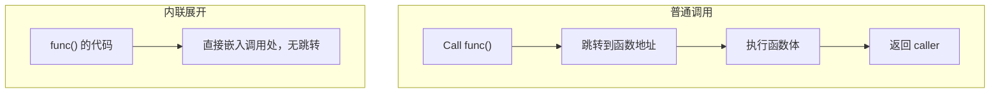

### 8.1.2 内联函数的声明

```cpp
// 使用 inline 关键字
inline double square(double x) {
    return x * x;
}

int main() {
    double result = square(5.0);  // 编译后可能被展开为: double result = 5.0 * 5.0;
    return 0;
}
```

**多个文件中的内联函数**：内联函数通常在头文件中定义（而不是声明在 .h 定义在 .cpp），因为编译器在调用处需要看到完整的函数体才能展开。

```cpp
// math_utils.h
#ifndef MATH_UTILS_H
#define MATH_UTILS_H

inline double cube(double x) {
    return x * x * x;
}

#endif
```

### 8.1.3 内联 vs 宏：深入对比

```cpp
// 宏（C 风格）—— 无类型检查
#define SQUARE(x) ((x) * (x))      // 注意：必须加括号避免运算符优先级问题
#define MAX(a, b) ((a) > (b) ? (a) : (b))
#define ABS(x) ((x) < 0 ? -(x) : (x))

// 内联函数（C++ 风格）—— 有类型检查
inline double square(double x) { return x * x; }
inline int max(int a, int b) { return a > b ? a : b; }
inline int abs(int x) { return x < 0 ? -x : x; }

int main() {
    int a = 2;
    
    // 宏的问题 1：运算符优先级
    cout << SQUARE(a + 1) << endl;  // ((a+1) * (a+1)) = 9 ✅
    // 如果不加括号: #define SQUARE(x) x*x
    // SQUARE(a+1) -> a+1*a+1 = a + a + 1 = 5 ❌ 严重错误！
    
    // 内联函数没有这个问题
    cout << square(a + 1) << endl;  // 9 ✅
    
    // 宏的问题 2：多次求值
    int arr[] = {1, 2, 3, 4, 5};
    int* p = arr;
    cout << MAX(*p++, *p++) << endl;  // ❌ 未定义行为！*p++ 被展开两次
    
    // 内联函数没有这个问题
    p = arr;
    cout << max(*p++, *p++) << endl;  // ❌ 但是这里也有问题，因为 max 的参数求值顺序未指定
    
    // 宏的问题 3：无作用域
    #define PRIVATE_MACRO(x) ((x) * 2)
    // 上面的宏在任何地方都可见，无法限制作用域
    
    // 内联函数遵守作用域规则
    {
        inline int localFunc(int x) { return x * 2; }  // 错误！inline 不能用于块作用域
    }
    
    return 0;
}
```

**宏的更多陷阱**：

```cpp
// 宏陷阱 1：分号问题
#define PRINT_MSG(msg) cout << msg
if (condition)
    PRINT_MSG("Hello");  // 展开为: if (condition) cout << "Hello";  ✅ 有分号
else
    cout << "World";

// 但如果是：
#define PRINT_MSG2(msg) cout << msg;
if (condition)
    PRINT_MSG2("Hello")  // 展开为: if (condition) cout << "Hello"; -> 空语句
else                     // ❌ else 没有匹配的 if！
    cout << "World";

// 宏陷阱 2：多次求值的性能问题
#define CALL_FUNC(x) (func(x), func(x))
int result = CALL_FUNC(value);  // func 被调用两次！

// 宏陷阱 3：无法调试
// 宏在预处理阶段展开，调试器看不到宏代码
// 内联函数在编译阶段处理，可以被调试

// 宏陷阱 4：递归宏的问题
// #define REC(n) (n > 0 ? REC(n-1) + n : 0)  // ❌ 宏不支持递归！
```

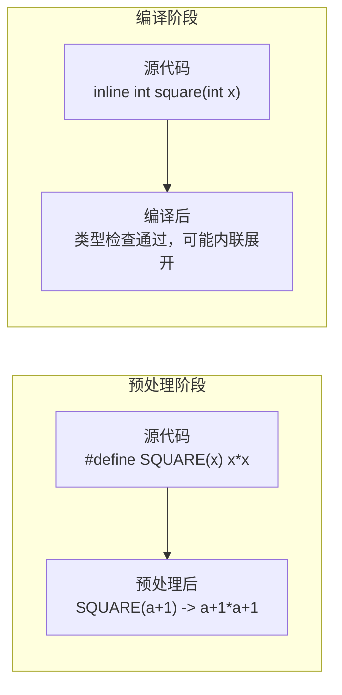

| 特性 | 宏 `#define` | 内联函数 `inline` |
|------|-------------|-------------------|
| 类型检查 | ❌ 无 | ✅ 有 |
| 副作用处理 | ❌ 多次求值 | ✅ 一次求值 |
| 调试支持 | ❌ 难调试 | ✅ 可单步（取决于编译器） |
| 作用域 | 全局文本替换 | 遵守 C++ 作用域规则 |
| 可以访问类成员 | ❌ | ✅ |
| 运算符优先级安全 | 需手动加括号 | ✅ 自动处理 |
| 支持递归 | ❌ | ✅（但不建议内联递归函数） |
| 处理阶段 | 预处理（文本替换） | 编译（语法分析后） |
| 名称空间支持 | ❌ | ✅ |

> **C++ 中优先使用 `inline` 函数而不是宏**。C++ 中宏仅适用于：头文件保护宏、条件编译（`#ifdef`）、某些跨平台代码。

### 8.1.4 编译器如何处理 inline 关键字

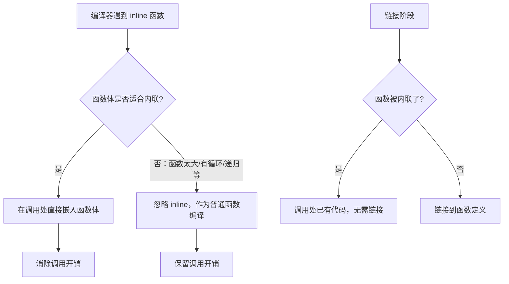

**编译器的内联决策因素**：

```cpp
// 编译器很可能内联的情况：
inline int add(int a, int b) { return a + b; }       // 1-2 条指令
inline int getValue() { return value; }               // getter
inline bool isEmpty() { return size == 0; }           // 简单条件判断

// 编译器可能拒绝内联的情况：
inline void largeFunction() {
    // 100+ 行代码
    int x = 0;
    // ... 大量代码 ...
}

inline void functionWithLoop() {
    for (int i = 0; i < 1000000; i++) {  // 大循环
        doSomething(i);
    }
}

inline int factorial(int n) {
    return n <= 1 ? 1 : n * factorial(n - 1);  // 递归，通常不内联
}

inline void functionWithSwitch() {
    switch (state) {
        case 1: /* ... */ break;
        case 2: /* ... */ break;
        // ... 大量 case ...
    }
}

inline void functionWithStatic() {
    static int counter = 0;  // 包含静态变量
    counter++;
    return counter;
}
```

**不同编译器的内联行为**：

- **GCC/Clang**: `-finline-functions` 可启用自动内联（即使没有 `inline` 关键字）；`-fno-inline` 可禁用所有内联
- **MSVC**: `__forceinline` 关键字比 `inline` 更强力（但编译器仍可能忽略）；`/Ob1` `/Ob2` 控制内联级别
- **ICC (Intel)**: 激进的内联优化，支持 `#pragma inline` 指令

```cpp
// MSVC 特定：__forceinline（比 inline 更强力，但仍有被忽略的可能）
__forceinline int fastMax(int a, int b) {
    return a > b ? a : b;
}

// GCC/Clang 特定：always_inline 属性
__attribute__((always_inline)) inline int fastMin(int a, int b) {
    return a < b ? a : b;
}
```

### 8.1.5 内联在类中的使用

```cpp
class MathUtils {
private:
    int cache;
    
public:
    // 方式 1：在类定义内定义的成员函数隐式为 inline
    int add(int a, int b) { return a + b; }  // 隐式内联
    
    // 方式 2：在类定义外显式声明 inline
    int multiply(int a, int b);
    
    // 方式 3：inline 可用于模板
    template <typename T>
    inline T max(T a, T b) { return a > b ? a : b; }
};

inline int MathUtils::multiply(int a, int b) {
    return a * b;
}

// 访问器（getter/setter）的最佳实践
class Person {
private:
    std::string name;
    int age;
    
public:
    // getter/setter 非常适合内联
    std::string getName() const { return name; }  // 隐式内联
    int getAge() const { return age; }            // 隐式内联
    
    void setName(const std::string& n) { name = n; }
    void setAge(int a) { age = a; }
};
```

### 8.1.6 内联的优缺点总结

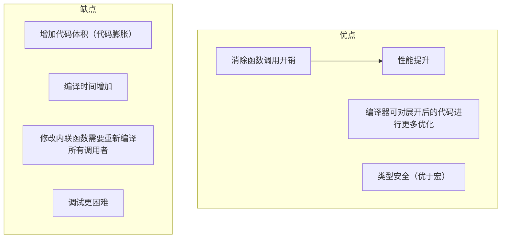

**代码膨胀示例**：

```cpp
inline void func() {
    std::cout << "This is a long message that will be duplicated everywhere" << std::endl;
}

int main() {
    func();  // 这里展开
    func();  // 这里也展开
    func();  // 这里也展开
    // 如果 func 被调用 1000 次，代码被复制 1000 份
    // 避免：将大函数放在 .cpp 中，仅小函数使用 inline
}
```

---

## 8.2 引用变量进阶

### 8.2.1 引用的本质

引用是底层使用指针实现的别名：

```cpp
int x = 10;
int& ref = x;     // ref 是 x 的引用
// 内部实现 ≈ int* const ref_ptr = &x; （底层指针）

ref = 20;         // 修改 ref 即修改 x
// 内部实现 ≈ *ref_ptr = 20;

int y = 30;
ref = y;          // 这不是让 ref 引用 y！而是将 y 的值赋给 x
// ref 一旦绑定到 x，就不能改变绑定
```

**引用 vs 指针的语法差异**：

```cpp
int x = 10, y = 20;

// 指针
int* p = &x;
p = &y;           // ✅ 指针可以重新绑定
*p = 30;          // 修改指向的对象
int** pp = &p;    // 指针的指针

// 引用
int& r = x;
// r = &y;        // ❌ 错误：不能取地址赋给引用
r = y;            // 这是赋值：将 y 的值赋给 x（不是重新绑定！）
// int&* pr;      // ❌ 错误：不存在引用的指针
int& r2 = r;      // ✅ 引用的引用可以（引用折叠为原始类型的引用）
```

### 8.2.2 左值与右值深入讲解

**基本定义**：

```cpp
// 左值（lvalue）：有持久地址、可以取地址的表达式
int x = 10;
&x;                  // ✅ 可取地址 -> 左值

// 右值（rvalue）：临时值、不能取地址的表达式
&10;                 // ❌ 不能取地址 -> 右值
&(x + 1);            // ❌ 临时结果 -> 右值
&sqrt(4.0);          // ❌ 函数返回值（非引用）-> 右值
```

**左值分类（C++11 后更精确的分类）**：

```cpp
#include <iostream>
#include <string>
#include <vector>
using namespace std;

// 左值：有身份（有地址）
// 纯右值（prvalue）：没有身份，纯临时值
// 将亡值（xvalue）：有身份但资源即将被移动

void checkCategory(const string& s) { cout << "左值或 const 左值引用" << endl; }
void checkCategory(string&& s) { cout << "右值引用" << endl; }

int main() {
    // 经典的左值
    int x = 5;              // x 是左值
    ++x;                    // ++x 是左值（返回 x 本身）
    string s = "hello";     // s 是左值
    
    // 经典的右值
    // 5;                    // 字面量是右值
    // x + 1;               // 算术表达式结果是右值
    // s + " world";        // 字符串拼接结果是右值
    // x++;                 // 后置++ 是右值（返回临时副本）
    
    string s1 = "hello", s2 = "world";
    
    checkCategory(s1);              // 左值
    checkCategory(s1 + s2);         // 右值（临时 string）
    checkCategory(move(s1));        // 右值（std::move 返回右值引用）
    checkCategory("hello");         // 右值（字符串字面量是左值？实际上 const char[6] 是左值）
    
    return 0;
}
```

**注意：字符串字面量的特殊性**：

```cpp
// 字符串字面量实际上是左值（有地址！）
const char* str = "hello";
// "hello" 存储在静态存储区，有固定地址
void* addr = (void*)"hello";  // ✅ 可取地址
```

**左值与右值判断速查表**：

| 表达式 | 类别 | 原因 |
|--------|------|------|
| `x`（变量名） | 左值 | 有地址 |
| `"hello"` | 左值 | 字符串字面量存在静态区 |
| `42` | 右值 | 字面量，无地址 |
| `x + 1` | 右值 | 临时结果 |
| `++x` | 左值 | 返回的是 x 本身 |
| `x++` | 右值 | 返回的是临时副本 |
| `a[i]` | 左值 | 数组元素有地址 |
| `&x` | 右值 | 指针是临时值 |
| `*p` | 左值 | 解引用产生对象 |
| `move(x)` | 右值 | 显式转换为右值引用 |
| `func()`（返回非引用） | 右值 | 返回值是临时对象 |
| `func()`（返回引用） | 左值 | 返回的是被引用对象 |

### 8.2.3 左值引用 vs 右值引用 vs 转发引用

**引用的绑定规则**：

```cpp
int x = 10;

// 左值引用（Lvalue Reference）
int& r1 = x;           // ✅ 左值引用绑定到左值
int& r2 = 10;          // ❌ 左值引用不能绑定到右值
const int& r3 = 10;    // ✅ const 左值引用可以绑定到右值（临时对象生命周期延长）

// 右值引用（Rvalue Reference, C++11）
int&& r4 = 10;         // ✅ 右值引用绑定到右值
int&& r5 = x;          // ❌ 右值引用不能绑定到左值
int&& r6 = move(x);    // ✅ std::move 将左值转为右值引用

// 转发引用 / 万能引用（Forwarding Reference）
auto&& r7 = x;         // ✅ 转发引用：x 是左值，推导为 int&
auto&& r8 = 10;        // ✅ 转发引用：10 是右值，推导为 int&&

template <typename T>
void forwardRef(T&& arg) {
    // T&& 是转发引用（不是右值引用！）
    // 传入左值：T 推导为 T&，T&& -> T& && -> T&
    // 传入右值：T 推导为 T，T&& -> T&&
}
```

**转发引用的判定条件**：

```cpp
// ✅ 模板参数 T&& 是转发引用
template <typename T>
void foo(T&& arg);  // 转发引用

// ✅ auto&& 是转发引用
auto&& ref = someExpression;

// ❌ 以下不是转发引用（是右值引用）
template <typename T>
void bar(vector<T>&& arg);  // 右值引用（不是 T&& 形式）

template <typename T>
void baz(const T&& arg);    // 右值引用（有 const，不是转发引用）

struct MyType {
    template <typename T>
    void func(T&& arg);     // ✅ 这是转发引用（成员函数模板）
};
```

**移动语义的完整示例**：

```cpp
#include <iostream>
#include <string>
#include <vector>
using namespace std;

class MyString {
private:
    char* data;
    size_t len;
    
public:
    // 构造函数
    MyString(const char* str) {
        len = strlen(str);
        data = new char[len + 1];
        memcpy(data, str, len + 1);
        cout << "构造: " << data << endl;
    }
    
    // 拷贝构造函数（深拷贝）
    MyString(const MyString& other) {
        len = other.len;
        data = new char[len + 1];
        memcpy(data, other.data, len + 1);
        cout << "拷贝构造: " << data << endl;
    }
    
    // 移动构造函数（偷资源）
    MyString(MyString&& other) noexcept {
        data = other.data;     // 偷指针
        len = other.len;
        other.data = nullptr;  // 将源置为空
        other.len = 0;
        cout << "移动构造" << endl;
    }
    
    // 拷贝赋值
    MyString& operator=(const MyString& other) {
        if (this != &other) {
            delete[] data;
            len = other.len;
            data = new char[len + 1];
            memcpy(data, other.data, len + 1);
        }
        cout << "拷贝赋值: " << data << endl;
        return *this;
    }
    
    // 移动赋值
    MyString& operator=(MyString&& other) noexcept {
        if (this != &other) {
            delete[] data;
            data = other.data;     // 偷指针
            len = other.len;
            other.data = nullptr;
            other.len = 0;
        }
        cout << "移动赋值" << endl;
        return *this;
    }
    
    ~MyString() {
        if (data) {
            cout << "析构: " << data << endl;
        } else {
            cout << "析构: nullptr" << endl;
        }
        delete[] data;
    }
};

int main() {
    vector<MyString> vec;
    
    cout << "--- push_back 临时对象 ---" << endl;
    vec.push_back(MyString("hello"));  // 先构造临时 -> 移动构造到 vector
    
    cout << "--- push_back 左值 ---" << endl;
    MyString s2("world");
    vec.push_back(s2);                 // 拷贝构造
    
    cout << "--- push_back move ---" << endl;
    vec.push_back(move(s2));           // 移动构造
    
    cout << "--- 程序结束 ---" << endl;
    return 0;
}
```

### 8.2.4 引用的底层实现（汇编层面）

**以下分析在 x86-64 GCC 下的典型行为（概念性说明）**：

```cpp
int x = 42;

// C++ 代码
int* p = &x;    // 指针
int& r = x;     // 引用
int  v = x;     // 值

// 概念上的汇编伪代码
// lea rax, [x]       // 取 x 的地址
// mov [p], rax       // p = &x（指针存储地址）
//
// lea rax, [x]       // 取 x 的地址
// mov [r], rax       // r 实际上存储的是 x 的地址（类似指针）
//
// mov eax, [x]       // 读取 x 的值
// mov [v], eax       // v = x（值复制）
```

**使用引用时的操作差异**：

```cpp
int x = 42;
int& r = x;
int* p = &x;

// 通过引用读写
r = 100;             // 概念上: mov [rax], 100  （rax 是 r 存储的地址）
int a = r;           // 概念上: mov eax, [rax]; mov [a], eax

// 通过指针读写
*p = 100;            // mov rax, [p]; mov [rax], 100
int b = *p;          // mov rax, [p]; mov eax, [rax]; mov [b], eax

// 引用和指针在汇编层面非常相似
// 区别在于：
// 1. 引用不可为空（必须有绑定对象）
// 2. 引用不可重新绑定
// 3. 引用使用更自然的语法
```

**引用作为函数参数时的汇编对比**：

```cpp
// C++ 代码
void byValue(int x) { x = 10; }
void byRef(int& x) { x = 10; }
void byPtr(int* x) { *x = 10; }

// 概念上的汇编
// byValue: 传入的是值的副本
//   mov [rsp+8], ecx    // 将参数存入栈
//   mov [rsp+8], 10     // 修改副本，不影响原变量
//   ret
//
// byRef: 传入的是地址
//   mov [rsp+8], rcx    // rcx 中存的是地址
//   mov rax, [rsp+8]    // 取出地址
//   mov [rax], 10       // 通过地址修改原变量
//   ret
//
// byPtr: 也传入地址
//   mov [rsp+8], rcx    // rcx 中存的是地址
//   mov rax, [rsp+8]    // 取出地址
//   mov [rax], 10       // 通过地址修改原变量
//   ret
```

### 8.2.5 引用型参数的最佳实践

```cpp
#include <iostream>
#include <string>
#include <vector>
using namespace std;

// 1. 传递大对象：使用 const 引用（只读）
void printUser(const string& name, const vector<int>& scores) {
    cout << name << ": ";
    for (int s : scores) cout << s << " ";
    cout << endl;
    // 不复制 string 和 vector，性能好
}

// 2. 需要修改参数：使用非 const 引用
void normalize(vector<double>& data) {
    double sum = 0;
    for (double d : data) sum += d;
    for (double& d : data) d /= sum;  // 直接修改原数据
}

// 3. 输出参数：使用引用（C++ 中优于指针）
bool parseDate(const string& input, int& year, int& month, int& day) {
    // 尝试解析日期字符串，结果通过引用返回
    if (sscanf(input.c_str(), "%d-%d-%d", &year, &month, &day) == 3)
        return true;
    return false;
}

// 4. 实现链式调用：返回引用
class StringBuilder {
    string buffer;
public:
    StringBuilder& append(const string& s) {
        buffer += s;
        return *this;  // 返回自身引用，支持链式调用
    }
    StringBuilder& appendLine(const string& s) {
        buffer += s + "\n";
        return *this;
    }
    string toString() const { return buffer; }
};

// 5. 避免复制的场景
class Image {
    unsigned char* pixels;
    int w, h;
public:
    Image(int w, int h) : w(w), h(h) {
        pixels = new unsigned char[w * h * 4];
    }
    ~Image() { delete[] pixels; }
    
    // 禁止拷贝（大对象不应隐式复制）
    Image(const Image&) = delete;
    Image& operator=(const Image&) = delete;
};

void processImage(const Image& img);  // ✅ 必须用引用

// 6. 什么时候用指针而不是引用？
// - 参数可以为 nullptr
// - 需要改变指向的对象
void findInTable(const string& key, const int* defaultVal = nullptr) {
    // defaultVal 可以为 nullptr，表示没有默认值
    if (defaultVal) {
        cout << "默认值: " << *defaultVal << endl;
    }
}
```

**最佳实践总结**：

```cpp
// 参数传递速查表
void func(
    int value,              // 小对象（int, char, bool, 枚举等）—— 传值
    const string& str,      // 大对象（字符串、容器等）只读 —— const 引用
    string& out,            // 输出参数 —— 非 const 引用
    unique_ptr<Obj> ptr,    // 转移所有权 —— 传值（移动语义）
    shared_ptr<Obj> ptr,    // 共享所有权 —— 传值（引用计数增加）
    Obj* opt                // 可选参数（可为 null）—— 指针
);
```

**引用作为参数的性能测试**：

```cpp
#include <chrono>
using namespace std::chrono;

struct BigData {
    int arr[10000];  // 40KB 的大对象
};

void processByValue(BigData d) {           // 拷贝 40KB
    volatile int sum = 0;
    for (int i = 0; i < 10000; i++) sum += d.arr[i];
}

void processByRef(const BigData& d) {      // 只传地址（8 字节）
    volatile int sum = 0;
    for (int i = 0; i < 10000; i++) sum += d.arr[i];
}

int main() {
    BigData data;
    auto start = high_resolution_clock::now();
    for (int i = 0; i < 1000; i++) processByValue(data);
    auto end = high_resolution_clock::now();
    cout << "传值: " << duration_cast<milliseconds>(end - start).count() << "ms" << endl;
    
    start = high_resolution_clock::now();
    for (int i = 0; i < 1000; i++) processByRef(data);
    end = high_resolution_clock::now();
    cout << "传引用: " << duration_cast<milliseconds>(end - start).count() << "ms" << endl;
    // 传引用通常快 100-1000 倍
    return 0;
}
```

### 8.2.6 引用折叠规则

**引用折叠（Reference Collapsing）** 是 C++11 中处理引用的引用的机制：

```cpp
// 引用的引用在模板推导中会发生折叠
// 规则：
// T& &   -> T&   （左值引用的左值引用 -> 左值引用）
// T& &&  -> T&   （左值引用的右值引用 -> 左值引用）
// T&& &  -> T&   （右值引用的左值引用 -> 左值引用）
// T&& && -> T&&  （右值引用的右值引用 -> 右值引用）
//
// 简单记忆：只要有一个左值引用，结果就是左值引用

template <typename T>
void wrapper(T&& arg) {
    // 转发引用：根据传入参数类型推导
    // 传入左值 int -> T = int& -> T&& = int& && = int&
    // 传入右值 int -> T = int  -> T&& = int&&
}

// 实际应用：完美转发
template <typename T>
void forwarder(T&& arg) {
    // std::forward 保持参数的值类别
    targetFunc(forward<T>(arg));
}

// 完美转发示例
void target(int& x) { cout << "左值: " << x << endl; }
void target(int&& x) { cout << "右值: " << x << endl; }

template <typename T>
void relay(T&& arg) {
    // 使用 forward 保持值类别
    target(forward<T>(arg));
}

int main() {
    int x = 42;
    relay(x);        // 输出: 左值: 42
    relay(100);      // 输出: 右值: 100
    relay(move(x));  // 输出: 右值: 42
    return 0;
}
```

**引用折叠在不完美转发中的影响**：

```cpp
// 不完美转发：不使用 forward
template <typename T>
void badRelay(T&& arg) {
    // arg 本身是左值（有名字）！
    target(arg);  // ❌ 总是调用左值版本
}

// 正确做法：使用 forward
template <typename T>
void goodRelay(T&& arg) {
    target(forward<T>(arg));  // ✅ 保持值类别
}

// 手动实现 forward（概念性）
template <typename T>
T&& my_forward(typename remove_reference<T>::type& arg) {
    return static_cast<T&&>(arg);
}
```

### 8.2.7 引用作为函数返回值

```cpp
#include <iostream>
#include <vector>
#include <map>
using namespace std;

// 1. 返回引用——避免复制大对象
const string& getLongest(const string& s1, const string& s2) {
    if (s1.size() >= s2.size()) return s1;
    return s2;
}

// 2. 返回引用可用于链式调用
class Cout {
    Cout& operator<<(const char* s) {
        printf("%s", s);
        return *this;  // 返回自身引用
    }
};

cout << "Hello" << " " << "World";
// 等价于: ((cout << "Hello") << " ") << "World";

// 3. 返回容器元素的引用
int& getElement(vector<int>& vec, size_t index) {
    return vec[index];  // 返回 vector 中元素的引用
}

// 4. 通过引用修改 map 中的值
class Config {
    map<string, string> data;
public:
    string& get(const string& key) {
        return data[key];  // 如果 key 不存在，会插入一个空字符串
    }
};

// ⚠️ 5. 不要返回局部变量的引用！
string& bad() {
    string local = "temporary";
    return local;   // ❌ 局部变量在函数结束时被销毁
    // 使用这个返回值的引用会导致未定义行为（悬空引用）
}

// ⚠️ 6. 不要返回临时对象的引用
const string& dangerous() {
    return string("temp");  // ❌ 返回临时对象的引用
}

// ✅ 7. 返回静态/全局/成员变量的引用是安全的
string& safe() {
    static string global = "persistent";
    return global;  // ✅ 静态变量在整个程序生命周期内存在
}

// 8. 返回 const 引用以保护封装
class DataHolder {
    vector<int> data;
public:
    const vector<int>& getData() const {
        return data;  // ✅ 返回 const 引用，不允许外部修改
    }
    // 如果需要外部修改，可以提供非 const 版本
    vector<int>& getDataMut() {
        return data;
    }
};
```

---

## 8.3 默认参数

### 8.3.1 基本语法

默认参数让函数调用时可以省略某些参数：

```cpp
// 声明时指定默认值
void displayBox(int width = 10, int height = 10, char fill = '*');

// 调用
displayBox();            // width=10, height=10, fill='*'
displayBox(20);          // width=20, height=10, fill='*'
displayBox(20, 30);      // width=20, height=30, fill='*'
displayBox(20, 30, '#'); // 全部指定
```

### 8.3.2 默认参数的规则

**规则 1：默认参数从右向左指定**

```cpp
// ✅ 正确
void f(int a, int b = 1, int c = 2);  // 从右向左

// ❌ 错误：不能跳过参数
void g(int a = 1, int b, int c = 3);  // ❌ a 有默认值但 b 没有

// ✅ 正确
void h(int a, int b, int c = 3);     // ✅ 只给右边的设默认值
void h(int a, int b = 2, int c = 3); // ✅ 从右向左
void h(int a = 1, int b = 2, int c = 3); // ✅ 全部默认
```

**规则 2：默认值在函数原型中指定，不要在定义中重复**

```cpp
// foo.h —— 声明（指定默认值）
void foo(int x, int y = 10);

// foo.cpp —— 定义（不要再写默认值）
void foo(int x, int y) {  // int y = 10 是错误！
    // ...
}
```

**规则 3：默认值可以是常量、全局变量或函数调用**

```cpp
int getDefaultSize();
const int MAX = 100;
int global_val = 50;

void process(int size = MAX);                    // 常量
void process(int size = global_val);             // 全局变量
void process(int size = getDefaultSize());        // 函数调用（每次调用时求值）
void process(int size = rand() % 100 + 1);        // 表达式
```

**规则 4：默认值在调用点求值**

```cpp
int counter = 0;
int nextId() { return ++counter; }

void process(int id = nextId()) {
    cout << "Processing ID: " << id << endl;
}

int main() {
    process();  // Processing ID: 1
    process();  // Processing ID: 2
    process();  // Processing ID: 3
    return 0;
}

// 每次调用时都重新计算 nextId()
// 注意与静态局部变量的区别：
int getTimestamp() {
    static int ts = time(nullptr);  // 只初始化一次
    return ts;
}

void log(string msg, int timestamp = getTimestamp()) {
    cout << "[" << timestamp << "] " << msg << endl;
}

int main() {
    log("start");  // 时间戳是首次调用时的值
    sleep(1);
    log("end");    // 时间戳还是首次调用时的值！（因为 getTimestamp 返回静态变量）
    return 0;
}
```

### 8.3.3 默认参数与函数重载的交互

```cpp
#include <iostream>
using namespace std;

// 默认参数与重载的交互可能引起歧义
void draw(int x) { cout << "draw(int)" << endl; }
void draw(int x, int y = 0) { cout << "draw(int, int)" << endl; }

int main() {
    draw(5);       // ❌ 调用歧义！两个函数都可以匹配
    // draw(int) 匹配 draw(5)
    // draw(int, int=0) 也匹配 draw(5)
    // 编译错误：call of overloaded 'draw(int)' is ambiguous
    
    draw(5, 10);   // ✅ 只有 draw(int, int=0) 匹配
    return 0;
}

// 正确的设计：要么用重载，要么用默认参数，不要混用
// ✅ 只使用重载
void render(int x) { /* ... */ }
void render(int x, int y) { /* ... */ }

// ✅ 只使用默认参数
void render(int x, int y = 0) { /* ... */ }
```

**默认参数如何影响重载解析**：

```cpp
void func(int a, double b = 1.0);  // #1
void func(int a, int b);           // #2

func(5, 10);        // 两个都匹配：#1(int,double) 需要 int->double 转换
                    //           #2(int,int) 精确匹配
                    // 结果：选择 #2（精确匹配 > 标准转换）

func(5, 3.14);      // #1(int,double) 精确匹配
                    // #2(int,int) 需要 double->int 转换
                    // 结果：选择 #1
```

### 8.3.4 默认参数与虚函数

```cpp
#include <iostream>
using namespace std;

class Base {
public:
    virtual void show(string msg = "Base") {
        cout << "Base: " << msg << endl;
    }
};

class Derived : public Base {
public:
    void show(string msg = "Derived") override {
        cout << "Derived: " << msg << endl;
    }
};

int main() {
    Base* b = new Derived();
    b->show();  // ❌ 输出: Derived: Base
    // 为什么？默认参数是静态绑定的！
    // 虚函数本身是动态绑定，但默认参数是静态绑定
    // 所以函数调用 Derived::show，但默认参数用的是 Base 版本的 "Base"
    
    Derived* d = new Derived();
    d->show();  // 输出: Derived: Derived
    // 静态类型是 Derived，默认参数使用 Derived 版本
    
    return 0;
}

// 重要教训：不要在虚函数中使用默认参数！
// 或者让基类和派生类的默认参数保持一致
```

**虚函数默认参数的陷阱分析**：

```cpp
class Animal {
public:
    virtual void speak(string sound = "???") {
        cout << "Animal says " << sound << endl;
    }
};

class Dog : public Animal {
public:
    void speak(string sound = "Woof") override {
        cout << "Dog says " << sound << endl;
    }
};

class Cat : public Animal {
public:
    void speak(string sound = "Meow") override {
        cout << "Cat says " << sound << endl;
    }
};

int main() {
    Animal* animals[] = {new Dog(), new Cat(), new Animal()};
    
    for (auto a : animals) {
        a->speak();  
        // Dog   -> Dog::speak 但使用 "???" 作为默认参数（Animal 的默认值）
        // Cat   -> Cat::speak 但使用 "???" 作为默认参数
        // Animal -> Animal::speak 使用 "???"
    }
    
    // 输出：
    // Dog says ???
    // Cat says ???
    // Animal says ???
    
    // 这不是用户期望的行为！
    return 0;
}
```

### 8.3.5 默认参数的陷阱

**陷阱 1：默认参数与省略号（...）的交互**：

```cpp
#include <iostream>
#include <cstdarg>
using namespace std;

// 带默认参数的函数不能与省略号混用
void printf(const char* format, ...);  // ✅ 变参函数
// void printf(const char* format = "%s", ...); // ⚠️ 某些编译器允许，但不标准

// 更好的做法：
void log(const char* format, ...) {
    va_list args;
    va_start(args, format);
    vprintf(format, args);
    va_end(args);
}

// 重载版本提供"默认参数"的效果
void log() {
    log("%s", "默认消息");
}
```

**陷阱 2：默认参数导致隐藏的重载**：

```cpp
void foo(int x, int y = 1);
void foo(int x);  // ❌ 与上面的默认参数冲突

// 调用 foo(5) 时歧义
```

**陷阱 3：默认参数在声明中重复**：

```cpp
// 错误：重复定义默认参数
void bar(int x = 5);
void bar(int x = 5) {  // ❌ 错误：默认参数重复
    // ...
}

// 正确做法：只在声明中指定
void bar(int x = 5);  // 声明
void bar(int x) {     // 定义（不写默认值）
    // ...
}
```

**陷阱 4：默认参数与继承的交互（已经讨论过）**

**陷阱 5：函数指针与默认参数**：

```cpp
void func(int x, int y = 10) {
    cout << x + y << endl;
}

int main() {
    // 函数指针
    void (*fp)(int, int) = func;
    fp(5, 20);  // ✅ 必须提供所有参数
    
    // fp(5);    // ❌ 错误！函数指针的参数个数是固定的
    // 默认参数只对直接调用有效，对函数指针无效
    
    // C++17 之后可以用 auto fp2 = func;
    // 但调用时仍然必须提供所有参数
    
    return 0;
}
```

**陷阱 6：默认参数的求值顺序**：

```cpp
// 默认参数的求值顺序是未指定的
void process(int a, int b = someFunc(), int c = anotherFunc());

// someFunc() 和 anotherFunc() 的调用顺序未定义
// 不要依赖默认参数的求值顺序！
```

**陷阱 7：模板函数与默认参数**：

```cpp
template <typename T = int>  // C++11 允许模板参数有默认值
void process(T value) {
    cout << value << endl;
}

// 函数模板也可以有默认参数（C++11）
template <typename T>
void setValue(T value, int times = 1) {
    for (int i = 0; i < times; i++) cout << value << " ";
    cout << endl;
}

int main() {
    process(3.14);          // T = double
    process<>('A');         // 使用默认模板参数 T = int，'A' -> int('A') = 65
    setValue(42, 3);        // 输出: 42 42 42
    setValue(42);           // 使用默认参数 times=1，输出: 42
    return 0;
}
```

---

## 8.4 函数重载（Function Overloading）

### 8.4.1 函数重载的概念

**函数重载**：同一作用域内，多个函数拥有相同的函数名但不同的参数列表。

```cpp
// 三个同名函数，不同的参数
int max(int a, int b);                    // 两个 int
int max(int a, int b, int c);             // 三个 int
double max(double a, double b);            // 两个 double

// 调用时，编译器根据实参选择版本
cout << max(3, 5);           // 调用 int 版本
cout << max(3.5, 2.7);       // 调用 double 版本
cout << max(3, 5, 7);        // 调用三个参数版本
```

### 8.4.2 重载的条件

```cpp
// 以下情况可以构成重载
void print(int x);           // 1. 参数类型不同
void print(double x);        // 2. 参数类型不同

void print(int x, int y);    // 3. 参数数量不同
void print(int x);           // 4. 参数数量不同

void print(int& x);          // 5. 引用 vs 值
void print(const int& x);    // 6. const 引用 vs 非 const 引用

void print(const char* s);   // 7. 指针
void print(char* s);         // 8. 重载：const 和非 const 指针是不同的
void print(const void* s);   // 9. void* vs char*

// 以下 CANNOT 构成重载
// void print(int x);        // ❌ 与 void print(int& x) 有歧义？
// 实际上 void print(int) 和 void print(int&) 在调用时可能产生歧义
```

**const 作为重载依据**：

```cpp
class MyClass {
public:
    void method() { cout << "non-const" << endl; }
    void method() const { cout << "const" << endl; }
};

int main() {
    MyClass obj;
    const MyClass cobj;
    
    obj.method();   // 调用非 const 版本
    cobj.method();  // 调用 const 版本
    return 0;
}

// const 引用 vs 非 const 引用重载
void process(int& x) { cout << "可修改" << endl; }
void process(const int& x) { cout << "只读" << endl; }

int main() {
    int a = 10;
    const int b = 20;
    
    process(a);     // 调用 process(int&)
    process(b);     // 调用 process(const int&)
    process(42);    // 调用 process(const int&)（右值只能绑定到 const 引用）
    return 0;
}
```

### 8.4.3 什么不能构成重载

```cpp
// ❌ 以下不能构成重载

// 1. 仅返回值不同
int getValue();
double getValue();           // ❌ 编译错误

// 2. 仅默认参数不同
void func(int x);
void func(int x, int y = 0); // ❌ 调用 func(5) 时存在歧义

// 3. 仅参数名不同
void func(int a);
void func(int b);            // ❌ 参数名不同不影响签名

// 4. typedef 不产生新类型
typedef int MyInt;
void func(int x);
void func(MyInt x);          // ❌ MyInt 就是 int，重复声明

// 5. 顶层 const 不影响参数类型
void func(int x);
void func(const int x);      // ❌ const int 和 int 是同一类型（顶层 const 被忽略）
// 注意：底层 const 可以区分
void func(int* p);           
void func(const int* p);     // ✅ 底层 const，可以区分
```

**函数签名**：包括函数名和参数列表（参数类型、数量、顺序），返回值不属于签名。

```cpp
// 编译器内部名称修饰（name mangling）示例（概念）：
// int max(int, int)        -> _Z3maxii
// double max(double, double) -> _Z3maxdd
// int max(int, int, int)   -> _Z3maxiii
// 不同的参数类型产生不同的修饰名，这是重载能工作的基础
```

### 8.4.4 重载解析的完整流程

```cpp
void print(int x);           // #1
void print(double x);        // #2
void print(const char* s);   // #3
void print(long x);          // #4

print(42);       // 精确匹配 -> #1 (int)
print(3.14);     // 精确匹配 -> #2 (double)
print("hello");  // 精确匹配 -> #3 (const char*)
print('A');      // 提升匹配：char -> int（整型提升）-> #1
                 // 注意：char -> long 也是提升（但 int 优先于 long）
print(3.14f);    // 提升匹配：float -> double（浮点提升）-> #2
                 // float -> int 是标准转换（降级），优先级低
```

**重载解析的完整步骤**：

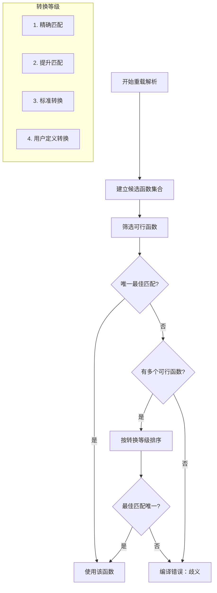

**四步转换等级的详细说明**：

```cpp
// 1️⃣ 精确匹配（Exact Match）
void func(int);              // #1
void func(double);           // #2
void func(const char*);      // #3

int x = 42;
func(x);                     // ✅ 精确匹配 #1
func(&x);                    // ✅ 精确匹配（需要函数接受 int*）

// 精确匹配也包含细微转换：
// - 数组到指针的退化：void foo(int*); int arr[10]; foo(arr);
// - 函数到函数指针：void bar(void(*fp)()); void baz(); bar(baz);
// - 顶层 const 的添加：void foo(const int*); int* p; foo(p);

// 2️⃣ 提升匹配（Promotion）
// 整型提升：char, short, wchar_t, enum -> int（如果 int 能容纳）
// 浮点提升：float -> double

void func(int);              // #1
void func(double);           // #2
void func(long);             // #3

char c = 'A';
short s = 10;
float f = 3.14f;

func(c);   // char -> int（提升），优于 char -> long（也是提升但 int 优先）
func(s);   // short -> int（提升）
func(f);   // float -> double（提升）

// 3️⃣ 标准转换（Standard Conversion）
// 任何内置类型之间的转换
void func(int);              // #1
void func(double);           // #2

func(3.14);   // #2 精确匹配
func(42);     // #1 精确匹配
func(3.14f);  // float -> double（提升）-> #2
             // float -> int（标准转换）-> #1
             // 提升优先于标准转换，所以选 #2

func(100L);   // long -> int（标准转换）
             // long -> double（标准转换）
             // 两者都是标准转换，歧义！❌

// 4️⃣ 用户定义转换（User-defined Conversion）
struct A { A(int) {} };      // 从 int 隐式转换
struct B { B(int) {} };

void func(A);                // #1
void func(B);                // #2

func(42);   // int -> A（用户定义转换）
            // int -> B（用户定义转换）
            // 歧义！❌
```

**完整的多参数重载解析**：

```cpp
void f(int, double);   // #1
void f(double, int);   // #2

f(1, 2.0);    // #1: (精确, 精确) 
              // #2: (标准转换: int->double, 标准转换: double->int)
              // #1 赢（两个参数都是精确匹配）

f(1.0, 2);    // #2: (精确, 精确)
              // #1: (标准转换: double->int, 标准转换: int->double)
              // #2 赢

f(1, 2);      // #1: (精确, 标准转换: int->double)
              // #2: (标准转换: int->double, 精确)
              // 平局！❌ 歧义
```

### 8.4.5 重载决议的歧义案例分析

**案例 1：算术类型转换歧义**：

```cpp
void show(int x) { cout << "int: " << x << endl; }
void show(double x) { cout << "double: " << x << endl; }

int main() {
    show(5);       // ✅ int 版本
    show(3.14);    // ✅ double 版本
    show('A');     // ✅ char -> int（提升）
    
    unsigned int u = 100;
    show(u);       // ❌ 歧义！unsigned int -> int（标准转换）
                   //    unsigned int -> double（标准转换）
                   //    两个都是标准转换，优先级相同
    return 0;
}

// 解决方法：增加重载或显式转换
void show(unsigned int x) { cout << "unsigned int: " << x << endl; }
// show(u) 现在精确匹配 unsigned int
```

**案例 2：引用重载歧义**：

```cpp
void func(int& x) { cout << "int&" << endl; }
void func(int&& x) { cout << "int&&" << endl; }

int main() {
    int a = 10;
    func(a);        // ✅ int&（左值）
    func(10);       // ✅ int&&（右值）
    
    // 但如果加上 const int& 版本：
    // void func(const int& x);   // 会与上面的产生复杂交互
    return 0;
}
```

**案例 3：指针与数组歧义**：

```cpp
void process(int* arr) { cout << "pointer" << endl; }
void process(int arr[]) { cout << "array" << endl; }  // ❌ 与 pointer 版本相同！
// 因为 int arr[] 参数会被调整为 int*，两者签名相同

// 正确区分：
void process(int* arr, size_t size) { /* ... */ }
void process(int (*arr)[10]) { /* ... */ }  // 指向数组的指针
```

**案例 4：继承关系中的重载**：

```cpp
struct Base {};
struct Derived : Base {};

void func(Base* b) { cout << "Base" << endl; }
void func(Derived* d) { cout << "Derived" << endl; }

int main() {
    Base b;
    Derived d;
    
    func(&b);  // ✅ Base 版本
    func(&d);  // ✅ Derived 版本（精确匹配优于基类转换）
    
    Base* pb = &d;
    func(pb);  // ✅ Base 版本（静态类型是 Base*）
    
    return 0;
}
```

### 8.4.6 重载与默认参数的冲突

```cpp
// 冲突案例 1：默认参数导致歧义
void draw(int x) { /* ... */ }
void draw(int x, int y = 0) { /* ... */ }  // ❌ draw(5) 歧义

// 冲突案例 2：多个默认参数版本
void setup(int a, int b = 0);
void setup(int a = 0, int b = 0);  // ✅ 不冲突？实际上可以编译，但容易混淆

// 冲突案例 3：重载 + 默认参数的微妙交互
void log(const string& msg, int level = 0);           // #1
void log(const string& msg, const string& tag = "");  // #2

log("hello");             // ❌ 歧义！两个都可以接受一个参数
log("hello", 1);          // ✅ #1（int 精确匹配）
log("hello", "error");    // ✅ #2（const char* -> string 用户定义转换）
```

**设计建议：重载 vs 默认参数**：

```cpp
// 方案 A：使用默认参数（简单场景）
void configure(int timeout = 30, bool verbose = false, const string& path = ".");

// 方案 B：使用重载（需要不同逻辑时）
void process(int* data, size_t count);
void process(vector<int>& data);      // 不同容器类型
void process(initializer_list<int> data);  // 初始化列表

// 方案 C：使用不同的函数名（语义不同时）
// 不要这样：
void save(const string& text);         // 保存文本
void save(int value);                  // 保存整数？歧义！

// 应该这样：
void saveText(const string& text);
void saveInteger(int value);
```

### 8.4.7 重载 set 函数族的常见模式

```cpp
#include <iostream>
#include <string>
#include <vector>
using namespace std;

// 模式 1：经典的 setter 重载
class Settings {
    string name;
    int version;
    vector<string> tags;
    
public:
    // 基本 setter
    void setName(const string& n) { name = n; }
    
    // setter 重载：接受不同类型
    void setVersion(int v) { version = v; }
    void setVersion(const string& v) { version = stoi(v); }
    
    // setter 重载：接受不同数量/形式的参数
    void setTags(const vector<string>& t) { tags = t; }
    void setTags(initializer_list<string> t) { tags = t; }
    void setTags(const string& singleTag) { tags = {singleTag}; }
};

// 模式 2：泛型 setter（模板）
class Container {
    int value;
public:
    template <typename T>
    void setValue(T&& v) {
        // 完美转发
        value = forward<T>(v);
    }
};

// 模式 3：Builder 模式中的链式 setter
class QueryBuilder {
    string table;
    vector<string> selects;
    string where;
    int limit = -1;
    
public:
    QueryBuilder& select(const string& col) {
        selects.push_back(col);
        return *this;
    }
    
    QueryBuilder& select(const vector<string>& cols) {
        selects.insert(selects.end(), cols.begin(), cols.end());
        return *this;
    }
    
    QueryBuilder& from(const string& t) { table = t; return *this; }
    QueryBuilder& where(const string& w) { this->where = w; return *this; }
    QueryBuilder& limit(int l) { this->limit = l; return *this; }
    
    string build() {
        string query = "SELECT ";
        for (const auto& s : selects) query += s + ", ";
        query.pop_back(); query.pop_back();  // 移除最后的 ", "
        query += " FROM " + table;
        if (!where.empty()) query += " WHERE " + where;
        if (limit > 0) query += " LIMIT " + to_string(limit);
        return query;
    }
};

// 模式 4：Input/Output 重载
class Parser {
public:
    // 解析不同输入类型的重载
    int parse(int value) { return value; }
    double parse(const string& value) { return stod(value); }
    
    // 输出不同格式的重载
    string format(int value) { return to_string(value); }
    string format(double value) { return to_string(value); }
    string format(bool value) { return value ? "true" : "false"; }
};
```

---

## 8.5 函数模板（Function Templates）

### 8.5.1 为什么需要函数模板

```cpp
// 没有模板时，每个类型都要写一个版本
int maxInt(int a, int b) { return a > b ? a : b; }
double maxDouble(double a, double b) { return a > b ? a : b; }
string maxString(string a, string b) { return a > b ? a : b; }

// 使用模板——写一次，适用于任意类型
template <typename T>
T max(T a, T b) {
    return a > b ? a : b;
}
```

### 8.5.2 基本语法

```cpp
// 模板定义
template <typename T>    // T 是类型参数（typename 关键字）
T max(T a, T b) {        // 使用 T 作为类型
    return (a > b) ? a : b;
}

// 实例化：编译器根据调用生成对应版本的函数
int m1 = max(3, 5);              // T = int，实例化为 int max(int, int)
double m2 = max(3.14, 2.72);     // T = double，实例化为 double max(double, double)
string m3 = max(string("A"), string("B")); // T = string

// 显式指定类型
double m4 = max<double>(3, 5.5); // 强制使用 double 版本

// 多类型参数模板
template <typename T, typename U>
auto add(T a, U b) -> decltype(a + b) {
    return a + b;
}

// 非类型模板参数
template <typename T, int N>
T power(T base) {
    T result = 1;
    for (int i = 0; i < N; i++) result *= base;
    return result;
}

int main() {
    cout << power<double, 3>(2.0) << endl;  // 8.0
    cout << power<int, 4>(2) << endl;        // 16
    return 0;
}
```

### 8.5.3 模板实例化的完整机制

**两阶段编译（Two-Phase Translation）**：

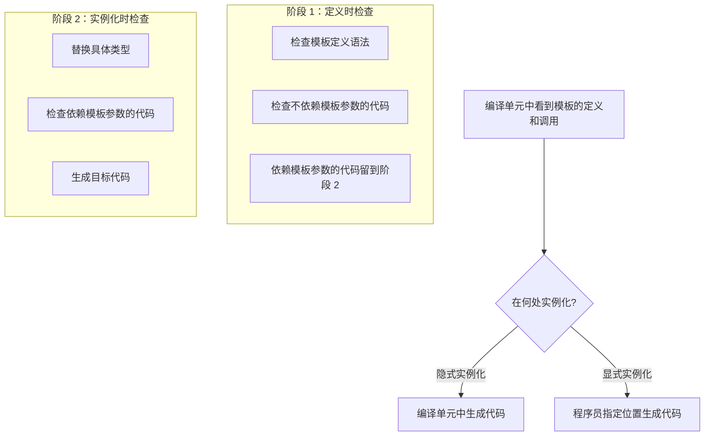

**隐式实例化示例**：

```cpp
template <typename T>
T max(T a, T b) {
    return a > b ? a : b;
}

int main() {
    // 隐式实例化：编译器在遇到调用时生成对应类型的版本
    int a = max(3, 5);           // 隐式实例化 int max(int, int)
    double b = max(3.14, 2.72);  // 隐式实例化 double max(double, double)
    
    // 编译器为每个使用了的不同类型生成一份代码
    // 这就是"模板膨胀"的来源
    
    return 0;
}
```

**模板的错误发生在实例化时**：

```cpp
template <typename T>
T divide(T a, T b) {
    if (b == 0) {
        // 即使有运行时检查，编译仍可能失败
        cerr << "error" << endl;
        return 0;
    }
    return a / b;
}

struct Person {
    string name;
    int age;
};

int main() {
    cout << divide(10, 3) << endl;       // ✅ OK: int 除法
    cout << divide(10.0, 3.0) << endl;   // ✅ OK: double 除法
    
    // Person p1, p2;
    // cout << divide(p1, p2) << endl;    // ❌ 编译错误！Person 不支持除法
    // 错误发生在实例化时，不是模板定义时
    
    return 0;
}
```

### 8.5.4 显式实例化与显式特化

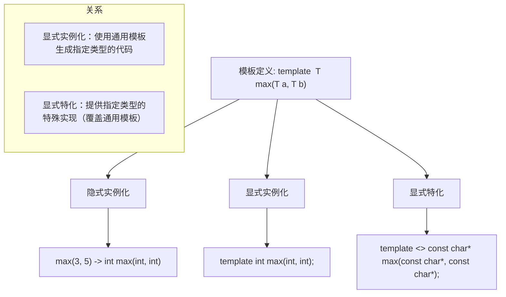

```cpp
// 通用模板
template <typename T>
T max(T a, T b) {
    return a > b ? a : b;
}

// 隐式实例化：使用时由编译器自动生成
int m1 = max(3, 5);                      // 隐式实例化为 int 版本

// 显式实例化：明确告诉编译器生成特定版本的代码
template double max<double>(double, double);  // 让编译器生成 double 版本
// 即使没有调用，也会生成代码

// 显式特化：提供特定类型的特殊实现
template <>
string max<string>(string a, string b) {
    return a.size() > b.size() ? a : b;  // 按长度比较
}

// 也可以省略 <类型>
template <>
const char* max(const char* a, const char* b) {
    return (strcmp(a, b) > 0) ? a : b;
}

int main() {
    cout << max(1, 2) << endl;                     // 通用模板
    cout << max("hello", "world") << endl;          // const char* 特化
    cout << max(string("hello"), string("world")) << endl; // string 特化
    return 0;
}
```

### 8.5.5 SFINAE 原则

**SFINAE = Substitution Failure Is Not An Error（替换失败不是错误）**

当模板参数替换失败时，编译器不会报错，而是将该模板从候选集中移除。

```cpp
#include <iostream>
#include <type_traits>
using namespace std;

// 基本 SFINAE 示例
template <typename T>
typename T::value_type process(const T& container) {
    cout << "容器类型" << endl;
    return container[0];
}

// 当 T 没有 value_type 时，使用此重载
template <typename T>
void process(const T& value) {
    cout << "非容器类型" << endl;
}

int main() {
    process(vector<int>{1, 2, 3});   // ✅ 使用第一个版本
    process(42);                     // ✅ 使用第二个版本（int 没有 value_type）
    return 0;
}
```

**SFINAE 在标准库中的典型应用**：

```cpp
// enable_if：SFINAE 的主要工具
template <bool B, typename T = void>
struct enable_if {};

template <typename T>
struct enable_if<true, T> {
    using type = T;
};

// C++14 简化
// template <bool B, typename T = void>
// using enable_if_t = typename enable_if<B, T>::type;

// 使用 enable_if 限制模板
template <typename T>
typename enable_if<is_integral<T>::value, T>::type
factorial(T n) {
    T result = 1;
    for (T i = 2; i <= n; i++) result *= i;
    return result;
}

// C++14 简化版本
template <typename T>
enable_if_t<is_floating_point<T>::value, T>
sin_approx(T x) {
    // 使用泰勒展开近似 sin(x)
    return x - x*x*x/6 + x*x*x*x*x/120;
}

int main() {
    cout << factorial(5) << endl;         // ✅ 120
    // cout << factorial(3.14) << endl;   // ❌ 编译错误：double 不是整型
    cout << sin_approx(1.0) << endl;      // ✅
    return 0;
}
```

### 8.5.6 type_traits: enable_if / is_same 等

**常用的 type_traits**：

```cpp
#include <type_traits>

// 类型判断
is_void<T>           // 是否是 void
is_integral<T>       // 是否是整型（int, char, bool, long, etc.）
is_floating_point<T> // 是否是浮点型
is_arithmetic<T>     // 是否是算术类型
is_pointer<T>        // 是否是指针
is_reference<T>      // 是否是引用
is_array<T>          // 是否是数组
is_class<T>          // 是否是类类型
is_enum<T>           // 是否是枚举

// 关系判断
is_same<T, U>        // T 和 U 是否是同一类型
is_base_of<Base, Derived>  // Base 是否是 Derived 的基类
is_convertible<From, To>   // From 是否能转换为 To

// 类型修饰
remove_reference<T>  // 移除引用
add_pointer<T>       // 添加指针
remove_const<T>      // 移除 const
decay<T>             // 退化：数组->指针，函数->函数指针，移除引用和 const

// C++17 的简化（_v 后缀）
// is_integral_v<T> 代替 is_integral<T>::value
```

**完整使用示例**：

```cpp
#include <iostream>
#include <type_traits>
#include <vector>
#include <list>
#include <string>
using namespace std;

// 1. enable_if 用于限制函数模板
template <typename T>
enable_if_t<is_arithmetic_v<T>, T>  // C++17 _v 后缀
sum(T a, T b) {
    return a + b;
}

// 2. 使用 is_same 实现不同类型的不同行为
template <typename T>
string typeName() {
    if constexpr (is_same_v<T, int>) return "int";
    else if constexpr (is_same_v<T, double>) return "double";
    else if constexpr (is_same_v<T, string>) return "string";
    else return "unknown";
}

// 3. 使用 is_pointer
template <typename T>
void safePrint(const T& value) {
    if constexpr (is_pointer_v<T>) {
        if (value) cout << *value << endl;
        else cout << "nullptr" << endl;
    } else {
        cout << value << endl;
    }
}

// 4. 检测迭代器类型
template <typename T>
struct is_container : false_type {};

template <typename T, typename Alloc>
struct is_container<vector<T, Alloc>> : true_type {};

template <typename T, typename Alloc>
struct is_container<list<T, Alloc>> : true_type {};

template <typename T>
enable_if_t<is_container_v<remove_reference_t<T>>>
processContainer(T&& container) {
    cout << "处理容器，大小: " << container.size() << endl;
}

// 5. 条件编译（C++17 if constexpr）
template <typename T>
void inspect(T&& value) {
    using RawType = remove_cv_t<remove_reference_t<T>>;
    
    if constexpr (is_arithmetic_v<RawType>) {
        cout << "算术类型，值: " << value << endl;
    } else if constexpr (is_pointer_v<RawType>) {
        cout << "指针类型";
        if (value) cout << ", 指向值: " << *value;
        else cout << ", 空指针";
        cout << endl;
    } else if constexpr (is_class_v<RawType>) {
        cout << "类类型" << endl;
    }
}

int main() {
    // test typeName
    cout << typeName<int>() << endl;         // int
    cout << typeName<double>() << endl;      // double
    
    // test safePrint
    int x = 42;
    safePrint(x);                            // 42
    safePrint(&x);                           // 42
    
    // test inspect
    inspect(42);                             // 算术类型
    inspect(&x);                             // 指针类型
    inspect(string("hello"));                // 类类型
    
    return 0;
}
```

### 8.5.7 变参模板的更多用例

```cpp
#include <iostream>
#include <string>
#include <vector>
#include <tuple>
using namespace std;

// 用例 1：递归展开（基础）
void printAll() { cout << endl; }  // 终止条件（0 参数）

template <typename T, typename... Args>
void printAll(T first, Args... rest) {
    cout << first << " ";
    printAll(rest...);  // 递归处理剩余参数
}

// 用例 2：使用 sizeof... 获取参数个数
template <typename... Args>
void countArgs(Args... args) {
    cout << "参数个数: " << sizeof...(Args) << endl;
    cout << "参数个数: " << sizeof...(args) << endl;  // 两种写法等价
}

// 用例 3：折叠表达式（C++17）
template <typename... Args>
auto sumAll(Args... args) {
    return (... + args);  // 一元左折叠
}

template <typename... Args>
auto productAll(Args... args) {
    return (... * args);
}

template <typename... Args>
bool allTrue(Args... args) {
    return (... && args);  // 逻辑与折叠
}

// 用例 4：将参数放入 vector
template <typename T, typename... Args>
vector<T> makeVector(Args... args) {
    return {static_cast<T>(args)...};  // 包展开
}

// 用例 5：变参模板与完美转发
template <typename... Args>
void forwardAll(Args&&... args) {
    // 将多个参数完美转发给其他函数
    someFunction(forward<Args>(args)...);
}

// 用例 6：变参模板在工厂函数中的应用
template <typename T, typename... Args>
unique_ptr<T> make_unique(Args&&... args) {
    return unique_ptr<T>(new T(forward<Args>(args)...));
}

// 用例 7：参数包与索引序列
template <typename Tuple, size_t... Is>
void printTupleImpl(const Tuple& t, index_sequence<Is...>) {
    // 使用折叠表达式展开
    ((cout << (Is == 0 ? "" : ", ") << get<Is>(t)), ...);
}

template <typename... Args>
void printTuple(const tuple<Args...>& t) {
    cout << "(";
    printTupleImpl(t, index_sequence_for<Args...>{});
    cout << ")" << endl;
}

int main() {
    printAll(1, 2.5, "hello", 'A');         // 1 2.5 hello A
    
    countArgs(1, 2, 3);                      // 参数个数: 3
    countArgs("a", 1, 2.0, 'x');             // 参数个数: 4
    
    cout << sumAll(1, 2, 3, 4, 5) << endl;   // 15
    cout << productAll(2, 3, 4) << endl;      // 24
    cout << allTrue(true, true, false) << endl; // 0 (false)
    
    auto v = makeVector<int>(1, 2, 3, 4, 5); // vector<int>{1,2,3,4,5}
    
    auto t = make_tuple(1, "hello", 3.14);
    printTuple(t);                            // (1, hello, 3.14)
    
    return 0;
}
```

**折叠表达式的详细说明**：

```cpp
// C++17 折叠表达式

template <typename... Args>
auto leftFold(Args... args) {
    return (... + args);  // 一元左折叠: ((arg1 + arg2) + arg3) + ...
}

template <typename... Args>
auto rightFold(Args... args) {
    return (args + ...);  // 一元右折叠: arg1 + (arg2 + (arg3 + ...))
}

template <typename... Args>
auto sumWithInit(Args... args) {
    return (0 + ... + args);  // 二元左折叠: (((0 + arg1) + arg2) + ...)
}

// 可用的折叠运算符：
// +, -, *, /, %, ^, &, |, <<, >>,
// +=, -=, *=, /=, %=, ^=, &=, |=, <<=, >>=,
// ==, !=, <, >, <=, >=, &&, ||, , (逗号运算符)
```

### 8.5.8 模板与重载的交互规则

```cpp
#include <iostream>
using namespace std;

// 规则 1：非模板函数优先于模板函数（如果完全匹配）
void show(int x) {
    cout << "非模板: " << x << endl;
}

template <typename T>
void show(T x) {
    cout << "模板: " << x << endl;
}

int main() {
    show(42);       // 非模板: 42（精确匹配，非模板优先）
    show(3.14);     // 模板: 3.14（非模板不匹配 double）
    show("hello");  // 模板: hello（非模板不匹配 const char*）
    return 0;
}

// 规则 2：使用空尖括号强制使用模板
void test() {
    show<>(42);     // 模板: 42（强制使用模板）
    show<int>(42);  // 模板: 42（显式指定模板参数）
}

// 规则 3：模板特化参与重载解析
template <typename T>
T max(T a, T b) { return a > b ? a : b; }

template <>
const char* max(const char* a, const char* b) {
    return (strcmp(a, b) > 0) ? a : b;
}

// 规则 4：函数模板可以重载
template <typename T>
void process(T value) { cout << "单参数" << endl; }

template <typename T, typename U>
void process(T a, U b) { cout << "双参数" << endl; }

// 规则 5：模板的偏序（Partial Ordering）
template <typename T>
void func(T x) { cout << "基础模板" << endl; }

template <typename T>
void func(T* x) { cout << "指针模板" << endl; }  // 更特化

template <typename T>
void func(vector<T> x) { cout << "vector 模板" << endl; }  // 更更特化

int main() {
    int a = 5;
    int* p = &a;
    vector<int> v = {1, 2, 3};
    
    func(a);   // 基础模板
    func(p);   // 指针模板（比基础模板更匹配）
    func(v);   // vector 模板（比基础模板更匹配）
    
    return 0;
}
```

**完整的重载解析优先级**：

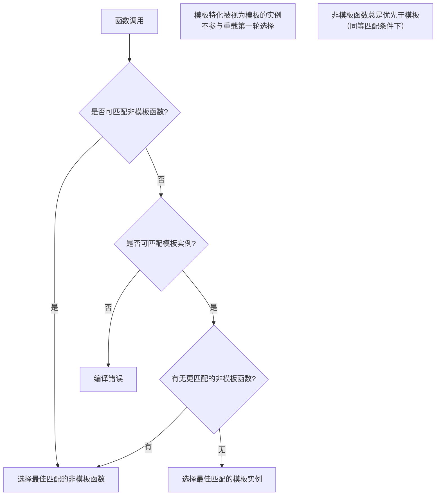

### 8.5.9 typename 与 class 的区别

在模板参数中，`typename` 和 `class` **完全等价**：

```cpp
template <class T>       // 可以
template <typename T>    // 也可以，完全等价
```

但在**依赖类型**（依赖于模板参数的类型）中，必须用 `typename`：

```cpp
template <typename T>
void func() {
    typename T::iterator it;  // ✅ 必须用 typename 告诉编译器 iterator 是类型
    // T::iterator it;        // ❌ 编译器不知道 iterator 是类型还是静态成员
}

// 另一个例子
template <typename T>
T::value_type getFirst(const T& container) {
    // ❌ 错误：编译器不知道 value_type 是类型还是静态变量
}

// 必须写：
template <typename T>
typename T::value_type getFirst(const T& container) {
    return container[0];
}
```

---

## 8.6 函数对象 vs 函数指针 vs Lambda

### 8.6.1 函数指针

```cpp
#include <iostream>
#include <vector>
#include <algorithm>
using namespace std;

// 普通函数
bool isEven(int x) { return x % 2 == 0; }
bool isOdd(int x) { return x % 2 != 0; }
int square(int x) { return x * x; }

// 函数指针类型定义
using Comparator = bool (*)(int, int);
using Transformer = int (*)(int);

int main() {
    // 基本用法
    vector<int> nums = {1, 2, 3, 4, 5, 6};
    
    // 函数指针作为算法参数
    int count = count_if(nums.begin(), nums.end(), isEven);
    cout << "偶数个数: " << count << endl;  // 3
    
    // 转换
    vector<int> squares(nums.size());
    transform(nums.begin(), nums.end(), squares.begin(), square);
    // squares = {1, 4, 9, 16, 25, 36}
    
    // 函数指针数组
    using Filter = bool (*)(int);
    Filter filters[] = {isEven, isOdd};
    
    // 函数指针变量
    bool (*filter)(int) = isEven;
    cout << filter(5) << endl;  // 0 (false)
    
    return 0;
}
```

**函数指针的局限性**：

```cpp
// 1. 不能捕获状态
struct Counter {
    int limit;
    // 不能将 limit 作为额外状态传递给函数指针
};
bool limitedCount(int x) {
    // 无法访问外部的 limit！
    return x > 10;  // 必须硬编码
}

// 2. 不能重载
void process(int x);
void process(double x);
// auto fp = process;  // ❌ 歧义！不知道取哪个地址

// 3. 语法复杂（尤其是返回函数指针的函数）
int (*getComparator(char op))(int, int) {
    // 返回函数指针的函数
    if (op == '+') return [](int a, int b) -> int { return a + b; };
    return nullptr;
}
// 上面的语法非常难读！
// 现代 C++ 使用 auto
auto getComparator2(char op) -> int (*)(int, int) {
    // ...
}
```

### 8.6.2 函数对象（仿函数 Functor）

```cpp
#include <iostream>
#include <vector>
#include <algorithm>
using namespace std;

// 函数对象：重载了 operator() 的类
struct GreaterThan {
    int threshold;
    
    GreaterThan(int t) : threshold(t) {}
    
    bool operator()(int x) const {
        return x > threshold;
    }
};

struct Square {
    int operator()(int x) const {
        return x * x;
    }
};

int main() {
    vector<int> nums = {1, 2, 3, 4, 5, 6, 7, 8};
    
    // 使用函数对象
    int count = count_if(nums.begin(), nums.end(), GreaterThan(5));
    cout << "大于 5 的个数: " << count << endl;  // 3
    
    // 函数对象可以携带状态！
    GreaterThan gt(3);
    cout << gt(5) << endl;  // 1 (true)
    cout << gt(2) << endl;  // 0 (false)
    
    // 使用函数对象进行转换
    vector<int> squares(nums.size());
    transform(nums.begin(), nums.end(), squares.begin(), Square());
    
    // 函数对象 vs 函数指针（性能更好，因为可以内联）
    // 函数对象可以内联！函数指针通过地址调用，难以内联
    
    return 0;
}
```

**函数对象的进阶功能**：

```cpp
// 有状态的函数对象
struct RunningAverage {
    int count = 0;
    double sum = 0.0;
    
    double operator()(double value) {
        sum += value;
        count++;
        return sum / count;
    }
};

// 可组合的函数对象
template <typename Func1, typename Func2>
struct Composed {
    Func1 f1;
    Func2 f2;
    
    Composed(Func1 f1, Func2 f2) : f1(f1), f2(f2) {}
    
    template <typename T>
    auto operator()(T x) const -> decltype(f2(f1(x))) {
        return f2(f1(x));
    }
};

// 模板化的函数对象
template <typename T>
struct Adder {
    T value;
    Adder(T v) : value(v) {}
    T operator()(T x) const { return x + value; }
};
```

### 8.6.3 Lambda 表达式

```cpp
#include <iostream>
#include <vector>
#include <algorithm>
using namespace std;

int main() {
    vector<int> nums = {1, 2, 3, 4, 5, 6, 7, 8};
    
    // 基本 Lambda
    auto isEven = [](int x) { return x % 2 == 0; };
    int count = count_if(nums.begin(), nums.end(), isEven);
    
    // 捕获列表
    int threshold = 5;
    auto greaterThan = [threshold](int x) { return x > threshold; };
    count = count_if(nums.begin(), nums.end(), greaterThan);
    
    // 按值捕获
    int factor = 2;
    auto multiplier = [factor](int x) { return x * factor; };
    
    // 按引用捕获
    int total = 0;
    auto accumulator = [&total](int x) { total += x; };
    for_each(nums.begin(), nums.end(), accumulator);
    cout << "总和: " << total << endl;
    
    // 捕获所有
    auto allByValue = [=](int x) { return x > threshold; };  // 全部按值捕获
    auto allByRef = [&](int x) { total += x; };               // 全部按引用捕获
    auto mixed = [=, &total](int x) { total += x * factor; }; // total 引用，其他值
    
    // 可变 Lambda（mutable）
    auto counter = [count = 0]() mutable { return count++; };
    cout << counter() << endl;  // 0
    cout << counter() << endl;  // 1
    cout << counter() << endl;  // 2
    
    // 泛型 Lambda（C++14）
    auto genericLambda = [](auto a, auto b) { return a + b; };
    cout << genericLambda(1, 2) << endl;       // 3
    cout << genericLambda(1.5, 2.5) << endl;   // 4.0
    cout << genericLambda(string("he"), string("llo")) << endl;  // hello
    
    // Lambda 作为算法参数
    sort(nums.begin(), nums.end(), [](int a, int b) {
        return a > b;  // 降序
    });
    
    // 在 Lambda 中初始化捕获（C++14）
    auto lambdaWithInit = [data = vector<int>{1, 2, 3}]() {
        for (int x : data) cout << x << " ";
        cout << endl;
    };
    
    return 0;
}
```

**Lambda 的原理**：

```cpp
// Lambda 本质上是一个匿名函数对象
auto lambda = [](int x) { return x * 2; };
// 编译器生成类似下面的代码：
// class __anonymous_lambda_1 {
// public:
//     auto operator()(int x) const { return x * 2; }
// };

// 带捕获的 Lambda
int factor = 10;
auto lambda2 = [factor](int x) { return x * factor; };
// 编译器生成：
// class __anonymous_lambda_2 {
// private:
//     int factor;
// public:
//     __anonymous_lambda_2(int f) : factor(f) {}
//     auto operator()(int x) const { return x * factor; }
// };

// 引用捕获
auto lambda3 = [&factor](int x) { return x * factor; };
// 类中的成员变为了引用：
// class __anonymous_lambda_3 {
// private:
//     int& factor;  // 引用成员
// public:
//     __anonymous_lambda_3(int& f) : factor(f) {}
//     auto operator()(int x) const { return x * factor; }
// };
```

### 8.6.4 三者的对比

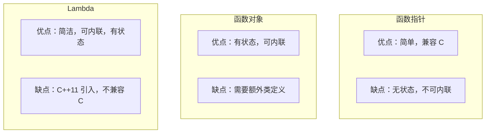

**性能对比**：

```cpp
#include <iostream>
#include <vector>
#include <algorithm>
#include <chrono>
using namespace std;
using namespace std::chrono;

// 1. 函数指针
bool isEvenPtr(int x) { return x % 2 == 0; }

// 2. 函数对象
struct IsEvenFunctor {
    bool operator()(int x) const { return x % 2 == 0; }
};

int main() {
    vector<int> data(10000000);
    generate(data.begin(), data.end(), [i = 0]() mutable { return i++; });
    
    volatile int count;  // 防止优化
    
    // 函数指针
    auto start = high_resolution_clock::now();
    count = count_if(data.begin(), data.end(), isEvenPtr);
    auto end = high_resolution_clock::now();
    cout << "函数指针: " << duration_cast<milliseconds>(end - start).count() << "ms" << endl;
    
    // 函数对象
    start = high_resolution_clock::now();
    count = count_if(data.begin(), data.end(), IsEvenFunctor());
    end = high_resolution_clock::now();
    cout << "函数对象: " << duration_cast<milliseconds>(end - start).count() << "ms" << endl;
    
    // Lambda
    start = high_resolution_clock::now();
    count = count_if(data.begin(), data.end(), [](int x) { return x % 2 == 0; });
    end = high_resolution_clock::now();
    cout << "Lambda: " << duration_cast<milliseconds>(end - start).count() << "ms" << endl;
    
    // 函数对象和 Lambda 通常更快，因为编译器可以内联 operator()
    
    return 0;
}
```

**选择指南**：

| 场景 | 推荐方案 | 原因 |
|------|---------|------|
| 需要兼容 C 代码 | 函数指针 | C 不支持函数对象和 Lambda |
| 小范围使用的简单回调 | Lambda | 简洁，定义即用 |
| 需要状态的复杂回调 | Lambda 捕获 / 函数对象 | 都可，Lambda 更简洁 |
| 需要多次使用的命名操作 | 函数对象 / Lambda 存变量 | 代码复用 |
| 模板元编程 | 函数对象 | Lambda 在 C++20 前不是默认构造的 |
| 需要重用的算法策略 | 函数对象 | 可配置、可组合 |
| 需要保存到容器中 | `std::function` | 统一类型擦除包装器 |

**std::function 的用法**：

```cpp
#include <functional>

// std::function 可以存储任何可调用对象
std::function<int(int, int)> op;

op = [](int a, int b) { return a + b; };
cout << op(3, 4) << endl;  // 7

op = [](int a, int b) { return a * b; };
cout << op(3, 4) << endl;  // 12

// 存储函数指针
int multiply(int a, int b) { return a * b; }
op = multiply;
cout << op(3, 4) << endl;  // 12

// 存储函数对象
struct Divide {
    int operator()(int a, int b) const { return a / b; }
};
op = Divide();
cout << op(10, 3) << endl;  // 3
```

---

## 8.7 类型推导

### 8.7.1 auto 类型推导

**auto 基本规则**：

```cpp
#include <iostream>
#include <vector>
#include <map>
using namespace std;

// auto 推导规则与模板参数推导一致

int main() {
    // 基本类型
    auto x = 42;            // int
    auto y = 3.14;          // double
    auto z = "hello";       // const char*
    
    // 引用和 const
    int a = 10;
    const int ca = a;
    
    auto& ref = a;          // int&
    const auto& cref = a;   // const int&
    
    auto v1 = ca;           // int（const 被丢弃）
    const auto v2 = ca;     // const int
    
    auto& ref2 = ca;        // const int&（保留被引用对象的 const）
    
    // 数组
    int arr[] = {1, 2, 3, 4, 5};
    auto arr1 = arr;         // int*（数组退化）
    auto& arr2 = arr;        // int(&)[5]（引用保留数组类型）
    
    // 函数
    auto func1 = strlen;     // size_t (*)(const char*)
    
    // C++14 支持返回类型推导
    auto add(int x, int y) { return x + y; }
    
    // C++14 Lambda 参数推导
    auto lambda = [](auto a, auto b) { return a + b; };
    
    return 0;
}
```

**auto 的陷阱**：

```cpp
// 陷阱 1：auto 会退化
int x = 10;
const int& crx = x;
auto y = crx;   // int（const 和引用都被丢弃）

// 陷阱 2：auto 不保留 volatile
volatile int flag = 0;
auto f = flag;  // int（不是 volatile int）

// 陷阱 3：统一初始化的问题
auto v1 = 10;     // int
auto v2(10);      // int
auto v3{10};      // C++11: std::initializer_list<int>, C++17: int
auto v4 = {10};   // std::initializer_list<int>

// 陷阱 4：代理类
vector<bool> vec = {true, false, true};
auto b = vec[0];  // 不是 bool！是 vector<bool>::reference（代理类）

// 避免：显式指定类型
bool b2 = vec[0];  // 正确
```

**auto 的应用场景**：

```cpp
// 1. 简化迭代器类型
map<string, vector<int>> myMap;
for (auto it = myMap.begin(); it != myMap.end(); ++it) {
    // ...
}

// 2. 简化范围 for
for (const auto& [key, value] : myMap) {  // C++17 结构化绑定
    cout << key << ": " << value.size() << endl;
}

// 3. 保存 Lambda
auto lambda = [](int x) { return x * 2; };

// 4. 复杂类型
auto result = someFunctionReturningComplexType();

// 5. decltype(auto)
int x = 42;
decltype(auto) y = x;   // int&（保留引用）
decltype(auto) z = (x); // int&（括号表达式是左值）
```

### 8.7.2 decltype 类型推导

```cpp
#include <iostream>
#include <vector>
#include <type_traits>
using namespace std;

// decltype 返回表达式的精确类型（不退化）

int main() {
    int x = 42;
    const int& crx = x;
    
    decltype(x) a = x;         // int
    decltype(crx) b = x;       // const int&（保留引用和 const！）
    decltype(x + 1) c = 0;     // int（表达式的结果类型）
    
    // 括号规则
    decltype(x) d = x;         // int（变量名）
    decltype((x)) e = x;       // int&（带括号的变量名是左值表达式）
    
    // 数组
    int arr[] = {1, 2, 3};
    decltype(arr) f = {1, 2, 3};  // int[3]（数组类型，不退化为指针）
    
    // 函数
    decltype(strlen) g;        // size_t (*)(const char*)
    
    return 0;
}

// decltype 在模板中的应用
template <typename T, typename U>
struct ReturnType {
    decltype(declval<T>() + declval<U>()) value;  // 推导表达式类型
};

// 后置返回类型
template <typename T, typename U>
auto add(T a, U b) -> decltype(a + b) {
    return a + b;
}

// C++14 简化为
template <typename T, typename U>
auto add2(T a, U b) {  // 使用 auto 推导
    return a + b;
}
// 但 auto 推导会退化，decltype(auto) 保留精确类型
```

### 8.7.3 模板参数推导

```cpp
#include <iostream>
#include <vector>
using namespace std;

// 模板参数推导的核心规则

// 情况 1：按值传递（T 推导会退化）
template <typename T>
void byValue(T param);  // param 是值传递

void testByValue() {
    int x = 42;
    const int cx = x;
    const int& rcx = x;
    const char* const ptr = "hello";
    
    byValue(x);    // T = int, param = int
    byValue(cx);   // T = int（const 被丢弃）, param = int
    byValue(rcx);  // T = int（引用和 const 被丢弃）, param = int
    byValue(ptr);  // T = const char*（顶层 const 被丢弃）, param = const char*
    
    const char arr[] = "world";
    byValue(arr);  // T = const char*（数组退化为指针）, param = const char*
}

// 情况 2：按引用传递（T& 或 const T&）
template <typename T>
void byRef(T& param);  // param 是引用

void testByRef() {
    int x = 42;
    const int cx = x;
    const int& rcx = x;
    const char arr[] = "hello";
    
    byRef(x);    // T = int, param = int&
    byRef(cx);   // T = const int, param = const int&
    byRef(rcx);  // T = const int, param = const int&
    byRef(arr);  // T = const char[6], param = const char(&)[6]
    // 通过引用传递保留数组类型！不退化为指针
}

// 情况 3：万能引用（T&&）
template <typename T>
void byUniversalRef(T&& param);  // 转发引用

void testUniversalRef() {
    int x = 42;
    const int cx = x;
    
    byUniversalRef(x);   // T = int&, param = int&（左值折叠）
    byUniversalRef(cx);  // T = const int&, param = const int&
    byUniversalRef(42);  // T = int, param = int&&（右值）
}
```

**template 推导 vs auto 推导**：

```cpp
// template 推导和 auto 推导的规则完全一致
// template<typename T> void f(T param) 与 auto x = expr 等价
// template<typename T> void f(T& param) 与 auto& x = expr 等价
// template<typename T> void f(T&& param) 与 auto&& x = expr 等价

// 示例对应关系：
// byValue(param)         -> auto x = expr
// byRef(param)           -> auto& x = expr
// byConstRef(param)      -> const auto& x = expr
// byUniversalRef(param)  -> auto&& x = expr
```

### 8.7.4 auto, decltype, 模板推导的对比

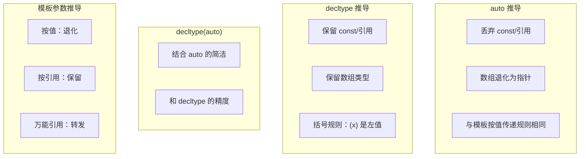

**推导规则总结**：

```cpp
// 对比不同推导方式的结果
int x = 42;
const int cx = x;
const int& rcx = x;

//         auto          auto&         const auto&    decltype      decltype(auto)
// x       int           int&          const int&     int           int
// cx      int           const int&    const int&     const int     const int
// rcx     int           const int&    const int&     const int&    const int&
// 42      int           ❌            const int&     int           int
// (x)     int           int&          const int&     int&          int&

// 后置返回类型的三种写法：
template <typename T, typename U>
auto add1(T a, U b) -> decltype(a + b) { return a + b; }  // C++11

template <typename T, typename U>
auto add2(T a, U b) { return a + b; }  // C++14, 可能退化

template <typename T, typename U>
decltype(auto) add3(T a, U b) { return a + b; }  // C++14, 保留精确类型
```

---

## 8.8 综合示例

### 8.8.1 综合案例：泛型算法库

```cpp
#include <iostream>
#include <vector>
#include <list>
#include <string>
#include <iterator>
#include <functional>
#include <type_traits>
#include <cassert>
using namespace std;

// =============================================
// 泛型算法库：一个简化版的 STL 风格算法集合
// =============================================

namespace myalgo {

// ---------- 排序算法 ----------

// 通用排序模板（选择排序）
template <typename RandomAccessIterator>
void sort(RandomAccessIterator first, RandomAccessIterator last) {
    using value_type = typename iterator_traits<RandomAccessIterator>::value_type;
    
    for (auto i = first; i != last; ++i) {
        auto min = i;
        for (auto j = i + 1; j != last; ++j) {
            if (*j < *min) min = j;
        }
        if (min != i) {
            value_type temp = *i;
            *i = *min;
            *min = temp;
        }
    }
}

// 带比较器的排序
template <typename RandomAccessIterator, typename Comparator>
void sort(RandomAccessIterator first, RandomAccessIterator last, Comparator comp) {
    using value_type = typename iterator_traits<RandomAccessIterator>::value_type;
    
    for (auto i = first; i != last; ++i) {
        auto min = i;
        for (auto j = i + 1; j != last; ++j) {
            if (comp(*j, *min)) min = j;
        }
        if (min != i) {
            value_type temp = *i;
            *i = *min;
            *min = temp;
        }
    }
}

// ---------- 查找算法 ----------

// 线性查找
template <typename InputIterator, typename T>
InputIterator find(InputIterator first, InputIterator last, const T& value) {
    for (auto it = first; it != last; ++it) {
        if (*it == value) return it;
    }
    return last;
}

// 条件查找
template <typename InputIterator, typename Predicate>
InputIterator find_if(InputIterator first, InputIterator last, Predicate pred) {
    for (auto it = first; it != last; ++it) {
        if (pred(*it)) return it;
    }
    return last;
}

// ---------- 转换算法 ----------

// transform: 一元版本
template <typename InputIterator, typename OutputIterator, typename UnaryOperation>
OutputIterator transform(InputIterator first, InputIterator last,
                         OutputIterator result, UnaryOperation op) {
    for (; first != last; ++first, ++result) {
        *result = op(*first);
    }
    return result;
}

// transform: 二元版本
template <typename InputIterator1, typename InputIterator2,
          typename OutputIterator, typename BinaryOperation>
OutputIterator transform(InputIterator1 first1, InputIterator1 last1,
                         InputIterator2 first2, OutputIterator result,
                         BinaryOperation op) {
    for (; first1 != last1; ++first1, ++first2, ++result) {
        *result = op(*first1, *first2);
    }
    return result;
}

// ---------- 数值算法 ----------

// accumulate
template <typename InputIterator, typename T>
T accumulate(InputIterator first, InputIterator last, T init) {
    for (; first != last; ++first) init = init + *first;
    return init;
}

// accumulate with binary op
template <typename InputIterator, typename T, typename BinaryOperation>
T accumulate(InputIterator first, InputIterator last, T init, BinaryOperation op) {
    for (; first != last; ++first) init = op(init, *first);
    return init;
}

// ---------- 工具函数 ----------

// for_each
template <typename InputIterator, typename Function>
Function for_each(InputIterator first, InputIterator last, Function f) {
    for (; first != last; ++first) f(*first);
    return f;  // 返回函数对象（可以获取状态）
}

// count_if
template <typename InputIterator, typename Predicate>
typename iterator_traits<InputIterator>::difference_type
count_if(InputIterator first, InputIterator last, Predicate pred) {
    typename iterator_traits<InputIterator>::difference_type count = 0;
    for (; first != last; ++first) {
        if (pred(*first)) ++count;
    }
    return count;
}

// 打印辅助函数
template <typename Container>
void print(const Container& c, const string& sep = " ") {
    for (const auto& elem : c) {
        cout << elem << sep;
    }
    cout << endl;
}

} // namespace myalgo

// =============================================
// 使用示例
// =============================================

int main() {
    // 测试排序
    vector<int> nums = {5, 2, 8, 1, 9, 3, 7, 4, 6};
    cout << "原始: "; myalgo::print(nums);
    
    myalgo::sort(nums.begin(), nums.end());
    cout << "升序: "; myalgo::print(nums);
    
    myalgo::sort(nums.begin(), nums.end(), [](int a, int b) { return a > b; });
    cout << "降序: "; myalgo::print(nums);
    
    // 测试查找
    auto it = myalgo::find(nums.begin(), nums.end(), 5);
    if (it != nums.end()) cout << "找到了: " << *it << endl;
    
    auto it2 = myalgo::find_if(nums.begin(), nums.end(), [](int x) { return x > 5; });
    if (it2 != nums.end()) cout << "第一个大于 5 的: " << *it2 << endl;
    
    // 测试 transform
    vector<int> doubled(nums.size());
    myalgo::transform(nums.begin(), nums.end(), doubled.begin(),
                      [](int x) { return x * 2; });
    cout << "翻倍: "; myalgo::print(doubled);
    
    // 测试 accumulate
    int sum = myalgo::accumulate(nums.begin(), nums.end(), 0);
    cout << "总和: " << sum << endl;
    
    // 测试 for_each
    int total = 0;
    myalgo::for_each(nums.begin(), nums.end(), [&total](int x) { total += x; });
    cout << "总和 (for_each): " << total << endl;
    
    // 测试 count_if
    auto evenCount = myalgo::count_if(nums.begin(), nums.end(),
                                      [](int x) { return x % 2 == 0; });
    cout << "偶数个数: " << evenCount << endl;
    
    // 测试自定义类型
    struct Person {
        string name;
        int age;
    };
    
    vector<Person> people = {
        {"Alice", 30}, {"Bob", 25}, {"Charlie", 35}, {"Diana", 28}
    };
    
    myalgo::sort(people.begin(), people.end(),
                 [](const Person& a, const Person& b) { return a.age < b.age; });
    
    cout << "按年龄排序: " << endl;
    for (const auto& p : people) {
        cout << "  " << p.name << ": " << p.age << endl;
    }
    
    // 测试不同容器
    list<double> dlist = {3.14, 1.41, 2.72, 1.73};
    auto found = myalgo::find(dlist.begin(), dlist.end(), 2.72);
    if (found != dlist.end()) cout << "找到 pi 近似值: " << *found << endl;
    
    return 0;
}
```

### 8.8.2 数值计算模板

```cpp
#include <iostream>
#include <type_traits>
#include <cmath>
using namespace std;

// 数值计算工具集

// 1. 安全除法（检查除零）
template <typename T>
enable_if_t<is_arithmetic_v<T>, T>
safeDivide(T numerator, T denominator) {
    if (denominator == 0) {
        cerr << "警告：除零！" << endl;
        return 0;
    }
    return numerator / denominator;
}

// 2. 计算平均值
template <typename Container>
auto average(const Container& container) {
    using value_type = typename Container::value_type;
    value_type sum = 0;
    for (const auto& elem : container) sum += elem;
    return sum / container.size();
}

// 3. 统计：计算标准差
template <typename Container>
auto standardDeviation(const Container& container) {
    using value_type = typename Container::value_type;
    auto avg = average(container);
    
    value_type sumSqDiff = 0;
    for (const auto& elem : container) {
        auto diff = elem - avg;
        sumSqDiff += diff * diff;
    }
    
    return sqrt(sumSqDiff / container.size());
}

// 4. 向量点积
template <typename Container>
auto dotProduct(const Container& a, const Container& b) {
    using value_type = typename Container::value_type;
    assert(a.size() == b.size());
    
    value_type result = 0;
    for (size_t i = 0; i < a.size(); i++) {
        result += a[i] * b[i];
    }
    return result;
}

// 5. 数值积分（梯形法则）
template <typename Func>
double integrate(Func f, double a, double b, int n = 1000) {
    double h = (b - a) / n;
    double sum = 0.5 * (f(a) + f(b));
    
    for (int i = 1; i < n; i++) {
        sum += f(a + i * h);
    }
    
    return sum * h;
}

int main() {
    // 测试安全除法
    cout << safeDivide(10.0, 3.0) << endl;     // 3.33333
    cout << safeDivide(10, 0) << endl;         // 警告 + 0
    
    // 测试积分
    auto sinIntegral = integrate([](double x) { return sin(x); }, 0.0, M_PI);
    cout << "sin(x) 在 [0, pi] 的积分: " << sinIntegral << endl;  // ≈ 2.0
    
    return 0;
}
```

### 8.8.3 函数重载 + 模板的完整示例

```cpp
#include <iostream>
#include <string>
#include <cstring>
using namespace std;

// 1. 模板函数
template <typename T>
T max_value(T a, T b) {
    cout << "使用模板" << endl;
    return (a > b) ? a : b;
}

// 2. 非模板函数（普通函数优先于模板）
int max_value(int a, int b) {
    cout << "使用 int 重载" << endl;
    return (a > b) ? a : b;
}

// 3. 模板重载（指针版本）
template <typename T>
T* max_value(T* a, T* b) {
    cout << "使用指针模板" << endl;
    return (*a > *b) ? a : b;
}

// 4. 模板特化
template <>
const char* max_value(const char* a, const char* b) {
    cout << "使用 const char* 特化" << endl;
    return (strcmp(a, b) > 0) ? a : b;
}

// 5. 容器版本（接受 initializer_list）
template <typename T>
T max_value(initializer_list<T> list) {
    cout << "使用 initializer_list 模板" << endl;
    auto it = list.begin();
    T result = *it++;
    for (; it != list.end(); ++it) {
        if (*it > result) result = *it;
    }
    return result;
}

int main() {
    cout << max_value(3, 5) << endl;                    // 使用 int 重载
    cout << max_value(3.14, 2.72) << endl;               // 使用模板（double）
    cout << max_value("apple", "banana") << endl;        // 使用 const char* 特化
    cout << max_value('A', 'B') << endl;                 // 使用 int 重载（char 提升）
    
    // 强制使用模板
    cout << max_value<>(3, 5) << endl;                   // 使用模板（用 <> 强制）
    cout << max_value<int>(3, 5) << endl;                 // 显式指定类型
    
    // 指针模板
    int x = 10, y = 20;
    cout << *max_value(&x, &y) << endl;                  // 使用指针模板
    
    // initializer_list
    cout << max_value({1, 5, 3, 9, 2}) << endl;          // 9
    
    return 0;
}
```

**重载解析优先级总结**：

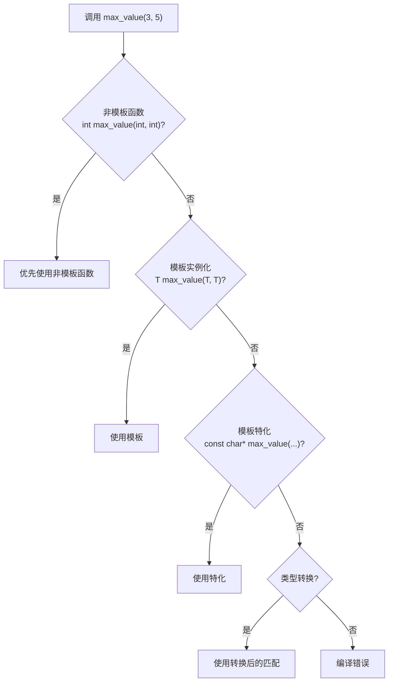

1. **非模板函数**（如果完全匹配）
2. **模板函数**（如果可以实例化匹配）
3. **模板特化**（匹配特定的类型）
4. **通过类型转换匹配**的函数

### 8.8.4 C++11 模板增强

```cpp
#include <iostream>
#include <vector>
#include <memory>
using namespace std;

// 1. 可变参数模板
void log() { cout << endl; }

template <typename T, typename... Args>
void log(T first, Args... rest) {
    cout << first << " ";
    log(rest...);
}

// 2. decltype 与后置返回类型
template <typename T, typename U>
auto add(T a, U b) -> decltype(a + b) {
    return a + b;
}

// 3. 别名模板
template <typename T>
using Vec = std::vector<T>;

template <typename T>
using Ptr = std::unique_ptr<T>;

// 4. constexpr 函数（编译时求值）
constexpr int factorial(int n) {
    return n <= 1 ? 1 : n * factorial(n - 1);
}

// C++14 后 constexpr 可以更复杂
constexpr int fibonacci(int n) {
    if (n <= 1) return n;
    int a = 0, b = 1;
    for (int i = 2; i <= n; i++) {
        int tmp = a + b;
        a = b;
        b = tmp;
    }
    return b;
}

int main() {
    log(1, 2.5, "hello", 'A');          // 1 2.5 hello A
    
    Vec<int> v = {1, 2, 3};
    Ptr<double> p = make_unique<double>(3.14);
    
    constexpr int fact5 = factorial(5);   // 编译时计算
    cout << "5! = " << fact5 << endl;    // 120
    
    constexpr int fib10 = fibonacci(10);  // 编译时计算
    cout << "fib(10) = " << fib10 << endl; // 55
    
    return 0;
}
```

### 8.8.5 类型安全容器包装器

```cpp
#include <iostream>
#include <type_traits>
#include <stdexcept>
using namespace std;

// 一个类型安全的值包装器
template <typename T>
class SafeValue {
    static_assert(is_default_constructible_v<T>, "T must be default constructible");
    
private:
    T value;
    bool initialized;
    
public:
    SafeValue() : value{}, initialized(false) {}
    
    explicit SafeValue(const T& v) : value(v), initialized(true) {}
    
    // 只有算术类型支持加法
    template <typename U = T>
    enable_if_t<is_arithmetic_v<U>, SafeValue>
    operator+(const SafeValue& other) const {
        if (!initialized || !other.initialized)
            throw runtime_error("未初始化的值");
        return SafeValue(value + other.value);
    }
    
    // 设置值（完美转发）
    template <typename U>
    void set(U&& v) {
        value = forward<U>(v);
        initialized = true;
    }
    
    // 获取值
    const T& get() const {
        if (!initialized)
            throw runtime_error("访问未初始化的值");
        return value;
    }
    
    // 类型转换（只有数值类型）
    template <typename U, typename = enable_if_t<is_arithmetic_v<U>>>
    explicit operator U() const {
        if (!initialized)
            throw runtime_error("访问未初始化的值");
        return static_cast<U>(value);
    }
    
    bool isValid() const { return initialized; }
    
    void reset() {
        value = T{};
        initialized = false;
    }
};

int main() {
    SafeValue<int> a(10);
    SafeValue<int> b(20);
    
    auto c = a + b;
    cout << "a + b = " << c.get() << endl;   // 30
    
    SafeValue<string> s1("hello");
    SafeValue<string> s2(" world");
    // s1 + s2;  // ❌ 编译错误：string 不是算术类型
    
    SafeValue<double> d;
    // d.get();  // ❌ 运行时错误：未初始化
    
    d.set(3.14);
    cout << "d = " << d.get() << endl;        // 3.14
    
    return 0;
}
```

---

## 8.9 常见错误和陷阱

### 错误 1：悬空引用

```cpp
// ❌ 返回局部变量的引用
string& getLocalString() {
    string s = "hello";
    return s;  // s 在函数结束时销毁，返回悬空引用
}

// ✅ 正确做法
string getLocalString() {  // 返回值（不是引用）
    string s = "hello";
    return s;  // 返回副本（或 NRVO 优化）
}
```

### 错误 2：引用绑定到右值

```cpp
// ❌ 错误
int& ref = 42;  // 不能绑定右值到非 const 引用

// ✅ 正确
const int& ref = 42;  // const 引用可以绑定
int&& rref = 42;      // 右值引用可以绑定
```

### 错误 3：模板实例化失败

```cpp
template <typename T>
T divide(T a, T b) {
    return a / b;
}

struct Person {};  // Person 没有除法运算符

// divide(Person(), Person());  // ❌ 编译错误在实例化时
```

### 错误 4：默认参数与重载的歧义

```cpp
void foo(int x);
void foo(int x, int y = 0);

// foo(5);  // ❌ 歧义！不知道调用哪个
```

### 错误 5：虚函数中的默认参数

```cpp
class Base {
public:
    virtual void func(int x = 10) { cout << "Base: " << x << endl; }
};

class Derived : public Base {
public:
    void func(int x = 20) override { cout << "Derived: " << x << endl; }
};

// Base* p = new Derived();
// p->func();  // 输出: Derived: 10（函数是 Derived 的，但默认参数是 Base 的！）
```

### 错误 6：宏的多次求值

```cpp
#define MAX(a, b) ((a) > (b) ? (a) : (b))

int arr[] = {1, 2, 3, 4, 5};
int* p = arr;
// int m = MAX(*p++, *p++);  // ❌ 未定义行为！p++ 被展开两次
```

### 错误 7：auto 推导代理类

```cpp
vector<bool> v = {true, false, true};
auto b = v[0];           // 不是 bool！是 vector<bool>::reference
// bool b2 = v[0];       // ✅ 正确：显式指定类型
// auto b3 = static_cast<bool>(v[0]);  // ✅ 正确：强制转换
```

### 错误 8：函数指针不匹配

```cpp
void func(int x) {}
void func(double x) {}  // 重载

// auto fp = func;     // ❌ 歧义：不知道取哪个地址
void (*fp)(int) = func;  // ✅ 显式指定版本
```

### 错误 9：模板特化放置在错误位置

```cpp
// ❌ 错误：在特化之前使用了通用模板
template <typename T>
T max(T a, T b) { return a > b ? a : b; }

// int result = max(3, 5);  // 隐式实例化

template <>
const char* max(const char* a, const char* b) {  // ✅ 正确位置
    return strcmp(a, b) > 0 ? a : b;
}
```

### 错误 10：引用折叠理解错误

```cpp
template <typename T>
void foo(T&& x) {
    // T&& 可能是右值引用也可能是左值引用（转发引用）
    bar(x);  // 错误！x 总有名字，是左值
    bar(forward<T>(x));  // ✅ 正确：使用 forward 保持值类别
}
```

### 错误 11：inline 关键字在块作用域

```cpp
void func() {
    // inline void inner() {}  // ❌ 错误：inline 不能用于块作用域
    // 但是可以使用 Lambda:
    auto inner = []() { /* ... */ };
}
```

### 错误 12：默认参数在声明和定义中重复

```cpp
// foo.h
void bar(int x = 10);  // 声明

// foo.cpp
void bar(int x = 10) {  // ❌ 错误：默认参数重复
    // ...
}

// ✅ 正确：只在声明中写默认值
void bar(int x) {
    // ...
}
```

### 错误 13：省略号与默认参数混用

```cpp
// void func(int x = 0, ...);  // ⚠️ 不推荐，行为可能不符合预期

// 更好的替代方案
void func(int x, ...);  // 省略号必须在最后
```

### 错误 14：auto 与初始化列表的微妙行为

```cpp
auto x = {1, 2, 3};  // std::initializer_list<int>（不是 vector！）
// x 的类型是 initializer_list，不是 vector<int>

// 容易混淆：
auto vec = vector<int>{1, 2, 3};  // vector<int>
auto list = {1, 2, 3};            // initializer_list<int>
```

### 错误 15：忽略 enable_if 的 SFINAE

```cpp
template <typename T>
enable_if_t<is_integral_v<T>> process(T value) {
    cout << "整型: " << value << endl;
}

template <typename T>
enable_if_t<is_floating_point_v<T>> process(T value) {
    cout << "浮点: " << value << endl;
}

// process("hello");  // ❌ 没有可用的重载（const char* 既不是整型也不是浮点）
// process(Person()); // ❌ 同样没有可用的重载
```

---

## 8.10 动手练习

以下练习题由易到难排列，帮助你巩固本章所学知识。

### 练习 1：内联函数 vs 普通函数

编写一个程序，定义一个 `inline` 函数计算立方体体积，和一个非 `inline` 函数计算长方体体积。分别调用 1000000 次，比较性能差异。

```cpp
// 提示结构
inline double cubeVolume(double side) {
    return side * side * side;
}

double boxVolume(double l, double w, double h) {
    return l * w * h;
}
// 使用 chrono 库计时
```

### 练习 2：引用参数实现交换

实现一个 `swap` 函数，使用引用参数交换两个整数。然后实现重载版本交换两个 double。

```cpp
void mySwap(int& a, int& b);
void mySwap(double& a, double& b);
```

### 练习 3：左值/右值引用识别

编写函数 `void checkCategory(T&& arg)`，判断传入参数是左值还是右值并输出。测试传入变量、字面量、表达式结果、std::move 结果。

### 练习 4：默认参数的日志系统

实现一个日志类，支持：

```cpp
void log(const string& msg, 
         const string& level = "INFO",
         ostream& os = cout,
         bool timestamp = true);
```

要求：支持不同调用方式，如 `log("msg")`、`log("msg", "ERROR")`、`log("msg", "WARN", cerr)` 等。

### 练习 5：函数重载——计算器

实现一个计算器，重载 `calculate` 函数：

```cpp
int calculate(int a, int b, char op);        // 整数运算
double calculate(double a, double b, char op); // 浮点运算
int calculate(int a, int b, int c);          // 三整数求和
```

### 练习 6：函数模板——通用排序

实现一个通用排序函数模板，支持：

```cpp
template <typename T>
void sort(T arr[], int size, bool ascending = true);

// 测试 int, double, string 数组的排序
```

### 练习 7：模板特化——字符串处理

为 `process` 函数模板提供特化版本：

```cpp
template <typename T>
string process(const T& value);  // 通用版本：返回 to_string(value)

template <>
string process(const string& value);  // 特化：添加引号
```

### 练习 8：SFINAE 实现

使用 `enable_if` 实现一组重载函数，分别处理整型、浮点型和字符串类型的输入。

### 练习 9：变参模板——最小函数

实现一个变参模板 `minimum` 函数，接受任意数量的参数并返回最小值。

```cpp
// 实现如下效果：
int m = minimum(5, 3, 8, 1, 9);  // 返回 1
double d = minimum(3.14, 2.72, 1.41);  // 返回 1.41
```

### 练习 10：Lambda 表达式综合

给定一个 `vector<int>`，使用 Lambda 实现：

1. 过滤出所有偶数
2. 将每个元素平方
3. 计算所有元素的和
4. 按照元素与 10 的差的绝对值排序

全部使用 Lambda 和 STL 算法完成。

### 练习 11：泛型算法库扩展

在 8.8.1 节 `myalgo` 算法库的基础上，新增以下算法：

```cpp
// 1. all_of: 检查是否所有元素满足条件
// 2. any_of: 检查是否有元素满足条件
// 3. none_of: 检查是否没有元素满足条件
// 4. copy: 复制区间
// 5. fill: 填充区间
// 6. remove_if: 移除满足条件的元素
```

### 练习 12：类型安全的矩阵类

实现一个模板矩阵类：

```cpp
template <typename T, size_t Rows, size_t Cols>
class Matrix {
    // 要求：
    // 1. 支持加法（静态断言确保 T 是算术类型）
    // 2. 支持乘法
    // 3. 支持打印
    // 4. 使用 constexpr 检查维度
};
```

---

## 8.11 本章总结

| 知识点 | 说明 | 掌握要求 |
|--------|------|----------|
| 内联函数 | 编译时展开，消除调用开销 | 理解原理，善于使用小函数 |
| 引用变量 | 别名，函数参数和返回值 | **熟练掌握** |
| 左值与右值 | 理解值类别，移动语义基础 | 掌握概念 |
| 左值引用 | 绑定到左值 | 熟练掌握 |
| 右值引用 | 绑定到右值，移动语义 | 掌握 |
| 转发引用 | T&& 和 auto&& | 理解 |
| 默认参数 | 参数可省略，从右向左指定 | 熟练掌握 |
| 函数重载 | 同名不同参 | **熟练掌握** |
| 重载解析 | 精确匹配 -> 提升 -> 标准转换 -> 用户定义转换 | 理解流程 |
| 函数模板 | 泛型编程 | **熟练掌握** |
| 模板特化 | 为特定类型提供特殊实现 | 理解并掌握 |
| SFINAE | 替换失败不是错误 | 理解原理 |
| type_traits | 编译期类型判断 | 掌握常用 traits |
| 变参模板 | 可变数量的模板参数 | 掌握基本用法 |
| Lambda 表达式 | 匿名函数对象 | **熟练掌握** |
| 函数对象 | 重载 operator() 的类 | 掌握 |
| 函数指针 | C 风格的回调 | 理解 |
| 类型推导 | auto, decltype, 模板推导 | **熟练掌握** |
| 引用折叠 | 引用的引用的推导规则 | 理解 |

**关键记忆点**：

1. 内联只是对编译器的建议，不是命令
2. 引用在底层是指针实现，但语法更安全
3. 左值引用不能绑定右值，但 const 左值引用和右值引用可以
4. 默认参数从右向左指定，只在声明中写一次
5. 函数重载依赖参数列表，不依赖返回值
6. 非模板函数优先于模板函数（同等匹配条件下）
7. 转发引用（T&&）与右值引用（T&&）的规则不同
8. Lambda 底层是匿名函数对象
9. auto 按值推导会丢弃 const 和引用
10. SFINAE 让模板在替换失败时安静地消失

**最佳实践速查**：

- 小函数（< 10 行）适合内联
- 大对象传参用 const 引用
- getter/setter 用内联
- 需要移动语义用右值引用
- 通用代码用模板
- 简单回调用 Lambda
- 复杂策略用函数对象
- 编译期类型判断用 type_traits

---

> 本章涵盖了 C++ 函数的核心高级特性。函数模板和重载是 C++ 泛型编程的基础，而引用（特别是右值引用）是现代 C++ 高效内存管理的关键。熟练掌握这些概念对于编写高质量、高效率的 C++ 代码至关重要。
