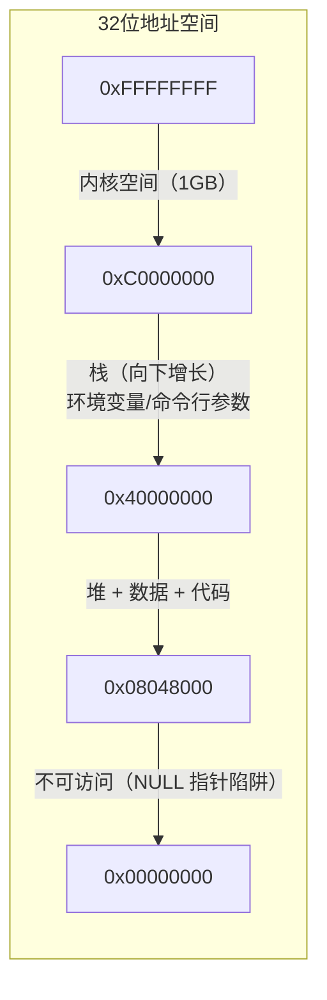
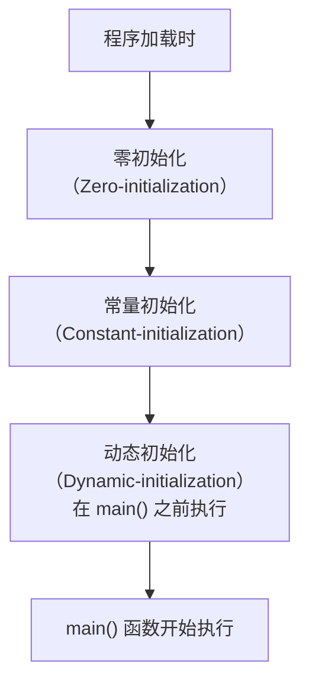
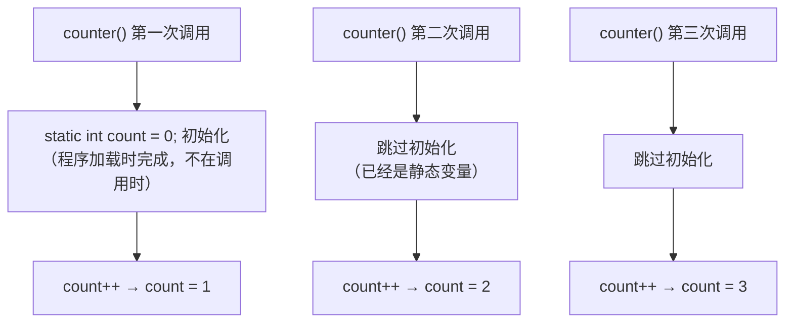
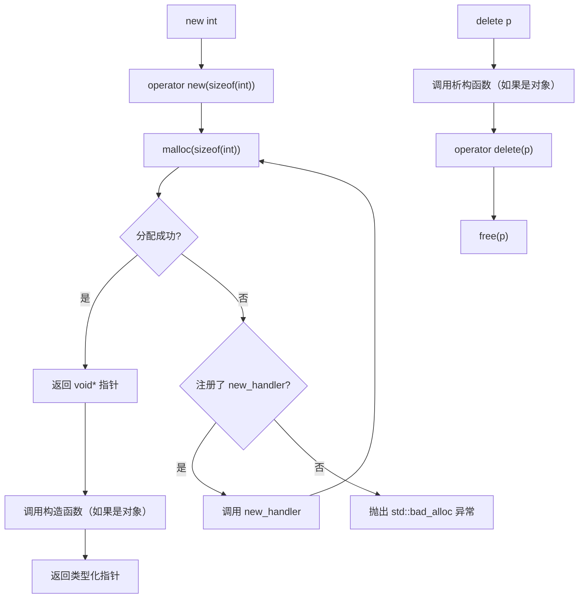
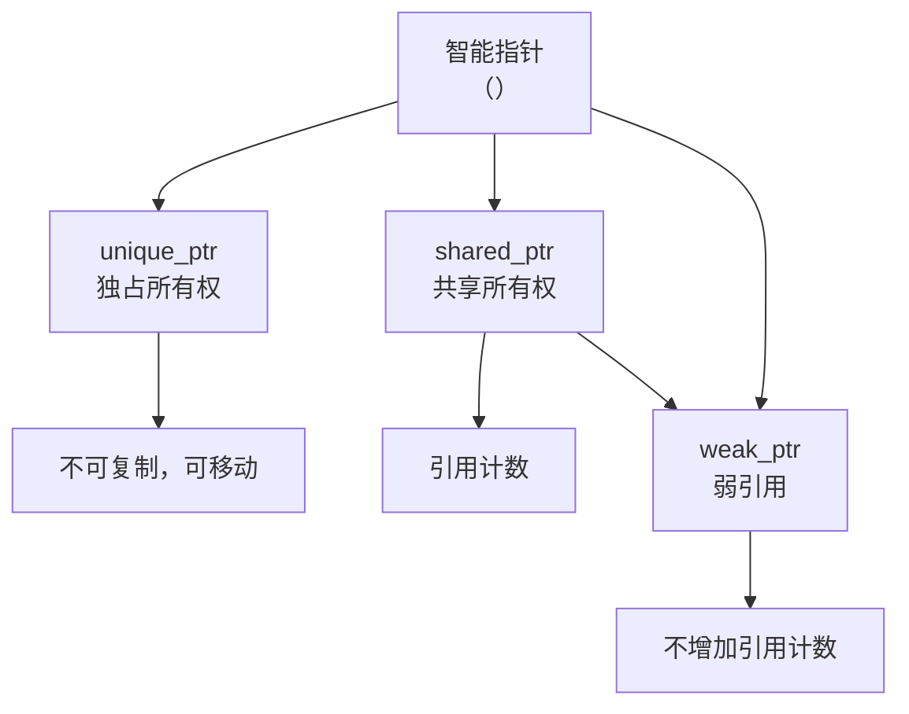
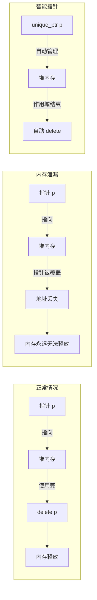
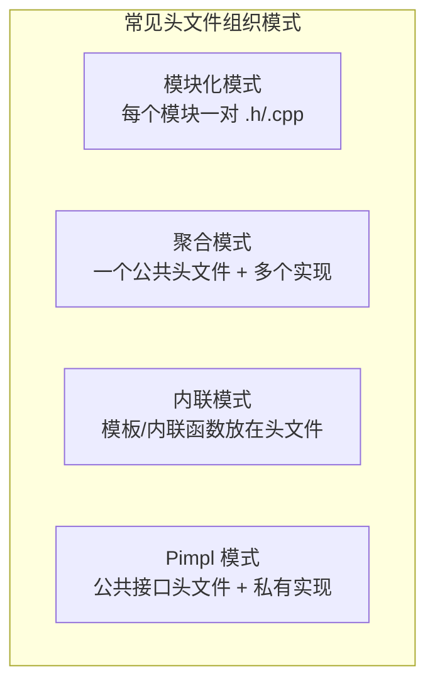
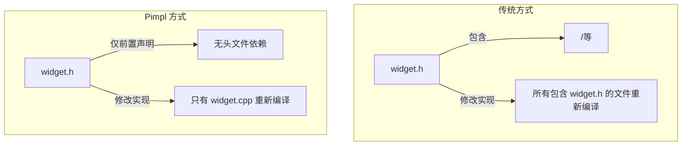
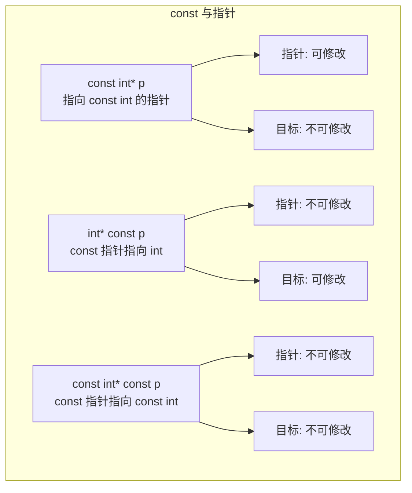

# 第 9 章：内存模型和名称空间

> **本章目标**: 理解 C++ 的内存管理模型——存储持续性、作用域和链接性，掌握名称空间的使用，以及 `new` 运算符的底层原理。

---

## 9.1 内存模型概述

### 9.1.1 程序的内存布局

```mermaid
flowchart TD
    subgraph 进程地址空间（高地址 → 低地址）
        A["内核空间<br/>（操作系统驻留）"]
        B["栈（Stack）<br/>局部变量、函数参数、返回地址<br/>向下增长（向低地址）"]
        C["空闲区<br/>（栈和堆之间的间隔）"]
        D["内存映射区<br/>（共享库、mmap 文件）"]
        E["堆（Heap）<br/>动态分配（new/delete, malloc/free）<br/>向上增长（向高地址）"]
        F["BSS 段<br/>未初始化的全局/静态变量<br/>（Block Started by Symbol）"]
        G["数据段（Data Segment）<br/>已初始化的全局/静态变量"]
        H["只读数据段<br/>（字符串常量、const 全局变量）"]
        I["代码段（Text Segment）<br/>只读，存放机器指令"]
    end
    A --- B --- C --- D --- E --- F --- G --- H --- I
```

**典型 32 位 Linux 进程地址空间布局**（地址为示意）：



| 内存区域 | 存储内容 | 特点 |
|----------|----------|------|
| **栈（Stack）** | 局部变量、函数参数、返回地址 | 自动分配释放，大小固定（通常 1-8MB），LIFO |
| **堆（Heap）** | `new`/`malloc` 分配的内存 | 手动分配释放，大小受限于可用内存，可能碎片化 |
| **内存映射区** | 共享库、大文件映射 | 通过 `mmap` 或 `dlopen` 创建 |
| **数据段** | 已初始化的全局/静态变量 | 程序启动时分配，结束时释放 |
| **BSS 段** | 未初始化的全局/静态变量 | 自动初始化为 0，不占用可执行文件空间 |
| **代码段** | 可执行指令、字符串常量 | 只读，可共享，通常不可写 |

### 9.1.2 进程地址空间详解

**各内存段的详细说明**：

**代码段（Text Segment）**：
- 存放程序的机器指令
- 通常标记为**只读 + 可执行**
- 多个运行同一程序的进程可以共享同一个代码段（节省内存）
- 修改代码段会导致段错误（Segmentation Fault）

**数据段（Data Segment）**：
- 存放已初始化的全局变量和静态变量
- 在可执行文件中占用实际空间
- 程序启动时从可执行文件加载到内存
- 可读写

**BSS 段**：
- 存放未初始化的全局变量和静态变量
- BSS 代表 "Block Started by Symbol"
- 不占用可执行文件空间（只记录大小信息）
- 程序加载时由内核初始化为零
- 可读写

**堆（Heap）**：
- 动态内存分配的区域
- 向上增长（向高地址）
- 通过 `malloc`/`free` 或 `new`/`delete` 管理
- 手动分配和释放，容易产生碎片
- 大小受限于可用物理内存 + 交换空间

**栈（Stack）**：
- 存储局部变量、函数参数、返回地址
- 向下增长（向低地址）
- 自动分配和释放
- 大小固定（编译时可设置，典型值 1-8MB）

**内存映射区**：
- 用于加载共享库（`.so` / `.dll`）
- 也用于 `mmap` 系统调用的大文件映射
- 通常位于栈和堆之间

**地址空间布局随机化（ASLR, Address Space Layout Randomization）**：
- 现代操作系统的一项安全特性
- 每次程序运行时，栈基址、堆基址、共享库地址都随机化
- 目的是使攻击者难以预测内存地址，增加缓冲区溢出攻击的难度
- 可以通过 `cat /proc/sys/kernel/randomize_va_space`（Linux）查看是否开启

### 9.1.3 存储持续性（Storage Duration）

C++11 标准定义四种存储持续性：

| 类型 | 关键字 | 生命周期 | 分配时机 | 存储位置 |
|------|--------|----------|----------|----------|
| **自动存储**（Automatic） | `auto`（可省略） | 从声明到块结束 | 进入块时 | 栈 |
| **静态存储**（Static） | `static` / `extern` | 整个程序运行期间 | 程序启动时 | 数据段 / BSS |
| **动态存储**（Dynamic） | `new` / `delete` | 由程序员控制 | `new` 调用时 | 堆 |
| **线程存储**（Thread）C++11 | `thread_local` | 线程生命周期 | 线程创建时 | TLS（线程局部存储） |

```cpp
// 四种存储持续性的典型示例
#include <iostream>
#include <thread>
using namespace std;

int global_var;                     // 静态存储（外部链接）

thread_local int tls_var = 0;       // 线程存储（C++11）

void func() {
    static int static_var = 0;      // 静态存储（无链接）
    int auto_var = 0;               // 自动存储
    auto_var++;
    static_var++;
    tls_var++;
    cout << "auto: " << auto_var
         << ", static: " << static_var
         << ", tls: " << tls_var << endl;
}

int main() {
    cout << "主线程:" << endl;
    func();    // auto: 1, static: 1, tls: 1
    func();    // auto: 1, static: 2, tls: 2
    
    cout << "子线程:" << endl;
    thread t(func); // auto: 1, static: 2, tls: 1 （tls 从 0 开始）
    t.join();
    
    return 0;
}
```

---

## 9.2 自动存储（Automatic Storage）

### 9.2.1 自动变量

```cpp
#include <iostream>
using namespace std;

void func() {
    int x = 10;        // 自动变量：在栈上分配
    double y = 3.14;   // 自动变量
    // 函数结束时自动释放
}

// 自动变量的作用域演示
void scope_demo() {
    int a = 1;                     // 作用域开始
    {
        int b = 2;                 // 内层作用域
        cout << "a=" << a << ", b=" << b << endl;  // ✅ a 和 b 都可见
    }
    // cout << b;                  // ❌ 错误：b 已超出作用域
    
    for (int i = 0; i < 3; i++) {  // i 的作用域是 for 循环
        cout << i;                 // ✅
    }
    // cout << i;                  // ❌ 错误：i 已超出作用域
}
```

**自动变量的特点**：
- 默认情况下，函数内声明的变量都是自动变量
- 作用域：从声明点到块结束（块级作用域）
- 生命周期：进入块时分配，退出块时释放
- 存储在栈上，LIFO（后进先出）
- 未初始化时值为**不确定**（不要使用未初始化的自动变量！）

```cpp
void undefined_behavior() {
    int x;
    // cout << x;  // ❌ 未定义行为！x 未初始化，其值是不确定的
    x = 10;         // ✅ 先赋值再使用
}
```

### 9.2.2 栈的工作原理

```mermaid
flowchart RL
    subgraph 栈帧（高地址 → 低地址）
        A["func1 的栈帧<br/>（先调用，在底部）"] 
        B["func2 的栈帧<br/>（后调用，在中间）"]
        C["func3 的栈帧<br/>（最后调用，在顶部）"]
    end
    C -->|"函数返回，栈帧弹出"| B
    B -->|"函数返回，栈帧弹出"| A
    
    style A fill:#e1f5fe
    style B fill:#fff3e0
    style C fill:#fce4ec
```

```cpp
void func3() { int a = 3; }   // func3 的栈帧在最上面（最新）
void func2() { func3(); }      // func2 的栈帧在中间
void func1() { func2(); }      // func1 的栈帧在最下面（最早）
```

**栈操作的核心原理**：
- 栈指针（`RSP`/`ESP`，即 Stack Pointer）始终指向栈顶
- 压栈（push）：栈指针减小，数据写入新地址
- 出栈（pop）：栈指针增大，数据从栈顶读出
- 栈上的数据不需要显式管理，LIFO 顺序决定了自动变量的生命周期

### 9.2.3 栈帧结构详解

当函数被调用时，在栈上分配一块连续的内存区域，称为**栈帧（Stack Frame）**。每个函数调用对应一个栈帧。

```mermaid
flowchart TD
    subgraph 栈帧结构（高地址 → 低地址）
        A["调用者函数的局部变量"]
        B["函数参数（从右向左压栈）<br/>按调用约定传递"]
        C["返回地址<br/>（call 指令自动压入）"]
        D["保存的 rbp（基址指针）"]
        E["局部变量区域"]
        F["寄存器保存区"]
    end
    
    style A fill:#e1f5fe
    style B fill:#fff3e0
    style C fill:#fce4ec
    style D fill:#e8f5e9
    style E fill:#f3e5f5
```

**栈帧的典型组成部分（x86-64 架构）**：

| 组成部分 | 说明 | 管理方式 |
|----------|------|----------|
| **函数参数** | 按调用约定传递（寄存器或栈） | 调用者准备 |
| **返回地址** | `call` 指令自动压入的返回地址 | CPU 自动 |
| **保存的基址指针** | 保存上一帧的 `rbp` | 被调用者保存 |
| **局部变量** | 函数的局部变量 | 被调用者分配 |
| **寄存器保存区** | 被调用者保存的寄存器值 | 被调用者保存 |

**x86-64 典型栈帧布局**：

```
高地址
+------------------+
| 调用者的栈帧      |
+------------------+
| 参数 N           |  ← 调用者负责
| ...              |
| 参数 7           |
+------------------+
| 返回地址         |  ← call 指令压入
+------------------+
| 保存的 rbp       |  ← push rbp
+------------------+  ← rbp（基址指针）
| 局部变量 1       |
| 局部变量 2       |
| ...              |
| 局部变量 N       |
+------------------+
| 寄存器保存区      |
+------------------+  ← rsp（栈指针）
低地址
```

### 9.2.4 函数调用时的栈操作细节

**函数调用完整流程**：

```cpp
int add(int a, int b) {
    int result = a + b;
    return result;
}

int main() {
    int sum = add(3, 4);
    return 0;
}
```

**对应的 x86-64 汇编（AT&T 风格）和栈操作**：

```asm
main:
    ; 准备参数
    mov     $4, %esi        ; 第二个参数：b = 4
    mov     $3, %edi        ; 第一个参数：a = 3（x86-64 用寄存器传参）
    call    add             ; ① call 指令：压入返回地址，跳转到 add

add:
    ; 函数序言（Prologue）
    push    %rbp            ; ② 保存调用者的基址指针
    mov     %rsp, %rbp      ; ③ 设置当前函数的基址指针
    sub     $16, %rsp       ; ④ 为局部变量分配栈空间

    ; 函数体
    mov     %edi, -4(%rbp)  ; 存储 a 到局部变量区
    mov     %esi, -8(%rbp)  ; 存储 b 到局部变量区
    mov     -4(%rbp), %eax
    add     -8(%rbp), %eax  ; eax = a + b
    mov     %eax, -12(%rbp) ; result = a + b

    ; 函数尾声（Epilogue）
    mov     -12(%rbp), %eax ; 设置返回值
    leave                   ; ⑤ 恢复 rsp 和 rbp（等价于 mov %rbp, %rsp; pop %rbp）
    ret                     ; ⑥ 从栈顶弹出返回地址并跳转

    ; main 中调用返回后
    mov     %eax, -4(%rbp)  ; sum = 返回值
    mov     $0, %eax        ; return 0
    ret
```

**调用约定对比**：

| 约定 | 平台 | 参数传递 | 栈清理 | 备注 |
|------|------|----------|--------|------|
| `cdecl` | x86（32位） | 全部从栈传递 | 调用者 | C 语言默认 |
| `stdcall` | x86（32位） | 全部从栈传递 | 被调用者 | Win32 API |
| `fastcall` | x86（32位） | 前两个参数用寄存器 | 被调用者 | 编译器优化 |
| `thiscall` | x86（32位） | `this` 用 `ecx` | 被调用者 | C++ 成员函数 |
| **System V AMD64** | x86-64（Linux/macOS） | 前 6 个用寄存器 | 被调用者 | 类 Unix 标准 |
| **Microsoft x64** | x86-64（Windows） | 前 4 个用寄存器 | 被调用者 | Windows 标准 |

### 9.2.5 栈溢出（Stack Overflow）

**栈溢出的常见原因**：

1. **无限递归**：

```cpp
// 示例 1：无限递归导致栈溢出
void infinite_recursion() {
    int data[100];              // 每次调用分配 400 字节
    infinite_recursion();       // 永不返回，栈空间不断增长
}

// 示例 2：过深的递归
int fibonacci(int n) {
    if (n <= 1) return n;
    return fibonacci(n - 1) + fibonacci(n - 2);  // 深度可达 n
}
// fibonacci(100000) 几乎一定会栈溢出
```

2. **在栈上分配过大的局部变量**：

```cpp
// 危险：在栈上分配巨大数组
void dangerous() {
    char buffer[10 * 1024 * 1024];  // 10MB 在栈上 —— 通常栈只有 1-8MB
    // 几乎一定会导致栈溢出
}

// 安全：使用堆分配
void safe() {
    char* buffer = new char[10 * 1024 * 1024];  // 在堆上分配
    // ...
    delete[] buffer;
}

// 或者使用 std::vector
#include <vector>
void modern_safe() {
    std::vector<char> buffer(10 * 1024 * 1024);  // 自动在堆上管理
    // ...
}
```

3. **过多的嵌套函数调用**：

```cpp
void level_100() { /* ... */ }
void level_99()  { level_100(); }
// ... 中间 96 层 ...
void level_2()   { level_3(); }
void level_1()   { level_2(); }
// 虽然极端，但太多层次的嵌套调用也会消耗栈空间
```

**避免栈溢出的方法**：

| 方法 | 说明 | 示例 |
|------|------|------|
| 尾递归优化 | 确保递归调用是函数的最后一步 | 编译器可能优化为循环 |
| 改用迭代 | 将递归改写为循环 | 斐波那契用迭代实现 |
| 增加栈大小 | 编译时或运行时设置 | `g++ -Wl,--stack,16777216` |
| 使用堆而非栈 | 大数据结构用堆分配 | `std::vector` / `new` |
| 减少局部变量大小 | 避免超大局部数组 | 拆分函数或使用堆 |

**尾递归优化示例**：

```cpp
// 非尾递归（无法优化）
int factorial(int n) {
    if (n <= 1) return 1;
    return n * factorial(n - 1);  // 乘法在递归返回后执行
}

// 尾递归（编译器可以优化为循环）
int factorial_tail(int n, int accumulator = 1) {
    if (n <= 1) return accumulator;
    return factorial_tail(n - 1, n * accumulator);  // 递归是最后一步
}
```

### 9.2.6 不同编译器的栈布局差异

**GCC（Linux）**：
- 默认使用 System V AMD64 调用约定
- 不生成帧指针（`-fomit-frame-pointer`，优化时默认开启）
- 栈对齐到 16 字节（x86-64 ABI 要求）
- 局部变量顺序不一定与声明顺序一致（编译器重排优化）

**MSVC（Windows）**：
- 默认使用 Microsoft x64 调用约定
- 保留帧指针（`/Oy-` 控制）
- 需要预留"影子空间"（home space / shadow space）——调用者在前 4 个寄存器参数对应的栈位置预留空间
- 异常处理需要额外的栈信息（`/EHa`）

**Clang**：
- 与 GCC 高度兼容
- 默认启用 ASan（AddressSanitizer）时栈布局会变化（插入 redzone）
- 支持 `-fsanitize=address` 检测栈越界

```cpp
// 编译器重排示例（不同编译器结果可能不同）
void demonstrate_layout() {
    int a = 1;
    int b = 2;
    int c = 3;
    // 在内存中，a, b, c 的地址可能不是连续或递增的
    cout << &a << endl;
    cout << &b << endl;
    cout << &c << endl;
}
```

### 9.2.7 汇编级别的栈操作

**深入理解栈操作的汇编代码**：

```asm
; ---------- 函数调用 ----------
; 在 x86-64 上，前 6 个整数参数通过寄存器传递
; 顺序：rdi, rsi, rdx, rcx, r8, r9
; 多余的参数通过栈传递（从右到左压入）

; 调用前，如果参数超过 6 个：
push    arg7            ; 第 7 个参数先入栈
push    arg6            ; 第 6 个参数再入栈（从右向左）
mov     r9d, arg5       ; 第 5 个参数
mov     r8d, arg4       ; 第 4 个参数
mov     ecx, arg3       ; 第 3 个参数
mov     edx, arg2       ; 第 2 个参数
mov     esi, arg1       ; 第 1 个参数
call    function        ; push 返回地址; jmp function

; ---------- 函数内部 ----------
function:
    push    rbp         ; 保存调用者的帧指针
    mov     rbp, rsp    ; 设置自己的帧指针
    sub     rsp, 32     ; 为局部变量分配 32 字节
    
    ; ... 函数体 ...
    
    mov     rsp, rbp    ; 恢复栈指针
    pop     rbp         ; 恢复帧指针
    ret                 ; pop 返回地址; jmp 返回地址

; ---------- 调用后 ----------
add     rsp, 16         ; 调用者清理栈上的参数（cdecl 风格）
```

---

## 9.3 静态存储（Static Storage）

### 9.3.1 静态变量的三种链接性

| 链接性 | 声明位置 | 关键字 | 作用域 | 用途 |
|--------|----------|--------|--------|------|
| **外部链接** | 所有函数之外 | 无（或 `extern`） | 所有文件 | 全局变量，跨文件访问 |
| **内部链接** | 所有函数之外 | `static` | 本文件 | 文件内共享，隐藏外部 |
| **无链接** | 函数内部 | `static` | 块内 | 保持函数调用间的状态 |

**三种链接性的存储位置**：
- 外部链接的全局变量 → 数据段或 BSS 段
- 内部链接的静态全局变量 → 数据段或 BSS 段
- 无链接的静态局部变量 → 数据段或 BSS 段

### 9.3.2 全局变量（外部链接）

```cpp
// global.cpp
int global_var = 42;        // 全局变量（外部链接）
int uninitialized_global;   // 全局变量（外部链接），在 BSS 段
void func() {
    global_var++;           // 可以在同一文件的其他函数中访问
}

// main.cpp
extern int global_var;      // 声明（不是定义），告诉编译器这个变量在其他文件
extern int uninitialized_global;  // 声明
int main() {
    cout << global_var;     // 可以访问
    return 0;
}
```

**声明 vs 定义（对于全局变量）**：

```cpp
int x;               // 定义（暂定定义 tentative definition）：分配存储空间
int x = 0;           // 定义：明确分配并初始化
extern int x;        // 声明：不分配空间，告诉编译器在其他地方查找
extern int x = 0;    // 定义：extern + 初始化 = 定义（会分配空间）

// 暂定定义（tentative definition）的特殊情况：
int x;               // 暂定定义
int x;               // 另一个暂定定义（允许多个）
int x = 5;           // 正式定义（只能有一个）
```

**全局变量的缺点**：
```cpp
// 1. 命名污染：全局变量占据全局命名空间
int counter;           // 可能与其他模块冲突

// 2. 难以追踪：任何地方都能修改
void somewhere_far_away() {
    counter = 999;     // 隐蔽地修改全局变量
}

// 3. 线程不安全：多线程同时访问需要同步
// 4. 初始化顺序不确定（见后文）
// 5. 不利于测试和模块化设计
```

### 9.3.3 全局变量初始化的细节

**全局变量的初始化分为三个阶段**：



**1. 零初始化（Zero-initialization）**：

所有未显式初始化的全局变量（包括 BSS 段变量）在程序加载时被初始化为零。

```cpp
int x;                  // 零初始化 → x = 0
double d;               // 零初始化 → d = 0.0
char* p;                // 零初始化 → p = nullptr
bool flag;              // 零初始化 → flag = false
static int y;           // 零初始化 → y = 0
```

**2. 常量初始化（Constant-initialization）**：

可以用常量表达式初始化的全局变量，在编译时就确定值，存放在数据段。

```cpp
const int MAX_SIZE = 1024;              // 常量初始化
int global_count = 42;                   // 常量初始化
static int arr[3] = {1, 2, 3};           // 常量初始化
constexpr double PI = 3.1415926535;      // C++11 constexpr，编译期常量
```

**3. 动态初始化（Dynamic-initialization）**：

需要运行时计算才能确定初始值的全局变量，在 `main()` 函数执行之前进行。

```cpp
int get_value() { return 42; }

int dynamic_global = get_value();        // 动态初始化：调用函数计算

class Initializer {
public:
    Initializer() { /* 可能读取配置文件、分配资源等 */ }
};

Initializer global_init;                 // 动态初始化：构造函数在 main 前执行

#include <cmath>
double precision = pow(10, -6);          // 动态初始化
```

**初始化顺序规则**：

```cpp
// 在同一个翻译单元（.cpp 文件）内：
int a = 1;          // 先初始化
int b = a + 1;      // 后初始化，保证 b = 2
int c = func();     // 最后初始化

// 在不同翻译单元之间：初始化顺序不确定！
// file1.cpp: int global_x = get_x();
// file2.cpp: int global_y = get_y();  // 不确定先初始化 x 还是 y
```

### 9.3.4 static 初始化顺序问题（Static Initialization Order Fiasco）

**什么是静态初始化顺序问题？**

当多个翻译单元中的全局/静态对象存在初始化依赖关系时，由于不同翻译单元的初始化顺序在 C++ 标准中未定义，可能导致一个对象在被初始化之前就被访问。

```cpp
// file1.h
struct Logger {
    static Logger& instance();
    void log(const char* msg);
};

// file1.cpp
#include "file1.h"
Logger& Logger::instance() {
    static Logger log;
    return log;
}

// file2.h
struct Config {
    static Config& instance();
    int getTimeout() const;
};

// file2.cpp - ⚠️ 潜在问题！
#include "file2.h"
#include "file1.h"

int config_timeout = Config::instance().getTimeout();  // 如果 Config 尚未初始化？

Config& Config::instance() {
    static Config cfg;
    return cfg;
}

// main.cpp
#include "file1.h"
#include "file2.h"

int main() {
    Logger::instance().log("start");
    // 可能崩溃！config_timeout 在 Config::instance() 之前初始化？
}
```

**解决方案：Construct On First Use（首次使用时构造）**

```cpp
// ✅ 推荐：函数内的 static 局部变量
// C++11 保证：函数内的 static 局部变量在第一次调用时初始化，且线程安全
Logger& Logger::instance() {
    static Logger log;   // 首次调用 instance() 时初始化
    return log;
}

Config& Config::instance() {
    static Config cfg;   // 首次调用 instance() 时初始化
    return cfg;
}
```

**Nifty Counter 惯用法**（标准库中使用的技术）：

```cpp
// iostream 的实现中使用的技术，确保 cin/cout/cerr 在使用前初始化

// 在头文件中：
struct InitHelper {
    InitHelper();
};

extern InitHelper _nifty_counter;  // 每个包含该头文件的翻译单元都有一个
extern std::istream cin;           // 声明 cin

// 在实现文件中：
static InitHelper _nifty_counter;  // 定义，确保构造函数在 main 之前运行
std::istream cin(...);             // 由 InitHelper 的构造函数确保正确初始化
```

### 9.3.5 静态全局变量（内部链接）

```cpp
// file1.cpp
static int file_var = 10;    // 内部链接，仅在 file1.cpp 可见
void func1() {
    file_var++;               // ✅ 可以访问
}

// file2.cpp
static int file_var = 20;    // 内部链接，与 file1.cpp 中的同名变量互不干扰
void func2() {
    file_var++;               // ✅ 可以访问，但与 file1 中的不是同一个
}
```

**现代 C++ 风格**：C++11 推荐使用**未命名名称空间**代替文件作用域的 `static`：

```cpp
// 旧式风格（仍可用）
static int old_style_var = 10;
static void old_style_func() {}

// 现代风格（C++11 推荐）
namespace {
    int new_style_var = 10;
    void new_style_func() {}
}
// 两种方式都产生内部链接，但未命名名称空间更通用
```

> **注意**：在 C++11 及之后的标准中，文件作用域的 `static` 关键字用于产生内部链接的方式已被标记为"过时"（deprecated），推荐使用未命名名称空间。

### 9.3.6 静态局部变量（无链接）

```cpp
#include <iostream>
using namespace std;

void counter() {
    static int count = 0;    // 静态局部变量：只初始化一次
    count++;
    cout << "调用次数: " << count << endl;
}

int main() {
    counter();  // 调用次数: 1
    counter();  // 调用次数: 2
    counter();  // 调用次数: 3
    return 0;
}
```



**静态局部变量的特点**：
- 只初始化一次（程序加载时初始化，但 C++11 保证首次调用时线程安全地初始化）
- 函数退出时**不销毁**
- 下次调用函数时，保持上次的值
- 只有定义它的函数可以访问（作用域限制在函数内）
- C++11 起，初始化是**线程安全**的（编译器会插入同步代码）

**线程安全的静态局部变量初始化（C++11）**：

```cpp
#include <iostream>
#include <thread>
#include <vector>
using namespace std;

class ExpensiveResource {
public:
    ExpensiveResource() {
        cout << "ExpensiveResource 创建 (线程: " 
             << this_thread::get_id() << ")" << endl;
    }
    void use() { /* ... */ }
};

ExpensiveResource& get_resource() {
    // C++11 保证：即使多个线程同时首次调用，也只初始化一次
    static ExpensiveResource resource;
    return resource;
}

int main() {
    vector<thread> threads;
    for (int i = 0; i < 10; i++) {
        threads.emplace_back([]{
            get_resource().use();  // 多个线程同时调用，但只创建一次
        });
    }
    for (auto& t : threads) t.join();
    return 0;
}
// 输出：ExpensiveResource 创建 (线程: ...)  （仅一次）
```

### 9.3.7 static 的实际应用案例

**案例 1：生成唯一 ID**

```cpp
class Widget {
public:
    Widget() : id_(nextId()) {}
    int id() const { return id_; }
    
private:
    static int nextId() {
        static int counter = 0;
        return counter++;
    }
    int id_;
};

// 使用
Widget w1, w2, w3;
// w1.id() == 0, w2.id() == 1, w3.id() == 2
```

**案例 2：函数级缓存**

```cpp
#include <unordered_map>
#include <string>
#include <iostream>
using namespace std;

int expensive_computation(int n) {
    // 静态缓存：存储已经计算过的结果
    static unordered_map<int, int> cache;
    
    auto it = cache.find(n);
    if (it != cache.end()) {
        cout << "缓存命中: " << n << endl;
        return it->second;
    }
    
    cout << "计算: " << n << endl;
    int result = n * n + n + 41;  // 模拟耗时计算
    cache[n] = result;
    return result;
}

int main() {
    cout << expensive_computation(10) << endl;  // 计算
    cout << expensive_computation(10) << endl;  // 缓存命中
    cout << expensive_computation(20) << endl;  // 计算
    cout << expensive_computation(10) << endl;  // 缓存命中
}
```

**案例 3：随机数生成器种子**

```cpp
#include <random>
#include <iostream>
using namespace std;

int get_random() {
    static mt19937 gen(random_device{}());  // 只初始化一次
    static uniform_int_distribution<> dist(1, 100);
    return dist(gen);
}

int main() {
    for (int i = 0; i < 5; i++) {
        cout << get_random() << " ";
    }
    // 每次输出不同，但序列基于同一个生成器
}
```

**案例 4：类级静态成员变量（共享数据）**

```cpp
class BankAccount {
public:
    BankAccount(double balance) : balance_(balance) {
        total_balance_ += balance;
        account_count_++;
    }
    
    ~BankAccount() {
        total_balance_ -= balance_;
        account_count_--;
    }
    
    static double getTotalBalance() { return total_balance_; }
    static int getAccountCount() { return account_count_; }
    
private:
    double balance_;
    static double total_balance_;    // 声明
    static int account_count_;       // 声明
};

// 定义和初始化静态成员变量
double BankAccount::total_balance_ = 0.0;
int BankAccount::account_count_ = 0;

int main() {
    BankAccount a1(1000), a2(2000), a3(500);
    cout << "账户数: " << BankAccount::getAccountCount() << endl;       // 3
    cout << "总余额: " << BankAccount::getTotalBalance() << endl;       // 3500
}
```

### 9.3.8 extern 的详细使用规则

**extern 的基本作用**：
- 声明（不是定义）一个变量或函数，表示它定义在其他翻译单元
- 告诉编译器：这个符号在其他地方存在，链接时再解析

**extern 的使用规则**：

```cpp
// 规则 1: extern 声明不分配存储空间
// file1.cpp
int shared_value = 100;          // 定义

// file2.cpp
extern int shared_value;         // 声明：引用 file1.cpp 中的 shared_value
void func() { shared_value++; }  // 可以访问

// 规则 2: extern + 初始化 = 定义
extern int defined_here = 42;    // 这是定义！因为有初始化
// 等价于：int defined_here = 42;

// 规则 3: 函数默认有 extern 链接性
void someFunction();             // 等价于 extern void someFunction();

// 规则 4: const 全局变量默认内部链接，但可以用 extern 改为外部链接
// constants.h
extern const double PI;          // 声明（不定义）
// constants.cpp
extern const double PI = 3.1415926535;  // 定义（extern 使得它外部链接）

// 规则 5: extern "C" —— 使用 C 语言链接
extern "C" {
    void c_function(int x);
    int global_var;
}
// 目的：防止 C++ 名字改编（name mangling），使 C 代码可以链接

// 规则 6: extern template —— 显式实例化声明（C++11）
extern template class std::vector<int>;  // 不在此翻译单元实例化
```

**extern "C" 详解**：

```cpp
// C++ 中调用 C 函数
extern "C" {
    #include "c_library.h"   // C 头文件中的所有函数都使用 C 链接
}

// 或者单独声明
extern "C" void c_function(int);

// C++ 中导出函数供 C 调用
extern "C" void export_to_c() {
    // 这个函数可以被 C 代码调用
    // C++ 编译器不会对函数名进行改编
}

// 条件编译：头文件可同时被 C 和 C++ 使用
#ifdef __cplusplus
extern "C" {
#endif

void shared_function(int x);

#ifdef __cplusplus
}
#endif
```

### 9.3.9 四种变量对比

```cpp
int global = 1;             // 1. 全局变量（外部链接）：所有文件可见

static int file_only = 2;   // 2. 静态全局（内部链接）：本文件可见

void func() {
    static int local_static = 3;  // 3. 静态局部（无链接）：函数内可见，但保持值
    int automatic = 4;            // 4. 自动变量：函数内可见，生命周期短
}
```

| 变量 | 存储位置 | 生命周期 | 作用域 | 链接性 | 默认初始值 |
|------|----------|----------|--------|--------|-----------|
| `global` | 数据段/BSS | 整个程序 | 全局 | 外部 | 零初始化 |
| `file_only` | 数据段/BSS | 整个程序 | 本文件 | 内部 | 零初始化 |
| `local_static` | 数据段/BSS | 整个程序 | 函数内 | 无 | 零初始化 |
| `automatic` | 栈 | 函数执行期间 | 函数内 | 无 | 不确定 |

---

## 9.4 动态存储（Dynamic Memory）

### 9.4.1 new 运算符的细节

```cpp
// 单个对象
int* p = new int;            // 分配但未初始化（值不确定）
int* p = new int();          // 值初始化为 0
int* p = new int(42);        // 初始化为 42

// 数组
int* arr = new int[10];      // 分配 10 个 int（值不确定）
int* arr = new int[10]();    // 分配 10 个 int，全部值初始化为 0
int* arr = new int[5]{1, 2, 3, 4, 5};  // C++11 初始化列表

// 多维数组
int (*matrix)[4] = new int[3][4];       // 3×4 二维数组
int (*cube)[4][5] = new int[3][4][5];   // 3×4×5 三维数组

// delete
delete p;                    // 释放单个对象
delete[] arr;                // 释放数组

// ⚠️ 重要：必须配对使用！
// new → delete
// new[] → delete[]
// 混用会导致未定义行为

// 不抛出异常的 new（nothrow）
#include <new>
int* big = new (std::nothrow) int[1000000000];
if (big == nullptr) {
    cout << "内存分配失败！" << endl;
}
```

**new 和 delete 的底层操作**：



### 9.4.2 new 的底层实现：malloc 封装

```cpp
// operator new 的简化实现（编译器大致如此）
void* operator new(std::size_t size) {
    if (size == 0) size = 1;  // 即使分配 0 字节也返回合法指针
    
    void* p;
    while ((p = std::malloc(size)) == nullptr) {
        // 如果 malloc 失败，尝试调用 new_handler
        std::new_handler nh = std::get_new_handler();
        if (nh) {
            nh();  // 尝试释放一些内存
        } else {
            throw std::bad_alloc();  // 没有 new_handler，抛出异常
        }
    }
    return p;
}

void* operator new[](std::size_t size) {
    return operator new(size);  // 数组版本基本上一样
}

void operator delete(void* p) noexcept {
    if (p) std::free(p);
}

void operator delete[](void* p) noexcept {
    if (p) std::free(p);
}
```

**new_handler 的使用**：

```cpp
#include <new>
#include <iostream>
using namespace std;

void low_memory_handler() {
    cout << "内存不足！尝试释放缓存..." << endl;
    // 尝试释放一些缓存内存
    // 如果确实无法释放更多内存，可以：
    // throw std::bad_alloc();
    // 或者：
    // abort();
}

int main() {
    set_new_handler(low_memory_handler);  // 注册自定义 new_handler
    
    // 现在 new 失败时会调用 low_memory_handler 而不是直接抛异常
    int* p = new int[100];
    // ...
    delete[] p;
    
    set_new_handler(nullptr);  // 恢复默认行为
    return 0;
}
```

**对齐要求（C++11/17）**：

```cpp
// C++11: alignas 指定对齐
struct alignas(64) CacheLine {
    char data[64];
};

// C++17: 对齐的 new/delete
// 使用 aligned_alloc 或 posix_memalign 实现
struct alignas(256) PageAligned {
    char page[256];
};
auto* p = new PageAligned;
// C++17 保证返回正确对齐的地址
delete p;
```

### 9.4.3 定位 new 的更多用例

**基本定位 new（已在栈缓冲区上分配）**：

```cpp
#include <iostream>
#include <new>       // 定位 new（placement new）
using namespace std;

const int BUF = 512;

int main() {
    char buffer[BUF];               // 栈上的缓冲区
    
    int* p1 = new int[10];           // 在堆上分配
    int* p2 = new (buffer) int[10];  // 在 buffer 上分配（定位 new）
    
    // p1 在堆上，需要用 delete[] 释放
    // p2 在 buffer 上，不需要（也不能）用 delete 释放
    delete[] p1;
    // delete[] p2;                 // ❌ buffer 不是 new 分配的
    
    return 0;
}
```

**定位 new 在自定义内存池中的使用**：

```cpp
#include <new>
#include <iostream>
using namespace std;

struct Point {
    int x, y;
    Point(int a, int b) : x(a), y(b) {
        cout << "Point(" << x << ", " << y << ") 构造" << endl;
    }
    ~Point() {
        cout << "Point(" << x << ", " << y << ") 析构" << endl;
    }
};

int main() {
    // 预分配一块原始内存
    char memory[sizeof(Point) * 3];
    
    // 在预分配的内存上构造对象
    Point* p1 = new (memory) Point(1, 2);
    Point* p2 = new (memory + sizeof(Point)) Point(3, 4);
    Point* p3 = new (memory + sizeof(Point) * 2) Point(5, 6);
    
    // 使用对象
    cout << "p1: (" << p1->x << ", " << p1->y << ")" << endl;
    
    // 必须手动调用析构函数（定位 new 分配的内存不能使用 delete）
    p1->~Point();
    p2->~Point();
    p3->~Point();
    // 注意：memory 本身不需要释放
}
```

**定位 new 的更多变体**：

```cpp
#include <new>

// 1. 标准定位 new（C++ 标准）
void* operator new(std::size_t size, void* ptr) noexcept;
// 使用：new (ptr) T(args);

// 2. 不抛出异常的 new（nothrow）
void* operator new(std::size_t size, const std::nothrow_t&) noexcept;
// 使用：new (std::nothrow) T(args);

// 3. 自定义定位 new
struct Arena {
    void* alloc(size_t bytes);
};

void* operator new(size_t bytes, Arena& arena) {
    return arena.alloc(bytes);
}

// 使用时：
// Arena arena;
// MyClass* p = new (arena) MyClass();
// 需要对应的 operator delete 来处理异常时的清理
```

**定位 new 的典型应用场景**：

| 场景 | 说明 |
|------|------|
| 嵌入式系统 | 避免堆碎片，使用固定大小的内存池 |
| 游戏开发 | 预分配内存，运行时避免动态分配带来的延迟 |
| 共享内存 | 在进程间共享的内存区域中构造对象 |
| 实时系统 | 保证内存分配的时间确定性 |
| 自定义内存管理 | 实现特殊的内存分配策略（如 slab 分配器） |

### 9.4.4 内存池的概念

**为什么需要内存池？**

- 减少频繁的 `malloc`/`free` 系统调用开销
- 避免内存碎片化
- 提高缓存局部性（连续分配的对象在内存中也是连续的）

```cpp
#include <iostream>
#include <cstdlib>
using namespace std;

// 简单的内存池实现
template<typename T, size_t PoolSize = 100>
class MemoryPool {
public:
    MemoryPool() {
        pool_ = static_cast<T*>(std::malloc(sizeof(T) * PoolSize));
        if (!pool_) throw std::bad_alloc();
        
        // 初始化空闲链表
        for (size_t i = 0; i < PoolSize - 1; i++) {
            next_free_[i] = &pool_[i + 1];
        }
        next_free_[PoolSize - 1] = nullptr;
        head_ = pool_;
    }
    
    ~MemoryPool() {
        std::free(pool_);
    }
    
    T* allocate() {
        if (head_ == nullptr) {
            // 池已用完，从堆分配
            return static_cast<T*>(std::malloc(sizeof(T)));
        }
        
        T* ptr = head_;
        size_t index = ptr - pool_;
        head_ = next_free_[index];
        return ptr;
    }
    
    void deallocate(T* ptr) {
        // 检查是否属于本池
        if (ptr >= pool_ && ptr < pool_ + PoolSize) {
            size_t index = ptr - pool_;
            next_free_[index] = head_;
            head_ = ptr;
        } else {
            std::free(ptr);  // 不属于本池，用标准 free
        }
    }
    
    T* pool() const { return pool_; }
    
private:
    T* pool_;                           // 预分配的内存块
    T* next_free_[PoolSize];            // 空闲链表
    T* head_;                           // 空闲链表头
};

// 使用内存池
struct GameObject {
    int id;
    float x, y;
    bool active;
};

int main() {
    MemoryPool<GameObject, 1000> pool;
    
    GameObject* obj = pool.allocate();
    obj->id = 1;
    obj->x = 10.0f;
    obj->y = 20.0f;
    obj->active = true;
    
    pool.deallocate(obj);  // 归还到池中，不真的释放内存
    
    return 0;
}
```

### 9.4.5 智能指针（Smart Pointers）

**为什么需要智能指针？**

- 自动管理动态内存生命期
- 避免内存泄漏
- 避免悬空指针
- 异常安全

**C++11 智能指针家族**：



**unique_ptr — 独占所有权**：

```cpp
#include <memory>
#include <iostream>
using namespace std;

class Resource {
public:
    Resource() { cout << "Resource 构造" << endl; }
    ~Resource() { cout << "Resource 析构" << endl; }
    void work() { cout << "Resource 工作" << endl; }
};

int main() {
    // 创建 unique_ptr（推荐使用 make_unique）
    auto ptr = make_unique<Resource>();
    
    // 使用
    ptr->work();
    
    // unique_ptr 不能复制
    // auto ptr2 = ptr;           // ❌ 编译错误：已删除的拷贝构造
    
    // 但可以移动
    auto ptr2 = std::move(ptr);    // ✅ ptr 现在为空
    // ptr->work();                // ❌ 运行时错误：ptr 是 nullptr
    
    // 离开作用域时自动释放
    return 0;
}
// 输出（作用域结束时）：
// Resource 构造
// Resource 工作
// Resource 析构
```

**unique_ptr 作为函数返回值和参数**：

```cpp
#include <memory>
#include <vector>
using namespace std;

// 作为返回值（高效，没有拷贝）
unique_ptr<vector<int>> create_large_vector() {
    auto vec = make_unique<vector<int>>(1000000);
    // ... 填充数据
    return vec;  // 移动语义
}

// 作为参数（传递所有权）
void take_ownership(unique_ptr<Resource> ptr) {
    ptr->work();
}  // 函数结束时 ptr 自动释放

// 作为参数（临时借用）
void borrow(Resource& res) {
    res.work();
}

int main() {
    auto res = make_unique<Resource>();
    
    // borrow(&res) 不转移所有权
    borrow(*res);
    
    // take_ownership 转移所有权
    take_ownership(std::move(res));
    // 此时 res 已经是 nullptr
    
    auto big = create_large_vector();
    // big 自动管理内存
}
```

**shared_ptr — 共享所有权**：

```cpp
#include <memory>
#include <iostream>
using namespace std;

struct Node {
    int data;
    shared_ptr<Node> next;
    
    Node(int d) : data(d) {
        cout << "Node(" << data << ") 构造" << endl;
    }
    ~Node() {
        cout << "Node(" << data << ") 析构" << endl;
    }
};

int main() {
    // 创建 shared_ptr（推荐使用 make_shared，更高效）
    auto n1 = make_shared<Node>(1);
    {
        auto n2 = make_shared<Node>(2);
        auto n3 = make_shared<Node>(3);
        
        n1->next = n2;
        n2->next = n3;
        
        cout << "n1 引用计数: " << n1.use_count() << endl;  // 1
        cout << "n2 引用计数: " << n2.use_count() << endl;  // 2（n1->next 和 n2）
    }  // n2 和 n3 离开作用域，但 n1->next 还持有 n2，所以 n2 和 n3 不会释放
    
    cout << "n1 引用计数: " << n1.use_count() << endl;  // 1（只有 n1）
    // n1->next 仍然存在
    if (n1->next) {
        cout << "n1->next 数据: " << n1->next->data << endl;
    }
    
    return 0;
}  // 全部释放
```

**weak_ptr — 弱引用（解决循环引用）**：

```cpp
#include <memory>
#include <iostream>
using namespace std;

// ⚠️ 错误的设计：循环引用导致内存泄漏
struct BadNode {
    int data;
    shared_ptr<BadNode> next;
    shared_ptr<BadNode> prev;  // ❌ 循环引用！
    
    ~BadNode() { cout << "BadNode 析构" << endl; }
};

// ✅ 正确的设计：用 weak_ptr 打破循环
struct GoodNode {
    int data;
    shared_ptr<GoodNode> next;
    weak_ptr<GoodNode> prev;   // ✅ 不增加引用计数
    
    ~GoodNode() { cout << "GoodNode 析构" << endl; }
    
    shared_ptr<GoodNode> get_prev() const {
        return prev.lock();  // 获取 shared_ptr（如果对象还存活）
    }
};

int main() {
    // 循环引用示例
    {
        auto a = make_shared<GoodNode>(1);
        auto b = make_shared<GoodNode>(2);
        a->next = b;
        b->prev = a;  // weak_ptr，不增加引用计数
        
        cout << "a 引用计数: " << a.use_count() << endl;  // 1（只有 a 持有）
        cout << "b 引用计数: " << b.use_count() << endl;  // 2（b 和 a->next）
        
        // 通过 weak_ptr 访问
        if (auto pa = b->get_prev()) {
            cout << "b 的前驱: " << pa->data << endl;
        }
    }  // 正常析构！
    cout << "--- 正常析构完毕 ---" << endl;
    
    // 对比：BadNode 会泄漏
    // {
    //     auto a = make_shared<BadNode>(1);
    //     auto b = make_shared<BadNode>(2);
    //     a->next = b;
    //     b->prev = a;  // shared_ptr 循环引用
    // }  // ❌ 不会调用析构！内存泄漏！
    
    return 0;
}
```

**智能指针使用建议**：

```cpp
// 1. 默认使用 unique_ptr（开销最小）
unique_ptr<Widget> create_widget();

// 2. 需要共享所有权时使用 shared_ptr
shared_ptr<Resource> shared_res = make_shared<Resource>();

// 3. 需要观察但不拥有时使用 weak_ptr
weak_ptr<Resource> observer = shared_res;

// 4. 避免使用 raw new/delete（RAII 原则）
// ❌ 旧式
Widget* w = new Widget();
delete w;

// ✅ 现代 C++
auto w = make_unique<Widget>();

// 5. 使用 make_unique / make_shared（异常安全 + 效率更高）
// ✅ 正确
f(make_shared<Widget>(), compute());  
// 如果 compute() 抛出异常，make_shared 不会泄漏

// ❌ 危险
f(shared_ptr<Widget>(new Widget()), compute());  
// 如果 compute() 在 new Widget 之后抛出异常，会泄漏
```

**删除器（Custom Deleter）**：

```cpp
#include <memory>
#include <cstdio>
using namespace std;

// 自定义删除器：处理文件指针
struct FileDeleter {
    void operator()(FILE* fp) const {
        if (fp) {
            fclose(fp);
            cout << "文件已关闭" << endl;
        }
    }
};

int main() {
    // unique_ptr 的自定义删除器（作为模板参数）
    unique_ptr<FILE, FileDeleter> file(fopen("test.txt", "w"));
    
    // shared_ptr 的自定义删除器（作为构造函数参数）
    auto file2 = shared_ptr<FILE>(
        fopen("test2.txt", "w"),
        [](FILE* fp) { 
            if (fp) {
                fclose(fp);
                cout << "shared_ptr 关闭文件" << endl;
            }
        }
    );
    
    return 0;
}  // 自动关闭文件
```

### 9.4.6 内存泄漏

```cpp
void leak() {
    int* p = new int(42);
    // 忘记 delete p → 内存泄漏！
    // 程序运行期间，这 4 字节再也不能被回收
}

// 更隐蔽的泄漏
int* arr = new int[1000];
arr = new int[500];    // ❌ 原来的 1000 个 int 丢失了！
delete[] arr;          // 只释放了最后的 500 个

// 异常安全泄漏（有异常时也会泄漏）
void exception_leak() {
    int* p = new int(42);
    risky_function();  // 如果这里抛出异常，p 永远不会被 delete
    delete p;          // 不会执行到这
}

// ✅ 修复：使用智能指针
void safe_version() {
    auto p = make_unique<int>(42);
    risky_function();  // 即使抛出异常，p 也会被自动释放
}
```



**常见内存泄漏类型**：

| 类型 | 示例 | 解决 |
|------|------|------|
| 忘记释放 | `new` 后没有 `delete` | 使用智能指针 |
| 指针覆盖 | `p = new int; p = new int;` | 先 `delete` 再赋值 |
| 异常中断 | 抛出异常跳过 `delete` | RAII / 智能指针 |
| 容器中的指针 | `vector<int*>` 中存 raw ptr | 使用 `vector<unique_ptr<int>>` |
| 循环引用 | `shared_ptr` 互相引用 | 使用 `weak_ptr` |
| 基类析构非虚 | `delete base_ptr` 只析构基类 | 基类析构函数加 `virtual` |

**检测内存泄漏的工具**：

```bash
# Linux: Valgrind
valgrind --leak-check=full ./program

# Windows: Visual Studio 内置
_CrtSetDbgFlag(_CRTDBG_ALLOC_MEM_DF | _CRTDBG_LEAK_CHECK_DF);

# macOS: Leaks
leaks -atExit -- ./program

# 所有平台: AddressSanitizer（编译时启用）
g++ -fsanitize=address -g program.cpp -o program
```

> **内存泄漏的后果**：长期运行的程序（如服务器、游戏）会因不断泄漏而耗尽内存，最终崩溃。即使每次泄漏的数量很小（比如一次 4 字节），如果泄漏操作每秒执行 1000 次，一天就会泄漏约 345MB。

---

## 9.5 名称空间（Namespace）

### 9.5.1 为什么需要名称空间

**名字冲突问题**：

```cpp
// 两个不同的库都可能定义了 print() 函数
// library1.h
void print(const char* s);

// library2.h  
void print(const string& s);

// 如果同时包含两个头文件，编译器不知道用哪个 print()
// 编译错误：'print' 重定义
```

**名称空间解决方案**：

```cpp
namespace Lib1 {
    void print(const char* s);
}

namespace Lib2 {
    void print(const string& s);
}

// 使用时通过命名空间区分
Lib1::print("Hello");     // 调用 Lib1 的 print
Lib2::print("Hello");     // 调用 Lib2 的 print
```

### 9.5.2 创建名称空间

```cpp
// 定义名称空间
namespace MyNamespace {
    int count = 0;              // 变量
    
    void increment() {           // 函数
        count++;
    }
    
    struct Point {               // 结构体
        int x, y;
    };
    
    namespace Inner {            // 嵌套名称空间
        int value = 10;
    }
}

// 使用
int main() {
    MyNamespace::count = 5;
    MyNamespace::increment();
    MyNamespace::Point p = {10, 20};
    MyNamespace::Inner::value = 30;
    
    return 0;
}
```

### 9.5.3 using 声明 与 using 编译指令

```cpp
namespace MyLib {
    int x = 1;
    int y = 2;
    int z = 3;
}

// using 声明 —— 引入单个名字
using MyLib::x;       // 之后可以直接使用 x
x = 10;               // 等价于 MyLib::x = 10

// using 编译指令 —— 引入整个名字空间
using namespace MyLib;  // 之后可以直接使用所有名字
y = 20;               // MyLib::y = 20
z = 30;               // MyLib::z = 30
```

**两者的关键区别**：

| 特性 | `using` 声明 | `using namespace` 编译指令 |
|------|-------------|--------------------------|
| 引入范围 | 单个名称 | 整个名称空间 |
| 局部覆盖 | 可以覆盖（局部同名隐藏） | 不能覆盖（局部变量优先） |
| 作用域 | 从声明点到块结束 | 从声明点到块结束 |
| 冲突检测 | 立即检测 | 使用时才检测 |
| 推荐度 | **推荐** | 谨慎使用（主要在小型程序） |

### 9.5.4 using 声明 vs 局部变量

```cpp
namespace MyLib {
    int x = 1;
    int y = 2;
}

void func() {
    using namespace MyLib;  // using 编译指令
    
    int x = 100;            // 局部变量
    cout << x;              // 100（局部变量优先于名称空间中的 x）
    // cout << y;           // 2（名称空间中的 y 仍可见）
    
    // using 声明 vs 局部变量 —— 冲突！
    using MyLib::y;         // ❌ 错误！y 已经在函数作用域中可见
    // 如果去掉 using namespace MyLib;，则：
    // using MyLib::y;      // 可以
    // int y = 200;         // ❌ 错误：重复声明
}
```

### 9.5.5 未命名名称空间

```cpp
// unnamed.cpp
namespace {                 // 未命名名称空间
    int hidden = 42;
    void internalFunc() {
        // ...
    }
}

// 相当于 static int hidden = 42;
// 内部链接，只在本文件可见

// 访问（不需要前缀）
int main() {
    cout << hidden;         // 可以直接访问
    return 0;
}
```

**未命名名称空间 vs static**：

```cpp
// 旧方式（C++98 前）
static int old_way = 42;           // 内部链接

// 新方式（C++11 推荐）
namespace {
    int new_way = 42;              // 内部链接，推荐
    class HiddenClass { /* ... */ };  // 类也可以隐藏
    struct InternalData { int a; };    // 结构体也可以隐藏
}
```

> **注意**：C++11 标准中，文件作用域的 `static` 已被标记为 deprecated，推荐使用未命名名称空间来创建内部链接。

### 9.5.6 名称空间别名

```cpp
namespace VeryLongNamespaceName {
    int data;
}

// 创建别名
namespace VLNN = VeryLongNamespaceName;

VLNN::data = 100;  // 等价于 VeryLongNamespaceName::data = 100;

// 别名在嵌套名称空间中特别有用
namespace A {
    namespace B {
        namespace C {
            int value;
        }
    }
}

namespace ABC = A::B::C;  // 简化深层嵌套
ABC::value = 42;
```

### 9.5.7 名称空间是开放的

```cpp
// 名称空间可以跨文件、跨代码块添加成员

// file1.h
namespace MyLib {
    void func1();
}

// file2.h
namespace MyLib {          // 向 MyLib 添加新成员
    void func2();
}

// 也可以在同一文件的不同位置扩展
namespace MyLib {
    int data = 10;
}

// 最终 MyLib 包含 func1, func2 和 data
```

### 9.5.8 名称空间的最佳实践

```cpp
// 1. ✅ 在头文件中，永远不要使用 using 编译指令
// ❌ 头文件中的 using namespace std; 会影响所有包含它的文件！
// 头文件应该使用完整的限定名

// 2. ✅ 在源文件中，可在函数内使用 using 声明
void func() {
    using std::cout;
    using std::endl;
    cout << "Hello" << endl;
}

// 3. ✅ 在源文件中，可以谨慎使用 using 编译指令
#include <iostream>
using namespace std;  // 在 .cpp 文件中可以使用（不是在头文件中）

// 4. ✅ 优先使用作用域限定符
std::cout << "明确" << std::endl;

// 5. ✅ 为常用名字在局部作用域使用 using 声明
void process() {
    using std::cout;
    using std::cin;
    using std::endl;
    using std::string;
    
    string name;
    cout << "输入名字: ";
    cin >> name;
    cout << "你好, " << name << endl;
}

// 6. ✅ 将命名空间定义放在头文件中
// mylib.h
namespace MyLib {
    void doSomething();
}

// 7. ✅ 使用名称空间来避免全局作用域污染
namespace App {
    namespace Config {
        extern int timeout;
        extern string host;
    }
    namespace Utils {
        void log(const string& msg);
    }
}

// 8. ✅ 不要在头文件中使用 using namespace
// mylib.h —— 正确做法
namespace MyLib {
    class Widget { /* ... */ };
}

// mylib.h —— ❌ 错误做法
using namespace std;       // ← 会影响所有包含此头文件的源代码！
#include <vector>
using namespace MyLib;     // ← 同样糟糕
```

### 9.5.9 ADL（Argument-Dependent Lookup / Koenig 查找）

**什么是 ADL？**

当编译器查找一个函数名时，除了常规作用域查找外，还会在**参数所属的名称空间**中查找。这就叫做 Argument-Dependent Lookup（ADL），也称为 Koenig 查找（以 Andrew Koenig 命名）。

```cpp
#include <iostream>
#include <vector>
#include <algorithm>
using namespace std;

namespace MyNamespace {
    struct Widget {
        int value;
    };
    
    void process(const Widget& w) {
        cout << "Processing widget with value: " << w.value << endl;
    }
}

int main() {
    MyNamespace::Widget w{42};
    process(w);     // ✅ ADL：编译器在 MyNamespace 中查找 process！
    // 等价于 MyNamespace::process(w);
    
    return 0;
}
```

**ADL 为什么重要？**

ADL 使得运算符重载和标准库函数调用更加自然：

```cpp
#include <iostream>
#include <vector>
#include <algorithm>
using namespace std;

// 1. operator<< 的调用
std::ostream& operator<<(std::ostream& os, const std::vector<int>& v);
// cout << v;  // ADL 找到 operator<<

// 2. swap 惯用法（标准库广泛使用）
namespace MyLib {
    struct Data { /* ... */ };
    void swap(Data& a, Data& b) {
        // 高效的交换实现
    }
}

template<typename T>
void generic_swap(T& a, T& b) {
    using std::swap;       // 确保 std::swap 可用
    swap(a, b);            // ADL 优先：如果 T 所在名称空间有 swap，就用它
}

// 3. begin/end 函数
// std::begin(arr) 会被 ADL 找到
```

**ADL 的陷阱**：

```cpp
#include <iostream>
using namespace std;

namespace Trap {
    struct Data {};
    
    void print(const Data&) {
        cout << "Trap::print" << endl;
    }
    
    // 重载 operator<<
    ostream& operator<<(ostream& os, const Data&) {
        return os << "Trap::Data";
    }
}

int main() {
    Trap::Data d;
    print(d);        // ✅ ADL: 找到 Trap::print
    
    cout << d;       // ✅ ADL: 找到 Trap::operator<<
    
    // ⚠️ ADL 陷阱示例：
    // std::swap 和自定义 swap
    // 如果不小心，ADL 可能会找到不期望的重载
    
    return 0;
}
```

**ADL 禁用（C++20）**：

```cpp
// C++20 引入了 std::identity 来禁用 ADL
#include <ranges>
#include <algorithm>
#include <vector>

void example() {
    std::vector<int> v{3, 1, 4, 1, 5};
    
    // 旧方式（可能触发 ADL）
    // sort(v.begin(), v.end());
    
    // C++20 方式（明确使用 std::sort，禁用 ADL）
    std::ranges::sort(v);
}
```

### 9.5.10 内联名称空间（C++11）

内联名称空间是 C++11 引入的特性。内联名称空间中的成员会被自动提升到外层名称空间中，就像外层名称空间直接包含这些成员一样。

```cpp
#include <iostream>
using namespace std;

// 内联名称空间语法
namespace MyLib {
    inline namespace V2 {      // inline 关键字
        void func() {
            cout << "V2::func" << endl;
        }
        struct Widget {
            int version = 2;
        };
    }
    
    namespace V1 {             // 非内联
        void func() {
            cout << "V1::func" << endl;
        }
        struct Widget {
            int version = 1;
        };
    }
}

int main() {
    MyLib::func();            // ✅ 调用 V2::func（内联名称空间被提升）
    MyLib::Widget w;          // ✅ V2::Widget（默认使用最新版本）
    cout << w.version << endl; // 2
    
    MyLib::V1::func();        // 显式调用旧版本
    MyLib::V1::Widget old_w;
    cout << old_w.version << endl; // 1
    
    return 0;
}
```

**内联名称空间的实际应用——版本管理**：

```cpp
// lib/library.h —— 库的公共头文件
#pragma once

namespace MyLib {
    // 默认使用最新版本
    inline namespace V2 {
        class Engine {
        public:
            void start();           // V2 的新接口
            void stop();
            int getStatus();
        };
        
        constexpr int API_VERSION = 2;
    }
    
    // 旧版本仍然可用
    namespace V1 {
        class Engine {
        public:
            void start();
            void stop();
            bool isRunning();       // V1 的旧接口
        };
        
        constexpr int API_VERSION = 1;
    }
}

// 用户代码默认使用 V2
MyLib::Engine e;    // V2::Engine
e.getStatus();      // V2 的方法

// 需要时也可以使用 V1
MyLib::V1::Engine old_engine;
old_engine.isRunning();  // V1 的方法
```

**内联名称空间的另一个用途——ABI 兼容性**：

```cpp
// 用于解决 ABI 兼容性问题
namespace MyLib {
    inline namespace ABI_v1 {
        struct Data {
            int x;
            int y;
        };
    }
    
    // 当需要更改结构体布局时：
    // 旧代码使用 ABI_v1，新代码使用不同的内联名称空间
}
```

### 9.5.11 名称空间与模块（C++20 对比）

C++20 引入了**模块（Modules）**，提供了比头文件和名称空间更好的封装和隔离机制。

```cpp
// 传统方式：头文件 + 名称空间
// math.h
#pragma once
namespace Math {
    int add(int a, int b);
    int multiply(int a, int b);
    
    namespace Detail {
        int internal_helper(int x);
    }
}

// C++20 模块方式
// math.cppm（模块接口单元）
export module Math;

export int add(int a, int b);
export int multiply(int a, int b);

// Detail 的内容不会导出到模块外
int internal_helper(int x) { return x * 2; }

// 使用模块
// main.cpp
import Math;

int main() {
    add(3, 4);     // ✅ 可以访问​
    // internal_helper(1);  // ❌ 不可见，不需要名称空间隐藏
}
```

**名称空间 vs 模块对比**：

| 特性 | 名称空间 | 模块（C++20） |
|------|----------|---------------|
| 引入时间 | C++98 | C++20 |
| 封装粒度 | 逻辑分组 | 编译单元级别 |
| 编译速度 | 慢（头文件包含传播） | 快（模块独立编译） |
| 宏隔离 | 不隔离（宏会穿透） | 完全隔离（宏不导出） |
| 私有成员 | 无语法支持（需用 Detail 命名空间） | `export` 显式控制 |
| 循环依赖 | 可以（通过前置声明） | 禁止 |
| 编译器支持 | 全部支持 | GCC/Clang/MSVC 部分支持 |
| 与现有代码兼容 | 完全兼容 | 需要改造 |

**模块中的名称空间**：

```cpp
// C++20 模块中仍然可以使用名称空间
export module MyLibrary;

export namespace MyLib {
    struct Widget { /* ... */ };
    void process(const Widget&);
    
    namespace Detail {
        // 不 export 的细节实现
        void helper();
    }
}

// 使用
import MyLibrary;

void test() {
    MyLib::Widget w;
    MyLib::process(w);
    // MyLib::Detail::helper();  // ❌ 不可见（模块级封装）
}
```

---

## 9.6 多文件程序结构

### 9.6.1 头文件组织

**典型的多文件结构**：

```cpp
// mymath.h — 头文件（声明）
#ifndef MYMATH_H          // 头文件保护（include guard）
#define MYMATH_H

namespace MyMath {
    int add(int a, int b);
    int multiply(int a, int b);
    const double PI = 3.14159;  // const 默认内部链接
}

#endif

// mymath.cpp — 实现文件
#include "mymath.h"
namespace MyMath {
    int add(int a, int b) {
        return a + b;
    }
    int multiply(int a, int b) {
        return a * b;
    }
}

// main.cpp — 使用
#include "mymath.h"
int main() {
    int result = MyMath::add(3, 5);
    return 0;
}
```

**头文件组织的更多模式**：



**模式 1：模块化模式（每个模块一对文件）**：

```
project/
├── math/
│   ├── vector.h
│   ├── vector.cpp
│   ├── matrix.h
│   └── matrix.cpp
├── io/
│   ├── file_reader.h
│   ├── file_reader.cpp
│   ├── file_writer.h
│   └── file_writer.cpp
└── main.cpp
```

**模式 2：聚合模式（一个公共头文件）**：

```cpp
// all_headers.h —— 聚合所有公共头文件
#ifndef ALL_HEADERS_H
#define ALL_HEADERS_H

#include "math/vector.h"
#include "math/matrix.h"
#include "io/file_reader.h"
#include "io/file_writer.h"

#endif

// main.cpp 只需包含一个头文件
#include "all_headers.h"
```

**模式 3：内联模式（模板实现放头文件）**：

```cpp
// template_utils.h
#ifndef TEMPLATE_UTILS_H
#define TEMPLATE_UTILS_H

namespace Utils {
    template<typename T>
    T max(T a, T b) {
        return (a > b) ? a : b;
    }
    
    // 内联函数也可以放在头文件
    inline int clamp(int value, int min, int max) {
        if (value < min) return min;
        if (value > max) return max;
        return value;
    }
}

#endif
```

### 9.6.2 头文件保护（Include Guard）

```cpp
// 方式 1：#ifndef（传统，跨平台）
#ifndef MYHEADER_H
#define MYHEADER_H
// ...
#endif

// 方式 2：#pragma once（现代，更简洁）
#pragma once
// ...
```

**两种方式的对比**：

| 特性 | `#ifndef` 保护 | `#pragma once` |
|------|---------------|----------------|
| 标准 | C++ 标准 | 非标准（但被所有主流编译器支持） |
| 可移植性 | 所有编译器 | GCC、Clang、MSVC 等 |
| 易错性 | 宏名可能冲突 | 无需手动命名 |
| 编译速度 | 需要打开文件读取 | 编译器可直接跳过 |

> 建议：在团队项目中统一使用一种方式。新项目可以优先使用 `#pragma once`，追求极致可移植性的项目使用 `#ifndef`。

### 9.6.3 前置声明的使用和优势

**什么是前置声明？**

只声明类型存在，但不给出完整定义。

```cpp
// 前置声明
class Widget;               // 前置声明一个类
void process(Widget* w);    // 只需要前置声明就可以使用指针/引用
struct Data;                // 前置声明一个结构体

class Consumer {
    Widget* widget_;        // ✅ 只需要前置声明（指针成员）
    // Widget widget_;     // ❌ 需要完整定义（值成员）
};
```

**前置声明的优势**：

1. **减少编译依赖**：不需要包含大型头文件
2. **加快编译速度**：减少预处理器的负担
3. **减少重新编译**：头文件变化时不触发重新编译
4. **避免循环包含**：相互引用的类需要前置声明

```cpp
// ✅ 使用前置声明（推荐）
// consumer.h
class Widget;              // 前置声明，不需要包含 Widget.h

class Consumer {
public:
    Consumer(Widget* w);
    void useWidget();
private:
    Widget* widget_;
};

// consumer.cpp
#include "consumer.h"
#include "widget.h"        // 在 .cpp 文件中才包含完整定义
void Consumer::useWidget() {
    widget_->doSomething();
}
```

**何时使用前置声明 vs 包含头文件**：

| 场景 | 需要使用 | 说明 |
|------|----------|------|
| 指针/引用成员 | 前置声明 | 因为指针大小固定，不需要完整定义 |
| 值类型成员 | 完整定义 | 编译器需要知道类型大小 |
| 继承 | 完整定义 | 需要知道基类布局 |
| 函数参数（值传递） | 完整定义 | 需要知道构造函数和大小 |
| 函数参数（引用/指针） | 前置声明 | 只需要类型存在 |
| 返回类型（值） | 完整定义 | 需要在调用处构造对象 |
| 返回类型（指针/引用） | 前置声明 | 只需要类型存在 |
| 标准库类型 | 包含头文件 | 标准库不一致的前置声明 |

### 9.6.4 减少编译依赖的技巧：Pimpl 惯用法

**Pimpl（Pointer to Implementation）惯用法**：

将类的实现细节隐藏在指针指向的私有结构体中，使得类的头文件不依赖于实现的头文件。



**传统方式的问题**：

```cpp
// widget.h —— 传统方式
#include <vector>
#include <string>
#include "renderer.h"

class Widget {
public:
    Widget();
    void show();
private:
    std::vector<int> data_;       // 暴露实现细节
    std::string name_;            // 外部头文件依赖
    Renderer renderer_;           // 需要包含 renderer.h
};
// 修改任何 private 成员 → 所有包含 widget.h 的文件重新编译！
```

**Pimpl 解决方案**：

```cpp
// widget.h —— Pimpl 方式
#pragma once
#include <memory>  // 只需要 unique_ptr

class Widget {
public:
    Widget();
    ~Widget();                    // 析构函数必须在 .cpp 中定义（因为 Impl 不完整）
    Widget(Widget&&) noexcept;    // 需要定义移动操作
    Widget& operator=(Widget&&) noexcept;
    
    void show();
    
private:
    struct Impl;                  // 前置声明：实现类
    std::unique_ptr<Impl> pimpl_; // 指向实现的指针
};

// widget.cpp —— 实现
#include "widget.h"
#include <vector>
#include <string>
#include "renderer.h"

struct Widget::Impl {            // 完整定义
    std::vector<int> data_;
    std::string name_;
    Renderer renderer_;
    
    void init() {
        name_ = "Widget";
        // ...
    }
};

Widget::Widget() : pimpl_(std::make_unique<Impl>()) {
    pimpl_->init();
}

Widget::~Widget() = default;     // 必须在这里定义（unique_ptr 需要完整类型）

Widget::Widget(Widget&&) noexcept = default;
Widget& Widget::operator=(Widget&&) noexcept = default;

void Widget::show() {
    // 通过 pimpl_ 访问实现
    std::cout << pimpl_->name_ << std::endl;
}
```

**Pimpl 的优缺点**：

| 优点 | 缺点 |
|------|------|
| 编译隔离：修改实现只需要重新编译 .cpp | 间接访问：每次访问成员多一层指针 |
| 二进制兼容：添加成员不改变头文件布局 | 运行时开销：动态分配 Impl 对象 |
| 隐藏实现：头文件不暴露私有成员 | 编码复杂度：需要额外编写 boilerplate |
| 减少依赖：头文件只依赖前置声明 | `unique_ptr` 需要显式定义析构函数 |

### 9.6.5 多文件编译

```bash
# 编译所有源文件并链接
g++ -o program main.cpp mymath.cpp

# 分别编译然后链接（大型项目）
g++ -c main.cpp          # 生成 main.o
g++ -c mymath.cpp        # 生成 mymath.o
g++ -o program main.o mymath.o  # 链接

# 优化编译（-O2）
g++ -c -O2 main.cpp
g++ -c -O2 mymath.cpp
g++ -o program main.o mymath.o

# 调试编译（-g）
g++ -g -o program main.cpp mymath.cpp

# 使用 Makefile 自动化
```

**大型项目的目录结构示例**：

```
project/
├── include/             # 公共头文件
│   ├── module_a/
│   │   ├── a1.h
│   │   └── a2.h
│   └── module_b/
│       └── b1.h
├── src/                 # 源文件
│   ├── module_a/
│   │   ├── a1.cpp
│   │   └── a2.cpp
│   └── module_b/
│       └── b1.cpp
├── lib/                 # 第三方库
├── build/               # 构建输出
├── CMakeLists.txt       # CMake 构建文件
└── main.cpp             # 程序入口
```

---

## 9.7 存储说明符完整参考

存储说明符（Storage Class Specifiers）用于指定变量或函数的存储类型、链接性和生命周期。

### 9.7.1 auto

| C++98 含义 | C++11 含义 |
|-----------|-----------|
| 自动存储（默认，可省略） | 自动类型推导 |

```cpp
// C++98: auto 指定自动存储（完全多余）
auto int x = 10;   // C++98 风格（已废弃）

// C++11: auto 用于类型推导
auto x = 10;                // int
auto d = 3.14;              // double
auto s = "hello";           // const char*
auto f = [](int a) {        // lambda 类型（无法写出的类型）
    return a * 2;
};

// C++14: auto 作为函数返回类型
auto add(int a, int b) {    // 返回类型推导为 int
    return a + b;
}

// C++17: auto 作为结构化绑定
auto [a, b] = std::pair(1, 2.5);
```

### 9.7.2 register

> **状态**：C++11 已弃用（deprecated），C++17 已移除。

```cpp
// 旧式用法（向编译器建议将该变量放入寄存器）
register int counter = 0;   // ❌ C++17 错误

// 在 C++11 中：
// - register 在语法上仍然合法，但没有任何效果
// - 不能取 register 变量的地址（因为可能在寄存器中）
// register int x = 10;
// int* p = &x;  // ❌ 错误（C++11 之前）

// C++17 之后：register 关键字被保留用于其他用途
// 实际上大多数现代编译器完全忽略 register 关键字
```

### 9.7.3 static

```cpp
// 1. 静态全局变量：内部链接
static int file_scope_var = 10;

// 2. 静态局部变量：生命周期贯穿整个程序
void func() {
    static int counter = 0;  // 只初始化一次
    counter++;
}

// 3. 静态函数：内部链接
static void helper() {
    // 只在本文件可见
}

// 4. 静态成员变量：类的所有对象共享
class MyClass {
public:
    static int getCount() { return count_; }
private:
    static int count_;       // 声明
};
int MyClass::count_ = 0;    // 定义和初始化

// 5. 静态成员函数：不依赖对象实例
class MathUtils {
public:
    static double sqrt(double x);
};
double result = MathUtils::sqrt(4.0);  // 不需要对象
```

### 9.7.4 extern

```cpp
// 1. 声明外部变量
extern int global_var;        // 声明（不是定义）

// 2. 声明外部函数（默认就是 extern，可省略）
extern void someFunction();   // 等价于 void someFunction();

// 3. 使 const 变量具有外部链接
extern const double PI;       // 声明
// constants.cpp:
extern const double PI = 3.14159;  // 定义

// 4. extern "C"：C 语言链接
extern "C" {
    #include "c_header.h"
}

extern "C" void c_function();

// 5. extern template：显式实例化声明（C++11）
// 在头文件中：
extern template class std::vector<int>;  // 不要在此翻译单元实例化
```

### 9.7.5 thread_local（C++11）

`thread_local` 变量在每个线程中有独立的副本。它可以与 `static` 或 `extern` 组合。

```cpp
#include <iostream>
#include <thread>
#include <vector>
using namespace std;

// 线程局部变量
thread_local int tls_counter = 0;

void thread_func(const string& name) {
    for (int i = 0; i < 5; i++) {
        tls_counter++;           // 每个线程独立的计数器
        cout << name << ": " << tls_counter << endl;
    }
}

int main() {
    thread t1(thread_func, "线程1");
    thread t2(thread_func, "线程2");
    
    t1.join();
    t2.join();
    
    // 输出（可能的顺序）：
    // 线程1: 1, 线程1: 2, ... 线程1: 5
    // 线程2: 1, 线程2: 2, ... 线程2: 5
    // 注意：每个线程从 1 开始计数，互不影响
    return 0;
}
```

**thread_local 的组合使用**：

```cpp
// thread_local 可以与其他说明符组合：

thread_local int a;                  // 线程局部存储
static thread_local int b;           // 静态 + 线程局部（内部链接）
extern thread_local int c;           // 外部 + 线程局部（声明）

class ThreadData {
    static thread_local int value;   // 静态成员 + 线程局部
};
```

### 9.7.6 mutable

`mutable` 用于在 `const` 对象或 `const` 成员函数中允许修改特定成员。

```cpp
struct Data {
    string name;
    mutable int access_count;  // 即使在 const 对象中也可修改
};

void display(const Data& d) {
    d.access_count++;          // ✅ mutable 成员可以在 const 函数中修改
    // d.name = "xxx";         // ❌ 非 mutable 成员不能修改
}

// 实际应用：缓存、引用计数、互斥锁
class DatabaseQuery {
public:
    string getResult() const {
        if (cache_.empty()) {
            cache_ = executeQuery();  // ✅ mutable 缓存
        }
        return cache_;
    }
    
private:
    string executeQuery() const {
        // 实际查询数据库...
        return "result";
    }
    mutable string cache_;    // 缓存查询结果
    mutable std::mutex mtx_;  // 互斥锁（常用）
};
```

**存储说明符总结表**：

| 说明符 | 用途 | 状态 |
|--------|------|------|
| `auto` | C++98: 自动存储; C++11: 类型推导 | C++11 后语义变更 |
| `register` | 建议放入寄存器 | C++11 弃用, C++17 移除 |
| `static` | 静态存储/内部链接/类成员 | 常用 |
| `extern` | 外部链接/C 链接 | 常用 |
| `thread_local` | 线程局部存储 | C++11 引入 |
| `mutable` | const 对象中可修改 | 常用 |

---

## 9.8 const 和 volatile 详解

### 9.8.1 const 限定符

`const` 指定对象的值不可修改——编译器会强制执行这一约束。

```cpp
// 基本用法
const int MAX_USERS = 1000;
// MAX_USERS = 2000;          // ❌ 编译错误

// const 对象必须初始化
const int x;                  // ❌ 错误：未初始化
const int y = 10;             // ✅

// const 可以与指针类型组合（见下节）
const double PI = 3.14159;

// 编译时常量（C++11 constexpr）
constexpr int SIZE = 42;      // 编译期常量
static_assert(SIZE > 0, "");  // 可以在编译期使用
```

### 9.8.2 const 与指针

const 与指针的组合是 C++ 中最容易混淆的语法之一：

```cpp
int value = 10;
int another = 20;

// 1. 指向 const 数据的指针（指针本身可变，指向的数据不可变）
const int* p1 = &value;
// *p1 = 20;       // ❌ 不能通过 p1 修改数据
p1 = &another;     // ✅ 指针本身可以指向别处

// 2. const 指针（指针本身不可变，指向的数据可变）
int* const p2 = &value;
*p2 = 20;          // ✅ 可以通过 p2 修改数据
// p2 = &another;  // ❌ 指针本身不可变

// 3. const 指针指向 const 数据（都不可变）
const int* const p3 = &value;
// *p3 = 20;       // ❌
// p3 = &another;  // ❌

// 记忆技巧：从右向左读
// const int*      → *p1 是 const int
// int* const      → p2 是 const (指针)
// const int* const → p3 是 const, *p3 是 const int
```



### 9.8.3 const 与函数

```cpp
class Widget {
public:
    // 1. const 成员函数：承诺不修改对象
    int getValue() const {
        return value_;
        // value_++;  // ❌ const 成员函数中不能修改成员
    }
    
    // 2. const 引用参数：高效且安全
    void compare(const Widget& other) const;
    
    // 3. const 返回值：禁止对返回值进行修改
    const std::string& getName() const {
        return name_;
    }
    
    // 4. 重载：const 和非 const 版本
    int& operator[](int index) {
        return data_[index];
    }
    const int& operator[](int index) const {
        return data_[index];
    }
    
    // 5. mutable 成员可以在 const 函数中修改
    int getCount() const {
        return access_count_++;  // ✅ mutable 允许
    }
    
private:
    int value_ = 0;
    std::string name_;
    std::vector<int> data_;
    mutable int access_count_ = 0;
};

// 使用
void demo(const Widget& const_w, Widget& mutable_w) {
    const_w[0] = 10;    // ❌ 调用 const 版本，不能赋值
    mutable_w[0] = 10;  // ✅ 调用非 const 版本
    
    int v = const_w[0]; // ✅ 读取没问题
}
```

**const 成员函数的意义**：
1. **语义保证**：承诺不会修改对象的逻辑状态
2. **编译检查**：编译器帮助检查是否真的没有修改
3. **接口设计**：区分只读和可写操作
4. **const 对象可用**：const 对象只能调用 const 成员函数

### 9.8.4 const 与链接性

```cpp
// const 全局变量的默认链接性是内部链接！

// constants.h
const int BUFFER_SIZE = 1024;         // 内部链接（每个 .cpp 有自己的副本）
const double PI = 3.14159;            // 内部链接

// 相当于每个包含 constants.h 的 .cpp 文件中都有一份独立拷贝
// 优点：可以安全地放在头文件中
// 缺点：如果 const 很大，会造成空间浪费

// 如果想让 const 变量有外部链接：
// constants.h
extern const int BUFFER_SIZE;         // 声明（外部链接）

// constants.cpp
extern const int BUFFER_SIZE = 1024;  // 定义（外部链接）
```

### 9.8.5 volatile 限定符

`volatile` 告诉编译器，该变量的值可能在程序控制之外被改变，禁止编译器对该变量的访问进行优化。

```cpp
// 典型应用场景：
// 1. 硬件寄存器
volatile uint32_t* status_register = (uint32_t*)0x40001000;
while (*status_register & BUSY_BIT) {
    // 等待硬件完成
    // 如果没有 volatile，编译器可能优化为只读取一次寄存器
}

// 2. 信号处理函数中修改的变量
volatile sig_atomic_t signal_received = 0;
void signal_handler(int) {
    signal_received = 1;
}

// 3. 多线程共享变量（但 C++11 原子操作是更好的选择）
volatile bool flag = false;
// 注意：volatile 不提供线程安全的内存顺序保证！
// C++11 中应该使用 std::atomic<bool>

// 没有 volatile 时，编译器可能做的优化：
int value = 10;
for (int i = 0; i < 100; i++) {
    // 如果 value 不是 volatile，编译器可能：
    // 1. 将 value 加载到寄存器
    // 2. 在循环中一直使用寄存器值
    // 3. 循环结束才写回内存
    do_something(value);
}

// 有 volatile 时：
volatile int v = 10;
for (int i = 0; i < 100; i++) {
    do_something(v);  // 每次都从内存读取 v
}
```

### 9.8.6 const 和 volatile 的组合

```cpp
// const volatile —— 可同时使用两个限定符
// 例如：只读的硬件寄存器（不可修改，但值可能变化）

// 只读硬件状态寄存器
const volatile uint32_t* hw_status = (uint32_t*)0x40001000;
// 值可能被硬件修改（volatile），但不能通过程序修改（const）

// 实际使用：
uint32_t status = *hw_status;  // 读取硬件状态
// *hw_status = 0;              // ❌ 编译错误（const）

// 标准库中的例子：
extern const volatile char* sys_time;
// 系统时间——程序员不能修改，但系统时钟会改变它
```

**cv 限定符总结**：

| 组合 | 含义 | 典型用途 |
|------|------|----------|
| 无 | 普通变量 | 大多数情况 |
| `const` | 不可修改 | 常量 |
| `volatile` | 可能意外改变 | 硬件寄存器、信号处理 |
| `const volatile` | 不可修改但可能改变 | 只读硬件状态寄存器 |

---

## 9.9 链接性详解

### 9.9.1 外部链接（External Linkage）

外部链接的符号可以被其他翻译单元访问。这是全局变量和函数的**默认**链接性。

```cpp
// file1.cpp —— 定义
#include <iostream>
using namespace std;

int shared_data = 42;          // 外部链接（默认）
void shared_function() {       // 外部链接（默认）
    cout << "共享函数" << endl;
}
const int external_const = 100; // ❌ const 默认内部链接！
                                // 需要 extern const 才外部链接

// file2.cpp —— 使用
extern int shared_data;         // 声明，引用 file1.cpp 中的定义
extern void shared_function();  // 声明（extern 可省略）

void test() {
    shared_data = 100;          // ✅ 修改 file1.cpp 中的变量
    shared_function();          // ✅ 调用 file1.cpp 中的函数
}

// file3.cpp —— 也可以使用
extern int shared_data;         // 再次声明
void another_func() {
    int x = shared_data;        // 访问的还是同一个变量
}
```

### 9.9.2 内部链接（Internal Linkage）

内部链接的符号只在定义它的翻译单元中可见。可以使用 `static` 关键字或未命名名称空间。

```cpp
// file1.cpp
static int internal_var = 10;     // 内部链接

static void internal_func() {     // 内部链接
    internal_var++;
}

namespace {
    int another_internal = 20;     // 内部链接（C++11 推荐）
    void hidden_func() {}          // 内部链接
}

// file2.cpp —— 无法访问 file1.cpp 的内部链接符号！
// static int internal_var;        // 这是 file2.cpp 自己的变量，与 file1 无关
```

### 9.9.3 无链接（No Linkage）

无链接的符号在块作用域内声明，只能在其定义的块内访问。

```cpp
void func() {
    // 以下所有变量都不是链接的
    int local_var = 1;            // 无链接（自动变量）
    static int static_local = 2;  // 无链接（静态局部变量）
    
    {
        int inner_var = 3;        // 无链接（内层块）
    }
    // inner_var 在此不可见
}
```

### 9.9.4 对比总结

| 特性 | 外部链接 | 内部链接 | 无链接 |
|------|----------|----------|--------|
| 关键字 | 无 / `extern` | `static` / 未命名名称空间 | （无） |
| 声明位置 | 全局/名称空间 | 全局/名称空间 | 块内 |
| 作用域 | 所有翻译单元 | 本翻译单元 | 本块 |
| 生命周期 | 程序全程 | 程序全程 | 块执行期间 |
| 重复声明 | 只能一个定义 | 每个翻译单元可定义 | 不适用 |
| 典型用途 | 跨文件共享 | 文件内部隐藏 | 临时变量 |

### 9.9.5 链接性与 const

```cpp
// const 全局变量的链接性规则：

// 1. 默认：const 全局变量是内部链接
const int BUFFER = 1024;       // 内部链接
// 相当于 static const int BUFFER = 1024;

// 2. 要获得外部链接：加 extern
extern const int BUFFER;       // 声明
// constants.cpp:
extern const int BUFFER = 1024; // 定义（外部链接）

// 3. inline const（C++17）——可以在多个翻译单元中定义
inline const int MAX_VALUE = 1000;  // 可用于所有翻译单元

// 为什么 const 默认内部链接？
// 这样 const 变量可以安全地放在头文件中
// 每个包含头文件的 .cpp 获得自己的副本
// 避免了 ODR（单一定义规则）违规

// 例外：constexpr 隐式具有内部链接
constexpr int TABLE_SIZE = 256;  // 内部链接
```

### 9.9.6 链接性与 inline

```cpp
// 内联函数的特殊链接规则

// 1. 内联函数可以在多个翻译单元中定义（ODR 例外）
// header.h
inline int max(int a, int b) {   // 可以出现在多个 .cpp 中
    return (a > b) ? a : b;
}

// 2. 内联函数在所有翻译单元中的定义必须相同
// 否则：未定义行为（ODR 违规）

// 3. C++17 内联变量
// header.h
class MyClass {
    static inline int counter = 0;  // C++17: 内联静态成员
    // 不需要在 .cpp 中单独定义了！
};

inline int global_value = 42;       // C++17: 内联全局变量
// 可以在头文件中定义，多个翻译单元包含不会出错

// 4. constexpr 函数隐式是内联的
constexpr int square(int x) {      // 隐式 inline
    return x * x;
}

// 5. 类内定义的成员函数隐式内联
struct Point {
    int x, y;
    int area() const { return x * y; }  // 隐式内联
};
```

---

## 9.10 函数与链接性

```cpp
// 函数的链接性

// 默认：外部链接（可以在其他文件中调用）
void externalFunc();               // 外部链接
// 等价于：
extern void externalFunc();        // 显式外部链接

// 静态函数：内部链接（只在本文件可见）
static void internalFunc();        // 内部链接
// 只能在当前 .cpp 文件中使用

// 内联函数：特殊链接规则
// - 可以在多个翻译单元中定义
// - 所有定义必须相同
inline int add(int a, int b) { return a + b; }

// constexpr 函数：隐式内联
constexpr int multiply(int a, int b) { return a * b; }

// 函数模板：特殊链接规则
template<typename T>
T max_value(T a, T b) { return (a > b) ? a : b; }
// 函数模板在多个翻译单元中可重复定义（类似内联函数）

// extern "C" 链接
extern "C" void c_function();      // C 语言链接（不进行名字改编）
```

**函数链接性对比**：

| 函数类型 | 链接性 | 优点 | 限制 |
|----------|--------|------|------|
| 普通函数 | 外部 | 可跨文件调用 | 可能产生命名冲突 |
| static 函数 | 内部 | 隐藏实现细节 | 只能在本文件使用 |
| inline 函数 | 特殊 | 可放头文件，避免调用开销 | 定义必须相同 |
| constexpr 函数 | 特殊（隐式 inline） | 编译期计算 | 函数体有限制 |
| extern "C" 函数 | 外部（C 名字） | C/C++ 互操作 | 不能重载 |

---

## 9.11 综合示例

### 9.11.1 带统计功能的模块

```cpp
// counter.h
#ifndef COUNTER_H
#define COUNTER_H

namespace Counter {
    void increment();           // 增加计数
    void reset();               // 重置计数
    int getCount();             // 获取当前计数
    int getTotalCalls();        // 获取总调用次数
}

#endif

// counter.cpp
#include "counter.h"
#include <iostream>

namespace Counter {
    static int count = 0;           // 内部链接：当前计数值
    int total_calls = 0;            // 外部链接：总调用次数（本文件内）
    
    void increment() {
        count++;
        total_calls++;
    }
    
    void reset() {
        count = 0;
        total_calls++;
    }
    
    int getCount() {
        total_calls++;              // 获取也算一次调用
        return count;
    }
    
    int getTotalCalls() {
        return total_calls;
    }
}

// main.cpp
#include <iostream>
#include "counter.h"
using namespace std;

int main() {
    Counter::increment();
    Counter::increment();
    Counter::increment();
    
    cout << "当前计数: " << Counter::getCount() << endl;          // 3
    cout << "总调用次数: " << Counter::getTotalCalls() << endl;    // 4（3次increment + 1次getCount）
    
    Counter::reset();
    cout << "重置后计数: " << Counter::getCount() << endl;        // 0
    cout << "总调用次数: " << Counter::getTotalCalls() << endl;    // 6
    
    return 0;
}
```

### 9.11.2 线程安全的单例模式（使用 static 局部变量）

```cpp
class Singleton {
public:
    static Singleton& getInstance() {
        static Singleton instance;  // C++11 保证线程安全的初始化
        return instance;
    }
    
    void doSomething() {
        // ...
    }
    
private:
    Singleton() {}                    // 私有构造函数
    Singleton(const Singleton&) = delete;      // 禁止复制
    Singleton& operator=(const Singleton&) = delete;  // 禁止赋值
};

// 使用
Singleton::getInstance().doSomething();
```

### 9.11.3 多文件项目完整示例：图书管理系统

**目录结构**：

```
library/
├── include/
│   ├── book.h
│   ├── member.h
│   └── library.h
├── src/
│   ├── book.cpp
│   ├── member.cpp
│   └── library.cpp
└── main.cpp
```

**book.h**：
```cpp
#ifndef BOOK_H
#define BOOK_H

#include <string>
#include <ostream>

namespace Library {

class Book {
public:
    Book(const std::string& isbn, const std::string& title, const std::string& author);
    
    const std::string& getISBN() const;
    const std::string& getTitle() const;
    const std::string& getAuthor() const;
    bool isBorrowed() const;
    
    void borrow();
    void returnBook();
    
    friend std::ostream& operator<<(std::ostream& os, const Book& book);

private:
    std::string isbn_;
    std::string title_;
    std::string author_;
    bool borrowed_ = false;
    
    mutable int access_count_ = 0;   // 统计访问次数
};

} // namespace Library

#endif
```

**book.cpp**：
```cpp
#include "book.h"
#include <iostream>
namespace Library {

Book::Book(const std::string& isbn, const std::string& title, const std::string& author)
    : isbn_(isbn), title_(title), author_(author) {}

const std::string& Book::getISBN() const { access_count_++; return isbn_; }
const std::string& Book::getTitle() const { access_count_++; return title_; }
const std::string& Book::getAuthor() const { access_count_++; return author_; }
bool Book::isBorrowed() const { return borrowed_; }

void Book::borrow() {
    if (borrowed_) {
        throw std::runtime_error("Book already borrowed: " + title_);
    }
    borrowed_ = true;
}

void Book::returnBook() {
    borrowed_ = false;
}

std::ostream& operator<<(std::ostream& os, const Book& book) {
    os << "[" << book.isbn_ << "] " << book.title_
       << " by " << book.author_
       << " (" << (book.borrowed_ ? "borrowed" : "available") << ")";
    return os;
}

} // namespace Library
```

**member.h**：
```cpp
#ifndef MEMBER_H
#define MEMBER_H

#include <string>
#include <vector>
#include <memory>
#include "book.h"

namespace Library {

class Member {
public:
    explicit Member(const std::string& name);
    
    const std::string& getName() const;
    int getBorrowedCount() const;
    
    void borrowBook(std::shared_ptr<Book> book);
    void returnBook(const std::string& isbn);
    
    void listBorrowed() const;

private:
    std::string name_;
    std::vector<std::shared_ptr<Book>> borrowed_books_;
    static inline int total_members_ = 0;  // C++17 内联静态成员
};

} // namespace Library

#endif
```

**member.cpp**：
```cpp
#include "member.h"
#include <iostream>
#include <algorithm>

namespace Library {

Member::Member(const std::string& name) : name_(name) {
    total_members_++;
}

const std::string& Member::getName() const { return name_; }
int Member::getBorrowedCount() const { return borrowed_books_.size(); }

void Member::borrowBook(std::shared_ptr<Book> book) {
    if (!book) {
        throw std::invalid_argument("Null book pointer");
    }
    book->borrow();
    borrowed_books_.push_back(book);
}

void Member::returnBook(const std::string& isbn) {
    auto it = std::find_if(borrowed_books_.begin(), borrowed_books_.end(),
        [&](const auto& b) { return b->getISBN() == isbn; });
    
    if (it == borrowed_books_.end()) {
        throw std::runtime_error("Book not found in borrowed list: " + isbn);
    }
    
    (*it)->returnBook();
    borrowed_books_.erase(it);
}

void Member::listBorrowed() const {
    if (borrowed_books_.empty()) {
        std::cout << name_ << " has no borrowed books." << std::endl;
        return;
    }
    std::cout << name_ << " borrowed:" << std::endl;
    for (const auto& book : borrowed_books_) {
        std::cout << "  - " << *book << std::endl;
    }
}

} // namespace Library
```

**library.h**：
```cpp
#ifndef LIBRARY_H
#define LIBRARY_H

#include <vector>
#include <memory>
#include "book.h"
#include "member.h"

namespace Library {

class LibrarySystem {
public:
    void addBook(std::shared_ptr<Book> book);
    void registerMember(std::shared_ptr<Member> member);
    
    std::shared_ptr<Book> findBook(const std::string& isbn) const;
    std::shared_ptr<Member> findMember(const std::string& name) const;
    
    void borrowBook(const std::string& member_name, const std::string& isbn);
    void returnBook(const std::string& member_name, const std::string& isbn);
    
    void listAllBooks() const;
    void listAllMembers() const;
    
    static int getLibraryCount();  // 统计 LibrarySystem 对象数量

private:
    std::vector<std::shared_ptr<Book>> books_;
    std::vector<std::shared_ptr<Member>> members_;
    static int instance_count_;  // 类静态变量
};

} // namespace Library

#endif
```

**library.cpp**：
```cpp
#include "library.h"
#include <iostream>
#include <algorithm>

namespace Library {

int LibrarySystem::instance_count_ = 0;

LibrarySystem::LibrarySystem() { instance_count_++; }
LibrarySystem::~LibrarySystem() { instance_count_--; }
int LibrarySystem::getLibraryCount() { return instance_count_; }

void LibrarySystem::addBook(std::shared_ptr<Book> book) {
    if (book) books_.push_back(book);
}

void LibrarySystem::registerMember(std::shared_ptr<Member> member) {
    if (member) members_.push_back(member);
}

std::shared_ptr<Book> LibrarySystem::findBook(const std::string& isbn) const {
    auto it = std::find_if(books_.begin(), books_.end(),
        [&](const auto& b) { return b->getISBN() == isbn; });
    return (it != books_.end()) ? *it : nullptr;
}

std::shared_ptr<Member> LibrarySystem::findMember(const std::string& name) const {
    auto it = std::find_if(members_.begin(), members_.end(),
        [&](const auto& m) { return m->getName() == name; });
    return (it != members_.end()) ? *it : nullptr;
}

void LibrarySystem::borrowBook(const std::string& member_name, const std::string& isbn) {
    auto member = findMember(member_name);
    auto book = findBook(isbn);
    
    if (!member) throw std::runtime_error("Member not found: " + member_name);
    if (!book) throw std::runtime_error("Book not found: " + isbn);
    
    member->borrowBook(book);
}

void LibrarySystem::returnBook(const std::string& member_name, const std::string& isbn) {
    auto member = findMember(member_name);
    if (!member) throw std::runtime_error("Member not found: " + member_name);
    
    member->returnBook(isbn);
}

void LibrarySystem::listAllBooks() const {
    std::cout << "\n=== All Books ===" << std::endl;
    for (const auto& book : books_) {
        std::cout << *book << std::endl;
    }
}

void LibrarySystem::listAllMembers() const {
    std::cout << "\n=== All Members ===" << std::endl;
    for (const auto& member : members_) {
        std::cout << member->getName() << " (" 
                  << member->getBorrowedCount() << " books)" << std::endl;
    }
}

} // namespace Library
```

**main.cpp**：
```cpp
#include <iostream>
#include "library.h"
using namespace Library;
using namespace std;

int main() {
    try {
        // 创建图书馆系统
        LibrarySystem lib;
        
        // 添加书籍
        lib.addBook(make_shared<Book>("978-7-111-58330-1", "C++ Primer Plus", "Stephen Prata"));
        lib.addBook(make_shared<Book>("978-7-111-58330-2", "Effective Modern C++", "Scott Meyers"));
        lib.addBook(make_shared<Book>("978-7-111-58330-3", "The C++ Programming Language", "Bjarne Stroustrup"));
        
        // 注册会员
        lib.registerMember(make_shared<Member>("Alice"));
        lib.registerMember(make_shared<Member>("Bob"));
        
        // 借书
        lib.borrowBook("Alice", "978-7-111-58330-1");
        lib.borrowBook("Alice", "978-7-111-58330-2");
        lib.borrowBook("Bob", "978-7-111-58330-3");
        
        // 显示状态
        lib.listAllBooks();
        lib.listAllMembers();
        
        // 还书
        cout << "\n--- Alice 还书 ---" << endl;
        lib.returnBook("Alice", "978-7-111-58330-1");
        lib.listAllBooks();
        
        cout << "\nLibrarySystem 实例数: " << LibrarySystem::getLibraryCount() << endl;
        
    } catch (const exception& e) {
        cerr << "错误: " << e.what() << endl;
        return 1;
    }
    
    return 0;
}
```

---

## 9.12 常见错误和陷阱

### 9.12.1 ODR 违规（单一定义规则）

```cpp
// ❌ 错误：同一实体在多个翻译单元中重复定义
// file1.cpp
int shared = 42;

// file2.cpp
int shared = 100;     // ❌ 链接错误：重复定义

// ✅ 正确：一个定义，多个声明
// file1.cpp
int shared = 42;      // 定义（仅一次）

// file2.cpp
extern int shared;    // 声明（可以多次）

// ❌ 错误：头文件中定义变量
// header.h
int global_value = 10;   // 每个包含此头文件的 .cpp 都会定义一个 global_value

// ✅ 正确：头文件中声明，一个 .cpp 中定义
// header.h
extern int global_value;  // 声明

// header.cpp
int global_value = 10;    // 定义
```

### 9.12.2 在头文件中使用 using namespace

```cpp
// ❌ 错误：污染所有包含该头文件的代码
// mylib.h
#include <iostream>
using namespace std;     // ← 影响所有包含此头文件的源文件！

namespace MyLib {
    void print(const string& s);
}

// ✅ 正确：使用完整限定名
// mylib.h
#include <iosfwd>        // 只前置声明（如果需要）
#include <string>

namespace MyLib {
    void print(const std::string& s);
}
```

### 9.12.3 const 全局变量链接性混淆

```cpp
// ❌ 错误：认为 const 全局变量是外部链接
// header.h
const int VALUE = 42;    // 内部链接！每个翻译单元有自己的副本
// 链接时不会出错，但每个 .cpp 的 VALUE 不是同一个变量

// ✅ 正确：需要外部链接时使用 extern
// header.h
extern const int VALUE;

// source.cpp
extern const int VALUE = 42;
```

### 9.12.4 new/delete 不匹配

```cpp
// ❌ new 配 delete[] 或 new[] 配 delete
int* p1 = new int(42);
delete[] p1;           // ❌ 未定义行为！

int* p2 = new int[10];
delete p2;             // ❌ 未定义行为！

// ✅ 正确：必须配对
int* p3 = new int(42);
delete p3;

int* p4 = new int[10];
delete[] p4;
```

### 9.12.5 返回局部变量地址

```cpp
// ❌ 返回局部变量的地址
int* getDanglingPointer() {
    int local = 42;
    return &local;      // ❌ 返回悬空指针！函数返回后 local 已被销毁
}

// ✅ 正确：返回动态内存或使用静态变量
int* getFromHeap() {
    return new int(42); // ✅ 调用者负责 delete
}

int* getFromStatic() {
    static int value = 42;
    return &value;       // ✅ 静态变量在整个程序运行期间存在
}
```

### 9.12.6 内存泄漏

```cpp
void leakingFunction() {
    int* data = new int[1000];
    // 忘记 delete[] data;
    // 每次调用泄漏 4000 字节
}

// ✅ 修复：使用智能指针
void safeFunction() {
    auto data = std::make_unique<int[]>(1000);
    // 自动释放
}
```

### 9.12.7 静态初始化顺序失败

```cpp
// file1.cpp
int getValue() { return 42; }
extern int g_external;
int g_result = g_external + getValue();  // 如果 g_external 尚未初始化？

// file2.cpp  
int g_external = 10;  // 不确定在 g_result 之前还是之后初始化

// ✅ 修复：使用函数内的 static 局部变量
int getResult() {
    static int result = getExternal() + getValue();
    return result;
}
```

### 9.12.8 在头文件中定义非内联函数

```cpp
// ❌ 错误：在头文件中定义函数（导致 ODR 违规）
// utils.h
int add(int a, int b) { return a + b; }  // 所有包含 utils.h 的 .cpp 都有此定义

// ✅ 正确选项：
// 选项 1：只在头文件中声明
int add(int a, int b);

// 选项 2：使用 inline（允许多个定义）
inline int add(int a, int b) { return a + b; }

// 选项 3：模板函数（自动 inline 语义）
template<typename T>
T add(T a, T b) { return a + b; }
```

### 9.12.9 名称空间污染

```cpp
// ❌ 在全局作用域使用 using namespace std
#include <iostream>
#include <string>
using namespace std;     // ← 全局命名空间被污染

// 可能的问题：
// 如果定义了名为 count 的变量，会与 std::count 冲突
// 如果定义了名为 find 的函数，会与 std::find 冲突

// ✅ 正确做法：
// 1. 在局部作用域使用
void func() {
    using namespace std;  // 影响范围仅限于函数内
}

// 2. 使用 using 声明
using std::cout;
using std::string;

// 3. 使用完整限定名
std::cout << "hello" << std::endl;
```

### 9.12.10 delete 悬空指针

```cpp
int* p = new int(42);
delete p;
*p = 10;              // ❌ 悬空指针！已释放的内存被写入

// 双重删除
delete p;              // ❌ 再次删除！未定义行为

// ✅ 正确：delete 后置空指针
delete p;
p = nullptr;
delete p;              // ✅ 删除空指针是安全的（无操作）
```

### 9.12.11 名称空间中的静态变量误解

```cpp
// 在名称空间中，static 的含义不同于全局作用域
namespace MyLib {
    static int x = 10;   // 内部链接（文件作用域 static 的语义）
    // 但通常不需要 static，因为名称空间本身不提供跨文件的可见性
}

// 更好的做法：
namespace MyLib {
    namespace {
        int x = 10;      // 内部链接，更符合现代 C++ 风格
    }
}
```

### 9.12.12 定位 new 中误用 delete

```cpp
#include <new>

void placementDeleteError() {
    char buffer[sizeof(int)];
    int* p = new (buffer) int(42);
    // delete p;          // ❌ 未定义行为！buffer 不是 new 分配的
    
    // ✅ 正确：手动调用析构函数（如果需要）
    // p->~int();          // 内置类型不需要析构
    // buffer 是栈上的，自动释放
}
```

### 9.12.13 shared_ptr 循环引用

```cpp
struct Node {
    std::shared_ptr<Node> next;
    std::shared_ptr<Node> prev;
    ~Node() { std::cout << "Node 析构" << std::endl; }
};

{
    auto a = std::make_shared<Node>();
    auto b = std::make_shared<Node>();
    a->next = b;
    b->prev = a;
    // 离开作用域时：a 和 b 互相引用，引用计数都为 1，不会被释放！
}

// ✅ 修复：其中一个用 weak_ptr
struct GoodNode {
    std::shared_ptr<GoodNode> next;
    std::weak_ptr<GoodNode> prev;  // 不增加引用计数
    ~GoodNode() { std::cout << "GoodNode 析构" << std::endl; }
};
```

### 9.12.14 内联函数和 static 变量混淆

```cpp
// header.h
inline int& getCounter() {
    static int counter = 0;  // 每个翻译单元都有自己的一份！
    return counter;
}

// 如果在不同的 .cpp 文件中调用 getCounter()，它们操作的是不同的 counter！
// inline 函数中的 static 变量不是共享的——每个翻译单元有独立的副本

// 如果需要跨翻译单元共享的计数器，应该：
// 在头文件中声明，在一个 .cpp 中定义
```

### 9.12.15 头文件保护宏名冲突

```cpp
// ❌ 可能冲突
#define HEADER_H           // 太通用！可能和其他库冲突
#define MATH_H             // 同样通用

// ✅ 使用特定前缀或路径
#define MYPROJECT_MATH_MATHFUNCTIONS_H
// 或者使用 #pragma once（推荐）
#pragma once
```

**常见错误总结表**：

| # | 错误 | 后果 | 解决方法 |
|---|------|------|----------|
| 1 | ODR 违规 | 链接错误 | 头文件只声明，.cpp 定义 |
| 2 | 头文件 using namespace | 命名污染 | 使用完整限定名 |
| 3 | const 内部链接混淆 | 非预期行为 | 需要时加 extern |
| 4 | new/delete 不匹配 | 未定义行为 | new 配 delete，new[] 配 delete[] |
| 5 | 返回局部指针 | 悬空指针 | 返回堆/静态变量 |
| 6 | 内存泄漏 | 内存耗尽 | 使用智能指针 |
| 7 | 静态初始化顺序 | 未定义行为 | 函数内 static 局部变量 |
| 8 | 头文件定义函数 | 链接错误 | 加 inline 或只在 .cpp 定义 |
| 9 | 全局 using namespace | 命名冲突 | 局部 using 或完整限定 |
| 10 | 悬空指针操作 | 未定义行为 | delete 后置 nullptr |
| 11 | 定位 new 的 delete | 未定义行为 | 只析构，不 delete |
| 12 | shared_ptr 循环引用 | 内存泄漏 | 用 weak_ptr 打破循环 |
| 13 | inline 中的 static | 非预期的独立副本 | 理解 inline 语义 |
| 14 | 头文件保护冲突 | 头文件被跳过 | 使用唯一宏名或 #pragma once |
| 15 | 未初始化自动变量 | 未定义行为 | 声明时初始化 |

---

## 9.13 动手练习

### 练习 1：static 计数器

编写一个函数 `getNextID()`，每次调用返回一个递增的 ID（从 1 开始）。使用静态局部变量实现。要求：
- 线程安全
- 提供一个重置函数
- 提供一个获取当前 ID 但不递增的函数

### 练习 2：内存布局分析

编写程序，分别输出以下变量的地址：
- 全局变量
- 静态全局变量
- 静态局部变量
- 自动变量
- 动态分配变量
- 字符串常量

观察它们的地址分布，确认它们在内存中的相对位置（栈、堆、数据段等）。

```cpp
// 提示框架：
#include <iostream>
using namespace std;

int global_var = 1;
static int file_static = 2;

int main() {
    static int local_static = 3;
    int auto_var = 4;
    int* heap_var = new int(5);
    const char* str = "Hello";
    
    cout << "全局变量:      " << &global_var << endl;
    cout << "静态全局:      " << &file_static << endl;
    cout << "静态局部:      " << &local_static << endl;
    cout << "自动变量:      " << &auto_var << endl;
    cout << "堆变量:        " << heap_var << endl;
    cout << "字符串常量:    " << (void*)str << endl;
    
    delete heap_var;
    return 0;
}
```

### 练习 3：名称空间练习

创建三个名称空间：`Math`、`String`、`Utils`。每个名称空间中包含至少两个函数。然后在同一个程序中：

1. 使用 `using` 声明引入 `Math::add`
2. 使用 `using` 编译指令引入 `Utils`
3. 使用完全限定名调用 `String::reverse`
4. 创建一个名称空间别名

### 练习 4：extern 全局变量

创建三个文件：`config.h`、`config.cpp`、`main.cpp`。在 `config.h` 中声明全局配置变量（如 `timeout`、`host`、`port`），在 `config.cpp` 中定义它们，在 `main.cpp` 中使用它们。

### 练习 5：内存池

实现一个简单的固定大小的内存池，支持 `allocate()` 和 `deallocate()` 操作。使用定位 new 在内存池中构造对象。

### 练习 6：多文件项目重构

将以下单文件程序重构为多文件项目（头文件 + 多个 .cpp 文件）：

```cpp
// 需要重构的程序
#include <iostream>
#include <vector>
#include <string>
using namespace std;

struct Task {
    string description;
    bool completed;
};

vector<Task> tasks;

void addTask(const string& desc) {
    tasks.push_back({desc, false});
}

void completeTask(int index) {
    if (index >= 0 && index < tasks.size())
        tasks[index].completed = true;
}

void showTasks() {
    for (size_t i = 0; i < tasks.size(); i++)
        cout << (i+1) << ". [" << (tasks[i].completed ? "x" : " ") << "] "
             << tasks[i].description << endl;
}

int main() {
    addTask("Learn C++");
    addTask("Write program");
    completeTask(0);
    showTasks();
    return 0;
}
```

### 练习 7：单例模式

实现一个线程安全的日志记录器单例。要求：
- 使用静态局部变量
- 支持写入日志到文件
- 支持日志级别（INFO、WARNING、ERROR）
- 在析构时关闭文件

### 练习 8：Pimpl 惯用法

将以下类重构为 Pimpl 模式：

```cpp
class User {
public:
    User(const string& name, int age);
    string getInfo() const;
private:
    string name_;
    int age_;
    vector<string> permissions_;
    time_t last_login_;
    string email_;
    string phone_;
};
```

### 练习 9：智能指针

使用 `shared_ptr` 和 `weak_ptr` 实现一个树形结构（TreeNode），每个节点可以有多个子节点和一个父节点。要求：
- 父节点使用 `weak_ptr` 避免循环引用
- 提供 `addChild` 和 `getParent` 方法
- 支持遍历

### 练习 10：ADL 陷阱

找出以下代码中的 ADL 行为，并解释为什么：

```cpp
#include <iostream>
#include <vector>
#include <algorithm>
using namespace std;

namespace MyCode {
    struct Data { int value; };
    
    void swap(Data& a, Data& b) {
        cout << "MyCode::swap called" << endl;
        int temp = a.value;
        a.value = b.value;
        b.value = temp;
    }
}

template<typename T>
void my_swap(T& a, T& b) {
    swap(a, b);  // 这里会调用哪个 swap？
}

int main() {
    MyCode::Data x{1}, y{2};
    my_swap(x, y);
    cout << x.value << ", " << y.value << endl;
    
    int a = 1, b = 2;
    my_swap(a, b);
    cout << a << ", " << b << endl;
    
    return 0;
}
```

问题：
1. `my_swap(x, y)` 调用的是 `std::swap` 还是 `MyCode::swap`？为什么？
2. `my_swap(a, b)` 调用的是哪个 `swap`？
3. 如何修改 `my_swap` 使其优先使用 ADL 找到的 `swap`，如果找不到再使用 `std::swap`？

### 练习 11：new_handler

编写一个程序，注册一个自定义的 `new_handler`，当内存分配失败时：
1. 打印错误信息
2. 尝试释放一些缓存
3. 如果仍然无法分配内存，抛出 `std::bad_alloc`

### 练习 12：存储说明符综合

创建一个类 `Demo`，演示以下存储说明符的用法：
- `static` 成员变量和成员函数
- `mutable` 成员
- `thread_local` 成员
- `const` 成员函数和 const 对象

---

## 9.14 本章总结

| 知识点 | 说明 | 掌握要求 |
|--------|------|----------|
| 内存布局（栈、堆、数据段、代码段） | 程序内存的划分，地址空间布局 | 理解概念 |
| 自动存储 | 局部变量、生命周期、栈帧结构 | 熟练掌握 |
| 静态存储 | static/extern、链接性、初始化顺序 | **熟练掌握** |
| 全局变量 vs 静态全局 vs 静态局部 | 三种静态存储，extern 规则 | 理解区别 |
| `new`/`delete` | 动态内存管理，底层原理 | 熟练掌握 |
| 定位 new | 自定义内存分配，内存池 | 了解 |
| 智能指针 | unique_ptr/shared_ptr/weak_ptr | **重点掌握** |
| 内存泄漏 | 原因、检测、避免 | 理解并避免 |
| 名称空间 | 解决名字冲突 | **熟练掌握** |
| `using` 声明 vs `using` 编译指令 | 引入名称的两种方式 | 理解区别 |
| ADL | 参数相关查找规则 | 理解工作原理 |
| 内联名称空间 | 版本管理、ABI 兼容（C++11） | 了解 |
| 头文件组织与保护 | 多文件编程 | 熟练掌握 |
| Pimpl 惯用法 | 编译隔离、隐藏实现 | 理解应用 |
| 存储说明符 | static/extern/mutable/thread_local | 理解用途 |
| const/volatile | cv 限定符、const 指针、const 成员函数 | **熟练掌握** |
| 链接性 | 外部/内部/无链接对比 | 理解区别 |
| 常见错误 | ODR 违规、初始化顺序等 | 理解并避免 |
| 模块（C++20） | 模块 vs 名称空间 | 了解 |

---

> **关键公式**：`存储持续性` + `作用域` + `链接性` = `C++ 内存模型`
