# 第 10 章：对象和类

> **本章目标**: 掌握 C++ 面向对象编程的核心——类的定义、成员函数的实现、构造函数/析构函数、`this` 指针、对象数组和类作用域。这是从 C 转向 C++ 最关键的一章。

---

## 10.1 面向对象编程概述

### 10.1.1 过程式 vs 面向对象

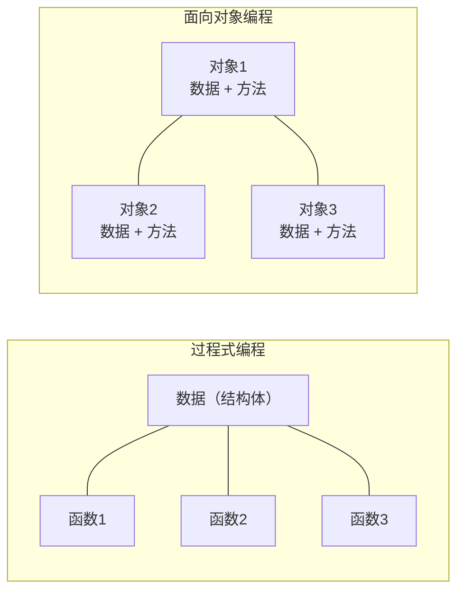

**过程式编程**：程序 = 数据结构 + 算法。数据是"被动的"，函数是"主动的"。

**面向对象编程（OOP）**：将数据和操作数据的方法封装在一起，形成"对象"。

#### 对比示例：计算圆的面积

**过程式方式**：
```cpp
// 数据与操作分离
struct Circle {
    double radius;
};

double calcArea(const Circle& c) {
    return 3.14159 * c.radius * c.radius;
}

int main() {
    Circle c{5.0};
    printf("Area: %f\n", calcArea(c));  // 函数调用者需要知道用哪个函数
    return 0;
}
```

**面向对象方式**：
```cpp
// 数据与操作封装在一起
class Circle {
private:
    double radius;
public:
    Circle(double r) : radius(r) {}
    
    double area() const {  // 对象自己知道如何计算面积
        return 3.14159 * radius * radius;
    }
};

int main() {
    Circle c(5.0);
    cout << "Area: " << c.area() << endl;  // 直接问对象
    return 0;
}
```

**关键差异**：
- 过程式：函数是独立的，数据是裸露的，任何函数都可以修改数据
- OOP：数据和操作绑定，对象的内部状态受到保护

### 10.1.2 OOP 三大特性

| 特性 | 说明 | C++ 支持 |
|------|------|----------|
| **封装** | 将数据和操作绑定，对外隐藏实现 | `class`、访问控制（`private/protected/public`） |
| **继承** | 从现有类派生新类，复用和扩展功能 | `class Derived : public Base` |
| **多态** | 同一接口不同行为 | 虚函数、函数重载、模板 |

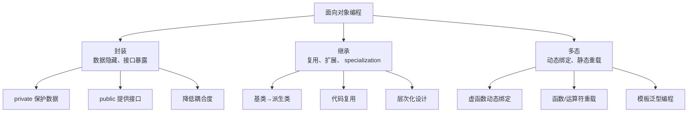

### 10.1.3 OOP 的优势场景

| 场景 | 过程式的问题 | OOP 的优势 |
|------|------------|-----------|
| **大型项目** | 函数散布各处，数据全局可见，难以维护 | 通过类组织代码，职责清晰，易于维护 |
| **团队协作** | 需要约定数据结构和函数的命名规范 | 类提供清晰的接口契约，不同开发者负责不同类 |
| **需求变更** | 修改数据结构需要修改所有相关函数 | 封装隐藏内部实现，修改内部不影响外部接口 |
| **代码复用** | 通过拷贝修改代码，容易引入 bug | 通过继承和组合复用代码，更安全 |
| **复杂状态管理** | 需要手动管理状态一致性 | 构造函数和成员函数确保对象始终处于有效状态 |

### 10.1.4 类的设计哲学

**类的本质**：类是一种**抽象数据类型（ADT）**，它定义了：
1. **数据成员**：对象的状态（有什么）
2. **成员函数**：对象的行为（能做什么）
3. **访问控制**：哪些部分对外可见（接口 vs 实现）

**设计类的核心思想**：
- **高内聚**：类的内部数据和操作紧密结合
- **低耦合**：类与类之间的依赖尽量少
- **信息隐藏**：隐藏实现细节，暴露清晰接口
- **单一职责**：一个类只负责一个明确的职责

---

## 10.2 类的定义与声明

### 10.2.1 类的语法

```cpp
class ClassName {
private:
    // 私有成员（默认）
    数据类型 成员变量;
    
public:
    // 公有成员
    返回类型 成员函数(参数列表);
    
protected:
    // 保护成员（继承相关）
};
```

### 10.2.2 第一个类——Stock 类

```cpp
#include <iostream>
#include <string>
using namespace std;

// Stock.h — 类的声明
class Stock {
private:                          // 私有部分（默认访问级别）
    string company;               // 成员变量（数据成员）
    int shares;
    double share_val;
    double total_val;
    
    void setTotal() {             // 私有成员函数（工具函数）
        total_val = shares * share_val;
    }

public:                           // 公有部分（接口）
    void acquire(const string& co, int n, double pr);
    void buy(int num, double price);
    void sell(int num, double price);
    void update(double price);
    void show();
};
```

### 10.2.3 访问控制的详细原理

C++ 提供了三种访问说明符来控制类的成员访问权限：

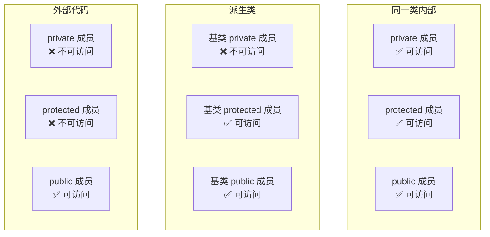

**访问控制的本质**：
- 访问控制在**编译期**检查，不是运行时检查
- 访问控制是基于**类**的，不是基于**对象**的
  - 同一个类的不同对象之间可以直接访问对方的私有成员

```cpp
class Point {
private:
    int x, y;
public:
    Point(int x, int y) : x(x), y(y) {}
    
    // 同一个类的不同对象可以互相访问私有成员！
    double distanceTo(const Point& other) const {
        int dx = x - other.x;  // ✅ other.x 是私有成员，但可以访问
        int dy = y - other.y;  // ✅ 因为是在 Point 类的成员函数中
        return sqrt(dx*dx + dy*dy);
    }
    
    // 拷贝赋值函数同样可以访问其他对象的私有成员
    void copyFrom(const Point& other) {
        x = other.x;  // ✅ 同一类的成员函数可以访问其他对象的私有成员
        y = other.y;
    }
};
```

**访问说明符的作用范围**：每个访问说明符的作用范围是从它出现的位置开始，直到下一个访问说明符或类结束。

```cpp
class Example {
    // 如果没有写访问说明符，默认是 private
    int a;           // private
    
public:
    int b;           // public
    int c;           // public
    
private:
    int d;           // private
    
protected:
    int e;           // protected
};
```

### 10.2.4 struct vs class 详细对比

在 C++ 中，`struct` 和 `class` 除了默认访问权限外，在语法功能上是完全相同的。

| 对比维度 | `struct` | `class` |
|---------|---------|--------|
| **默认访问权限** | `public` | `private` |
| **默认继承方式** | `public` 继承 | `private` 继承 |
| **模板参数** | 可以用 `template <typename T>` | 可以用 `template <typename T>` |
| **可以定义成员函数** | 可以 | 可以 |
| **可以定义构造函数/析构函数** | 可以 | 可以 |
| **可以定义虚函数** | 可以 | 可以 |
| **可以继承** | 可以 | 可以 |
| **可以有多态** | 可以 | 可以 |

```cpp
// struct 也可以有构造函数、成员函数、访问控制
struct Date {
private:  // struct 中也可以使用 private
    int year, month, day;
    
public:
    Date(int y, int m, int d) : year(y), month(m), day(d) {}
    
    void print() const {
        cout << year << "-" << month << "-" << day << endl;
    }
};

// class 也可以用于纯数据聚合
class Point {
public:  // 显式声明为 public
    double x;
    double y;
};
```

**业界惯例**：
- **`struct`**：用于表示**纯数据集合**、POD（Plain Old Data）类型、没有复杂行为的简单数据结构
- **`class`**：用于表示**具有封装和行为**的抽象数据类型

```cpp
// struct 的常见用途：简单的数据传输对象
struct Address {
    string street;
    string city;
    string zipCode;
};

// class 的常见用途：具有业务逻辑的抽象
class Customer {
private:
    string name;
    Address address;  // 组合使用 struct
    double creditScore;
    
public:
    Customer(const string& name, const Address& addr);
    bool isEligibleForLoan() const;
    void updateAddress(const Address& addr);
};
```

### 10.2.5 成员访问权限的选择指南

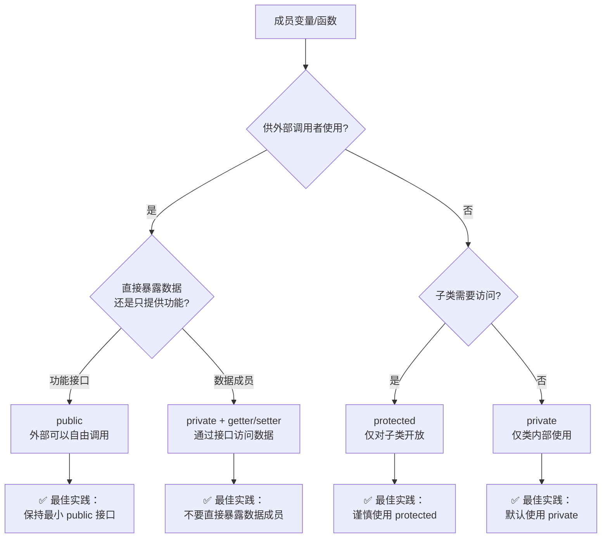

**具体建议**：

```cpp
class Widget {
public:
    // ✅ 公有接口应该小而精
    void doSomething();
    int getValue() const;
    void setValue(int v);
    
private:
    // ❌ 数据成员永远不要公有（除非是 struct 纯数据集合）
    int data;
    string name;
    
    // ✅ 辅助函数应该是私有的
    void validateData();
    void recomputeCache();
    
protected:
    // ✅ 仅当确定子类需要时，才使用 protected
    void hookFunction();  // 钩子函数，允许子类扩展
};
```

### 10.2.6 嵌套类的使用

C++ 允许在一个类内部定义另一个类，称为**嵌套类**（nested class）。

```cpp
class LinkedList {
public:
    // 嵌套类：链表的节点
    struct Node {
        int data;
        Node* next;
        Node(int d, Node* n = nullptr) : data(d), next(n) {}
    };
    
    LinkedList() : head(nullptr) {}
    
    void push_front(int val) {
        head = new Node(val, head);
    }
    
    void print() const {
        for (Node* p = head; p; p = p->next) {
            cout << p->data << " ";
        }
        cout << endl;
    }
    
    ~LinkedList() {
        while (head) {
            Node* temp = head;
            head = head->next;
            delete temp;
        }
    }
    
private:
    Node* head;
};

int main() {
    LinkedList list;
    list.push_front(3);
    list.push_front(2);
    list.push_front(1);
    list.print();  // 1 2 3
    
    // LinkedList::Node n(10);  // ✅ Node 是 public 嵌套类，可以访问
    return 0;
}
```

**嵌套类的访问规则**：
- 嵌套类可以访问外层的**公有和保护**成员，但不能直接访问外层的**私有**非静态成员（除非通过引用或指针）
- 外层类可以访问嵌套类的所有成员（因为嵌套类在外层类的作用域内）
- 嵌套类可以声明在 `private` 区域以对外隐藏实现细节

```cpp
class Outer {
private:
    int secret;
    
    // 私有的嵌套类 — 对外完全隐藏
    class Helper {
    public:
        void doSomething(const Outer& o) {
            // Helper 不能直接访问 o.secret（跨类）
            // 但可以通过 Outer 的公有接口访问
        }
    };
    
public:
    Outer() : secret(42) {}
    
    class Inner {
    public:
        void show(const Outer& o) {
            cout << "Secret: ";  // Inner 也不能直接访问 Outer 的 private 成员
            // 需要通过友元或公有接口
        }
    };
};
```

---

## 10.3 成员函数

### 10.3.1 类内定义 vs 类外定义

C++ 允许成员函数在类定义内部或外部实现：

```cpp
class Example {
public:
    // 方式 1：类内定义（隐式内联）
    int getValue() const {
        return value;
    }
    
    // 方式 2：类内声明 + 类外定义
    void setValue(int v);
    
private:
    int value;
};

// 类外定义：需要使用作用域解析运算符 ::
void Example::setValue(int v) {
    value = v;
}
```

**选择指南**：

| 特点 | 类内定义 | 类外定义 |
|------|---------|---------|
| **代码量** | 少（不需要重复写签名） | 多（需要在 .h 和 .cpp 中重复签名） |
| **编译速度** | 慢（修改成员函数需要重新编译所有包含该头文件的单元） | 快（修改 .cpp 只编译一个文件） |
| **可读性** | 类定义变得臃肿 | 类定义清晰，只包含接口 |
| **链接性** | 默认是内联的 | 普通的函数链接 |
| **适用场景** | 简单、短小的函数 | 复杂的、较长的函数 |

**最佳实践**：
- 头文件（.h）中只放类的**声明和接口**
- 实现文件（.cpp）中放成员函数的**定义**
- 只有极其简单的函数（如 getter/setter）才在类内定义

### 10.3.2 内联成员函数的细节

**类内定义的函数默认是内联的**，也可以用 `inline` 关键字显式声明：

```cpp
class MathOps {
public:
    // 方式 1：类内定义 — 隐式内联
    int square(int x) const {
        return x * x;
    }
    
    // 方式 2：显式内联
    inline int cube(int x) const;
    
    // 方式 3：类外定义时可以加 inline
    int doubleIt(int x) const;
};

inline int MathOps::cube(int x) const {
    return x * x * x;
}

inline int MathOps::doubleIt(int x) const {
    return 2 * x;
}
```

**内联函数的注意事项**：
- 内联只是对编译器的**建议**，编译器可以选择忽略
- 内联函数的定义通常放在头文件中（因为调用处需要看到完整定义）
- 递归函数不能真正内联
- 过长的函数即使声明为内联，编译器也会忽略

```cpp
// MathOps.h — 内联函数的定义通常放在头文件中
class MathOps {
public:
    inline int add(int a, int b) const {
        return a + b;
    }
};
```

### 10.3.3 成员函数的重载

成员函数和普通函数一样可以重载：

```cpp
class Printer {
public:
    // 重载的 print 函数
    void print(int i) {
        cout << "整数: " << i << endl;
    }
    
    void print(double d) {
        cout << "浮点数: " << d << endl;
    }
    
    void print(const string& s) {
        cout << "字符串: " << s << endl;
    }
    
    // 参数个数不同也可以重载
    void print(int i, int base) {
        cout << "整数 " << i << " (基 " << base << ")" << endl;
    }
};

int main() {
    Printer p;
    p.print(42);          // 调用 print(int)
    p.print(3.14);        // 调用 print(double)
    p.print("Hello");     // 调用 print(const string&)
    p.print(255, 16);     // 调用 print(int, int)
    return 0;
}
```

**重载解析规则**：
1. 精确匹配
2. 提升匹配（如 `int` -> `double`）
3. 标准转换（如 `int` -> `char`）
4. 用户定义的转换

```cpp
class Demo {
public:
    void func(int i) { cout << "int: " << i << endl; }
    void func(double d) { cout << "double: " << d << endl; }
    void func(int i, double d) { cout << "int, double: " << i << ", " << d << endl; }
};

int main() {
    Demo d;
    d.func(10);           // func(int)
    d.func(3.14f);        // func(double) — float 提升为 double
    d.func('A');          // func(int) — char 提升为 int
    d.func(10, 3.14);     // func(int, double)
    return 0;
}
```

---

## 10.4 构造函数

### 10.4.1 为什么需要构造函数

上述 Stock 程序有一个问题：`Stock s1;` 之后，`s1` 的成员变量**未初始化**（包含垃圾值）。我们需要一个在创建对象时自动初始化的机制——**构造函数**。

```cpp
Stock s1;  // 成员变量包含垃圾值！
```

构造函数的**三个核心作用**：
1. **自动调用**：对象创建时自动执行，无需手动调用
2. **初始化数据**：确保对象从诞生起就处于有效状态
3. **资源获取**：可以分配动态内存、打开文件等

### 10.4.2 构造函数的基本定义

```cpp
#include <iostream>
#include <string>
using namespace std;

class Stock {
private:
    string company;
    int shares;
    double share_val;
    double total_val;
    void setTotal() { total_val = shares * share_val; }

public:
    // 构造函数：没有返回类型，名与类名相同
    Stock(const string& co, int n, double pr);
    
    // 析构函数：没有返回类型，名前加 ~
    ~Stock();
    
    void show();
};

// 构造函数实现
Stock::Stock(const string& co, int n, double pr) {
    company = co;
    if (n < 0) {
        cerr << "股票数量不能为负！设置为 0。\n";
        shares = 0;
    } else {
        shares = n;
    }
    share_val = pr;
    setTotal();
    cout << company << " 的构造函数被调用" << endl;
}

// 析构函数实现
Stock::~Stock() {
    cout << company << " 的析构函数被调用" << endl;
}
```

### 10.4.3 各种构造函数调用方式的详细图解

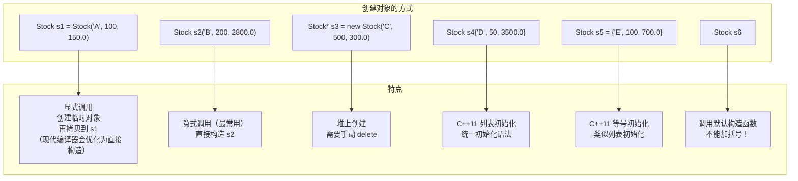

```cpp
// 方式 1：显式调用
Stock s1 = Stock("Apple", 100, 150.0);

// 方式 2：隐式调用（最常用）
Stock s2("Google", 200, 2800.0);

// 方式 3：使用 new 在堆上创建
Stock* s3 = new Stock("Microsoft", 500, 300.0);
delete s3;  // 调用析构函数

// 方式 4：C++11 列表初始化
Stock s4{"Amazon", 50, 3500.0};
Stock s5 = {"Tesla", 100, 700.0};

// 方式 5：默认构造函数
Stock s6;  // 需要默认构造函数
```

**关于方式1的说明**：`Stock s1 = Stock("Apple", 100, 150.0);` 在 C++ 早期版本中，会先创建一个临时对象，然后通过拷贝构造函数初始化 `s1`。现代编译器（C++17 起）通过 **拷贝消除**（copy elision）优化，通常会直接构造 `s1`，行为和方式2完全相同。

### 10.4.4 默认构造函数

**如果没有定义任何构造函数**，编译器会自动生成一个默认构造函数（不做任何事）。

**如果定义了任何构造函数**，编译器就不再提供默认构造函数。

```cpp
class Stock {
public:
    Stock() {                          // 显式定义默认构造函数
        company = "no name";
        shares = 0;
        share_val = 0.0;
        setTotal();
    }
    
    Stock(const string& co, int n, double pr);  // 带参数的构造函数
};

// 现在两种声明都合法
Stock s1;                          // 调用默认构造函数
Stock s2("Apple", 100, 150.0);     // 调用带参构造函数

// ⚠️ 注意：不要被下面的语句迷惑
Stock s3();                        // ❌ 这声明了一个函数！不是对象！
Stock s4;                          // ✅ 这才是调用默认构造函数
```

`Stock s3();` 这个陷阱被称为 **C++ 最令人费解的解析**（Most Vexing Parse）——编译器将其解释为一个名为 `s3`、返回 `Stock` 类型、参数为空的函数声明。

#### 默认构造函数的生成条件

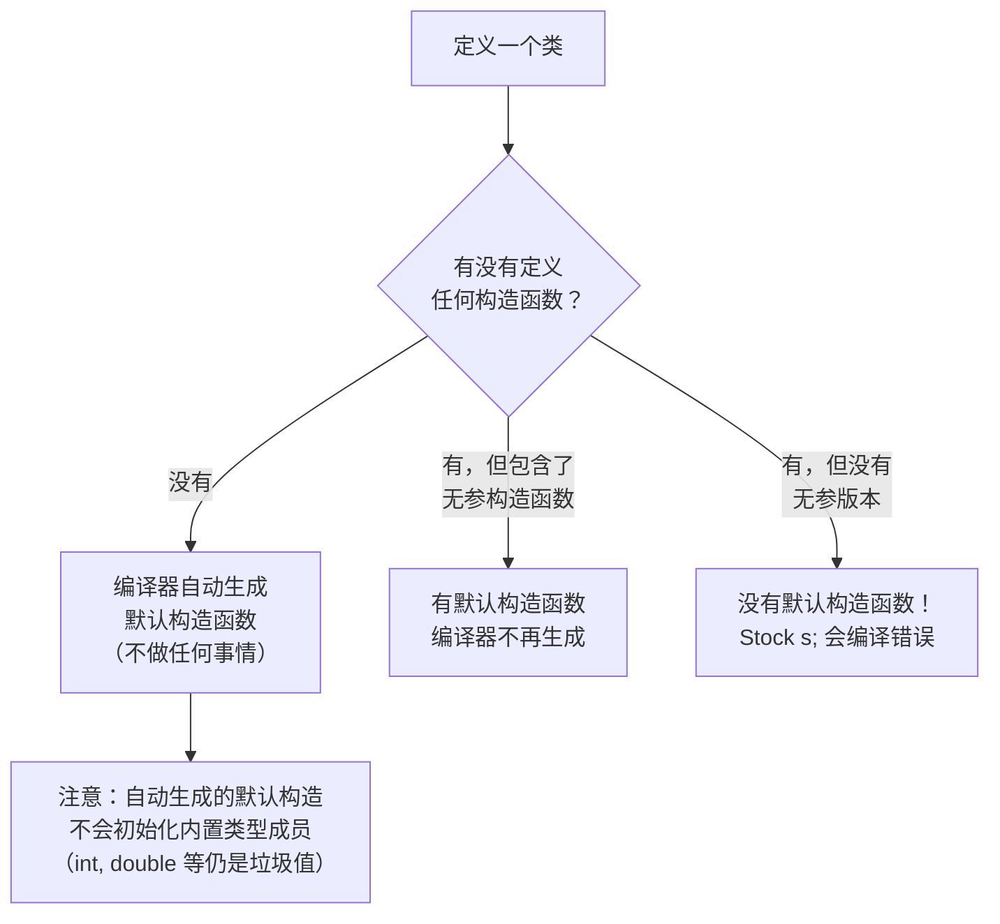

```cpp
class A {
public:
    A(int x) {}  // 有参构造函数，没有提供默认构造
};

A a;    // ❌ 编译错误：没有默认构造函数


class B {
    // 没有定义任何构造函数
    int x;
    double y;
    string s;
};

B b;    // ✅ 编译器生成了默认构造函数
        // ⚠️ 但 x 和 y 是未初始化的（垃圾值）！
        // s 会通过 string 的默认构造函数初始化为空字符串

cout << b.x;  // ❓ 未定义行为（x 是垃圾值）
```

### 10.4.5 委托构造函数（C++11）

C++11 允许一个构造函数调用另一个构造函数，避免代码重复：

```cpp
class Student {
private:
    string name;
    int age;
    double score;
    
public:
    // 主构造函数：接受所有参数
    Student(const string& n, int a, double s)
        : name(n), age(a), score(s) {
        cout << "主构造函数被调用" << endl;
    }
    
    // 委托构造函数1：只接受名字和年龄，成绩默认 0.0
    Student(const string& n, int a)
        : Student(n, a, 0.0) {  // 委托给主构造函数
        cout << "委托构造函数1被调用" << endl;
    }
    
    // 委托构造函数2：只接受名字，年龄默认 18，成绩默认 0.0
    Student(const string& n)
        : Student(n, 18, 0.0) {  // 委托给主构造函数
        cout << "委托构造函数2被调用" << endl;
    }
    
    // 默认构造函数：委托给主构造函数
    Student()
        : Student("未知", 18, 0.0) {
        cout << "默认构造函数被调用" << endl;
    }
};

int main() {
    Student s1("张三", 20, 95.5);
    // 输出：主构造函数被调用
    
    Student s2("李四", 19);
    // 输出：主构造函数被调用
    //       委托构造函数1被调用
    
    Student s3("王五");
    // 输出：主构造函数被调用
    //       委托构造函数2被调用
    
    Student s4;
    // 输出：主构造函数被调用
    //       默认构造函数被调用
    
    return 0;
}
```

**委托构造函数的注意事项**：
- 委托关系不能形成**循环**（编译器会报错）
- 一旦委托给另一个构造函数，当前构造函数的初始化列表就不能再初始化其他成员
- 被委托的构造函数执行完毕后，再执行当前构造函数的函数体

```cpp
// ❌ 错误：循环委托
class Bad {
public:
    Bad() : Bad(1) {}
    Bad(int x) : Bad() {}  // 循环委托！编译错误
};

// ❌ 错误：委托构造函数不能再有初始化列表
class Bad2 {
public:
    int x, y;
    Bad2(int a, int b) : x(a), y(b) {}
    Bad2(int a) : Bad2(a, 0), x(a) {}  // ❌ 编译错误！
};
```

### 10.4.6 继承构造函数（C++11）

C++11 允许派生类通过 `using` 声明继承基类的构造函数：

```cpp
class Base {
public:
    Base() { cout << "Base()\n"; }
    Base(int x) { cout << "Base(int " << x << ")\n"; }
    Base(int x, int y) { cout << "Base(int " << x << ", int " << y << ")\n"; }
    Base(const string& s) { cout << "Base(string " << s << ")\n"; }
};

class Derived : public Base {
public:
    // 继承 Base 的所有构造函数
    using Base::Base;  // 继承构造函数
    
    // 可以添加自己的构造函数
    Derived(double d) : Base() {  // 手动调用 Base()
        cout << "Derived(double " << d << ")\n";
    }
};

int main() {
    Derived d1;           // 调用 Base()
    Derived d2(42);       // 调用 Base(int)
    Derived d3(1, 2);     // 调用 Base(int, int)
    Derived d4("hello");  // 调用 Base(string)
    Derived d5(3.14);     // 调用 Derived(double)
    return 0;
}
```

**继承构造函数的注意事项**：
- `using Base::Base` 会将基类的所有构造函数引入派生类的作用域
- 如果派生类定义了相同签名的构造函数，则继承的构造函数被隐藏
- 继承的构造函数和被继承的基类构造函数具有相同的访问级别
- 继承构造函数不会改变参数的默认值

### 10.4.7 单参数构造函数的 explicit 最佳实践

**单参数构造函数**可以作为隐式类型转换的转换函数。这在某些情况下很方便，但也可能导致意外的转换：

```cpp
class String {
public:
    // 单参数构造函数：可以将 const char* 隐式转换为 String
    String(const char* s) {
        // ...
    }
};

void printString(const String& s) {
    cout << "String: " << /* ... */ << endl;
}

int main() {
    String s1 = "hello";  // ✅ 隐式转换：const char* → String
    printString("world"); // ✅ 隐式转换：const char* → String（可能出乎意料！）
    return 0;
}
```

**使用 `explicit` 禁止隐式转换**：

```cpp
class String {
public:
    explicit String(const char* s) {
        // ...
    }
    explicit String(int size) {
        // 分配 size 大小的缓冲区
    }
};

int main() {
    String s1 = "hello";  // ❌ 编译错误！explicit 禁止了隐式转换
    String s2("hello");   // ✅ 显式调用，允许
    String s3{"hello"};   // ✅ 列表初始化，允许
    
    // String s4 = 10;    // ❌ 编译错误！不会将 int 隐式转换为 String
    String s5(10);        // ✅ 显式调用
    
    return 0;
}
```

`explicit` 关键字用于阻止通过构造函数进行隐式类型转换，只能用于构造函数（C++11 起也可以用于转换运算符）。

**最佳实践**：
- **所有单参数构造函数都应该声明为 `explicit`**，除非你有非常充分的理由
- 多参数构造函数（C++11 起也可以显式指定 `explicit`）

```cpp
class Point {
public:
    // ✅ 好的做法：禁止隐式转换
    explicit Point(double x, double y) : x_(x), y_(y) {}
    
    // ❌ 危险的做法：允许隐式转换
    // Point(double x, double y) : x_(x), y_(y) {}
    
private:
    double x_, y_;
};

void drawPoint(const Point& p) {
    // ...
}

int main() {
    drawPoint(Point(3.0, 4.0));  // ✅ 必须显式构造
    // drawPoint({3.0, 4.0});    // ❌ 编译错误（如果 explicit）
    return 0;
}
```

### 10.4.8 默认构造函数的特殊情况

**编译器不生成默认构造函数的情况**：
1. 用户定义了任何构造函数（无论是否有参数）
2. 类的某些成员没有默认构造函数
3. 类的基类没有默认构造函数

**编译器生成默认构造函数的情况**：
- 用户没有定义任何构造函数
- 并且所有成员变量都有默认构造函数（或者内置类型不介意未初始化）

```cpp
class NoDefault {
public:
    NoDefault(int x) {}  // 没有默认构造函数
};

class Container {
public:
    NoDefault nd;
    // ❌ 编译器不会生成 Container 的默认构造函数
    // 因为 NoDefault 没有默认构造函数，Container 无法初始化 nd
};

// 解决方案：显式定义默认构造函数
class Container2 {
public:
    NoDefault nd;
    
    Container2() : nd(0) {}  // 显式初始化没有默认构造的成员
    Container2(int x) : nd(x) {}
};
```

**C++11 的 `= default` 和 `= delete`**：

```cpp
class Widget {
public:
    // = default：要求编译器生成默认的默认构造函数
    Widget() = default;
    
    // = delete：禁止使用默认构造函数
    Widget(const Widget&) = delete;  // 禁止拷贝
    Widget& operator=(const Widget&) = delete;  // 禁止赋值
    
    Widget(int x) : data(x) {}
    
private:
    int data;
};

Widget w1;      // ✅ 使用 = default 生成的默认构造函数
Widget w2(42);  // ✅ 使用带参构造函数
// Widget w3 = w1;  // ❌ 拷贝构造函数被 delete
```

---

## 10.5 初始化列表（成员初始化器）

### 10.5.1 初始化列表的基本使用

```cpp
class Stock {
private:
    string company;
    int shares;
    double share_val;
    double total_val;

public:
    // 构造函数初始化列表 — 更高效的方式
    Stock(const string& co, int n, double pr) 
        : company(co), shares(n), share_val(pr) {
        // 此时 company, shares, share_val 已经初始化完毕
        setTotal();  // 计算总价值
    }
};
```

**为什么用初始化列表？**

```cpp
// ❌ 不使用初始化列表
Stock::Stock(const string& co, int n, double pr) {
    company = co;        // 先调用默认构造函数创建 company，再通过赋值修改
    shares = n;          // 先创建 shares（未初始化），再赋值
}

// ✅ 使用初始化列表
Stock::Stock(const string& co, int n, double pr) 
    : company(co), shares(n), share_val(pr) {
    // 直接调用拷贝构造函数初始化，更高效
}
```

```mermaid
flowchart LR
    subgraph 不使用初始化列表
        S1["成员 company<br/>先默认构造"] --> S2["再赋值<br/>company = co"]
    end
    
    subgraph 使用初始化列表
        S3["成员 company<br/>直接拷贝构造<br/>company(co)"]
    end
    
    S1 --> |"效率低<br/>多了一次默认构造"| S2
    S3 --> |"效率高<br/>直接初始化"|
```

### 10.5.2 必须使用初始化列表的场景

```cpp
class Example {
private:
    const int x;              // const 成员
    int& ref;                 // 引用成员
    OtherClass obj;           // 没有默认构造函数的类类型成员
    
public:
    // ✅ 必须使用初始化列表！
    Example(int v, int& r, const OtherClass& o) 
        : x(v), ref(r), obj(o) {
    }
};

// ❌ 不能在函数体内初始化
Example::Example(int v, int& r, const OtherClass& o) {
    x = v;      // ❌ const 成员不能赋值！
    ref = r;    // ❌ 引用成员不能重新绑定！
    obj = o;    // ❌ 如果 OtherClass 没有默认构造函数，这一步已经失败
}
```

**详细的必须使用初始化列表的场景**：

```cpp
class Base {
public:
    Base(int x) { /* ... */ }  // 没有默认构造函数
};

class MemberType {
public:
    MemberType(const string& s) { /* ... */ }  // 没有默认构造函数
};

class Derived : public Base {
private:
    const int CONST_VALUE;
    int& reference;
    MemberType member;

public:
    // 全部必须通过初始化列表初始化
    Derived(int c, int& r, const string& s) 
        : Base(42),       // ✅ 基类没有默认构造函数
          CONST_VALUE(c), // ✅ const 成员
          reference(r),   // ✅ 引用成员
          member(s)       // ✅ 成员没有默认构造函数
    {
        // 函数体此时已经太晚了
    }
};
```

**更多陷阱案例**：

```cpp
class Wrong {
public:
    Wrong(int x) {
        data = x;  // 错误认知：先创建 data 再赋值
    }
    
    // 实际上，在进入构造函数体之前，
    // data 已经被默认构造了（如果有默认构造函数）
    // 或者根本就没有初始化（如果是内置类型）
    
private:
    // 如果 data 是 const/引用/没有默认构造的类型
    // 这个程序甚至无法编译！
    // const int data;
};

// 正确做法
class Right {
public:
    Right(int x) : data(x) {}
    
private:
    int data;
};
```

### 10.5.3 初始化顺序的注意事项

**初始化顺序是由成员在类中的声明顺序决定的，不是初始化列表中的顺序！**

```cpp
class Trap {
private:
    int b;  // 先声明
    int a;  // 后声明
    
public:
    // 看起来很合理：先初始化 a，再初始化 b
    Trap(int value) : a(value), b(a) {
        // 但实际上，先初始化 b（先声明的），再初始化 a
        // b 初始化时，a 还没有初始化！
    }
};

// 实际初始化顺序：
// 1. 先初始化 b（因为 b 先声明）
// 2. 再初始化 a
// 所以 b(a) 使用的是未初始化的 a 的值！

Trap obj(42);
// 结果是：obj.b 是垃圾值！obj.a 是 42
```

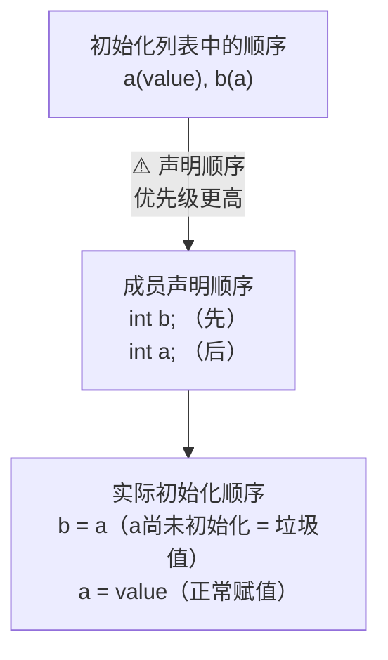

**正确的做法**：

```cpp
class Safe {
private:
    int a;  // 需要先初始化
    int b;  // 依赖 a
    
public:
    // ✅ 初始化列表的顺序与声明顺序一致
    Safe(int value) : a(value), b(a) {
    }
};

// 更好的做法：让初始化列表顺序和声明顺序一致
class Safe2 {
private:
    int a;
    int b;
    
public:
    Safe2(int value) : a(value), b(a) {}
    // ✅ 顺序一致，不会出错
};
```

**更多陷阱案例**：

```cpp
class ArrayWrapper {
private:
    int size;    // 先声明
    int* arr;    // 后声明
    
public:
    // ❌ 陷阱写法
    ArrayWrapper(int n) : arr(new int[n]), size(n) {
        // 声明顺序：先 size 后 arr
        // 但实际上初始化顺序：arr（先声明？不对，size 先声明，size 先初始化）
        // 等一下，让我们重新检查声明顺序：
        // int size; 先声明
        // int* arr; 后声明
        // 所以实际初始化顺序：先 size（未初始化！），再 arr（使用 size？）
    }
    
    // ✅ 正确写法：声明顺序优先
    ArrayWrapper(int n) : size(n), arr(new int[size]) {
        // 先初始化 size，再初始化 arr（使用 size 的值）
    }
};
```

### 10.5.4 类内初始值（C++11）

C++11 允许在**类定义内部**直接为成员变量提供初始值：

```cpp
class Stock {
private:
    string company = "未命名公司";  // 类内初始值
    int shares = 0;                 // 类内初始值
    double share_val = 0.0;         // 类内初始值
    double total_val = 0.0;         // 类内初始值

public:
    // 使用类内初始值的构造函数
    Stock() = default;  // 使用类内初始值
    
    // 覆盖类内初始值的构造函数
    Stock(const string& co, int n, double pr) 
        : company(co), shares(n), share_val(pr) {
        setTotal();
    }
    
    void setTotal() { total_val = shares * share_val; }
    
    void show() const {
        cout << "公司: " << company << ", 持股: " << shares << endl;
    }
};

int main() {
    Stock s1;                    // 使用类内初始值
    s1.show();                   // 公司: 未命名公司, 持股: 0
    
    Stock s2("Apple", 100, 150.0);  // 覆盖类内初始值
    s2.show();                   // 公司: Apple, 持股: 100
    
    return 0;
}
```

**类内初始值的优先级规则**：

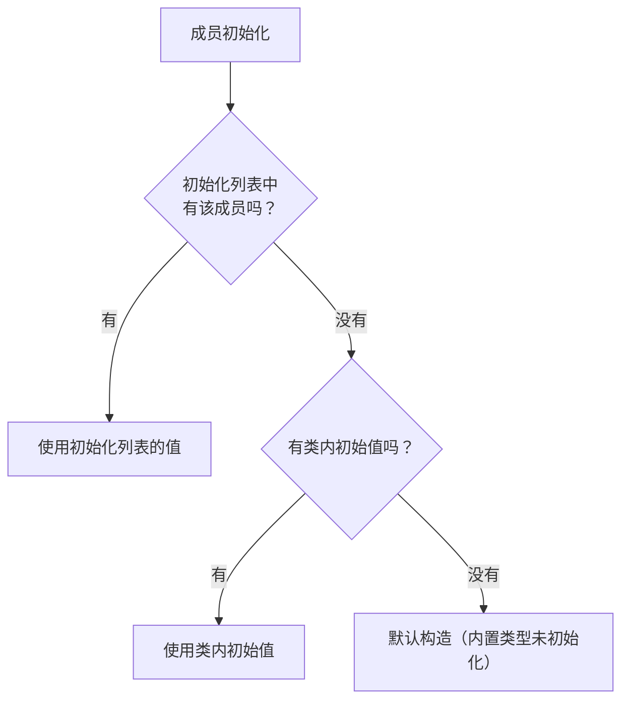

```cpp
class Demo {
private:
    int a = 1;       // 类内初始值
    int b = 2;       // 类内初始值
    int c;           // 没有初始值
    int d;           // 没有初始值
    
public:
    Demo() {}                 // a=1, b=2, c=垃圾值, d=垃圾值
    Demo(int x) : a(x) {}     // a=x, b=2, c=垃圾值, d=垃圾值
    Demo(int x, int y) : a(x), b(y), c(x+y), d(x-y) {}  // 全部覆盖
};
```

**类内初始值的优势**：
- 所有构造函数自动获得相同的默认值
- 减少代码重复
- 降低遗漏初始化的风险
- 提高代码可读性

```cpp
// ❌ 没有类内初始值：容易遗漏
class OldWay {
private:
    string title;
    string author;
    int pages;
    
public:
    OldWay() : title(""), author(""), pages(0) {}
    OldWay(const string& t) : title(t), author(""), pages(0) {}
    OldWay(const string& t, const string& a) : title(t), author(a), pages(0) {}
    // ⚠️ 如果新增成员变量，所有构造函数都要修改
};

// ✅ 使用类内初始值：更安全，更简洁
class NewWay {
private:
    string title = "";
    string author = "";
    int pages = 0;
    
public:
    NewWay() = default;
    NewWay(const string& t) : title(t) {}
    NewWay(const string& t, const string& a) : title(t), author(a) {}
    // ✅ 新增成员变量只需要在类内初始化一次
};
```

---

## 10.6 析构函数

### 10.6.1 析构函数的调用时机详解

**析构函数**在对象销毁时自动调用。不同存储类别的对象在**不同时机**销毁：

```cpp
#include <iostream>
#include <string>
using namespace std;

class Demo {
private:
    string name;
public:
    Demo(const string& n) : name(n) {
        cout << name << " 构造" << endl;
    }
    ~Demo() {
        cout << name << " 析构" << endl;
    }
};

// 全局对象
Demo global("全局对象");

void func() {
    cout << "--- 进入 func ---" << endl;
    Demo local("局部对象");        // 构造函数调用
    static Demo staticLocal("静态局部对象");  // 静态局部对象
    cout << "--- 离开 func ---" << endl;
}  // 局部对象析构（离开作用域）

int main() {
    cout << "--- 进入 main ---" << endl;
    
    func();
    func();
    
    Demo* heap = new Demo("堆对象");
    cout << "堆对象还活着" << endl;
    delete heap;  // 堆对象析构（手动释放）
    
    cout << "--- 离开 main ---" << endl;
    return 0;
}
// 全局对象析构（main 返回后）
// 静态局部对象析构（main 返回后，在全局对象之前）

/* 输出：
全局对象 构造
--- 进入 main ---
--- 进入 func ---
局部对象 构造
静态局部对象 构造
--- 离开 func ---
局部对象 析构
--- 进入 func ---
--- 离开 func ---
局部对象 析构
堆对象 构造
堆对象还活着
堆对象 析构
--- 离开 main ---
全局对象 析构
静态局部对象 析构
*/
```

**析构函数的调用时机总结**：

| 对象类型 | 析构时机 |
|---------|---------|
| **自动变量（局部对象）** | 离开其作用域时 |
| **静态局部对象** | 程序结束时（main 返回后） |
| **全局对象** | 程序结束时（main 返回后） |
| **堆对象（new）** | 调用 `delete` 时 |
| **临时对象** | 表达式结束时 |
| **容器中的对象** | 容器被销毁时 |
| **数组中的对象** | 数组被销毁时（逆序销毁） |
| **成员对象** | 外层对象析构后（逆序销毁） |

### 10.6.2 RAII 的详细概念和应用

**RAII（Resource Acquisition Is Initialization）**——资源获取即初始化，是 C++ 中最核心的编程范式之一。

**核心思想**：
1. 将资源（内存、文件、锁等）的获取与对象的**构造函数**绑定
2. 将资源（内存、文件、锁等）的释放与对象的**析构函数**绑定
3. 资源的管理与对象的生命周期自动关联

```cpp
// RAII 示例：文件管理
#include <iostream>
#include <fstream>
#include <string>
using namespace std;

class FileGuard {
private:
    ofstream file;
    
public:
    // 构造函数：获取资源（打开文件）
    FileGuard(const string& filename) : file(filename) {
        if (!file.is_open()) {
            throw runtime_error("无法打开文件: " + filename);
        }
        cout << "文件 " << filename << " 已打开" << endl;
    }
    
    // 写入文件
    void write(const string& data) {
        if (file.is_open()) {
            file << data << endl;
        }
    }
    
    // 析构函数：释放资源（关闭文件）
    ~FileGuard() {
        if (file.is_open()) {
            file.close();
            cout << "文件已自动关闭" << endl;
        }
    }
    
    // 禁止拷贝（防止资源重复释放）
    FileGuard(const FileGuard&) = delete;
    FileGuard& operator=(const FileGuard&) = delete;
};

void processFile() {
    FileGuard fg("data.txt");  // ✅ 打开文件
    fg.write("第一行数据");
    fg.write("第二行数据");
    // 如果在写入过程中抛出异常，fg 的析构函数仍然会被调用！
    // 文件一定会被正确关闭！
}  // ✅ fg 的析构函数自动关闭文件

int main() {
    try {
        processFile();
    } catch (const exception& e) {
        cerr << "错误: " << e.what() << endl;
    }
    // 文件已经被正确关闭，即使发生了异常
    return 0;
}
```

**RAII 的优势**：

```mermaid
flowchart TD
    subgraph 传统方式（C 风格）
        C1["fopen()"] --> C2["使用文件"]
        C2 --> C3{"有错误？"}
        C3 -->|"是"| C4["必须记得 fclose()"]
        C3 -->|"否"| C2
        C4 --> C5{"记得了？"}
        C5 -->|"否"| C6["资源泄漏！"]
    end
    
    subgraph RAII（C++ 方式）
        R1["构造函数中打开文件"] --> R2["使用文件"]
        R2 --> R3["析构函数自动关闭"]
        R3 --> R4["即使异常也能保证释放"]
    end
    
    C6 --> |"对比"| R4
```

**RAII 的典型应用场景**：

```cpp
// 1. 动态内存管理
class Widget {
private:
    int* data;       // 需要手动管理 → 改用 unique_ptr
    
public:
    Widget() : data(new int(0)) {}
    ~Widget() { delete data; }  // 必须手动释放
};

// 更好的 RAII 方式：使用智能指针
class BetterWidget {
private:
    unique_ptr<int> data = make_unique<int>(0);
    // 不需要自定义析构函数！
};

// 2. 互斥锁管理
class LockGuard {
private:
    mutex& mtx;
    
public:
    explicit LockGuard(mutex& m) : mtx(m) {
        mtx.lock();
        cout << "已加锁" << endl;
    }
    
    ~LockGuard() {
        mtx.unlock();
        cout << "已解锁" << endl;
    }
    
    LockGuard(const LockGuard&) = delete;
    LockGuard& operator=(const LockGuard&) = delete;
};

void threadSafeFunc(mutex& mtx) {
    LockGuard lock(mtx);  // 自动加锁
    // ... 临界区代码 ...
}  // 自动解锁，即使发生异常

// 3. 数据库连接管理
class DBConnection {
private:
    sql::Connection* conn;
    
public:
    DBConnection(const string& connStr) {
        conn = DriverManager::getConnection(connStr);
    }
    
    ~DBConnection() {
        if (conn) {
            conn->close();
            delete conn;
        }
    }
    
    // 使用连接执行查询...
    
    DBConnection(const DBConnection&) = delete;
    DBConnection& operator=(const DBConnection&) = delete;
};
```

### 10.6.3 析构顺序的规则

**成员的析构顺序与构造顺序相反**。

```cpp
class Member {
private:
    string name;
public:
    Member(const string& n) : name(n) {
        cout << name << " 构造" << endl;
    }
    ~Member() {
        cout << name << " 析构" << endl;
    }
};

class Container {
private:
    Member a{"成员A"};  // 先声明
    Member b{"成员B"};  // 后声明
    Member c{"成员C"};  // 更后
    
public:
    Container() {
        cout << "Container 构造" << endl;
    }
    ~Container() {
        cout << "Container 析构" << endl;
    }
};

int main() {
    Container c;
    return 0;
}

/* 输出：
成员A 构造
成员B 构造
成员C 构造
Container 构造
Container 析构
成员C 析构    ← 注意：与构造顺序相反！
成员B 析构
成员A 析构
*/
```

**完整析构顺序规则**：

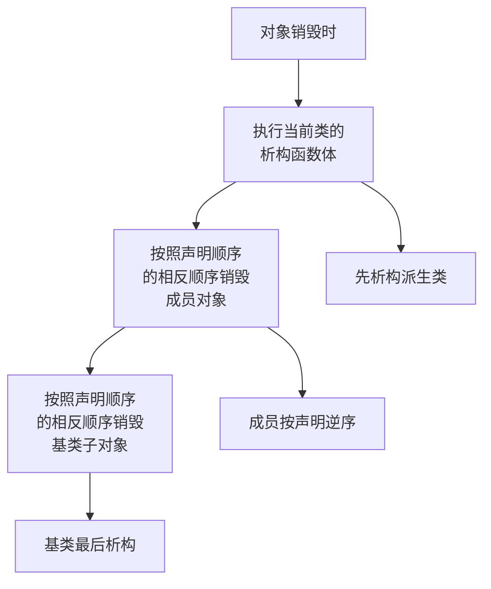

```cpp
class Base {
public:
    Base() { cout << "Base 构造\n"; }
    ~Base() { cout << "Base 析构\n"; }
};

class Derived : public Base {
private:
    string name;
    
public:
    Derived(const string& n) : name(n) {
        cout << "Derived 构造: " << name << "\n";
    }
    ~Derived() {
        cout << "Derived 析构: " << name << "\n";
    }
};

int main() {
    Derived d("示例");
    return 0;
}

/* 输出：
Base 构造           ← 先构造基类
Derived 构造: 示例  ← 再构造派生类
Derived 析构: 示例  ← 先析构派生类
Base 析构           ← 再析构基类
*/
```

**数组中的析构顺序**：

```cpp
int main() {
    cout << "--- 构造数组 ---" << endl;
    Member arr[3] = {"A", "B", "C"};  // A, B, C 顺序构造
    
    cout << "--- 析构数组 ---" << endl;
    // C, B, A 逆序析构
    return 0;
}

/* 输出：
--- 构造数组 ---
A 构造
B 构造
C 构造
--- 析构数组 ---
C 析构
B 析构
A 析构
*/
```

---

## 10.7 const 成员函数

### 10.7.1 问题场景

```cpp
const Stock apple("Apple", 100, 150.0);
apple.show();    // ❌ 编译错误！
```

为什么？因为 `apple` 是 `const` 对象，不能调用可能修改它的成员函数。编译器不知道 `show()` 是否会修改成员变量。

### 10.7.2 const 成员函数声明

```cpp
class Stock {
public:
    void show() const;  // const 成员函数：保证不修改任何成员变量
};

// const 成员函数的实现
void Stock::show() const {
    cout << "公司: " << company << endl;
    cout << "持股: " << shares << " 股" << endl;
    // shares = 0;  // ❌ const 成员函数中不能修改成员变量
}
```

**规则**：
- `const` 对象只能调用 `const` 成员函数
- 非 `const` 对象可以调用 `const` 和非 `const` 成员函数
- `const` 成员函数中不能修改非 `mutable` 成员变量

> **最佳实践**：不修改对象的成员函数都应该声明为 `const`。

### 10.7.3 const 成员函数的底层机制

在 C++ 中，每个成员函数都有一个**隐式的 `this` 指针**。`const` 成员函数实际上是将 `this` 指针声明为指向常量的指针：

```cpp
// 非 const 成员函数中，this 的类型是：
//   Stock* const this     ← this 本身是 const，但指向的对象可以修改
//   （可以修改成员变量）

// const 成员函数中，this 的类型是：
//   const Stock* const this  ← this 本身是 const，指向的对象也是 const
//   （不能修改成员变量）

class Stock {
public:
    // show 被编译器理解为：
    // void show(const Stock* const this) {
    //     cout << this->company;  // this->company 是 const
    //     this->shares = 0;       // ❌ 不能修改 const 对象
    // }
    void show() const;
    
    // buy 被编译器理解为：
    // void buy(Stock* const this, int num, double price) {
    //     this->shares += num;    // ✅ 可以修改非 const 对象
    // }
    void buy(int num, double price);
};
```

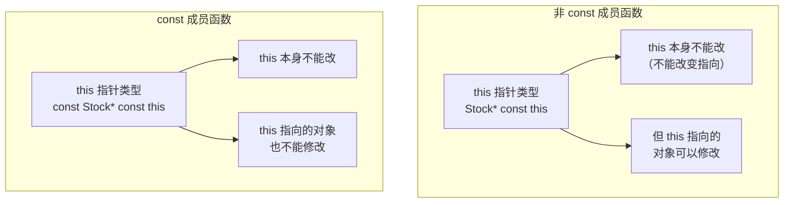

### 10.7.4 const 重载（const 版本和非 const 版本）

C++ 允许同时提供同一个成员函数的 `const` 和非 `const` 版本：

```cpp
#include <iostream>
#include <vector>
using namespace std;

class MyVector {
private:
    vector<int> data;
    
public:
    MyVector(initializer_list<int> list) : data(list) {}
    
    // const 版本：返回 const 引用，const 对象只能调用此版本
    const int& operator[](size_t index) const {
        cout << "const 版本被调用" << endl;
        return data[index];
    }
    
    // 非 const 版本：返回非 const 引用，允许修改元素
    int& operator[](size_t index) {
        cout << "非 const 版本被调用" << endl;
        return data[index];
    }
};

int main() {
    MyVector v{1, 2, 3, 4, 5};
    
    v[1] = 100;     // 调用非 const 版本（可以修改）
    cout << v[1] << endl;  // 调用非 const 版本
    
    const MyVector cv{10, 20, 30};
    // cv[0] = 100;  // ❌ 编译错误：const 对象不能修改
    cout << cv[0] << endl;  // 调用 const 版本
    
    return 0;
}
```

**另一个常见模式：const 和非 const getter**：

```cpp
class Person {
private:
    string name;
    vector<int> scores;
    
public:
    Person(const string& n) : name(n) {}
    
    // 非 const 版本：返回非 const 引用，可以修改
    vector<int>& getScores() {
        return scores;
    }
    
    // const 版本：返回 const 引用，只能读取
    const vector<int>& getScores() const {
        return scores;
    }
    
    const string& getName() const {
        return name;
    }
};

int main() {
    Person p("张三");
    p.getScores().push_back(95);  // 通过非 const 引用修改
    p.getScores().push_back(88);
    
    const Person& cp = p;
    cout << cp.getName() << " 的成绩: ";
    for (int s : cp.getScores()) {  // ✅ const 版本
        cout << s << " ";
    }
    cout << endl;
    // cp.getScores().push_back(90);  // ❌ const 引用不能修改
    
    return 0;
}
```

### 10.7.5 mutable 与 const 成员函数的配合

有时候，`const` 成员函数需要修改一些与对象逻辑状态无关的成员变量（如缓存、引用计数等）。

```cpp
class DataProcessor {
private:
    int data;
    mutable int cacheResult;    // 缓存计算结果
    mutable bool cacheValid;    // 缓存是否有效
    
public:
    DataProcessor(int d) : data(d), cacheResult(0), cacheValid(false) {}
    
    // const 成员函数，但可以修改 mutable 成员
    int compute() const {
        if (!cacheValid) {
            cacheResult = expensiveCompute();  // ✅ 可以修改 mutable 成员
            cacheValid = true;
        }
        return cacheResult;
    }
    
    // 当数据变化时，使缓存失效
    void setData(int d) {
        data = d;
        cacheValid = false;  // 缓存不再有效
    }
    
private:
    int expensiveCompute() const {
        // 模拟复杂计算
        int result = 0;
        for (int i = 0; i < 1000000; i++) {
            result += data;  // 读取 data（const 上下文中允许）
        }
        return result;
    }
};

int main() {
    DataProcessor dp(42);
    cout << dp.compute() << endl;  // 第一次计算，缓存
    cout << dp.compute() << endl;  // 使用缓存
    
    dp.setData(100);
    cout << dp.compute() << endl;  // 重新计算
    
    const DataProcessor& cdp = dp;
    cout << cdp.compute() << endl;  // ✅ const 对象也可以调用
    
    return 0;
}
```

**`mutable` 的典型使用场景**：
1. **缓存**：存储计算结果的缓存
2. **引用计数**：如 `shared_ptr` 的控制块
3. **互斥锁**：`const` 函数中需要加锁
4. **调试信息**：记录函数调用次数

```cpp
class ThreadSafeCounter {
private:
    mutable mutex mtx;   // 互斥锁需要是 mutable
    int count = 0;
    
public:
    // const 成员函数，但需要修改 mutex
    int getCount() const {
        lock_guard<mutex> lock(mtx);  // ✅ mutex 是 mutable
        return count;
    }
    
    void increment() {
        lock_guard<mutex> lock(mtx);
        count++;
    }
};
```

---

## 10.8 this 指针

### 10.8.1 this 指针的概念

**`this`** 是一个隐式指针，指向**调用成员函数的对象本身**。

```cpp
class Stock {
private:
    string company;
    double total_val;
    
public:
    void show() const {
        // this 指向调用 show() 的对象
        cout << this->company;  // 等价于 cout << company;
    }
};
```

### 10.8.2 this 指针的底层实现

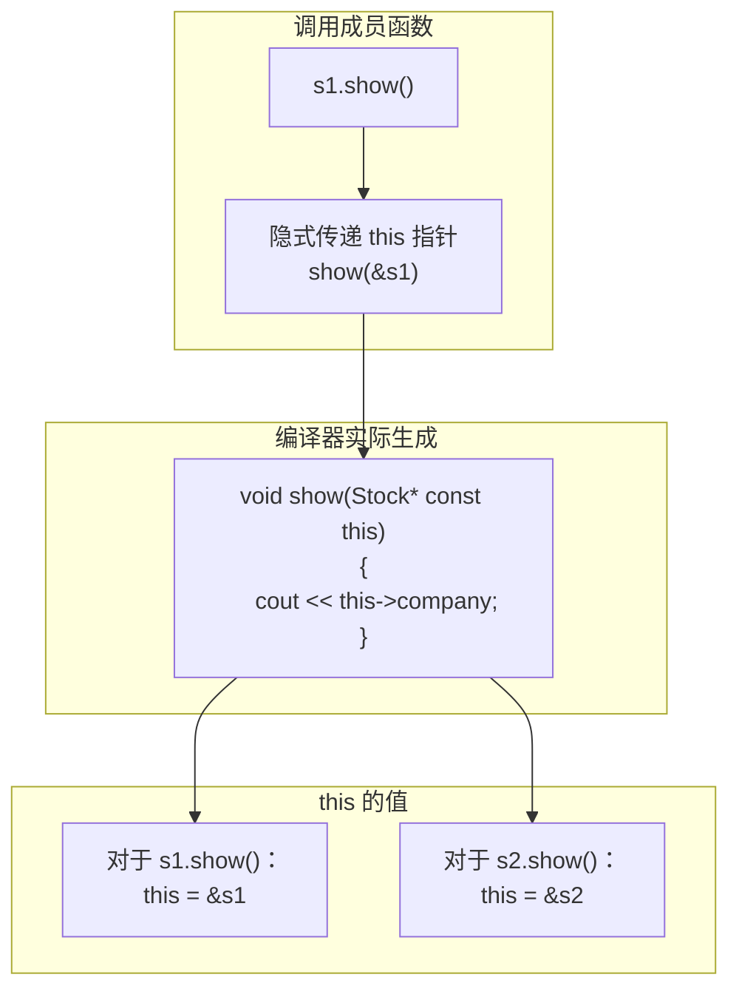

在编译器层面，成员函数会被转换为类似下面的形式：

```cpp
// 你写的 C++ 代码
class Stock {
    string company;
public:
    void show() const {
        cout << company;  // 直接访问成员
    }
};

// 编译器实际生成的代码（简化）
void Stock_show(const Stock* const this) {
    cout << this->company;  // 通过 this 指针访问
}

// 调用时：s1.show()
// 编译器转换为：Stock_show(&s1);
```

### 10.8.3 this 指针的典型应用模式

**模式 1：返回当前对象（支持链式调用）**

```cpp
class Counter {
private:
    int value;
    
public:
    Counter() : value(0) {}
    
    Counter& increment() {
        value++;
        return *this;    // 返回当前对象的引用
    }
    
    Counter& add(int n) {
        value += n;
        return *this;
    }
    
    void print() const {
        cout << "Value: " << value << endl;
    }
};

int main() {
    Counter c;
    c.increment().add(5).increment().add(10);  // 链式调用
    c.print();  // Value: 17
    
    // 返回引用（Counter&）避免了对象拷贝，效率更高
    return 0;
}
```

**模式 2：区分同名的参数和成员变量**

```cpp
class Person {
private:
    string name;
    int age;
    
public:
    // 参数名和成员变量名相同，使用 this-> 区分
    Person(const string& name, int age) {
        this->name = name;  // this->name 是成员变量
        this->age = age;    // age 是参数
    }
    
    void setName(const string& name) {
        this->name = name;
    }
    
    void print() const {
        cout << "Name: " << this->name << ", Age: " << this->age << endl;
    }
};
```

**模式 3：比较当前对象与其他对象**

```cpp
class Stock {
private:
    string company;
    double total_val;
    
public:
    // 比较两个 Stock 对象
    const Stock& topVal(const Stock& s) const {
        if (s.total_val > total_val) {
            return s;      // 返回传入的对象
        } else {
            return *this;  // 返回当前对象
        }
    }
};

int main() {
    Stock s1("Apple", 100, 150.0);
    Stock s2("Google", 200, 2800.0);
    
    const Stock& better = s1.topVal(s2);
    // 在 s1.topVal(s2) 中：
    //   this = &s1
    //   s.total_val = s2.total_val
    
    return 0;
}
```

**模式 4：避免自我赋值**

```cpp
class String {
private:
    char* data;
    int length;
    
public:
    // 在拷贝赋值中检查自我赋值
    String& operator=(const String& other) {
        if (this != &other) {  // 检查是否是自我赋值
            delete[] data;
            
            length = other.length;
            data = new char[length + 1];
            strcpy(data, other.data);
        }
        return *this;
    }
};
```

**模式 5：在回调中使用 this**

```cpp
#include <functional>

class Button {
private:
    string label;
    function<void()> clickHandler;
    
public:
    Button(const string& lbl) : label(lbl) {}
    
    void onClick(function<void()> handler) {
        clickHandler = handler;
    }
    
    void click() {
        if (clickHandler) {
            clickHandler();
        }
    }
};

class Dialog {
private:
    Button okButton;
    int clickCount = 0;
    
public:
    Dialog() : okButton("确定") {
        // 使用 this 捕获当前对象
        okButton.onClick([this]() {  // ✅ 捕获 this 指针
            this->clickCount++;
            cout << "按钮被点击了 " << clickCount << " 次" << endl;
        });
    }
    
    Button& getOkButton() { return okButton; }
};

int main() {
    Dialog dlg;
    dlg.getOkButton().click();  // 按钮被点击了 1 次
    dlg.getOkButton().click();  // 按钮被点击了 2 次
    return 0;
}
```

### 10.8.4 返回 *this 实现链式调用

链式调用是 `this` 指针最优雅的应用之一：

```cpp
class QueryBuilder {
private:
    string select_clause;
    string from_clause;
    string where_clause;
    string order_clause;
    
public:
    QueryBuilder() {}
    
    QueryBuilder& select(const string& fields) {
        select_clause = "SELECT " + fields;
        return *this;
    }
    
    QueryBuilder& from(const string& table) {
        from_clause = "FROM " + table;
        return *this;
    }
    
    QueryBuilder& where(const string& condition) {
        where_clause = "WHERE " + condition;
        return *this;
    }
    
    QueryBuilder& orderBy(const string& field, const string& dir = "ASC") {
        order_clause = "ORDER BY " + field + " " + dir;
        return *this;
    }
    
    string build() const {
        string sql = select_clause + " " + from_clause;
        if (!where_clause.empty()) sql += " " + where_clause;
        if (!order_clause.empty()) sql += " " + order_clause;
        return sql + ";";
    }
};

int main() {
    // 优雅的链式调用
    string sql = QueryBuilder()
                    .select("id, name, age")
                    .from("users")
                    .where("age > 18")
                    .orderBy("name")
                    .build();
    
    cout << sql << endl;
    // SELECT id, name, age FROM users WHERE age > 18 ORDER BY name ASC;
    
    return 0;
}
```

---

## 10.9 对象数组

```cpp
class Stock {
public:
    Stock() : company("default"), shares(0), share_val(0.0) {}
    Stock(const string& co, int n, double pr);
    // ...
};

int main() {
    // 创建对象数组
    Stock stocks[4];              // 需要默认构造函数
    
    // 使用列表初始化
    Stock stocks[3] = {
        Stock("Apple", 100, 150.0),
        Stock("Google", 200, 2800.0),
        Stock("Microsoft", 500, 300.0)
    };
    
    // 部分初始化
    Stock stocks[4] = {
        {"Apple", 100, 150.0},   // C++11 列表初始化
        {"Google", 200, 2800.0}
    };  // 其余调用默认构造函数
    
    // 访问
    for (int i = 0; i < 4; i++) {
        stocks[i].show();
    }
    
    return 0;
}
```

**对象数组与动态分配**：

```cpp
// 动态分配数组
Stock* arr = new Stock[10];   // 需要默认构造函数
delete[] arr;                  // 每个对象都会被析构

// 动态分配单个对象
Stock* p = new Stock("Apple", 100, 150.0);
delete p;

// 动态分配数组并用参数初始化（C++11 起）
Stock* arr2 = new Stock[3] {
    {"A", 100, 10.0},
    {"B", 200, 20.0},
    {"C", 300, 30.0}
};
delete[] arr2;
```

**对象数组的构造和析构过程**：

```cpp
class Tracker {
private:
    int id;
public:
    Tracker(int i = 0) : id(i) {
        cout << "Tracker #" << id << " 构造" << endl;
    }
    ~Tracker() {
        cout << "Tracker #" << id << " 析构" << endl;
    }
};

int main() {
    cout << "--- 创建数组 ---" << endl;
    Tracker arr[3] = {1, 2, 3};  // 构造顺序：1, 2, 3
    
    cout << "--- 使用数组 ---" << endl;
    
    cout << "--- 销毁数组 ---" << endl;
    // 析构顺序：3, 2, 1（与构造顺序相反）
    return 0;
}

/* 输出：
--- 创建数组 ---
Tracker #1 构造
Tracker #2 构造
Tracker #3 构造
--- 使用数组 ---
--- 销毁数组 ---
Tracker #3 析构
Tracker #2 析构
Tracker #1 析构
*/
```

**`vector` 容器与对象数组**：

```cpp
#include <vector>

int main() {
    // vector 比原始数组更灵活
    vector<Stock> stocks;
    
    // 添加元素
    stocks.push_back(Stock("A", 100, 10.0));
    stocks.emplace_back("B", 200, 20.0);  // 更高效：直接在容器中构造
    
    // 访问
    for (const auto& s : stocks) {
        s.show();
    }
    
    // 自动管理内存，不需要手动删除
    return 0;
}
```

---

## 10.10 类作用域

### 10.10.1 类内定义的作用域规则

```cpp
class MyClass {
private:
    int data;          // 类作用域：外部不能直接访问
    
public:
    enum { SIZE = 100 };   // 类内常量（旧方式）
    static const int MAX = 1000;  // 类内常量（C++11 方式）
    
    void setData(int d) {
        data = d;
    }
};

int main() {
    MyClass obj;
    obj.setData(10);
    // obj.data = 10;           // ❌ data 是私有成员
    // int x = MyClass::SIZE;   // ✅ 枚举值属于类作用域
    return 0;
}
```

### 10.10.2 类作用域的细节

```cpp
class ScopeDemo {
public:
    // 类型定义在类作用域内
    typedef int Number;
    using String = std::string;  // C++11 类型别名
    
    // 嵌套类
    struct Inner {
        int x;
    };
    
    // 枚举
    enum Color { RED, GREEN, BLUE };  // 传统枚举：名字在类作用域内
    
    Number getNumber() const { return value; }
    Color getColor() const { return RED; }
    
private:
    Number value;
};

int main() {
    ScopeDemo obj;
    
    ScopeDemo::Number n = 42;     // ✅ 使用类作用域访问类型别名
    // Color c = RED;              // ❌ RED 不在全局作用域
    ScopeDemo::Color c = ScopeDemo::RED;  // ✅ 必须使用类作用域
    
    ScopeDemo::Inner inner;        // ✅ 嵌套类需要通过类作用域访问
    inner.x = 10;
    
    return 0;
}
```

### 10.10.3 作用域内枚举（C++11）

```cpp
// 传统枚举
enum Color { RED, GREEN, BLUE };
enum TrafficLight { RED, YELLOW, GREEN };  // ❌ 冲突！RED/GREEN 重复

// C++11 作用域内枚举（enum class）
enum class Color { RED, GREEN, BLUE };
enum class TrafficLight { RED, YELLOW, GREEN };  // ✅ 不冲突

int main() {
    Color c = Color::RED;          // 必须使用作用域限定
    TrafficLight t = TrafficLight::RED;
    
    // Color c2 = RED;             // ❌ 错误
    // int x = Color::RED;         // ❌ 不能隐式转换为 int
    int x = static_cast<int>(Color::RED);  // ✅ 必须显式转换
    
    return 0;
}
```

**传统枚举 vs 作用域内枚举**：

| 特性 | 传统 `enum` | `enum class` |
|------|-----------|-------------|
| **作用域** | 枚举值泄露到外部作用域 | 枚举值在类作用域内 |
| **隐式转换** | 可以隐式转换为整数 | 不能隐式转换（需要 `static_cast`）|
| **前向声明** | 不支持（除非指定底层类型）| 支持 |
| **指定底层类型** | C++11 起支持 | 支持 |

```cpp
// 指定底层类型
enum class SmallEnum : char { A, B, C };  // 只占 1 字节
enum class BigEnum : long long { X, Y, Z };

// 前向声明
enum class ForwardDeclared;  // ✅ 可以前向声明

enum OldStyle : short;  // ✅ C++11 起传统枚举也可以
```

---

## 10.11 抽象数据类型（ADT）

类可以用于实现抽象数据类型（Abstract Data Type），如栈：

### 10.11.1 整数栈

```cpp
// Stack.h
class Stack {
private:
    static const int MAX = 10;  // 最大容量
    int items[MAX];              // 存储数据的数组
    int top;                     // 栈顶索引
    
public:
    Stack();                     // 构造函数
    bool isEmpty() const;
    bool isFull() const;
    bool push(const int& item);  // 入栈
    bool pop(int& item);         // 出栈
};

// Stack.cpp
#include "stack.h"

Stack::Stack() {
    top = 0;  // 栈初始化为空
}

bool Stack::isEmpty() const {
    return top == 0;
}

bool Stack::isFull() const {
    return top == MAX;
}

bool Stack::push(const int& item) {
    if (top < MAX) {
        items[top++] = item;
        return true;
    }
    return false;
}

bool Stack::pop(int& item) {
    if (top > 0) {
        item = items[--top];
        return true;
    }
    return false;
}

// main.cpp
#include <iostream>
#include "stack.h"
using namespace std;

int main() {
    Stack stack;
    int nums[] = {1, 2, 3, 4, 5};
    
    for (int n : nums) {
        if (stack.push(n)) {
            cout << n << " 入栈成功" << endl;
        }
    }
    
    int value;
    while (stack.pop(value)) {
        cout << value << " 出栈" << endl;
    }
    
    return 0;
}
```

### 10.11.2 模板栈

```cpp
template<typename T>
class Stack {
private:
    static const int MAX = 100;
    T items[MAX];
    int top;
    
public:
    Stack() : top(0) {}
    
    bool isEmpty() const { return top == 0; }
    bool isFull() const { return top == MAX; }
    
    bool push(const T& item) {
        if (top < MAX) {
            items[top++] = item;
            return true;
        }
        return false;
    }
    
    bool pop(T& item) {
        if (top > 0) {
            item = items[--top];
            return true;
        }
        return false;
    }
};

int main() {
    Stack<int> intStack;
    Stack<string> stringStack;
    
    intStack.push(42);
    stringStack.push("Hello");
    
    int i;
    string s;
    intStack.pop(i);
    stringStack.pop(s);
    
    cout << i << ", " << s << endl;  // 42, Hello
    
    return 0;
}
```

---

## 10.12 对象生命周期管理

### 10.12.1 完整生命周期

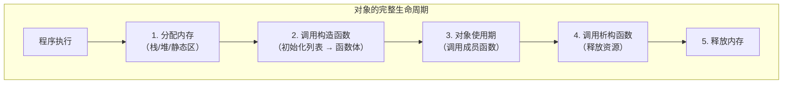

### 10.12.2 各阶段详解

**阶段1：内存分配**
- 栈对象：在栈帧中分配内存
- 堆对象：通过 `new` 在堆上分配内存
- 静态/全局对象：在数据段分配内存

**阶段2：构造**
```cpp
// 编译器生成的构造流程（伪代码）
void* constructor_Widget(Widget* this, int arg) {
    // 1. 调用基类构造函数（如果有）
    // 2. 按照声明顺序初始化成员变量（初始化列表或类内初始值）
    // 3. 执行构造函数体
    this->data = arg;  // 函数体
    return this;
}
```

**阶段3：使用**
- 通过公有接口访问对象
- 对象的状态只能通过成员函数改变

**阶段4：析构**
```cpp
// 编译器生成的析构流程（伪代码）
void destructor_Widget(Widget* this) {
    // 1. 执行析构函数体
    // 2. 按照声明逆序销毁成员变量
    // 3. 调用基类析构函数（如果有）
}
```

**阶段5：释放内存**
- 栈对象：自动调整栈指针
- 堆对象：`delete` 释放内存
- 静态/全局对象：程序结束时由运行时释放

### 10.12.3 对象生命周期的特殊情况

**临时对象的生命周期**：

```cpp
class Logger {
public:
    Logger(const string& msg) {
        cout << "LOG: " << msg << endl;
    }
    ~Logger() {
        cout << "LOG 结束" << endl;
    }
};

int main() {
    // 临时对象：在完整表达式结束时销毁
    cout << "开始计算" << endl;
    
    int result = Logger("计算中..."), 42 + 58;
    //                     ↑ 临时 Logger 对象在这里创建
    // 这一行结束后，临时对象被销毁
    
    cout << "结果: " << result << endl;
    return 0;
}

/* 输出：
开始计算
LOG: 计算中...
LOG 结束        ← 临时对象在表达式结束时析构
结果: 100
*/
```

**异常情况下的生命周期**：

```cpp
class Resource {
public:
    Resource(const string& name) : name(name) {
        cout << name << " 获取" << endl;
    }
    ~Resource() {
        cout << name << " 释放" << endl;
    }
private:
    string name;
};

void riskyFunction() {
    Resource r1("资源1");
    Resource r2("资源2");
    
    throw runtime_error("出错了！");
    // ⚠️ 抛出异常时，r1 和 r2 仍然会被正确析构！
    
    Resource r3("资源3");  // 这行不会执行
}

int main() {
    try {
        riskyFunction();
    } catch (const exception& e) {
        cout << "捕获异常: " << e.what() << endl;
    }
    return 0;
}

/* 输出：
资源1 获取
资源2 获取
资源2 释放  ← 异常发生时栈展开，自动释放
资源1 释放
捕获异常: 出错了！
*/
```

---

## 10.13 static 类成员

### 10.13.1 静态成员变量

静态成员变量被**类的所有对象共享**，而不是每个对象独有一份。

```cpp
class Account {
private:
    string owner;
    double balance;
    
    // 静态成员变量：所有账户共享
    static double interestRate;     // 声明
    static int totalAccounts;       // 声明
    
public:
    Account(const string& o, double b) 
        : owner(o), balance(b) {
        totalAccounts++;  // 每创建一个账户，总数加 1
    }
    
    ~Account() {
        totalAccounts--;
    }
    
    static double getRate() { return interestRate; }
    static void setRate(double r) { interestRate = r; }
    
    static int getTotalAccounts() { return totalAccounts; }
    
    void display() const {
        cout << owner << ": $" << balance 
             << " (利率: " << interestRate << "%)" << endl;
    }
};

// 静态成员变量的定义和初始化（必须在类外进行）
double Account::interestRate = 0.05;  // 默认利率 5%
int Account::totalAccounts = 0;

int main() {
    cout << "当前账户数: " << Account::getTotalAccounts() << endl;  // 0
    
    Account a1("张三", 1000);
    Account a2("李四", 2000);
    
    cout << "当前账户数: " << Account::getTotalAccounts() << endl;  // 2
    
    // 所有对象共享利率
    Account::setRate(0.07);
    a1.display();  // 张三: $1000 (利率: 7%)
    a2.display();  // 李四: $2000 (利率: 7%)
    
    return 0;
}
```

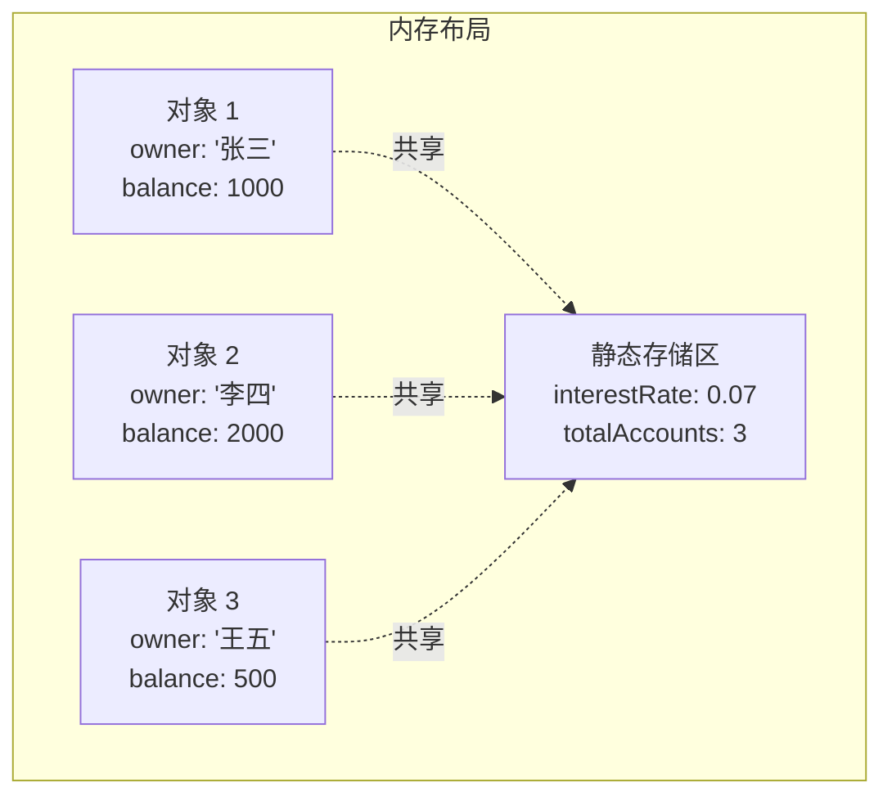

**静态成员变量的关键特性**：
- 必须在类外**定义和初始化**（const 整数类型除外）
- 所有对象**共享同一份**数据
- 可以通过**类名::成员名**访问（public 时）
- 也可以通过**对象.成员名**访问
- **sizeof(类)** 不包括静态成员变量的大小

### 10.13.2 静态成员函数

静态成员函数**不依赖于具体对象**，没有 `this` 指针。

```cpp
class MathUtils {
public:
    // 静态成员函数
    static int max(int a, int b) {
        return (a > b) ? a : b;
    }
    
    static int min(int a, int b) {
        return (a < b) ? a : b;
    }
    
    static double average(int a, int b) {
        return (a + b) / 2.0;
    }
    
    // 非静态成员函数需要对象
    void print() const {
        cout << "这不是静态函数" << endl;
    }
};

int main() {
    // 通过类名: 调用静态成员函数（不需要对象！）
    cout << MathUtils::max(10, 20) << endl;    // 20
    cout << MathUtils::min(10, 20) << endl;    // 10
    cout << MathUtils::average(10, 20) << endl; // 15
    
    // 也可以通过对象调用（不推荐）
    MathUtils utils;
    cout << utils.max(30, 40) << endl;  // 40
    
    return 0;
}
```

**静态成员函数的限制**：
- 不能访问非静态成员变量
- 不能调用非静态成员函数
- 没有 `this` 指针

```cpp
class Demo {
private:
    int data;            // 非静态成员
    static int sdata;    // 静态成员
    
public:
    static void staticFunc() {
        // data = 10;     // ❌ 不能访问非静态成员
        sdata = 10;       // ✅ 可以访问静态成员
        // nonStaticFunc(); // ❌ 不能调用非静态成员函数
        staticFunc();     // ✅ 可以调用静态成员函数
    }
    
    void nonStaticFunc() {
        data = 10;        // ✅ 可以访问非静态成员
        sdata = 10;       // ✅ 可以访问静态成员
        staticFunc();     // ✅ 可以调用静态成员函数
    }
};

int Demo::sdata = 0;
```

### 10.13.3 静态成员常量

```cpp
class Constants {
public:
    // 整型或枚举类型的 const static 可以在类内初始化
    static const int MAX_SIZE = 1000;
    static const int MIN_SIZE = 1;
    
    // C++11 起，非整型静态常量也可以使用 constexpr
    static constexpr double PI = 3.1415926535;
    static constexpr const char* GREETING = "Hello";
    
private:
    static const int DEFAULT_VALUE = 42;
};
```

### 10.13.4 单例模式（静态成员的应用）

```cpp
class Singleton {
private:
    // 私有构造函数
    Singleton() {
        cout << "Singleton 实例创建" << endl;
    }
    
    // 禁止拷贝
    Singleton(const Singleton&) = delete;
    Singleton& operator=(const Singleton&) = delete;
    
    // 唯一的静态实例指针
    static Singleton* instance;
    
public:
    // 全局访问点
    static Singleton* getInstance() {
        if (instance == nullptr) {
            instance = new Singleton();
        }
        return instance;
    }
    
    void doSomething() {
        cout << "Singleton 操作" << endl;
    }
};

Singleton* Singleton::instance = nullptr;

int main() {
    // 不能直接创建：Singleton s;  // ❌ 构造函数私有
    
    // 通过静态方法获取唯一实例
    Singleton* s1 = Singleton::getInstance();
    Singleton* s2 = Singleton::getInstance();
    
    cout << "s1 == s2: " << (s1 == s2) << endl;  // 1（相同实例）
    
    s1->doSomething();
    
    return 0;
}
```

---

## 10.14 友元简介

### 10.14.1 为什么需要友元

封装虽然好，但有时我们需要让非成员函数访问类的私有成员。友元（friend）提供了一种**受控的破例**机制。

### 10.14.2 友元函数

**友元函数不是类的成员函数，但可以访问类的私有成员**。

```cpp
class Point {
private:
    double x, y;
    
public:
    Point(double xv = 0, double yv = 0) : x(xv), y(yv) {}
    
    // 将全局函数声明为友元
    friend double distance(const Point& a, const Point& b);
    
    void display() const {
        cout << "(" << x << ", " << y << ")";
    }
};

// 友元函数的定义（不是成员函数，没有 Point::）
double distance(const Point& a, const Point& b) {
    double dx = a.x - b.x;  // ✅ 友元函数可以访问私有成员
    double dy = a.y - b.y;
    return sqrt(dx * dx + dy * dy);
}

int main() {
    Point p1(0, 0), p2(3, 4);
    cout << "距离: " << distance(p1, p2) << endl;  // 5
    return 0;
}
```

### 10.14.3 友元类

一个类可以将另一个类声明为友元，这样友元类的所有成员函数都可以访问本类的私有成员。

```cpp
class Engine {
private:
    int horsepower;
    int cylinders;
    
    // 将 Car 类声明为友元
    friend class Car;
    
public:
    Engine(int hp, int cyl) : horsepower(hp), cylinders(cyl) {}
};

class Car {
private:
    string brand;
    Engine engine;
    
public:
    Car(const string& b, int hp, int cyl) 
        : brand(b), engine(hp, cyl) {}
    
    void showDetails() const {
        // Car 类可以访问 Engine 的私有成员！
        cout << brand << ": " << engine.horsepower << "HP, "
             << engine.cylinders << "缸" << endl;
    }
};

int main() {
    Car car("宝马", 300, 6);
    car.showDetails();  // 宝马: 300HP, 6缸
    return 0;
}
```

### 10.14.4 友元成员函数

可以只将另一个类的某个成员函数设为友元，而不是整个类：

```cpp
class A;  // 前向声明

class B {
public:
    void visitA(const A& a);
};

class A {
private:
    int secret;
    
    // 只将 B::visitA 设为友元，而不是整个 B 类
    friend void B::visitA(const A& a);
    
public:
    A(int s) : secret(s) {}
};

// 友元成员函数的定义
void B::visitA(const A& a) {
    cout << "A 的秘密: " << a.secret << endl;  // ✅ 可以访问私有成员
}
```

### 10.14.5 友元的注意事项

```cpp
class FriendDemo {
private:
    int data;
    
    // 1. 友元关系不能传递
    //    A 是 B 的友元，B 是 C 的友元 ≠ A 是 C 的友元
    
    // 2. 友元关系是单向的
    //    A 是 B 的友元 ≠ B 是 A 的友元
    
    // 3. 友元关系不能被继承
    
    friend void func1();   // 友元函数
    friend class FriendClass;  // 友元类
};
```

---

## 10.15 类的最佳实践

### 10.15.1 设计好的类

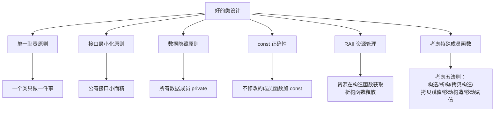

### 10.15.2 类的编码规范

```cpp
// 1. 成员变量命名规范
class GoodNaming {
private:
    int m_value;        // 使用 m_ 前缀
    int value_;         // 或使用下划线后缀
    int m_value;        // 或使用 m 前缀
    int val;            // 或直接命名（不推荐）
};

// 2. 接口设计规范
class GoodInterface {
public:
    // 最小化公有接口
    void doSomething();
    int getValue() const;
    void setValue(int v);
    
private:
    // 辅助函数放在私有部分
    void validate();
    void recompute();
};

// 3. 善用 const
class ConstCorrect {
public:
    int getValue() const;         // getter 必须是 const
    void setValue(int v);         // setter 不是 const
    const string& getName() const;  // 返回 const 引用避免拷贝
};

// 4. 使用初始化列表
class UseInitList {
private:
    const int id;           // const 需要初始化列表
    string name;
    
public:
    UseInitList(int i, const string& n) 
        : id(i), name(n) {}  // ✅ 使用初始化列表
};
```

### 10.15.3 特殊成员函数的处理

```cpp
class RuleOfFive {
private:
    char* data;
    size_t size;
    
public:
    // 1. 构造函数
    RuleOfFive(const char* s) : size(strlen(s)), data(new char[size + 1]) {
        strcpy(data, s);
    }
    
    // 2. 析构函数
    ~RuleOfFive() {
        delete[] data;
    }
    
    // 3. 拷贝构造函数
    RuleOfFive(const RuleOfFive& other) 
        : size(other.size), data(new char[other.size + 1]) {
        strcpy(data, other.data);
    }
    
    // 4. 拷贝赋值运算符
    RuleOfFive& operator=(const RuleOfFive& other) {
        if (this != &other) {
            delete[] data;
            size = other.size;
            data = new char[size + 1];
            strcpy(data, other.data);
        }
        return *this;
    }
    
    // 5. 移动构造函数（C++11）
    RuleOfFive(RuleOfFive&& other) noexcept 
        : data(other.data), size(other.size) {
        other.data = nullptr;
        other.size = 0;
    }
    
    // 6. 移动赋值运算符（C++11）
    RuleOfFive& operator=(RuleOfFive&& other) noexcept {
        if (this != &other) {
            delete[] data;
            data = other.data;
            size = other.size;
            other.data = nullptr;
            other.size = 0;
        }
        return *this;
    }
};
```

### 10.15.4 类设计的常见模式

```cpp
// 模式 1：不可复制类
class UniqueResource {
private:
    int* resource;
    
public:
    UniqueResource() : resource(new int(0)) {}
    ~UniqueResource() { delete resource; }
    
    // 禁止拷贝
    UniqueResource(const UniqueResource&) = delete;
    UniqueResource& operator=(const UniqueResource&) = delete;
    
    // 允许移动
    UniqueResource(UniqueResource&& other) noexcept 
        : resource(other.resource) {
        other.resource = nullptr;
    }
};

// 模式 2：值类型类（像 int 一样使用）
class Point {
public:
    int x, y;
    
    Point(int xv, int yv) : x(xv), y(yv) {}
    
    // 自动生成拷贝构造、拷贝赋值、析构函数即可
    // 因为所有成员都是 int（平凡类型）
};

// 模式 3：接口类（纯虚函数）
class IShape {
public:
    virtual ~IShape() = default;
    virtual double area() const = 0;
    virtual double perimeter() const = 0;
};
```

---

## 10.16 常见错误

### 10.16.1 编译期错误

**错误 1：忘记在类名后加分号**

```cpp
class MyClass {
    int data;
}  // ❌ 编译错误：expected ';' after class definition
```

**错误 2：构造函数与类名不一致**

```cpp
class Stock {
public:
    Stockk(const string& co, int n, double pr);  // ❌ 拼写错误
    // 编译器认为 Stockk 是一个普通的成员函数（返回类型？）
};
```

**错误 3：构造函数声明了返回类型**

```cpp
class Stock {
public:
    void Stock(const string& co, int n, double pr);  // ❌ 构造函数不能有返回类型
};
```

**错误 4：在 const 成员函数中修改成员变量**

```cpp
class Demo {
    int data;
public:
    void func() const {
        data = 10;  // ❌ 编译错误：不能修改 const 对象
    }
};
```

**错误 5：使用 `Stock s3()` 试图调用默认构造函数**

```cpp
Stock s3();  // ❌ 被解释为函数声明
s3.show();   // ❌ s3 被当作函数名，不是对象
```

**错误 6：为构造函数显示声明返回类型**

```cpp
class Demo {
public:
    void Demo() { }  // ❌ 编译器会认为 Demo() 返回 void，不是构造函数
};
```

**错误 7：试图访问私有成员**

```cpp
Stock s;
// s.shares = 100;  // ❌ shares 是 private 成员
```

**错误 8：隐式转换导致的意外行为**

```cpp
class String {
public:
    String(int size) { /* 分配 size 大小的缓冲区 */ }
};

String s = 'A';  // ❓ 编译通过！但 'A' 被转换为 int 65
                  // 不是创建包含 "A" 的字符串，而是分配 65 字节的缓冲区！
// 解决方案：explicit String(int size);
```

### 10.16.2 运行时错误

**错误 9：使用未初始化的成员变量**

```cpp
class Point {
    int x, y;
public:
    // 构造函数没有初始化 x 和 y！
    Point() {}
    
    void print() const {
        cout << x << ", " << y;  // ❓ 未定义行为：输出垃圾值
    }
};
```

**错误 10：浅拷贝导致的双重释放**

```cpp
class StringBad {
    char* str;
public:
    StringBad(const char* s) {
        str = new char[strlen(s) + 1];
        strcpy(str, s);
    }
    // ❌ 没有定义拷贝构造函数和拷贝赋值运算符
    // ❌ 没有定义析构函数
};

void problem() {
    StringBad s1("Hello");
    StringBad s2 = s1;  // 浅拷贝：s2.str 和 s1.str 指向同一块内存
    // 析构时：s1 和 s2 都会 delete[] str，导致双重释放！
}
```

**错误 11：忘记定义默认构造函数**

```cpp
class Widget {
public:
    Widget(int x) { /* ... */ }
    // ❌ 没有默认构造函数
};

Widget arr[10];     // ❌ 编译错误：没有默认构造函数
Widget* p = new Widget[10];  // ❌ 编译错误：没有默认构造函数
```

**错误 12：初始化顺序依赖**

```cpp
class Array {
    int size;  // 先声明
    int* arr;  // 后声明
public:
    Array(int n) : arr(new int[n]), size(n) {
        // ❌ 实际初始化顺序：先 size（未初始化），再 arr（使用 size）
        // arr 初始化时 size 还是垃圾值！
    }
};
```

**错误 13：在析构函数中抛出异常**

```cpp
class Bad {
public:
    ~Bad() {
        throw runtime_error("error");  // ❌ 析构函数中抛出异常非常危险！
        // 如果析构函数是在栈展开期间被调用的，程序会立即终止！
    }
};
```

**错误 14：this 指针被用于不该用的地方**

```cpp
class Callback {
public:
    void registerCallback() {
        // 如果对象被销毁而回调还在，this 就成了野指针！
        someGlobalSystem->register([this]() {
            this->doSomething();  // ❌ 危险！对象可能已销毁
        });
    }
    
    void doSomething() { /* ... */ }
};
```

**错误 15：静态成员的类外定义缺失**

```cpp
class Config {
    static int timeout;  // 声明
};

// ⚠️ 忘记了在类外定义：
// int Config::timeout = 30;

int main() {
    // Config::timeout = 30;  // ❌ 链接错误：未定义的外部符号
    return 0;
}
```

**错误 16：空悬指针和野指针**

```cpp
class ResourceOwner {
private:
    int* data;
public:
    ResourceOwner() : data(new int(42)) {}
    
    // 默认拷贝构造函数导致浅拷贝
    // ResourceOwner r2 = r1;  // r1.data 和 r2.data 指向相同地址
    
    ~ResourceOwner() {
        delete data;  // 如果 r1 和 r2 指向同一地址，双重删除！
    }
};
```

**错误 17：返回局部对象的引用**

```cpp
class Wrapper {
private:
    int value;
public:
    Wrapper(int v) : value(v) {}
    
    Wrapper& createWrapper(int v) {
        Wrapper temp(v);
        return temp;  // ❌ 返回局部对象的引用！
    }  // temp 在这里就被销毁了！
};
```

### 10.16.3 逻辑/设计错误

**错误 18：公有数据成员**

```cpp
class Account {
public:
    double balance;  // ❌ 任何人都可以修改余额
    
    void deposit(double amount) {
        if (amount > 0) balance += amount;
    }
};

int main() {
    Account acc;
    acc.deposit(100);
    acc.balance = -1000000;  // ❌ 绕过验证直接修改余额！
    return 0;
}
```

**错误 19：getter 返回非 const 引用**

```cpp
class Student {
private:
    vector<int> scores;
    
public:
    vector<int>& getScores() {  // ❌ 返回非 const 引用
        return scores;           // 外部可以任意修改私有数据！
    }
};

int main() {
    Student s;
    s.getScores().push_back(100);  // 绕过封装！
    return 0;
}
// ✅ 应该返回 const 引用，并提供专门的修改接口
```

**错误 20：忘记将非修改成员函数标记为 const**

```cpp
class Point {
    double x, y;
public:
    double getX() { return x; }  // ❌ 应该加 const
    
    void print(/* const Point* this */) {
        cout << x << ", " << y;  // 不修改成员
    }
};

int main() {
    const Point cp(3, 4);
    // cp.getX();  // ❌ 编译错误：const 对象不能调用非 const 函数
    return 0;
}
```

---

## 10.17 动手练习

### 练习 1：矩形类

设计一个 `Rectangle` 类，包含：
- 私有成员：`width`（宽度）、`height`（高度）
- 构造函数初始化宽度和高度
- 成员函数：`area()` 计算面积、`perimeter()` 计算周长、`display()` 显示信息
- 适当的 const 成员函数

```cpp
// 参考实现框架
class Rectangle {
private:
    double width;
    double height;
    
public:
    Rectangle(double w, double h);
    double area() const;
    double perimeter() const;
    void display() const;
};
```

### 练习 2：银行账户类

完善本章中的 `BankAccount` 类，添加：
- 交易记录功能（记录每次存取款）
- 计算利息功能（按年利率计算）
- 修改账户密码功能（假设有密码成员）
- 禁止直接修改余额

### 练习 3：时间类

设计一个 `Time` 类：
- 私有成员：小时（0-23）、分钟（0-59）、秒（0-59）
- 处理时间溢出（如 70 分变成 1 小时 10 分）
- 加法运算（两个时间相加）
- 比较运算（判断哪个时间更早）
- 显示时间（12 小时制和 24 小时制）

### 练习 4：图书类

设计一个 `Book` 类：
- 私有成员：标题、作者、ISBN、是否借出
- 构造函数初始化图书信息
- 借书和还书功能
- 显示图书信息
- 静态成员统计图书馆藏书总量

### 练习 5：学生成绩类

设计一个 `StudentScore` 类：
- 持有多个科目的成绩
- 计算总分、平均分、最高分、最低分
- 按成绩等级返回（A/B/C/D/F）
- 判断是否及格（所有科目 >= 60）

### 练习 6：计数器类

设计一个 `Counter` 类：
- 可以递增、递减
- 可以设置初始值
- 可以重置为 0
- 通过链式调用实现 `counter.increment().increment().add(5).print()`

### 练习 7：字符串包装器

设计一个简单的 `MyString` 类：
- 使用动态内存管理
- 实现构造函数、析构函数、拷贝构造函数、拷贝赋值运算符
- 获取字符串长度、连接字符串
- 转换为 C 风格字符串

### 练习 8：温度转换器

设计一个 `Temperature` 类：
- 可以以摄氏度或华氏度存储温度
- 提供转换函数
- 支持比较操作
- 静态成员保存常用温度常量（如绝对零度）

### 练习 9：队列类

设计一个 `Queue` 类（FIFO 数据结构）：
- 使用固定大小的数组存储
- `enqueue()` 入队
- `dequeue()` 出队
- `isEmpty()` 和 `isFull()` 判断
- `size()` 返回当前元素数量

### 练习 10：日期类

设计一个 `Date` 类：
- 年、月、日私有成员
- 检查日期合法性
- 计算两个日期之间的天数差
- 判断闰年
- 返回星期几
- 以多种格式显示日期（YYYY-MM-DD、MM/DD/YYYY 等）

### 练习 11：简单的向量类

设计一个 `Vector2D` 类：
- x 和 y 坐标
- 计算向量的模长
- 向量加法、减法
- 点积运算
- 判断两个向量是否垂直
- 链式调用支持

### 练习 12：日志记录器类

设计一个 `Logger` 类：
- 支持不同日志级别（DEBUG、INFO、WARNING、ERROR）
- 静态方法用于全局访问
- 可以设置输出目标（控制台、文件）
- 添加时间戳
- 使用 RAII 管理文件资源

---

## 10.18 综合案例

### 10.18.1 日期类（Date）

```cpp
#include <iostream>
#include <string>
#include <iomanip>
using namespace std;

class Date {
private:
    int year;
    int month;
    int day;
    
    // 判断闰年
    static bool isLeapYear(int y) {
        return (y % 4 == 0 && y % 100 != 0) || (y % 400 == 0);
    }
    
    // 获取某月的天数
    static int daysInMonth(int y, int m) {
        static const int days[] = {31, 28, 31, 30, 31, 30, 31, 31, 30, 31, 30, 31};
        if (m == 2 && isLeapYear(y)) return 29;
        return days[m - 1];
    }
    
    // 验证日期合法性
    bool isValid() const {
        if (year < 1900 || year > 2100) return false;
        if (month < 1 || month > 12) return false;
        if (day < 1 || day > daysInMonth(year, month)) return false;
        return true;
    }
    
public:
    // 构造函数
    Date(int y = 1900, int m = 1, int d = 1) 
        : year(y), month(m), day(d) {
        if (!isValid()) {
            cerr << "无效的日期!" << endl;
            year = 1900; month = 1; day = 1;
        }
    }
    
    // getter
    int getYear() const { return year; }
    int getMonth() const { return month; }
    int getDay() const { return day; }
    
    // 判断闰年（静态方法）
    static bool isLeap(int y) { return isLeapYear(y); }
    
    // 当前日期是否为闰年
    bool isCurrentYearLeap() const { return isLeapYear(year); }
    
    // 计算从公元元年开始的天数（用于日期差计算）
    long toDays() const {
        long total = 0;
        for (int y = 1; y < year; y++) {
            total += isLeapYear(y) ? 366 : 365;
        }
        for (int m = 1; m < month; m++) {
            total += daysInMonth(year, m);
        }
        total += day;
        return total;
    }
    
    // 计算两个日期的天数差
    long diff(const Date& other) const {
        return toDays() - other.toDays();
    }
    
    // 获取星期几（0=周日, 1=周一, ..., 6=周六）
    int getDayOfWeek() const {
        // 基姆拉尔森计算公式
        int y = year, m = month, d = day;
        if (m <= 2) { y--; m += 12; }
        int week = (d + 2*m + 3*(m+1)/5 + y + y/4 - y/100 + y/400) % 7;
        return (week + 1) % 7;  // 调整为 0=周日
    }
    
    // 获取星期名称
    string getDayOfWeekName() const {
        static const char* names[] = {"周日", "周一", "周二", "周三", 
                                       "周四", "周五", "周六"};
        return names[getDayOfWeek()];
    }
    
    // 显示日期（多种格式）
    void display1() const {  // YYYY-MM-DD
        cout << year << "-" << setw(2) << setfill('0') 
             << month << "-" << setw(2) << day;
    }
    
    void display2() const {  // MM/DD/YYYY
        cout << setw(2) << setfill('0') << month << "/"
             << setw(2) << day << "/" << year;
    }
    
    void display3() const {  // 中文格式
        static const char* chMonths[] = {"一月", "二月", "三月", "四月", "五月", "六月",
                                          "七月", "八月", "九月", "十月", "十一月", "十二月"};
        cout << year << "年" << chMonths[month-1] << day << "日";
    }
    
    void displayWithWeek() const {
        display1();
        cout << " (" << getDayOfWeekName() << ")";
    }
};

int main() {
    Date today(2025, 6, 1);
    Date birthday(2000, 1, 1);
    
    cout << "今天: ";
    today.displayWithWeek();
    cout << endl;
    
    cout << "生日: ";
    birthday.display3();
    cout << endl;
    
    cout << "相差: " << today.diff(birthday) << " 天" << endl;
    cout << "今年" << (Date::isLeap(2025) ? "是" : "不是") << "闰年" << endl;
    
    return 0;
}
```

### 10.18.2 图书管理类

```cpp
#include <iostream>
#include <string>
#include <vector>
using namespace std;

class Book {
private:
    string isbn;
    string title;
    string author;
    double price;
    bool borrowed;
    string borrower;
    
public:
    Book() : isbn(""), title(""), author(""), price(0.0), 
             borrowed(false), borrower("") {}
    
    Book(const string& isbn, const string& title, const string& author, double price)
        : isbn(isbn), title(title), author(author), price(price),
          borrowed(false), borrower("") {}
    
    // getter
    string getISBN() const { return isbn; }
    string getTitle() const { return title; }
    string getAuthor() const { return author; }
    double getPrice() const { return price; }
    bool isBorrowed() const { return borrowed; }
    string getBorrower() const { return borrower; }
    
    // 借书
    bool borrowBook(const string& person) {
        if (borrowed) {
            cout << "《" << title << "》已被借出!" << endl;
            return false;
        }
        borrowed = true;
        borrower = person;
        cout << "《" << title << "》已借给 " << person << endl;
        return true;
    }
    
    // 还书
    bool returnBook(const string& person) {
        if (!borrowed) {
            cout << "《" << title << "》未被借出!" << endl;
            return false;
        }
        if (borrower != person) {
            cout << person << " 不是《" << title << "》的借阅者!" << endl;
            return false;
        }
        borrowed = false;
        borrower = "";
        cout << "《" << title << "》已归还" << endl;
        return true;
    }
    
    // 显示图书信息
    void display() const {
        cout << "ISBN: " << isbn << endl;
        cout << "书名: 《" << title << "》" << endl;
        cout << "作者: " << author << endl;
        cout << "价格: ¥" << price << endl;
        cout << "状态: " << (borrowed ? "已借出" : "在馆") << endl;
        if (borrowed) {
            cout << "借阅者: " << borrower << endl;
        }
        cout << "------------------------" << endl;
    }
};

class Library {
private:
    vector<Book> books;
    string name;
    
public:
    Library(const string& n) : name(n) {}
    
    // 添加图书
    void addBook(const Book& book) {
        books.push_back(book);
        cout << "《" << book.getTitle() << "》已添加到图书馆" << endl;
    }
    
    // 按 ISBN 查找
    Book* findByISBN(const string& isbn) {
        for (auto& book : books) {
            if (book.getISBN() == isbn) {
                return &book;
            }
        }
        return nullptr;
    }
    
    // 按书名查找
    vector<Book*> findByTitle(const string& keyword) {
        vector<Book*> results;
        for (auto& book : books) {
            if (book.getTitle().find(keyword) != string::npos) {
                results.push_back(&book);
            }
        }
        return results;
    }
    
    // 借书
    bool borrowBook(const string& isbn, const string& person) {
        Book* book = findByISBN(isbn);
        if (book) {
            return book->borrowBook(person);
        }
        cout << "未找到 ISBN 为 " << isbn << " 的图书" << endl;
        return false;
    }
    
    // 还书
    bool returnBook(const string& isbn, const string& person) {
        Book* book = findByISBN(isbn);
        if (book) {
            return book->returnBook(person);
        }
        cout << "未找到 ISBN 为 " << isbn << " 的图书" << endl;
        return false;
    }
    
    // 显示所有图书
    void displayAll() const {
        cout << "\n========== " << name << " 藏书目录 ==========" << endl;
        if (books.empty()) {
            cout << "暂无藏书" << endl;
            return;
        }
        for (const auto& book : books) {
            book.display();
        }
    }
    
    // 显示在馆图书
    void displayAvailable() const {
        cout << "\n========== 在馆图书 ==========" << endl;
        bool found = false;
        for (const auto& book : books) {
            if (!book.isBorrowed()) {
                book.display();
                found = true;
            }
        }
        if (!found) {
            cout << "暂无在馆图书" << endl;
        }
    }
    
    // 统计信息
    void statistics() const {
        int total = books.size();
        int borrowed = 0;
        for (const auto& book : books) {
            if (book.isBorrowed()) borrowed++;
        }
        cout << "\n========== 统计信息 ==========" << endl;
        cout << "总藏书量: " << total << endl;
        cout << "已借出: " << borrowed << endl;
        cout << "在馆: " << (total - borrowed) << endl;
    }
};

int main() {
    Library lib("智慧图书馆");
    
    // 添加图书
    lib.addBook(Book("978-7-111-12345-6", "C++ Primer Plus", "Stephen Prata", 128.0));
    lib.addBook(Book("978-7-111-23456-7", "Effective C++", "Scott Meyers", 89.0));
    lib.addBook(Book("978-7-111-34567-8", "深入理解计算机系统", "Randal E. Bryant", 139.0));
    
    // 显示所有图书
    lib.displayAll();
    
    // 借书和还书
    lib.borrowBook("978-7-111-12345-6", "张三");
    lib.borrowBook("978-7-111-23456-7", "李四");
    
    // 显示在馆图书
    lib.displayAvailable();
    
    // 统计
    lib.statistics();
    
    // 还书
    lib.returnBook("978-7-111-12345-6", "张三");
    lib.displayAvailable();
    
    return 0;
}
```

### 10.18.3 简单的智能指针类

```cpp
#include <iostream>
using namespace std;

// 简单的智能指针（模拟 unique_ptr）
template<typename T>
class SmartPtr {
private:
    T* ptr;  // 管理的原始指针
    
public:
    // 构造函数
    explicit SmartPtr(T* p = nullptr) : ptr(p) {
        cout << "SmartPtr 构造: " << ptr << endl;
    }
    
    // 析构函数：自动释放资源
    ~SmartPtr() {
        cout << "SmartPtr 析构: " << ptr << endl;
        delete ptr;
    }
    
    // 禁止拷贝
    SmartPtr(const SmartPtr&) = delete;
    SmartPtr& operator=(const SmartPtr&) = delete;
    
    // 允许移动
    SmartPtr(SmartPtr&& other) noexcept : ptr(other.ptr) {
        other.ptr = nullptr;
    }
    
    SmartPtr& operator=(SmartPtr&& other) noexcept {
        if (this != &other) {
            delete ptr;
            ptr = other.ptr;
            other.ptr = nullptr;
        }
        return *this;
    }
    
    // 运算符重载
    T& operator*() const {
        return *ptr;
    }
    
    T* operator->() const {
        return ptr;
    }
    
    // 获取原始指针
    T* get() const { return ptr; }
    
    // 释放所有权
    T* release() {
        T* temp = ptr;
        ptr = nullptr;
        return temp;
    }
    
    // 转换为布尔值
    explicit operator bool() const {
        return ptr != nullptr;
    }
};

class TestClass {
public:
    void sayHello() const {
        cout << "Hello from TestClass!" << endl;
    }
};

int main() {
    {
        SmartPtr<TestClass> sp(new TestClass());
        sp->sayHello();  // 通过 -> 调用成员函数
        (*sp).sayHello(); // 通过 * 解引用后调用
    }  // sp 离开作用域，自动 delete TestClass 对象
    
    cout << "--- 移动语义 ---" << endl;
    
    SmartPtr<TestClass> sp1(new TestClass());
    SmartPtr<TestClass> sp2 = move(sp1);  // 转移所有权
    
    if (sp1) {
        cout << "sp1 还持有指针" << endl;
    } else {
        cout << "sp1 已释放所有权" << endl;
    }
    
    if (sp2) {
        cout << "sp2 持有指针" << endl;
        sp2->sayHello();
    }
    
    return 0;
}
```

---

## 10.19 本章总结

### 10.19.1 知识体系图

```mermaid
flowchart TD
    Class["类（Class）"] --> Members["成员"]
    Members --> Data["数据成员<br/>（成员变量）"]
    Members --> Func["成员函数<br/>（方法）"]
    
    Class --> Access["访问控制"]
    Access --> Pub["public<br/>外部可访问"]
    Access --> Pro["protected<br/>派生类可访问"]
    Access --> Pri["private<br/>仅类内可访问"]
    
    Class --> Special["特殊成员函数"]
    Special --> Ctor["构造函数<br/>初始化对象"]
    Special --> Dtor["析构函数<br/>清理资源"]
    Special --> CopyCtor["拷贝构造函数"]
    Special --> CopyAssign["拷贝赋值运算符"]
    Special --> MoveCtor["移动构造函数（C++11）"]
    Special --> MoveAssign["移动赋值运算符（C++11）"]
    
    Ctor --> Default["默认构造函数"]
    Ctor --> Param["带参构造函数"]
    Ctor --> InitList["初始化列表"]
    Ctor --> Delegate["委托构造函数（C++11）"]
    
    Class --> Keywords["特殊关键字"]
    Keywords --> Const["const 成员函数"]
    Keywords --> Static["static 成员"]
    Keywords --> Friend["friend"]
    Keywords --> Explicit["explicit"]
    Keywords --> Mutable["mutable"]
    
    Class --> This["this 指针"]
    This --> Chain["链式调用"]
    This --> SelfRef["返回 *this"]
    
    Class --> Scope["类作用域"]
    Scope --> EnumClass["enum class 作用域内枚举"]
    Scope --> Nested["嵌套类"]
```

### 10.19.2 关键知识点汇总

| 知识点 | 说明 | 掌握要求 |
|--------|------|----------|
| `class` 声明 | 定义类 | **熟练掌握** |
| 访问控制（private/public/protected） | 封装数据 | **理解并熟练使用** |
| 成员函数 | 类内函数的声明和实现 | **熟练掌握** |
| 类内定义 vs 类外定义 | 内联 vs 普通链接 | 理解区别和选择 |
| 构造函数 | 自动初始化对象 | **熟练掌握**（包括初始化列表） |
| 默认构造函数 | 无参构造 | 理解必要性及生成条件 |
| 委托构造函数（C++11） | 一个构造函数调用另一个 | 了解并使用 |
| 继承构造函数（C++11） | 继承基类构造函数 | 了解 |
| `explicit` | 禁止隐式转换 | **理解并遵循最佳实践** |
| 初始化列表 | 比赋值更高效的初始化 | **熟练掌握** |
| 类内初始值（C++11） | 在类定义中直接初始化 | **推荐使用** |
| 析构函数 | 对象销毁时清理 | 掌握（尤其有动态资源时） |
| RAII | 资源获取即初始化 | **理解并实践** |
| `const` 成员函数 | 保证不修改对象 | **熟练掌握**（最佳实践） |
| `this` 指针 | 指向当前对象 | 理解原理和典型应用 |
| `mutable` | 在 const 函数中修改 | 了解使用场景 |
| `static` 成员 | 类级别的共享成员 | 理解并会使用 |
| 友元 | 受控的破例访问 | 理解基本概念 |
| 对象数组 | 存储多个对象 | 会使用 |
| 类作用域/枚举类 | 作用域规则 | 理解 |
| 抽象数据类型 | 用类实现栈等数据结构 | 理解并实现 |

### 10.19.3 核心口诀

```
类定义，要牢记；数据私有，接口公有。
构造函数，初始化；列表效率，必须牢记。
析构函数，清资源；RAII 理念，异常安全。
const 函数，不改值；this 指针，指自己。
静态成员，属类所有；友元函数，破例访问。
拷贝赋值，要深拷；五法则，记心里。
```

### 10.19.4 进阶学习方向

- **第 11 章：使用类**——运算符重载、友元函数深入
- **第 12 章：类和动态内存分配**——深拷贝、移动语义
- **第 13 章：类继承**——派生类、虚函数、多态
- **第 14 章：代码重用**——组合、继承、模板
- **设计模式**——单例、工厂、观察者等经典设计模式
- **C++ 核心指南**——来自 C++ 之父和谷歌的编码规范
