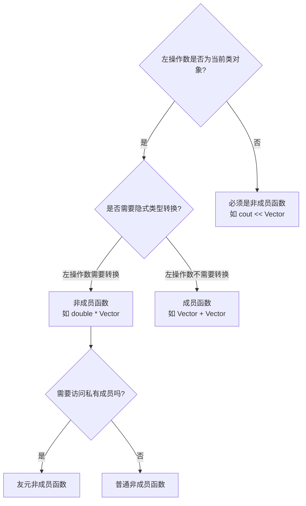
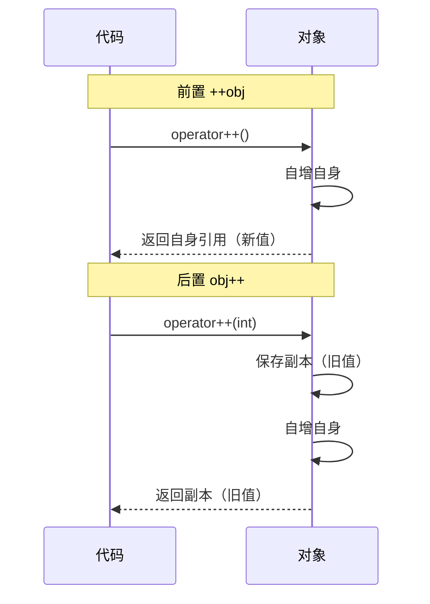
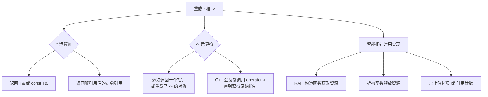
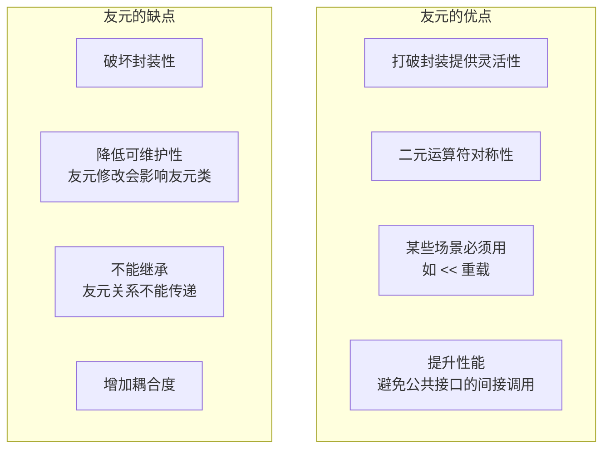
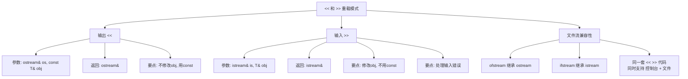
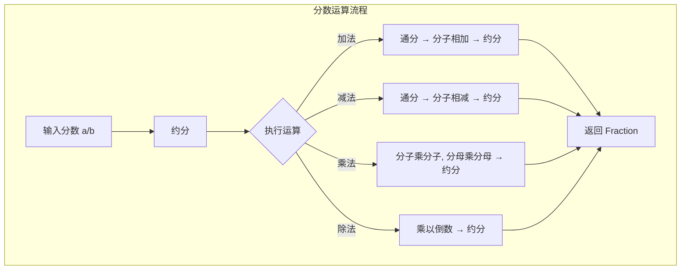
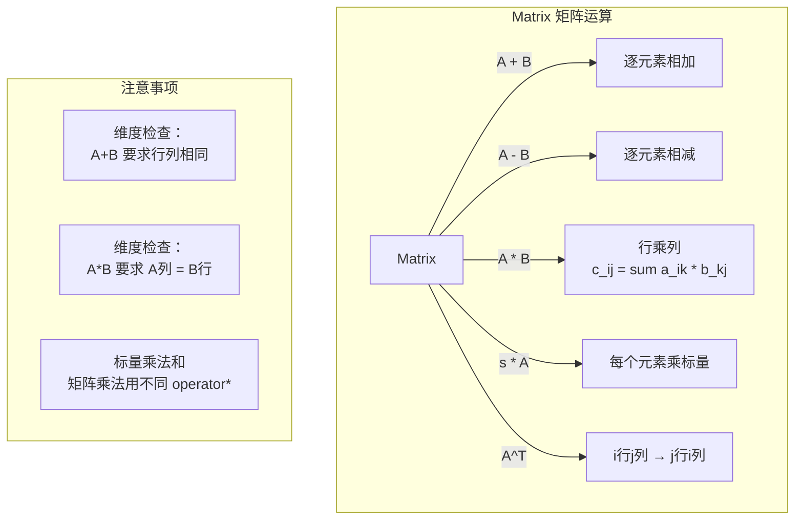

# 第 11 章：使用类

> **本章目标**: 掌握 C++ 类的进阶使用——运算符重载、友元函数、类型转换。这些特性让自定义类型像内置类型一样自然使用。

---

## 11.1 运算符重载概述

### 11.1.1 什么是运算符重载

**运算符重载**：让 C++ 的运算符（如 `+`、`-`、`*`、`==` 等）能够操作用户自定义类型。

```cpp
// 没有运算符重载
int x = 3, y = 5;
int z = x + y;             // 内置类型可以直接 +

Time t1(3, 45), t2(1, 30);
Time t3 = t1.plus(t2);     // 自定义类型只能用函数

// 有了运算符重载
Time t3 = t1 + t2;         // 像内置类型一样自然！
```

运算符重载是 C++ 中一种**静态多态**（编译时多态）机制，它允许程序为运算符赋予新的含义，使其能够用于用户自定义类型。其本质是一个特殊名字的函数——函数名由关键字 `operator` 后跟要重载的运算符符号组成。

### 11.1.2 为什么需要运算符重载——动机案例

在没有运算符重载的情况下，自定义类型的使用非常繁琐。考虑一个分数类的场景：

```cpp
class Fraction {
private:
    int num;   // 分子
    int den;   // 分母
public:
    Fraction(int n, int d) : num(n), den(d) {}
    Fraction add(const Fraction& other) const {
        return Fraction(num * other.den + other.num * den, den * other.den);
    }
    Fraction multiply(const Fraction& other) const {
        return Fraction(num * other.num, den * other.den);
    }
    bool equals(const Fraction& other) const {
        return num * other.den == other.num * den;
    }
};

int main() {
    Fraction a(1, 2), b(1, 3);
    // 下面的代码非常不直观
    Fraction c = a.add(b);             // c = a + b 更直观
    Fraction d = a.multiply(b);        // d = a * b 更直观
    if (a.equals(b)) { /* ... */ }     // if (a == b) 更直观
    
    // 复杂的表达式更是灾难
    Fraction e = a.add(b.multiply(c)); // 实际数学含义：a + b * c
    // 期望：a + b * c 直接按数学优先级计算
    return 0;
}
```

运算符重载的核心价值：

| 价值 | 说明 | 示例 |
|------|------|------|
| **可读性** | 代码更接近自然数学表达 | `a + b * c` vs `a.add(b.multiply(c))` |
| **一致性** | 自定义类型用法与内置类型一致 | `cout << obj` 与 `cout << 42` 风格统一 |
| **抽象能力** | 隐藏实现细节，使用者只需关注语义 | 复数 `c1 + c2` 无需关心实部虚部如何相加 |
| **泛型编程** | 模板代码可以统一处理内置和自定义类型 | STL 算法依赖运算符重载 |

### 11.1.3 运算符重载 vs 普通函数对比

```cpp
class Complex {
    double real, imag;
public:
    Complex(double r = 0, double i = 0) : real(r), imag(i) {}
    
    // 方法1：普通成员函数
    Complex add(const Complex& other) const {
        return Complex(real + other.real, imag + other.imag);
    }
    
    // 方法2：运算符重载
    Complex operator+(const Complex& other) const {
        return Complex(real + other.real, imag + other.imag);
    }
};

int main() {
    Complex a(1, 2), b(3, 4);
    
    // 普通函数调用——深层嵌套时难以阅读
    Complex c = a.add(b);
    Complex d = a.add(b.add(c));  // 容易看错优先级
    
    // 运算符重载——自然清晰
    Complex c2 = a + b;
    Complex d2 = a + b + c;       // 从左到右结合，符合直觉
    
    return 0;
}
```

| 对比维度 | 普通函数 | 运算符重载 |
|----------|---------|-----------|
| 命名 | 自定义名称（add, plus, concat） | 固定名称（operator+） |
| 可读性 | 复杂表达式难以阅读 | 保持数学/逻辑习惯 |
| 优先级 | 无（按函数调用顺序） | 保持原运算符优先级 |
| 学习成本 | 需要了解每个类的特定命名 | 统一的运算符语法 |
| 模板友好 | 需要额外约定命名规范 | STL/泛型代码直接依赖运算符 |

### 11.1.4 运算符重载的语法

```cpp
返回类型 operator运算符(参数列表);

// 例如
Time operator+(const Time& t) const;   // 重载 +
Time operator-(const Time& t) const;   // 重载 -
bool operator==(const Time& t) const;  // 重载 ==
```

**基本规则**：
1. 运算符函数可以是**成员函数**或**非成员函数**（通常是友元）
2. 作为成员函数时，左操作数通过 `this` 隐式传递
3. 作为非成员函数时，所有操作数都是显式参数
4. 不能改变运算符的**优先级**、**结合性**和**操作数个数**

---

## 11.2 运算符重载实战

### 11.2.1 时间类基础

```cpp
#include <iostream>
using namespace std;

class Time {
private:
    int hours;
    int minutes;

public:
    Time(int h = 0, int m = 0) : hours(h), minutes(m) {
        normalize();  // 确保分钟在 0-59 范围内
    }
    
    // 规范化时间
    void normalize() {
        hours += minutes / 60;
        minutes %= 60;
    }
    
    // 重载加法运算符
    Time operator+(const Time& t) const {
        Time sum;
        sum.minutes = minutes + t.minutes;
        sum.hours = hours + t.hours + sum.minutes / 60;
        sum.minutes %= 60;
        return sum;
    }
    
    // 重载减法运算符
    Time operator-(const Time& t) const {
        Time diff;
        int total1 = hours * 60 + minutes;
        int total2 = t.hours * 60 + t.minutes;
        int total = total1 - total2;
        if (total < 0) total = 0;
        diff.hours = total / 60;
        diff.minutes = total % 60;
        return diff;
    }
    
    // 重载乘法运算符（Time * double）
    Time operator*(double mult) const {
        int total = (hours * 60 + minutes) * mult;
        Time result;
        result.hours = total / 60;
        result.minutes = total % 60;
        return result;
    }
    
    // 显示时间
    void show() const {
        cout << hours << " 小时 " << minutes << " 分钟";
    }
};

int main() {
    Time t1(3, 45);
    Time t2(1, 30);
    
    Time t3 = t1 + t2;   // 等价于 t1.operator+(t2)
    cout << "t1 + t2 = ";
    t3.show();
    cout << endl;
    
    Time t4 = t1 - t2;
    cout << "t1 - t2 = ";
    t4.show();
    cout << endl;
    
    Time t5 = t1 * 1.5;  // 等价于 t1.operator*(1.5)
    cout << "t1 * 1.5 = ";
    t5.show();
    cout << endl;
    
    return 0;
}
```

### 11.2.2 可重载的运算符

| 可重载 | 不可重载 |
|--------|----------|
| `+` `-` `*` `/` `%` `^` `&` `\|` | `::`（作用域解析） |
| `~` `!` `=` `<` `>` `+=` `-=` `*=` `/=` | `.`（成员访问） |
| `==` `!=` `<=` `>=` `&&` `\|\|` `++` `--` | `.*`（成员指针访问） |
| `<<` `>>` `[]` `()` `->` `new` `delete` | `?:`（条件运算符） |
| `,` `->*` 等 | `sizeof` |

> **运算符重载的限制**：
> 1. 不能改变运算符的优先级和结合性
> 2. 不能改变运算符的操作数个数
> 3. 不能创建新的运算符
> 4. `=`、`[]`、`()`、`->` 必须是成员函数
> 5. `<<`、`>>` 通常用友元函数实现

### 11.2.3 复合赋值运算符重载（+=、-=、*=）

复合赋值运算符与普通运算符的一个重要区别：**复合赋值运算符返回引用**，而普通运算符返回值。

```cpp
#include <iostream>
using namespace std;

class Time {
private:
    int hours;
    int minutes;

public:
    Time(int h = 0, int m = 0) : hours(h), minutes(m) {
        normalize();
    }
    
    void normalize() {
        hours += minutes / 60;
        minutes %= 60;
    }
    
    // 加法赋值运算符 +=
    Time& operator+=(const Time& t) {
        minutes += t.minutes;
        hours += t.hours + minutes / 60;
        minutes %= 60;
        return *this;  // 返回当前对象的引用
    }
    
    // 减法赋值运算符 -=
    Time& operator-=(const Time& t) {
        int total1 = hours * 60 + minutes;
        int total2 = t.hours * 60 + t.minutes;
        int total = total1 - total2;
        if (total < 0) total = 0;
        hours = total / 60;
        minutes = total % 60;
        return *this;
    }
    
    // 乘法赋值运算符 *=
    Time& operator*=(double mult) {
        int total = (hours * 60 + minutes) * mult;
        hours = total / 60;
        minutes = total % 60;
        return *this;
    }
    
    // 利用 += 实现 +（推荐做法）
    Time operator+(const Time& t) const {
        Time result = *this;  // 复制
        result += t;          // 复用 +=
        return result;
    }
    
    void show() const {
        cout << hours << " 小时 " << minutes << " 分钟";
    }
};

int main() {
    Time t1(3, 45);
    Time t2(1, 30);
    
    t1 += t2;
    cout << "t1 += t2 后: ";
    t1.show();
    cout << endl;
    
    t1 -= t2;
    cout << "t1 -= t2 后: ";
    t1.show();
    cout << endl;
    
    Time t3 = t1 + t2;  // 复用 += 实现的 +
    cout << "t1 + t2 = ";
    t3.show();
    cout << endl;
    
    return 0;
}
```

**为什么 += 返回引用而 + 返回值？**

```cpp
Time& operator+=(const Time& t);  // 返回引用：修改自身
Time operator+(const Time& t) const; // 返回值：创建新对象

// += 返回引用支持链式调用
Time a, b, c;
(a += b) += c;  // 先 a += b 返回 a 的引用，再 a += c

// + 返回新对象
Time d = a + b;  // a 和 b 保持不变，产生新对象
```

### 11.2.4 比较运算符重载（==、!=、<、>、<=、>=）

```cpp
#include <iostream>
using namespace std;

class Time {
private:
    int hours;
    int minutes;

public:
    Time(int h = 0, int m = 0) : hours(h), minutes(m) {
        normalize();
    }
    
    void normalize() {
        hours += minutes / 60;
        minutes %= 60;
    }
    
    // 转为总分钟数（方便比较）
    int totalMinutes() const {
        return hours * 60 + minutes;
    }
    
    // == 运算符
    bool operator==(const Time& t) const {
        return totalMinutes() == t.totalMinutes();
    }
    
    // != 运算符
    bool operator!=(const Time& t) const {
        return !(*this == t);  // 复用 ==
    }
    
    // < 运算符
    bool operator<(const Time& t) const {
        return totalMinutes() < t.totalMinutes();
    }
    
    // > 运算符
    bool operator>(const Time& t) const {
        return t < *this;  // 复用 <
    }
    
    // <= 运算符
    bool operator<=(const Time& t) const {
        return !(t < *this);  // 复用 <
    }
    
    // >= 运算符
    bool operator>=(const Time& t) const {
        return !(*this < t);  // 复用 <
    }
};

int main() {
    Time t1(3, 45);
    Time t2(1, 30);
    Time t3(3, 45);
    
    cout << boolalpha;
    cout << "t1 == t2: " << (t1 == t2) << endl;  // false
    cout << "t1 == t3: " << (t1 == t3) << endl;  // true
    cout << "t1 != t2: " << (t1 != t2) << endl;  // true
    cout << "t1 < t2: "  << (t1 < t2)  << endl;  // false
    cout << "t1 > t2: "  << (t1 > t2)  << endl;  // true
    cout << "t1 <= t3: " << (t1 <= t3) << endl;  // true
    cout << "t1 >= t3: " << (t1 >= t3) << endl;  // true
    
    return 0;
}
```

### 11.2.5 运算符重载的返回值类型选择指南

```cpp
// 1. 算术运算符（+、-、*、/）：返回新对象（值）
Time operator+(const Time& t) const;  // 返回 Time，不是 Time&

// 2. 复合赋值运算符（+=、-=、*=）：返回自身引用
Time& operator+=(const Time& t);     // 返回 Time&

// 3. 比较运算符（==、!=、<、> 等）：返回 bool
bool operator==(const Time& t) const; // 返回 bool

// 4. 下标运算符 []：返回元素引用（读写各一个版本）
int& operator[](int index);           // 可写版本
const int& operator[](int index) const; // 只读版本

// 5. 输入输出运算符：返回流引用
ostream& operator<<(ostream& os, const Time& t);
istream& operator>>(istream& is, Time& t);

// 6. 前置 ++/--：返回自身引用
Time& operator++();
// 7. 后置 ++/--：返回原值（新对象）
Time operator++(int);

// 8. 解引用 * 和成员访问 ->：返回目标引用/指针
int& operator*();
int* operator->();
```

```mermaid
flowchart TD
    A[选择返回值类型] --> B{运算符种类?}
    B -->|算术 + - * /| C[返回新对象<br>按值返回]
    B -->|复合赋值 += -= *=| D[返回自身引用<br>返回 *this]
    B -->|比较 == != < >| E[返回 bool]
    B -->|下标 []| F[返回元素引用<br>T& / const T&]
    B -->|输入输出 << >>| G[返回流引用<br>ostream& / istream&]
    B -->|前置 ++ --| H[返回自身引用<br>返回 *this]
    B -->|后置 ++ --| I[返回原值<br>返回临时对象]
    C --> J[const 保证]
    D --> K[支持链式赋值 a=b=c]
    E --> L[const 保证, 不修改对象]
    F --> M[提供读写访问]
```

### 11.2.6 运算符重载的限制

```mermaid
flowchart LR
    subgraph 可以重载
        A1[+-*/%] 
        A2[比较运算符]
        A3[赋值运算符]
        A4[下标/函数调用]
        A5[new/delete]
    end
    subgraph 不可以重载
        B1[:: 作用域解析]
        B2[. 成员访问]
        B3[.* 成员指针]
        B4[?: 三目]
        B5[sizeof]
    end
    subgraph 必须成员函数
        C1[= 赋值]
        C2[[] 下标]
        C3[( ) 函数调用]
        C4[-> 成员访问]
    end
```

---

## 11.3 运算符重载的两种形式

```cpp
class Vector {
private:
    double x, y;

public:
    Vector(double x = 0, double y = 0) : x(x), y(y) {}
    
    // 方式1：成员函数重载
    Vector operator+(const Vector& v) const {
        return Vector(x + v.x, y + v.y);
    }
    
    // 方式2：友元函数重载
    friend Vector operator*(double n, const Vector& v);
    
    void display() const {
        cout << "(" << x << ", " << y << ")";
    }
};

// 友元函数实现（不是成员函数，但可以访问私有成员）
Vector operator*(double n, const Vector& v) {
    return Vector(n * v.x, n * v.y);
}

int main() {
    Vector v1(3, 4), v2(1, 2);
    
    Vector v3 = v1 + v2;     // 成员函数 v1.operator+(v2)
    Vector v4 = 2.0 * v1;    // 友元函数 operator*(2.0, v1)
    // Vector v5 = v1 * 2.0; // 这个需要成员函数方式
    
    return 0;
}
```

### 11.3.1 如何选择：成员函数 vs 非成员函数

**选择原则**：



**具体规则**：

| 场景 | 推荐形式 | 原因 |
|------|---------|------|
| 一元运算符（如 `-obj`） | 成员函数 | 无参数，直接操作 `this` |
| `=` `[]` `()` `->` | **必须**成员函数 | 语言规定 |
| 复合赋值（`+=` `-=`） | 成员函数 | 修改左操作数 |
| 对称二元运算符（`+` `-`） | 成员函数或友元均可 | 看是否需要左操作数类型转换 |
| 非对称二元运算符（`double * Vector`） | 非成员函数（友元） | 左操作数不是本类对象 |
| 输入输出（`<<` `>>`） | 非成员函数（友元） | 左操作数是流对象 |

---

## 11.4 自增自减运算符重载（++ / --）

### 11.4.1 基本概念

自增（`++`）和自减（`--`）运算符有**前缀**和**后缀**两种形式，在重载时需要区分。

```cpp
class MyClass {
public:
    // 前置 ++：++obj，返回自增后的值
    MyClass& operator++();
    
    // 后置 ++：obj++，返回自增前的值（int 参数是哑元，仅用于区分）
    MyClass operator++(int);
    
    // 前置 --：--obj
    MyClass& operator--();
    
    // 后置 --：obj--
    MyClass operator--(int);
};
```

### 11.4.2 前缀 ++ 和后缀 ++ 的区别



### 11.4.3 完整示例：计数类

```cpp
#include <iostream>
using namespace std;

class Counter {
private:
    int count;

public:
    Counter(int c = 0) : count(c) {}
    
    // 前置 ++：返回自增后的引用
    Counter& operator++() {
        ++count;
        return *this;
    }
    
    // 后置 ++：返回自增前的副本
    Counter operator++(int) {
        Counter temp = *this;  // 保存当前值
        ++count;               // 自增
        return temp;           // 返回旧值
    }
    
    // 前置 --
    Counter& operator--() {
        --count;
        return *this;
    }
    
    // 后置 --
    Counter operator--(int) {
        Counter temp = *this;
        --count;
        return temp;
    }
    
    int getValue() const { return count; }
};

int main() {
    Counter c(5);
    
    cout << "初始值: " << c.getValue() << endl;        // 5
    
    cout << "前置 ++c: " << (++c).getValue() << endl;  // 6
    cout << "后置 c++: " << (c++).getValue() << endl;  // 6（返回旧值）
    cout << "再次取值: " << c.getValue() << endl;       // 7
    
    cout << "前置 --c: " << (--c).getValue() << endl;  // 6
    cout << "后置 c--: " << (c--).getValue() << endl;  // 6（返回旧值）
    cout << "再次取值: " << c.getValue() << endl;       // 5
    
    return 0;
}
```

### 11.4.4 前缀与后缀的性能差异

```cpp
// 前置 ++：直接操作自身，无需临时对象
Counter& Counter::operator++() {
    ++count;
    return *this;
}

// 后置 ++：需要创建临时对象，有额外开销
Counter Counter::operator++(int) {
    Counter temp = *this;  // 拷贝构造（额外开销）
    ++count;
    return temp;           // 返回临时对象（可能触发拷贝或移动）
}

// 在循环中使用时，前置 ++ 更高效
for (int i = 0; i < n; ++i) { /* ... */ }  // 推荐：前置
for (int i = 0; i < n; i++) { /* ... */ }  // 对内置类型无区别，自定义类型有区别

// 迭代器场景
class Iterator {
    // ...
public:
    // 前置 ++ 是标准做法
    Iterator& operator++() { /* 移动到下一个元素 */ return *this; }
    
    // 后置 ++ 可用前置实现
    Iterator operator++(int) {
        Iterator old = *this;
        ++(*this);     // 复用前置 ++
        return old;
    }
};
```

### 11.4.5 自增自减在时间类中的应用

```cpp
#include <iostream>
using namespace std;

class Time {
private:
    int hours;
    int minutes;

public:
    Time(int h = 0, int m = 0) : hours(h), minutes(m) {
        normalize();
    }
    
    void normalize() {
        hours += minutes / 60;
        minutes %= 60;
    }
    
    // 前置 ++：增加一分钟
    Time& operator++() {
        ++minutes;
        normalize();
        return *this;
    }
    
    // 后置 ++：增加一分钟
    Time operator++(int) {
        Time old = *this;
        ++(*this);  // 复用前置 ++
        return old;
    }
    
    // 前置 --：减少一分钟
    Time& operator--() {
        if (hours == 0 && minutes == 0) return *this;
        if (minutes == 0) {
            --hours;
            minutes = 59;
        } else {
            --minutes;
        }
        return *this;
    }
    
    // 后置 --：减少一分钟
    Time operator--(int) {
        Time old = *this;
        --(*this);
        return old;
    }
    
    friend ostream& operator<<(ostream& os, const Time& t) {
        os << t.hours << ":" << (t.minutes < 10 ? "0" : "") << t.minutes;
        return os;
    }
};

int main() {
    Time t(3, 59);
    
    cout << "初始: " << t << endl;     // 3:59
    cout << "前置 ++t: " << ++t << endl; // 4:00
    cout << "后置 t++: " << t++ << endl; // 4:00（旧值）
    cout << "现在: " << t << endl;       // 4:01
    
    return 0;
}
```

---

## 11.5 下标运算符 [] 重载

### 11.5.1 基本实现

下标运算符 `[]` 通常用于容器类，允许通过索引访问元素。它是一个**二元运算符**（对象 + 索引），且**必须是成员函数**。

```cpp
返回类型& operator[](索引类型 index);
const 返回类型& operator[](索引类型 index) const;
```

### 11.5.2 完整示例：安全数组类

```cpp
#include <iostream>
#include <cassert>
using namespace std;

class SafeArray {
private:
    static const int SIZE = 10;
    int data[SIZE];

public:
    SafeArray() {
        for (int i = 0; i < SIZE; ++i)
            data[i] = 0;
    }
    
    // 非 const 版本——可读可写
    int& operator[](int index) {
        assert(index >= 0 && index < SIZE);
        return data[index];
    }
    
    // const 版本——只读
    const int& operator[](int index) const {
        assert(index >= 0 && index < SIZE);
        return data[index];
    }
    
    int size() const { return SIZE; }
};

int main() {
    SafeArray arr;
    
    // 写入：使用非 const 版本
    for (int i = 0; i < arr.size(); ++i)
        arr[i] = i * 10;   // arr.operator[](i) = i * 10
    
    // 读取
    for (int i = 0; i < arr.size(); ++i)
        cout << "arr[" << i << "] = " << arr[i] << endl;
    
    // const 对象使用 const 版本
    const SafeArray& constRef = arr;
    cout << "const 访问: " << constRef[3] << endl;  // 调用 const 版本
    // constRef[3] = 100;  // 编译错误！const 版本返回 const 引用
    
    return 0;
}
```

### 11.5.3 字符串类的 [] 重载

```cpp
#include <iostream>
#include <cstring>
using namespace std;

class MyString {
private:
    char* str;
    int len;

public:
    MyString(const char* s = "") {
        len = strlen(s);
        str = new char[len + 1];
        strcpy(str, s);
    }
    
    ~MyString() { delete[] str; }
    
    MyString(const MyString& other) {
        len = other.len;
        str = new char[len + 1];
        strcpy(str, other.str);
    }
    
    MyString& operator=(const MyString& other) {
        if (this == &other) return *this;
        delete[] str;
        len = other.len;
        str = new char[len + 1];
        strcpy(str, other.str);
        return *this;
    }
    
    // 下标运算符——可读写
    char& operator[](int i) {
        if (i < 0 || i >= len) {
            static char dummy = '\0';
            return dummy;
        }
        return str[i];
    }
    
    // 下标运算符——只读
    const char& operator[](int i) const {
        if (i < 0 || i >= len) {
            static const char dummy = '\0';
            return dummy;
        }
        return str[i];
    }
    
    int length() const { return len; }
    
    friend ostream& operator<<(ostream& os, const MyString& s) {
        os << s.str;
        return os;
    }
};

int main() {
    MyString s("Hello");
    
    s[0] = 'h';     // 改写
    cout << s << endl;  // hello
    
    for (int i = 0; i < s.length(); ++i)
        cout << s[i] << " ";
    cout << endl;
    
    const MyString cs("World");
    cout << "cs[0] = " << cs[0] << endl;  // const 版本
    // cs[0] = 'w';  // 编译错误
    
    return 0;
}
```

### 11.5.4 下标运算符设计要点

```mermaid
flowchart TD
    A[设计下标运算符] --> B[是否需要读写分离?]
    B -->|是| C[提供两个重载版本]
    C --> C1[ T& operator[] 可读写]
    C --> C2[ const T& operator[] 只读]
    B -->|否| D[只读场景用 const 版本]
    
    A --> E[是否需要边界检查?]
    E -->|是| F[assert 或抛出异常]
    E -->|否| G[直接返回, 性能优先]
    
    A --> H{索引类型?}
    H --> I[通常用 size_t 或 int]
    H --> J[也可以用字符串<br>如关联数组]
```

---

## 11.6 函数调用运算符 () 重载

### 11.6.1 函数对象的概念

如果类重载了 `()` 运算符，该类的对象就可以像函数一样被调用，称为**函数对象**或**仿函数**。

```cpp
class Functor {
public:
    // 重载函数调用运算符
    返回类型 operator()(参数列表) const;
};

// 使用
Functor f;
f(参数);   // 等价于 f.operator()(参数)
```

### 11.6.2 基本用法

```cpp
#include <iostream>
using namespace std;

class Square {
public:
    int operator()(int x) const {
        return x * x;
    }
};

class Adder {
private:
    int base;
public:
    Adder(int b) : base(b) {}
    
    int operator()(int x) const {
        return base + x;
    }
};

int main() {
    Square square;
    cout << "square(5) = " << square(5) << endl;  // 25
    cout << "square(9) = " << square(9) << endl;  // 81
    
    Adder add5(5);
    cout << "add5(10) = " << add5(10) << endl;     // 15
    cout << "add5(20) = " << add5(20) << endl;     // 25
    
    // 函数对象可以保存状态
    Adder add10(10);
    cout << "add10(100) = " << add10(100) << endl; // 110
    
    return 0;
}
```

### 11.6.3 函数对象 vs 普通函数 vs 函数指针

```cpp
#include <iostream>
#include <vector>
#include <algorithm>
using namespace std;

// 1. 普通函数
bool isOdd(int x) { return x % 2 == 1; }

// 2. 函数对象（可以携带状态）
class Threshold {
private:
    int limit;
public:
    Threshold(int l) : limit(l) {}
    bool operator()(int x) const { return x > limit; }
};

// 3. 泛型函数对象（模板）
template<typename T>
class Comparator {
public:
    bool operator()(const T& a, const T& b) const { return a < b; }
};

int main() {
    vector<int> nums = {1, 2, 3, 4, 5, 6, 7, 8, 9, 10};
    
    // 使用普通函数
    auto it = find_if(nums.begin(), nums.end(), isOdd);
    
    // 使用函数对象（灵活：可以指定不同阈值）
    int count = 0;
    for (int n : nums) {
        if (Threshold(5)(n)) count++;  // 找到 > 5 的元素
    }
    cout << "大于 5 的数有 " << count << " 个" << endl;
    
    // 函数对象在 STL 算法中的应用
    sort(nums.begin(), nums.end(), Comparator<int>());
    
    // lambda 表达式本质上是匿名函数对象
    auto lambda = [](int x) { return x * 2; };
    cout << "lambda(21) = " << lambda(21) << endl;  // 42
    
    return 0;
}
```

### 11.6.4 函数对象的实际应用

```cpp
#include <iostream>
#include <map>
#include <string>
using namespace std;

// 案例1：缓存计算结果
class Fibonacci {
private:
    map<int, long long> cache;
public:
    long long operator()(int n) {
        if (cache.find(n) != cache.end())
            return cache[n];
        if (n <= 1) return cache[n] = n;
        return cache[n] = (*this)(n - 1) + (*this)(n - 2);
    }
};

// 案例2：按不同规则比较
class CaseInsensitiveCompare {
public:
    bool operator()(const string& a, const string& b) const {
        string la, lb;
        for (char c : a) la += tolower(c);
        for (char c : b) lb += tolower(c);
        return la < lb;
    }
};

int main() {
    Fibonacci fib;
    cout << "fib(10) = " << fib(10) << endl;  // 55
    cout << "fib(20) = " << fib(20) << endl;  // 6765
    
    // 大小写不敏感的 map
    map<string, int, CaseInsensitiveCompare> scores;
    scores["Alice"] = 95;
    scores["alice"] = 100;  // 与 "Alice" 相同键
    cout << "ALICE: " << scores["ALICE"] << endl;  // 100
    
    return 0;
}
```

---

## 11.7 解引用和成员访问运算符重载（* / ->）

### 11.7.1 智能指针基础

`*` 和 `->` 运算符的重载主要用于实现**智能指针**，让自定义指针类像内置指针一样使用。

```cpp
#include <iostream>
using namespace std;

template<typename T>
class SmartPtr {
private:
    T* ptr;

public:
    explicit SmartPtr(T* p = nullptr) : ptr(p) {}
    
    ~SmartPtr() { delete ptr; }
    
    // 禁止拷贝（简化版）
    SmartPtr(const SmartPtr&) = delete;
    SmartPtr& operator=(const SmartPtr&) = delete;
    
    // 解引用运算符 *
    T& operator*() const {
        return *ptr;
    }
    
    // 成员访问运算符 ->
    T* operator->() const {
        return ptr;
    }
    
    // 检查是否为空（常用辅助）
    bool isNull() const { return ptr == nullptr; }
};

class Point {
public:
    int x, y;
    Point(int x = 0, int y = 0) : x(x), y(y) {}
    void display() const {
        cout << "(" << x << ", " << y << ")";
    }
};

int main() {
    SmartPtr<Point> sp(new Point(3, 4));
    
    // 使用 * 解引用
    cout << "(*sp).x = " << (*sp).x << endl;    // 3
    
    // 使用 -> 访问成员
    cout << "sp->x = " << sp->x << endl;        // 3
    cout << "sp->y = " << sp->y << endl;        // 4
    sp->display();                                // (3, 4)
    cout << endl;
    
    // SmartPtr<Point> sp2 = sp;  // 编译错误！拷贝已删除
    
    return 0;
}
```

### 11.7.2 -> 运算符的传递性

C++ 中的 `->` 运算符具有**传递性**：如果 `obj->member` 中的 `obj` 重载了 `->`，C++ 会不断递归调用 `operator->()` 直到返回一个原始指针，然后用该指针访问成员。

```cpp
#include <iostream>
using namespace std;

class Inner {
public:
    void action() { cout << "Inner::action()" << endl; }
};

class Middle {
    Inner inner;
public:
    Inner* operator->() { return &inner; }
};

class Outer {
    Middle mid;
public:
    Middle& operator->() { return mid; }
};

int main() {
    Outer obj;
    
    // 调用链：
    // obj->action()
    // → obj.operator->() 返回 Middle&
    // → Middle.operator->() 返回 Inner*
    // → Inner->action() 调用
    
    // 等价于：
    // obj.operator->().operator->()->action()
    
    obj->action();  // 输出 "Inner::action()"
    
    return 0;
}
```

### 11.7.3 更完整的智能指针示例

```cpp
#include <iostream>
#include <cstring>
using namespace std;

// 引用计数智能指针（简化版）
template<typename T>
class RefCountPtr {
private:
    T* ptr;
    int* refCount;
    
public:
    explicit RefCountPtr(T* p = nullptr) : ptr(p), refCount(new int(1)) {}
    
    ~RefCountPtr() {
        if (--(*refCount) == 0) {
            delete ptr;
            delete refCount;
        }
    }
    
    RefCountPtr(const RefCountPtr& other) 
        : ptr(other.ptr), refCount(other.refCount) {
        ++(*refCount);
    }
    
    RefCountPtr& operator=(const RefCountPtr& other) {
        if (this == &other) return *this;
        if (--(*refCount) == 0) {
            delete ptr;
            delete refCount;
        }
        ptr = other.ptr;
        refCount = other.refCount;
        ++(*refCount);
        return *this;
    }
    
    // *
    T& operator*() const { return *ptr; }
    
    // ->
    T* operator->() const { return ptr; }
    
    int useCount() const { return *refCount; }
};

int main() {
    RefCountPtr<string> p1(new string("Hello"));
    cout << "p1 = " << *p1 << ", 引用计数: " << p1.useCount() << endl;
    cout << "p1->length() = " << p1->length() << endl;
    
    {
        RefCountPtr<string> p2 = p1;  // 共享所有权
        cout << "p2 = " << *p2 << ", 引用计数: " << p1.useCount() << endl;
        *p2 = "World";
        cout << "修改后 p1 = " << *p1 << endl;  // 同一对象
    }  // p2 析构，引用计数减为 1
    
    cout << "p1 = " << *p1 << ", 引用计数: " << p1.useCount() << endl;
    // p1 析构时释放内存
    
    return 0;
}
```

### 11.7.4 * 和 -> 重载的规则



---

## 11.8 友元（Friend）

### 11.8.1 为什么需要友元

考虑以下场景：

```cpp
Time t1(3, 45);
Time t2 = t1 * 1.5;   // 成员函数重载：t1.operator*(1.5)
Time t3 = 1.5 * t1;   // 1.5 不是 Time 对象，不能调用成员函数
```

使用**友元函数**可以解决左操作数不是本类对象的问题。

### 11.8.2 友元函数的声明和定义

```cpp
class Time {
private:
    int hours;
    int minutes;

public:
    // 友元声明（在类内，不是成员函数）
    friend Time operator*(double mult, const Time& t);
    
    // 显示时间
    void show() const;
};

// 友元函数定义（不需要 Time:: 前缀，不是成员函数）
Time operator*(double mult, const Time& t) {
    int total = (t.hours * 60 + t.minutes) * mult;
    Time result;
    result.hours = total / 60;
    result.minutes = total % 60;
    return result;
}

// 使用
Time t1(3, 45);
Time t2 = 1.5 * t1;   // 现在可以了！
Time t3 = t1 * 1.5;   // 这个还需要成员函数版本
```

### 11.8.3 友元类

一个类可以声明另一个类为友元，这样友元类的所有成员函数都可以访问当前类的私有成员。

```cpp
#include <iostream>
using namespace std;

// 前向声明
class Matrix;

class Vector3D {
private:
    double x, y, z;
    
public:
    Vector3D(double x = 0, double y = 0, double z = 0) 
        : x(x), y(y), z(z) {}
    
    // 声明 Matrix 为友元类
    friend class Matrix;
    
    friend ostream& operator<<(ostream& os, const Vector3D& v) {
        os << "(" << v.x << ", " << v.y << ", " << v.z << ")";
        return os;
    }
};

class Matrix {
private:
    double data[3][3];
    
public:
    Matrix() {
        for (int i = 0; i < 3; ++i)
            for (int j = 0; j < 3; ++j)
                data[i][j] = (i == j) ? 1 : 0;  // 单位矩阵
    }
    
    // 友元类可以访问 Vector3D 的私有成员
    Vector3D multiply(const Vector3D& v) const {
        return Vector3D(
            data[0][0] * v.x + data[0][1] * v.y + data[0][2] * v.z,
            data[1][0] * v.x + data[1][1] * v.y + data[1][2] * v.z,
            data[2][0] * v.x + data[2][1] * v.y + data[2][2] * v.z
        );
    }
};

int main() {
    Vector3D v(1, 2, 3);
    Matrix m;
    
    Vector3D result = m.multiply(v);
    cout << "矩阵乘向量结果: " << result << endl;  // (1, 2, 3)
    
    return 0;
}
```

### 11.8.4 友元成员函数

只让另一个类的某个特定成员函数成为友元，而不是整个类。

```cpp
#include <iostream>
using namespace std;

// 前向声明
class Vector3D;

class Printer {
public:
    void printPretty(const Vector3D& v);
    void printRaw(const Vector3D& v);
};

class Vector3D {
private:
    double x, y, z;
    
public:
    Vector3D(double x = 0, double y = 0, double z = 0) 
        : x(x), y(y), z(z) {}
    
    // 只让 Printer::printPretty 成为友元
    friend void Printer::printPretty(const Vector3D& v);
    
    // 注意：Printer::printRaw 不能访问私有成员
};

// 友元成员函数的定义
void Printer::printPretty(const Vector3D& v) {
    cout << "Vector(" << v.x << ", " << v.y << ", " << v.z << ")";
}

void Printer::printRaw(const Vector3D& v) {
    // cout << v.x;  // 编译错误！printRaw 不是友元
    cout << "无权访问私有成员";
}

int main() {
    Vector3D v(1.5, 2.5, 3.5);
    Printer p;
    
    p.printPretty(v);  // OK
    cout << endl;
    p.printRaw(v);     // OK（但不访问私有成员）
    cout << endl;
    
    return 0;
}
```

### 11.8.5 友元的优缺点分析



| 优点 | 说明 |
|------|------|
| **灵活性** | 允许非成员函数访问私有数据，实现对称运算符 |
| **必要性** | `<<` 和 `>>` 重载必须是非成员函数，但又需要访问私有成员 |
| **性能** | 直接访问私有成员，避免通过公共接口间接访问的开销 |
| **语法自然** | `cout << obj` 比 `obj.print(cout)` 更自然 |

| 缺点 | 说明 |
|------|------|
| **破坏封装** | 友元函数可以访问私有成员，打破了封装边界 |
| **耦合增强** | 修改类的私有成员可能影响友元函数 |
| **不能传递** | A 是 B 的友元，B 是 C 的友元，并不意味着 A 是 C 的友元 |
| **不能继承** | 友元关系不能被派生类继承 |

### 11.8.6 友元 vs 公共接口对比

```cpp
#include <iostream>
#include <vector>
using namespace std;

class Employee {
private:
    string name;
    double salary;
    vector<string> skills;
    
public:
    Employee(const string& n, double s) : name(n), salary(s) {}
    
    // 方案A：提供公共接口（getter）
    string getName() const { return name; }
    double getSalary() const { return salary; }
    
    // 方案B：友元函数
    friend void printEmployeeInfo(const Employee& e);
    
    // 方案C：公共显示函数
    void display(ostream& os) const {
        os << "员工: " << name << ", 薪资: " << salary;
    }
};

// 友元版本：直接访问私有成员
void printEmployeeInfo(const Employee& e) {
    cout << "员工: " << e.name << ", 薪资: " << e.salary;
}

// 非友元版本：通过公共接口访问
void printEmployeePublic(const Employee& e) {
    cout << "员工: " << e.getName() << ", 薪资: " << e.getSalary();
}

int main() {
    Employee emp("张三", 15000);
    
    // 三种方式
    printEmployeeInfo(emp);      // 友元：直接访问
    printEmployeePublic(emp);    // 公共接口：间接访问
    emp.display(cout);           // 成员函数：直接访问
    
    return 0;
}
```

| 对比维度 | 友元函数 | 公共接口 | 成员函数 |
|----------|---------|---------|---------|
| 访问权限 | 直接访问私有成员 | 通过 getter/setter | 直接访问私有成员 |
| 封装性 | 弱（外部函数可访问私有数据） | 强（控制访问粒度） | 强（属于类的一部分） |
| 性能 | 高（无函数调用链） | 略低（多一层函数调用） | 高 |
| 灵活性 | 高（非成员函数，左操作数灵活） | 中 | 低（左操作数必须是本类对象） |
| 适用场景 | 运算符重载、需要对称性操作 | 对外 API 设计 | 类的固有操作 |

### 11.8.7 友元在实际项目中的应用

```cpp
// 应用1：序列化/反序列化
class Config {
private:
    map<string, string> settings;
    
public:
    friend void toJSON(const Config& c, ostream& os);
    friend Config fromJSON(istream& is);
};

// 应用2：测试辅助
class Database {
private:
    Connection conn;
    
public:
    friend class DatabaseTest;  // 测试类可以访问内部状态
    friend void TestHelper::checkConnection(const Database& db);
};

// 应用3：运算符重载
class BigInteger {
private:
    vector<int> digits;
    
public:
    friend BigInteger operator+(const BigInteger& a, const BigInteger& b);
    friend ostream& operator<<(ostream& os, const BigInteger& n);
};

// 应用4：迭代器模式
class Container {
private:
    int* data;
    size_t size;
    
public:
    friend class Iterator;  // 迭代器需要访问内部数据
};
```

---

## 11.9 重载 << 和 >> 运算符

### 11.9.1 让 cout 识别自定义类型

```cpp
#include <iostream>
using namespace std;

class Time {
private:
    int hours, minutes;
    
public:
    Time(int h = 0, int m = 0) : hours(h), minutes(m) {}
    
    // 友元函数重载 <<
    friend ostream& operator<<(ostream& os, const Time& t);
};

// 实现 << 重载
ostream& operator<<(ostream& os, const Time& t) {
    os << t.hours << " 小时 " << t.minutes << " 分钟";
    return os;  // 返回 ostream& 以支持链式调用
}

int main() {
    Time t1(3, 45);
    Time t2(1, 30);
    
    cout << "t1 = " << t1 << endl;              // 自定义输出
    cout << "t1 + t2 = " << (t1 + t2) << endl;  //
    
    return 0;
}
```

**为什么返回 `ostream&`？**

```cpp
cout << t1 << t2;
// 等价于: (cout << t1) << t2;
// cout << t1 应该返回 cout，然后再用这个 cout << t2
```

### 11.9.2 重载 >> 运算符

```cpp
class Time {
    // ...
    friend istream& operator>>(istream& is, Time& t);
};

istream& operator>>(istream& is, Time& t) {
    cout << "请输入小时数: ";
    is >> t.hours;
    cout << "请输入分钟数: ";
    is >> t.minutes;
    return is;
}

int main() {
    Time t;
    cin >> t;           // 直接输入自定义类型
    cout << t << endl;
    return 0;
}
```

### 11.9.3 格式化输出控制

不同的自定义类型可能需要不同的输出格式：

```cpp
#include <iostream>
#include <iomanip>
using namespace std;

class Time {
private:
    int hours, minutes;
    
public:
    Time(int h = 0, int m = 0) : hours(h), minutes(m) {}
    
    // 方式1：标准格式（3小时45分钟）
    friend ostream& operator<<(ostream& os, const Time& t) {
        os << t.hours << ":" << setw(2) << setfill('0') << t.minutes;
        return os;
    }
};

// 不同格式的辅助函数
class TimeFormatter {
public:
    enum Format { HH_MM, HOURS_MINUTES_ZH, HOURS_MINUTES_EN };
    
    static string format(const Time& t, Format fmt) {
        // 需要在 Time 类中添加友元或公共 getter
        return "";
    }
};

int main() {
    Time t(3, 5);
    
    // 基本输出
    cout << "t = " << t << endl;                // 3:05
    
    // 结合流操纵器
    cout << "宽度10: [" << setw(10) << t << "]" << endl;
    cout << "左对齐: [" << left << setw(10) << t << "]" << endl;
    cout << "右对齐: [" << right << setw(10) << t << "]" << endl;
    
    return 0;
}
```

### 11.9.4 为不同格式提供输出控制

```cpp
#include <iostream>
#include <iomanip>
using namespace std;

class Time {
private:
    int hours, minutes;
    // 输出模式
    mutable int outputMode;  // mutable 允许在 const 函数中修改
    
public:
    enum Format { STANDARD, MILITARY, VERBOSE };
    
    Time(int h = 0, int m = 0, Format fmt = STANDARD) 
        : hours(h), minutes(m), outputMode(fmt) {}
    
    void setFormat(Format fmt) const { outputMode = fmt; }
    Format getFormat() const { return static_cast<Format>(outputMode); }
    
    friend ostream& operator<<(ostream& os, const Time& t) {
        switch (t.outputMode) {
            case STANDARD:
                os << t.hours << ":" << setw(2) << setfill('0') << t.minutes;
                break;
            case MILITARY:
                os << setw(2) << setfill('0') << t.hours 
                   << setw(2) << setfill('0') << t.minutes << "h";
                break;
            case VERBOSE:
                os << t.hours << " 小时 " << t.minutes << " 分钟";
                break;
        }
        return os;
    }
    
    friend istream& operator>>(istream& is, Time& t) {
        char colon;
        is >> t.hours >> colon >> t.minutes;
        if (colon != ':') is.setstate(ios::failbit);
        return is;
    }
};

int main() {
    Time t1(3, 45, Time::STANDARD);
    cout << "标准: " << t1 << endl;           // 3:45
    
    t1.setFormat(Time::MILITARY);
    cout << "军用: " << t1 << endl;           // 0345h
    
    t1.setFormat(Time::VERBOSE);
    cout << "详细: " << t1 << endl;           // 3 小时 45 分钟
    
    // 输入
    Time t2;
    cout << "输入时间 (hh:mm): ";
    cin >> t2;
    if (cin) {
        t2.setFormat(Time::VERBOSE);
        cout << "你输入了: " << t2 << endl;
    } else {
        cout << "输入格式错误" << endl;
    }
    
    return 0;
}
```

### 11.9.5 文件流的 << 和 >> 重载

自定义类型的 I/O 重载天然支持文件流，因为 `<<` 和 `>>` 是定义在 `ostream` 和 `istream` 基类上的，而 `ofstream`/`ifstream` 继承自它们。

```cpp
#include <iostream>
#include <fstream>
#include <vector>
using namespace std;

class Student {
private:
    string name;
    int id;
    double score;
    
public:
    Student(const string& n = "", int i = 0, double s = 0)
        : name(n), id(i), score(s) {}
    
    // 文本格式输出
    friend ostream& operator<<(ostream& os, const Student& s) {
        os << s.name << "|" << s.id << "|" << s.score;
        return os;
    }
    
    // 文本格式输入
    friend istream& operator>>(istream& is, Student& s) {
        string line;
        if (getline(is, line)) {
            size_t pos1 = line.find('|');
            size_t pos2 = line.find('|', pos1 + 1);
            if (pos1 != string::npos && pos2 != string::npos) {
                s.name = line.substr(0, pos1);
                s.id = stoi(line.substr(pos1 + 1, pos2 - pos1 - 1));
                s.score = stod(line.substr(pos2 + 1));
            }
        }
        return is;
    }
    
    // 二进制格式输出
    void writeBinary(ofstream& ofs) const {
        size_t len = name.size();
        ofs.write(reinterpret_cast<const char*>(&len), sizeof(len));
        ofs.write(name.c_str(), len);
        ofs.write(reinterpret_cast<const char*>(&id), sizeof(id));
        ofs.write(reinterpret_cast<const char*>(&score), sizeof(score));
    }
    
    // 二进制格式输入
    void readBinary(ifstream& ifs) {
        size_t len;
        ifs.read(reinterpret_cast<char*>(&len), sizeof(len));
        name.resize(len);
        ifs.read(&name[0], len);
        ifs.read(reinterpret_cast<char*>(&id), sizeof(id));
        ifs.read(reinterpret_cast<char*>(&score), sizeof(score));
    }
    
    void display() const {
        cout << name << " (ID: " << id << ", 成绩: " << score << ")";
    }
};

int main() {
    vector<Student> students = {
        Student("张三", 1001, 85.5),
        Student("李四", 1002, 92.0),
        Student("王五", 1003, 78.5)
    };
    
    // 写入文本文件
    ofstream fout("students.txt");
    for (const auto& s : students)
        fout << s << endl;
    fout.close();
    
    // 从文本文件读取
    vector<Student> loaded;
    ifstream fin("students.txt");
    Student s;
    while (fin >> s)
        loaded.push_back(s);
    fin.close();
    
    cout << "从文件读取的学生信息:" << endl;
    for (const auto& stu : loaded) {
        cout << "  ";
        stu.display();
        cout << endl;
    }
    
    // 写入二进制文件
    ofstream bout("students.dat", ios::binary);
    for (const auto& stu : students)
        stu.writeBinary(bout);
    bout.close();
    
    return 0;
}
```

### 11.9.6 链式输入输出模式总结



---

## 11.10 自动类型转换

### 11.10.1 转换构造函数

```cpp
class Stone {
private:
    double pounds;    // 以磅为单位
    
public:
    Stone(double lbs) : pounds(lbs) {           // 转换构造函数
        cout << "Stone(double) 构造函数" << endl;
    }
    
    Stone(int stones, double lbs) {
        pounds = stones * 14.0 + lbs;           // 普通构造函数
    }
    
    friend ostream& operator<<(ostream& os, const Stone& s) {
        os << s.pounds << " 磅";
        return os;
    }
};

int main() {
    Stone s1 = 150.0;       // double → Stone（隐式转换）
    // 等价于 Stone s1(150.0)
    
    Stone s2;
    s2 = 200.0;             // 隐式转换（先创建临时 Stone 对象，再赋值）
    
    Stone s3 = (Stone)180.0; // 显式转换
    Stone s4 = Stone(190.0); // 显式转换
    
    return 0;
}
```

### 11.10.2 转换构造函数的详细规则和陷阱

**陷阱1：意外的隐式转换**

```cpp
class String {
public:
    String(int size);           // 转换构造函数
    String(const char* str);    // 转换构造函数
};

int main() {
    String s1 = 'A';   // 调用了 String(int)，而不是保存字符 'A'
    // 这通常不是期望的行为！
    
    // 可能的问题
    String s2 = 123;   // 合法：创建一个 123 字符的字符串
    // 但代码意图可能是 String("123")
    
    return 0;
}
```

**陷阱2：函数重载的歧义**

```cpp
class A {
public:
    A(int x) { /* ... */ }         // 转换构造函数
};

class B {
public:
    B(const A& a) { /* ... */ }    // 转换构造函数
};

void func(const B& b) { /* ... */ }

int main() {
    func(42);  // 两步转换：int → A → B
    // C++ 最多允许一步用户自定义转换
    // 因此 func(42) 编译错误！
    
    func(A(42));  // OK：只需要 A → B 一步
    func(B(A(42))); // OK：两步都是显式
    
    return 0;
}
```

**陷阱3：构造函数参数个数与转换**

```cpp
class Point {
public:
    // 单参数构造函数：类型转换的来源
    explicit Point(int x) : x_(x), y_(0) {}
    
    // 多参数构造函数：不是转换构造函数
    Point(int x, int y) : x_(x), y_(y) {}
    
    // C++11 起，多参数构造函数也可用于转换
    // Point p = {1, 2};  // 使用初始化列表
    
private:
    int x_, y_;
};
```

### 11.10.3 explicit 关键字全面讨论

**为什么需要 explicit？**

```cpp
class Fraction {
private:
    int num, den;
    
public:
    // 没有 explicit：允许隐式转换
    Fraction(int n, int d = 1) : num(n), den(d) {}
    
    Fraction operator*(const Fraction& other) const {
        return Fraction(num * other.num, den * other.den);
    }
};

int main() {
    Fraction a(3, 4);
    
    // 无意中的隐式转换
    Fraction b = a * 2;    // 2 被隐式转换为 Fraction(2, 1)
    // 代码意图可能是 a * 2，但 Fraction(2) 的含义不清晰
    
    // 更隐蔽的问题
    Fraction c = 3;        // 等价于 Fraction(3, 1)
    // 如果程序员以为 3 保持为整数，后续操作可能导致逻辑错误
    
    return 0;
}
```

**使用 explicit 阻止隐式转换：**

```cpp
class Fraction {
private:
    int num, den;
    
public:
    explicit Fraction(int n, int d = 1) : num(n), den(d) {}
    
    Fraction operator*(const Fraction& other) const {
        return Fraction(num * other.num, den * other.den);
    }
};

int main() {
    Fraction a(3, 4);
    
    // Fraction b = a * 2;  // 编译错误！不能隐式转换 int → Fraction
    Fraction b = a * Fraction(2);  // OK：显式转换
    Fraction c = a * static_cast<Fraction>(2);  // OK：显式转换
    
    // Fraction d = 3;  // 编译错误！
    Fraction d(3);      // OK：直接初始化
    Fraction e = static_cast<Fraction>(3);  // OK：显式转换
    
    return 0;
}
```

**explicit 的现代用法扩展（C++11/C++20）：**

```cpp
class Converter {
public:
    // C++98：explicit 只能用于单参数构造函数
    explicit Converter(int x);
    
    // C++11：explicit 可用于转换函数
    explicit operator int() const;
    explicit operator bool() const;
    
    // C++20：explicit 可用于带条件的转换
    // explicit(!std::is_convertible_v<T, U>) ...
};

// C++11 explicit 转换函数示例
class MyBool {
private:
    bool value;
    
public:
    explicit MyBool(bool v) : value(v) {}
    
    // C++11：explicit 转换函数
    explicit operator bool() const {
        return value;
    }
};

int main() {
    MyBool mb(true);
    
    // bool b = mb;  // 编译错误！explicit 禁止隐式转换
    
    // 但 explicit operator bool 在条件中有特殊待遇
    if (mb) {                // OK：条件语境允许
        cout << "true" << endl;
    }
    
    while (mb) { }           // OK：条件语境
    for (; mb; ) { }         // OK：条件语境
    !mb;                     // OK：逻辑语境
    mb ? 1 : 2;             // OK：三目条件
    
    bool b = static_cast<bool>(mb);  // OK：显式转换
    
    return 0;
}
```

**使用建议：**

```mermaid
flowchart TD
    A{是否有单参数构造函数?} --> B{这个转换是否自然?}
    B -->|是, 如 string(const char*)| C[可以不写 explicit]
    B -->|否, 如 String(int size)| D[必须加 explicit]
    
    A --> E{是否有转换函数?}
    E -->|如 operator bool()| F[加 explicit<br>C++11 推荐]
    E -->|如 operator int()| G[加 explicit<br>避免歧义]
    
    D --> H[最佳实践]
    F --> H
    G --> H
    H --> I[默认加 explicit<br>除非有充分理由]
```

### 11.10.4 转换函数

```cpp
class Stone {
private:
    double pounds;
    
public:
    Stone(double lbs) : pounds(lbs) {}
    
    // 转换函数：Stone → double
    operator double() const {
        return pounds;
    }
    
    // 转换函数：Stone → int
    operator int() const {
        return static_cast<int>(pounds);
    }
};

int main() {
    Stone s(150.5);
    
    double d = s;           // 隐式调用 operator double()
    int i = s;              // 隐式调用 operator int()
    
    cout << "d = " << d << endl;  // 150.5
    cout << "i = " << i << endl;  // 150
    
    // 注意：如果有多个转换函数，可能导致歧义
    // cout << s;  // 可能有歧义：double 还是 int？
    
    return 0;
}
```

**转换函数的规则**：
1. 必须是成员函数
2. 没有返回类型（但返回要转换的目标类型）
3. 没有参数
4. 不应该有副作用

### 11.10.5 转换函数的限制和风险

```cpp
class Dollars {
private:
    double amount;
    
public:
    Dollars(double d) : amount(d) {}
    
    // 风险1：提供太多转换函数
    operator double() const { return amount; }
    operator int() const { return static_cast<int>(amount); }
    operator string() const { return to_string(amount) + "美元"; }
};

class Euro {
private:
    double amount;
    
public:
    Euro(double d) : amount(d) {}
    
    // 风险2：双向隐式转换导致歧义
    operator Dollars() const { return Dollars(amount * 1.18); }
};

int main() {
    Dollars d(100);
    Euro e(100);
    
    // double d2 = d;     // OK：明确调用 operator double()
    // int i = d;          // OK：明确调用 operator int()
    
    // cout << d;          // 歧义！多个转换都可能匹配
    
    // Dollars d2 = e;     // 歧义？Euro → double → Dollars? 还是 Euro → Dollars?
    // 如果两个路径都存在，编译器报错
    
    return 0;
}
```

**风险与对策**：

| 风险 | 例子 | 对策 |
|------|------|------|
| 无意中的转换 | `if (s)` 当 s 是 Stone 对象时 | 使用 `explicit operator bool()` |
| 多个转换路径 | `A → B` 和 `A → C → B` 同时存在 | 保持转换路径唯一 |
| 精度损失 | `Stone → int` 丢失小数部分 | 提供 `round()` 等显式函数 |
| 歧义调用 | `cout << s` 匹配多个转换 | 提供 `<<` 重载优先匹配 |

### 11.10.6 多步转换问题

```mermaid
flowchart TD
    A[int 42] -->|第一步| B[Fraction(42, 1)]
    B -->|第二步| C[Complex(42, 0)]
    
    D[实际规则] -->|最多一步用户自定义转换| E[int 42 → Fraction(42,1)] 
    E -->|不能继续| F[int → Fraction → Complex 非法]
    
    G[C++ 允许的隐式转换链]
    G --> H[内置类型转换<br>int → double → long]
    G --> I[内置 + 一步自定义<br>int → double → Stone(double)]
    G --> J[内置转换可以在自定义前后<br>char* → string 内部是 char* → 临时 string]
```

```cpp
class A {
public:
    A(int x) { cout << "A(int)" << endl; }
};

class B {
public:
    B(const A& a) { cout << "B(A)" << endl; }
};

void func(B b) {}

int main() {
    // func(42);        // 错误：需要 int → A → B 两步自定义转换
    
    func(A(42));        // OK：一步 A → B
    func(B(A(42)));     // OK：两步都是显式
    func(static_cast<B>(A(42))); // OK
    
    // 但内置转换 + 一步自定义是可以的
    class C {
    public:
        C(double d) { cout << "C(double)" << endl; }
    };
    
    C c1 = 42;    // OK：int → double（内置）→ C（自定义）
    C c2 = 'A';   // OK：char → int → double → C
    
    return 0;
}
```

---

## 11.11 综合示例：复数类（增强版）

```cpp
#include <iostream>
#include <cmath>
using namespace std;

class Complex {
private:
    double real;      // 实部
    double imag;      // 虚部
    
public:
    Complex(double r = 0, double i = 0) : real(r), imag(i) {}
    
    // === 算术运算符 ===
    
    // 加法
    Complex operator+(const Complex& c) const {
        return Complex(real + c.real, imag + c.imag);
    }
    
    // 减法
    Complex operator-(const Complex& c) const {
        return Complex(real - c.real, imag - c.imag);
    }
    
    // 乘法
    Complex operator*(const Complex& c) const {
        return Complex(real * c.real - imag * c.imag,
                       real * c.imag + imag * c.real);
    }
    
    // 除法
    Complex operator/(const Complex& c) const {
        double denominator = c.real * c.real + c.imag * c.imag;
        return Complex((real * c.real + imag * c.imag) / denominator,
                       (imag * c.real - real * c.imag) / denominator);
    }
    
    // 取反（一元负号）
    Complex operator-() const {
        return Complex(-real, -imag);
    }
    
    // === 复合赋值运算符 ===
    
    Complex& operator+=(const Complex& c) {
        real += c.real;
        imag += c.imag;
        return *this;
    }
    
    Complex& operator-=(const Complex& c) {
        real -= c.real;
        imag -= c.imag;
        return *this;
    }
    
    Complex& operator*=(const Complex& c) {
        double r = real * c.real - imag * c.imag;
        double i = real * c.imag + imag * c.real;
        real = r;
        imag = i;
        return *this;
    }
    
    // === 比较运算符 ===
    
    bool operator==(const Complex& c) const {
        return real == c.real && imag == c.imag;
    }
    
    bool operator!=(const Complex& c) const {
        return !(*this == c);
    }
    
    // === 标量运算 ===
    
    // Complex * double
    Complex operator*(double n) const {
        return Complex(real * n, imag * n);
    }
    
    // double * Complex
    friend Complex operator*(double n, const Complex& c) {
        return Complex(n * c.real, n * c.imag);
    }
    
    // === 数学函数 ===
    
    double magnitude() const {
        return sqrt(real * real + imag * imag);
    }
    
    double angle() const {
        return atan2(imag, real);
    }
    
    Complex conjugate() const {
        return Complex(real, -imag);
    }
    
    // === ++ 和 -- 运算符 ===
    
    Complex& operator++() {      // 前置：实部 + 1
        ++real;
        return *this;
    }
    
    Complex operator++(int) {    // 后置
        Complex old = *this;
        ++(*this);
        return old;
    }
    
    // === 输入输出 ===
    
    friend ostream& operator<<(ostream& os, const Complex& c) {
        os << "(" << c.real;
        if (c.imag >= 0) os << " + " << c.imag << "i)";
        else os << " - " << -c.imag << "i)";
        return os;
    }
    
    friend istream& operator>>(istream& is, Complex& c) {
        cout << "实部: ";
        is >> c.real;
        cout << "虚部: ";
        is >> c.imag;
        return is;
    }
};

int main() {
    Complex c1(3, 4);
    Complex c2(1, 2);
    
    cout << "c1 = " << c1 << endl;                  // (3 + 4i)
    cout << "c2 = " << c2 << endl;                  // (1 + 2i)
    
    cout << "c1 + c2 = " << (c1 + c2) << endl;      // (4 + 6i)
    cout << "c1 - c2 = " << (c1 - c2) << endl;      // (2 + 2i)
    cout << "c1 * c2 = " << (c1 * c2) << endl;      // (-5 + 10i)
    cout << "c1 / c2 = " << (c1 / c2) << endl;      // (2.2 - 0.4i)
    cout << "2 * c1 = " << (2 * c1) << endl;        // (6 + 8i)
    cout << "-c1 = " << (-c1) << endl;               // (-3 - 4i)
    
    cout << "c1 == c2? " << (c1 == c2) << endl;     // false
    cout << "c1 != c2? " << (c1 != c2) << endl;     // true
    
    cout << "c1 的模: " << c1.magnitude() << endl;  // 5
    cout << "c1 的共轭: " << c1.conjugate() << endl; // (3 - 4i)
    
    // ++ 运算符
    Complex c3(1, 1);
    cout << "++c3 = " << ++c3 << endl;               // (2 + 1i)
    cout << "c3++ = " << c3++ << endl;               // (2 + 1i)（旧值）
    cout << "c3 = " << c3 << endl;                   // (3 + 1i)
    
    // 赋值运算
    Complex c4(5, 6);
    c4 += c1;
    cout << "c4 += c1: " << c4 << endl;              // (8 + 10i)
    
    return 0;
}
```

---

## 11.12 综合示例：Vector 类（增强版）

```cpp
#include <iostream>
#include <cmath>
using namespace std;

class Vector {
public:
    enum Mode { RECT, POLAR };  // 矩形坐标或极坐标
    
private:
    double x;       // 水平分量
    double y;       // 垂直分量
    double mag;     // 长度
    double ang;     // 角度（弧度）
    Mode mode;      // 当前模式
    
    // 私有工具函数
    void setMag() {
        mag = sqrt(x * x + y * y);
    }
    
    void setAng() {
        if (x == 0 && y == 0) ang = 0;
        else ang = atan2(y, x);
    }
    
    void setXY() {
        x = mag * cos(ang);
        y = mag * sin(ang);
    }
    
public:
    Vector() : x(0), y(0), mag(0), ang(0), mode(RECT) {}
    
    Vector(double n1, double n2, Mode form = RECT) : mode(form) {
        if (form == RECT) {
            x = n1;
            y = n2;
            setMag();
            setAng();
        } else {
            mag = n1;
            ang = n2 / 180 * M_PI;  // 角度转弧度
            setXY();
        }
    }
    
    void set(double n1, double n2, Mode form = RECT) {
        mode = form;
        if (form == RECT) {
            x = n1;
            y = n2;
            setMag();
            setAng();
        } else {
            mag = n1;
            ang = n2 / 180 * M_PI;
            setXY();
        }
    }
    
    ~Vector() {}
    
    // 获取分量（const 成员函数）
    double getX() const { return x; }
    double getY() const { return y; }
    double getMag() const { return mag; }
    double getAng() const { return ang; }
    
    // === 算术运算符 ===
    
    Vector operator+(const Vector& v) const {
        return Vector(x + v.x, y + v.y);
    }
    
    Vector operator-(const Vector& v) const {
        return Vector(x - v.x, y - v.y);
    }
    
    Vector operator-() const {
        return Vector(-x, -y);
    }
    
    Vector operator*(double n) const {
        return Vector(x * n, y * n);
    }
    
    friend Vector operator*(double n, const Vector& v) {
        return v * n;  // 调用成员函数版本
    }
    
    // === 复合赋值 ===
    
    Vector& operator+=(const Vector& v) {
        x += v.x;
        y += v.y;
        setMag();
        setAng();
        return *this;
    }
    
    Vector& operator-=(const Vector& v) {
        x -= v.x;
        y -= v.y;
        setMag();
        setAng();
        return *this;
    }
    
    // === 比较 ===
    
    bool operator==(const Vector& v) const {
        return x == v.x && y == v.y;
    }
    
    bool operator!=(const Vector& v) const {
        return !(*this == v);
    }
    
    // === 点积和叉积 ===
    
    double dot(const Vector& v) const {
        return x * v.x + y * v.y;
    }
    
    double cross(const Vector& v) const {
        return x * v.y - y * v.x;
    }
    
    // 模式切换
    void setMode(Mode m) { mode = m; }
    Mode getMode() const { return mode; }
    
    // === 输入输出 ===
    
    friend ostream& operator<<(ostream& os, const Vector& v) {
        if (v.mode == Vector::RECT) {
            os << "(x, y) = (" << v.x << ", " << v.y << ")";
        } else {
            os << "(mag, ang) = (" << v.mag << ", " 
               << v.ang * 180 / M_PI << " degrees)";
        }
        return os;
    }
};

int main() {
    Vector v1(3, 4);                          // 矩形坐标 (3, 4)
    Vector v2(5, 36.87, Vector::POLAR);      // 极坐标
    
    cout << "v1 = " << v1 << endl;
    cout << "v2 = " << v2 << endl;
    
    Vector v3 = v1 + v2;
    cout << "v1 + v2 = " << v3 << endl;
    
    Vector v4 = v1 * 2.0;
    cout << "v1 * 2 = " << v4 << endl;
    
    Vector v5 = 1.5 * v1;
    cout << "1.5 * v1 = " << v5 << endl;
    
    // 点积和叉积
    cout << "v1 · v2 = " << v1.dot(v2) << endl;
    cout << "v1 × v2 = " << v1.cross(v2) << endl;
    
    // 比较
    Vector v6(3, 4);
    cout << "v1 == v6? " << (v1 == v6) << endl;  // true
    
    // 复合赋值
    v1 += v2;
    cout << "v1 += v2 后: " << v1 << endl;
    
    // 极坐标模式显示
    v1.setMode(Vector::POLAR);
    cout << "极坐标模式: " << v1 << endl;
    
    return 0;
}
```

---

## 11.13 综合案例：分数类

设计一个完整的分数类，支持所有常见运算符重载：

```cpp
#include <iostream>
#include <stdexcept>
#include <numeric>  // C++17 std::gcd
using namespace std;

// 求最大公约数（C++17 前）
long long gcd(long long a, long long b) {
    return b == 0 ? abs(a) : gcd(b, a % b);
}

class Fraction {
private:
    long long num;   // 分子
    long long den;   // 分母（始终为正）
    
    // 约分
    void reduce() {
        if (den == 0) throw runtime_error("分母不能为 0");
        if (num == 0) { den = 1; return; }
        long long g = gcd(abs(num), den);
        num /= g;
        den /= g;
    }
    
    // 通分所需的最小公倍数
    static long long lcm(long long a, long long b) {
        return a / gcd(a, b) * b;
    }
    
public:
    // 构造函数
    Fraction(long long n = 0, long long d = 1) : num(n), den(d) {
        if (den < 0) { num = -num; den = -den; }  // 分母始终为正
        reduce();
    }
    
    // 访问器
    long long numerator()   const { return num; }
    long long denominator() const { return den; }
    
    // 转换为 double
    double toDouble() const {
        return static_cast<double>(num) / den;
    }
    
    // === 算术运算符 ===
    
    Fraction operator+(const Fraction& other) const {
        long long commonDen = lcm(den, other.den);
        return Fraction(
            num * (commonDen / den) + other.num * (commonDen / other.den),
            commonDen
        );
    }
    
    Fraction operator-(const Fraction& other) const {
        long long commonDen = lcm(den, other.den);
        return Fraction(
            num * (commonDen / den) - other.num * (commonDen / other.den),
            commonDen
        );
    }
    
    Fraction operator*(const Fraction& other) const {
        return Fraction(num * other.num, den * other.den);
    }
    
    Fraction operator/(const Fraction& other) const {
        if (other.num == 0) throw runtime_error("除以 0");
        return Fraction(num * other.den, den * other.num);
    }
    
    // 一元负号
    Fraction operator-() const {
        return Fraction(-num, den);
    }
    
    // === 复合赋值 ===
    
    Fraction& operator+=(const Fraction& other) {
        *this = *this + other;
        return *this;
    }
    
    Fraction& operator-=(const Fraction& other) {
        *this = *this - other;
        return *this;
    }
    
    Fraction& operator*=(const Fraction& other) {
        *this = *this * other;
        return *this;
    }
    
    Fraction& operator/=(const Fraction& other) {
        *this = *this / other;
        return *this;
    }
    
    // === 自增自减 ===
    
    Fraction& operator++() {
        num += den;
        return *this;
    }
    
    Fraction operator++(int) {
        Fraction old = *this;
        ++(*this);
        return old;
    }
    
    Fraction& operator--() {
        num -= den;
        return *this;
    }
    
    Fraction operator--(int) {
        Fraction old = *this;
        --(*this);
        return old;
    }
    
    // === 比较运算符 ===
    
    bool operator==(const Fraction& other) const {
        return num == other.num && den == other.den;
    }
    
    bool operator!=(const Fraction& other) const {
        return !(*this == other);
    }
    
    bool operator<(const Fraction& other) const {
        return num * other.den < other.num * den;
    }
    
    bool operator>(const Fraction& other) const {
        return other < *this;
    }
    
    bool operator<=(const Fraction& other) const {
        return !(other < *this);
    }
    
    bool operator>=(const Fraction& other) const {
        return !(*this < other);
    }
    
    // === 整数和浮点数的混合运算 ===
    
    friend Fraction operator+(long long n, const Fraction& f) {
        return Fraction(n) + f;
    }
    
    friend Fraction operator*(long long n, const Fraction& f) {
        return Fraction(n) * f;
    }
    
    // === 输入输出 ===
    
    friend ostream& operator<<(ostream& os, const Fraction& f) {
        os << f.num;
        if (f.den != 1) os << "/" << f.den;
        return os;
    }
    
    friend istream& operator>>(istream& is, Fraction& f) {
        char slash;
        is >> f.num >> slash >> f.den;
        if (slash != '/') is.setstate(ios::failbit);
        else {
            if (f.den < 0) { f.num = -f.num; f.den = -f.den; }
            f.reduce();
        }
        return is;
    }
};

int main() {
    cout << "=== 分数类测试 ===" << endl;
    
    Fraction a(1, 2);
    Fraction b(3, 4);
    
    cout << "a = " << a << endl;               // 1/2
    cout << "b = " << b << endl;               // 3/4
    
    cout << "a + b = " << (a + b) << endl;     // 5/4
    cout << "a - b = " << (a - b) << endl;     // -1/4
    cout << "a * b = " << (a * b) << endl;     // 3/8
    cout << "a / b = " << (a / b) << endl;     // 2/3
    
    cout << "a == b? " << (a == b) << endl;    // false
    cout << "a < b? "  << (a < b)  << endl;    // true
    cout << "a > b? "  << (a > b)  << endl;    // false
    
    // 约分测试
    Fraction c(6, 8);
    cout << "6/8 约分后 = " << c << endl;      // 3/4
    
    // 整数分数运算
    cout << "1 + a = " << (1 + a) << endl;     // 3/2
    cout << "a + 1 = " << (a + 1) << endl;     // 3/2
    
    // double 转换
    cout << "a = " << a.toDouble() << endl;    // 0.5
    
    // 自增自减
    Fraction d(1, 3);
    cout << "++d = " << ++d << endl;           // 4/3
    cout << "d++ = " << d++ << endl;           // 4/3
    cout << "d = " << d << endl;               // 7/3
    
    return 0;
}
```



---

## 11.14 综合案例：矩阵类

设计一个支持运算符重载的 2x2/3x3 矩阵类：

```cpp
#include <iostream>
#include <vector>
#include <iomanip>
#include <cmath>
using namespace std;

class Matrix {
private:
    vector<vector<double>> data;
    int rows;
    int cols;
    
public:
    // 构造函数
    Matrix(int r = 2, int c = 2, double init = 0) 
        : rows(r), cols(c), data(r, vector<double>(c, init)) {}
    
    // 初始化列表构造
    Matrix(initializer_list<initializer_list<double>> list) {
        rows = list.size();
        cols = 0;
        for (const auto& row : list) {
            if (row.size() > cols) cols = row.size();
        }
        data.resize(rows, vector<double>(cols, 0));
        int i = 0, j;
        for (const auto& row : list) {
            j = 0;
            for (double val : row) {
                data[i][j++] = val;
            }
            ++i;
        }
    }
    
    // 访问器
    int getRows() const { return rows; }
    int getCols() const { return cols; }
    
    // === 下标运算符 ===
    
    vector<double>& operator[](int i) {
        return data[i];
    }
    
    const vector<double>& operator[](int i) const {
        return data[i];
    }
    
    // === 算术运算符 ===
    
    Matrix operator+(const Matrix& other) const {
        if (rows != other.rows || cols != other.cols)
            throw runtime_error("矩阵维度不匹配，不能相加");
        Matrix result(rows, cols);
        for (int i = 0; i < rows; ++i)
            for (int j = 0; j < cols; ++j)
                result[i][j] = data[i][j] + other.data[i][j];
        return result;
    }
    
    Matrix operator-(const Matrix& other) const {
        if (rows != other.rows || cols != other.cols)
            throw runtime_error("矩阵维度不匹配，不能相减");
        Matrix result(rows, cols);
        for (int i = 0; i < rows; ++i)
            for (int j = 0; j < cols; ++j)
                result[i][j] = data[i][j] - other.data[i][j];
        return result;
    }
    
    // 矩阵乘法
    Matrix operator*(const Matrix& other) const {
        if (cols != other.rows)
            throw runtime_error("矩阵维度不匹配，不能相乘");
        Matrix result(rows, other.cols);
        for (int i = 0; i < rows; ++i)
            for (int j = 0; j < other.cols; ++j)
                for (int k = 0; k < cols; ++k)
                    result[i][j] += data[i][k] * other.data[k][j];
        return result;
    }
    
    // 标量乘法
    Matrix operator*(double scalar) const {
        Matrix result(rows, cols);
        for (int i = 0; i < rows; ++i)
            for (int j = 0; j < cols; ++j)
                result[i][j] = data[i][j] * scalar;
        return result;
    }
    
    friend Matrix operator*(double scalar, const Matrix& m) {
        return m * scalar;
    }
    
    // 一元负号
    Matrix operator-() const {
        return (*this) * (-1);
    }
    
    // === 复合赋值 ===
    
    Matrix& operator+=(const Matrix& other) {
        *this = *this + other;
        return *this;
    }
    
    Matrix& operator-=(const Matrix& other) {
        *this = *this - other;
        return *this;
    }
    
    Matrix& operator*=(double scalar) {
        *this = *this * scalar;
        return *this;
    }
    
    // === 比较 ===
    
    bool operator==(const Matrix& other) const {
        if (rows != other.rows || cols != other.cols)
            return false;
        for (int i = 0; i < rows; ++i)
            for (int j = 0; j < cols; ++j)
                if (data[i][j] != other.data[i][j])
                    return false;
        return true;
    }
    
    bool operator!=(const Matrix& other) const {
        return !(*this == other);
    }
    
    // === 矩阵运算 ===
    
    // 转置
    Matrix transpose() const {
        Matrix result(cols, rows);
        for (int i = 0; i < rows; ++i)
            for (int j = 0; j < cols; ++j)
                result[j][i] = data[i][j];
        return result;
    }
    
    // 行列式（仅支持 2x2 和 3x3）
    double determinant() const {
        if (rows != cols)
            throw runtime_error("只有方阵可以计算行列式");
        if (rows == 1) return data[0][0];
        if (rows == 2)
            return data[0][0] * data[1][1] - data[0][1] * data[1][0];
        if (rows == 3) {
            return data[0][0] * (data[1][1] * data[2][2] - data[1][2] * data[2][1])
                 - data[0][1] * (data[1][0] * data[2][2] - data[1][2] * data[2][0])
                 + data[0][2] * (data[1][0] * data[2][1] - data[1][1] * data[2][0]);
        }
        throw runtime_error("不支持 3x3 以上的行列式计算");
    }
    
    // 输出
    friend ostream& operator<<(ostream& os, const Matrix& m) {
        for (int i = 0; i < m.rows; ++i) {
            os << "[";
            for (int j = 0; j < m.cols; ++j) {
                os << setw(8) << setprecision(2) << fixed << m.data[i][j];
                if (j < m.cols - 1) os << ", ";
            }
            os << " ]" << endl;
        }
        return os;
    }
};

int main() {
    cout << "=== 矩阵类测试 ===" << endl;
    
    // 初始化
    Matrix A = {
        {1, 2},
        {3, 4}
    };
    
    Matrix B = {
        {5, 6},
        {7, 8}
    };
    
    cout << "矩阵 A:" << endl;
    cout << A << endl;
    
    cout << "矩阵 B:" << endl;
    cout << B << endl;
    
    cout << "A + B:" << endl;
    cout << (A + B) << endl;
    
    cout << "A - B:" << endl;
    cout << (A - B) << endl;
    
    cout << "A * B:" << endl;
    cout << (A * B) << endl;
    
    cout << "2 * A:" << endl;
    cout << (2 * A) << endl;
    
    cout << "A 的转置:" << endl;
    cout << A.transpose() << endl;
    
    cout << "det(A) = " << A.determinant() << endl;  // -2
    cout << "det(B) = " << B.determinant() << endl;  // -2
    
    // 3x3 矩阵
    Matrix C = {
        {1, 2, 3},
        {4, 5, 6},
        {7, 8, 10}
    };
    cout << "det(C) = " << C.determinant() << endl;  // -3
    
    return 0;
}
```



---

## 11.15 常见错误和陷阱

### 陷阱1：忘记 const 正确性

```cpp
class Bad {
    int data[10];
public:
    int& operator[](int i) { return data[i]; }  // 缺少 const 版本
};

void print(const Bad& b) {
    // cout << b[0];  // 编译错误！const 对象不能调用非 const 成员函数
}
```

### 陷阱2：后置 ++ 返回引用

```cpp
class Bad {
    int val;
public:
    // 错误：后置 ++ 应该返回值，不是引用
    Bad& operator++(int) {
        val++;
        return *this;  // 返回自身引用——语义错误！
    }
    // 正确：返回临时对象
    Bad operator++(int) {
        Bad old = *this;
        val++;
        return old;
    }
};
```

### 陷阱3：运算符重载返回局部引用

```cpp
class Bad {
public:
    // 严重错误！返回局部对象的引用
    Bad& operator+(const Bad& other) {
        Bad result;
        // ... 计算
        return result;  // result 离开作用域被销毁，悬空引用！
    }
    // 正确：返回值
    Bad operator+(const Bad& other) const {
        Bad result;
        // ... 计算
        return result;
    }
};
```

### 陷阱4：忽略自赋值

```cpp
class BadString {
    char* str;
public:
    // 错误：没有检查自赋值
    BadString& operator=(const BadString& other) {
        delete[] str;                   // 如果 this == &other，这里把自身数据删了！
        str = new char[strlen(other.str) + 1];
        strcpy(str, other.str);         // 此时 other.str 已经被 delete！
        return *this;
    }
    // 正确
    BadString& operator=(const BadString& other) {
        if (this == &other) return *this;  // 自赋值检查
        delete[] str;
        str = new char[strlen(other.str) + 1];
        strcpy(str, other.str);
        return *this;
    }
};
```

### 陷阱5：友元滥用

```cpp
class Account {
private:
    double balance;
    
public:
    Account(double b) : balance(b) {}
    
    // 问题：滥设友元，破坏封装
    friend class AccountManager;      // 整个类都是友元
    friend void debugPrint(Account&); // 仅仅为调试
    
    // 更好的方式：提供有限制的公共接口
    double getBalance() const { return balance; }
    void deposit(double amount) { if (amount > 0) balance += amount; }
};
```

### 陷阱6：隐式转换导致意外行为

```cpp
class MyVector {
public:
    MyVector(int size) : data(new int[size]), sz(size) {}
    // ...
    ~MyVector() { delete[] data; }
    
private:
    int* data;
    int sz;
};

void process(MyVector v) { /* ... */ }

int main() {
    MyVector v(10);
    // process(10);  // 如果构造函数非 explicit，这里无意调用
    // 创建一个只包含 10 个元素的空向量，而非预期的 v
    return 0;
}
```

### 陷阱7：== 和 != 不一致

```cpp
class Inconsistent {
    int x;
public:
    bool operator==(const Inconsistent& other) const { return x == other.x; }
    // 错误：! = 逻辑与 != 不同
    // bool operator!=(const Inconsistent& other) const { return !(*this == other); } // 正确
    // 忘记重载 != —— 编译器不会自动生成
};

int main() {
    Inconsistent a, b;
    if (a != b) { }  // 编译错误！没有 != 运算符
    // 或者更隐蔽：如果存在 operator! 或转换函数，可能选择错误的重载
    return 0;
}
```

### 陷阱8：<< 重载不是友元函数

```cpp
class BadTime {
    int hours, minutes;
public:
    // 错误！<< 重载必须是非成员函数
    ostream& operator<<(ostream& os) {
        os << hours << ":" << minutes;
        return os;
    }
};

int main() {
    BadTime t(10, 30);
    // cout << t;  // 编译错误！<< 左操作数是 cout，不是 t
    t << cout;      // 语法奇怪！但可以编译
    return 0;
}
```

### 陷阱9：operator[] 不返回引用

```cpp
class BadArray {
    int data[10];
public:
    // 错误：返回值而不是引用
    int operator[](int i) { return data[i]; }
};

int main() {
    BadArray arr;
    // arr[0] = 42;  // 编译错误！不能给临时对象赋值（返回的是值，不是引用）
    return 0;
}
```

### 陷阱10：转换函数和构造函数同时存在导致的歧义

```cpp
class A;
class B;

class A {
public:
    A() = default;
    A(const B& b) { /* 从 B 构造 A */ }
};

class B {
public:
    operator A() const { return A(); }  // B → A 的转换函数
};

int main() {
    B b;
    // A a = b;  // 歧义错误！
    // 两种路径：
    // 1. 通过 B::operator A() 转换
    // 2. 通过 A::A(const B&) 构造
    // 编译器不知道选哪个！
    return 0;
}
```

### 陷阱11：重载 && 和 || 丢失短路求值

```cpp
class BadBool {
    bool val;
public:
    BadBool(bool v) : val(v) {}
    
    // 重载 && 和 || 会失去短路求值特性
    BadBool operator&&(const BadBool& other) const {
        return BadBool(val && other.val);  // 两个操作数都会被求值！
    }
};

bool expensiveCheck() { cout << "expensive!"; return true; }

int main() {
    BadBool a(false);
    BadBool b = a && BadBool(expensiveCheck());
    // expensiveCheck() 被调用了！即使 a 是 false
    // 内置 && 不会执行 expensiveCheck()，但重载后会
    return 0;
}
```

### 陷阱12：new 和 delete 重载的全局影响

```cpp
// 全局重载 new 和 delete 要非常谨慎
void* operator new(size_t size) {
    cout << "自定义 new: " << size << endl;
    return malloc(size);
}

void operator delete(void* p) {
    cout << "自定义 delete" << endl;
    free(p);
}

// 这会影响所有使用 new 的代码，包括 STL 容器！
// 只在非常特殊的情况下全局重载 new/delete
```

### 陷阱13：转换操作符与 bool 语境

```cpp
class Ptr {
    int* p;
public:
    // C++03 时代常见错误
    // operator bool() const { return p != nullptr; }  // 隐式 bool 转换
    
    // C++11 改进
    explicit operator bool() const { return p != nullptr; }
};

int main() {
    Ptr ptr(new int(42));
    
    // 隐式转换时
    // int x = ptr + 5;  // 如果 operator bool 非 explicit，通过！但语义错误！
    
    // explicit 后安全了
    if (ptr) { /* OK: 条件语境允许 explicit bool */ }
    // int y = ptr + 5;  // 编译错误
    
    return 0;
}
```

---

## 11.16 动手练习

### 练习 1：时间扩展

给本章的 Time 类添加 `%` 运算符（计算两个时间的时间差模 60 分钟），并测试。

### 练习 2：复数幂运算

为 Complex 类添加 `pow(int n)` 成员函数，计算复数的整数次幂（使用快速幂算法）。

### 练习 3：分数化简

扩展 Fraction 类，添加：
- `reciprocal()` 返回倒数
- 支持从 `double` 构造（使用连分数近似）

### 练习 4：三维向量

实现一个 `Vector3D` 类，重载：
- `+`、`-`、`*`（标量乘）、`/`（标量除）
- `*` 的点积（成员函数 `dot`）和叉积（成员函数 `cross`）
- `[]` 访问 x、y、z 分量
- `<<` 和 `>>`

### 练习 5：BigInt 基础

实现一个大整数类 `BigInt`，重载：
- `+`、`-`、`*` 运算符（字符串模拟计算）
- `==`、`!=`、`<`、`>` 比较运算符
- `<<` 输出

### 练习 6：字符串重复

为 `MyString` 类添加 `*` 运算符，实现字符串重复：
```cpp
MyString s("ab");
MyString t = s * 3;  // "ababab"
MyString u = 2 * s;  // "abab"
```

### 练习 7：环形缓冲区

实现一个循环缓冲区类 `CircularBuffer`，重载 `[]` 访问元素，重载 `++` 移动读写指针。

### 练习 8：统计器

实现一个 `Statistics` 类，重载 `()` 作为统计收集器：
```cpp
Statistics stat;
stat(5);   // 添加数据点 5
stat(3);   // 添加数据点 3
stat(8);   // 添加数据点 8
double avg = stat.mean();   // 平均值
double std = stat.stddev(); // 标准差
```

### 练习 9：有理数计算器

使用 Fraction 类实现一个简单的有理数计算器，支持交互式输入和计算：
```
输入: 1/2 + 3/4
输出: 5/4
```

### 练习 10：矩阵幂运算

为 Matrix 类添加 `^` 运算符或 `power(int n)` 成员函数，实现矩阵的整数次幂（使用快速幂算法）。

### 练习 11：自定义迭代器

实现一个 `Range` 类，重载 `++`、`*`、`!=` 运算符，使其可以在范围 for 循环中使用：
```cpp
for (int i : Range(1, 10)) {
    cout << i << " ";  // 1 2 3 4 5 6 7 8 9
}
```

### 练习 12：货币类

实现一个 `Currency` 类，支持：
- `+`、`-`、`*`（标量乘）、`/`（标量除）
- 自动四舍五入到最小货币单位
- 支持不同货币单位的转换（通过构造函数参数指定）
- `<<` 以标准货币格式输出（如 `$1,234.56`）

---

## 11.17 本章总结

| 知识点 | 说明 | 掌握要求 |
|--------|------|----------|
| 运算符重载 | 自定义类型支持运算符 | **熟练掌握** |
| 可重载/不可重载运算符 | 了解限制 | 了解 |
| 成员函数重载 vs 友元重载 | 两种实现方式 | **掌握区别** |
| 复合赋值运算符 | `+=` `-=` `*=` 返回引用 | **熟练掌握** |
| 比较运算符 | `==` `!=` `<` `>` 实现模式 | **熟练掌握** |
| 前缀++ vs 后缀++ | 返回引用 vs 返回值 | **理解区别** |
| `[]` 重载 | 读写版本、const 版本 | **熟练掌握** |
| `()` 重载 | 函数对象/仿函数 | **掌握应用** |
| `*` 和 `->` 重载 | 智能指针基础 | 了解 |
| `<<` 和 `>>` 重载 | 输入输出自定义类型 | **熟练掌握** |
| 友元函数 | 非成员函数访问私有成员 | **熟练掌握** |
| 友元类 | 整个类成为友元 | 了解 |
| 友元成员函数 | 特定函数成为友元 | 了解 |
| 转换构造函数 | 其他类型→自定义类型 | **理解并控制**（explicit） |
| 转换函数 | 自定义类型→其他类型 | 了解，谨慎使用 |
| explicit 关键字 | 禁止隐式转换 | **熟练掌握** |
| 多步转换 | 最多一步用户自定义转换 | **理解规则** |
| 常见陷阱 | const、自赋值、友元滥用等 | **注意避免** |

### 核心最佳实践

```mermaid
flowchart TD
    A[运算符重载最佳实践] --> B[单参数构造函数加 explicit<br>除非确实需要隐式转换]
    A --> C[复合赋值返回引用<br>普通算术返回值]
    A --> D[前置 ++ 返回引用<br>后置 ++ 返回值复用前置]
    A --> E[比较运算符成对出现<br>== 和 !=, < 和 >, <= 和 >=]
    A --> F[<< 和 >> 必须是友元非成员函数]
    A --> G[[] 同时提供 const 和非 const 版本]
    A --> H[友元最小化原则<br>尽量用公共接口, 少用友元]
    A --> I[const 正确性<br>不修改对象的运算符标记 const]
```

---

> **继续学习 → [第 12 章：类和动态内存分配](Chapter_12_类和动态内存分配.md)**
