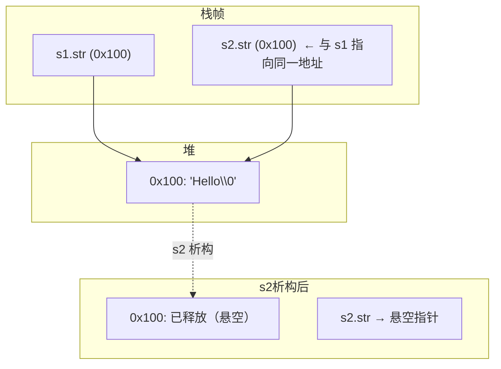
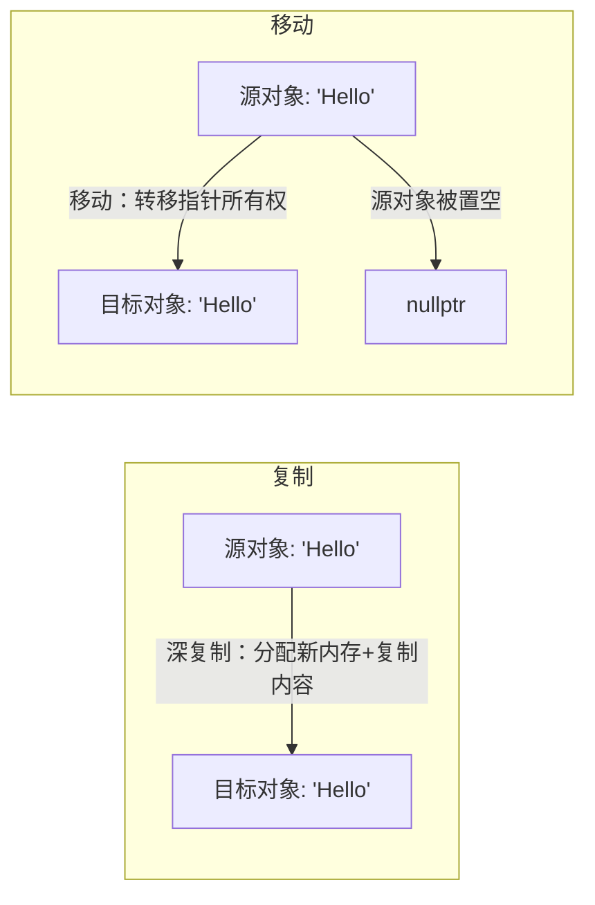
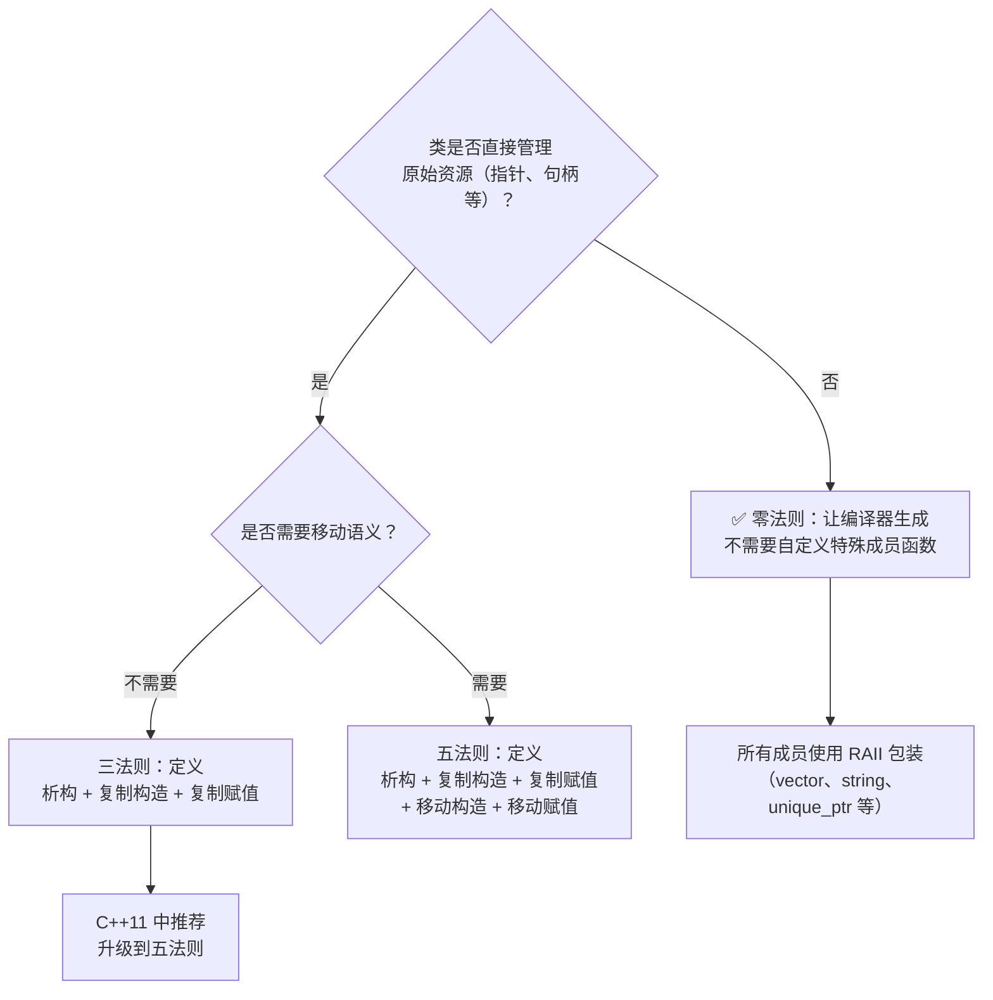
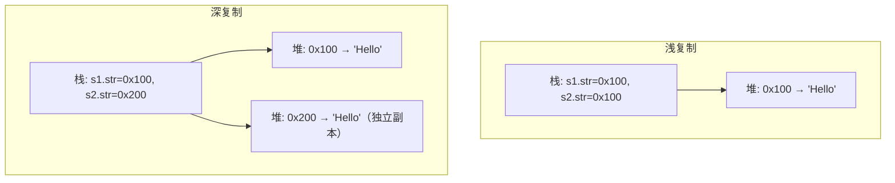
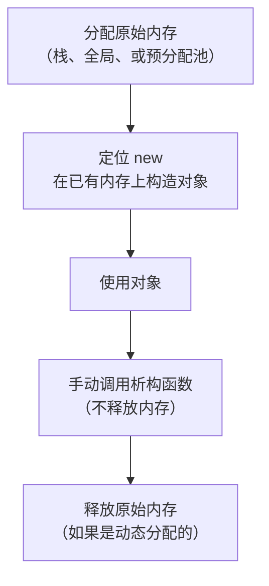
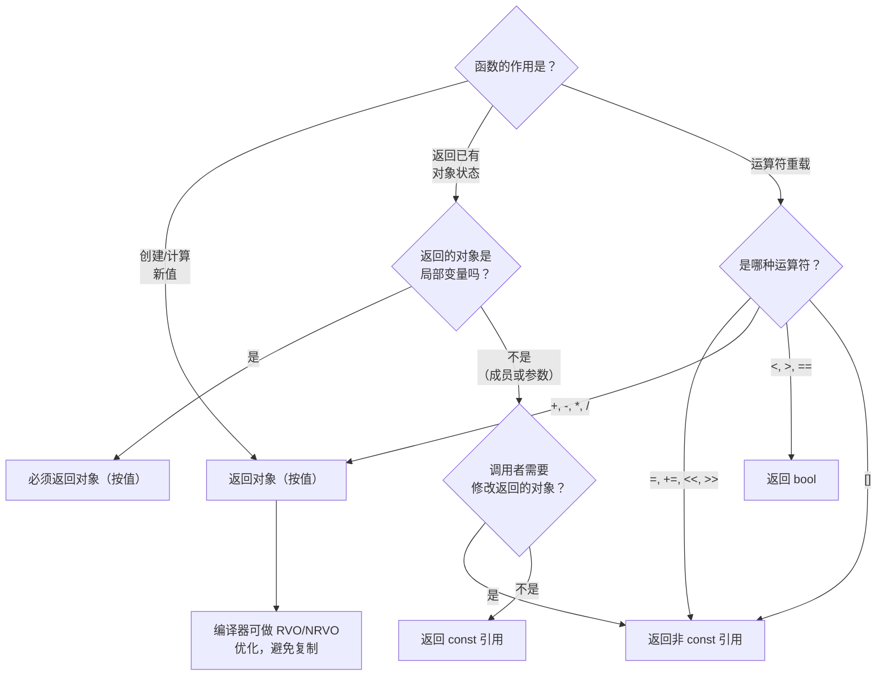
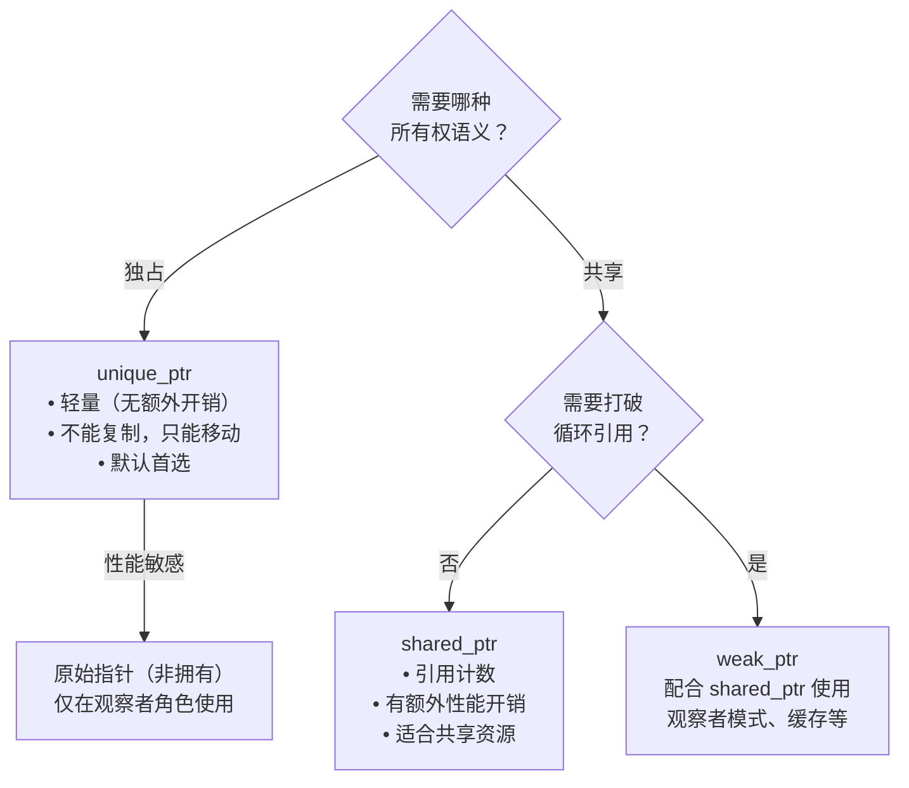

# 第 12 章：类和动态内存分配

> **本章目标**: 掌握在类中使用动态内存分配的关键技术——复制构造函数、赋值运算符重载、析构函数，以及 `static` 类成员的使用。深入理解 C++ 的"三/五/零法则"，RAII 资源管理思想，以及现代 C++ 中智能指针的应用。

---

## 12.1 动态内存和类

### 12.1.1 问题场景

当类的成员包含**原始指针**时，编译器默认生成的成员复制行为（逐成员复制）会导致严重问题。

```cpp
class String {
private:
    char* str;         // 指向动态分配的 C 风格字符串
    int len;

public:
    String(const char* s) {
        len = strlen(s);
        str = new char[len + 1];
        strcpy(str, s);
    }

    ~String() {
        delete[] str;  // 释放动态内存
    }
};

int main() {
    String s1("Hello");
    String s2 = s1;     // ❌ 默认复制：s2.str = s1.str（浅复制！）

    // 析构时究竟发生了什么？
    // 1. s2 先被析构 → delete[] s2.str → 堆内存被释放
    // 2. s1 接着被析构 → delete[] s1.str → s1.str 已经是悬空指针！
    // 3. 结果：双重释放（double free）→ 运行时崩溃或未定义行为

    return 0;
}
```

**内存布局展示 —— 浅复制导致的悬空指针**：



```mermaid
flowchart LR
    subgraph 浅复制（默认——错误）
        A["s1.str →"] --> MEM["堆: 'Hello'"]
        B["s2.str →"] --> MEM
    end
    subgraph 深复制（正确——需手动实现）
        C["s1.str →"] --> MEM1["堆: 'Hello'（副本1）"]
        D["s2.str →"] --> MEM2["堆: 'Hello'（副本2，独立）"]
    end
```

### 12.1.2 浅复制 vs 深复制详述

| 特性 | 浅复制 (Shallow Copy) | 深复制 (Deep Copy) |
|------|----------------------|-------------------|
| 指针成员 | 仅复制指针值（地址） | 分配新内存，复制内容 |
| 内存关系 | 两个指针指向同一块内存 | 每个对象拥有独立的内存 |
| 析构影响 | 双重释放或悬空指针 | 各自释放，互不影响 |
| 修改影响 | 修改一个影响另一个 | 完全独立 |
| 性能 | 快（仅复制地址） | 较慢（需要分配+复制） |
| 实现方式 | 编译器默认生成 | 需要手动编写 |

**默认成员复制（浅复制）的完整问题链**：

```cpp
// 1. 双重释放 (Double Free)
String s1("Hello");
String s2 = s1;
// 析构时: delete[] s2.str 释放内存 → delete[] s1.str 再次释放 → 崩溃

// 2. 相互影响 (Side Effects)
String s3("Hello");
String s4 = s3;
s4[0] = 'J';  // 如果实现了 operator[] 且未做深复制
// s3 的内容也被改成了 "Jello"！

// 3. 内存泄漏 (Memory Leak)
// 在赋值操作中，如果没有先 delete[] 原有内存就直接覆盖指针
```

### 12.1.3 调试内存错误的技巧

**常见工具**：

| 工具/技术 | 适用平台 | 说明 |
|-----------|---------|------|
| Valgrind (Memcheck) | Linux | 检测内存泄漏、非法访问 |
| AddressSanitizer (ASan) | Linux/macOS/Windows | 编译器内置，检测缓冲区溢出、use-after-free |
| Dr.Memory | Windows/Linux/macOS | 类似 Valgrind 的内存调试器 |
| Visual Studio 调试堆 | Windows | CRT 堆调试，检测内存泄漏 |
| 启用断言和检查 | 跨平台 | 自定义边界检查 |

**使用 AddressSanitizer 检测**：
```bash
# 编译时添加 -fsanitize=address 选项
g++ -fsanitize=address -g -o program program.cpp
# 运行程序，ASan 会在内存错误发生时立即报告
```

**心理检查清单**：
```
当类中包含指针成员时，问自己：
□ 构造函数中是否用 new 分配了内存？
□ 析构函数中是否用 delete 释放了内存？
□ 是否实现了复制构造函数（深复制）？
□ 是否实现了赋值运算符（深复制 + 自赋值检查）？
□ 是否遵循了 new/delete 的配对规则？
```

---

## 12.2 特殊成员函数

### 12.2.1 C++ 自动提供的成员函数

如果没有显式定义，C++ 编译器会自动生成以下特殊成员函数（C++98 有 4 个，C++11 增加到 6 个）：

| 特殊成员函数 | 默认行为 | C++98 | C++11 | 自动生成条件 |
|-------------|---------|-------|-------|-------------|
| **默认构造函数** | 无操作（或对每个成员调用其默认构造函数） | 有 | 有 | 没有定义任何构造函数时 |
| **析构函数** | 无操作（逐个调用成员的析构函数） | 有 | 有 | 总会在需要时生成（除非已定义） |
| **复制构造函数** | 逐成员复制（每个成员调用其复制构造函数） | 有 | 有 | 没有定义复制构造函数、移动构造函数或移动赋值运算符时 |
| **复制赋值运算符** | 逐成员赋值（每个成员调用其复制赋值运算符） | 有 | 有 | 没有定义复制赋值运算符、移动构造函数或移动赋值运算符时 |
| **移动构造函数** (C++11) | 逐成员移动（每个成员调用其移动构造函数） | - | 有 | 没有定义复制/移动构造函数、复制/移动赋值运算符或析构函数时 |
| **移动赋值运算符** (C++11) | 逐成员移动（每个成员调用其移动赋值运算符） | - | 有 | 同上 |

> **核心原则**：编译器自动生成的复制/移动都是"浅"操作（逐成员复制/移动）。对于持有原始指针或资源的类，这通常不是我们想要的行为。

### 12.2.2 C++98 三法则 (Rule of Three)

> **三法则**：如果类需要显式定义**析构函数**、**复制构造函数**或**复制赋值运算符**中的**任何一个**，那么通常需要定义**全部三个**。

**为什么？** 这三个函数紧密相关：
- 如果需要在析构函数中释放资源（说明类管理着资源）
- 那么默认的浅复制必然是错误的（两个对象会指向同一份资源）
- 所以必须同时定义复制构造函数和赋值运算符来实现深复制

```cpp
class RuleOfThree {
private:
    int* data;
    size_t size;

public:
    // 构造函数：分配资源
    RuleOfThree(size_t n) : size(n), data(new int[n]()) {}

    // 析构函数：释放资源
    ~RuleOfThree() {
        delete[] data;
    }

    // 复制构造函数：深复制
    RuleOfThree(const RuleOfThree& other)
        : size(other.size), data(new int[other.size]) {
        std::copy(other.data, other.data + size, data);
    }

    // 复制赋值运算符：深复制 + 自赋值检查
    RuleOfThree& operator=(const RuleOfThree& other) {
        if (this == &other) return *this;
        delete[] data;
        size = other.size;
        data = new int[size];
        std::copy(other.data, other.data + size, data);
        return *this;
    }
};
```

**违反三法则的后果**：

```cpp
class Bad {
    int* p;
public:
    Bad() : p(new int(42)) {}
    ~Bad() { delete p; }       // 有析构函数
    // 但没有复制构造函数和赋值运算符！
};

Bad a;
Bad b = a;   // 浅复制：b.p 和 a.p 指向同一内存
Bad c;
c = a;       // 浅复制 + 内存泄漏（c 的原有的 p 未被释放）
// 析构时：b 先释放 → a.p 悬空 → a 析构时 double free！
```

### 12.2.3 C++11 五法则 (Rule of Five)

> **五法则**：在 C++11 中，引入了移动语义，三法则扩展为五法则——如果类需要自定义析构函数、复制构造函数、复制赋值运算符中的任何一个，通常需要定义全部五个：**析构函数、复制构造函数、复制赋值运算符、移动构造函数、移动赋值运算符**。

```cpp
class RuleOfFive {
private:
    char* data;
    size_t size;

public:
    // 构造函数
    RuleOfFive(const char* s) : size(strlen(s)), data(new char[size + 1]) {
        strcpy(data, s);
    }

    // 析构函数
    ~RuleOfFive() { delete[] data; }

    // 复制构造函数
    RuleOfFive(const RuleOfFive& other)
        : size(other.size), data(new char[other.size + 1]) {
        strcpy(data, other.data);
    }

    // 复制赋值运算符
    RuleOfFive& operator=(const RuleOfFive& other) {
        if (this == &other) return *this;
        delete[] data;
        size = other.size;
        data = new char[size + 1];
        strcpy(data, other.data);
        return *this;
    }

    // 移动构造函数 (C++11)
    RuleOfFive(RuleOfFive&& other) noexcept
        : data(other.data), size(other.size) {
        other.data = nullptr;   // 置空源对象，防止其析构时释放资源
        other.size = 0;
    }

    // 移动赋值运算符 (C++11)
    RuleOfFive& operator=(RuleOfFive&& other) noexcept {
        if (this == &other) return *this;
        delete[] data;                      // 释放当前资源
        data = other.data;                  // 接管资源
        size = other.size;
        other.data = nullptr;               // 置空源对象
        other.size = 0;
        return *this;
    }
};
```

**移动语义的核心思想**：



### 12.2.4 零法则 (Rule of Zero)

> **零法则**：如果类**不**直接管理资源（即所有成员都是 RAII 类型，如 `std::string`、`std::vector`、智能指针等），则不需要自定义任何特殊成员函数，编译器生成的默认行为就是正确的。

```cpp
// ✅ 遵循零法则：不需要自定义任何特殊成员函数
class Person {
    std::string name;   // RAII 类型：自动管理内存
    int age;            // 普通类型：逐成员复制即可
    double salary;

    // 编译器生成的复制/移动/析构完全正确
};

// ✅ 现代 C++ 推荐：尽可能使用 RAII 成员，让编译器做正确的事
class Team {
    std::vector<Person> members;  // vector 自身已正确实现 RAII
    std::string teamName;
};
```

**三/五/零法则的选择指南**：



### 12.2.5 编译器生成特殊成员函数的条件

C++11 对特殊成员函数的隐式生成做了更精细的控制：

```cpp
class A {
public:
    A(const A&) = default;          // 显式要求默认生成
    A& operator=(const A&) = delete; // 显式删除
};

class B {
public:
    B(B&&) noexcept = default;      // 默认移动构造函数
};
```

**何时特殊成员函数被隐式定义为 =delete**：

| 特殊成员函数 | 被隐式定义为 =delete 的条件 |
|-------------|--------------------------|
| 默认构造函数 | 声明了任何非默认构造函数，或某个成员/基类没有可访问的默认构造函数 |
| 析构函数 | 某个成员/基类的析构函数不可访问或已删除 |
| 复制构造函数 | 某个成员/基类的复制构造函数不可访问或已删除，或移动构造函数/移动赋值已显式声明 |
| 复制赋值运算符 | 某个成员/基类的复制赋值运算符不可访问或已删除，或移动构造函数/移动赋值已显式声明 |
| 移动构造函数 | 显式声明了析构函数、复制构造函数或复制赋值运算符 |
| 移动赋值运算符 | 显式声明了析构函数、复制构造函数或复制赋值运算符 |

### 12.2.6 =default 和 =delete

**=default**：显式要求编译器生成默认版本，即使编译器通常不会自动生成。

```cpp
class Widget {
public:
    Widget() = default;                            // 默认构造函数
    Widget(const Widget&) = default;               // 默认复制构造
    Widget& operator=(const Widget&) = default;    // 默认复制赋值
    ~Widget() = default;                           // 默认析构函数
};
```

**=delete**：禁止某个特殊成员函数（或其他重载函数）。

```cpp
class NonCopyable {
public:
    NonCopyable() = default;
    ~NonCopyable() = default;

    // 禁止复制
    NonCopyable(const NonCopyable&) = delete;
    NonCopyable& operator=(const NonCopyable&) = delete;

    // 禁止移动（如果需要）
    NonCopyable(NonCopyable&&) = delete;
    NonCopyable& operator=(NonCopyable&&) = delete;
};

class Stream {
public:
    // 禁止复制流对象
    Stream(const Stream&) = delete;
    Stream& operator=(const Stream&) = delete;
};

// 也可以用于普通函数重载
void func(int x) {}
void func(double x) = delete;  // 禁止 double 参数的调用

int main() {
    func(42);     // OK: 调用 func(int)
    // func(3.14); // ❌ 编译错误：调用已删除的函数
}
```

**C++98 风格的禁止复制（私有 + 不实现）**：

```cpp
// C++98 风格：声明为 private 且不实现
class NonCopyable {
private:
    NonCopyable(const NonCopyable&);      // 只声明，不实现
    NonCopyable& operator=(const NonCopyable&); // 只声明，不实现
public:
    NonCopyable() {}
};

// C++11 风格更优：=delete 提供更清晰的错误信息
```

---

## 12.3 复制构造函数

### 12.3.1 定义与声明

复制构造函数是一个特殊的构造函数，用同类型的已有对象来初始化新创建的对象。

```cpp
class ClassName {
public:
    // 复制构造函数的声明
    ClassName(const ClassName& source);
    // 参数必须是引用（避免无限递归），通常是 const 引用
};
```

**为什么参数必须是引用？**

```cpp
// ❌ 错误：传值会导致无限递归
String(String s); // 传值需要复制 → 调用复制构造函数 → 传值需要复制 → ...
// ✅ 正确：传引用
String(const String& s);
```

### 12.3.2 何时调用

复制构造函数在以下场景被调用：

```cpp
String s1("Hello");

// 场景 1：用已有对象初始化新对象（声明时）
String s2 = s1;          // 复制构造函数（这是初始化，不是赋值！）
String s3(s1);           // 复制构造函数（直接初始化）
String s4{s1};           // C++11 列表初始化，也是复制构造函数

// 场景 2：按值传递参数
void func(String s) {    // 形参 s 通过复制构造函数创建
    // ...
}
func(s1);               // 调用复制构造函数

// 场景 3：按值返回对象（可能调用，取决于编译器优化）
String func2() {
    String temp("World");
    return temp;          // 可能调用复制构造函数（NRVO 可能优化掉）
}

// 场景 4：抛出和捕获异常
try {
    throw s1;             // 抛出时调用复制构造函数
} catch (String e) {      // 按值捕获时调用复制构造函数
    // ...
}

// 场景 5：标准库容器操作
std::vector<String> vec;
vec.push_back(s1);        // 向容器添加元素时调用复制构造函数
// C++11 后，临时对象会触发移动构造而非复制构造

// 场景 6：聚合初始化
std::pair<String, int> p(s1, 42);  // 调用复制构造函数
```

### 12.3.3 实现深复制

```cpp
// 复制构造函数 —— 深复制
String::String(const String& s) {
    len = s.len;
    str = new char[len + 1];    // 分配全新的内存
    strcpy(str, s.str);          // 复制内容
    num_strings++;               // 全局计数增加

    cout << "复制构造函数: " << str << endl;
}
```

> **⚠️ 不实现复制构造函数的后果**：
> ```cpp
> String s1("Cat");
> String s2(s1);  // 默认复制：s2.str = s1.str（指向同一块内存）
> // 析构时：s2 先释放 → s1.str 变成悬空指针 → 再析构 s1 时崩溃
> ```

### 12.3.4 禁止复制

某些类在逻辑上不应该被复制（如文件句柄、互斥锁、网络连接等）：

**方法 1：C++11 =delete（推荐）**

```cpp
class FileHandle {
private:
    FILE* fp;
public:
    FileHandle(const char* filename) {
        fopen_s(&fp, filename, "r");
    }
    ~FileHandle() { if (fp) fclose(fp); }

    // 禁止复制
    FileHandle(const FileHandle&) = delete;
    FileHandle& operator=(const FileHandle&) = delete;

    // 可以允许移动（可选）
    FileHandle(FileHandle&& other) noexcept : fp(other.fp) {
        other.fp = nullptr;
    }
};
```

**方法 2：C++98 风格 private + 不实现**

```cpp
class NonCopyable {
private:
    NonCopyable(const NonCopyable&);      // 只声明在 private
    NonCopyable& operator=(const NonCopyable&);
public:
    NonCopyable() {}
};

// 使用基类统一管理
class NonCopyableBase {
protected:
    NonCopyableBase() = default;
    ~NonCopyableBase() = default;
private:
    NonCopyableBase(const NonCopyableBase&);           // C++98 风格
    NonCopyableBase& operator=(const NonCopyableBase&);
};

class MyClass : private NonCopyableBase {
    // 自动不可复制
};
```

### 12.3.5 浅复制 vs 深复制的底层差异

**默认浅复制（编译器生成）**：

```cpp
// 编译器生成的默认复制构造函数等价于：
inline String::String(const String& s)
    : str(s.str),    // 直接复制指针值（浅！）
      len(s.len)     // 复制整数值
{}
```

**手动深复制**：

```cpp
// 手动实现的深复制构造函数：
String::String(const String& s)
    : len(s.len),
      str(new char[s.len + 1])  // 分配新内存
{
    memcpy(str, s.str, len + 1);  // 复制实际内容
}
```

**内存对比**：



### 12.3.6 复制省略 (Copy Elision) 与 RVO

编译器在某些情况下可以省略复制构造函数的调用（即使有副作用），这是 C++ 标准允许的优化：

```cpp
class CopyTracker {
public:
    CopyTracker() { cout << "默认构造\n"; }
    CopyTracker(const CopyTracker&) { cout << "复制构造\n"; }
    ~CopyTracker() { cout << "析构\n"; }
};

// 返回值优化 (RVO)
CopyTracker createObject() {
    return CopyTracker();  // 直接构造返回值，不调用复制构造
}

int main() {
    CopyTracker obj = createObject();
    // 被优化的场景：整个过程中可能只调用 1 次默认构造 + 1 次析构
}
```

**C++17 保证复制省略 (Guaranteed Copy Elision)**：

在 C++17 中，以下场景**保证**省略复制：

```cpp
// 1. 返回临时对象
CopyTracker f() { return CopyTracker{}; }     // C++17: 保证省略复制

// 2. 用临时对象初始化
CopyTracker obj = CopyTracker{};              // C++17: 保证省略复制

// 3. throw 和 catch（某些情况）
try {
    throw CopyTracker{};
} catch (CopyTracker& e) {  // 用引用捕获避免复制
    // ...
}
```

> **注意**：即使复制构造函数有输出语句（副作用），编译器也可以进行复制省略。因此不要依赖复制构造函数的副作用来关键逻辑。

---

## 12.4 赋值运算符

### 12.4.1 定义与声明

赋值运算符用已有对象的内容替换另一个已有对象的内容。

```cpp
class String {
public:
    // 复制赋值运算符
    String& operator=(const String& s);

    // C++11: 移动赋值运算符
    String& operator=(String&& s) noexcept;
};
```

### 12.4.2 自赋值安全

自赋值指的是对象赋值给自己：

```cpp
String s("Hello");
s = s;  // 自赋值 —— 看起来荒谬，但在复杂代码中可能悄然发生
```

**为什么需要自赋值检查？**

```cpp
// ❌ 没有自赋值检查的版本
String& String::operator=(const String& s) {
    delete[] str;               // 释放自己的内存
    len = s.len;
    str = new char[len + 1];
    strcpy(str, s.str);         // ❌ s.str 已经被释放了！
    return *this;
}

// ✅ 有自赋值检查的版本
String& String::operator=(const String& s) {
    if (this == &s) {           // 自赋值检查
        return *this;
    }
    delete[] str;
    len = s.len;
    str = new char[len + 1];
    strcpy(str, s.str);
    return *this;
}
```

**替代方案：不先释放，先复制再释放**：

```cpp
// ✅ 无需显式自赋值检查的替代实现
String& String::operator=(const String& s) {
    char* new_str = new char[s.len + 1];  // 先分配新内存
    strcpy(new_str, s.str);

    delete[] str;       // 释放旧内存
    str = new_str;      // 接管新内存
    len = s.len;

    return *this;
    // 即使在自赋值时也安全：
    // 1. 复制 s.str 到新内存
    // 2. 释放旧内存
    // 3. 指针指向新内存
}
```

### 12.4.3 异常安全

如果 `new` 分配失败（抛出 `std::bad_alloc`），原始对象应该保持有效状态：

```cpp
// ❌ 异常不安全
String& String::operator=(const String& s) {
    delete[] str;               // 已经释放了旧内存
    len = s.len;
    str = new char[len + 1];    // 如果这里抛出异常...
    strcpy(str, s.str);         // ...data 已经是无效状态！
    return *this;
}

// ✅ 异常安全——先分配，再释放
String& String::operator=(const String& s) {
    char* new_str = new char[s.len + 1];  // 如果分配失败，异常在此抛出
    // 这里抛出异常时，当前对象的 str 仍然有效
    strcpy(new_str, s.str);

    delete[] str;     // 只有分配成功后，才释放旧资源
    str = new_str;
    len = s.len;

    return *this;
}
```

### 12.4.4 复制交换惯用法 (Copy-and-Swap Idiom)

这是 C++ 中最优雅的赋值运算符实现方式，同时提供自赋值安全和异常安全：

```cpp
class String {
private:
    char* str;
    int len;

    // 友元 swap 函数（或作为成员）
    friend void swap(String& a, String& b) noexcept {
        using std::swap;
        swap(a.str, b.str);    // 交换指针
        swap(a.len, b.len);    // 交换整数值
    }

public:
    // 赋值运算符 —— 复制交换惯用法
    String& operator=(String s) {    // 注意：按值传递！
        // s 是通过复制构造函数创建的副本
        swap(*this, s);              // 将当前内容与副本交换
        return *this;
        // 函数返回时，s 被析构，释放原来的资源
    }
};
```

**工作原理图解**：

```mermaid
flowchart TD
    A["当前对象: str='World'"] -->|step1: s = rhs 的副本| B["副本 s: str='Hello'"]
    B -->|step2: swap(*this, s)| C["当前对象: str='Hello'\n s（即将析构）: str='World'"]
    C -->|step3: 函数返回，s 析构| D["当前对象: str='Hello'\n旧资源已自动释放"]
```

**复制交换惯用法的优点**：
1. **自赋值安全**：`s` 是独立的副本，自赋值不影响
2. **异常安全**：如果复制构造抛出异常，当前对象保持不变
3. **代码简洁**：一份代码同时实现了复制赋值和移动赋值（当参数是右值时，调用移动构造）
4. **不需要析构函数释放旧资源**：由 `s` 的析构函数自动完成

**如何同时支持移动赋值**：

```cpp
String& operator=(String s) {   // 既支持复制赋值也支持移动赋值！
    swap(*this, s);             // s 由复制构造（左值）或移动构造（右值）创建
    return *this;
}
```

### 12.4.5 连续赋值

赋值运算符必须返回 `*this` 的引用以支持链式赋值：

```cpp
int a, b, c;
a = b = c = 10;  // 从右向左结合：c = 10 → b = c → a = b

// 实现要求：
String& String::operator=(const String& s) {
    // ... 复制逻辑 ...
    return *this;  // 必须返回引用以支持链式赋值
}

String a, b, c;
a = b = c = String("Hello");
// 解析为：a.operator=(b.operator=(c.operator=(String("Hello"))))
```

**复制构造函数 vs 赋值运算符详细对比**：

| 特性 | 复制构造函数 | 赋值运算符 |
|------|-------------|-----------|
| 调用时机 | 创建新对象并用已有对象初始化时 | 两个已存在的对象之间赋值 |
| 对象状态 | 新对象尚未初始化 | 目标对象已有状态 |
| 语法 | `String s2 = s1;` 或 `String s2(s1);` | `s2 = s1;` |
| 自赋值处理 | 不需要（新对象不可能等于自身） | 需要检查 |
| 释放原有资源 | 不需要（新对象无资源） | 需要释放原有资源 |
| 返回类型 | 无 (void) | `ClassName&`（用于链式赋值） |
| 异常安全要求 | 较简单 | 较高（需保持原对象状态） |

---

## 12.5 完整示例：增强 String 类

本节实现一个功能丰富的自定义 String 类，展示动态内存管理的完整应用：

```cpp
#include <iostream>
#include <cstring>
#include <algorithm>    // for std::swap, std::copy
#include <stdexcept>    // for std::out_of_range
using namespace std;

class String {
private:
    char* str;                  // 动态分配的 C 风格字符串
    int len;                    // 字符串长度（不含 '\\0'）
    static int num_strings;     // 存活的对象计数
    static const int CINLIMIT = 100;  // getline 输入缓冲区大小

public:
    // ──────────────────────────────────────────────
    // 1. 构造 / 析构
    // ──────────────────────────────────────────────

    // 默认构造函数
    String() : len(0), str(new char[1]) {
        str[0] = '\0';
        num_strings++;
    }

    // 从 C 风格字符串构造
    String(const char* s) {
        len = (s ? strlen(s) : 0);
        str = new char[len + 1];
        if (s) {
            strcpy(str, s);
        } else {
            str[0] = '\0';
        }
        num_strings++;
    }

    // 复制构造函数
    String(const String& s) : len(s.len), str(new char[s.len + 1]) {
        strcpy(str, s.str);
        num_strings++;
    }

    // 移动构造函数 (C++11)
    String(String&& s) noexcept
        : str(s.str), len(s.len) {
        s.str = nullptr;    // 源对象指针置空
        s.len = 0;
        // num_strings 不增加，因为只是转移所有权
    }

    // 析构函数
    ~String() {
        if (str) {          // 移动后的对象可能为 nullptr
            delete[] str;
        }
        num_strings--;
    }

    // ──────────────────────────────────────────────
    // 2. 赋值运算符
    // ──────────────────────────────────────────────

    // 复制赋值（使用复制交换惯用法）
    String& operator=(String s) {   // 按值传递：复制构造或移动构造
        swap(*this, s);              // 交换内容
        return *this;                // s 析构时释放旧资源
    }

    // swap 友元（支持复制交换）
    friend void swap(String& a, String& b) noexcept {
        using std::swap;
        swap(a.str, b.str);
        swap(a.len, b.len);
    }

    // ──────────────────────────────────────────────
    // 3. 访问器与容量
    // ──────────────────────────────────────────────

    // 返回 C 风格字符串
    const char* c_str() const { return str ? str : ""; }

    // 获取长度
    int length() const { return len; }
    int size() const { return len; }

    // 是否为空
    bool empty() const { return len == 0; }

    // 清空字符串
    void clear() {
        delete[] str;
        len = 0;
        str = new char[1];
        str[0] = '\0';
    }

    // 容量（当前最大容量 = 长度 + 1）
    int capacity() const { return len + 1; }

    // ──────────────────────────────────────────────
    // 4. 索引运算符
    // ──────────────────────────────────────────────

    // 可读写访问
    char& operator[](int i) {
        if (i < 0 || i >= len) {
            throw out_of_range("String index out of range");
        }
        return str[i];
    }

    // 只读访问
    const char& operator[](int i) const {
        if (i < 0 || i >= len) {
            throw out_of_range("String index out of range");
        }
        return str[i];
    }

    // 安全的 at() 方法
    char& at(int i) { return (*this)[i]; }
    const char& at(int i) const { return (*this)[i]; }

    // 首尾字符
    char& front() { return str[0]; }
    const char& front() const { return str[0]; }
    char& back() { return str[len - 1]; }
    const char& back() const { return str[len - 1]; }

    // ──────────────────────────────────────────────
    // 5. 字符串修改
    // ──────────────────────────────────────────────

    // 追加字符串
    String& operator+=(const String& s) {
        char* new_str = new char[len + s.len + 1];
        strcpy(new_str, str ? str : "");
        strcat(new_str, s.str ? s.str : "");
        delete[] str;
        str = new_str;
        len = len + s.len;
        return *this;
    }

    String& operator+=(const char* s) {
        return (*this) += String(s);
    }

    // 追加单个字符
    void push_back(char c) {
        char* new_str = new char[len + 2];
        strcpy(new_str, str ? str : "");
        new_str[len] = c;
        new_str[len + 1] = '\0';
        delete[] str;
        str = new_str;
        len++;
    }

    // 移除最后一个字符
    void pop_back() {
        if (len > 0) {
            str[len - 1] = '\0';
            len--;
        }
    }

    // 插入子串
    String& insert(int pos, const String& s) {
        if (pos < 0 || pos > len) {
            throw out_of_range("insert: position out of range");
        }
        char* new_str = new char[len + s.len + 1];
        strncpy(new_str, str, pos);
        new_str[pos] = '\0';
        strcat(new_str, s.str);
        strcat(new_str, str + pos);
        delete[] str;
        str = new_str;
        len = len + s.len;
        return *this;
    }

    // 擦除子串
    String& erase(int pos, int count = 1) {
        if (pos < 0 || pos >= len) {
            throw out_of_range("erase: position out of range");
        }
        int actual_count = min(count, len - pos);
        memmove(str + pos, str + pos + actual_count, len - pos - actual_count + 1);
        len -= actual_count;
        return *this;
    }

    // 替换子串
    String& replace(int pos, int count, const String& s) {
        erase(pos, count);
        insert(pos, s);
        return *this;
    }

    // 交换内容
    void swap(String& other) noexcept {
        using std::swap;
        swap(str, other.str);
        swap(len, other.len);
    }

    // ──────────────────────────────────────────────
    // 6. 字符串查找
    // ──────────────────────────────────────────────

    // 查找子串第一次出现的位置
    int find(const String& s, int pos = 0) const {
        if (pos < 0 || pos > len) return -1;
        if (s.len == 0) return pos;
        const char* found = strstr(str + pos, s.str);
        return found ? static_cast<int>(found - str) : -1;
    }

    int find(const char* s, int pos = 0) const {
        return find(String(s), pos);
    }

    int find(char c, int pos = 0) const {
        if (pos < 0 || pos > len) return -1;
        const char* found = strchr(str + pos, c);
        return found ? static_cast<int>(found - str) : -1;
    }

    // 查找子串最后一次出现的位置
    int rfind(const String& s, int pos = -1) const {
        if (s.len == 0) return len;
        if (pos < 0 || pos >= len) pos = len - 1;
        for (int i = pos; i >= 0; i--) {
            if (strncmp(str + i, s.str, s.len) == 0) {
                return i;
            }
        }
        return -1;
    }

    int rfind(char c, int pos = -1) const {
        if (pos < 0 || pos >= len) pos = len - 1;
        for (int i = pos; i >= 0; i--) {
            if (str[i] == c) return i;
        }
        return -1;
    }

    // ──────────────────────────────────────────────
    // 7. 提取子串
    // ──────────────────────────────────────────────

    String substr(int pos = 0, int count = -1) const {
        if (pos < 0 || pos > len) {
            throw out_of_range("substr: position out of range");
        }
        if (count < 0 || count > len - pos) {
            count = len - pos;
        }
        char* buf = new char[count + 1];
        strncpy(buf, str + pos, count);
        buf[count] = '\0';
        String result(buf);
        delete[] buf;
        return result;
    }

    // ──────────────────────────────────────────────
    // 8. 比较运算符系列
    // ──────────────────────────────────────────────

    friend bool operator==(const String& a, const String& b) {
        return strcmp(a.str ? a.str : "", b.str ? b.str : "") == 0;
    }

    friend bool operator!=(const String& a, const String& b) {
        return !(a == b);
    }

    friend bool operator<(const String& a, const String& b) {
        return strcmp(a.str ? a.str : "", b.str ? b.str : "") < 0;
    }

    friend bool operator>(const String& a, const String& b) {
        return b < a;
    }

    friend bool operator<=(const String& a, const String& b) {
        return !(b < a);
    }

    friend bool operator>=(const String& a, const String& b) {
        return !(a < b);
    }

    // 与 const char* 的比较
    friend bool operator==(const String& a, const char* b) { return a == String(b); }
    friend bool operator==(const char* a, const String& b) { return String(a) == b; }
    friend bool operator!=(const String& a, const char* b) { return !(a == String(b)); }
    friend bool operator!=(const char* a, const String& b) { return !(String(a) == b); }

    // ──────────────────────────────────────────────
    // 9. 字符串连接运算符
    // ──────────────────────────────────────────────

    friend String operator+(const String& a, const String& b) {
        String result;
        delete[] result.str;
        result.len = a.len + b.len;
        result.str = new char[result.len + 1];
        strcpy(result.str, a.str ? a.str : "");
        strcat(result.str, b.str ? b.str : "");
        return result;
    }

    friend String operator+(const String& a, const char* b) {
        return a + String(b);
    }

    friend String operator+(const char* a, const String& b) {
        return String(a) + b;
    }

    // ──────────────────────────────────────────────
    // 10. 输入/输出
    // ──────────────────────────────────────────────

    friend ostream& operator<<(ostream& os, const String& s) {
        os << (s.str ? s.str : "");
        return os;
    }

    // 带空格的输入（标准 >> 遇到空格停止）
    friend istream& operator>>(istream& is, String& s) {
        char buf[String::CINLIMIT];
        is >> buf;
        if (is) {
            delete[] s.str;
            s.len = strlen(buf);
            s.str = new char[s.len + 1];
            strcpy(s.str, buf);
        }
        return is;
    }

    // getline 支持：读取一整行（包括空格）
    friend istream& getline(istream& is, String& s, char delim = '\n') {
        char buf[1024];
        is.getline(buf, 1024, delim);
        if (is) {
            delete[] s.str;
            s.len = strlen(buf);
            s.str = new char[s.len + 1];
            strcpy(s.str, buf);
        }
        return is;
    }

    // ──────────────────────────────────────────────
    // 11. 类型转换支持
    // ──────────────────────────────────────────────

    // 转换为 C 风格字符串
    operator const char*() const { return c_str(); }

    // ──────────────────────────────────────────────
    // 12. 静态成员
    // ──────────────────────────────────────────────

    static int howMany() { return num_strings; }
};

// 初始化静态成员变量
int String::num_strings = 0;

// ──────────────────────────────────────────────
// 测试程序
// ──────────────────────────────────────────────

int main() {
    cout << "=== 1. 构造函数测试 ===" << endl;
    String s1;                       // 默认构造
    String s2("Hello World");        // C 风格构造
    String s3 = s2;                  // 复制构造
    String s4 = std::move(s3);       // 移动构造

    cout << "s1: [" << s1 << "] len=" << s1.length() << endl;
    cout << "s2: [" << s2 << "] len=" << s2.length() << endl;
    cout << "s4: [" << s4 << "] (moved from s3)" << endl;
    cout << "活跃对象数: " << String::howMany() << endl;

    cout << "\n=== 2. 索引与访问测试 ===" << endl;
    cout << "s2[0] = " << s2[0] << endl;
    cout << "s2.front() = " << s2.front() << endl;
    cout << "s2.back() = " << s2.back() << endl;
    cout << "c_str(): " << s2.c_str() << endl;

    cout << "\n=== 3. 字符串查找测试 ===" << endl;
    cout << "查找 'World': pos = " << s2.find("World") << endl;
    cout << "查找 'o': pos = " << s2.find('o') << endl;
    cout << "查找 'o' 从 pos=5: pos = " << s2.find('o', 5) << endl;
    cout << "查找 'XYZ': pos = " << s2.find("XYZ") << " (-1 = 未找到)" << endl;

    cout << "\n=== 4. 子串测试 ===" << endl;
    String sub = s2.substr(0, 5);
    cout << "s2.substr(0,5) = [" << sub << "]" << endl;

    cout << "\n=== 5. 追加与修改测试 ===" << endl;
    String s5("C++");
    s5 += " Primer";
    s5 += " Plus";
    cout << "追加后: [" << s5 << "]" << endl;

    s5.push_back('!');
    cout << "push_back: [" << s5 << "]" << endl;

    cout << "\n=== 6. 插入/擦除/替换测试 ===" << endl;
    String s6("Hello World");
    s6.insert(5, " Beautiful");
    cout << "insert: [" << s6 << "]" << endl;

    s6.erase(5, 10);
    cout << "erase:  [" << s6 << "]" << endl;

    String s7("I like C");
    s7.replace(7, 1, "C++");
    cout << "replace:[" << s7 << "]" << endl;

    cout << "\n=== 7. 比较运算符测试 ===" << endl;
    String a("Alpha");
    String b("Bravo");
    cout << a << " < " << b << " : " << (a < b) << endl;
    cout << a << " > " << b << " : " << (a > b) << endl;
    cout << a << " == " << a << " : " << (a == a) << endl;
    cout << a << " != " << b << " : " << (a != b) << endl;

    cout << "\n=== 8. 连接运算符测试 ===" << endl;
    String s8 = String("Hello") + " " + String("World");
    cout << "连接: [" << s8 << "]" << endl;

    cout << "\n=== 9. 赋值测试 ===" << endl;
    String s9("Original");
    s9 = s2;                       // 复制赋值
    cout << "复制赋值: [" << s9 << "]" << endl;
    s9 = String("Temporary");      // 移动赋值
    cout << "移动赋值: [" << s9 << "]" << endl;

    cout << "\n=== 10. 程序结束，触发所有析构 ===" << endl;
    cout << "当前活跃对象数: " << String::howMany() << endl;

    return 0;
}
```

---

## 12.6 static 类成员

### 12.6.1 静态成员变量

静态成员变量属于类本身，而不是某个对象。所有对象共享同一个静态成员实例。

```cpp
class String {
private:
    static int num_strings;  // 声明（在类中）
    // ...
};

// 定义和初始化（在类外，通常在 .cpp 文件中）
int String::num_strings = 0;  // 分配存储空间
```

**特点**：
- 所有对象共享同一个静态成员实例
- 必须在类外单独定义（分配存储空间）
- 如果没有显式初始化，默认为 0
- 可以用作对象计数器、共享配置、缓存等

**内存布局**：

```mermaid
flowchart LR
    subgraph 数据段（静态存储区）
        STATIC["String::num_strings = 3\n（所有对象共享）"]
    end
    subgraph 栈/堆上的对象
        OBJ1["s1: str→'Hello'"]
        OBJ2["s2: str→'World'"]
        OBJ3["s3: str→'C++'"]
    end
    OBJ1 -.->|读取/写入| STATIC
    OBJ2 -.-> STATIC
    OBJ3 -.-> STATIC
```

### 12.6.2 静态成员函数

静态成员函数不需要通过对象调用，没有 `this` 指针：

```cpp
class String {
public:
    static int howMany() { return num_strings; }
    // 静态成员函数只能访问静态成员
    // 没有 this 指针，不能用 this，也不能访问非静态成员
};
```

**调用方式**：

```cpp
// 通过类名调用（推荐，语义清晰）
int count = String::howMany();

// 通过对象调用（也可以，但语义不清晰）
String s;
int count = s.howMany();
```

**静态成员函数的限制**：

| 限制 | 原因 | 示例 |
|------|------|------|
| 不能访问非静态成员 | 没有 this 指针 | `str`、`len` 等不可访问 |
| 不能使用 this 指针 | 没有当前对象上下文 | `this->len` 编译错误 |
| 不能是 virtual | 静态绑定，不参与多态 | `virtual static void f()` 编译错误 |
| 不能是 const | const 作用于 this，但静态函数没有 this | `static void f() const` 编译错误 |

### 12.6.3 inline static（C++17）

C++17 引入了 `inline static` 成员变量，允许在类内直接定义和初始化静态成员，无需在类外单独定义：

```cpp
class Config {
public:
    // C++17: inline static 可以在类内定义
    inline static std::string appName = "MyApp";
    inline static int versionMajor = 1;
    inline static int versionMinor = 0;
    inline static bool debugMode = false;

    // 也可以在类内初始化的传统方式（仅 const 整型/枚举）
    static const int MAX_USERS = 1000;      // C++98: const 整型可在类内初始化
    static constexpr double PI = 3.14159;   // C++11: constexpr 任何字面类型
};

// C++17 前需要在某处（通常 .cpp）定义：
// std::string Config::appName = "MyApp";   // C++17: 不再需要
```

### 12.6.4 工厂模式 (Factory Pattern)

静态成员函数常用于实现工厂模式，封装对象创建逻辑：

```cpp
#include <iostream>
#include <memory>
#include <string>
using namespace std;

class Logger {
public:
    enum LogLevel { DEBUG, INFO, WARN, ERROR };

    virtual void log(const string& msg) = 0;
    virtual ~Logger() = default;

    // 静态工厂方法
    static unique_ptr<Logger> createConsoleLogger(LogLevel level = INFO);
    static unique_ptr<Logger> createFileLogger(const string& filename,
                                                LogLevel level = INFO);
};

class ConsoleLogger : public Logger {
    LogLevel level_;
public:
    explicit ConsoleLogger(LogLevel level) : level_(level) {}
    void log(const string& msg) override {
        cout << "[Console] " << msg << endl;
    }
};

class FileLogger : public Logger {
    LogLevel level_;
    string filename_;
public:
    FileLogger(const string& filename, LogLevel level)
        : filename_(filename), level_(level) {}
    void log(const string& msg) override {
        cout << "[File: " << filename_ << "] " << msg << endl;
    }
};

// 静态工厂方法实现
unique_ptr<Logger> Logger::createConsoleLogger(LogLevel level) {
    return make_unique<ConsoleLogger>(level);
}

unique_ptr<Logger> Logger::createFileLogger(const string& filename,
                                             LogLevel level) {
    return make_unique<FileLogger>(filename, level);
}

int main() {
    auto logger = Logger::createConsoleLogger(Logger::INFO);
    logger->log("This is a log message");   // 通过统一接口调用
}
```

### 12.6.5 单例模式 (Singleton Pattern)

静态成员是实现单例模式的关键：

```cpp
class Singleton {
private:
    // 私有构造函数，防止外部实例化
    Singleton() {
        cout << "Singleton 实例创建" << endl;
    }
    ~Singleton() = default;

    // 禁止复制和移动
    Singleton(const Singleton&) = delete;
    Singleton& operator=(const Singleton&) = delete;

    // 唯一的实例指针
    static Singleton* instance;

public:
    // 全局访问点
    static Singleton& getInstance() {
        if (!instance) {
            instance = new Singleton();
        }
        return *instance;
    }

    // 业务方法
    void doSomething() {
        cout << "Singleton::doSomething()" << endl;
    }

    // 清理（可选）
    static void destroyInstance() {
        delete instance;
        instance = nullptr;
    }
};

// 定义静态成员
Singleton* Singleton::instance = nullptr;

// 使用
Singleton::getInstance().doSomething();

// ─── C++11 更优的单例实现：Meyer's Singleton ───
class MeyerSingleton {
private:
    MeyerSingleton() { cout << "MeyerSingleton 创建\n"; }
    ~MeyerSingleton() = default;

public:
    MeyerSingleton(const MeyerSingleton&) = delete;
    MeyerSingleton& operator=(const MeyerSingleton&) = delete;

    // C++11 保证：函数局部 static 变量初始化是线程安全的
    static MeyerSingleton& getInstance() {
        static MeyerSingleton instance;  // 首次调用时初始化，仅一次
        return instance;
    }

    void doSomething() {
        cout << "MeyerSingleton::doSomething()" << endl;
    }
};
```

**两种单例对比**：

| 特性 | 指针式单例 | Meyer's 单例（局部 static） |
|------|-----------|--------------------------|
| 线程安全 | 需要额外同步 | C++11 保证初始化线程安全 |
| 生命周期控制 | 可手动销毁和重建 | 程序结束时自动销毁 |
| 析构时机 | 通过 `destroyInstance()` 控制 | 程序退出时自动析构 |
| 代码复杂度 | 需要管理指针 | 极其简单 |
| 推荐度 | 不推荐 | **推荐** |

### 12.6.6 对象池 (Object Pool)

使用静态成员管理可复用的对象池：

```cpp
#include <vector>
#include <memory>

class Connection {
public:
    void connect() { /* ... */ }
    void disconnect() { /* ... */ }
    bool isConnected() const { return true; }
    void reset() { /* 重置连接状态 */ }
};

class ConnectionPool {
private:
    static vector<unique_ptr<Connection>> pool_;
    static const int MAX_POOL_SIZE = 10;

public:
    static Connection* acquire() {
        if (!pool_.empty()) {
            Connection* conn = pool_.back().release();
            pool_.pop_back();
            conn->reset();
            return conn;
        }
        // 创建新连接
        Connection* conn = new Connection();
        conn->connect();
        return conn;
    }

    static void release(Connection* conn) {
        if (pool_.size() < MAX_POOL_SIZE) {
            conn->disconnect();
            conn->reset();
            pool_.push_back(unique_ptr<Connection>(conn));
        } else {
            delete conn;
        }
    }

    static void cleanup() {
        pool_.clear();
    }
};

vector<unique_ptr<Connection>> ConnectionPool::pool_;
```

### 12.6.7 thread_local 静态成员（C++11）

每个线程拥有独立的静态成员副本：

```cpp
class ThreadData {
public:
    // 每个线程有独立的 errno 副本
    static thread_local int errno;
    static thread_local string threadName;
};

thread_local int ThreadData::errno = 0;
thread_local string ThreadData::threadName = "main";

// 每个线程写入自己的 threadName，互不干扰
void worker() {
    ThreadData::threadName = "worker-thread";
    cout << ThreadData::threadName << endl;  // 输出 "worker-thread"
}

int main() {
    cout << ThreadData::threadName << endl;  // 输出 "main"
    thread t(worker);
    t.join();
}
```

---

## 12.7 成员初始化列表的补充

### 12.7.1 初始化顺序

成员按照**在类中声明的顺序**初始化，而不是初始化列表中的顺序：

```cpp
class Example {
private:
    int a;          // 先声明
    int b;          // 后声明

public:
    // ❌ 危险！b 先使用 a 的值，但 a 还没有初始化！
    Example(int value) : b(value), a(b + 1) {
        // 实际初始化顺序：a 先（但 a 用 b+1 初始化，而 b 还未初始化）→ 未定义行为
    }

    // ✅ 正确：按照声明顺序
    Example(int value) : a(value), b(a + 1) {
        // 实际初始化顺序：a = value, b = a + 1（正确）
    }
};

// 更危险的例子
class Dangerous {
    int arr[10];
    int size;
public:
    // ❌ size 在 arr 之后声明，但初始化列表中 size 在前
    Dangerous(int s) : size(s), arr{/* 使用 size 来指定元素？不行！ */} {
        // 实际初始化顺序：arr 先初始化（此时 size 未初始化）→ arr 用垃圾值
    }
};
```

**最佳实践**：让初始化列表的顺序与类中声明的顺序保持一致。

### 12.7.2 C++11 类内初始化

```cpp
class Example {
private:
    // C++11 类内初始化（成员默认值）
    int a = 10;
    double b = 3.14;
    string name = "default";
    vector<int> numbers = {1, 2, 3, 4, 5};  // 初始化列表

    // 指针和动态内存也可以在类内初始化
    int* data = nullptr;
    static const int MAX_SIZE = 100;        // const 静态整型可以类内初始化

    // C++14 起可以这样
    // auto ptr = make_unique<int>(42);      // 需要 C++14
};

// 当类内初始化与初始化列表冲突时，初始化列表优先：
class Widget {
    int value = 10;       // 默认值 10
public:
    Widget() {}                           // value = 10
    Widget(int v) : value(v) {}           // value = v（覆盖默认值）
};
```

---

## 12.8 new/delete 的配对规则

### 12.8.1 基本配对规则

```cpp
// 规则 1：new 配 delete
int* p1 = new int(42);
delete p1;           // ✅ 正确配对

// 规则 2：new[] 配 delete[]
int* p2 = new int[100];
delete[] p2;         // ✅ 正确配对

// ❌ 错误配对的后果
int* p3 = new int(42);
// delete[] p3;      // 未定义行为！new 配 delete[] 是错误的

int* p4 = new int[100];
// delete p4;        // 未定义行为！只释放了第一个元素，其余 99 个泄漏
```

**配对规则速查表**：

| 分配方式 | 释放方式 | 说明 |
|---------|---------|------|
| `new` | `delete` | 单个对象 |
| `new[]` | `delete[]` | 对象数组 |
| `new (nothrow)` | `delete` | 不抛出异常的 new |
| `new (定位)` (placement new) | 手动调用析构函数 | 不释放内存，只析构对象 |
| `::operator new()` | `::operator delete()` | 原始内存分配 |
| `malloc()` | `free()` | C 风格分配（不要与 new/delete 混用） |

### 12.8.2 构造函数中的异常与内存泄漏

构造函数中抛出异常会导致一个微妙的资源泄漏问题：

```cpp
class TwoStageResource {
private:
    int* data1;
    int* data2;

public:
    // ❌ 潜在的内存泄漏
    TwoStageResource(size_t n) {
        data1 = new int[n]();        // 分配第一个资源
        // 假设某些逻辑抛出了异常
        if (n > 1000) {
            throw std::bad_alloc();  // data1 已经分配但不会释放！
        }
        data2 = new int[n]();        // 分配第二个资源
    }

    ~TwoStageResource() {
        delete[] data1;              // 如果构造异常，data1 可能未初始化
        delete[] data2;
    }
};
```

**解决方案 1：使用智能指针**：

```cpp
class SafeResource {
private:
    unique_ptr<int[]> data1;
    unique_ptr<int[]> data2;

public:
    SafeResource(size_t n)
        : data1(make_unique<int[]>(n)),    // 先构造 data1
          data2(make_unique<int[]>(n)) {   // 如果 data2 失败，data1 自动析构
        // 构造函数体为空
    }
    // 不需要显式析构函数
};
```

**解决方案 2：函数 try 块**：

```cpp
class HandleResource {
    int* data1;
    int* data2;
public:
    HandleResource(size_t n)
    try : data1(new int[n]()), data2(new int[n]()) {
        // 构造函数体
    } catch (...) {
        delete[] data1;    // 如果构造失败，清理已分配的资源
        delete[] data2;
        throw;             // 重新抛出异常
    }

    ~HandleResource() {
        delete[] data1;
        delete[] data2;
    }
};
```

### 12.8.3 nothrow new

默认情况下，`new` 在分配失败时抛出 `std::bad_alloc` 异常。`nothrow new` 在失败时返回 `nullptr`：

```cpp
#include <new>       // for std::nothrow

int* p = new (std::nothrow) int[1000000000];
if (!p) {
    cerr << "内存分配失败！" << endl;
    // 处理错误
} else {
    // 正常使用
    delete[] p;      // 和普通 delete[] 配对
}
```

**类中使用 nothrow new 的构造函数**：

```cpp
class SafeArray {
private:
    int* data;
    size_t size;
    bool allocated;

public:
    SafeArray(size_t n)
        : data(new (std::nothrow) int[n]()),
          size(data ? n : 0),
          allocated(data != nullptr) {}

    bool isValid() const { return allocated; }

    ~SafeArray() {
        delete[] data;
    }

    // 必须有复制构造函数和赋值运算符...
};
```

### 12.8.4 定位 new (Placement New)

定位 new 在已有的内存上构造对象，不分配新内存：

```cpp
#include <new>       // for placement new

// 基本用法
void* buffer = operator new(sizeof(String));  // 分配原始内存
String* ps = new (buffer) String("Hello");    // 在 buffer 上构造对象

// 使用对象
cout << *ps << endl;

// ❌ 不能使用 delete ps 来释放！
// 需要手动调用析构函数
ps->~String();        // 手动析构
operator delete(buffer);  // 释放原始内存
```

**类中使用定位 new 的注意事项**：

```cpp
class MemoryPool {
private:
    alignas(String) char pool_[sizeof(String) * 10];  // 预分配内存池
    String* strings_[10];
    int used_;

public:
    MemoryPool() : used_(0) {}

    String* create(const char* s) {
        if (used_ >= 10) return nullptr;
        String* p = new (pool_ + sizeof(String) * used_) String(s);
        strings_[used_++] = p;
        return p;
    }

    void destroy(int index) {
        if (index < 0 || index >= used_) return;
        strings_[index]->~String();  // 手动调用析构函数！
        // 注意：内存池本身不释放，只析构对象
        // 将最后一个元素移到当前位置以保持紧凑
        if (index < --used_) {
            strings_[index] = strings_[used_];
        }
    }

    // 析构时不释放内存池（池是类的一部分）
    ~MemoryPool() {
        for (int i = 0; i < used_; i++) {
            strings_[i]->~String();  // 手动析构每个对象
        }
    }
};
```

**定位 new 的核心要点**：



### 12.8.5 配对错误检测表

| 症状 | 可能原因 | 诊断方法 |
|------|---------|---------|
| 程序崩溃在 `delete` | `new`/`delete` 不配对，或重复释放 | ASan, Valgrind |
| 内存持续增加（内存泄漏） | `new` 后未 `delete` | 任务管理器, Valgrind |
| 析构时崩溃 | 浅复制导致 double free | 检查复制构造函数 |
| 释放后访问崩溃 | 悬空指针 (dangling pointer) | ASan use-after-free |
| 字符串内容乱码 | 缓冲区溢出或未初始化 | ASan stack-buffer-overflow |
| `new` 返回 nullptr（旧代码） | 内存耗尽 | 使用 nothrow new 检查 |

---

## 12.9 返回对象 vs 返回引用

### 12.9.1 基本规则

```cpp
class MyClass {
public:
    // ✅ 返回引用：避免不必要的复制
    // 适用于赋值运算符、流运算符等
    MyClass& operator=(const MyClass& rhs);

    // ✅ 返回 const 引用：只读访问
    const MyClass& getData() const;

    // ✅ 返回对象：必须创建新对象
    MyClass operator+(const MyClass& rhs) const;

    // ❌ 危险！不要返回局部变量的引用
    MyClass& bad() {
        MyClass local;    // 局部对象
        return local;     // 函数返回时 local 被销毁 → 悬空引用！
    }

    // ❌ 危险！不要返回局部动态对象的引用（谁负责 delete？）
    MyClass& alsoBad() {
        MyClass* p = new MyClass();
        return *p;        // 调用者不知道要 delete
    }
};
```

### 12.9.2 返回类型选择决策树



**选择总表**：

| 场景 | 返回类型 | 原因 | 示例 |
|------|---------|------|------|
| 赋值运算符 | `ClassName&` | 链式赋值需要左值引用 | `a = b = c` |
| 复合赋值 (+=, -=) | `ClassName&` | 返回左值引用 | `a += b` |
| 算术运算符 (+, -) | `ClassName` | 创建新对象 | `a + b` |
| 关系运算符 (<, >, ==) | `bool` | 返回布尔值 | `a < b` |
| 输出运算符 `<<` | `ostream&` | 链式输出 | `cout << a << b` |
| 输入运算符 `>>` | `istream&` | 链式输入 | `cin >> a >> b` |
| 索引运算符 `[]` | `T&` 或 `const T&` | 可以做左值 | `a[0] = 1` |
| 访问器 (getter) | `const T&` 或 `T` | 避免复制 | `obj.getName()` |
| 工厂函数 | 智能指针或对象 | 调用者拥有所有权 | `make_shared<T>()` |

### 12.9.3 RVO/NRVO 优化

**RVO (Return Value Optimization)**：编译器优化，省略返回临时对象时的复制。

**NRVO (Named Return Value Optimization)**：对具名局部变量的返回值优化。

```cpp
class Heavy {
    int data[1000];
public:
    Heavy() { cout << "构造\n"; }
    Heavy(const Heavy&) { cout << "复制构造\n"; }
    ~Heavy() { cout << "析构\n"; }
};

// 场景 1：RVO —— 返回临时对象
Heavy makeRVO() {
    return Heavy();      // 编译器直接在返回值位置构造
}

// 场景 2：NRVO —— 返回具名局部对象
Heavy makeNRVO() {
    Heavy local;         // 编译器可能直接在返回值位置构造 local
    // ... 对 local 的操作 ...
    return local;        // 省略复制（C++11 前很多编译器支持）
}

// 场景 3：无法优化的情况
Heavy makeNoElision(bool flag) {
    Heavy a;
    Heavy b;
    if (flag) {
        return a;        // 编译器不知道返回哪个，无法 NRVO
    } else {
        return b;        // 必须调用复制/移动构造
    }
}

int main() {
    Heavy obj = makeRVO();   // 可能只调用 1 次构造 + 1 次析构
    // 不调用复制构造函数！
}
```

**C++17 保证复制省略 (Guaranteed Copy Elision)**：

C++17 标准强制：当用临时对象初始化对象时，保证省略复制：

```cpp
// C++17: 保证不调用复制构造函数
Heavy obj = Heavy{};           // 等价于 Heavy obj{};
Heavy obj2 = Heavy(Heavy{});   // 等价于 Heavy obj2{};

// 即使复制构造函数有删除定义，以下代码在 C++17 也能编译
struct NonCopyable {
    NonCopyable() = default;
    NonCopyable(const NonCopyable&) = delete;
};
NonCopyable nc = NonCopyable{};  // C++17: OK（保证省略复制）
```

### 12.9.4 移动语义的引入动机

**为什么需要移动语义？**

```cpp
// 复制大量数据的代价
vector<string> createBigData() {
    vector<string> result(1000000, "Hello");
    return result;     // C++11 前：复制 100 万个字符串（巨大开销！）
                       // C++11 起：移动 1 个 vector（O(1) 操作）
}

// 没有移动语义时：被迫使用指针或引用绕开复制
vector<string>* createBigDataOld() {
    return new vector<string>(1000000, "Hello");
    // 调用者必须记得 delete，容易泄漏
}

// 有移动语义后：直接返回，高效且安全
auto data = createBigData();  // 移动（高效）而非复制（低效）
```

**何时触发移动？**

```cpp
class String {
public:
    String(const String&);    // 复制构造函数（深复制，O(n)）
    String(String&&) noexcept; // 移动构造函数（窃取资源，O(1)）
};

// 左值 → 复制
String s1("Hello");
String s2(s1);              // s1 是左值 → 调用复制构造函数

// 右值 → 移动
String s3(String("World")); // String("World") 是右值 → 调用移动构造函数
String s4(std::move(s1));   // std::move 将左值转为右值引用 → 移动构造
                            // ⚠️ 移动后 s1 处于有效但未指定的状态！
```

**`std::move` 的本质**：

```cpp
// std::move 不移动任何东西！它只是把参数转换为右值引用。
// 真正移动的是移动构造函数或移动赋值运算符。

template<typename T>
typename remove_reference<T>::type&& move(T&& t) noexcept {
    return static_cast<typename remove_reference<T>::type&&>(t);
}

// 使用示例
String s1("Hello");
String s2(std::move(s1));  // 将 s1 视为右值 → 调用移动构造函数
// 此时 s1 的内容已被窃取，s1 处于有效但未指定的状态
s1 = "New Value";          // 可以重新赋值，s1 依然可用
```

**移动语义的性能提升**：

```cpp
#include <chrono>
// C++98 风格：大量复制
auto t1 = chrono::steady_clock::now();
vector<string> v1;
for (int i = 0; i < 10000; i++) {
    string s = "Very long string that causes heap allocation";
    v1.push_back(s);                 // C++98: 复制
}
auto t2 = chrono::steady_clock::now();
cout << "复制版本: " << chrono::duration_cast<chrono::milliseconds>(t2 - t1).count() << "ms\n";

// C++11 风格：移动
auto t3 = chrono::steady_clock::now();
vector<string> v2;
for (int i = 0; i < 10000; i++) {
    string s = "Very long string that causes heap allocation";
    v2.push_back(std::move(s));      // C++11: 移动（字符串内容被窃取）
}
auto t4 = chrono::steady_clock::now();
cout << "移动版本: " << chrono::duration_cast<chrono::milliseconds>(t4 - t3).count() << "ms\n";
```

---

## 12.10 RAII 详解

### 12.10.1 什么是 RAII？

**RAII (Resource Acquisition Is Initialization，资源获取即初始化)** 是 C++ 中最核心的资源管理思想。

**核心思想**：
1. 将资源（内存、文件句柄、互斥锁、网络连接等）封装在类中
2. 资源的获取在构造函数中完成
3. 资源的释放在析构函数中完成
4. 通过栈上对象的生命周期自动管理资源

```cpp
// 核心模式
class ResourceWrapper {
private:
    Resource* resource_;  // 管理的原始资源

public:
    // 构造函数：获取资源
    ResourceWrapper(...) : resource_(acquire_resource(...)) {}

    // 析构函数：释放资源（RAII 的关键）
    ~ResourceWrapper() {
        if (resource_) {
            release_resource(resource_);
        }
    }

    // 禁止复制（或实现深复制）
    ResourceWrapper(const ResourceWrapper&) = delete;
    ResourceWrapper& operator=(const ResourceWrapper&) = delete;

    // 支持移动（可选，高效转移资源所有权）
    ResourceWrapper(ResourceWrapper&& other) noexcept
        : resource_(other.resource_) {
        other.resource_ = nullptr;
    }
};
```

### 12.10.2 不需要 RAII 的后果

```cpp
// ❌ 非 RAII 风格
void badFunction() {
    int* data = new int[1000];
    FILE* file = fopen("test.txt", "r");
    // ... 复杂逻辑 ...
    if (/* 某些错误条件 */) {
        // ❌ 忘记释放 data 和关闭 file → 资源泄漏！
        return;
    }
    // ... 更多逻辑 ...
    delete[] data;    // 正常路径记得释放
    fclose(file);
    // 但如果中间有 return、throw、break、goto，就会泄漏
}

// ✅ RAII 风格
void goodFunction() {
    std::vector<int> data(1000);   // RAII：自动管理内存
    std::ifstream file("test.txt"); // RAII：自动关闭文件
    // ... 复杂逻辑 ...
    if (/* 某些错误条件 */) {
        return;     // ✅ 安全：data 和 file 的析构函数自动释放资源
    }
    // ... 更多逻辑 ...
    // ✅ 函数结束，自动释放
}
```

### 12.10.3 常见的 RAII 包装

**文件句柄**：

```cpp
class FileGuard {
private:
    FILE* file_;

public:
    explicit FileGuard(const char* filename, const char* mode = "r")
        : file_(fopen(filename, mode)) {
        if (!file_) {
            throw std::runtime_error("无法打开文件");
        }
    }

    // 禁止复制
    FileGuard(const FileGuard&) = delete;
    FileGuard& operator=(const FileGuard&) = delete;

    // 支持移动
    FileGuard(FileGuard&& other) noexcept : file_(other.file_) {
        other.file_ = nullptr;
    }

    ~FileGuard() {
        if (file_) {
            fclose(file_);
        }
    }

    // 提供文件操作接口
    void write(const char* data) {
        if (file_) {
            fputs(data, file_);
        }
    }

    // 获取原始句柄（如果需要）
    FILE* get() const { return file_; }
};
```

**互斥锁**：

```cpp
#include <mutex>

// std::lock_guard 就是 RAII 包装互斥锁的经典例子
class MutexGuard {
private:
    std::mutex& mtx_;

public:
    explicit MutexGuard(std::mutex& mtx) : mtx_(mtx) {
        mtx_.lock();           // 构造函数加锁
    }

    ~MutexGuard() {
        mtx_.unlock();         // 析构函数解锁
    }

    MutexGuard(const MutexGuard&) = delete;
    MutexGuard& operator=(const MutexGuard&) = delete;
};

// 使用
std::mutex g_mutex;
int g_counter = 0;

void safeIncrement() {
    MutexGuard guard(g_mutex);  // 加锁
    g_counter++;                // 安全访问共享数据
    // 函数结束，guard 析构，自动解锁
    // 即使中间抛出异常，锁也会被释放！
}
```

### 12.10.4 RAII 的优势总结

| 优势 | 说明 |
|------|------|
| **异常安全** | 栈展开时自动调用析构函数，不会因异常导致资源泄漏 |
| **代码简洁** | 不需要显式的 `try-catch-finally` 或 `goto cleanup` |
| **防止遗忘** | 资源释放由编译器自动插入，不会遗忘 |
| **防止重复释放** | 每个 RAII 对象管理唯一资源，不会发生 double free |
| **所有权清晰** | 对象声明周期与资源绑定，所有权明确 |

---

## 12.11 智能指针简介

### 12.11.1 为什么需要智能指针？

```cpp
// ❌ 原始指针的问题
void oldWay() {
    int* p = new int(42);
    // ...
    if (/* 某些条件 */) {
        return;      // ❌ 忘记 delete → 内存泄漏
    }
    // ...
    delete p;        // ✅ 记得释放
}

// ✅ 智能指针：自动管理，无需手动释放
void newWay() {
    auto p = std::make_unique<int>(42);  // unique_ptr
    // ...
    if (/* 某些条件 */) {
        return;      // ✅ p 析构时自动释放
    }
    // ...
    // 函数结束，p 自动释放
}
```

### 12.11.2 unique_ptr（独占所有权）

`unique_ptr` 代表独占所有权，不能被复制，只能被移动：

```cpp
#include <memory>

class Resource {
public:
    Resource() { cout << "Resource 创建\n"; }
    ~Resource() { cout << "Resource 销毁\n"; }
    void doSomething() { cout << "doSomething\n"; }
};

// 创建 unique_ptr（推荐使用 make_unique）
auto ptr1 = std::make_unique<Resource>();
// 等价于：unique_ptr<Resource> ptr1(new Resource());

// ❌ 不能复制
// auto ptr2 = ptr1;             // 编译错误！
// auto ptr2(ptr1);              // 编译错误！

// ✅ 可以移动（转移所有权）
auto ptr2 = std::move(ptr1);     // ptr1 变为 nullptr
ptr2->doSomething();

// ✅ unique_ptr 作为函数参数
void takeOwnership(std::unique_ptr<Resource> ptr) {
    ptr->doSomething();
    // 函数结束，ptr 自动销毁
}

takeOwnership(std::move(ptr2));  // 显式转移所有权
// 此时 ptr2 为 nullptr

// ✅ 在容器中使用
std::vector<std::unique_ptr<Resource>> vec;
vec.push_back(std::make_unique<Resource>());
vec.push_back(std::make_unique<Resource>());
// vec 销毁时，所有 Resource 自动释放
```

**unique_ptr 与动态数组**：

```cpp
// C++11: unique_ptr 支持数组特化
auto arr = std::make_unique<int[]>(100);  // 分配 100 个 int
arr[0] = 42;
arr[1] = 100;
// 析构时自动调用 delete[]
```

### 12.11.3 shared_ptr（共享所有权）

`shared_ptr` 使用引用计数实现共享所有权：

```cpp
#include <memory>

class Data {
public:
    int value;
    Data(int v) : value(v) { cout << "Data(" << value << ") 创建\n"; }
    ~Data() { cout << "Data(" << value << ") 销毁\n"; }
    void show() { cout << "value = " << value << endl; }
};

// 创建 shared_ptr（推荐使用 make_shared）
auto sp1 = std::make_shared<Data>(42);
{
    auto sp2 = sp1;               // 复制 → 引用计数 +1
    auto sp3 = sp1;               // 复制 → 引用计数 +2
    cout << "引用计数: " << sp1.use_count() << endl;  // 3

    sp2->show();
    sp3->show();
    // sp2, sp3 析构 → 引用计数 -2
}
cout << "引用计数: " << sp1.use_count() << endl;  // 1
// sp1 析构 → 引用计数为 0 → Data 自动销毁
```

**shared_ptr 的循环引用问题**：

```cpp
struct Node {
    std::shared_ptr<Node> next;
    ~Node() { cout << "Node 销毁\n"; }
};

// ❌ 循环引用：shared_ptr 永远不会释放
{
    auto a = std::make_shared<Node>();
    auto b = std::make_shared<Node>();
    a->next = b;
    b->next = a;    // 循环引用！
    // 函数退出时，a 和 b 的引用计数都是 1（相互引用），永远不会释放！
}

// ✅ 使用 weak_ptr 打破循环
struct SafeNode {
    std::shared_ptr<SafeNode> next;
    std::weak_ptr<SafeNode> prev;  // 弱引用，不计入引用计数
    ~SafeNode() { cout << "SafeNode 销毁\n"; }
};
```

### 12.11.4 weak_ptr（弱引用）

`weak_ptr` 配合 `shared_ptr` 使用，不增加引用计数：

```cpp
auto sp = std::make_shared<int>(42);
std::weak_ptr<int> wp = sp;   // 从 shared_ptr 创建 weak_ptr
cout << "use_count: " << sp.use_count() << endl;  // 仍然是 1

// 使用 weak_ptr 之前必须 lock()
if (auto locked = wp.lock()) {   // lock() 返回 shared_ptr
    cout << "值: " << *locked << endl;
} else {
    cout << "对象已被释放" << endl;
}

sp.reset();          // 释放原始对象
if (wp.expired()) {  // 检查对象是否被释放
    cout << "对象已过期" << endl;
}
```

### 12.11.5 智能指针选择指南



| 场景 | 推荐指针 | 原因 |
|------|---------|------|
| 局部独占资源 | `unique_ptr` | 零开销抽象，效率最高 |
| 容器存储多态对象 | `unique_ptr` | 独占所有权，容器销毁即清理 |
| 多个所有者共享资源 | `shared_ptr` | 引用计数自动管理生命周期 |
| 缓存、观察者模式 | `weak_ptr` | 不延长生命周期，避免循环引用 |
| 非拥有访问 | 原始指针或引用 | 简单场景，无需智能指针 |
| 工厂函数返回值 | `unique_ptr` | 可隐式转换为 `shared_ptr` |

### 12.11.6 make_unique 和 make_shared

```cpp
// ✅ 推荐使用 make_xxx 函数
auto p1 = std::make_unique<int>(42);
auto p2 = std::make_shared<std::string>("Hello");

// ❌ 不推荐直接使用 new
std::unique_ptr<int> p3(new int(42));         // 冗长且不安全
std::shared_ptr<int> p4(new int(42));         // 两次分配（控制块 + 对象）

// make_shared 的优势：
// 1. 一次分配（控制块和对象在同一块内存）
// 2. 异常安全（不会因构造异常泄漏）
// 3. 代码更简洁

// 何时不能使用 make_xxx：
// 1. 需要自定义删除器
auto p5 = std::unique_ptr<FILE, decltype(&fclose)>(
    fopen("test.txt", "r"), &fclose);

// 2. 使用 brace-init（列表初始化）
auto p6 = std::unique_ptr<std::vector<int>>(
    new std::vector<int>{1, 2, 3, 4, 5});
```

---

## 12.12 异常安全的类设计

### 12.12.1 异常安全保证的三个级别

C++ 异常安全分为三个级别：

| 级别 | 保证 | 解释 |
|------|------|------|
| **基本保证** (Basic Guarantee) | 操作失败时，不泄漏资源，对象处于有效（但可能不确定）状态 | 所有标准库组件至少提供此保证 |
| **强保证** (Strong Guarantee) | 操作失败时，程序状态回滚到操作前的状态 | 要么完全成功，要么像什么都没发生过（事务语义） |
| **不抛异常保证** (No-throw Guarantee) | 操作保证不会抛出异常 | 通常用于析构函数、swap 函数 |

```cpp
// 基本保证示例
class BasicSafe {
    int* data;
    size_t size;
public:
    void resize(size_t new_size) {
        delete[] data;               // 释放旧内存
        data = new int[new_size]();  // 如果这里抛出，对象已释放旧内存
        size = new_size;             // 但 data 是有效状态（空数组）
    }
    // 对象状态变了（旧数据丢失），但对象处于有效状态
};

// 强保证示例
class StrongSafe {
    int* data;
    size_t size;
public:
    void resize(size_t new_size) {
        int* new_data = new int[new_size]();  // 先分配
        // 如果分配失败，异常在此抛出，当前对象状态不变
        delete[] data;                        // 分配成功，再释放
        data = new_data;
        size = new_size;
    }
    // 如果任意一步失败，对象状态完全不变（事务语义）
};
```

### 12.12.2 实现异常安全的技巧

**技巧 1：使用 RAII 包装资源**

```cpp
// 使用智能指针自动确保异常安全
class SafeClass {
    std::unique_ptr<int[]> data;
    size_t size;
public:
    void resize(size_t new_size) {
        data = std::make_unique<int[]>(new_size);
        size = new_size;
        // 自动异常安全
    }
};
```

**技巧 2：使用 Copy-and-Swap 实现强保证**

```cpp
class Matrix {
    int* data;
    size_t rows, cols;

    void swap(Matrix& other) noexcept {
        using std::swap;
        swap(data, other.data);
        swap(rows, other.rows);
        swap(cols, other.cols);
    }

public:
    // 强保证：要么完全成功，要么无变化
    Matrix& operator=(const Matrix& other) {
        Matrix copy(other);  // 复制构造（如果失败，原始对象不变）
        swap(copy);          // 交换（noexcept，不会失败）
        return *this;
        // copy 析构时释放旧资源
    }

    // 强保证的修改操作
    void transpose() {
        Matrix result(cols, rows);
        for (size_t i = 0; i < rows; i++)
            for (size_t j = 0; j < cols; j++)
                result(j, i) = (*this)(i, j);
        swap(result);  // noexcept 操作
    }
};
```

**技巧 3：析构函数不应抛出异常**

```cpp
class SafeDestructor {
public:
    ~SafeDestructor() noexcept {       // C++11 默认 noexcept
        try {
            cleanup();                  // 可能抛出异常的操作
        } catch (...) {
            // 记录日志，但不要传播异常
            std::cerr << "析构函数异常被捕获\n";
        }
    }

private:
    void cleanup() {
        // 可能抛出异常的操作
    }
};

// 注意：从析构函数传播异常是未定义行为（如果在栈展开期间）
// 最佳实践：析构函数永远不应该让异常逃逸
```

### 12.12.3 三个级别的实际比较

```cpp
#include <iostream>
#include <vector>
#include <stdexcept>
using namespace std;

class Account {
private:
    string name_;
    double balance_;

public:
    Account(const string& name, double balance)
        : name_(name), balance_(balance) {}

    // 基本保证：转账可能失败，但账户状态有效
    void transferBasic(Account& to, double amount) noexcept(false) {
        if (amount > balance_) {
            throw runtime_error("余额不足");
        }
        balance_ -= amount;        // 先扣款
        to.balance_ += amount;     // 如果这里异常（极少可能），source 已经扣款
        // 基本保证：不会泄漏，但状态可能不一致
    }

    // 强保证：要么全部成功，要么回滚
    void transferStrong(Account& to, double amount) {
        if (amount > balance_) {
            throw runtime_error("余额不足");
        }
        // 先检查所有前置条件
        // 然后一次性更新
        balance_ -= amount;
        // 理论上 balance_ += amount 不会抛出异常（double 操作）
        to.balance_ += amount;
    }

    // 不抛异常：承诺绝对不会失败
    void print() const noexcept {
        cout << "Account: " << name_ << ", Balance: " << balance_ << endl;
    }
};
```

---

## 12.13 常见错误和陷阱

### 错误 1：违反三/五法则

```cpp
class Widget {
    int* data;
public:
    Widget() : data(new int(0)) {}
    ~Widget() { delete data; }        // 有析构函数
    // ❌ 缺少复制构造函数和赋值运算符
};

void misuse() {
    Widget w1;
    Widget w2(w1);   // 浅复制 → double free
}                    // 程序崩溃
```

### 错误 2：忘了自赋值检查

```cpp
class BadAssignment {
    char* str;
public:
    BadAssignment& operator=(const BadAssignment& other) {
        delete[] str;                    // 释放了自己
        str = new char[strlen(other.str) + 1];
        strcpy(str, other.str);          // 如果自赋值，other.str 已释放！
        return *this;
    }
};
```

### 错误 3：new 和 delete 不配对

```cpp
class Mismatch {
    int* data;
public:
    Mismatch() : data(new int[10]) {}
    ~Mismatch() { delete data; }   // ❌ 应该是 delete[] data!
};

// 另一个常见错误：
int* p = new int(42);
free(p);    // ❌ new 配 free → 未定义行为

int* q = (int*)malloc(sizeof(int));
delete q;   // ❌ malloc 配 delete → 未定义行为
```

### 错误 4：返回局部变量的引用或指针

```cpp
int& danglingReference() {
    int x = 42;
    return x;    // ❌ 返回局部变量的引用
}

int* danglingPointer() {
    int x = 42;
    return &x;   // ❌ 返回局部变量的指针
}

void test() {
    int& ref = danglingReference();
    cout << ref;     // 未定义行为！x 已销毁
}
```

### 错误 5：构造函数中抛出异常导致资源泄漏

```cpp
class LeakyConstructor {
    int* a;
    int* b;
public:
    LeakyConstructor(size_t n) {
        a = new int[n];
        if (n > 1000) throw runtime_error("太大");  // ❌ a 泄漏！
        b = new int[n];
    }
    ~LeakyConstructor() {
        delete[] a;     // 如果构造时抛出了异常，a 可能未初始化
        delete[] b;
    }
};

// ✅ 使用智能指针修复
class SafeConstructor {
    unique_ptr<int[]> a;
    unique_ptr<int[]> b;
public:
    SafeConstructor(size_t n)
        : a(make_unique<int[]>(n)),
          b(make_unique<int[]>(n)) {
        // 如果 n > 1000 需要检查，在分配前检查
        if (n > 1000) throw runtime_error("太大");
    }
    // 不需要析构函数
};
```

### 错误 6：双重释放 (Double Free)

```cpp
void doubleFree() {
    int* p = new int(42);
    delete p;
    delete p;    // ❌ 双重释放 → 未定义行为（通常崩溃）
}

// 双重释放的隐蔽场景：
class SharedPointerBug {
    int* p;
public:
    SharedPointerBug(int* ptr) : p(ptr) {}
    ~SharedPointerBug() { delete p; }  // 多个对象共享指针，都析构时 double free
};

void bug() {
    int* raw = new int(42);
    SharedPointerBug a(raw);
    SharedPointerBug b(raw);  // a 和 b 都管理同一个原始指针
    // a 析构时 delete raw
    // b 析构时再次 delete raw → 崩溃！
}
```

### 错误 7：对象切片 (Object Slicing)

```cpp
class Base {
public:
    virtual void print() const { cout << "Base\n"; }
    virtual ~Base() = default;
};

class Derived : public Base {
    int* data = new int(42);       // 派生类独有的资源
public:
    void print() const override { cout << "Derived\n"; }
    ~Derived() { delete data; }
};

void slice() {
    Derived d;
    Base b = d;             // ❌ 对象切片！只复制了 Base 部分
    b.print();              // 输出 "Base"（不是 "Derived"！）
    // d 析构时正常释放 data
    // b 析构时不调用 Derived 析构函数 → data 泄漏
}

// ✅ 用指针或引用避免切片
void noSlice() {
    Derived d;
    Base& b = d;            // ✅ 引用，没有切片
    b.print();              // 输出 "Derived"
    const Base* bp = &d;    // ✅ 指针，没有切片
    bp->print();            // 输出 "Derived"
}
```

### 错误 8：在构造函数或析构函数中调用虚函数

```cpp
class Base {
public:
    Base() { print(); }       // ❌ 构造函数中调用虚函数
    virtual void print() const { cout << "Base\n"; }
};

class Derived : public Base {
    void print() const override { cout << "Derived\n"; }
};

int main() {
    Derived d;
    // 输出 "Base"，不是 "Derived"！
    // 构造时，派生类部分尚未初始化，虚函数调用不会分发到派生类
}
```

### 错误 9：基类析构函数不是虚函数

```cpp
class Base {
public:
    ~Base() { cout << "~Base\n"; }    // ❌ 非虚析构函数
};

class Derived : public Base {
    int* data = new int[100];
public:
    ~Derived() {
        delete[] data;
        cout << "~Derived\n";
    }
};

void memoryLeak() {
    Base* p = new Derived();
    delete p;               // ❌ 只调用 ~Base，不调用 ~Derived → data 泄漏！
    // 输出：~Base（没有 ~Derived）
}

// ✅ 正确：基类析构函数声明为 virtual
class SafeBase {
public:
    virtual ~SafeBase() { cout << "~SafeBase\n"; }
};
```

### 错误 10：在未初始化的指针上 delete

```cpp
class UninitializedPtr {
    int* data;          // 未初始化（垃圾值）
public:
    UninitializedPtr() {}       // data 未初始化！
    ~UninitializedPtr() {
        delete data;            // ❌ 在垃圾值上 delete → 未定义行为
    }
};

// ✅ 修复：在构造时初始化所有指针
class InitPtr {
    int* data = nullptr;        // C++11 类内初始化
public:
    InitPtr() = default;
    ~InitPtr() {
        delete data;            // ✅ delete nullptr 是安全的
    }
};
```

### 错误 11：在已释放的指针上继续使用

```cpp
void useAfterFree() {
    int* p = new int(42);
    delete p;

    *p = 100;             // ❌ use-after-free！未定义行为
    cout << *p << endl;   // 可能正常输出，也可能崩溃，或在后续造成诡异 bug
}

// 常见场景
class Buffer {
    int* data;
public:
    Buffer() : data(new int[100]) {}
    void reset() {
        delete[] data;
        // ❌ 没有将 data 置空
    }
    ~Buffer() { delete[] data; }
};

void test() {
    Buffer buf;
    buf.reset();          // data 已被释放
    // buf 析构时再次 delete[] data → double free！
}
```

### 错误 12：使用默认复制对带原始指针的类进行排序或容器操作

```cpp
class BadString {
    char* str;
public:
    BadString(const char* s) {
        str = new char[strlen(s) + 1];
        strcpy(str, s);
    }
    ~BadString() { delete[] str; }
    // ❌ 没有复制构造函数和赋值运算符
};

void containerProblem() {
    vector<BadString> vec;
    vec.push_back(BadString("Hello"));  // 插入时复制 → 浅复制
    // vec 调整大小时复制 → 浅复制 → double free
}
```

### 错误 13：没有处理移动后的状态

```cpp
class Movable {
    int* data;
public:
    Movable() : data(new int(42)) {}
    ~Movable() { delete data; }

    // 移动构造函数
    Movable(Movable&& other) noexcept
        : data(other.data) {
        // ❌ 忘记将 other.data 置空！
    }

    // 析构时 both this->data 和 other.data 指向同一内存
    // 即使移动后不再使用 other，other 析构时也会释放 data
};
```

### 错误检查清单（自查表）

```
运行前检查：
□ 所有包含原始指针的类是否实现了深复制？
□ 是否遵循了三/五/零法则？
□ new/delete 是否配对（new[] 配 delete[]）？
□ 基类析构函数是否声明为 virtual？
□ 构造函数中所有资源分配是否异常安全？
□ 析构函数是否 noexcept？

运行后检查：
□ 程序是否正确处理了自赋值？
□ 复制构造和赋值是否进行了深复制？
□ 移动操作是否将源对象置为有效空状态？
□ 是否在多态场景中正确使用了指针/引用（避免切片）？
□ 所有返回值是否可能引用已销毁的局部变量？
```

---

## 12.14 综合案例

### 12.14.1 动态二维数组类

```cpp
#include <iostream>
#include <stdexcept>
#include <algorithm>
using namespace std;

class Matrix2D {
private:
    int** data;       // 指向行的指针数组
    size_t rows_;
    size_t cols_;

public:
    // ── 构造函数 ──
    Matrix2D(size_t rows, size_t cols)
        : rows_(rows), cols_(cols) {

        // 先分配行指针数组
        data = new int*[rows_]();

        // 再逐行分配（异常安全：如果某行分配失败，回滚已分配的行）
        size_t i = 0;
        try {
            for (i = 0; i < rows_; i++) {
                data[i] = new int[cols_]();  // 值初始化为 0
            }
        } catch (...) {
            // 回滚：释放已分配的行
            for (size_t j = 0; j < i; j++) {
                delete[] data[j];
            }
            delete[] data;
            throw;  // 重新抛出
        }
    }

    // ── 析构函数 ──
    ~Matrix2D() {
        if (data) {
            for (size_t i = 0; i < rows_; i++) {
                delete[] data[i];
            }
            delete[] data;
        }
    }

    // ── 复制构造函数 ──
    Matrix2D(const Matrix2D& other)
        : rows_(other.rows_), cols_(other.cols_),
          data(new int*[other.rows_]()) {

        size_t i = 0;
        try {
            for (i = 0; i < rows_; i++) {
                data[i] = new int[cols_];
                copy(other.data[i], other.data[i] + cols_, data[i]);
            }
        } catch (...) {
            for (size_t j = 0; j < i; j++) delete[] data[j];
            delete[] data;
            throw;
        }
    }

    // ── 移动构造函数 ──
    Matrix2D(Matrix2D&& other) noexcept
        : data(other.data), rows_(other.rows_), cols_(other.cols_) {
        other.data = nullptr;
        other.rows_ = 0;
        other.cols_ = 0;
    }

    // ── 赋值运算符（Copy-and-Swap）──
    friend void swap(Matrix2D& a, Matrix2D& b) noexcept {
        using std::swap;
        swap(a.data, b.data);
        swap(a.rows_, b.rows_);
        swap(a.cols_, b.cols_);
    }

    Matrix2D& operator=(Matrix2D other) {
        swap(*this, other);
        return *this;
    }

    // ── 访问 ──
    int& at(size_t row, size_t col) {
        if (row >= rows_ || col >= cols_)
            throw out_of_range("Matrix2D index out of range");
        return data[row][col];
    }

    const int& at(size_t row, size_t col) const {
        if (row >= rows_ || col >= cols_)
            throw out_of_range("Matrix2D index out of range");
        return data[row][col];
    }

    // 行/列访问
    int* operator[](size_t row) { return data[row]; }
    const int* operator[](size_t row) const { return data[row]; }

    size_t rows() const { return rows_; }
    size_t cols() const { return cols_; }

    // ── 操作 ──
    void fill(int value) {
        for (size_t i = 0; i < rows_; i++)
            fill(data[i], data[i] + cols_, value);
    }

    // 转置（创建新矩阵，强异常安全）
    Matrix2D transpose() const {
        Matrix2D result(cols_, rows_);
        for (size_t i = 0; i < rows_; i++)
            for (size_t j = 0; j < cols_; j++)
                result.data[j][i] = data[i][j];
        return result;
    }

    // ── 输出 ──
    friend ostream& operator<<(ostream& os, const Matrix2D& m) {
        for (size_t i = 0; i < m.rows_; i++) {
            os << "[";
            for (size_t j = 0; j < m.cols_; j++) {
                if (j > 0) os << ", ";
                os << m.data[i][j];
            }
            os << "]" << endl;
        }
        return os;
    }
};

int main() {
    cout << "=== 创建 3x4 矩阵 ===" << endl;
    Matrix2D mat(3, 4);
    mat.fill(1);  // 全部填充为 1

    // 设置一些不同的值
    for (size_t i = 0; i < mat.rows(); i++)
        for (size_t j = 0; j < mat.cols(); j++)
            mat[i][j] = i * 10 + j;

    cout << mat << endl;

    cout << "=== 复制构造 ===" << endl;
    Matrix2D mat2 = mat;
    mat2[0][0] = 999;
    cout << "mat[0][0] = " << mat[0][0] << " (不受影响)" << endl;
    cout << "mat2[0][0] = " << mat2[0][0] << endl;

    cout << "\n=== 转置 ===" << endl;
    Matrix2D trans = mat.transpose();
    cout << "原矩阵 rows=" << mat.rows() << " cols=" << mat.cols() << endl;
    cout << "转置后 rows=" << trans.rows() << " cols=" << trans.cols() << endl;
    cout << trans << endl;

    cout << "\n=== 移动构造 ===" << endl;
    Matrix2D mat3 = std::move(mat2);
    cout << "mat3 行数: " << mat3.rows() << endl;
    cout << "mat2 行数: " << mat2.rows() << " (已移动)" << endl;

    return 0;
}
```

### 12.14.2 资源句柄类（完整 RAII 示例）

```cpp
#include <iostream>
#include <cstring>
#include <utility>
#include <stdexcept>
using namespace std;

// 通用的资源句柄类：管理动态分配的单个对象或数组
template<typename T>
class ResourceHandle {
private:
    T* ptr_;        // 管理的资源指针
    size_t size_;   // 如果是数组，记录大小；单个对象为 1

    void swap(ResourceHandle& other) noexcept {
        using std::swap;
        swap(ptr_, other.ptr_);
        swap(size_, other.size_);
    }

public:
    // 构造：管理单个对象
    explicit ResourceHandle(T* ptr = nullptr)
        : ptr_(ptr), size_(1) {}

    // 构造：管理数组
    ResourceHandle(T* ptr, size_t size)
        : ptr_(ptr), size_(size) {}

    // 析构
    ~ResourceHandle() { release(); }

    // 禁止复制
    ResourceHandle(const ResourceHandle&) = delete;
    ResourceHandle& operator=(const ResourceHandle&) = delete;

    // 支持移动
    ResourceHandle(ResourceHandle&& other) noexcept
        : ptr_(other.ptr_), size_(other.size_) {
        other.ptr_ = nullptr;
        other.size_ = 0;
    }

    ResourceHandle& operator=(ResourceHandle&& other) noexcept {
        if (this != &other) {
            release();
            ptr_ = other.ptr_;
            size_ = other.size_;
            other.ptr_ = nullptr;
            other.size_ = 0;
        }
        return *this;
    }

    // 访问
    T& operator*() const {
        if (!ptr_) throw runtime_error("访问空资源");
        return *ptr_;
    }

    T* operator->() const { return ptr_; }
    T* get() const { return ptr_; }

    T& operator[](size_t index) const {
        if (!ptr_ || index >= size_)
            throw out_of_range("索引越界");
        return ptr_[index];
    }

    size_t size() const { return size_; }
    bool isEmpty() const { return ptr_ == nullptr; }

    // 释放资源
    void release() {
        if (ptr_) {
            if (size_ == 1) {
                delete ptr_;
            } else {
                delete[] ptr_;
            }
            ptr_ = nullptr;
            size_ = 0;
        }
    }

    // 重置为新资源
    void reset(T* new_ptr = nullptr, size_t new_size = 1) {
        if (new_ptr != ptr_) {
            release();
            ptr_ = new_ptr;
            size_ = new_ptr ? new_size : 0;
        }
    }
};

// 使用示例
struct Point {
    int x, y;
    Point(int a, int b) : x(a), y(b) {
        cout << "Point(" << x << "," << y << ") 构造\n";
    }
    ~Point() { cout << "Point(" << x << "," << y << ") 析构\n"; }
};

int main() {
    cout << "=== 管理单个对象 ===" << endl;
    ResourceHandle<Point> p(new Point(3, 4));
    cout << "P: (" << p->x << ", " << p->y << ")" << endl;
    cout << "通过引用: (" << (*p).x << ", " << (*p).y << ")" << endl;

    cout << "\n=== 管理数组 ===" << endl;
    ResourceHandle<int> arr(new int[10], 10);
    for (size_t i = 0; i < arr.size(); i++) {
        arr[i] = i * i;
    }
    for (size_t i = 0; i < arr.size(); i++) {
        cout << arr[i] << " ";
    }
    cout << endl;

    cout << "\n=== 移动 ===" << endl;
    ResourceHandle<Point> p2 = std::move(p);
    cout << "移动后 p.isEmpty() = " << p.isEmpty() << endl;
    cout << "移动后 p2: (" << p2->x << ", " << p2->y << ")" << endl;

    cout << "\n=== 程序结束，自动释放 ===" << endl;
    return 0;
}
```

---

## 12.15 动手练习

### 练习 1：基础 String 类

实现一个简单的 `MyString` 类，包含默认构造、C 风格字符串构造、复制构造、赋值运算符和析构函数。要求实现深复制。

### 练习 2：实现移动语义

在练习 1 的基础上，为 `MyString` 添加移动构造函数和移动赋值运算符。验证移动后源对象处于有效空状态。

### 练习 3：禁止复制的类

设计一个 `UniqueID` 类，每个对象拥有唯一的 ID 编号。禁止复制该类（使用 `=delete`），但允许移动。

```cpp
class UniqueID {
    static int nextID;
    int id;
public:
    UniqueID() : id(nextID++) {}
    // 禁止复制
    UniqueID(const UniqueID&) = delete;
    UniqueID& operator=(const UniqueID&) = delete;
    // 允许移动
    UniqueID(UniqueID&& other) noexcept : id(other.id) {
        other.id = -1;
    }
    int getID() const { return id; }
};
int UniqueID::nextID = 1;
```

### 练习 4：动态数组模板

将 `DynamicArray` 类修改为模板类，使其可以管理任意类型的动态数组。实现三/五法则，并添加 `resize()` 方法（强异常安全）。

### 练习 5：异常安全的赋值

分析以下代码的异常安全性，并修复问题：

```cpp
class DataManager {
    int* buffer;
    size_t size;
public:
    DataManager& operator=(const DataManager& other) {
        delete[] buffer;
        buffer = new int[other.size];   // 如果这里抛出异常？
        size = other.size;
        copy(other.buffer, other.buffer + size, buffer);
        return *this;
    }
};
```

### 练习 6：Copy-and-Swap 重构

使用 Copy-and-Swap 惯用法重构练习 5 中的赋值运算符。确保同时支持复制赋值和移动赋值。

### 练习 7：带引用计数的字符串

实现一个 `CowString` (Copy-on-Write) 类，多个对象共享同一份字符串数据，仅在需要修改时进行深复制。使用引用计数跟踪共享次数。（提示：使用 `shared_ptr` 或手动管理引用计数。）

### 练习 8：RAII 互斥锁

不借助 `std::lock_guard`，自己实现一个 RAII 互斥锁包装类 `MutexLock`，在构造时加锁，析构时解锁。

```cpp
class MutexLock {
    pthread_mutex_t& mtx;
public:
    MutexLock(pthread_mutex_t& m) : mtx(m) { pthread_mutex_lock(&mtx); }
    ~MutexLock() { pthread_mutex_unlock(&mtx); }
};
```

### 练习 9：内存池分配器

实现一个固定大小的对象池，使用 placement new 在预分配的内存上构造对象，并正确处理析构。要求支持对象的创建和销毁。

### 练习 10：稀疏矩阵类

实现一个稀疏矩阵类 `SparseMatrix`，内部使用 `vector<map<size_t, int>>` 存储非零元素。实现三/五法则、转置和矩阵乘法。

### 练习 11：修复内存泄漏

找出下面代码中的内存泄漏问题并修复：

```cpp
class LeakCollection {
    int** data;
    int rows;
public:
    LeakCollection(int r) : rows(r), data(new int*[r]) {
        for (int i = 0; i < r; i++) {
            if (i == rows / 2) throw runtime_error("构造失败");
            data[i] = new int[100];
        }
    }
    ~LeakCollection() {
        for (int i = 0; i < rows; i++) delete[] data[i];
        delete[] data;
    }
};
```

### 练习 12：自定义 unique_ptr

实现一个简化版的 `unique_ptr`，支持：
- 默认构造
- 从原始指针构造
- 移动构造和移动赋值
- `operator*` 和 `operator->`
- 自定义删除器（可选）

---

## 12.16 本章总结

### 核心知识点

| 知识点 | 说明 | 掌握要求 |
|--------|------|----------|
| 浅复制 vs 深复制 | 默认逐成员复制的问题 | **深刻理解** |
| 复制构造函数 | 用已有对象初始化新对象 | **熟练掌握**（深复制实现） |
| 赋值运算符重载 | 两个现有对象之间的复制 | **熟练掌握**（自赋值检查 + 深复制） |
| 三/五/零法则 | 析构+复制构造+赋值的互相关联 | **理解并遵守** |
| 移动语义 (C++11) | 高效转移资源所有权 | **理解并应用** |
| `static` 类成员 | 所有对象共享的成员 | 熟练掌握 |
| 成员初始化列表 | 初始化顺序规则 | 理解顺序规则 |
| new/delete 配对 | 正确释放动态内存 | **严格遵守** |
| 返回对象 vs 返回引用 | 何时用哪种 | 理解选择标准 |
| RAII | 资源获取即初始化 | **核心思想** |
| 智能指针 | unique_ptr/shared_ptr/weak_ptr | **现代 C++ 必备** |
| 异常安全 | 基本/强/不抛异常保证 | 理解并应用 |

### 格言

> **"遵循三/五/零法则，优先使用智能指针，让 RAII 管理资源，用 Copy-and-Swap 保证异常安全。"**

### 推荐实践

1. **默认使用零法则**：让 RAII 成员（`vector`、`string`、`unique_ptr` 等）管理资源
2. **需要时使用五法则**：如果必须管理原始资源，实现全部五个特殊成员函数
3. **优先使用智能指针**：`unique_ptr` 作为默认选择，`shared_ptr` 用于共享所有权
4. **使用 Copy-and-Swap**：简化赋值运算符的实现，同时提供异常安全和自赋值安全
5. **使用 `=default` 和 `=delete`**：明确控制特殊成员函数的生成
6. **确保析构函数不抛出异常**：标记为 `noexcept`（C++11 默认）

---

## 附录：标准条款速查

| C++ 标准 | 与本章相关的主要特性 |
|----------|-------------------|
| C++98 | 三法则、`static` 成员、placement new |
| C++03 | 无显著变更 |
| C++11 | 五法则（移动语义）、`=default`/`=delete`、`noexcept`、`nullptr`、`unique_ptr`/`shared_ptr`/`weak_ptr` |
| C++14 | `make_unique` |
| C++17 | 保证复制省略 (Guaranteed Copy Elision)、`inline static` 成员变量 |
| C++20 | `constexpr` 动态分配、`std::make_shared` 支持数组 |
