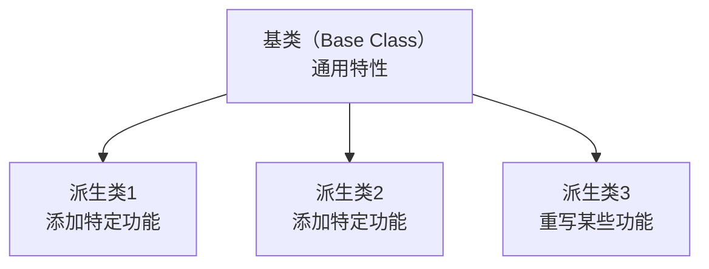
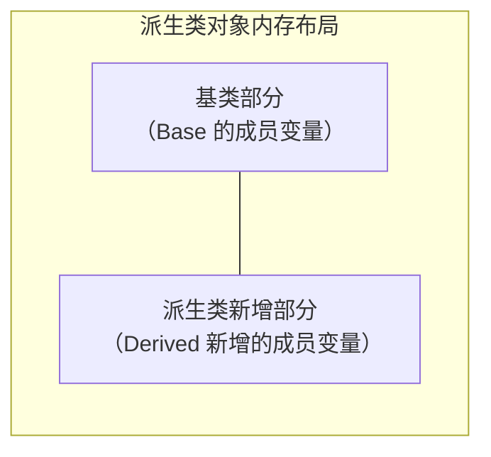
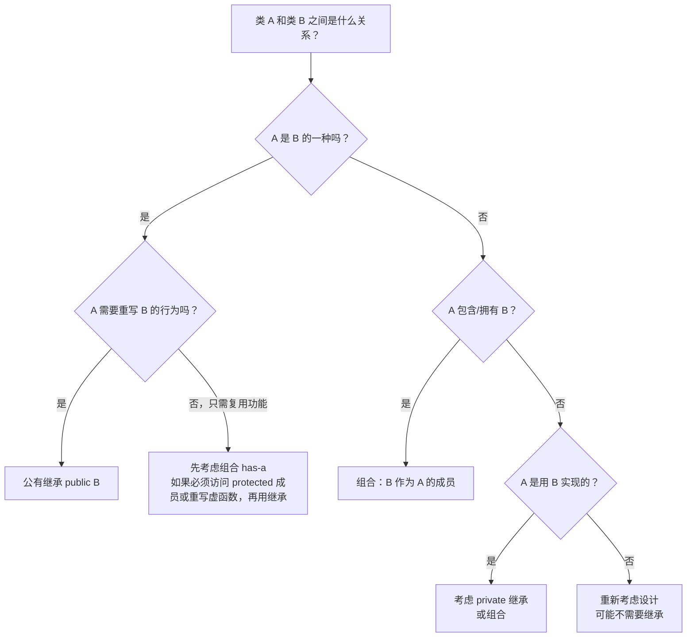
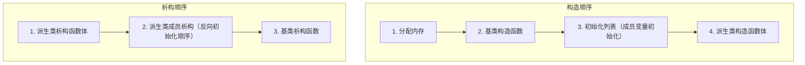
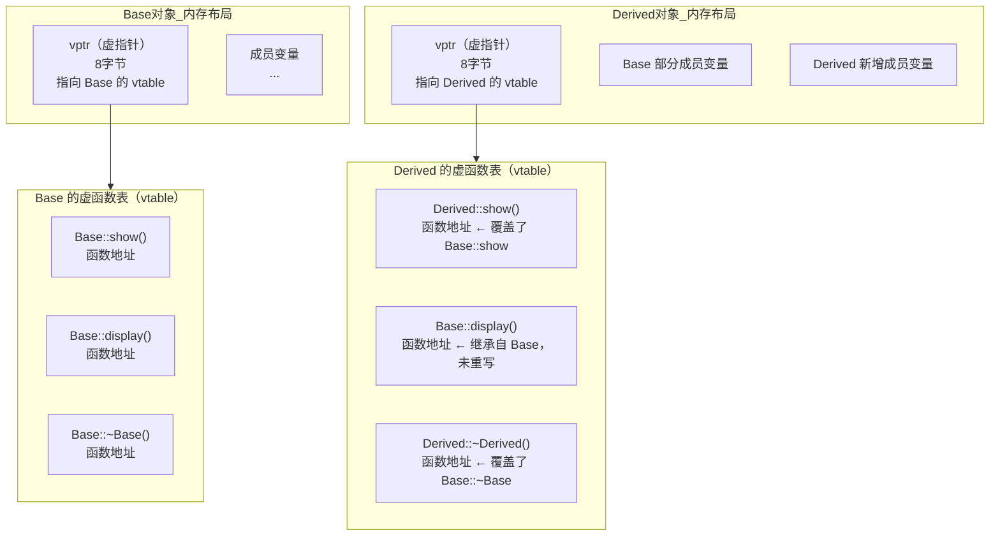
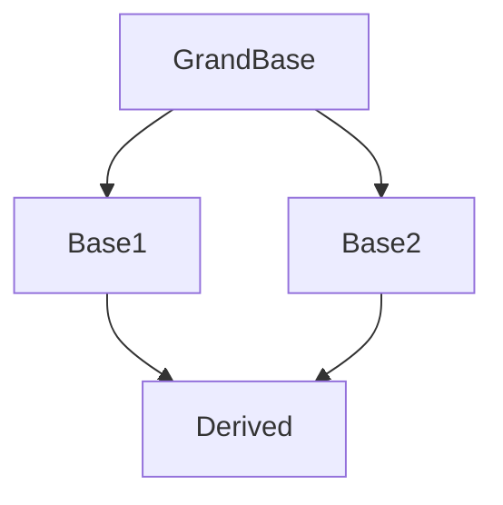
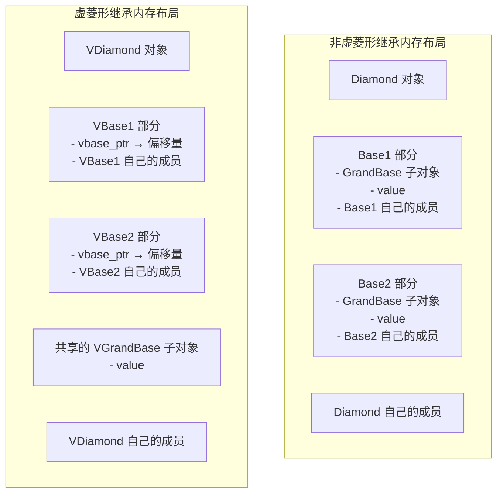
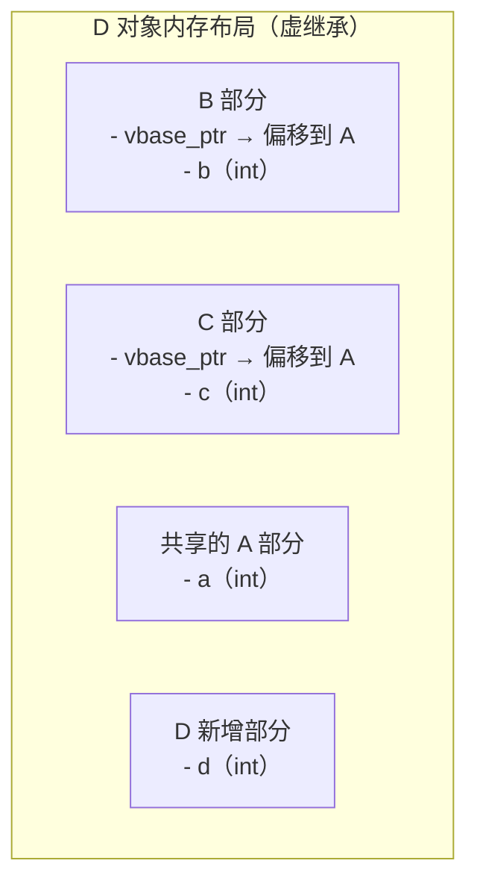

# 第 13 章：类继承

> **本章目标**: 深入掌握 C++ 继承的核心概念——公有继承、虚函数、多态、抽象基类（ABC）、继承中的内存管理和友元，以及多重继承、RTTI 等进阶主题。这是面向对象编程的精髓。

---

## 13.1 继承基础

### 13.1.1 为什么需要继承

**继承**允许基于已有类创建新类，复用和扩展现有功能。它是面向对象编程三大特性（封装、继承、多态）的核心之一。

继承的主要优点：
- **代码复用**：派生类自动获得基类的成员，无需重复编写
- **层次化设计**：将通用的行为和属性抽象到基类，具体细节由派生类实现
- **可扩展性**：通过派生出新类来扩展系统功能，无需修改已有代码
- **多态支持**：通过基类指针/引用操作不同派生类对象



**现实世界中的继承层次**：

```
交通工具（Vehicle）
├── 陆地交通工具（LandVehicle）—— 车轮数、行驶方式
│   ├── 汽车（Car）—— 引擎类型、车门数
│   ├── 摩托车（Motorcycle）—— 排量
│   └── 自行车（Bicycle）—— 链条传动
├── 水上交通工具（WaterVehicle）—— 排水量
│   ├── 轮船（Ship）—— 货舱容量
│   └── 快艇（Speedboat）—— 最高航速
└── 空中交通工具（AirVehicle）—— 飞行高度
    ├── 飞机（Airplane）—— 引擎数量
    └── 直升机（Helicopter）—— 旋翼直径

Shape（形状）
├── Circle（圆形）—— 添加半径
├── Rectangle（矩形）—— 添加长和宽
└── Triangle（三角形）—— 添加底和高

Animal（动物）
├── Mammal（哺乳动物）—— 毛发、哺乳
│   ├── Dog（狗）—— 吠叫
│   └── Cat（猫）—— 喵叫
├── Bird（鸟类）—— 羽毛、翅膀
│   ├── Eagle（鹰）—— 捕猎
│   └── Penguin（企鹅）—— 游泳
└── Fish（鱼类）—— 鳞片、鳍
```

### 13.1.2 继承的语法

```cpp
// 基类
class Base {
    // ...
};

// 派生类
class Derived : 访问修饰符 Base {
    // ...
};
```

访问修饰符可以是 `public`、`protected` 或 `private`，控制基类成员在派生类中的访问级别。

### 13.1.3 完整的继承示例：游戏角色系统

```cpp
#include <iostream>
#include <string>
using namespace std;

// 基类：玩家
class Player {
protected:
    string name;
    int level;
    int health;
    int maxHealth;

public:
    Player(const string& n, int l = 1, int h = 100)
        : name(n), level(l), health(h), maxHealth(h) {
        cout << "[Player] 创建角色: " << name << endl;
    }
    
    // 拷贝构造函数
    Player(const Player& p)
        : name(p.name), level(p.level), health(p.health), maxHealth(p.maxHealth) {
        cout << "[Player] 拷贝构造: " << name << endl;
    }
    
    void display() const {
        cout << "玩家: " << name 
             << " | 等级: " << level 
             << " | HP: " << health << "/" << maxHealth << endl;
    }
    
    void takeDamage(int dmg) {
        health -= dmg;
        if (health < 0) health = 0;
        cout << name << " 受到 " << dmg << " 点伤害，剩余 HP: " << health << endl;
    }
    
    void heal(int hp) {
        health += hp;
        if (health > maxHealth) health = maxHealth;
        cout << name << " 恢复了 " << hp << " 点生命值，当前 HP: " << health << endl;
    }
    
    void gainLevel() {
        level++;
        maxHealth += 10;
        health = maxHealth;  // 升级满血
        cout << name << " 升级了！当前等级: " << level << endl;
    }
    
    string getName() const { return name; }
    int getHealth() const { return health; }
    int getLevel() const { return level; }
    
    virtual ~Player() {
        cout << "[Player] 销毁角色: " << name << endl;
    }
};

// 派生类：战士
class Warrior : public Player {
private:
    int strength;       // 力量：战士特有属性
    int armor;          // 护甲值

public:
    Warrior(const string& n, int str = 10, int arm = 5, int l = 1, int h = 150)
        : Player(n, l, h), strength(str), armor(arm) {
        cout << "[Warrior] 战士 " << name << " 就绪，力量:" << strength 
             << " 护甲:" << armor << endl;
    }
    
    void attack() const {
        cout << name << " 发动猛击，造成 " << (strength * 2) << " 点伤害！" << endl;
    }
    
    // 战士的受伤害逻辑：护甲减免
    void takeDamage(int dmg) {
        int reducedDmg = dmg - armor;
        if (reducedDmg < 0) reducedDmg = 0;
        cout << name << " 的护甲减免了 " << (dmg - reducedDmg) << " 点伤害" << endl;
        Player::takeDamage(reducedDmg);  // 调用基类版本
    }
    
    // 战士特有的防御姿态
    void defend() const {
        cout << name << " 进入防御姿态，护甲提升！" << endl;
    }
    
    int getStrength() const { return strength; }
    int getArmor() const { return armor; }
};

// 派生类：法师
class Mage : public Player {
private:
    int mana;           // 魔法值：法师特有属性
    int maxMana;
    int spellPower;     // 法术强度

public:
    Mage(const string& n, int m = 50, int sp = 15, int l = 1, int h = 80)
        : Player(n, l, h), mana(m), maxMana(m), spellPower(sp) {
        cout << "[Mage] 法师 " << name << " 就绪，法力:" << mana 
             << " 法术强度:" << spellPower << endl;
    }
    
    void castSpell() const {
        const int manaCost = 10;
        if (mana >= manaCost) {
            cout << name << " 施放火球术！造成 " 
                 << (spellPower * 3) << " 点魔法伤害！"
                 << "剩余法力: " << (mana - manaCost) << endl;
        } else {
            cout << name << " 法力不足！需要 " << manaCost 
                 << " 点法力，当前 " << mana << " 点" << endl;
        }
    }
    
    // 法师特有的回蓝
    void regenerateMana(int amount) {
        mana += amount;
        if (mana > maxMana) mana = maxMana;
        cout << name << " 恢复了 " << amount << " 点法力，当前法力: " << mana << endl;
    }
    
    int getMana() const { return mana; }
    int getSpellPower() const { return spellPower; }
};

// 派生类：弓箭手（第三个派生类）
class Archer : public Player {
private:
    int agility;        // 敏捷
    int arrows;         // 箭矢数量

public:
    Archer(const string& n, int agi = 15, int arr = 30, int l = 1, int h = 90)
        : Player(n, l, h), agility(agi), arrows(arr) {
        cout << "[Archer] 弓箭手 " << name << " 就绪，敏捷:" << agility 
             << " 箭矢:" << arrows << endl;
    }
    
    void shoot() const {
        if (arrows > 0) {
            cout << name << " 射击！造成 " << (agility * 2) 
                 << " 点伤害，剩余箭矢: " << (arrows - 1) << endl;
        } else {
            cout << name << " 箭矢用完了！" << endl;
        }
    }
    
    void reload(int count) {
        arrows += count;
        cout << name << " 补充了 " << count << " 支箭，当前箭矢: " << arrows << endl;
    }
    
    int getAgility() const { return agility; }
    int getArrows() const { return arrows; }
};

int main() {
    cout << "========== 创建角色 ==========" << endl;
    
    Warrior w("战神张三", 15, 5, 2, 150);
    cout << endl;
    
    Mage m("法王李四", 50, 15, 3, 80);
    cout << endl;
    
    Archer a("箭神王五", 18, 30, 2, 90);
    cout << endl;
    
    cout << "========== 角色展示 ==========" << endl;
    w.display();
    w.attack();
    w.takeDamage(40);
    cout << endl;
    
    m.display();
    m.castSpell();
    m.regenerateMana(10);
    cout << endl;
    
    a.display();
    a.shoot();
    a.reload(10);
    cout << endl;
    
    cout << "========== 战斗模拟 ==========" << endl;
    w.defend();
    w.takeDamage(60);
    m.castSpell();
    a.shoot();
    
    return 0;
}
```

### 13.1.4 派生类的内存布局

当创建一个派生类对象时，它在内存中包含了**基类部分**和**派生类新增部分**：



```cpp
class Base {
    int baseData;      // 4 字节
    char baseFlag;     // 1 字节（可能有填充）
};

class Derived : public Base {
    int derivedData;   // 4 字节
    char derivedFlag;  // 1 字节（可能有填充）
};

// Derived 对象在内存中的布局（概念上）：
// [ baseData | (padding) | baseFlag | derivedData | (padding) | derivedFlag ]
//  ↑ 基类部分 ↑                    ↑ 派生类新增部分 ↑
```

**重要说明**：基类部分和派生类部分之间可能有内存对齐产生的填充字节，具体取决于编译器和平台。

---

## 13.2 继承的类型

### 13.2.1 三种继承方式

| 继承方式 | 基类 public → 派生类 | 基类 protected → 派生类 | 基类 private → 派生类 |
|---------|---------------------|------------------------|----------------------|
| `public` 继承 | `public` | `protected` | 不可访问 |
| `protected` 继承 | `protected` | `protected` | 不可访问 |
| `private` 继承 | `private` | `private` | 不可访问 |

**关键规则**：
1. 无论哪种继承方式，基类的 **private 成员在派生类中始终不可直接访问**
2. `public` 继承：基类的 public → 派生类的 public，protected → protected
3. `protected` 继承：基类的 public 和 protected → 派生类的 protected
4. `private` 继承：基类的 public 和 protected → 派生类的 private（最严格）

```cpp
class Base {
public:
    int a;
protected:
    int b;
private:
    int c;
};

class PubDerived : public Base {
    // a 是 public（对外可见）
    // b 是 protected（仅对派生类可见）
    // c 不可访问（Base 的 private）
    
    void test() {
        a = 1;  // ✅ OK
        b = 2;  // ✅ OK（protected 在派生类中可访问）
        // c = 3;  // ❌ 编译错误
    }
};

class ProDerived : protected Base {
    // a 是 protected（对外不可见，对派生类可见）
    // b 是 protected
    // c 不可访问
    
    void test() {
        a = 1;  // ✅ OK
        b = 2;  // ✅ OK
    }
};

class PriDerived : private Base {
    // a 是 private（对外不可见，对派生类也不可见）
    // b 是 private
    // c 不可访问
    
    void test() {
        a = 1;  // ✅ OK（自己类内部可以访问）
        b = 2;  // ✅ OK
    }
};

// 进一步派生测试
class GrandChild : public ProDerived {
    void test() {
        a = 1;  // ✅ OK（a 在 ProDerived 中是 protected）
        b = 2;  // ✅ OK（b 在 ProDerived 中是 protected）
    }
};

class GrandChild2 : public PriDerived {
    void test() {
        // a = 1;  // ❌ 错误！a 在 PriDerived 中是 private
        // b = 2;  // ❌ 错误！b 在 PriDerived 中是 private
    }
};
```

### 13.2.2 更详细的访问权限表

| 在类内部 | public 成员 | protected 成员 | private 成员 |
|---------|------------|---------------|-------------|
| 本类 | ✅ 可访问 | ✅ 可访问 | ✅ 可访问 |
| 派生类（public 继承） | ✅ 可访问 | ✅ 可访问 | ❌ 不可访问 |
| 派生类（protected 继承） | ✅ 可访问（变为 protected） | ✅ 可访问 | ❌ 不可访问 |
| 派生类（private 继承） | ✅ 可访问（变为 private） | ✅ 可访问（变为 private） | ❌ 不可访问 |
| 外部代码 | ✅ 可访问 | ❌ 不可访问 | ❌ 不可访问 |
| 友元函数/类 | ✅ 可访问 | ✅ 可访问 | ✅ 可访问 |

### 13.2.3 使用 using 声明恢复访问权限

在 `protected` 或 `private` 继承后，可以通过 `using` 声明恢复某些成员的访问级别：

```cpp
class Base {
public:
    void func1() { cout << "Base::func1" << endl; }
    void func2() { cout << "Base::func2" << endl; }
    int value = 42;
};

// private 继承：所有成员在 Derived 中都是 private
class Derived : private Base {
public:
    // 使用 using 声明将 func1 恢复为 public
    using Base::func1;
    
    // 注意：不能在 using 声明中改变访问级别使访问更宽松或更严格
    // 只能恢复原有的访问级别
protected:
    using Base::func2;  // 恢复为 protected
};

int main() {
    Derived d;
    d.func1();     // ✅ OK，被 using 恢复为 public
    // d.func2();  // ❌ 错误，func2 是 protected
    // d.value;    // ❌ 错误，value 是 private
}
```

### 13.2.4 各继承方式的实际应用场景

| 继承方式 | 应用场景 | 示例 |
|---------|---------|------|
| **public 继承** | 建立 **is-a** 关系，最常见 | `class Dog : public Animal {};` |
| **protected 继承** | 极少使用，仅想让派生类使用基类接口，但不对外暴露 | `class MyList : protected std::vector<int> {};` |
| **private 继承** | 实现 **is-implemented-in-terms-of**（用基类实现派生类），比组合更紧密的耦合，或需要重写虚函数 | `class TimerImpl : private SomeLibrary {};` |

> **📌 最常用的是公有继承（`public`）**，它建立"is-a"（是一个）关系。private 继承通常应优先考虑组合（has-a）替代。

### 13.2.5 is-a 关系与 has-a 关系

**公有继承**建立 **is-a**（是一个）关系：

```cpp
class Fruit { ... };
class Apple : public Fruit { ... };    // Apple is-a Fruit ✅

class Animal { ... };
class Dog : public Animal { ... };      // Dog is-a Animal ✅

class Shape { ... };
class Circle : public Shape { ... };    // Circle is-a Shape ✅
```

**组合**建立 **has-a**（有一个）关系：

```cpp
class Car { ... };
class Engine { ... };                   // Car has-a Engine（组合）

class Person { ... };
class Address { ... };                  // Person has-a Address

class Computer { ... };
class CPU { ... };                      // Computer has-a CPU
class Memory { ... };                   // Computer has-a Memory
```

**is-a vs has-a 决策树**：



**is-a 关系的判断**：
- 苹果是一种水果 ✅ → `class Apple : public Fruit`
- 正方形是一种矩形 ✅ → `class Square : public Rectangle`
- 企鹅是一种鸟 ✅ → `class Penguin : public Bird`

**is-a 关系的陷阱**：
- 正方形真的是矩形吗？从数学上是的，但从行为上看，正方形的宽高必须相等，而矩形可以独立改变宽高。如果使用继承并允许调用 `setWidth()`，就会破坏正方形的约束。这称为**正方形-矩形问题**（Square-Rectangle Problem），是违反 Liskov 替换原则的典型案例。

```cpp
class Rectangle {
public:
    virtual void setWidth(int w) { width = w; }
    virtual void setHeight(int h) { height = h; }
    int getWidth() const { return width; }
    int getHeight() const { return height; }
private:
    int width, height;
};

// ❌ 问题代码：Square 继承自 Rectangle
class Square : public Rectangle {
public:
    void setWidth(int w) override {
        Rectangle::setWidth(w);
        Rectangle::setHeight(w);  // 强制宽高相等
    }
    void setHeight(int h) override {
        Rectangle::setWidth(h);
        Rectangle::setHeight(h);
    }
};

void processRect(Rectangle& r) {
    r.setWidth(5);
    r.setHeight(10);
    // 调用者期望：面积 = 50
    // 如果传入 Square，面积 = 100 ❌
    cout << "面积: " << r.getWidth() * r.getHeight() << endl;
}

int main() {
    Rectangle r;
    processRect(r);      // 输出: 面积 = 50 ✅
    
    Square s;
    processRect(s);      // 输出: 面积 = 100 ❌
    // 违反了 Liskov 替换原则！
}
```

---

## 13.3 派生类的构造函数和析构函数

### 13.3.1 构造顺序的详细图解

```cpp
#include <iostream>
using namespace std;

class Base {
public:
    Base() { cout << "Base 构造函数" << endl; }
    ~Base() { cout << "Base 析构函数" << endl; }
};

class Derived : public Base {
public:
    Derived() : Base() {  // 显式调用基类构造函数
        cout << "Derived 构造函数" << endl;
    }
    
    ~Derived() {
        cout << "Derived 析构函数" << endl;
        // 编译器会自动调用基类析构函数
    }
};

int main() {
    Derived d;
    return 0;
}
// 输出:
// Base 构造函数
// Derived 构造函数
// Derived 析构函数
// Base 析构函数
```

**🎯 构造/析构顺序**：
- **构造**：从基类到派生类（先"基础部分"后"新增部分"）
- **析构**：从派生类到基类（先"新增部分"后"基础部分"）



### 13.3.2 多层继承的构造和析构

```cpp
#include <iostream>
using namespace std;

class GrandBase {
public:
    GrandBase() { cout << "GrandBase 构造函数" << endl; }
    ~GrandBase() { cout << "GrandBase 析构函数" << endl; }
};

class Base : public GrandBase {
public:
    Base() { cout << "Base 构造函数" << endl; }
    ~Base() { cout << "Base 析构函数" << endl; }
};

class Derived : public Base {
public:
    Derived() { cout << "Derived 构造函数" << endl; }
    ~Derived() { cout << "Derived 析构函数" << endl; }
};

int main() {
    cout << "创建 Derived 对象:" << endl;
    Derived d;
    cout << "\n销毁 Derived 对象:" << endl;
    return 0;
}
// 输出:
// 创建 Derived 对象:
// GrandBase 构造函数
// Base 构造函数
// Derived 构造函数
//
// 销毁 Derived 对象:
// Derived 析构函数
// Base 析构函数
// GrandBase 析构函数
```

**构造链**：GrandBase → Base → Derived
**析构链**：Derived → Base → GrandBase

### 13.3.3 带成员对象的派生类构造函数

当派生类本身包含成员对象时，构造顺序更加复杂：

```cpp
#include <iostream>
using namespace std;

class MemberA {
public:
    MemberA() { cout << "MemberA 构造" << endl; }
    MemberA(int) { cout << "MemberA(int) 构造" << endl; }
    ~MemberA() { cout << "MemberA 析构" << endl; }
};

class MemberB {
public:
    MemberB() { cout << "MemberB 构造" << endl; }
    MemberB(double) { cout << "MemberB(double) 构造" << endl; }
    ~MemberB() { cout << "MemberB 析构" << endl; }
};

class Base {
public:
    Base() { cout << "Base 构造" << endl; }
    Base(int) { cout << "Base(int) 构造" << endl; }
    ~Base() { cout << "Base 析构" << endl; }
};

class Derived : public Base {
private:
    MemberA a;
    MemberB b;

public:
    // 构造函数：初始化列表中的顺序不重要，实际顺序由声明顺序决定
    Derived() : Base(), a(), b() {
        cout << "Derived 构造" << endl;
    }
    
    Derived(int i, int ai, double bd) 
        : Base(i), a(ai), b(bd) {
        cout << "Derived(int, int, double) 构造" << endl;
    }
    
    ~Derived() {
        cout << "Derived 析构" << endl;
    }
};

int main() {
    cout << "=== 默认构造 ===" << endl;
    Derived d1;
    cout << "\n=== 带参构造 ===" << endl;
    Derived d2(1, 2, 3.0);
    cout << "\n=== 销毁 ===" << endl;
    return 0;
}
// 输出:
// === 默认构造 ===
// Base 构造
// MemberA 构造
// MemberB 构造
// Derived 构造
//
// === 带参构造 ===
// Base(int) 构造
// MemberA(int) 构造
// MemberB(double) 构造
// Derived(int, int, double) 构造
//
// === 销毁 ===
// Derived 析构
// MemberB 析构
// MemberA 析构
// Base 析构
```

**完整构造顺序总结**：
1. 基类构造函数（按照继承链从最顶层开始）
2. 成员对象构造函数（按照**成员声明的顺序**，不是初始化列表的顺序）
3. 派生类构造函数体

### 13.3.4 派生类构造函数的完整写法

```cpp
class Base {
private:
    int baseData;
    string baseStr;
    
public:
    // 默认构造函数
    Base() : baseData(0), baseStr("default") {}
    
    // 带参构造函数
    Base(int d, const string& s) : baseData(d), baseStr(s) {}
    
    // 拷贝构造函数
    Base(const Base& b) : baseData(b.baseData), baseStr(b.baseStr) {}
    
    // 移动构造函数
    Base(Base&& b) noexcept 
        : baseData(b.baseData), baseStr(std::move(b.baseStr)) {}
    
    // 赋值运算符
    Base& operator=(const Base& b) {
        if (this != &b) {
            baseData = b.baseData;
            baseStr = b.baseStr;
        }
        return *this;
    }
};

class Derived : public Base {
private:
    int derivedData;
    
public:
    // ✅ 默认构造函数：调用基类默认构造
    Derived() : Base(), derivedData(0) {}
    
    // ✅ 带参构造函数：通过初始化列表调用基类带参构造
    Derived(int bd, const string& bs, int dd) 
        : Base(bd, bs), derivedData(dd) {}
    
    // ✅ 拷贝构造函数：基类部分使用基类的拷贝构造
    Derived(const Derived& d) 
        : Base(d), derivedData(d.derivedData) {}
    // Base(d) 将派生类引用隐式转换为基类引用，调用 Base(const Base&)
    
    // ✅ 移动构造函数
    Derived(Derived&& d) noexcept
        : Base(std::move(d)), derivedData(d.derivedData) {
        d.derivedData = 0;
    }
    
    // ✅ 赋值运算符
    Derived& operator=(const Derived& d) {
        if (this != &d) {
            Base::operator=(d);    // 调用基类赋值运算符
            derivedData = d.derivedData;
        }
        return *this;
    }
    
    // ❌ 错误：没有基类默认构造函数时，必须显式调用基类构造函数
    // Derived(int dd) : derivedData(dd) {}
    
    // ✅ 如果基类有默认构造函数，可以省略（编译器会自动调用）
    // Derived(int dd) : Base(), derivedData(dd) {}  // 等价于省略 Base()
};

// 如果基类没有默认构造函数，派生类必须在初始化列表中显式调用基类构造函数
class NoDefaultBase {
private:
    int data;
public:
    NoDefaultBase(int d) : data(d) {}  // 没有默认构造函数！
};

class Derived2 : public NoDefaultBase {
private:
    int extra;
public:
    // ✅ 必须显式调用基类构造函数
    Derived2(int d, int e) : NoDefaultBase(d), extra(e) {}
    
    // ❌ 编译错误：NoDefaultBase 没有默认构造函数
    // Derived2(int e) : extra(e) {}
};
```

### 13.3.5 虚继承的构造函数规则

虚继承用于解决菱形继承问题，其构造函数有特殊规则：

```cpp
class GrandBase {
protected:
    int value;
public:
    GrandBase(int v = 0) : value(v) {
        cout << "GrandBase(int) 构造, value=" << value << endl;
    }
};

class Base1 : virtual public GrandBase {
public:
    Base1(int v = 0) : GrandBase(v) {
        cout << "Base1 构造" << endl;
    }
};

class Base2 : virtual public GrandBase {
public:
    Base2(int v = 0) : GrandBase(v) {
        cout << "Base2 构造" << endl;
    }
};

// 菱形继承
class Diamond : public Base1, public Base2 {
public:
    // ⚠️ 在虚继承中，最派生类（Diamond）负责初始化虚基类
    // Base1 和 Base2 对 GrandBase 的初始化会被忽略！
    Diamond(int v1, int v2, int v) 
        : GrandBase(v),     // Diamond 直接初始化 GrandBase
          Base1(v1), 
          Base2(v2) {
        cout << "Diamond 构造" << endl;
    }
};

int main() {
    Diamond d(1, 2, 100);
    cout << "value = " << d.value << endl;  // 输出: value = 100
    return 0;
}
// 输出:
// GrandBase(int) 构造, value=100   ← 由 Diamond 直接初始化
// Base1 构造
// Base2 构造
// Diamond 构造
// value = 100
```

**虚继承构造函数规则总结**：
1. 虚基类由**最派生类**（most derived class）直接初始化
2. 中间基类（Base1、Base2）对虚基类的初始化**被忽略**
3. 如果最派生类没有显式初始化虚基类，则调用虚基类的**默认构造函数**
4. 虚基类在任何非虚基类**之前**构造

---

## 13.4 虚函数与多态

### 13.4.1 为什么需要虚函数——问题的起源

```cpp
class Base {
public:
    void show() {
        cout << "Base::show()" << endl;
    }
};

class Derived : public Base {
public:
    void show() {
        cout << "Derived::show()" << endl;
    }
};

int main() {
    Derived d;
    Base* bp = &d;       // 基类指针指向派生类对象
    
    bp->show();          // ❌ 输出 "Base::show()"（编译期决定）
    d.show();            // 输出 "Derived::show()"
    
    return 0;
}
```

**问题**：通过基类指针调用 `show()` 时，调用的是基类的版本，而不是派生类的版本。这是因为非虚函数采用**静态联编**（早绑定），编译器根据指针的**静态类型**（编译期类型）决定调用哪个函数。

### 13.4.2 使用虚函数实现动态绑定

```cpp
class Base {
public:
    virtual void show() {     // virtual 关键字
        cout << "Base::show()" << endl;
    }
};

class Derived : public Base {
public:
    void show() override {    // override（C++11，可选但推荐）
        cout << "Derived::show()" << endl;
    }
};

int main() {
    Derived d;
    Base* bp = &d;
    
    bp->show();              // ✅ 输出 "Derived::show()"（运行时决定）
    
    // 也适用于引用
    Base& br = d;
    br.show();               // ✅ 输出 "Derived::show()"
    
    // 直接对象调用（不需要虚函数）
    d.show();                // 输出 "Derived::show()"
    
    Base b;
    Base* bp2 = &b;
    bp2->show();             // 输出 "Base::show()"
    
    return 0;
}
```

**虚函数调用的决策过程**：
1. 编译器看到通过基类指针/引用调用虚函数
2. 运行时查找对象的 vptr → vtable → 函数地址
3. 根据对象的**实际类型**（动态类型）决定调用哪个版本的函数

### 13.4.3 虚函数表（vtable）的详细内存布局



**虚函数机制**：
1. 每个**包含虚函数的类**有一个**虚函数表**（vtable），存储在程序的只读数据区
2. 每个**对象**有一个**虚指针**（vptr），指向所属类的虚函数表
3. 调用虚函数时，通过 `vptr → vtable[index] → 函数地址` 来调用
4. **运行时决定**（动态绑定），而不是编译时决定

**虚函数表的结构特点**：
- 如果派生类**重写**了基类的虚函数，vtable 中对应插槽保存的是派生类版本的地址
- 如果派生类**没有重写**，vtable 中保存的是基类版本的地址
- 如果派生类**新增**了虚函数，vtable 中会新增插槽
- 每个类共享同一个 vtable（所有对象指向同一个 vtable）

**虚函数的性能开销**：

| 开销类型 | 说明 |
|---------|------|
| **内存开销** | 每个对象增加一个 vptr（通常 8 字节在 64 位系统） |
| **类开销** | 每个包含虚函数的类有一个 vtable |
| **调用开销** | 间接调用（通过 vptr → vtable → 函数地址），比直接调用多一次内存寻址 |
| **内联抑制** | 虚函数通常不能被内联（编译器可能在某些情况下内联，如对象本身调用） |
| **分支预测** | 间接调用可能影响 CPU 分支预测性能 |

**性能测试示例**：

```cpp
#include <iostream>
#include <chrono>
using namespace std;
using namespace chrono;

class Base {
public:
    virtual void func() {}  // 虚函数
};

class Derived : public Base {
public:
    void func() override {}
};

class NoVirtual {
public:
    void func() {}  // 非虚函数
};

int main() {
    const int TIMES = 100000000;
    
    // 测试非虚函数调用
    NoVirtual nv;
    auto start = high_resolution_clock::now();
    for (int i = 0; i < TIMES; i++) {
        nv.func();
    }
    auto end = high_resolution_clock::now();
    auto nonVirtualTime = duration_cast<milliseconds>(end - start).count();
    cout << "非虚函数 " << TIMES << " 次调用: " << nonVirtualTime << " ms" << endl;
    
    // 测试虚函数调用（通过对象本身）
    Derived d;
    start = high_resolution_clock::now();
    for (int i = 0; i < TIMES; i++) {
        d.func();
    }
    end = high_resolution_clock::now();
    auto virtualDirectTime = duration_cast<milliseconds>(end - start).count();
    cout << "虚函数(对象直接调用) " << TIMES << " 次: " << virtualDirectTime << " ms" << endl;
    
    // 测试虚函数调用（通过基类指针）
    Base* bp = &d;
    start = high_resolution_clock::now();
    for (int i = 0; i < TIMES; i++) {
        bp->func();
    }
    end = high_resolution_clock::now();
    auto virtualIndirectTime = duration_cast<milliseconds>(end - start).count();
    cout << "虚函数(通过基类指针) " << TIMES << " 次: " << virtualIndirectTime << " ms" << endl;
    
    return 0;
}
// 典型输出（实际数值因编译器和硬件而异）:
// 非虚函数 100000000 次调用: 50 ms
// 虚函数(对象直接调用) 100000000 次: 52 ms  (编译器可能优化掉虚函数调用)
// 虚函数(通过基类指针) 100000000 次: 180 ms (约 3-4 倍)
```

### 13.4.4 虚函数的更多细节

**虚函数调用过程详解**：

```cpp
// 假设有如下类
class Base {
public:
    virtual void vfunc1() { /* ... */ }
    virtual void vfunc2() { /* ... */ }
    void nonVirtual() { /* ... */ }
};

// 通过基类指针调用虚函数
Base* p = getSomeObject();  // p 可能指向 Base 或 Derived
p->vfunc1();                // 动态调用

// 上述调用在汇编层面大致相当于：
// mov eax, [p]          ; 获取对象的地址（包括 vptr）
// mov edx, [eax]        ; 获取 vptr（指向 vtable 的指针）
// call [edx + 0]        ; 调用 vtable 中第一个函数（vfunc1）
//                        ; 如果调用 vfunc2，则是 [edx + 8]

// 而非虚函数调用：
// p->nonVirtual();
// 编译时就决定了调用 Base::nonVirtual
// call Base::nonVirtual  ; 直接调用，无间接寻址
```

**派生类中调用基类的虚函数**：

```cpp
class Base {
public:
    virtual void show() {
        cout << "Base::show()" << endl;
    }
};

class Derived : public Base {
public:
    void show() override {
        cout << "Derived::show() 开始" << endl;
        Base::show();   // ✅ 显式调用基类版本（即使 show 是虚函数）
        cout << "Derived::show() 结束" << endl;
    }
};

int main() {
    Derived d;
    Base* bp = &d;
    bp->show();  
    // 输出:
    // Derived::show() 开始
    // Base::show()     ← 通过作用域解析 :: 强制调用基类版本
    // Derived::show() 结束
    
    // 如果不在派生类中使用 Base::show()，而用 this->show()
    // 会导致无限递归（因为 show 是虚函数，会再次调用 Derived::show）
}
```

**构造函数和析构函数中的虚函数调用**：

```cpp
class Base {
public:
    Base() { 
        cout << "Base 构造中: ";
        show();  // ⚠️ 调用 Base::show（不是派生类的版本！）
    }
    
    virtual void show() {
        cout << "Base::show()" << endl;
    }
    
    virtual ~Base() {
        cout << "Base 析构中: ";
        show();  // ⚠️ 调用 Base::show（不是派生类的版本！）
    }
};

class Derived : public Base {
public:
    Derived() {
        cout << "Derived 构造中: ";
        show();  // 这里调用 Derived::show（构造已完成）
    }
    
    void show() override {
        cout << "Derived::show()" << endl;
    }
    
    ~Derived() {
        cout << "Derived 析构中: ";
        show();  // 这里调用 Derived::show（析构刚开始）
    }
};

int main() {
    Derived d;
    return 0;
}
// 输出:
// Base 构造中: Base::show()       ← 构造 Base 时，Derived 部分还没构造，调用 Base 版本
// Derived 构造中: Derived::show() ← 构造完成，调用 Derived 版本
// Derived 析构中: Derived::show() ← 析构开始时，Derived 部分还存在
// Base 析构中: Base::show()       ← Derived 部分已析构，调用 Base 版本
```

**重要规则**：在构造函数和析构函数中调用虚函数时，调用的不是最派生类的版本，而是**当前正在构造/析构的类及其基类**的版本。这是因为此时派生类部分尚未构造完成或已经析构。

### 13.4.5 override 和 final（C++11）

```cpp
class Base {
public:
    virtual void show() const { cout << "Base::show" << endl; }
    virtual void display() { cout << "Base::display" << endl; }
    virtual void foo() final { cout << "Base::foo" << endl; }   // final：禁止进一步重写
    virtual void bar() { cout << "Base::bar" << endl; }
};

class Derived : public Base {
public:
    // ❌ 编译错误：没有 const，不是对 Base::show 的重写（签名不匹配）
    // void show() override { }
    
    // ✅ 正确：签名匹配
    void show() const override { cout << "Derived::show" << endl; }
    
    // ❌ 错误：foo 是 final 的，不能被重写
    // void foo() override { }
    
    // ✅ 正确，override 帮助检查签名
    void bar() override { cout << "Derived::bar" << endl; }
    
    // ❌ 如果 Base 没有这个虚函数，override 会报错
    // void nonExistent() override { }
};

class GrandDerived final : public Derived {  // final 类：不能被继承
    void show() const override { 
        cout << "GrandDerived::show" << endl; 
    }
};

// ❌ 错误：不能继承 final 类
// class GreatGrand : public GrandDerived { };
```

**🎯 最佳实践**：在派生类中重写虚函数时，始终使用 `override` 关键字。编译器会检查是否真的重写了基类的虚函数。

**override 的好处**：
1. 编译器检查函数的签名是否与基类的虚函数匹配
2. 如果不匹配（如参数类型不同、const 不同），编译报错
3. 自我文档化，表明这是个重写操作

### 13.4.6 虚析构函数

```cpp
class Base {
public:
    // 如果基类析构函数不是虚函数...
    ~Base() { cout << "Base 析构" << endl; }
};

class Derived : public Base {
private:
    int* data;
    
public:
    Derived() { data = new int[100]; cout << "Derived 构造" << endl; }
    ~Derived() { 
        delete[] data; 
        cout << "Derived 析构" << endl; 
    }
};

int main() {
    Base* p = new Derived();
    delete p;           // ❌ 只调用了 Base 的析构函数！内存泄漏！
    
    return 0;
}
```

**解决方案**：将基类析构函数声明为虚函数：

```cpp
class Base {
public:
    virtual ~Base() { }  // 虚析构函数
};
```

现在 `delete p;` 会通过虚函数机制调用 `Derived::~Derived()`，然后再调用 `Base::~Base()`，正确释放资源。

> **📌 规则**：如果类有任何虚函数，就应该将析构函数声明为虚函数。

**什么时候不需要虚析构函数？**
- 类不打算作为基类（如 `std::string`、标准库容器）
- 类没有虚函数，也不打算通过基类指针删除派生类对象

**虚析构函数的性能影响**：
- 增加 vptr 指针（额外 8 字节）
- 增加一个 vtable 条目
- 析构函数调用变为间接调用

### 13.4.7 纯虚函数可以有实现体

纯虚函数通常没有实现体，但 C++ **允许**纯虚函数有实现体：

```cpp
#include <iostream>
#include <string>
using namespace std;

class Animal {
protected:
    string name;
    
public:
    Animal(const string& n) : name(n) {}
    
    // 纯虚函数：派生类必须重写
    virtual void speak() const = 0;
    
    // 纯虚函数但提供了实现体
    virtual void move() const = 0;
    
    virtual ~Animal() {}
};

// 纯虚函数也可以在类外提供实现体
void Animal::move() const {
    cout << name << " 在移动..." << endl;
}

class Dog : public Animal {
public:
    Dog(const string& n) : Animal(n) {}
    
    void speak() const override {
        cout << name << " 说: 汪汪！" << endl;
    }
    
    void move() const override {
        // 调用基类的纯虚函数实现（虽然它是纯虚的，但有实现体）
        Animal::move();
        cout << name << " 四条腿奔跑" << endl;
    }
};

class Bird : public Animal {
public:
    Bird(const string& n) : Animal(n) {}
    
    void speak() const override {
        cout << name << " 说: 叽叽喳喳！" << endl;
    }
    
    void move() const override {
        Animal::move();
        cout << name << " 展翅飞翔" << endl;
    }
};

int main() {
    Dog dog("旺财");
    Bird bird("小翠");
    
    dog.speak();
    dog.move();
    cout << endl;
    
    bird.speak();
    bird.move();
    
    return 0;
}
// 输出:
// 旺财 说: 汪汪！
// 旺财 在移动...
// 旺财 四条腿奔跑
//
// 小翠 说: 叽叽喳喳！
// 小翠 在移动...
// 小翠 展翅飞翔
```

**纯虚函数有实现体的用途**：
- 提供派生类可以调用的**公共基础实现**
- 仍然强制派生类**必须重写**（不能依赖基类的实现）
- 类似 Java 中的抽象方法 + 默认行为

**另一种常见模式**：纯虚析构函数

纯虚析构函数必须提供实现体，因为析构函数在对象销毁时总会被调用：

```cpp
class AbstractClass {
public:
    // 纯虚析构函数：让类变成抽象类，但不需要其他纯虚函数
    virtual ~AbstractClass() = 0;
};

// 纯虚析构函数必须提供实现体！
AbstractClass::~AbstractClass() {
    // 清理基类资源
}
```

### 13.4.8 多态的应用模式

**模式一：通过基类指针数组实现多态**

```cpp
#include <iostream>
#include <vector>
#include <memory>
using namespace std;

class Animal {
public:
    virtual void speak() const = 0;
    virtual ~Animal() {}
};

class Dog : public Animal {
public:
    void speak() const override { cout << "汪汪！" << endl; }
};

class Cat : public Animal {
public:
    void speak() const override { cout << "喵喵！" << endl; }
};

class Cow : public Animal {
public:
    void speak() const override { cout << "哞哞！" << endl; }
};

int main() {
    // 统一处理不同派生类对象
    vector<unique_ptr<Animal>> animals;
    animals.push_back(make_unique<Dog>());
    animals.push_back(make_unique<Cat>());
    animals.push_back(make_unique<Cow>());
    
    for (const auto& animal : animals) {
        animal->speak();  // 多态：每个动物发出不同的叫声
    }
    return 0;
}
// 输出:
// 汪汪！
// 喵喵！
// 哞哞！
```

**模式二：通过基类引用实现多态（函数参数）**

```cpp
void makeAnimalSpeak(const Animal& animal) {
    cout << "动物说: ";
    animal.speak();
}

int main() {
    Dog dog;
    Cat cat;
    
    makeAnimalSpeak(dog);  // 输出: 动物说: 汪汪！
    makeAnimalSpeak(cat);  // 输出: 动物说: 喵喵！
}
```

**模式三：工厂模式中的多态**

```cpp
enum class AnimalType { DOG, CAT, COW };

unique_ptr<Animal> createAnimal(AnimalType type) {
    switch (type) {
        case AnimalType::DOG: return make_unique<Dog>();
        case AnimalType::CAT: return make_unique<Cat>();
        case AnimalType::COW: return make_unique<Cow>();
        default: return nullptr;
    }
}

int main() {
    auto animal = createAnimal(AnimalType::CAT);
    animal->speak();  // 多态调用
    return 0;
}
```

### 13.4.9 虚拟继承的细节

虚拟继承用于解决**菱形继承**（钻石问题）中的二义性和重复基类问题。



```cpp
#include <iostream>
using namespace std;

// 不使用 virtual 继承：Diamond 包含两个 GrandBase 子对象
class GrandBase {
protected:
    int value;
public:
    GrandBase(int v = 0) : value(v) {
        cout << "GrandBase() 构造" << endl;
    }
    int getValue() const { return value; }
};

class Base1 : public GrandBase {
public:
    Base1() { cout << "Base1() 构造" << endl; }
};

class Base2 : public GrandBase {
public:
    Base2() { cout << "Base2() 构造" << endl; }
};

class Diamond : public Base1, public Base2 {
public:
    Diamond() { cout << "Diamond() 构造" << endl; }
    
    void test() {
        // ❌ 二义性！Diamond 中有两个 GrandBase 子对象
        // value = 10;          // 错误：ambiguous
        // getValue();          // 错误：ambiguous
        
        // 必须指定哪个路径
        Base1::value = 10;
        Base2::value = 20;
        cout << "Base1::value = " << Base1::getValue() << endl;  // 10
        cout << "Base2::value = " << Base2::getValue() << endl;  // 20
    }
};

// ========== 使用 virtual 继承解决 ==========

class VGrandBase {
protected:
    int value;
public:
    VGrandBase(int v = 0) : value(v) {
        cout << "VGrandBase() 构造" << endl;
    }
    int getValue() const { return value; }
};

class VBase1 : virtual public VGrandBase {
public:
    VBase1() { cout << "VBase1() 构造" << endl; }
};

class VBase2 : virtual public VGrandBase {
public:
    VBase2() { cout << "VBase2() 构造" << endl; }
};

class VDiamond : public VBase1, public VBase2 {
public:
    VDiamond(int v) : VGrandBase(v) {  // 由最派生类初始化虚基类
        cout << "VDiamond() 构造" << endl;
    }
    
    void test() {
        // ✅ 只有一个 VGrandBase 子对象，不再有二义性
        value = 42;
        cout << "value = " << getValue() << endl;  // 42
    }
};

int main() {
    cout << "=== 非虚继承（两个 GrandBase）===" << endl;
    Diamond d;
    d.test();
    
    cout << "\n=== 虚继承（一个 VGrandBase）===" << endl;
    VDiamond vd(100);
    vd.test();
    
    return 0;
}
```

**虚基类的内存布局**：



**虚继承的关键点**：
1. 虚基类在整个继承层次中**只存在一个共享实例**
2. 虚基类由**最派生类**直接初始化，中间基类的初始化被忽略
3. 虚基类引入额外的间接访问开销（通过指针或偏移量访问虚基类成员）
4. 虚基类的构造顺序优先于非虚基类

---

## 13.5 静态联编 vs 动态联编

### 13.5.1 概念对比

| 特性 | 静态联编（早绑定） | 动态联编（晚绑定） |
|------|-------------------|-------------------|
| 绑定时机 | 编译期 | 运行期 |
| 依据 | 指针/引用的静态类型 | 对象的实际类型 |
| 非虚函数 | ✅ 使用 | ❌ |
| 虚函数 | ❌ | ✅ 使用 |
| 性能 | 更高（无额外开销） | 略低（vptr 间接寻址） |
| 灵活性 | 低 | 高 |
| 可内联 | ✅ 可以内联 | ❌ 通常不能内联 |

### 13.5.2 静态联编示例

```cpp
class Base {
public:
    void show() { cout << "Base::show" << endl; }     // 非虚函数
    virtual void display() { cout << "Base::display" << endl; }  // 虚函数
};

class Derived : public Base {
public:
    void show() { cout << "Derived::show" << endl; }  // 非虚函数（隐藏）
    void display() override { cout << "Derived::display" << endl; }
};

int main() {
    Derived d;
    Base* bp = &d;
    
    // 静态联编：根据 bp 的静态类型（Base*）决定
    bp->show();       // 输出: Base::show
    
    // 动态联编：根据对象的实际类型（Derived）决定
    bp->display();    // 输出: Derived::display
    
    // 通过对象本身调用：也是静态联编
    d.show();         // 输出: Derived::show
    d.display();      // 输出: Derived::display
}
```

### 13.5.3 联编机制的详细分析

```
编译时：bp->show()
├── 编译器检查 bp 的静态类型：Base*
├── 在 Base 中查找 show 函数
├── show 不是虚函数 → 静态联编
└── 生成指令：call Base::show()

编译时：bp->display()
├── 编译器检查 bp 的静态类型：Base*
├── 在 Base 中查找 display 函数
├── display 是虚函数 → 动态联编
└── 生成指令：
    ├── 加载 bp 指向的对象的 vptr
    ├── 从 vtable 中获取 display 的地址
    └── call [vtable + offset]
```

---

## 13.6 抽象基类（ABC）

### 13.6.1 纯虚函数

**纯虚函数**：在基类中没有实现的虚函数，强制派生类提供实现。

```cpp
class Shape {
public:
    // 纯虚函数（= 0 表示纯虚）
    virtual double area() const = 0;
    virtual void draw() const = 0;
    
    // 普通成员函数（派生类可以继承使用）
    void setColor(const string& c) { color = c; }
    string getColor() const { return color; }
    
    virtual ~Shape() {}
    
private:
    string color;
};
```

**包含纯虚函数的类称为抽象基类（ABC）**，特点：
- 不能实例化：`Shape s;` ❌ 编译错误
- 只能用作基类，通过指针/引用操作派生类对象
- 派生类必须实现所有纯虚函数，否则也会成为抽象类（不能实例化）

### 13.6.2 抽象基类示例：图形系统

```cpp
#include <iostream>
#include <cmath>
#include <vector>
#include <memory>
using namespace std;

// 抽象基类
class Shape {
protected:
    string color;
    int x, y;  // 位置

public:
    Shape(const string& c = "black", int px = 0, int py = 0) 
        : color(c), x(px), y(py) {}
    
    virtual double area() const = 0;           // 面积
    virtual double perimeter() const = 0;      // 周长
    virtual void draw() const = 0;             // 绘制
    
    // 非虚函数：所有形状通用的行为
    string getColor() const { return color; }
    void setColor(const string& c) { color = c; }
    
    void moveTo(int newX, int newY) {
        x = newX;
        y = newY;
    }
    
    void displayInfo() const {
        cout << "形状 | 颜色: " << color 
             << " | 位置: (" << x << "," << y << ")"
             << " | 面积: " << area()
             << " | 周长: " << perimeter() << endl;
    }
    
    virtual ~Shape() {}
};

// 派生类：圆形
class Circle : public Shape {
private:
    double radius;
    
public:
    Circle(double r, const string& c = "red", int px = 0, int py = 0) 
        : Shape(c, px, py), radius(r) {}
    
    double area() const override {
        return M_PI * radius * radius;
    }
    
    double perimeter() const override {
        return 2 * M_PI * radius;
    }
    
    void draw() const override {
        cout << "○ 在 (" << x << "," << y << ") 画一个 " << color << " 圆"
             << "（半径: " << radius << ", 面积: " << area() << "）" << endl;
    }
    
    double getRadius() const { return radius; }
};

// 派生类：矩形
class Rectangle : public Shape {
private:
    double width, height;
    
public:
    Rectangle(double w, double h, const string& c = "blue", int px = 0, int py = 0)
        : Shape(c, px, py), width(w), height(h) {}
    
    double area() const override {
        return width * height;
    }
    
    double perimeter() const override {
        return 2 * (width + height);
    }
    
    void draw() const override {
        cout << "□ 在 (" << x << "," << y << ") 画一个 " << color << " 矩形"
             << "（" << width << "×" << height << ", 面积: " << area() << "）" << endl;
    }
    
    double getWidth() const { return width; }
    double getHeight() const { return height; }
};

// 派生类：三角形
class Triangle : public Shape {
private:
    double sideA, sideB, sideC;
    
public:
    Triangle(double a, double b, double c, const string& cl = "green", int px = 0, int py = 0)
        : Shape(cl, px, py), sideA(a), sideB(b), sideC(c) {}
    
    double area() const override {
        // 使用海伦公式
        double s = (sideA + sideB + sideC) / 2;
        return sqrt(s * (s - sideA) * (s - sideB) * (s - sideC));
    }
    
    double perimeter() const override {
        return sideA + sideB + sideC;
    }
    
    void draw() const override {
        cout << "△ 在 (" << x << "," << y << ") 画一个 " << color << " 三角形"
             << "（边长: " << sideA << "," << sideB << "," << sideC 
             << ", 面积: " << area() << "）" << endl;
    }
};

// 多态函数
void describeShape(const Shape& s) {
    cout << "=== 图形信息 ===" << endl;
    s.displayInfo();
    s.draw();
    cout << endl;
}

int main() {
    // Shape s;  // ❌ 不能创建抽象类的实例
    
    Circle c(5.0, "红色", 10, 20);
    Rectangle r(4.0, 6.0, "蓝色", -5, 3);
    Triangle t(3.0, 4.0, 5.0, "绿色", 0, 0);
    
    // 通过基类引用实现多态
    describeShape(c);
    describeShape(r);
    describeShape(t);
    
    // 通过基类指针数组实现多态
    vector<unique_ptr<Shape>> shapes;
    shapes.push_back(make_unique<Circle>(2.5, "粉色"));
    shapes.push_back(make_unique<Rectangle>(3.0, 7.0, "黄色"));
    shapes.push_back(make_unique<Triangle>(6.0, 6.0, 6.0, "橙色"));  // 等边三角形
    
    cout << "=== 所有形状的汇总 ===" << endl;
    double totalArea = 0;
    for (const auto& s : shapes) {
        s->displayInfo();
        totalArea += s->area();
    }
    cout << "总面积: " << totalArea << endl;
    
    return 0;
}
```

### 13.6.3 更多 ABC 设计示例

**示例一：支付系统**

```cpp
#include <iostream>
#include <string>
using namespace std;

// 抽象基类：支付方式
class PaymentMethod {
protected:
    string ownerName;
    double balance;
    
public:
    PaymentMethod(const string& name, double bal) 
        : ownerName(name), balance(bal) {}
    
    // 纯虚函数：支付接口
    virtual bool pay(double amount) = 0;
    
    // 纯虚函数：充值接口
    virtual void deposit(double amount) = 0;
    
    virtual void displayBalance() const {
        cout << ownerName << " 的余额: ¥" << balance << endl;
    }
    
    string getOwnerName() const { return ownerName; }
    double getBalance() const { return balance; }
    
    virtual ~PaymentMethod() {}
};

// 信用卡支付
class CreditCard : public PaymentMethod {
private:
    string cardNumber;
    double creditLimit;
    double debt;
    
public:
    CreditCard(const string& name, const string& card, double limit) 
        : PaymentMethod(name, 0), cardNumber(card), creditLimit(limit), debt(0) {}
    
    bool pay(double amount) override {
        if (debt + amount <= creditLimit) {
            debt += amount;
            cout << ownerName << " 使用信用卡支付 ¥" << amount 
                 << " 成功，已用额度: ¥" << debt 
                 << "，剩余额度: ¥" << (creditLimit - debt) << endl;
            return true;
        } else {
            cout << ownerName << " 信用卡额度不足！" << endl;
            return false;
        }
    }
    
    void deposit(double amount) override {
        // 信用卡还款
        double actualPay = min(amount, debt);
        debt -= actualPay;
        cout << ownerName << " 还信用卡 ¥" << actualPay 
             << "，剩余欠款: ¥" << debt << endl;
    }
    
    void displayBalance() const override {
        cout << ownerName << " 的信用卡 | 总额度: ¥" << creditLimit 
             << " | 已用: ¥" << debt 
             << " | 可用: ¥" << (creditLimit - debt) << endl;
    }
};

// 支付宝支付
class Alipay : public PaymentMethod {
private:
    string accountId;
    
public:
    Alipay(const string& name, const string& id, double bal) 
        : PaymentMethod(name, bal), accountId(id) {}
    
    bool pay(double amount) override {
        if (balance >= amount) {
            balance -= amount;
            cout << ownerName << " 使用支付宝支付 ¥" << amount 
                 << " 成功，余额: ¥" << balance << endl;
            return true;
        } else {
            cout << ownerName << " 支付宝余额不足！需要 ¥" << amount 
                 << "，当前 ¥" << balance << endl;
            return false;
        }
    }
    
    void deposit(double amount) override {
        balance += amount;
        cout << ownerName << " 支付宝充值 ¥" << amount 
             << " 成功，余额: ¥" << balance << endl;
    }
};

void processOrder(PaymentMethod& pm, double amount) {
    cout << "处理订单: ¥" << amount << endl;
    pm.pay(amount);
}

int main() {
    CreditCard cc("张三", "6222-****-1234", 5000);
    Alipay ali("李四", "138****5678", 2000);
    
    processOrder(cc, 300);
    processOrder(ali, 1500);
    processOrder(cc, 4800);  // 可能超额度
    
    cout << endl;
    cc.displayBalance();
    ali.displayBalance();
    
    return 0;
}
```

**示例二：设备驱动抽象**

```cpp
// 抽象基类：设备驱动
class DeviceDriver {
public:
    virtual bool open() = 0;
    virtual bool close() = 0;
    virtual int read(char* buffer, int size) = 0;
    virtual int write(const char* data, int size) = 0;
    virtual ~DeviceDriver() {}
};

class SerialPortDriver : public DeviceDriver {
private:
    string portName;
    bool isOpen;
    
public:
    SerialPortDriver(const string& port) : portName(port), isOpen(false) {}
    
    bool open() override {
        cout << "打开串口 " << portName << "（波特率 9600）" << endl;
        isOpen = true;
        return true;
    }
    
    bool close() override {
        cout << "关闭串口 " << portName << endl;
        isOpen = false;
        return true;
    }
    
    int read(char* buffer, int size) override {
        cout << "从串口读取 " << size << " 字节" << endl;
        // 模拟读取
        return size;
    }
    
    int write(const char* data, int size) override {
        cout << "向串口写入 " << size << " 字节: " << data << endl;
        return size;
    }
};

class GPIODriver : public DeviceDriver {
private:
    int pinNumber;
    bool isExported;
    
public:
    GPIODriver(int pin) : pinNumber(pin), isExported(false) {}
    
    bool open() override {
        cout << "导出 GPIO 引脚 " << pinNumber << endl;
        isExported = true;
        return true;
    }
    
    bool close() override {
        cout << "取消导出 GPIO 引脚 " << pinNumber << endl;
        isExported = false;
        return true;
    }
    
    int read(char* buffer, int size) override {
        cout << "读取 GPIO 引脚 " << pinNumber << " 电平状态" << endl;
        buffer[0] = '1';  // 高电平
        return 1;
    }
    
    int write(const char* data, int size) override {
        cout << "设置 GPIO 引脚 " << pinNumber << " 为 " << data[0] << endl;
        return 1;
    }
};
```

### 13.6.4 接口类 vs 抽象类的概念

**接口类**：
- 在 C++ 中没有专门的 `interface` 关键字（不像 Java 或 C#）
- 接口类通常指**所有成员函数都是纯虚函数**的抽象类
- 只定义契约（协议），不包含任何数据成员或实现

```cpp
// 接口类（C++ 风格）
class ISerializable {
public:
    virtual string serialize() const = 0;
    virtual bool deserialize(const string& data) = 0;
    virtual ~ISerializable() {}
};

class IComparable {
public:
    virtual int compareTo(const IComparable& other) const = 0;
    virtual ~IComparable() {}
};
```

**抽象类**：
- 包含至少一个纯虚函数的类
- 可以包含数据成员、普通成员函数、已实现的虚函数
- 通常用于提取类层次中的公共部分

| 特性 | 接口类 | 抽象类 |
|------|--------|--------|
| 函数 | 只有纯虚函数 | 可以有已实现的函数 |
| 数据成员 | 无 | 可以有 |
| 构造函数 | 默认或 protected | 可有带参构造 |
| 多继承 | 可以实现多个接口 | 通常单一继承 |
| 语义 | "能做..." (ability) | "是什么..." (is-a) |
| Java 类比 | interface | abstract class |

**实现多个接口的示例**：

```cpp
class IPrintable {
public:
    virtual void print() const = 0;
    virtual ~IPrintable() {}
};

class ISerializable {
public:
    virtual string serialize() const = 0;
    virtual void deserialize(const string&) = 0;
    virtual ~ISerializable() {}
};

// 文档类：同时实现打印和序列化接口
class Document : public IPrintable, public ISerializable {
private:
    string title;
    string content;
    
public:
    Document(const string& t, const string& c) : title(t), content(c) {}
    
    void print() const override {
        cout << "=== " << title << " ===" << endl;
        cout << content << endl;
        cout << "=================" << endl;
    }
    
    string serialize() const override {
        return "DOC:" + title + ":" + content;
    }
    
    void deserialize(const string& data) override {
        // 解析 "DOC:title:content"
        size_t pos1 = data.find(':');
        size_t pos2 = data.find(':', pos1 + 1);
        if (pos1 != string::npos && pos2 != string::npos) {
            title = data.substr(pos1 + 1, pos2 - pos1 - 1);
            content = data.substr(pos2 + 1);
        }
    }
};
```

---

## 13.7 继承中的内存管理

### 13.7.1 派生类的复制控制

当基类管理动态资源时，派生类需要小心实现复制构造函数、赋值运算符和析构函数（三/五法则）。

```cpp
#include <iostream>
#include <cstring>
using namespace std;

class Base {
private:
    char* baseStr;
    
public:
    Base(const char* s = "") {
        baseStr = new char[strlen(s) + 1];
        strcpy(baseStr, s);
        cout << "Base 构造: " << baseStr << endl;
    }
    
    // 拷贝构造函数
    Base(const Base& b) {
        baseStr = new char[strlen(b.baseStr) + 1];
        strcpy(baseStr, b.baseStr);
        cout << "Base 拷贝构造: " << baseStr << endl;
    }
    
    // 赋值运算符
    Base& operator=(const Base& b) {
        if (this == &b) return *this;
        
        delete[] baseStr;
        baseStr = new char[strlen(b.baseStr) + 1];
        strcpy(baseStr, b.baseStr);
        cout << "Base 赋值: " << baseStr << endl;
        
        return *this;
    }
    
    // 移动构造函数
    Base(Base&& b) noexcept : baseStr(b.baseStr) {
        b.baseStr = nullptr;
        cout << "Base 移动构造" << endl;
    }
    
    // 移动赋值运算符
    Base& operator=(Base&& b) noexcept {
        if (this == &b) return *this;
        delete[] baseStr;
        baseStr = b.baseStr;
        b.baseStr = nullptr;
        cout << "Base 移动赋值" << endl;
        return *this;
    }
    
    const char* getStr() const { return baseStr; }
    
    virtual ~Base() {
        cout << "Base 析构: ";
        if (baseStr) cout << baseStr;
        cout << endl;
        delete[] baseStr;
    }
};

class Derived : public Base {
private:
    char* derivedStr;
    
public:
    Derived(const char* b, const char* d) : Base(b) {
        derivedStr = new char[strlen(d) + 1];
        strcpy(derivedStr, d);
        cout << "Derived 构造: " << derivedStr << endl;
    }
    
    // 拷贝构造函数：必须调用基类的拷贝构造函数
    Derived(const Derived& d) : Base(d) {  
        // Base(d) 将 Derived 引用转换为 Base 引用，调用 Base(const Base&)
        derivedStr = new char[strlen(d.derivedStr) + 1];
        strcpy(derivedStr, d.derivedStr);
        cout << "Derived 拷贝构造: " << derivedStr << endl;
    }
    
    // 赋值运算符：必须显式调用基类的赋值运算符
    Derived& operator=(const Derived& d) {
        if (this == &d) return *this;
        
        Base::operator=(d);  // 调用基类赋值运算符
        
        delete[] derivedStr;
        derivedStr = new char[strlen(d.derivedStr) + 1];
        strcpy(derivedStr, d.derivedStr);
        
        cout << "Derived 赋值: " << derivedStr << endl;
        
        return *this;
    }
    
    // 移动构造函数
    Derived(Derived&& d) noexcept 
        : Base(std::move(d)), derivedStr(d.derivedStr) {
        d.derivedStr = nullptr;
        cout << "Derived 移动构造" << endl;
    }
    
    // 移动赋值运算符
    Derived& operator=(Derived&& d) noexcept {
        if (this == &d) return *this;
        Base::operator=(std::move(d));
        delete[] derivedStr;
        derivedStr = d.derivedStr;
        d.derivedStr = nullptr;
        cout << "Derived 移动赋值" << endl;
        return *this;
    }
    
    const char* getDerivedStr() const { return derivedStr; }
    
    ~Derived() override {
        cout << "Derived 析构: ";
        if (derivedStr) cout << derivedStr;
        cout << endl;
        delete[] derivedStr;
    }
};

int main() {
    cout << "=== 构造 ===" << endl;
    Derived d1("BaseData1", "DerivedData1");
    cout << endl;
    
    cout << "=== 拷贝构造 ===" << endl;
    Derived d2 = d1;  // 拷贝构造
    cout << endl;
    
    cout << "=== 赋值 ===" << endl;
    Derived d3("BD", "DD");
    d3 = d1;  // 赋值
    cout << endl;
    
    cout << "=== 移动构造 ===" << endl;
    Derived d4 = std::move(d2);
    cout << endl;
    
    cout << "=== 析构 ===" << endl;
    return 0;
}
```

### 13.7.2 派生类的复制控制要点总结

| 操作 | 实现要点 |
|------|---------|
| **拷贝构造** | 在初始化列表中调用 `Base(other)`，编译器会自动匹配基类的拷贝构造函数 |
| **拷贝赋值** | 在函数体中显式调用 `Base::operator=(other)` |
| **移动构造** | 在初始化列表中调用 `Base(std::move(other))` |
| **移动赋值** | 在函数体中显式调用 `Base::operator=(std::move(other))` |
| **析构** | 设置为 `override`，派生类析构后编译器会自动调用基类析构函数 |

### 13.7.3 继承中的异常安全

```cpp
#include <iostream>
#include <stdexcept>
using namespace std;

class Resource {
public:
    Resource(const string& name) : name(name) {
        cout << "获取资源: " << name << endl;
    }
    ~Resource() {
        cout << "释放资源: " << name << endl;
    }
private:
    string name;
};

class Base {
protected:
    Resource* baseRes;
    
public:
    Base() : baseRes(nullptr) {}
    
    Base(const string& resName) {
        baseRes = new Resource(resName + "_Base");
    }
    
    virtual ~Base() {
        delete baseRes;
    }
    
    // 拷贝交换惯用语法（copy-and-swap）确保异常安全
    void swap(Base& other) noexcept {
        std::swap(baseRes, other.baseRes);
    }
};

class Derived : public Base {
private:
    Resource* derivedRes;
    
public:
    Derived(const string& baseName, const string& derivedName) 
        : Base(baseName) {
        // 如果这里抛出异常，Base 已经构造完成，会被正确析构
        derivedRes = new Resource(derivedName + "_Derived");
    }
    
    ~Derived() override {
        delete derivedRes;
    }
    
    // 异常安全的拷贝赋值（copy-and-swap 惯用语法）
    Derived& operator=(const Derived& other) {
        if (this == &other) return *this;
        
        // 先创建副本（可能抛出异常，但不会影响原对象）
        Derived temp(other);
        
        // 交换操作不抛出异常（noexcept）
        swap(temp);
        
        return *this;
    }
    
    void swap(Derived& other) noexcept {
        Base::swap(other);           // 交换基类部分
        std::swap(derivedRes, other.derivedRes);  // 交换派生类部分
    }
};

int main() {
    try {
        // 如果构造函数抛出异常，已经构造的基类部分会被正确析构
        Derived d1("Res1", "Res2");
        Derived d2("Res3", "Res4");
        
        d2 = d1;  // 异常安全的赋值
        
        cout << "操作成功完成" << endl;
    } catch (const exception& e) {
        cout << "异常: " << e.what() << endl;
    }
    
    return 0;
}
```

---

## 13.8 继承中的友元

### 13.8.1 友元不被继承

友元关系**不能被继承**。如果基类有一个友元函数，该友元函数不能访问派生类的私有成员。

```cpp
#include <iostream>
using namespace std;

class Base {
private:
    int basePrivate = 10;
    
    friend void friendFunc(const Base& b);
};

class Derived : public Base {
private:
    int derivedPrivate = 20;
    
    // 注意：friendFunc 不是 Derived 的友元
};

// Base 的友元函数
void friendFunc(const Base& b) {
    cout << "Base 私有数据: " << b.basePrivate << endl;  // ✅ OK
    // cout << "Derived 私有数据: " << d.derivedPrivate << endl;  // ❌ 错误
}

// 但可以访问 Derived 对象的 Base 部分
void test() {
    Derived d;
    friendFunc(d);  // ✅ OK，Derived 对象的 Base 部分
    // 但 friendFunc 内部不能访问 d.derivedPrivate
}
```

### 13.8.2 友元不被继承的详细案例

```cpp
#include <iostream>
using namespace std;

class Base {
private:
    int secret = 42;
    
    // 友元函数
    friend ostream& operator<<(ostream& os, const Base& b) {
        os << "Base::secret = " << b.secret;
        return os;
    }
    
    // 友元类
    friend class FriendClass;
};

class Derived : public Base {
private:
    int topSecret = 99;
    
public:
    // 没有声明友元
    // friend ostream& operator<< 不是 Derived 的友元
};

class FriendClass {
public:
    void showBaseSecret(const Base& b) {
        cout << "FriendClass 访问 Base::secret = " << b.secret << endl;  // ✅
    }
    
    void showDerivedSecret(const Derived& d) {
        // cout << d.topSecret;  // ❌ 错误！FriendClass 不是 Derived 的友元
        // 只能访问 Derived 对象中的 Base 部分
        // cout << "Derived 中的 Base::secret = " << d.secret << endl;  // 可以通过编译吗？
        // 答：可以！因为 secret 是 Base 的 private 成员，FriendClass 是 Base 的友元
        // 所以可以访问 Derived 对象中继承自 Base 的部分
    }
};

// 解决方案：在派生类中也声明友元
class BetterDerived : public Base {
private:
    int betterSecret = 999;
    
    // 重新声明友元
    friend ostream& operator<<(ostream& os, const BetterDerived& d) {
        // 注意：不能直接访问 Base::secret，因为 operator<< 不是 Base 的友元
        // 实际上：operator<<(os, (const Base&)d) 可以调用 Base 版本的 operator<<
        // 但这个版本只能访问 Base::secret
        
        // 方案：在 BetterDerived 的友元函数中访问自己的私有成员
        os << "BetterDerived::betterSecret = " << d.betterSecret;
        // 想访问 Base::secret，可以调用基类的输出函数
        // os << ", "; 
        // 但 operator<< 不是 Base 的友元，不过我们可以通过基类的公有接口
        return os;
    }
};

int main() {
    Base b;
    cout << b << endl;  // ✅ 输出: Base::secret = 42
    
    Derived d;
    // cout << d << endl;  // ❌ 编译错误！operator<< 不是 Derived 的友元
    
    // FriendClass 测试
    FriendClass fc;
    fc.showBaseSecret(b);  // ✅
    // fc.showDerivedSecret(d);  // 也不能直接访问 d.secret，除非有公有接口
    
    BetterDerived bd;
    // cout << bd << endl;  // ✅ 现在可以了，因为重新声明了友元
    
    return 0;
}
```

### 13.8.3 友元函数在继承中的替代方案

如果需要在派生类中也能使用友元功能，有以下几种方案：

**方案一：在每个派生类中都声明友元**（如上所示，但重复代码多）

**方案二：使用公有接口（getter）**：

```cpp
class Base {
private:
    int value;
public:
    int getValue() const { return value; }
    friend ostream& operator<<(ostream& os, const Base& b);
};

// 友元函数只通过公有接口访问
ostream& operator<<(ostream& os, const Base& b) {
    os << "value = " << b.getValue();  // 通过公有 getter
    return os;
}

class Derived : public Base {
private:
    int extra;
public:
    int getExtra() const { return extra; }
};

// 派生类单独定义自己的输出运算符
ostream& operator<<(ostream& os, const Derived& d) {
    os << "Base value = " << d.getValue() << ", extra = " << d.getExtra();
    return os;
}
```

**方案三：使用虚函数实现多态输出**：

```cpp
class Base {
public:
    virtual void print(ostream& os) const {
        os << "Base部分";
    }
    
    friend ostream& operator<<(ostream& os, const Base& b) {
        b.print(os);  // 多态调用
        return os;
    }
};

class Derived : public Base {
public:
    void print(ostream& os) const override {
        Base::print(os);  // 调用基类版本输出基类部分
        os << " | Derived部分";
    }
};
```

---

## 13.9 RTTI（运行时类型识别）

### 13.9.1 typeid 运算符

`typeid` 用于在运行时获取对象的类型信息，需要包含 `<typeinfo>` 头文件。

```cpp
#include <iostream>
#include <typeinfo>
using namespace std;

class Base {
public:
    virtual ~Base() {}
};

class Derived : public Base {
public:
    void derivedOnly() { cout << "Derived 特有的函数" << endl; }
};

class AnotherDerived : public Base {
public:
    void anotherOnly() { cout << "AnotherDerived 特有的函数" << endl; }
};

int main() {
    Base* b1 = new Derived();
    Base* b2 = new AnotherDerived();
    Base* b3 = new Base();
    
    // typeid 返回 type_info 对象的引用
    cout << "b1 的类型: " << typeid(*b1).name() << endl;
    cout << "b2 的类型: " << typeid(*b2).name() << endl;
    cout << "b3 的类型: " << typeid(*b3).name() << endl;
    
    // 类型比较
    if (typeid(*b1) == typeid(Derived)) {
        cout << "b1 指向 Derived 对象" << endl;
    }
    
    if (typeid(*b1) != typeid(*b2)) {
        cout << "b1 和 b2 指向不同类型的对象" << endl;
    }
    
    // ⚠️ typeid 对指针本身（不是解引用）返回指针的静态类型
    cout << "b1 指针的类型: " << typeid(b1).name() << endl;  // Base* 不是 Base
    
    delete b1;
    delete b2;
    delete b3;
    return 0;
}
```

**typeid 的工作原理**：
- 如果类包含虚函数，typeid 使用 vptr 获取实际类型信息
- 如果类没有虚函数，typeid 根据静态类型决定（失去多态性）

```cpp
class NoVirtualBase {
public:
    // 没有虚函数
};

class NoVirtualDerived : public NoVirtualBase {};

int main() {
    NoVirtualBase* p = new NoVirtualDerived();
    cout << typeid(*p).name() << endl;  // 输出: NoVirtualBase（不是 Derived！）
    // 因为没有虚函数，没有 vptr，typeid 只能使用静态类型
    delete p;
}
```

### 13.9.2 dynamic_cast 运算符

`dynamic_cast` 用于在类层次结构中进行安全的向下转型（downcasting）。

```cpp
#include <iostream>
#include <typeinfo>
using namespace std;

class Base {
public:
    virtual ~Base() {}
};

class Derived : public Base {
public:
    void derivedOnly() {
        cout << "Derived 特有的功能" << endl;
    }
};

class AnotherDerived : public Base {
public:
    void anotherOnly() {
        cout << "AnotherDerived 特有的功能" << endl;
    }
};

void processObject(Base* p) {
    // 尝试转换为 Derived*
    Derived* d = dynamic_cast<Derived*>(p);
    if (d) {
        cout << "处理 Derived 对象: ";
        d->derivedOnly();
        return;
    }
    
    // 尝试转换为 AnotherDerived*
    AnotherDerived* ad = dynamic_cast<AnotherDerived*>(p);
    if (ad) {
        cout << "处理 AnotherDerived 对象: ";
        ad->anotherOnly();
        return;
    }
    
    cout << "处理未知类型的 Base 对象" << endl;
}

int main() {
    Base* objects[] = {
        new Derived(),
        new AnotherDerived(),
        new Base()
    };
    
    for (auto p : objects) {
        processObject(p);
        delete p;
    }
    
    return 0;
}
// 输出:
// 处理 Derived 对象: Derived 特有的功能
// 处理 AnotherDerived 对象: AnotherDerived 特有的功能
// 处理未知类型的 Base 对象
```

### 13.9.3 dynamic_cast 对引用的使用

对指针的 `dynamic_cast` 在失败时返回 `nullptr`，对引用的 `dynamic_cast` 在失败时抛出 `std::bad_cast` 异常：

```cpp
#include <iostream>
#include <typeinfo>
using namespace std;

void processRef(Base& r) {
    try {
        Derived& d = dynamic_cast<Derived&>(r);
        cout << "引用转换成功" << endl;
        d.derivedOnly();
    } catch (const bad_cast& e) {
        cout << "引用转换失败: " << e.what() << endl;
    }
}
```

### 13.9.4 dynamic_cast vs typeid 对比

| 特性 | dynamic_cast | typeid |
|------|-------------|--------|
| 用途 | 安全向下转型 | 获取类型信息 |
| 失败时（指针） | 返回 nullptr | - |
| 失败时（引用） | 抛出 bad_cast | - |
| 性能 | 较慢（遍历继承链） | 较快（vtable 查询） |
| 适用场景 | 需要调用派生类特有接口 | 只需知道类型信息 |

**最佳实践**：优先使用虚函数实现多态行为，而不是依赖 RTTI 进行类型检查。RTTI 通常表明设计上可以改进。

```cpp
// ✅ 推荐：使用虚函数
class Base {
public:
    virtual void process() = 0;
};

class Derived : public Base {
public:
    void process() override { /* 处理 Derived 逻辑 */ }
};

// ❌ 不推荐：使用 RTTI
void processObject(Base* p) {
    if (typeid(*p) == typeid(Derived)) {
        // ...
    } else if (typeid(*p) == typeid(AnotherDerived)) {
        // ...
    }
}
```

---

## 13.10 多重继承（MI）

### 13.10.1 多重继承简介

C++ 支持一个派生类从多个基类继承：

```cpp
class Base1 { /* ... */ };
class Base2 { /* ... */ };
class Base3 { /* ... */ };

class Derived : public Base1, public Base2, public Base3 {
    // 继承三个基类的成员
};
```

### 13.10.2 多重继承示例

```cpp
#include <iostream>
#include <string>
using namespace std;

class Teacher {
protected:
    string name;
    string subject;
    
public:
    Teacher(const string& n, const string& s) : name(n), subject(s) {}
    
    void teach() const {
        cout << name << " 教授 " << subject << endl;
    }
    
    virtual void work() const {
        cout << name << " 在备课和授课" << endl;
    }
};

class Researcher {
protected:
    string name;
    string field;
    
public:
    Researcher(const string& n, const string& f) : name(n), field(f) {}
    
    void research() const {
        cout << name << " 研究 " << field << endl;
    }
    
    virtual void work() const {
        cout << name << " 在撰写论文和做实验" << endl;
    }
};

// 多重继承：教授既是教师也是研究员
class Professor : public Teacher, public Researcher {
private:
    string university;
    
public:
    Professor(const string& n, const string& subj, const string& f, const string& uni)
        : Teacher(n, subj), Researcher(n, f), university(uni) {}
    
    // 必须解决 work() 的二义性问题
    void work() const override {
        Teacher::work();
        Researcher::work();
        cout << name << " 在 " << university << " 工作" << endl;
        // ⚠️ name 有二义性（Teacher::name 和 Researcher::name 是不同的）
        // 实际上如果两个基类都有同名的 name 成员，这里会编译错误
    }
    
    void display() const {
        cout << "教授: " << Teacher::name  // 必须指定作用域
             << ", 科目: " << subject
             << ", 研究领域: " << field
             << ", 大学: " << university << endl;
    }
};
```

### 13.10.3 多重继承的二义性问题

```cpp
class A {
public:
    void func() { cout << "A::func" << endl; }
};

class B {
public:
    void func() { cout << "B::func" << endl; }
    void bar() { cout << "B::bar" << endl; }
};

class C : public A, public B {
public:
    // ✅ 可以定义自己的 func 解决二义性
    void func() {
        A::func();  // 明确选择 A 的版本
    }
};

int main() {
    C c;
    // c.func();     // ❌ 二义性：选择 A::func 还是 B::func？
    c.A::func();     // ✅ 指定作用域
    c.B::func();     // ✅ 指定作用域
    
    c.func();        // ✅ 现在可以了，C 自己定义了 func
    c.bar();         // ✅ bar 只在 B 中，没有二义性
    
    return 0;
}
```

### 13.10.4 虚基类的内存布局详解

```cpp
#include <iostream>
using namespace std;

class A {
protected:
    int a;
public:
    A(int v = 0) : a(v) {
        cout << "A 构造, a = " << a << endl;
    }
};

// 使用虚继承
class B : virtual public A {
protected:
    int b;
public:
    B(int av = 0, int bv = 0) : A(av), b(bv) {
        cout << "B 构造, b = " << b << endl;
    }
};

class C : virtual public A {
protected:
    int c;
public:
    C(int av = 0, int cv = 0) : A(av), c(cv) {
        cout << "C 构造, c = " << c << endl;
    }
};

class D : public B, public C {
private:
    int d;
    
public:
    // ⚠️ D 直接初始化 A（虚基类），B 和 C 对 A 的初始化被忽略
    D(int av, int bv, int cv, int dv) 
        : A(av), B(0, bv), C(0, cv), d(dv) {
        cout << "D 构造, d = " << d << endl;
    }
    
    void display() {
        // ✅ 没有二义性，只有一个 A 子对象
        cout << "a = " << a << ", b = " << b << ", c = " << c << ", d = " << d << endl;
    }
};

int main() {
    cout << "=== 创建 D 对象 ===" << endl;
    D d(100, 200, 300, 400);
    
    cout << "\n=== 访问成员 ===" << endl;
    d.display();
    
    return 0;
}
// 输出:
// === 创建 D 对象 ===
// A 构造, a = 100    ← 只构造一次！由 D 直接初始化
// B 构造, b = 200    ← B 对 A 的初始化被忽略（A(0) 没调用）
// C 构造, c = 300    ← C 对 A 的初始化被忽略（A(0) 没调用）
// D 构造, d = 400
//
// === 访问成员 ===
// a = 100, b = 200, c = 300, d = 400
```

**虚基类的内存布局（概念性）**：



**虚继承的性能影响**：
- 每个虚继承引入额外的指针或偏移量信息
- 访问虚基类的成员需要间接寻址（通过偏移量计算）
- 对象体积增大
- 构造函数语义复杂

### 13.10.5 多重继承的实际应用

尽管多重继承常被批评，但在某些场景中有合理用途：

**示例：可插拔组件**

```cpp
class IDrawable {
public:
    virtual void draw() const = 0;
    virtual ~IDrawable() {}
};

class IClickable {
public:
    virtual void onClick(int x, int y) = 0;
    virtual ~IClickable() {}
};

class IDraggable {
public:
    virtual void onDrag(int dx, int dy) = 0;
    virtual ~IDraggable() {}
};

// UI 按钮：可以绘制、点击、拖拽
class Button : public IDrawable, public IClickable, public IDraggable {
private:
    int x, y, width, height;
    string label;
    
public:
    Button(const string& lbl, int px, int py, int w, int h)
        : label(lbl), x(px), y(py), width(w), height(h) {}
    
    void draw() const override {
        cout << "绘制按钮 [" << label << "] 在 (" << x << "," << y << ")" << endl;
    }
    
    void onClick(int mx, int my) override {
        if (mx >= x && mx <= x + width && my >= y && my <= y + height) {
            cout << "按钮 [" << label << "] 被点击！" << endl;
        }
    }
    
    void onDrag(int dx, int dy) override {
        x += dx;
        y += dy;
        cout << "按钮 [" << label << "] 被拖动到 (" << x << "," << y << ")" << endl;
    }
};
```

---

## 13.11 组合 vs 继承的深入对比

### 13.11.1 概念对比

| 特性 | 继承（is-a） | 组合（has-a） |
|------|------------|--------------|
| 关系 | 类与类的**层次**关系 | 类与类的**包含**关系 |
| 耦合度 | **高耦合**（派生类依赖基类实现） | **低耦合**（通过接口交互） |
| 代码复用 | 自动获得基类所有成员 | 通过成员对象调用其接口 |
| 封装性 | 破坏封装（派生类可访问基类 protected 成员） | 保持封装（只能通过公有接口） |
| 灵活性 | 静态关系，编译期决定 | 动态关系，运行时可以替换 |
| 多态 | 支持（虚函数） | 通过接口/策略模式实现 |
| 设计原则 | 遵循 Liskov 替换原则 | 遵循优先使用组合原则 |

### 13.11.2 何时使用继承

**应该使用继承的场景**：
1. 明确的 **is-a** 关系（Dog is-a Animal）
2. 需要**重写**基类的行为（虚函数）
3. 需要访问基类的 protected 成员
4. 需要与基类相同的接口（多态）

**应该使用组合的场景**：
1. **has-a** 或 **uses-a** 关系（Car has-a Engine）
2. 只需要复用实现，不需要相同的接口
3. 需要更灵活的设计（运行时替换组件）
4. 避免复杂的继承层次

### 13.11.3 实际案例选择分析

**案例一：汽车与引擎**

```cpp
// ❌ 不恰当：汽车不是引擎的一种
// class Car : public Engine { ... };

// ✅ 正确：汽车包含引擎（组合）
class Car {
private:
    Engine engine;     // 组合
    Wheel wheels[4];   // 组合
    Transmission trans; // 组合
    
public:
    void start() {
        engine.start();
        trans.setGear(1);
    }
};
```

**案例二：集合类**

```cpp
// ❌ 不恰当：不应对标准库容器使用公有继承
// class MySet : public vector<int> { ... };

// ✅ 正确：使用组合
class MySet {
private:
    vector<int> data;  // 组合：用 vector 实现 set
    
public:
    void insert(int value) {
        if (!contains(value)) {
            data.push_back(value);
            sort(data.begin(), data.end());
        }
    }
    
    bool contains(int value) const {
        return binary_search(data.begin(), data.end(), value);
    }
    
    // 只暴露需要的接口，而不是 vector 的全部接口
};
```

**案例三：队列实现**

```cpp
// 使用组合实现队列（用 list 作为底层容器）
class Queue {
private:
    list<int> container;  // 组合
    
public:
    void push(int value) { container.push_back(value); }
    int pop() {
        int front = container.front();
        container.pop_front();
        return front;
    }
    bool empty() const { return container.empty(); }
    size_t size() const { return container.size(); }
};

// 或者使用 private 继承（is-implemented-in-terms-of）
class QueueV2 : private list<int> {
public:
    using list<int>::push_back;
    using list<int>::empty;
    using list<int>::size;
    
    int pop() {
        int front = front();
        pop_front();
        return front;
    }
};
```

### 13.11.4 优先使用组合的设计模式

许多设计模式通过组合替代继承来实现代码复用和灵活性：

| 设计模式 | 核心思想 |
|---------|---------|
| **策略模式** | 将算法封装为独立的对象，通过组合替换继承 |
| **装饰器模式** | 通过组合的方式动态地给对象添加功能 |
| **适配器模式** | 通过组合将不兼容的接口转换为目标接口 |
| **桥接模式** | 将抽象和实现分离，通过组合连接 |

**策略模式示例**：

```cpp
// 使用组合的策略模式
class PaymentStrategy {
public:
    virtual void pay(double amount) const = 0;
    virtual ~PaymentStrategy() {}
};

class CreditCardPayment : public PaymentStrategy {
public:
    void pay(double amount) const override {
        cout << "使用信用卡支付 " << amount << " 元" << endl;
    }
};

class WeChatPayment : public PaymentStrategy {
public:
    void pay(double amount) const override {
        cout << "使用微信支付 " << amount << " 元" << endl;
    }
};

class Order {
private:
    unique_ptr<PaymentStrategy> paymentStrategy;  // 组合支付策略
    
public:
    Order(unique_ptr<PaymentStrategy> strategy)
        : paymentStrategy(std::move(strategy)) {}
    
    void checkout(double amount) {
        // 订单逻辑...
        paymentStrategy->pay(amount);  // 委托给策略对象
    }
    
    // 运行时可以更换支付方式
    void setPaymentStrategy(unique_ptr<PaymentStrategy> strategy) {
        paymentStrategy = std::move(strategy);
    }
};
```

---

## 13.12 继承的最佳实践

### 13.12.1 继承层次的设计原则

1. **优先使用组合，而不是继承**（Favor composition over inheritance）
   - 组合更灵活，耦合更低
   - 只在明确的 is-a 关系下使用继承

2. **遵循 Liskov 替换原则（LSP）**
   - 派生类对象必须能够替换基类对象
   - 派生类不能削弱基类的功能
   - 基类的不变量必须在派生类中保持

3. **保持继承层次扁平化**
   - 继承层次不宜过深（一般不超过 3-4 层）
   - 深层继承增加复杂度和维护成本

4. **使用抽象基类（ABC）定义接口**
   - 用纯虚函数定义契约
   - 避免实现继承的耦合

5. **避免"切片"问题**
   - 按值传递基类对象会导致派生类部分被"切掉"

```cpp
class Base { public: virtual void show() { cout << "Base\n"; } };
class Derived : public Base { 
    int data[100];  // 大型派生类
public: 
    void show() override { cout << "Derived\n"; } 
};

// ❌ 切片：只传递了 Base 部分
void funcByValue(Base b) { b.show(); }  // 总是调用 Base::show

// ✅ 正确：使用引用或指针
void funcByRef(const Base& b) { b.show(); }  // 多态调用

int main() {
    Derived d;
    funcByValue(d);  // 切片！输出: Base
    funcByRef(d);    // ✅ 输出: Derived
}
```

6. **基类析构函数应为虚函数**（如果类有虚函数）

7. **在派生类中使用 `override` 关键字**
   - 让编译器检查是否真正重写了基类的虚函数
   - 避免签名不匹配导致的意外

8. **避免重写非虚函数**
   - 非虚函数是静态绑定的，重写会导致意外行为

9. **考虑使用 final 类限制继承**
   - 如果类设计时不考虑作为基类，使用 final

### 13.12.2 接口设计原则

**接口隔离原则（ISP）**：
- 保持接口小而专注
- 不要强迫派生类实现不需要的纯虚函数

```cpp
// ❌ 违反 ISP：一个"庞大"的接口
class IWorker {
public:
    virtual void work() = 0;
    virtual void eat() = 0;
    virtual void sleep() = 0;
};

// ✅ 符合 ISP：分离为多个小接口
class IWorkable {
public:
    virtual void work() = 0;
};

class IFeedable {
public:
    virtual void eat() = 0;
};

class ISleepable {
public:
    virtual void sleep() = 0;
};

// 只需要 work 的类
class Robot : public IWorkable {
public:
    void work() override { /* ... */ }
};
```

---

## 13.13 常见错误和陷阱

### 13.13.1 切片问题

```cpp
#include <iostream>
#include <vector>
using namespace std;

class Base {
public:
    virtual void show() { cout << "Base" << endl; }
    virtual ~Base() {}
};

class Derived : public Base {
public:
    void show() override { cout << "Derived" << endl; }
};

int main() {
    // ❌ 错误：vector 存储 Base 对象，发生切片
    vector<Base> vec;
    Derived d;
    vec.push_back(d);  // 只存入了 Base 部分！
    vec[0].show();     // 输出: Base（不是 Derived！）
    
    // ✅ 正确：存储指针
    vector<Base*> vec2;
    vec2.push_back(&d);
    vec2[0]->show();   // 输出: Derived
    
    // ✅ 正确：使用智能指针
    vector<unique_ptr<Base>> vec3;
    vec3.push_back(make_unique<Derived>());
    vec3[0]->show();   // 输出: Derived
}
```

### 13.13.2 隐藏而非重写

```cpp
class Base {
public:
    virtual void func(int x) { cout << "Base::func(int)" << endl; }
    void nonVirtual() { cout << "Base::nonVirtual" << endl; }
};

class Derived : public Base {
public:
    // ❌ 不是重写！参数类型不同，是隐藏
    void func(double x) { cout << "Derived::func(double)" << endl; }
    
    // ❌ 隐藏基类的非虚函数
    void nonVirtual() { cout << "Derived::nonVirtual" << endl; }
};

int main() {
    Derived d;
    // d.func(10);    // ❌ 编译错误！func(int) 被隐藏了
    d.func(10.5);     // 调用 Derived::func(double)
    
    Base* bp = &d;
    bp->func(10);     // 调用 Base::func(int)（非虚函数是静态绑定）
}
```

### 13.13.3 构造函数中调用虚函数

```cpp
class Base {
public:
    Base() { show(); }   // 调用 Base::show，不是派生类的！
    virtual void show() { cout << "Base::show" << endl; }
};

class Derived : public Base {
public:
    Derived() { show(); }
    void show() override { cout << "Derived::show" << endl; }
};

int main() {
    Derived d;  // 输出: Base::show  Derived::show
}
```

### 13.13.4 忘记虚析构函数

```cpp
class Base {
public:
    ~Base() { cout << "~Base" << endl; }  // 非虚析构函数
};

class Derived : public Base {
    int* data;
public:
    Derived() { data = new int[1000]; }
    ~Derived() { delete[] data; cout << "~Derived" << endl; }
};

int main() {
    Base* p = new Derived();
    delete p;  // ❌ 只调用 ~Base，内存泄漏！
}
```

### 13.13.5 赋值运算符未调用基类版本

```cpp
class Base {
private:
    int* data;
public:
    Base& operator=(const Base& b) {
        if (this != &b) {
            delete[] data;
            data = new int(*b.data);
        }
        return *this;
    }
};

class Derived : public Base {
private:
    int* extra;
public:
    Derived& operator=(const Derived& d) {
        if (this == &d) return *this;
        // ❌ 忘记调用 Base::operator=(d)
        delete[] extra;
        extra = new int(*d.extra);
        return *this;
    }
};
```

### 13.13.6 多重继承中的二义性

```cpp
class A { public: void func() {} };
class B { public: void func() {} };
class C : public A, public B {};

int main() {
    C c;
    // c.func();  // ❌ 二义性
    c.A::func();  // ✅ 指定作用域
}
```

### 13.13.7 私有继承误用

```cpp
// ❌ 令人困惑：正方形"is-implemented-in-terms-of"矩形
// 应该使用公有继承
class Square : private Rectangle {
    // ...
};

// ❌ 不符合直觉
class Database : private Logger {
    // 数据库不是一种日志记录器
    // 应该使用组合：class Database { Logger logger; };
};
```

### 13.13.8 基类指针管理派生类数组

```cpp
class Base { public: virtual ~Base() {} };
class Derived : public Base { /* 比 Base 大 */ };

int main() {
    Derived arr[5];
    Base* bp = arr;  // 可以隐式转换
    
    // ❌ 未定义行为！bp[1] 的指针运算假设元素大小是 sizeof(Base)
    // 但实际是 sizeof(Derived)
    bp[1].someFunction();  // 错误！
}
```

### 13.13.9 派生类中使用了错误的访问级别

```cpp
class Base {
public:
    virtual void foo() {}
protected:
    virtual void bar() {}
};

class Derived : public Base {
private:
    void foo() override {}  // ✅ 语法正确，但改变了访问级别（public → private）
                            // 通过基类指针仍可调用：Base* p = &d; p->foo();
};

int main() {
    Derived d;
    // d.foo();  // ❌ 编译错误：foo 是 private
    Base* p = &d;
    p->foo();     // ✅ 通过基类接口调用，没问题
}
```

### 13.13.10 误解派生类对象大小

```cpp
class Base {
    int a;
};

class Derived : public Base {
    int b;
};

int main() {
    cout << sizeof(Base) << endl;     // 通常是 4
    cout << sizeof(Derived) << endl;  // 通常是 8（但不是简单的 4+4，可能有对齐）
    
    // 虚函数会增加大小
    class VirtualBase {
        virtual void foo() {}
        int a;
    };
    cout << sizeof(VirtualBase) << endl;  // 通常是 16（8 字节 vptr + 4 字节 int + 4 填充）
}
```

### 13.13.11 在派生类中修改虚函数的默认参数

```cpp
class Base {
public:
    virtual void show(int x = 10) {
        cout << "Base: x = " << x << endl;
    }
};

class Derived : public Base {
public:
    void show(int x = 20) override {  // 不同的默认参数！
        cout << "Derived: x = " << x << endl;
    }
};

int main() {
    Derived d;
    Base* bp = &d;
    
    d.show();   // 输出: Derived: x = 20  （使用派生类的默认参数）
    bp->show(); // 输出: Derived: x = 10  （使用基类的默认参数！）
    // 默认参数是静态绑定的，而函数体是动态绑定的！
}
```

### 13.13.12 错误的拷贝构造实现

```cpp
class Base {
private:
    int* data;
public:
    Base(const Base& b) {
        data = new int(*b.data);  // 深拷贝
    }
};

class Derived : public Base {
private:
    int* extra;
public:
    // ❌ 错误：调用了 Base 的默认构造函数，而不是拷贝构造
    // Derived(const Derived& d) : extra(new int(*d.extra)) {}
    
    // ✅ 正确：必须显式调用基类拷贝构造函数
    Derived(const Derived& d) : Base(d), extra(new int(*d.extra)) {}
};
```

---

## 13.14 综合案例：扩展员工管理系统

```cpp
#include <iostream>
#include <string>
#include <vector>
#include <memory>
#include <iomanip>
using namespace std;

// ============================================
// 抽象基类：Employee
// ============================================
class Employee {
protected:
    string name;
    int id;
    string department;
    double baseSalary;
    
    static int nextId;  // 自动生成 ID

public:
    Employee(const string& n, const string& dept, double salary = 0)
        : name(n), id(nextId++), department(dept), baseSalary(salary) {}
    
    virtual double calculatePay() const = 0;   // 纯虚函数
    virtual string getRole() const = 0;        // 职位名称
    
    virtual void display() const {
        cout << left << setw(6) << id 
             << setw(15) << name 
             << setw(12) << getRole()
             << setw(12) << department;
    }
    
    virtual void displayDetails() const {
        display();
        cout << " | 底薪: ¥" << fixed << setprecision(2) << baseSalary
             << " | 实发: ¥" << calculatePay() << endl;
    }
    
    string getName() const { return name; }
    int getId() const { return id; }
    string getDepartment() const { return department; }
    
    virtual ~Employee() {}
};

int Employee::nextId = 1000;

// ============================================
// 经理（Manager）：固定月薪 + 管理津贴
// ============================================
class Manager : public Employee {
private:
    double managementBonus;   // 管理津贴
    int teamSize;             // 团队人数

public:
    Manager(const string& n, const string& dept, double salary, double bonus, int team)
        : Employee(n, dept, salary), managementBonus(bonus), teamSize(team) {}
    
    double calculatePay() const override {
        return baseSalary + managementBonus;
    }
    
    string getRole() const override { return "经理"; }
    
    void displayDetails() const override {
        Employee::displayDetails();
        cout << "  管理津贴: ¥" << managementBonus 
             << " | 团队: " << teamSize << " 人" << endl;
    }
    
    void conductMeeting() const {
        cout << name << " 正在主持团队会议（" << teamSize << " 人）" << endl;
    }
};

// ============================================
// 工程师（Engineer）：固定月薪 + 项目奖金
// ============================================
class Engineer : public Employee {
private:
    string specialty;        // 专业领域
    int projectCount;        // 项目数量
    double projectBonus;     // 每个项目的奖金

public:
    Engineer(const string& n, const string& dept, double salary, 
             const string& spec, double bonus, int projects = 1)
        : Employee(n, dept, salary), specialty(spec), 
          projectCount(projects), projectBonus(bonus) {}
    
    double calculatePay() const override {
        return baseSalary + projectCount * projectBonus;
    }
    
    string getRole() const override { return "工程师"; }
    
    void displayDetails() const override {
        Employee::displayDetails();
        cout << "  专长: " << specialty 
             << " | 项目数: " << projectCount 
             << " | 项目奖金: ¥" << projectBonus << "/个" << endl;
    }
    
    void writeCode() const {
        cout << name << " 正在用 " << specialty << " 技术编写代码" << endl;
    }
    
    string getSpecialty() const { return specialty; }
};

// ============================================
// 销售人员（Salesperson）：底薪 + 销售提成
// ============================================
class Salesperson : public Employee {
private:
    double salesAmount;      // 销售额
    double commissionRate;   // 提成比例（百分比）

public:
    Salesperson(const string& n, const string& dept, double salary, 
                double rate = 0.05)
        : Employee(n, dept, salary), salesAmount(0), commissionRate(rate) {}
    
    double calculatePay() const override {
        return baseSalary + salesAmount * commissionRate;
    }
    
    string getRole() const override { return "销售"; }
    
    void addSale(double amount) {
        salesAmount += amount;
        cout << name << " 完成销售 ¥" << amount 
             << "，累计销售额 ¥" << salesAmount << endl;
    }
    
    void displayDetails() const override {
        Employee::displayDetails();
        cout << "  销售额: ¥" << fixed << setprecision(2) << salesAmount
             << " | 提成率: " << (commissionRate * 100) << "%"
             << " | 提成: ¥" << (salesAmount * commissionRate) << endl;
    }
    
    double getSalesAmount() const { return salesAmount; }
};

// ============================================
// 实习生（Intern）：时薪，没有其他福利
// ============================================
class Intern : public Employee {
private:
    double hourlyRate;
    int hoursWorked;

public:
    Intern(const string& n, const string& dept, double rate, int hours = 0)
        : Employee(n, dept, 0), hourlyRate(rate), hoursWorked(hours) {}
    
    double calculatePay() const override {
        return hourlyRate * hoursWorked;
    }
    
    string getRole() const override { return "实习生"; }
    
    void work(int hours) {
        hoursWorked += hours;
        cout << name << " 工作了 " << hours << " 小时" << endl;
    }
    
    void displayDetails() const override {
        Employee::displayDetails();
        cout << "  时薪: ¥" << hourlyRate 
             << " | 工时: " << hoursWorked << " 小时" << endl;
    }
};

// ============================================
// 人力资源类（人力资源也继承 Employee）
// ============================================
class HR : public Employee {
private:
    int recruitedCount;

public:
    HR(const string& n, const string& dept, double salary)
        : Employee(n, dept, salary), recruitedCount(0) {}
    
    double calculatePay() const override {
        return baseSalary + recruitedCount * 200;  // 每人头 200 奖金
    }
    
    string getRole() const override { return "人力资源"; }
    
    void recruit(const string& candidate) {
        recruitedCount++;
        cout << name << " 招聘了 " << candidate << "（已招聘 " << recruitedCount << " 人）" << endl;
    }
    
    void displayDetails() const override {
        Employee::displayDetails();
        cout << "  招聘人数: " << recruitedCount << endl;
    }
};

// ============================================
// 薪资管理系统
// ============================================
class PayrollSystem {
private:
    vector<unique_ptr<Employee>> employees;

public:
    void addEmployee(Employee* emp) {
        employees.push_back(unique_ptr<Employee>(emp));
    }
    
    void processPayroll() {
        cout << "\n========== 薪资处理 ==========" << endl;
        cout << left << setw(6) << "ID" << setw(15) << "姓名" 
             << setw(12) << "职位" << setw(12) << "部门"
             << "实发薪资" << endl;
        cout << string(60, '-') << endl;
        
        double total = 0;
        for (const auto& emp : employees) {
            emp->display();
            cout << " | ¥" << fixed << setprecision(2) << emp->calculatePay() << endl;
            total += emp->calculatePay();
        }
        
        cout << string(60, '-') << endl;
        cout << "总薪资支出: ¥" << fixed << setprecision(2) << total << endl;
    }
    
    void displayAllDetails() {
        cout << "\n========== 员工花名册 ==========" << endl;
        for (const auto& emp : employees) {
            emp->displayDetails();
            cout << endl;
        }
    }
    
    Employee* findEmployee(int id) {
        for (const auto& emp : employees) {
            if (emp->getId() == id) return emp.get();
        }
        return nullptr;
    }
    
    // 多态：调用每个员工的特定角色行为
    void simulateWorkDay() {
        cout << "\n========== 工作日志 ==========" << endl;
        for (const auto& emp : employees) {
            cout << emp->getName() << "（" << emp->getRole() << "）: ";
            
            // 根据实际类型执行不同的操作
            if (auto* mgr = dynamic_cast<Manager*>(emp.get())) {
                mgr->conductMeeting();
            } else if (auto* eng = dynamic_cast<Engineer*>(emp.get())) {
                eng->writeCode();
            } else if (auto* sales = dynamic_cast<Salesperson*>(emp.get())) {
                sales->addSale(10000);  // 模拟销售
            } else if (auto* intern = dynamic_cast<Intern*>(emp.get())) {
                intern->work(8);
            } else if (auto* hr = dynamic_cast<HR*>(emp.get())) {
                hr->recruit("新员工");
            }
        }
    }
};

int main() {
    PayrollSystem system;
    
    // 添加各类员工
    system.addEmployee(new Manager("张经理", "管理层", 25000, 5000, 8));
    system.addEmployee(new Engineer("李工", "技术部", 18000, "C++", 3000, 3));
    system.addEmployee(new Engineer("王工", "技术部", 16000, "Java", 2500, 2));
    system.addEmployee(new Salesperson("赵销售", "销售部", 8000, 0.05));
    system.addEmployee(new Intern("实习生小刘", "技术部", 30));
    system.addEmployee(new HR("陈人事", "人事部", 12000));
    
    // 模拟销售
    auto* sales = dynamic_cast<Salesperson*>(system.findEmployee(1003));
    if (sales) {
        sales->addSale(50000);
        sales->addSale(30000);
    }
    
    // 模拟实习生工作
    auto* intern = dynamic_cast<Intern*>(system.findEmployee(1004));
    if (intern) {
        intern->work(40);
        intern->work(35);
    }
    
    // 模拟 HR 招聘
    auto* hr = dynamic_cast<HR*>(system.findEmployee(1005));
    if (hr) {
        hr->recruit("张三");
        hr->recruit("李四");
    }
    
    // 显示所有员工详情
    system.displayAllDetails();
    
    // 处理薪资
    system.processPayroll();
    
    // 模拟工作日
    system.simulateWorkDay();
    
    return 0;
}
```

---

## 13.15 动手练习

### 练习 1：几何形状系统

设计一个形状类层次结构：
- 抽象基类 `Shape`，包含纯虚函数 `area()` 和 `perimeter()`
- 派生类 `Circle`, `Rectangle`, `Triangle`
- 编写函数输出面积和周长

### 练习 2：银行账户系统

设计银行账户类层次：
- 基类 `Account`（账号、姓名、余额）
- 派生类 `SavingsAccount`（利率、利息计算）
- 派生类 `CheckingAccount`（交易费用）
- 实现存款、取款、计算利息等功能

### 练习 3：动物叫声模拟

- 基类 `Animal` 包含纯虚函数 `speak()`
- 派生类 `Dog`, `Cat`, `Cow`, `Duck`
- 函数 `makeSounds(Animal** animals, int count)` 遍历并让每个动物发声

### 练习 4：员工管理系统增强

在 13.14 节的员工管理系统基础上：
- 添加 `Freelancer`（自由职业者）类，按项目计费
- 添加 `Department` 类，包含多个 `Employee`
- 实现按部门统计薪资的功能

### 练习 5：游戏角色系统

设计 RPG 游戏角色继承体系：
- 基类 `Character` 包含生命值、攻击力、防御力
- 派生类 `Warrior`, `Mage`, `Archer`, `Healer`
- 每个子类有不同的攻击方式和技能

### 练习 6：虚函数表分析

编写程序验证虚函数表机制：
- 创建包含多个虚函数的类
- 通过指针操作访问 vtable 中的函数地址
- 输出 vtable 中函数的数量

### 练习 7：深拷贝与浅拷贝

- 创建基类和派生类，都包含动态分配的指针成员
- 实现深拷贝的拷贝构造函数和赋值运算符
- 故意省略基类部分的拷贝，观察错误

### 练习 8：菱形继承问题

- 创建菱形继承的类层次（A → B, C → D）
- 先不使用 virtual 继承，观察二义性问题
- 然后使用 virtual 继承解决

### 练习 9：支付系统多态

- 设计抽象基类 `Payment`
- 派生类 `CreditCardPayment`, `AlipayPayment`, `WeChatPayment`
- 每个类实现 `pay(amount)` 方法
- 实现 `ShoppingCart` 使用多态完成支付

### 练习 10：错误查找与修复

以下代码包含 5 个错误，请找出并修复：

```cpp
class Base {
private:
    int* data;
public:
    Base(int v) { data = new int(v); }
    ~Base() { delete data; }
};

class Derived : public Base {
private:
    int* extra;
public:
    Derived(int v, int e) : extra(new int(e)) {}  // 错误 1
    ~Derived() { delete extra; }
};

int main() {
    Base* p = new Derived(1, 2);
    delete p;  // 错误 2
    
    Derived d1(1, 2);
    Derived d2 = d1;  // 错误 3
    
    vector<Base> vec;  // 错误 4
    vec.push_back(Derived(3, 4));
    
    void func(Base b) {}  // 错误 5
    Derived d3(5, 6);
    func(d3);
}
```

### 练习 11：接口类练习

设计以下接口：
- `ISaveable`：保存和加载数据
- `IPrintable`：打印文档
- 实现 `Document` 类同时实现这两个接口

### 练习 12：工厂模式

使用多态和继承实现一个简单的工厂模式：
- 基类 `Product` 包含纯虚函数 `use()`
- 派生 `ConcreteProductA`, `ConcreteProductB`
- 工厂类 `Factory` 有一个静态方法 `createProduct(type)`

---

## 13.16 本章总结

| 知识点 | 说明 | 掌握要求 |
|--------|------|----------|
| 公有继承 | is-a 关系 | **熟练掌握** |
| 继承方式 | public/protected/private | 理解区别 |
| 构造/析构顺序 | 基类→派生类 / 派生类→基类 | 理解 |
| 虚函数 | 动态绑定实现多态 | **熟练掌握** |
| override/final | C++11 控制重写 | 熟练使用 |
| 虚析构函数 | 防止内存泄漏 | **必须掌握** |
| 抽象基类（ABC） | 纯虚函数 | **理解并应用** |
| 静态/动态联编 | 编译期 vs 运行期 | 理解原理 |
| 继承中的复制控制 | 复制构造/赋值 | 掌握正确实现 |
| RTTI | typeid / dynamic_cast | 了解即可 |
| 多重继承 | 菱形问题 / 虚继承 | 了解原理 |
| 组合 vs 继承 | has-a vs is-a | **熟练掌握决策** |
| 常见错误 | 切片、隐藏、虚析构 | **避免常见陷阱** |

**核心要点回顾**：
1. 公有继承建立 is-a 关系，是最常用的继承方式
2. 虚函数实现运行时多态，通过 vptr/vtable 机制
3. 抽象基类通过纯虚函数定义接口契约
4. 基类析构函数应该是虚函数（如果存在虚函数）
5. 优先使用组合而不是继承（除非有明确的 is-a 关系）
6. 始终使用 override 关键字检查重写是否正确
7. 在继承层次中，正确实现拷贝控制（三/五法则）
8. 虚继承解决菱形继承问题，但增加复杂性

