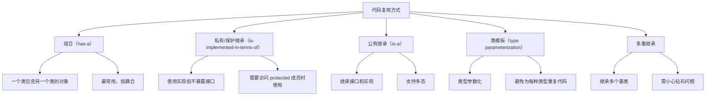
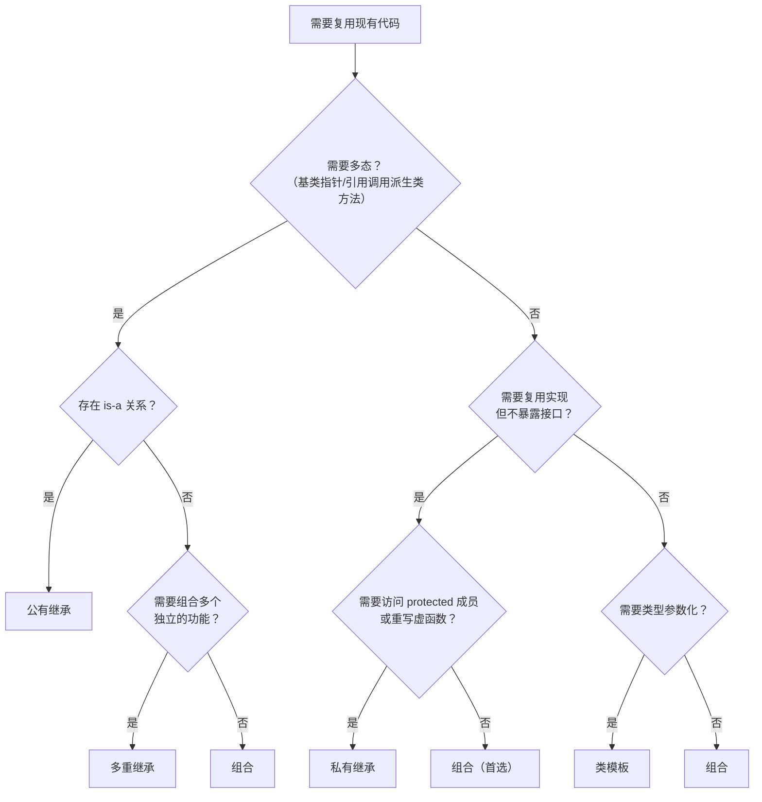
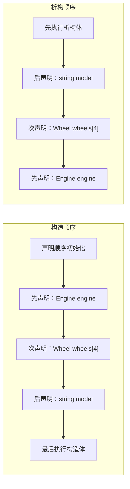
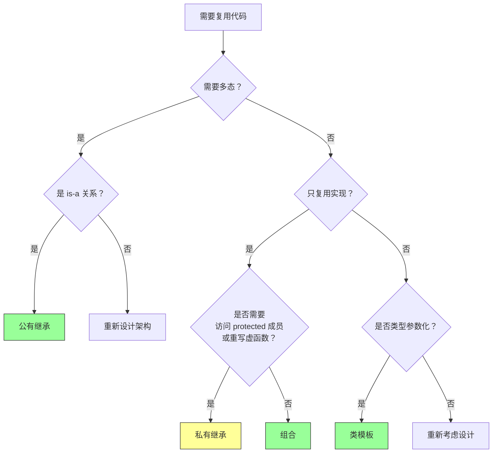
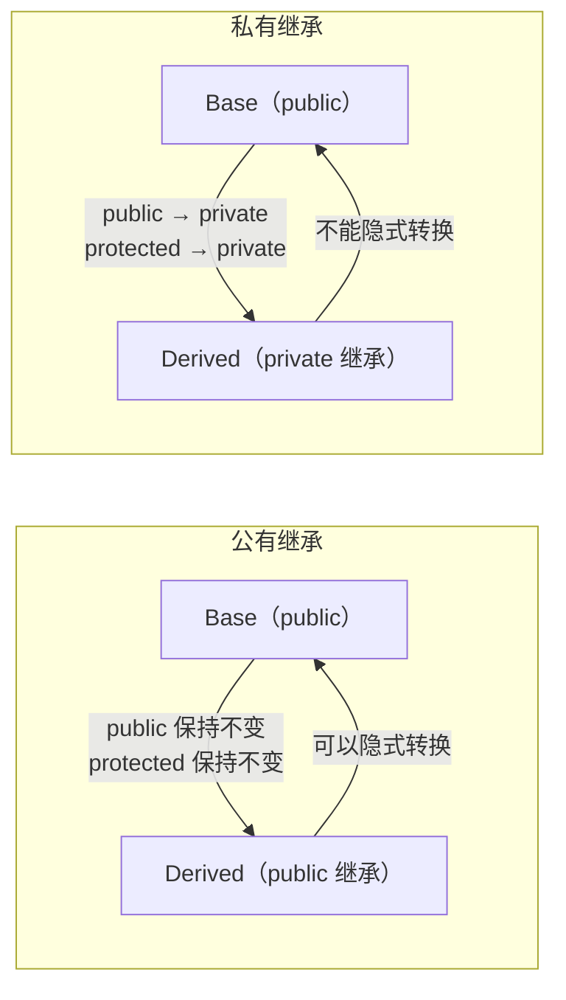
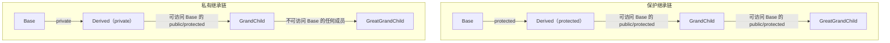
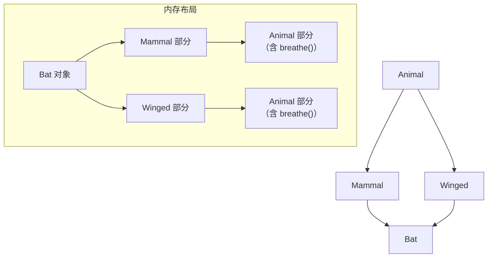
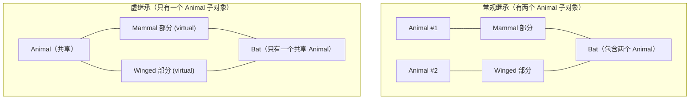
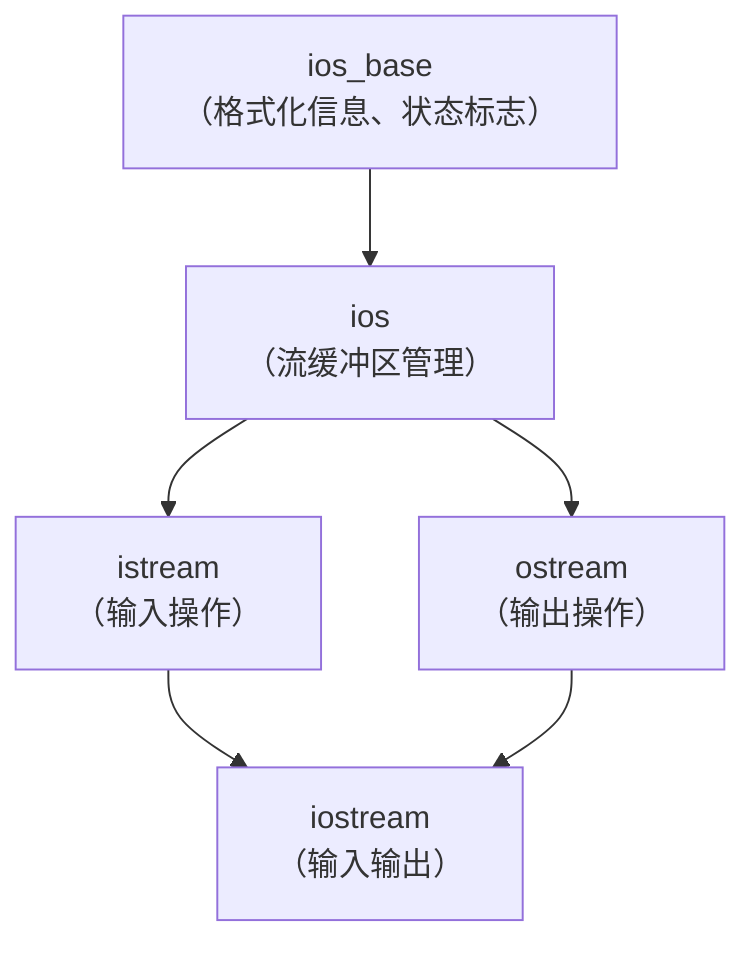
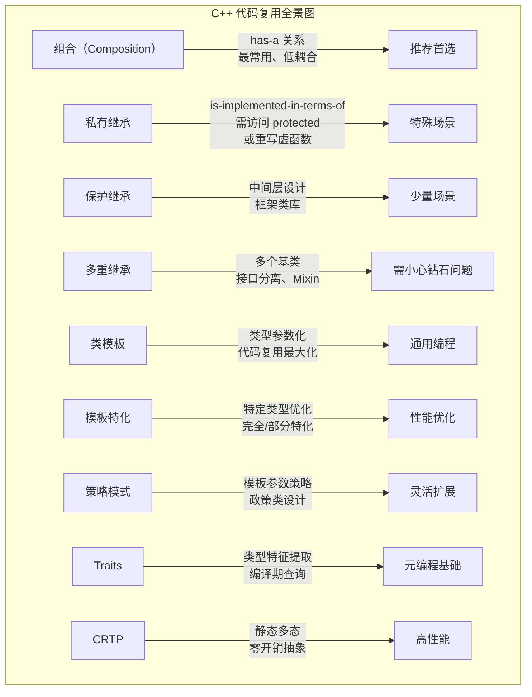

# 第 14 章：C++ 中的代码重用

> **本章目标**: 掌握 C++ 中代码复用的多种机制——组合（包含）、私有/保护继承、多重继承（MI）和类模板，并深入理解模板特化、策略模式、Traits 技术、CRTP 模式等高级话题。

---

## 14.1 代码复用概述

C++ 提供了多种代码复用方式，每种方式适用于不同的场景：



### 14.1.1 代码复用方式决策流程



---

## 14.2 组合（Composition）

### 14.2.1 has-a 关系

**组合**：一个类将其他类的对象作为成员。表示"有一个"（has-a）关系。组合是面向对象设计中耦合度最低、最灵活的代码复用方式。

```cpp
#include <iostream>
#include <string>
#include <vector>
using namespace std;

class Engine {
private:
    int horsepower;
public:
    Engine(int hp = 100) : horsepower(hp) {
        cout << "Engine 构造: " << horsepower << "HP" << endl;
    }
    ~Engine() { cout << "Engine 析构: " << horsepower << "HP" << endl; }
    
    void start() const {
        cout << "引擎启动（" << horsepower << "HP）" << endl;
    }
    
    int getHP() const { return horsepower; }
};

class Wheel {
private:
    int size;
public:
    Wheel(int s = 17) : size(s) {
        cout << "Wheel 构造: " << size << "英寸" << endl;
    }
    ~Wheel() { cout << "Wheel 析构: " << size << "英寸" << endl; }
    
    void rotate() const {
        cout << "车轮旋转（" << size << "英寸）" << endl;
    }
};

// Car "has-a" Engine 和 Wheel（组合）
class Car {
private:
    Engine engine;      // 组合：Car 包含 Engine 对象
    Wheel wheels[4];    // 组合：Car 包含 4 个 Wheel 对象
    string model;

public:
    Car(const string& m, int hp, int wheelSize)
        : model(m), engine(hp), 
          wheels{wheelSize, wheelSize, wheelSize, wheelSize} {
        cout << "Car 构造完成: " << model << endl;
    }
    
    ~Car() { cout << "Car 析构: " << model << endl; }
    
    void start() {
        cout << model << " 启动中..." << endl;
        engine.start();         // 委托给 Engine 对象
        for (auto& w : wheels) {
            w.rotate();
        }
        cout << model << " 已启动！" << endl;
    }
};

int main() {
    Car myCar("特斯拉", 300, 18);
    myCar.start();
    return 0;
}
```

**输出顺序**：
```
Engine 构造: 300HP
Wheel 构造: 18英寸
Wheel 构造: 18英寸
Wheel 构造: 18英寸
Wheel 构造: 18英寸
Car 构造完成: 特斯拉
特斯拉 启动中...
引擎启动（300HP）
车轮旋转（18英寸）
车轮旋转（18英寸）
车轮旋转（18英寸）
车轮旋转（18英寸）
特斯拉 已启动！
Car 析构: 特斯拉
Wheel 析构: 18英寸
Wheel 析构: 18英寸
Wheel 析构: 18英寸
Wheel 析构: 18英寸
Engine 析构: 300HP
```

> **构造顺序**：先成员对象（按声明顺序），再类自身。**析构顺序**：先类自身，再成员对象（与构造相反）。

### 14.2.2 接口 vs 实现复用

```cpp
// 公有继承（is-a）：复用接口 + 实现
// 可以用基类指针指向派生类对象，支持多态
class Dog : public Animal { };

void process(Animal* a) { a->speak(); }  // 多态

// 组合（has-a）：只复用实现
// 内部使用另一个类的功能但不暴露其接口
class Car {
private:
    Engine engine;  // 内部使用 Engine 的功能，但不对外暴露 Engine 的接口
};
```

| 特性 | 公有继承 | 组合 |
|------|----------|------|
| 关系 | is-a | has-a |
| 接口复用 | 继承所有公有接口 | 不继承接口 |
| 实现复用 | 继承实现 | 复用实现 |
| 多态 | 支持 | 不支持 |
| 耦合度 | 高（依赖基类实现） | 低（仅依赖接口） |
| 封装性 | 派生类知道基类细节 | 成员对象完全封装 |
| 适用场景 | 代码重用 + 多态需求 | 仅代码重用 |

### 14.2.3 成员对象的初始化规则

```cpp
#include <iostream>
#include <string>
using namespace std;

class MemberA {
public:
    MemberA() { cout << "MemberA 默认构造" << endl; }
    MemberA(int x) { cout << "MemberA 参数构造: " << x << endl; }
    MemberA(const MemberA&) { cout << "MemberA 拷贝构造" << endl; }
    MemberA& operator=(const MemberA&) { cout << "MemberA 拷贝赋值" << endl; return *this; }
};

class MemberB {
public:
    MemberB() { cout << "MemberB 默认构造" << endl; }
    MemberB(const string& s) { cout << "MemberB 参数构造: " << s << endl; }
};

class Container {
private:
    MemberA a;        // 1. 按声明顺序初始化
    MemberB b;        // 2. 按声明顺序初始化
    MemberA a2;       // 3. 按声明顺序初始化
    
public:
    // 初始化列表控制成员对象的构造方式
    Container() : a(42), b("Hello"), a2() {
        // 如果不写初始化列表，成员会用默认构造
    }
    
    // 委托构造：成员初始化顺序由声明顺序决定，与初始化列表顺序无关
    Container(const MemberA& ma) : b("from A"), a(ma), a2() {
        // 实际构造顺序还是 a → b → a2（声明顺序）
    }
};

int main() {
    cout << "=== 创建 Container ===" << endl;
    Container c;
    
    cout << "\n=== 创建 Container2 ===" << endl;
    MemberA ma(99);
    Container c2(ma);
    
    return 0;
}
```

**初始化规则总结**：
1. 成员对象按**类中声明顺序**初始化，与初始化列表中的顺序无关
2. 如果成员没有在初始化列表中指定，使用其默认构造函数
3. 如果成员没有默认构造函数，必须在初始化列表中显式初始化
4. 初始化顺序与析构顺序相反



### 14.2.4 组合中的对象生命周期管理

#### 值成员（直接包含）

```cpp
class Controller {
private:
    Sensor sensor;          // 值成员：生命周期与 Controller 相同
    Actuator actuator;      // 由 Controller 自动管理构造和析构
public:
    Controller() : sensor(42), actuator("type1") {}
    // 不需要手动析构——成员会自动析构
};
```

#### 指针成员（动态生命周期）

```cpp
class Controller {
private:
    Sensor* sensor;         // 指针成员：需要手动管理生命周期
    unique_ptr<Actuator> actuator;  // 智能指针：自动管理
    
public:
    Controller() 
        : sensor(new Sensor(42)),                  // 原始指针
          actuator(make_unique<Actuator>("type1")) {}  // 智能指针
    
    ~Controller() {
        delete sensor;  // 必须手动释放！
    }
    
    // 必须实现拷贝控制（Rule of Three/Five）
    Controller(const Controller& other)
        : sensor(new Sensor(*other.sensor)),
          actuator(make_unique<Actuator>(*other.actuator)) {}
    
    Controller& operator=(const Controller& other) {
        if (this != &other) {
            *sensor = *other.sensor;
            *actuator = *other.actuator;
        }
        return *this;
    }
    
    // 支持运行时多态替换
    void setSensor(Sensor* newSensor) {
        delete sensor;
        sensor = newSensor;
    }
};
```

#### 引用成员（组合引用，不可为空）

```cpp
class Controller {
private:
    Sensor& sensor;             // 引用：必须在初始化列表中绑定
    const Actuator& actuator;   // const 引用
    
public:
    // 引用成员必须通过初始化列表初始化
    Controller(Sensor& s, const Actuator& a) 
        : sensor(s), actuator(a) {}
    
    // 引用成员不能默认构造，不能拷贝赋值
    Controller& operator=(const Controller&) = delete;
};
```

### 14.2.5 组合 vs 继承的详细决策流程



**选择组合优于继承的场景**：
- 类之间是 has-a 关系而非 is-a 关系
- 只需要复用实现，不需要继承接口
- 需要在运行时替换被包含的对象（策略模式）
- 一个类需要多个同类型的对象
- 需要降低耦合度

### 14.2.6 组合的委托模式

组合常常与**委托模式**结合使用——外部类将任务委托给内部成员对象处理：

```cpp
class Logger {
public:
    void log(const string& msg) { cout << "[LOG] " << msg << endl; }
};

class FileManager {
public:
    void save(const string& data) { cout << "保存: " << data << endl; }
};

class Application {
private:
    Logger logger;          // 组合
    FileManager fileMgr;    // 组合
    
public:
    void process(const string& data) {
        logger.log("开始处理数据");
        // 委托给 FileManager
        fileMgr.save(data);
        logger.log("数据处理完成");
    }
};
```

---

## 14.3 私有继承

### 14.3.1 私有继承的语法和语义

```cpp
class Student : private string {  // 私有继承 string
    // string 的所有成员在 Student 中变成 private
};
```

**私有继承的特点**：
- 基类的 `public` 和 `protected` 成员在派生类中变为 `private`
- 基类的接口不会暴露给外部使用者
- 不能将派生类指针/引用隐式转换为基类指针/引用
- 用于实现"用基类实现"（is-implemented-in-terms-of），而不是"是基类"（is-a）



### 14.3.2 私有继承完整示例

```cpp
#include <iostream>
#include <string>
#include <valarray>
using namespace std;

class Student : private string, private valarray<double> {
private:
    // 在私有继承中，不需要额外的数据成员来"包装"基类
    // 而是直接以基类子对象的形式存在
    
    // 辅助函数：使用基类功能实现新接口
    double calcAverage() const {
        if (valarray<double>::size() > 0) {
            return valarray<double>::sum() / valarray<double>::size();
        }
        return 0;
    }
    
public:
    // 构造：直接初始化基类子对象
    Student(const string& name, int n) 
        : string(name), valarray<double>(n) {}
    
    Student(const string& name, const valarray<double>& grades)
        : string(name), valarray<double>(grades) {}
    
    // 通过 using 声明暴露基类的部分接口
    using string::size;       // 暴露 string::size() 作为 Student::size()
    using string::length;     // 暴露 string::length()
    
    // 自定义公共接口
    double average() const { return calcAverage(); }
    
    // 访问成绩
    double& operator[](int i) { return valarray<double>::operator[](i); }
    const double& operator[](int i) const { return valarray<double>::operator[](i); }
    
    // 友元：需要访问基类子对象
    friend ostream& operator<<(ostream& os, const Student& s) {
        // 访问 string 基类部分（用于显示姓名）
        os << "学生: " << (const string&)s << endl;  
        os << "成绩数: " << s.size();  // 使用暴露的 size()
        os << " 平均分: " << s.average();
        return os;
    }
};

int main() {
    Student s1("张三", 5);
    s1[0] = 85; s1[1] = 92; s1[2] = 78; s1[3] = 95; s1[4] = 88;
    
    cout << s1 << endl;
    cout << "平均分: " << s1.average() << endl;
    cout << "姓名长度: " << s1.length() << endl;
    
    // s1.size();        // ✅ 通过 using 声明暴露
    // string& ref = s1; // ❌ 私有继承，不能隐式转换
    return 0;
}
```

### 14.3.3 暴露接口的多种方式

私有继承中，基类的公有成员都变成了私有，想要暴露它们有以下几种方式：

#### 方式 1：using 声明（最简洁）

```cpp
class Student : private string {
public:
    using string::size;     // 将 string::size() 暴露为 public
    using string::empty;    // 将 string::empty() 暴露为 public
    // using string::c_str; // 也可以暴露其他成员
};
```

**using 声明的工作原理**：将基类中的指定成员名引入派生类的公有区域，保持其原有的访问级别。

#### 方式 2：转发函数（可改变行为）

```cpp
class Student : private string {
public:
    // 通过转发函数暴露，同时可以添加额外逻辑
    int getLength() const {
        return string::length();  // 转发到基类
    }
    
    bool isEmpty() const {
        cout << "检查学生姓名是否为空" << endl;  // 添加日志
        return string::empty();
    }
};
```

#### 方式 3：friend 函数/类

```cpp
class Student : private string {
    friend ostream& operator<<(ostream&, const Student&);
    friend class Registrar;  // 注册处可以访问私有基类
};

ostream& operator<<(ostream& os, const Student& s) {
    os << (const string&)s;  // 转型以访问基类部分
    return os;
}
```

### 14.3.4 私有继承中使用虚函数

```cpp
#include <iostream>
using namespace std;

class Observer {
public:
    virtual void update(const string& event) = 0;
    virtual ~Observer() = default;
};

class Logger {
public:
    void log(const string& msg) { cout << "[Logger] " << msg << endl; }
};

// 私有继承 Logger 复用实现，同时实现 Observer 接口
class EventMonitor : private Logger, public Observer {
public:
    void update(const string& event) override {
        // 利用私有继承的基类功能
        log("收到事件: " + event);
        
        if (event == "error") {
            log("触发错误处理流程");
        }
    }
    
    // 可以选择性暴露基类接口
    using Logger::log;
};

int main() {
    EventMonitor monitor;
    Observer* obs = &monitor;   // ✅ 公有继承 Observer
    
    obs->update("user_login");
    obs->update("error");
    
    // Logger* lp = &monitor;  // ❌ 私有继承，不能转换
    monitor.log("直接调用");    // ✅ 通过 using 声明暴露
    
    return 0;
}
```

### 14.3.5 组合 vs 私有继承深入对比

| 特性 | 组合 | 私有继承 |
|------|------|----------|
| 关系语义 | has-a（有一个） | is-implemented-in-terms-of（用...实现） |
| 语法复杂度 | 低，容易理解 | 较高，易混淆 |
| 对象个数 | 可包含多个同类型对象 | 每个基类只有一个子对象 |
| 接口暴露 | 需要手写转发函数 | using 声明更简洁 |
| 访问 protected 成员 | 不能 | 可以 |
| 重写虚函数 | 不能 | 可以 |
| 耦合度 | 低 | 高（与基类实现耦合） |
| 编译依赖 | 可前向声明减少依赖 | 必须包含头文件 |
| 推荐程度 | **首推** | **仅在特殊场景使用** |

**何时使用私有继承**（而不是组合）：
1. 需要访问基类的 **protected** 成员
2. 需要重写基类的 **虚函数**
3. 需要控制基类的 **构造顺序**（极少见）
4. 需要**空基类优化**（EBO, Empty Base Optimization）

### 14.3.6 空基类优化（EBO）

```cpp
#include <iostream>
using namespace std;

// 空类（没有任何数据成员）
class Empty {
public:
    void doSomething() {}
};

// 组合方式：Empty 对象占用至少 1 字节
class WithComposition {
    int data;
    Empty e;  // 空类对象至少 1 字节
    // 大小: 至少 8 字节（int 4 + 空对象 1 + 对齐 3）
};

// 私有继承方式：EBO 发生，空基类不占用额外空间
class WithEBO : private Empty {
    int data;
    // 大小: 4 字节（int，空基类不占空间）
};

int main() {
    cout << "sizeof(Empty) = " << sizeof(Empty) << endl;
    cout << "sizeof(WithComposition) = " << sizeof(WithComposition) << endl;
    cout << "sizeof(WithEBO) = " << sizeof(WithEBO) << endl;
    
    return 0;
}
```

---

## 14.4 保护继承

### 14.4.1 保护继承的语义

```cpp
class Base {
public:
    int publicData;
protected:
    int protectedData;
private:
    int privateData;
};

class ProtectedDerived : protected Base {
    // publicData    → protected
    // protectedData → protected
    // privateData   → 不可访问
    // 再下一级派生类可以访问 publicData 和 protectedData
};

class PrivateDerived : private Base {
    // publicData    → private
    // protectedData → private
    // privateData   → 不可访问
    // 再下一级派生类不能访问任何 Base 成员
};
```

### 14.4.2 三种继承方式的访问权限对比

| 在派生类中 | 公有继承 | 保护继承 | 私有继承 |
|------------|----------|----------|----------|
| Base::public | public | protected | private |
| Base::protected | protected | protected | private |
| Base::private | 不可见 | 不可见 | 不可见 |

| 在孙子类中 | 公有继承 | 保护继承 | 私有继承 |
|------------|----------|----------|----------|
| Base::public | public | protected | 不可见 |
| Base::protected | protected | protected | 不可见 |
| Base::private | 不可见 | 不可见 | 不可见 |

### 14.4.3 保护继承的使用场景

保护继承主要用于框架类库设计中，提供一个"中间层"基类：

```cpp
#include <iostream>
#include <string>
using namespace std;

// 底层：通用数据访问层
class DataAccess {
public:
    void connect(const string& connStr) {
        cout << "连接数据库: " << connStr << endl;
    }
    void executeQuery(const string& sql) {
        cout << "执行 SQL: " << sql << endl;
    }
    void disconnect() {
        cout << "断开连接" << endl;
    }
protected:
    void beginTransaction() { cout << "开始事务" << endl; }
    void commit() { cout << "提交事务" << endl; }
    void rollback() { cout << "回滚事务" << endl; }
};

// 中间层：保护继承，将 DataAccess 的能力传递给更具体的派生类
class RepositoryBase : protected DataAccess {
public:
    void initialize(const string& connStr) {
        connect(connStr);
    }
protected:
    // 暴露受保护的操作给更具体的仓库类
    using DataAccess::beginTransaction;
    using DataAccess::commit;
    using DataAccess::rollback;
    using DataAccess::executeQuery;
    
    virtual ~RepositoryBase() { disconnect(); }
};

// 具体层：公有继承 RepositoryBase
class UserRepository : public RepositoryBase {
public:
    void findUser(int id) {
        beginTransaction();
        executeQuery("SELECT * FROM users WHERE id = " + to_string(id));
        commit();
    }
};

int main() {
    UserRepository userRepo;
    userRepo.initialize("localhost:3306/mydb");
    userRepo.findUser(42);
    
    // userRepo.executeQuery("...");  // ❌ 保护继承，外部不能调用
    return 0;
}
```

### 14.4.4 保护继承 vs 私有继承



---

## 14.5 多重继承（Multiple Inheritance, MI）

### 14.5.1 多重继承的语法

```cpp
class A { /* ... */ };
class B { /* ... */ };

// 多重继承：一个类从多个基类派生
class C : public A, private B {
    // A 以公有方式继承，B 以私有方式继承
};
```

**混合访问级别的多重继承**：
```cpp
class Base1 { public: void f1(); };
class Base2 { public: void f2(); };
class Base3 { public: void f3(); };

class Derived : public Base1, protected Base2, private Base3 {
    // Base1: public 继承
    // Base2: protected 继承
    // Base3: private 继承
};
```

### 14.5.2 钻石继承问题



```cpp
#include <iostream>
using namespace std;

class Animal {
public:
    void breathe() { cout << "呼吸" << endl; }
    int age = 0;
};

class Mammal : public Animal { };
class Winged : public Animal { };

class Bat : public Mammal, public Winged { };

int main() {
    Bat bat;
    // bat.breathe();          // ❌ 二义性错误！Animal::breathe() 不明确
    bat.Mammal::breathe();     // ✅ 指定路径：通过 Mammal 调用
    bat.Winged::breathe();     // ✅ 指定路径：通过 Winged 调用
    
    // bat.age = 5;            // ❌ 二义性！age 在两个 Animal 子对象中都存在
    bat.Mammal::age = 5;       // ✅ 修改 Mammal 路径下的 age
    bat.Winged::age = 3;       // ✅ 修改 Winged 路径下的 age
    
    cout << "Mammal::age = " << bat.Mammal::age << endl;  // 5
    cout << "Winged::age = " << bat.Winged::age << endl;  // 3
    // 有两个不同的 age！
    
    return 0;
}
```

### 14.5.3 虚基类（Virtual Base Class）

```cpp
#include <iostream>
using namespace std;

// 使用虚基类解决钻石问题
class Animal {
public:
    void breathe() { cout << "呼吸" << endl; }
    int age = 0;
};

class Mammal : virtual public Animal { };   // 虚继承
class Winged : virtual public Animal { };   // 虚继承

class Bat : public Mammal, public Winged { };

int main() {
    Bat bat;
    bat.breathe();          // ✅ 没问题！只有一个 Animal 子对象
    bat.age = 5;            // ✅ 无二义性
    
    cout << "age = " << bat.age << endl;  // 5
    
    // 验证只有一个 Animal 子对象
    cout << "sizeof(Bat) without virtual: " 
         << sizeof(Mammal) + sizeof(Winged)  // 近似大小
         << endl;
    
    return 0;
}
```



### 14.5.4 虚基类的内存布局探讨

```cpp
#include <iostream>
using namespace std;

class A {
public:
    int a = 1;
    virtual void foo() { cout << "A::foo" << endl; }
};

class B : virtual public A {
public:
    int b = 2;
};

class C : virtual public A {
public:
    int c = 3;
};

class D : public B, public C {
public:
    int d = 4;
};

int main() {
    cout << "sizeof(A) = " << sizeof(A) << endl;  // 8 (int + vptr)
    cout << "sizeof(B) = " << sizeof(B) << endl;  // 16 (vptr + A部分 + int b)
    cout << "sizeof(D) = " << sizeof(D) << endl;  // 24+ (多个 vptr + 共享A + 多个int)
    
    D obj;
    // 内存布局示意（取决于编译器实现）：
    // [B部分的vptr] [b] [C部分的vptr] [c] [d] [A部分: vptr, a]
    // 或采用 vbptr（virtual base table pointer）方案
    
    obj.a = 10;  // 修改的是唯一的 A::a
    cout << "a = " << obj.a << endl;  // 10
    
    return 0;
}
```

> **注意**：虚继承会引入额外的运行时开销（通过虚基类指针/偏移量表访问），这是解决钻石问题的代价。

### 14.5.5 虚基类的构造规则

```cpp
#include <iostream>
using namespace std;

class Animal {
public:
    Animal() { cout << "Animal 默认构造" << endl; }
    Animal(int age) { cout << "Animal 参数构造: " << age << endl; }
};

class Mammal : virtual public Animal {
public:
    Mammal() { cout << "Mammal 默认构造" << endl; }
    Mammal(int age) : Animal(age) {  // 这里的 Animal(age) 只在 Mammal 独立使用时生效
        cout << "Mammal 参数构造: " << age << endl;
    }
};

class Winged : virtual public Animal {
public:
    Winged() { cout << "Winged 默认构造" << endl; }
    Winged(int age) : Animal(age) {  // 这里的 Animal(age) 只在 Winged 独立使用时生效
        cout << "Winged 参数构造: " << age << endl;
    }
};

class Bat : public Mammal, public Winged {
public:
    // 在 MI 中，虚基类由最派生类（most derived class）负责构造
    Bat() : Animal(5), Mammal(), Winged() {
        cout << "Bat 构造" << endl;
    }
    
    Bat(int age) : Animal(age), Mammal(age), Winged(age) {
        cout << "Bat 参数构造" << endl;
    }
};

int main() {
    cout << "=== 创建 Bat ===" << endl;
    Bat bat;
    // 输出:
    // Animal 参数构造: 5        ← 由 Bat 直接初始化虚基类
    // Mammal 默认构造
    // Winged 默认构造
    // Bat 构造
    
    cout << "\n=== 创建 Bat(10) ===" << endl;
    Bat bat2(10);
    // 输出:
    // Animal 参数构造: 10       ← Bat 控制虚基类的构造
    // Mammal 参数构造: 10
    // Winged 参数构造: 10
    // Bat 参数构造
    
    return 0;
}
```

**虚基类构造的关键规则**：
> 虚基类由**最派生类**（most derived class）直接初始化，中间类对虚基类的构造调用会被忽略。

### 14.5.6 经典 MI 分析：ios_base → istream/ostream → iostream

标准库中的 `iostream` 是多重继承最著名的应用之一：



```cpp
#include <iostream>
using namespace std;

// 简化的标准库流层次结构
class ios_base {
    // 格式化标志、异常掩码、回调等
    int formatFlags;
public:
    ios_base() : formatFlags(0) {}
    int flags() const { return formatFlags; }
};

class ios : virtual public ios_base {
    // 流状态、缓冲区指针
    streambuf* sb;
public:
    ios(streambuf* buf) : sb(buf) {}
};

class istream : virtual public ios {
public:
    istream(streambuf* buf) : ios(buf) {}
    istream& operator>>(int& val) { 
        // 读取整数
        return *this; 
    }
};

class ostream : virtual public ios {
public:
    ostream(streambuf* buf) : ios(buf) {}
    ostream& operator<<(int val) { 
        // 写入整数
        return *this; 
    }
};

class iostream : public istream, public ostream {
public:
    iostream(streambuf* buf) 
        : ios_base(),       // 最派生类初始化虚基类
          ios(buf),         // 虚基类构造被忽略
          istream(buf), 
          ostream(buf) {}
    
    // iostream 同时继承 istream::>> 和 ostream::<<
    // 没有二义性，因为函数名不同且参数不同
};

int main() {
    // 实际使用 cin/cout 等全局对象
    int x = 42;
    cout << "Hello, World!" << endl;
    // cin >> x;
    
    return 0;
}
```

### 14.5.7 多重继承的构造/析构顺序

```cpp
#include <iostream>
using namespace std;

struct A { A() { cout << "A "; } ~A() { cout << "~A "; } };
struct B { B() { cout << "B "; } ~B() { cout << "~B "; } };
struct C { C() { cout << "C "; } ~C() { cout << "~C "; } };

// 虚基类
struct V1 : virtual public A { V1() { cout << "V1 "; } ~V1() { cout << "~V1 "; } };
struct V2 : virtual public A { V2() { cout << "V2 "; } ~V2() { cout << "~V2 "; } };

struct Derived : public V1, public V2, private B, private C {
    Derived() { cout << "Derived "; }
    ~Derived() { cout << "~Derived "; }
};

int main() {
    cout << "构造: ";
    Derived d;
    cout << endl;
    
    cout << "析构: ";
    // 程序结束时自动析构
    cout << endl;
    
    return 0;
}
// 构造顺序: A V1 V2 B C Derived
// 析构顺序: ~Derived ~C ~B ~V2 ~V1 ~A
```

**构造顺序规则**（多重继承）：
1. 虚基类（按继承图的拓扑顺序，深度优先）
2. 非虚基类（按声明顺序，从左到右）
3. 成员对象（按声明顺序）
4. 派生类构造函数体

---

## 14.6 类模板

### 14.6.1 为什么需要类模板

```cpp
// 没有模板：需要为每种类型写一个类——违反 DRY 原则
class IntStack { /* ... */ };
class DoubleStack { /* ... */ };
class StringStack { /* ... */ };

// 有模板：写一次，用于任何类型——一次编写，无限复用
template <typename T>
class Stack { /* ... */ };
```

### 14.6.2 类模板的语法

```cpp
#include <iostream>
#include <vector>
#include <stdexcept>
using namespace std;

// 类模板定义
template <typename T>
class Stack {
private:
    vector<T> items;

public:
    bool isEmpty() const { return items.empty(); }
    
    void push(const T& item) {
        items.push_back(item);
    }
    
    T pop() {
        if (isEmpty()) {
            throw runtime_error("栈为空！");
        }
        T top = items.back();
        items.pop_back();
        return top;
    }
    
    const T& peek() const {
        if (isEmpty()) {
            throw runtime_error("栈为空！");
        }
        return items.back();
    }
    
    int size() const { return items.size(); }
};

int main() {
    // 实例化不同的 Stack 类型
    Stack<int> intStack;          // T = int
    Stack<double> doubleStack;    // T = double
    Stack<string> stringStack;    // T = string
    
    intStack.push(10);
    intStack.push(20);
    intStack.push(30);
    cout << "int 栈顶: " << intStack.peek() << endl;   // 30
    
    stringStack.push("Hello");
    stringStack.push("World");
    cout << "string 栈顶: " << stringStack.peek() << endl;  // World
    
    return 0;
}
```

### 14.6.3 模板参数详解

#### 类型参数

```cpp
// 基本类型参数
template <typename T>
class Container { /* ... */ };

// 多个类型参数
template <typename Key, typename Value>
class Dict {
    Key key;
    Value value;
};

// typename 和 class 在此语境下完全等价
template <class T>  // 也可以使用 class 关键字
class Holder { /* ... */ };
```

#### 非类型参数

非类型参数必须是**编译期常量表达式**：

```cpp
#include <iostream>
#include <array>
using namespace std;

// 整数非类型参数
template <typename T, int SIZE>
class FixedArray {
private:
    T data[SIZE];  // 编译期确定大小
    
public:
    int size() const { return SIZE; }
    T& operator[](int i) { return data[i]; }
    const T& operator[](int i) const { return data[i]; }
    
    void fill(const T& value) {
        for (int i = 0; i < SIZE; i++) {
            data[i] = value;
        }
    }
};

// 指针/引用非类型参数
template <const char* NAME>
class NamedObject {
public:
    const char* getName() const { return NAME; }
};

extern const char globalName[] = "GlobalObject";

// 枚举非类型参数
enum Color { RED, GREEN, BLUE };

template <Color C>
class ColoredWidget {
public:
    Color getColor() const { return C; }
};

// 非类型参数的限制（C++11/14）
template <double D>  // ❌ C++11 不允许浮点类型（C++20 允许）
class Bad { };

int main() {
    FixedArray<int, 100> arr;    // 100 个 int
    FixedArray<double, 50> arr2; // 50 个 double
    
    constexpr int n = 42;
    FixedArray<char, n> arr3;    // 42 个 char（constexpr 可以）
    
    // FixedArray<int, x> arr4;  // ❌ 运行时变量不能作为非类型参数
    
    int x = 10;
    // FixedArray<int, x> bad;   // 编译错误：x 不是常量表达式
    
    ColoredWidget<RED> widget;
    cout << widget.getColor() << endl;  // 0
    
    return 0;
}
```

**非类型参数的合法类型**：
- 整数类型（int, char, long, bool, enum 等）
- 指针类型（对象指针、函数指针）
- 引用类型（对象引用、函数引用）
- C++20 起：浮点类型、字面量类类型

#### 模板模板参数（Template Template Parameter）

```cpp
#include <iostream>
#include <vector>
#include <list>
#include <deque>
#include <string>
using namespace std;

// 模板模板参数：第二个参数本身也是一个模板
// template <typename...> class Container 表示一个模板类，它接受任意类型参数
template <typename T, template <typename...> class Container = vector>
class Stack {
private:
    Container<T> items;  // 使用传入的容器类型
    
public:
    void push(const T& item) { items.push_back(item); }
    T pop() {
        T top = items.back();
        items.pop_back();
        return top;
    }
    bool isEmpty() const { return items.empty(); }
    size_t size() const { return items.size(); }
};

int main() {
    // 使用 vector 作为底层容器
    Stack<int, vector> vecStack;
    vecStack.push(10);
    vecStack.push(20);
    
    // 使用 list 作为底层容器
    Stack<string, list> listStack;
    listStack.push("Hello");
    listStack.push("World");
    
    // 使用 deque 作为底层容器
    Stack<double, deque> dequeStack;
    dequeStack.push(3.14);
    
    // 使用默认模板参数（vector）
    Stack<int> defaultStack;
    defaultStack.push(42);
    
    cout << "vecStack size: " << vecStack.size() << endl;
    cout << "listStack size: " << listStack.size() << endl;
    cout << "defaultStack size: " << defaultStack.size() << endl;
    
    return 0;
}
```

### 14.6.4 默认模板参数

```cpp
#include <iostream>
#include <vector>
#include <string>
using namespace std;

// 默认类型参数
template <typename T = int>
class DefaultType {
private:
    T value;
public:
    DefaultType(T v = T()) : value(v) {}
    T getValue() const { return value; }
};

// 默认非类型参数
template <typename T, int SIZE = 10>
class Buffer {
private:
    T data[SIZE];
public:
    int capacity() const { return SIZE; }
};

// 混合：部分默认
template <typename T, typename Allocator = allocator<T>>
class MyContainer {
    // ...
};

int main() {
    DefaultType<> d1;        // T 默认为 int
    DefaultType<double> d2;  // T 为 double
    
    Buffer<char> buf;        // SIZE 默认为 10
    Buffer<char, 100> buf2;  // SIZE 为 100
    
    cout << "d1: " << d1.getValue() << endl;
    cout << "d2: " << d2.getValue() << endl;
    cout << "buf capacity: " << buf.capacity() << endl;
    
    return 0;
}
```

### 14.6.5 成员函数的实例化规则

```cpp
#include <iostream>
#include <string>
#include <type_traits>
using namespace std;

template <typename T>
class Container {
private:
    T data;
    
public:
    Container() : data() {}
    
    // 只有被调用时才会实例化
    void print() const {
        cout << data << endl;  // 如果 T 不支持 <<，但从未调用此函数，则不会报错
    }
    
    // enable_if 控制哪些类型可以调用
    template <typename U = T>
    typename enable_if<is_pointer<U>::value, void>::type
    printPtrInfo() const {
        cout << "指针值: " << data;
        if (data) cout << ", 指向: " << *data;
        cout << endl;
    }
    
    void callOnlyIfPointer() const {
        // 如果 T 不是指针，编译此函数会失败，但如果从不调用，就不会实例化
        if constexpr (is_pointer_v<T>) {
            cout << "是指针，值为: " << *data << endl;
        } else {
            cout << "不是指针" << endl;
        }
    }
};

int main() {
    Container<int> ci;
    ci.print();        // 实例化 Container<int>::print()
    // ci.printPtrInfo();  // ❌ 编译错误：int 不是指针，但函数被实例化了
    
    Container<string> cs;
    cs.print();
    
    return 0;
}
```

**实例化规则**：
1. 类模板的成员函数只有在被**调用**时才会被实例化（隐式实例化）
2. 未使用的成员函数不会被实例化，因此即使包含语法错误也不会报错
3. 虚函数的实例化规则不同：虚函数会在类实例化时全部实例化
4. `if constexpr`（C++17）可以用于条件编译分支，不满足条件的分支不会被实例化

### 14.6.6 友元模板

```cpp
#include <iostream>
using namespace std;

// 前置声明
template <typename T>
class Box;

template <typename T>
ostream& operator<<(ostream& os, const Box<T>& b);

// 类模板定义
template <typename T>
class Box {
private:
    T value;
    
public:
    Box(T v) : value(v) {}
    
    // 方式 1：友元非模板函数（与模板参数相关）
    friend ostream& operator<< <>(ostream& os, const Box<T>& b);
    
    // 方式 2：友元模板函数（与模板参数相关）
    template <typename U>
    friend ostream& operator<<(ostream& os, const Box<U>& b);
    
    // 方式 3：友元整个模板实例（与模板参数相关）
    friend ostream& operator<< <T>(ostream& os, const Box<T>& b);
    
    // 方式 4：友元类模板
    template <typename U>
    friend class Inspector;  // Inspector<U> 可以访问任何 Box<T> 的私有成员
};

// 方式 5：友元函数定义在类内部（隐式内联）
template <typename T>
class Data {
private:
    T data;
    
public:
    Data(T d) : data(d) {}
    
    // 在类内部定义友元函数（不需要模板前缀）
    friend void showData(const Data& d) {
        cout << "Data: " << d.data << endl;
    }
};

// 友元函数模板定义
template <typename T>
ostream& operator<<(ostream& os, const Box<T>& b) {
    os << "Box contains: " << b.value;
    return os;
}

int main() {
    Box<int> b(42);
    cout << b << endl;  // operator<< 作为友元可以访问 b.value
    
    Data<string> d("Hello");
    showData(d);
    
    return 0;
}
```

### 14.6.7 模板的静态成员

```cpp
#include <iostream>
using namespace std;

// 类模板的静态成员
template <typename T>
class Counter {
public:
    static int count;  // 每个模板实例有自己的静态成员
    
    Counter() { count++; }
    ~Counter() { count--; }
    
    static int getCount() { return count; }
};

// 定义静态成员（必须放在头文件中）
template <typename T>
int Counter<T>::count = 0;

// 模板特化的静态成员可以有不同初始值
template <>
class Counter<double> {
public:
    static int count;
    Counter() { count += 2; }
};

int Counter<double>::count = 100;

int main() {
    Counter<int> c1, c2, c3;
    Counter<string> s1, s2;
    
    cout << "Counter<int>::count = " << Counter<int>::count << endl;       // 3
    cout << "Counter<string>::count = " << Counter<string>::count << endl; // 2
    cout << "Counter<double>::count = " << Counter<double>::count << endl; // 100
    
    // 静态成员函数
    cout << "Counter<int>::getCount() = " << Counter<int>::getCount() << endl;
    
    return 0;
}
```

### 14.6.8 依赖名称与 typename 关键字

```cpp
#include <iostream>
#include <vector>
using namespace std;

template <typename T>
class Example {
private:
    T container;
    
public:
    // T::value_type 是一个"依赖名称"（dependent name）
    // 因为它的含义依赖于模板参数 T
    using ValueType = typename T::value_type;  // 必须加 typename！
    
    // 不加 typename 会编译错误
    // using BadType = T::value_type;  // ❌ 编译器不知道 value_type 是类型还是静态成员
    
    void process() {
        // 在模板内部访问依赖类型时，必须使用 typename
        typename T::iterator it = container.begin();
    }
};

// 使用 .template 语法
template <typename T>
void func() {
    T obj;
    // 当 T 是类模板且需要调用成员模板时，使用 .template 语法
    // obj.template memberFunc<int>();  // 告诉编译器 memberFunc 是一个模板
}

int main() {
    Example<vector<int>> ex;
    Example<vector<double>> ex2;
    
    return 0;
}
```

### 14.6.9 模板的编译模型

```cpp
// 传统模板编译模型：包含模型（Inclusion Model）
// 模板的定义和声明必须放在头文件中

// mytemplate.h
#ifndef MYTEMPLATE_H
#define MYTEMPLATE_H

template <typename T>
class MyTemplate {
public:
    T value;
    MyTemplate(T v) : value(v) {}
    T getValue() const;
};

// 成员函数必须在头文件中定义
template <typename T>
T MyTemplate<T>::getValue() const {
    return value;
}

#endif

// 或者使用 export 关键字（C++98 引入，C++11 移除，从未被广泛支持）
// export template <typename T>
// T MyTemplate<T>::getValue() const { return value; }

// C++11 起：extern 模板声明，避免重复实例化
extern template class vector<int>;       // 声明但不实例化
template class vector<int>;              // 显式实例化

int main() {
    MyTemplate<int> mt(42);
    return mt.getValue();
}
```

### 14.6.10 模板的模板成员函数

```cpp
#include <iostream>
#include <vector>
#include <list>
using namespace std;

class Utility {
public:
    // 普通类中的模板成员函数
    template <typename T>
    void print(const T& value) {
        cout << value << endl;
    }
    
    // 静态模板成员函数
    template <typename T>
    static T convert(double value) {
        return static_cast<T>(value);
    }
    
    // 模板递归（编译期递归）
    template <typename T>
    void printAll(const T& value) {
        cout << value << " ";
    }
    
    template <typename T, typename... Args>
    void printAll(const T& first, const Args&... rest) {
        cout << first << " ";
        printAll(rest...);
    }
};

// 模板类的模板成员函数
template <typename T>
class Processor {
public:
    // 模板类的模板成员函数
    template <typename U>
    Processor<T>& combine(const U& other) {
        cout << "Combining " << typeid(T).name() 
             << " with " << typeid(U).name() << endl;
        return *this;
    }
    
    // 模板类的静态模板成员函数
    template <typename U>
    static void compare(const T& a, const U& b) {
        cout << "Comparing " << a << " with " << b << endl;
    }
};

int main() {
    Utility u;
    u.print(42);          // 推断为 int
    u.print(3.14);        // 推断为 double
    u.print("Hello");     // 推断为 const char*
    
    int x = Utility::convert<int>(3.14);  // 3
    
    u.printAll(1, 2.5, "three", 4);  // 变参模板
    
    Processor<int> p;
    p.combine<double>(3.14);     // 显式指定 U
    p.combine("test");           // 隐式推断 U
    
    Processor<int>::compare<string>(42, "hello");
    
    return 0;
}
```

### 14.6.11 模板别名（C++11）

```cpp
#include <iostream>
#include <vector>
#include <map>
#include <string>
using namespace std;

// 为模板类型创建别名（C++11）
template <typename T>
using Vec = std::vector<T>;

Vec<int> v;              // 等价于 std::vector<int>
Vec<double> vd;          // 等价于 std::vector<double>

// 为特定实例化创建别名
template <typename T>
using StringKeyMap = std::map<string, T>;

StringKeyMap<int> scoreMap;   // map<string, int>

// 为模板模板参数创建别名
template <typename T>
using MyList = std::list<T>;

template <typename T, template <typename...> class Container = Vec>
class ContainerAdapter {
    Container<T> data;
public:
    void add(const T& item) { data.push_back(item); }
    size_t size() const { return data.size(); }
};

int main() {
    ContainerAdapter<int> adapter;        // 使用 Vec（即 vector）
    ContainerAdapter<int, MyList> adapter2; // 使用 list
    
    adapter.add(10);
    adapter.add(20);
    cout << "adapter size: " << adapter.size() << endl;
    
    return 0;
}
```

---

## 14.7 模板特化（Template Specialization）

### 14.7.1 完全特化（Full Specialization）

```cpp
#include <iostream>
#include <cstring>
using namespace std;

// 通用模板
template <typename T>
class Printer {
public:
    void print(const T& value) {
        cout << "通用实现: " << value << endl;
    }
};

// 完全特化：为 bool 类型提供专门实现
template <>
class Printer<bool> {
public:
    void print(const bool& value) {
        cout << "布尔: " << (value ? "true" : "false") << endl;
    }
};

// 完全特化：为 const char* 提供专门实现
template <>
class Printer<const char*> {
public:
    void print(const char* const& value) {
        if (value) {
            cout << "C 字符串: \"" << value << "\" (长度: " << strlen(value) << ")" << endl;
        } else {
            cout << "空字符串指针" << endl;
        }
    }
};

// 函数模板的完全特化
template <typename T>
T maxValue(T a, T b) {
    return (a > b) ? a : b;
}

// 函数模板特化：比较 const char*
template <>
const char* maxValue<const char*>(const char* a, const char* b) {
    return (strcmp(a, b) > 0) ? a : b;
}

int main() {
    Printer<int> p1;
    p1.print(42);             // 通用实现: 42
    
    Printer<bool> p2;
    p2.print(true);           // 布尔: true
    p2.print(false);          // 布尔: false
    
    Printer<const char*> p3;
    p3.print("Hello World");  // C 字符串: "Hello World" (长度: 11)
    
    cout << maxValue(10, 20) << endl;            // 20
    cout << maxValue("abc", "xyz") << endl;      // xyz（按字典序）
    
    return 0;
}
```

### 14.7.2 部分特化（Partial Specialization）

```cpp
#include <iostream>
using namespace std;

// 通用模板
template <typename T>
struct TypeTraits {
    static const char* name() { return "未知类型"; }
};

// 部分特化：针对指针类型
template <typename T>
struct TypeTraits<T*> {
    static const char* name() {
        static string s = string(TypeTraits<T>::name()) + "*";
        return s.c_str();
    }
};

// 部分特化：针对 const 类型
template <typename T>
struct TypeTraits<const T> {
    static const char* name() {
        static string s = string("const ") + TypeTraits<T>::name();
        return s.c_str();
    }
};

// 部分特化：针对引用类型
template <typename T>
struct TypeTraits<T&> {
    static const char* name() {
        static string s = string(TypeTraits<T>::name()) + "&";
        return s.c_str();
    }
};

// 部分特化：针对数组类型
template <typename T, int N>
struct TypeTraits<T[N]> {
    static const char* name() {
        static string s = string(TypeTraits<T>::name()) + "[" + to_string(N) + "]";
        return s.c_str();
    }
};

// 基本类型的完全特化
template <> struct TypeTraits<int> { static const char* name() { return "int"; } };
template <> struct TypeTraits<double> { static const char* name() { return "double"; } };
template <> struct TypeTraits<char> { static const char* name() { return "char"; } };

int main() {
    cout << TypeTraits<int>::name() << endl;            // int
    cout << TypeTraits<int*>::name() << endl;           // int*
    cout << TypeTraits<const int>::name() << endl;      // const int
    cout << TypeTraits<int&>::name() << endl;           // int&
    cout << TypeTraits<int[5]>::name() << endl;         // int[5]
    cout << TypeTraits<const double*>::name() << endl;  // const double*
    
    return 0;
}
```

### 14.7.3 完全特化 vs 部分特化对比

| 特性 | 完全特化 | 部分特化 |
|------|----------|----------|
| 模板参数 | 所有参数都指定 | 部分参数指定，部分保持通用 |
| 语法 | `template <> class Name<具体类型>` | `template <typename T> class Name<T*>` |
| 适用范围 | 函数模板和类模板 | 仅类模板（C++11 前），函数模板重载代替 |
| 匹配规则 | 完全匹配优先 | 最具体的部分特化优先 |
| 典型用途 | 类型特定优化（如 bool 特化） | 指针/引用/const 等类别特化 |

### 14.7.4 函数模板特化 vs 重载

```cpp
#include <iostream>
#include <cstring>
using namespace std;

// 基础函数模板
template <typename T>
void func(T value) {
    cout << "基础模板: " << value << endl;
}

// 函数模板重载（不是特化）
template <typename T>
void func(T* ptr) {
    if (ptr)
        cout << "指针重载: " << *ptr << endl;
    else
        cout << "空指针" << endl;
}

// 函数模板完全特化（针对 const char*）
template <>
void func<const char*>(const char* value) {
    cout << "const char* 特化: \"" << value << "\"" << endl;
}

// 非模板函数重载（优先级最高）
void func(const char* value) {
    cout << "非模板函数: \"" << value << "\"" << endl;
}

int main() {
    int x = 42;
    
    func(10);                // 基础模板
    func(&x);                // 指针重载
    func("hello");           // 非模板函数（优先级最高）
    func<const char*>("hi"); // 显式指定则调用特化
    
    return 0;
}
```

**重载决议优先级**（从高到低）：
1. 非模板函数（最精确匹配）
2. 函数模板的显式特化
3. 函数模板的基础模板
4. 变参模板（最不精确）

### 14.7.5 特化的匹配规则

```cpp
#include <iostream>
using namespace std;

// 通用模板
template <typename T>
struct Convertor {
    static string convert(const T& value) {
        return "通用: " + to_string(value);
    }
};

// 部分特化 1：指针
template <typename T>
struct Convertor<T*> {
    static string convert(const T* ptr) {
        if (ptr) return "指针: " + Convertor<T>::convert(*ptr);
        return "空指针";
    }
};

// 部分特化 2：const 指针
template <typename T>
struct Convertor<const T*> {
    static string convert(const T* ptr) {
        return "const 指针: " + Convertor<T>::convert(*ptr);
    }
};

// 完全特化：int
template <>
struct Convertor<int> {
    static string convert(const int& value) {
        return "整数: " + to_string(value);
    }
};

int main() {
    int x = 42;
    const int cx = 100;
    
    cout << Convertor<int>::convert(x) << endl;           // 完全特化 → 整数: 42
    cout << Convertor<int*>::convert(&x) << endl;         // 指针特化 → 指针: 整数: 42
    cout << Convertor<const int*>::convert(&cx) << endl;  // const 指针特化 → const 指针: 整数: 100
    
    return 0;
}
```

**匹配规则**（编译器选择哪个特化版本）：
1. 完全特化 > 部分特化 > 通用模板
2. 多个部分特化中，选择"最特化"的（参数约束最多的）
3. 如果有多个同样"特化"的版本，编译错误

### 14.7.6 SFINAE（Substitution Failure Is Not An Error）

```cpp
#include <iostream>
#include <type_traits>
using namespace std;

// SFINAE：替换失败不是错误
// 当模板参数替换失败时，编译器不会报错，而是从候选集中移除该版本

// 场景 1：使用 enable_if 启用/禁用重载
template <typename T>
typename enable_if<is_integral<T>::value, void>::type
process(T value) {
    cout << "处理整数: " << value << endl;
}

template <typename T>
typename enable_if<is_floating_point<T>::value, void>::type
process(T value) {
    cout << "处理浮点数: " << value << endl;
}

template <typename T>
typename enable_if<is_pointer<T>::value, void>::type
process(T ptr) {
    cout << "处理指针: " << (void*)ptr << endl;
}

// 场景 2：使用 decltype 和 SFINAE
struct HasFoo {
    int foo() { return 42; }
};

struct NoFoo {};

// 检测类型是否有 foo() 成员函数
template <typename T>
auto testFoo(T& t) -> decltype(t.foo(), void()) {
    cout << "有 foo() 方法" << endl;
}

void testFoo(...) {
    cout << "没有 foo() 方法" << endl;
}

// 场景 3：检测嵌套类型
template <typename T, typename = void>
struct has_iterator : false_type {};

template <typename T>
struct has_iterator<T, void_t<typename T::iterator>> : true_type {};

// void_t 实现（C++17）
template <typename...>
using void_t = void;

int main() {
    process(42);        // 处理整数: 42
    process(3.14);      // 处理浮点数: 3.14
    int x = 10;
    process(&x);        // 处理指针: ...
    
    HasFoo hf;
    NoFoo nf;
    testFoo(hf);        // 有 foo() 方法
    testFoo(nf);        // 没有 foo() 方法
    
    cout << boolalpha;
    cout << "vector<int> has iterator: " 
         << has_iterator<vector<int>>::value << endl;   // true
    cout << "int has iterator: " 
         << has_iterator<int>::value << endl;            // false
    
    return 0;
}
```

---

## 14.8 策略设计模式（Policy-Based Design via Template Parameters）

策略模式通过模板参数实现设计决策的灵活切换，是 C++ 模板元编程的重要应用。

### 14.8.1 线程安全策略

```cpp
#include <iostream>
#include <mutex>
#include <shared_mutex>
using namespace std;

// 策略 1：单线程（无锁）
struct SingleThreadPolicy {
    void lock() {}
    void unlock() {}
    struct LockGuard {
        LockGuard(SingleThreadPolicy&) {}
    };
};

// 策略 2：多线程互斥锁
struct MultiThreadPolicy {
    mutex mtx;
    void lock() { mtx.lock(); }
    void unlock() { mtx.unlock(); }
    struct LockGuard {
        LockGuard(MultiThreadPolicy& p) : policy(p) { policy.lock(); }
        ~LockGuard() { policy.unlock(); }
        MultiThreadPolicy& policy;
    };
};

// 策略 3：读写锁
struct ReadWritePolicy {
    shared_mutex rwlock;
    void lock() { rwlock.lock(); }
    void unlock() { rwlock.unlock(); }
    void lock_shared() { rwlock.lock_shared(); }
    void unlock_shared() { rwlock.unlock_shared(); }
    
    struct LockGuard {
        LockGuard(ReadWritePolicy& p) : policy(p) { policy.lock(); }
        ~LockGuard() { policy.unlock(); }
        ReadWritePolicy& policy;
    };
};

// 使用策略的容器
template <typename T, typename ThreadPolicy = SingleThreadPolicy>
class ThreadSafeContainer : private ThreadPolicy {
private:
    T* data;
    size_t capacity;
    size_t size_;
    
public:
    ThreadSafeContainer(size_t cap) : capacity(cap), size_(0) {
        data = new T[capacity];
    }
    
    ~ThreadSafeContainer() { delete[] data; }
    
    void add(const T& item) {
        typename ThreadPolicy::LockGuard guard(*this);
        if (size_ < capacity) {
            data[size_++] = item;
        }
    }
    
    T get(size_t index) {
        typename ThreadPolicy::LockGuard guard(*this);
        if (index < size_) {
            return data[index];
        }
        throw out_of_range("索引越界");
    }
    
    size_t size() {
        typename ThreadPolicy::LockGuard guard(*this);
        return size_;
    }
};

int main() {
    // 单线程版本：无锁开销
    ThreadSafeContainer<int, SingleThreadPolicy> singleContainer(100);
    singleContainer.add(42);
    cout << "单线程容器: " << singleContainer.get(0) << endl;
    
    // 多线程版本：有互斥锁
    ThreadSafeContainer<double, MultiThreadPolicy> multiContainer(100);
    multiContainer.add(3.14);
    cout << "多线程容器: " << multiContainer.get(0) << endl;
    
    return 0;
}
```

### 14.8.2 分配策略

```cpp
#include <iostream>
#include <memory>
using namespace std;

// 分配策略 1：栈分配
template <typename T, size_t MaxSize = 1024>
struct StackAllocator {
    T buffer[MaxSize];
    size_t index = 0;
    
    T* allocate(size_t n) {
        if (index + n <= MaxSize) {
            T* ptr = &buffer[index];
            index += n;
            return ptr;
        }
        throw bad_alloc();
    }
    
    void deallocate(T*, size_t) {
        // 栈分配器不释放单个元素，整块回收
    }
    
    void reset() { index = 0; }
};

// 分配策略 2：堆分配
template <typename T>
struct HeapAllocator {
    T* allocate(size_t n) {
        return static_cast<T*>(::operator new(n * sizeof(T)));
    }
    
    void deallocate(T* ptr, size_t) {
        ::operator delete(ptr);
    }
};

// 使用分配策略的容器
template <typename T, size_t MaxSize = 100,
          template <typename, size_t> class AllocPolicy = StackAllocator>
class FixedContainer {
private:
    AllocPolicy<T, MaxSize> allocator;
    T* data;
    size_t size_;
    
public:
    FixedContainer() : size_(0) {
        data = allocator.allocate(MaxSize);
    }
    
    ~FixedContainer() {
        for (size_t i = 0; i < size_; i++) {
            data[i].~T();
        }
        allocator.deallocate(data, MaxSize);
    }
    
    void push_back(const T& item) {
        if (size_ < MaxSize) {
            new (&data[size_]) T(item);
            size_++;
        }
    }
    
    T& operator[](size_t i) { return data[i]; }
    size_t size() const { return size_; }
};

int main() {
    FixedContainer<int, 10, StackAllocator> stackContainer;
    stackContainer.push_back(1);
    stackContainer.push_back(2);
    stackContainer.push_back(3);
    
    for (size_t i = 0; i < stackContainer.size(); i++) {
        cout << stackContainer[i] << " ";
    }
    cout << endl;
    
    return 0;
}
```

### 14.8.3 比较策略

```cpp
#include <iostream>
#include <string>
using namespace std;

// 比较策略 1：升序
template <typename T>
struct Ascending {
    bool operator()(const T& a, const T& b) const {
        return a < b;
    }
};

// 比较策略 2：降序
template <typename T>
struct Descending {
    bool operator()(const T& a, const T& b) const {
        return a > b;
    }
};

// 比较策略 3：按字符串长度
template <typename T>
struct ByLength {
    bool operator()(const T& a, const T& b) const {
        return a.length() < b.length();
    }
};

// 使用比较策略的排序器
template <typename T, typename Compare = Ascending<T>>
class Sorter {
private:
    Compare comp;
    
public:
    void sort(T* arr, size_t n) {
        // 简单的冒泡排序（仅用于演示）
        for (size_t i = 0; i < n - 1; i++) {
            for (size_t j = 0; j < n - i - 1; j++) {
                if (comp(arr[j + 1], arr[j])) {  // 使用策略进行比较
                    swap(arr[j], arr[j + 1]);
                }
            }
        }
    }
};

int main() {
    int arr[] = {5, 3, 8, 1, 9, 2, 7};
    size_t n = sizeof(arr) / sizeof(arr[0]);
    
    Sorter<int, Ascending<int>> ascSorter;
    ascSorter.sort(arr, n);
    cout << "升序: ";
    for (size_t i = 0; i < n; i++) cout << arr[i] << " ";
    cout << endl;
    
    int arr2[] = {5, 3, 8, 1, 9, 2, 7};
    Sorter<int, Descending<int>> descSorter;
    descSorter.sort(arr2, n);
    cout << "降序: ";
    for (size_t i = 0; i < n; i++) cout << arr2[i] << " ";
    cout << endl;
    
    string words[] = {"C++", "Python", "Java", "Rust", "Go", "JavaScript"};
    size_t wn = sizeof(words) / sizeof(words[0]);
    
    Sorter<string, ByLength<string>> lenSorter;
    lenSorter.sort(words, wn);
    cout << "按长度: ";
    for (size_t i = 0; i < wn; i++) cout << words[i] << " ";
    cout << endl;
    
    return 0;
}
```

---

## 14.9 Traits 技术简介

Traits（类型特征）是一种模板技术，用于在编译期查询和操作类型的属性。

### 14.9.1 标准库中的 type_traits

```cpp
#include <iostream>
#include <type_traits>
using namespace std;

int main() {
    cout << boolalpha;
    
    // 类型判断
    cout << "is_integral<int>: " << is_integral<int>::value << endl;           // true
    cout << "is_integral<double>: " << is_integral<double>::value << endl;     // false
    cout << "is_floating_point<float>: " << is_floating_point<float>::value << endl; // true
    cout << "is_pointer<int*>: " << is_pointer<int*>::value << endl;           // true
    cout << "is_array<int[]>: " << is_array<int[]>::value << endl;             // true
    cout << "is_class<string>: " << is_class<string>::value << endl;           // true
    
    // 类型修饰
    cout << "is_const<const int>: " << is_const<const int>::value << endl;     // true
    cout << "is_volatile<volatile int>: " << is_volatile<volatile int>::value << endl;
    
    // 引用相关
    cout << "is_reference<int&>: " << is_reference<int&>::value << endl;       // true
    cout << "is_lvalue_reference<int&>: " << is_lvalue_reference<int&>::value << endl; // true
    cout << "is_rvalue_reference<int&&>: " << is_rvalue_reference<int&&>::value << endl; // true
    
    // 复合类型
    cout << "is_arithmetic<int>: " << is_arithmetic<int>::value << endl;       // true
    cout << "is_fundamental<void>: " << is_fundamental<void>::value << endl;   // true
    cout << "is_object<int>: " << is_object<int>::value << endl;              // true
    cout << "is_scoped_enum<枚举>: 编译期判断是否为有作用域枚举" << endl;
    
    // 类型关系
    cout << "is_same<int, int>: " << is_same<int, int>::value << endl;           // true
    cout << "is_same<int, double>: " << is_same<int, double>::value << endl;     // false
    cout << "is_base_of<ios_base, ostream>: " << is_base_of<ios_base, ostream>::value << endl;
    
    // 类型转换
    cout << "remove_const<const int>::type = " 
         << typeid(remove_const<const int>::type).name() << endl;
    cout << "add_pointer<int>::type = "
         << typeid(add_pointer<int>::type).name() << endl;
    
    return 0;
}
```

### 14.9.2 自定义 Traits：iterator_traits

```cpp
#include <iostream>
#include <iterator>
#include <vector>
#include <list>
using namespace std;

// 自定义 iterator_traits 简化版
template <typename Iterator>
struct MyIteratorTraits {
    using value_type = typename Iterator::value_type;
    using difference_type = typename Iterator::difference_type;
    using pointer = typename Iterator::pointer;
    using reference = typename Iterator::reference;
    using iterator_category = typename Iterator::iterator_category;
};

// 为指针提供部分特化
template <typename T>
struct MyIteratorTraits<T*> {
    using value_type = T;
    using difference_type = ptrdiff_t;
    using pointer = T*;
    using reference = T&;
    using iterator_category = random_access_iterator_tag;
};

// 为 const 指针提供部分特化
template <typename T>
struct MyIteratorTraits<const T*> {
    using value_type = T;
    using difference_type = ptrdiff_t;
    using pointer = const T*;
    using reference = const T&;
    using iterator_category = random_access_iterator_tag;
};

// 使用 traits 的算法
template <typename Iterator>
typename MyIteratorTraits<Iterator>::value_type
sumRange(Iterator first, Iterator last) {
    using value_type = typename MyIteratorTraits<Iterator>::value_type;
    value_type sum = value_type();
    for (auto it = first; it != last; ++it) {
        sum += *it;
    }
    return sum;
}

int main() {
    vector<int> vec = {1, 2, 3, 4, 5};
    cout << "vector sum: " << sumRange(vec.begin(), vec.end()) << endl;
    
    list<double> lst = {1.1, 2.2, 3.3};
    cout << "list sum: " << sumRange(lst.begin(), lst.end()) << endl;
    
    int arr[] = {10, 20, 30, 40};
    cout << "array sum: " << sumRange(arr, arr + 4) << endl;  // 指针也可用
    
    return 0;
}
```

### 14.9.3 自定义 Traits：类型属性提取

```cpp
#include <iostream>
#include <type_traits>
#include <string>
using namespace std;

// 自定义 trait：检测是否可输出
template <typename T, typename = void>
struct is_printable : false_type {};

template <typename T>
struct is_printable<T, void_t<decltype(cout << declval<const T&>())>> : true_type {};

// C++17 的 void_t 实现
template <typename...>
using void_t = void;

// 自定义 trait：获取"最基础"的类型（去掉所有修饰符）
template <typename T>
struct base_type {
    using type = typename remove_cv<
        typename remove_reference<
            typename remove_pointer<T>::type
        >::type
    >::type;
};

template <typename T>
using base_type_t = typename base_type<T>::type;

// 自定义 trait：检测是否是指针的指针
template <typename T>
struct is_double_pointer : false_type {};

template <typename T>
struct is_double_pointer<T**> : true_type {};

class MyClass {};

int main() {
    cout << boolalpha;
    cout << "is_printable<int>: " << is_printable<int>::value << endl;           // true
    cout << "is_printable<MyClass>: " << is_printable<MyClass>::value << endl;   // false
    
    cout << "base_type<const int*&>::type = " 
         << typeid(base_type_t<const int*&>).name() << endl;  // int
    
    cout << "is_double_pointer<int**>: " << is_double_pointer<int**>::value << endl;       // true
    cout << "is_double_pointer<int*>: " << is_double_pointer<int*>::value << endl;         // false
    
    return 0;
}
```

### 14.9.4 条件启用：enable_if 和条件编译

```cpp
#include <iostream>
#include <type_traits>
using namespace std;

// enable_if 作为返回值
template <typename T>
typename enable_if<is_integral<T>::value, T>::type
twice(T value) {
    return value * 2;
}

// enable_if 作为默认模板参数
template <typename T, typename = typename enable_if<is_floating_point<T>::value>::type>
T half(T value) {
    return value / 2.0;
}

// enable_if 作为函数参数
template <typename T>
void printIfPointer(T ptr, typename enable_if<is_pointer<T>::value>::type* = 0) {
    if (ptr) cout << "指针指向: " << *ptr << endl;
}

// 实际应用：条件打包
template <typename T>
struct Wrapper {
    T value;
    
    // 只在 T 是算术类型时启用
    template <typename U = T>
    typename enable_if<is_arithmetic<U>::value, Wrapper>::type
    operator+(const Wrapper& other) const {
        return Wrapper{value + other.value};
    }
};

int main() {
    cout << twice(10) << endl;       // 20
    // cout << twice(3.14) << endl;  // ❌ 编译错误：double 不是整数
    
    cout << half(10.0) << endl;      // 5.0
    // cout << half(10) << endl;     // ❌ 编译错误：int 不是浮点数
    
    int x = 42;
    printIfPointer(&x);              // 指针指向: 42
    // printIfPointer(x);            // ❌ 编译错误
    
    Wrapper<int> w1{10}, w2{20};
    auto w3 = w1 + w2;
    cout << w3.value << endl;        // 30
    
    return 0;
}
```

---

## 14.10 CRTP 模式（Curiously Recurring Template Pattern）

CRTP 是一种特殊技术：派生类将自己作为模板参数传递给基类。

```cpp
template <typename Derived>
class Base {
    // Derived 是派生类自身
};

class Derived : public Base<Derived> {
    // 派生类继承 Base<Derived>
};
```

### 14.10.1 静态多态（模拟虚函数，零开销）

```cpp
#include <iostream>
#include <chrono>
using namespace std;

// CRTP 基类模板
template <typename Derived>
class Shape {
public:
    // 静态多态：编译期解析，无虚函数开销
    double area() const {
        return static_cast<const Derived&>(*this).areaImpl();
    }
    
    double perimeter() const {
        return static_cast<const Derived&>(*this).perimeterImpl();
    }
    
    // 提供默认实现
    void print() const {
        cout << "Shape area: " << area() << ", perimeter: " << perimeter() << endl;
    }
};

class Circle : public Shape<Circle> {
private:
    double radius;
    
public:
    Circle(double r) : radius(r) {}
    
    // 必须实现这些方法（否则编译错误）
    double areaImpl() const { return 3.14159 * radius * radius; }
    double perimeterImpl() const { return 2 * 3.14159 * radius; }
};

class Rectangle : public Shape<Rectangle> {
private:
    double width, height;
    
public:
    Rectangle(double w, double h) : width(w), height(h) {}
    
    double areaImpl() const { return width * height; }
    double perimeterImpl() const { return 2 * (width + height); }
};

// 使用 CRTP 的接口（静态多态）
template <typename T>
void processShape(const Shape<T>& shape) {
    shape.print();
    cout << "  面积 x 2 = " << shape.area() * 2 << endl;
}

int main() {
    Circle c(5.0);
    Rectangle r(3.0, 4.0);
    
    processShape(c);
    processShape(r);
    
    // 性能对比：CRTP 是静态绑定（编译期解析）
    // 虚函数是动态绑定（运行时通过 vtable 解析）
    // CRTP 可以被内联，虚函数通常不能
    
    return 0;
}
```

### 14.10.2 对象计数器

```cpp
#include <iostream>
#include <string>
using namespace std;

// CRTP：跟踪每个类型的对象数量
template <typename Derived>
class ObjectCounter {
private:
    static inline int objectCount = 0;  // C++17 inline 静态成员
    
protected:
    ObjectCounter() { objectCount++; }
    ObjectCounter(const ObjectCounter&) { objectCount++; }
    ObjectCounter(ObjectCounter&&) noexcept { objectCount++; }
    ~ObjectCounter() { objectCount--; }
    
public:
    static int count() { return objectCount; }
};

class Widget : public ObjectCounter<Widget> {
public:
    Widget() = default;
    Widget(const Widget&) = default;
};

class Gadget : public ObjectCounter<Gadget> {
public:
    Gadget() = default;
    Gadget(const Gadget&) = default;
};

int main() {
    cout << "Widget 初始数量: " << Widget::count() << endl;   // 0
    cout << "Gadget 初始数量: " << Gadget::count() << endl;   // 0
    
    {
        Widget w1, w2;
        Widget w3 = w1;
        Gadget g1;
        
        cout << "Widget 数量: " << Widget::count() << endl;    // 3
        cout << "Gadget 数量: " << Gadget::count() << endl;    // 1
    }
    
    cout << "Widget 数量（离开作用域）: " << Widget::count() << endl;  // 0
    cout << "Gadget 数量（离开作用域）: " << Gadget::count() << endl;  // 0
    
    return 0;
}
```

### 14.10.3 克隆模式（Clone Pattern）

```cpp
#include <iostream>
#include <memory>
#include <vector>
using namespace std;

// CRTP 实现克隆模式
class CloneableBase {
public:
    virtual ~CloneableBase() = default;
    virtual unique_ptr<CloneableBase> clone() const = 0;
    virtual void identify() const = 0;
};

template <typename Derived>
class Cloneable : public CloneableBase {
public:
    unique_ptr<CloneableBase> clone() const override {
        // CRTP 关键：static_cast 到派生类进行拷贝
        return make_unique<Derived>(static_cast<const Derived&>(*this));
    }
};

class Dog : public Cloneable<Dog> {
private:
    string name;
    int age;
    
public:
    Dog(const string& n, int a) : name(n), age(a) {}
    
    void identify() const override {
        cout << "Dog: " << name << ", 年龄: " << age << endl;
    }
    
    void bark() const { cout << "汪汪！" << endl; }
};

class Cat : public Cloneable<Cat> {
private:
    string name;
    string color;
    
public:
    Cat(const string& n, const string& c) : name(n), color(c) {}
    
    void identify() const override {
        cout << "Cat: " << name << ", 颜色: " << color << endl;
    }
    
    void meow() const { cout << "喵喵！" << endl; }
};

int main() {
    vector<unique_ptr<CloneableBase>> animals;
    
    animals.push_back(make_unique<Dog>("旺财", 3));
    animals.push_back(make_unique<Cat>("咪咪", "橘色"));
    
    // 克隆所有动物
    vector<unique_ptr<CloneableBase>> cloned;
    for (const auto& a : animals) {
        cloned.push_back(a->clone());  // CRTP 自动调用正确的拷贝构造
    }
    
    cout << "=== 原始 ===" << endl;
    for (const auto& a : animals) a->identify();
    
    cout << "=== 克隆 ===" << endl;
    for (const auto& a : cloned) a->identify();
    
    // 通过 dynamic_cast 访问派生类特有方法
    auto* dogPtr = dynamic_cast<Dog*>(cloned[0].get());
    if (dogPtr) dogPtr->bark();
    
    return 0;
}
```

### 14.10.4 CRTP Mixin：叠加功能

```cpp
#include <iostream>
using namespace std;

// CRTP Mixin：逐步添加功能

// 基础功能
template <typename Derived>
class Named {
private:
    string name_;
    
public:
    Named(const string& name) : name_(name) {}
    const string& name() const { return name_; }
};

// 添加可打印功能
template <typename Derived>
class Printable : public Named<Derived> {
public:
    using Named<Derived>::Named;
    
    void print() const {
        cout << "对象: " << this->name() << endl;
    }
};

// 添加可序列化功能
template <typename Derived>
class Serializable : public Printable<Derived> {
public:
    using Printable<Derived>::Printable;
    
    string serialize() const {
        return "{ \"name\": \"" + this->name() + "\" }";
    }
};

// 添加比较功能
template <typename Derived>
class Comparable : public Named<Derived> {
public:
    using Named<Derived>::Named;
    
    bool operator==(const Comparable& other) const {
        return this->name() == other.name();
    }
    
    bool operator<(const Comparable& other) const {
        return this->name() < other.name();
    }
};

// 最终类：组合所有功能
class Product : public Serializable<Product>, public Comparable<Product> {
public:
    Product(const string& name) 
        : Serializable<Product>(name), 
          Comparable<Product>(name) {}
    
    double price = 0.0;
};

int main() {
    Product p1("iPhone");
    Product p2("Android");
    p1.price = 6999.0;
    p2.price = 3999.0;
    
    p1.print();                 // 来自 Printable Mixin
    cout << p1.serialize() << endl;  // 来自 Serializable Mixin
    
    cout << "p1 == p2: " << (p1 == p2) << endl;  // 来自 Comparable Mixin
    cout << "p1 < p2: " << (p1 < p2) << endl;
    
    return 0;
}
```

---

## 14.11 类型列表（Compile-Time Type Operations）

类型列表是一种在编译期操作类型序列的元编程技术。

### 14.11.1 基础类型列表实现

```cpp
#include <iostream>
#include <typeinfo>
using namespace std;

// 空类型列表
struct NullType {};

// 类型列表节点
template <typename Head, typename Tail = NullType>
struct TypeList {
    using head = Head;
    using tail = Tail;
};

// 常用类型列表
using SignedIntegralTypes = TypeList<char, TypeList<short, TypeList<int, TypeList<long, TypeList<long long, NullType>>>>>;

// 计算类型列表长度（编译期递归）
template <typename T>
struct Length;

template <>
struct Length<NullType> {
    static constexpr size_t value = 0;
};

template <typename Head, typename Tail>
struct Length<TypeList<Head, Tail>> {
    static constexpr size_t value = 1 + Length<Tail>::value;
};

// 获取第 N 个类型
template <typename T, size_t N>
struct TypeAt;

template <typename Head, typename Tail>
struct TypeAt<TypeList<Head, Tail>, 0> {
    using type = Head;
};

template <typename Head, typename Tail, size_t N>
struct TypeAt<TypeList<Head, Tail>, N> {
    using type = typename TypeAt<Tail, N - 1>::type;
};

// 在类型列表中查找类型索引
template <typename T, typename List>
struct IndexOf;

template <typename T>
struct IndexOf<T, NullType> {
    static constexpr int value = -1;
};

template <typename T, typename Tail>
struct IndexOf<T, TypeList<T, Tail>> {
    static constexpr int value = 0;
};

template <typename T, typename Head, typename Tail>
struct IndexOf<T, TypeList<Head, Tail>> {
private:
    static constexpr int temp = IndexOf<T, Tail>::value;
public:
    static constexpr int value = (temp >= 0) ? temp + 1 : -1;
};

int main() {
    cout << "Length<SignedIntegralTypes> = " 
         << Length<SignedIntegralTypes>::value << endl;  // 5
    
    cout << "TypeAt<SignedIntegralTypes, 0>: " 
         << typeid(TypeAt<SignedIntegralTypes, 0>::type).name() << endl;  // char
    cout << "TypeAt<SignedIntegralTypes, 2>: " 
         << typeid(TypeAt<SignedIntegralTypes, 2>::type).name() << endl;  // int
    cout << "TypeAt<SignedIntegralTypes, 4>: " 
         << typeid(TypeAt<SignedIntegralTypes, 4>::type).name() << endl;  // long long
    
    cout << "IndexOf<int, SignedIntegralTypes> = " 
         << IndexOf<int, SignedIntegralTypes>::value << endl;        // 2
    cout << "IndexOf<double, SignedIntegralTypes> = " 
         << IndexOf<double, SignedIntegralTypes>::value << endl;     // -1
    
    return 0;
}
```

### 14.11.2 类型列表算法

```cpp
#include <iostream>
#include <typeinfo>
#include <type_traits>
using namespace std;

// 基础类型列表
struct NullType {};

template <typename Head, typename Tail = NullType>
struct TypeList {
    using head = Head;
    using tail = Tail;
};

// 追加类型
template <typename List, typename T>
struct Append;

template <typename T>
struct Append<NullType, T> {
    using type = TypeList<T>;
};

template <typename Head, typename Tail, typename T>
struct Append<TypeList<Head, Tail>, T> {
    using type = TypeList<Head, typename Append<Tail, T>::type>;
};

// 移除第一个匹配的类型
template <typename T, typename List>
struct Remove;

template <typename T>
struct Remove<T, NullType> {
    using type = NullType;
};

template <typename T, typename Tail>
struct Remove<T, TypeList<T, Tail>> {
    using type = Tail;  // 移除头，返回尾
};

template <typename T, typename Head, typename Tail>
struct Remove<T, TypeList<Head, Tail>> {
    using type = TypeList<Head, typename Remove<T, Tail>::type>;
};

// 判断是否包含某个类型
template <typename T, typename List>
struct Contains;

template <typename T>
struct Contains<T, NullType> : false_type {};

template <typename T, typename Tail>
struct Contains<T, TypeList<T, Tail>> : true_type {};

template <typename T, typename Head, typename Tail>
struct Contains<T, TypeList<Head, Tail>> : Contains<T, Tail> {};

// 辅助：打印类型列表
void printType() {}

template <typename Head, typename... Tail>
void printType() {
    cout << typeid(Head).name() << " ";
    printType<Tail...>();
}

// 将类型列表转换为参数包（用于打印）
template <typename List>
struct ToVariadic;

template <>
struct ToVariadic<NullType> {
    static void print() {}
};

template <typename Head, typename Tail>
struct ToVariadic<TypeList<Head, Tail>> {
    static void print() {
        cout << typeid(Head).name() << " ";
        ToVariadic<Tail>::print();
    }
};

int main() {
    using MyList = TypeList<int, TypeList<double, TypeList<char, NullType>>>;
    
    cout << "原始列表: ";
    ToVariadic<MyList>::print();
    cout << endl;
    
    // 追加
    using Appended = Append<MyList, float>::type;
    cout << "追加 float: ";
    ToVariadic<Appended>::print();
    cout << endl;
    
    // 移除
    using Removed = Remove<double, MyList>::type;
    cout << "移除 double: ";
    ToVariadic<Removed>::print();
    cout << endl;
    
    // 包含
    cout << "Contains<int>: " << Contains<int, MyList>::value << endl;       // true
    cout << "Contains<float>: " << Contains<float, MyList>::value << endl;   // false
    
    return 0;
}
```

---

## 14.12 多重继承的实际应用

### 14.12.1 接口分离（Interface Segregation）

```cpp
#include <iostream>
#include <string>
#include <vector>
using namespace std;

// 每个接口专注一个功能
class Drawable {
public:
    virtual void draw() const = 0;
    virtual ~Drawable() = default;
};

class Serializable {
public:
    virtual string serialize() const = 0;
    virtual ~Serializable() = default;
};

class Clickable {
public:
    virtual void onClick() = 0;
    virtual ~Clickable() = default;
};

class Movable {
public:
    virtual void move(int dx, int dy) = 0;
    virtual ~Movable() = default;
};

// 具体类只实现需要的接口
class Button : public Drawable, public Clickable {
private:
    string label;
    int x, y, w, h;
    
public:
    Button(const string& lbl, int px, int py) 
        : label(lbl), x(px), y(py), w(100), h(30) {}
    
    void draw() const override {
        cout << "[按钮] " << label << " 在 (" << x << "," << y << ")" << endl;
    }
    
    void onClick() override {
        cout << "按钮 '" << label << "' 被点击！" << endl;
    }
};

class Image : public Drawable, public Serializable {
private:
    string filename;
    
public:
    Image(const string& fname) : filename(fname) {}
    
    void draw() const override {
        cout << "[图片] " << filename << endl;
    }
    
    string serialize() const override {
        return "{ \"type\": \"image\", \"file\": \"" + filename + "\" }";
    }
};

class GameCharacter : public Drawable, public Clickable, public Movable {
private:
    string name;
    int x = 0, y = 0;
    
public:
    GameCharacter(const string& n) : name(n) {}
    
    void draw() const override {
        cout << "[角色] " << name << " 在 (" << x << "," << y << ")" << endl;
    }
    
    void onClick() override {
        cout << "角色 '" << name << "' 被选中！" << endl;
    }
    
    void move(int dx, int dy) override {
        x += dx;
        y += dy;
        cout << name << " 移动到 (" << x << "," << y << ")" << endl;
    }
};

// 通过基类指针操作
void render(const Drawable& d) { d.draw(); }
void notifyClick(Clickable& c) { c.onClick(); }

int main() {
    Button btn("确定", 100, 200);
    Image img("photo.jpg");
    GameCharacter hero("勇者");
    
    vector<const Drawable*> scene = {&btn, &img, &hero};
    
    cout << "=== 渲染场景 ===" << endl;
    for (const auto& d : scene) render(*d);
    
    cout << "\n=== 点击交互 ===" << endl;
    notifyClick(btn);
    notifyClick(hero);
    
    cout << "\n=== 移动 ===" << endl;
    hero.move(10, -5);
    
    return 0;
}
```

### 14.12.2 Mixin 模式

Mixin 是一种通过多重继承组合多个独立功能单元的技术：

```cpp
#include <iostream>
#include <string>
using namespace std;

// 独立的 Mixin 类
struct Loggable {
    void log(const string& msg) const {
        cout << "[LOG] " << msg << endl;
    }
};

struct Timestampable {
    string getTimestamp() const {
        return "2024-01-15 10:30:00";
    }
};

struct Identifiable {
    static int nextId;
    int id;
    
    Identifiable() : id(nextId++) {}
    int getId() const { return id; }
};

int Identifiable::nextId = 1;

struct Cacheable {
    mutable bool cached = false;
    mutable string cacheData;
    
    void invalidateCache() const {
        cached = false;
    }
};

// 通过多重继承组合 Mixin
class UserService : public Loggable, public Timestampable, public Identifiable, public Cacheable {
public:
    void createUser(const string& name) {
        log("创建用户: " + name + " (时间: " + getTimestamp() + ")");
        invalidateCache();
        cout << "用户 " << name << " 创建成功，用户ID: " << getId() << endl;
    }
    
    string getUserInfo() const {
        if (!cached) {
            cacheData = "用户信息缓存 #" + to_string(getId());
            cached = true;
        }
        return cacheData;
    }
};

class OrderService : public Loggable, public Identifiable {
public:
    void createOrder(const string& product) {
        log("创建订单: " + product + "，订单ID: " + to_string(getId()));
        cout << "订单创建成功" << endl;
    }
};

int main() {
    UserService userSvc;
    userSvc.createUser("张三");
    cout << "用户信息: " << userSvc.getUserInfo() << endl;
    
    OrderService orderSvc;
    orderSvc.createOrder("iPhone 15");
    
    // 每个服务有独立的 ID
    UserService userSvc2;
    cout << "第二个用户 ID: " << userSvc2.getId() << endl;
    
    return 0;
}
```

### 14.12.3 多重继承的混入与策略组合

```cpp
#include <iostream>
#include <string>
using namespace std;

// 序列化策略 Mixin
class JsonSerializable {
public:
    virtual string toJson() const = 0;
    virtual ~JsonSerializable() = default;
};

class XmlSerializable {
public:
    virtual string toXml() const = 0;
    virtual ~XmlSerializable() = default;
};

// 数据验证 Mixin
class Validatable {
public:
    virtual bool validate() const = 0;
    virtual ~Validatable() = default;
};

// 组合所有功能
class Product : public JsonSerializable, public XmlSerializable, public Validatable {
private:
    string name;
    double price;
    int quantity;
    
public:
    Product(const string& n, double p, int q) 
        : name(n), price(p), quantity(q) {}
    
    string toJson() const override {
        return "{ \"name\": \"" + name + "\", \"price\": " + to_string(price) 
             + ", \"quantity\": " + to_string(quantity) + " }";
    }
    
    string toXml() const override {
        return "<product><name>" + name + "</name><price>" + to_string(price) 
             + "</price><quantity>" + to_string(quantity) + "</quantity></product>";
    }
    
    bool validate() const override {
        return !name.empty() && price >= 0 && quantity >= 0;
    }
};

void exportAsJson(const JsonSerializable& obj) {
    cout << "JSON: " << obj.toJson() << endl;
}

void exportAsXml(const XmlSerializable& obj) {
    cout << "XML: " << obj.toXml() << endl;
}

int main() {
    Product p("笔记本电脑", 5999.0, 10);
    
    if (p.validate()) {
        exportAsJson(p);
        exportAsXml(p);
    }
    
    return 0;
}
```

---

## 14.13 常见错误和陷阱

### 14.13.1 组合相关

**错误 1：忘记在初始化列表中初始化无默认构造函数的成员**

```cpp
class Member {
public:
    Member(int x) {}  // 没有默认构造
};

class Container {
    Member m;
public:
    // ❌ 错误：Member 没有默认构造函数
    Container() {}  // 编译错误！
    
    // ✅ 正确：必须在初始化列表中显式初始化
    Container() : m(42) {}
};
```

**错误 2：成员初始化顺序错误**

```cpp
class Container {
    int a;
    int b;
public:
    // ❌ 危险：初始化顺序是 a → b（声明顺序），不是列表顺序
    Container(int val) : b(val), a(b) {}  // a 先被初始化，此时 b 未初始化！
    
    // ✅ 正确：按声明顺序初始化
    Container(int val) : a(val), b(val) {}
};
```

### 14.13.2 私有继承相关

**错误 3：混淆私有继承与组合**

```cpp
// ❌ 过度使用私有继承
class Student : private string {  // 学生"是"字符串吗？不合理！
    // ...
};

// ✅ 应该使用组合
class Student {
private:
    string name;  // 学生有名字
    // ...
};
```

**错误 4：忘记私有继承阻止向上转型**

```cpp
class Base { public: void foo(); };
class Derived : private Base { };

void func(Base& b) { b.foo(); }

int main() {
    Derived d;
    // func(d);  // ❌ 编译错误：私有继承阻止转换
    Base& ref = d;  // ❌ 编译错误
    
    // ✅ 在类内部可以转换
    // static_cast<Base&>(d)  // 只能在 Derived 内部使用
}
```

### 14.13.3 多重继承相关

**错误 5：钻石继承二义性（未使用虚继承）**

```cpp
class Base { public: int value; };
class A : public Base { };
class B : public Base { };
class Derived : public A, public B { };

int main() {
    Derived d;
    // d.value = 5;  // ❌ 二义性！A::value 还是 B::value？
    d.A::value = 5;  // 但不直观
}
```

**错误 6：虚基类构造顺序混淆**

```cpp
class VBase { 
public: 
    VBase(int x) { cout << "VBase(" << x << ")" << endl; }
};

class Mid : virtual public VBase {
public:
    // ❌ 这个构造函数不会在 MI 中被调用
    Mid() : VBase(42) {}  // 在独立使用时调用，但在 MI 中被忽略
};

class Derived : public Mid {
public:
    // ✅ 必须由最派生类初始化虚基类
    Derived() : VBase(100), Mid() {}  // VBase 由 Derived 构造
};
```

### 14.13.4 类模板相关

**错误 7：模板定义和实现分离到 .cpp 文件**

```cpp
// mytemplate.h
template <typename T>
class MyClass {
public:
    void func();
};

// mytemplate.cpp
#include "mytemplate.h"
template <typename T>
void MyClass<T>::func() { }  // ❌ 链接错误！其他 .cpp 找不到实例化

// ✅ 正确做法：将定义放在头文件中
// 或者显式实例化：
// template class MyClass<int>;  // 在 mytemplate.cpp 中
```

**错误 8：依赖名称缺少 typename**

```cpp
template <typename T>
class Example {
public:
    // ❌ 错误：编译器不知道 value_type 是类型还是静态成员
    // T::value_type* ptr;
    
    // ✅ 正确：使用 typename
    typename T::value_type* ptr;
};
```

**错误 9：模板的嵌套编译错误消息难以理解**

```cpp
template <typename T>
void process(T value) {
    // 当 T 不支持加法时，错误信息可能非常长
    auto result = value + value;  
}

struct NoOp {};
int main() {
    // process(NoOp{});  // ❌ 可能产生数百行的模板错误信息
    // 使用 static_assert 可以改善错误信息
    return 0;
}
```

**错误 10：非类型模板参数必须是编译期常量**

```cpp
int n = 10;
// template <typename T, int SIZE>
// class Array { };
// Array<int, n> arr;  // ❌ 错误：n 不是编译期常量

constexpr int N = 10;
Array<int, N> arr2;  // ✅ constexpr 可以

// 类内部的 static const int 也可以
struct Config { static const int size = 100; };
Array<int, Config::size> arr3;  // ✅
```

### 14.13.5 模板特化相关

**错误 11：函数模板特化与重载混淆**

```cpp
template <typename T>
void func(T t) { }

template <>
void func<int*>(int* t) { }  // 特化

template <typename T>
void func(T* t) { }  // 重载（不是特化！）

// 调用优先级：func(ptr) 选择重载版本，而非特化版本
```

**错误 12：部分特化仅适用于类模板，不适用于函数模板**

```cpp
// ❌ 错误：函数模板不能部分特化
template <typename T>
void func(T* ptr) { }  // 这是重载，不是特化

// 类模板可以部分特化
template <typename T>
struct Wrapper<T*> { };  // ✅ 部分特化
```

### 14.13.6 CRTP 相关

**错误 13：CRTP 中调用派生类方法但派生类未实现**

```cpp
template <typename Derived>
class Base {
public:
    void doSomething() {
        // 如果 Derived 没有实现 doImpl()，编译错误
        static_cast<Derived*>(this)->doImpl();
    }
};

class Bad : public Base<Bad> {
    // ❌ 忘记实现 doImpl()
};
```

### 14.13.7 通用陷阱

**错误 14：模板编译时错误导致代码膨胀**

```cpp
// 每个模板实例都会生成独立的二进制代码
template <typename T>
class Vector {
    T* data;
    // ... 大量成员函数
};

// 使用 5 种不同的 T 会生成 5 份几乎相同的机器码
Vector<int> v1;
Vector<double> v2;
Vector<float> v3;
Vector<long> v4;
Vector<short> v5;
// 可以通过模板特化或类型擦除来减少膨胀
```

**错误 15：using 声明冲突**

```cpp
class Base1 { public: void func(int); };
class Base2 { public: void func(double); };

class Derived : public Base1, public Base2 {
public:
    // using Base1::func;  // 引入 Base1::func
    // using Base2::func;  // ❌ 冲突：func 名称不明确
    // 
    // ✅ 解决方案：提供转发函数
    void func(int x) { Base1::func(x); }
    void func(double x) { Base2::func(x); }
};
```

---

## 14.14 动手练习

**练习 1：组合——日志系统**

设计一个 `Logger` 类和 `FileManager` 类，然后通过组合创建一个 `Application` 类，使得 `Application` 同时具备日志记录和文件管理的功能。要求 `Application` 不暴露 `Logger` 和 `FileManager` 的接口给外部。

**练习 2：组合——员工管理系统**

创建 `Address`、`Contact`、`Salary` 三个类，然后通过组合构建 `Employee` 类。要求提供完整的构造、拷贝、赋值和移动操作。

**练习 3：私有继承适配器**

假设有一个 `LegacyList` 类（提供了 `insert()`、`remove()`、`getSize()` 等接口），通过私有继承创建一个 `ModernList` 类，将其接口适配为 `push_back()`、`pop_back()`、`size()`，并使用 using 声明暴露 `isEmpty()`。

**练习 4：保护继承——框架设计**

使用保护继承设计一个小型数据访问框架：`Connection` → `Repository`（保护继承） → `UserRepository`（公有继承）。要求 `Repository` 提供事务支持（begin/commit/rollback），但不对外暴露。

**练习 5：多重继承——形状系统**

创建 `Drawable`、`Resizable`、`Colorable` 三个接口类（纯虚函数），然后创建 `Circle`、`Rectangle`、`Triangle` 三个类分别实现这些接口的适当组合。

**练习 6：钻石继承问题**

创建类层次结构：`Person` → `Student`、`Employee` → `PartTimeStudent`。要求使用虚继承解决钻石问题，并使用构造函数初始化虚基类。

**练习 7：类模板——通用容器适配器**

编写一个模板类 `ContainerAdapter`，使用模板模板参数接受不同的 STL 容器（vector、list、deque），实现 `push()`、`pop()`、`top()`、`size()` 和 `empty()` 方法。

**练习 8：类模板——Pair 类**

实现一个通用的 `Pair<T1, T2>` 类模板，支持 `first` 和 `second` 成员访问、比较运算符（==、!=、<、<=、>、>=）、以及流输出。

**练习 9：模板特化——格式化器**

创建一个通用的 `Formatter<T>` 类模板，其 `format(const T&)` 方法返回字符串。为 `int`、`double`、`string`、`bool` 提供完全特化。为指针类型提供部分特化。

**练习 10：CRTP——比较运算符**

使用 CRTP 实现一个 `Comparable<T>` 基类，自动为派生类生成 !=、<=、>、>= 运算符（假设派生类已经实现了 == 和 <）。

**练习 11：Traits——检测是否存在成员函数**

实现一个 traits 类 `has_serialize<T>`，在编译期检测类型 T 是否有 `serialize()` 成员函数。使用 SFINAE 技术实现。

**练习 12：策略模式——排序策略**

实现一个 `Sorter<T, Compare>` 类模板，支持不同的比较策略（升序、降序、自定义 lambda），至少实现两种排序算法（冒泡排序和选择排序），并允许在运行时选择算法。

---

## 14.15 综合案例

### 14.15.1 通用容器包装器

```cpp
#include <iostream>
#include <vector>
#include <list>
#include <deque>
#include <set>
#include <string>
#include <stdexcept>
#include <algorithm>
using namespace std;

// 通用容器包装器：可以适配任意 STL 容器
template <typename T, template <typename...> class Container = vector>
class ContainerWrapper {
private:
    Container<T> data;
    
public:
    using iterator = typename Container<T>::iterator;
    using const_iterator = typename Container<T>::const_iterator;
    using value_type = T;
    
    // 基本操作
    void add(const T& item) { 
        data.push_back(item); 
    }
    
    void add(T&& item) {
        data.push_back(move(item));
    }
    
    template <typename... Args>
    void emplace(Args&&... args) {
        data.emplace_back(forward<Args>(args)...);
    }
    
    void remove(size_t index) {
        if (index >= data.size()) throw out_of_range("索引越界");
        auto it = data.begin();
        advance(it, index);
        data.erase(it);
    }
    
    T& get(size_t index) {
        if (index >= data.size()) throw out_of_range("索引越界");
        auto it = data.begin();
        advance(it, index);
        return *it;
    }
    
    const T& get(size_t index) const {
        if (index >= data.size()) throw out_of_range("索引越界");
        auto it = data.begin();
        advance(it, index);
        return *it;
    }
    
    size_t size() const { return data.size(); }
    bool empty() const { return data.empty(); }
    void clear() { data.clear(); }
    
    // 算法操作
    void sort() {
        // 对于 list 使用其自身的 sort 方法
        sort(begin(), end());
    }
    
    template <typename Compare>
    void sort(Compare comp) {
        sort(begin(), end(), comp);
    }
    
    ContainerWrapper<T, Container> filter(function<bool(const T&)> predicate) const {
        ContainerWrapper<T, Container> result;
        for (const auto& item : data) {
            if (predicate(item)) {
                result.add(item);
            }
        }
        return result;
    }
    
    template <typename ResultType, typename Mapper>
    ContainerWrapper<ResultType, Container> map(Mapper mapper) const {
        ContainerWrapper<ResultType, Container> result;
        for (const auto& item : data) {
            result.add(mapper(item));
        }
        return result;
    }
    
    // 迭代器
    iterator begin() { return data.begin(); }
    iterator end() { return data.end(); }
    const_iterator begin() const { return data.begin(); }
    const_iterator end() const { return data.end(); }
    
    // 输出
    friend ostream& operator<<(ostream& os, const ContainerWrapper& cw) {
        os << "[";
        bool first = true;
        for (const auto& item : cw.data) {
            if (!first) os << ", ";
            os << item;
            first = false;
        }
        os << "]";
        return os;
    }
};

int main() {
    // 使用 vector 作为底层
    ContainerWrapper<int, vector> vecContainer;
    vecContainer.add(3);
    vecContainer.add(1);
    vecContainer.add(4);
    vecContainer.add(1);
    vecContainer.add(5);
    cout << "Vector 容器: " << vecContainer << endl;
    
    // 使用 list 作为底层
    ContainerWrapper<string, list> listContainer;
    listContainer.add("C++");
    listContainer.add("Python");
    listContainer.add("Java");
    listContainer.add("Rust");
    cout << "List 容器: " << listContainer << endl;
    
    // 过滤操作
    auto evenNumbers = vecContainer.filter([](int n) { return n % 2 == 0; });
    cout << "偶数: " << evenNumbers << endl;
    
    // 映射操作
    auto doubled = vecContainer.map<int>([](int n) { return n * 2; });
    cout << "翻倍: " << doubled << endl;
    
    // 元素访问
    cout << "vecContainer[2] = " << vecContainer.get(2) << endl;
    cout << "大小: " << vecContainer.size() << endl;
    
    return 0;
}
```

### 14.15.2 简化版智能指针

```cpp
#include <iostream>
#include <atomic>
#include <functional>
using namespace std;

// 引用计数基类
class RefCounted {
private:
    mutable atomic<int> refCount{0};
    
public:
    RefCounted() = default;
    RefCounted(const RefCounted&) : refCount(0) {}
    
    void addRef() const { refCount++; }
    
    bool releaseRef() const { 
        return refCount.fetch_sub(1) == 1; 
    }
    
    int useCount() const { return refCount.load(); }
};

// 简化版 shared_ptr
template <typename T>
class SimpleSharedPtr {
private:
    T* ptr;
    RefCounted* refCount;
    
    using Deleter = function<void(T*)>;
    Deleter deleter;
    
    void release() {
        if (refCount && refCount->releaseRef()) {
            deleter(ptr);
            delete refCount;
        }
        ptr = nullptr;
        refCount = nullptr;
    }
    
public:
    // 默认删除器
    template <typename U = T>
    explicit SimpleSharedPtr(U* p = nullptr) 
        : ptr(p), refCount(new RefCounted), deleter(defaultDeleter) {
        if (ptr) refCount->addRef();
    }
    
    // 自定义删除器
    template <typename U, typename D>
    SimpleSharedPtr(U* p, D del)
        : ptr(p), refCount(new RefCounted), deleter(del) {
        if (ptr) refCount->addRef();
    }
    
    // 拷贝构造
    SimpleSharedPtr(const SimpleSharedPtr& other)
        : ptr(other.ptr), refCount(other.refCount), deleter(other.deleter) {
        if (refCount) refCount->addRef();
    }
    
    // 移动构造
    SimpleSharedPtr(SimpleSharedPtr&& other) noexcept
        : ptr(other.ptr), refCount(other.refCount), deleter(move(other.deleter)) {
        other.ptr = nullptr;
        other.refCount = nullptr;
    }
    
    // 拷贝赋值
    SimpleSharedPtr& operator=(const SimpleSharedPtr& other) {
        if (this != &other) {
            release();
            ptr = other.ptr;
            refCount = other.refCount;
            deleter = other.deleter;
            if (refCount) refCount->addRef();
        }
        return *this;
    }
    
    // 移动赋值
    SimpleSharedPtr& operator=(SimpleSharedPtr&& other) noexcept {
        if (this != &other) {
            release();
            ptr = other.ptr;
            refCount = other.refCount;
            deleter = move(other.deleter);
            other.ptr = nullptr;
            other.refCount = nullptr;
        }
        return *this;
    }
    
    ~SimpleSharedPtr() { release(); }
    
    T& operator*() const { return *ptr; }
    T* operator->() const { return ptr; }
    T* get() const { return ptr; }
    
    explicit operator bool() const { return ptr != nullptr; }
    
    int useCount() const { return refCount ? refCount->useCount() : 0; }
    
    void reset(T* p = nullptr) {
        release();
        if (p) {
            ptr = p;
            refCount = new RefCounted;
            refCount->addRef();
        }
    }
    
    bool unique() const { return useCount() == 1; }
    
    static void defaultDeleter(T* p) { 
        delete p; 
    }
};

// 简化版 unique_ptr
template <typename T, typename Deleter = default_delete<T>>
class SimpleUniquePtr {
private:
    T* ptr;
    Deleter deleter;
    
public:
    explicit SimpleUniquePtr(T* p = nullptr) : ptr(p) {}
    
    SimpleUniquePtr(SimpleUniquePtr&& other) noexcept
        : ptr(other.ptr), deleter(move(other.deleter)) {
        other.ptr = nullptr;
    }
    
    SimpleUniquePtr(const SimpleUniquePtr&) = delete;
    SimpleUniquePtr& operator=(const SimpleUniquePtr&) = delete;
    
    SimpleUniquePtr& operator=(SimpleUniquePtr&& other) noexcept {
        if (this != &other) {
            reset(other.ptr);
            deleter = move(other.deleter);
            other.ptr = nullptr;
        }
        return *this;
    }
    
    ~SimpleUniquePtr() { 
        if (ptr) deleter(ptr); 
    }
    
    T& operator*() const { return *ptr; }
    T* operator->() const { return ptr; }
    T* get() const { return ptr; }
    explicit operator bool() const { return ptr != nullptr; }
    
    T* release() {
        T* old = ptr;
        ptr = nullptr;
        return old;
    }
    
    void reset(T* p = nullptr) {
        if (ptr) deleter(ptr);
        ptr = p;
    }
    
    void swap(SimpleUniquePtr& other) noexcept {
        swap(ptr, other.ptr);
        swap(deleter, other.deleter);
    }
};

// 测试类
struct TestObject {
    int id;
    TestObject(int i) : id(i) { 
        cout << "TestObject(" << id << ") 构造" << endl; 
    }
    ~TestObject() { 
        cout << "TestObject(" << id << ") 析构" << endl; 
    }
    void greet() const { 
        cout << "Hello from " << id << endl; 
    }
};

int main() {
    cout << "=== shared_ptr 测试 ===" << endl;
    {
        SimpleSharedPtr<TestObject> sp1(new TestObject(1));
        cout << "引用计数: " << sp1.useCount() << endl;  // 1
        
        {
            SimpleSharedPtr<TestObject> sp2 = sp1;
            cout << "引用计数: " << sp1.useCount() << endl;  // 2
            
            SimpleSharedPtr<TestObject> sp3 = sp2;
            cout << "引用计数: " << sp1.useCount() << endl;  // 3
            
            sp2->greet();
            (*sp3).greet();
        }
        
        cout << "引用计数: " << sp1.useCount() << endl;  // 1
        cout << "是否唯一: " << sp1.unique() << endl;    // true
    }
    cout << "shared_ptr 已释放" << endl;
    
    cout << "\n=== unique_ptr 测试 ===" << endl;
    {
        SimpleUniquePtr<TestObject> up1(new TestObject(2));
        up1->greet();
        
        SimpleUniquePtr<TestObject> up2 = move(up1);
        if (!up1) {
            cout << "up1 已为空" << endl;
        }
        up2->greet();
        
        // SimpleUniquePtr<TestObject> up3 = up2;  // ❌ 拷贝构造已删除
    }
    cout << "unique_ptr 已释放" << endl;
    
    cout << "\n=== 自定义删除器测试 ===" << endl;
    {
        SimpleSharedPtr<TestObject> sp(new TestObject(3), [](TestObject* p) {
            cout << "自定义删除器: 删除 TestObject(" << p->id << ")" << endl;
            delete p;
        });
    }
    
    return 0;
}
```

---

## 14.16 本章总结



| 知识点 | 说明 | 掌握要求 |
|--------|------|----------|
| 组合（has-a） | 类中包含其他类的对象 | **熟练掌握** |
| 私有继承 | 复用实现，不暴露接口，using 声明暴露成员 | 理解概念，知道何时使用 |
| 保护继承 | 中间层访问控制，继续传递访问权限 | 了解 |
| 多重继承 | 继承多个基类，接口分离，Mixin | 了解，知道钻石问题和虚继承 |
| 虚基类 | 解决菱形继承二义性，最派生类负责构造 | 理解原理 |
| 类模板 | 类型参数化，非类型参数，模板模板参数 | **熟练掌握** |
| 默认模板参数 | 为模板参数提供默认值 | 会使用 |
| 模板特化 | 完全特化、部分特化、匹配规则 | 理解并应用 |
| SFINAE | 替换失败不是错误，enable_if 技术 | 了解 |
| 策略模式 | 通过模板参数实现设计策略 | 理解 |
| Traits | 类型特征提取，编译期类型信息 | 了解 |
| CRTP | 奇异递归模板模式，静态多态 | 理解 |
| 类型列表 | 编译期类型序列操作 | 了解 |
| 模板别名 | 为模板创建简写名称（C++11） | 会使用 |
| 静态成员模板 | 每个模板实例独立的静态成员 | 理解 |

---

> 本章涵盖了 C++ 代码复用的几乎所有机制：从最简单、最常用的组合（has-a），到访问控制的微妙差异（私有/保护继承），再到功能强大的多重继承和类模板。这些机制不是互斥的——在实际工程中，它们常常组合使用，为不同的设计问题提供最合适的解决方案。掌握每种技术的优缺点和适用场景，是写出高质量 C++ 代码的关键。
