# 第 15 章：友元、异常和其他

> **本章目标**: 深入掌握 C++ 中的异常处理机制（包括异常安全、noexcept、栈展开）、运行时类型识别（RTTI）、四种类型转换运算符的完整用法、友元的深入应用，以及现代 C++ 中异常处理的替代方案。

---

## 15.1 异常处理（Exception Handling）

### 15.1.1 为什么需要异常处理

传统错误处理方式存在诸多问题：

```cpp
// 方式 1：返回错误码（容易被忽略）
int divide(int a, int b, double& result) {
    if (b == 0) return -1;      // 错误码
    result = (double)a / b;
    return 0;                   // 成功
}

// 调用者可能忘记检查错误码
double r;
divide(10, 0, r);  // 错误被忽略！

// 方式 2：设置全局错误标志（容易被覆盖）
bool error = false;
double divide(int a, int b) {
    if (b == 0) { error = true; return 0; }
    error = false;
    return (double)a / b;
}

// 方式 3：使用 assert（仅调试有效，发布版本消失）
double divide(int a, int b) {
    assert(b != 0);   // 调试时检查，但发布版 assert 被移除
    return (double)a / b;
}
```

**异常处理**提供了结构化的错误处理机制，核心优势：

1. **错误检测与处理分离**：出错的函数只需抛出异常，不必知道如何处理
2. **自动传播**：异常沿调用链自动向上传播，无需手动传递错误码
3. **强制处理**：异常如果不被捕获，程序会终止，不会被忽略
4. **类型安全**：异常是类型化的，可以精确匹配处理逻辑
5. **对象安全**：栈展开过程中自动调用析构函数，保证资源释放

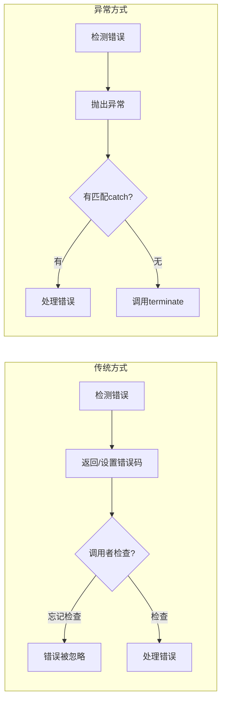

### 15.1.2 try-catch-throw 的基本语法

```cpp
try {
    // 可能抛出异常的代码
    if (条件) {
        throw 表达式;  // 抛出异常
    }
} catch (类型 参数) {
    // 处理特定类型的异常
} catch (类型) {
    // 可以省略参数名，只关注类型
} catch (...) {
    // 捕获所有异常（省略号语法）
    // 必须放在最后
}
```

**关键规则**:

- `throw` 表达式的类型决定了匹配哪个 `catch` 块
- `catch` 块按顺序匹配，第一个匹配的被执行
- `catch(...)` 必须放在最后，否则后续 `catch` 块永远不会被匹配
- 异常对象通过**拷贝初始化**（copy-initialization）方式构造

### 15.1.3 基本示例

```cpp
#include <iostream>
#include <cmath>
using namespace std;

double safeSqrt(double x) {
    if (x < 0) {
        throw "负数不能开平方！";  // 抛出 const char* 类型的异常
    }
    return sqrt(x);
}

int main() {
    double num;
    cout << "请输入一个数: ";
    cin >> num;
    
    try {
        double result = safeSqrt(num);
        cout << "sqrt(" << num << ") = " << result << endl;
    } catch (const char* msg) {  // 捕获 const char* 类型的异常
        cout << "错误: " << msg << endl;
    }
    
    cout << "程序继续运行..." << endl;
    return 0;
}
```

### 15.1.4 抛出不同类型的异常

```cpp
#include <iostream>
#include <stdexcept>   // 标准异常类
using namespace std;

double divide(double a, double b) {
    if (b == 0) {
        throw runtime_error("除数不能为 0！");  // 抛出标准异常对象
    }
    if (b < 0 && a < 0) {
        throw "两个负数相除？";                  // 抛出字符串
    }
    return a / b;
}

int main() {
    try {
        double result = divide(10, 0);
        cout << result << endl;
    } catch (const runtime_error& e) {
        cout << "运行时错误: " << e.what() << endl;
    } catch (const char* msg) {
        cout << "字符串错误: " << msg << endl;
    } catch (...) {
        cout << "未知异常" << endl;
    }
    
    return 0;
}
```

### 15.1.5 异常的完整类型体系

C++ 允许抛出任何类型的对象，但实践中应遵循一定规范：

**可以抛出的类型**：

```cpp
// 1. 基本类型（不推荐，信息量太少）
throw 42;
throw -1;
throw 'E';

// 2. 字符串字面量
throw "error occurred";

// 3. 标准异常对象（推荐）
throw runtime_error("something went wrong");

// 4. 自定义异常对象（推荐）
throw MyException("detailed error info");

// 5. 指针（不推荐，资源管理困难）
throw new exception();  // 谁负责 delete？
```

**推荐做法**：抛出**按值**（throw by value），捕获**按引用**（catch by reference）。

```cpp
// ✅ 正确做法
throw runtime_error("error");           // 按值抛出
catch (const runtime_error& e) {        // 按引用捕获
    cout << e.what() << endl;
}

// ❌ 错误做法：抛出指针
throw new runtime_error("error");       // 需要手动 delete
catch (runtime_error* e) {
    delete e;                           // 容易忘记
}

// ❌ 错误做法：按值捕获（对象切片）
catch (runtime_error e) {               // 对象切片：派生类异常被切割
    // e 是 runtime_error，丢失了派生类信息
}
```

**异常的拷贝构造**：

```cpp
class MyException {
public:
    MyException() { cout << "默认构造\n"; }
    MyException(const MyException&) { cout << "拷贝构造\n"; }
    ~MyException() { cout << "析构\n"; }
};

void func() {
    throw MyException{};  // 构造临时对象
    // 编译器可能将异常对象直接构造到专用的内存中
}

int main() {
    try {
        func();
    } catch (const MyException& e) {
        cout << "捕获\n";
    }
    return 0;
}
```

> **注意**：异常对象在抛出时被拷贝（到线程专用的异常内存区），因此即使原始对象已经销毁，catch 块仍能访问有效的异常对象。

### 15.1.6 标准异常类树（完整版）

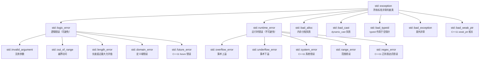

**`std::exception` 接口**：

```cpp
class exception {
public:
    exception() noexcept;
    exception(const exception&) noexcept;
    exception& operator=(const exception&) noexcept;
    virtual ~exception() noexcept;  // 注意：析构函数是 noexcept
    
    // 核心接口：返回描述错误的 C 风格字符串
    virtual const char* what() const noexcept;
};
```

**各类异常的用途**：

| 异常类 | 含义 | 典型场景 |
|--------|------|----------|
| `logic_error` | 逻辑错误，可以通过正确编码避免 | 违反前置条件 |
| `invalid_argument` | 无效参数 | 函数收到了非法参数值 |
| `out_of_range` | 越界 | `vector::at()` 越界访问 |
| `length_error` | 长度超过限制 | `string::resize()` 超出最大长度 |
| `runtime_error` | 运行时错误，无法通过编码避免 | 文件不存在、网络断开 |
| `overflow_error` | 算术上溢 | 数值计算结果超出表示范围 |
| `underflow_error` | 算术下溢 | 浮点数结果太小无法表示 |
| `system_error` | 系统错误 | 封装操作系统错误码 |
| `bad_alloc` | 内存分配失败 | `new` 分配内存失败 |
| `bad_cast` | 转型失败 | `dynamic_cast` 到引用类型失败 |
| `bad_typeid` | 类型识别失败 | `typeid` 作用于解引用的空指针 |

**标准异常类的捕获顺序**：

```cpp
#include <iostream>
#include <stdexcept>
#include <vector>
using namespace std;

int main() {
    try {
        vector<int> v(5);
        v.at(10) = 100;  // 抛出 out_of_range
    } catch (const out_of_range& e) {
        cout << "越界: " << e.what() << endl;
    }
    
    try {
        string s = "Hello";
        char c = s.at(100);  // 抛出 out_of_range
    } catch (const exception& e) {  // 捕获所有标准异常
        cout << "标准异常: " << e.what() << endl;
    }
    
    // 捕获顺序：先具体后一般
    try {
        // 可能抛出多种异常的操作
        vector<int> v(1000000000000);  // 可能 bad_alloc
        v.at(999) = 42;               // 可能 out_of_range
    } catch (const bad_alloc& e) {
        cout << "内存不足: " << e.what() << endl;
    } catch (const out_of_range& e) {
        cout << "越界: " << e.what() << endl;
    } catch (const exception& e) {
        cout << "其他异常: " << e.what() << endl;
    }
    
    return 0;
}
```

### 15.1.7 自定义异常类的设计模式

#### 模式 1：继承 `std::exception`

```cpp
#include <iostream>
#include <exception>
#include <string>
using namespace std;

class DivisionByZero : public exception {
private:
    string message;
    
public:
    // 构造函数
    explicit DivisionByZero(const string& msg = "除数不能为 0") 
        : message(msg) {}
    
    // 重写 what() 函数 — 注意 noexcept 声明
    const char* what() const noexcept override {
        return message.c_str();
    }
};

double divide(double a, double b) {
    if (b == 0) {
        throw DivisionByZero("除以零异常！");
    }
    return a / b;
}
```

#### 模式 2：继承 `std::runtime_error`

```cpp
#include <iostream>
#include <stdexcept>
#include <string>
using namespace std;

// 推荐：继承 runtime_error，它已经实现了 what()
class FileError : public runtime_error {
public:
    explicit FileError(const string& filename, const string& operation)
        : runtime_error("文件操作失败: " + operation + " on " + filename) {}
};

class FileOpenError : public FileError {
public:
    explicit FileOpenError(const string& filename)
        : FileError(filename, "open") {}
};

class FileReadError : public FileError {
public:
    explicit FileReadError(const string& filename)
        : FileError(filename, "read") {}
};

void openFile(const string& path) {
    if (path.empty()) {
        throw FileOpenError("empty_path");
    }
    // ...
}

int main() {
    try {
        openFile("");
    } catch (const FileOpenError& e) {
        cout << "文件打开错误: " << e.what() << endl;
    } catch (const FileError& e) {
        cout << "文件错误: " << e.what() << endl;
    } catch (const exception& e) {
        cout << "其他错误: " << e.what() << endl;
    }
    
    return 0;
}
```

#### 模式 3：带有错误码的异常

```cpp
#include <iostream>
#include <stdexcept>
#include <string>
using namespace std;

class ErrorCodeException : public runtime_error {
private:
    int errorCode;
    
public:
    ErrorCodeException(int code, const string& msg)
        : runtime_error(msg), errorCode(code) {}
    
    int code() const { return errorCode; }
};

void networkOperation() {
    throw ErrorCodeException(404, "资源未找到");
}

int main() {
    try {
        networkOperation();
    } catch (const ErrorCodeException& e) {
        cout << "错误码: " << e.code() << ", 信息: " << e.what() << endl;
    }
    
    return 0;
}
```

#### 模式 4：嵌套异常（`std::throw_with_nested`）

```cpp
#include <iostream>
#include <stdexcept>
#include <string>
using namespace std;

// 使用 std::throw_with_nested 保存异常链
void innerFunction() {
    try {
        throw runtime_error("底层错误");
    } catch (...) {
        // 捕获当前异常并包装上一层信息
        throw_with_nested(runtime_error("中层错误"));
    }
}

void outerFunction() {
    try {
        innerFunction();
    } catch (...) {
        throw_with_nested(runtime_error("外层错误"));
    }
}

// 递归打印异常链
void printException(const exception& e, int level = 0) {
    cerr << string(level * 2, ' ') << "异常: " << e.what() << endl;
    try {
        rethrow_if_nested(e);  // 重新抛出嵌套的异常
    } catch (const exception& nested) {
        printException(nested, level + 1);
    } catch (...) {
        // 嵌套异常可能不是 std::exception 派生
    }
}

int main() {
    try {
        outerFunction();
    } catch (const exception& e) {
        cerr << "捕获到异常链：" << endl;
        printException(e);
    }
    
    return 0;
}
```

**自定义异常的设计指南**：

1. 继承 `std::exception` 或其派生类
2. 抛出异常时使用**按值抛出**语法
3. `what()` 返回的字符串在异常对象的生命周期内有效
4. 异常类应该是**可拷贝的**（编译器生成的拷贝构造通常足够）
5. 避免在异常类的构造函数中再抛出异常
6. 保持异常类轻量（异常本身已经是性能开销）

### 15.1.8 栈展开（Stack Unwinding）

异常抛出后，沿着调用链逐层查找匹配的 catch 块，每退出一个函数就销毁对应的局部变量——这个过程称为**栈展开**。

```cpp
#include <iostream>
#include <stdexcept>
using namespace std;

class Test {
private:
    string name;
public:
    Test(const string& n) : name(n) {
        cout << "构造: " << name << endl;
    }
    ~Test() {
        cout << "析构: " << name << endl;
    }
};

void func3() {
    Test t3("func3_local");
    cout << "func3: 即将抛出异常" << endl;
    throw runtime_error("来自 func3 的异常");
    // t3 在栈展开时析构
}

void func2() {
    Test t2("func2_local");
    cout << "func2: 调用 func3" << endl;
    func3();
    // t2 在栈展开时析构
    // 此行不会执行
}

void func1() {
    Test t1("func1_local");
    cout << "func1: 调用 func2" << endl;
    func2();
    // t1 在栈展开时析构
    // 此行不会执行
}

int main() {
    try {
        func1();
    } catch (const exception& e) {
        cout << "捕获到: " << e.what() << endl;
    }
    
    cout << "程序继续运行" << endl;
    return 0;
}

// 输出:
// 构造: func1_local
// func1: 调用 func2
// 构造: func2_local
// func2: 调用 func3
// 构造: func3_local
// func3: 即将抛出异常
// 析构: func3_local   ← 栈展开时自动析构
// 析构: func2_local
// 析构: func1_local
// 捕获到: 来自 func3 的异常
// 程序继续运行
```

#### 栈展开的详细图解

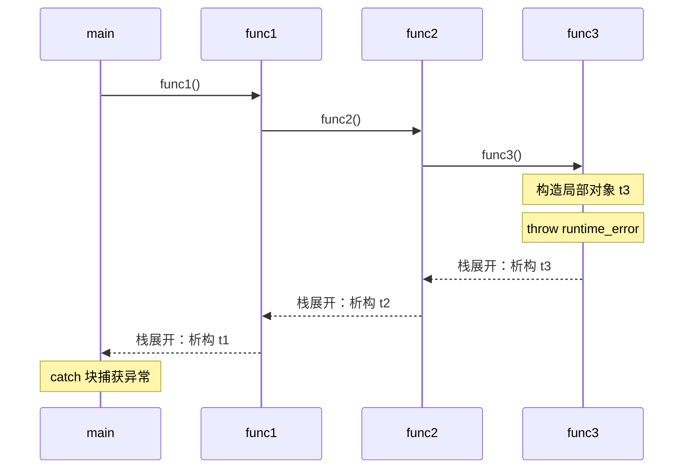

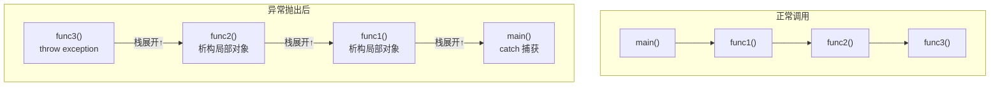

**栈展开的关键行为**：

1. 从 `throw` 点开始，逐层退出函数调用栈
2. 每退出一个函数，该函数内所有**局部对象**的析构函数被调用
3. **析构顺序与构造顺序相反**（后构造的先析构）
4. 如果某个函数有 catch 块匹配，则在该 catch 块处继续执行
5. 如果直到 main() 也没有匹配的 catch，调用 `std::terminate()`

**栈展开期间的重要限制**：

- **不得在析构函数中抛出异常**：如果栈展开期间析构函数又抛出异常，且该异常没有被该析构函数自身捕获，则调用 `std::terminate()`
- 栈展开会"跳过"所有未执行的代码，直接跳到匹配的 catch 块

```cpp
// 危险：析构函数中抛出异常
class Dangerous {
public:
    ~Dangerous() {
        throw runtime_error("析构函数中的异常！");
        // 如果析构函数在栈展开期间被调用，程序终止！
    }
};

void test() {
    Dangerous d;
    throw runtime_error("另一个异常");
    // 栈展开时，~Dangerous() 抛出异常 → 两个异常同时存在 → terminate()
}
```

### 15.1.9 异常传播机制——更详细的图解

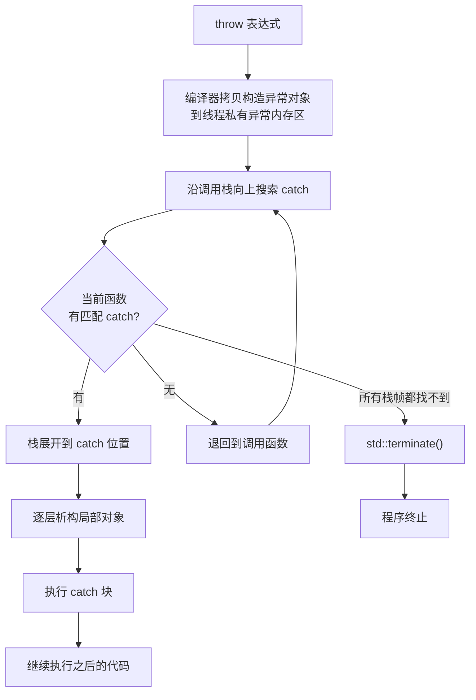

### 15.1.10 异常规范的历史：从 throw() 到 noexcept

#### C++98/03 时代：动态异常规范（Dynamic Exception Specification）

```cpp
// C++98 语法：在函数声明后列出可能抛出的异常类型
void func1() throw();                    // 不抛出任何异常
void func2() throw(int, const char*);    // 可能抛出 int 或 const char*
void func3() throw(...);                 // 可能抛出任何异常（等价于无声明）

// 如果函数抛出了不在列表中的异常 → 调用 unexpected()
// unexpected() 默认调用 terminate()
void func() throw(int) {
    throw "string";  // 运行时检查：抛出不在列表中的类型
    // → unexpected() → terminate()
}
```

**动态异常规范的问题**：

1. **运行时检查**：编译器在运行时检查异常类型，带来性能开销
2. **未完全实现**：编译器实现不统一，有的根本不检查
3. **模板不友好**：无法在模板中预先知道会抛出什么异常
4. **C++17 已移除**：该特性在 C++17 中被移除

#### C++11 及之后：noexcept

```cpp
// C++11 引入了 noexcept，替代 throw()
void func() noexcept;        // 保证不抛出异常
void func();                 // 可能抛出任何异常

// 如果 noexcept 函数内部抛出异常 → 直接调用 terminate()
// 没有栈展开（实现可以不展开栈）
```

**对比总结**：

| 特性 | 动态异常规范 `throw()` | `noexcept` |
|------|----------------------|------------|
| 语法 | `throw(type1, type2)` | `noexcept` |
| 检查时机 | 运行时 | 编译时声明，违反时运行时 terminate |
| 性能 | 有运行时开销 | 更小（编译器可优化） |
| 是否支持条件式 | 否 | 是 `noexcept(condition)` |
| 状态 | C++17 移除 | 现代 C++ 推荐 |

### 15.1.11 noexcept 运算符和 noexcept 函数

#### noexcept 运算符

`noexcept` 有两种用法：

1. **noexcept 说明符**（specifier）：声明函数是否会抛出异常
2. **noexcept 运算符**（operator）：编译时检查表达式是否为 noexcept

```cpp
#include <iostream>
using namespace std;

void mayThrow() {
    throw runtime_error("error");
}

void noThrow() noexcept {
    cout << "safe" << endl;
}

int main() {
    // noexcept 运算符：编译时求值
    cout << boolalpha;
    cout << noexcept(mayThrow()) << endl;  // false
    cout << noexcept(noThrow()) << endl;   // true
    
    // 注意：noexcept(表达式) 不会执行表达式，只是检查其异常说明
    
    // 条件式 noexcept
    cout << noexcept(1 + 2) << endl;       // true（基本类型操作从不抛异常）
    
    return 0;
}
```

#### 条件式 noexcept

```cpp
#include <iostream>
#include <type_traits>
using namespace std;

template <typename T>
void mySwap(T& a, T& b) noexcept(is_nothrow_swappable_v<T>) {
    // 只有当 T 的交换操作是 noexcept 时，mySwap 才是 noexcept
    T tmp = a;
    a = b;
    b = tmp;
}

// 另一种常见用法
template <typename T>
struct Wrapper {
    T value;
    
    // 只有当 T 的拷贝构造是 noexcept 时，才声明为 noexcept
    Wrapper(const Wrapper& other) noexcept(is_nothrow_copy_constructible_v<T>)
        : value(other.value) {}
    
    // 移动构造函数：通常有条件地 noexcept
    Wrapper(Wrapper&& other) noexcept(is_nothrow_move_constructible_v<T>)
        : value(move(other.value)) {}
};
```

#### 标准库中的 noexcept 工具

```cpp
#include <type_traits>
#include <utility>

// 类型萃取：检查操作是否为 noexcept
bool is_noexcept = is_nothrow_constructible_v<T, Args...>;
bool is_noexcept = is_nothrow_copy_constructible_v<T>;
bool is_noexcept = is_nothrow_move_constructible_v<T>;
bool is_noexcept = is_nothrow_assignable_v<T, U>;
bool is_noexcept = is_nothrow_swappable_v<T>;

// 条件 noexcept 的典型应用
template <typename T>
struct MyVector {
    // 移动构造函数：如果 T 的移动是 noexcept 则声明 noexcept
    MyVector(MyVector&& other) noexcept(
        is_nothrow_move_constructible_v<T>
    ) : data_(exchange(other.data_, nullptr)),
        size_(exchange(other.size_, 0)),
        capacity_(exchange(other.capacity_, 0)) {}
};
```

### 15.1.12 异常安全的三个级别

异常安全是指代码在发生异常时，能够保证某种程度的一致性。Herb Sutter 定义了三个级别：

#### 级别 1：基本保证（Basic Guarantee）

> 发生异常时，不泄露资源，所有对象处于**合法但不指定**的状态。

```cpp
#include <iostream>
#include <vector>
#include <stdexcept>
using namespace std;

class BasicGuarantee {
private:
    int* data;
    size_t size;
    
public:
    BasicGuarantee(size_t n) : data(new int[n]), size(n) {}
    
    ~BasicGuarantee() {
        delete[] data;  // 确保资源释放
    }
    
    // 基本保证：操作可能部分完成，但不泄露资源
    void resize(size_t newSize) {
        if (newSize == size) return;
        
        int* newData = new int[newSize];
        
        // 如果下面的循环抛出异常，资源会被释放吗？
        for (size_t i = 0; i < newSize; ++i) {
            newData[i] = (i < size) ? data[i] : 0;
        }
        // 注意：此处的 new 如果失败，会抛出 bad_alloc
        // 但已分配的内存由 unique_ptr 管理则安全
        
        delete[] data;      // 可能抛出异常吗？delete 通常是 nothrow
        data = newData;
        size = newSize;
    }
};
```

#### 级别 2：强保证（Strong Guarantee）

> 发生异常时，操作具有**事务语义**——要么完全成功，要么回滚到操作前的状态。

```cpp
#include <iostream>
#include <vector>
#include <algorithm>
using namespace std;

class StrongGuarantee {
private:
    vector<int> data;
    
public:
    // 强保证：使用 copy-and-swap 惯用法
    void addValue(int value) {
        vector<int> temp = data;   // 1. 拷贝（可能抛出 bad_alloc）
        temp.push_back(value);     // 2. 修改副本（可能抛出异常）
        data.swap(temp);           // 3. 交换（noexcept 操作）
        // 如果步骤 1 或 2 抛出异常，原数据未受影响
    }
    
    // 另一种方式：检查所有可能失败的操作，再修改状态
    void addValues(const vector<int>& values) {
        if (data.size() + values.size() > data.capacity()) {
            // 提前预留空间
            vector<int> temp;
            temp.reserve(data.size() + values.size());  // 可能抛出 bad_alloc
            temp = data;
            temp.insert(temp.end(), values.begin(), values.end());
            data.swap(temp);
        } else {
            // 已有足够容量，不会抛出异常
            data.insert(data.end(), values.begin(), values.end());
        }
    }
};
```

**关键模式：copy-and-swap**

```cpp
class CopyAndSwapExample {
private:
    int* data;
    size_t size;
    
    // 交换操作必须是 noexcept
    void swap(CopyAndSwapExample& other) noexcept {
        using std::swap;
        swap(data, other.data);
        swap(size, other.size);
    }
    
public:
    // 拷贝赋值运算符实现强异常安全
    CopyAndSwapExample& operator=(const CopyAndSwapExample& other) {
        // 1. 拷贝构造一个临时对象
        CopyAndSwapExample temp(other);   // 可能抛出异常
        // 2. 交换（noexcept）
        swap(temp);
        // 3. 临时对象析构时释放旧资源
        return *this;
    }
    
    // 或者更简洁的写法：传值
    CopyAndSwapExample& operator=(CopyAndSwapExample other) noexcept {
        // 按值传递：拷贝发生在函数调用时（可能在栈展开时抛出）
        swap(other);  // noexcept
        return *this;
    }
    
    ~CopyAndSwapExample() {
        delete[] data;
    }
};
```

#### 级别 3：不抛保证（Nothrow Guarantee）

> 操作**永远不会抛出异常**，总是成功完成。

```cpp
// Nothrow 保证的操作
int add(int a, int b) noexcept {
    return a + b;  // 基本类型操作从不抛异常
}

// noexcept 关键字明确声明不抛异常
void cleanup() noexcept {
    // 释放资源、关闭文件等操作
}

// 标准库中的 noexcept 操作
// std::swap 对于许多类型是 noexcept 的
// 移动构造函数通常有条件 noexcept
// 析构函数默认 noexcept
```

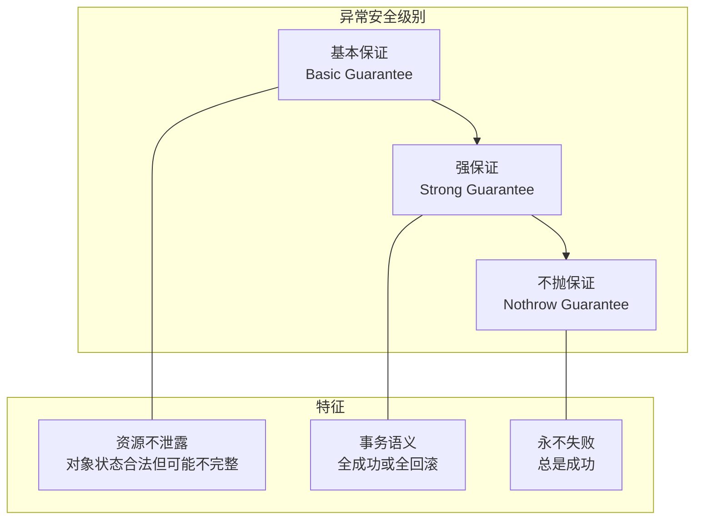

**异常安全级别的选择**：

```cpp
// 根据上下文选择适当的异常安全级别

// 不需要提供强保证：仅内部使用的函数
void internalUpdate(int x) {
    data.push_back(x);  
    // 基本保证即可，调用者知道可能部分完成
}

// 需要强保证：对外接口
void insertAt(size_t pos, int value) {
    // 使用 copy-and-swap 保证强异常安全
    auto temp = data;
    temp.insert(temp.begin() + pos, value);
    data.swap(temp);
}

// 不抛保证：析构函数和 swap
~MyClass() noexcept {
    delete[] buffer_;
    closeFile();
}

void swap(MyClass& other) noexcept {
    using std::swap;
    swap(ptr_, other.ptr_);
    swap(size_, other.size_);
}
```

### 15.1.13 异常处理的性能开销分析

异常处理的设计目标是：**正常情况下零开销，异常情况下才付出代价**（Zero-Cost Exception Handling）。

#### 正常路径（没有异常发生）的开销

```cpp
// 现代 C++ 编译器使用 "zero-cost" 异常处理模型
void func() {
    try {
        doWork();  // 无异常时的开销：零（或无额外开销）
    } catch (const exception& e) {
        handleError(e);
    }
}
```

- **现代实现（Itanium ABI / SEH）**：无 try-catch 时代码无额外开销；有 try 块时额外开销极小（建立异常表数据）
- **旧实现（基于 setjmp/longjmp）**：进入 try 块时有开销（保存上下文）

#### 抛出异常时的开销

```cpp
// 抛出异常的代价：相对较高
void func() {
    if (error) {
        throw runtime_error("error");  
        // 1. 分配异常对象内存
        // 2. 拷贝异常对象
        // 3. 栈展开（查找 catch 块、析构局部对象）
        // 4. 比正常返回慢 100-1000 倍
    }
}
```

**异常开销具体分析**：

| 开销来源 | 说明 | 量级 |
|----------|------|------|
| 异常对象构造 | 拷贝构造异常对象 | 小（通常几十字节） |
| 栈展开 | 遍历调用栈，查找 catch 块 | 取决于栈深度 |
| 析构函数调用 | 逐层调用局部对象的析构函数 | 取决于局部对象数量 |
| 动态内存分配 | 异常对象存储在堆上 | 中等 |
| 异常表查找 | 查表确定 catch 块位置 | 中等 |

**总体建议**：

1. 不要将异常用于控制流（如 `throw` 作为返回值）
2. 异常应该用于**真正异常的情况**（文件不存在、网络断开等）
3. 性能关键的循环内部避免抛出异常
4. 使用 RAII 管理资源以减少异常处理的复杂度

```cpp
// ❌ 错误：用异常模拟返回值
int parseNumber(const string& s) {
    try {
        return stoi(s);
    } catch (...) {
        return 0;
    }
}

// ✅ 正确：用正常方式处理预期情况
int parseNumber(const string& s) {
    size_t pos;
    int result = stoi(s, &pos);
    if (pos != s.size()) {
        // 不是完整转换，处理错误
    }
    return result;
}
```

### 15.1.14 RAII（资源获取即初始化）详解

RAII（Resource Acquisition Is Initialization）是 C++ 中资源管理的核心实践，也是异常安全的基础。

```cpp
#include <iostream>
#include <fstream>
#include <memory>
#include <stdexcept>
using namespace std;

#### RAII 的核心原则

1. **资源在构造函数中获取**（初始化时获取）
2. **资源在析构函数中释放**（销毁时自动释放）
3. **资源所有权唯一明确**（谁持有谁负责释放）

#### 常见 RAII 包装

| C++ 标准库 RAII 类 | 管理的资源 |
|-------------------|-----------|
| `std::unique_ptr<T>` | 单个对象或数组的动态内存 |
| `std::shared_ptr<T>` | 共享所有权的动态内存 |
| `std::vector<T>` | 动态数组 |
| `std::string` | 字符缓冲区 |
| `std::fstream` | 文件句柄 |
| `std::lock_guard` | 互斥锁 |
| `std::thread` | 线程句柄 |

#### RAII 在异常安全中的作用

```cpp
// ❌ 非 RAII：手动资源管理，异常不安全
void badFunc() {
    int* p = new int[100];
    // ... 如果这里抛出异常，p 永远不会被释放！
    delete[] p;
}

// ✅ RAII：使用 unique_ptr，自动释放
void goodFunc() {
    unique_ptr<int[]> p(new int[100]);
    // ... 即使抛出异常，unique_ptr 的析构函数也会释放内存
    // 栈展开时会调用 ~unique_ptr()
}

// ✅ RAII：使用 vector，更简洁
void betterFunc() {
    vector<int> v(100);
    // ... 完全自动管理
}
```

#### 自定义 RAII 类

```cpp
#include <iostream>
using namespace std;

// 文件操作的 RAII 包装
class FileHandle {
private:
    FILE* file;
    
public:
    FileHandle(const char* filename, const char* mode) 
        : file(fopen(filename, mode)) {
        if (!file) {
            throw runtime_error(string("无法打开文件: ") + filename);
        }
    }
    
    // 析构函数释放资源（noexcept 保证）
    ~FileHandle() noexcept {
        if (file) {
            fclose(file);
        }
    }
    
    // 禁用拷贝
    FileHandle(const FileHandle&) = delete;
    FileHandle& operator=(const FileHandle&) = delete;
    
    // 允许移动（转移所有权）
    FileHandle(FileHandle&& other) noexcept : file(other.file) {
        other.file = nullptr;
    }
    
    // 读写操作
    void write(const string& data) {
        if (fputs(data.c_str(), file) == EOF) {
            throw runtime_error("写入文件失败");
        }
    }
    
    string read(size_t size) {
        char* buf = new char[size + 1];
        // 注意：如果此处抛出异常，buf 会泄露
        // 应该使用 vector<char> 或 unique_ptr
        unique_ptr<char[]> bufGuard(buf);
        
        if (!fgets(buf, size, file)) {
            throw runtime_error("读取文件失败");
        }
        return string(buf);
    }
};

// 互斥锁的 RAII 包装
class LockGuard {
private:
    mutex& mtx;
    
public:
    explicit LockGuard(mutex& m) : mtx(m) {
        mtx.lock();     // 构造时加锁
    }
    
    ~LockGuard() noexcept {
        mtx.unlock();   // 析构时解锁
    }
    
    LockGuard(const LockGuard&) = delete;
    LockGuard& operator=(const LockGuard&) = delete;
};
```

---

## 15.2 RTTI（运行时类型识别）

### 15.2.1 RTTI 的概念

**RTTI（Run-Time Type Identification）**：在运行时确定对象的实际类型。C++ 提供两种 RTTI 机制：

1. `typeid` 运算符：获取类型信息
2. `dynamic_cast` 运算符：安全向下转型

```cpp
#include <iostream>
#include <typeinfo>    // typeid 需要
using namespace std;

class Animal {
public:
    virtual void speak() const = 0;
    virtual ~Animal() {}
};

class Dog : public Animal {
public:
    void speak() const override { cout << "汪汪！" << endl; }
    void wagTail() { cout << "摇尾巴" << endl; }
};

class Cat : public Animal {
public:
    void speak() const override { cout << "喵喵！" << endl; }
    void purr() { cout << "打呼噜" << endl; }
};

int main() {
    Animal* animals[] = {new Dog(), new Cat(), new Dog()};
    
    for (Animal* a : animals) {
        a->speak();  // 多态
        
        // 使用 typeid 获取类型信息
        cout << "类型: " << typeid(*a).name() << endl;
        
        // 使用 dynamic_cast 进行安全的向下转型
        Dog* dog = dynamic_cast<Dog*>(a);
        if (dog) {
            dog->wagTail();  // 只有 Dog 能摇尾巴
        }
        
        Cat* cat = dynamic_cast<Cat*>(a);
        if (cat) {
            cat->purr();     // 只有 Cat 能打呼噜
        }
        
        delete a;
    }
    
    return 0;
}
```

### 15.2.2 typeid 运算符的详细工作原理

```cpp
#include <iostream>
#include <typeinfo>
using namespace std;

// typeid 的基本形式
const type_info& typeid(类型);       // 作用于类型
const type_info& typeid(表达式);     // 作用于表达式

// typeid 的行为取决于操作数是否为多态类型

struct NonPolymorphic {
    int x;
};

struct PolymorphicBase {
    virtual ~PolymorphicBase() {}
};

struct Derived : PolymorphicBase {
    int y;
};

int main() {
    // 1. 作用于类型
    cout << typeid(int).name() << endl;           // int（实现定义格式）
    cout << typeid(double).name() << endl;        // double
    cout << typeid(string).name() << endl;        // std::string
    
    // 2. 作用于非多态类型：编译时确定，返回静态类型
    NonPolymorphic np;
    NonPolymorphic& npRef = np;
    cout << typeid(npRef).name() << endl;         // NonPolymorphic（编译期决定）
    
    // 3. 作用于多态类型：运行时确定，返回动态类型
    PolymorphicBase* ptr = new Derived();
    cout << typeid(*ptr).name() << endl;          // Derived（运行时决定）
    // 等效于
    const type_info& ti = typeid(*ptr);
    cout << ti.name() << endl;
    
    // 4. typeid 对指针直接作用（不是解引用）时返回指针的静态类型
    PolymorphicBase* basePtr = new Derived();
    cout << typeid(basePtr).name() << endl;       // PolymorphicBase*（指针类型，不是指向的类型）
    
    // 5. typeid 不会抛出异常——但如果解引用空指针且是多态类型
    // PolymorphicBase* nullPtr = nullptr;
    // typeid(*nullPtr);  // 抛出 bad_typeid 异常
    
    delete ptr;
    delete basePtr;
    
    return 0;
}
```

**typeid 的工作原理**：

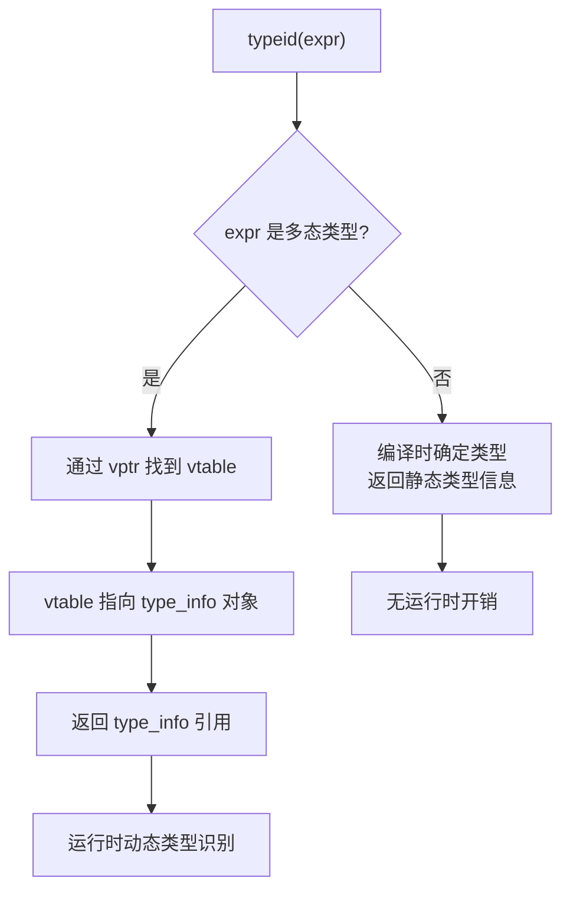

### 15.2.3 type_info 类的接口

```cpp
#include <typeinfo>

class type_info {
public:
    virtual ~type_info() noexcept;
    
    // 类型比较
    bool operator==(const type_info& rhs) const noexcept;
    bool operator!=(const type_info& rhs) const noexcept;
    
    // 类型排序（可用于 map 的键）
    bool before(const type_info& rhs) const noexcept;
    
    // 返回类型名称（实现定义的格式）
    const char* name() const noexcept;
    
    // C++11：返回类型哈希值
    size_t hash_code() const noexcept;
    
private:
    // 实现定义，拷贝构造和赋值被禁用
    type_info(const type_info&) = delete;
    type_info& operator=(const type_info&) = delete;
};
```

**使用示例**：

```cpp
#include <iostream>
#include <typeinfo>
#include <unordered_map>
#include <string>
using namespace std;

class Base { virtual ~Base() {} };
class Derived1 : public Base {};
class Derived2 : public Base {};

int main() {
    Base* b1 = new Derived1();
    Base* b2 = new Derived2();
    Base* b3 = new Derived1();
    
    // 类型比较
    cout << boolalpha;
    cout << (typeid(*b1) == typeid(*b2)) << endl;   // false
    cout << (typeid(*b1) == typeid(*b3)) << endl;   // true
    
    // before() 用于排序
    cout << typeid(int).before(typeid(double)) << endl;
    
    // hash_code() 用于哈希表
    unordered_map<size_t, string> typeMap;
    typeMap[typeid(int).hash_code()] = "int";
    typeMap[typeid(double).hash_code()] = "double";
    
    // name() 返回值是实现定义的
    cout << typeid(int).name() << endl;           // 可能是 "i" 或 "int"
    cout << typeid(Derived1).name() << endl;      // 实现定义
    
    delete b1;
    delete b2;
    delete b3;
    
    return 0;
}
```

### 15.2.4 typeid 与虚函数的关系

```cpp
#include <iostream>
#include <typeinfo>
using namespace std;

// 关键规则：只有多态类型（至少有一个虚函数）才能通过引用/指针获得动态类型

class BaseNoVirtual {
public:
    void foo() {}
};

class DerivedNoVirtual : public BaseNoVirtual {
public:
    void bar() {}
};

class BaseWithVirtual {
public:
    virtual ~BaseWithVirtual() {}
};

class DerivedWithVirtual : public BaseWithVirtual {
public:
    void extra() {}
};

int main() {
    // 无虚函数：typeid 返回静态类型
    BaseNoVirtual* p1 = new DerivedNoVirtual();
    cout << typeid(*p1).name() << endl;  // BaseNoVirtual（静态类型）
    // 即使 p1 实际指向 DerivedNoVirtual，typeid 仍报告 BaseNoVirtual
    
    // 有虚函数：typeid 返回动态类型
    BaseWithVirtual* p2 = new DerivedWithVirtual();
    cout << typeid(*p2).name() << endl;  // DerivedWithVirtual（动态类型）
    
    // 类型比较与虚函数无关
    if (typeid(*p2) == typeid(DerivedWithVirtual)) {
        cout << "p2 指向 DerivedWithVirtual" << endl;
    }
    
    // 引用也是同样的规则
    BaseWithVirtual& r2 = *p2;
    cout << typeid(r2).name() << endl;  // DerivedWithVirtual
    
    delete p1;
    delete p2;
    
    return 0;
}
```

### 15.2.5 dynamic_cast 运算符的详细规则

```cpp
#include <iostream>
#include <typeinfo>
using namespace std;

// dynamic_cast 的基本语法：
// dynamic_cast<目标类型*>(指针)   → 返回指针，失败返回 nullptr
// dynamic_cast<目标类型&>(引用)   → 返回引用，失败抛出 bad_cast

class Base {
public:
    virtual ~Base() = default;
    virtual void identify() const { cout << "Base" << endl; }
};

class Derived1 : public Base {
public:
    void identify() const override { cout << "Derived1" << endl; }
    void derived1Method() { cout << "Derived1 specific" << endl; }
};

class Derived2 : public Base {
public:
    void identify() const override { cout << "Derived2" << endl; }
    void derived2Method() { cout << "Derived2 specific" << endl; }
};

// 多继承情况
class GrandDerived : public Derived1, public Derived2 {
public:
    void identify() const override { cout << "GrandDerived" << endl; }
};

void processObject(Base* b) {
    // 指针版本的 dynamic_cast
    Derived1* d1 = dynamic_cast<Derived1*>(b);
    if (d1) {
        cout << "这是 Derived1 类型";
        d1->derived1Method();
    }
    
    Derived2* d2 = dynamic_cast<Derived2*>(b);
    if (d2) {
        cout << "这是 Derived2 类型";
        d2->derived2Method();
    }
    
    if (!d1 && !d2) {
        cout << "未知派生类型";
    }
}

void processObjectRef(Base& b) {
    // 引用版本的 dynamic_cast（失败抛异常）
    try {
        Derived1& d1 = dynamic_cast<Derived1&>(b);
        cout << "这是 Derived1 引用";
        d1.derived1Method();
    } catch (const bad_cast& e) {
        cout << "不是 Derived1: " << e.what() << endl;
    }
    
    try {
        Derived2& d2 = dynamic_cast<Derived2&>(b);
        cout << "这是 Derived2 引用";
        d2.derived2Method();
    } catch (const bad_cast& e) {
        cout << "不是 Derived2: " << e.what() << endl;
    }
}
```

**dynamic_cast 的规则总结**：

| 场景 | 行为 |
|------|------|
| 向上转型（派生类→基类） | 始终成功，编译器可优化为 static_cast |
| 向下转型（基类→派生类） | 运行时检查，成功返回派生类指针，失败返回 nullptr |
| 横向转型（兄弟类之间） | 运行时检查，支持（多继承下） |
| 指针类型失败 | 返回 `nullptr` |
| 引用类型失败 | 抛出 `std::bad_cast` 异常 |
| 非多态类型 | 编译错误（没有虚函数表） |

### 15.2.6 dynamic_cast 的实现机制

```cpp
// dynamic_cast 的实现依赖于虚函数表（vtable）
// 每个多态对象都有一个指向 vtable 的指针（vptr）
// vtable 中存储了 type_info 对象的地址

class Base {
public:
    virtual ~Base() {}
    // 编译器隐式添加的成员（概念上）：
    // vptr → vtable → type_info for Base
};

class Derived : public Base {
public:
    void derivedMethod() {}
    // vptr → vtable → type_info for Derived
};
```

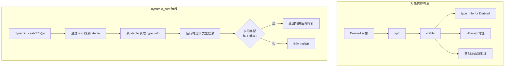

**性能考虑**：

```cpp
// dynamic_cast 的性能特征
// 1. 需要访问 vptr/vtable（一次间接寻址）
// 2. 需要进行类型字符串比较或整数比较
// 3. 在多继承下更复杂（需要遍历继承链）
// 4. 比 static_cast 慢得多（可能慢 10-100 倍）

// 性能优化建议：
// 1. 优先使用虚函数代替 dynamic_cast
// 2. 如果必须使用，缓存类型信息
// 3. 避免在性能关键路径上使用

// ✅ 使用虚函数（推荐）
class Shape {
public:
    virtual void draw() = 0;
    virtual ~Shape() = default;
};

// ❌ 使用 dynamic_cast 分支（不推荐）
void render(Shape* s) {
    if (auto* c = dynamic_cast<Circle*>(s)) {
        c->drawCircle();
    } else if (auto* r = dynamic_cast<Rectangle*>(s)) {
        r->drawRectangle();
    }
}

// ✅ 使用虚函数（推荐）
void render(Shape* s) {
    s->draw();  // 多态，无需 RTTI
}
```

### 15.2.7 RTTI 的开销和禁用方法

#### RTTI 的开销

1. **空间开销**：
   - 每个多态类生成一个 `type_info` 对象
   - 每个有虚函数的类需要额外的指针指向 `type_info`
   - 可执行文件大小增加

2. **时间开销**：
   - `typeid` 和 `dynamic_cast` 需要运行时类型比较
   - `dynamic_cast` 可能涉及继承链的遍历

#### 禁用 RTTI

在编译器中可以禁用 RTTI：

```bash
# GCC/Clang
g++ -fno-rtti main.cpp -o main

# MSVC
cl /GR- main.cpp
```

**禁用 RTTI 后的影响**：

```cpp
// 禁用 RTTI 后：
// 1. typeid 不可用（编译错误）
// 2. dynamic_cast 不可用（编译错误）
// 3. 异常处理仍然有效（异常处理不依赖 RTTI）

// 禁用 RTTI 的场景：
// - 嵌入式系统（代码大小受限）
// - 游戏开发（性能关键）
// - 固件开发

// 在禁用 RTTI 的环境中如何实现类似功能？
class Typeable {
public:
    virtual ~Typeable() = default;
    virtual int typeId() const = 0;  // 手工实现类型标识
};

class Dog : public Typeable {
public:
    static constexpr int kTypeId = 1;
    int typeId() const override { return kTypeId; }
};

class Cat : public Typeable {
public:
    static constexpr int kTypeId = 2;
    int typeId() const override { return kTypeId; }
};

void process(Typeable* obj) {
    if (obj->typeId() == 1) {
        // 处理 Dog
    } else if (obj->typeId() == 2) {
        // 处理 Cat
    }
}
```

---

## 15.3 类型转换运算符

### 15.3.1 四种类型转换概述

C++ 提供了四种命名的类型转换运算符，替代 C 风格的类型转换：

| 运算符 | 用途 | 安全性 | 运行时开销 |
|--------|------|--------|-----------|
| `static_cast` | 相关类型之间的转换 | 编译时检查 | 无 |
| `dynamic_cast` | 多态类层次中的向下/横向转换 | 运行时检查 | 有（RTTI） |
| `const_cast` | 移除/添加 const 或 volatile | 手动保证 | 无 |
| `reinterpret_cast` | 不安全的底层重解释 | 危险 | 无 |

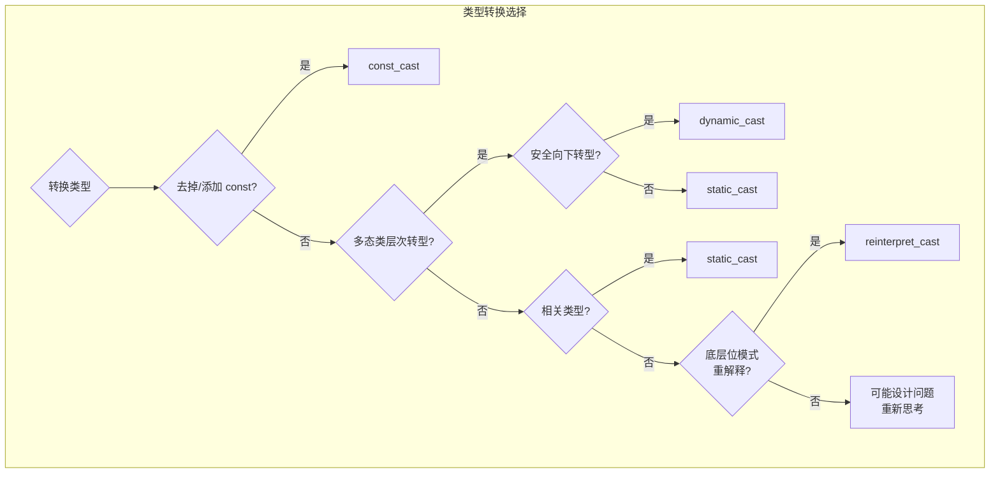

### 15.3.2 static_cast 的各种使用场景

```cpp
#include <iostream>
#include <vector>
using namespace std;

// static_cast 是最常用的类型转换运算符
// 编译时完成，无运行时开销

int main() {
    // 1. 基本类型转换
    double d = 3.14159;
    int i = static_cast<int>(d);         // double → int（截断）
    char c = static_cast<char>(i + 48);  // int → char
    
    cout << "double: " << d << ", int: " << i << ", char: " << c << endl;
    
    // 2. 枚举类型与整数之间的转换
    enum Color { RED, GREEN, BLUE };
    Color color = GREEN;
    int colorValue = static_cast<int>(color);  // 枚举 → int
    Color color2 = static_cast<Color>(2);       // int → 枚举（BLUE）
    
    cout << "colorValue: " << colorValue << ", color2: " << color2 << endl;
    
    // 3. void* 与其他指针之间的转换
    int value = 42;
    void* vp = &value;
    int* ip = static_cast<int*>(vp);     // void* → 具体类型指针
    cout << "通过 void* 恢复: " << *ip << endl;
    
    // 4. 类层次中的向上转型（隐式转换的显式形式）
    struct Base { virtual ~Base() {} };
    struct Derived : Base {};
    
    Derived d_obj;
    Base* bp = static_cast<Base*>(&d_obj);  // 向上转型（安全）
    
    // 5. 类层次中的向下转型（无运行时检查，不安全！）
    Base b_obj;
    // Derived* dp = static_cast<Derived*>(&b_obj);  // 编译通过但危险！
    // dp->derivedMethod();  // 未定义行为！
    
    // 6. 将浮点数转换为整数以进行位操作
    float f = 3.14f;
    int bits = *static_cast<int*>(static_cast<void*>(&f));
    // 注意：更好的方式是使用 memcpy 或 bit_cast（C++20）
    
    // 7. 在重载决议中消除歧义
    void func(int);
    void func(double);
    // func(3.14);       // 二义性错误（两个重载都匹配）
    // func(static_cast<int>(3.14));  // ✅ 显式转换为 int，调用 func(int)
    
    return 0;
}
```

**static_cast 不可用的场景**：

```cpp
// 1. 不能去掉 const（用 const_cast）
const int x = 10;
// int* p = static_cast<int*>(&x);  // ❌ 编译错误

// 2. 不能在不同类型指针之间直接转换（用 reinterpret_cast）
int a = 10;
// char* cp = static_cast<char*>(&a);  // ❌ 编译错误

// 3. 不能在不相关的类之间转换
class A {};
class B {};
A a;
// B* bp = static_cast<B*>(&a);  // ❌ 编译错误
```

### 15.3.3 dynamic_cast 的实现机制和全面分析

```cpp
#include <iostream>
#include <typeinfo>
using namespace std;

// dynamic_cast 的实现机制
// 编译器为每个多态类维护运行时类型信息
// 这些信息存储在 vtable 中

class Top {
public:
    virtual ~Top() = default;
};

class Middle : public Top {
public:
    virtual void middleMethod() {}
};

class Bottom : public Middle {
public:
    void bottomMethod() {}
};

// 多继承场景
class Interface1 {
public:
    virtual ~Interface1() = default;
    virtual void method1() = 0;
};

class Interface2 {
public:
    virtual ~Interface2() = default;
    virtual void method2() = 0;
};

class Concrete : public Interface1, public Interface2 {
public:
    void method1() override { cout << "method1" << endl; }
    void method2() override { cout << "method2" << endl; }
};

void multiInheritanceCast() {
    Concrete c;
    
    // 向上转型（隐式转换）
    Interface1* i1 = &c;
    Interface2* i2 = &c;
    
    // 交叉转型（cross-cast）：dynamic_cast 可以在兄弟类之间转换
    Interface2* i2_from_i1 = dynamic_cast<Interface2*>(i1);
    if (i2_from_i1) {
        i2_from_i1->method2();  // ✅ 成功！dynamic_cast 调整了指针
    }
    
    // static_cast 不能做交叉转型
    // Interface2* i2_static = static_cast<Interface2*>(i1); // ❌ 编译错误
}

// 指针调整（Pointer Adjustment）
// 在多继承中，dynamic_cast 可能需要调整指针偏移
// 这是因为不同基类的子对象在内存中的位置不同
```

**dynamic_cast 的指针调整机制**：

```cpp
#include <iostream>
using namespace std;

struct A { int a; virtual ~A() = default; };
struct B { int b; virtual ~B() = default; };
struct C : A, B { int c; };

// 内存布局（概念上）：
// C 对象 = [A部分(含vptr)] [B部分(含vptr)] [C部分]
//          ^-- C* 和 A* 指向这里          ^-- B* 指向这里

void pointerAdjustment() {
    C c_obj;
    C* cp = &c_obj;
    
    A* ap = cp;  // 隐式转换：指向 A 子对象（与 cp 相同地址）
    B* bp = cp;  // 隐式转换：指向 B 子对象（地址偏移 sizeof(A)）
    
    // 从 A* 到 B* 需要调整指针偏移
    B* bp_from_a = dynamic_cast<B*>(ap);  // ✅ cross-cast
    // 相当于：bp_from_a = (B*)((char*)ap + offset_to_B_subobject)
    
    cout << "cp = " << cp << endl;
    cout << "ap = " << ap << endl;
    cout << "bp = " << bp << endl;
    cout << "bp_from_a = " << bp_from_a << endl;
    // bp 和 bp_from_a 应该指向相同地址
}
```

### 15.3.4 const_cast 的正确和错误用法

```cpp
#include <iostream>
#include <cstring>
using namespace std;

// const_cast 的唯一用途：添加或移除 const/volatile 限定符

#### 正确用法

// 1. 调用旧版 C 函数（知道该函数不修改数据）
void old_c_function(char* str) {
    // 假设这个函数不修改字符串内容
    cout << "old: " << str << endl;
}

void correctUsage() {
    const char* msg = "Hello";
    // old_c_function(msg);         // ❌ 编译错误：const char* → char*
    old_c_function(const_cast<char*>(msg));  // ✅ 明确说明"我知道这不修改"
}

// 2. 在需要 const 正确性的重载中
class TextBuffer {
private:
    char* buffer;
    size_t size;
    
public:
    // const 版本：返回 const char*
    const char& operator[](size_t index) const {
        return buffer[index];
    }
    
    // 非 const 版本：返回 char&
    char& operator[](size_t index) {
        // 复用 const 版本的实现，避免代码重复
        return const_cast<char&>(
            static_cast<const TextBuffer&>(*this)[index]
        );
    }
};

// 3. 在只读访问中临时添加 const
void readOnly(const int* p) {
    cout << *p << endl;
}

void anotherCorrectUsage() {
    int value = 42;
    readOnly(&value);  // 隐式添加 const
    
    // 使用 const_cast 去 const 化也很常见的情况：
    // 当你有一个 const 引用但你确定底层对象不是 const
    int actual = 100;
    const int& ref = actual;
    const_cast<int&>(ref) = 200;  // ✅ 正确，actual 本身不是 const
    cout << actual << endl;      // 200
}

#### 错误用法

// 1. 修改真正 const 的对象（未定义行为）
void badUsage1() {
    const int x = 10;
    int* p = const_cast<int*>(&x);
    *p = 20;  // ❌ 未定义行为！x 原本就是 const
    // 可能：程序崩溃、值不变、或看似正常工作
    cout << x << ", " << *p << endl;  // 可能输出 "10, 20" 或 "20, 20"
}

// 2. 通过 const_cast 修改 string 字面量（未定义行为）
void badUsage2() {
    const char* str = "Hello";
    char* p = const_cast<char*>(str);
    // p[0] = 'h';  // ❌ 未定义行为！字符串字面量可能在只读内存中
}

// 3. 用 const_cast 绕过函数的设计意图
void badUsage3() {
    struct Data {
        mutable int cache;
        int expensiveComputation() const {
            // mutable 成员可以在 const 函数中修改
            cache = 42;
            return cache;
        }
    };
}
```

**const_cast 黄金法则**：

> 如果对象原本是 const 的，通过 const_cast 移除 const 并修改是**未定义行为**。
> 如果对象原本不是 const 的，只是通过 const 指针/引用访问，const_cast 是安全的。

```cpp
// ✅ 安全：z 本身不是 const
int z = 30;
const int* cp = &z;        // 通过 const 指针访问
int* rp = const_cast<int*>(cp);
*rp = 40;                   // ✅ 没问题，z 本身不是 const

// ❌ 不安全：y 本身是 const
const int y = 20;
int* q = const_cast<int*>(&y);
*q = 30;                    // ❌ 未定义行为！
```

### 15.3.5 reinterpret_cast 在底层编程中的使用

```cpp
#include <iostream>
#include <cstring>
using namespace std;

// reinterpret_cast：最危险的转换——重新解释底层位模式
// 不进行任何类型检查，只是告诉编译器"把这段内存当作另一种类型"

int main() {
    // 1. 检查内存表示（endianness）
    int x = 0x12345678;
    char* bytes = reinterpret_cast<char*>(&x);
    
    cout << "int 0x12345678 的内存表示（小端序）: ";
    for (size_t i = 0; i < sizeof(int); ++i) {
        cout << hex << static_cast<int>(bytes[i]) << " ";
    }
    cout << dec << endl;
    // 小端序输出: 78 56 34 12
    // 大端序输出: 12 34 56 78
    
    // 2. 硬件编程：访问特定内存地址
    // unsigned long addr = 0xB8000;  // VGA 文本模式显存地址
    // char* video_memory = reinterpret_cast<char*>(addr);
    // video_memory[0] = 'A';  // 在屏幕上显示 'A'
    
    // 3. 序列化/反序列化
    struct PacketHeader {
        uint32_t length;
        uint16_t type;
        uint16_t checksum;
    };
    
    char buffer[1024];
    // 将字节缓冲区重新解释为包头部
    PacketHeader* header = reinterpret_cast<PacketHeader*>(buffer);
    header->length = 100;
    header->type = 1;
    // 注意：需要处理对齐问题！
    
    // 4. 函数指针之间的转换（极不推荐）
    void (*funcPtr)(int) = [](int x) { cout << x << endl; };
    // 将函数指针转换为 void*
    // void* p = reinterpret_cast<void*>(funcPtr);  // 实现定义行为
    
    // 5. 整数和指针之间的转换
    uintptr_t addr_val = reinterpret_cast<uintptr_t>(&x);
    int* ptr_back = reinterpret_cast<int*>(addr_val);
    cout << "原始: " << &x << ", 恢复: " << ptr_back << endl;
    
    return 0;
}
```

**reinterpret_cast 的使用原则**：

```cpp
// ✅ 相对安全的场景
// 1. 将结构体指针转换为 char* 进行字节操作
struct MyData { int a; double b; };
MyData data;
char* raw = reinterpret_cast<char*>(&data);
memcpy(raw, some_source, sizeof(MyData));

// 2. 指针与足够大的整数类型之间的转换
// 使用 uintptr_t（定义在 <cstdint>），它保证能容纳指针
uintptr_t ptr_val = reinterpret_cast<uintptr_t>(&data);

// ❌ 危险的场景
// 1. 将一种对象指针转换为不相关类型后解引用（违反 strict aliasing 规则）
float f = 3.14f;
// int* bad = reinterpret_cast<int*>(&f);
// *bad = 0;  // ❌ 未定义行为（strict aliasing violation）

// 2. 将某个类型的指针转换后修改（破坏类型系统）
struct A { int x; };
struct B { double y; };
A a;
// B* pb = reinterpret_cast<B*>(&a);
// pb->y = 3.14;  // ❌ 灾难！内存布局不兼容

// 3. 对齐要求不满足的转换
char buf[sizeof(double) + alignof(double)];
double* dp = reinterpret_cast<double*>(buf);  // 可能未对齐
// *dp = 3.14;  // ❌ 如果 buf 未对齐到 alignof(double)，未定义行为
```

### 15.3.6 C 风格转换 vs C++ 命名转换的编译行为差异

```cpp
#include <iostream>
using namespace std;

// C 风格转换 (T)expr 的行为：
// 依次尝试：const_cast → static_cast → static_cast + const_cast → reinterpret_cast → reinterpret_cast + const_cast
// 最终会成功（只要能找到一条路径）

// C++ 命名转换：每个转换有明确的目的

class Base { virtual ~Base() = default; };
class Derived : public Base {};

int main() {
    // 1. 意图明确度
    double d = 3.14;
    int i1 = (int)d;                     // C 风格：是为了截断？还是为了其他？
    int i2 = static_cast<int>(d);        // C++ 风格：明确是 static_cast
    
    // 2. 搜索性
    // "static_cast(" → 容易找到代码中所有的相关类型转换
    // "(int)" → 太多误报（转型、函数定义、C 风格变量声明...）
    
    // 3. 编译器检查程度
    const int x = 10;
    // int* p1 = static_cast<int*>(&x);   // ❌ 编译错误：static_cast 不能去掉 const
    int* p2 = (int*)&x;                   // ✅ 编译通过：C 风格偷偷做了 const_cast
    
    // 4. 转换的安全性
    Base b;
    Derived* dp1 = (Derived*)&b;          // ✅ 编译通过（危险！无检查）
    // Derived* dp2 = static_cast<Derived*>(&b);  // 编译通过但行为未定义
    // Derived* dp3 = dynamic_cast<Derived*>(&b);  // ✅ 返回 nullptr（安全）
    
    // 5. 不相关类型之间的转换
    int* ip = &i1;
    // double* dp = static_cast<double*>(ip);       // ❌ 编译错误
    double* dp = (double*)ip;                       // ✅ 编译通过（危险！）
    // *dp = 3.14;  // ❌ 未定义行为
    
    return 0;
}
```

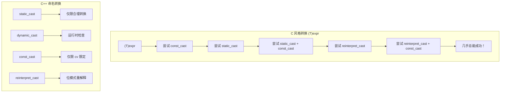

**总结：为什么优先使用 C++ 命名转换**：

| 比较维度 | C 风格转换 | C++ 命名转换 |
|---------|-----------|-------------|
| 意图明确 | 模糊（可能做多种转换） | 精确（每种转换做一件事） |
| 代码搜索 | 难以搜索 | 容易搜索（`static_cast<`） |
| 编译器检查 | 几乎不检查 | 尽量检查，阻止错误 |
| 安全性 | 不安全（可能误转换） | 相对安全 |
| 学习成本 | 低 | 较高（需要四个关键字） |

---

## 15.4 友元类与友元成员函数

### 15.4.1 友元类

一个类可以声明另一个类为友元，友元类可以访问本类的所有私有成员。

```cpp
#include <iostream>
#include <string>
using namespace std;

class Account {
private:
    string owner;
    double balance;
    
    // 声明 Bank 为友元类
    friend class Bank;
    
public:
    Account(const string& name, double init)
        : owner(name), balance(init) {}
};

class Bank {
public:
    void showAccount(const Account& acc) {
        // ✅ 友元类可以访问私有成员
        cout << "账户所有者: " << acc.owner << endl;
        cout << "余额: " << acc.balance << endl;
    }
    
    void deposit(Account& acc, double amount) {
        if (amount > 0) {
            acc.balance += amount;  // ✅ 修改私有成员
        }
    }
    
    void withdraw(Account& acc, double amount) {
        if (amount > 0 && amount <= acc.balance) {
            acc.balance -= amount;  // ✅ 修改私有成员
        }
    }
};
```

**友元类的注意事项**：

1. 友元关系是**单向的**：A 是 B 的友元，不代表 B 是 A 的友元
2. 友元关系**不可传递**：A 是 B 的友元，B 是 C 的友元，不代表 A 是 C 的友元
3. 友元关系**不可继承**：如果 B 是 A 的友元，B 的派生类不自动成为 A 的友元

```cpp
class A {
private:
    int secret;
    friend class B;  // B 是友元
};

class B {
    void accessA(A& a) {
        a.secret = 42;  // ✅ 友元可以访问
    }
};

class D : public B {
    void accessA(A& a) {
        // a.secret = 42;  // ❌ 友元关系不继承
    }
};

class C {
    void accessA(A& a) {
        // a.secret = 42;  // ❌ 不是友元
    }
};
```

### 15.4.2 友元成员函数

不想把整个类设为友元时，可以只将某个成员函数设为友元。

```cpp
#include <iostream>
using namespace std;

// 前向声明（必须！）
class A;

class B {
public:
    // 在 A 的定义之前声明
    void accessA(A& a, int value);
    void otherMethod();  // 这个不是友元
};

class A {
private:
    int data;
    
    // 只有 B::accessA 是友元，不是整个 B 类
    friend void B::accessA(A& a, int value);
    
public:
    A() : data(0) {}
};

// 必须在 A 的定义之后实现 B::accessA
void B::accessA(A& a, int value) {
    a.data = value;  // ✅ 可以访问私有成员
    cout << "通过友元成员函数设置 data = " << a.data << endl;
}

void B::otherMethod() {
    // A a;
    // a.data = 42;  // ❌ 不是友元，不能访问
}

int main() {
    A a;
    B b;
    b.accessA(a, 100);  // ✅ 友元函数
    
    return 0;
}
```

**友元成员函数的步骤**：

1. 前向声明包含私有成员的类（`class A;`）
2. 定义友元类，声明要作为友元的成员函数
3. 在私有成员类中声明 `friend void B::memberFunction(...);`
4. 在私有成员类的完整定义之后实现友元成员函数

### 15.4.3 友元与运算符重载的深入结合

友元函数是运算符重载的重要工具，特别是当运算符的左侧操作数不是当前类的对象时。

```cpp
#include <iostream>
using namespace std;

class Complex {
private:
    double real;
    double imag;
    
public:
    Complex(double r = 0, double i = 0) : real(r), imag(i) {}
    
    // 成员函数版本的运算符重载
    Complex operator+(const Complex& other) const {
        return Complex(real + other.real, imag + other.imag);
    }
    
    // 友元函数声明
    friend Complex operator*(double scalar, const Complex& c);
    friend ostream& operator<<(ostream& os, const Complex& c);
    friend istream& operator>>(istream& is, Complex& c);
    
    // 显示结果
    void display() const {
        cout << real << (imag >= 0 ? "+" : "") << imag << "i" << endl;
    }
};

// 友元函数定义：标量乘法（左操作数是 double）
Complex operator*(double scalar, const Complex& c) {
    return Complex(scalar * c.real, scalar * c.imag);
    // ✅ 友元函数可以直接访问私有成员
}

// 友元函数定义：输出运算符
ostream& operator<<(ostream& os, const Complex& c) {
    os << c.real;
    if (c.imag >= 0) os << "+";
    os << c.imag << "i";
    return os;
}

// 友元函数定义：输入运算符
istream& operator>>(istream& is, Complex& c) {
    cout << "实部: ";
    is >> c.real;
    cout << "虚部: ";
    is >> c.imag;
    return is;
}

int main() {
    Complex c1(3, 4);
    Complex c2(1, 2);
    
    // 成员函数版本
    Complex c3 = c1 + c2;         // c1.operator+(c2)
    cout << "c1 + c2 = " << c3 << endl;
    
    // 友元函数版本（左操作数是 double）
    Complex c4 = 2.0 * c1;        // operator*(2.0, c1)
    cout << "2 * c1 = " << c4 << endl;
    
    // 输入
    Complex c5;
    cout << "输入复数:" << endl;
    cin >> c5;
    cout << "你输入了: " << c5 << endl;
    
    return 0;
}
```

**运算符重载中友元 vs 成员函数的选择**：

| 运算符 | 推荐方式 | 原因 |
|--------|---------|------|
| `=` `[]` `()` `->` | 成员函数 | 语言规定必须为成员 |
| `+=` `-=` 等复合赋值 | 成员函数 | 修改左操作数 |
| 一元运算符（`++` `--`） | 成员函数 | 操作自身 |
| 二元运算符（`+` `-` `*` `/`） | 非成员（可能友元） | 支持左右操作数类型不对称 |
| `<<` `>>` | 友元 | 左操作数是 stream，不是本类对象 |
| `==` `!=` `<` `>` 等比较 | 非成员（可能友元） | 支持两侧隐式转换 |

### 15.4.4 友元与继承的交互

```cpp
#include <iostream>
using namespace std;

class Base {
private:
    int privateData = 1;
    
protected:
    int protectedData = 2;
    
public:
    int publicData = 3;
    
    friend class FriendOfBase;
};

class FriendOfBase {
public:
    void accessBase(Base& b) {
        cout << "privateData: " << b.privateData << endl;    // ✅ 友元
        cout << "protectedData: " << b.protectedData << endl; // ✅ 友元
        cout << "publicData: " << b.publicData << endl;       // ✅ 友元
    }
};

class Derived : public Base {
private:
    int derivedPrivate = 4;
};

// 友元不继承
class FriendOfBaseDerived : public FriendOfBase {
public:
    void accessBase(Base& b) {
        // b.privateData;   // ❌ 友元关系不继承
        // b.protectedData; // ❌ 友元关系不继承（但可以通过继承关系访问）
    }
};

// 如果想访问派生类的私有成员，需要在派生类中也声明友元
class Base2 {
private:
    int baseSecret;
    friend class SelectiveFriend;
};

class Derived2 : public Base2 {
private:
    int derivedSecret;
    // SelectiveFriend 只能访问 Base2 的私有成员
    // 不能访问 Derived2 的私有成员
    // 除非在 Derived2 中也声明 friend class SelectiveFriend;
};

class SelectiveFriend {
public:
    void access(Base2& b) {
        // b.baseSecret;  // ✅ 可以（Base2 的友元）
    }
    
    void access(Derived2& d) {
        // d.baseSecret;     // ✅ 可以（Base2 的友元）
        // d.derivedSecret;  // ❌ 不可以（不是 Derived2 的友元）
    }
};
```

### 15.4.5 友元的设计权衡

```cpp
// 使用友元的优点：
// 1. 更细粒度的访问控制（友元成员函数）
// 2. 支持二元运算符的对称操作
// 3. 实现某些设计模式需要（如 Bridge、Iterator）

// 使用友元的缺点：
// 1. 破坏封装性
// 2. 增加类之间的耦合
// 3. 降低可维护性（修改一个类可能影响友元类）

#include <iostream>
using namespace std;

// 案例：矩阵和向量运算
// 使用友元实现灵活的运算符重载

class Vector;  // 前向声明

class Matrix {
private:
    double data[4][4];
    
public:
    Matrix() {
        for (auto& row : data)
            for (double& elem : row)
                elem = 0;
    }
    
    // 声明友元函数
    friend Vector operator*(const Matrix& m, const Vector& v);
    friend Vector operator*(const Vector& v, const Matrix& m);
    
    // 设置值
    void set(int row, int col, double value) {
        data[row][col] = value;
    }
};

class Vector {
private:
    double elements[4];
    
    friend Vector operator*(const Matrix& m, const Vector& v);
    friend Vector operator*(const Vector& v, const Matrix& m);
    
public:
    Vector() {
        for (double& elem : elements) elem = 0;
    }
    
    void set(int index, double value) {
        elements[index] = value;
    }
};

// 矩阵 × 向量
Vector operator*(const Matrix& m, const Vector& v) {
    Vector result;
    for (int i = 0; i < 4; ++i) {
        result.elements[i] = 0;
        for (int j = 0; j < 4; ++j) {
            result.elements[i] += m.data[i][j] * v.elements[j];
        }
    }
    return result;
}

// 向量 × 矩阵
Vector operator*(const Vector& v, const Matrix& m) {
    Vector result;
    for (int j = 0; j < 4; ++j) {
        result.elements[j] = 0;
        for (int i = 0; i < 4; ++i) {
            result.elements[j] += v.elements[i] * m.data[i][j];
        }
    }
    return result;
}
```

**友元的替代方案**：

```cpp
// 方案 1：提供公共访问接口（setter/getter）
class Data {
private:
    int secret;
    
public:
    int getSecret() const { return secret; }
    void setSecret(int s) { secret = s; }
};

// 方案 2：提供受保护的虚函数，由派生类重写
class Processor {
protected:
    virtual int getData() const = 0;
    
public:
    void process() {
        int data = getData();
        // 处理 data
    }
};

// 方案 3：使用 "Key" 模式——只有持有 Key 的代码才能访问
class Key {
    friend class DataOwner;
    Key() {}  // 只有 DataOwner 能构造 Key
};

class DataOwner {
private:
    int secret;
    
public:
    void exposeSecret(Key) {  // 只有能传递 Key 的代码才能调用
        // 访问 secret
    }
};
```

---

## 15.5 替代异常处理方案

### 15.5.1 错误码（Error Codes）

```cpp
#include <iostream>
#include <system_error>
using namespace std;

// 传统错误码
enum class FileErrorCode {
    Success = 0,
    NotFound,
    PermissionDenied,
    ReadError,
    WriteError
};

pair<FileErrorCode, string> readFile(const string& path) {
    if (path.empty()) {
        return {FileErrorCode::NotFound, ""};
    }
    // ... 读文件
    return {FileErrorCode::Success, "file content"};
}

// C++11 的 error_code
error_code openFile(const string& filename) {
    // 模拟失败
    return make_error_code(errc::no_such_file_or_directory);
}

int main() {
    auto [ec, content] = readFile("test.txt");
    if (ec != FileErrorCode::Success) {
        cerr << "读文件失败" << endl;
        return 1;
    }
    
    error_code ec2 = openFile("config.ini");
    if (ec2) {
        cerr << "错误: " << ec2.message() << endl;
    }
    
    return 0;
}
```

### 15.5.2 std::optional（C++17）

```cpp
#include <iostream>
#include <optional>
#include <string>
using namespace std;

// std::optional 表示"可能有值，也可能没有"
// 适合：操作可能失败但不是错误的情况

optional<int> safeDivide(int a, int b) {
    if (b == 0) {
        return nullopt;  // 返回空 optional
    }
    return a / b;  // 返回值被包裹
}

optional<string> findUser(int id) {
    if (id <= 0) {
        return nullopt;
    }
    // 假设查找成功
    return "User_" + to_string(id);
}

int main() {
    // 使用 1：直接检查
    auto result = safeDivide(10, 0);
    if (result) {
        cout << "结果: " << *result << endl;
    } else {
        cout << "除以零" << endl;
    }
    
    // 使用 2：提供默认值
    int val = safeDivide(10, 3).value_or(-1);
    cout << "val = " << val << endl;
    
    // 使用 3：链式调用
    auto user = findUser(42);
    cout << "用户: " << user.value_or("未知") << endl;
    
    // 使用 4：访问成员
    if (user.has_value()) {
        cout << "用户长度: " << user->size() << endl;
    }
    
    return 0;
}
```

### 15.5.3 std::expected（C++23）

```cpp
#include <iostream>
#include <expected>
#include <string>
#include <system_error>
using namespace std;

// std::expected<T, E> 可以包含一个值 T 或一个错误 E
// 比 optional 多提供了错误信息

enum class ParseError {
    InvalidInput,
    Overflow,
    EmptyString
};

expected<int, ParseError> parseNumber(const string& s) {
    if (s.empty()) {
        return unexpected(ParseError::EmptyString);
    }
    
    char* end;
    long val = strtol(s.c_str(), &end, 10);
    
    if (*end != '\0') {
        return unexpected(ParseError::InvalidInput);
    }
    
    if (val > INT_MAX || val < INT_MIN) {
        return unexpected(ParseError::Overflow);
    }
    
    return static_cast<int>(val);
}

// 使用 expected 进行链式错误处理
expected<double, string> compute(double x, double y) {
    if (y == 0) {
        return unexpected("除以零");
    }
    return x / y;
}

expected<double, string> process(double a, double b) {
    // 使用 and_then 链式组合
    return compute(a, b).and_then([](double result) {
        if (result < 0) {
            return expected<double, string>(unexpected("负数结果"));
        }
        return expected<double, string>(result);
    });
}

int main() {
    // 基本使用
    auto result = parseNumber("42");
    if (result) {
        cout << "解析成功: " << *result << endl;
    } else {
        switch (result.error()) {
            case ParseError::EmptyString:
                cout << "空字符串" << endl;
                break;
            case ParseError::InvalidInput:
                cout << "无效输入" << endl;
                break;
            case ParseError::Overflow:
                cout << "溢出" << endl;
                break;
        }
    }
    
    // 链式处理
    auto procResult = process(10, 2);
    cout << "process结果: " << procResult.value_or(0) << endl;
    
    // 错误传递
    auto procResult2 = process(10, 0);
    if (!procResult2) {
        cout << "错误: " << procResult2.error() << endl;
    }
    
    return 0;
}
```

### 15.5.4 各种错误处理方式的对比

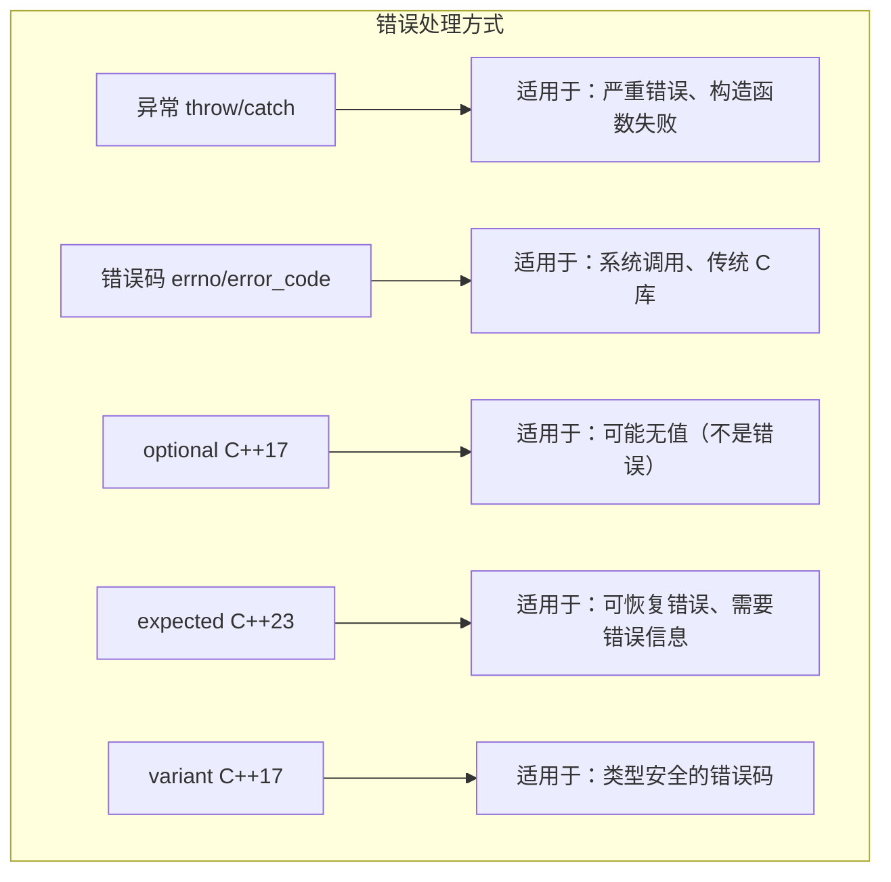

| 方式 | 性能 | 错误信息 | 强制处理 | 适用场景 |
|------|------|----------|---------|---------|
| 异常 | 正常路径零开销，异常路径慢 | 丰富（类型+消息） | 是（不处理则终止） | 严重错误，构造函数 |
| 错误码 | 低 | 有限 | 否 | 系统调用，频繁失败 |
| optional | 低 | 无（只表名失败） | 否（可忽略） | 查找未找到，可能无值 |
| expected | 低 | 丰富 | 否（可忽略） | 可恢复错误，工业代码 |
| assert | 无（发布版） | 无 | 调试时终止 | 前置条件，内部检查 |

```cpp
// 选择指南
// 1. 如果是编程错误（bug）：assert
// 2. 如果是可恢复且频繁：expected 或 optional
// 3. 如果是不可恢复或构造函数失败：异常
// 4. 如果与 C 代码交互：错误码
```

---

## 15.6 noexcept 的最佳实践

### 何时标记 noexcept

```cpp
#include <iostream>
#include <vector>
#include <type_traits>
using namespace std;

// 1. 移动构造函数和移动赋值运算符
// 标准库容器在重新分配内存时，如果移动构造是 noexcept 的，会优先使用移动而非拷贝
class MyString {
private:
    char* data;
    size_t size;
    
public:
    // 移动构造函数应该标记 noexcept
    MyString(MyString&& other) noexcept
        : data(exchange(other.data, nullptr))
        , size(exchange(other.size, 0)) {}
    
    // 移动赋值应该标记 noexcept
    MyString& operator=(MyString&& other) noexcept {
        if (this != &other) {
            delete[] data;
            data = exchange(other.data, nullptr);
            size = exchange(other.size, 0);
        }
        return *this;
    }
    
    // 析构函数隐式 noexcept
    ~MyString() noexcept {
        delete[] data;
    }
};

// 2. swap 函数
class DataBuffer {
private:
    int* buf;
    size_t len;
    
public:
    friend void swap(DataBuffer& a, DataBuffer& b) noexcept {
        using std::swap;
        swap(a.buf, b.buf);
        swap(a.len, b.len);
    }
};

// 3. 永远不会失败的操作
int getValue() noexcept {
    return 42;  // 基本类型返回不抛异常
}

// 4. 查询/获取操作（不修改状态）
size_t size() const noexcept { return len; }
bool empty() const noexcept { return len == 0; }

// 5. 清理/释放操作
void close() noexcept {
    // 关闭文件，释放资源
}

// 6. 简单访问器/Getter
int getData() const noexcept { return data; }
```

### 不应该标记 noexcept 的情况

```cpp
// 1. 可能分配内存的操作
void process() {
    // new/malloc 可能抛出 bad_alloc
    auto* p = new int[100];
    // 不应该标记 noexcept（除非能处理 bad_alloc）
}

// 2. 调用可能抛出异常的函数
void readConfig() {
    ifstream file("config.txt");
    if (!file) {
        throw runtime_error("无法打开配置文件");
    }
}

// 3. 模板函数（不知道模板参数是否抛异常）
template <typename T>
void processValue(T&& val) {
    // 不应该无条件 noexcept
    // 应该使用条件 noexcept
}

// 4. 复杂业务逻辑
void complexOperation() {
    // 很多步骤可能失败
    step1();  // 可能抛异常
    step2();  // 可能抛异常
}
```

### noexcept 对标准库优化的影响

```cpp
#include <iostream>
#include <vector>
#include <type_traits>
using namespace std;

struct NonNoexceptMove {
    NonNoexceptMove() = default;
    NonNoexceptMove(NonNoexceptMove&&) {
        cout << "移动构造（可能抛异常）" << endl;
    }
    NonNoexceptMove(const NonNoexceptMove&) {
        cout << "拷贝构造" << endl;
    }
};

struct NoexceptMove {
    NoexceptMove() = default;
    NoexceptMove(NoexceptMove&&) noexcept {
        cout << "移动构造（noexcept）" << endl;
    }
    NoexceptMove(const NoexceptMove&) {
        cout << "拷贝构造" << endl;
    }
};

int main() {
    cout << "=== 非 noexcept 移动 ===" << endl;
    vector<NonNoexceptMove> v1;
    v1.push_back(NonNoexceptMove{});  // 第一次添加
    
    // 当 vector 扩容时，因为没有 noexcept 移动保证
    // 标准库会选择拷贝代替移动（为了强异常安全保证）
    cout << "扩容时: ";
    v1.push_back(NonNoexceptMove{});  // 扩容 → 拷贝！
    
    cout << "\n=== noexcept 移动 ===" << endl;
    vector<NoexceptMove> v2;
    v2.push_back(NoexceptMove{});     // 第一次添加
    cout << "扩容时: ";
    v2.push_back(NoexceptMove{});     // 扩容 → 移动！
    
    return 0;
}
```

**关键规则**：标准库容器在重新分配时，如果元素类型的移动构造函数是 `noexcept` 的，会使用移动；否则使用拷贝（即使移动更高效，但如果移动可能抛出异常，容器无法保证强异常安全）。

### noexcept 的运行时行为

```cpp
#include <iostream>
using namespace std;

// noexcept 函数抛异常 → 调用 terminate()
void safeFunc() noexcept {
    cout << "safeFunc 运行中..." << endl;
    throw runtime_error("意外异常！");
    // noexcept 函数内抛出异常 → terminate()
}

// 条件 noexcept
template <typename T>
void conditionalFunc() noexcept(noexcept(T())) {
    T t;  // 如果 T() 是 noexcept，则此函数也是 noexcept
}

int main() {
    cout << "测试 noexcept 函数抛异常:" << endl;
    try {
        safeFunc();
    } catch (...) {
        // 永远不会到这里！
        cout << "永远不会执行" << endl;
    }
    
    return 0;
}
```

---

## 15.7 综合示例：异常安全的资源管理类

### 示例 1：简化版 unique_ptr

```cpp
#include <iostream>
#include <utility>
using namespace std;

template <typename T>
class SimpleUniquePtr {
private:
    T* ptr;
    
public:
    // 构造函数
    explicit SimpleUniquePtr(T* p = nullptr) noexcept : ptr(p) {}
    
    // 析构函数（noexcept 保证）
    ~SimpleUniquePtr() noexcept {
        delete ptr;
    }
    
    // 禁止拷贝
    SimpleUniquePtr(const SimpleUniquePtr&) = delete;
    SimpleUniquePtr& operator=(const SimpleUniquePtr&) = delete;
    
    // 移动构造函数（noexcept）
    SimpleUniquePtr(SimpleUniquePtr&& other) noexcept
        : ptr(exchange(other.ptr, nullptr)) {}
    
    // 移动赋值（noexcept）
    SimpleUniquePtr& operator=(SimpleUniquePtr&& other) noexcept {
        if (this != &other) {
            delete ptr;
            ptr = exchange(other.ptr, nullptr);
        }
        return *this;
    }
    
    // 运算符重载
    T& operator*() const noexcept { return *ptr; }
    T* operator->() const noexcept { return ptr; }
    explicit operator bool() const noexcept { return ptr != nullptr; }
    
    // 获取原始指针
    T* get() const noexcept { return ptr; }
    
    // 释放所有权
    T* release() noexcept {
        return exchange(ptr, nullptr);
    }
    
    // 重置
    void reset(T* p = nullptr) noexcept {
        delete exchange(ptr, p);
    }
};

// 使用示例
struct Resource {
    Resource() { cout << "Resource 构造" << endl; }
    ~Resource() { cout << "Resource 析构" << endl; }
    void doWork() { cout << "Resource 工作" << endl; }
};

void processResource() {
    SimpleUniquePtr<Resource> res(new Resource());
    res->doWork();
    // 即使这里抛出异常，Resource 也会被析构
    // throw runtime_error("处理错误");
    // 自动调用 ~SimpleUniquePtr() → delete Resource
}

int main() {
    try {
        processResource();
    } catch (...) {
        cout << "捕获异常，资源已安全释放" << endl;
    }
    
    // 移动语义
    SimpleUniquePtr<Resource> res1(new Resource());
    SimpleUniquePtr<Resource> res2 = move(res1);  // 转移所有权
    // res1 此时为 nullptr
    
    if (!res1) {
        cout << "res1 已为空" << endl;
    }
    
    return 0;
}
```

### 示例 2：异常安全的动态数组

```cpp
#include <iostream>
#include <utility>
#include <algorithm>
using namespace std;

template <typename T>
class SafeArray {
private:
    T* data;
    size_t capacity;
    size_t length;
    
    // 强异常安全的扩容
    void grow(size_t newCapacity) {
        // 1. 分配新内存（可能抛出 bad_alloc）
        T* newData = static_cast<T*>(operator new[](newCapacity * sizeof(T)));
        
        // 2. 尝试移动/拷贝旧元素到新内存
        size_t i = 0;
        try {
            // 对已存在的元素使用移动构造（如果 noexcept）
            for (; i < length; ++i) {
                new (newData + i) T(std::move_if_noexcept(data[i]));
            }
        } catch (...) {
            // 构造失败：销毁已构造的元素
            for (size_t j = 0; j < i; ++j) {
                (newData + j)->~T();
            }
            // 释放新内存
            operator delete[](newData);
            throw;  // 重新抛出
        }
        
        // 3. 销毁旧元素
        for (size_t i = 0; i < length; ++i) {
            data[i].~T();
        }
        
        // 4. 释放旧内存并更新指针
        operator delete[](data);
        data = newData;
        capacity = newCapacity;
    }
    
public:
    SafeArray() : data(nullptr), capacity(0), length(0) {}
    
    ~SafeArray() noexcept {
        for (size_t i = 0; i < length; ++i) {
            data[i].~T();
        }
        operator delete[](data);
    }
    
    // 禁止拷贝（简化）
    SafeArray(const SafeArray&) = delete;
    SafeArray& operator=(const SafeArray&) = delete;
    
    // 移动构造
    SafeArray(SafeArray&& other) noexcept
        : data(exchange(other.data, nullptr))
        , capacity(exchange(other.capacity, 0))
        , length(exchange(other.length, 0)) {}
    
    // 添加元素
    void push_back(const T& value) {
        if (length >= capacity) {
            grow(capacity == 0 ? 1 : capacity * 2);
        }
        new (data + length) T(value);  // placement new
        ++length;
    }
    
    void push_back(T&& value) {
        if (length >= capacity) {
            grow(capacity == 0 ? 1 : capacity * 2);
        }
        new (data + length) T(std::move(value));
        ++length;
    }
    
    // emplace_back：就地构造
    template <typename... Args>
    void emplace_back(Args&&... args) {
        if (length >= capacity) {
            grow(capacity == 0 ? 1 : capacity * 2);
        }
        new (data + length) T(std::forward<Args>(args)...);
        ++length;
    }
    
    size_t size() const noexcept { return length; }
    size_t cap() const noexcept { return capacity; }
    
    T& operator[](size_t index) { return data[index]; }
    const T& operator[](size_t index) const { return data[index]; }
};

// 测试
struct Item {
    int id;
    Item(int i) : id(i) { cout << "构造 Item(" << id << ")" << endl; }
    ~Item() { cout << "析构 Item(" << id << ")" << endl; }
    Item(const Item& other) : id(other.id) { cout << "拷贝 Item(" << id << ")" << endl; }
    Item(Item&& other) noexcept : id(other.id) { other.id = -1; cout << "移动 Item(" << id << ")" << endl; }
};

int main() {
    SafeArray<Item> arr;
    
    arr.emplace_back(1);
    arr.emplace_back(2);
    arr.emplace_back(3);
    
    cout << "数组大小: " << arr.size() << ", 容量: " << arr.cap() << endl;
    
    for (size_t i = 0; i < arr.size(); ++i) {
        cout << "arr[" << i << "] = Item(" << arr[i].id << ")" << endl;
    }
    
    return 0;
}
```

---

## 15.8 常见错误和陷阱

### 错误 1：在析构函数中抛出异常

```cpp
class BadDestructor {
public:
    ~BadDestructor() {
        throw runtime_error("析构函数异常");
        // 如果析构函数在栈展开期间被调用 → terminate()
        // 即使不是在栈展开时，析构函数抛异常也可能导致资源泄露
    }
};

void example1() {
    try {
        BadDestructor b;
        throw runtime_error("另一个异常");
        // 栈展开：~BadDestructor() 抛异常 → 两个异常共存 → terminate()
    } catch (...) {
        // 永远不会执行到这里
    }
}

// ✅ 正确做法：析构函数绝不抛出异常
class GoodDestructor {
public:
    ~GoodDestructor() noexcept {
        try {
            cleanup();  // 即使 cleanup 可能抛异常
        } catch (...) {
            // 在析构函数中处理所有异常
            // 记录日志等
        }
    }
    
    void cleanup() {
        // 可能抛异常的操作
    }
};
```

### 错误 2：按值捕获异常导致对象切片

```cpp
class BaseException : public exception {
public:
    const char* what() const noexcept override {
        return "BaseException";
    }
};

class DerivedException : public BaseException {
public:
    const char* what() const noexcept override {
        return "DerivedException";
    }
};

void example2() {
    try {
        throw DerivedException();
    } catch (BaseException e) {  // ❌ 按值捕获！对象切片
        cout << e.what() << endl;  // 输出 "BaseException" 而不是 "DerivedException"
    }
    
    // ✅ 正确：按引用捕获
    try {
        throw DerivedException();
    } catch (const BaseException& e) {  // ✅ 多态
        cout << e.what() << endl;  // 输出 "DerivedException"
    }
}
```

### 错误 3：在构造函数中抛出异常后资源泄露

```cpp
class LeakyResource {
private:
    int* buffer1;
    int* buffer2;
    
public:
    LeakyResource(size_t size) 
        : buffer1(new int[size])   // 分配成功
        , buffer2(new int[size])   // 如果这里抛出 bad_alloc
    {
        // buffer1 永远不会被释放！
    }
    
    ~LeakyResource() {
        delete[] buffer1;
        delete[] buffer2;
    }
};

// ✅ 正确：使用 RAII 成员
class SafeResource {
private:
    unique_ptr<int[]> buffer1;
    unique_ptr<int[]> buffer2;
    
public:
    SafeResource(size_t size)
        : buffer1(make_unique<int[]>(size))
        , buffer2(make_unique<int[]>(size))
        // 即使 buffer2 构造失败，buffer1 的析构函数会自动调用
    {}
    
    // 不需要手动析构函数
};
```

### 错误 4：在 catch 块中忽略异常信息

```cpp
void example4() {
    try {
        // 可能抛异常的操作
    }
    catch (const exception&) {  // 没有参数名
        // 处理了异常但无法获取错误信息
        cout << "发生错误" << endl;
    }
    
    // ✅ 应该获取异常信息
    try {
        // 操作
    } catch (const exception& e) {
        cerr << "错误: " << e.what() << endl;
        // 记录日志、通知用户等
    }
}
```

### 错误 5：对非多态类型使用 dynamic_cast

```cpp
class NonPolymorphic {
public:
    void foo() {}
    // 没有虚函数！
};

class DerivedNP : public NonPolymorphic {};

void example5() {
    NonPolymorphic* p = new DerivedNP();
    // dynamic_cast<DerivedNP*>(p);  // ❌ 编译错误！
    // 错误信息：'NonPolymorphic' is not polymorphic
    
    // ✅ 必须使用 static_cast（但无安全检查）
    auto* d = static_cast<DerivedNP*>(p);
}
```

### 错误 6：catch(...) 放在非最后位置

```cpp
void example6() {
    try {
        throw 42;
    } catch (...) {
        cout << "捕获所有" << endl;
    } catch (const char* msg) {  // ❌ 编译错误：永远不会被执行
        cout << msg << endl;
    }
    
    // ✅ 正确：catch(...) 必须放在最后
    try {
        throw 42;
    } catch (const char* msg) {
        cout << msg << endl;
    } catch (...) {
        cout << "其他异常" << endl;
    }
}
```

### 错误 7：异常用于控制流

```cpp
// ❌ 非常糟糕：用异常实现循环
int findInVector(const vector<int>& v, int target) {
    try {
        for (size_t i = 0; ; ++i) {
            if (v.at(i) == target) return i;
        }
    } catch (const out_of_range&) {
        return -1;  // 用异常退出循环！
    }
}

// ✅ 正确：正常循环
int findInVector(const vector<int>& v, int target) {
    for (size_t i = 0; i < v.size(); ++i) {
        if (v[i] == target) return i;
    }
    return -1;
}
```

### 错误 8：忽略 noexcept 对标准库容器的性能影响

```cpp
// 这个类的移动构造函数不是 noexcept
struct SlowMove {
    SlowMove() = default;
    SlowMove(SlowMove&&) {}  // 未标记 noexcept
    SlowMove(const SlowMove&) = default;
};

void example8() {
    vector<SlowMove> v;
    v.reserve(5);
    v.push_back(SlowMove{});
    v.push_back(SlowMove{});  // vector 扩容时：
    // 即使移动操作比拷贝快得多，但因为不保证 noexcept
    // 标准库会选择拷贝而不是移动
}
```

### 错误 9：在原始指针上使用异常

```cpp
void example9() {
    int* p = new int(42);
    // ... 如果这里抛出异常，p 泄露
    delete p;
    
    // ✅ 使用 RAII
    auto p2 = make_unique<int>(42);
    // ... 安全
}
```

### 错误 10：reinterpret_cast 破坏严格别名规则

```cpp
void example10() {
    float f = 3.14f;
    // ❌ 未定义行为：通过 int* 读写 float 对象
    int* p = reinterpret_cast<int*>(&f);
    cout << *p << endl;
    
    // ✅ 正确：使用 memcpy
    int i;
    static_assert(sizeof(f) == sizeof(i));
    memcpy(&i, &f, sizeof(f));
    
    // ✅ C++20：使用 bit_cast
    // int i2 = bit_cast<int>(f);
}
```

### 错误 11：使用 const_cast 修改真正 const 的对象

```cpp
void example11() {
    const int CONST_VALUE = 100;
    int* p = const_cast<int*>(&CONST_VALUE);
    *p = 200;  // ❌ 未定义行为！
    cout << CONST_VALUE << " " << *p << endl;
    // 可能输出 "100 200" 或 "200 200" — 不确定！
    
    // ✅ 如果确实需要可修改的值，就不要声明 const
    int mutable_value = 100;
}
```

### 错误 12：友元滥用导致设计脆弱

```cpp
// ❌ 过度使用友元
class Data {
private:
    int a, b, c, d, e;
    
    friend class ProcessorA;
    friend class ProcessorB;
    friend class ProcessorC;
    friend void helperFunction1();
    friend void helperFunction2();
    // ... 太多友元，封装性被完全破坏
};

// ✅ 提供明确的公共接口
class BetterData {
private:
    int a, b, c, d, e;
    
public:
    int getA() const { return a; }
    void setA(int val) { a = val; }
    // ... 明确定义的接口
};
```

### 错误 13：抛出指向局部对象的指针

```cpp
void example13() {
    local_error err;
    throw &err;  // ❌ 危险！throw 后 err 被销毁
    // catch 块得到的是悬空指针
    
    // ✅ 抛出对象而不是指针
    throw err;  // 按值抛出，拷贝到异常内存区
    
    // ✅ 或者抛出动态分配的对象（但谁负责释放？）
    throw new runtime_error("error");  // 不推荐
}
```

### 错误 14：忘记异常过滤顺序

```cpp
void example14() {
    try {
        throw derived_exception();
    } catch (const exception& e) {
        // 这个 catch 会捕获所有标准异常
        // 如果放在前面，后面的具体异常 catch 永远不会执行
    } catch (const derived_exception& e) {
        // ❌ 永远不会执行！
    }
    
    // ✅ 先捕获派生类，再捕获基类
    try {
        throw derived_exception();
    } catch (const derived_exception& e) {
        // 先匹配具体的
    } catch (const exception& e) {
        // 再匹配通用的
    }
}
```

### 错误 15：移动构造函数或析构函数缺少 noexcept

```cpp
struct Container {
    std::vector<int> data;
    
    // ❌ 移动构造函数应该是 noexcept
    Container(Container&& other) 
        : data(std::move(other.data)) {}
    
    // ✅ 正确
    Container(Container&& other) noexcept
        : data(std::move(other.data)) {}
    
    // ❌ 析构函数隐式 noexcept，但如果有复杂的析构逻辑
    // 确保不会在析构中抛异常
    ~Container() noexcept {
        cleanup();  // 确保 cleanup 不会抛异常
    }
};
```

---

## 15.9 动手练习

### 练习 1：基本异常处理

编写一个函数 `int safeDivide(int a, int b)`，当 `b == 0` 时抛出一个 `std::runtime_error`，否则返回 `a / b`。在 `main()` 中捕获并处理异常。

### 练习 2：多层异常

```cpp
// 调用链：main → processData → validateInput → checkValue
// checkValue 抛出异常
// 验证栈展开过程中所有局部对象的析构函数是否正确调用
// 输出析构顺序
```

### 练习 3：设计自定义异常类

设计一个 `DatabaseException` 类体系：

- `DatabaseException`（基类，继承 `runtime_error`）
- `ConnectionException`（连接失败）
- `QueryException`（查询失败）
- `TransactionException`（事务失败）

每个类都包含错误码和错误信息。

### 练习 4：异常安全的栈

实现一个异常安全的 `SafeStack<T>` 类，支持 `push`、`pop`、`top` 操作，提供强异常安全保证。使用 copy-and-swap 惯用法。

### 练习 5：RTTI 应用

```cpp
// 基类 Shape（虚函数 draw）
// 派生类：Circle、Rectangle、Triangle
// 使用 typeid 打印每个对象的实际类型
// 使用 dynamic_cast 进行安全向下转型
// 测试转换失败的情况
```

### 练习 6：类型转换练习

给定以下代码：

```cpp
int a = 42;
double b = 3.14;
const int c = 100;
void* ptr = &a;
```

使用正确的 C++ 转型运算符完成：
1. 将 `b` 转换为 `int`
2. 将 `ptr` 转换回 `int*`
3. 去掉 `c` 的 const 属性（注意：不要修改它！）
4. 将 `&a` 转换为 `char*` 以便查看其字节表示

### 练习 7：noexcept 分析

```cpp
template <typename T>
class Wrapper {
    T value;
public:
    // 请为以下函数正确添加 noexcept 声明（条件 noexcept）
    Wrapper(Wrapper&& other);
    Wrapper& operator=(Wrapper&& other);
    void swap(Wrapper& other);
};
```

### 练习 8：实现 RAII Lock

实现一个 `ScopedLock` 类，在构造时获取 `std::mutex`，在析构时释放。确保它是异常安全的。

### 练习 9：错误处理方式比较

实现一个 `ConfigParser`，从文件读取配置。分别使用三种方式实现错误处理：

1. 异常方式（抛出 `runtime_error`）
2. `std::optional` 方式
3. `std::expected` 方式（C++23）

比较三种方式的代码量和可读性。

### 练习 10：友元实现运算符重载

实现一个 `Fraction`（分数）类：

```cpp
class Fraction {
private:
    int numerator;
    int denominator;
    // 请添加适当的友元函数
public:
    // 构造函数、算术运算符、比较运算符、输入输出运算符
};
```

要求：
- `operator+`、`operator-`、`operator*`、`operator/` 作为非成员友元函数
- `operator<<` 和 `operator>>` 作为友元函数
- 支持 `int` 和 `Fraction` 的混合运算
- 约分到最简形式

### 练习 11：异常安全排序

实现一个函数 `void safeSort(vector<T>& v)`，使用快速排序或归并排序，要求：

- 比较操作可能抛出异常时，保证强异常安全
- 使用 copy-and-swap 技术
- 如果排序过程中抛出异常，原数组保持不变

### 练习 12：综合项目——银行账户系统

实现一个简单的银行账户系统：

```cpp
// 异常类
class InsufficientFunds : public runtime_error { /* ... */ };
class AccountNotFound : public runtime_error { /* ... */ };
class InvalidTransaction : public runtime_error { /* ... */ };

// 账户类
class Account {
    string accountNumber;
    double balance;
    vector<string> transactionHistory;
public:
    void deposit(double amount);   // 存款
    void withdraw(double amount);  // 取款（可能抛出 InsufficientFunds）
    void transfer(Account& to, double amount);  // 转账（强异常安全）
};

// 银行类
class Bank {
    vector<Account> accounts;
public:
    Account& openAccount(const string& name);
    void processTransactions(const vector<Transaction>& transactions);
    // 要求：所有操作都是异常安全的
};
```

---

## 15.10 本章总结

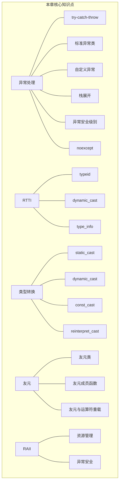

| 知识点 | 说明 | 掌握要求 |
|--------|------|----------|
| try-catch-throw | 异常处理基本结构 | **熟练掌握** |
| 标准异常类 | `std::exception` 及其派生类 | **会使用** |
| 自定义异常 | 继承 exception 设计异常类 | **会实现** |
| 栈展开 | 异常传播过程中的析构行为 | **深入理解** |
| RAII 与异常安全 | 三个级别的异常安全保证 | **理解并应用** |
| noexcept | 不抛异常声明及其优化效果 | **掌握使用** |
| RTTI、typeid | 运行时类型识别 | **了解原理** |
| dynamic_cast | 安全的向下转型和交叉转型 | **掌握使用** |
| static_cast | 相关类型之间的安全转换 | **熟练掌握** |
| const_cast | 添加/移除 const 限定 | **了解用途和风险** |
| reinterpret_cast | 底层位模式重解释 | **了解即可，避免使用** |
| 友元类/友元成员 | 更精细的访问控制 | **了解设计权衡** |
| 替代方案 | optional/expected/错误码 | **了解各自适用场景** |
| 异常安全实践 | 析构函数 noexcept、RAII | **理解并应用** |

### 关键经验法则

1. **异常处理**：抛出按值，捕获按引用；析构函数绝不抛异常；不用异常做控制流
2. **RAII**：资源管理的核心，也是异常安全的基础
3. **noexcept**：移动构造函数、swap、析构函数应该 noexcept
4. **类型转换**：优先使用 C++ 命名转换，避免 C 风格转换
5. **RTTI**：优先用虚函数代替 dynamic_cast
6. **友元**：谨慎使用，不要过度破坏封装
7. **异常安全目标**：至少提供基本保证，尽可能提供强保证

---

> **继续学习 → 第 16 章：string 类和标准模板库**
