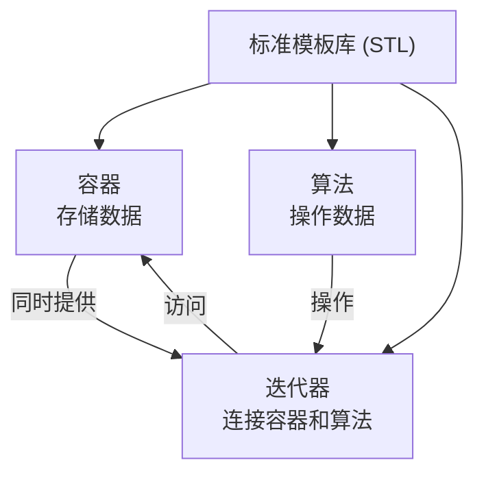
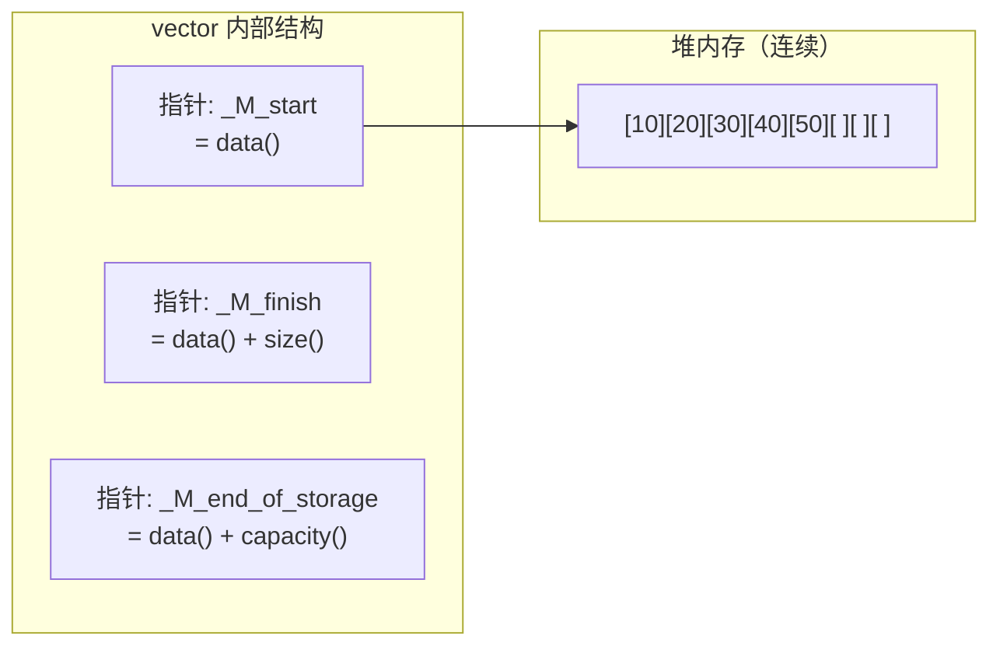
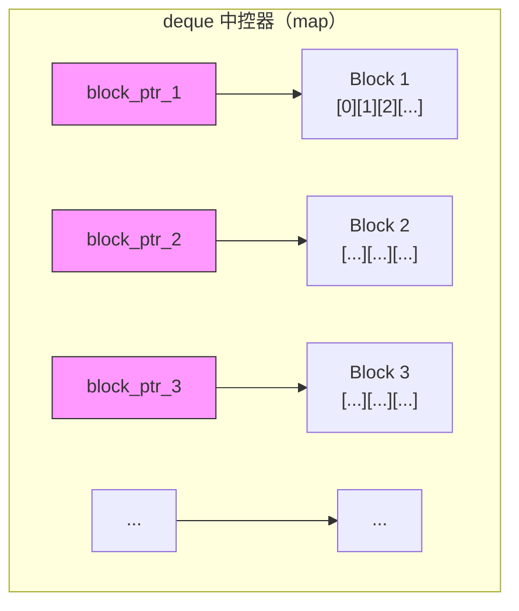
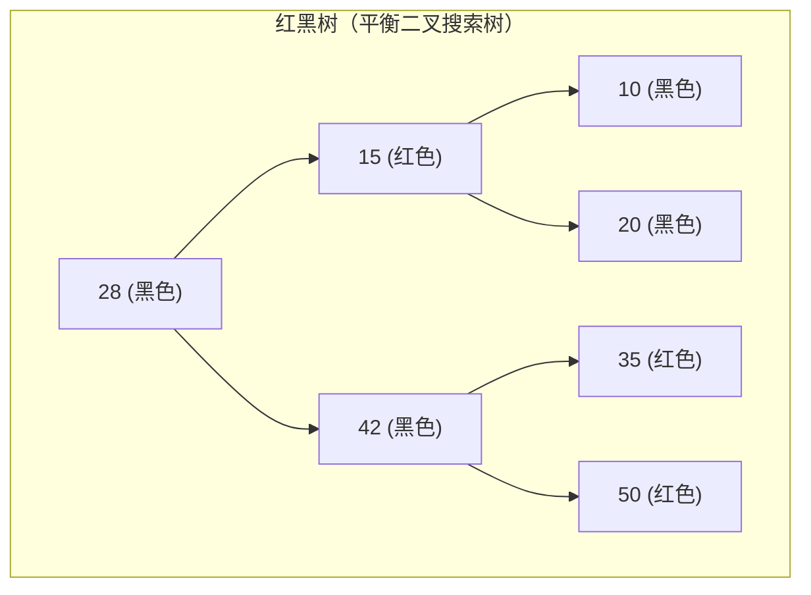
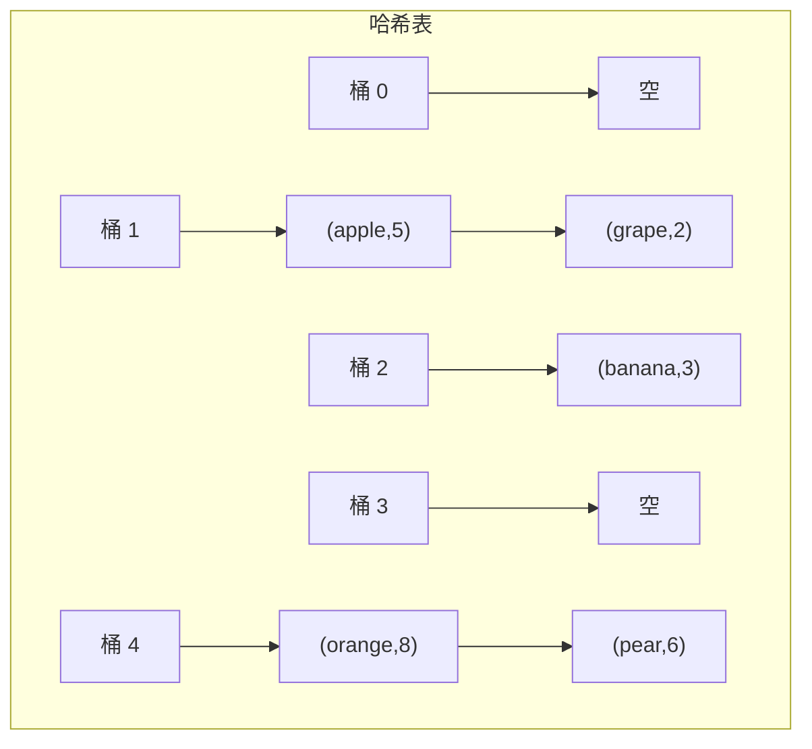
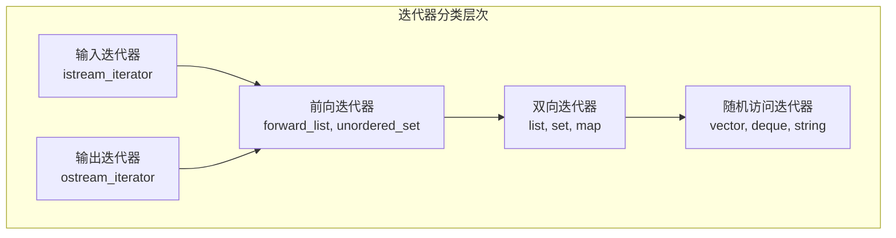

# 第 16 章：string 类和标准模板库（STL）

> **本章目标**: 深入掌握 C++ 标准库中的 `string` 类和标准模板库（STL）的核心组件——容器、迭代器、算法和函数对象，并了解性能优化、线程安全和常见陷阱。

---

## 16.1 string 类深入

### 16.1.1 string 类的构造

```cpp
#include <iostream>
#include <string>
using namespace std;

int main() {
    // 各种构造方式
    string s1;                     // 空字符串
    string s2("Hello");            // 从 C 风格字符串构造
    string s3(s2);                 // 复制构造
    string s4(5, 'H');             // "HHHHH"
    string s5(s2, 1, 3);          // "ell"（从位置 1 开始，取 3 个字符）
    string s6("Hello World", 5);  // "Hello"（取前 5 个字符）

    // C++11 初始化列表
    string s7{'H', 'e', 'l', 'l', 'o'};

    // 子串
    string s8 = s2.substr(1, 3);  // "ell"

    // C++14 字面量
    auto s9 = "Hello"s;           // 需要 using namespace std::literals

    cout << s2 << ", " << s4 << ", " << s5 << endl;

    return 0;
}
```

### 16.1.2 string 的容量操作

```cpp
string s = "Hello";

s.size();           // 5（字符数，等价于 length()）
s.length();         // 5
s.capacity();       // 当前容量（>= size）
s.empty();          // false
s.reserve(100);     // 预留容量
s.shrink_to_fit();  // C++11：缩减容量到合适大小
s.max_size();       // 理论上能分配的最大大小
```

### 16.1.3 string 的修改操作

```cpp
string s = "Hello";

// 赋值
s = "World";                // 直接赋值
s.assign("C++");            // assign 函数

// 拼接
s += "!";                   // += 运算符
s.append("!!!");            // append 函数

// 插入
s.insert(0, "Start ");      // 在位置 0 插入

// 删除
s.erase(0, 6);              // 从位置 0 删除 6 个字符
s.clear();                  // 清空字符串

// 替换
string s2 = "I like C";
s2.replace(7, 1, "C++");   // "I like C++"

// 交换
string a = "abc", b = "xyz";
a.swap(b);                  // a = "xyz", b = "abc"

// push_back 和 pop_back (C++11)
string s3 = "Hello";
s3.push_back('!');          // "Hello!"
s3.pop_back();              // "Hello"
```

### 16.1.4 string 的查找操作

```cpp
string s = "Hello World, Hello C++";

// 查找
s.find("Hello");            // 0（从左侧找第一次出现位置）
s.rfind("Hello");           // 13（从右侧找第一次出现位置）
s.find_first_of("aeiou");   // 1（第一个元音字母的位置）
s.find_last_of("aeiou");    // 18（最后一个元音字母位置）
s.find_first_not_of(" ");   // 第一个非空格位置
s.find_last_not_of(" ");    // 最后一个非空格位置

// find 返回 size_t，找不到返回 string::npos
size_t pos = s.find("Java");
if (pos == string::npos) {
    cout << "未找到" << endl;
}

// 从指定位置开始查找
size_t pos2 = s.find("Hello", 5);  // 从位置 5 开始找 → 13
```

### 16.1.5 string 比较

```cpp
string a = "apple", b = "banana";

// 直接使用比较运算符
if (a < b) cout << "apple < banana" << endl;

// compare 函数（返回负数、0、正数）
int result = a.compare(b);
// a.compare(1, 3, b);  // 比较 a[1..3] 和 b
// a.compare(1, 3, b, 2, 4);  // 子串比较

// 空字符串检查
if (a.empty()) cout << "a 是空串" << endl;
```

### 16.1.6 string 与数值转换

```cpp
#include <string>
using namespace std;

// 数值 → string
string s1 = to_string(42);           // "42"
string s2 = to_string(3.14159);      // "3.141590"
string s3 = to_string(true);         // "1"

// string → 数值
int i = stoi("42");                   // 42
long l = stol("1234567890");
long long ll = stoll("123");
double d = stod("3.14159");
float f = stof("2.718");

// 带异常处理的转换
try {
    int val = stoi("abc123");  // 抛出 invalid_argument
} catch (const invalid_argument& e) {
    cout << "无效参数: " << e.what() << endl;
} catch (const out_of_range& e) {
    cout << "超出范围: " << e.what() << endl;
}

// stoi 的第二个参数返回处理了多少个字符
size_t pos;
int val = stoi("42abc", &pos);  // val = 42, pos = 2
cout << "处理了 " << pos << " 个字符" << endl;
```

### 16.1.7 getline 读取整行

```cpp
string line;
cout << "请输入一行文字: ";
getline(cin, line);             // 读取一行（含空格），遇到 \n 停止
cout << "你输入了: " << line << endl;

// 指定分隔符
getline(cin, line, ',');        // 遇到逗号停止
```

### 16.1.8 string::npos 的深度使用

`string::npos` 是一个静态常量，值为 `size_t` 的最大值（通常为 `-1` 的无符号表示）。它作为"未找到"的标志广泛应用于 string 的查找函数中。

```cpp
#include <iostream>
#include <string>
using namespace std;

int main() {
    string s = "C++ Primer Plus 第六版";

    // npos 作为"未找到"标志
    size_t pos = s.find("Java");
    if (pos == string::npos) {
        cout << "未找到子串" << endl;
    }

    // 利用 npos 实现分割字符串
    string data = "apple,banana,orange,grape";
    size_t start = 0;
    size_t end = data.find(',');

    cout << "分割结果:" << endl;
    while (end != string::npos) {
        cout << "  - " << data.substr(start, end - start) << endl;
        start = end + 1;
        end = data.find(',', start);
    }
    // 最后一个元素（逗号之后的部分）
    if (start < data.length()) {
        cout << "  - " << data.substr(start) << endl;
    }

    // 检查是否包含子串
    if (s.find("Primer") != string::npos) {
        cout << "包含 'Primer'" << endl;
    }

    // 统计子串出现次数
    string text = "ababaab";
    string pattern = "ab";
    size_t count = 0;
    size_t search_pos = 0;
    while ((pos = text.find(pattern, search_pos)) != string::npos) {
        count++;
        search_pos = pos + 1;
    }
    cout << "'" << pattern << "' 出现了 " << count << " 次" << endl;

    return 0;
}
```

### 16.1.9 string_view (C++17)

`std::string_view` 是 C++17 引入的**字符串视图**类型，它是一个**非拥有**的字符串引用，零拷贝，只读访问。适用于需要读取字符串但不需要修改或拥有所有权的场景。

```cpp
#include <iostream>
#include <string>
#include <string_view>
using namespace std;

// string_view 作为参数可以接受 string、const char*、char数组等
void print_length(string_view sv) {
    cout << "长度: " << sv.size() << ", 内容: " << sv << endl;
}

int main() {
    // 从各种类型构造
    string_view sv1 = "Hello World";      // 从字面量（无拷贝）
    string s = "C++ String";
    string_view sv2 = s;                   // 从 std::string（无拷贝）

    // 子串操作（无拷贝）
    string_view sub = sv1.substr(0, 5);   // "Hello" — 仍然是零拷贝！
    cout << "sub: " << sub << endl;

    // 移除前缀和后缀 (C++20)
    string_view url = "https://example.com";
    url.remove_prefix(8);                  // 移除 "https://"
    cout << "移除前缀: " << url << endl;  // "example.com"

    print_length("C-style string");        // 传入 const char*
    print_length(s);                       // 传入 std::string
    print_length(sv1);                     // 传入 string_view

    // 注意事项：string_view 不拥有数据，源数据销毁后访问未定义
    string_view dangling;
    {
        string temp = "临时数据";
        dangling = temp;
    }  // temp 被销毁
    // cout << dangling << endl;  // ❌ 未定义行为！

    return 0;
}
```

**string vs string_view 对比**：

| 特性 | string | string_view |
|------|--------|-------------|
| 拥有数据 | 是（深拷贝） | 否（零拷贝） |
| 可修改 | 是 | 否（只读） |
| 构造开销 | O(n) 拷贝 | O(1) 指针赋值 |
| 子串操作 | O(n) 拷贝 | O(1) 视图 |
| 空终止保证 | 是（C++11+） | 否 |
| 适用场景 | 需要修改/拥有数据 | 只读访问/函数参数 |

### 16.1.10 字符编码处理简介

C++ 标准库提供了多种字符类型来处理不同编码：

```cpp
#include <iostream>
#include <string>
using namespace std;

int main() {
    // 宽字符
    wstring ws = L"宽字符串";

    // UTF-8 (C++11)
    string utf8 = u8"UTF-8 字符串";

    // UTF-16 (C++11)
    u16string utf16 = u"UTF-16 字符串";

    // UTF-32 (C++11)
    u32string utf32 = U"UTF-32 字符串";

    // 注意：UTF-8 在 C++ 中通常用 char 类型，长度计算需要注意
    string chinese = "你好世界";
    cout << "字符数（可能不准确）: " << chinese.size() << endl;
    // 输出字节数，而非字符数

    return 0;
}
```

### 16.1.11 算法与 string 的结合

string 提供了迭代器接口，可以与 STL 算法无缝配合：

```cpp
#include <iostream>
#include <string>
#include <algorithm>
#include <cctype>
using namespace std;

int main() {
    string s = "Hello, C++ World!";

    // 转换为大写
    transform(s.begin(), s.end(), s.begin(), ::toupper);
    cout << "大写: " << s << endl;

    // 转换为小写
    transform(s.begin(), s.end(), s.begin(), ::tolower);
    cout << "小写: " << s << endl;

    // 移除标点符号
    string cleaned;
    copy_if(s.begin(), s.end(), back_inserter(cleaned),
            [](char c) { return isalpha(c) || isspace(c); });
    cout << "清理后: " << cleaned << endl;

    // 反转字符串
    string rev = s;
    reverse(rev.begin(), rev.end());
    cout << "反转: " << rev << endl;

    // 去重相邻重复字符（如 "hello" -> "helo"）
    string dedup = s;
    auto last = unique(dedup.begin(), dedup.end());
    dedup.erase(last, dedup.end());
    cout << "去重: " << dedup << endl;

    // 排序字符
    string sorted = s;
    sort(sorted.begin(), sorted.end());
    cout << "排序: " << sorted << endl;

    // 统计特定字符出现次数
    int alpha_count = count_if(s.begin(), s.end(), ::isalpha);
    cout << "字母数: " << alpha_count << endl;

    // 查找第一个数字
    string mixed = "abc123def";
    auto digit_it = find_if(mixed.begin(), mixed.end(), ::isdigit);
    if (digit_it != mixed.end()) {
        cout << "第一个数字: " << *digit_it << " 在位置 "
             << (digit_it - mixed.begin()) << endl;
    }

    // 判断是否回文
    string test = "A man a plan a canal Panama";
    string temp;
    copy_if(test.begin(), test.end(), back_inserter(temp),
            [](char c) { return isalpha(c); });
    transform(temp.begin(), temp.end(), temp.begin(), ::tolower);
    string temp_rev = temp;
    reverse(temp_rev.begin(), temp_rev.end());
    if (temp == temp_rev) {
        cout << "是回文" << endl;
    }

    // 使用 accumulate 拼接字符串
    vector<string> words = {"C++", "Primer", "Plus"};
    string result = accumulate(words.begin(), words.end(), string(),
                               [](const string& a, const string& b) {
                                   return a.empty() ? b : a + " " + b;
                               });
    cout << "拼接: " << result << endl;

    return 0;
}
```

---

## 16.2 标准模板库（STL）概述

**STL 三大核心组件**：



### 16.2.1 STL 设计哲学

- **泛型编程**：容器和算法都是模板，与类型无关
- **通过迭代器连接**：算法通过迭代器操作容器，不关心容器内部结构
- **效率优先**：所有操作都追求最高效率
- **组件可互换**：同一算法可在不同容器上工作

```cpp
// STL 使用模式：容器 + 迭代器 + 算法
vector<int> v = {3, 1, 4, 1, 5, 9};
sort(v.begin(), v.end());          // 算法 + 迭代器
auto it = find(v.begin(), v.end(), 4);  // 查找
```

---

## 16.3 STL 容器详解

### 16.3.1 容器分类

```
STL 容器
├── 序列容器（Sequence Containers）
│   ├── vector        —— 动态数组
│   ├── deque         —— 双端队列
│   ├── list          —— 双向链表
│   └── forward_list  —— 单向链表（C++11）
├── 关联容器（Associative Containers）
│   ├── set           —— 集合（有序、唯一键）
│   ├── multiset      —— 多重集合（有序、可重复键）
│   ├── map           —— 映射（键值对、键唯一）
│   └── multimap      —— 多重映射（键可重复）
├── 无序关联容器（Unordered Containers，C++11）
│   ├── unordered_set
│   ├── unordered_multiset
│   ├── unordered_map
│   └── unordered_multimap
└── 容器适配器（Container Adapters）
    ├── stack         —— 栈（LIFO）
    ├── queue         —— 队列（FIFO）
    └── priority_queue—— 优先队列
```

### 16.3.2 vector 详解

#### vector 基本操作

```cpp
#include <iostream>
#include <vector>
using namespace std;

int main() {
    // 创建
    vector<int> v1;                    // 空 vector
    vector<int> v2(5);                 // 5 个元素，默认初始化为 0
    vector<int> v3(5, 10);            // 5 个元素，全部为 10
    vector<int> v4 = {1, 2, 3, 4, 5}; // C++11 初始化列表
    vector<int> v5(v4);               // 复制构造
    vector<int> v6(move(v5));         // 移动构造（C++11），v5 变为空

    // 容量
    cout << "size: " << v4.size() << endl;          // 5
    cout << "capacity: " << v4.capacity() << endl;  // >= 5
    cout << "empty: " << v4.empty() << endl;         // false

    // 访问
    v4[0] = 100;               // 不检查边界
    v4.at(0) = 100;            // 检查边界（越界抛出 out_of_range）
    v4.front();                // 第一个元素
    v4.back();                 // 最后一个元素
    int* data = v4.data();     // 底层数组指针

    // 修改
    v4.push_back(6);           // 在末尾添加元素
    v4.pop_back();             // 删除末尾元素
    v4.insert(v4.begin() + 1, 99);  // 在位置 1 插入 99
    v4.erase(v4.begin() + 2);       // 删除位置 2 的元素
    v4.clear();                // 清空所有元素

    // 遍历方式
    vector<int> vec = {10, 20, 30, 40, 50};

    // 方式 1：下标
    for (int i = 0; i < vec.size(); i++) {
        cout << vec[i] << " ";
    }

    // 方式 2：范围 for
    for (int x : vec) {
        cout << x << " ";
    }

    // 方式 3：迭代器
    for (auto it = vec.begin(); it != vec.end(); ++it) {
        cout << *it << " ";
    }

    return 0;
}
```

#### vector 扩容机制与 capacity 增长策略

vector 的底层是一块连续内存。当 `size == capacity` 时再插入元素，会触发**重新分配（reallocation）**：分配更大的内存块、移动/复制原元素、释放旧内存。

```cpp
#include <iostream>
#include <vector>
using namespace std;

int main() {
    vector<int> v;

    cout << "=== vector 扩容过程 ===" << endl;
    for (int i = 0; i < 20; i++) {
        v.push_back(i);
        cout << "size: " << v.size()
             << ", capacity: " << v.capacity()
             << ", 增长因子: ";
        if (i > 0) {
            // 观察扩容策略
        }
        cout << endl;
    }

    // 典型输出（取决于实现）：
    // size: 1, capacity: 1
    // size: 2, capacity: 2
    // size: 3, capacity: 4   ← 翻倍！
    // size: 4, capacity: 4
    // size: 5, capacity: 8   ← 再翻倍！
    // ...

    return 0;
}
```

**不同编译器的扩容策略**：

| 编译器 | 增长因子 | 说明 |
|--------|---------|------|
| GCC (libstdc++) | ×2 | 每次翻倍 |
| MSVC | ×1.5 | 每次增长 50% |
| Clang (libc++) | ×2 | 每次翻倍 |

**容量管理的实用技巧**：

```cpp
#include <iostream>
#include <vector>
using namespace std;

int main() {
    // reserve —— 提前预留空间，避免多次扩容
    vector<int> v;
    v.reserve(1000);  // 一次性分配 1000 个元素的空间
    cout << "reserve 后 capacity: " << v.capacity() << endl;
    cout << "reserve 后 size: " << v.size() << endl;  // 仍为 0

    // 填充 1000 个元素 —— 不会触发任何扩容
    for (int i = 0; i < 1000; i++) {
        v.push_back(i);
    }
    cout << "填充后 capacity: " << v.capacity() << endl;

    // shrink_to_fit —— 释放多余空间（C++11）
    v.clear();
    cout << "clear 后 capacity: " << v.capacity() << endl;  // 仍为 1000
    v.shrink_to_fit();  // 请求缩减 capacity 到 size
    cout << "shrink_to_fit 后 capacity: " << v.capacity() << endl;

    // 注意：shrink_to_fit 是请求而非强制，实现可能忽略

    return 0;
}
```

#### emplace_back vs push_back

`emplace_back`（C++11）直接在容器内存中构造对象，避免临时对象的创建和拷贝/移动。

```cpp
#include <iostream>
#include <vector>
#include <string>
using namespace std;

struct Point {
    int x, y;
    Point(int x, int y) : x(x), y(y) {
        cout << "构造 Point(" << x << "," << y << ")" << endl;
    }
    Point(const Point& p) : x(p.x), y(p.y) {
        cout << "拷贝构造 Point(" << x << "," << y << ")" << endl;
    }
    Point(Point&& p) noexcept : x(p.x), y(p.y) {
        cout << "移动构造 Point(" << x << "," << y << ")" << endl;
    }
    ~Point() {
        cout << "析构 Point(" << x << "," << y << ")" << endl;
    }
};

int main() {
    vector<Point> points;

    cout << "=== push_back 需要临时对象 ===" << endl;
    points.push_back(Point(1, 2));

    cout << "\n=== emplace_back 直接构造 ===" << endl;
    points.emplace_back(3, 4);  // 参数直接传给 Point 构造函数

    cout << "\n=== emplace_back 更简洁 ===" << endl;
    vector<pair<string, int>> data;
    data.emplace_back("Alice", 95);  // 直接构造 pair
    // 相当于 data.push_back(pair<string, int>("Alice", 95));

    return 0;
}
```

**性能对比总结**：

| 操作 | push_back(value) | emplace_back(args...) |
|-----|------------------|-----------------------|
| 传入临时对象 | 1 移动构造 | 1 直接构造 |
| 传入左值 | 1 拷贝构造 | 1 拷贝构造（相同） |
| 原地构造 | 不支持 | 直接构造，省 1 次移动 |
| 推荐场景 | 已有对象 | 需构造新对象 |

#### vector 的内存布局

```
vector<int> v = {10, 20, 30, 40, 50};

内存布局（连续）：
┌────┬────┬────┬────┬────┬────┬────┬────┐
│ 10 │ 20 │ 30 │ 40 │ 50 │    │    │    │
└────┴────┴────┴────┴────┴────┴────┴────┘
  ↑                  ↑                  ↑
  begin              end               end_of_storage
  (data())           (data()+size())    (data()+capacity())
```



vector 内部通常包含三个指针：
- `_M_start` / `begin()`：指向分配的内存起始
- `_M_finish` / `end()`：指向最后一个有效元素的下一个位置
- `_M_end_of_storage`：指向分配的内存末尾

```cpp
#include <iostream>
#include <vector>
using namespace std;

int main() {
    vector<int> v = {1, 2, 3, 4, 5};

    // data() 返回底层数组指针，可用于 C 接口交互
    int* arr = v.data();
    for (int i = 0; i < v.size(); i++) {
        cout << arr[i] << " ";  // 直接用指针访问
    }
    cout << endl;

    // data() + size 传入 C 风格 API
    // 例如: fwrite(v.data(), sizeof(int), v.size(), file);

    // 通过指针修改底层数据
    arr[0] = 100;
    cout << "v[0] = " << v[0] << endl;  // 100

    return 0;
}
```

#### vector\<bool\> 特化

`vector<bool>` 是 C++ 标准中的一个**特化版本**，它**不是**真正的 STL 容器（不满足容器要求）。

```cpp
#include <iostream>
#include <vector>
using namespace std;

int main() {
    vector<bool> vb = {true, false, true, true, false};

    // 位压缩：每个 bool 只占 1 位而非 1 字节
    cout << "size: " << vb.size() << endl;

    // 遍历
    for (bool b : vb) {
        cout << b << " ";
    }
    cout << endl;

    // 注意：vector<bool> 的 operator[] 返回的是代理对象而非引用
    // auto ref = vb[0];  // ❌ auto 推导为代理对象，而非 bool&
    // auto& ref = vb[0]; // ❌ 编译错误：不能绑定到代理对象

    // 正确方式
    bool val = vb[0];     // OK：隐式转换
    auto val2 = vb[0];    // OK：但类型是代理对象
    bool val3 = vb[0];    // OK

    // 设置值
    vb[1] = true;         // OK：代理对象支持赋值

    // 替代方案：使用 deque<bool> 或 vector<char>
    vector<char> vc = {1, 0, 1, 1, 0};  // 真正的容器语义

    return 0;
}
```

### 16.3.3 deque 详解

`deque`（双端队列）是**双端开口**的序列容器，支持在头部和尾部高效插入/删除。

```cpp
#include <iostream>
#include <deque>
using namespace std;

int main() {
    // 创建
    deque<int> dq1;                      // 空 deque
    deque<int> dq2(5, 10);              // 5 个 10
    deque<int> dq3 = {1, 2, 3, 4, 5};   // 初始化列表

    // 首尾操作（deque 的核心优势）
    dq3.push_back(6);        // 尾部插入
    dq3.push_front(0);       // 头部插入
    dq3.pop_back();          // 尾部删除
    dq3.pop_front();         // 头部删除

    // 随机访问
    cout << "dq3[2] = " << dq3[2] << endl;
    cout << "dq3.at(2) = " << dq3.at(2) << endl;

    // 其他操作
    cout << "size: " << dq3.size() << endl;
    cout << "front: " << dq3.front() << endl;
    cout << "back: " << dq3.back() << endl;

    // 遍历
    for (const auto& x : dq3) {
        cout << x << " ";
    }
    cout << endl;

    // deque 没有 capacity() 和 reserve() 方法
    // 因为其存储不是连续的单块内存

    return 0;
}
```

#### deque 的分块存储结构

不同于 vector 的单块连续内存，deque 采用**分块存储（block-based storage）**。



deque 的内部结构：
- **中控器（map）**：一个指针数组，每个元素指向一个固定大小的**缓冲区（block）**
- **缓冲区**：每个 block 存储多个元素，大小通常为 512 字节或编译期配置
- 头尾增长时，只需在中控器两端添加新的 block 指针，或使用已有 block 中的空闲槽位

**deque 随机访问原理**：给定索引 `i`，`deque[i]` 通过 `i / block_size` 找到对应的 block，再通过 `i % block_size` 找到 block 内的位置。

#### deque vs vector vs list 详细性能对比

| 操作 | vector | deque | list |
|------|--------|-------|------|
| 随机访问 | O(1) 极快 | O(1) 略慢（两次间接） | O(n) 不支持 |
| 尾部插入 | O(1) 均摊 | O(1) | O(1) |
| 头部插入 | O(n) | O(1) | O(1) |
| 中间插入 | O(n) | O(n) | O(1)（已知位置） |
| 内存开销 | 低（连续块） | 中（分块 + 中控器） | 高（每个节点额外指针） |
| 缓存友好性 | 极好 | 好 | 差 |
| 迭代器失效（插入） | 全部失效 | 头尾操作不失效 | 仅被删元素失效 |
| 迭代器失效（删除） | 被删点之后全部失效 | 头尾删除仅该元素失效 | 仅被删元素失效 |
| capacity/reserve | 支持 | 不支持 | 不支持 |

**选择建议**：
```cpp
// 默认选择 —— vector
vector<int> v;          // 简单、高效、缓存友好

// 需要在头尾频繁操作 —— deque
deque<int> dq;          // 如任务队列、滑动窗口

// 需要在中间频繁插入删除 —— list
list<int> l;            // 如超长文本编辑器

// deque 的实际应用场景
// 1. 任务队列：push_back 添加，pop_front 消费
// 2. 滑动窗口算法
// 3. 浏览器历史记录的前进/后退
```

### 16.3.4 list 详解

`list` 是双向链表，支持常数时间的插入和删除，但**不支持随机访问**。

```cpp
#include <iostream>
#include <list>
#include <algorithm>
using namespace std;

int main() {
    list<int> l = {3, 1, 4, 1, 5};

    // 不支持随机访问（不能 l[3]）
    // 优点：任意位置插入/删除都快

    l.push_back(9);           // 末尾插入
    l.push_front(0);          // 开头插入
    l.pop_back();             // 删除末尾
    l.pop_front();            // 删除开头

    l.sort();                 // list 自己的排序（不能用 std::sort）
    l.unique();               // 去重（相邻重复）
    l.reverse();              // 反转
    l.remove(3);              // 删除所有值为 3 的元素
    l.remove_if([](int x) { return x % 2 == 0; });  // 删除所有偶数

    // splice：拼接（list 专属操作）
    cout << "=== splice 操作 ===" << endl;
    list<int> l1 = {1, 2, 3, 4, 5};
    list<int> l2 = {10, 20, 30};

    // 将 l2 的全部元素转移到 l1 末尾
    l1.splice(l1.end(), l2);
    cout << "l1: ";
    for (int x : l1) cout << x << " ";
    cout << ", l2.size() = " << l2.size() << endl;  // l2 为空

    // splice 的三种形式：
    list<int> a = {1, 2, 3, 4, 5};
    list<int> b = {10, 20, 30, 40, 50};

    // 1. 转移整个列表
    a.splice(a.end(), b);                // b 全部移到 a 末尾

    // 2. 转移单个元素
    list<int> c = {100};
    a.splice(a.begin(), c, c.begin());  // c 的单个元素移到 a 开头

    // 3. 转移一段范围
    list<int> d = {200, 300, 400};
    auto first = d.begin();
    auto last = d.end();
    a.splice(a.end(), d, first, last);  // d 的一段范围移到 a 末尾

    // merge：合并两个已排序的 list
    list<int> sorted1 = {1, 3, 5, 7};
    list<int> sorted2 = {2, 4, 6, 8};
    sorted1.merge(sorted2);             // sorted1 合并 sorted2，sorted2 为空
    cout << "merge: ";
    for (int x : sorted1) cout << x << " ";
    cout << endl;

    return 0;
}
```

**list 的迭代器失效特性**：list 的插入和删除**仅使指向被操作元素的迭代器失效**，其他迭代器完全不受影响。这是 list 相比于 vector 的重要优势。

#### list 自定义内存分配

```cpp
#include <iostream>
#include <list>
#include <memory>
using namespace std;

// 简单的调试分配器
template<typename T>
struct DebugAllocator {
    using value_type = T;

    DebugAllocator() = default;

    template<typename U>
    DebugAllocator(const DebugAllocator<U>&) {}

    T* allocate(size_t n) {
        T* p = static_cast<T*>(::operator new(n * sizeof(T)));
        cout << "分配 " << n * sizeof(T) << " 字节 @" << p << endl;
        return p;
    }

    void deallocate(T* p, size_t n) {
        cout << "释放 " << n * sizeof(T) << " 字节 @" << p << endl;
        ::operator delete(p);
    }
};

int main() {
    // 使用自定义分配器
    list<int, DebugAllocator<int>> debug_list;

    debug_list.push_back(1);
    debug_list.push_back(2);
    debug_list.push_back(3);

    for (int x : debug_list) {
        cout << x << " ";
    }
    cout << endl;

    return 0;
}
```

### 16.3.5 forward_list 详解

`forward_list`（C++11）是**单向链表**，比 `list` 更节省内存（每个节点只需一个 next 指针），但只能单向遍历。

```cpp
#include <iostream>
#include <forward_list>
#include <algorithm>
using namespace std;

int main() {
    forward_list<int> fl = {3, 1, 4, 1, 5};

    // 特点：没有 size() 方法，没有 back() 操作
    // 只有 push_front 和 pop_front

    fl.push_front(0);           // 头部插入
    fl.pop_front();             // 头部删除

    // insert_after / erase_after —— 在指定位置之后操作
    auto it = fl.before_begin(); // 指向第一个元素之前的"哨兵"
    fl.insert_after(it, 99);    // 在第一个元素之前插入（即成为新头部）

    // 遍历
    for (int x : fl) {
        cout << x << " ";
    }
    cout << endl;

    // 链表的专有操作
    fl.sort();
    fl.unique();
    fl.reverse();
    fl.remove(3);

    // splice_after
    forward_list<int> fl2 = {10, 20, 30};
    fl.splice_after(fl.before_begin(), fl2);  // 将 fl2 移到 fl 开头

    return 0;
}
```

**forward_list 的用途**：
- 对内存极度敏感的场景
- 不需要双向遍历
- 实现哈希表的链式冲突链
- 邻接表（图算法）
- 简易内存池的空闲链表

### 16.3.6 map 详解

```cpp
#include <iostream>
#include <map>
#include <string>
using namespace std;

int main() {
    // 创建 map
    map<string, int> scores;

    // 插入
    scores["Alice"] = 95;          // 方式 1：直接通过 key 访问
    scores["Bob"] = 87;
    scores.insert({"Charlie", 92}); // 方式 2：insert + 初始化列表
    scores.insert(pair<string, int>("David", 88));
    scores.emplace("Eve", 91);     // C++11：emplace

    // 访问
    cout << "Alice's score: " << scores["Alice"] << endl;

    // 如果 key 不存在，operator[] 会创建一个默认值
    cout << "Frank's score: " << scores["Frank"] << endl;  // 创建 key 为 0

    // 使用 at（安全访问）
    try {
        cout << scores.at("Unknown") << endl;  // 抛出 out_of_range
    } catch (const out_of_range& e) {
        cout << "键不存在: " << e.what() << endl;
    }

    // 查找
    auto it = scores.find("Bob");
    if (it != scores.end()) {
        cout << "找到 Bob: " << it->second << endl;
    }

    // 遍历
    for (const auto& pair : scores) {
        cout << pair.first << ": " << pair.second << endl;
    }

    // 检查 key 是否存在
    if (scores.count("Alice")) {  // 0 或 1（对于 map）
        cout << "Alice 存在" << endl;
    }

    // 删除
    scores.erase("Bob");          // 按 key 删除
    scores.erase(scores.begin()); // 按迭代器删除

    return 0;
}
```

#### map 的底层树结构与红黑树



map 的底层通常是**红黑树（Red-Black Tree）**，一种自平衡二叉搜索树。关键特性：

- 每个节点是红色或黑色
- 根节点是黑色
- 红节点的子节点必须是黑色
- 从任一节点到叶子节点的路径包含相同数量的黑节点
- 插入/删除/查找的复杂度均为 **O(log n)**

#### map 的 emplace / try_emplace / insert_or_assign

C++17 引入了两个改进的插入操作：

```cpp
#include <iostream>
#include <map>
#include <string>
using namespace std;

int main() {
    map<string, int> scores;

    // try_emplace (C++17)：key 已存在时不构造 value
    auto [it1, inserted1] = scores.try_emplace("Alice", 95);
    if (inserted1) {
        cout << "Alice 插入成功" << endl;
    }

    // 如果 key 已存在，不会构造 value
    auto [it2, inserted2] = scores.try_emplace("Alice", 100);
    if (!inserted2) {
        cout << "Alice 已存在，分数为 " << it2->second << endl;
    }

    // insert_or_assign (C++17)：插入或更新
    scores.insert_or_assign("Bob", 87);
    scores.insert_or_assign("Bob", 92);  // 更新为 92
    cout << "Bob 的分数: " << scores["Bob"] << endl;

    // 传统方式的区别：
    // scores["Alice"] = 95;      // 需要默认构造 + 赋值
    // scores.insert({"Alice", 95}); // key 存在时不更新
    // scores.emplace("Alice", 95);  // key 存在时不更新，但 value 已构造

    return 0;
}
```

### 16.3.7 unordered_map 详解

`unordered_map`（C++11）基于**哈希表**实现，提供平均 O(1) 的查找性能。

```cpp
#include <iostream>
#include <unordered_map>
#include <string>
using namespace std;

int main() {
    unordered_map<string, int> um;

    // 插入
    um["apple"] = 5;
    um["banana"] = 3;
    um["orange"] = 8;

    // 遍历（无序）
    for (const auto& p : um) {
        cout << p.first << ": " << p.second << endl;
    }

    // 桶接口
    cout << "桶数: " << um.bucket_count() << endl;
    cout << "负载因子: " << um.load_factor() << endl;
    cout << "最大负载因子: " << um.max_load_factor() << endl;

    // 预分配桶数
    um.reserve(100);  // 预分配桶
    um.rehash(50);    // 设置最小桶数

    return 0;
}
```

#### unordered_map 的哈希表结构



unordered_map 的内部结构：
- **桶数组（bucket array）**：连续存储的指针数组
- **哈希函数**：将 key 映射为桶索引
- **冲突解决**：通常使用**链地址法（separate chaining）**
- **再哈希（rehash）**：当负载因子超过阈值时，桶数组扩容，所有元素重新哈希

**map vs unordered_map 性能对比**：

| 操作 | map (红黑树) | unordered_map (哈希表) |
|------|-------------|----------------------|
| 查找 | O(log n) | O(1) 平均，O(n) 最坏 |
| 插入 | O(log n) | O(1) 平均，O(n) 最坏 |
| 删除 | O(log n) | O(1) 平均，O(n) 最坏 |
| 有序遍历 | O(n) 有序 | O(n) 无序 |
| 内存开销 | 较低 | 较高（桶+链表指针） |
| 适用场景 | 需要有序数据 | 仅需快速查找 |

### 16.3.8 multimap / multiset

`multimap` 允许重复键，不支持 `operator[]` 和 `at()`。

```cpp
#include <iostream>
#include <map>
#include <string>
using namespace std;

int main() {
    multimap<string, int> mm;

    // 插入重复键
    mm.insert({"Alice", 95});
    mm.insert({"Bob", 87});
    mm.insert({"Alice", 92});  // Alice 有两个分数

    // 遍历所有元素
    for (const auto& p : mm) {
        cout << p.first << ": " << p.second << endl;
    }

    // 查找指定 key 的所有值
    auto range = mm.equal_range("Alice");
    cout << "Alice 的所有分数: ";
    for (auto it = range.first; it != range.second; ++it) {
        cout << it->second << " ";
    }
    cout << endl;

    // count 可能 > 1
    cout << "Alice 的条目数: " << mm.count("Alice") << endl;

    return 0;
}
```

### 16.3.9 set / multiset 深入

```cpp
#include <iostream>
#include <set>
#include <algorithm>
#include <iterator>
using namespace std;

int main() {
    set<int> s = {3, 1, 4, 1, 5, 9, 2, 6};

    // 自动排序，元素唯一
    cout << "set 元素: ";
    for (int x : s) {
        cout << x << " ";  // 1 2 3 4 5 6 9
    }
    cout << endl;

    // 插入
    s.insert(7);
    auto [it, inserted] = s.insert(4);  // 已存在，不会插入
    if (!inserted) {
        cout << "4 已存在" << endl;
    }

    // 查找
    if (s.find(4) != s.end()) {
        cout << "找到了 4" << endl;
    }

    // 范围查找
    auto lower = s.lower_bound(3);  // >= 3 的第一个元素
    auto upper = s.upper_bound(6);  // > 6 的第一个元素
    cout << "[3, 6] 范围内的元素: ";
    for (auto it = lower; it != upper; ++it) {
        cout << *it << " ";  // 3 4 5 6
    }
    cout << endl;

    // 包含检查
    if (s.contains(5)) {  // C++20
        cout << "包含 5" << endl;
    }

    // 集合运算
    set<int> s1 = {1, 2, 3, 4, 5};
    set<int> s2 = {3, 4, 5, 6, 7};

    set<int> intersection;
    set_intersection(s1.begin(), s1.end(), s2.begin(), s2.end(),
                     inserter(intersection, intersection.begin()));
    cout << "交集: ";
    for (int x : intersection) cout << x << " ";
    cout << endl;

    set<int> union_set;
    set_union(s1.begin(), s1.end(), s2.begin(), s2.end(),
              inserter(union_set, union_set.begin()));
    cout << "并集: ";
    for (int x : union_set) cout << x << " ";
    cout << endl;

    set<int> difference;
    set_difference(s1.begin(), s1.end(), s2.begin(), s2.end(),
                   inserter(difference, difference.begin()));
    cout << "差集 (s1 - s2): ";
    for (int x : difference) cout << x << " ";
    cout << endl;

    // 自定义比较器
    set<int, greater<int>> desc_set = {3, 1, 4, 1, 5};
    cout << "降序 set: ";
    for (int x : desc_set) cout << x << " ";  // 5 4 3 1
    cout << endl;

    return 0;
}
```

### 16.3.10 容器适配器

#### stack（栈）

`stack` 是 LIFO（后进先出）容器适配器，默认基于 `deque` 实现。

```cpp
#include <iostream>
#include <stack>
#include <vector>
using namespace std;

int main() {
    // 默认基于 deque
    stack<int> st;

    // 可指定底层容器（如 vector 或 list）
    stack<int, vector<int>> st_vec;

    // 基本操作
    st.push(10);
    st.push(20);
    st.push(30);

    cout << "栈顶: " << st.top() << endl;  // 30
    st.pop();                               // 移除栈顶
    cout << "弹出后栈顶: " << st.top() << endl;  // 20
    cout << "大小: " << st.size() << endl;
    cout << "是否为空: " << st.empty() << endl;

    // 清空栈（无 clear 方法）
    while (!st.empty()) {
        st.pop();
    }

    // 应用：括号匹配
    auto is_balanced = [](const string& s) -> bool {
        stack<char> stk;
        for (char c : s) {
            if (c == '(' || c == '[' || c == '{') {
                stk.push(c);
            } else if (c == ')' || c == ']' || c == '}') {
                if (stk.empty()) return false;
                char top = stk.top();
                if ((c == ')' && top != '(') ||
                    (c == ']' && top != '[') ||
                    (c == '}' && top != '{')) {
                    return false;
                }
                stk.pop();
            }
        }
        return stk.empty();
    };

    cout << "\"()[]{}\" 是否平衡: " << is_balanced("()[]{}") << endl;
    cout << "\"([)]\" 是否平衡: " << is_balanced("([)]") << endl;

    return 0;
}
```

#### queue（队列）

`queue` 是 FIFO（先进先出）容器适配器，默认基于 `deque` 实现。

```cpp
#include <iostream>
#include <queue>
#include <list>
using namespace std;

int main() {
    // 默认基于 deque
    queue<int> q;

    // 可指定底层容器（如 list）
    queue<int, list<int>> q_list;

    // 基本操作
    q.push(10);
    q.push(20);
    q.push(30);

    cout << "队首: " << q.front() << endl;  // 10
    cout << "队尾: " << q.back() << endl;   // 30
    q.pop();                                 // 移除队首
    cout << "弹出后队首: " << q.front() << endl;  // 20
    cout << "大小: " << q.size() << endl;

    // 应用：层次遍历（BFS）
    // 假设有树结构，用 queue 实现层序遍历

    return 0;
}
```

#### priority_queue（优先队列）

`priority_queue` 基于堆（heap）实现，默认是**最大堆**。

```cpp
#include <iostream>
#include <queue>
#include <vector>
#include <functional>
using namespace std;

int main() {
    // 默认基于 vector，最大堆（less 是默认比较器）
    priority_queue<int> pq;

    pq.push(30);
    pq.push(10);
    pq.push(50);
    pq.push(20);

    cout << "优先队列（最大堆）: ";
    while (!pq.empty()) {
        cout << pq.top() << " ";  // 50 30 20 10
        pq.pop();
    }
    cout << endl;

    // 最小堆（使用 greater 作为比较器）
    priority_queue<int, vector<int>, greater<int>> min_pq;

    min_pq.push(30);
    min_pq.push(10);
    min_pq.push(50);
    min_pq.push(20);

    cout << "最小堆: ";
    while (!min_pq.empty()) {
        cout << min_pq.top() << " ";  // 10 20 30 50
        min_pq.pop();
    }
    cout << endl;

    // 自定义类型
    struct Task {
        int priority;
        string name;
        bool operator<(const Task& other) const {
            return priority < other.priority;  // 高优先级在前
        }
    };

    priority_queue<Task> tasks;
    tasks.push({3, "低优先级"});
    tasks.push({5, "高优先级"});
    tasks.push({1, "最低优先级"});

    cout << "任务队列: ";
    while (!tasks.empty()) {
        cout << tasks.top().name << "(" << tasks.top().priority << ") ";
        tasks.pop();
    }
    cout << endl;

    return 0;
}
```

**容器适配器总结**：

| 适配器 | 默认底层容器 | 核心操作 | 适用场景 |
|--------|-------------|---------|----------|
| stack | deque | push/pop/top | 括号匹配、函数调用栈、DFS |
| queue | deque | push/pop/front/back | 任务队列、BFS、缓冲 |
| priority_queue | vector | push/pop/top | 调度器、Dijkstra、Huffman |

---

## 16.4 迭代器

### 16.4.1 迭代器类型层级



**各类型迭代器支持的操作**：

| 迭代器类型 | 操作 | 示例容器 |
|-----------|------|---------|
| 输入迭代器 | `++p`, `p++`, `*p`, `==`, `!=` | istream_iterator |
| 输出迭代器 | `++p`, `p++`, `*p = value` | ostream_iterator |
| 前向迭代器 | 输入+输出迭代器的全部 | forward_list, unordered_set |
| 双向迭代器 | 前向迭代器全部 + `--p`, `p--` | list, set, map |
| 随机访问迭代器 | 双向迭代器全部 + `p[n]`, `p+n`, `p-n`, `p+=n`, `p-=n`, `<`, `>`, `<=`, `>=` | vector, deque, string |

### 16.4.2 迭代器使用

```cpp
#include <iostream>
#include <vector>
#include <iterator>
using namespace std;

int main() {
    vector<int> v = {10, 20, 30, 40, 50};

    // 基本迭代器
    auto it = v.begin();   // 指向第一个元素
    cout << *it << endl;    // 10

    ++it;                   // 指向第二个元素
    cout << *it << endl;   // 20

    it += 2;                // 随机访问迭代器支持
    cout << *it << endl;   // 40

    // 遍历
    for (auto it = v.begin(); it != v.end(); ++it) {
        cout << *it << " ";
    }

    // 反向迭代器
    cout << "\n反向遍历: ";
    for (auto rit = v.rbegin(); rit != v.rend(); ++rit) {
        cout << *rit << " ";  // 50 40 30 20 10
    }

    // const 迭代器
    for (auto cit = v.cbegin(); cit != v.cend(); ++cit) {
        // *cit = 100;  // ❌ 不能修改
    }

    // 反向 const 迭代器
    for (auto crit = v.crbegin(); crit != v.crend(); ++crit) {
        cout << *crit << " ";
    }

    return 0;
}
```

### 16.4.3 反向迭代器

```cpp
#include <iostream>
#include <vector>
#include <algorithm>
using namespace std;

int main() {
    vector<int> v = {1, 2, 3, 4, 5};

    // 反向迭代器与正向迭代器的转换
    auto it = v.begin() + 2;       // 指向 3
    reverse_iterator< vector<int>::iterator > rit(it);
    // rit 指向 2（反向迭代器在逻辑上与前一个元素对应）

    // 用反向迭代器排序（降序）
    sort(v.rbegin(), v.rend());    // 等同于 sort(v.begin(), v.end(), greater<>())
    for (int x : v) cout << x << " ";  // 5 4 3 2 1

    return 0;
}
```

### 16.4.4 流迭代器

```cpp
#include <iostream>
#include <vector>
#include <algorithm>
#include <iterator>
#include <sstream>
using namespace std;

int main() {
    // ostream_iterator —— 输出到流
    vector<int> v = {1, 2, 3, 4, 5};

    cout << "使用 ostream_iterator 输出: ";
    copy(v.begin(), v.end(), ostream_iterator<int>(cout, " "));
    cout << endl;

    // 自定义分隔符
    cout << "逗号分隔: ";
    copy(v.begin(), v.end(), ostream_iterator<int>(cout, ", "));
    cout << endl;

    // istream_iterator —— 从流读取
    string data = "10 20 30 40 50";
    istringstream iss(data);

    vector<int> v2;
    copy(istream_iterator<int>(iss),
         istream_iterator<int>(),
         back_inserter(v2));

    cout << "从字符串读取: ";
    for (int x : v2) cout << x << " ";
    cout << endl;

    // 从 cin 读取（Ctrl+Z / Ctrl+D 结束）
    // cout << "请输入整数（按 Ctrl+Z 结束）: ";
    // vector<int> v3;
    // copy(istream_iterator<int>(cin),
    //      istream_iterator<int>(),
    //      back_inserter(v3));
    // for (int x : v3) cout << x << " ";

    return 0;
}
```

### 16.4.5 迭代器失效详细场景

```cpp
#include <iostream>
#include <vector>
#include <list>
#include <deque>
#include <map>
using namespace std;

int main() {
    // === vector 迭代器失效 ===
    cout << "=== vector 迭代器失效 ===" << endl;
    vector<int> v = {1, 2, 3, 4, 5};

    auto it1 = v.begin() + 2;  // 指向 3

    // 场景 1：扩容导致所有迭代器失效
    v.push_back(6);  // 可能触发扩容
    // cout << *it1;  // ❌ 未定义行为（迭代器失效）

    // 场景 2：中间插入导致插入点之后全部失效
    v = {1, 2, 3, 4, 5};
    auto it2 = v.begin() + 3;  // 指向 4
    v.insert(v.begin() + 1, 99);  // it2 失效
    // cout << *it2;  // ❌ 未定义行为

    // 场景 3：删除导致删除点之后全部失效
    v = {1, 2, 3, 4, 5};
    auto it3 = v.begin() + 3;  // 指向 4
    v.erase(v.begin() + 1);    // it3 失效
    // cout << *it3;  // ❌ 未定义行为

    // === list 迭代器失效 ===
    cout << "=== list 迭代器失效 ===" << endl;
    list<int> l = {1, 2, 3, 4, 5};
    auto lit = l.begin();
    advance(lit, 2);  // 指向 3

    l.push_back(6);      // ✅ 不影响其他迭代器
    l.push_front(0);     // ✅ 不影响其他迭代器
    l.insert(l.begin(), 99);  // ✅ list 的 insert 不使已有迭代器失效
    cout << "list 迭代器仍然有效: " << *lit << endl;

    l.erase(lit);  // 只有 lit 失效
    // cout << *lit;  // ❌ lit 已失效

    // === deque 迭代器失效 ===
    cout << "=== deque 迭代器失效 ===" << endl;
    deque<int> dq = {1, 2, 3, 4, 5};

    auto dit = dq.begin() + 2;  // 指向 3

    dq.push_back(6);    // ✅ deque 的 push_back 不影响已有迭代器
    dq.push_front(0);   // ✅ deque 的 push_front 不影响已有迭代器
    cout << "deque 迭代器仍然有效: " << *dit << endl;

    dq.insert(dq.begin() + 1, 99);  // ❌ deque 的中间插入使所有迭代器失效
    // cout << *dit;  // ❌ 未定义行为

    // === map 迭代器失效 ===
    cout << "=== map 迭代器失效 ===" << endl;
    map<int, string> m = {{1, "one"}, {2, "two"}, {3, "three"}};
    auto mit = m.find(2);

    m.insert({4, "four"});   // ✅ map 的插入不影响已有迭代器
    m.erase(1);              // ✅ map 的删除仅使被删元素迭代器失效
    cout << "map 迭代器仍然有效: " << mit->second << endl;

    cout << "有效迭代器: ";
    for (auto it = m.begin(); it != m.end(); ++it) {
        cout << it->second << " ";
    }
    cout << endl;

    return 0;
}
```

**迭代器失效总结**：

| 容器 | 插入 | 删除 | 说明 |
|------|------|------|------|
| vector | 全部失效 | 被删点之后全部失效 | 扩容会全部失效 |
| deque | 头尾不失效，中间全部失效 | 头尾仅被删点，中间全部失效 | 中控器可能重新分配 |
| list/forward_list | 不失效 | 仅被删点失效 | 节点独立分配 |
| map/set/multiset | 不失效 | 仅被删点失效 | 红黑树节点独立 |
| unordered_map/set | 不失效* | 仅被删点失效 | 除 rehash 外 |

*unordered_map 在 rehash 时所有迭代器失效

### 16.4.6 自定义迭代器示例

```cpp
#include <iostream>
using namespace std;

// 一个简单的范围（Range）类，定义自己的迭代器
class IntRange {
private:
    int start_;
    int end_;  // end_ 不包含在内

public:
    class Iterator {
    private:
        int current_;
    public:
        explicit Iterator(int current) : current_(current) {}

        int operator*() const { return current_; }
        Iterator& operator++() { ++current_; return *this; }
        bool operator!=(const Iterator& other) const {
            return current_ != other.current_;
        }
    };

    IntRange(int start, int end) : start_(start), end_(end) {}

    Iterator begin() const { return Iterator(start_); }
    Iterator end() const { return Iterator(end_); }
};

int main() {
    // 使用自定义迭代器
    IntRange range(0, 10);

    cout << "自定义范围迭代器: ";
    for (int x : range) {
        cout << x << " ";
    }
    cout << endl;

    // 与 STL 算法一起使用
    // vector<int> v(range.begin(), range.end());  // 复制到 vector

    return 0;
}
```

---

## 16.5 STL 算法

### 16.5.1 算法分类总览

```
STL 算法
├── 只读算法（不修改元素）
│   ├── find/find_if/find_first_of
│   ├── count/count_if
│   ├── search/search_n
│   ├── adjacent_find
│   ├── equal/mismatch
│   ├── for_each
│   ├── min_element/max_element/minmax_element
│   └── all_of/any_of/none_of (C++11)
├── 修改式算法（修改元素）
│   ├── copy/copy_if/copy_n/copy_backward
│   ├── transform
│   ├── replace/replace_if/replace_copy/replace_copy_if
│   ├── fill/fill_n
│   ├── generate/generate_n
│   ├── remove/remove_if/remove_copy/remove_copy_if
│   ├── unique/unique_copy
│   ├── reverse/reverse_copy
│   ├── rotate/rotate_copy
│   ├── shuffle/random_shuffle
│   └── swap/iter_swap/swap_ranges
├── 排序与相关操作
│   ├── sort/stable_sort/partial_sort/partial_sort_copy
│   ├── nth_element
│   ├── is_sorted/is_sorted_until (C++11)
│   ├── lower_bound/upper_bound/equal_range/binary_search
│   ├── merge/inplace_merge
│   ├── includes
│   ├── set_union/set_intersection/set_difference/set_symmetric_difference
│   ├── heap: make_heap/push_heap/pop_heap/sort_heap/is_heap
│   ├── partition/stable_partition/partition_copy/partition_point
│   └── permutation: next_permutation/prev_permutation
├── 数值算法（<numeric>）
│   ├── accumulate
│   ├── inner_product
│   ├── partial_sum
│   └── adjacent_difference
│   └── iota (C++11)
│   └── reduce/transform_reduce (C++17)
│   └── exclusive_scan/inclusive_scan (C++17)
```

### 16.5.2 只读算法

```cpp
#include <iostream>
#include <vector>
#include <algorithm>
#include <numeric>
using namespace std;

int main() {
    vector<int> v = {3, 1, 4, 1, 5, 9, 2, 6, 5, 3};

    // 查找
    auto it = find(v.begin(), v.end(), 4);         // 查找第一个 4
    auto it2 = find_if(v.begin(), v.end(),
                       [](int x) { return x > 5; });  // 第一个 > 5 的元素
    auto it3 = find_if_not(v.begin(), v.end(),
                           [](int x) { return x < 5; });  // 第一个不小于 5 的

    // 计数
    int cnt = count(v.begin(), v.end(), 1);     // 1 出现的次数
    int cnt2 = count_if(v.begin(), v.end(),
                        [](int x) { return x % 2 == 0; });  // 偶数个数

    // 搜索子序列
    vector<int> target = {4, 1, 5};
    auto it4 = search(v.begin(), v.end(),
                      target.begin(), target.end());

    // 搜索 n 个连续值
    auto it5 = search_n(v.begin(), v.end(), 2, 1);  // 连续 2 个 1

    // 相邻相等元素
    auto it6 = adjacent_find(v.begin(), v.end());

    // 相等性
    vector<int> v2 = {3, 1, 4, 1, 5};
    bool eq = equal(v.begin(), v.begin() + 5, v2.begin());
    // mismatch —— 找出第一个不匹配的位置
    auto [first_mismatch, second_mismatch] =
        mismatch(v.begin(), v.end(), v2.begin());

    // 最大最小值
    auto min_it = min_element(v.begin(), v.end());
    auto max_it = max_element(v.begin(), v.end());
    cout << "最小值: " << *min_it << ", 最大值: " << *max_it << endl;

    // 同时获取最大和最小值 (C++11)
    auto [min_elem, max_elem] = minmax_element(v.begin(), v.end());

    // 范围检查 (C++11)
    bool all_positive = all_of(v.begin(), v.end(),
                               [](int x) { return x > 0; });
    bool any_even = any_of(v.begin(), v.end(),
                           [](int x) { return x % 2 == 0; });
    bool none_negative = none_of(v.begin(), v.end(),
                                 [](int x) { return x < 0; });

    cout << "全部正数: " << all_positive << endl;
    cout << "有偶数: " << any_even << endl;
    cout << "没有负数: " << none_negative << endl;

    // for_each
    cout << "for_each 遍历: ";
    for_each(v.begin(), v.end(), [](int x) { cout << x << " "; });
    cout << endl;

    return 0;
}
```

### 16.5.3 修改式算法

```cpp
#include <iostream>
#include <vector>
#include <algorithm>
using namespace std;

int main() {
    vector<int> v = {1, 2, 3, 4, 5};
    vector<int> dest(5);

    // 复制
    copy(v.begin(), v.end(), dest.begin());
    copy_if(v.begin(), v.end(), back_inserter(dest),
            [](int x) { return x % 2 == 0; });  // 只复制偶数
    copy_n(v.begin(), 3, dest.begin());  // 复制前 3 个

    // 转换
    transform(v.begin(), v.end(), v.begin(),
              [](int x) { return x * x; });  // 平方

    // 替换
    replace(v.begin(), v.end(), 25, 100);    // 将 25 替换为 100
    replace_if(v.begin(), v.end(),
               [](int x) { return x > 50; }, 0);  // > 50 的替换为 0
    // replace_copy：替换并复制到新位置
    // replace_copy_if：条件替换并复制

    // 填充
    fill(v.begin(), v.end(), 0);             // 全部填 0
    fill_n(v.begin(), 3, 99);               // 前 3 个填 99

    // 生成
    int n = 1;
    generate(v.begin(), v.end(), [&n]() { return n++; });  // 1, 2, 3, 4, 5
    generate_n(v.begin(), 3, []() { static int i = 0; return i++; });

    // 删除（erase-remove 惯用法）
    v = {1, 2, 3, 2, 4, 2, 5};
    auto new_end = remove(v.begin(), v.end(), 2);  // 删除所有 2（逻辑删除）
    cout << "remove 后: ";
    for (auto it = v.begin(); it != new_end; ++it) cout << *it << " ";
    cout << endl;
    v.erase(new_end, v.end());                     // 物理删除（erase-remove 惯用法）
    cout << "erase 后 size: " << v.size() << endl;

    // remove_if + erase
    v = {1, 2, 3, 4, 5, 6};
    v.erase(remove_if(v.begin(), v.end(),
                      [](int x) { return x % 2 == 0; }),
            v.end());  // 删除所有偶数

    // 唯一化（erase-unique 惯用法）
    v = {1, 1, 2, 2, 3, 3, 4, 4, 5, 5};
    v.erase(unique(v.begin(), v.end()), v.end());
    cout << "unique 后: ";
    for (int x : v) cout << x << " ";
    cout << endl;

    // 反转
    reverse(v.begin(), v.end());

    // 旋转
    v = {1, 2, 3, 4, 5};
    rotate(v.begin(), v.begin() + 2, v.end());  // 左旋转 2 个位置 → 3 4 5 1 2

    // 洗牌
    v = {1, 2, 3, 4, 5, 6, 7, 8, 9, 10};
    random_shuffle(v.begin(), v.end());          // C++98（已弃用）
    // shuffle 使用更随机的随机数引擎（C++11）
    shuffle(v.begin(), v.end(), mt19937{random_device{}()});

    return 0;
}
```

### 16.5.4 排序和相关操作

```cpp
#include <iostream>
#include <vector>
#include <algorithm>
#include <functional>
using namespace std;

int main() {
    vector<int> v = {5, 2, 8, 1, 9, 3, 7, 4, 6};

    // 完全排序
    sort(v.begin(), v.end());                    // 升序（默认）
    sort(v.begin(), v.end(), greater<int>());    // 降序
    stable_sort(v.begin(), v.end());             // 稳定排序（相等元素保持原序）

    // 部分排序
    v = {5, 2, 8, 1, 9, 3, 7, 4, 6};
    partial_sort(v.begin(), v.begin() + 3, v.end());  // 前 3 个有序

    // 检查是否已排序 (C++11)
    bool sorted = is_sorted(v.begin(), v.end());
    auto unsorted_it = is_sorted_until(v.begin(), v.end());

    // 第 n 个元素
    v = {5, 2, 8, 1, 9, 3, 7, 4, 6};
    nth_element(v.begin(), v.begin() + 4, v.end());   // 第 5 个元素在正确位置
    cout << "中位数大约: " << v[4] << endl;

    // 二分查找（要求已排序）
    sort(v.begin(), v.end());
    bool found = binary_search(v.begin(), v.end(), 5);

    auto lower = lower_bound(v.begin(), v.end(), 5);   // 第一个 >= 5 的位置
    auto upper = upper_bound(v.begin(), v.end(), 5);   // 第一个 > 5 的位置
    auto range = equal_range(v.begin(), v.end(), 5);   // 同时获取 lower 和 upper

    cout << "5 出现的范围: ["
         << (lower - v.begin()) << ", "
         << (upper - v.begin()) << ")" << endl;

    // 合并
    vector<int> v1 = {1, 3, 5, 7};
    vector<int> v2 = {2, 4, 6, 8};
    vector<int> merged(v1.size() + v2.size());
    merge(v1.begin(), v1.end(), v2.begin(), v2.end(), merged.begin());
    cout << "合并: ";
    for (int x : merged) cout << x << " ";
    cout << endl;

    // 原地归并
    vector<int> inplace = {1, 3, 5, 2, 4, 6};
    inplace_merge(inplace.begin(), inplace.begin() + 3, inplace.end());
    // 要求 [first, mid) 和 [mid, last) 已排序

    return 0;
}
```

### 16.5.5 分区算法

```cpp
#include <iostream>
#include <vector>
#include <algorithm>
using namespace std;

int main() {
    vector<int> v = {1, 2, 3, 4, 5, 6, 7, 8, 9, 10};

    // partition —— 将满足条件的放在前面
    auto boundary = partition(v.begin(), v.end(),
                              [](int x) { return x % 2 == 0; });  // 偶数在前
    cout << "分区后: ";
    for (int x : v) cout << x << " ";
    cout << endl;
    // 注意：分区内的相对顺序不保证

    // stable_partition —— 稳定分区（保持相对顺序）
    v = {1, 2, 3, 4, 5, 6, 7, 8, 9, 10};
    stable_partition(v.begin(), v.end(),
                     [](int x) { return x % 2 == 0; });
    cout << "稳定分区: ";
    for (int x : v) cout << x << " ";
    cout << endl;

    // partition_copy —— 分区结果复制到两个不同容器
    v = {1, 2, 3, 4, 5, 6, 7, 8, 9, 10};
    vector<int> evens, odds;
    partition_copy(v.begin(), v.end(),
                   back_inserter(evens), back_inserter(odds),
                   [](int x) { return x % 2 == 0; });
    cout << "偶数: ";
    for (int x : evens) cout << x << " ";
    cout << "\n奇数: ";
    for (int x : odds) cout << x << " ";
    cout << endl;

    // partition_point —— 在已分区的范围中找到分界点
    auto pp = partition_point(v.begin(), v.end(),
                              [](int x) { return x % 2 == 0; });
    if (pp != v.end()) {
        cout << "分界点元素: " << *pp << endl;
    }

    return 0;
}
```

### 16.5.6 堆算法

```cpp
#include <iostream>
#include <vector>
#include <algorithm>
using namespace std;

int main() {
    vector<int> v = {3, 1, 4, 1, 5, 9, 2, 6};

    cout << "原始: ";
    for (int x : v) cout << x << " ";
    cout << endl;

    // make_heap —— 建堆（默认最大堆）
    make_heap(v.begin(), v.end());
    cout << "建堆后: ";
    for (int x : v) cout << x << " ";
    cout << endl;

    // push_heap —— 向堆中添加元素
    v.push_back(10);
    push_heap(v.begin(), v.end());
    cout << "push_heap 后: ";
    for (int x : v) cout << x << " ";
    cout << endl;

    // pop_heap —— 将堆顶移到末尾
    pop_heap(v.begin(), v.end());
    cout << "堆顶（最大值）: " << v.back() << endl;
    v.pop_back();

    // sort_heap —— 堆排序
    sort_heap(v.begin(), v.end());
    cout << "堆排序后: ";
    for (int x : v) cout << x << " ";
    cout << endl;

    // is_heap / is_heap_until (C++11)
    vector<int> heap = {9, 5, 7, 3, 1, 6, 4};
    cout << "是否为堆: " << is_heap(heap.begin(), heap.end()) << endl;
    auto heap_end = is_heap_until(heap.begin(), heap.end());
    if (heap_end != heap.end()) {
        cout << "堆在位置 " << (heap_end - heap.begin()) << " 被破坏" << endl;
    }

    return 0;
}
```

### 16.5.7 排列算法

```cpp
#include <iostream>
#include <vector>
#include <algorithm>
using namespace std;

int main() {
    vector<int> v = {1, 2, 3};

    // next_permutation —— 下一个排列（字典序）
    cout << "所有排列:" << endl;
    do {
        for (int x : v) cout << x << " ";
        cout << endl;
    } while (next_permutation(v.begin(), v.end()));

    // prev_permutation —— 上一个排列
    v = {3, 2, 1};
    cout << "上一个排列:" << endl;
    do {
        for (int x : v) cout << x << " ";
        cout << endl;
    } while (prev_permutation(v.begin(), v.end()));

    // 应用：生成排列组合
    vector<int> items = {1, 2, 3, 4, 5};
    // 生成所有 5! = 120 个排列
    int count = 0;
    do {
        count++;
    } while (next_permutation(items.begin(), items.end()));
    cout << "总共 " << count << " 个排列" << endl;

    return 0;
}
```

### 16.5.8 数值算法

```cpp
#include <iostream>
#include <vector>
#include <numeric>
using namespace std;

int main() {
    vector<int> v = {1, 2, 3, 4, 5};

    // accumulate —— 累加（初始值为 0）
    int sum = accumulate(v.begin(), v.end(), 0);
    cout << "和: " << sum << endl;  // 15

    // accumulate 可自定义操作
    int product = accumulate(v.begin(), v.end(), 1,
                             [](int a, int b) { return a * b; });
    cout << "积: " << product << endl;  // 120

    // inner_product —— 内积
    vector<int> v2 = {5, 4, 3, 2, 1};
    int dot = inner_product(v.begin(), v.end(), v2.begin(), 0);
    cout << "点积: " << dot << endl;  // 1*5 + 2*4 + 3*3 + 4*2 + 5*1 = 35

    // partial_sum —— 部分和
    cout << "部分和: ";
    vector<int> ps(v.size());
    partial_sum(v.begin(), v.end(), ps.begin());
    for (int x : ps) cout << x << " ";  // 1 3 6 10 15
    cout << endl;

    // adjacent_difference —— 相邻差
    cout << "相邻差: ";
    vector<int> ad(v.size());
    adjacent_difference(v.begin(), v.end(), ad.begin());
    for (int x : ad) cout << x << " ";  // 1 1 1 1 1
    cout << endl;

    // iota —— 递增填充 (C++11)
    vector<int> iv(10);
    iota(iv.begin(), iv.end(), 0);  // 0 1 2 3 4 5 6 7 8 9
    cout << "iota: ";
    for (int x : iv) cout << x << " ";
    cout << endl;

    return 0;
}
```

### 16.5.9 算法复杂度分析

| 算法 | 复杂度 | 说明 |
|------|--------|------|
| `find` / `find_if` | O(n) | 线性查找 |
| `binary_search` | O(log n) | 要求已排序 |
| `lower_bound` / `upper_bound` | O(log n) | 二分查找边界 |
| `sort` | O(n log n) | 平均情况，introsort |
| `stable_sort` | O(n log n) | 当有足够内存时 |
| `partial_sort` | O(n log k) | 只排前 k 个 |
| `nth_element` | O(n) | 平均情况 |
| `merge` | O(n) | 合并两个已排序范围 |
| `inplace_merge` | O(n log n) | 原地归并 |
| `make_heap` | O(n) | 建堆 |
| `push_heap` / `pop_heap` | O(log n) | 堆操作 |
| `sort_heap` | O(n log n) | 堆排序 |
| `partition` | O(n) | 分区 |
| `stable_partition` | O(n) | 有足够内存时 |
| `next_permutation` | O(n) | 均摊 |
| `accumulate` | O(n) | 数值累加 |
| `inner_product` | O(n) | 内积 |
| `partial_sum` | O(n) | 部分和 |
| `copy` / `fill` / `generate` | O(n) | 线性操作 |
| `transform` | O(n) | 一元或二元变换 |
| `remove` | O(n) | 逻辑删除 |
| `unique` | O(n) | 去重相邻重复 |
| `reverse` | O(n) | 反转 |
| `rotate` | O(n) | 旋转 |
| `shuffle` | O(n) | 洗牌 |
| `for_each` | O(n) | 遍历操作 |

---

## 16.6 函数对象（仿函数）

### 16.6.1 什么是函数对象

**函数对象（Functor）**：重载了 `()` 运算符的类实例，可以像函数一样调用。

```cpp
#include <iostream>
#include <vector>
#include <algorithm>
using namespace std;

// 函数对象
class MultiplyBy {
private:
    double factor;

public:
    MultiplyBy(double f) : factor(f) {}

    double operator()(double x) const {  // 重载 ()
        return x * factor;
    }
};

int main() {
    MultiplyBy doubler(2.0);
    MultiplyBy tripler(3.0);

    cout << doubler(5.0) << endl;  // 10.0
    cout << tripler(5.0) << endl;  // 15.0

    // 在算法中使用
    vector<double> nums = {1.0, 2.0, 3.0, 4.0};
    transform(nums.begin(), nums.end(), nums.begin(), MultiplyBy(10.0));
    // nums = {10, 20, 30, 40}

    // C++11 推荐用 Lambda（更简洁）
    transform(nums.begin(), nums.end(), nums.begin(),
              [](double x) { return x * 2; });

    return 0;
}
```

**函数对象 vs 函数指针**：

```cpp
// 函数指针版本
bool compare_asc(int a, int b) { return a < b; }

// 函数对象版本（可内联，性能更好）
struct CompareDesc {
    bool operator()(int a, int b) const { return a > b; }
};

// 使用
// sort(v.begin(), v.end(), compare_asc);    // 函数指针
// sort(v.begin(), v.end(), CompareDesc());  // 函数对象（可内联）
```

函数对象的主要优势：**可携带状态**，函数指针不能。

### 16.6.2 预定义函数对象

```cpp
#include <iostream>
#include <vector>
#include <algorithm>
#include <functional>  // 预定义函数对象
using namespace std;

int main() {
    vector<int> v = {5, 2, 8, 1, 9};

    // 算术运算
    plus<int>();           // a + b
    minus<int>();          // a - b
    multiplies<int>();     // a * b
    divides<int>();        // a / b
    modulus<int>();        // a % b
    negate<int>();         // -a

    // 关系运算
    equal_to<int>();       // a == b
    not_equal_to<int>();   // a != b
    greater<int>();        // a > b
    greater_equal<int>();  // a >= b
    less<int>();           // a < b
    less_equal<int>();     // a <= b

    // 逻辑运算
    logical_and<int>();    // a && b
    logical_or<int>();     // a || b
    logical_not<int>();    // !a

    // 使用示例
    sort(v.begin(), v.end(), greater<int>());  // 降序排序

    // 使用预定义对象做累乘
    int product = accumulate(v.begin(), v.end(), 1, multiplies<int>());

    // not1 / not2 —— 否定器（C++17 已弃用）
    // count_if(v.begin(), v.end(), not1(bind(less<int>(), 5, placeholders::_1)));

    // C++17 使用 not_fn
    auto is_even = [](int x) { return x % 2 == 0; };
    int odd_count = count_if(v.begin(), v.end(), not_fn(is_even));

    return 0;
}
```

### 16.6.3 std::bind 和 std::placeholders

`std::bind`（C++11）用于创建函数对象的适配器，绑定参数到特定值。

```cpp
#include <iostream>
#include <vector>
#include <algorithm>
#include <functional>
using namespace std;
using namespace std::placeholders;  // _1, _2, ...

// 多参数函数
bool is_in_range(int value, int low, int high) {
    return low <= value && value <= high;
}

// 成员函数
class Printer {
public:
    void print(const string& prefix, int value) const {
        cout << prefix << value << endl;
    }
};

int main() {
    vector<int> v = {1, 2, 3, 4, 5, 6, 7, 8, 9, 10};

    // 绑定前两个参数
    auto is_in_5_to_8 = bind(is_in_range, _1, 5, 8);
    // _1 是占位符，表示调用时传入的第一个参数

    int count = count_if(v.begin(), v.end(), is_in_5_to_8);
    cout << "[5, 8] 内的元素数: " << count << endl;

    // 重新排列参数顺序
    auto reversed = bind(is_in_range, _3, _2, _1);
    // 调用 reversed(a, b, c) 等价于 is_in_range(c, b, a)

    // 绑定成员函数
    Printer p;
    auto bound_print = bind(&Printer::print, &p, "值: ", _1);
    bound_print(42);  // 输出 "值: 42"

    // 绑定到成员变量
    struct Point { int x, y; };
    vector<Point> points = {{1, 2}, {3, 4}, {5, 6}};
    vector<int> xs(points.size());
    transform(points.begin(), points.end(), xs.begin(),
              bind(&Point::x, _1));

    // bind 中的引用包装
    int sum = 0;
    auto add_to_sum = [&sum](int x) { sum += x; };
    // for_each(v.begin(), v.end(), bind(ref(sum), _1));  // 错误示例
    // 正确使用 ref 包装引用

    // C++11 以上推荐使用 Lambda 替代 bind（更清晰）
    auto is_in_5_to_8_lambda = [](int x) {
        return is_in_range(x, 5, 8);
    };

    return 0;
}
```

---

## 16.7 Lambda 表达式（C++11）

```cpp
#include <iostream>
#include <vector>
#include <algorithm>
using namespace std;

int main() {
    vector<int> v = {1, 2, 3, 4, 5, 6, 7, 8, 9, 10};

    // 基本语法：[捕获列表](参数列表) -> 返回类型 { 函数体 }
    // 最简单的 Lambda
    auto print = [](int x) { cout << x << " "; };
    for_each(v.begin(), v.end(), print);

    // 有返回值的 Lambda
    auto square = [](int x) -> int { return x * x; };

    // 捕获外部变量
    int factor = 3;
    auto multiply = [factor](int x) { return x * factor; };  // 按值捕获

    int sum = 0;
    for_each(v.begin(), v.end(), [&sum](int x) { sum += x; });  // 按引用捕获
    cout << "Sum: " << sum << endl;

    // 各种捕获方式
    int a = 1, b = 2;
    [=](){};           // 按值捕获所有外部变量
    [&](){};           // 按引用捕获所有外部变量
    [a, &b](){};       // a 按值，b 按引用
    [=, &b](){};       // 除 b 按引用外，其余按值
    [&, a](){};        // 除 a 按值外，其余按引用

    // mutable —— 允许修改按值捕获的副本
    int counter = 0;
    auto increment = [counter]() mutable {
        return ++counter;  // 修改的是局部副本，不影响外部 counter
    };
    cout << "counter: " << counter << endl;     // 0
    cout << "lambda: " << increment() << endl;  // 1
    cout << "counter: " << counter << endl;     // 0

    // 在算法中使用 Lambda
    vector<int> result;
    copy_if(v.begin(), v.end(), back_inserter(result),
            [](int x) { return x % 2 == 0; });  // 筛选偶数

    sort(v.begin(), v.end(), [](int x, int y) {
        return x > y;  // 自定义排序规则
    });

    // Lambda + 算法 = 强大且简洁
    int target = 5;
    auto it = find_if(v.begin(), v.end(), [target](int x) {
        return x == target;
    });

    return 0;
}
```

### 16.7.1 Lambda 的捕获方式

| 捕获方式 | 说明 |
|----------|------|
| `[]` | 不捕获任何变量 |
| `[=]` | 按值捕获所有外部变量 |
| `[&]` | 按引用捕获所有外部变量 |
| `[x]` | 按值捕获 x |
| `[&x]` | 按引用捕获 x |
| `[=, &x]` | 除 x 按引用外，其余按值 |
| `[&, x]` | 除 x 按值外，其余按引用 |
| `[this]` | 按值捕获 this 指针 |
| `[*this]` | C++17：捕获 this 对象的副本 |
| `[x = expr]` | C++14：用表达式初始化捕获 |

### 16.7.2 Lambda 捕获的底层实现

Lambda 表达式在底层是一个**匿名函数对象**（编译器生成的类）。

```cpp
// Lambda 代码
int factor = 3;
auto multiply = [factor](int x) { return x * factor; };

// 编译器大致生成：
class __AnonymousLambda {
private:
    int factor;  // 捕获的变量成为成员变量

public:
    __AnonymousLambda(int f) : factor(f) {}

    auto operator()(int x) const {
        return x * factor;
    }
};
auto multiply = __AnonymousLambda(factor);

// 按引用捕获
int sum = 0;
auto add = [&sum](int x) { sum += x; };

// 编译器生成：
class __AnonymousLambda2 {
private:
    int& sum;  // 引用成员

public:
    __AnonymousLambda2(int& s) : sum(s) {}

    auto operator()(int x) const {
        sum += x;  // 即使 operator() 是 const，引用绑定仍可修改
    }
};
```

### 16.7.3 泛型 Lambda（C++14）

```cpp
#include <iostream>
#include <vector>
#include <algorithm>
#include <string>
using namespace std;

int main() {
    // 泛型 Lambda —— 参数类型用 auto 推导
    auto generic_add = [](auto a, auto b) {
        return a + b;
    };

    cout << generic_add(3, 4) << endl;         // int: 7
    cout << generic_add(3.14, 2.86) << endl;   // double: 6.0
    cout << generic_add(string("Hello "), "World") << endl;  // string

    // 与模板类似的展开：
    // template<typename T1, typename T2>
    // auto generic_add(T1 a, T2 b) { return a + b; }

    // 泛型 Lambda 在算法中的应用
    vector<int> vi = {1, 2, 3, 4, 5};
    vector<double> vd = {1.1, 2.2, 3.3, 4.4, 5.5};

    // 一个 Lambda 同时处理多种类型
    auto print_all = [](const auto& container) {
        for (const auto& elem : container) {
            cout << elem << " ";
        }
        cout << endl;
    };

    print_all(vi);
    print_all(vd);

    // 泛型 Lambda + 概念约束 (C++20)
    // auto sorted = [](std::ranges::range auto& r) {
    //     return std::ranges::is_sorted(r);
    // };

    return 0;
}
```

### 16.7.4 Lambda 与 STL 算法的深度结合

```cpp
#include <iostream>
#include <vector>
#include <algorithm>
#include <map>
#include <string>
#include <numeric>
#include <sstream>
using namespace std;

int main() {
    vector<int> v = {1, 2, 3, 4, 5, 6, 7, 8, 9, 10};

    // 1. 链式操作（多个算法配合）
    // 筛选偶数 → 平方 → 只保留大于 10 的 → 累积
    vector<int> filtered;
    copy_if(v.begin(), v.end(), back_inserter(filtered),
            [](int x) { return x % 2 == 0; });

    transform(filtered.begin(), filtered.end(), filtered.begin(),
              [](int x) { return x * x; });

    filtered.erase(
        remove_if(filtered.begin(), filtered.end(),
                  [](int x) { return x <= 10; }),
        filtered.end());

    int sum = accumulate(filtered.begin(), filtered.end(), 0);
    cout << "链式操作结果: " << sum << endl;

    // 2. 返回 Lambda 的函数（工厂模式）
    auto make_multiplier = [](double factor) {
        return [factor](double x) { return x * factor; };
    };

    auto triple = make_multiplier(3.0);
    cout << "triple(5) = " << triple(5) << endl;

    // 3. 递归 Lambda（需要 std::function）
    function<int(int)> factorial = [&factorial](int n) -> int {
        return n <= 1 ? 1 : n * factorial(n - 1);
    };
    cout << "factorial(5) = " << factorial(5) << endl;

    // 4. 立即调用 Lambda
    int value = 42;
    string desc = [&]() -> string {
        if (value > 50) return "大";
        else if (value > 20) return "中";
        else return "小";
    }();  // 立即执行
    cout << "desc = " << desc << endl;

    // 5. Lambda 实现自定义分组
    vector<string> names = {"Alice", "Bob", "Charlie", "David", "Eve"};
    map<char, vector<string>> groups;

    for (const auto& name : names) {
        groups[name[0]].push_back(name);
    }

    for (const auto& [letter, group] : groups) {
        cout << letter << ": ";
        for (const auto& n : group) {
            cout << n << " ";
        }
        cout << endl;
    }

    // 6. Lambda 实现自定义累加
    struct Item {
        string name;
        double price;
        int quantity;
    };

    vector<Item> cart = {
        {"Apple", 2.5, 3},
        {"Banana", 1.0, 5},
        {"Orange", 3.0, 2}
    };

    double total = accumulate(cart.begin(), cart.end(), 0.0,
                              [](double sum, const Item& item) {
                                  return sum + item.price * item.quantity;
                              });
    cout << "购物车总价: " << total << endl;

    // 7. 从 Lambda 中提取结果
    vector<int> data = {5, 2, 8, 1, 9, 3};
    int min_val = 999999, max_val = -999999;
    for_each(data.begin(), data.end(), [&](int x) {
        min_val = min(min_val, x);
        max_val = max(max_val, x);
    });
    cout << "min = " << min_val << ", max = " << max_val << endl;

    return 0;
}
```

---

## 16.8 综合示例

### 16.8.1 学生成绩分析系统

```cpp
#include <iostream>
#include <vector>
#include <string>
#include <algorithm>
#include <numeric>
#include <map>
#include <iomanip>
using namespace std;

struct Student {
    string name;
    int id;
    double score;
};

int main() {
    vector<Student> students = {
        {"Alice", 1001, 85.5},
        {"Bob", 1002, 92.0},
        {"Charlie", 1003, 78.5},
        {"David", 1004, 95.0},
        {"Eve", 1005, 88.5},
        {"Frank", 1006, 55.0},
        {"Grace", 1007, 72.0}
    };

    // 1. 按成绩排序（降序）
    sort(students.begin(), students.end(),
         [](const Student& a, const Student& b) {
             return a.score > b.score;
         });

    cout << fixed << setprecision(1);
    cout << "=== 成绩排名 ===" << endl;
    cout << setw(5) << "排名" << setw(15) << "姓名"
         << setw(10) << "学号" << setw(10) << "成绩" << endl;
    cout << string(40, '-') << endl;
    for (size_t i = 0; i < students.size(); i++) {
        cout << setw(5) << i + 1
             << setw(15) << students[i].name
             << setw(10) << students[i].id
             << setw(10) << students[i].score << endl;
    }

    // 2. 统计信息
    double avg = accumulate(students.begin(), students.end(), 0.0,
                            [](double sum, const Student& s) {
                                return sum + s.score;
                            }) / students.size();

    auto [min_s, max_s] = minmax_element(students.begin(), students.end(),
        [](const Student& a, const Student& b) {
            return a.score < b.score;
        });

    cout << "\n平均分: " << avg << endl;
    cout << "最高分: " << max_s->name << " (" << max_s->score << ")" << endl;
    cout << "最低分: " << min_s->name << " (" << min_s->score << ")" << endl;

    // 3. 等级分布
    map<char, vector<string>> grade_groups;
    for (const auto& s : students) {
        char grade;
        if (s.score >= 90) grade = 'A';
        else if (s.score >= 80) grade = 'B';
        else if (s.score >= 70) grade = 'C';
        else if (s.score >= 60) grade = 'D';
        else grade = 'F';
        grade_groups[grade].push_back(s.name);
    }

    cout << "\n=== 等级分布 ===" << endl;
    for (const auto& [grade, names] : grade_groups) {
        cout << grade << "等 (" << names.size() << "人): ";
        for (const auto& name : names) {
            cout << name << " ";
        }
        cout << endl;
    }

    // 4. 筛选不及格学生
    cout << "\n=== 不及格学生 ===" << endl;
    vector<Student> failing;
    copy_if(students.begin(), students.end(), back_inserter(failing),
            [](const Student& s) { return s.score < 60; });
    if (failing.empty()) {
        cout << "无" << endl;
    } else {
        for (const auto& s : failing) {
            cout << s.name << " (" << s.score << "分)" << endl;
        }
    }

    return 0;
}
```

### 16.8.2 单词频率统计器

```cpp
#include <iostream>
#include <string>
#include <map>
#include <algorithm>
#include <cctype>
#include <vector>
#include <sstream>
using namespace std;

int main() {
    string text =
        "The quick brown fox jumps over the lazy dog. "
        "The dog barks, and the fox runs away. "
        "Quick and lazy, brown and blue.";

    // 转换为小写，提取单词
    transform(text.begin(), text.end(), text.begin(), ::tolower);

    // 用 istringstream 提取单词
    istringstream iss(text);
    map<string, int> freq;

    string word;
    while (iss >> word) {
        // 去除标点符号
        word.erase(remove_if(word.begin(), word.end(),
                             [](char c) { return ispunct(c); }),
                   word.end());
        if (!word.empty()) {
            freq[word]++;
        }
    }

    // 按频率排序
    vector<pair<string, int>> sorted(freq.begin(), freq.end());
    sort(sorted.begin(), sorted.end(),
         [](const auto& a, const auto& b) {
             return a.second > b.second;  // 按频率降序
         });

    cout << "=== 单词频率统计 ===" << endl;
    cout << setw(15) << "单词" << setw(10) << "频率" << endl;
    cout << string(25, '-') << endl;
    for (const auto& [word, count] : sorted) {
        cout << setw(15) << word << setw(10) << count << endl;
    }

    cout << "\n总单词数: " << freq.size() << endl;

    return 0;
}
```

### 16.8.3 任务调度器（使用 priority_queue）

```cpp
#include <iostream>
#include <queue>
#include <string>
#include <vector>
#include <functional>
#include <random>
using namespace std;

struct Task {
    int priority;      // 优先级（越大越紧急）
    int duration;      // 耗时（秒）
    string name;

    bool operator<(const Task& other) const {
        return priority < other.priority;
    }
};

int main() {
    priority_queue<Task> scheduler;

    // 添加任务
    scheduler.push({5, 3, "紧急 Bug 修复"});
    scheduler.push({1, 10, "文档更新"});
    scheduler.push({3, 5, "新功能开发"});
    scheduler.push({4, 2, "代码审查"});
    scheduler.push({2, 8, "性能优化"});

    cout << "=== 任务调度顺序 ===" << endl;
    int total_time = 0;

    while (!scheduler.empty()) {
        auto task = scheduler.top();
        scheduler.pop();

        total_time += task.duration;
        cout << "执行: " << task.name
             << " (优先级: " << task.priority
             << ", 耗时: " << task.duration << "s"
             << ", 完成时间: T+" << total_time << "s)" << endl;
    }

    cout << "总耗时: " << total_time << "s" << endl;

    return 0;
}
```

---

## 16.9 STL 性能指南

### 各容器操作复杂度汇总

| 操作 | vector | deque | list | forward_list | set/map | unordered_set/map |
|------|--------|-------|------|-------------|---------|-------------------|
| 头部插入 | O(n) | O(1) | O(1) | O(1) | - | - |
| 头部删除 | O(n) | O(1) | O(1) | O(1) | - | - |
| 尾部插入 | O(1)* | O(1) | O(1) | - | O(log n) | O(1)* |
| 尾部删除 | O(1) | O(1) | O(1) | - | O(log n) | O(1)* |
| 中间插入 | O(n) | O(n) | O(1) | O(1) | - | - |
| 中间删除 | O(n) | O(n) | O(1) | O(1) | - | - |
| 查找 | O(n) | O(n) | O(n) | O(n) | O(log n) | O(1)* |
| 随机访问 | O(1) | O(1) | O(n) | O(n) | O(log n) | O(1)* |
| 按 key 插入 | - | - | - | - | O(log n) | O(1)* |
| 按 key 删除 | - | - | - | - | O(log n) | O(1)* |

\* 示均摊复杂度（amortized）

### 性能优化要点

1. **优先使用 vector**：vector 的缓存性能最好，是绝大多数场景的最佳选择
2. **使用 reserve 避免多次扩容**：如果预先知道元素数量，调用 reserve 预留空间
3. **使用 emplace_back 代替 push_back**：当需要构造新对象时
4. **用 shrink_to_fit 释放多余内存**：在大量插入后删除元素，可用此回收内存
5. **选择合适的容器**：
   - 频繁头尾操作：deque
   - 频繁中间插入删除：list
   - 按键查找：unordered_map（无序）或 map（有序）
6. **erase-remove 惯用法**：正确删除满足条件的元素
7. **避免在循环中重复计算 end()**：`for (auto it = v.begin(); it != v.end(); ++it)` 中 `v.end()` 每次都会计算

```cpp
// 性能建议示例

// ❌ 低效：多次扩容
vector<int> v;
for (int i = 0; i < 10000; i++) {
    v.push_back(i);  // 可能触发多次扩容
}

// ✅ 高效：预分配
vector<int> v;
v.reserve(10000);
for (int i = 0; i < 10000; i++) {
    v.push_back(i);  // 不触发扩容
}

// ❌ 低效：缓存 end()
for (auto it = v.begin(); it != v.end(); ++it) { /* ... */ }

// ✅ 高效：缓存 end()
for (auto it = v.begin(), end = v.end(); it != end; ++it) { /* ... */ }
// 注：范围 for 循环已自动处理此优化

// ❌ 低效：在 set 中存储大型对象
set<LargeObject> s;  // 每次都完全复制对象

// ✅ 高效：存储智能指针
set<unique_ptr<LargeObject>> s;  // 或 shared_ptr
```

---

## 16.10 容器的线程安全

### STL 容器的线程安全保证

C++ 标准对 STL 容器的线程安全提供**有限**的保证：

**基本保证（所有容器）**：
- 多个线程可以同时读取同一个容器（const 操作）
- 多个线程可以同时读取和写入**不同**的容器实例

**无保证（默认）**：
- 一个线程在写入容器时，另一个线程不能同时读取或写入同一容器（需要外部同步）

**常见并发场景**：

```cpp
#include <iostream>
#include <vector>
#include <mutex>
#include <thread>
using namespace std;

// 场景 1：需要互斥锁保护
vector<int> shared_data;
mutex mtx;

void worker(int id) {
    lock_guard<mutex> lock(mtx);
    // 在多线程环境中安全地修改共享容器
    shared_data.push_back(id);
}

// 场景 2：只读操作是安全的（所有线程都只读）
void read_worker(const vector<int>& data) {
    int sum = 0;
    for (int x : data) {
        sum += x;
    }
    // 多个线程同时只读是安全的
}

// 场景 3：不同容器实例是独立的
vector<int> v1, v2;
// 线程 A 操作 v1，线程 B 操作 v2 —— 安全，无需加锁

int main() {
    // 示例：使用互斥锁保护共享容器
    vector<thread> threads;
    for (int i = 0; i < 10; i++) {
        threads.emplace_back(worker, i);
    }
    for (auto& t : threads) {
        t.join();
    }

    cout << "shared_data size: " << shared_data.size() << endl;
    return 0;
}
```

### 容器特定的线程安全注意事项

| 操作 | vector | deque | list | map |
|------|--------|-------|------|-----|
| 读（不修改） | 安全 | 安全 | 安全 | 安全 |
| 写（单线程） | 不安全 | 不安全 | 不安全 | 不安全 |
| push_back 可能扩容 | 所有迭代器失效 | 部分失效 | 不影响 | 不影响 |
| erase | 被删点后失效 | 部分失效 | 仅被删点 | 仅被删点 |
| 清空 | 全部失效 | 全部失效 | 全部失效 | 全部失效 |

**总结**：不要在多个线程中同时对同一个 STL 容器进行写操作。如果必要，使用 `std::mutex` 或读写锁保护。

---

## 16.11 自定义分配器简介

C++ 标准库容器允许通过**分配器（allocator）** 参数控制内存管理。

```cpp
#include <iostream>
#include <vector>
#include <memory>
using namespace std;

// 简单的对齐分配器
template<typename T, size_t Alignment = 64>
struct AlignedAllocator {
    using value_type = T;

    AlignedAllocator() = default;

    template<typename U>
    AlignedAllocator(const AlignedAllocator<U, Alignment>&) {}

    T* allocate(size_t n) {
        size_t size = n * sizeof(T);
        // 确保对齐
        if (size % Alignment != 0) {
            size = (size / Alignment + 1) * Alignment;
        }
        T* p = static_cast<T*>(aligned_alloc(Alignment, size));
        if (!p) throw bad_alloc();
        return p;
    }

    void deallocate(T* p, size_t) {
        free(p);
    }
};

// 带统计功能的分配器
template<typename T>
struct StatsAllocator {
    using value_type = T;

    static size_t allocated;
    static size_t deallocated;

    StatsAllocator() = default;

    template<typename U>
    StatsAllocator(const StatsAllocator<U>&) {}

    T* allocate(size_t n) {
        allocated += n;
        return static_cast<T*>(::operator new(n * sizeof(T)));
    }

    void deallocate(T* p, size_t n) {
        deallocated += n;
        ::operator delete(p);
    }
};

template<typename T>
size_t StatsAllocator<T>::allocated = 0;

template<typename T>
size_t StatsAllocator<T>::deallocated = 0;

int main() {
    // 使用统计分配器的 vector
    vector<int, StatsAllocator<int>> stats_vec;

    for (int i = 0; i < 100; i++) {
        stats_vec.push_back(i);
    }

    cout << "分配的元素数: " << StatsAllocator<int>::allocated << endl;
    cout << "释放的元素数: " << StatsAllocator<int>::deallocated << endl;

    return 0;
}
```

**注意**：在 C++17 之前，分配器需要满足复杂的约定（rebind、propagate_on_container_copy_assignment 等）。C++17 的 `std::pmr`（多态内存资源）提供了更易用的替代方案。

---

## 16.12 常见错误和陷阱

### 错误 1：迭代器失效后继续使用

```cpp
vector<int> v = {1, 2, 3, 4, 5};
auto it = v.begin() + 2;
v.push_back(6);  // 可能触发扩容，it 失效
// cout << *it;  // ❌ 未定义行为
```

### 错误 2：erase 后未更新迭代器

```cpp
vector<int> v = {1, 2, 3, 4, 5, 6, 7, 8};

// ❌ 错误：删除后迭代器失效
for (auto it = v.begin(); it != v.end(); ++it) {
    if (*it % 2 == 0) {
        v.erase(it);  // it 失效，继续 ++it 未定义
    }
}

// ✅ 正确：erase 返回下一个有效迭代器
for (auto it = v.begin(); it != v.end(); ) {
    if (*it % 2 == 0) {
        it = v.erase(it);
    } else {
        ++it;
    }
}
```

### 错误 3：erase-remove 忘记 erase

```cpp
vector<int> v = {1, 2, 3, 2, 4, 2, 5};

// ❌ 错误：只 remove 不 erase
remove(v.begin(), v.end(), 2);
// v 的元素个数没有变化，只是逻辑上移了

// ✅ 正确：erase-remove 惯用法
v.erase(remove(v.begin(), v.end(), 2), v.end());
```

### 错误 4：在关联容器中修改 key

```cpp
// ❌ 错误：直接修改 set 中的元素
set<int> s = {1, 2, 3};
// *s.begin() = 10;  // ❌ set 的迭代器是 const 的

// map 的 key 也是 const 的
map<int, string> m = {{1, "one"}};
// m.begin()->first = 2;  // ❌ key 是 const

// ✅ 正确：先删除再插入
auto it = m.find(1);
string value = it->second;
m.erase(it);
m.insert({2, value});
```

### 错误 5：map 中 operator[] 意外创建元素

```cpp
map<string, int> scores;
// if (scores["Alice"] == 95) {  // ❌ 若 "Alice" 不存在，会被创建
// }

// ✅ 正确：使用 find 或 at
if (auto it = scores.find("Alice"); it != scores.end()) {
    if (it->second == 95) { /* ... */ }
}

// 或
if (scores.contains("Alice")) {  // C++20
    if (scores["Alice"] == 95) { /* ... */ }
}
```

### 错误 6：在 range-for 中修改容器

```cpp
vector<int> v = {1, 2, 3, 4, 5};

// ❌ 错误：在 range-for 中 push_back
for (int x : v) {
    if (x < 3) v.push_back(x * 2);  // 扩容使迭代器失效
}

// ✅ 正确：使用索引循环或收集后再插入
size_t sz = v.size();
for (size_t i = 0; i < sz; i++) {
    if (v[i] < 3) v.push_back(v[i] * 2);
}
```

### 错误 7：在已排序的范围上使用错误的算法

```cpp
vector<int> v = {1, 3, 5, 2, 4, 6};  // 未排序

// ❌ 错误：在未排序范围上使用 binary_search
bool found = binary_search(v.begin(), v.end(), 3);  // 结果不确定

// ✅ 正确：先排序
sort(v.begin(), v.end());
found = binary_search(v.begin(), v.end(), 3);
```

### 错误 8：未初始化就使用容器元素

```cpp
// ❌ 错误：默认构造的 vector<int> 大小为 0
// vector<int> v;
// v[0] = 42;  // 越界访问

// ✅ 正确：resize 或初始化
vector<int> v(5);
v[0] = 42;  // 安全

// 或
vector<int> v2;
v2.resize(5);
v2[0] = 42;  // 安全
```

### 错误 9：忽视 string::npos 的返回值类型

```cpp
string s = "Hello";

// ❌ 可能的问题：npos 是 size_t(-1)
// if (s.find("H") == -1)  // -1 隐式转换为 size_t 的极大值
// 这实际上可能正确，但依赖实现

// ✅ 正确：使用 string::npos
if (s.find("H") == string::npos) {
    cout << "未找到" << endl;
}
```

### 错误 10：误以为 vector<bool> 是标准容器

```cpp
// vector<bool> 不满足标准容器的要求
vector<bool> vb = {true, false, true};

// ❌ 不能获取真正的引用
// bool& ref = vb[0];  // 编译错误

// ✅ 替代方案
auto val = vb[0];  // 值类型，OK
vb[0] = true;      // 通过代理赋值，OK

// 如果需要真正的容器语义，使用 deque<bool> 或 vector<char>
```

### 错误 11：嵌套容器的低效访问

```cpp
// ❌ 低效：反复查找
map<string, map<string, int>> nested;
// if (nested["Alice"]["Math"] > 90) { /* ... */ }  // 创建默认值
// nested["Alice"]["Math"] = 95;  // 两次查找

// ✅ 高效：先获取外层引用
auto& inner = nested["Alice"];  // 一次查找
inner["Math"] = 95;             // 一次查找
```

### 错误 12：误以为 std::sort 稳定

```cpp
// ❌ std::sort 不稳定
// 等价元素（如两个分数都是 85 的学生）的相对顺序不确定

// ✅ stable_sort 保证稳定
// stable_sort(students.begin(), students.end(), compare_by_score);
```

### 错误 13：自定义比较器未满足严格弱序（Strict Weak Ordering）

```cpp
// ❌ 错误：比较器不满足严格弱序
auto bad_compare = [](int a, int b) { return a <= b; };
// sort(v.begin(), v.end(), bad_compare);  // 未定义行为！

// ✅ 正确：必须使用 <（严格弱序）
auto good_compare = [](int a, int b) { return a < b; };
// 或者用 greater<int> 的 > 也是 OK 的
```

**严格弱序要求**：
- `comp(a, a)` 必须为 `false`（非自反）
- 如果 `comp(a, b)` 为 `true`，则 `comp(b, a)` 必须为 `false`（非对称）
- 如果 `comp(a, b)` 和 `comp(b, c)` 都为 `true`，则 `comp(a, c)` 为 `true`（传递性）

### 错误 14：用下标遍历 list

```cpp
list<int> l = {1, 2, 3, 4, 5};

// ❌ 错误：list 不支持随机访问
// for (int i = 0; i < l.size(); i++) {
//     cout << l[i];  // ❌ list 没有 operator[]
// }

// ✅ 正确：使用迭代器或 range-for
for (int x : l) cout << x << " ";
```

### 错误 15：未考虑移动语义对容器的提升

```cpp
// ❌ 低效：拷贝大对象到容器
vector<vector<int>> vv;
vector<int> big_vec(1000000);
vv.push_back(big_vec);  // 拷贝，开销大

// ✅ 高效：移动
vv.push_back(move(big_vec));  // 移动，代价低
// big_vec 现在为空

// 或直接构造
vv.emplace_back(1000000);  // 原地构造
```

---

## 16.13 动手练习

### 练习 1：字符串反转
编写一个函数，接收 `string_view`，返回反转后的字符串。要求不修改原字符串。

### 练习 2：回文检测
编写一个函数判断字符串是否是回文，忽略大小写和标点符号。使用 STL 算法。

### 练习 3：单词频率统计
读取一段文本，统计每个单词出现的频率，按频率降序输出前 10 个最常用单词。

### 练习 4：vector 扩容模拟
实现一个程序，观察你的编译器下 vector 扩容的每次 size 和 capacity 变化，绘制增长曲线。

### 练习 5：LRU 缓存
使用 `list` 和 `unordered_map` 实现一个 LRU（最近最少使用）缓存，支持 `get` 和 `put` 操作，容量固定。

### 练习 6：自定义排序
有一个 `Person` 类（包含 name, age, salary），使用不同的 Lambda 表达式分别按姓名、年龄、薪水排序。

### 练习 7：合并联系人
有两个保存联系人（`pair<string, string>` 表示姓名和电话）的 `list`，合并并去重。

### 练习 8：集合运算
使用 `set` 实现两个整数集合的交集、并集、差集、对称差集。

### 练习 9：中缀表达式求值
使用 `stack` 实现一个简单的整数中缀表达式求值器（支持 +, -, *, / 和括号）。

### 练习 10：滑动窗口最大值
给定一个整数数组和一个窗口大小 k，使用 `deque` 实现 O(n) 时间的滑动窗口最大值算法。

### 练习 11：堆实现优先调度
使用 `priority_queue` 实现一个任务调度器，任务包含优先级和耗时，按优先级高优先执行。

### 练习 12：流迭代器
使用 `istream_iterator` 和 `ostream_iterator` 实现：从标准输入读取一组整数，去重排序后输出。

### 练习 13：自定义分配器
实现一个简单的内存池分配器，并使用它创建 `vector` 和 `list`。

### 练习 14：多线程安全队列
使用 `queue` 和 `mutex` 实现一个线程安全的队列，支持 `push`、`pop` 和 `try_pop` 操作。

### 练习 15：红黑树底层模拟
使用 `map` 模拟一个简单的红黑树节点插入过程，输出每次插入后的树形结构（可以简化，仅演示插入路径）。

---

## 16.14 本章总结

| 知识点 | 说明 | 掌握要求 |
|--------|------|----------|
| string 类 | C++ 字符串，支持查找/修改/转换 | **熟练掌握** |
| string_view | C++17 只读字符串视图 | 理解并掌握 |
| vector | 动态数组，连续内存，O(1) 随机访问 | **熟练掌握** |
| deque | 双端队列，分块存储 | 理解使用场景 |
| list / forward_list | 链表，常数时间插入删除 | 理解使用场景 |
| map / unordered_map | 关联容器，按键值对存储 | **熟练掌握** |
| set / multiset | 有序/可重复集合 | 理解使用场景 |
| 容器适配器 | stack/queue/priority_queue | 能正确选用 |
| 迭代器 | 连接容器和算法的桥梁 | **熟练掌握** |
| 迭代器失效 | 不同容器的失效规则 | **必须掌握** |
| STL 算法 | sort/find/copy/transform 等 | **熟练掌握常用算法** |
| 函数对象 | 重载 () 的类 | 理解概念 |
| std::bind | 参数绑定和占位符 | 了解 |
| Lambda 表达式 | 匿名函数，现代 C++ 核心 | **熟练掌握** |
| 线程安全 | STL 容器的并发保证 | 了解 |
| 常见陷阱 | 迭代器失效、erase-remove 等 | **必须避免** |

### 进阶阅读

- 《Effective STL》—— Scott Meyers
- 《C++ Standard Library, 2nd Edition》—— Nicolai M. Josuttis
- 《C++ Templates: The Complete Guide, 2nd Edition》
- cppreference.com —— STL 容器和算法参考文档

---

