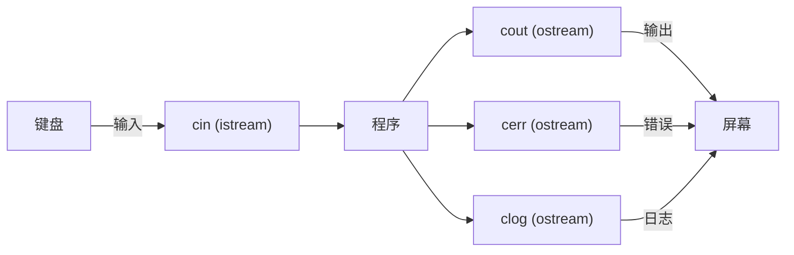
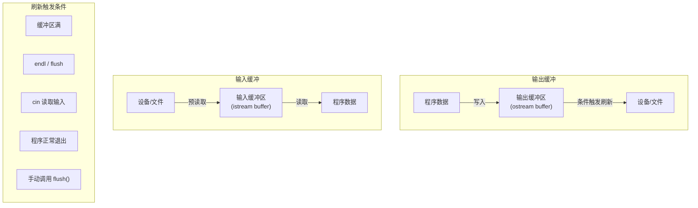
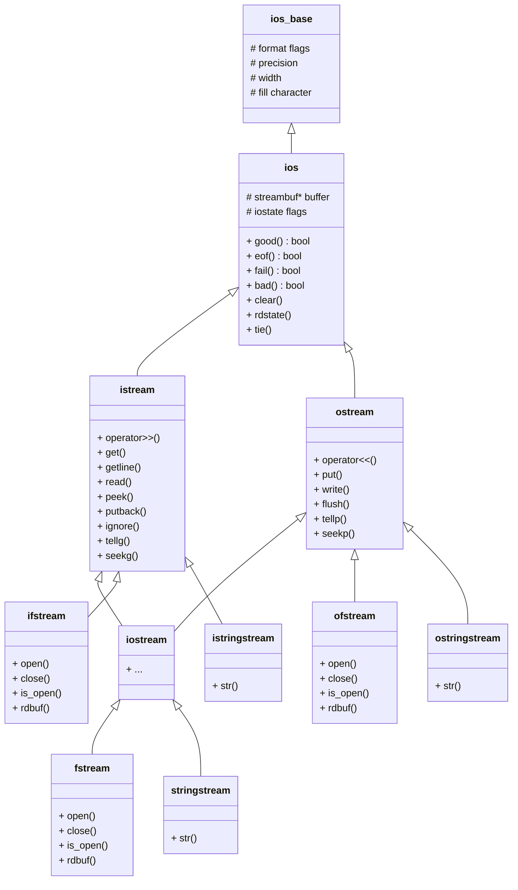
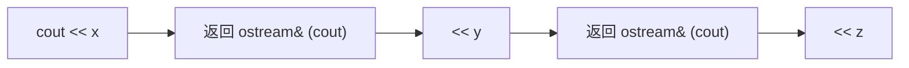
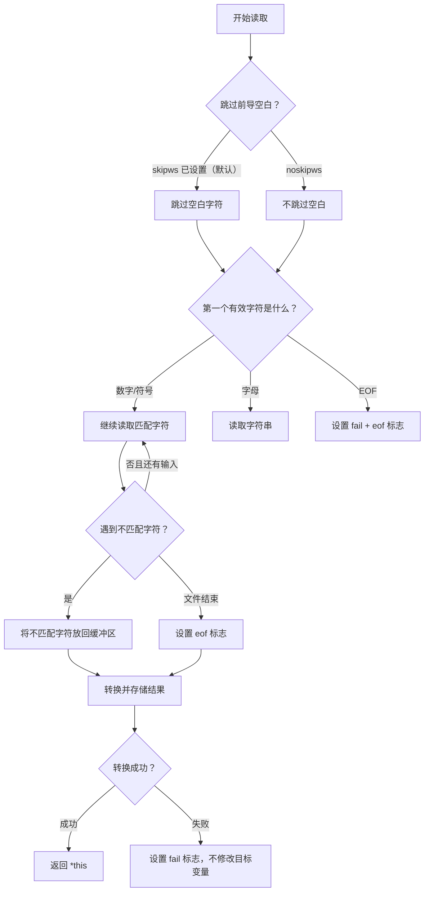
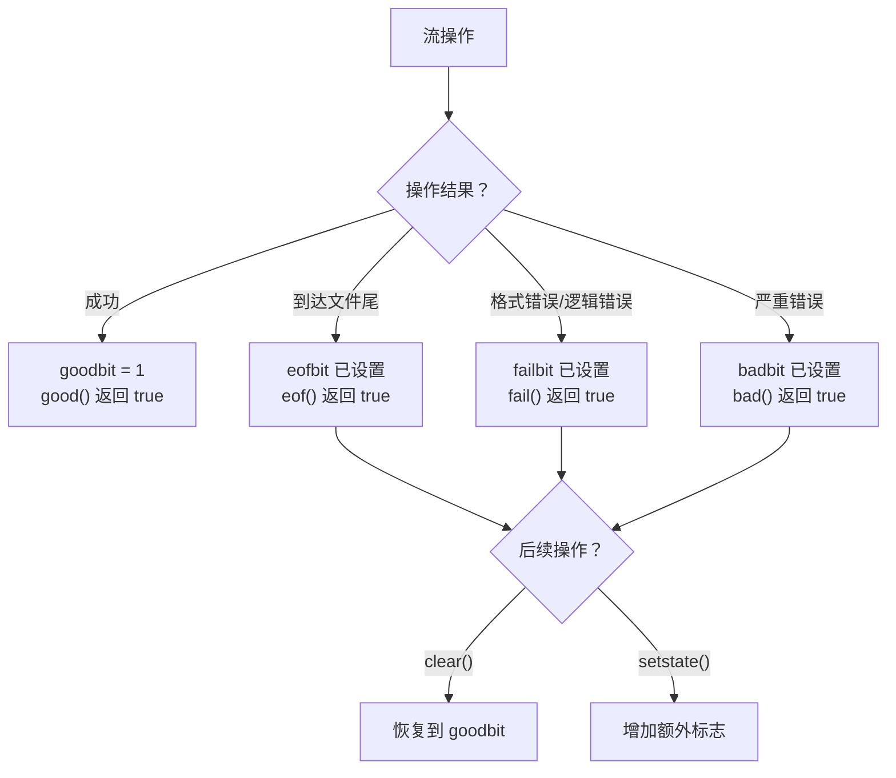

# 第 17 章：输入、输出和文件

> **本章目标**: 全面掌握 C++ 的输入输出系统——iostream 库、格式化 I/O、文件流、字符串流、二进制 I/O、自定义类型 I/O，以及各种 I/O 方法的综合应用。

---

## 17.1 C++ 输入输出概述

### 17.1.1 流（Stream）的概念

**流**是 C++ 中 I/O 的抽象概念，表示数据从源到目的地的传输通道。流的核心思想是：无论数据来自键盘、文件、内存还是网络，程序都使用相同的接口进行读写。

#### 流的基本数据流图



#### 流的内部缓冲机制

C++ 的 I/O 流内部维护了一个缓冲区，用于减少实际的 I/O 操作次数，提高性能。



**缓冲的工作流程**：
1. **输出时**：数据先写入缓冲区，当缓冲区满、遇到 `endl`/`flush`、或程序退出时，缓冲区内容被"刷新"（flush）到实际设备。
2. **输入时**：系统预读取数据到缓冲区，程序从缓冲区读取，减少实际 I/O 系统调用。

#### 缓冲 vs 非缓冲

| 特性 | 带缓冲 | 无缓冲 |
|------|--------|--------|
| 代表流 | `cout`, `clog` | `cerr`, `clog` (默认实现) |
| 性能 | 高（减少系统调用） | 低（每次立即输出） |
| 实时性 | 可能延迟 | 立即输出 |
| 典型场景 | 批量输出、文件操作 | 错误信息、调试信息 |

### 17.1.2 流的继承体系

C++ 的 I/O 流类具有完整的继承结构，理解这个体系有助于掌握各种流的使用。



**继承层次说明**：

- **`ios_base`**：所有流类的基类，存储格式化信息（精度、宽度、填充字符、格式标志等），不依赖模板参数。
- **`ios`**：继承自 `ios_base`，管理流状态（good/fail/eof/bad）、关联 streambuf、异常处理等。包含指向 `streambuf` 的指针。
- **`istream`** / **`ostream`**：分别处理输入和输出操作。
- **`iostream`**：多重继承 `istream` 和 `ostream`，支持双向操作。
- **`ifstream`** / **`ofstream`** / **`fstream`**：文件流，添加文件操作的 `open()`/`close()`/`is_open()`。
- **`istringstream`** / **`ostringstream`** / **`stringstream`**：字符串流，添加 `str()` 方法。

### 17.1.3 流缓冲区 streambuf

每个流对象内部都关联一个 `streambuf` 对象（或其派生类），负责实际的读写操作。

```cpp
#include <iostream>
#include <fstream>
using namespace std;

int main() {
    // 获取流的缓冲区
    streambuf* original_buf = cout.rdbuf();
    
    // 重定向 cout 到文件
    ofstream file("redirect.txt");
    cout.rdbuf(file.rdbuf());  // cout 的输出现在写入文件
    
    cout << "这行文字会写入文件而不是屏幕" << endl;
    
    // 恢复 cout
    cout.rdbuf(original_buf);
    cout << "这行文字显示在屏幕上" << endl;
    
    file.close();
    return 0;
}
```

**`streambuf` 的主要成员**：

| 方法 | 说明 |
|------|------|
| `in_avail()` | 返回输入缓冲区中可用的字符数 |
| `sbumpc()` | 读取当前字符并将指针后移 |
| `sgetc()` | 读取当前字符（不移指针） |
| `sputc(c)` | 写入一个字符到输出缓冲区 |
| `sputn(s, n)` | 写入 n 个字符 |
| `pubsetbuf(buf, len)` | 设置缓冲区 |

**直接操作 streambuf 的示例**：

```cpp
#include <iostream>
#include <fstream>
using namespace std;

int main() {
    ifstream file("data.txt");
    if (!file) return 1;
    
    // 直接获取文件缓冲区
    streambuf* buf = file.rdbuf();
    
    // 一个字符一个字符地从缓冲区读取
    int ch;
    while ((ch = buf->sbumpc()) != EOF) {
        cout.put(static_cast<char>(ch));
    }
    
    file.close();
    return 0;
}
```

### 17.1.4 预定义流对象

| 流对象 | 类型 | 默认关联 | 说明 |
|--------|------|----------|------|
| `cin` | `istream` | 标准输入（键盘） | 带缓冲的输入 |
| `cout` | `ostream` | 标准输出（屏幕） | 带缓冲的输出 |
| `cerr` | `ostream` | 标准错误（屏幕） | 无缓冲的错误输出 |
| `clog` | `ostream` | 标准错误（屏幕） | 带缓冲的日志输出 |

**注意**：`cerr` 和 `clog` 都关联到标准错误，但 `cerr` 无缓冲（每次输出立即刷新），`clog` 有缓冲。

---

## 17.2 输出（cout）

### 17.2.1 插入运算符 `<<`

`<<` 运算符（插入运算符）将数据发送到输出流。C++ 为内置类型重载了 `<<` 运算符。

```cpp
#include <iostream>
#include <string>
using namespace std;

int main() {
    int x = 42;
    double pi = 3.14159;
    string name = "Alice";
    char ch = 'A';
    bool flag = true;
    
    // 各种类型的输出
    cout << "整数: " << x << endl;
    cout << "浮点数: " << pi << endl;
    cout << "字符串: " << name << endl;
    cout << "字符: " << ch << endl;
    cout << "布尔值: " << flag << endl;  // 输出 1，而非 true
    
    // 链式调用
    cout << "链式输出: " << x << ", " << pi << ", " << name << endl;
    
    return 0;
}
```

**插入运算符的工作原理**：

`cout << x` 实际上调用了 `operator<<(cout, x)` 或 `cout.operator<<(x)`，返回 `cout` 的引用，从而实现链式调用。



### 17.2.2 格式化输出

C++ 提供多种方式控制输出格式：操纵符（manipulator）和成员函数。

```cpp
#include <iostream>
#include <iomanip>      // 格式化操作符
#include <string>
using namespace std;

int main() {
    double pi = 3.14159265358979;
    int n = 255;
    
    // 设置输出精度 (precision)
    // precision 控制浮点数输出时的有效数字位数（默认 6）
    cout << "默认精度: " << pi << endl;           // 3.14159
    
    cout.precision(3);
    cout << "精度 3: " << pi << endl;              // 3.14
    
    cout.precision(10);
    cout << "精度 10: " << pi << endl;             // 3.141592654
    
    // 恢复默认精度
    cout << setprecision(6) << pi << endl;         // 3.14159（setprecision 操纵符）
    
    // 字段宽度 setw
    // setw 只影响下一次输出，是"一次性"的
    cout << "[" << setw(10) << 42 << "]" << endl;  // [        42]（右对齐，占 10 格）
    cout << "[" << setw(10) << -42 << "]" << endl; // [       -42]
    
    // setw 对字符串同样有效
    cout << "[" << setw(10) << "Hello" << "]" << endl;  // [     Hello]
    
    // 对齐方式
    cout << left << setw(10) << "Hello" << "]" << endl;   // 左对齐
    cout << right << setw(10) << "Hello" << "]" << endl;  // 右对齐
    cout << internal << setw(10) << -42 << "]" << endl;   // 符号左对齐，数字右对齐
    
    // 填充字符
    cout << setfill('*') << setw(10) << 42 << endl;     // ********42
    cout << setfill(' ') << setw(10) << 42 << endl;     // 恢复空格填充
    
    // 进制输出
    cout << dec << n << endl;       // 255（十进制）
    cout << hex << n << endl;       // ff（十六进制）
    cout << oct << n << endl;       // 377（八进制）
    
    // showbase 显示进制前缀
    cout << showbase;
    cout << dec << n << endl;       // 255（十进制无前缀）
    cout << hex << n << endl;       // 0xff
    cout << oct << n << endl;       // 0377
    cout << noshowbase;             // 恢复
    
    // uppercase 大写十六进制
    cout << hex << uppercase << 0xabcd << endl;  // ABCD
    cout << nouppercase << hex << 0xabcd << endl; // abcd
    cout << dec;
    
    // bool 输出格式
    cout << true << " " << false << endl;           // 1 0
    cout << boolalpha << true << " " << false << endl;  // true false
    cout << noboolalpha;                            // 恢复
    
    // 综合示例：格式化表格
    cout << "\n=== 格式化表格 ===" << endl;
    cout << left << setw(10) << "姓名" 
         << right << setw(10) << "年龄" 
         << setw(10) << "分数" << endl;
    cout << setfill('-') << setw(30) << "" << setfill(' ') << endl;
    cout << left << setw(10) << "Alice" 
         << right << setw(10) << 20 
         << setw(10) << 95.5 << endl;
    cout << left << setw(10) << "Bob" 
         << right << setw(10) << 22 
         << setw(10) << 87.0 << endl;
    
    return 0;
}
```

### 17.2.3 浮点数格式

C++ 提供三种浮点数输出模式：默认、定点（fixed）和科学计数法（scientific）。

```cpp
#include <iostream>
#include <iomanip>
#include <cmath>
using namespace std;

int main() {
    double x = 1234.56789;
    double y = 0.00001234;
    double z = 100.0;
    double large = 1.234e10;
    
    cout << "=== 默认格式 ===" << endl;
    cout << "x = " << x << endl;           // 1234.57
    cout << "y = " << y << endl;           // 1.234e-05
    cout << "z = " << z << endl;           // 100
    
    // 定点表示法 fixed
    // 精度值表示小数点后的位数
    cout << "\n=== 定点表示法 (fixed) ===" << endl;
    cout << fixed;
    cout.precision(4);
    cout << "x = " << x << endl;           // 1234.5679
    cout << "y = " << y << endl;           // 0.0000
    cout << "z = " << z << endl;           // 100.0000
    cout << "large = " << large << endl;   // 12340000000.0000
    
    // 科学计数法 scientific
    cout << "\n=== 科学计数法 (scientific) ===" << endl;
    cout << scientific;
    cout.precision(4);
    cout << "x = " << x << endl;           // 1.2346e+03
    cout << "y = " << y << endl;           // 1.2340e-05
    cout << "z = " << z << endl;           // 1.0000e+02
    
    // 显示正号
    cout << "\n=== 显示正号 ===" << endl;
    cout << showpos << x << " " << -x << endl;   // +1234.567890 -1234.567890
    cout << noshowpos;                            // 恢复
    
    // showpoint 强制显示小数点
    cout << "\n=== 强制显示小数点 ===" << endl;
    cout << fixed << showpoint << setprecision(2);
    cout << z << endl;            // 100.00（带小数点）
    cout << noshowpoint;          // 恢复
    
    // hexfloat（C++11）：十六进制浮点数
    cout << "\n=== 十六进制浮点数 ===" << endl;
    cout << hexfloat << x << endl;  // 0x1.34ah+10（仅在需要时使用）
    cout << defaultfloat;           // 恢复默认格式
    
    // 恢复默认格式
    cout.unsetf(ios::floatfield);
    cout.precision(6);
    
    return 0;
}
```

**三种浮点数格式总结**：

| 格式 | precision 含义 | 示例 (123.456, precision=4) |
|------|---------------|---------------------------|
| 默认 | 有效数字位数 | 123.5 |
| `fixed` | 小数点后位数 | 123.4560 |
| `scientific` | 小数点后位数 | 1.2346e+02 |

### 17.2.4 格式化标志的位操作

C++ 的 `ios_base` 类使用位标志管理格式化状态。可以通过 `setf()`/`unsetf()` 函数直接操作这些标志。

```cpp
#include <iostream>
#include <iomanip>
using namespace std;

int main() {
    // 1. 使用 setf() 设置格式标志
    cout.setf(ios::showpos);        // 显示正号
    cout << 42 << endl;             // +42
    cout.unsetf(ios::showpos);      // 取消显示正号
    
    // 2. 使用带两个参数的 setf() 设置格式组
    // 第一个参数：要设置的标志
    // 第二个参数：要清理的格式组
    cout.setf(ios::hex, ios::basefield);    // 设置十六进制
    cout << 255 << endl;                    // ff
    cout.setf(ios::dec, ios::basefield);    // 恢复十进制
    cout << 255 << endl;                    // 255
    
    // 3. 常用格式组
    cout.setf(ios::fixed, ios::floatfield);  // 定点浮点数
    cout.setf(ios::left, ios::adjustfield);  // 左对齐
    cout.setf(ios::scientific, ios::floatfield); // 科学计数法
    
    // 4. 检查当前格式标志
    ios::fmtflags flags = cout.flags();
    if (flags & ios::showpos) {
        cout << "showpos 已设置" << endl;
    }
    
    // 5. 保存和恢复格式化状态
    ios::fmtflags old_flags = cout.flags();
    int old_precision = cout.precision();
    char old_fill = cout.fill();
    
    // 临时修改格式
    cout << hex << showbase << setprecision(4) << setfill('0');
    cout << 255 << " " << 3.14159 << endl;  // 0xff 3.1416
    
    // 恢复原始格式
    cout.flags(old_flags);
    cout.precision(old_precision);
    cout.fill(old_fill);
    cout << 255 << " " << 3.14159 << endl;  // 恢复默认
    
    return 0;
}
```

**格式化标志组**：

| 格式组常量 | 包含的标志 | 说明 |
|-----------|-----------|------|
| `ios::basefield` | `dec`, `oct`, `hex` | 整数进制 |
| `ios::adjustfield` | `left`, `right`, `internal` | 对齐方式 |
| `ios::floatfield` | `fixed`, `scientific`, `hexfloat` | 浮点数格式 |

### 17.2.5 操纵符完整列表

#### 无参数操纵符（定义在 `<iostream>`）

| 操纵符 | 作用 | 生效范围 |
|--------|------|---------|
| `endl` | 插入换行并刷新输出缓冲区 | 立即 |
| `ends` | 插入字符串结束符 `\0` | 立即 |
| `flush` | 刷新输出缓冲区 | 立即 |
| `ws` | 跳过输入中的空白字符 | 立即 |
| `dec` | 十进制显示整数 | 持续 |
| `hex` | 十六进制显示整数 | 持续 |
| `oct` | 八进制显示整数 | 持续 |
| `left` | 左对齐 | 持续 |
| `right` | 右对齐 | 持续 |
| `internal` | 符号左对齐，数值右对齐 | 持续 |
| `boolalpha` | 布尔值显示为 true/false | 持续 |
| `noboolalpha` | 布尔值显示为 1/0 | 持续 |
| `showbase` | 显示进制前缀 | 持续 |
| `noshowbase` | 不显示进制前缀 | 持续 |
| `showpoint` | 强制显示小数点 | 持续 |
| `noshowpoint` | 不强制显示小数点 | 持续 |
| `showpos` | 正数前显示 + 号 | 持续 |
| `noshowpos` | 正数前不显示 + 号 | 持续 |
| `skipws` | 输入时跳过空白字符 | 持续 |
| `noskipws` | 输入时不跳过空白字符 | 持续 |
| `uppercase` | 十六进制字母大写 | 持续 |
| `nouppercase` | 十六进制字母小写 | 持续 |
| `fixed` | 定点浮点数格式 | 持续 |
| `scientific` | 科学计数法 | 持续 |
| `hexfloat` | 十六进制浮点数（C++11） | 持续 |
| `defaultfloat` | 默认浮点数格式（C++11） | 持续 |
| `unitbuf` | 每次输出后刷新缓冲区 | 持续 |
| `nounitbuf` | 不自动刷新缓冲区 | 持续 |

#### 带参数操纵符（定义在 `<iomanip>`）

| 操纵符 | 作用 | 生效范围 |
|--------|------|---------|
| `setw(n)` | 设置字段宽度为 n | 仅下一次输出 |
| `setprecision(n)` | 设置浮点数精度为 n | 持续 |
| `setfill(c)` | 设置填充字符为 c | 持续 |
| `setbase(b)` | 设置整数进制（8/10/16） | 持续 |
| `resetiosflags(m)` | 清除指定的格式标志 m | 持续 |
| `setiosflags(m)` | 设置指定的格式标志 m | 持续 |
| `get_money(m)` | 读取货币值 | - |
| `put_money(m)` | 写入货币值 | - |
| `get_time(t, fmt)` | 按格式读取时间 | - |
| `put_time(t, fmt)` | 按格式写入时间 | - |
| `quoted(s)` | 读写带引号的字符串（C++14） | - |

### 17.2.6 自定义操纵符

C++ 允许创建自己的操纵符。

```cpp
#include <iostream>
#include <iomanip>
using namespace std;

// 1. 无参数自定义操纵符
// 格式: ostream& manip(ostream& os)
ostream& tab(ostream& os) {
    os << '\t';
    return os;
}

ostream& separator(ostream& os) {
    os << "\n---\n";
    return os;
}

// 2. 带参数自定义操纵符（使用类来实现）
class indent {
    int n;
public:
    indent(int num) : n(num) {}
    friend ostream& operator<<(ostream& os, const indent& ind) {
        for (int i = 0; i < ind.n; i++) {
            os << ' ';
        }
        return os;
    }
};

class color_on {
    const char* code;
public:
    color_on(const char* c) : code(c) {}
    friend ostream& operator<<(ostream& os, const color_on& c) {
        // Windows 下使用
        os << c.code;
        return os;
    }
};

// 3. 带参数操纵符（使用模板和函数）
// 创建一个操纵符工厂
class width_fill {
    int w;
    char f;
public:
    width_fill(int width, char fill_char) : w(width), f(fill_char) {}
    friend ostream& operator<<(ostream& os, const width_fill& wf) {
        os << setw(wf.w) << setfill(wf.f);
        return os;
    }
};

int main() {
    // 使用自定义无参数操纵符
    cout << "Hello" << tab << "World" << endl;
    cout << "Section 1" << separator << "Section 2" << endl;
    
    // 使用自定义带参数操纵符
    cout << "Indented text:" << endl;
    cout << indent(4) << "Level 1" << endl;
    cout << indent(8) << "Level 2" << endl;
    
    // 使用宽度填充操纵符工厂
    cout << width_fill(10, '*') << 42 << endl;      // ********42
    cout << width_fill(8, '0') << 42 << endl;        // 00000042
    
    return 0;
}
```

---

## 17.3 输入（cin）

### 17.3.1 提取运算符 `>>`

`>>` 运算符（提取运算符）从输入流读取数据并根据变量类型进行解析。

```cpp
#include <iostream>
#include <string>
using namespace std;

int main() {
    int x;
    double y;
    string s;
    
    cout << "输入一个整数、一个浮点数和一个字符串（用空格分隔）: ";
    cin >> x >> y >> s;
    
    // cin >> 的特性：
    // 1. 会跳过前导空白字符（空格、制表符、换行符）
    // 2. 遇到空白字符或类型不匹配时停止读取
    // 3. 读取成功后，指针停在第一个未读取的字符处
    
    cout << "整数: " << x << endl;
    cout << "浮点数: " << y << endl;
    cout << "字符串: " << s << endl;
    
    return 0;
}
```

#### `>>` 对不同类型的解析规则

| 目标类型 | 解析规则 | 示例输入 | 读取结果 |
|---------|---------|---------|---------|
| `int` / `long` | 读取可选符号 + 数字序列，遇到非数字停止 | `   -42abc` | -42 |
| `unsigned` | 读取数字序列，不支持负号 | `  42abc` | 42 |
| `float` / `double` | 读取可选符号+数字+可选小数+可选指数 | `  3.14e2x` | 314.0 |
| `char` | 读取一个非空白字符 | `  A B` | 'A'（跳过前导空格） |
| `string` | 读取非空白字符序列 | `  hello world` | "hello" |
| `char*` / `char[]` | 读取非空白字符序列，自动加 `\0` | `  hello` | "hello" |

#### `>>` 的详细解析流程



### 17.3.2 输入提取的详细流程（深度分析）

```cpp
#include <iostream>
#include <iomanip>
#include <string>
using namespace std;

int main() {
    // 场景 1：连续读取不同类型
    cout << "=== 场景 1：混合类型读取 ===" << endl;
    cout << "输入格式：整数 浮点数 字符串（用空格分隔）" << endl;
    
    int i;
    double d;
    string s;
    
    cin >> i >> d >> s;
    /*
    假设输入:   42 3.14 hello
    读取流程:
    1. cin >> i: 跳过空格，读取 "42"，遇到空格停止 -> i = 42
    2. cin >> d: 跳过空格，读取 "3.14"，遇到空格停止 -> d = 3.14
    3. cin >> s: 跳过空格，读取 "hello"，遇到换行停止 -> s = "hello"
    */
    cout << "i = " << i << ", d = " << d << ", s = " << s << endl;
    
    cin.ignore(numeric_limits<streamsize>::max(), '\n');
    
    // 场景 2：输入类型不匹配
    cout << "\n=== 场景 2：类型不匹配 ===" << endl;
    cout << "输入一个整数: ";
    
    int num;
    if (cin >> num) {
        cout << "成功读取: " << num << endl;
    } else {
        cout << "输入无效！cin.fail() = " << cin.fail() << endl;
        cout << "cin.rdstate() = " << cin.rdstate() << endl;
        cin.clear();  // 清除错误
        cin.ignore(numeric_limits<streamsize>::max(), '\n');  // 清空缓冲区
    }
    
    return 0;
}
```

### 17.3.3 cin 的成员函数

```cpp
#include <iostream>
#include <string>
#include <limits>
using namespace std;

int main() {
    char ch;
    string line;
    
    // ---- 1. get(char&) — 读取单个字符（包括空白） ----
    cout << "1. get(char&) — 输入一个字符（包括空格）: ";
    cin.get(ch);             // 读取任意字符（含空格、换行符）
    cout << "读取到: '" << ch << "'" << endl;
    cin.ignore(numeric_limits<streamsize>::max(), '\n');
    
    // ---- 2. getline(char*, size) — 读取一行 C 风格字符串 ----
    cout << "\n2. getline(char*, size) — 输入一行文字: ";
    char buffer[100];
    cin.getline(buffer, 100);  // 读取最多 99 个字符或到换行符
    cout << "读取到: " << buffer << endl;
    
    // ---- 3. getline(cin, string) — 读取一行到 string ----
    cout << "\n3. getline(cin, string) — 输入另一行: ";
    getline(cin, line);        // 全局函数，读取到换行符为止
    cout << "读取到: " << line << endl;
    
    // ---- 4. peek() — 查看下一个字符而不提取 ----
    cout << "\n4. peek() — 输入一些文字: ";
    char next = cin.peek();
    cout << "下一个字符将是: '" << next << "'" << endl;
    
    // ---- 5. putback(char) — 将字符放回流 ----
    cout << "\n5. putback() — 将字符放回并重新读取" << endl;
    cin.get(ch);
    cout << "读取到: '" << ch << "', 现在放回" << endl;
    cin.putback(ch);
    cin.get(ch);
    cout << "再次读取: '" << ch << "'" << endl;
    
    // ---- 6. ignore(count, delim) — 跳过/忽略字符 ----
    cout << "\n6. ignore() — 跳过输入中的字符" << endl;
    cout << "输入一行文字（前 10 个字符将被忽略）: ";
    cin.ignore(10);            // 忽略前 10 个字符
    // 或使用 ignore(100, '\n') 忽略到换行为止
    getline(cin, line);
    cout << "忽略前 10 个字符后: " << text << endl;
    
    // ---- 7. read(char*, count) — 读取指定数量字符 ----
    cout << "\n7. read() — 输入至少 5 个字符: ";
    char data[5];
    cin.read(data, 5);          // 精确读取 5 个字符（不跳过任何字符）
    
    // ---- 8. gcount() — 上次读取的字符数 ----
    cout << "实际读取了 " << cin.gcount() << " 个字符: ";
    for (int i = 0; i < cin.gcount(); i++) {
        cout << "'" << data[i] << "' ";
    }
    cout << endl;
    
    return 0;
}
```

### 17.3.4 输入缓冲区的深度分析

理解 cin 的输入缓冲区行为对于正确处理输入至关重要。

```cpp
#include <iostream>
#include <iomanip>
#include <limits>
using namespace std;

int main() {
    // === 缓冲区陷阱 1：getline 前的遗留换行符 ===
    cout << "=== 陷阱 1：遗留换行符问题 ===" << endl;
    
    int age;
    cout << "输入年龄: ";
    cin >> age;      // 读取整数，但换行符留在缓冲区中
    
    string name;
    cout << "输入姓名: ";
    getline(cin, name);  // 这里会立即读取到遗留的换行符，name 为空字符串！
    
    cout << "年龄: " << age << ", 姓名: '" << name << "'" << endl;
    // 解决：在 cin >> 之后添加 cin.ignore()
    
    cout << "\n=== 正确做法 ===" << endl;
    cout << "输入年龄: ";
    cin >> age;
    cin.ignore(numeric_limits<streamsize>::max(), '\n');  // 清空缓冲区中的换行符
    
    cout << "输入姓名: ";
    getline(cin, name);
    cout << "年龄: " << age << ", 姓名: '" << name << "'" << endl;
    
    // === 缓冲区陷阱 2：输入过长超过缓冲区 ===
    cout << "\n=== 陷阱 2：输入过长 ===" << endl;
    char short_buf[5];  // 只能容纳 4 个字符 + 结束符
    cout << "输入一个长字符串: ";
    cin.getline(short_buf, 5);
    
    if (cin.fail()) {
        cout << "输入被截断！" << endl;
        cout << "读取到: " << short_buf << endl;
        cin.clear();  // 必须清除错误标志
        cin.ignore(numeric_limits<streamsize>::max(), '\n');
    }
    
    // === 缓冲区观察：查看缓冲区内容 ===
    cout << "\n=== 查看缓冲区 ===" << endl;
    cout << "输入一些字符: ";
    cin >> noskipws;  // 不跳过空白
    
    char ch;
    while (true) {
        ch = cin.peek();
        if (ch == '\n' || ch == EOF) break;
        cout << "缓冲区中有: '" << static_cast<char>(ch) << "' (0x" 
             << hex << ch << dec << ")" << endl;
        cin.get();  // 消耗该字符
    }
    cin >> skipws;
    
    return 0;
}
```

### 17.3.5 输入错误的各种场景和处理方法

```cpp
#include <iostream>
#include <string>
#include <limits>
#include <cctype>
using namespace std;

// 安全的整数输入函数
int safeInputInt(const string& prompt) {
    int value;
    while (true) {
        cout << prompt;
        cin >> value;
        
        if (cin.fail()) {
            cin.clear();
            cin.ignore(numeric_limits<streamsize>::max(), '\n');
            cout << "错误：输入无效，请输入一个整数！" << endl;
        } else {
            cin.ignore(numeric_limits<streamsize>::max(), '\n');
            return value;
        }
    }
}

int main() {
    // === 场景 1：类型不匹配 ===
    cout << "=== 场景 1：类型不匹配 ===" << endl;
    int val;
    cout << "请输入一个整数: ";
    cin >> val;
    
    if (cin.fail()) {
        cout << "错误：输入不是有效的整数！" << endl;
        cin.clear();
        cin.ignore(numeric_limits<streamsize>::max(), '\n');
    }
    
    // === 场景 2：文件结束（EOF） ===
    cout << "\n=== 场景 2：EOF 测试 ===" << endl;
    cout << "按 Ctrl+Z (Windows) 或 Ctrl+D (Unix) 结束输入" << endl;
    
    int sum = 0, count = 0, num;
    while (cin >> num) {
        sum += num;
        count++;
    }
    
    if (cin.eof()) {
        cout << "读取到文件结束符" << endl;
    } else if (cin.fail()) {
        cout << "读取错误（非 EOF）" << endl;
        cin.clear();
    }
    cout << "总和: " << sum << ", 个数: " << count << endl;
    
    // === 场景 3：输入流被破坏（bad） ===
    cout << "\n=== 场景 3：bad 状态 ===" << endl;
    // bad() 通常表示流缓冲区损坏等严重错误
    // 一般发生在底层操作系统 I/O 失败时
    cout << "普通程序很少遇到 bad() 状态" << endl;
    
    // === 场景 4：空输入 ===
    cout << "\n=== 场景 4：空输入处理 ===" << endl;
    cin.ignore(numeric_limits<streamsize>::max(), '\n');
    
    string input;
    cout << "请输入一行（直接回车视为空输入）: ";
    getline(cin, input);
    
    if (input.empty()) {
        cout << "检测到空输入，使用默认值" << endl;
        input = "默认值";
    }
    cout << "输入为: " << input << endl;
    
    // === 场景 5：范围验证 ===
    cout << "\n=== 场景 5：范围验证 ===" << endl;
    int score;
    while (true) {
        cout << "请输入分数 (0-100): ";
        cin >> score;
        
        if (cin.fail()) {
            cin.clear();
            cin.ignore(numeric_limits<streamsize>::max(), '\n');
            cout << "错误：请输入数字！" << endl;
        } else if (score < 0 || score > 100) {
            cout << "错误：分数必须在 0-100 之间！" << endl;
            cin.ignore(numeric_limits<streamsize>::max(), '\n');
        } else {
            cin.ignore(numeric_limits<streamsize>::max(), '\n');
            break;
        }
    }
    cout << "有效分数: " << score << endl;
    
    // === 场景 6：多种分隔符的数据解析 ===
    cout << "\n=== 场景 6：自定义分隔符解析 ===" << endl;
    cout << "输入格式：名称,年龄,分数（用逗号分隔）: ";
    
    string name;
    int age;
    double score;
    
    getline(cin, name, ',');  // 读取到逗号
    cin >> age;
    cin.ignore();              // 跳过逗号
    cin >> score;
    cin.ignore(numeric_limits<streamsize>::max(), '\n');
    
    cout << "名称: " << name << ", 年龄: " << age << ", 分数: " << score << endl;
    
    return 0;
}
```

### 17.3.6 输入成员函数总结

| 函数 | 跳过空白 | 读取的内容 | 结束条件 | 典型用途 |
|------|---------|-----------|---------|---------|
| `cin >> var` | 是 | 按类型解析 | 空白/类型不匹配 | 格式化输入 |
| `cin.get(ch)` | 否 | 单个字符 | 读取到字符 | 逐字符处理 |
| `cin.getline(buf, n)` | 否 | 一行（C 字符串） | 换行/n-1 字符 | 读取行 |
| `getline(cin, str)` | 否 | 一行（string） | 换行 | 读取行（推荐） |
| `cin.read(buf, n)` | 否 | 指定数量字符 | 读取 n 个 | 二进制输入 |
| `cin.peek()` | 否 | 查看下一个 | - | 预查看 |
| `cin.putback(c)` | 否 | 放回字符 | - | 回退字符 |
| `cin.ignore(n, d)` | 否 | 跳过字符 | n 个/遇到定界符 | 清空缓冲区 |
| `cin.gcount()` | - | 上次读取计数 | - | 检查实际读取量 |

---

## 17.4 流的状态管理

### 17.4.1 状态标志

C++ 流使用状态标志追踪 I/O 操作的状态。`ios_base` 定义了以下几个状态位：

| 状态标志 | 位值 | 含义 | 典型原因 |
|---------|------|------|---------|
| `goodbit` | 0 | 一切正常 | - |
| `eofbit` | 1 | 到达文件末尾 | 读取超出文件末尾 |
| `failbit` | 2 | I/O 操作失败（可恢复） | 输入类型不匹配、文件打开失败 |
| `badbit` | 4 | 严重错误（不可恢复） | 底层缓冲区损坏、硬件错误 |



**状态判断函数**：

| 函数 | 返回值 | 等价条件 |
|------|--------|---------|
| `s.good()` | 流处于正常状态 | `rdstate() == 0` |
| `s.eof()` | 到达文件尾 | `rdstate() & eofbit` |
| `s.fail()` | 操作失败 | `rdstate() & (failbit | badbit)` |
| `s.bad()` | 严重错误 | `rdstate() & badbit` |
| `s.operator!()` | 取反（用于 `if (!s)`） | `s.fail()` |
| `s.operator bool()` | 是否可用 | `!s.fail()` |

### 17.4.2 状态操作示例

```cpp
#include <iostream>
#include <fstream>
#include <string>
using namespace std;

int main() {
    // 完整的状态管理示例
    ifstream file("nonexistent.txt");
    
    // 检查状态
    cout << "打开不存在的文件后的状态:" << endl;
    cout << "good(): " << file.good() << endl;
    cout << "eof():  " << file.eof() << endl;
    cout << "fail(): " << file.fail() << endl;   // true
    cout << "bad():  " << file.bad() << endl;
    cout << "rdstate(): " << file.rdstate() << endl;  // 2 (failbit)
    
    // 清除状态
    file.clear();
    cout << "\n调用 clear() 后 rdstate(): " << file.rdstate() << endl;
    
    // 使用 rdstate 进行精确判断
    ifstream stream("data.txt");
    int value;
    stream >> value;
    
    switch (stream.rdstate()) {
        case ios::goodbit:
            cout << "操作成功" << endl;
            break;
        case ios::eofbit:
            cout << "到达文件末尾" << endl;
            break;
        case ios::failbit:
            cout << "格式错误或逻辑错误" << endl;
            break;
        case ios::badbit:
            cout << "流缓冲区损坏" << endl;
            break;
        default:
            cout << "多标志组合状态: " << stream.rdstate() << endl;
    }
    
    // 异常模式
    // 可以设置流在特定状态下抛出异常
    ifstream safeFile("config.txt");
    safeFile.exceptions(ios::failbit | ios::badbit);  // failbit 和 badbit 时抛异常
    
    try {
        int config;
        safeFile >> config;
        // 如果文件不存在或格式错误，抛出 ios::failure 异常
    } catch (const ios::failure& e) {
        cout << "I/O 异常: " << e.what() << endl;
        cout << "错误码: " << e.code() << endl;
    }
    
    return 0;
}
```

---

## 17.5 文件 I/O

### 17.5.1 文件流类

| 类 | 用途 | 基类 | 头文件 |
|----|------|------|--------|
| `ifstream` | 从文件读取（输入） | `istream` | `<fstream>` |
| `ofstream` | 写入文件（输出） | `ostream` | `<fstream>` |
| `fstream` | 读写文件（输入+输出） | `iostream` | `<fstream>` |

**构造方式**：

```cpp
ifstream file1;                     // 默认构造，尚未关联文件
ifstream file2("data.txt");         // 构造时打开文件
ifstream file3("data.txt", ios::binary);  // 构造时打开，指定模式

file1.open("data.txt");             // 先构造，后打开
```

### 17.5.2 写入文件

```cpp
#include <iostream>
#include <fstream>
#include <string>
#include <vector>
using namespace std;

int main() {
    // 基本写入
    ofstream outFile;
    outFile.open("data.txt");      // 默认：创建/覆盖（ios::out | ios::trunc）
    
    if (!outFile.is_open()) {
        cerr << "无法打开文件!" << endl;
        return 1;
    }
    
    // 写入文件（与使用 cout 完全一样）
    outFile << "Hello, File!" << endl;
    outFile << "Number: " << 42 << endl;
    outFile << "Pi: " << 3.14159 << endl;
    outFile << "布尔值: " << true << endl;
    
    // 格式化写入
    outFile << left << setw(15) << "名称" 
            << right << setw(10) << "价格" << endl;
    outFile << setfill('-') << setw(25) << "" << setfill(' ') << endl;
    outFile << left << setw(15) << "苹果" 
            << right << setw(10) << 5.5 << endl;
    outFile << left << setw(15) << "香蕉" 
            << right << setw(10) << 3.2 << endl;
    
    outFile.close();
    cout << "文件写入完成" << endl;
    
    // 使用 vector 批量写入
    vector<string> names = {"Alice", "Bob", "Charlie"};
    vector<int> scores = {95, 87, 92};
    
    ofstream scoreFile("scores.txt");
    for (size_t i = 0; i < names.size(); i++) {
        scoreFile << names[i] << " " << scores[i] << endl;
    }
    scoreFile.close();
    
    return 0;
}
```

### 17.5.3 读取文件

```cpp
#include <iostream>
#include <fstream>
#include <string>
#include <vector>
using namespace std;

int main() {
    ifstream inFile("data.txt");
    
    if (!inFile) {                 // operator! 等价于 inFile.fail()
        cerr << "无法打开文件!" << endl;
        return 1;
    }
    
    // 方法 1：逐行读取（最常用）
    string line;
    while (getline(inFile, line)) {
        cout << line << endl;
    }
    
    inFile.close();
    
    // 方法 2：结构化读取
    ifstream scoreFile("scores.txt");
    vector<string> names;
    vector<int> scores;
    
    string name;
    int score;
    while (scoreFile >> name >> score) {
        names.push_back(name);
        scores.push_back(score);
    }
    scoreFile.close();
    
    cout << "\n读取了 " << names.size() << " 条记录:" << endl;
    for (size_t i = 0; i < names.size(); i++) {
        cout << names[i] << ": " << scores[i] << " 分" << endl;
    }
    
    return 0;
}
```

### 17.5.4 文件打开模式的详细说明

文件打开模式通过位掩码组合，定义在 `ios` 命名空间中：

```cpp
#include <fstream>
using namespace std;

int main() {
    // 打开模式一览：
    // ios::in      — 以读取模式打开
    // ios::out     — 以写入模式打开（会清空文件）
    // ios::app     — 追加模式（每次写入从文件末尾开始）
    // ios::ate     — 打开后立即定位到文件尾
    // ios::trunc   — 清空文件内容
    // ios::binary  — 以二进制模式打开（不进行换行符转换）
    // ios::nocreate — 不创建文件（非标准，大多数编译器不支持）
    // ios::noreplace — 不覆盖已有文件（非标准，大多数编译器不支持）
    
    // ---- 常用组合 ----
    
    // 1. 写入新文件（默认）
    ofstream f1("a.txt");                    // ios::out | ios::trunc
    
    // 2. 追加写入
    ofstream f2("log.txt", ios::app);        // 每次写从文件尾开始
    f2 << "新的日志条目" << endl;
    f2.close();
    
    // 3. 追加且可读（使用 fstream）
    fstream f3("log.txt", ios::in | ios::out | ios::app);
    // 可以读取已有内容，并在末尾追加
    
    // 4. 读写既有文件（不截断）
    fstream f4("data.txt", ios::in | ios::out);
    // 文件必须存在，否则 open() 失败
    
    // 5. 读写，不存在时创建
    fstream f5("data.txt", ios::in | ios::out | ios::trunc);
    // 无论文件是否存在，都创建新文件
    
    // 6. 只读
    ifstream f6("data.txt");                 // ios::in
    
    // 7. 只写（截断）
    ofstream f7("data.txt");                 // ios::out | ios::trunc
    
    // 8. 二进制读取
    ifstream f8("data.bin", ios::binary);
    
    // 9. 二进制写入
    ofstream f9("data.bin", ios::binary);
    
    // 10. 二进制追加
    ofstream f10("data.bin", ios::binary | ios::app);
    
    // ---- 模式组合测试 ----
    // 创建用于测试的文件
    ofstream test("test_mode.txt");
    test << "原始内容" << endl;
    test.close();
    
    // 测试 app 模式
    ofstream app("test_mode.txt", ios::app);
    app << "追加的内容" << endl;  // 写入到文件末尾
    app.close();
    
    // 验证：文件现在包含"原始内容"和"追加的内容"
    
    return 0;
}
```

**模式组合效果总结**：

| 模式 | 文件已存在 | 文件不存在 |
|------|-----------|-----------|
| `ios::out` | 清空后写入 | 创建新文件 |
| `ios::out \| ios::app` | 追加到末尾 | 创建新文件 |
| `ios::in` | 打开 | 打开失败 |
| `ios::in \| ios::out` | 打开，不清空 | 打开失败 |
| `ios::in \| ios::out \| ios::trunc` | 清空后读写 | 创建新文件 |
| `ios::binary` | 二进制模式（需与其他组合） | 二进制模式 |

### 17.5.5 文件打开失败的诊断

```cpp
#include <iostream>
#include <fstream>
#include <string>
#include <cerrno>
#include <cstring>
using namespace std;

int main() {
    string filename;
    cout << "输入文件名: ";
    getline(cin, filename);
    
    ifstream file(filename);
    
    if (!file.is_open()) {
        cerr << "打开文件失败: " << filename << endl;
        
        // 可能的原因：
        cout << "\n常见失败原因检查:" << endl;
        
        // 1. 文件不存在
        ifstream check(filename);
        if (!check) {
            cout << "- 文件可能不存在" << endl;
        }
        
        // 2. 权限问题（C++ 标准无法直接检测，使用 errno）
        // errno 在文件打开失败时会被设置
        // 注意：不同编译器表现可能不同
        cerr << "- 系统错误: " << strerror(errno) << endl;
        
        // 3. 路径问题
        if (filename.find_first_of("\\/:*?\"<>|") != string::npos) {
            cout << "- 文件路径包含非法字符" << endl;
        }
        
        // 4. 路径过长
        if (filename.length() > 260) {
            cout << "- 文件路径过长" << endl;
        }
        
        return 1;
    }
    
    // 成功打开文件
    cout << "文件成功打开，开始读取内容:" << endl;
    string line;
    while (getline(file, line)) {
        cout << line << endl;
    }
    
    file.close();
    return 0;
}
```

### 17.5.6 临时文件的创建

```cpp
#include <iostream>
#include <fstream>
#include <string>
#include <cstdlib>
#include <filesystem>
using namespace std;
namespace fs = std::filesystem;

int main() {
    // 方法 1：使用 tmpnam（不推荐，有安全问题）
    // char tempName[L_tmpnam];
    // tmpnam(tempName);
    // ofstream tempFile(tempName);
    
    // 方法 2：使用 C++17 filesystem 创建临时路径
    // 注意：需要 C++17 编译选项
    
    // 方法 3：使用系统临时目录
    #ifdef _WIN32
        string tempDir = getenv("TEMP");
    #else
        string tempDir = "/tmp";
    #endif
    
    string tempPath = tempDir + "/myapp_temp_XXXXXX";
    
    cout << "临时目录: " << tempDir << endl;
    
    // 创建一个临时文件
    ofstream temp(tempPath);
    if (temp.is_open()) {
        temp << "临时数据 " << 12345 << endl;
        temp.close();
        cout << "临时文件已创建: " << tempPath << endl;
        
        // 读取并验证
        ifstream check(tempPath);
        string data;
        getline(check, data);
        cout << "临时文件内容: " << data << endl;
        check.close();
        
        // 使用完毕后删除临时文件
        remove(tempPath.c_str());
        cout << "临时文件已删除" << endl;
    }
    
    return 0;
}
```

### 17.5.7 文件锁定概念（提示）

在多进程/多线程环境中，文件锁定用于防止并发访问导致的数据损坏。C++ 标准库**没有**直接提供文件锁定功能，需要平台相关 API 或第三方库。

```cpp
// 以下代码仅为概念演示，不可直接编译
#include <iostream>
using namespace std;

// 文件锁定示例（概念）
// Windows: LockFile / UnlockFile
// Linux: flock / fcntl

/*
// Windows 文件锁定示例
#include <windows.h>
HANDLE hFile = CreateFile("data.txt", GENERIC_READ | GENERIC_WRITE,
    0,  // 0 = 不共享，即独占访问
    NULL, OPEN_EXISTING, 0, NULL);
if (hFile != INVALID_HANDLE_VALUE) {
    LockFile(hFile, 0, 0, GetFileSize(hFile, NULL), 0);
    // ... 读写操作 ...
    UnlockFile(hFile, 0, 0, GetFileSize(hFile, NULL), 0);
    CloseHandle(hFile);
}

// Linux 文件锁定示例
#include <fcntl.h>
#include <unistd.h>
int fd = open("data.txt", O_RDWR);
if (fd != -1) {
    struct flock lock;
    lock.l_type = F_WRLCK;  // 写锁
    lock.l_whence = SEEK_SET;
    lock.l_start = 0;
    lock.l_len = 0;          // 锁定整个文件
    fcntl(fd, F_SETLKW, &lock);
    // ... 读写操作 ...
    lock.l_type = F_UNLCK;
    fcntl(fd, F_SETLK, &lock);
    close(fd);
}
*/

int main() {
    cout << "文件锁定需要平台相关 API：" << endl;
    cout << "- Windows: LockFile / UnlockFile API" << endl;
    cout << "- Linux: flock() / fcntl()" << endl;
    cout << "- Boost.Interprocess: 跨平台文件锁" << endl;
    return 0;
}
```

### 17.5.8 目录遍历概念

C++17 引入了 `<filesystem>` 库，提供了目录遍历功能。

```cpp
#include <iostream>
#include <filesystem>
#include <fstream>
#include <string>
using namespace std;
namespace fs = std::filesystem;

int main() {
    
    cout << "=== 遍历目录: " << fs::absolute(path) << " ===" << endl;
    
    // 遍历目录中的所有条目
    for (const auto& entry : fs::directory_iterator(path)) {
        cout << (entry.is_directory() ? "[DIR]  " : "[FILE] ")
             << entry.path().filename().string();
        
        if (entry.is_regular_file()) {
            cout << " (" << entry.file_size() << " 字节)";
        }
        cout << endl;
    }
    
    // 递归遍历
    cout << "\n=== 递归遍历（仅前 10 项）===" << endl;
    int count = 0;
    for (const auto& entry : fs::recursive_directory_iterator(path)) {
        if (count++ >= 10) break;
        cout << entry.path().string() << endl;
    }
    
    // 文件 I/O 与目录遍历结合
    cout << "\n=== 查找所有 .txt 文件 ===" << endl;
    for (const auto& entry : fs::directory_iterator(path)) {
        if (entry.is_regular_file() && 
            entry.path().extension() == ".txt") {
            
            cout << "处理: " << entry.path().filename() << endl;
            
            ifstream file(entry.path());
            if (file) {
                string firstLine;
                getline(file, firstLine);
                cout << "  第一行: " << firstLine << endl;
                file.close();
            }
        }
    }
    
    return 0;
}
```

---

## 17.6 文件位置指针

### 17.6.1 基本操作

每个文件流（`fstream`、`ifstream`、`ofstream`）都维护两个位置指针：
- **`get pointer`**（g）：读取位置，由 `tellg()`/`seekg()` 操作
- **`put pointer`**（p）：写入位置，由 `tellp()`/`seekp()` 操作

```cpp
#include <iostream>
#include <fstream>
#include <string>
using namespace std;

int main() {
    // 创建一个测试文件
    ofstream create("test_pos.txt");
    create << "0123456789ABCDEF" << endl;
    create << "Hello World!" << endl;
    create.close();
    
    fstream file("test_pos.txt", ios::in | ios::out);
    if (!file) {
        cerr << "无法打开文件" << endl;
        return 1;
    }
    
    // ---- 获取当前位置 ----
    streampos pos = file.tellg();   // 获取读取位置
    streampos posP = file.tellp();  // 获取写入位置
    
    cout << "初始读取位置: " << pos << endl;   // 0
    cout << "初始写入位置: " << posP << endl;   // 0
    
    // ---- 定位读取指针 (seekg) ----
    file.seekg(0, ios::beg);        // 定位到文件开头
    file.seekg(5, ios::beg);        // 定位到第 5 个字节（从开头算起）
    char ch;
    file.get(ch);
    cout << "位置 5 的字符: '" << ch << "'" << endl;  // '5'
    
    file.seekg(-3, ios::end);       // 从末尾往前 3 个字节
    file.get(ch);
    cout << "末尾前 3 的字符: '" << ch << "'" << endl;
    
    file.seekg(2, ios::cur);        // 从当前位置移动 2 个字节
    
    // ---- 定位写入指针 (seekp) ----
    file.seekp(0, ios::beg);        // 写入位置定位到开头
    
    // ---- 获取文件大小 ----
    file.seekg(0, ios::end);
    streampos fileSize = file.tellg();
    cout << "文件大小: " << fileSize << " 字节" << endl;
    file.seekg(0, ios::beg);        // 恢复
    
    file.close();
    remove("test_pos.txt");
    
    return 0;
}
```

### 17.6.2 随机访问文件

```cpp
#include <iostream>
#include <fstream>
#include <string>
#include <cstring>
using namespace std;

struct Student {
    int id;
    char name[32];
    double gpa;
};

void writeStudent(fstream& file, int index, const Student& s) {
    file.seekp(index * sizeof(Student), ios::beg);
    file.write(reinterpret_cast<const char*>(&s), sizeof(Student));
}

Student readStudent(fstream& file, int index) {
    Student s;
    file.seekg(index * sizeof(Student), ios::beg);
    file.read(reinterpret_cast<char*>(&s), sizeof(Student));
    return s;
}

int main() {
    // 创建一个学生记录文件
    fstream file("students.dat", ios::in | ios::out | ios::binary | ios::trunc);
    if (!file) {
        cerr << "无法创建文件" << endl;
        return 1;
    }
    
    // 初始化一些记录
    Student students[5] = {
        {1001, "Alice", 3.8},
        {1002, "Bob", 3.2},
        {1003, "Charlie", 3.9},
        {1004, "Diana", 3.5},
        {1005, "Eve", 4.0}
    };
    
    // 批量写入
    for (int i = 0; i < 5; i++) {
        writeStudent(file, i, students[i]);
    }
    
    cout << "=== 顺序读取所有学生 ===" << endl;
    for (int i = 0; i < 5; i++) {
        Student s = readStudent(file, i);
        cout << s.id << "\t" << s.name << "\t" << s.gpa << endl;
    }
    
    cout << "\n=== 随机访问（读取索引 3 然后索引 1）===" << endl;
    Student s3 = readStudent(file, 3);
    cout << "索引 3: " << s3.id << "\t" << s3.name << "\t" << s3.gpa << endl;
    
    Student s1 = readStudent(file, 1);
    cout << "索引 1: " << s1.id << "\t" << s1.name << "\t" << s1.gpa << endl;
    
    cout << "\n=== 更新记录（修改索引 1 的 GPA）===" << endl;
    s1.gpa = 3.6;
    writeStudent(file, 1, s1);
    
    // 验证更新
    Student verify = readStudent(file, 1);
    cout << "更新后: " << verify.id << "\t" << verify.name << "\t" << verify.gpa << endl;
    
    file.close();
    remove("students.dat");
    
    return 0;
}
```

### 17.6.3 seekg/seekp 的组合使用陷阱

在 `fstream`（读写流）中使用 `seekg` 和 `seekp` 时需要注意一些微妙的问题。

```cpp
#include <iostream>
#include <fstream>
using namespace std;

int main() {
    ofstream create("test_mix.txt");
    create << "Hello World! This is a test file." << endl;
    create.close();
    
    fstream file("test_mix.txt", ios::in | ios::out);
    if (!file) return 1;
    
    // ---- 陷阱 1：读写切换需要定位 ----
    // 从读切换到写，或从写切换到读，都需要先定位
    
    // 正确做法：
    char ch;
    file.get(ch);             // 读取一个字符
    cout << "读取: " << ch << endl;
    
    // file << "XXX";         // 错误！没有定位就切换读写方向
    file.seekp(0, ios::cur);  // 定位写入指针到当前位置
    file << "XXX";            // 正确：现在可以在当前位置写入
    
    // ---- 陷阱 2：读后立即写的问题 ----
    // 在读取之后，如果直接使用 seekp，可能不会刷新内部缓冲区
    // 解决方法：在 seekg 和 seekp 之间切换时，使用 seek 重新定位
    
    // ---- 陷阱 3：默认情况下 seekg 会影响 seekp ----
    // 在某些实现中，fstream 的读指针和写指针是共享的
    file.seekg(0);            // 似乎只移动了读指针
    // 但实际在 fstream 中，seekp 也会被移动到 0
    
    // ---- 陷阱 4：使用 seek 清空 EOF 状态 ----
    // 当读取到文件尾时，eofbit 被设置，后续读写都会失败
    // 必须先 clear() 再 seek
    file.clear();              // 清除所有状态标志
    file.seekg(0, ios::beg);   // 定位到开头
    
    // ---- 陷阱 5：text 模式下 seek 的不可靠性 ----
    // 在文本模式下，由于换行符转换（Windows: CR+LF -> LF），
    // seekg 定位的位置可能与预期不一致
    // 建议：在文本模式下只在开头/结尾 seek，而非随机位置
    
    cout << "\n=== 演示：文本模式下 seek 的问题 ===" << endl;
    // 创建一个包含换行符的文件
    ofstream tmp("lines.txt");
    tmp << "line1\nline2\nline3" << endl;
    tmp.close();
    
    ifstream txt("lines.txt");  // 文本模式
    txt.seekg(5);
    string word;
    txt >> word;
    cout << "文本模式下 seek 到 5，读取到: " << word << endl;
    // 在 Windows 上，"line1\nline2\n" 存储为 "line1\r\nline2\r\n"
    // 所以 seekg(5) 可能落在预料之外的位置
    
    txt.close();
    remove("test_mix.txt");
    remove("lines.txt");
    
    return 0;
}
```

### 17.6.4 大文件处理的概念提示

```cpp
#include <iostream>
#include <fstream>
#include <string>
using namespace std;

int main() {
    // 大文件处理的关键考虑：
    
    // 1. streampos 类型
    // streampos 通常是 64 位整数，理论上支持大文件
    cout << "streampos 大小: " << sizeof(streampos) << " 字节" << endl;
    if (sizeof(streampos) >= 8) {
        cout << "支持超过 4GB 的大文件" << endl;
    }
    
    // 2. 不要一次性读取整个文件到内存
    // 错误做法：
    // string content((istreambuf_iterator<char>(file)), {});
    // 对于大文件，这会耗尽内存
    
    // 正确做法：分块读取
    ifstream file("large_file.dat", ios::binary);
    if (file) {
        // 获取文件大小
        file.seekg(0, ios::end);
        streampos size = file.tellg();
        file.seekg(0, ios::beg);
        
        cout << "文件大小: " << size << " 字节" << endl;
        
        // 分块处理
        const size_t BUFFER_SIZE = 4 * 1024 * 1024;  // 4MB 缓冲
        char* buffer = new char[BUFFER_SIZE];
        
        while (file.read(buffer, BUFFER_SIZE) || file.gcount() > 0) {
            streamsize bytesRead = file.gcount();
            // 处理 buffer 中的 bytesRead 个字节
            cout << "处理了 " << bytesRead << " 字节" << endl;
        }
        
        delete[] buffer;
        file.close();
    }
    
    // 3. 随机访问大文件
    fstream largeFile("large_data.bin", ios::in | ios::out | ios::binary);
    if (largeFile) {
        // 定位到文件中间附近
        largeFile.seekg(1LL * 1024 * 1024 * 1024, ios::beg);  // 1GB 处
        // 注意：使用 long long 字面量支持大偏移
        char data[4096];
        largeFile.read(data, sizeof(data));
        largeFile.close();
    }
    
    return 0;
}
```

---

## 17.7 字符串流

字符串流允许将字符串作为 I/O 流来处理，在内存中完成格式化输入输出。

| 类 | 用途 | 基类 |
|----|------|------|
| `istringstream` | 从字符串读取 | `istream` |
| `ostringstream` | 写入字符串 | `ostream` |
| `stringstream` | 读写字符串 | `iostream` |

### 17.7.1 基本用法

```cpp
#include <iostream>
#include <sstream>
#include <string>
#include <iomanip>
using namespace std;

int main() {
    // 1. istringstream —— 从字符串读取（解析）
    string data = "42 3.14 Hello";
    istringstream iss(data);
    
    int n;
    double d;
    string s;
    iss >> n >> d >> s;
    
    cout << "整数: " << n << " 浮点数: " << d << " 字符串: " << s << endl;
    
    // 2. ostringstream —— 写入字符串（构建）
    ostringstream oss;
    oss << "Name: " << "Alice" << ", Age: " << 20 << ", Score: " << 95.5;
    string result = oss.str();
    cout << result << endl;
    
    // 3. 重置和复用字符串流
    oss.str("");          // 清空内容
    oss.clear();          // 重置状态（重要！）
    oss << "新的内容";
    cout << "复用后: " << oss.str() << endl;
    
    // 4. stringstream —— 双向操作
    stringstream ss;
    ss << 123 << " " << 456;
    int a, b;
    ss >> a >> b;
    cout << "a = " << a << ", b = " << b << endl;
    
    // 5. 格式化
    int id = 1001;
    string name = "Bob";
    ostringstream format;
    format << "[" << setw(4) << setfill('0') << id << "] " << name;
    string formatted = format.str();
    cout << formatted << endl;  // [1001] Bob
    
    return 0;
}
```

### 17.7.2 序列化 / 反序列化

```cpp
#include <iostream>
#include <sstream>
#include <string>
#include <vector>
using namespace std;

struct Person {
    string name;
    int age;
    double height;
    
    // 序列化：将对象转为字符串
    string serialize() const {
        ostringstream oss;
        oss << name << "," << age << "," << height;
        return oss.str();
    }
    
    // 反序列化：从字符串还原对象
    static Person deserialize(const string& data) {
        istringstream iss(data);
        Person p;
        getline(iss, p.name, ',');
        string field;
        getline(iss, field, ',');
        p.age = stoi(field);
        getline(iss, field, ',');
        p.height = stod(field);
        return p;
    }
};

int main() {
    // 序列化多个对象
    vector<Person> people = {
        {"Alice", 20, 1.68},
        {"Bob", 22, 1.75},
        {"Charlie", 19, 1.80}
    };
    
    cout << "=== 序列化 ===" << endl;
    vector<string> serialized;
    for (const auto& p : people) {
        string s = p.serialize();
        serialized.push_back(s);
        cout << s << endl;
    }
    
    // 反序列化
    cout << "\n=== 反序列化 ===" << endl;
    vector<Person> restored;
    for (const auto& s : serialized) {
        Person p = Person::deserialize(s);
        restored.push_back(p);
        cout << p.name << " " << p.age << "岁 " << p.height << "m" << endl;
    }
    
    // 批量序列化到字符串
    cout << "\n=== 批量序列化 ===" << endl;
    ostringstream batch;
    for (const auto& p : people) {
        batch << p.serialize() << "\n";
    }
    string batchStr = batch.str();
    cout << "批量数据:\n" << batchStr;
    
    // 批量反序列化
    cout << "=== 批量反序列化 ===" << endl;
    istringstream batchInput(batchStr);
    string line;
    while (getline(batchInput, line)) {
        if (!line.empty()) {
            Person p = Person::deserialize(line);
            cout << "还原: " << p.name << endl;
        }
    }
    
    return 0;
}
```

### 17.7.3 构建日志消息

```cpp
#include <iostream>
#include <sstream>
#include <string>
#include <ctime>
#include <iomanip>
using namespace std;

enum LogLevel { DEBUG, INFO, WARNING, ERROR };

string levelToString(LogLevel level) {
    switch (level) {
        case DEBUG:   return "DEBUG";
        case INFO:    return "INFO";
        case WARNING: return "WARNING";
        case ERROR:   return "ERROR";
        default:      return "UNKNOWN";
    }
}

string getCurrentTimestamp() {
    time_t now = time(nullptr);
    tm* local = localtime(&now);
    ostringstream oss;
    oss << put_time(local, "%Y-%m-%d %H:%M:%S");
    return oss.str();
}

class Logger {
public:
    static void log(LogLevel level, const string& message) {
        ostringstream oss;
        oss << "[" << getCurrentTimestamp() << "] "
            << "[" << levelToString(level) << "] "
            << message;
        
        string logEntry = oss.str();
        
        // 根据级别输出到不同流
        if (level == ERROR) {
            cerr << logEntry << endl;
        } else {
            cout << logEntry << endl;
        }
    }
    
    static string buildMessage(const string& file, int line, 
                                const string& func, const string& msg) {
        ostringstream oss;
        oss << file << ":" << line << " (" << func << ") " << msg;
        return oss.str();
    }
};

#define LOG_DEBUG(msg) Logger::log(DEBUG, Logger::buildMessage(__FILE__, __LINE__, __func__, msg))
#define LOG_INFO(msg) Logger::log(INFO, Logger::buildMessage(__FILE__, __LINE__, __func__, msg))
#define LOG_WARNING(msg) Logger::log(WARNING, Logger::buildMessage(__FILE__, __LINE__, __func__, msg))
#define LOG_ERROR(msg) Logger::log(ERROR, Logger::buildMessage(__FILE__, __LINE__, __func__, msg))

int main() {
    LOG_INFO("程序启动");
    LOG_DEBUG("初始化配置");
    
    int value = 42;
    ostringstream oss;
    oss << "用户输入值: " << value;
    LOG_INFO(oss.str());
    
    LOG_WARNING("内存使用率超过 80%");
    LOG_ERROR("文件打开失败: config.txt");
    
    return 0;
}
```

### 17.7.4 构建 SQL 语句

```cpp
#include <iostream>
#include <sstream>
#include <string>
#include <vector>
using namespace std;

class SQLBuilder {
    ostringstream query;
public:
    SQLBuilder& SELECT(const string& columns = "*") {
        query << "SELECT " << columns;
        return *this;
    }
    
    SQLBuilder& FROM(const string& table) {
        query << " FROM " << table;
        return *this;
    }
    
    SQLBuilder& WHERE(const string& condition) {
        query << " WHERE " << condition;
        return *this;
    }
    
    SQLBuilder& AND(const string& condition) {
        query << " AND " << condition;
        return *this;
    }
    
    SQLBuilder& OR(const string& condition) {
        query << " OR " << condition;
        return *this;
    }
    
    SQLBuilder& ORDER_BY(const string& column, const string& dir = "ASC") {
        query << " ORDER BY " << column << " " << dir;
        return *this;
    }
    
    SQLBuilder& LIMIT(int n) {
        query << " LIMIT " << n;
        return *this;
    }
    
    string build() const {
        return query.str() + ";";
    }
};

int main() {
    // 构建查询
    string sql = SQLBuilder()
        .SELECT("id, name, age")
        .FROM("users")
        .WHERE("age > 18")
        .AND("status = 'active'")
        .ORDER_BY("name")
        .LIMIT(10)
        .build();
    
    cout << "生成的 SQL:" << endl;
    cout << sql << endl;
    
    // 使用 stringstream 构建插入语句
    vector<string> names = {"Alice", "Bob", "Charlie"};
    vector<int> ages = {20, 22, 19};
    
    for (size_t i = 0; i < names.size(); i++) {
        ostringstream insertSQL;
        insertSQL << "INSERT INTO users (name, age) VALUES ('"
                  << names[i] << "', " << ages[i] << ");";
        cout << insertSQL.str() << endl;
    }
    
    return 0;
}
```

### 17.7.5 CSV 解析

```cpp
#include <iostream>
#include <sstream>
#include <string>
#include <vector>
#include <fstream>
using namespace std;

class CSVParser {
    vector<vector<string>> data;
    
public:
    // 从字符串解析 CSV 行
    vector<string> parseLine(const string& line) {
        vector<string> fields;
        istringstream lineStream(line);
        string field;
        
        // 支持引号包裹的字段
        while (lineStream.good()) {
            if (lineStream.peek() == '"') {
                // 引号包裹的字段
                lineStream.get();  // 跳过起始引号
                getline(lineStream, field, '"');
                fields.push_back(field);
                
                // 跳过逗号
                if (lineStream.peek() == ',') lineStream.get();
            } else {
                // 普通字段
                getline(lineStream, field, ',');
                fields.push_back(field);
            }
        }
        
        // 移除最后一个字段可能包含的 \r
        if (!fields.empty()) {
            string& last = fields.back();
            if (!last.empty() && last.back() == '\r') {
                last.pop_back();
            }
        }
        
        return fields;
    }
    
    // 从字符串加载 CSV
    void parse(const string& csvContent) {
        data.clear();
        istringstream content(csvContent);
        string line;
        while (getline(content, line)) {
            if (!line.empty()) {
                data.push_back(parseLine(line));
            }
        }
    }
    
    // 从文件加载 CSV
    bool loadFromFile(const string& filename) {
        ifstream file(filename);
        if (!file) return false;
        
        data.clear();
        string line;
        while (getline(file, line)) {
            if (!line.empty()) {
                data.push_back(parseLine(line));
            }
        }
        return true;
    }
    
    // 转换为字符串
    string toCSVString() const {
        ostringstream oss;
        for (const auto& row : data) {
            for (size_t i = 0; i < row.size(); i++) {
                if (i > 0) oss << ",";
                
                // 如果包含逗号或引号，用引号包裹
                const string& field = row[i];
                if (field.find(',') != string::npos || 
                    field.find('"') != string::npos) {
                    oss << '"' << field << '"';
                } else {
                    oss << field;
                }
            }
            oss << "\n";
        }
        return oss.str();
    }
    
    void print() const {
        for (const auto& row : data) {
            for (size_t i = 0; i < row.size(); i++) {
                if (i > 0) cout << " | ";
                cout << row[i];
            }
            cout << endl;
        }
    }
    
    size_t rowCount() const { return data.size(); }
    size_t colCount() const { return data.empty() ? 0 : data[0].size(); }
};

int main() {
    // 示例 CSV 数据
    string csvData = 
        "Name,Age,Score\n"
        "Alice,20,95.5\n"
        "Bob,22,87.0\n"
        "\"Charlie, Jr.\",19,92.5\n";
    
    CSVParser parser;
    parser.parse(csvData);
    
    cout << "=== CSV 解析结果 ===" << endl;
    cout << "行数: " << parser.rowCount() << endl;
    cout << "列数: " << parser.colCount() << endl;
    parser.print();
    
    cout << "\n=== 重新序列化为 CSV ===" << endl;
    cout << parser.toCSVString() << endl;
    
    // 使用 stringstream 逐字段解析
    cout << "=== 逐字段解析 ===" << endl;
    istringstream lineStream("Alice,20,95.5");
    string field;
    while (getline(lineStream, field, ',')) {
        cout << "字段: " << field << endl;
    }
    
    return 0;
}
```

---

## 17.8 二进制 I/O

### 17.8.1 基本二进制读写

```cpp
#include <iostream>
#include <fstream>
#include <string>
using namespace std;

int main() {
    // 写入二进制数据
    ofstream out("data.bin", ios::binary);
    if (!out) return 1;
    
    int intValue = 123456;
    double doubleValue = 3.14159;
    char buffer[] = "Hello";
    
    out.write(reinterpret_cast<const char*>(&intValue), sizeof(int));
    out.write(reinterpret_cast<const char*>(&doubleValue), sizeof(double));
    out.write(buffer, sizeof(buffer));  // 包含结束符
    
    out.close();
    
    // 读取二进制数据
    ifstream in("data.bin", ios::binary);
    if (!in) return 1;
    
    int readInt;
    double readDouble;
    char readBuffer[10] = {0};
    
    in.read(reinterpret_cast<char*>(&readInt), sizeof(int));
    in.read(reinterpret_cast<char*>(&readDouble), sizeof(double));
    in.read(readBuffer, sizeof(buffer));
    
    cout << "读取整数: " << readInt << endl;
    cout << "读取浮点数: " << readDouble << endl;
    cout << "读取字符串: " << readBuffer << endl;
    
    in.close();
    remove("data.bin");
    
    return 0;
}
```

### 17.8.2 二进制 vs 文本模式的平台差异

二进制模式和文本模式最重要的区别在于换行符的处理。

```cpp
#include <iostream>
#include <fstream>
#include <string>
#include <cstring>
using namespace std;

int main() {
    // 文本模式下写换行符
    ofstream textFile("test_text.txt");      // 文本模式（默认）
    textFile << "line1" << endl;              // endl 写入 '\n'
    textFile << "line2" << endl;
    textFile.close();
    
    // 二进制模式下写换行符
    ofstream binFile("test_binary.txt", ios::binary);
    binFile << "line1" << endl;               // endl 写入 '\n'
    binFile << "line2" << endl;
    binFile.close();
    
    // 比较文件大小
    ifstream textIn("test_text.txt", ios::binary);
    ifstream binIn("test_binary.txt", ios::binary);
    
    textIn.seekg(0, ios::end);
    binIn.seekg(0, ios::end);
    
    cout << "=== 平台差异演示 ===" << endl;
    cout << "文本模式下写入的文件大小: " << textIn.tellg() << " 字节" << endl;
    cout << "二进制模式下写入的文件大小: " << binIn.tellg() << " 字节" << endl;
    
    /*
    在 Windows 上：
    - 文本模式：endl 写入 "\r\n" (2 字节)
    - 二进制模式：endl 写入 "\n" (1 字节)
    
    在 Linux/macOS 上：
    - 文本模式和二进制模式：endl 都写入 "\n" (1 字节)
    */
    
    // 检查实际内容
    textIn.seekg(0, ios::beg);
    binIn.seekg(0, ios::beg);
    
    char textContent[100], binContent[100];
    memset(textContent, 0, 100);
    memset(binContent, 0, 100);
    
    textIn.read(textContent, 99);
    binIn.read(binContent, 99);
    
    cout << "\n文本模式文件内容（十六进制）: ";
    for (int i = 0; i < textIn.gcount(); i++) {
        printf("%02X ", (unsigned char)textContent[i]);
    }
    cout << endl;
    
    cout << "二进制模式文件内容（十六进制）: ";
    for (int i = 0; i < binIn.gcount(); i++) {
        printf("%02X ", (unsigned char)binContent[i]);
    }
    cout << endl;
    
    textIn.close();
    binIn.close();
    remove("test_text.txt");
    remove("test_binary.txt");
    
    return 0;
}
```

### 17.8.3 结构体打包对齐的影响

```cpp
#include <iostream>
#include <fstream>
#include <cstring>
using namespace std;

// 默认对齐（可能包含填充字节）
struct DefaultPacked {
    char type;       // 1 字节
    int id;          // 4 字节（通常偏移 4，对齐到 4）
    short value;     // 2 字节（偏移 8，对齐到 2）
    // 总大小 = 12 字节（在大多数平台）
};

// 紧凑对齐（去除填充）
#pragma pack(push, 1)
struct PackedStruct {
    char type;       // 1 字节
    int id;          // 4 字节（偏移 1）
    short value;     // 2 字节（偏移 5）
    // 总大小 = 7 字节
};
#pragma pack(pop)

int main() {
    cout << "=== 结构体大小对比 ===" << endl;
    cout << "DefaultPacked 大小: " << sizeof(DefaultPacked) << " 字节" << endl;
    cout << "PackedStruct 大小:   " << sizeof(PackedStruct) << " 字节" << endl;
    
    // 默认对齐结构体
    DefaultPacked d1 = {'A', 100, 200};
    
    // 写入文件
    ofstream out("struct.bin", ios::binary);
    out.write(reinterpret_cast<char*>(&d1), sizeof(DefaultPacked));
    out.close();
    
    // 读取（使用相同对齐）
    DefaultPacked d2;
    ifstream in("struct.bin", ios::binary);
    in.read(reinterpret_cast<char*>(&d2), sizeof(DefaultPacked));
    cout << "\n读取结果: type=" << d2.type 
         << ", id=" << d2.id 
         << ", value=" << d2.value << endl;
    in.close();
    
    // 演示对齐问题
    cout << "\n=== 对齐问题演示 ===" << endl;
    cout << "DefaultPacked 成员偏移:" << endl;
    cout << "type 偏移: " << offsetof(DefaultPacked, type) << endl;
    cout << "id 偏移: " << offsetof(DefaultPacked, id) << endl;
    cout << "value 偏移: " << offsetof(DefaultPacked, value) << endl;
    
    cout << "\nPackedStruct 成员偏移:" << endl;
    cout << "type 偏移: " << offsetof(PackedStruct, type) << endl;
    cout << "id 偏移: " << offsetof(PackedStruct, id) << endl;
    cout << "value 偏移: " << offsetof(PackedStruct, value) << endl;
    
    remove("struct.bin");
    
    return 0;
}
```

### 17.8.4 跨平台二进制格式注意事项

```cpp
#include <iostream>
#include <fstream>
#include <cstdint>
using namespace std;

/*
跨平台二进制 I/O 的关键问题：

1. 字节序（Endianness）
   - x86/x64: 小端序（little-endian）
   - ARM: 可配置（通常是小端序）
   - PowerPC/SPARC: 大端序（big-endian）

2. 基本类型大小
   - int: 2-4 字节（取决于平台）
   - long: 4-8 字节
   - 指针: 4-8 字节

3. 结构体对齐
   - 不同编译器可能不同
   - 需要使用 #pragma pack 或 __attribute__((packed))

4. 浮点数格式
   - 大多数现代平台使用 IEEE 754
   - 但字节序可能不同
*/

// 跨平台安全的二进制格式：使用固定大小类型
struct PortableRecord {
    uint32_t id;          // 固定 4 字节
    char name[32];        // 固定 32 字节
    double score;         // IEEE 754 双精度（8 字节，注意字节序）
};

// 字节序转换函数
uint32_t swapEndian32(uint32_t value) {
    return ((value & 0xFF) << 24) |
           ((value & 0xFF00) << 8) |
           ((value & 0xFF0000) >> 8) |
           ((value >> 24) & 0xFF);
}

// 判断是否小端序
bool isLittleEndian() {
    uint16_t test = 0x0001;
    return *reinterpret_cast<uint8_t*>(&test) == 0x01;
}

void writePortable(ostream& os, uint32_t value) {
    // 总是以小端序写入
    uint32_t toWrite = isLittleEndian() ? value : swapEndian32(value);
    os.write(reinterpret_cast<const char*>(&toWrite), sizeof(toWrite));
}

uint32_t readPortable(istream& is) {
    uint32_t value;
    is.read(reinterpret_cast<char*>(&value), sizeof(value));
    return isLittleEndian() ? value : swapEndian32(value);
}

int main() {
    cout << "=== 跨平台二进制 I/O ===" << endl;
    cout << "当前系统字节序: " << (isLittleEndian() ? "小端序" : "大端序") << endl;
    cout << "uint32_t 大小: " << sizeof(uint32_t) << " 字节" << endl;
    cout << "int 大小: " << sizeof(int) << " 字节" << endl;
    cout << "long 大小: " << sizeof(long) << " 字节" << endl;
    cout << "double 大小: " << sizeof(double) << " 字节" << endl;
    
    cout << "\n跨平台建议：" << endl;
    cout << "1. 使用固定大小类型（uint32_t, int32_t 等）" << endl;
    cout << "2. 定义明确的字节序（建议使用小端序）" << endl;
    cout << "3. 使用紧凑结构体（#pragma pack(1)）" << endl;
    cout << "4. 定义文件版本号以便向前兼容" << endl;
    cout << "5. 考虑使用序列化库（Protocol Buffers, MessagePack, JSON）" << endl;
    
    return 0;
}
```

---

## 17.9 自定义类型的 I/O

### 17.9.1 重载 `<<` 和 `>>`

```cpp
#include <iostream>
#include <sstream>
#include <string>
#include <vector>
#include <iomanip>
using namespace std;

// 复数类
class Complex {
    double real;
    double imag;
public:
    Complex(double r = 0, double i = 0) : real(r), imag(i) {}
    
    double getReal() const { return real; }
    double getImag() const { return imag; }
    
    // 输出格式: (a, bi) 例如 (3.5, 2.1i)
    friend ostream& operator<<(ostream& os, const Complex& c) {
        os << "(" << c.real << ", " << c.imag << "i)";
        return os;
    }
    
    // 输入格式: (a, b) 或 a b
    friend istream& operator>>(istream& is, Complex& c) {
        char ch;
        is >> ch;
        
        if (ch == '(') {
            // 格式: (real, imag)
            is >> c.real >> ch >> c.imag;
            is >> ch;  // 读取最后的 ')'
        } else {
            // 格式: real imag
            is.putback(ch);
            is >> c.real >> c.imag;
        }
        
        return is;
    }
};

// 日期类
class Date {
    int year, month, day;
public:
    Date(int y = 2024, int m = 1, int d = 1) 
        : year(y), month(m), day(d) {}
    
    friend ostream& operator<<(ostream& os, const Date& d) {
        os << setfill('0') << d.year << "-"
           << setw(2) << d.month << "-"
           << setw(2) << d.day;
        os << setfill(' ');
        return os;
    }
    
    friend istream& operator>>(istream& is, Date& d) {
        char dash;
        is >> d.year >> dash >> d.month >> dash >> d.day;
        return is;
    }
};

// 带有特殊字段的分隔符的类
class Person {
    string name;
    int age;
public:
    Person(const string& n = "", int a = 0) : name(n), age(a) {}
    
    friend ostream& operator<<(ostream& os, const Person& p) {
        os << p.name << "|" << p.age;
        return os;
    }
    
    friend istream& operator>>(istream& is, Person& p) {
        getline(is, p.name, '|');
        is >> p.age;
        return is;
    }
};

int main() {
    cout << "=== 自定义类型的 I/O ===" << endl;
    
    // Complex 的 I/O
    Complex c1(3.5, 2.1);
    cout << "Complex 输出: " << c1 << endl;
    
    cout << "输入 Complex（格式: real imag 或 (real, imag)）: ";
    Complex c2;
    cin >> c2;
    cout << "读取到: " << c2 << endl;
    
    // Date 的 I/O
    Date today(2024, 12, 25);
    cout << "\n日期输出: " << today << endl;
    
    // Person 的 I/O
    Person p1("Alice", 20);
    cout << "\nPerson 输出: " << p1 << endl;
    
    // 使用字符串流的自定义类型 I/O
    cout << "\n=== 通过字符串流 ===" << endl;
    ostringstream oss;
    oss << "Bob" << "|" << 25;  // 使用 Person 的分隔符格式
    string serialized = oss.str();
    cout << "序列化: " << serialized << endl;
    
    // 使用 stringstream 进行序列化
    stringstream ss;
    Complex c3(1.0, 2.0);
    Complex c4(-3.0, 4.0);
    ss << c3 << " " << c4;
    
    Complex c5, c6;
    ss >> c5 >> c6;
    cout << "反序列化: " << c5 << " " << c6 << endl;
    
    return 0;
}
```

### 17.9.2 模板化的序列化辅助

```cpp
#include <iostream>
#include <sstream>
#include <string>
#include <vector>
using namespace std;

// 通用的序列化/反序列化辅助函数
class Serializer {
public:
    template<typename T>
    static string serialize(const T& value) {
        ostringstream oss;
        // 要求 T 类型支持 << 运算符
        oss << value;
        return oss.str();
    }
    
    template<typename T>
    static T deserialize(const string& data) {
        istringstream iss(data);
        T value;
        // 要求 T 类型支持 >> 运算符
        iss >> value;
        return value;
    }
};

// 支持 vector 的特化
template<>
string Serializer::serialize<vector<int>>(const vector<int>& vec) {
    ostringstream oss;
    for (size_t i = 0; i < vec.size(); i++) {
        if (i > 0) oss << ",";
        oss << vec[i];
    }
    return oss.str();
}

template<>
vector<int> Serializer::deserialize<vector<int>>(const string& data) {
    vector<int> result;
    istringstream iss(data);
    string token;
    while (getline(iss, token, ',')) {
        result.push_back(stoi(token));
    }
    return result;
}

int main() {
    cout << "=== 模板化序列化 ===" << endl;
    
    int n = 42;
    string s = Serializer::serialize(n);
    cout << "整数序列化: " << s << endl;
    int n2 = Serializer::deserialize<int>(s);
    cout << "整数反序列化: " << n2 << endl;
    
    vector<int> vec = {1, 2, 3, 4, 5};
    string vecStr = Serializer::serialize(vec);
    cout << "向量序列化: " << vecStr << endl;
    vector<int> vec2 = Serializer::deserialize<vector<int>>(vecStr);
    cout << "向量反序列化: ";
    for (int v : vec2) cout << v << " ";
    cout << endl;
    
    return 0;
}
```

---

## 17.10 文件系统基础（C++17 filesystem）

C++17 引入了 `<filesystem>` 库，提供了跨平台的文件系统操作功能。

### 17.10.1 路径操作

```cpp
#include <iostream>
#include <filesystem>
#include <string>
using namespace std;
namespace fs = std::filesystem;

int main() {
    cout << "=== 路径操作 ===" << endl;
    
    // 路径构造
    fs::path p1 = "C:/Users/Alice/Documents/file.txt";
    fs::path p2 = "data";
    p2 /= "subdir";
    p2 /= "config.ini";
    
    cout << "p1 = " << p1 << endl;
    cout << "p2 = " << p2 << endl;
    
    // 路径分解
    cout << "\n路径分解:" << endl;
    cout << "root_name: " << p1.root_name() << endl;
    cout << "root_path: " << p1.root_path() << endl;
    cout << "parent_path: " << p1.parent_path() << endl;
    cout << "filename: " << p1.filename() << endl;
    cout << "stem: " << p1.stem() << endl;
    cout << "extension: " << p1.extension() << endl;
    
    // 路径检查
    cout << "\n路径检查:" << endl;
    cout << "empty: " << p1.empty() << endl;
    cout << "has_extension: " << p1.has_extension() << endl;
    cout << "is_absolute: " << p1.is_absolute() << endl;
    cout << "is_relative: " << p1.is_relative() << endl;
    
    // 路径操作
    fs::path current = fs::current_path();
    cout << "\n当前工作目录: " << current << endl;
    
    // 拼接和追加
    fs::path fullPath = current / "subdir" / "file.txt";
    cout << "拼接路径: " << fullPath << endl;
    
    // 路径比较
    fs::path a = "a/b/c";
    fs::path b = "a/b/d";
    cout << "a.compare(b): " << a.compare(b) << endl;
    
    // 推荐路径字符串
    cout << "\n推荐路径字符串: " << fullPath.string() << endl;
    
    return 0;
}
```

### 17.10.2 文件与目录操作

```cpp
#include <iostream>
#include <filesystem>
#include <fstream>
#include <string>
using namespace std;
namespace fs = std::filesystem;

int main() {
    cout << "=== 文件与目录操作 ===" << endl;
    
    // 创建目录
    fs::path dir = "test_dir";
    fs::path subdir = dir / "subdir";
    
    if (!fs::exists(dir)) {
        fs::create_directory(dir);
        cout << "创建目录: " << dir << endl;
    }
    
    if (!fs::exists(subdir)) {
        fs::create_directories(subdir);  // 递归创建
        cout << "创建子目录: " << subdir << endl;
    }
    
    // 创建文件
    fs::path filePath = dir / "example.txt";
    ofstream file(filePath);
    file << "Hello, filesystem!" << endl;
    file.close();
    cout << "创建文件: " << filePath << endl;
    
    // 文件信息
    cout << "\n文件信息:" << endl;
    cout << "size: " << fs::file_size(filePath) << " bytes" << endl;
    cout << "exists: " << fs::exists(filePath) << endl;
    cout << "is_file: " << fs::is_regular_file(filePath) << endl;
    
    auto ftime = fs::last_write_time(filePath);
    cout << "last_write_time: " << ftime.time_since_epoch().count() << endl;
    
    // 重命名
    fs::path newPath = dir / "renamed.txt";
    fs::rename(filePath, newPath);
    cout << "\n重命名: " << newPath << " (原文件存在? " << fs::exists(filePath) << ")" << endl;
    
    // 复制
    fs::path copyPath = dir / "copy.txt";
    fs::copy(newPath, copyPath);
    cout << "复制到: " << copyPath << endl;
    
    // 删除
    cout << "\n删除操作:" << endl;
    cout << "删除 copy.txt: " << fs::remove(copyPath) << endl;
    
    // 磁盘信息
    auto spaceInfo = fs::space(dir);
    cout << "\n磁盘信息:" << endl;
    cout << "capacity: " << spaceInfo.capacity / (1024*1024*1024) << " GB" << endl;
    cout << "free: " << spaceInfo.free / (1024*1024*1024) << " GB" << endl;
    cout << "available: " << spaceInfo.available / (1024*1024*1024) << " GB" << endl;
    
    // 清理
    fs::remove_all(dir);
    cout << "\n已清理测试目录" << endl;
    
    return 0;
}
```

### 17.10.3 文件 I/O 与 filesystem 结合

```cpp
#include <iostream>
#include <filesystem>
#include <fstream>
#include <string>
#include <vector>
namespace fs = std::filesystem;
using namespace std;

// 查找所有 .log 文件并统计大小
void analyzeLogFiles(const fs::path& directory) {
    vector<pair<fs::path, uintmax_t>> logFiles;
    uintmax_t totalSize = 0;
    
    cout << "分析 " << directory << " 中的日志文件:" << endl;
    
    for (const auto& entry : fs::recursive_directory_iterator(directory)) {
        if (entry.is_regular_file() && 
            entry.path().extension() == ".log") {
            
            auto size = entry.file_size();
            logFiles.push_back({entry.path(), size});
            totalSize += size;
            
            cout << "  " << entry.path().filename().string()
                 << " (" << size << " 字节)" << endl;
        }
    }
    
    if (!logFiles.empty()) {
        cout << "\n总计: " << logFiles.size() << " 个日志文件" << endl;
        cout << "总大小: " << totalSize << " 字节" << endl;
        
        // 找到最大的文件
        auto maxIt = max_element(logFiles.begin(), logFiles.end(),
            [](const auto& a, const auto& b) {
                return a.second < b.second;
            });
        cout << "最大文件: " << maxIt->first.filename() 
             << " (" << maxIt->second << " 字节)" << endl;
    }
}

int main() {
    // 创建测试文件
    fs::create_directory("test_logs");
    for (int i = 1; i <= 3; i++) {
        ofstream file("test_logs/log_" + to_string(i) + ".log");
        file << "Log entry " << i << endl;
        file << string(100, 'x') << endl;
        file.close();
    }
    
    // 混合文件
    ofstream("test_logs/readme.txt") << "Not a log file" << endl;
    
    analyzeLogFiles("test_logs");
    
    // 清理
    fs::remove_all("test_logs");
    
    return 0;
}
```

---

## 17.11 常见错误和陷阱

### 陷阱 1：忽略 `cin >>` 后的换行符

```cpp
int age;
string name;
cout << "年龄: ";
cin >> age;     // 读取后，'\n' 留在缓冲区
cout << "姓名: ";
getline(cin, name);  // 立即读取到 '\n'，name 为空！

// 解决方法：
cin.ignore(numeric_limits<streamsize>::max(), '\n');
```

### 陷阱 2：`setw` 是"一次性"的

```cpp
cout << setw(10) << 42 << 43 << endl;
// 输出: "        4243"
// setw(10) 只对第一个输出 42 有效，43 使用默认宽度
// 每个要格式化的字段都需要 setw
```

### 陷阱 3：文件打开失败不检查

```cpp
ofstream file("readonly/file.txt");  // 可能失败
file << "data";                      // 静默失败
// 始终检查：
if (!file) {
    cerr << "打开失败" << endl;
}
```

### 陷阱 4：文本模式下的 seekg 不可靠

```cpp
ifstream file("data.txt");
file.seekg(10);  // 由于 CR+LF 转换，实际位置可能不是字节 10
// 文本模式下，只在开头或结尾 seek 更安全
```

### 陷阱 5：读写混合模式不刷新

```cpp
fstream file("data.txt", ios::in | ios::out);
file << "data";     // 写入
char ch;
file.get(ch);       // 可能读取不到刚写入的内容
// 需要在读写之间 seek
file.seekg(0, ios::cur);
file.get(ch);       // 现在可以正确读取
```

### 陷阱 6：流状态不正确时继续操作

```cpp
ifstream file("data.txt");
int value;
file >> value;       // 读取失败，failbit 已设置
file >> value;       // 仍然失败！流不会自动恢复
file.clear();        // 需要手动清除状态
file >> value;       // 现在可以正常读取
```

### 陷阱 7：二进制数据中的 `\\r\\n` 转换

```cpp
ofstream file("data.bin", ios::binary);  // 必须指定 binary 模式
// 如果不指定 binary 模式，0x0A 会被转换为 0x0D 0x0A
```

### 陷阱 8：结构体对齐导致的二进制不兼容

```cpp
struct { char c; int i; } s;  // 可能 8 字节而不是 5 字节
// 写入 sizeof(s) 字节，但其他程序期望 5 字节
// 解决方法：使用 #pragma pack(1) 或 __attribute__((packed))
```

### 陷阱 9：在 eof 后继续读取

```cpp
ifstream file("data.txt");
string word;
while (!file.eof()) {         // 错误：不应该用 eof() 作为循环条件
    file >> word;              // 读取失败后进入循环体
    cout << word;              // 输出最后一个单词两次
}
// 正确做法：
while (file >> word) {
    cout << word;
}
```

### 陷阱 10：`noskipws` 的行为

```cpp
cin >> noskipws;
char ch;
while (cin >> ch) {  // 现在包含空格
    // 但需要注意输入结束条件
}
```

### 陷阱 11：`stringstream 的复用`

```cpp
ostringstream oss;
oss << "Hello";
oss.str("");       // 清空字符串
oss << "World";    // 清理内部状态！
// 正确做法：
oss.str("");
oss.clear();       // 重置状态标志
```

### 陷阱 12：`getline` 遇到定界符时的处理

```cpp
string line;
getline(cin, line);      // 读取一行
// getline 读取但不存储定界符
// 如果需要知道是否因为定界符停止，使用：
if (cin.fail()) {
    // 读取的字符数小于缓冲区大小
}
```

### 陷阱 13：`cerr` 和 `clog` 的缓冲差异

```cpp
cerr << "即时输出";   // 无缓冲，立刻显示
clog << "可能延迟";   // 有缓冲，程序崩溃时可能丢失
```

### 陷阱 14：`read` 不保证读取足够的字节

```cpp
char buffer[1024];
file.read(buffer, 1024);     // 可能只读取了 500 字节
streamsize actual = file.gcount();  // 检查实际读取量
```

### 陷阱 15：临时对象作为流

```cpp
// 错误示例：
istringstream("42") >> value;  // 临时对象在 >> 后立即销毁
// 结果可能未定义

// 正确做法：
istringstream iss("42");
iss >> value;
```

---

## 17.12 综合案例

### 17.12.1 配置文件读写器（INI 格式）

```cpp
#include <iostream>
#include <fstream>
#include <sstream>
#include <string>
#include <map>
#include <vector>
#include <algorithm>
using namespace std;

class INIParser {
    map<string, map<string, string>> sections;
    
    string trim(const string& s) {
        size_t start = s.find_first_not_of(" \t\r\n");
        size_t end = s.find_last_not_of(" \t\r\n");
        return (start == string::npos) ? "" : s.substr(start, end - start + 1);
    }
    
public:
    bool load(const string& filename) {
        ifstream file(filename);
        if (!file) return false;
        
        string currentSection = "";
        string line;
        int lineNum = 0;
        
        while (getline(file, line)) {
            lineNum++;
            string trimmed = trim(line);
            
            // 跳过空行和注释
            if (trimmed.empty() || trimmed[0] == ';' || trimmed[0] == '#')
                continue;
            
            // 节名 [section]
            if (trimmed[0] == '[') {
                size_t end = trimmed.find(']');
                if (end == string::npos) {
                    cerr << "行 " << lineNum << ": 无效的节名" << endl;
                    continue;
                }
                currentSection = trimmed.substr(1, end - 1);
                continue;
            }
            
            // 键值对 key = value
            size_t eq = trimmed.find('=');
            if (eq == string::npos) {
                cerr << "行 " << lineNum << ": 无效的键值对" << endl;
                continue;
            }
            
            string key = trim(trimmed.substr(0, eq));
            string value = trim(trimmed.substr(eq + 1));
            
            // 移除可能的值引号
            if (value.size() >= 2 && value.front() == '"' && value.back() == '"') {
                value = value.substr(1, value.size() - 2);
            }
            
            sections[currentSection][key] = value;
        }
        
        return true;
    }
    
    bool save(const string& filename) const {
        ofstream file(filename);
        if (!file) return false;
        
        for (const auto& [section, keys] : sections) {
            if (!section.empty()) {
                file << "[" << section << "]" << endl;
            }
            for (const auto& [key, value] : keys) {
                // 如果值包含特殊字符，用引号包裹
                if (value.find_first_of(" ;#=") != string::npos) {
                    file << key << " = \"" << value << "\"" << endl;
                } else {
                    file << key << " = " << value << endl;
                }
            }
            file << endl;
        }
        
        return true;
    }
    
    string get(const string& section, const string& key, 
               const string& defaultVal = "") const {
        auto secIt = sections.find(section);
        if (secIt == sections.end()) return defaultVal;
        auto keyIt = secIt->second.find(key);
        if (keyIt == secIt->second.end()) return defaultVal;
        return keyIt->second;
    }
    
    int getInt(const string& section, const string& key, 
               int defaultVal = 0) const {
        string val = get(section, key, "");
        if (val.empty()) return defaultVal;
        try {
            return stoi(val);
        } catch (...) {
            return defaultVal;
        }
    }
    
    double getDouble(const string& section, const string& key,
                     double defaultVal = 0.0) const {
        string val = get(section, key, "");
        if (val.empty()) return defaultVal;
        try {
            return stod(val);
        } catch (...) {
            return defaultVal;
        }
    }
    
    void set(const string& section, const string& key, const string& value) {
        sections[section][key] = value;
    }
    
    void print() const {
        for (const auto& [section, keys] : sections) {
            cout << "[" << section << "]" << endl;
            for (const auto& [key, value] : keys) {
                cout << "  " << key << " = " << value << endl;
            }
        }
    }
    
    vector<string> getSections() const {
        vector<string> result;
        for (const auto& [section, _] : sections) {
            result.push_back(section);
        }
        return result;
    }
};

int main() {
    // 创建测试 INI 文件
    ofstream iniFile("config.ini");
    iniFile << "; 配置文件示例" << endl;
    iniFile << "[database]" << endl;
    iniFile << "host = localhost" << endl;
    iniFile << "port = 3306" << endl;
    iniFile << "user = admin" << endl;
    iniFile << "password = secret123" << endl;
    iniFile << endl;
    iniFile << "[app]" << endl;
    iniFile << "name = MyApp" << endl;
    iniFile << "version = 1.0" << endl;
    iniFile << "debug = true" << endl;
    iniFile << "max_users = 1000" << endl;
    iniFile << endl;
    iniFile << "[paths]" << endl;
    iniFile << "data_dir = ./data" << endl;
    iniFile << "log_file = \"./logs/app.log\"" << endl;
    iniFile.close();
    
    // 解析配置文件
    INIParser config;
    if (config.load("config.ini")) {
        cout << "=== 配置文件内容 ===" << endl;
        config.print();
        
        cout << "\n=== 读取配置值 ===" << endl;
        cout << "数据库主机: " << config.get("database", "host") << endl;
        cout << "数据库端口: " << config.getInt("database", "port") << endl;
        cout << "最大用户数: " << config.getInt("app", "max_users") << endl;
        cout << "调试模式: " << config.get("app", "debug") << endl;
        
        // 添加新配置
        config.set("app", "language", "C++");
        
        // 保存修改
        config.save("config_modified.ini");
        cout << "\n修改后的配置已保存到 config_modified.ini" << endl;
    } else {
        cerr << "无法加载配置文件" << endl;
    }
    
    remove("config.ini");
    remove("config_modified.ini");
    
    return 0;
}
```

### 17.12.2 CSV 数据分析器

```cpp
#include <iostream>
#include <fstream>
#include <sstream>
#include <string>
#include <vector>
#include <map>
#include <numeric>
#include <algorithm>
#include <iomanip>
#include <cmath>
using namespace std;

class CSVAnalyzer {
    vector<string> headers;
    vector<vector<string>> data;
    
    vector<string> splitLine(const string& line) {
        vector<string> fields;
        istringstream lineStream(line);
        string field;
        
        while (lineStream.good()) {
            if (lineStream.peek() == '"') {
                lineStream.get();
                getline(lineStream, field, '"');
                fields.push_back(field);
                if (lineStream.peek() == ',') lineStream.get();
            } else {
                getline(lineStream, field, ',');
                fields.push_back(field);
            }
        }
        
        if (!fields.empty()) {
            string& last = fields.back();
            if (!last.empty() && (last.back() == '\r' || last.back() == '\n')) {
                last.pop_back();
            }
        }
        
        return fields;
    }
    
public:
    bool load(const string& filename) {
        ifstream file(filename);
        if (!file) return false;
        
        string line;
        bool firstLine = true;
        
        while (getline(file, line)) {
            if (line.empty()) continue;
            
            auto fields = splitLine(line);
            
            if (firstLine) {
                headers = fields;
                firstLine = false;
            } else {
                data.push_back(fields);
            }
        }
        
        return true;
    }
    
    void printSummary() const {
        cout << "=== CSV 数据摘要 ===" << endl;
        cout << "列数: " << headers.size() << endl;
        cout << "行数: " << data.size() << endl;
        
        cout << "\n列名: ";
        for (size_t i = 0; i < headers.size(); i++) {
            if (i > 0) cout << ", ";
            cout << headers[i];
        }
        cout << endl;
    }
    
    void printHead(int n = 5) const {
        cout << "\n=== 前 " << n << " 行数据 ===" << endl;
        
        // 打印表头
        for (size_t i = 0; i < headers.size(); i++) {
            cout << setw(15) << left << headers[i];
        }
        cout << endl;
        cout << setfill('-') << setw(headers.size() * 16) << "" << setfill(' ') << endl;
        
        // 打印数据行
        for (int r = 0; r < min(n, (int)data.size()); r++) {
            for (size_t c = 0; c < headers.size(); c++) {
                string val = (c < data[r].size()) ? data[r][c] : "";
                cout << setw(15) << left << val;
            }
            cout << endl;
        }
    }
    
    // 获取指定列的数据（尝试转为 double）
    vector<double> getColumnAsDouble(const string& colName) const {
        vector<double> result;
        size_t colIndex = getColumnIndex(colName);
        if (colIndex == string::npos) return result;
        
        for (const auto& row : data) {
            if (colIndex < row.size()) {
                try {
                    result.push_back(stod(row[colIndex]));
                } catch (...) {
                    // 忽略无法转换的值
                }
            }
        }
        return result;
    }
    
    size_t getColumnIndex(const string& name) const {
        for (size_t i = 0; i < headers.size(); i++) {
            if (headers[i] == name) return i;
        }
        return string::npos;
    }
    
    void analyzeColumn(const string& colName) const {
        auto values = getColumnAsDouble(colName);
        if (values.empty()) {
            cout << "列 '" << colName << "' 无数值数据" << endl;
            return;
        }
        
        double sum = accumulate(values.begin(), values.end(), 0.0);
        double mean = sum / values.size();
        
        sort(values.begin(), values.end());
        double median = values.size() % 2 == 0
            ? (values[values.size()/2 - 1] + values[values.size()/2]) / 2
            : values[values.size()/2];
        
        // 方差
        double variance = 0;
        for (double v : values) {
            variance += (v - mean) * (v - mean);
        }
        variance /= values.size();
        
        cout << "\n=== 列分析: " << colName << " ===" << endl;
        cout << "计数: " << values.size() << endl;
        cout << "最小值: " << values.front() << endl;
        cout << "最大值: " << values.back() << endl;
        cout << "平均值: " << fixed << setprecision(2) << mean << endl;
        cout << "中位数: " << median << endl;
        cout << "标准差: " << sqrt(variance) << endl;
    }
};

int main() {
    // 创建测试 CSV
    ofstream csvFile("sales.csv");
    csvFile << "Product,Category,Price,Quantity,Total" << endl;
    csvFile << "Laptop,Electronics,999.99,5,4999.95" << endl;
    csvFile << "Phone,Electronics,699.99,10,6999.90" << endl;
    csvFile << "Book,Education,29.99,50,1499.50" << endl;
    csvFile << "Desk,Furniture,249.99,3,749.97" << endl;
    csvFile << "Chair,Furniture,159.99,8,1279.92" << endl;
    csvFile << "\"Monitor, 27\"\",Electronics,399.99,4,1599.96" << endl;
    csvFile.close();
    
    CSVAnalyzer analyzer;
    if (analyzer.load("sales.csv")) {
        analyzer.printSummary();
        analyzer.printHead(3);
        analyzer.analyzeColumn("Price");
        analyzer.analyzeColumn("Quantity");
        analyzer.analyzeColumn("Total");
    }
    
    remove("sales.csv");
    
    return 0;
}
```

### 17.12.3 日志系统

```cpp
#include <iostream>
#include <fstream>
#include <sstream>
#include <string>
#include <ctime>
#include <iomanip>
#include <chrono>
#include <mutex>
#include <thread>
using namespace std;

enum class LogLevel {
    TRACE, DEBUG, INFO, WARN, ERROR, FATAL
};

class LogSystem {
    string logFile;
    LogLevel minLevel;
    ofstream fileStream;
    bool consoleOutput;
    bool fileOutput;
    
    string levelToString(LogLevel level) const {
        switch (level) {
            case LogLevel::TRACE: return "TRACE";
            case LogLevel::DEBUG: return "DEBUG";
            case LogLevel::INFO:  return "INFO";
            case LogLevel::WARN:  return "WARN";
            case LogLevel::ERROR: return "ERROR";
            case LogLevel::FATAL: return "FATAL";
            default: return "UNKNOWN";
        }
    }
    
    string getTimestamp() const {
        auto now = chrono::system_clock::now();
        auto in_time_t = chrono::system_clock::to_time_t(now);
        auto ms = chrono::duration_cast<chrono::milliseconds>(
            now.time_since_epoch()) % 1000;
        
        ostringstream oss;
        oss << put_time(localtime(&in_time_t), "%Y-%m-%d %H:%M:%S")
            << "." << setfill('0') << setw(3) << ms.count();
        return oss.str();
    }
    
public:
    LogSystem(const string& file = "app.log", 
              LogLevel level = LogLevel::INFO)
        : logFile(file), minLevel(level), 
          consoleOutput(true), fileOutput(true) {
        if (fileOutput) {
            fileStream.open(logFile, ios::app);
            if (!fileStream) {
                cerr << "无法打开日志文件: " << logFile << endl;
                fileOutput = false;
            }
        }
    }
    
    ~LogSystem() {
        if (fileStream.is_open()) {
            fileStream.close();
        }
    }
    
    void log(LogLevel level, const string& message) {
        if (level < minLevel) return;
        
        ostringstream entry;
        entry << "[" << getTimestamp() << "] "
              << "[" << levelToString(level) << "] "
              << message;
        
        string formatted = entry.str();
        
        if (consoleOutput) {
            if (level >= LogLevel::ERROR) {
                cerr << formatted << endl;
            } else {
                cout << formatted << endl;
            }
        }
        
        if (fileOutput && fileStream.is_open()) {
            fileStream << formatted << endl;
            fileStream.flush();  // 确保日志即时写入
        }
    }
    
    void trace(const string& msg) { log(LogLevel::TRACE, msg); }
    void debug(const string& msg) { log(LogLevel::DEBUG, msg); }
    void info(const string& msg)  { log(LogLevel::INFO, msg); }
    void warn(const string& msg)  { log(LogLevel::WARN, msg); }
    void error(const string& msg) { log(LogLevel::ERROR, msg); }
    void fatal(const string& msg) { log(LogLevel::FATAL, msg); }
    
    void setMinLevel(LogLevel level) { minLevel = level; }
    void setConsoleOutput(bool on) { consoleOutput = on; }
};

int main() {
    cout << "=== 日志系统演示 ===" << endl;
    
    LogSystem logger("myapp.log", LogLevel::DEBUG);
    logger.setConsoleOutput(true);
    
    logger.info("程序启动");
    logger.debug("初始化配置模块");
    logger.info("数据库连接成功");
    
    // 模拟一些操作
    for (int i = 0; i < 3; i++) {
        ostringstream oss;
        oss << "处理数据包 #" << (i + 1);
        logger.debug(oss.str());
        
        if (i == 1) {
            logger.warn("数据包延迟到达");
        }
    }
    
    logger.error("数据库连接超时");
    logger.fatal("系统紧急停止");
    
    logger.info("程序结束");
    
    // 验证日志文件
    cout << "\n=== 日志文件内容 ===" << endl;
    ifstream logFile("myapp.log");
    string line;
    while (getline(logFile, line)) {
        cout << line << endl;
    }
    logFile.close();
    
    remove("myapp.log");
    
    return 0;
}
```

---

## 17.13 动手练习

### 练习 1：安全整数输入

编写一个函数 `int getInt(const string& prompt, int min, int max)`，提示用户输入一个整数，确保输入有效且在指定范围内。

```cpp
// 参考框架：
int getInt(const string& prompt, int min, int max) {
    int value;
    while (true) {
        cout << prompt;
        // 实现输入验证和范围检查
    }
}
```

### 练习 2：文件统计工具

编写程序统计一个文本文件的字符数、单词数和行数。支持命令行参数指定文件名。

### 练习 3：CSV 转表格

读取一个 CSV 文件，将其内容格式化为对齐的表格输出到控制台。

```
| Name    | Age | Score |
|---------|-----|-------|
| Alice   | 20  | 95.5  |
| Bob     | 22  | 87.0  |
```

### 练习 4：简单的日记程序

编写一个日记程序，每次运行追加一条带时间戳的日记条目到文件中。支持查看所有日记条目。

### 练习 5：二进制文件加密

编写程序，对一个二进制文件进行简单的 XOR 加密（使用固定密钥），并支持解密。

### 练习 6：INI 配置文件编辑器

在 17.12.1 的 INIParser 基础上，增加以下功能：
- 删除节和键
- 键是否存在检查
- 列出指定节的所有键

### 练习 7：批量文件重命名器

使用 `<filesystem>` 库编写程序，批量重命名指定目录中的所有文件，例如在所有文件名前加前缀 "backup_"。

### 练习 8：学生成绩管理系统

使用二进制文件实现一个简单的学生成绩管理系统：
- 添加学生（姓名、学号、成绩）
- 查看所有学生
- 按学号查找
- 计算平均成绩
- 支持随机访问（通过学号直接定位）

### 练习 9：CSV 与二进制互转

编写程序，将 CSV 文件转换为二进制文件（使用固定大小的结构体），并能从二进制文件还原为 CSV。

### 练习 10：日志级别过滤器

编写一个日志查看器，读取日志文件，支持按级别（INFO/WARN/ERROR）过滤显示，支持关键字搜索。

### 练习 11：流重定向工具

编写程序，创建一个子进程并将子进程的 `cout` 重定向到文件。提示：使用 `rdbuf()` 方法。

### 练习 12：自定义流操纵符

创建一个自定义流操纵符 `repeat(char, int)`，在输出中重复指定字符指定次数。

```cpp
cout << repeat('=', 20) << " Title " << repeat('=', 20) << endl;
// 输出: ==================== Title ====================
```

---

## 17.14 本章总结

| 知识点 | 说明 | 掌握要求 |
|--------|------|----------|
| 流的概念 | 流的抽象、缓冲机制、继承体系 | **理解** |
| cout 格式化 | setw/precision/fixed/setfill 等 | **熟练掌握** |
| 操纵符 | 内置操纵符和自定义操纵符 | **掌握** |
| cin 输入 | 提取运算符、get/getline/read/peek | **熟练掌握** |
| 输入错误处理 | fail/clear/ignore/bad/异常模式 | **熟练掌握** |
| 流状态管理 | good/eof/fail/bad/rdstate/setstate | **理解** |
| 文件输出 | ofstream 写入文件 | **熟练掌握** |
| 文件输入 | ifstream 读取文件 | **熟练掌握** |
| 文件打开模式 | app/binary/in/out/trunc/ate 组合 | **掌握** |
| 文件位置指针 | seekg/tellg/seekp/tellp | **掌握** |
| 字符串流 | istringstream/ostringstream/stringstream | **熟练掌握** |
| 二进制 I/O | read/write/对齐/跨平台问题 | **掌握** |
| 自定义类型 I/O | 重载 `<<` 和 `>>` | **掌握** |
| 文件系统基础 | C++17 filesystem 路径和目录操作 | **了解** |
| 常见错误 | 15 个典型陷阱和最佳实践 | **理解** |
| 综合应用 | INI 解析器/CSV 分析器/日志系统 | **实践** |
