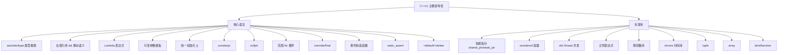
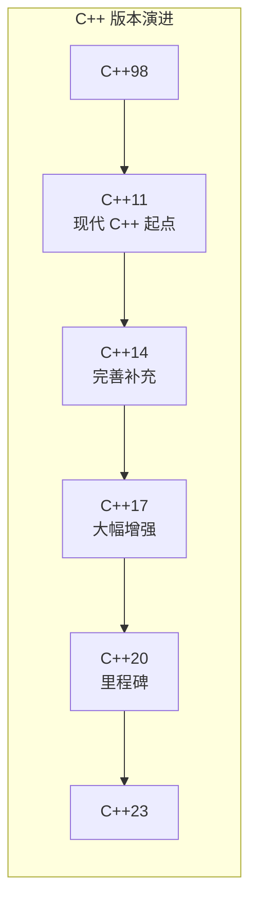
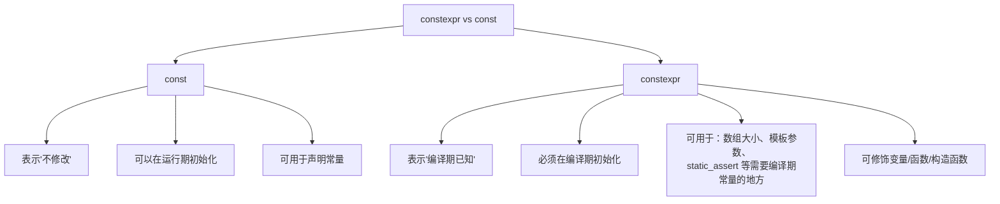
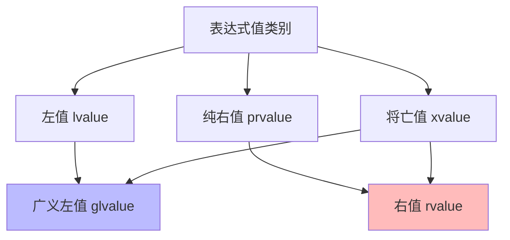
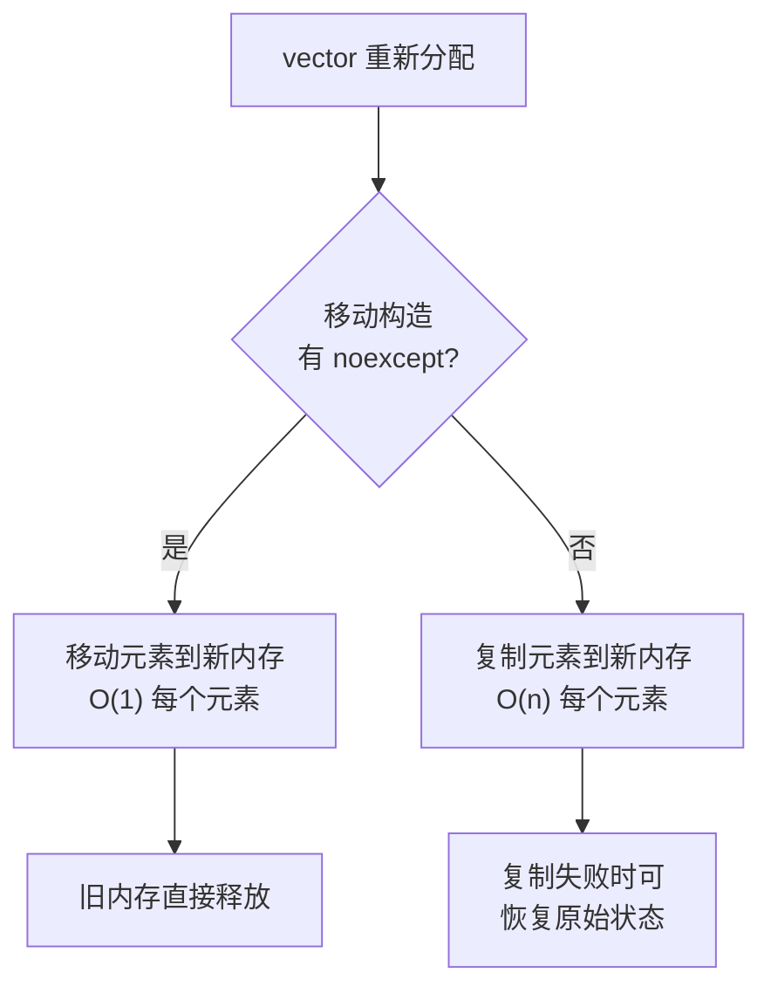
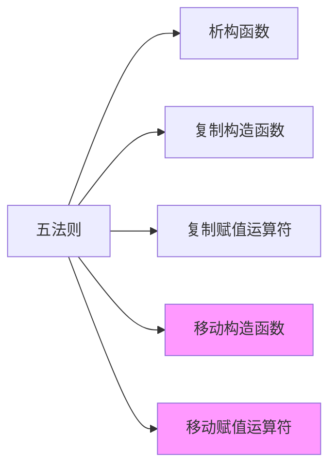
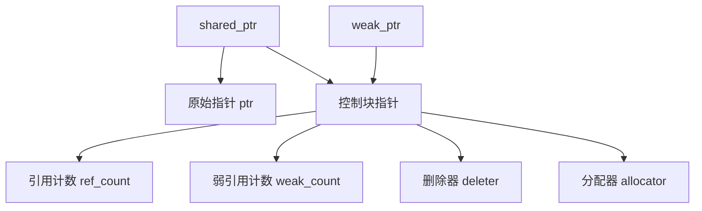
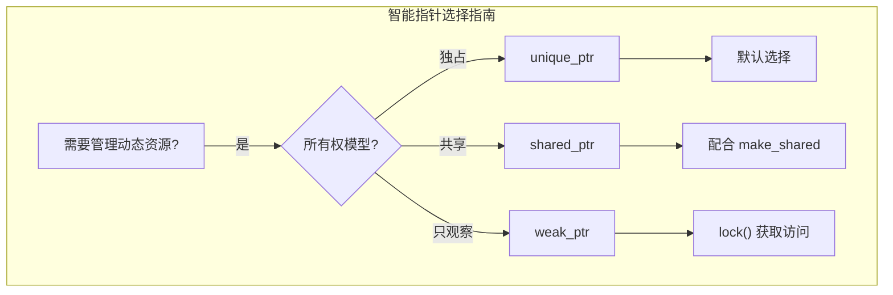
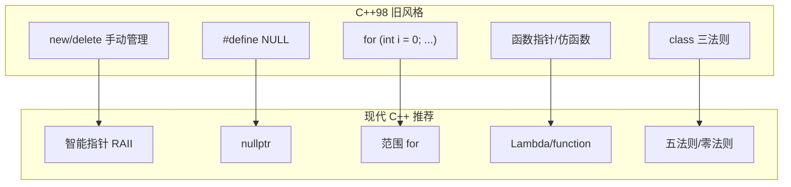
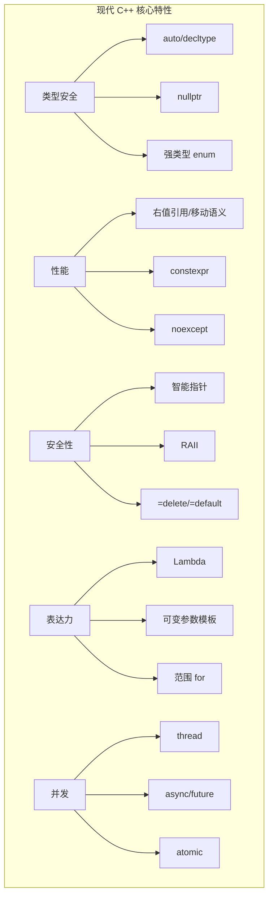

# 第 18 章：探讨 C++ 新标准

> **本章目标**: 掌握 C++11 和 C++14 引入的主要新特性——右值引用和移动语义、智能指针、Lambda 表达式、并发编程、可变参数模板等。这些是现代 C++ 编程的核心。本章还将涵盖 C++17 的重要特性预览和现代 C++ 编程的最佳实践。

---

## 18.1 C++11 新特性概览

C++11 是 C++ 语言自 C++98 以来最大的一次更新，被广泛认为是"现代 C++"的起点。它引入了大量新特性，彻底改变了 C++ 的编程风格。





---

## 18.2 新类型和关键字

### 18.2.1 long long 和 unsigned long long

```cpp
// C++11 引入，保证至少 64 位
long long big = 9223372036854775807LL;
unsigned long long bigger = 18446744073709551615ULL;

// long long 至少 64 位，这在 C++11 中被标准化
static_assert(sizeof(long long) >= 8, "long long must be at least 8 bytes");
```

### 18.2.2 nullptr

#### 18.2.2.1 nullptr 的基本用法

```cpp
// C++11 之前：用 NULL 或 0 表示空指针
int* p1 = NULL;      // C 风格宏，通常定义为 ((void*)0) 或 0
int* p2 = 0;         // C 风格，本质是整型字面量

// C++11：nullptr 是真正的空指针关键字
int* p3 = nullptr;   // 现代 C++ 方式，类型安全
```

#### 18.2.2.2 nullptr 的类型安全优势

```cpp
#include <iostream>
using namespace std;

void func(int) {
    cout << "func(int)" << endl;
}

void func(char*) {
    cout << "func(char*)" << endl;
}

int main() {
    func(0);             // 调用 func(int)——0 优先匹配 int
    // func(NULL);       // 可能调用 func(int)，行为依赖于 NULL 定义
    func(nullptr);       // 调用 func(char*)——正确匹配指针版本！
    
    // nullptr 的类型是 std::nullptr_t
    nullptr_t my_null = nullptr;
    func(my_null);       // 也调用 func(char*)
    
    return 0;
}
```

#### 18.2.2.3 nullptr_t 类型

`nullptr` 的类型是 `std::nullptr_t`，定义在 `<cstddef>` 中。

```cpp
#include <cstddef>
#include <iostream>
using namespace std;

// nullptr_t 可以隐式转换为任何指针类型
void show_nullptr_type() {
    nullptr_t n = nullptr;
    
    int* p1 = n;     // nullptr_t -> int*
    char* p2 = n;    // nullptr_t -> char*
    double* p3 = n;  // nullptr_t -> double*
    void (*fp)() = n; // nullptr_t -> 函数指针
    
    // bool b = n;   // ❌ 不能隐式转换为 bool（C++11 起）
    
    cout << "nullptr_t size: " << sizeof(nullptr_t) << " bytes" << endl;
}
```

#### 18.2.2.4 nullptr 的实现原理

`nullptr` 是一个关键字，其本质是一个 `std::nullptr_t` 类型的纯右值（prvalue）。在编译器内部，它可以被理解为：

```cpp
// 近似实现（非标准，仅用于理解原理）
const class nullptr_t {
public:
    // 可以转换为任何指针类型
    template<class T>
    operator T*() const { return 0; }
    
    // 可以转换为任何成员指针类型
    template<class C, class T>
    operator T C::*() const { return 0; }
    
private:
    void operator&() const;  // 禁止取地址
} nullptr = {};
```

#### 18.2.2.5 nullptr 在模板中的优越性

```cpp
#include <iostream>
#include <memory>
#include <type_traits>
using namespace std;

// 在模板中，nullptr 保持类型安全
template <typename T>
bool is_null(T ptr) {
    if constexpr (is_pointer_v<T>) {
        return ptr == nullptr;
    }
    return false;
}

template <typename T>
class MyPtr {
private:
    T* ptr;
public:
    MyPtr() : ptr(nullptr) {}     // ✅ 清晰明确
    MyPtr(std::nullptr_t) : ptr(nullptr) {}  // 允许 nullptr 构造
};

int main() {
    is_null(nullptr);  // OK
    // is_null(0);     // 编译错误（在 C++20 is_pointer_v<int> = false）
    return 0;
}
```

**总结**：始终使用 `nullptr` 而非 `NULL` 或 `0` 表示空指针。

### 18.2.3 auto 类型推断

#### 18.2.3.1 auto 的基本用法

```cpp
// C++11 auto：编译器自动推断类型

auto x = 42;                // int
auto d = 3.14;              // double
auto s = "Hello";           // const char*
auto v = vector<int>{1,2,3}; // vector<int>

// 简化复杂类型
map<string, vector<int>> m;
auto it = m.begin();        // 不用写冗长的迭代器类型

// 范围 for 循环中的 auto
for (const auto& pair : m) {
    cout << pair.first << endl;
}
```

#### 18.2.3.2 auto 的类型推导规则

`auto` 的类型推导规则与函数模板参数推导规则**完全一致**。

```cpp
// auto 推导规则总结
// auto    -> 传值：忽略引用和顶层 const/volatile
// auto&   -> 传引用：保留 const
// auto&&  -> 万能引用：根据初始化表达式推导

int x = 42;
const int cx = 42;
const int& crx = x;

auto a1 = x;     // int (忽略顶层 const 和引用)
auto a2 = cx;    // int (const 被丢弃)
auto a3 = crx;   // int (引用和 const 都被丢弃)

auto& b1 = x;    // int&
auto& b2 = cx;   // const int& (保留 const)
auto& b3 = crx;  // const int&

const auto c1 = x;   // const int
const auto& c2 = x;  // const int&

// 数组退化
const char arr[] = "hello";
auto a4 = arr;       // const char* (退化为指针)
auto& a5 = arr;      // const char (&)[6] (引用不退化)

// 初始化列表
// auto a6 = {1, 2, 3};  // C++11: std::initializer_list<int>
// auto a7 {1};          // C++17 起: int (直接初始化)
```

#### 18.2.3.3 auto 的各种使用场景

```cpp
// 1. 简化迭代器声明
map<string, vector<pair<int, double>>> complex_map;
auto it = complex_map.begin();
// 等价于：
// map<string, vector<pair<int, double>>>::iterator it = complex_map.begin();

// 2. Lambda 类型（只有编译器知道类型）
auto lambda = [](int x) { return x * 2; };

// 3. 模板中简化类型
template <typename Container>
void process(const Container& c) {
    for (const auto& elem : c) {
        // ...
    }
}

// 4. 结构化绑定（C++17）
auto [key, value] = *map.begin();

// 5. 函数返回类型（C++14）
auto add(int x, double y) {
    return x + y;  // 返回 double
}

// 6. decltype(auto)（C++14）
// 保留引用和 const 语义
```

#### 18.2.3.4 auto 的注意事项

```cpp
// 1. auto 会退化
int func() { return 42; }
auto result = func();     // int，不是 int&

// 2. 使用 auto&& 保持完美转发
auto&& forwarded = some_expression;

// 3. 不要让 auto 推导代理类型
// vector<bool>::operator[] 返回代理对象而非 bool&
auto flag = vec_bool[0];   // 可能得到代理类型而非 bool
bool flag2 = vec_bool[0];  // 明确指定类型

// 4. auto 不能用于函数参数（C++14 泛型 Lambda 除外）
// auto 推导发生在编译期，不会影响运行时性能
```

### 18.2.4 decltype

#### 18.2.4.1 decltype 的基本用法

```cpp
// decltype：获取表达式的类型，保留引用和 const 语义

int x = 10;
const int& crx = x;

decltype(x) y = 20;           // int
decltype(crx) z = x;          // const int& (保留引用和 const)
decltype(42) n = 0;           // int (字面量是 int)

// 在模板中非常有用
template <typename T, typename U>
auto add(T a, U b) -> decltype(a + b) {  // 后置返回类型
    return a + b;
}

// C++14 可以简化为：
template <typename T, typename U>
auto add(T a, U b) {
    return a + b;
}
```

#### 18.2.4.2 decltype 推导规则

```cpp
// decltype(expr) 的推导规则：

int x = 42;
int& rx = x;
const int cx = 42;

// 规则 1：如果 expr 是不带括号的标识符或类成员，则推导出其声明类型
decltype(x)      a = x;   // int
decltype(rx)     b = x;   // int&
decltype(cx)     c = 42;  // const int

// 规则 2：如果 expr 是一个函数调用，推导出返回类型
int foo();
decltype(foo())  d = x;   // int

// 规则 3：如果 expr 是一个左值（带括号的标识符等），推导出 T&
decltype((x))    e = x;   // int&（注意括号！）

// 规则 4：如果 expr 是右值，推导出 T
decltype(42)     f = 0;   // int

// 典型陷阱
int arr[10];
decltype(arr[0]) g = x;   // int&（数组下标返回左值引用）
```

#### 18.2.4.3 decltype(auto)（C++14）

```cpp
// decltype(auto) 结合 auto 的便利和 decltype 的精确语义

// 场景 1：保留引用语义
int global = 42;

decltype(auto) get_ref() {
    return global;   // decltype(global) = int&，所以返回 int&
}

auto get_val() {
    return global;   // auto 退化为 int
}

// 场景 2：转发函数
template <typename Container>
decltype(auto) get_first(Container& c) {
    return c[0];     // 保留 c[0] 的引用语义
}

// decltype(auto) 必须单独声明，不能写 extra specifiers
// const decltype(auto) x = expr;  // ❌ 编译错误
```

### 18.2.5 constexpr

#### 18.2.5.1 constexpr 与 const 的区别

```cpp
// const：运行时常量，表示"不修改"
// constexpr：编译期常量，表示"值在编译期可知"

// const 可以修饰运行期才确定的量
int x;
cin >> x;
const int cx = x;       // ✅ 运行期 const，没问题

// constexpr 必须在编译期确定
// constexpr int ce = x; // ❌ 编译错误：x 不是常量表达式

// constexpr 变量必然也是 const
constexpr int ce = 42;  // 等价于 const int ce = 42，但 constexpr 强制编译期求值
```



#### 18.2.5.2 constexpr 变量

```cpp
constexpr double PI = 3.14159265359;
constexpr int MONTHS = 12;
constexpr int days_in_month[] = {31, 28, 31, 30, 31, 30, 31, 31, 30, 31, 30, 31};

// constexpr 变量可以用于需要编译期常量的场景
int arr[MONTHS];                     // ✅ 数组大小
template <int N> struct FixedArray {};
FixedArray<MONTHS> fa;               // ✅ 模板参数
static_assert(MONTHS == 12, "?");    // ✅ static_assert
```

#### 18.2.5.3 constexpr 函数

```cpp
// C++11：constexpr 函数只能包含一条 return 语句
constexpr int square(int x) {
    return x * x;
}

// C++14：可以有更复杂的逻辑（循环、分支、局部变量）
constexpr int factorial(int n) {
    int result = 1;
    for (int i = 2; i <= n; ++i) {
        result *= i;
    }
    return result;
}

// constexpr 函数既可以在编译期求值，也可以在运行期调用
int main() {
    constexpr int size = square(5);    // 编译期计算
    int arr[size];                      // 编译期大小已知
    
    int runtime = 10;
    int runtime_sq = square(runtime);  // 运行时也可以调用
    
    // constexpr 上下文强制编译期求值
    constexpr int fac_10 = factorial(10);  // 编译期计算 3628800
    
    return 0;
}
```

**注意**：constexpr 函数不保证一定在编译期求值。只有在 constexpr 上下文中（用于 constexpr 变量、模板参数、static_assert 等）才会强制编译期求值。**C++20 引入了 `consteval`，强制函数只能在编译期求值。**

#### 18.2.5.4 constexpr 构造函数

```cpp
// C++11 起，可以定义 constexpr 构造函数创建编译期对象

class Point {
private:
    double x_, y_;
public:
    // constexpr 构造函数：函数体必须为空，初始化列表必须全是 constexpr
    constexpr Point(double x, double y) : x_(x), y_(y) {}
    
    constexpr double x() const { return x_; }
    constexpr double y() const { return y_; }
};

// 使用 constexpr 对象
constexpr Point origin(0.0, 0.0);
constexpr Point p(3.0, 4.0);

// 调用 constexpr 成员函数
constexpr double dist_sq = p.x() * p.x() + p.y() * p.y();  // 编译期计算

// 更复杂的 constexpr 类
class Complex {
private:
    double real_, imag_;
public:
    constexpr Complex(double r, double i) : real_(r), imag_(i) {}
    constexpr double real() const { return real_; }
    constexpr double imag() const { return imag_; }
    constexpr Complex operator+(const Complex& other) const {
        return Complex(real_ + other.real_, imag_ + other.imag_);
    }
};

int main() {
    constexpr Complex a(1.0, 2.0);
    constexpr Complex b(3.0, 4.0);
    constexpr Complex c = a + b;  // 完全在编译期完成！
    return 0;
}
```

#### 18.2.5.5 constexpr 在模板中的使用

```cpp
// constexpr 在模板中非常有用

// 编译期条件判断
template <typename T>
constexpr T max_of(T a, T b) {
    return a > b ? a : b;
}

// 与 SFINAE 结合
template <typename T>
constexpr bool is_integral_v = false;

template <>
constexpr bool is_integral_v<int> = true;

template <typename T>
void process(T value) {
    if constexpr (is_integral_v<T>) {  // C++17 if constexpr
        // 整数处理
    } else {
        // 非整数处理
    }
}
```

#### 18.2.5.6 C++14/17 对 constexpr 的增强

| 版本 | 增强内容 |
|------|---------|
| C++11 | constexpr 函数只能有一条 return 语句，不能有循环/分支/局部变量 |
| C++14 | 允许在 constexpr 函数中使用：循环、分支、局部变量、多 return 语句 |
| C++17 | constexpr Lambda 表达式；if constexpr 编译期分支 |
| C++20 | constexpr 虚函数、constexpr 动态内存分配、consteval、constinit |

```cpp
// C++17 constexpr Lambda
constexpr auto lambda = [](int x) { return x * x; };
constexpr int result = lambda(5);  // 编译期执行

// C++17 if constexpr
template <typename T>
auto get_value(T t) {
    if constexpr (std::is_pointer_v<T>) {
        return *t;
    } else {
        return t;
    }
}
```

---

## 18.3 右值引用和移动语义

右值引用和移动语义是 C++11 最重大的改进之一，它们解决了 C++98 中临时对象深拷贝带来的性能问题。

### 18.3.1 值类别（Value Categories）

C++11 引入了更复杂的值类别体系，基于表达式是否拥有身份（identity）和是否可移动（movable）进行分类。



**值类别分类**：

| 类别 | 含义 | 示例 |
|------|------|------|
| **lvalue**（左值） | 有身份、不可移动 | 变量名、函数名、`*p`、`++i` |
| **prvalue**（纯右值） | 无身份、可移动 | 字面量、`i++`、函数返回的非引用类型 |
| **xvalue**（将亡值） | 有身份、可移动 | `std::move(i)`、`static_cast<T&&>(i)` |

```cpp
#include <iostream>
#include <string>
#include <utility>
using namespace std;

void check_category(const int&) { cout << "左值\n"; }
void check_category(int&&) { cout << "右值\n"; }

int main() {
    int x = 10;
    
    // lvalue：有身份（可取地址），不可移动
    check_category(x);          // 左值
    check_category(++x);        // 左值（前置++返回左值引用）
    
    // prvalue：无身份，可移动
    check_category(42);         // 右值（字面量是纯右值）
    check_category(x++);        // 右值（后置++返回纯右值）
    check_category(x + 1);      // 右值（算术表达式返回纯右值）
    
    // xvalue：有身份，可移动
    check_category(std::move(x));           // 右值（将亡值）
    check_category(static_cast<int&&>(x));  // 右值（将亡值）
    
    return 0;
}
```

### 18.3.2 右值引用

```cpp
// && 声明右值引用

int x = 10;

// 左值引用：绑定到左值
int& lref = x;       // ✅
// int& lref2 = 10;  // ❌ 不能绑定到右值

// 右值引用：绑定到右值
int&& rref = 10;     // ✅ 右值引用绑定到右值字面量
int&& rref2 = x + 1; // ✅ 绑定到右值表达式
// int&& rref3 = x;  // ❌ 不能绑定到左值

// std::move：将左值转为右值引用
int&& rref4 = std::move(x);  // ✅ 通过 move 转换
```

**关键理解**：右值引用本身是**左值**（有名有地址）。正是因为这个原因，移动构造函数的参数 `T&&` 本身在函数体内是左值，需要通过 `std::move` 再次转换：

```cpp
void process(int&& rval_ref) {
    // 在这里，rval_ref 是左值（有名字）
    // 如果要继续向右值传递，需要 std::move
    another_func(std::move(rval_ref));
}
```

### 18.3.3 移动构造函数和移动赋值

```cpp
#include <iostream>
#include <cstring>
#include <vector>
#include <utility>
using namespace std;

class String {
private:
    char* str;
    int len;
    
public:
    // 构造函数
    String(const char* s = "") {
        len = strlen(s);
        str = new char[len + 1];
        strcpy(str, s);
        cout << "构造函数: " << str << endl;
    }
    
    // 复制构造函数（深拷贝）
    String(const String& other) {
        len = other.len;
        str = new char[len + 1];
        strcpy(str, other.str);
        cout << "复制构造: " << str << endl;
    }
    
    // 移动构造函数（C++11）
    String(String&& other) noexcept 
        : str(other.str), len(other.len) {   // 偷走资源
        other.str = nullptr;                  // 原对象置为空
        other.len = 0;
        cout << "移动构造: (偷走资源)" << endl;
    }
    
    // 复制赋值运算符
    String& operator=(const String& other) {
        if (this == &other) return *this;
        delete[] str;
        len = other.len;
        str = new char[len + 1];
        strcpy(str, other.str);
        cout << "复制赋值" << endl;
        return *this;
    }
    
    // 移动赋值运算符（C++11）
    String& operator=(String&& other) noexcept {
        if (this == &other) return *this;
        delete[] str;
        str = other.str;          // 偷走资源
        len = other.len;
        other.str = nullptr;      // 原对象置空
        other.len = 0;
        cout << "移动赋值" << endl;
        return *this;
    }
    
    ~String() {
        if (str) {
            cout << "析构: " << str << endl;
        } else {
            cout << "析构: nullptr" << endl;
        }
        delete[] str;
    }
};

// 工厂函数：返回临时对象（右值）
String createString() {
    String s("临时对象");
    return s;  // 移动构造（或编译器 RVO 优化）
}

int main() {
    // 移动构造
    String s1("Hello");
    String s2 = std::move(s1);   // 调用移动构造函数
    // s1 不再持有资源
    
    // 移动赋值
    String s3("World");
    s3 = std::move(s2);           // 调用移动赋值运算符
    
    // 从函数返回
    String s4 = createString();   // 移动构造或 RVO
    
    return 0;
}
```

### 18.3.4 std::move 的实现原理

`std::move` 实际上**不执行任何移动操作**，它只是一个类型转换（cast）。

```cpp
// std::move 的近似实现
namespace std {
    template <typename T>
    typename remove_reference<T>::type&& move(T&& t) noexcept {
        // 将传入的值强制转换为右值引用
        return static_cast<typename remove_reference<T>::type&&>(t);
    }
}

// 使用示例
std::string str = "hello";

// std::move(str) 返回 string&&，然后绑定到移动构造函数的参数
std::string moved = std::move(str);
// 等价于：
std::string moved2 = static_cast<std::string&&>(str);
```

**关键理解**：
- `std::move` 不移动任何东西，它只是将参数强制转换为右值引用
- 真正的移动发生在移动构造函数/移动赋值运算符中
- 对 const 对象使用 `std::move` 会退化为复制（因为移动构造函数通常不接受 const 右值引用）

```cpp
const std::string const_str = "hello";
auto moved = std::move(const_str);  
// 结果是复制而非移动！
// 因为 const_str 是 const，std::move 返回 const string&&
// 而移动构造函数的参数是 string&&，const string&& 不能匹配
// 最终调用的是复制构造函数（const string&）
```

### 18.3.5 std::forward 和完美转发

完美转发（Perfect Forwarding）是指函数模板将参数"原样"转发给另一个函数——保持参数的左值/右值属性和 const 属性。

```cpp
#include <iostream>
#include <utility>
using namespace std;

// 目标函数
void target(int& x) {
    cout << "左值: " << x << endl;
}

void target(int&& x) {
    cout << "右值: " << x << endl;
}

// 不使用完美转发的转发函数
template <typename T>
void bad_forward(T x) {
    target(x);  // 总是左值（因为 x 有名字）
}

// 使用完美转发的转发函数
template <typename T>
void good_forward(T&& x) {           // T&& 是万能引用（注意：不是右值引用）
    target(std::forward<T>(x));      // 保持原始值类别
}

int main() {
    int a = 42;
    
    bad_forward(a);     // 输出"左值"——丢失了原始属性
    bad_forward(42);    // 输出"左值"——丢失了右值属性
    
    good_forward(a);    // 输出"左值"——正确
    good_forward(42);   // 输出"右值"——正确
    
    return 0;
}
```

**std::forward 的实现原理**：

```cpp
// std::forward 的近似实现
namespace std {
    // 用于左值（T 被推导为 T&）
    template <typename T>
    T&& forward(typename remove_reference<T>::type& param) {
        return static_cast<T&&>(param);
    }
    
    // 用于右值（T 被推导为 T）
    template <typename T>
    T&& forward(typename remove_reference<T>::type&& param) {
        return static_cast<T&&>(param);
    }
}
```

### 18.3.6 引用折叠规则

引用折叠（Reference Collapsing）是理解万能引用（Universal Reference / Forwarding Reference）的关键。

```cpp
// 引用折叠规则：
// T&  &   -> T&
// T&  &&  -> T&
// T&& &   -> T&
// T&& &&  -> T&&

template <typename T>
void func(T&& param);  // T&& 是万能引用（不是右值引用！）

void explain_forwarding_reference() {
    int x = 42;
    
    // 传入左值 int&: T 被推导为 int&
    // 参数类型变为 int& && -> int&（左值引用）
    func(x);
    
    // 传入右值 int: T 被推导为 int
    // 参数类型变为 int&&（右值引用）
    func(42);
    
    // 传入 const 左值: T 被推导为 const int&
    const int cx = 42;
    func(cx);  // 参数为 const int&
}

// 区分万能引用和右值引用
void not_forwarding(int&& param);        // 右值引用（不是模板）
template <typename T>
void forwarding(T&& param);              // 万能引用
template <typename T>
void not_forwarding2(std::vector<T>&& param);  // 右值引用（不是万能引用）
```

**判断是否为万能引用的条件**：
1. 必须是 `T&&` 的形式
2. T 必须由模板参数推导而来（不能用 `auto&&` 在 C++14 泛型 Lambda 中也是万能引用）

### 18.3.7 移动构造函数和 noexcept

移动操作应该用 `noexcept` 声明，这有重要的性能影响。

```cpp
#include <vector>
#include <iostream>
using namespace std;

class Movable {
public:
    Movable() = default;
    
    // noexcept 移动构造函数
    Movable(Movable&&) noexcept {
        cout << "noexcept 移动构造" << endl;
    }
    
    Movable(const Movable&) {
        cout << "复制构造" << endl;
    }
};

class MovableNoexcept {
public:
    MovableNoexcept() = default;
    
    // 没有 noexcept
    MovableNoexcept(MovableNoexcept&&) {
        cout << "移动构造（无 noexcept）" << endl;
    }
    
    MovableNoexcept(const MovableNoexcept&) {
        cout << "复制构造" << endl;
    }
};

int main() {
    // 场景：vector 重新分配内存
    vector<Movable> v1;
    v1.push_back(Movable());
    v1.push_back(Movable());  // 这里可能触发重新分配
    // 由于移动构造函数是 noexcept，vector 会使用移动而非复制
    cout << "---" << endl;
    
    vector<MovableNoexcept> v2;
    v2.push_back(MovableNoexcept());
    v2.push_back(MovableNoexcept());  // 由于没有 noexcept，vector 选择复制！
    // 这是因为 std::vector 需要强异常安全保证：
    // 如果移动操作可能抛异常，vector 会使用复制操作作为回退
    
    return 0;
}
```

**为什么 noexcept 移动构造函数如此重要？**

`std::vector` 在重新分配内存时，如果有 `noexcept` 移动构造函数，它会将现有元素移动到新内存中（高效）。如果没有 `noexcept`，它会退回到复制操作（低效但安全），以保证异常发生时可以恢复到原始状态。



### 18.3.8 移动语义对标准库的影响

```cpp
#include <iostream>
#include <string>
#include <vector>
#include <algorithm>
#include <utility>
using namespace std;

void stl_move_examples() {
    // 1. string 支持移动
    string s1 = "hello world very long string";
    string s2 = std::move(s1);  // 高效：只交换内部指针
    // s1 现在为空（或者未指定但合法的状态）
    
    // 2. vector 支持移动
    vector<int> v1(1000000, 42);
    vector<int> v2 = std::move(v1);  // O(1)：只交换指针
    // v1 为空
    
    // 3. 算法中的移动
    vector<string> words{"apple", "banana", "cherry"};
    // std::copy 保持原值
    // std::move 算法（<algorithm> 中的 move）实际执行移动
    vector<string> dest(3);
    move(words.begin(), words.end(), dest.begin());
    // words 中的元素被移走了
    
    // 4. push_back 现在有重载
    vector<string> vec;
    string s = "hello";
    vec.push_back(s);             // 复制
    vec.push_back(std::move(s));  // 移动
    // emplace_back 构造新元素
    vec.emplace_back("world");    // 直接在容器中构造，避免临时对象
}

int main() {
    stl_move_examples();
    return 0;
}
```

### 18.3.9 五法则（Rule of Five）

C++98 的三法则（Rule of Three）在 C++11 中扩展为五法则：



```cpp
class Resource {
public:
    // 1. 构造函数
    Resource() : data(new int[1000]) {}
    
    // 2. 析构函数
    ~Resource() { delete[] data; }
    
    // 3. 复制构造函数
    Resource(const Resource& other) {
        data = new int[1000];
        std::copy(other.data, other.data + 1000, data);
    }
    
    // 4. 复制赋值运算符
    Resource& operator=(const Resource& other) {
        if (this != &other) {
            delete[] data;
            data = new int[1000];
            std::copy(other.data, other.data + 1000, data);
        }
        return *this;
    }
    
    // 5. 移动构造函数
    Resource(Resource&& other) noexcept 
        : data(std::exchange(other.data, nullptr)) {}
    
    // 6. 移动赋值运算符
    Resource& operator=(Resource&& other) noexcept {
        if (this != &other) {
            delete[] data;
            data = std::exchange(other.data, nullptr);
        }
        return *this;
    }
    
private:
    int* data;
};
```

**最佳实践**：如果类管理资源（动态内存、文件句柄等），并且自定义了析构函数、复制操作或移动操作中的任何一个，应该定义全部五个。或者更简单：使用 `=default` 或 `=delete` 明确声明意图。

如果一个类不需要自定义析构函数，遵循**零法则（Rule of Zero）**：让编译器自动生成所有特殊成员函数，或者使用智能指针等 RAII 包装器管理资源。

```cpp
// 零法则（推荐）
class RuleOfZero {
private:
    std::string name;     // RAII 类型自动管理
    std::vector<int> data;
    std::unique_ptr<int> ptr;
    // 不需要自定义任何特殊成员函数！
    // 编译器生成的复制/移动/析构自动处理所有资源
};
```

---

## 18.4 智能指针

### 18.4.1 为什么需要智能指针

```cpp
// 原始指针的问题：
void unsafe_code() {
    int* p = new int(42);
    // ... 如果这里抛出异常或忘记 delete
    // 内存泄漏！
    if (some_condition) throw std::runtime_error("oops");
    delete p;  // 这行可能永远不会执行
}

// RAII 解决方案：智能指针在析构时自动释放资源
void safe_code() {
    auto p = std::make_unique<int>(42);  // 离开作用域自动释放
    if (some_condition) throw std::runtime_error("oops");
    // 即使异常也能正确释放
}
```

### 18.4.2 auto_ptr 的废弃原因

`auto_ptr` 是 C++98 引入的"智能指针"，但存在严重缺陷，在 C++11 中被弃用，C++17 中被移除。

```cpp
// auto_ptr 的问题：
std::auto_ptr<int> p1(new int(42));
std::auto_ptr<int> p2 = p1;  // "复制"操作会转移所有权！
// 此时 p1 是空指针，但看起来像复制语义

// 更危险的是：
std::vector<std::auto_ptr<int>> vec;
vec.push_back(std::auto_ptr<int>(new int(1)));
vec.push_back(std::auto_ptr<int>(new int(2)));
// vector 内部排序或重新分配时，auto_ptr 的所有权转移导致不确定状态！

// unique_ptr 的解决方案：禁止复制，只允许移动
std::unique_ptr<int> u1(new int(42));
// std::unique_ptr<int> u2 = u1;  // ❌ 编译错误
std::unique_ptr<int> u3 = std::move(u1);  // ✅ 必须显式转移
```

### 18.4.3 unique_ptr 自定义删除器

```cpp
#include <iostream>
#include <memory>
#include <cstdio>
using namespace std;

// 默认删除器是 delete
auto ptr = make_unique<int>(42);

// 自定义删除器：处理文件资源
struct FileDeleter {
    void operator()(FILE* file) const {
        if (file) {
            fclose(file);
            cout << "文件已关闭" << endl;
        }
    }
};

// unique_ptr 使用自定义删除器（删除器类型是模板参数的一部分）
unique_ptr<FILE, FileDeleter> file_ptr(fopen("test.txt", "w"));

// 使用 Lambda 作为删除器
auto lambda_deleter = [](FILE* file) {
    if (file) {
        fclose(file);
        cout << "Lambda: 文件已关闭" << endl;
    }
};

// Lambda 删除器：注意声明类型
unique_ptr<FILE, decltype(lambda_deleter)> file_ptr2(
    fopen("test2.txt", "w"), lambda_deleter
);

// 自定义删除器场景：内存池、特殊分配器
struct PoolAllocatorDeleter {
    void operator()(int* p) const {
        // 归还到内存池而非 delete
        cout << "归还内存到池中" << endl;
        // pool_deallocate(p);
    }
};

unique_ptr<int, PoolAllocatorDeleter> pool_ptr(
    new int(42), PoolAllocatorDeleter{}
);
```

**自定义删除器对 unique_ptr 大小的影响**：
- 无状态函数对象（如空 struct）：不增加大小（空基类优化 EBO）
- Lambda 无捕获：不增加大小
- 函数指针：增加一个指针大小
- Lambda 有捕获：增加捕获变量的大小

```cpp
cout << sizeof(unique_ptr<int>) << endl;                    // 通常 8 字节（64位）
cout << sizeof(unique_ptr<int, FileDeleter>) << endl;       // 还是 8 字节（EBO）
cout << sizeof(unique_ptr<int, decltype(lambda_deleter)>) << endl; // 还是 8 字节

auto capturing_lambda = [file = fopen("test.txt", "w")](FILE*) mutable {
    // 有捕获的 Lambda
};
// cout << sizeof(unique_ptr<FILE, decltype(capturing_lambda)>) << endl; // 可能 16 字节
```

### 18.4.4 shared_ptr 的控制块结构



```cpp
// shared_ptr 的控制块包含：
// 1. 强引用计数（管理对象的生命周期）
// 2. 弱引用计数（管理控制块本身的生命周期）
// 3. 删除器（自定义销毁方式）
// 4. 分配器

#include <iostream>
#include <memory>
using namespace std;

void shared_ptr_control_block() {
    shared_ptr<int> sp1 = make_shared<int>(42);
    // make_shared 将控制块和对象分配在同一块内存中（一次分配）
    // 这样更高效，但对象的内存要等到控制块析构才释放
    
    {
        shared_ptr<int> sp2 = sp1;  // 引用计数 +1
        cout << "use_count: " << sp2.use_count() << endl;  // 2
        
        weak_ptr<int> wp = sp2;     // 弱引用计数 +1（不影响强引用计数）
        cout << "use_count: " << sp1.use_count() << endl;  // 2
    }  // sp2 析构，引用计数变回 1
    
    cout << "use_count: " << sp1.use_count() << endl;  // 1
}  // sp1 析构，引用计数 0，释放对象和控制块

int main() {
    shared_ptr_control_block();
    return 0;
}
```

### 18.4.5 make_shared/make_unique 的优势

```cpp
#include <memory>
#include <iostream>
using namespace std;

class Expensive {
public:
    Expensive() { cout << "构造" << endl; }
    ~Expensive() { cout << "析构" << endl; }
};

void compare_approaches() {
    // 方法 1：直接使用 new（两次分配）
    shared_ptr<Expensive> p1(new Expensive());
    // ① new Expensive() 分配对象内存
    // ② shared_ptr 构造函数分配控制块内存
    // 两次内存分配，两次释放
    
    // 方法 2：使用 make_shared（一次分配，推荐）
    auto p2 = make_shared<Expensive>();
    // ① 一次内存分配：对象 + 控制块
    // 更高效，更好的缓存局部性
    
    // make_unique（C++14）
    auto p3 = make_unique<Expensive>();
}

// make_shared 的异常安全性优势
void process(shared_ptr<Expensive> sp, int value) {
    // 使用 sp 处理...
}

void exception_safety_demo() {
    // 危险用法：
    // process(shared_ptr<Expensive>(new Expensive()), risky_function());
    // 求值顺序未定义：可能 new → risky_function() → shared_ptr 构造
    // 如果 risky_function() 抛异常，new 的对象就泄漏了
    
    // 安全用法：
    // process(make_shared<Expensive>(), risky_function());
    // 对象和控制块一起创建，不存在泄漏窗口
}
```

### 18.4.6 循环引用的更多案例和解决方案

```cpp
#include <iostream>
#include <memory>
#include <vector>
using namespace std;

// 案例 1：双向链表
struct Node {
    int value;
    shared_ptr<Node> next;
    // 问题：如果 prev 也是 shared_ptr，会造成循环引用
    weak_ptr<Node> prev;  // ✅ 使用 weak_ptr 打破循环
    
    ~Node() { cout << "Node " << value << " 析构" << endl; }
};

void linked_list_example() {
    auto head = make_shared<Node>();
    auto tail = make_shared<Node>();
    head->value = 1;
    tail->value = 2;
    
    head->next = tail;
    tail->prev = head;  // weak_ptr，不增加引用计数
    
    // 通过 weak_ptr 访问
    if (auto prev = tail->prev.lock()) {
        cout << "tail 的前驱节点值: " << prev->value << endl;
    }
    
    cout << "head use_count: " << head.use_count() << endl;  // 1（只有 next 指向）
}  // 正常析构

// 案例 2：父子关系树
class Child;

class Parent {
public:
    string name;
    vector<shared_ptr<Child>> children;
    ~Parent() { cout << "Parent " << name << " 析构" << endl; }
};

class Child {
public:
    string name;
    // shared_ptr<Parent> parent;        // ❌ 造成循环引用
    weak_ptr<Parent> parent;             // ✅ 安全
    
    ~Child() { cout << "Child " << name << " 析构" << endl; }
};

void tree_example() {
    auto father = make_shared<Parent>();
    father->name = "爸爸";
    
    auto son = make_shared<Child>();
    son->name = "儿子";
    
    father->children.push_back(son);
    son->parent = father;  // weak_ptr
    
    // 访问父节点
    if (auto p = son->parent.lock()) {
        cout << "孩子的父亲是: " << p->name << endl;
    }
}

// 案例 3：观察者模式
class Observer {
public:
    virtual ~Observer() = default;
    virtual void update() = 0;
};

class Subject {
private:
    vector<shared_ptr<Observer>> observers;
public:
    void attach(const shared_ptr<Observer>& obs) {
        observers.push_back(obs);
    }
    
    void notify() {
        for (auto& obs : observers) {
            obs->update();
        }
    }
};

class ConcreteObserver : public Observer, public enable_shared_from_this<ConcreteObserver> {
public:
    shared_ptr<Subject> subject;
    
    void subscribe(shared_ptr<Subject> s) {
        subject = s;
        // 共享指针指向自己
        s->attach(shared_from_this());  // ✅ 正确获取 shared_ptr
    }
    
    void update() override {
        cout << "收到通知" << endl;
    }
};

int main() {
    linked_list_example();
    cout << "---" << endl;
    tree_example();
    return 0;
}
```

### 18.4.7 enable_shared_from_this

当需要在类内部获取指向 `this` 的 `shared_ptr` 时，需要继承 `enable_shared_from_this`。

```cpp
#include <memory>
#include <iostream>
using namespace std;

// 正确方式
class Good : public enable_shared_from_this<Good> {
public:
    shared_ptr<Good> get_shared() {
        return shared_from_this();  // ✅ 正确
    }
};

// 错误方式
class Bad {
public:
    shared_ptr<Bad> get_shared() {
        return shared_ptr<Bad>(this);  // ❌ 会导致 double delete！
    }
};

void demo() {
    auto g = make_shared<Good>();
    auto g2 = g->get_shared();  // ✅ 正确的 shared_ptr
    
    // auto b = make_shared<Bad>();
    // auto b2 = b->get_shared();  // ❌ 两个 shared_ptr 认为各自拥有所有权
    // 当 b 和 b2 析构时，会 double delete！
}
```

### 18.4.8 智能指针对比

| 指针 | 所有权 | 引用计数 | 性能 | 可复制 | 自定义删除器 | 适用场景 |
|------|--------|---------|------|--------|-------------|---------|
| `unique_ptr` | 独占 | 无 | 最快（与原始指针相同） | 否（只能移动） | 支持（模板参数） | 明确所有权 |
| `shared_ptr` | 共享 | 强引用 | 较快（原子操作维护计数） | 是 | 支持（类型擦除） | 多个所有者 |
| `weak_ptr` | 无 | 弱引用 | 快 | 是 | 不适用 | 观察、打破循环引用 |



> **最佳实践**：默认使用 `unique_ptr`。需要共享时用 `shared_ptr`。需要观察但不拥有时用 `weak_ptr`。尽量用 `make_unique` 和 `make_shared` 创建。

---

## 18.5 Lambda 表达式

Lambda 已经在第 16 章详细讨论，此处从底层实现和更多细节角度展开。

### 18.5.1 Lambda 的底层实现（函数对象）

Lambda 本质上是编译器生成的匿名函数对象（仿函数 / functor）。

```cpp
// Lambda 表达式
auto lambda = [](int x) { return x * 2; };
int result = lambda(5);  // 10

// 编译器展开后大致相当于：
class __AnonymousLambda0 {
public:
    int operator()(int x) const {
        return x * 2;
    }
};
__AnonymousLambda0 lambda_equivalent;
int result_equivalent = lambda_equivalent(5);

// 带捕获的 Lambda
int factor = 3;
auto multiply = [factor](int x) { return x * factor; };

// 编译器展开后大致相当于：
class __AnonymousLambda1 {
private:
    int factor;  // 捕获的变量成为成员变量
public:
    __AnonymousLambda1(int f) : factor(f) {}
    int operator()(int x) const {
        return x * factor;
    }
};
__AnonymousLambda1 multiply_equivalent(factor);
```

### 18.5.2 mutable Lambda

默认情况下，Lambda 的 `operator()` 是 `const` 的，不能修改捕获的副本。使用 `mutable` 可以解除这个限制。

```cpp
#include <iostream>
using namespace std;

void mutable_lambda() {
    int count = 0;
    
    // 默认：不能修改捕获的副本
    auto lambda1 = [count]() {
        // count++;  // ❌ 编译错误：不能修改 const 对象
        return count;
    };
    
    // mutable：允许修改捕获的副本
    auto lambda2 = [count]() mutable {
        count++;  // ✅ 修改的是副本，不影响外部 count
        return count;
    };
    
    cout << lambda2() << endl;  // 1
    cout << lambda2() << endl;  // 2
    cout << count << endl;      // 0（外部变量不受影响）
    
    // 引用捕获时 mutable 的效果
    int val = 10;
    auto lambda3 = [&val]() {  // 引用捕获不需要 mutable
        val++;  // ✅ 修改的是外部变量本身
        return val;
    };
}
```

### 18.5.3 泛型 Lambda（C++14）

```cpp
#include <iostream>
#include <vector>
#include <string>
using namespace std;

// 泛型 Lambda：参数类型使用 auto
auto generic_lambda = [](auto x, auto y) {
    return x + y;
};

cout << generic_lambda(3, 5) << endl;          // 8 (int)
cout << generic_lambda(3.14, 2.72) << endl;    // 5.86 (double)
cout << generic_lambda(string("Hello, "), string("World")) << endl;  // "Hello, World"

// 等价于模板函数对象
struct GenericLambda {
    template <typename T, typename U>
    auto operator()(T x, U y) const -> decltype(x + y) {
        return x + y;
    }
};

// 更复杂的泛型 Lambda
auto sort_by_field = [](const auto& a, const auto& b) {
    return a.size() < b.size();
};

vector<string> words = {"apple", "banana", "cherry"};
sort(words.begin(), words.end(), sort_by_field);  // 按长度排序

// C++20 支持模板 Lambda 语法
// auto templated_lambda = []<typename T>(T x) { return x; };
```

### 18.5.4 捕获初始化（Init Capture / Generalized Lambda Capture）（C++14）

```cpp
#include <memory>
#include <iostream>
using namespace std;

void init_capture_examples() {
    // 1. 直接初始化捕获变量
    auto lambda = [x = 42]() {
        return x;
    };
    cout << lambda() << endl;  // 42
    
    // 2. 移动语义
    auto ptr = make_unique<int>(100);
    auto lambda2 = [p = std::move(ptr)]() {
        return *p;
    };
    // ptr 已被移动，不再持有资源
    cout << lambda2() << endl;  // 100
    
    // 3. 在捕获中计算
    auto lambda3 = [result = 3 + 4 * 5]() {
        return result;
    };
    cout << lambda3() << endl;  // 23
    
    // 4. 调用函数
    auto lambda4 = [str = string("Hello")]() {
        return str.size();
    };
    cout << lambda4() << endl;  // 5
}

// 捕获初始化在 C++11 中的替代方案
void cpp11_alternative() {
    // C++11 需要借助 bind
    auto ptr = make_unique<int>(100);
    auto lambda = bind([](const unique_ptr<int>& p) {
        return *p;
    }, std::move(ptr));
}
```

### 18.5.5 Lambda 与 this

```cpp
#include <iostream>
using namespace std;

class Handler {
private:
    int value = 42;
    
public:
    void process() {
        // C++11：捕获 this 指针
        auto lambda1 = [this]() {
            return this->value;
        };
        
        // C++17：捕获 *this 的副本（捕获对象副本）
        auto lambda2 = [*this]() {
            return value;  // 操作的是副本
        };
        
        // 对比
        int& ref = value;
        auto lambda3 = [&ref]() {
            ref = 100;
            return ref;
        };
        
        // 使用
        cout << lambda1() << endl;  // 42
        cout << lambda2() << endl;  // 42
        
        lambda3();
        cout << value << endl;  // 100（被 lambda3 修改）
        cout << lambda2() << endl;  // 42（副本未被修改）
    }
    
    void async_callback() {
        // 异步回调中的 this 陷阱
        auto bad_lambda = [this]() {
            // 如果对象在回调执行前被销毁，this 是野指针
            process();  // ❌ 可能访问已销毁的对象
        };
        
        // 使用 weak_ptr 解决
        auto self = weak_ptr<Handler>(shared_from_this());
        auto safe_lambda = [self]() {
            if (auto shared = self.lock()) {
                shared->process();
            }
        };
    }
};
```

---

## 18.6 并发编程基础（C++11）

### 18.6.1 线程创建和基本操作

```cpp
#include <iostream>
#include <thread>
#include <chrono>
#include <vector>
using namespace std;

void task(int id, int delay_ms) {
    cout << "线程 " << id << " 开始工作" << endl;
    this_thread::sleep_for(chrono::milliseconds(delay_ms));
    cout << "线程 " << id << " 结束工作" << endl;
}

void thread_basics() {
    // 创建线程
    thread t1(task, 1, 100);
    thread t2(task, 2, 200);
    
    // 获取线程 ID
    cout << "t1 ID: " << t1.get_id() << endl;
    cout << "t2 ID: " << t2.get_id() << endl;
    
    // 主线程等待子线程
    t1.join();
    t2.join();
    
    // 判断线程是否可 join
    cout << "t1 joinable: " << t1.joinable() << endl;  // false（已 join）
    
    // 硬件并发数
    cout << "硬件支持的线程数: " << thread::hardware_concurrency() << endl;
}

// 线程分离
void thread_detach() {
    thread t([]() {
        this_thread::sleep_for(chrono::seconds(1));
        cout << "分离线程执行完毕" << endl;
    });
    
    t.detach();  // 分离线程，主线程不再等待
    // t.join();  // ❌ 分离后不能再 join
    
    // 分离的线程在后台继续运行
    cout << "主线程继续执行" << endl;
}  // 主线程可能先于分离线程结束

// 传递引用给线程
void modify(int& x) {
    x = 42;
}

void thread_reference() {
    int value = 0;
    
    // 需要显式使用 std::ref
    thread t(modify, ref(value));
    t.join();
    
    cout << "value: " << value << endl;  // 42
}

int main() {
    thread_basics();
    thread_reference();
    return 0;
}
```

### 18.6.2 mutex 和锁的进阶使用

```cpp
#include <iostream>
#include <thread>
#include <mutex>
#include <vector>
#include <shared_mutex>  // C++14
using namespace std;

// 1. lock_guard：简单 RAII 锁
mutex mtx1;
int counter = 0;

void increment_lock_guard(int n) {
    for (int i = 0; i < n; i++) {
        lock_guard<mutex> lock(mtx1);  // 构造时锁定，析构时解锁
        counter++;
    }
}

// 2. unique_lock：更灵活的锁
// 可以延迟锁定、提前解锁、尝试锁定
timed_mutex mtx2;

void unique_lock_example() {
    unique_lock<timed_mutex> lock(mtx2, defer_lock);  // 不立即锁定
    // ... 做一些准备工作
    lock.lock();  // 手动锁定
    
    // 临界区
    this_thread::sleep_for(chrono::milliseconds(10));
    
    lock.unlock();  // 提前解锁
    // ... 做其他工作
    lock.lock();  // 再次锁定
    // ...
}  // unique_lock 析构时自动解锁

// 3. try_lock 尝试锁定
void try_lock_example() {
    unique_lock<mutex> lock(mtx1, try_to_lock);
    if (lock.owns_lock()) {
        cout << "成功获取锁" << endl;
        // 临界区
    } else {
        cout << "获取锁失败，做其他事" << endl;
    }
}

// 4. scoped_lock（C++17）：一次锁定多个 mutex，避免死锁
mutex mtx_a, mtx_b;

void scoped_lock_example() {
    // 同时锁定 mtx_a 和 mtx_b，使用死锁避免算法
    scoped_lock lock(mtx_a, mtx_b);
    // 操作共享资源 a 和 b
}

// 5. shared_mutex（C++14）：读写锁
class SharedData {
private:
    mutable shared_mutex rw_mutex;
    int data = 0;
    
public:
    void write(int value) {
        unique_lock lock(rw_mutex);  // 独占锁（写锁）
        data = value;
    }
    
    int read() const {
        shared_lock lock(rw_mutex);  // 共享锁（读锁），可以多个线程同时读
        return data;
    }
};

int main() {
    vector<thread> threads;
    for (int i = 0; i < 10; i++) {
        threads.emplace_back(increment_lock_guard, 1000);
    }
    for (auto& t : threads) {
        t.join();
    }
    cout << "Counter: " << counter << endl;  // 10000
    
    return 0;
}
```

### 18.6.3 async、future 和 promise

`std::async` 提供了一种高级的异步编程模型，比直接使用 `thread` 更安全、更方便。

```cpp
#include <iostream>
#include <future>
#include <chrono>
#include <vector>
#include <numeric>
using namespace std;

// 1. async 和 future
int compute_sum(int n) {
    this_thread::sleep_for(chrono::milliseconds(100));
    return n * (n + 1) / 2;
}

void async_example() {
    // 启动异步任务
    future<int> result = async(launch::async, compute_sum, 1000000);
    
    // 主线程可以做其他工作
    cout << "主线程工作中..." << endl;
    
    // 获取结果（如果任务未完成会阻塞等待）
    int sum = result.get();  // 只能 get 一次！
    cout << "sum(1..1000000) = " << sum << endl;
    
    // launch::deferred：延迟执行（在 get 时执行）
    future<int> deferred = async(launch::deferred, compute_sum, 100);
    // 此时 compute_sum 还未执行
    int val = deferred.get();  // 在这里执行并在同一线程中返回
}

// 2. promise：手动设置 future 的值
void promise_example() {
    promise<int> prom;
    future<int> fut = prom.get_future();
    
    // 在另一个线程中设置值
    thread t([&prom]() {
        this_thread::sleep_for(chrono::milliseconds(100));
        prom.set_value(42);
    });
    
    // 主线程等待
    int result = fut.get();
    cout << "从 promise 获得: " << result << endl;
    
    t.join();
}

// 3. packaged_task：包装可调用对象为异步任务
void packaged_task_example() {
    packaged_task<int(int,int)> task([](int a, int b) {
        return a + b;
    });
    
    future<int> result = task.get_future();
    
    thread t(move(task), 3, 4);  // 在线程中执行
    cout << "packaged_task 结果: " << result.get() << endl;
    
    t.join();
}

// 4. 并行计算示例
int parallel_sum(const vector<int>& v) {
    if (v.size() < 10000) {
        return accumulate(v.begin(), v.end(), 0);
    }
    
    auto mid = v.begin() + v.size() / 2;
    
    // 在另一个线程中计算后半部分
    auto future = async(launch::async, [&v, mid]() {
        return accumulate(mid, v.end(), 0);
    });
    
    // 主线程计算前半部分
    int first_half = accumulate(v.begin(), mid, 0);
    
    // 合并结果
    return first_half + future.get();
}

int main() {
    async_example();
    promise_example();
    packaged_task_example();
    
    // 并行求和
    vector<int> data(100000, 1);
    cout << "并行求和: " << parallel_sum(data) << endl;  // 100000
    
    return 0;
}
```

### 18.6.4 原子操作 atomic 简介

```cpp
#include <iostream>
#include <thread>
#include <atomic>
#include <vector>
using namespace std;

// 1. 原子计数器（无需 mutex）
atomic<int> atomic_counter(0);

void atomic_increment(int n) {
    for (int i = 0; i < n; i++) {
        atomic_counter++;  // 原子递增，无需锁
    }
}

void atomic_example() {
    vector<thread> threads;
    for (int i = 0; i < 10; i++) {
        threads.emplace_back(atomic_increment, 1000);
    }
    for (auto& t : threads) {
        t.join();
    }
    cout << "原子计数器: " << atomic_counter << endl;  // 10000
}

// 2. 原子标志
atomic<bool> flag(false);

void wait_for_flag() {
    while (!flag.load()) {
        // 等待标志位被设置
        this_thread::sleep_for(chrono::milliseconds(1));
    }
    cout << "标志已设置" << endl;
}

// 3. 原子操作和内存序
atomic<int> data_ready(0);
int shared_data = 0;

void producer() {
    shared_data = 42;                              // ① 先写入数据
    data_ready.store(1, memory_order_release);     // ② 再发布标志
}

void consumer() {
    while (data_ready.load(memory_order_acquire) == 0) {
        // 等待
    }
    cout << "共享数据: " << shared_data << endl;   // ③ 安全读取数据
    // memory_order_release/acquire 保证 ①②③ 的正确顺序
}

// 4. 原子智能指针（C++20）
// atomic<shared_ptr<T>> 在 C++20 中可用

int main() {
    atomic_example();
    
    thread t1(producer);
    thread t2(consumer);
    t1.join();
    t2.join();
    
    return 0;
}
```

### 18.6.5 条件变量 condition_variable

```cpp
#include <iostream>
#include <thread>
#include <mutex>
#include <condition_variable>
#include <queue>
using namespace std;

// 生产者-消费者模型
class MessageQueue {
private:
    queue<int> messages;
    mutex mtx;
    condition_variable cv;
    const size_t max_size;
    
public:
    MessageQueue(size_t max = 10) : max_size(max) {}
    
    void produce(int item) {
        unique_lock<mutex> lock(mtx);
        
        // 如果队列已满，等待消费者消费
        cv.wait(lock, [this]() {
            return messages.size() < max_size;
        });
        
        messages.push(item);
        cout << "生产: " << item << " (队列大小: " << messages.size() << ")" << endl;
        
        // 通知消费者
        cv.notify_one();
    }
    
    int consume() {
        unique_lock<mutex> lock(mtx);
        
        // 如果队列为空，等待生产者生产
        cv.wait(lock, [this]() {
            return !messages.empty();
        });
        
        int item = messages.front();
        messages.pop();
        cout << "消费: " << item << " (队列大小: " << messages.size() << ")" << endl;
        
        // 通知生产者
        cv.notify_one();
        
        return item;
    }
};

int main() {
    MessageQueue mq(5);
    
    // 生产者线程
    thread producer([&mq]() {
        for (int i = 0; i < 20; i++) {
            mq.produce(i);
            this_thread::sleep_for(chrono::milliseconds(50));
        }
    });
    
    // 消费者线程
    thread consumer([&mq]() {
        for (int i = 0; i < 20; i++) {
            mq.consume();
            this_thread::sleep_for(chrono::milliseconds(100));
        }
    });
    
    producer.join();
    consumer.join();
    
    cout << "生产者-消费者演示完成" << endl;
    return 0;
}
```

---

## 18.7 C++14 特性补充

### 18.7.1 函数返回类型推导

```cpp
// C++14：auto 可以作为函数返回类型（不需要后置返回类型）
auto add(int x, double y) {
    return x + y;  // 推导为 double
}

// 多 return 语句必须推导出相同类型
auto absolute(int x) {
    if (x < 0) return -x;
    else return x;  // 都是 int，OK
}

// decltype(auto) 返回类型
decltype(auto) get_ref_expr() {
    static int x = 42;
    return (x);  // 返回 int&（注意括号！）
}
```

### 18.7.2 泛型 Lambda（详见 18.5.3）

### 18.7.3 变量模板（Variable Templates）

```cpp
// C++14 引入变量模板
template <typename T>
constexpr T PI = T(3.14159265358979323846);

// 使用示例
double pi_double = PI<double>;      // 3.141592653589793
float pi_float = PI<float>;         // 3.14159265
int pi_int = PI<int>;               // 3（截断）

// 更实用的例子：类型特征辅助
template <typename T>
constexpr bool is_pointer_v = false;  // 类似 C++17 的 is_pointer_v

template <typename T>
constexpr bool is_pointer_v<T*> = true;

// 编译期常量
template <typename T>
constexpr T max_value = T(0);

template <>
constexpr int max_value<int> = 2147483647;

template <>
constexpr double max_value<double> = 1.7976931348623157e+308;
```

### 18.7.4 constexpr 函数增强（见 18.2.5.6）

### 18.7.5 其他 C++14 特性

```cpp
// 二进制字面量和数字分隔符
int x = 0b11001010;        // 二进制字面量
int y = 0b1111'0000;       // 数字分隔符（提高可读性）
int z = 1'000'000;         // 1000000
double pi = 3.141'592'653'589;

// make_unique
auto ptr = make_unique<int>(42);
auto arr = make_unique<int[]>(10);

// deprecated 属性
[[deprecated("使用 newFunc() 代替")]]
void oldFunc() {}

void newFunc() {}

// C++14 标准库新增：std::integer_sequence、std::exchange
#include <utility>
int old = 42;
int new_val = std::exchange(old, 100);  // new_val = 42, old = 100

// std::quoted（在 <iomanip> 中）
#include <iomanip>
string s = "hello \"world\"";
cout << quoted(s) << endl;  // 输出 "hello \"world\""
```

---

## 18.8 委托构造函数

```cpp
class MyClass {
private:
    int x, y;
    string name;
    
public:
    // 主构造函数
    MyClass(int a, int b, const string& n) : x(a), y(b), name(n) {
        cout << "主构造函数" << endl;
    }
    
    // 委托构造函数（调用主构造函数）
    MyClass() : MyClass(0, 0, "default") {
        cout << "委托构造函数（无参）" << endl;
    }
    
    MyClass(int a) : MyClass(a, 0, "partial") {
        cout << "委托构造函数（单参）" << endl;
    }
    
    // 注意：不能同时使用委托和成员初始化
    // MyClass(int a) : MyClass(a, 0, "partial"), x(a) {}  // ❌ 编译错误
    
    // 委托构造函数的限制：不能循环委托
    // A() : B() {}
    // B() : A() {}  // ❌ 循环委托导致未定义行为
};
```

---

## 18.9 可变参数模板

### 18.9.1 基本用法

```cpp
#include <iostream>
using namespace std;

// 基线条件（0 个参数）
void print() {
    cout << endl;
}

// 可变参数模板
template <typename T, typename... Args>
void print(T first, Args... rest) {
    cout << first << " ";
    print(rest...);   // 递归处理剩余参数
}

int main() {
    print(1, 2.5, "hello", 'A');  // 1 2.5 hello A
    return 0;
}
```

### 18.9.2 sizeof... 运算符

```cpp
template <typename... Args>
void count_args(Args... args) {
    cout << "参数个数: " << sizeof...(Args) << endl;
    cout << "参数个数: " << sizeof...(args) << endl;  // 另一种写法
}

count_args(1, 2.5, "hello");  // 参数个数: 3
```

### 18.9.3 折叠表达式（C++17）

```cpp
// C++17 引入了折叠表达式，避免递归
// 一元右折叠 (E op ...)   = E1 op (E2 op (... op EN))
// 一元左折叠 (... op E)   = ((E1 op E2) op ...) op EN

template <typename... Args>
auto sum(Args... args) {
    return (... + args);  // 一元左折叠
}

template <typename... Args>
auto sum_right(Args... args) {
    return (args + ...);  // 一元右折叠（结果相同，求值顺序不同）
}

template <typename... Args>
bool all_true(Args... args) {
    return (... && args);  // 逻辑与折叠
}

template <typename... Args>
bool any_true(Args... args) {
    return (... || args);  // 逻辑或折叠
}

// 二元折叠：带初始值
template <typename... Args>
auto sum_with_base(Args... args) {
    return (args + ... + 0);  // 二元左折叠，空参数包返回 0
}

template <typename... Args>
void print_all(Args... args) {
    (cout << ... << args) << endl;  // 流式折叠
}

int main() {
    cout << sum(1, 2, 3, 4, 5) << endl;        // 15
    cout << sum() << endl;                      // 编译错误（一元折叠需要非空包）
    cout << sum_with_base() << endl;            // 0（二元折叠有初始值）
    print_all("Hello", " ", "World", "!");      // Hello World!
    return 0;
}
```

### 18.9.4 完美转发 + 可变参数模板

```cpp
#include <memory>
#include <utility>
using namespace std;

// emplace_back 的简化实现
template <typename T>
class SimpleVector {
private:
    T* data;
    size_t size;
    size_t capacity;
    
public:
    // 完美转发 + 可变参数模板
    template <typename... Args>
    void emplace_back(Args&&... args) {
        // 在适当位置构造对象，使用完美转发参数
        // new (data + size) T(std::forward<Args>(args)...);
        // size++;
    }
};

// 工厂函数
template <typename T, typename... Args>
auto make_shared_wrapper(Args&&... args) {
    return make_shared<T>(std::forward<Args>(args)...);
}

struct Person {
    string name;
    int age;
    Person(string n, int a) : name(move(n)), age(a) {}
};

int main() {
    auto p = make_shared_wrapper<Person>("Alice", 30);
    return 0;
}
```

---

## 18.10 统一初始化

```cpp
// C++11 统一使用花括号 {} 初始化

int x{42};                  // 基本类型
int arr[]{1, 2, 3};         // 数组
vector<int> v{1, 2, 3};     // 容器
map<string, int> m{{"a", 1}, {"b", 2}};  // map

// 防止窄化转换
int y = 3.14;               // 隐式截断（y = 3，警告）
// int z{3.14};             // 编译错误：narrowing conversion

// 自定义类型
class Point {
public:
    Point(int x, int y) {}
};
Point p{10, 20};

// initializer_list 构造函数优先级
class MyVector {
public:
    // 当存在 initializer_list 构造函数时，花括号优先匹配它
    MyVector(initializer_list<int> il) {
        cout << "initializer_list 构造" << endl;
    }
    
    MyVector(int n, int val) {
        cout << "(n, val) 构造" << endl;
    }
};

MyVector v1{10, 20};    // initializer_list 构造
MyVector v2(10, 20);    // (n, val) 构造
MyVector v3{10};        // initializer_list 构造（{10} -> initializer_list<int>）

// 圆括号和花括号的区别
vector<int> vec1(10, 20);  // 10 个元素，值都是 20
vector<int> vec2{10, 20};  // 2 个元素：10 和 20
```

---

## 18.11 C++11 其他重要特性

### 18.11.1 正则表达式

```cpp
#include <iostream>
#include <regex>
#include <string>
using namespace std;

void regex_examples() {
    string text = "我的邮箱是 alice@example.com，电话是 123-456-7890";
    
    // 匹配邮箱
    regex email_pattern(R"((\w+)@(\w+\.\w+))");
    smatch matches;
    
    if (regex_search(text, matches, email_pattern)) {
        cout << "完整匹配: " << matches[0] << endl;  // alice@example.com
        cout << "用户名: " << matches[1] << endl;     // alice
        cout << "域名: " << matches[2] << endl;       // example.com
    }
    
    // 迭代匹配
    regex word_pattern(R"(\w+)");
    auto words_begin = sregex_iterator(text.begin(), text.end(), word_pattern);
    auto words_end = sregex_iterator();
    
    cout << "所有单词: ";
    for (auto it = words_begin; it != words_end; ++it) {
        cout << (*it).str() << " ";
    }
    cout << endl;
    
    // 替换
    string result = regex_replace(text, email_pattern, "***@***.***");
    cout << "替换后: " << result << endl;
    
    // 验证格式
    string phone = "123-456-7890";
    regex phone_pattern(R"(\d{3}-\d{3}-\d{4})");
    if (regex_match(phone, phone_pattern)) {
        cout << "有效电话号码" << endl;
    }
}
```

### 18.11.2 随机数库

```cpp
#include <iostream>
#include <random>
#include <vector>
#include <algorithm>
using namespace std;

void random_examples() {
    // 随机数引擎
    random_device rd;   // 真随机数种子（如果可以）
    mt19937 gen(rd());  // 梅森旋转算法
    // 使用固定种子可复现
    // mt19937 gen(42);
    
    // 均匀分布
    uniform_int_distribution<int> dice(1, 6);
    uniform_real_distribution<double> real_dist(0.0, 1.0);
    
    cout << "骰子: ";
    for (int i = 0; i < 10; i++) {
        cout << dice(gen) << " ";
    }
    cout << endl;
    
    // 正态分布
    normal_distribution<double> normal_dist(0.0, 1.0);  // 均值 0，标准差 1
    cout << "正态分布: ";
    for (int i = 0; i < 10; i++) {
        cout << normal_dist(gen) << " ";
    }
    cout << endl;
    
    // 生成随机数并排序
    vector<int> nums(10);
    for (auto& n : nums) n = dice(gen);
    sort(nums.begin(), nums.end());
    
    // 随机打乱
    shuffle(nums.begin(), nums.end(), gen);
    
    // 从容器中随机选择
    uniform_int_distribution<size_t> pick(0, nums.size() - 1);
    cout << "随机选择: " << nums[pick(gen)] << endl;
}
```

### 18.11.3 chrono 时间库

```cpp
#include <iostream>
#include <chrono>
#include <thread>
using namespace std;
using namespace chrono;

void chrono_examples() {
    // 1. 时钟类型
    auto t1 = high_resolution_clock::now();
    auto t2 = steady_clock::now();
    auto t3 = system_clock::now();
    
    // 2. 时间段 duration
    seconds sec(10);
    minutes min(5);
    hours hr(2);
    milliseconds ms(100);
    
    // 数学运算
    auto total = sec + min + hr;  // std::chrono::seconds
    auto half = sec / 2;           // 5 秒
    auto doubled = sec * 2;        // 20 秒
    
    cout << "total: " << total.count() << " 秒" << endl;
    
    // 3. 时间点 time_point
    auto start = steady_clock::now();
    this_thread::sleep_for(milliseconds(50));
    auto end = steady_clock::now();
    
    auto elapsed = duration_cast<microseconds>(end - start);
    cout << "程序执行: " << elapsed.count() << " 微秒" << endl;
    
    // 4. 字面量（C++14）
    using namespace literals;
    auto dur1 = 5s;      // 5 秒
    auto dur2 = 100ms;   // 100 毫秒
    auto dur3 = 3min;    // 3 分钟
    
    // 5. 测量代码性能
    auto start_perf = high_resolution_clock::now();
    
    // 被测量代码
    volatile int sum = 0;
    for (int i = 0; i < 1000000; i++) {
        sum += i;
    }
    
    auto end_perf = high_resolution_clock::now();
    auto duration = duration_cast<microseconds>(end_perf - start_perf);
    cout << "循环耗时: " << duration.count() << " 微秒" << endl;
}
```

### 18.11.4 tuple

```cpp
#include <iostream>
#include <tuple>
#include <string>
#include <vector>
using namespace std;

void tuple_examples() {
    // 创建 tuple
    tuple<int, string, double> t1(1, "Alice", 85.5);
    auto t2 = make_tuple(2, "Bob", 90.0);
    
    // 访问元素
    cout << get<0>(t1) << endl;     // 1（编译期索引）
    cout << get<1>(t1) << endl;     // "Alice"
    cout << get<2>(t1) << endl;     // 85.5
    
    // 修改
    get<2>(t1) = 95.5;
    
    // tie 解包
    int id;
    string name;
    double score;
    tie(id, name, score) = t1;
    cout << id << " " << name << " " << score << endl;  // 1 Alice 95.5
    
    // 忽略元素
    tie(id, ignore, score) = t1;  // 忽略 name
    
    // C++17 结构化绑定（更优雅）
    auto [id2, name2, score2] = t1;
    cout << id2 << " " << name2 << " " << score2 << endl;
    
    // tuple 作为函数返回值
    auto make_student = [](int id, string name, double score) {
        return make_tuple(id, move(name), score);
    };
    
    // 拼接 tuple
    auto t3 = tuple_cat(t1, make_tuple(100));  // tuple<int, string, double, int>
    
    // tuple_size / tuple_element
    cout << "t1 大小: " << tuple_size<decltype(t1)>::value << endl;  // 3
}
```

### 18.11.5 std::bind 和 std::function

```cpp
#include <iostream>
#include <functional>
using namespace std;
using namespace placeholders;

// 各类函数
int add(int a, int b) {
    return a + b;
}

class Calculator {
public:
    int multiply(int a, int b) const {
        return a * b;
    }
    
    static int subtract(int a, int b) {
        return a - b;
    }
};

void bind_examples() {
    // 1. std::function：类型擦除的函数包装器
    function<int(int, int)> func1 = add;
    function<int(int, int)> func2 = multiplies<int>();
    function<int(int)> func3 = [](int x) { return x * x; };
    
    cout << "function: " << func1(3, 4) << endl;  // 7
    
    // 2. std::bind：绑定参数
    auto add5 = bind(add, 5, _1);  // 固定第一个参数为 5
    cout << "bind: " << add5(3) << endl;  // 8
    
    // 3. 绑定成员函数
    Calculator calc;
    auto multiply_by = bind(&Calculator::multiply, &calc, _1, _2);
    cout << "成员函数: " << multiply_by(3, 4) << endl;  // 12
    
    // 4. 参数重排
    auto reversed = bind(add, _2, _1);  // 交换参数顺序
    cout << "重排: " << reversed(3, 4) << endl;  // 7（相当于 add(4, 3)）
    
    // 5. 绑定静态成员函数
    auto sub = bind(Calculator::subtract, _1, _2);
    cout << "静态: " << sub(10, 3) << endl;  // 7
    
    // 6. 占位符的嵌套
    auto complex = bind(add, bind(add, 2, _1), _2);
    cout << "嵌套: " << complex(3, 4) << endl;  // add(add(2,3),4) = 9
}

// C++17 后，bind 常被 Lambda 替代
void bind_vs_lambda() {
    int x = 10;
    
    // bind
    auto f1 = bind(add, x, _1);  // 按值捕获（绑定时的值）
    
    // Lambda（推荐）
    auto f2 = [x](int arg) { return add(x, arg); };
    
    x = 20;  // 修改后
    cout << f1(5) << endl;  // 15（绑定时的值）
    cout << f2(5) << endl;  // 15（捕获时的值）
}
```

### 18.11.6 array 容器

```cpp
#include <iostream>
#include <array>
#include <algorithm>
using namespace std;

void array_examples() {
    // C++11 array：固定大小数组，支持 STL 接口
    array<int, 5> arr = {5, 2, 3, 1, 4};
    
    // 访问
    cout << arr[0] << endl;       // 5（不检查边界）
    cout << arr.at(0) << endl;    // 5（检查边界，越界抛异常）
    cout << arr.front() << endl;  // 5
    cout << arr.back() << endl;   // 4
    
    // STL 算法
    sort(arr.begin(), arr.end());
    
    // 范围 for
    for (int x : arr) {
        cout << x << " ";
    }
    cout << endl;  // 1 2 3 4 5
    
    // 大小信息
    cout << "size: " << arr.size() << endl;        // 5
    cout << "max_size: " << arr.max_size() << endl;  // 5
    cout << "empty: " << arr.empty() << endl;      // false
    
    // 与 C 数组的互操作
    int* c_arr = arr.data();  // 获取底层 C 数组指针
    
    // fill
    array<int, 5> filled;
    filled.fill(42);  // 全部填充为 42
    
    // 对比 C 数组
    // C 风格：int old_arr[5]; // 没有 size()、begin()/end()
    // C++11 array：拥有 STL 容器接口，无额外开销
    static_assert(sizeof(arr) == sizeof(int) * 5, "no overhead");
}
```

---

## 18.12 C++17 特性预览

### 18.12.1 if constexpr

`if constexpr` 是编译期条件分支，用于模板中避免 SFINAE 或标签分发（tag dispatch）。

```cpp
#include <iostream>
#include <type_traits>
#include <vector>
#include <list>
using namespace std;

// C++17 if constexpr：编译期条件分支
template <typename T>
auto get_value(T t) {
    if constexpr (is_pointer_v<T>) {
        return *t;     // 只有 T 是指针时编译
    } else {
        return t;      // 只有 T 不是指针时编译
    }
}

// 对比 C++11/14 的 SFINAE 方式：
template <typename T, enable_if_t<is_pointer_v<T>, int> = 0>
auto get_value_old(T t) {
    return *t;
}

template <typename T, enable_if_t<!is_pointer_v<T>, int> = 0>
auto get_value_old(T t) {
    return t;
}

// 更复杂的例子
template <typename Container>
void print_container(const Container& c) {
    if constexpr (is_same_v<Container, string>) {
        cout << "字符串: " << c << endl;
    } else if constexpr (is_same_v<Container, vector<int>>) {
        cout << "整数向量: ";
        for (auto x : c) cout << x << " ";
        cout << endl;
    } else {
        cout << "未知容器, size=" << c.size() << endl;
    }
}

// 编译期递归（替代古老模板递归）
template <typename T>
constexpr auto bits() {
    if constexpr (is_same_v<T, uint8_t>) return 8;
    else if constexpr (is_same_v<T, uint16_t>) return 16;
    else if constexpr (is_same_v<T, uint32_t>) return 32;
    else if constexpr (is_same_v<T, uint64_t>) return 64;
    else return 0;
}
```

### 18.12.2 结构化绑定（Structured Bindings）

```cpp
#include <iostream>
#include <map>
#include <tuple>
#include <array>
#include <string>
using namespace std;

void structured_bindings() {
    // 1. 绑定数组
    int arr[] = {1, 2, 3};
    auto [a, b, c] = arr;
    cout << a << " " << b << " " << c << endl;  // 1 2 3
    
    // 2. 绑定 tuple
    tuple<int, string, double> student(1, "Alice", 85.5);
    auto [id, name, score] = student;
    
    // 3. 绑定 pair
    map<string, int> scores = {{"Alice", 95}, {"Bob", 87}};
    for (const auto& [name, score] : scores) {
        cout << name << ": " << score << endl;
    }
    
    // 4. 绑定结构体
    struct Point { double x, y, z; };
    Point p{1.0, 2.0, 3.0};
    auto [x, y, z] = p;
    
    // 5. 引用绑定
    auto& [rx, ry, rz] = p;
    rx = 10.0;  // 修改 p.x
    
    // 6. 自定义结构化绑定
    // 需要提供 std::tuple_size、std::tuple_element、get<N>() 的特化
}

// 函数返回多个值
tuple<int, string> process_data(int input) {
    if (input > 0) {
        return {input * 2, "正数"};
    }
    return {0, "非正数"};
}

void use_multi_return() {
    auto [value, status] = process_data(5);
    cout << value << " " << status << endl;  // 10 正数
}
```

### 18.12.3 折叠表达式（详见 18.9.3）

### 18.12.4 inline 静态成员变量

```cpp
class MyClass {
public:
    // C++17 之前：静态成员变量需要在类外定义
    // static int count;
    
    // C++17：直接内联定义，无需类外定义
    inline static int count = 0;
    static constexpr int MAX_SIZE = 100;  // constexpr 隐含 inline
    
    MyClass() { count++; }
    ~MyClass() { count--; }
};

// C++17 之前需要在 cpp 文件中：
// int MyClass::count = 0;
```

### 18.12.5 std::variant、std::optional、std::any

```cpp
#include <iostream>
#include <variant>
#include <optional>
#include <any>
#include <string>
using namespace std;

// 1. std::variant：类型安全的联合体
void variant_example() {
    variant<int, double, string> v;
    
    v = 42;
    cout << "int: " << get<int>(v) << endl;
    
    v = 3.14;
    cout << "double: " << get<double>(v) << endl;
    
    v = "hello"s;
    cout << "string: " << get<string>(v) << endl;
    
    // 安全访问
    if (holds_alternative<int>(v)) {
        cout << "是 int" << endl;
    }
    
    // 访问器
    auto visitor = [](auto&& arg) {
        using T = decay_t<decltype(arg)>;
        if constexpr (is_same_v<T, int>) {
            cout << "整数: " << arg << endl;
        } else if constexpr (is_same_v<T, double>) {
            cout << "浮点数: " << arg << endl;
        } else if constexpr (is_same_v<T, string>) {
            cout << "字符串: " << arg << endl;
        }
    };
    visit(visitor, v);
    
    // get_if 安全获取指针
    if (auto* p = get_if<int>(&v)) {
        // 不是 int，p 为 nullptr
    }
}

// 2. std::optional：可能为空的值
optional<int> parse_int(const string& s) {
    try {
        return stoi(s);
    } catch (...) {
        return nullopt;  // 返回空
    }
}

void optional_example() {
    auto result = parse_int("123");
    if (result.has_value()) {
        cout << "解析结果: " << *result << endl;
        cout << "值: " << result.value() << endl;
    }
    
    auto failed = parse_int("abc");
    cout << "解析失败? " << !failed.has_value() << endl;
    
    // value_or：提供默认值
    int val = failed.value_or(0);  // 0
    
    // 可选字段
    struct Config {
        optional<int> timeout_ms;
        optional<string> log_file;
    };
    
    Config config;
    // 使用
    int timeout = config.timeout_ms.value_or(3000);  // 默认 3000ms
}

// 3. std::any：可以存储任意类型
void any_example() {
    any a = 42;
    cout << any_cast<int>(a) << endl;  // 42
    
    a = string("Hello");
    cout << any_cast<string>(a) << endl;  // Hello
    
    // 安全转换
    try {
        any_cast<double>(a);  // 抛 bad_any_cast 异常
    } catch (const bad_any_cast& e) {
        cout << "类型不匹配: " << e.what() << endl;
    }
    
    // 检查类型
    if (a.type() == typeid(string)) {
        cout << "存储的是字符串" << endl;
    }
    
    // any 会动态分配内存（不同于 variant）
    // variant 在栈上分配，any 可能在堆上分配
}
```

---

## 18.13 从 C++98 到现代 C++ 的迁移指南

### 18.13.1 核心语言特性迁移



### 18.13.2 具体迁移步骤

```cpp
// 1. 用 nullptr 替换 NULL 和 0
// 旧：int* p = NULL;
// 新：int* p = nullptr;

// 2. 用 auto 简化冗长类型
// 旧：std::map<std::string, std::vector<int>>::iterator it = m.begin();
// 新：auto it = m.begin();

// 3. 用智能指针替换原始指针
// 旧：MyClass* obj = new MyClass(); delete obj;
// 新：auto obj = std::make_unique<MyClass>();

// 4. 用范围 for 替换索引循环
// 旧：for (size_t i = 0; i < v.size(); i++) { ... v[i] ... }
// 新：for (const auto& elem : v) { ... elem ... }

// 5. 用 Lambda 替换仿函数
// 旧：sort(v.begin(), v.end(), MyComparator());
// 新：sort(v.begin(), v.end(), [](int a, int b) { return a > b; });

// 6. 用 STL 算法替换手写循环
// 旧：for (auto& x : v) { if (x > 0) count++; }
// 新：auto count = count_if(v.begin(), v.end(), [](int x) { return x > 0; });
```

### 18.13.3 编译器支持检查清单

| 特性 | C++11 | C++14 | C++17 | C++20 | MSVC | GCC | Clang |
|------|-------|-------|-------|-------|------|-----|-------|
| auto/decltype | Yes | Yes | Yes | Yes | 2010 | 4.4 | 2.9 |
| 右值引用/移动语义 | Yes | Yes | Yes | Yes | 2010 | 4.3 | 2.9 |
| Lambda | Yes | Yes | Yes | Yes | 2010 | 4.5 | 3.1 |
| constexpr (复杂) | 有限 | Yes | Yes | Yes | 2015 | 4.6 | 3.3 |
| 智能指针 | Yes | Yes | Yes | Yes | 2010 | 4.0 | 3.3 |
| 可变参数模板 | Yes | Yes | Yes | Yes | 2013 | 4.3 | 2.9 |
| if constexpr | - | - | Yes | Yes | 2017 | 5 | 5 |
| 结构化绑定 | - | - | Yes | Yes | 2017 | 7 | 4 |
| 折叠表达式 | - | - | Yes | Yes | 2017 | 6 | 3.9 |
| 概念 (concepts) | - | - | - | Yes | 2019 | 10 | 6 |
| 协程 | - | - | - | Yes | 2017 | 8 | 5 |

---

## 18.14 现代 C++ 编码规范

### 18.14.1 核心原则

```cpp
// 1. 优先使用 RAII 管理资源
// 不良：手动管理
// File* f = fopen("test.txt", "r");  ...  fclose(f);

// 良好：RAII 包装
// std::ifstream f("test.txt");  // 析构自动关闭

// 2. 优先使用值语义，非必要时不用指针
int process_value(int val);           // 值传递
void process_ref(const string& s);    // 引用传递

// 3. 使用 const 尽可能多
const int MAX_SIZE = 100;
const string& get_name() const;   // const 成员函数

// 4. 使用 noexcept 标记不抛异常的函数
void safe_operation() noexcept;

// 5. 避免原始 new/delete，使用 make_unique/make_shared
```

### 18.14.2 命名规范和风格

```cpp
// 类型：PascalCase
class MyClass {};
struct Point {};
enum class Color { Red, Green, Blue };

// 函数：camelCase
void processData();
int calculateSum();

// 变量：snake_case
int data_count;
constexpr int max_items = 100;

// 模板参数：T, U, Args...
template <typename T, typename... Args>

// 宏：UPPER_SNAKE_CASE
#define VERSION "1.0.0"
// 尽量用 constexpr 替代宏
```

### 18.14.3 常见最佳实践

```cpp
// 1. 优先用 enum class 而非 enum
// 旧：enum Color { RED, GREEN, BLUE };
// 新：
enum class Color { Red, Green, Blue };
Color c = Color::Red;  // 必须显式作用域

// 2. 用 using 替代 typedef
// 旧：typedef std::map<std::string, int> StringMap;
// 新：
using StringMap = std::map<std::string, int>;

// 3. 用 override 显式标注重写
class Derived : public Base {
    void virtual_func() override;  // 编译器检查是否真的重写
};

// 4. 用 =delete 禁止不需要的函数
class NonCopyable {
public:
    NonCopyable(const NonCopyable&) = delete;
    NonCopyable& operator=(const NonCopyable&) = delete;
};

// 5. 用 emplace_back 代替 push_back + 临时对象
// 旧：v.push_back(MyClass("arg1", "arg2"));
// 新：
v.emplace_back("arg1", "arg2");

// 6. 用 constexpr 替代宏
// 旧：#define BUFFER_SIZE 256
// 新：
constexpr size_t BUFFER_SIZE = 256;

// 7. 避免使用 std::bind，优先 Lambda
// 旧：std::bind(&func, _1, 42);
// 新：
auto f = [](int x) { return func(x, 42); };
```

---

## 18.15 常见错误和陷阱

### 18.15.1 auto 相关陷阱

```cpp
// 陷阱 1：auto 会剥除引用和 const
const int& ref = 42;
auto val = ref;  // val 是 int，不是 const int&

// 陷阱 2：vector<bool> 的代理迭代器
std::vector<bool> vec = {true, false, true};
auto flag = vec[0];  // 类型是 std::vector<bool>::reference（代理对象），不是 bool

// 陷阱 3：auto 和初始化列表
// auto x = {1, 2, 3};  // C++11/14: std::initializer_list<int>
// auto x{1};           // C++11: int, C++17: int（直接初始化规则变化）

// 陷阱 4：decltype(auto) 的括号陷阱
int x = 42;
decltype(auto) f1() { return x; }   // 返回 int
decltype(auto) f2() { return (x); } // 返回 int&（危险！返回局部引用）
```

### 18.15.2 移动语义陷阱

```cpp
// 陷阱 1：移动后对象仍可访问
string s = "hello";
string s2 = std::move(s);
cout << s.size();  // 未指定值，但 s 合法可析构——不要假设移动后对象为空

// 陷阱 2：const 对象不能移动
const string cs = "hello";
auto s3 = std::move(cs);  // 结果是复制！因为 const string&& -> const string&

// 陷阱 3：没有 noexcept 的移动构造函数
// 某些容器（如 vector）在没有 noexcept 时会使用复制而非移动
class NoExceptMove {
public:
    NoExceptMove(NoExceptMove&&) { }  // 没有 noexcept
    // vector 重新分配时不会使用这个移动构造函数！
};

// 陷阱 4：返回局部变量的移动
string create() {
    string s = "hello";
    return s;  // 编译器 RVO 或隐式 move（不需要写 std::move）
}
// 正确：return s;
// 错误：return std::move(s);  // 会阻止 RVO！
```

### 18.15.3 智能指针陷阱

```cpp
// 陷阱 1：循环引用
struct A { shared_ptr<B> b; };
struct B { shared_ptr<A> a; };
// 使用 weak_ptr 打破循环

// 陷阱 2：两次管理同一原始指针
int* p = new int(42);
shared_ptr<int> sp1(p);
// shared_ptr<int> sp2(p);  // ❌ 两个控制块，double delete！
// 正确：
shared_ptr<int> sp2(sp1);  // 复制 shared_ptr

// 陷阱 3：从 this 获取 shared_ptr
class Bad {
    shared_ptr<Bad> get() { return shared_ptr<Bad>(this); }  // ❌
};
// 正确：继承 enable_shared_from_this

// 陷阱 4：shared_ptr 的数组删除器
shared_ptr<int> sp(new int[10]);  // ❌ 默认 delete 而非 delete[]
// 正确：shared_ptr<int> sp(new int[10], default_delete<int[]>());
// 或使用 unique_ptr<int[]>（正确支持数组）

// 陷阱 5：get() 获取的裸指针不要 delete
auto sp = make_shared<int>(42);
// delete sp.get();  // ❌ double free！
```

### 18.15.4 Lambda 陷阱

```cpp
// 陷阱 1：引用捕获的悬空引用
auto create_lambda() {
    int x = 42;
    return [&x]() { return x; };  // ❌ x 已销毁！
}
// 正确：按值捕获

// 陷阱 2：this 捕获导致悬空指针
class Handler {
    int value = 42;
public:
    auto get_lambda() {
        return [this]() { return value; };  // 如果对象先于 Lambda 销毁
    }
};

// 陷阱 3：mutable 忘记使用
auto lambda = [count = 0]() mutable {
    // 不加 mutable 不能修改 count
    return count++;
};

// 陷阱 4：默认按值捕获指针（不会复制指针指向的对象）
int* p = new int(42);
auto bad = [=]() { return *p; };  // 复制了指针 p，不是复制 int
delete p;
// bad();  // ❌ 访问已释放的内存！
```

### 18.15.5 并发编程陷阱

```cpp
// 陷阱 1：未 join 或 detach 的线程
void thread_leak() {
    std::thread t([]{ });
    // t.~thread() 调用 std::terminate()！因为线程仍 joinable
    t.join();  // 或 t.detach()
}

// 陷阱 2：数据竞争
int counter = 0;
auto increment = [&]() { counter++; };  // ❌ 多线程修改共享变量无保护

// 陷阱 3：死锁
std::mutex m1, m2;
// 线程 1：lock m1 → lock m2
// 线程 2：lock m2 → lock m1
// 使用 std::scoped_lock(m1, m2) 一次性锁定

// 陷阱 4：虚假唤醒
std::condition_variable cv;
std::mutex mtx;
bool ready = false;

// 正确：
// cv.wait(lock, []{ return ready; });  // 使用谓词避免虚假唤醒
// 错误：
// while (!ready) { cv.wait(lock); }  // 可能错过唤醒
```

### 18.15.6 其他常见陷阱

```cpp
// 陷阱 1：花括号初始化的陷阱
vector<int> v(10, 20);  // 10 个元素，值 20
vector<int> v2{10, 20}; // 2 个元素：10 和 20

// 陷阱 2：static 变量的线程安全（C++11 保证静态局部变量初始化线程安全）
const string& get_static() {
    static string s = "initialized";  // C++11 起线程安全初始化
    return s;
}

// 陷阱 3：sizeof 不会求值表达式
int x = 0;
sizeof(++x);  // ++x 不会执行！x 仍然是 0

// 陷阱 4：模板的两次编译
template <typename T>
void foo(T t) {
    undeclared_function(t);  // 编译器会检查语法但不检查名称解析（除非实例化）
    int x = t.nonexistent;   // 同上
}

// 陷阱 5：const 成员函数和 mutable
class Example {
    mutable int cache = 0;
    bool cache_valid = false;
public:
    int get_value() const {
        if (!cache_valid) {
            cache = compute();      // ✅ mutable 成员可以在 const 函数中修改
            cache_valid = true;     // ❌ 非 mutable 成员不能在 const 函数中修改
        }
        return cache;
    }
    int compute() const { return 42; }
};
```

### 18.15.7 陷阱总结对照表

| 陷阱类别 | 具体问题 | 解决方案 |
|---------|---------|---------|
| auto 剥除引用/const | auto 推导丢失 CV 限定 | 使用 `const auto&` 或 `decltype(auto)` |
| 移动后使用 | 移动后对象状态未指定 | 移动后不再使用（除非重新赋值） |
| 循环引用 | shared_ptr 互相引用 | 使用 weak_ptr 打破循环 |
| Lambda 悬空引用 | 引用捕获生命周期短 | 按值捕获或 `shared_from_this` |
| 线程未 join | thread 析构 terminate | 确保所有线程 join 或 detach |
| 死锁 | 多个互斥锁顺序不一致 | `scoped_lock` 一次性锁定 |
| const 对象 move | 退化为复制 | 注意不要对 const 对象 move |
| 花括号初始化歧义 | {} 优先匹配 initializer_list | 理解初始化规则，选择合适语法 |

---

## 18.16 动手练习

### 练习 1：实现自己的 unique_ptr

实现一个简化版的 `unique_ptr`，支持以下功能：
- 构造函数接受原始指针
- 析构函数自动 delete
- `operator*` 和 `operator->`
- 禁止复制，支持移动
- 支持自定义删除器（模板参数）

### 练习 2：实现 String 类（移动语义）

实现一个完整的 String 类，包含：
- 默认构造函数
- 带 `const char*` 参数的构造函数
- 复制构造函数
- 移动构造函数
- 复制赋值运算符
- 移动赋值运算符
- 析构函数
- `operator<<` 输出
- `length()` 方法

验证移动语义比复制语义更高效（使用 chrono 测量）。

### 练习 3：实现线程安全的队列

实现一个线程安全的队列（类似于 `std::queue` 的包装器），支持：
- `push` 和 `pop` 操作（线程安全）
- `pop` 在队列为空时阻塞等待
- 使用 `condition_variable` 实现通知机制
- 支持超时等待

### 练习 4：泛型 Lambda 排序

创建一个程序，使用泛型 Lambda 作为比较器，对不同类型的容器进行排序：
- `vector<int>`
- `vector<string>`
- `vector<pair<int, string>>`

按不同字段排序（升序/降序）。

### 练习 5：constexpr 计算

使用 constexpr 函数实现：
- 计算斐波那契数列第 N 项（编译期求值）
- 计算最大公约数
- 判断素数
- 验证所有这些函数在 constexpr 上下文中工作

### 练习 6：完美转发工厂函数

实现一个工厂函数模板 `create`，使用完美转发和可变参数模板，创建任意类型的对象。要求：
- 支持任意数量参数
- 支持移动语义
- 返回 `unique_ptr`

### 练习 7：正则表达式验证器

使用 C++11 正则表达式库实现：
- 电子邮件地址验证
- 电话号码验证（支持多种格式）
- 从文本中提取所有 URL
- 将 Markdown 链接转换为 HTML

### 练习 8：时间测量工具

使用 chrono 库实现一个简单的性能测量工具（类似于计时器）：
- 支持开始/停止/重置
- 支持获取经过时间（秒/毫秒/微秒）
- 使用 RAII 实现自动测量（构造函数开始，析构函数结束并输出时间）

### 练习 9：tuple 序列化

实现一个函数，可以将任意 `tuple` 序列化为字符串，格式为 `(elem1, elem2, elem3, ...)`。要求：
- 使用可变参数模板
- 支持任意类型的 tuple
- 处理空 tuple 的特殊情况

### 练习 10：现代 C++ 实现的学生管理系统

使用本章学到的现代 C++ 特性，改进 18.17 节中的学生管理系统：
- 使用 `shared_ptr` 管理课程和学生之间的关系
- 使用 `optional` 表示可能为空的值（如未设置的成绩）
- 使用 `variant` 存储不同类型的评分（分数/等级）
- 使用 Lambda 和 STL 算法进行数据查询和统计
- 使用 chrono 记录操作时间

### 练习 11：C++17 特性综合练习

使用 C++17 特性实现：
1. 使用 `if constexpr` 实现类型分发函数
2. 使用结构化绑定简化 map 遍历
3. 使用 `std::variant` 实现类型安全的表达式计算器（支持 int/double/string 操作）
4. 使用 `std::optional` 作为函数返回值表示可能失败的操作

### 练习 12：智能指针内存泄漏检测

创建一个程序，在运行时检测循环引用导致的内存泄漏：
1. 故意创建一个循环引用的场景（使用 shared_ptr）
2. 使用 weak_ptr 修复它
3. 跟踪对象的构造和析构，验证修复效果
4. 添加一个自定义删除器来验证资源是否正确释放

---

## 18.17 综合示例：现代 C++ 风格的学生管理系统

```cpp
#include <iostream>
#include <vector>
#include <memory>
#include <algorithm>
#include <string>
#include <thread>
#include <mutex>
#include <chrono>
#include <optional>
#include <numeric>
using namespace std;

class Student {
private:
    string name;
    int id;
    vector<double> scores;

public:
    Student(string n, int i, initializer_list<double> s)
        : name(move(n)), id(i), scores(s) {}
    
    double average() const {
        if (scores.empty()) return 0;
        double sum = 0;
        for (auto s : scores) sum += s;
        return sum / scores.size();
    }
    
    string getName() const { return name; }
    int getId() const { return id; }
};

class GradeManager {
private:
    vector<unique_ptr<Student>> students;
    mutable mutex mtx;
    
public:
    void addStudent(string name, int id, initializer_list<double> scores) {
        lock_guard<mutex> lock(mtx);
        students.push_back(make_unique<Student>(move(name), id, scores));
    }
    
    void printReport() const {
        lock_guard<mutex> lock(mtx);
        
        // 隐式使用 Lambda 排序
        auto sorted = const_cast<decltype(students)&>(students);
        sort(sorted.begin(), sorted.end(),
             [](const auto& a, const auto& b) {
                 return a->average() > b->average();
             });
        
        cout << "\n=== 成绩报告 ===" << endl;
        for (const auto& s : sorted) {
            cout << s->getName() << " (ID: " << s->getId() 
                 << ") - 平均分: " << s->average() << endl;
        }
    }
    
    auto getTopStudent() const -> decltype(students[0].get()) {
        lock_guard<mutex> lock(mtx);
        auto it = max_element(students.begin(), students.end(),
            [](const auto& a, const auto& b) {
                return a->average() < b->average();
            });
        return it != students.end() ? it->get() : nullptr;
    }
    
    optional<double> findStudentScore(const string& name) const {
        lock_guard<mutex> lock(mtx);
        auto it = find_if(students.begin(), students.end(),
            [&name](const auto& s) { return s->getName() == name; });
        if (it != students.end()) {
            return (*it)->average();
        }
        return nullopt;
    }
};

int main() {
    GradeManager manager;
    
    // 使用现代 C++ 特性
    manager.addStudent("Alice", 1001, {95.5, 88.0, 92.5});
    manager.addStudent("Bob", 1002, {78.0, 85.5, 90.0});
    manager.addStudent("Charlie", 1003, {92.0, 96.5, 88.5});
    
    // Lambda + 线程
    auto asyncTask = [&manager]() {
        this_thread::sleep_for(chrono::milliseconds(100));
        manager.addStudent("David", 1004, {88.0, 91.5, 84.0});
        cout << "异步添加学生完成（线程 ID: " 
             << this_thread::get_id() << "）" << endl;
    };
    
    thread t(asyncTask);
    t.join();
    
    manager.printReport();
    
    auto top = manager.getTopStudent();
    if (top) {
        cout << "\n最佳学生: " << top->getName() << endl;
    }
    
    // 使用 optional 查找学生
    auto score = manager.findStudentScore("Bob");
    if (score) {
        cout << "Bob 的平均分: " << *score << endl;
    } else {
        cout << "未找到 Bob" << endl;
    }
    
    return 0;
}
```

---

## 18.18 本章总结



| 知识点 | 说明 | 掌握要求 |
|--------|------|----------|
| auto/decltype | 类型推断 | **熟练掌握** |
| nullptr | 空指针关键字 | **掌握**（替代 NULL） |
| 右值引用 && | 移动语义基础 | **深刻理解** |
| 移动构造函数 | 资源偷取 | **熟练掌握** |
| std::move/forward | 类型转换/完美转发 | **理解原理** |
| unique_ptr | 独占所有权 | **熟练掌握**（默认选择） |
| shared_ptr | 共享所有权 | 掌握（注意循环引用） |
| weak_ptr | 弱引用 | 了解 |
| Lambda 表达式 | 匿名函数 | **熟练掌握** |
| 可变参数模板 | 任意数量参数 | 理解 |
| constexpr | 编译期常量 | 掌握 |
| 线程 | thread/mutex/lock_guard | 掌握基础 |
| async/future | 异步编程 | 掌握 |
| 委托构造函数 | 构造函数复用 | 了解 |
| 统一初始化 | {} 初始化 | **熟练掌握** |
| 结构化绑定 | 解包 tuple/struct | **熟练掌握**（C++17） |
| if constexpr | 编译期分支 | 理解（C++17） |
| optional/variant/any | 安全类型 | 了解 |

**核心原则**：
1. 默认使用 `unique_ptr`，需要共享时用 `shared_ptr`
2. 始终用 `nullptr` 而非 `NULL` 或 `0`
3. 优先用 `auto` 简化类型声明
4. 为资源管理类提供 noexcept 移动操作
5. 使用 `constexpr` 在编译期完成计算
6. 用 Lambda 替代短小的函数对象
7. 用 RAII 管理所有资源
8. 优先用 STL 算法而非手写循环

---

## 全书总结

恭喜你完成了 **C++ Primer Plus（第六版）** 全部 18 章的学习笔记。以下是从本书中学到的核心内容：

| 学习阶段 | 涵盖章节 | 掌握能力 |
|----------|---------|----------|
| **C 基础** | 1-6 | 变量、类型、循环、分支——编程基本结构 |
| **函数进阶** | 7-9 | 函数、内存模型、名称空间——模块化编程 |
| **面向对象** | 10-15 | 类、继承、多态、异常——OOP 核心 |
| **标准库** | 16-17 | STL 容器/算法、文件 I/O——高效开发 |
| **现代 C++** | 18 | C++11/14/17 新特性——现代编程实践 |

**下一步学习建议**：
1. 动手实践每章的编程练习
2. 阅读 **《Effective Modern C++》**（Scott Meyers）
3. 学习 **C++17/20/23** 最新特性
4. 参与开源 C++ 项目，阅读生产级代码
5. 关注 [cppreference.com](https://cppreference.com/) 和 [isocpp.org](https://isocpp.org/)

---

> 全书完成！感谢阅读