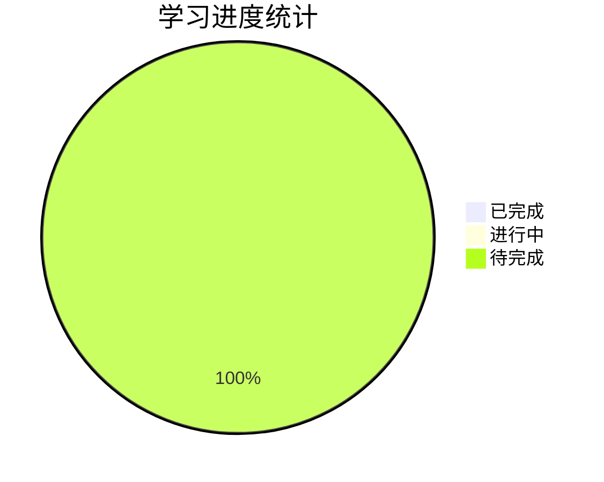

# C++ Primer Plus（第6版）完整学习笔记

> **书籍信息**
> - 书名：C++ Primer Plus（第六版）中文版
> - 作者：Stephen Prata
> - 出版社：人民邮电出版社
> - 原著：C++ Primer Plus, 6th Edition
> 
> **学习目标**
> 
> 本笔记旨在为 C++ 初学者提供一份详尽、系统、深入的学习指南。通过 18 个章节的详细解析，帮助读者：
> - 掌握 C++ 基础语法和核心概念
> - 理解面向对象编程思想
> - 熟悉标准模板库（STL）的使用
> - 了解 C++11/14/17 新特性
> - 具备实际项目开发能力
> 
> **前置知识**
> - 基本的计算机操作能力
> - 无需编程经验（从零开始）
> - 建议具备一定的逻辑思维基础
> 
> **预计学习时间**：60-80 小时（每章 3-5 小时）

---

## 📋 章节目录

### 第一部分：C++ 基础（第1-9章）

| 章节 | 标题 | 链接 | 状态 | 预计时间 |
|------|------|------|------|----------|
| 第1章 | [预备知识](./Chapter_01_预备知识.md) | 🔗 | ⏳ 待完成 | 3小时 |
| 第2章 | [开始学习C++](./Chapter_02_开始学习C++.md) | 🔗 | ⏳ 待完成 | 4小时 |
| 第3章 | [处理数据](./Chapter_03_处理数据.md) | 🔗 | ⏳ 待完成 | 4小时 |
| 第4章 | [复合类型](./Chapter_04_复合类型.md) | 🔗 | ⏳ 待完成 | 5小时 |
| 第5章 | [循环和关系表达式](./Chapter_05_循环和关系表达式.md) | 🔗 | ⏳ 待完成 | 4小时 |
| 第6章 | [分支语句和逻辑运算符](./Chapter_06_分支语句和逻辑运算符.md) | 🔗 | ⏳ 待完成 | 4小时 |
| 第7章 | [函数](./Chapter_07_函数.md) | 🔗 | ⏳ 待完成 | 5小时 |
| 第8章 | [函数探幽](./Chapter_08_函数探幽.md) | 🔗 | ⏳ 待完成 | 4小时 |
| 第9章 | [内存模型和名称空间](./Chapter_09_内存模型和名称空间.md) | 🔗 | ⏳ 待完成 | 4小时 |

### 第二部分：面向对象编程（第10-15章）

| 章节 | 标题 | 链接 | 状态 | 预计时间 |
|------|------|------|------|----------|
| 第10章 | [对象和类](./Chapter_10_对象和类.md) | 🔗 | ⏳ 待完成 | 5小时 |
| 第11章 | [使用类](./Chapter_11_使用类.md) | 🔗 | ⏳ 待完成 | 5小时 |
| 第12章 | [类和动态内存分配](./Chapter_12_类和动态内存分配.md) | 🔗 | ⏳ 待完成 | 5小时 |
| 第13章 | [类继承](./Chapter_13_类继承.md) | 🔗 | ⏳ 待完成 | 5小时 |
| 第14章 | [C++中的代码重用](./Chapter_14_C++中的代码重用.md) | 🔗 | ⏳ 待完成 | 5小时 |
| 第15章 | [友元、异常和其他](./Chapter_15_友元异常和其他.md) | 🔗 | ⏳ 待完成 | 4小时 |

### 第三部分：高级主题（第16-18章）

| 章节 | 标题 | 链接 | 状态 | 预计时间 |
|------|------|------|------|----------|
| 第16章 | [string类和标准模板库](./Chapter_16_string类和标准模板库.md) | 🔗 | ⏳ 待完成 | 6小时 |
| 第17章 | [输入、输出和文件](./Chapter_17_输入输出和文件.md) | 🔗 | ⏳ 待完成 | 5小时 |
| 第18章 | [探讨C++新标准](./Chapter_18_探讨C++新标准.md) | 🔗 | ⏳ 待完成 | 5小时 |

---

## 🎯 快速导航（按主题分类）

### 基础语法
- [变量和数据类型](./Chapter_03_处理数据.md#简单变量)
- [运算符和表达式](./Chapter_03_处理数据.md#c-算术运算符)
- [控制流（循环）](./Chapter_05_循环和关系表达式.md)
- [控制流（分支）](./Chapter_06_分支语句和逻辑运算符.md)
- [函数基础](./Chapter_07_函数.md)

### 面向对象编程
- [类和对象](./Chapter_10_对象和类.md)
- [构造函数和析构函数](./Chapter_10_对象和类.md#构造函数)
- [运算符重载](./Chapter_11_使用类.md#运算符重载)
- [继承和多态](./Chapter_13_类继承.md)
- [虚函数](./Chapter_13_类继承.md#虚函数)

### 内存管理
- [指针基础](./Chapter_04_复合类型.md#指针)
- [动态内存分配](./Chapter_12_类和动态内存分配.md)
- [智能指针](./Chapter_18_探讨C++新标准.md#智能指针)

### 标准库
- [string 类](./Chapter_16_string类和标准模板库.md#string-类)
- [vector 容器](./Chapter_16_string类和标准模板库.md#vector)
- [map 容器](./Chapter_16_string类和标准模板库.md#map)
- [STL 算法](./Chapter_16_string类和标准模板库.md#stl-算法)

### 输入输出
- [cout 和 cin](./Chapter_02_开始学习C++.md#使用-cin-和-cout)
- [文件操作](./Chapter_17_输入输出和文件.md)
- [格式化 I/O](./Chapter_17_输入输出和文件.md#格式化-io)

### C++11/14/17 新特性
- [auto 关键字](./Chapter_03_处理数据.md#auto-声明)
- [lambda 表达式](./Chapter_18_探讨C++新标准.md#lambda-表达式)
- [移动语义](./Chapter_18_探讨C++新标准.md#移动语义)
- [范围 for 循环](./Chapter_18_探讨C++新标准.md#范围-for-循环)

---

## 📊 学习进度追踪

### 整体进度

### 详细进度表

| 章节 | 阅读状态 | 笔记完成度 | 练习完成度 | 最后更新时间 |
|------|---------|-----------|-----------|-------------|
| 第1章 | ⏳ 未开始 | 0% | 0% | - |
| 第2章 | ⏳ 未开始 | 0% | 0% | - |
| 第3章 | ⏳ 未开始 | 0% | 0% | - |
| 第4章 | ⏳ 未开始 | 0% | 0% | - |
| 第5章 | ⏳ 未开始 | 0% | 0% | - |
| 第6章 | ⏳ 未开始 | 0% | 0% | - |
| 第7章 | ⏳ 未开始 | 0% | 0% | - |
| 第8章 | ⏳ 未开始 | 0% | 0% | - |
| 第9章 | ⏳ 未开始 | 0% | 0% | - |
| 第10章 | ⏳ 未开始 | 0% | 0% | - |
| 第11章 | ⏳ 未开始 | 0% | 0% | - |
| 第12章 | ⏳ 未开始 | 0% | 0% | - |
| 第13章 | ⏳ 未开始 | 0% | 0% | - |
| 第14章 | ⏳ 未开始 | 0% | 0% | - |
| 第15章 | ⏳ 未开始 | 0% | 0% | - |
| 第16章 | ⏳ 未开始 | 0% | 0% | - |
| 第17章 | ⏳ 未开始 | 0% | 0% | - |
| 第18章 | ⏳ 未开始 | 0% | 0% | - |

---

## 💡 学习方法建议

### 1. 循序渐进
- **不要跳过基础章节**：即使你有其他语言经验，C++ 的某些概念（如指针、内存管理）也需要从头理解
- **每个概念都要动手实践**：光看不练无法真正掌握
- **完成每章的练习题**：这是检验学习效果的最佳方式

### 2. 代码实践
- **亲手输入所有代码示例**：不要复制粘贴，打字过程能加深记忆
- **修改代码进行实验**：尝试改变参数、添加功能，观察结果
- **建立自己的代码库**：将练习代码保存下来，方便日后查阅

### 3. 理解原理
- **不仅要知道"怎么做"，还要知道"为什么"**：理解底层原理才能灵活运用
- **画出思维导图**：帮助梳理知识点之间的关系
- **用自己的话复述概念**：如果能清晰解释给别人听，说明真正理解了

### 4.  debugging 技巧
- **学会阅读编译器错误信息**：这是解决问题的第一步
- **使用调试器**：逐步执行代码，观察变量变化
- **善用 cout 调试**：在关键位置输出变量值

### 5. 持续复习
- **定期回顾之前的章节**：遗忘是正常的，重复是记忆之母
- **做综合项目**：将所学知识应用到实际项目中
- **参与开源项目或编程社区**：与他人交流学习

---

## ⚠️ 常见陷阱和注意事项

### 初学者常见错误

1. **忘记分号**：C++ 每条语句必须以分号结尾
2. **混淆 `=` 和 `==`**：赋值 vs 相等比较
3. **数组越界**：C++ 不检查数组边界
4. **指针未初始化**：导致野指针问题
5. **内存泄漏**：new 了但没有 delete
6. **头文件重复包含**：使用头文件保护符
7. **命名空间污染**：谨慎使用 `using namespace std;`
8. **类型转换陷阱**：注意隐式转换可能导致的精度丢失

### 最佳实践

✅ **推荐做法**：
- 使用 `const` 修饰不变量
- 优先使用 `std::string` 而非 C 风格字符串
- 使用智能指针管理动态内存
- 编写清晰的注释
- 遵循一致的代码风格

❌ **避免做法**：
- 不要使用 `void main()`
- 不要全局使用 `using namespace std;`
- 不要忽略编译器警告
- 不要硬编码魔法数字
- 不要写超过 50 行的函数

---

## 📚 相关资源

### 官方资源
- [ISO C++ 官方网站](https://isocpp.org/)
- [cppreference.com](https://en.cppreference.com/) - C++ 参考文档
- [C++ Core Guidelines](https://github.com/isocpp/CppCoreGuidelines) - C++ 核心指南

### 在线学习平台
- [LeetCode](https://leetcode.com/) - 算法练习
- [HackerRank](https://www.hackerrank.com/domains/cpp) - C++ 专项练习
- [Coursera C++ 课程](https://www.coursera.org/courses?query=c%2B%2B)

### 推荐书籍
- 《Effective C++》- Scott Meyers
- 《More Effective C++》- Scott Meyers
- 《C++ FAQ》- Marshall Cline
- 《深度探索 C++ 对象模型》- Stanley B. Lippman

### 开发工具
- **编译器**：GCC, Clang, MSVC
- **IDE**：Visual Studio, CLion, Code::Blocks
- **编辑器**：VS Code, Vim, Emacs
- **构建工具**：CMake, Make
- **调试器**：GDB, LLDB, Visual Studio Debugger

---

## 🤝 如何贡献和改进

欢迎对本学习笔记提出改进建议：

1. **发现错误**：如果发现内容错误或过时，请指出
2. **补充内容**：如果有更好的示例或解释，欢迎补充
3. **格式优化**：改进排版、添加图表等
4. **翻译改进**：修正术语翻译不准确的地方

---

## 📄 许可证

本学习笔记基于《C++ Primer Plus（第六版）》整理，仅供个人学习使用。
原书版权归 Stephen Prata 和人民邮电出版社所有。

---

## 🔄 更新日志

| 日期 | 版本 | 更新内容 |
|------|------|---------|
| 2026-05-20 | v0.1 | 初始版本，创建目录结构和 README |

---

**最后更新**：2026-05-20  
**维护者**：AI Assistant  
**状态**：🚧 建设中

---

[返回顶部](#c-primer-plus第6版完整学习笔记)
