## 目录

1. [C++ 编程基础与开发流程](#1-c-编程基础与开发流程)
2. [数据类型与算术运算](#2-数据类型与算术运算)
3. [复合类型：数组、字符串与结构](#3-复合类型数组字符串与结构)
4. [指针与动态内存管理](#4-指针与动态内存管理)
5. [循环结构与关系表达式](#5-循环结构与关系表达式)
6. [分支语句与逻辑运算符](#6-分支语句与逻辑运算符)
7. [函数：模块化编程的核心](#7-函数模块化编程的核心)
8. [函数进阶：重载、模板与内联](#8-函数进阶重载模板与内联)
9. [内存模型与名称空间](#9-内存模型与名称空间)
10. [对象与类：OOP 的基石](#10-对象与类oop-的基石)
11. [类的深入：运算符重载与友元](#11-类的深入运算符重载与友元)
12. [动态内存与类：大三元法则](#12-动态内存与类大三元法则)
13. [类继承：is-a 关系与多态](#13-类继承is-a-关系与多态)
14. [代码重用：包含、私有继承与类模板](#14-代码重用包含私有继承与类模板)
15. [友元、异常与 RTTI](#15-友元异常与-rtti)
16. [string 类与标准模板库 STL](#16-string-类与标准模板库-stl)
17. [输入、输出与文件操作](#17-输入输出与文件操作)
18. [C++11 新标准概览](#18-c11-新标准概览)

---

## 1. C++ 编程基础与开发流程

### 1.1 核心概念图解

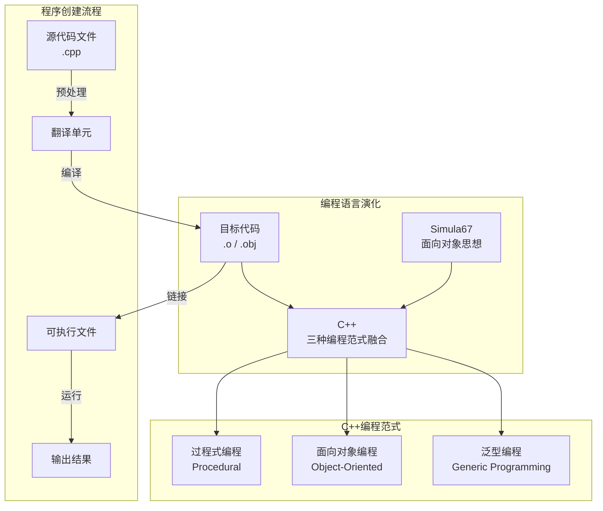
```mermaid
flowchart TD
    subgraph 编程语言演化
        C[C 语言<br>过程式编程] --> CPP[C++<br>三种编程范式融合]
        Simula[Simula67<br>面向对象思想] --> CPP
    end

    subgraph C++编程范式
        CPP --> P[过程式编程<br>Procedural]
        CPP --> OOP[面向对象编程<br>Object-Oriented]
        CPP --> GP[泛型编程<br>Generic Programming]
    end

    subgraph 程序创建流程
        A[源代码文件<br>.cpp] -->|预处理| B[翻译单元]
        B -->|编译| C[目标代码<br>.o / .obj]
        C -->|链接| D[可执行文件]
        D -->|运行| E[输出结果]
    end
```

### 1.2 核心要点

- **C++ 的三种编程范式**：
  | 范式 | 核心思想 | C++ 对应特性 |
  | 过程式编程 | 算法+数据结构，强调操作步骤 | C 语言子集，函数 |
  | 面向对象编程 | 强调数据，以数据为中心设计操作 | 类、封装、继承、多态 |
  | 泛型编程 | 独立于特定数据类型的抽象 | 模板、STL |

- **编译与链接过程**：
  1. **预处理** - 处理 `#include`、`#define` 等指令
  2. **编译** - 将源代码转换为汇编/机器码
  3. **链接** - 将目标文件与库文件合并为可执行程序

> **专家提示**：理解编译链接的完整流程对于排查 "undefined reference" 等链接错误至关重要。当你遇到 `undefined reference to` 错误时，99% 的情况是因为忘记链接对应的库，或者函数声明与定义不匹配。养成在项目配置中显式添加所需库的习惯。

---

## 2. 数据类型与算术运算

### 2.1 整型家族层次结构

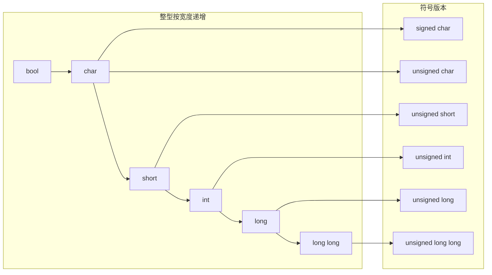
```mermaid
graph LR
    subgraph 整型按宽度递增
        B[bool] --> C[char]
        C --> S[short]
        S --> I[int]
        I --> L[long]
        L --> LL[long long]
    end

    subgraph 符号版本
        C --> SC[signed char]
        C --> UC[unsigned char]
        S --> US[unsigned short]
        I --> UI[unsigned int]
        L --> UL[unsigned long]
        LL --> ULL[unsigned long long]
    end
```

### 2.2 核心要点速查表

| 类型 | 最小宽度 | 典型宽度 | 取值范围（符号） | 用途建议 |
|------|----------|----------|------------------|----------|
| `char` | 8位 | 8位 | -128~127 | 存储 ASCII 字符 |
| `short` | 16位 | 16位 | -32,768~32,767 | 内存紧张时的小整数 |
| `int` | 16位 | 32位 | -2×10⁹~2×10⁹ | **默认选择，最自然** |
| `long` | 32位 | 32/64位 | 同上或更大 | 需要跨平台兼容大整数时 |
| `long long` | 64位 | 64位 | -9×10¹⁸~9×10¹⁸ | 极大的整数 |
| `float` | 32位 | 32位 | 6位有效数字 | 图形、精度要求不高的计算 |
| `double` | 48位 | 64位 | 15位有效数字 | **浮点数默认选择** |
| `long double` | ≥80位 | 80/128位 | 18位有效数字 | 科学计算 |

### 2.3 类型转换规则

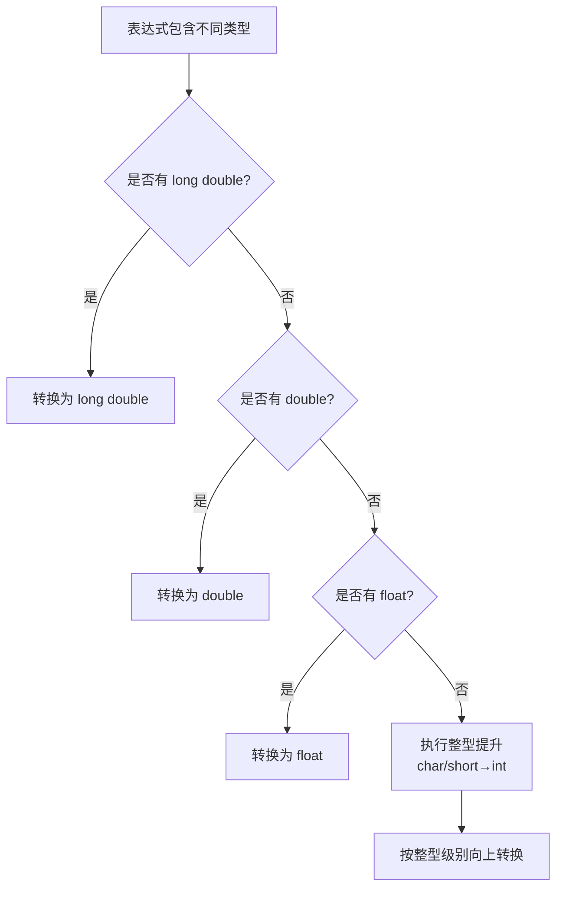
```mermaid
flowchart TD
    A[表达式包含不同类型] --> B{是否有 long double?}
    B -->|是| C[转换为 long double]
    B -->|否| D{是否有 double?}
    D -->|是| E[转换为 double]
    D -->|否| F{是否有 float?}
    F -->|是| G[转换为 float]
    F -->|否| H[执行整型提升<br>char/short→int]
    H --> I[按整型级别向上转换]
```

> **专家提示**：
> 1. 使用 `climits` 头文件中的常量（如 `INT_MAX`）来判断类型的实际范围，而非依赖记忆。
> 2. **浮点数比较陷阱**：永远不要用 `==` 比较两个浮点数是否相等。应该使用：
>    ```cpp
>    if (fabs(a - b) < 1e-6) { /* 视为相等 */ }
>    ```
> 3. **const 优于 #define**：`const int Months = 12;` 具有类型检查和作用域控制，而 `#define Months 12` 只是文本替换。

---

## 3. 复合类型：数组、字符串与结构

### 3.1 数组与字符串处理方式对比

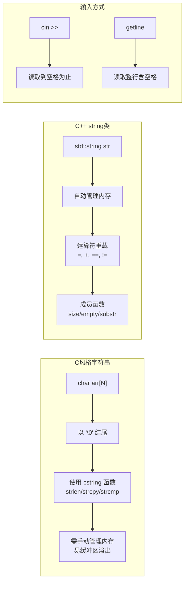
```mermaid
flowchart LR
    subgraph "C风格字符串"
        direction TB
        A1["char arr[N]"] --> A2[以 '\0' 结尾]
        A2 --> A3[使用 cstring 函数<br>strlen/strcpy/strcmp]
        A3 --> A4[需手动管理内存<br>易缓冲区溢出]
    end

    subgraph "C++ string类"
        direction TB
        B1[std::string str] --> B2[自动管理内存]
        B2 --> B3[运算符重载<br>=, +, ==, !=]
        B3 --> B4[成员函数<br>size/empty/substr]
    end

    subgraph "输入方式"
        C1[cin >>] --> C2[读取到空格为止]
        C3[getline] --> C4[读取整行含空格]
    end
```

### 3.2 复合类型选择指南

| 需求场景        | 推荐方案                       | 示例                                |
| ----------- | -------------------------- | --------------------------------- |
| 固定数量同类型数据   | 内置数组                       | `int scores[5];`                  |
| 动态长度数组      | `std::vector<T>`           | `vector<double> prices;`          |
| 定长且安全       | `std::array<T, N>` (C++11) | `array<int, 10> arr;`             |
| 不同类型组合      | 结构体 `struct`               | `struct Student { ... };`         |
| 互斥使用的多种数据类型 | 共用体 `union`                | `union Data { int i; float f; };` |
| 一组具名整数常量    | 枚举 `enum`                  | `enum Color {RED, GREEN, BLUE};`  |

### 3.3 字符串输入陷阱与解决方案

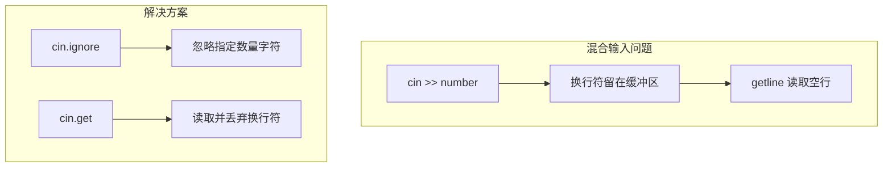
```mermaid
flowchart TD
    subgraph 混合输入问题
        A[cin >> number] --> B[换行符留在缓冲区]
        B --> C[getline 读取空行]
    end

    subgraph 解决方案
        D1[cin.ignore] --> E1[忽略指定数量字符]
        D2[cin.get] --> E2[读取并丢弃换行符]
    end
```

```cpp
// 典型陷阱与修复
int year;
char address[80];

// 错误示例
cin >> year;
cin.getline(address, 80);  // 直接读取空行！

// 正确示例
cin >> year;
cin.get();                 // 消耗换行符
cin.getline(address, 80);
```

> **专家提示**：
> 1. **永远优先使用 `std::string` 而非 C 风格字符串**。这不仅消除了缓冲区溢出风险，还大幅简化了字符串操作代码。
> 2. 在处理用户输入时，养成使用 `getline(cin, str)` 的习惯，并用输入验证来防止格式错误。

---

## 4. 指针与动态内存管理

### 4.1 指针核心概念图解

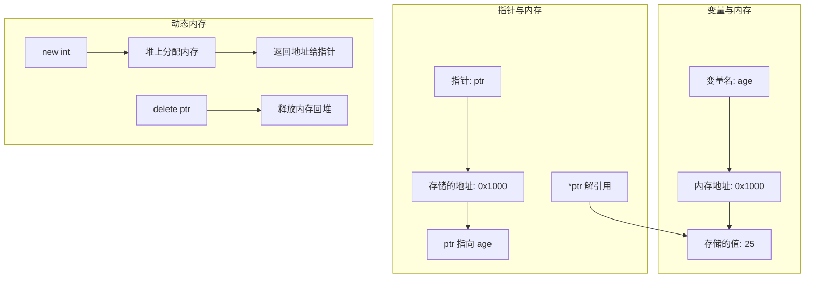
```mermaid
flowchart TB
    subgraph 变量与内存
        A[变量名: age] --> B[内存地址: 0x1000]
        B --> C[存储的值: 25]
    end

    subgraph 指针与内存
        D[指针: ptr] --> E[存储的地址: 0x1000]
        E --> F[ptr 指向 age]
        G[*ptr 解引用] --> C
    end

    subgraph 动态内存
        H[new int] --> I[堆上分配内存]
        I --> J[返回地址给指针]
        K[delete ptr] --> L[释放内存回堆]
    end
```

### 4.2 new 与 delete 使用规则

| 分配方式 | 释放方式 | 适用场景 |
|----------|----------|----------|
| `new Type` | `delete ptr` | 单个对象 |
| `new Type[n]` | `delete[] ptr` | 数组 |
| 栈变量 | 自动释放 | 局部变量 |
| `malloc()` | `free()` | C 风格，不推荐混用 |

### 4.3 三种存储方式对比

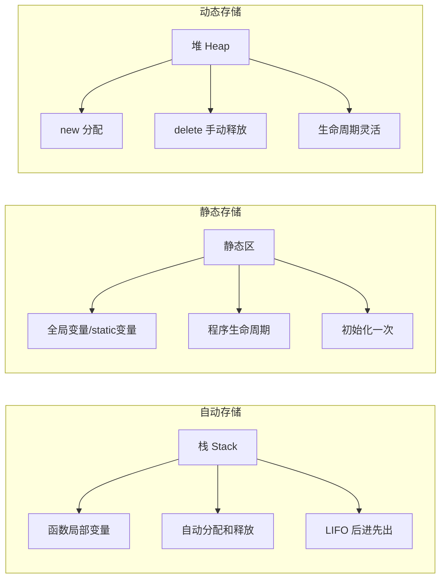
```mermaid
flowchart LR
    subgraph 自动存储
        A[栈 Stack] --> A1[函数局部变量]
        A --> A2[自动分配和释放]
        A --> A3[LIFO 后进先出]
    end

    subgraph 静态存储
        B[静态区] --> B1[全局变量/static变量]
        B --> B2[程序生命周期]
        B --> B3[初始化一次]
    end

    subgraph 动态存储
        C[堆 Heap] --> C1[new 分配]
        C --> C2[delete 手动释放]
        C --> C3[生命周期灵活]
    end
```

> **专家提示**：
> 1. **指针危险警示**：使用未初始化指针的后果是灾难性的——它会随机覆盖内存。养成在声明指针时立即初始化为 `nullptr`（C++11）或 `NULL` 的习惯。
> 2. **内存泄漏是 C++ 中最常见的 bug 之一**。使用 RAII（资源获取即初始化）原则，将动态内存封装在类中，或使用智能指针（`unique_ptr`、`shared_ptr`）。
> 3. **指针与数组的等价性**：`arr[i]` 等价于 `*(arr + i)`。这一特性使得可以用指针遍历数组，但要记住：数组名是常量，不能修改。

---

## 5. 循环结构与关系表达式

### 5.1 三种循环对比

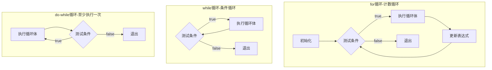
```mermaid
flowchart TD
    subgraph for循环-计数循环
        F1[初始化] --> F2{测试条件}
        F2 -->|true| F3[执行循环体]
        F3 --> F4[更新表达式]
        F4 --> F2
        F2 -->|false| F5[退出]
    end

    subgraph while循环-条件循环
        W1{测试条件}
        W1 -->|true| W2[执行循环体]
        W2 --> W1
        W1 -->|false| W3[退出]
    end

    subgraph do-while循环-至少执行一次
        D1[执行循环体] --> D2{测试条件}
        D2 -->|true| D1
        D2 -->|false| D3[退出]
    end
```

### 5.2 循环选择指南

| 场景 | 推荐循环 | 示例 |
|------|----------|------|
| 已知迭代次数 | `for` | 遍历数组、计数 0-99 |
| 条件未知，可能0次 | `while` | 读取文件直到 EOF |
| 至少执行一次 | `do-while` | 用户输入验证 |

### 5.3 字符输入方法对比

| 方法 | 跳过空白？ | EOF 处理 | 返回值 |
|------|-----------|----------|--------|
| `cin >> ch` | 是 | 设置 failbit | `istream&` |
| `cin.get(ch)` | 否 | 设置 failbit | `istream&` |
| `ch = cin.get()` | 否 | 返回 EOF (-1) | `int` 类型字符码 |

```cpp
// 推荐的 EOF 循环写法
int ch;  // 注意：必须用 int，因为 EOF 可能是 -1
while ((ch = cin.get()) != EOF) {
    cout.put(static_cast<char>(ch));
}

// 或更简洁的写法（利用 cin 到 bool 的转换）
char ch;
while (cin.get(ch)) {
    cout.put(ch);
}
```

> **专家提示**：
> 1. 预处理语句末尾的分号会导致空循环体，这是初学者最易犯的错误之一。检查你的 `for` 或 `while` 语句后是否多写了分号。
> 2. 使用 `++i` 而非 `i++` 作为循环增量是良好的习惯。对于内置类型两者效率相同，但对于类迭代器，前缀版本更高效。

---

## 6. 分支语句与逻辑运算符

### 6.1 决策结构决策树

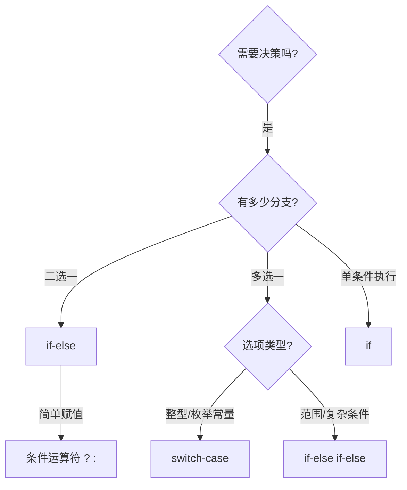
```mermaid
flowchart TD
    Start{需要决策吗?} -->|是| Branch{有多少分支?}
    Branch -->|二选一| IfElse[if-else]
    Branch -->|多选一| Multi{选项类型?}
    Multi -->|整型/枚举常量| Switch[switch-case]
    Multi -->|范围/复杂条件| ElseIf[if-else if-else]
    Branch -->|单条件执行| If[if]

    IfElse -->|简单赋值| Ternary[条件运算符 ? :]
```

### 6.2 逻辑运算符真值表

| A | B | A && B | A \|\| B | !A |
|---|---|--------|---------|-----|
| true | true | true | true | false |
| true | false | false | true | false |
| false | true | false | true | true |
| false | false | false | false | true |

### 6.3 cctype 字符函数库

| 函数 | 功能 | 示例 |
|------|------|------|
| `isalpha(c)` | 是否为字母 | `isalpha('A')` → true |
| `isdigit(c)` | 是否为数字 | `isdigit('5')` → true |
| `isspace(c)` | 是否为空白 | `isspace(' ')` → true |
| `ispunct(c)` | 是否为标点 | `ispunct(',')` → true |
| `isupper(c)` | 是否为大写 | `isupper('Z')` → true |
| `islower(c)` | 是否为小写 | `islower('a')` → true |
| `toupper(c)` | 转换为大写 | `toupper('a')` → 'A' |
| `tolower(c)` | 转换为小写 | `tolower('Z')` → 'z' |

> **专家提示**：
> 1. **switch 中的 break 陷阱**：遗忘 break 会导致 case "穿透"，这在某些算法中有意为之（如连续处理），但大多数情况下是 bug。如果确实需要穿透，请用注释标注 `// fall through`。
> 2. **条件运算符的最佳实践**：仅用于简单表达式，如 `max = (a > b) ? a : b;`。嵌套使用条件运算符会让代码变得难以阅读和维护。

---

## 7. 函数：模块化编程的核心

### 7.1 函数调用机制图解

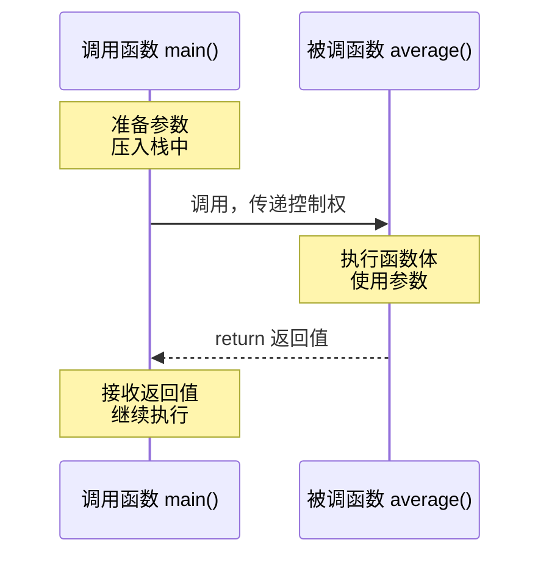
```mermaid
sequenceDiagram
    participant Caller as 调用函数 main()
    participant Callee as 被调函数 average()
    Note over Caller: 准备参数<br>压入栈中
    Caller->>Callee: 调用，传递控制权
    Note over Callee: 执行函数体<br>使用参数
    Callee-->>Caller: return 返回值
    Note over Caller: 接收返回值<br>继续执行
```

### 7.2 参数传递方式对比

| 传递方式 | 语法 | 是否修改实参 | 传递成本 | 适用场景 |
|----------|------|-------------|----------|----------|
| 按值传递 | `void f(int x)` | 否 | 复制开销 | 小型基本类型 |
| 按指针传递 | `void f(int* p)` | 是 | 4/8 字节 | 需要修改，可能为空 |
| 按引用传递 | `void f(int& r)` | 是 | 4/8 字节 | 需要修改，保证非空 |
| const 引用 | `void f(const T& r)` | 否 | 4/8 字节 | 大型对象，避免复制 |

### 7.3 数组作为函数参数

```cpp
// 以下三种函数原型等价，都接收 int 指针
void processArray(int* arr, int size);
void processArray(int arr[], int size);
void processArray(int arr[10], int size);  // 10 被编译器忽略

// 正确调用方式
int scores[5] = {1, 2, 3, 4, 5};
processArray(scores, 5);  // 数组名退化为指针
```

### 7.4 递归函数图解（以阶乘为例）

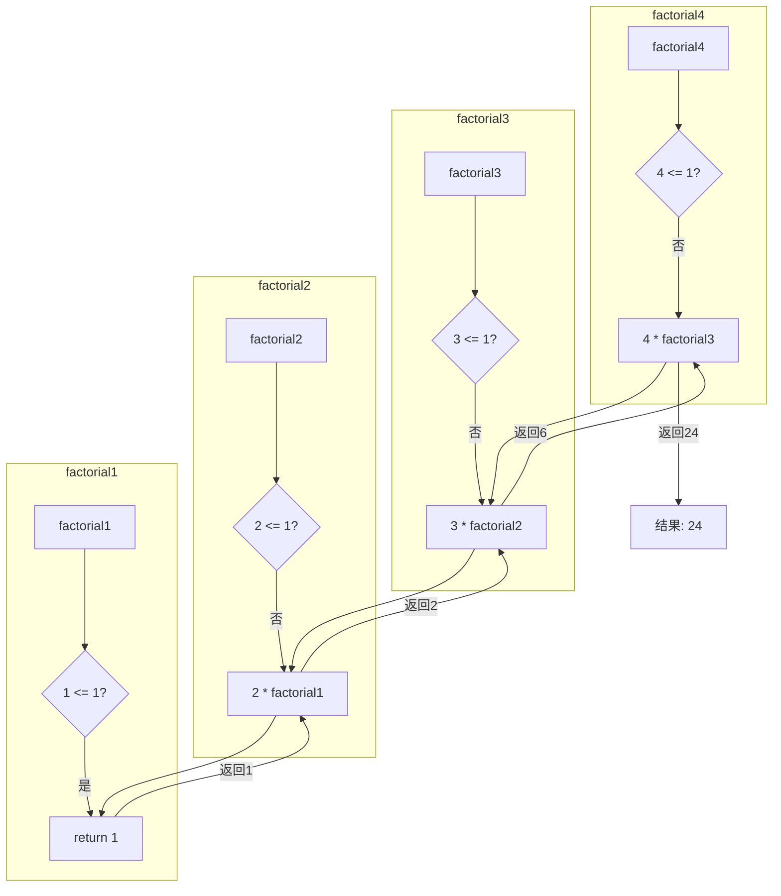
```mermaid
flowchart TD
    subgraph factorial4
        F4[factorial4] --> F4C{4 <= 1?}
        F4C -->|否| F4R[4 * factorial3]
    end

    subgraph factorial3
        F3[factorial3] --> F3C{3 <= 1?}
        F3C -->|否| F3R[3 * factorial2]
    end

    subgraph factorial2
        F2[factorial2] --> F2C{2 <= 1?}
        F2C -->|否| F2R[2 * factorial1]
    end

    subgraph factorial1
        F1[factorial1] --> F1C{1 <= 1?}
        F1C -->|是| F1Ret[return 1]
    end

    F4R --> F3R
    F3R --> F2R
    F2R --> F1Ret
    F1Ret -->|返回1| F2R
    F2R -->|返回2| F3R
    F3R -->|返回6| F4R
    F4R -->|返回24| Result[结果: 24]
```

> **专家提示**：
> 1. **总是为函数提供原型**。尽管 C++ 允许先使用后定义，但原型能让编译器进行类型检查，减少运行时错误。
> 2. **递归需谨慎**：每次递归调用都会在栈上分配新空间。对于深度递归，考虑改用迭代或尾递归优化。
> 3. **const 引用是大型对象的首选传递方式**。它同时避免了复制开销和意外修改的风险。

---

## 8. 函数进阶：重载、模板与内联

### 8.1 函数特性关系图

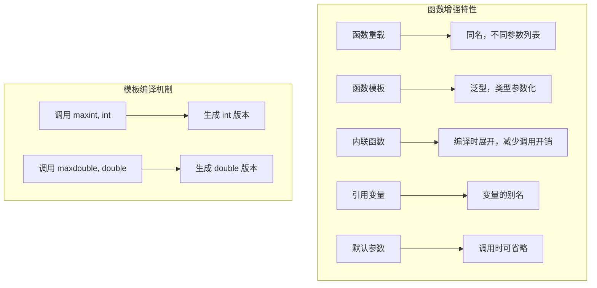
```mermaid
flowchart TD
    subgraph 函数增强特性
        Overload[函数重载] --> Same[同名，不同参数列表]
        Template[函数模板] --> Generic[泛型，类型参数化]
        Inline[内联函数] --> Expand[编译时展开，减少调用开销]
        Ref[引用变量] --> Alias[变量的别名]
        Default[默认参数] --> Optional[调用时可省略]
    end

    subgraph 模板编译机制
        T1[调用 maxint, int] --> I1[生成 int 版本]
        T2[调用 maxdouble, double] --> I2[生成 double 版本]
    end
```

### 8.2 函数重载与模板对比

| 特性 | 函数重载 | 函数模板 |
|------|----------|----------|
| 定义方式 | 多个不同参数的同名函数 | 一个带类型参数的函数 |
| 代码量 | 需要为每种类型单独编写 | 编译器自动生成版本 |
| 适用场景 | 不同类型需要不同处理逻辑 | 逻辑完全相同，仅类型不同 |
| 特殊处理 | 可以为特定版本定制 | 可用显式具体化特化 |

```cpp
// 重载示例
void swap(int& a, int& b) { int t = a; a = b; b = t; }
void swap(double& a, double& b) { double t = a; a = b; b = t; }

// 模板示例（一个替代上述全部）
template <typename T>
void swap(T& a, T& b) { T t = a; a = b; b = t; }
```

### 8.3 引用与指针对比

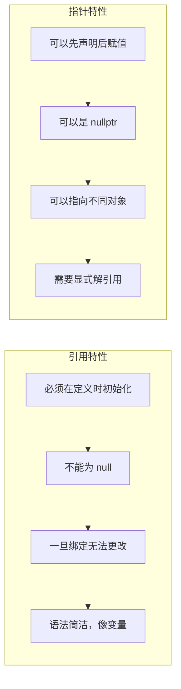
```mermaid
flowchart LR
    subgraph 引用特性
        R1[必须在定义时初始化] --> R2[不能为 null]
        R2 --> R3[一旦绑定无法更改]
        R3 --> R4[语法简洁，像变量]
    end

    subgraph 指针特性
        P1[可以先声明后赋值] --> P2[可以是 nullptr]
        P2 --> P3[可以指向不同对象]
        P3 --> P4[需要显式解引用]
    end
```

> **专家提示**：
> 1. **内联只是对编译器的建议**。现代编译器会自行判断是否内联，`inline` 关键字更多用于头文件中定义函数以解决多重定义问题。
> 2. **引用主要是为了支持运算符重载而引入的**。对于简单数据类型，按值传递往往比按引用传递更高效（少了间接访问的开销）。
> 3. **模板的实例化发生在编译期**，这意味着一处错误可能导致大量错误信息。遇到模板错误时，从第一条错误开始分析。

---

## 9. 内存模型与名称空间

### 9.1 存储持续性与作用域

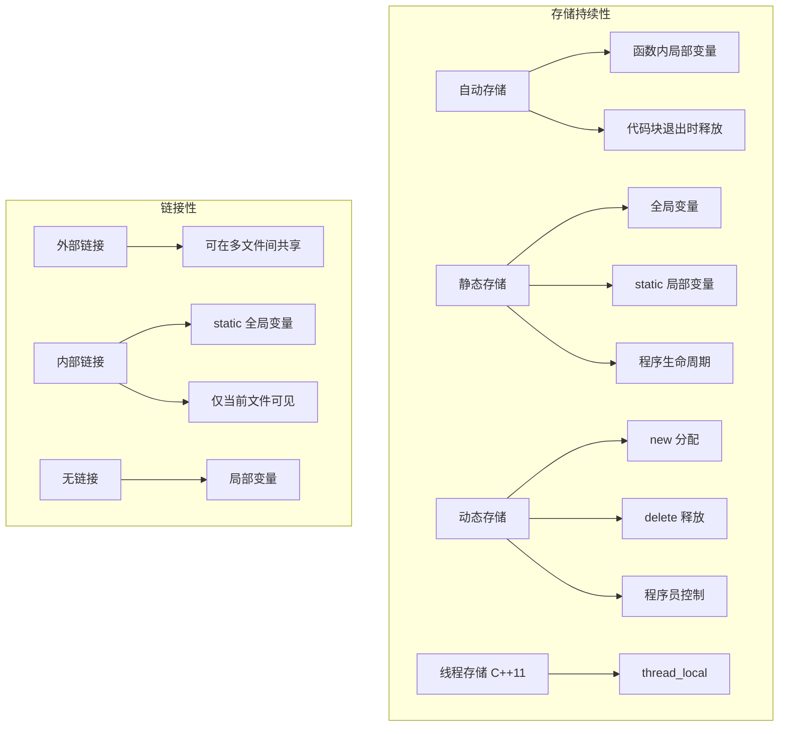
```mermaid
flowchart TD
    subgraph 存储持续性
        Auto[自动存储] --> A1[函数内局部变量]
        Auto --> A2[代码块退出时释放]

        Static[静态存储] --> S1[全局变量]
        Static --> S2[static 局部变量]
        Static --> S3[程序生命周期]

        Dynamic[动态存储] --> D1[new 分配]
        Dynamic --> D2[delete 释放]
        Dynamic --> D3[程序员控制]

        Thread[线程存储 C++11] --> T1[thread_local]
    end

    subgraph 链接性
        External[外部链接] --> E1[可在多文件间共享]
        Internal[内部链接] --> I1[static 全局变量]
        Internal --> I2[仅当前文件可见]
        None[无链接] --> N1[局部变量]
    end
```

### 9.2 名称空间使用方式

| 方式 | 语法 | 优点 | 缺点 |
|------|------|------|------|
| using 编译指令 | `using namespace std;` | 简洁 | 污染全局命名空间 |
| using 声明 | `using std::cout;` | 精确引入 | 需要逐一声明 |
| 完全限定名 | `std::cout` | 最安全 | 代码冗长 |
| 名称空间别名 | `namespace mysh = std;` | 简化长名称 | 适合嵌套空间 |

```cpp
// 推荐的头文件写法
#ifndef MYCLASS_H
#define MYCLASS_H

#include <string>

namespace MyNamespace {
    class MyClass {
    public:
        void setName(const std::string& name);  // 使用完全限定名
    private:
        std::string name_;
    };
}

#endif
```

> **专家提示**：
> 1. **永远不要在头文件中使用 `using namespace std;`**。这会强制所有包含该头文件的文件都引入 std 命名空间，可能导致意外的名称冲突。
> 2. **static 在不同上下文中的含义不同**：在文件作用域表示内部链接；在函数内表示静态存储持续性；在类中表示类级别的共享成员。理解透彻它们的使用场景。

---

## 10. 对象与类：OOP 的基石

### 10.1 类与对象关系图解

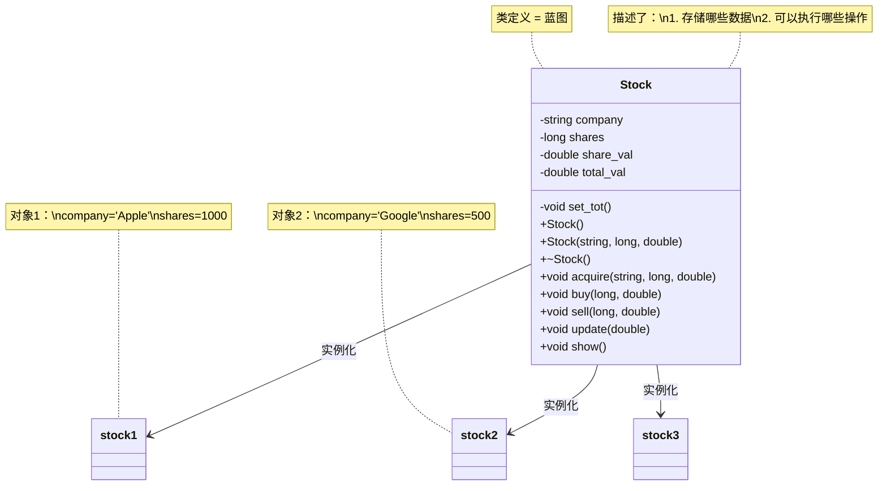
```mermaid
classDiagram
    class Stock {
        -string company
        -long shares
        -double share_val
        -double total_val
        -void set_tot()
        +Stock()
        +Stock(string, long, double)
        +~Stock()
        +void acquire(string, long, double)
        +void buy(long, double)
        +void sell(long, double)
        +void update(double)
        +void show()
    }

    note for Stock "类定义 = 蓝图"
    note for Stock "描述了：\n1. 存储哪些数据\n2. 可以执行哪些操作"

    Stock --> stock1 : 实例化
    Stock --> stock2 : 实例化
    Stock --> stock3 : 实例化

    note for stock1 "对象1：\ncompany='Apple'\nshares=1000"
    note for stock2 "对象2：\ncompany='Google'\nshares=500"
```

### 10.2 类成员访问控制

| 访问修饰符 | 类内部 | 派生类 | 外部代码 |
|------------|--------|--------|----------|
| `private` | 可访问 | 不可访问 | 不可访问 |
| `protected` | 可访问 | 可访问 | 不可访问 |
| `public` | 可访问 | 可访问 | 可访问 |

### 10.3 构造函数与析构函数

```cpp
class Student {
private:
    std::string name;
    int age;
    double* scores;  // 动态分配

public:
    // 默认构造函数
    Student() : name("Unknown"), age(0), scores(nullptr) {}

    // 带参数构造函数（使用初始化列表）
    Student(const std::string& n, int a)
        : name(n), age(a), scores(nullptr) {}

    // 析构函数
    ~Student() {
        delete[] scores;  // 释放动态内存
    }

    // 禁止拷贝（C++11 方式）
    Student(const Student&) = delete;
    Student& operator=(const Student&) = delete;
};
```

### 10.4 this 指针

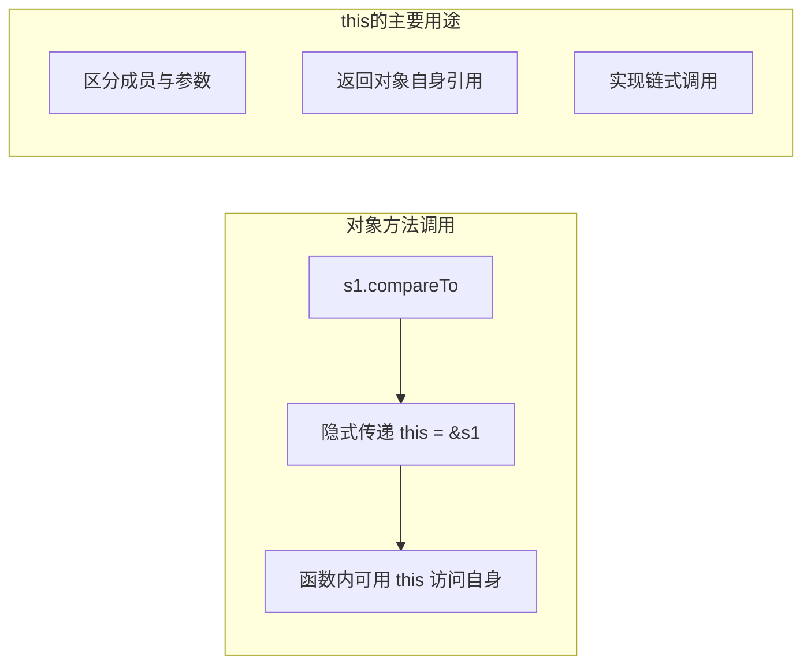
```mermaid
flowchart LR
    subgraph 对象方法调用
        A[s1.compareTo] --> B[隐式传递 this = &s1]
        B --> C[函数内可用 this 访问自身]
    end

    subgraph this的主要用途
        D1[区分成员与参数]
        D2[返回对象自身引用]
        D3[实现链式调用]
    end
```

```cpp
class Counter {
    int value;
public:
    Counter& increment() {
        ++value;
        return *this;  // 返回自身引用，支持链式调用
    }
};

// 使用
Counter c;
c.increment().increment().increment();  // 链式调用
```

> **专家提示**：
> 1. **优先使用初始化列表而非在构造函数体内赋值**。对于 const 成员和引用成员，初始化列表是唯一的选择。
> 2. **默认生成的特殊成员函数**：如果你没有定义，编译器会生成默认构造函数、拷贝构造函数、赋值运算符和析构函数。一旦你定义了任何一个，就要考虑是否需要将其他几个也显式定义。

---

## 11. 类的深入：运算符重载与友元

### 11.1 运算符重载决策

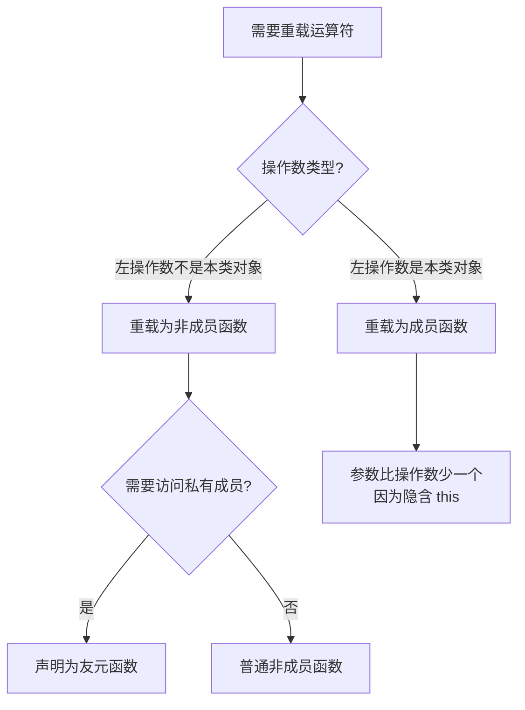
```mermaid
flowchart TD
    A[需要重载运算符] --> B{操作数类型?}
    B -->|左操作数是本类对象| C[重载为成员函数]
    B -->|左操作数不是本类对象| D[重载为非成员函数]
    D --> E{需要访问私有成员?}
    E -->|是| F[声明为友元函数]
    E -->|否| G[普通非成员函数]

    C --> H[参数比操作数少一个<br>因为隐含 this]
```

### 11.2 常用运算符重载方式

| 运算符 | 成员函数形式 | 非成员函数形式 |
|--------|-------------|----------------|
| `+` | `T operator+(const T&) const` | `T operator+(const T&, const T&)` |
| `-` | `T operator-() const` (负号) | 同上 |
| `==` | `bool operator==(const T&) const` | `bool operator==(const T&, const T&)` |
| `=` | `T& operator=(const T&)` | 不可为非成员 |
| `<<` | 不推荐 | `ostream& operator<<(ostream&, const T&)` |
| `>>` | 不推荐 | `istream& operator>>(istream&, T&)` |
| `[]` | `T& operator[](size_t)` | 不可为非成员 |
| `()` | 任意返回类型 | 不可为非成员 |

### 11.3 友元的三种形式

```cpp
class MyClass {
private:
    int data;

    // 1. 友元函数
    friend void friendFunction(MyClass& obj);

    // 2. 友元类
    friend class FriendClass;

    // 3. 友元成员函数（需要前向声明）
    friend void OtherClass::memberFunc(MyClass&);
};
```

> **专家提示**：
> 1. **`<<` 和 `>>` 必须重载为非成员函数**，因为左操作数是 `ostream/istream`，不是你定义的类。
> 2. **友元破坏了封装性，应谨慎使用**。常用的合法场景包括：运算符重载（如 `<<`）、需要高效访问的紧密耦合类。
> 3. **赋值运算符必须处理自赋值**：
>    ```cpp
>    MyClass& operator=(const MyClass& other) {
>        if (this != &other) {
>            // 执行复制操作
>        }
>        return *this;
>    }
>    ```

---

## 12. 动态内存与类：大三元法则

### 12.1 三大成员法则（Rule of Three）

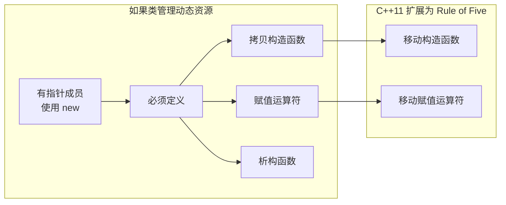
```mermaid
flowchart LR
    subgraph 如果类管理动态资源
        A[有指针成员<br>使用 new] --> B[必须定义]
        B --> C1[拷贝构造函数]
        B --> C2[赋值运算符]
        B --> C3[析构函数]
    end

    subgraph C++11 扩展为 Rule of Five
        C1 --> D1[移动构造函数]
        C2 --> D2[移动赋值运算符]
    end
```

### 12.2 浅拷贝 vs 深拷贝

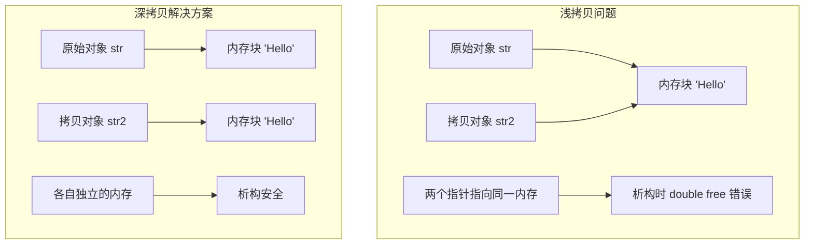
```mermaid
flowchart TD
    subgraph 浅拷贝问题
        S1[原始对象 str] --> SM[内存块 'Hello']
        S2[拷贝对象 str2] --> SM
        S3[两个指针指向同一内存]
        S3 --> S4[析构时 double free 错误]
    end

    subgraph 深拷贝解决方案
        D1[原始对象 str] --> DM1[内存块 'Hello']
        D2[拷贝对象 str2] --> DM2[内存块 'Hello']
        D3[各自独立的内存]
        D3 --> D4[析构安全]
    end
```

### 12.3 正确的 String 类实现框架

```cpp
class String {
private:
    char* str;
    size_t len;

public:
    // 构造函数
    String(const char* s = "") {
        len = std::strlen(s);
        str = new char[len + 1];
        std::strcpy(str, s);
    }

    // 拷贝构造函数（深拷贝）
    String(const String& other) {
        len = other.len;
        str = new char[len + 1];
        std::strcpy(str, other.str);
    }

    // 赋值运算符（深拷贝 + 自赋值检查）
    String& operator=(const String& other) {
        if (this != &other) {
            delete[] str;           // 释放旧资源
            len = other.len;
            str = new char[len + 1];
            std::strcpy(str, other.str);
        }
        return *this;
    }

    // 析构函数
    ~String() {
        delete[] str;
    }
};
```

> **专家提示**：
> 1. **复制与交换惯用法（Copy-and-Swap）**是编写异常安全赋值运算符的最佳实践：
>    ```cpp
>    String& operator=(String other) {  // 按值传递，自动调用拷贝构造
>        swap(*this, other);
>        return *this;
>    }
>    ```
> 2. 在 C++11 之后，**优先使用智能指针管理动态内存**，这样编译器生成的默认特殊成员函数就能正确工作。

---

## 13. 类继承：is-a 关系与多态

### 13.1 继承层次结构

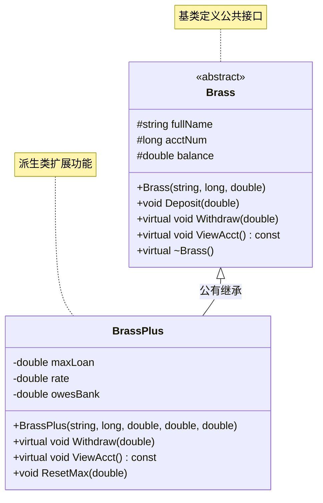
```mermaid
classDiagram
    class Brass {
        <<abstract>>
        #string fullName
        #long acctNum
        #double balance
        +Brass(string, long, double)
        +void Deposit(double)
        +virtual void Withdraw(double)
        +virtual void ViewAcct() const
        +virtual ~Brass()
    }

    class BrassPlus {
        -double maxLoan
        -double rate
        -double owesBank
        +BrassPlus(string, long, double, double, double)
        +virtual void Withdraw(double)
        +virtual void ViewAcct() const
        +void ResetMax(double)
    }

    Brass <|-- BrassPlus : 公有继承

    note for Brass "基类定义公共接口"
    note for BrassPlus "派生类扩展功能"
```

### 13.2 多态机制

```mermaid
sequenceDiagram
    participant Main as main()
    participant Base as Brass*
    participant Derived as BrassPlus

    Main->>Base: Brass* p = new BrassPlus(...)
    Note over Base: 静态类型: Brass*<br>动态类型: BrassPlus
    Main->>Base: p->Withdraw(100)
    Base->>Derived: 虚函数表查找<br>调用 BrassPlus::Withdraw
    Note over Derived: 执行派生类版本
```

### 13.3 虚函数与静态/动态联编

| 特性 | 非虚函数 | 虚函数 |
|------|----------|--------|
| 绑定时机 | 编译时（静态联编） | 运行时（动态联编） |
| 根据什么决定 | 指针/引用的声明类型 | 指针/引用实际指向的对象类型 |
| 性能 | 更快（直接调用） | 稍慢（通过 vtable 间接调用） |
| 用途 | 不应被派生类重写的函数 | 需要多态行为的接口函数 |

### 13.4 访问控制：protected

```cpp
class Base {
private:
    int private_mem;      // 仅 Base 可访问
protected:
    int protected_mem;    // Base 和派生类可访问
public:
    int public_mem;       // 所有代码可访问
};

class Derived : public Base {
    void func() {
        // private_mem = 1;    // 错误！不可访问
        protected_mem = 2;     // OK
        public_mem = 3;        // OK
    }
};
```

### 13.5 抽象基类（ABC）

```cpp
class Shape {  // 抽象基类
public:
    virtual double area() const = 0;   // 纯虚函数
    virtual void draw() const = 0;
    virtual ~Shape() {}                // 虚析构函数必不可少
};

class Circle : public Shape {
    double radius;
public:
    virtual double area() const override { return 3.14159 * radius * radius; }
    virtual void draw() const override { /* 绘制圆形 */ }
};
```

> **专家提示**：
> 1. **基类析构函数必须声明为 virtual**。否则通过基类指针删除派生类对象会导致未定义行为（通常只调用基类析构）。
> 2. **override 关键字（C++11）**可以避免因函数签名不匹配而意外创建新函数的问题。
> 3. **优先使用组合而非继承**。只有在确实存在 "is-a" 关系时才使用公有继承。

---

## 14. 代码重用：包含、私有继承与类模板

### 14.1 三种代码重用方式对比

```mermaid
flowchart TD
    subgraph 包含has-a
        C1[Student 类] --> C2[包含 string 对象 name]
        C1 --> C3[包含 valarray 对象 scores]
        C4[通过对象名访问方法]
    end

    subgraph 私有继承has-a
        P1[Student 类] -.->|私有继承| P2[string]
        P1 -.->|私有继承| P3[valarray]
        P4[通过类名和作用域解析访问]
    end

    subgraph 保护继承
        PR1[派生类] -.->|保护继承| PR2[基类]
        PR3[基类的公有和保护成员<br>在派生类中变为保护]
    end
```

### 14.2 包含 vs 私有继承

| 特性 | 包含（组合） | 私有继承 |
|------|-------------|----------|
| 关系语义 | has-a | has-a（实现层面） |
| 多重继承 | 天然支持 | 需要使用多个基类 |
| 访问被包含对象 | 通过对象名 | 通过类名和作用域解析 |
| 访问 protected 成员 | 不可以 | 可以 |
| 重写虚函数 | 不可以 | 可以 |
| **推荐程度** | **首选** | 特定场景使用 |

### 14.3 类模板

```cpp
template <typename T, int n = 10>  // 非类型参数
class Stack {
private:
    T items[n];
    int top;
public:
    Stack() : top(0) {}
    bool push(const T& item) {
        if (top < n) {
            items[top++] = item;
            return true;
        }
        return false;
    }
    bool pop(T& item) {
        if (top > 0) {
            item = items[--top];
            return true;
        }
        return false;
    }
};

// 使用
Stack<int, 100> intStack;        // 100 个 int 的栈
Stack<std::string> strStack;     // 默认 10 个 string 的栈
```

### 14.4 模板具体化

```cpp
// 通用模板
template <typename T>
T max(T a, T b) { return a > b ? a : b; }

// 显式具体化（针对特定类型）
template <>
const char* max(const char* a, const char* b) {
    return std::strcmp(a, b) > 0 ? a : b;
}
```

> **专家提示**：
> 1. **能用包含就不要用私有继承**。包含使关系更清晰，且易于维护。
> 2. **非类型模板参数必须是常量表达式**，如整数、枚举、指针。
> 3. 类模板的成员函数定义通常放在头文件中，因为编译器需要完整定义来实例化。

---

## 15. 友元、异常与 RTTI

### 15.1 异常处理机制

```mermaid
flowchart TD
    subgraph 正常流程
        Try[try 块] --> Call[调用可能抛出异常的函数]
        Call --> Normal[正常执行]
        Normal --> End[继续执行]
    end

    subgraph 异常流程
        Try -->|发生异常| Throw[throw 异常对象]
        Throw --> Catch1{匹配 catch 类型?}
        Catch1 -->|是| Handle1[执行 catch 块]
        Catch1 -->|否| Catch2{下一个 catch?}
        Catch2 -->|是| Handle2[执行匹配的 catch]
        Catch2 -->|否| Terminate[terminate]
        Handle1 --> Resume[异常处理后继续]
        Handle2 --> Resume
    end
```

### 15.2 标准异常类层次

```mermaid
classDiagram
    exception <|-- logic_error
    exception <|-- runtime_error
    exception <|-- bad_alloc
    exception <|-- bad_cast
    exception <|-- bad_typeid

    logic_error <|-- domain_error
    logic_error <|-- invalid_argument
    logic_error <|-- length_error
    logic_error <|-- out_of_range

    runtime_error <|-- range_error
    runtime_error <|-- overflow_error
    runtime_error <|-- underflow_error

    note for exception "what() 返回描述信息"
```

### 15.3 RTTI 运算符

| 运算符 | 用途 | 示例 |
|--------|------|------|
| `dynamic_cast<T*>(ptr)` | 安全的向下转型 | 失败返回 `nullptr` |
| `dynamic_cast<T&>(ref)` | 安全的向下转型（引用） | 失败抛出 `bad_cast` |
| `typeid(obj)` | 获取类型信息 | 返回 `type_info` 对象 |
| `typeid(Type)` | 获取类型信息 | 可用于比较 |

```cpp
void processShape(Shape* shape) {
    // RTTI 示例
    if (typeid(*shape) == typeid(Circle)) {
        Circle* c = dynamic_cast<Circle*>(shape);
        // 处理圆形
    }

    // 或直接使用 dynamic_cast
    if (Circle* c = dynamic_cast<Circle*>(shape)) {
        // 转型成功，处理圆形
    }
}
```

> **专家提示**：
> 1. **异常规范（throw）已被弃用**，C++11 改用 `noexcept` 关键字。
> 2. **按引用捕获异常**可以避免对象切片，并保留多态性：
>    ```cpp
>    catch (const std::exception& e) { /* ... */ }
>    ```
> 3. RTTI 有运行时开销，过度使用往往意味着设计问题。优先使用虚函数实现多态行为。

---

## 16. string 类与标准模板库 STL

### 16.1 string 类常用操作

| 操作类型 | 方法 | 说明 |
|----------|------|------|
| 构造 | `string(s)` | 从 C 字符串或另一 string 构造 |
| 长度 | `size()`, `length()` | 返回字符数 |
| 访问 | `[i]`, `at(i)` | at() 会检查边界 |
| 拼接 | `+`, `+=`, `append()` | 连接字符串 |
| 比较 | `==`, `!=`, `<`, `>` | 字典序比较 |
| 查找 | `find()`, `rfind()` | 查找子串位置 |
| 子串 | `substr(pos, len)` | 提取子字符串 |
| 替换 | `replace()` | 替换指定部分 |
| 插入 | `insert()` | 在指定位置插入 |

### 16.2 STL 容器概览

```mermaid
flowchart TD
    subgraph 序列容器
        Vector[vector<br>动态数组]
        Deque[deque<br>双端队列]
        List[list<br>双向链表]
        Forward[forward_list<br>单向链表 C++11]
        Array[array<br>固定大小数组 C++11]
    end

    subgraph 关联容器有序
        Set[set<br>唯一键集合]
        Map[map<br>键值对]
        MultiSet[multiset]
        MultiMap[multimap]
    end

    subgraph 无序关联容器C++11
        USet[unordered_set]
        UMap[unordered_map]
        UMSet[unordered_multiset]
        UMMap[unordered_multimap]
    end

    subgraph 容器适配器
        Stack[stack]
        Queue[queue]
        PQ[priority_queue]
    end
```

### 16.3 通用容器成员函数

| 操作 | 支持容器 | 时间复杂度 |
|------|----------|------------|
| `size()` | 全部 | O(1) |
| `empty()` | 全部 | O(1) |
| `begin()`, `end()` | 全部 | O(1) |
| `push_back()` | vector, deque, list | O(1)（vector 可能重新分配） |
| `push_front()` | deque, list, forward_list | O(1) |
| `insert()` | 大部分 | 取决于位置和容器 |
| `erase()` | 大部分 | 取决于位置和容器 |
| `find()` (算法) | 全部 | O(n) |
| `[]` | vector, deque, map, unordered_map | O(1) 或 O(log n) |

### 16.4 迭代器类型

```mermaid
flowchart LR
    Input[输入迭代器] --> Forward[前向迭代器]
    Output[输出迭代器] --> Forward
    Forward --> Bidirectional[双向迭代器]
    Bidirectional --> Random[随机访问迭代器]

    note1[只能读取] --> Input
    note2[只能写入] --> Output
    note3[可多次读取] --> Forward
    note4[支持--运算符] --> Bidirectional
    note5[支持[]和指针算术] --> Random
```

### 16.5 常用 STL 算法

| 算法 | 功能 | 示例 |
|------|------|------|
| `sort()` | 排序 | `sort(v.begin(), v.end())` |
| `find()` | 查找 | `find(v.begin(), v.end(), val)` |
| `copy()` | 复制 | `copy(src.begin(), src.end(), dest)` |
| `for_each()` | 遍历执行操作 | `for_each(v.begin(), v.end(), func)` |
| `transform()` | 转换 | `transform(src.begin(), src.end(), dest, op)` |
| `accumulate()` | 累加 | `accumulate(v.begin(), v.end(), 0)` |
| `count()` | 计数 | `count(v.begin(), v.end(), val)` |

> **专家提示**：
> 1. **知道何时使用哪个容器**：
>    - 默认选择 `vector`，它在大多数场景下性能最佳。
>    - 需要快速随机访问用 `vector` 或 `deque`。
>    - 需要频繁在中间插入删除用 `list`。
>    - 需要按键快速查找用 `unordered_map`（O(1)）或 `map`（O(log n)）。
> 2. **基于范围的 for 循环（C++11）大大简化了遍历**：
>    ```cpp
>    for (const auto& item : container) { ... }
>    ```
> 3. **智能指针优先于裸指针**：`unique_ptr` 用于独占所有权，`shared_ptr` 用于共享所有权。

---

## 17. 输入、输出与文件操作

### 17.1 IO 流层次结构

```mermaid
classDiagram
    ios_base <|-- ios

    ios <|-- istream
    ios <|-- ostream

    istream <|-- ifstream
    istream <|-- istringstream

    ostream <|-- ofstream
    ostream <|-- ostringstream

    istream <|-- iostream
    ostream <|-- iostream

    iostream <|-- fstream
    iostream <|-- stringstream

    note for ifstream "文件输入"
    note for ofstream "文件输出"
    note for fstream "文件输入输出"
```

### 17.2 格式化输出控制

| 方法 | 功能 | 示例 |
|------|------|------|
| `precision(n)` | 设置有效位数 | `cout.precision(3)` |
| `width(n)` | 设置字段宽度 | `cout.width(10)` |
| `fill(ch)` | 设置填充字符 | `cout.fill('*')` |
| `setf(flags)` | 设置格式标志 | `cout.setf(ios::fixed)` |
| `unsetf(flags)` | 取消格式标志 | `cout.unsetf(ios::showpoint)` |

```cpp
// 更推荐使用控制符
#include <iomanip>
cout << fixed << setprecision(2) << setw(10) << 123.456;
// 输出： "    123.46"
```

### 17.3 文件操作模式

| 模式标志 | 含义 |
|----------|------|
| `ios::in` | 打开用于读取（ifstream 默认） |
| `ios::out` | 打开用于写入（ofstream 默认） |
| `ios::app` | 追加到文件末尾 |
| `ios::ate` | 打开时定位到文件末尾 |
| `ios::trunc` | 若文件存在则截断（ofstream 默认） |
| `ios::binary` | 二进制模式 |

```cpp
// 文件读写示例
#include <fstream>

// 写入文件
ofstream fout("data.txt");
fout << "Hello, World!" << endl;
fout.close();

// 读取文件
ifstream fin("data.txt");
string line;
while (getline(fin, line)) {
    cout << line << endl;
}
fin.close();
```

### 17.4 流状态检查

| 方法 | 功能 |
|------|------|
| `good()` | 流状态正常 |
| `eof()` | 到达文件末尾 |
| `fail()` | 操作失败（可恢复） |
| `bad()` | 严重错误（不可恢复） |
| `clear()` | 清除状态标志 |

> **专家提示**：
> 1. **文件操作后务必检查状态**：
>    ```cpp
>    if (!fin) { cerr << "无法打开文件" << endl; }
>    ```
> 2. **RAII 原则同样适用于文件**：使用 `ifstream` 和 `ofstream` 对象，它们会在析构时自动关闭文件。
> 3. 对于大量数据，使用二进制模式读写更高效，但要注意不同平台间的可移植性。

---

## 18. C++11 新标准概览

### 18.1 核心新特性关系图

```mermaid
flowchart TD
    subgraph 类型系统增强
        Auto[auto 类型推导]
        Decltype[decltype]
        Nullptr[nullptr]
    end

    subgraph 初始化与构造
        Uniform[统一初始化语法]
        InitList[initializer_list]
        Delegate[委托构造]
        Inherit[继承构造]
    end

    subgraph 移动语义
        Rvalue[右值引用 &&]
        MoveCons[移动构造函数]
        MoveAssign[移动赋值]
        StdMove[std::move]
    end

    subgraph 函数式特性
        Lambda[Lambda 表达式]
        Function[std::function]
        Bind[std::bind]
    end

    subgraph 智能指针
        Unique[unique_ptr]
        Shared[shared_ptr]
        Weak[weak_ptr]
    end
```

### 18.2 重要新特性详解

**1. 移动语义与右值引用**

```cpp
class Buffer {
    char* data;
    size_t size;
public:
    // 移动构造函数
    Buffer(Buffer&& other) noexcept
        : data(other.data), size(other.size) {
        other.data = nullptr;
        other.size = 0;
    }

    // 移动赋值
    Buffer& operator=(Buffer&& other) noexcept {
        if (this != &other) {
            delete[] data;
            data = other.data;
            size = other.size;
            other.data = nullptr;
            other.size = 0;
        }
        return *this;
    }
};
```

**2. Lambda 表达式**

```cpp
// 格式: [捕获列表](参数列表) -> 返回类型 { 函数体 }
auto add = [](int a, int b) -> int { return a + b; };

// 捕获外部变量
int multiplier = 3;
auto times = [multiplier](int x) { return x * multiplier; };

// 配合 STL 算法使用
vector<int> v = {3, 1, 4, 1, 5};
sort(v.begin(), v.end(), [](int a, int b) { return a > b; });
```

**3. 智能指针**

| 类型 | 所有权 | 何时使用 |
|------|--------|----------|
| `unique_ptr` | 独占 | 默认首选 |
| `shared_ptr` | 共享，引用计数 | 多所有者场景 |
| `weak_ptr` | 不拥有，观察 | 打破循环引用 |

```cpp
// 工厂函数推荐使用 make_unique / make_shared
auto ptr1 = std::make_unique<MyClass>(arg1, arg2);
auto ptr2 = std::make_shared<MyClass>(arg1, arg2);
```

**4. 其他重要特性**

| 特性 | 说明 |
|------|------|
| `override` | 显式指明重写虚函数 |
| `final` | 禁止继承或重写 |
| `=default` | 请求编译器生成默认版本 |
| `=delete` | 禁止使用特定函数 |
| `constexpr` | 编译期求值 |
| `noexcept` | 声明函数不抛出异常 |
| 基于范围的 for | `for (auto& x : container)` |
| 枚举类 | `enum class Color { Red, Green, Blue };` |

> **专家提示**：
> 1. **拥抱 C++11 及更高标准**：新特性不仅让代码更简洁，还能大幅提升性能和安全性。
> 2. **移动语义可以显著提升性能**，尤其是在涉及大型容器和返回局部对象的场景中。
> 3. **永远不要在业务代码中使用裸的 new 和 delete**，始终使用 `make_unique` 和 `make_shared`。

---

## 学习建议与路线图

```mermaid
flowchart LR
    subgraph "第一阶段：基础语法"
        A1[Ch1-4 基础类型与复合类型] --> A2[Ch5-6 流程控制]
        A2 --> A3[Ch7-8 函数]
    end

    subgraph "第二阶段：核心概念"
        B1[Ch9 内存模型] --> B2[Ch10-11 类基础]
        B2 --> B3[Ch12 动态内存与类]
        B3 --> B4[Ch13 继承与多态]
    end

    subgraph "第三阶段：高级特性"
        C1[Ch14 代码重用] --> C2[Ch15 异常处理]
        C2 --> C3[Ch16 STL]
        C3 --> C4[Ch17 IO流]
    end

    subgraph "第四阶段：现代C++"
        D1[Ch18 C++11新特性] --> D2[学习C++14/17/20]
    end

    A3 --> B1
    B4 --> C1
    C4 --> D1
```

> **学习箴言**：
> - **边学边练**：每章后的编程练习是巩固知识的最佳方式。
> - **理解底层原理**：知道指针如何工作、虚表如何实现，能帮你写出更高效的代码。
> - **阅读优秀源码**：学习 STL 的实现或开源项目，是提升编程水平的捷径。
> - **持续跟进标准**：C++ 每三年更新一次标准，掌握现代 C++ 特性至关重要。

